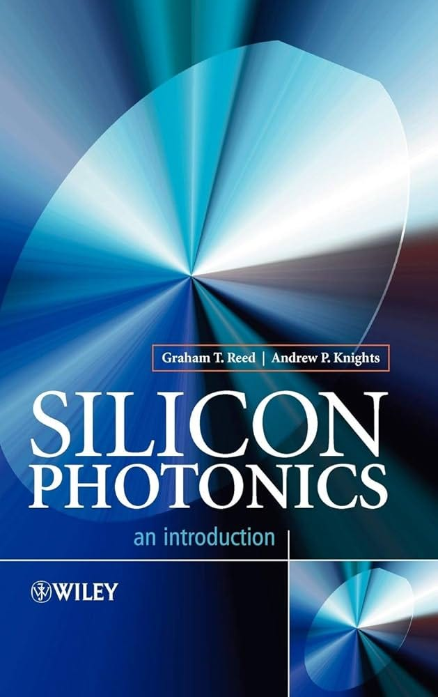
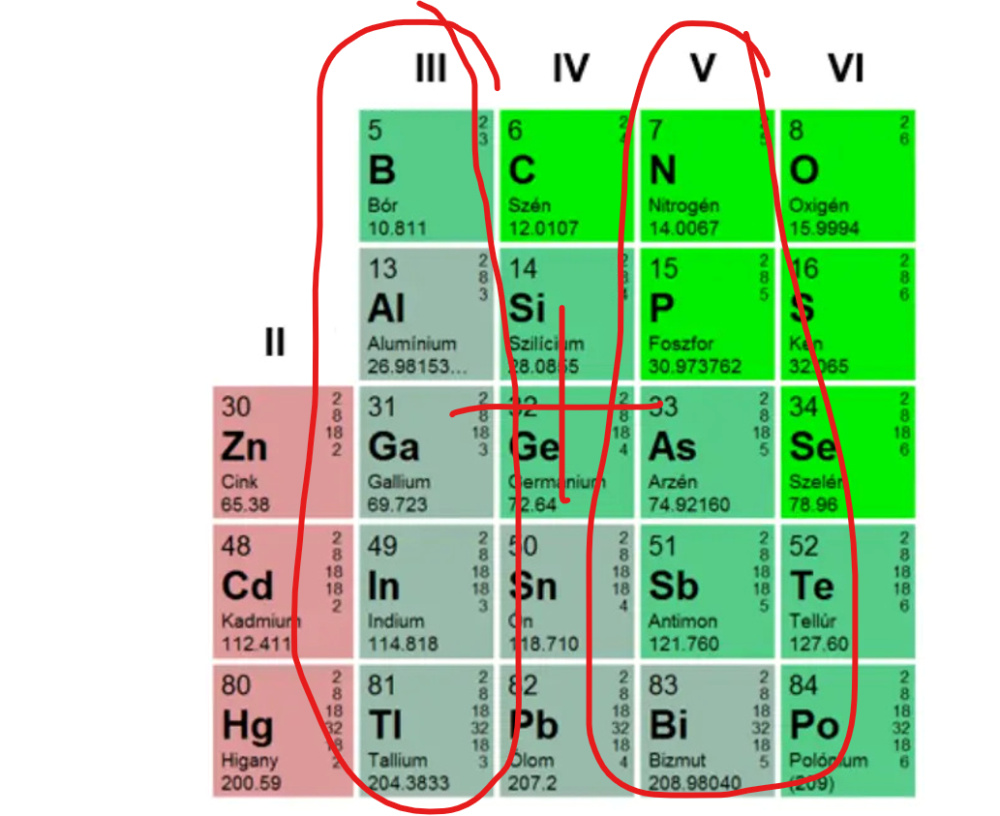
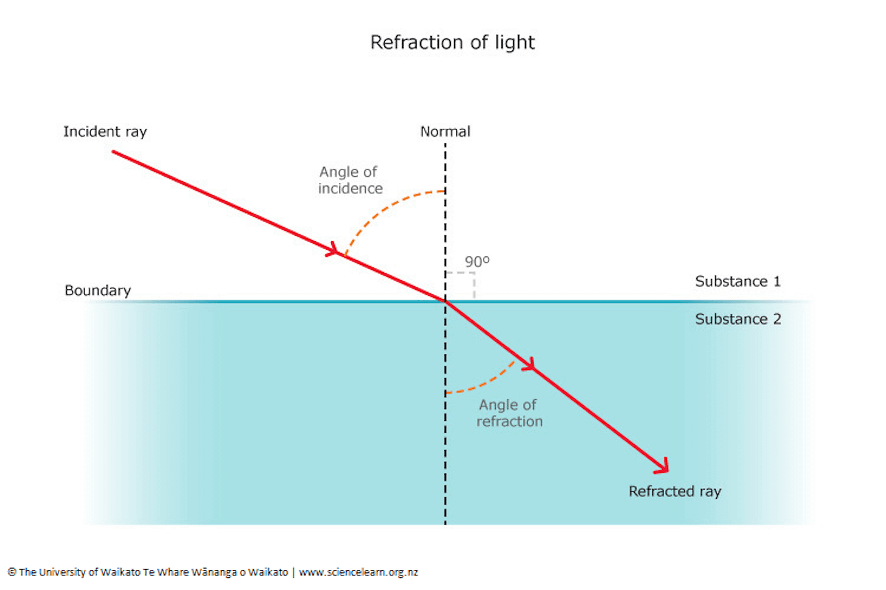
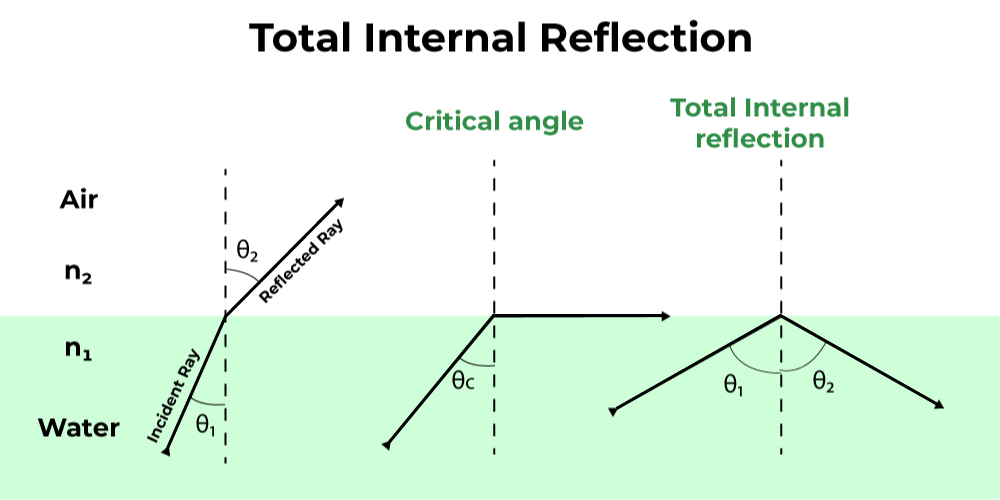
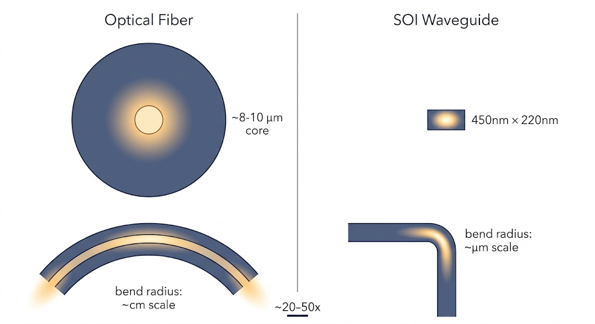
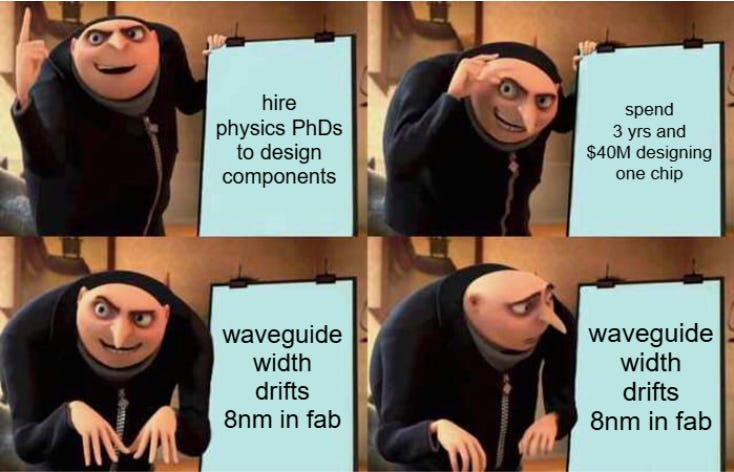

SiPho is pretty cool ngl.

#### Chapters

1. The Story of SiPho
2. The Physics of SiPho
3. Designing SiPho
4. Why You Don’t Need a Cutting-Edge Fab to Make World-Class Optical Chips
5. SiPho Stocks

---

sipho

Subscribed

*By accessing this content, you acknowledge and agree to our [terms and conditions.](https://jasonschips.substack.com/p/terms-and-conditions)*

---

## The Story of SiPho

Let me tell you a story. **About you.**

You are a brilliant engineer in the 1980’s. You have an idea. Communicating data via photons bypasses many of the physics bottlenecks of electrons.

You understand basic college chemistry. That electrons which get excited then fall back to a lower energy state release photons. So you intuitively connect the dots.

> *If I can get electrons in a semiconductor to do that on demand, I have a light source. And if I have a light source, I can build an optical communication system on a chip.*

You already work with silicon. Every fab in the world runs on silicon. It is cheap, abundant, and the manufacturing ecosystem around it is the most sophisticated industrial apparatus humanity has ever built. So naturally, you reach for silicon first.

***It doesn’t work.***

In a semiconductor, electrons occupy specific energy bands, when it fall and make photon, it has to conserve two things simultaneously: energy and momentum. Conservation of energy is what is **the maker of the photon**. Conservation of momentum is what is **bad**.

In what’s called a direct bandgap material, like gallium arsenide, the lowest point of the conduction band and the highest point of the valence band **sit at the same crystal momentum**. The electron can fall straight down, release its energy as a photon, and call it a day.

Silicon is indirect bandgap.

The valleys don’t line up. An electron trying to make that transition has to change its momentum at the same time as it changes its energy.

Instead of emitting light, **silicon bleeds its energy away as heat**.

So you open up the ol’ periodic table and put on a stronger pair of reading glasses. You eventually find…

The III-V compound semiconductors have the direct bandgaps you need.

You want to transmit data over fiber, and fiber has two specific windows where glass is nearly transparent and signal travels long distances without falling apart: 1310nm and 1550nm, a.k.a. the **O-band**. You need a material whose bandgap aligns with those windows, so when *the electron does the falling down, the photons are of the right wavelength.*

That material is indium phosphide. InP. It lases efficiently at exactly the wavelengths you need, almost as if the universe designed it for the job.

Then someone asks how much it costs to scale.

InP wafers come in 2-inch and 4-inch diameters. Silicon wafers are already at heading to 12in which is roughly 50 times the area.

InP is brittle. The fabs that process it are so small and specialized you might as well **hire artisans to make it by hand.**

You stare at the problem for a long time.

And then you have a second idea.

What if InP only has to do the one thing silicon can’t? What if the laser stays on InP but everything else moves back to silicon?

Think about what “everything else” actually means. Once you have light, you need to route it from one place to another. You need to split it into multiple paths. You need to modulate it (flicker it) to encode data. You need to filter specific wavelengths. You need to receive it at the other end and convert it back to an electrical signal. **None of those functions require a direct bandgap material.** None of them require InP. They require a thing that can confine and manipulate light precisely, at scale, with manufacturing discipline.

That Thing is Silicon Photonics.

---

## The Physics of SiPho

SiPho chip is like water slide.

[ - All You MUST Know Before You Go (w/  Reviews & Photos)")](https://substackcdn.com/image/fetch/$s_!F74s!,f_auto,q_auto:good,fl_progressive:steep/https%3A%2F%2Fsubstack-post-media.s3.amazonaws.com%2Fpublic%2Fimages%2F13e98931-4f35-4b4e-9da8-de228e893f66_1200x1200.jpeg)

The light travels through “waveguides” on the silicon, which must confine and route light without losing it.

Light does not naturally stay put on a flat piece of silicon. Making it do so requires exploiting the **refractive index**.

The refractive index of a material describes how much it slows light down relative to a vacuum. High refractive index mean *light go slow*. Low refractive index mean *light go zoom*.

At boundary between high and low refractive index material, something cool happen. If the light hits the surface, it refracts and changes direction.

However, if it hits the surface at a shallow enough angle, light literally bounces and doesn’t cross the boundary, achieving **total internal refraction**.

What are the different materials we will use? ***Enter the SOI wafer.***

The bottom layer is the **handle layer**. It is just there for structural reasons. It is roughly **700 microns** thick. The handle gives the wafer enough mechanical rigidity to survive being picked up, spun, etched, and transferred through a fab without shattering. Optically and electrically, it is nearly irrelevant to the photonics happening above it.

The middle layer is the **Buried Oxide**, a.k.a. **BOX**. It is made of silicon dioxide, SiO₂, typically ranging from about **1 to 3 microns** thick (for photonics specifically). So in reality, my drawing is not to scale at all. Handle layer is *a lot thicker* than the BOX.

The top layer is the **device layer**. This is the thin crystalline silicon on top, and this is where everything happens. For standard telecom-wavelength (O-band) silicon photonics device layer is around **220nm** thick. So this is the thinnest layer by far. Every waveguide, modulator, coupler, splitter, and resonator on a SiPho chip gets patterned out of this *thin* *ahh film*.

Silicon on the device layer has a refractive index of approximately **3.45** at 1550nm. Silicon dioxide in the BOX layer has a refractive index of approximately **1.44**. Air, which sits above an unclad waveguide, is **1.0**. That contrast between silicon and oxide, 3.45 versus 1.44, is enormous. For comparison, a standard silica fiber has a core-to-cladding contrast of roughly 1.45 versus 1.44, a difference of less than one percent. *SOI’s contrast is more than 100 times larger.*

The **“mode”** of the light is basically how wide the electromagnetic field “presence” of the light is allowed to spread out. Basically does it take up a lot of space?

In a good ol’ cable of fiber, light is weakly confined because of the low refractive contrast. It’s lazy and spreads across a core that is roughly 8 to 10 microns in diameter. Because it takes up so much space, its not flexible and bending that fiber too sharply causes the mode to leak out, which is why fiber bend radii are measured in millimeters or centimeters.

SOI is purposefully built to squeeze light into a very small and strict and claustrophobic waveguide. The cross-section of the waveguide tunnel is roughly 450nm wide and 220nm tall. **The confinement is so tight that you can bend the waveguide in a radius of just a few microns without meaningful loss**. It’s the difference of trying to turn a large freight train vs a small rollercoaster car.

Tight confinement is what makes a silicon photonics chip dense. It is what lets a single chip force light through lots of twists and turns, split and combine wavelengths, and integrate modulators and detectors in a compact area. Without the high index contrast of SOI, none of that integration density is achievable. You would need a chip the size of a dinner plate to do what currently fits in a few square millimeters.

---

## Designing SiPho

Designing SiPho is really hard. Good thing I’m not an engineer!

**Tiny little variation in waveguide width shifts the effective refractive index of that waveguide, which changes how the light moves around the chip and how much of the light makes it off the chip and into the actual communication.**

Therefore, in the dark ages, fabless companies used to hire teams of physics PhDs to solve physics PhD level math just to design a single component inside one chip.

The light at the end of the tunnel (get it) was the Process Design Kit or PDK.

A PDK is the library of pre-characterized, foundry-verified building blocks that a designer assembles a chip from. It’s like programming using Pandas in Python instead of mashing out assembly.

Every component in the PDK — straight waveguides, bend radii, directional couplers, grating couplers, ring resonators, Mach-Zehnder modulator arms — has been electromagnetically simulated, fabricated, measured, and reduced to a compact model that accurately predicts its behavior across process variation. The designer does not solve Maxwell’s equations. They pull verified components from a catalog, connect them together in a layout tool, and simulate the system response using those pre-validated models.

This shift matters for the supply chain because it makes the foundry sticky! If my engineers design using your PDK, I must admit it. **You’ve got me**.

---

## Why You Don’t Need a Cutting-Edge Fab to Make World-Class Optical Chips

Complicated physics means advanced process and small transistors right? actually no.

The reason is wavelength.

Telecom light at 1310nm and 1550nm is small compared to you but large compared to leading edge logic features. You need the width of the waveguide water slides to at least be wide enough to hold the light.

Therefore you run this stuff on 65nm nodes. There is no need for EUV and stuff. You can run this stuff on depreciated equipment.

## SiPho Stocks

#### Tower Semiconductor

Tower Semi towers over the competition.

[

#### Tower-ing Over the Competition

[Jason's Chips](https://substack.com/profile/112809522-jasons-chips)

·

Mar 13

[Read full story](https://jasonschips.substack.com/p/tower-ing-over-the-competition)](https://jasonschips.substack.com/p/tower-ing-over-the-competition)

They have majority share of SiPho content in transceivers. They have a much better process than GlobalFoundries, like TSMC does to Samsung.

#### Soitec

They make the SOI wafers we talked about. SOI is used in mobile and industrial applications too so they are not a photonics pure play. They own the Smart Cut IP which makes 80% of all SOI wafers. And they seem to be the only ones producing SOI for photonics at scale because it’s harder.

[

#### The Soitec Series | Part (1/7): Introduction to the French Photonics Substrate Monopoly

[Jason's Chips](https://substack.com/profile/112809522-jasons-chips)

·

Mar 10

[Read full story](https://jasonschips.substack.com/p/the-soitec-series-part-17-introduction)](https://jasonschips.substack.com/p/the-soitec-series-part-17-introduction)

---

## Thanks for Reading!

I hope you have a great day.

Subscribed

If you enjoyed, please like, comment, restack or share. It helps a lot.

[Share](https://www.jasonschips.ai/p/short-n-casual-intro-to-sipho?utm_source=substack&utm_medium=email&utm_content=share&action=share&token=eyJ1c2VyX2lkIjoxNDAwMjQ1LCJwb3N0X2lkIjoxOTE0MzIyMjcsImlhdCI6MTc3NDgwODMwOSwiZXhwIjoxNzc3NDAwMzA5LCJpc3MiOiJwdWItNjY2NDM1NiIsInN1YiI6InBvc3QtcmVhY3Rpb24ifQ.LP0AyvJfCUwpxwy9rP6Vj7sdmj4pm6PhRSOOZInHrGU)