So, I’ll introduce you all to a fun little method I use to study up on stocks.

Step 1: **Find alpha-rich source material you can’t bother to read.** This can be an earnings call transcript, conference presentations, or just really technical writeups if you’re a finance native like me.

Step 2: **Open up NotebookLM and dump your stuff into a notebook.**

Step 3: **Make a podcast.** This involves picking the specific sources you’d like to include, selecting length (I usually do “long” which is 30-50 minutes), and telling the AI hosts to explain to an audience of your background.

[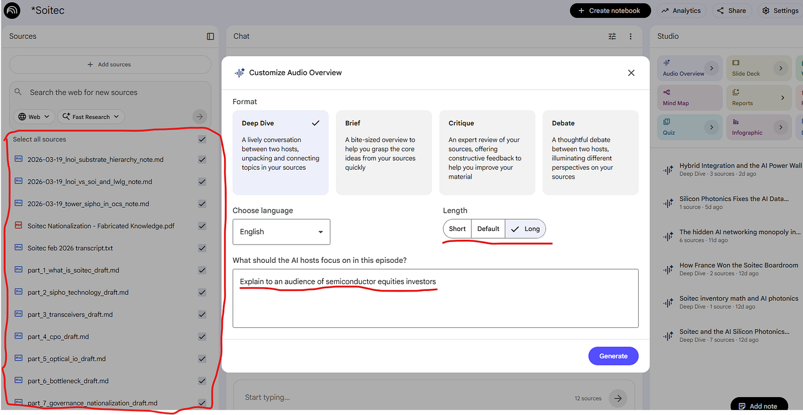](https://substackcdn.com/image/fetch/$s_!7Jdl!,f_auto,q_auto:good,fl_progressive:steep/https%3A%2F%2Fsubstack-post-media.s3.amazonaws.com%2Fpublic%2Fimages%2F41de1186-0e19-4524-ba43-7ff907ca18eb_1740x900.png)

Step 4: **Listen to your slop podcast.**

I listen to like 2-3 hours of these podcasts a day. Yes, that’s right, 2-3 hours of fake AI-generated robotic uncanny valley slop podcasts while I’m eating, walking, doing laundry, or laying on the floor coping with my port being red.

*And I’ve learned so much from them that to me, it’s the greatest thing since sliced bread.*

You’re welcome, Google for the free ad.

Anyways why do I say this? Because the first 5 minutes of every single AI podcast about optics is the **exact same** and is **super annoying**. It goes something like:

> “For years we have connected datacenters using copper.”
>
> “Yes”
>
> “But now, copper is hitting a wall as you try to push bandwidth and reach.”
>
> “Absolutely”
>
> “So, we must now pivot to light!”
>
> “You’re so right”

Except for like 5 minutes straight.

But if you zoom out, *this is exactly what is happening.*

It comes in stages. I planned to introduce this concept in the meat of my Soitec series but Lumentum execs have now put this concept squarely into the hands of the market so I will address it here.

[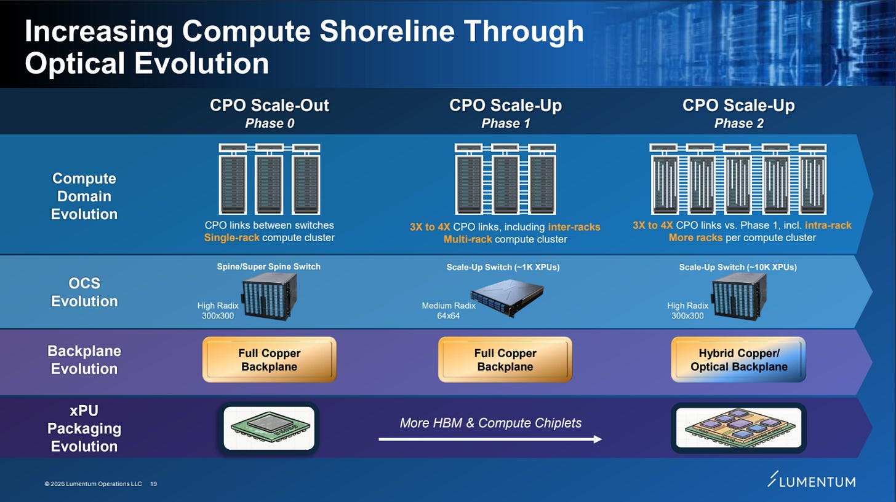](https://substackcdn.com/image/fetch/$s_!c_kQ!,f_auto,q_auto:good,fl_progressive:steep/https%3A%2F%2Fsubstack-post-media.s3.amazonaws.com%2Fpublic%2Fimages%2F81c236c9-bf6b-4093-9621-0a3be7b8460f_1500x843.png)

Phase 0 is scale-out CPO. Linking switches of each compute cluster together.

Phase 1 is inter-rack scale-up CPO. Linking together neighboring racks using CPO on the switch tray to expand the “one big chip” scale-up domain.

Phase 2 is intra-rack scale-up CPO. Each GPU talks all-to-all across the scale-up domain using light.

And importantly, each is **half an order-of-magnitude larger** than the last.

[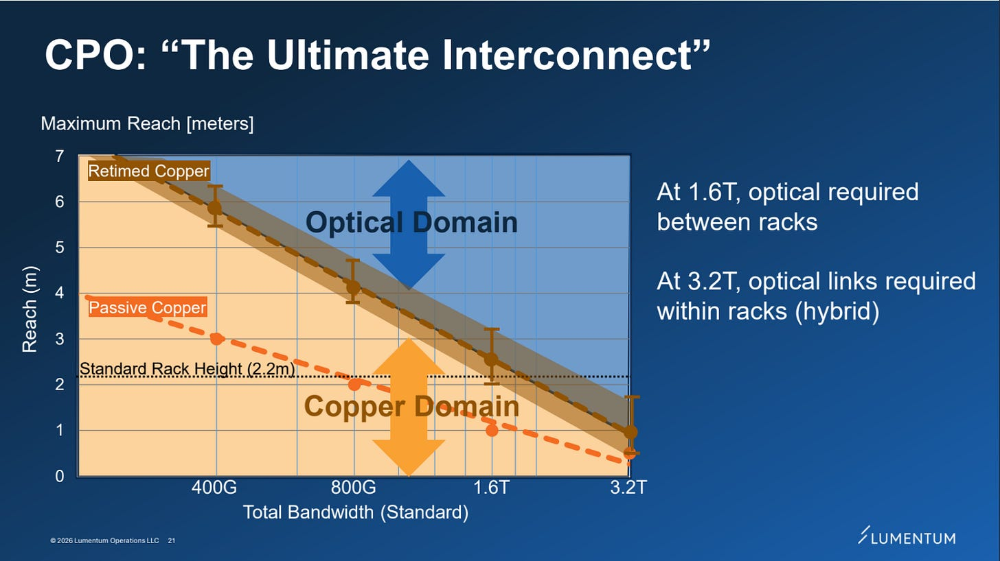](https://substackcdn.com/image/fetch/$s_!aC1Q!,f_auto,q_auto:good,fl_progressive:steep/https%3A%2F%2Fsubstack-post-media.s3.amazonaws.com%2Fpublic%2Fimages%2Fa7fdb0ce-93dc-4ea4-8631-8968f6cacb23_1501x843.png)

Two of the most predictable trends in datacenters are the migrations to higher bandwidths and larger compute clusters (requiring longer reach).

The first breaks copper via the skin effect. Sending too much data causes electrons to hug the edge of the copper wire instead of using the cross section, requiring copper wires to be wider and wider until they are huge uneconomical pipes.

The second breaks copper via insertion loss. Signal integrity degrades severely over long-distance copper.

Copper replacement occurs in phase 1 and phase 2 (scale-up CPO) only. Scale-out CPO only replaces pluggable transceivers, which are optical already. **Scale-up is the real TAM expansion opportunity for optics and is an order-of-magnitude larger.**

[

#### The Lumentum Series | Part 2: Co-Packaged Omnipotence

[Jason's Chips](https://substack.com/profile/112809522-jasons-chips)

·

Jan 12

[Read full story](https://jasonschips.substack.com/p/the-lumentum-series-part-2-co-packaged)](https://jasonschips.substack.com/p/the-lumentum-series-part-2-co-packaged)

My prior Lumentum CPO article was mostly describing scale-out CPO. Today I address the much larger and more important topic of scale-up.

***And why I move Lumentum back to Top Pick, over Soitec and Aixtron.***

#### Chapters

1. Laser Tech and the Earned Monopoly
2. Phases of CPO
3. Kyber vs Oberon
4. The Guidance is Absolutely Bonkers and it’s Not Why You Think
5. Insanely Complicated CPO Laser Revenue Build & EPS Forecast

---

subscribe to my cool newsletter about chips and stuff

Subscribed

*By accessing this content, you acknowledge and agree to our [terms and conditions.](https://jasonschips.substack.com/p/terms-and-conditions)*

---

## Laser Tech and the Earned Monopoly

Special thanks to Irrational Analysis as he has been pounding the table on the chain of logic from laser tech to Lumentum’s moat for a while. A lot of what I say here is rehashing his analysis. If you’re reading my work I assume you know Irrational already, but if you don’t, you must read his work as he is truly peak.

[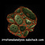Irrational Analysis

Practical Datacom Lasers

Irrational Analysis is heavily invested in the semiconductor industry…

Read more

2 months ago · 111 likes · 32 comments · Irrational Analysis](https://irrationalanalysis.substack.com/p/practical-datacom-lasers?utm_source=substack&utm_campaign=post_embed&utm_medium=web)

Lumentum is an earned monopoly because they are capable of making the high-power low-noise lasers needed for all CPO.

#### How a DFB Laser Works

So basically there are two kinds of lasers.

**Vertical-Cavity Surface-Emitting Lasers (VCSELs, pronounced vik-sel)** emit light from **vertically**… from a **cavity**… on the **surface**. Lol.

**Distributed Feedback (DFB)** lasers emits light horizontally through a bunch of tiny mirrors that bounce it in a feedback loop to get a really concentrated and clean beam.

[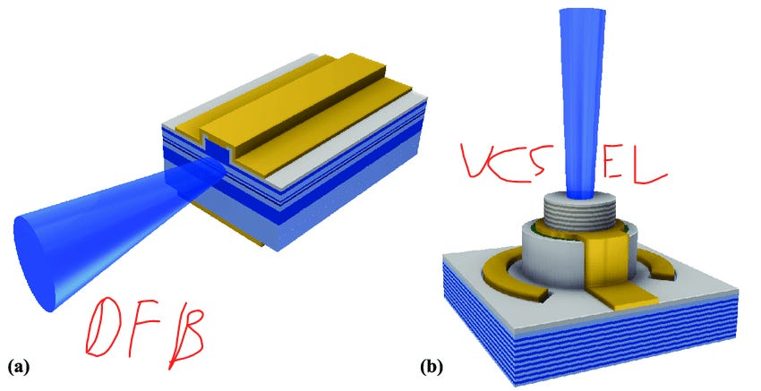](https://substackcdn.com/image/fetch/$s_!mytW!,f_auto,q_auto:good,fl_progressive:steep/https%3A%2F%2Fsubstack-post-media.s3.amazonaws.com%2Fpublic%2Fimages%2Feeee0c3d-1a9c-448a-81a9-b36dd67acb0e_850x437.png)

Some quick facts:

1. Reach

   1. VCSELs mostly use Gallium Arsenide (GaAs) and thus are short reach as GaAs can’t emit the O-band light needed to travel long distances in glass fiber.
   2. DFBs use good ol’ Indium Phosphide (InP) and thus are long-reach since the wavelength it emits is O-band and can survive long trips through glass.
2. Reliability

   1. VCSEL reliability breaks down at high data rates because they turn on and off super fast. Think about taking a car engine and running it at 50mph vs 200mph.
   2. DFBs have high reliability because they emit light continuously and instead are modulated from the outside.

Thus, DFB are the only laser type suitable for most datacenter applications going forward. We can forget about VCSELs and focus only on DFBs.

#### Why High Power?

If you heat up your lasers they will stop working. GPUs are hot. Co-packaged optics means co-packaging optics with the GPU. As you can see there is problem.

So ok. Let’s put the laser outside in an External Light Source (ELS) module and only have the optical engine (all the non-laser stuff) co-packaged. Laser stay cool.

Not so fast! Since the light has to travel through a bunch of stuff to get from outside to inside it suffers from insertion loss and the final light beam is really weak.

Well fine then. I guess we have to increase the number of lasers.

Not so fast! To maintain signal integrity, the light traveling from the laser to the optical engine has to stay in a consistent orientation — consistent polarization. This means every laser requires polarization-maintaining fiber, which is expensive, and the process of attaching it is painstaking and yield-sensitive. We must minimize the number of PM fiber connections per system at all cost, which means using only one laser.

Ah I see. The only solution is **ULTRA-HIGH POWER LASER!!!!!!!!**

#### Why Low Noise?

Think of **linewidth** as the pureness of the color of the laser. If you need a red laser beam you don’t want the light to have any hints of green. Narrow linewidth means your red laser is very, very red.

**Relative Intensity Noise (RIN)** is the **noise** of the **relative intensity** of the laser! So how much the output power fluctuates.

Why are these important? Because your laser is playing a very stupidly hard game of telephone with the receiver on the other end.

[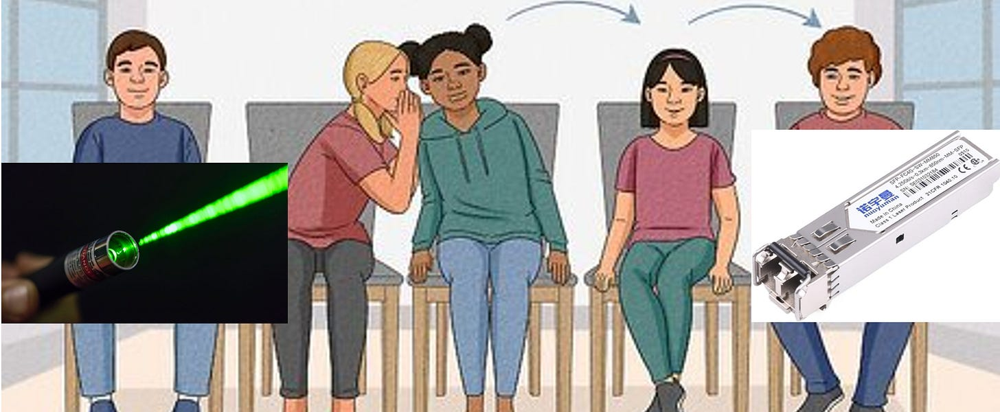](https://substackcdn.com/image/fetch/$s_!GRT4!,f_auto,q_auto:good,fl_progressive:steep/https%3A%2F%2Fsubstack-post-media.s3.amazonaws.com%2Fpublic%2Fimages%2Fc4bc6bb2-e251-4ef6-94c3-db8a60b4b9e8_1480x610.png)

You must encode bits of data in the light by modulating it so the receiver can detect the data by reading what you’ve modulated into the light stream. If your laser introduces its own noise, **it’s like the first kid in the game of telephone having a lisp**. Your bit error rate (BER) spikes and the link drops.

#### Lumentum Mogs

The reason why this is all good for Lumentum is that the combination of high power and low noise is VERY HARD. Increasing laser power generally makes it noisier. Most makers of lasers can have one but not both.

Noise is caused by defects. The way to reach the holy grail is basically **extreme quality**. You just have to get really good. It takes decades of process learning like TSMC’s high leading edge logic yields.

Lumentum has completed this exact process learning through making lasers for subsea telecom applications. Like the lasers for the fibers that run under the Atlantic so the internet works.

If you snoop around in Lumentum earnings transcripts you’ll see them trying to hint at their ultra-high market share wherever low noise lasers are required.

> Ryan Koontz (Managing Director and Research Analyst)
>
> *“That’s great. Exactly what I was hoping to hear. And then maybe shifting gears maybe to **narrow linewidth** lasers for the DCI element. Is that a different set of competitors? Obviously, a different set of customers, but can you kind of educate us a little bit on the competitive environment for the narrow linewidth lasers for coherent? Thank you.”*
>
> Michael Hurlston (President and CEO Lumentum)
>
> *“Yeah, I’ll maybe give some comments and then throw it to Wupen. We have very strong market share here, right? **I think our competitive landscape is more limited**, perhaps, in this area than many of those we participate in. To your point, Ryan, the customer base is different. These are more of the traditional telecom guys that now have shifted and pivoted their business toward the hyperscalers. And so we’re providing solutions to all of those guys in our narrow linewidth offering. But we have, Wupen even correct me if I’m wrong, **very, very high market share here and a strong competitive position**.”*

And they are the only laser maker to explicitly advertise their noise specs.

[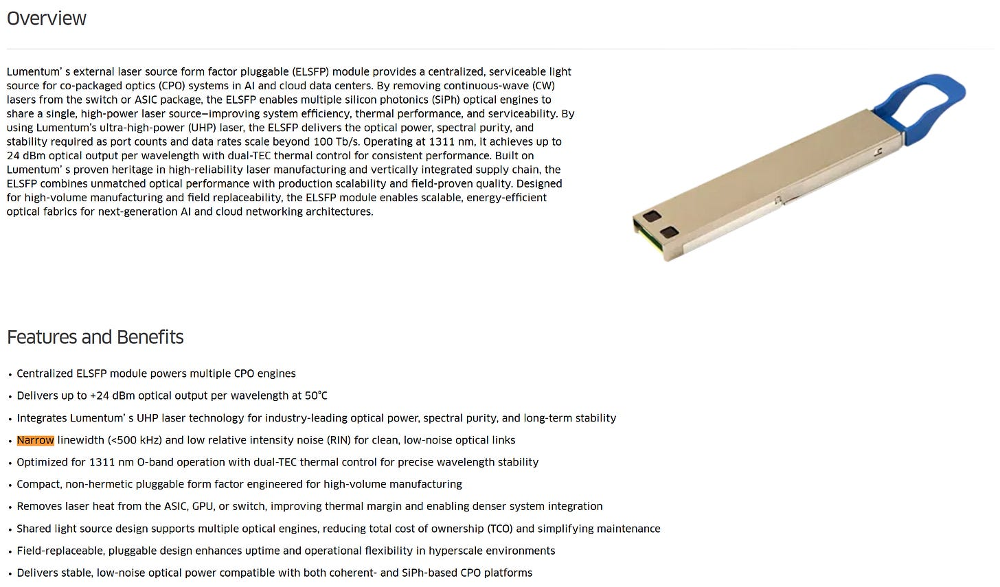](https://substackcdn.com/image/fetch/$s_!7AcJ!,f_auto,q_auto:good,fl_progressive:steep/https%3A%2F%2Fsubstack-post-media.s3.amazonaws.com%2Fpublic%2Fimages%2Fe2887eab-a019-4844-b74f-edf1b4ab3075_2358x1385.png)

Lumentum mogs, truly.

## Phases of CPO

CPO comes in several different waves, each larger and penetrating deeper into the rack than the last.

The easiest way to understand scale-out vs scale-up is through software.

Scale-up means you’re linking hardware in a way where the software still thinks it’s one machine. That means the connection must be BLAZINGLY fast.

Scale-out is connecting many of these “machines” via something like ethernet. Scale-out traffic crosses switch boundaries. It doesn’t need as much bandwidth, but because packets have to hop across switches, there is a bit of latency.

#### Phase 0: Scale-Out

Scale-out is already optical. This is where transceivers live. So why are we doing CPO?

Two reasons. This is pretty well covered in my previous writing.

1. The journey from the GPU to the face plate has copper → which creates signal loss → which causes a DSP to be needed → which sucks power. Scale-out CPO eliminates this annoying chip, improving power efficiency.
2. Scale-up CPO ramp is so massive that Nvidia needs scale-out CPO as a guinea pig to prime the supply chain and get reliability data.

[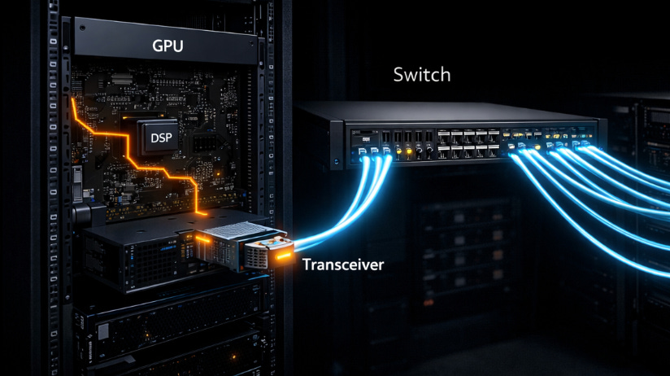](https://substackcdn.com/image/fetch/$s_!tB4u!,f_auto,q_auto:good,fl_progressive:steep/https%3A%2F%2Fsubstack-post-media.s3.amazonaws.com%2Fpublic%2Fimages%2Fd01e341e-d7f2-474e-8f1f-1ecc15264732_824x462.png)

#### Phase 1: Inter-Rack Scale-Up

Jensen doesn’t think NVL72 is enough and wants to expand the scale-out domain further. Copper can’t give you any more reach beyond NVL72 but within NVL72 it works perfectly fine. We are at copper’s reach limit but not the bandwidth limit. This is where phase 1 CPO comes in!

Take two adjacent NVL72 racks and connect them with CPO. The CPO goes on the switch tray.

[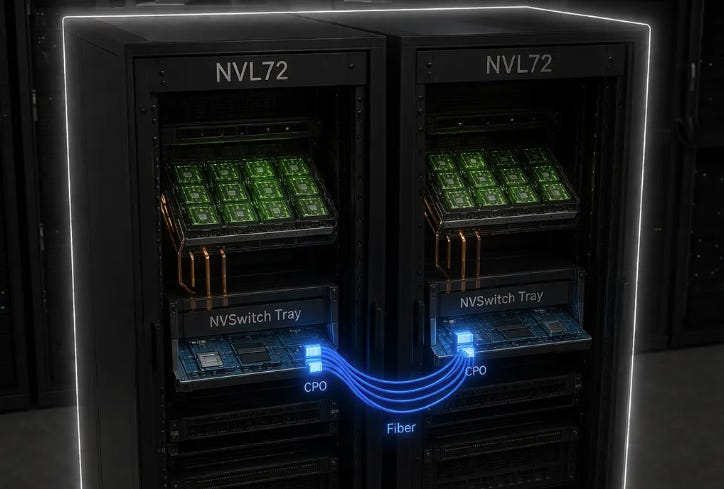](https://substackcdn.com/image/fetch/$s_!edPw!,f_auto,q_auto:good,fl_progressive:steep/https%3A%2F%2Fsubstack-post-media.s3.amazonaws.com%2Fpublic%2Fimages%2Fd5567d86-e86c-4cf1-9dfb-5c7d0a03121c_724x489.png)

#### Phase 2: Intra-Rack Scale-Up

This phase is far, far away. Optical bulls have to sit on their hands for this one.

Phase 2 CPO deployments require copper SerDes to fail. It has to reach the bandwidth limit.

When Hock Tan pushes for 400G SerDes on copper and called CPO a “bright, shiny object,” this is what he was referring to. After that earnings call there were the panic sellers then there was a bunch of analysts saying “Nooo you’re overreacting they’re not the same thing” this is what those analysts were referring to. Phase 0 and 1 are perfectly fine. It’s only phase 2 that keeps getting pushed.

So what is this mysterious endgame? Well in a sense it’s the simplest of all. It is GPU-to-GPU, all-to-all optical communication inside a single rack

[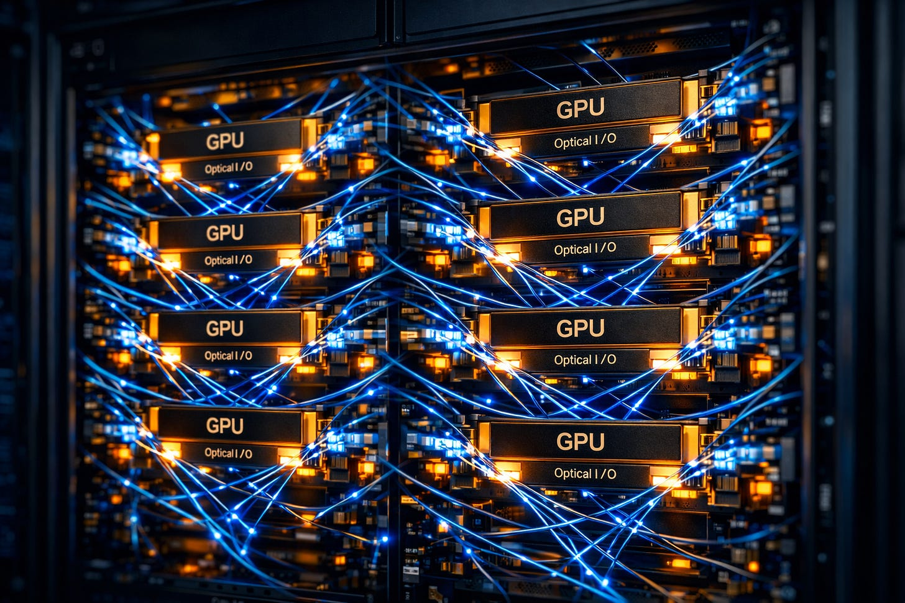](https://substackcdn.com/image/fetch/$s_!FShE!,f_auto,q_auto:good,fl_progressive:steep/https%3A%2F%2Fsubstack-post-media.s3.amazonaws.com%2Fpublic%2Fimages%2F8239bba5-dd3c-45df-9e4d-f99c793f89f4_1536x1024.png)

## Kyber vs Oberon

GTC was pretty cool.

[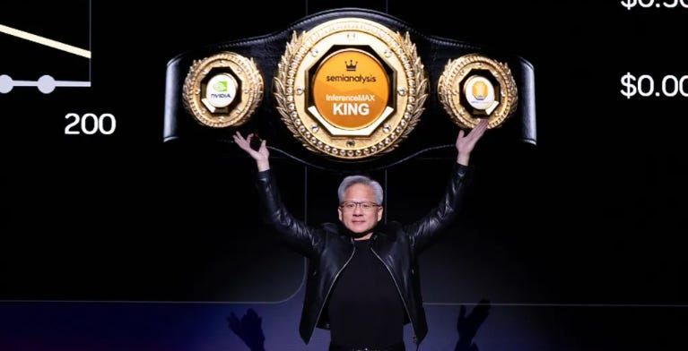](https://substackcdn.com/image/fetch/$s_!lWkA!,f_auto,q_auto:good,fl_progressive:steep/https%3A%2F%2Fsubstack-post-media.s3.amazonaws.com%2Fpublic%2Fimages%2Fb41cdd9d-18d7-4a28-a4cc-74f009afb678_767x392.png)

The most important announcement Jensen made for Lumentum is the two seperate rack architectures for the Rubin Ultra generation: Kyber and Oberon.

Both support NVL144 (for Oberon it’s called NVL576 based on the number of DIES and not PACKAGES which is weird. It’s still NVL144). NVL144 is just two adjacent NVL72 racks connected.

However, Oberon uses Phase 1 CPO while Kyber does not. Both will adopt Phase 0 though.

> Jensen Huang
>
> *"There's a lot of conversation about is NVIDIA going to copper scale up or optical scale up. We're going to do both. We're going to have NVLink 144 with Kyber, and then with Oberon, we're going to NVLink 72 plus optical to get to NVLink 576.”*

That means for each, there is a different very specific ratio of GPUs to optical engines, optical engines to ELS, and ELS to lasers I’ll get into in the modeling section.

#### Oberon

This is the incumbent regular standard rack system. Used in Blackwell and stuff.

[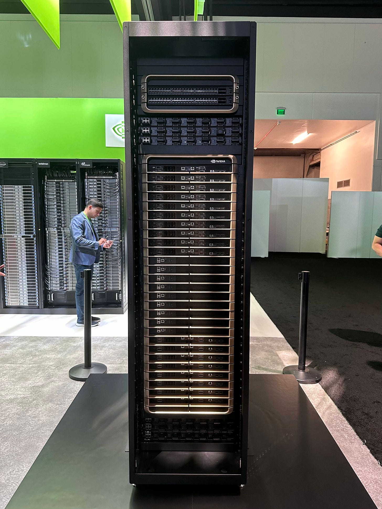](https://substackcdn.com/image/fetch/$s_!-UlB!,f_auto,q_auto:good,fl_progressive:steep/https%3A%2F%2Fsubstack-post-media.s3.amazonaws.com%2Fpublic%2Fimages%2Fed4b2082-fe87-441a-830b-593285d1c277_2972x3963.jpeg)

The reason Oberon needs optical to go to NVL144 is because you need a second rack. that’s it.

Pros:

1. Backwards compatible so you don’t have to rip and replace.
2. Modular and serviceable.
3. Known supply chain and failure modes.

Cons:

1. More floor space.
2. Multiple power/cooling endpoints.

#### Kyber

Kyber allows you to insert GPUs sideways.

[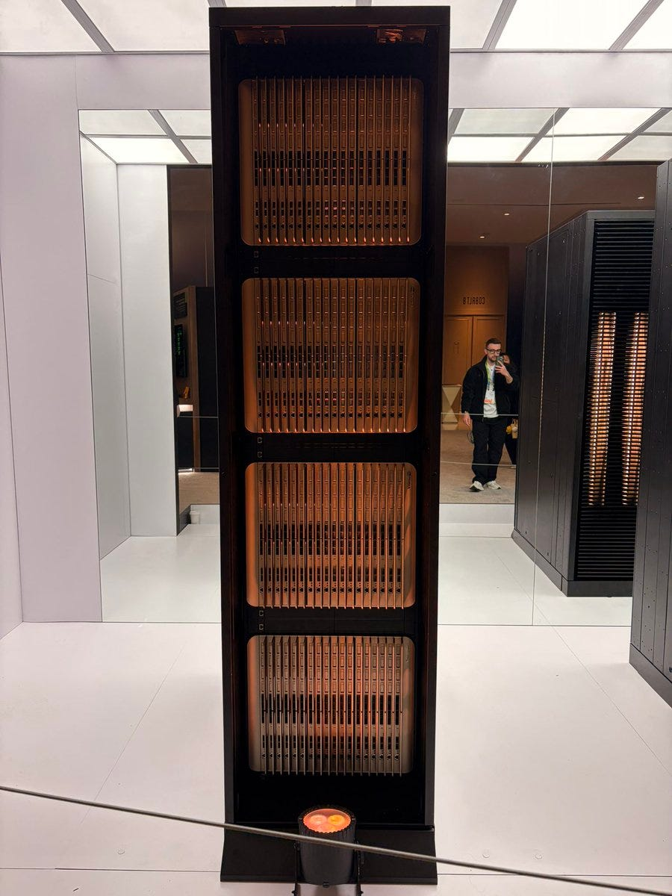](https://substackcdn.com/image/fetch/$s_!Gy2F!,f_auto,q_auto:good,fl_progressive:steep/https%3A%2F%2Fsubstack-post-media.s3.amazonaws.com%2Fpublic%2Fimages%2Fad21185b-0c05-42cf-9ae5-27463a0b8fb1_900x1200.jpeg)

Why do this? Because you can fit all 144 GPUs in one rack. Yes, the rack is bigger but now it’s possible. So therefore, you won’t need optical.

How is this possible? Take a lookie:

[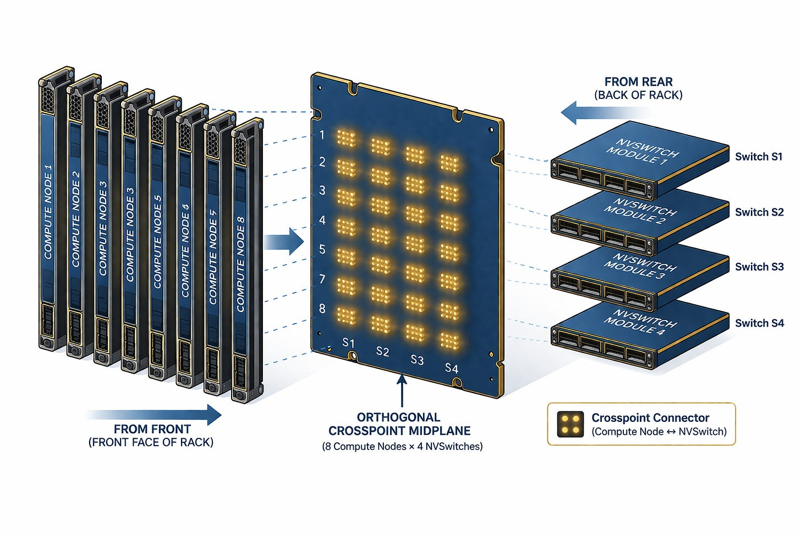](https://substackcdn.com/image/fetch/$s_!KQOl!,f_auto,q_auto:good,fl_progressive:steep/https%3A%2F%2Fsubstack-post-media.s3.amazonaws.com%2Fpublic%2Fimages%2Fe50baad7-4f0b-4d03-9189-b924b5c20fc5_1536x1024.png)

GPUs go in vertically from the front. NVSwitch modules go in horizontally from the back. They meet in the middle via orthogonal midplane. Super compact! Save space!

Pros:

1. Save floor space.
2. One power draw and cooling loop.
3. No optical requirement.

Cons:

1. Orthogonal midplane yields are really bad.

Much of the adoption is about whether those midplane yields can improve. Which means midplane yields are the enemy of CPO, at least in the near term.

## The Guidance is Absolutely Bonkers

The guidance is absolutely bonkers.

[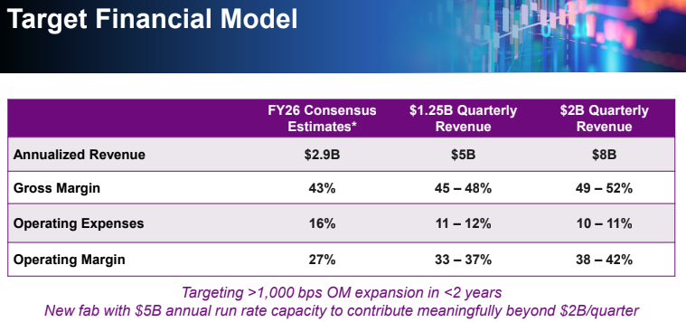](https://substackcdn.com/image/fetch/$s_!jMnf!,f_auto,q_auto:good,fl_progressive:steep/https%3A%2F%2Fsubstack-post-media.s3.amazonaws.com%2Fpublic%2Fimages%2F4cf315a2-a01e-4eca-94fb-dc4ba419b312_759x356.png)

At OFC, Lumentum said they will have $5b revenue run-rate within 9-12 months (so YE 2026) and $8b revenue within 18-24 months.

Some of you may have seen my models (or those of other creators) and concluded that $8b does not sound like a lot.

[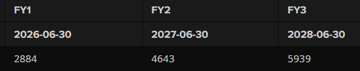](https://substackcdn.com/image/fetch/$s_!7VxO!,f_auto,q_auto:good,fl_progressive:steep/https%3A%2F%2Fsubstack-post-media.s3.amazonaws.com%2Fpublic%2Fimages%2F660f1eff-4dae-4db6-ace5-eb61af186223_615x122.png)

If you go off the sell-side numbers you might say:

> *“hmm, $8b run rate in 18-24 months means EOY 2027, which means FY Jun-28 should have around $8b in revenue. That’s only 33% above sell-side. We’ll definitely get revisions, but that’s not bonkers!”*

The reason this is a lot better than it looks is because that $8b comes with **many caveats that push the real number very far towards the upside**.

They really are trying hard to be humble, it’s kind of funny.

First of all, 9 and 18 months is their internal case, 9-12 and 18-24 is just their conservative public-facing targets. Cue Wajid:

> Wajid Ali (CFO Lumentum)
>
> *“if you take a look at what we internally believe and what our customers are asking for and what we’re ramping up our own internal capacity for, and you were to say, okay, how long would it take for us to achieve each one of these targets from a run rate standpoint, we would say nine months and nine months.”*
>
> *“we think it is prudent and measured to add three months in the range to each one of those targets”*
>
> *“the internal team is doing everything possible to make sure that we beat even the low end of those targets”*

Second of all, they announced acquiring a massive brownfield fab from Qorvo completely dedicated to CPO lasers **capable of $5 in annual revenue**.

[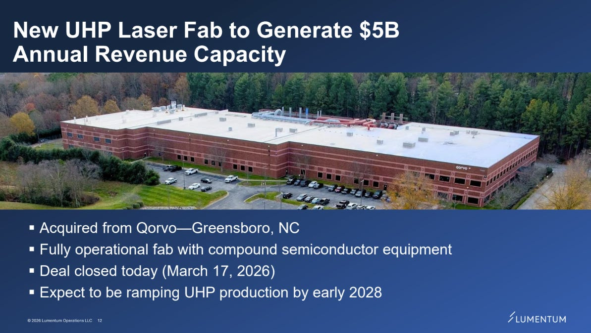](https://substackcdn.com/image/fetch/$s_!Svoo!,f_auto,q_auto:good,fl_progressive:steep/https%3A%2F%2Fsubstack-post-media.s3.amazonaws.com%2Fpublic%2Fimages%2F1bcde0e8-d836-488a-87ff-d5d5d9787c0d_1193x674.png)

And what do they say about the fab?

> Wajid Ali (CFO Lumentum)
>
> *"the capacity for Greensboro is not included in any of these numbers that we're talking about here. And yet, the multi-billion dollar agreement that we have with NVIDIA requires that Greensboro fab. So, none of that potential revenue and capacity is in any of these numbers. And the reason for that is because we're not talking about calendar 28 yet."*

The fab isn’t included in their guidance. That’s fine and dandy. But the best part is the Nvidia purchase order (remember the order that came with the $2b investment in early March?) REQUIRES this fab. So none of THAT revenue is here either! And as you will see in my model, Nvidia is one of, if not the, most important revenue stream for Lumentum.

Third of all, Phase 1 and Phase 2 CPO aren’t included in the $8b run-rate guidance either.

[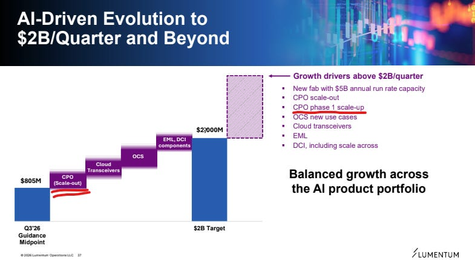](https://substackcdn.com/image/fetch/$s_!Edgt!,f_auto,q_auto:good,fl_progressive:steep/https%3A%2F%2Fsubstack-post-media.s3.amazonaws.com%2Fpublic%2Fimages%2F85c0f6c6-a668-4177-ba04-de48d31490b4_785x429.png)

> Wajid Ali (CFO Lumentum)
>
> *“many of the capital deployment decisions we’re making now, like the one we announced this morning on the Greensboro fab, are around the box to the right of the 2 billion dollars”*
>
> Michael Hurlston (CEO Lumentum)
>
> *“The first instantiation of scale up... we estimate to be three to four times larger than the initial scale out CPO. And then as we get inside the rack, which inevitably will happen, it’s a ten times larger in terms of the number of lanes that we see.”*

Uhh what? Like your ENTIRE FUTURE is excluded from your OWN GUIDANCE?

Hahahahahaha

[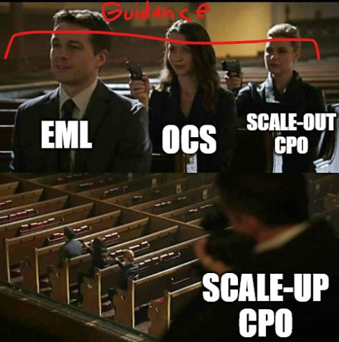](https://substackcdn.com/image/fetch/$s_!fQ11!,f_auto,q_auto:good,fl_progressive:steep/https%3A%2F%2Fsubstack-post-media.s3.amazonaws.com%2Fpublic%2Fimages%2F406c21f4-c6aa-4077-921e-bab876496336_487x491.png)

## Insanely Complicated CPO Laser Revenue Build & EPS Forecast

This took a TON of work on my part.

The most valuable takeaway you’ll have from this section is a bottoms-up build of the ELS per rack and ELS per GPU ratio for Kyber and Oberon racks.

As well as ASPs for ELS and UHP lasers.

And Oberon vs. Kyber fleet mix assumptions, Lumentum market share decay schedule as competitors qualify, ELS vs. bare chip mix ramp and its 2x revenue multiplier effect, CPO adoption rate curve for the non-Rubin Ultra switch universe, spine multiplier and switch radix assumptions for the leaf-spine fabric, and gross margin trajectory as product mix shifts toward ELS and scale-up.

Let’s try a challenge today. Given the alt data I have, I will try to be as conservative as is reasonable. For Lumentum, very challenging indeed.

Realistic conservatism though, not the sell-side “estimates” that never move.

***It turns out that even conservatism gives us incredible numbers.***

How will we be conservative?

1. First, just like Lumentum management, we’ll exclude Phase 2 CPO completely.
2. We’ll keep OCS conservative at $1.2b in 2027, assuming little to no additional orders between OFC’s $1b+ guide and 2027.

[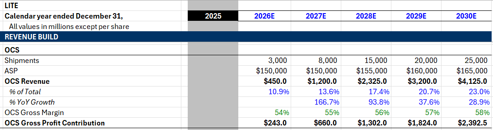](https://substackcdn.com/image/fetch/$s_!Ke49!,f_auto,q_auto:good,fl_progressive:steep/https%3A%2F%2Fsubstack-post-media.s3.amazonaws.com%2Fpublic%2Fimages%2F6a86c869-9dd2-4830-aec4-12a918c04dd6_1082x287.png)

3. We’ll keep transceivers conservative. Michael said *“Cloud Transceivers, we talked about this sort of billion-dollar cap that we were going to have. Obviously, we're blowing through that.”* That means they’re above a billion TODAY. Coherent, AAOI, etc. are projected to grow their revenue from transceivers by multiples. Lumentum is relatively better positioned as they sell higher ASP BiDi transceivers to Google. Other independent analysts like FundaAI project $3b+. I will stick this segment at $2.1b. This is barely above the $1.9b I had back in December on the second post on this Substack even after many revisions and a 100% increase in stock price.

[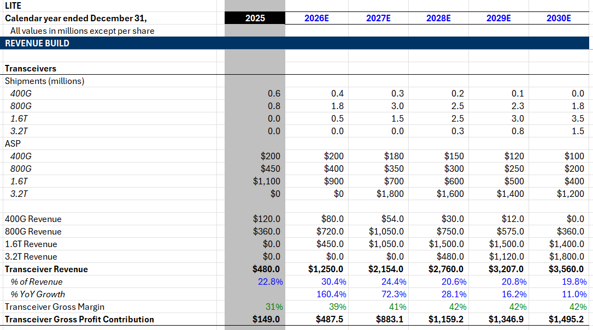](https://substackcdn.com/image/fetch/$s_!z2dZ!,f_auto,q_auto:good,fl_progressive:steep/https%3A%2F%2Fsubstack-post-media.s3.amazonaws.com%2Fpublic%2Fimages%2Ff16e170c-26c8-40be-9ccb-202408868489_1085x605.png)

Now time for CPO.

I split it up into Rubin Ultra (+Feynman) and non-Rubin Ultra (older Nvidia and non-Nvidia like AVGO).

For Rubin Ultra, we can do a fully bottoms-up build of ELS modules, and thus UHP lasers, needed for each Kyber rack and each Oberon rack.

For non-Rubin Ultra, we use CPO switch shipments.

[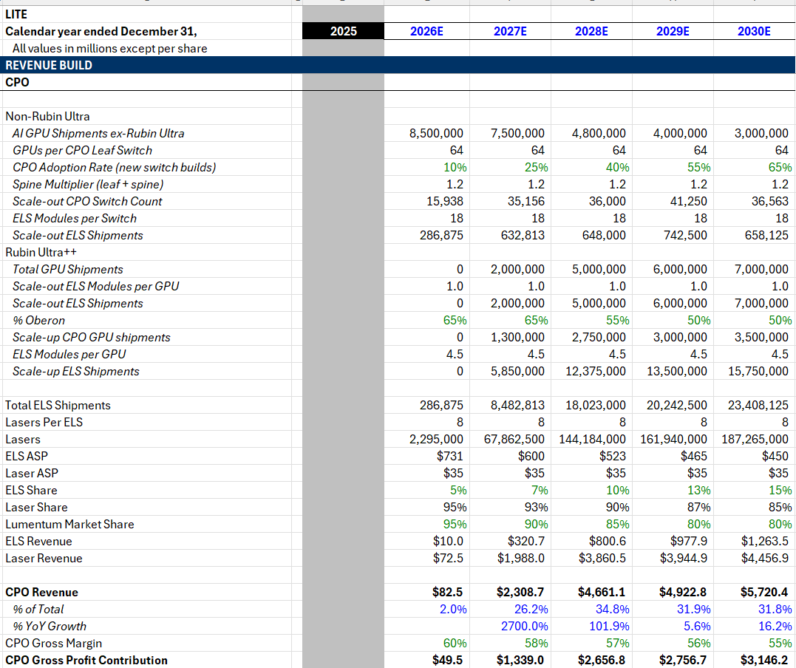](https://substackcdn.com/image/fetch/$s_!q8An!,f_auto,q_auto:good,fl_progressive:steep/https%3A%2F%2Fsubstack-post-media.s3.amazonaws.com%2Fpublic%2Fimages%2Ff0eb550b-83a2-4873-89a7-62b05509f502_1077x904.png)

It’s late and I’ve been writing for 15 hours straight so *Claude take it away*:

---

#### Non-Rubin Ultra Scale-Out

This bucket captures CPO switch demand from every AI GPU deployment that isn’t Rubin Ultra — Blackwell, plain Rubin, AMD MI-series, Google TPUs. Anything connecting to a network switch through a co-packaged optical engine.

The anchor variable is AI GPU shipments excluding Rubin Ultra. CY26 is Blackwell’s peak year at 8.5M units. CY27 steps down to 7.5M as Rubin Ultra starts displacing the lower tiers. From there the non-Rubin Ultra universe continues to shrink — not because AI slows down, but because each generation gets more powerful and the unit count compresses even as total revenue grows. By CY30 you’re at 3M units, which is the long-run tail of non-flagship silicon.

From GPU shipments, the formula is:

> Switch Count = (GPU Shipments × CPO Adoption Rate / GPUs per Leaf Switch) × Spine Multiplier

A standard high-radix CPO leaf switch serves 64 downstream GPU ports — that’s the Coherent Hammerhead and Broadcom Tomahawk-series architecture at 1.6T. For every leaf switch, the fabric needs approximately 20% as many spine switches, hence the 1.2x spine multiplier. Neither of those assumptions change over the forecast — they’re structural.

The variable that moves is CPO adoption rate: what fraction of new-build switch capacity is CPO rather than pluggable. This starts at 10% in CY26, which is consistent with Lumentum’s own framing of scale-out CPO as early-adoption with significant runway. At 1.6T lane speeds, pluggables still work but CPO becomes compelling on power and density. At 3.2T they become essentially required. The ramp goes 10% → 25% → 40% → 55% → 65% through CY30. That’s aggressive but calibrated against management’s own comment that they’re undershipping the market by 25–30% *today*, before most of that adoption has happened.

Working through the math: CY26 produces roughly 15,900 CPO switches. CY27 jumps to 35,200 as adoption accelerates. Each switch takes 18 ELS modules — 16 for data ports plus 2 for uplinks — giving you scale-out ELS shipments of 287K in CY26 and 633K in CY27.

These are real numbers, but they’re almost rounding error compared to what Rubin Ultra does.

#### Rubin Ultra GPU Shipments

The 2M Rubin Ultra GPU shipment assumption for CY27 is cross-checked two ways. First, the UBS NVDA model from February 2026 had total AI GPU units for CY27 at approximately 9.5M, of which Rubin Ultra (VR300 + R300) represented roughly 31% — implying ~2.9M Rubin Ultra packages. We model 2M, a ~30% discount to UBS that accounts for first-year production ramp dynamics and the inevitable qualification delays that accompany any new architecture. Second, back-calculating from the CY27 NVDA data center revenue consensus of ~$560B — subtract ~$150B non-data-center, leaving ~$410B — Rubin Ultra at ~$120K blended ASP per package implies ~3.4M packages at full sell-through; applying a 60% first-year sell-through rate lands at ~2M in-service. The two approaches converge, which gives reasonable confidence in 2M as the base case. From there, CY28 steps to 5M, reflecting continued ramp as Rubin Ultra reaches peak production — NVDA data center revenue trajectory from analyst consensus, including BofA's February 2026 estimate of $337B for Rubin alone in CY27, supports substantial CY28 growth, and 5M is consistent with roughly 50% growth on the installed base as Rubin Ultra becomes the workhorse architecture before Feynman begins displacing at the top end of the stack.

#### Rubin Ultra (Oberon): Phase 0 Scale-Out + Phase 1 Scale-Up

Oberon is the incumbent rack format, carried forward from Blackwell. The unit math is specific. Each CPO NVSwitch chip is co-packaged with 4.5 optical engines — the fractional half is shared with an adjacent NVSwitch chip on the same tray. Each NVSwitch tray contains 6 CPO NVSwitch chips, with every 3 chips on one PCB and two PCBs stacked per tray. The full NVL576 system requires 144 CPO NVSwitch chips total, giving:

* 144 chips × 4.5 OEs per chip = **648 optical engines** for scale-up
* Each Rubin Ultra GPGPU also has a CX10 NIC co-packaged with a 3.2T optical engine for scale-out, and there are 144 GPGPUs per NVL576, giving **144 optical engines** for scale-out
* Total optical engines per NVL576: 648 + 144 = **792**
* Optical engines per GPU package: 792 / 144 = **5.5 ELS per GPU**

Of that 5.5, **4.5 is scale-up** (the NVSwitch layer) and **1.0 is scale-out** (the CX10 NIC). The scale-up content is 82% of the optical bill per GPU. This is the number that isn’t in the consensus model.

65% of Rubin Ultra GPU packages are modeled as Oberon NVL576 in CY27, stepping down to 55% in CY28 and 50% thereafter as Kyber’s midplane yield matures. The 65% starting assumption is defensible: Oberon is backward-compatible with existing AI factory infrastructure, it’s already in production and shipping, and Jensen confirmed it explicitly at GTC. The orthogonal midplane in Kyber has real manufacturing yield challenges that will take time to work through. Oberon is the path of least resistance.

At 65% Oberon on 2M CY27 Rubin Ultra GPU shipments:

* Rubin Ultra scale-out ELS: 2M × 1.0 = **2.0M modules** (all GPUs, regardless of rack type)
* Oberon GPU packages: 2M × 65% = 1.3M
* Scale-up ELS from Oberon: 1.3M × 4.5 = **5.85M modules**
* Total Rubin Ultra ELS: **7.85M modules**

#### Rubin Ultra (Kyber): Phase 0 Only

Kyber is the new rack Jensen introduced at GTC for Rubin Ultra — compute nodes slide in vertically, NVSwitch modules slide in from the back, they meet at an orthogonal copper midplane. 144 GPUs in one rack, one NVLink domain, no inter-rack connection required. NVL144.

The optical content per GPU in a Kyber deployment is exactly the same as Oberon’s scale-out layer and nothing more. Each GPU still has a CX10 NIC co-packaged with a 3.2T optical engine for its scale-out connection to the network fabric. What disappears entirely is the NVSwitch CPO layer — because the NVLink switches in Kyber connect to GPUs through a copper midplane, not through optical fiber.

So Kyber is 1.0 ELS per GPU. Oberon is 5.5.

The 35% of CY27 Rubin Ultra GPUs modeled in Kyber contribute 700K ELS modules — all scale-out, no scale-up content. Kyber is bad for Lumentum.

#### From ELS to Lasers to Revenue

Each ELS module integrates 8 UHP laser chips — Lumentum’s published product architecture, constant across scale-out and scale-up deployments. What changes between applications is the output power per chip, not the chip count per module.

CY27 total laser chips: 8 × 8.48M ELS = **67.9M chips.** CY28, with Greensboro online and 5M Rubin Ultra GPU shipments: **144.2M chips.**

On pricing, $35 per UHP laser chip is widely confirmed in industry — it’s the number that circulates consistently across supply chain research. There’s no near-term price pressure when you’re undershooting demand by 25-30% and your backlog runs through 2027.

The ELS module economics are where it gets more interesting. Lumentum has given this figure twice, with slightly different numbers each time. On their prior earnings call they said ELS carries approximately 2.5x the revenue of the equivalent bare laser chips. At OFC they updated that to “about two times the revenue.” The step-down likely reflects the mix of customers — as more large technically sophisticated hyperscalers come into the ELS program, they negotiate harder on the integration premium.

The math makes intuitive sense: 8 laser chips at $35 each is $280 of chip content. An ELS ASP of $600 in CY27 implies a 2.1x multiple — right in the middle of what management has publicly confirmed. That $320 of premium covers the fiber routing, PM fiber attach, thermal management, TEC integration, module-level testing, and the qualification work that non-optical-native customers would otherwise have to replicate internally.

ELS share — the fraction of total volume sold as packaged modules versus bare chips — starts at 5% in CY26 and ramps to 15% by CY30. This is deliberately conservative. The anchor customers (NVIDIA, top-tier hyperscalers) have the optical engineering capability to buy at chip level and will continue to do so. The ELS module becomes more relevant as Phase 1 scale-up reaches customers further down the technical sophistication curve — the hyperscalers who don’t have Wupen’s team on speed dial. Every percentage point of ELS mix shift is a 2x revenue-per-unit event, so even a modest mix ramp has material impact on the top line.

Lumentum’s market share in UHP starts at 95% in CY26 — sole-source today, with competitors still in the qualification pipeline — and steps to 80% by CY28, where it holds. The InP fab qualification cycle at hyperscaler volumes runs a minimum of two years. 80% by CY28 is probably generous to the competition, but the direction is right and the model shouldn’t assume a permanent monopoly.

---

**Thanks Claude.** Now on to income statement and EPS.

#### Income Statement

[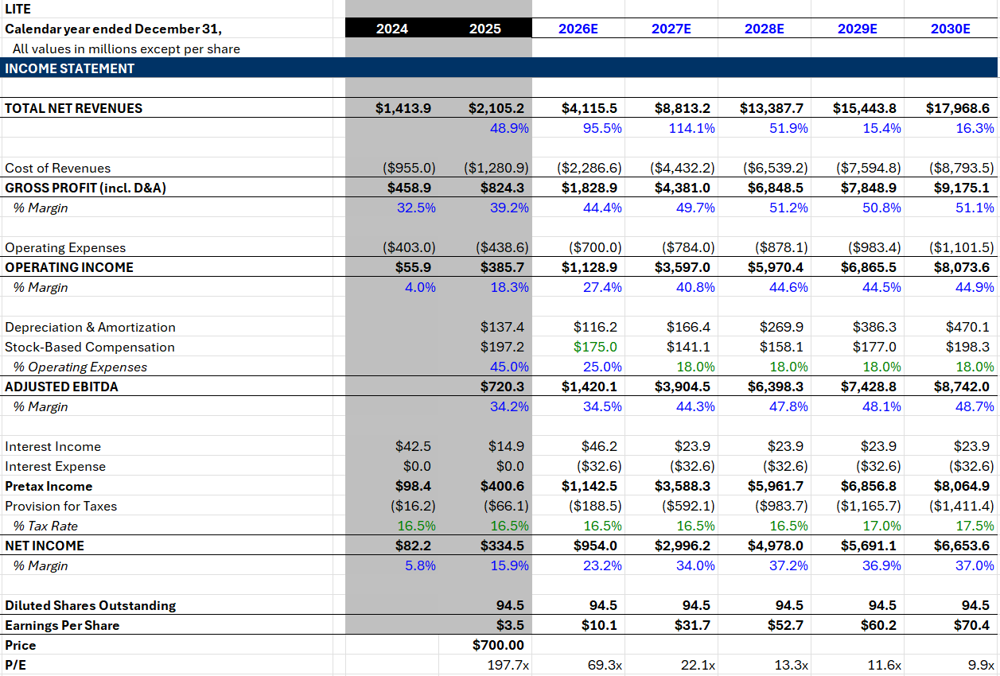](https://substackcdn.com/image/fetch/$s_!ZN81!,f_auto,q_auto:good,fl_progressive:steep/https%3A%2F%2Fsubstack-post-media.s3.amazonaws.com%2Fpublic%2Fimages%2Fc5b125c2-be29-463a-863e-2c976340e308_1257x850.png)

As you can see, in CY27, we reach over $8b in revenue. This makes sense given their guidance does not include scale-up CPO and our model did, so revenue ex-scale-up is well under $8b.

We match management’s guidance perfectly at **50% GM and 40% OPM**.

For CY27 EPS, we expect **$31.7**. This means that from a share price of $700, Lumentum trades at **22.1x forward earnings**. Not bad considering the insane growth rate you’re getting, our relatively conservative assumptions, and that intra-rack CPO isn’t considered at all!

In conclusion, Lumentum is now my top pick.

---

## Thanks for Reading!

I hope you have a great day.

Subscribed

If you enjoyed, please like, comment, restack or share. It helps a lot.

[Share](https://www.jasonschips.ai/p/the-lumentum-series-part-3-its-time?utm_source=substack&utm_medium=email&utm_content=share&action=share&token=eyJ1c2VyX2lkIjoxNDAwMjQ1LCJwb3N0X2lkIjoxOTE1MTc1MTUsImlhdCI6MTc3NDgwODI5NSwiZXhwIjoxNzc3NDAwMjk1LCJpc3MiOiJwdWItNjY2NDM1NiIsInN1YiI6InBvc3QtcmVhY3Rpb24ifQ.X5_7BxdFTxHOm8CQBHU9A2iwimFKgztQuHwyAd7XghY)