I wish this was a real product.

[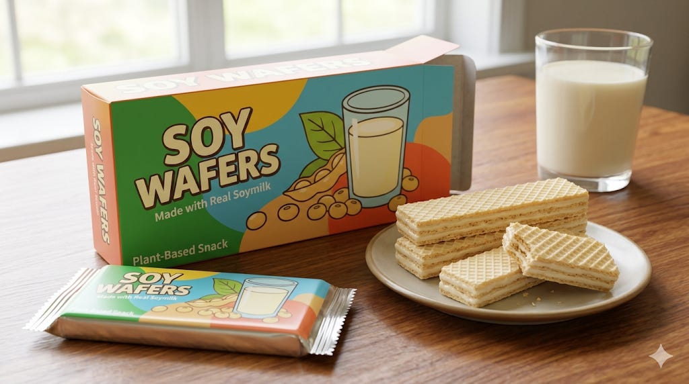](https://substackcdn.com/image/fetch/$s_!cSQU!,f_auto,q_auto:good,fl_progressive:steep/https%3A%2F%2Fsubstack-post-media.s3.amazonaws.com%2Fpublic%2Fimages%2F7a6eeb1d-a639-4d86-aa3d-9c4a9698029d_1024x572.png)

Bloom Energy already has a drink brand…

[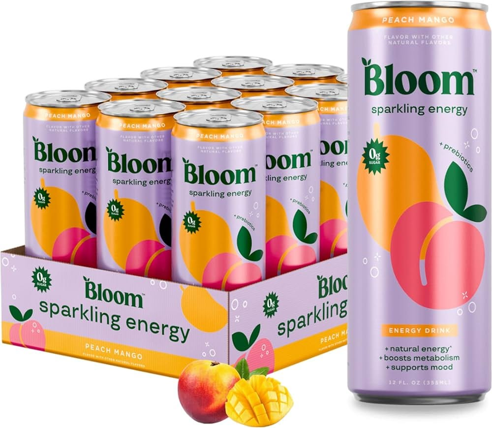](https://substackcdn.com/image/fetch/$s_!fxTa!,f_auto,q_auto:good,fl_progressive:steep/https%3A%2F%2Fsubstack-post-media.s3.amazonaws.com%2Fpublic%2Fimages%2Fe94e4e2e-e75a-4946-8c68-55c7a3eb6431_1000x870.jpeg)

I will be getting some soon. have a CVS on campus. (yes I know that is not the same company lol. it be funny tho)

**Soitec step up.**

#### Agenda

1. What’s a SOI Wafer?
2. SiPho Basics
3. How to Make SOI Wafers
4. Moat

---

subscribe for soy wafers

Subscribed

*By accessing this content, you acknowledge and agree to our [terms and conditions.](https://jasonschips.substack.com/p/terms-and-conditions) This research is **not financial advice**.*

---

## What’s a SOI Wafer?

[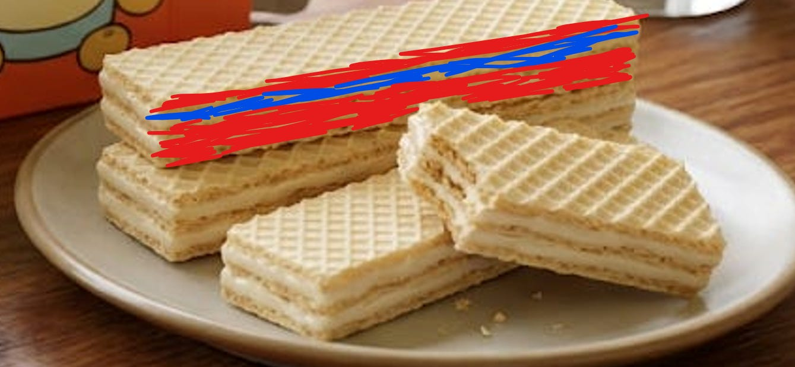](https://substackcdn.com/image/fetch/$s_!H7qM!,f_auto,q_auto:good,fl_progressive:steep/https%3A%2F%2Fsubstack-post-media.s3.amazonaws.com%2Fpublic%2Fimages%2F780ab15a-8be1-47a9-ba6b-3508fac3480f_1339x619.png)

It’s pretty simple actually. SOI stands for Silicon-On-Insulator. Soy wafers are a silicon sandwich.

The thin red on the top is a thin crystalline silicon layer. The blue in the middle is an insulating oxide layer. The thicker red on the bottom is a bulk silicon substrate.

[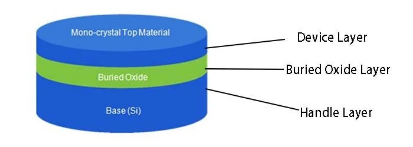](https://substackcdn.com/image/fetch/$s_!pEL-!,f_auto,q_auto:good,fl_progressive:steep/https%3A%2F%2Fsubstack-post-media.s3.amazonaws.com%2Fpublic%2Fimages%2F973c3454-8b17-4ecd-bf97-9286fe99692b_700x250.png)

Now what does each layer do?

The bottom layer is the ***handle layer***. It is just there for structural reasons. It is roughly **700 microns** thick. The handle gives the wafer enough mechanical rigidity to survive being picked up, spun, etched, and transferred through a fab without shattering. Optically and electrically, it is nearly irrelevant to the photonics happening above it.

The middle layer is the ***Buried Oxide***, a.k.a. ***BOX***. It is made of silicon dioxide, SiO₂, typically ranging from about **1 to 3 microns** thick (for photonics specifically). So in reality, my drawing is not to scale at all. Handle layer is *a lot thicker* than the BOX.

The BOX is the optically critical layer. It is the reason SOI works for photonics at all. More on exactly why in a moment, but the short version is that the BOX creates a refractive index discontinuity that acts as a barrier, preventing light from leaking downward into the handle wafer below. Without it, any optical signal you tried to guide through the top silicon layer would just bleed straight through the substrate and disappear.

The top layer is the ***device layer***. This is the thin crystalline silicon on top, and this is where everything happens. For standard telecom-wavelength (O-band) silicon photonics device layer is around **220nm** thick. So this is the thinnest layer by far. Every waveguide, modulator, coupler, splitter, and resonator on a SiPho chip gets patterned out of this *thin* *ahh film*.

## SiPho Basics

The following is required reading before you continue.

[## Short n' Casual Intro to SiPho](https://jasonschips.substack.com/p/short-n-casual-intro-to-sipho)

[Jason's Chips](https://substack.com/profile/112809522-jasons-chips)

·

Mar 18

SiPho is pretty cool ngl.

[Read full story](https://jasonschips.substack.com/p/short-n-casual-intro-to-sipho)

## How to Make SOI Wafers

[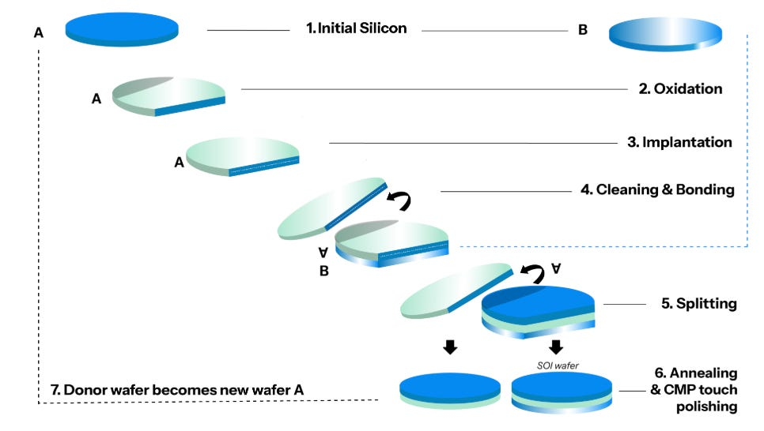](https://substackcdn.com/image/fetch/$s_!rIJm!,f_auto,q_auto:good,fl_progressive:steep/https%3A%2F%2Fsubstack-post-media.s3.amazonaws.com%2Fpublic%2Fimages%2Fbe75d8d0-2dd1-4efd-a54e-85fa687e7098_966x546.png)

*Claude, explain this picture, make no mistakes.*

---

#### Step 1: Start with two silicon wafers

You begin with two separate, standard silicon wafers. Call them wafer A and wafer B.

Wafer A is the donor wafer — the one that will ultimately supply the thin device layer at the top of the finished SOI stack. Wafer B is the handle wafer — the bulk mechanical substrate that will form the bottom of the finished product, the ~700 micron chassis that gives the final wafer its rigidity and handleability.

At this point they are both just ordinary silicon. Nothing exotic yet.

[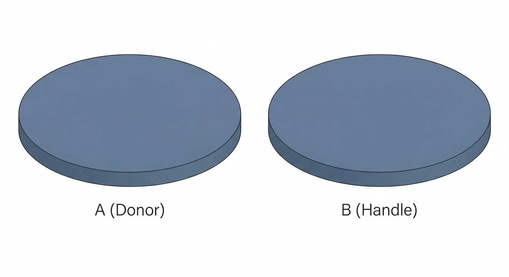](https://substackcdn.com/image/fetch/$s_!ZUw8!,f_auto,q_auto:good,fl_progressive:steep/https%3A%2F%2Fsubstack-post-media.s3.amazonaws.com%2Fpublic%2Fimages%2F32655ef2-1a05-418d-b940-b24b1132a755_2816x1536.png)

#### Step 2: Oxidize wafer A

Wafer A gets thermally oxidized. You expose it to oxygen at high temperature and grow a layer of silicon dioxide on its surface. This becomes the BOX — the buried oxide layer that will sit between the device silicon and the handle wafer in the finished product.

The thickness of this oxide is not arbitrary. It is a deliberate engineering choice that determines how well the finished wafer confines light. Too thin and the evanescent tail of the optical mode leaks through into the handle wafer below, adding propagation loss to every waveguide on every chip that gets fabricated on this substrate. For photonics applications, the BOX is typically grown to around 1 to 3 microns. This is one of the first places where photonics SOI diverges from generic SOI — the oxide thickness spec is tighter and the consequences of missing it are optical, not just electrical.

[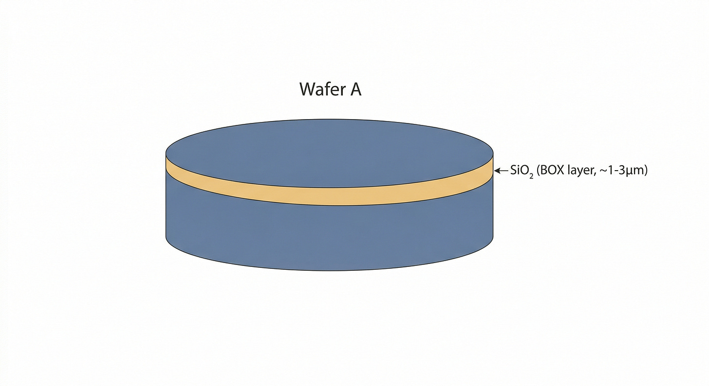](https://substackcdn.com/image/fetch/$s_!rSdK!,f_auto,q_auto:good,fl_progressive:steep/https%3A%2F%2Fsubstack-post-media.s3.amazonaws.com%2Fpublic%2Fimages%2Fd1bbf8df-90c4-4351-a972-80c272c9b177_2816x1536.png)

#### Step 3: Implant wafer A with hydrogen ions

This is the step that makes Soitec’s process — called `Smart Cut` — different from everything that came before it.

Wafer A, now carrying its oxide layer, gets bombarded with hydrogen ions in an ion implanter. The ions are accelerated to a precise energy level that determines exactly how deep they penetrate into the silicon. They don’t go all the way through. They stop at a controlled depth below the surface — a depth that corresponds exactly to how thick you want the final device layer to be.

At that depth, the hydrogen ions accumulate and create a plane of microscopic damage and gas bubbles running laterally through the crystal, like a fault line embedded in rock. This is the future cleavage plane. The entire upper portion of wafer A — the thin silicon above the ion implant layer — is what will become the device layer of the finished SOI wafer.

The precision of this implant step is what determines device layer thickness, and device layer thickness is an optical spec. For standard telecom-wavelength SiPho, that means landing at 220nm, or 300nm, or whatever the target platform requires, with uniformity tight enough that a foundry can qualify a photonic process on it and run it in volume without re-tuning for wafer-to-wafer drift.

[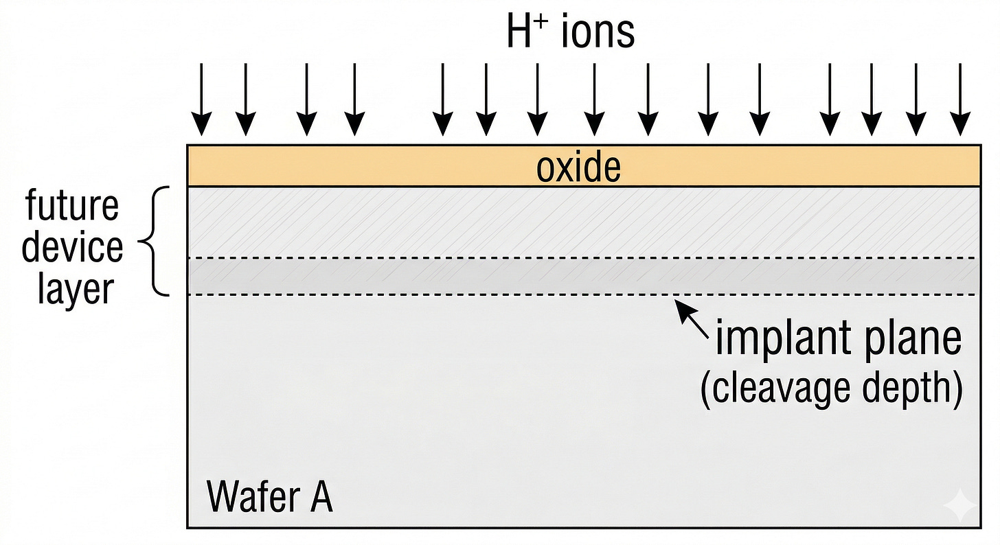](https://substackcdn.com/image/fetch/$s_!m_0n!,f_auto,q_auto:good,fl_progressive:steep/https%3A%2F%2Fsubstack-post-media.s3.amazonaws.com%2Fpublic%2Fimages%2Fd87b099a-a4e1-4119-91db-d5ad86d93cfd_2816x1536.png)

#### Step 4: Clean and bond

Wafer A (now carrying its oxide and its hydrogen implant layer) gets flipped upside down and pressed face-to-face against wafer B, the handle wafer. Before bonding, both surfaces are cleaned to an extreme degree — any particle contamination at the bond interface becomes a defect that propagates through every chip fabricated in that region.

The two wafers are brought into contact and bond through van der Waals forces at room temperature, then thermally annealed to strengthen the bond into a true covalent silicon-oxide interface. The oxide layer that was grown on wafer A is now sandwiched between the two silicon wafers — it has become the buried oxide of the final SOI stack.

[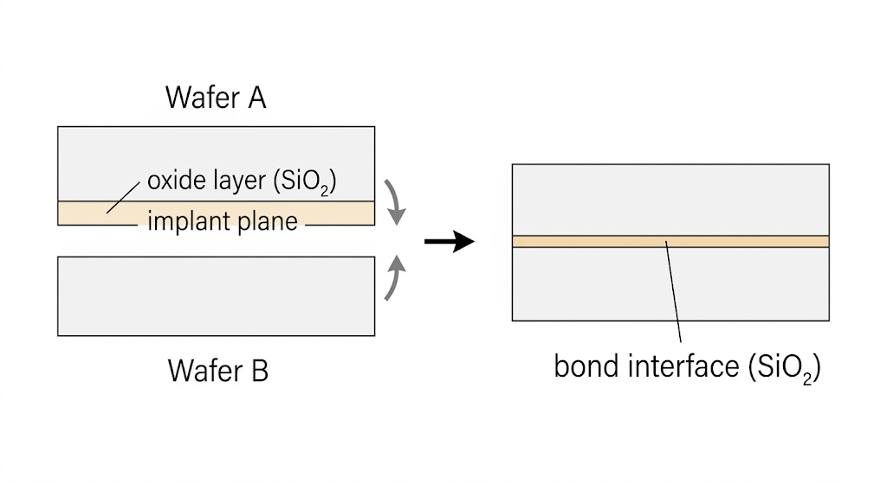](https://substackcdn.com/image/fetch/$s_!MAz2!,f_auto,q_auto:good,fl_progressive:steep/https%3A%2F%2Fsubstack-post-media.s3.amazonaws.com%2Fpublic%2Fimages%2F3c230b09-6c2d-46b7-ae3f-579853ceaf6f_1024x559.png)

#### Step 5: Split

Here is where Smart Cut earns its name.

The bonded pair gets annealed at a higher temperature. The heat causes the hydrogen microbubbles implanted in step 3 to expand and coalesce. The pressure builds along that implant plane until the crystal cleaves — cleanly, laterally, along the entire wafer diameter — right at the depth where the hydrogen was implanted.

The result is two separate pieces. On one side: wafer B, the handle wafer, now carrying the BOX and a thin layer of silicon on top — the device layer, transferred from wafer A. That is your SOI wafer. On the other side: the remainder of wafer A, a thick silicon wafer with a rough cleaved surface, missing the thin layer it just donated.

The split surface on the new SOI wafer is crystalline silicon but rough from the cleavage. It needs to be finished.

[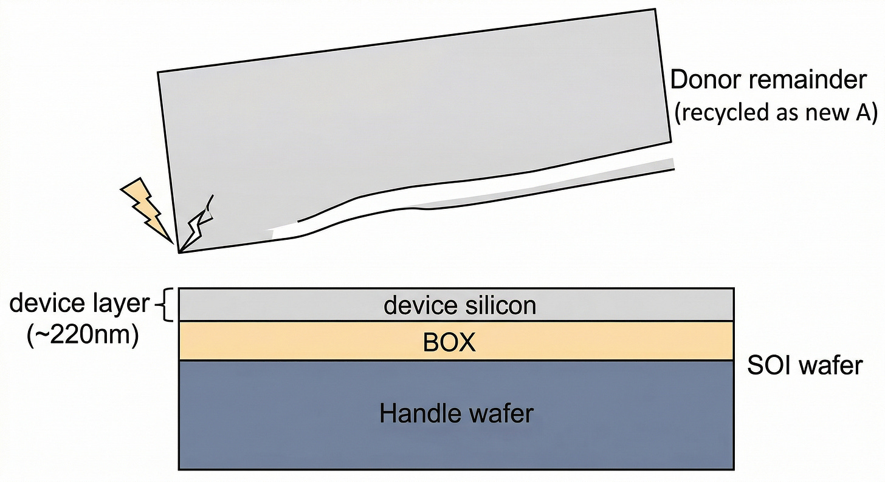](https://substackcdn.com/image/fetch/$s_!IZat!,f_auto,q_auto:good,fl_progressive:steep/https%3A%2F%2Fsubstack-post-media.s3.amazonaws.com%2Fpublic%2Fimages%2F94b4e95c-d864-47ff-919f-6741b08b6ae1_2816x1536.png)

#### Step 6: Anneal and polish

The SOI wafer goes through a final high-temperature anneal to heal crystal damage from the hydrogen implant and strengthen the bond interface. Then the surface gets polished using CMP — chemical mechanical planarization — the same process used throughout semiconductor manufacturing to flatten surfaces between layers.

This is the last place where photonics SOI demands more than generic SOI. The CMP step has to leave a surface that is not just flat in the macro sense but uniform in thickness at the nanometer scale across the entire 300mm wafer diameter. Because the device layer thickness is an optical spec, within-wafer uniformity and wafer-to-wafer repeatability are both part of the product. A foundry qualifying a photonic platform on these wafers is essentially trusting that the substrate geometry is consistent enough to be treated as a known, fixed input to the optical design — not a variable that needs to be compensated for.

[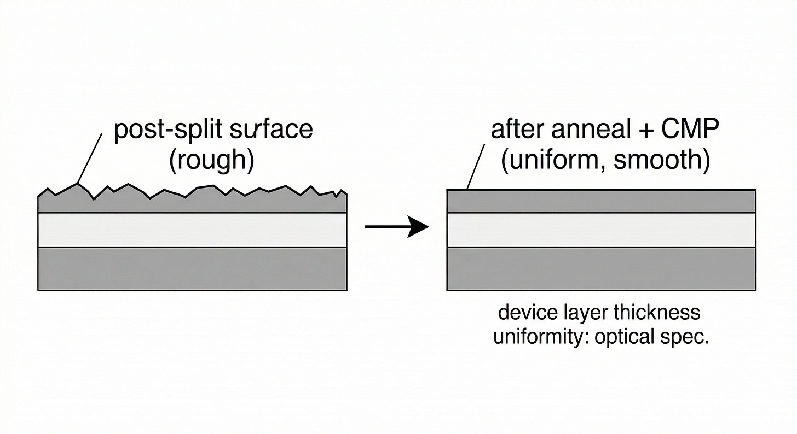](https://substackcdn.com/image/fetch/$s_!Pnxa!,f_auto,q_auto:good,fl_progressive:steep/https%3A%2F%2Fsubstack-post-media.s3.amazonaws.com%2Fpublic%2Fimages%2F599ea26b-c68b-4d3c-8d56-7c912ddc359c_2816x1536.png)

#### Step 7: Wafer A becomes the next wafer A

The leftover portion of wafer A — the thick remainder after the split — does not get thrown away. It gets re-polished and re-used as the donor wafer for the next cycle. This is the economic elegance of Smart Cut: the expensive, high-quality silicon crystal in wafer A is not consumed. It donates a thin layer and gets recycled. Over many cycles, a single donor wafer can produce multiple SOI wafers, which is a meaningful contributor to the cost structure of the finished product.

[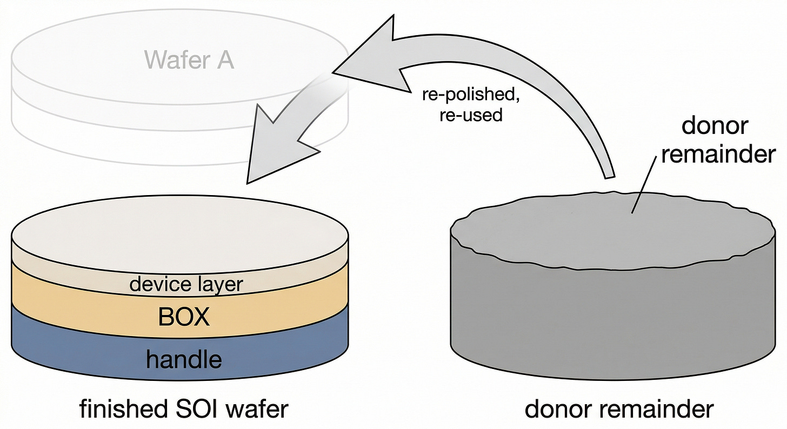](https://substackcdn.com/image/fetch/$s_!V7Xo!,f_auto,q_auto:good,fl_progressive:steep/https%3A%2F%2Fsubstack-post-media.s3.amazonaws.com%2Fpublic%2Fimages%2F490a9683-58f6-4f60-a326-28f68e95c375_2816x1536.png)

---

## Moat

In my humble opinion Soitec is tied with Aixtron as having the strongest moat in photonics. Even Lumentum’s earned UHP laser monopoly can’t touch the structural dominance of these two companies.

*(smart + cut… get it?)*

So why not make a workaround to smart cut?

Well there was an attempt.

The method was called `SIMOX` — Separation by IMplantation of OXygen.

Instead of bonding two wafers and cleaving, you bombarded a single silicon wafer with oxygen ions at extremely high doses to form a buried oxide layer in place. Basically you just skip the flip n’ bond step and **attempt to do everything on wafer A**. But the oxygen implant doses required were enormous which meant you create crystal damage in the device layer above the oxide. Not good ! ! !

The resulting silicon was defective, the oxide quality was poor, and the thickness uniformity was not good enough for demanding applications. SIMOX was abandoned.

Smart Cut sidesteps all of that because the device layer silicon is never damaged by high-dose implantation. Only the cleavage plane is implanted, and that plane gets discarded. The transferred silicon retains the crystal quality of the original donor wafer.

#### IP, IP, IP

Soitec invented Smart Cut.

They patented it in the early 1990s and have spent decades building an IP FORTRESS around it. The strategy ensures that no one can come close to replicating a Smart Cut step without patent infringement.

They patented not just the core cleavage process but the surrounding process know-how: the implant conditions, the bond surface preparation, the anneal sequences, the CMP finishing. The portfolio is deep enough that designing around it without losing the quality benefits is not practically achievable.

#### Cheeky Management Commentary

> *“With globalwafers, they lose access to smart cut in 2027. They have 10% share in 300mm with our IP, what do you think is going to happen without our IP?”*

Management has claimed they have 70% share in 200mm SOI wafers and 90%+ share in 300mm. 300mm is what will mostly be used in the future so that is the only share number that matters. This is overall SOI share btw, not the harder photonics subsegment.

GlobalWafers of Taiwan got ~10% share by licensing Smart Cut from Soitec.

There have been rumors that GlobalWafers is in qualification with TSMC for SOI. However, this would be still on Smart Cut.

The license expires in 2027. And GlobalWafers has been pushing to exit it early because licensing fees are a perpetual cost on their margin and they seem to think they can do it themselves.

**Soitec management is trying to politely tell you they’ll have a monopoly soon.**

Without Smart Cut, GlobalWafers has no credible path to producing photonics-grade SOI at the thickness uniformity and defect density that foundries require. They might retain some legacy customers on lower-spec products. But in the photonics segment the qualification bar is simply too high for a process that is starting from scratch.

This near 100% market share is built to last. SOI is a sticky supply relationship. Foundries qualify a specific supplier’s specific product into a specific process platform which involves extensive characterization of the optical and electrical properties of the wafer and gets baked into the PDK that every fabless customer designs to. Switching suppliers means re-qualifying the wafer, re-characterizing the process, potentially re-validating every customer design.

Nobody switches a qualified photonics wafer supplier mid-ramp unless they have a compelling reason to, and after 2027 there will be even fewer suppliers to switch to.

---

## Thanks for Reading!

SOI-bscribe.

Subscribed

If you enjoyed, please like, comment, restack or share. It helps a lot.

[Share](https://www.jasonschips.ai/p/the-soitec-series-part-27-soi-tech?utm_source=substack&utm_medium=email&utm_content=share&action=share&token=eyJ1c2VyX2lkIjoxNDAwMjQ1LCJwb3N0X2lkIjoxOTEzMDk3MjksImlhdCI6MTc3NDgwODI4MSwiZXhwIjoxNzc3NDAwMjgxLCJpc3MiOiJwdWItNjY2NDM1NiIsInN1YiI6InBvc3QtcmVhY3Rpb24ifQ.hkDkpCrKe1hfigM_jZpg79TQxiEERHT2G3EYj0KsvY0)