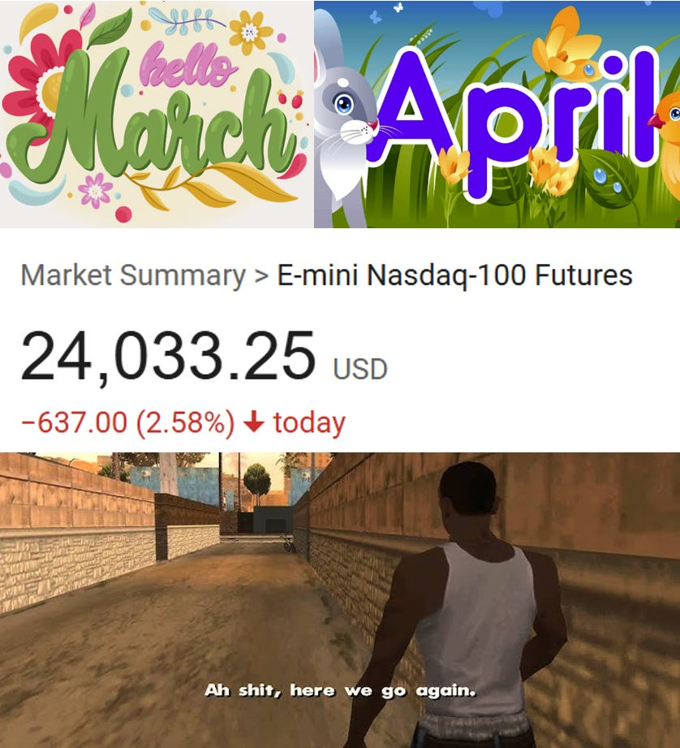
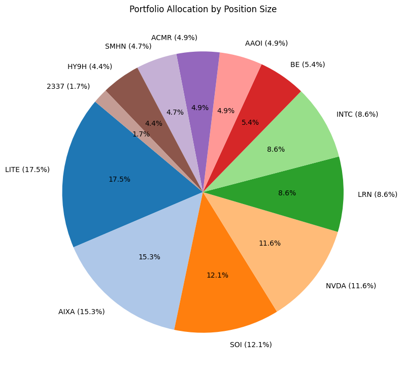
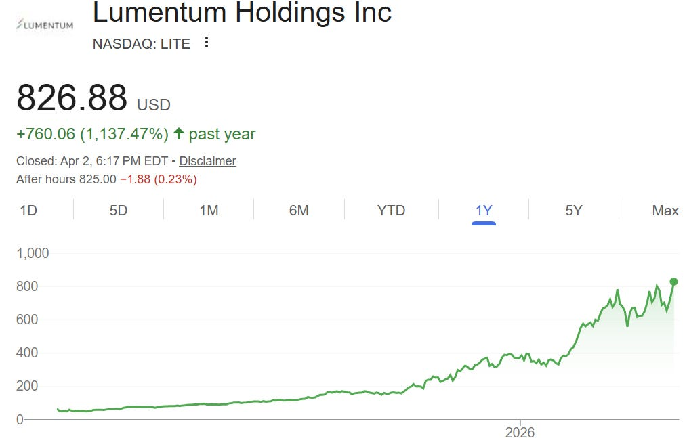
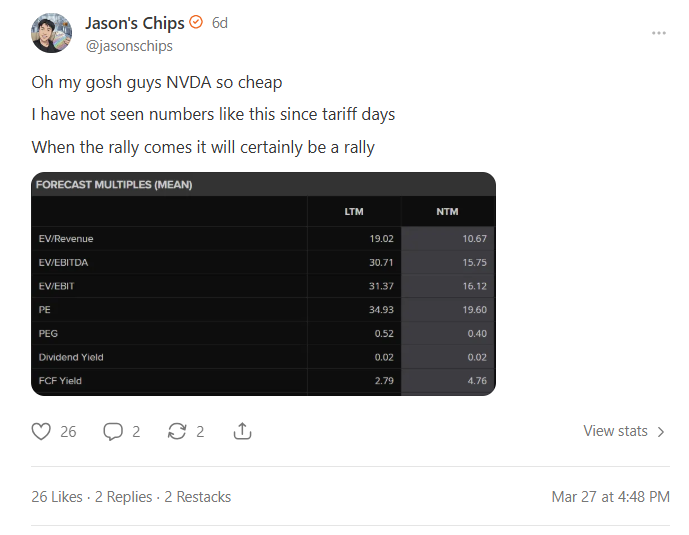
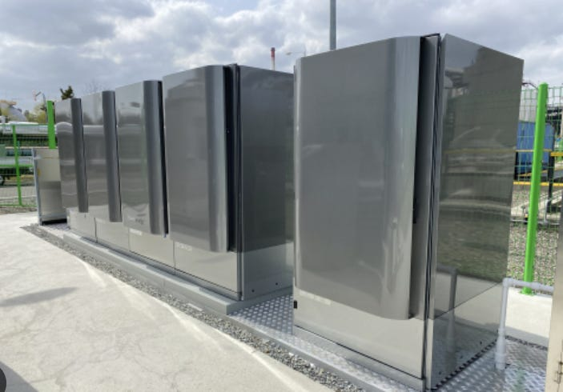
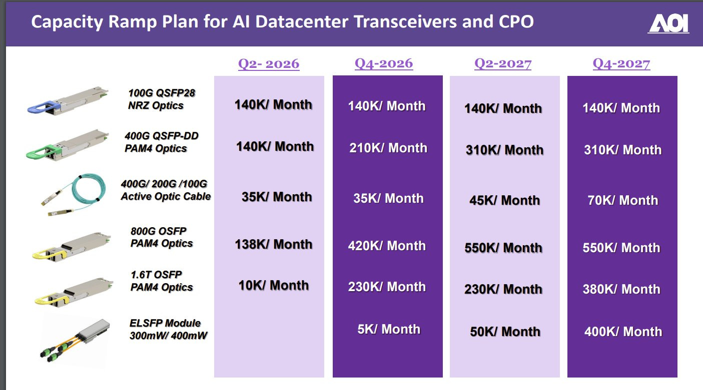
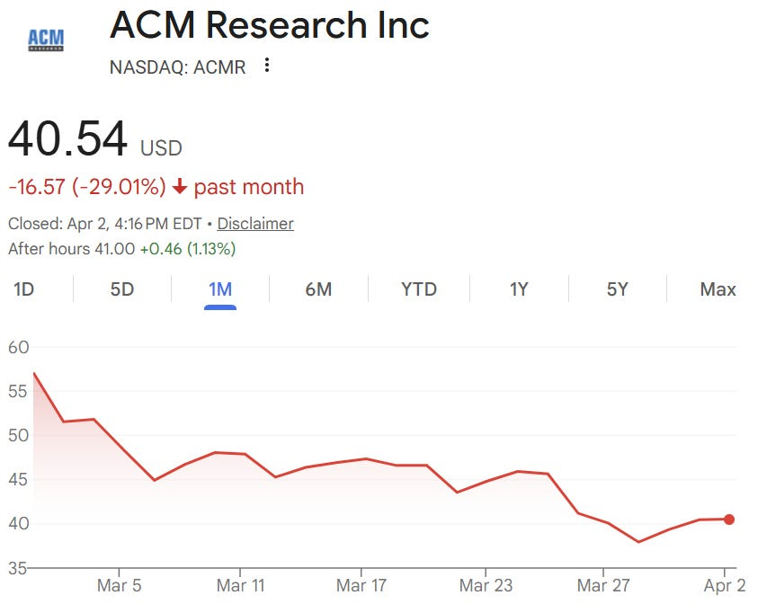

what a chaotic month

PTSD (Post Trump Stress Disorder)

The market crashing in March based on totally preventable macro chaos caused by Trump gave me so much nostalgia I would sit outside and listen to my playlists from last spring to relive the authentic bear market experience.

However I some how ended the month positive because I am the goat.

#### Lumentum (LITE)

**Portfolio Allocation**: 17.5%

**March Performance**: +0.26%

**Change**: Added.

**Thesis**:

Yes. I just added to a name that has gone up 10x over the past year and is already my largest position and has a chart looking like this. An act which I believe requires balls of steel.

This is probably the best positioned AI company of all time. 400G EML (of which they have 50%+ share) will get revenge on SiPho and reclaim share due to silicon being shit at modulating, Google capex (transceivers and OCS) supported by massive FCF and thus immune to capital markets reflexivity, OCS penetrating scale-up and spine switch replacement, and most important of all, scale-up CPO.

Stage 1 scale-up CPO is already enough to get us to $5-10b revenue by the end of the decade. It will fill the Greensboro fab.

Stage 2 is still out of my model and completely unpriced by the market but is 3-4x larger than phase 1.

#### Aixtron (AIXA)

**Portfolio Allocation**: 15.3%

**March Performance**: +18.48%

**Change**: None.

**Thesis**:

Lumentum is top pick by a hair.

I just did some InP math for Aixtron. UHP lasers need 5.5x the epitaxial intensity of standard 100G EMLs. Total size of UHP laser market can be 3x that of EMLs. By the end of the decade, this could result in $1b of revenue from the sheer amount of capacity that must be added by Lumentum. Most compelling Lumentum derivative play.

Then there’s GaN and SiC. DC direct is coming (unstoppable architecture shift like copper to optical) and power semi content will explode. Need a bunch of GaN in every rack to switch and step down the current. Multi-billion dollar market and Aixtron has vast majority of the market share. Epitaxy is largest % of capex, its like litho in logic.

#### Soitec (SOI)

**Portfolio Allocation**: 12.1%

**March Performance**: +26.26%

**Change**: New position.

**Thesis**:

This is basically Lumentum’s UHP lasers but with a struggle phone business attached instead of other optical components. Very similar (though slighly lower for Soitec) CPO dollar content per dollar of market cap too (but lots of uncertainty in this measure).

Why own this then you may ask? Because my view is that scale-up CPO is so important I cannot afford to miss it. Owning multiple names with exposure to scale-up CPO allows me the margin of safety to be wrong on the idiosyncratic layer while still winning the thematic layer.

#### NVIDIA (NVDA)

**Portfolio Allocation**: 11.6%

**March Performance**: -1.57%

**Change**: None.

**Thesis**:

Oh my gosh guys NVDA so cheap

I have not seen numbers like this since tariff days

When the rally comes it will certainly be a rally

#### Stride (LRN)

**Portfolio Allocation**: 8.6%

**March Performance**: +4.49%

**Change**: Reduced.

**Thesis**:

Not a semis company. From my last port review:

> *I have a framework for identifying downstream (non-infra) AI beneficiaries. It goes something like your product/TAM depends on software so you feel the full benefits of agentic coding but your moat is regulatory or network effects so you don’t get any of the disruption risk.*
>
> *Stride is an operator of virtual schools. 80% market share. Regulatory very hard. You do the math.*

Also would say that my positions are so correlated anything uncorrelated deserves a massive premium. So even though I don’t know much about Stride’s market it deserves a large allocation.

#### Intel (INTC)

**Portfolio Allocation**: 8.6%

**March Performance**: -3.24%

**Change**: None.

**Thesis**:

Intel a.k.a. USSMC. Essential domestic chip production bet. I’m not concerned with the day-to-day of what 18A yields are because my macro view is that the US won’t let them fail. It would be a national security disaster.

On top of that CPU price hikes have been announced. Am I a fan of x86 vs ARM? Or Intel’s fewer cores vs AMD more cores? Or lack of chiplets? Not really. But agents need CPUs and Intel makes CPUs.

Very good performer recently given volatility and they are not an optics company.

#### Bloom Energy (BE)

**Portfolio Allocation**: 5.4%

**March Performance**: -12.96%

**Change**: New position.

**Thesis**:

Bloom makes magic energy boxes.

I will list out some features of these boxes below.

1. Native Direct Current
2. Dynamic Load Following
3. Modularity
4. Absorption Chilling
5. Carbon Capture
6. Quick Deployment
7. Anti-NIMBY Form Factor
8. High Efficiency
9. Magic Box Moore’s Law
10. Efficiency
11. Capital Light Manufacturing
12. Data Analytics
13. Hydrogen

That is basically the preview for my post about Bloom coming very soon. I think they will be more economical than turbines at 800VDC native deployments. Which means they will get inundated with orders.

The funny thing about Bloom is that they are the only AI infra company that is demand constrained and not supply constrained. They have publicly said they will “never be the bottleneck for our customers” because fuel cells are actually pretty capital light to manufacture as it is mostly assembly. Sort of like a semicap. It is mostly IP.

On the other hand, they haven’t really gotten too many orders yet. Normal investors think its a red flag for obvious reasons. But I am thinking that if the tech is eventually more cost effective, the orders HAVE to come. And as they said, unlike the semis supply chain, they will “never be the bottleneck for our customers.” There could be serious leverage here.

#### Applied Optoelectronics (AAOI)

**Portfolio Allocation**: 4.9%

**March Performance**: +0.43%

**Change**: None.

**Thesis**:

I ended up holding this one. AAOI is not for the faint of heart.

The bear case is very strong. This could get cut in half and I wouldn’t be surprised. If they fail to make good lasers internally, their only value-add is assembling transceivers. And transceiver supply is notoriously easy to bring on, so with memory and logic as the bottlenecks, we could see a localized glut bringing transceiver ASP and margins down significantly even with huge absolute unit growth. Almost everyone would win in this scenario (LITE included) EXCEPT for AAOI.

On the other hand, you have this.

Basically, we might see $4b+ revenue in 2027 with capacity ramp. They have massive amounts of underutilized InP capacity that allows them to win the incremental “overflow” orders LITE and COHR cannot serve. So when supply fell behind demand, AAOI captured it all. In addition, there is a major call option if their CPO lasers turn out to be any good. I doubt that they will because Lumentum has a very wide moat, but in the case where that moat is narrower than I thought AAOI wins big, so AAOI and LITE are negatively correlated in that case.

But the bears argue again. How do you know they can successfully bring in so much capacity they can quadruple their revenue in one year based on their spotty track record?

I will concede that each side has good arguments. But the reason I’m making this bet is simple. This is a tails I lose big, heads I win bigger scenario. My model shows that they trade at **mid-single-digit** earnings multiples if they do successfully ramp. That would make them the easiest multibagger in my portfolio. So the reward for them executing is large enough for me to accept the risk of a permanent loss of capital.

But I size them small because historically I had bad experience with these “reward case bigger than risk case” names. It’s much better to just be confident that the reward case will happen. Which is why my LITE/AIXA allocation is so big.

#### ACM Research (ACMR)

**Portfolio Allocation**: 4.9%

**March Performance**: -29.33%

**Change**: None.

**Thesis**:

Nothing changed here but the share price performance has been horrific.

I am honestly unsure why and too busy with other names to go do more investigating. But the thesis here still holds.

1. Chinese localization will force Chinese fabs to spend capex on Chinese equipment vendors. So they outgrow China WFE.
2. Memory supercycle will force YMTC and CXMT to invest in capacity, which will go to Chinese equipment vendors because of aforementioned localization.
3. China AI is booming. Chinese people actually support AI unlike Americans. Adoption is through the roof. Only problem is they don’t have compute. And they can’t get it easily because they don’t have EUV. Which means multi-patterning DUV. Which means less efficient fabs and higher spend on tools to produce the same number of FLOPs.

#### SUSS MicroTec (SMHN)

**Portfolio Allocation**: 4.7%

**March Performance**: -1.28%

**Change**: None.

**Thesis**:

My most recent writeup has all of the details.

[

#### The Imposter is Suss (MicroTec)

[Jason's Chips](https://substack.com/profile/112809522-jasons-chips)

·

Mar 31

[Read full story](https://www.jasonschips.ai/p/the-imposter-is-suss-microtec)](https://www.jasonschips.ai/p/the-imposter-is-suss-microtec)

But in terms of their role in my portfolio, I basically treat them as my semicap ETF because they are so diverse. 70% advanced packaging 30% leading edge logic is how I would distribute my semicap allocation anyways.

Leading edge logic and memory are the top shortages currently. Semicap is a consensus trade as a result. But I think semicap can still print money. Maybe right now we are limited by cleanroom space but once the fabs come online (H2 2026 or 2027) the tool orders are likely much higher than any sellside analyst is expecting.

#### SK hynix (HY9H)

**Portfolio Allocation**: 4.4%

**March Performance**: -16.12%

**Change**: New position.

**Thesis**:

Memory is guilty until proven durable.

Yes, I know we shouldn’t value memory on P/E but bear with me. Micron is 3.7x 2027E. SK hynix and Micron have essentially the same market cap but SK hynix has much higher market share in DRAM. So call it sub-3x P/E for hynix.

No we shouldn’t value memory on P/E, but SK hynix is earning 1/3 to 1/2 of its entire market cap each year in this upcycle. From a shareholder perspective, that cash earned equivalent to 1/3 to 1/2 of your position. Yes a bunch of that might be spent on capex, but fabs are probably the most valuable physical assets now and will be for the next decade.

On top of that, you have custom HBM making the business actually differentiated and long-term, bit scaling becoming much more difficult, ADR coming later this year to close the geographic valuation gap, and the classic HBM-cannibalize-DRAM thesis.

I simply don’t see how you lose here.

#### Macronix International (2337.tw)

**Portfolio Allocation**: 1.7%

**March Performance**: +5.00%

**Change**: New position.

**Thesis**:

[Collyer Bridge](https://open.substack.com/users/7366192-collyer-bridge?utm_source=mentions) has great coverage of this one.

Macronix makes legacy NAND flash chips (eMMC) based on MLC. So basically the low-tech but durable and reliable stuff for industrial, automotive, and medical end markets. Smartphones too.

Fabs are cleanroom constrained. Samsung and hynix and Micron need their cleanrooms for HBM and DDR5 and QLC NAND. So they all quit their legacy NAND lines, scrapped the tools, and repurposed their cleanrooms. This left Macronix with a complete monopoly over this market.

Because eMMC chips are a tiny portion of the BOM of these very expensive equiments, Macronix essentially has the ability to raise prices however they want. Literal blank check.

It will be many years until we have enough cleanrooms. Until then, no one is bothering to enter this old and boring market, leaving Macronix free reign to extract profits.

If you enjoyed, please like, comment, restack or share. It helps a lot.

[Share](https://www.jasonschips.ai/p/portfolio-review-march-2026-2-40?utm_source=substack&utm_medium=email&utm_content=share&action=share&token=eyJ1c2VyX2lkIjoxNDAwMjQ1LCJwb3N0X2lkIjoxOTI4NjgwMzgsImlhdCI6MTc3ODU1MTQxNiwiZXhwIjoxNzgxMTQzNDE2LCJpc3MiOiJwdWItNjY2NDM1NiIsInN1YiI6InBvc3QtcmVhY3Rpb24ifQ.gklMB132e2C11gKbKhF7qmrB5MjL0xH50EWd6hR0RTI)