I kind of got obsessed with these things over the weekend. Universally hated. Debt-laden. Temporary backstops. And most importantly, **trading sardines** (not eating sardines).

[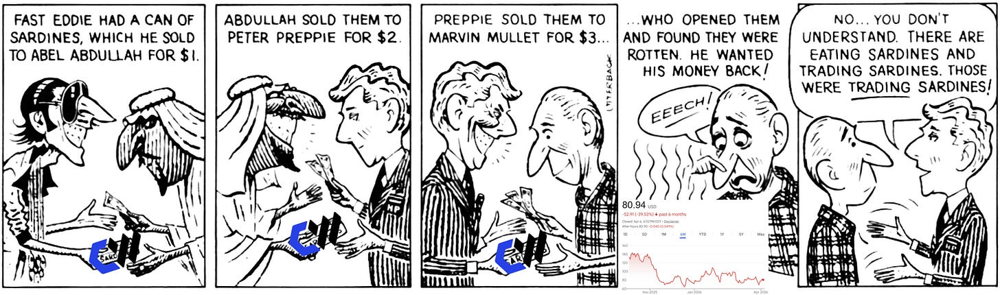](https://substackcdn.com/image/fetch/$s_!sb4b!,f_auto,q_auto:good,fl_progressive:steep/https%3A%2F%2Fsubstack-post-media.s3.amazonaws.com%2Fpublic%2Fimages%2Fd6d3c963-5767-4062-b294-41ebaa23a66d_1806x533.png)

trading sardines

The market generally understands neoclouds (and all equities in general) through a business/finance context. There is plenty of published equity research utilizing the traditional framing.

I propose that by departing from this consensus to travel to the world of microeconomics, we can find some alpha.

This is NOT your average equity research primer. Let’s go!

#### Contents

1. Neocloud Basics
2. The Two Markets
3. The Three Shocks
4. How a Neocloud Makes Money
5. Thoughts on the Stocks (and Fun Trade Idea)

---

subscribe for trading sardines

Subscribed

*By accessing this content, you acknowledge and agree to our [terms and conditions.](https://jasonschips.substack.com/p/terms-and-conditions) This research is **not financial advice**.*

***I can build you custom models for any semis/AI company**. If interested, please reach out at jasonschips@gmail.com.*

---

## Neocloud Basics

I will hash out the basics of neoclouds as quickly and simply as possible.

A neocloud is a cloud that is a) small b) only deploying Nvidia hardware and c) optimized for AI.

Neoclouds exist for the same reason all sectors do: Because the market demands it.

On the supply side, Nvidia needs anchor customers that don’t want to build custom silicon, can build specialized infra optimized just for them, and can move at the speed of AI. This would actually make neoclouds an under-the-radar way to bet on Nvidia beating ASICs.

On the demand side, AI labs need bare-metal GPU clusters that optimize for pure throughput by ditching the virtualization layer (turning servers into virtual machines to separate small customer workloads) found in traditional hyperscalers.

The two largest, publicly traded, and most widely tracked neoclouds are CoreWeave and Nebius. CoreWeave is larger and finances with debt. Nebius is smaller and raises equity.

[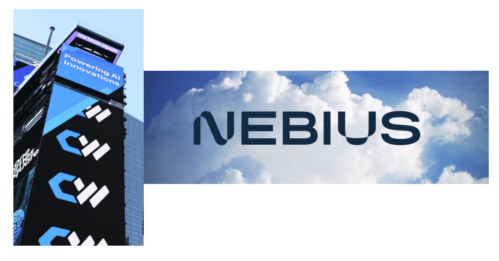](https://substackcdn.com/image/fetch/$s_!N1b6!,f_auto,q_auto:good,fl_progressive:steep/https%3A%2F%2Fsubstack-post-media.s3.amazonaws.com%2Fpublic%2Fimages%2F0dc20be5-1e3c-4353-b649-66f11f2ccd94_1267x664.png)

Nebi-weave

Neoclouds earn revenue through long-term, take-or-pay contracts with large anchor customers. This is what leads to criticisms over customer concentration.

Neoclouds need massive amounts of financing because of a working capital dilemma: They must spend capex before they receive revenue. In hypergrowth stage, this means that tomorrow’s revenue requires today’s capex, both of which are always greater than today’s revenue. This leads to the criticism about debt load and/or equity dilution.

However, the strongest and most common case against the neoclouds is GPU depreciation. They hold an asset that Nvidia obsoletes after just a generation or two. We will get into how this is modeled economically later!

## The Two Markets

To understand why neocloud economics are so interesting, you need to think about two separate markets stacked on top of each other. The first is the market for AI tokens, outputs sold by model labs to end users. The second is the market for GPU-hours, compute time sold by neoclouds to model labs, *sitting under the first market*. These two markets have fundamentally different competitive structures, and that difference determines who captures value in the AI stack.

#### The Token Market (Monopolistic Competition)

I am 99th percentile Claude pilled. Claude is such a personality hire. I am normally quite frugal but I buy extra usage on Claude for literal basic chatting about ideas when I could have used any other model which are just as capable on benchmarks.

The token market is the textbook definition of monopolistic competition: firm sell differentiated products, with each firm facing a downward-sloping demand curve rather than the perfectly horizontal one you would see in a commodity market.

The downward slope matters enormously. It means a model lab has pricing power. If Anthropic raises token prices 10%, customers do not immediately defect to OpenAI. The lab faces a demand curve it can move along, which is the defining characteristic of a firm with market power.

[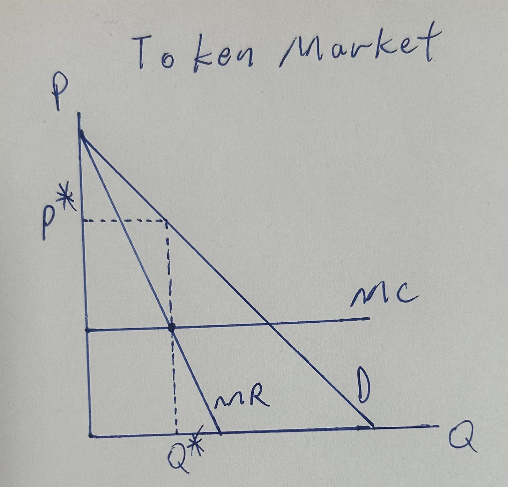](https://substackcdn.com/image/fetch/$s_!0PmU!,f_auto,q_auto:good,fl_progressive:steep/https%3A%2F%2Fsubstack-post-media.s3.amazonaws.com%2Fpublic%2Fimages%2Fc4a835d5-a206-4b20-ad3c-5dc87943892f_1719x1648.jpeg)

anthropic or smth

In this setup, the lab maximizes profit by producing where marginal revenue equals marginal cost, the standard monopolist condition. It then prices above that quantity on the demand curve, earning a markup over marginal cost. The size of that markup depends on how differentiated the product is: more differentiation means less elastic demand, a steeper demand curve, and a larger markup.

The marginal cost of a token is essentially the cost of the GPU-hours required to generate it plus the model’s amortized training cost. GPU-hours are the primary variable input, which means **the price paid by the labs equals the revenue of the neoclouds**.

#### The FLOPS Market (Perfect Competition)

A GB200 GPU-hour sold by CoreWeave is, for most inference and training workloads, functionally identical to a GB200 GPU-hour sold by Nebius or Lambda Labs\*. The customer will buy from whoever offers the lowest price. This is much closer to a commodity market than the token market. GPU-hours are not fully perfectly competitive but they are certainly less differentiated than frontier models so we oversimplify to fit the model.

(I will use GPU-hours and FLOPS interchangeably in this article. FLOPS are the more economically accurate unit since more powerful GPUs produce FLOPS cheaper, creating the supply curve.)

In a perfectly competitive market, no individual firm has pricing power. Each neocloud faces a perfectly horizontal demand curve at the market price P\*, making them price takers. If they charge above P\*, they lose all customers immediately to competitors. If they charge below P\*, they sell to everyone but earn less than they could. The rational strategy is to produce at P\* and optimize cost structure.

[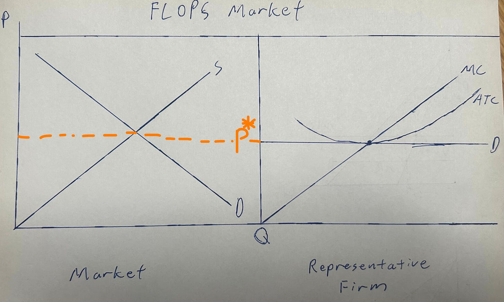](https://substackcdn.com/image/fetch/$s_!auFU!,f_auto,q_auto:good,fl_progressive:steep/https%3A%2F%2Fsubstack-post-media.s3.amazonaws.com%2Fpublic%2Fimages%2F69ab84d5-1b9b-4fce-97df-8e5217869b1c_3147x1891.jpeg)

flop

In long-run equilibrium, free entry and exit drives price to minimum average total cost. Any time price rises above min ATC, new capacity enters, S shifts right, and price falls back. Any time price falls below min ATC, firms exit or shrink, S shifts left, and price recovers. The equilibrium condition is P\* = MC = min ATC, meaning zero economic profit.

In a perfectly competitive GPU-hour/FLOPS market with free entry and no supply constraints (a punishing assumption but it makes our model work), neoclouds earn zero economic profit. They cover their costs including a normal return on invested capital, but nothing beyond that. All the surplus (excess return) in the AI stack accumulates at the differentiated layer, the model labs, rather than at the commodity layer.

I want to add a bit of intuition on the supply curve in particular. The reason it’s upwards sloping is because each incremental petaflop must be supplied by older and older chips, which are less and less efficient at producing FLOPS. Think about it: If you were CoreWeave, the first customers you get you serve with your newest Blackwells as they produce FLOPS the cheapest. As your backlog fills up, you’ll need to sign contracts for Hoppers and even Amperes, given they are willing to pay the more expensive TCOs of those older models.

[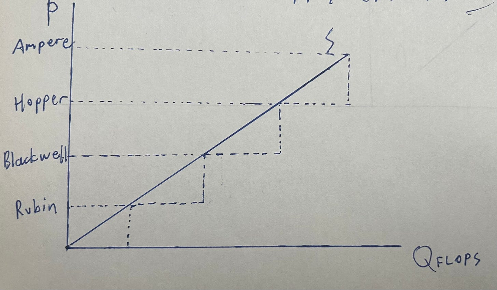](https://substackcdn.com/image/fetch/$s_!9lKF!,f_auto,q_auto:good,fl_progressive:steep/https%3A%2F%2Fsubstack-post-media.s3.amazonaws.com%2Fpublic%2Fimages%2Ff0364aaf-7c26-4d68-81b2-f002d3080a77_2470x1443.jpeg)

staircase

## The Three Shocks

Our first shock is chip constraint. This is simple. If we suddenly find out there are less cleanrooms available, the neocloud market sees a negative supply shock.

You can model it as the supply curve becoming more elastic or simply shifting left, it really doesn’t change the outcome.

The second shock is Moore’s law. Since GPUs become more efficient and powerful with each generation, each year there is a new positive supply shock. The supply curve constantly shifts to the right.

It is important to note that the chip constraint and Moore’s law shocks effectively cancel each other out if they are of the same magnitude.

The third shock is the Deepseek effect. Remember Deepseek in Jan 2025?

I named it this because it was the effect widely debated back then. Models become more efficient, what happens? This is modeled as a decline in the marginal cost (input cost) for the model labs.

Lets start with the effect of the shocks in the **token market**:

[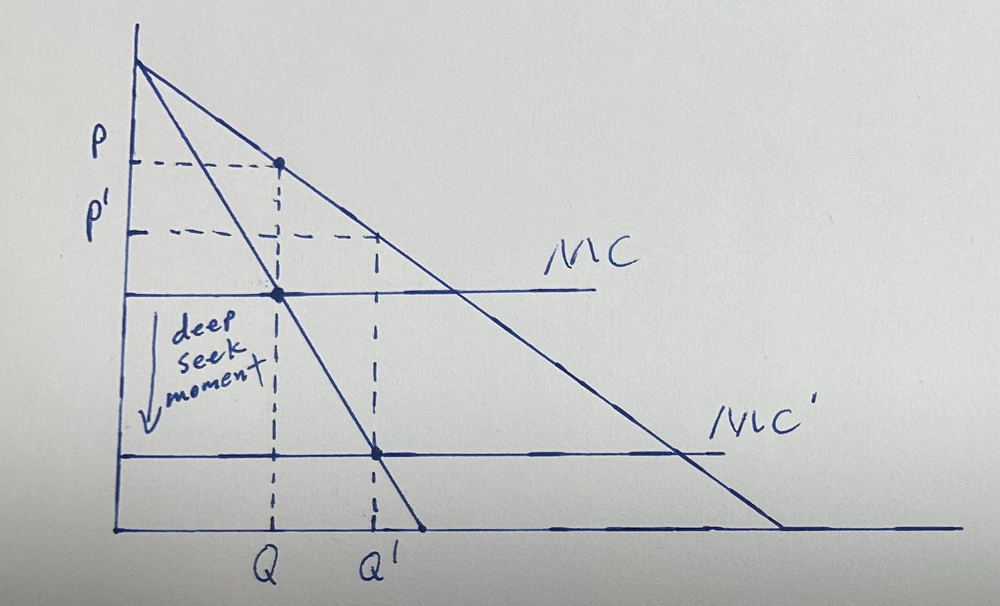](https://substackcdn.com/image/fetch/$s_!z8cm!,f_auto,q_auto:good,fl_progressive:steep/https%3A%2F%2Fsubstack-post-media.s3.amazonaws.com%2Fpublic%2Fimages%2Ff3b5c501-2aec-4b24-a88b-fb0654b81591_2123x1288.jpeg)

seeking deeply

The only shock that originates here is the DeepSeek moment. The rest purely affect the neoclouds are are not felt by the labs at all.

We can notice that the price declines, we move down the demand curve (more use cases), and produce a higher quantity of tokens. The magnitude of the change in their revenues (and what they end up paying the neoclouds) is **purely a function of demand elasticity!** The steeper (and more inelastic) the demand, the more important the price decline is relative to the quantity increase, and vice versa.

Empirically speaking, tokens are very very elastic. Each time cost of a model declines, an order of magnitude of new use cases are unlocked.

Now let’s move onto the neocloud GPU-hours/FLOPS market.

[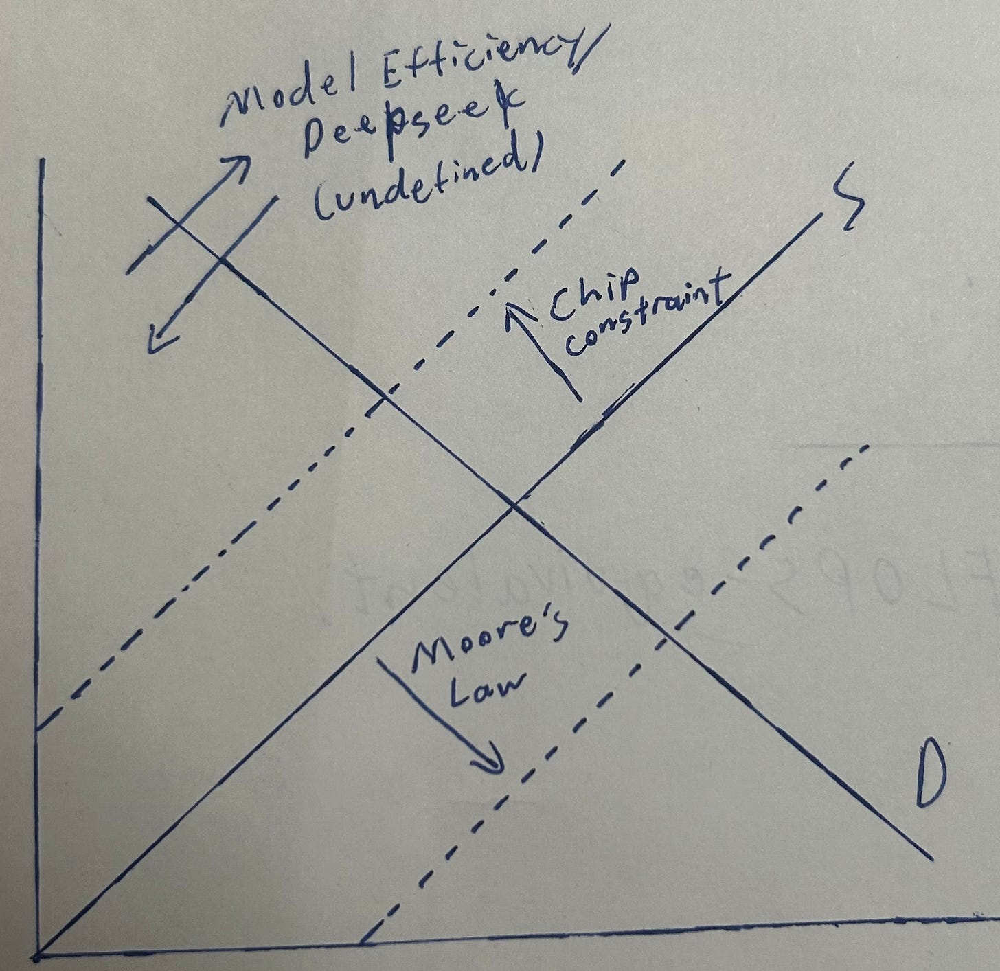](https://substackcdn.com/image/fetch/$s_!atrj!,f_auto,q_auto:good,fl_progressive:steep/https%3A%2F%2Fsubstack-post-media.s3.amazonaws.com%2Fpublic%2Fimages%2F0eee86f9-d34d-4df9-bbfe-ebbd95fcb829_1983x1926.jpeg)

shocks!

Now we can see all three shocks in action.

The propagation of the DeepSeek effect from the token market to the GPU-hour market works through derived demand and operates through two simultaneous channels pulling in opposite directions.

The first channel is an **efficiency effect**: each token now requires fewer GPU-hours to produce. For any given level of token output, the lab’s demand for GPU-hours falls. This is a leftward shift of derived demand in the neocloud market, holding token quantity fixed.

The second channel is a **volume effect**: token prices fell because lab MC fell. The lab is now selling more tokens to more customers and new use cases. More tokens produced means more GPU-hours demanded. This is a rightward shift of derived demand in the neocloud market.

The DeepSeek effect is indeterminate because in the end it depends on the demand elasticity of the token market above.

The other two are much simpler: Chip constraints would result in a higher price + lower quantity of GPU-hours, while Moore’s law produces lower price + higher quantity.

Now time for the most complicated and ugliest graph: **The Individual Neocloud**.

[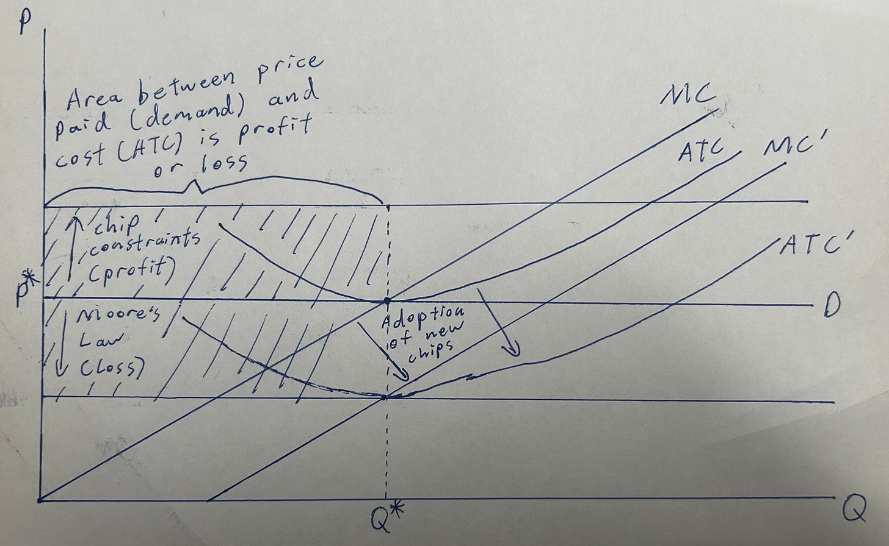](https://substackcdn.com/image/fetch/$s_!cwOG!,f_auto,q_auto:good,fl_progressive:steep/https%3A%2F%2Fsubstack-post-media.s3.amazonaws.com%2Fpublic%2Fimages%2Fe830a3bd-27cb-4cce-9d61-811975abc11b_3467x2133.jpeg)

intimidating graph

We will dissect this piece by piece.

Staring with the chip constraint, as the equilibrium price of FLOPS in the market rises, the price received by each individual neocloud rises as well. However, their cost structure does not change. They pocket this spread as profit, represented by the upper shaded rectangle.

For Moore’s law, we’ll start with what happens if the neocloud does not buy the newest chips and just sticks with their existing fleet.

The FLOPS market settles at a lower equilibrium price. But the neoclouds with the same GPUs keep the same old cost structure and are now actually loss making!

Critically, the firm will not shut down immediately. The capex on the old GPUs is sunk and depreciation continues regardless of whether the machines run or sit idle. The relevant shutdown condition is whether P\* covers marginal cash cost, which is primarily power and cooling. As long as a Hopper GPU-hour generates enough revenue to pay for the electricity it consumes, rational operators keep running it, absorbing an accounting loss on depreciation while continuing to produce.

However, the firm has the choice to buy the new generation in real life. By doing so, they shift their MC and ATC down. Theoretically, if they maintain the same GPU fleet mix as the market, **the cost structure shift and price shift will be equal in magnitude and cancel out**.

## How a Neocloud Makes Money

In the long-run competitive equilibrium of our (quite punishing) model, neoclouds earn zero economic profit. Every route to positive profit requires a temporary departure from that equilibrium.

I think there are three scenarios where that can happen.

#### Silicon Shortage

This is the obvious one. We went over the economics of this already, so lets return to the traditional finance way of looking at it.

The current installed base commands premium pricing when you cannot add new capacity to meet increased demand. This is especially good for neoclouds holding older chips, since it is exactly those chips that become the marginal market clearing units when the demand shifts up. Thus, it would also have positive implications for GPU useful life discussions.

#### Being First to the New Generation

Previously, I mentioned that you can have the ATC/MC decline cancel out the price decline if you kept your fleet mix equal to the market.

But what happens if you upgrade first?

You guessed it. The cost structure shifts down as soon as you upgrade, but the market clearing price remains constant. You can then earn a profit via that spread. Think about a neocloud that has preferential allocation of next-gen chips from Nvidia or can construct datacenters faster than others…

#### Demand Inflection

Claude Code! OpenClaw! Token consumption going to the moon is a very simple rightward shift in demand, pulling the market clearing price up.

You can also get to this effect from the Jevons paradox, when the DeepSeek moment happens and the demand curve is elastic.

## Thoughts on the Stocks (and Fun Trade Idea)

SemiAnalysis Giveaway: One person to subscribe using the paywall on this post will be selected to receive one free month of SemiAnalysis (sent to your email).

Subscribed

My overall view is that they are overly hated. It is assets that are overly hated which produce the most alpha. There are many non-consensus out-of-left-field trades you can do with neoclouds.

Specifically for CoreWeave, I am long LEAPS (Jan 2028 150C). I see CoreWeave as a binary bet on fast AGI and find the implied volatility to be underpriced.

(Yeah I think 80% IV is underpriced)

Reason being that

1. Low IV comes from the stock trading flat for ~6 months, not because the fundamental uncertainty or optionality of the business changed. Their IV peaked at ~120% during the rally before falling to current levels (80%). Any similar rally will pick that IV right back up to where it was.
2. Their margins are so bad that the lift in H100 rental price (33% so far) flows right to the bottom line and gets them to beat consensus.

   1. Stock hasn’t moved YTD despite Anthropic tripling (!!!) their revenues
3. They are so levered. They should thus have higher IV than the equity financed AI plays but they don’t.

   1. A plethora of AI infra peers (NBIS, COHR, etc.) all have higher IV but either have more “predictable” business outcomes and/or are purely equity financed.
4. Specifically for fast AGI, the upside for traditional semis is capped as the supply chain remains constrained. As an example, if N3 wafers are the bottleneck, Lumentum is only needed for so many lasers — anything that are complements to the GPU have a ceiling. If we get fast AGI, the unimaginable training and inference demands will arrive faster than the cleanrooms can ramp, resulting in no new semis shipments but HUGE demand for CoreWeave’s existing installed base of compute. My calls are timed perfectly to have enough time for a fast AGI scenario to play out but be early enough that N3 and memory bottlenecks won’t be solved.
5. Any serious disruption to the semiconductors supply chain (such as a Taiwan attack) benefits large existing holders of compute like CRWV.

I will release a report later this week on CRWV.

#### Why Are Neoclouds Less Bad Than You Think?

H100 prices are going up. Contract, spot, everything. And look at where it started: Jan 2026! That was the confluence of the Claude Code mania and OpenClaw release two weeks from each other.

This is that exact demand shock we’ve discussed. It is economically sound but now it’s also empirically supported. Demand has shifted to such an extent the market clearing GPU generation is shifting from cheap Hopper to expensive Hopper and perhaps Ampere even as Blackwell ramps. Meanwhile, street numbers and the stocks haven’t moved at all.

[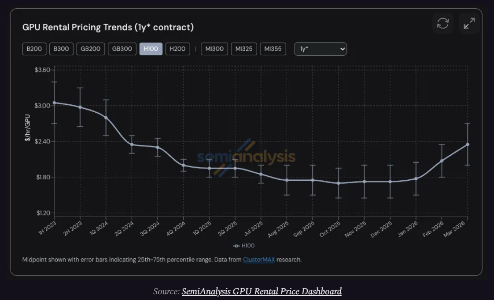](https://substackcdn.com/image/fetch/$s_!mPei!,f_auto,q_auto:good,fl_progressive:steep/https%3A%2F%2Fsubstack-post-media.s3.amazonaws.com%2Fpublic%2Fimages%2F2e8d4ec5-b00a-4c79-ae02-1076e907bf5d_1122x684.png)

semi analysis

SemiAnalysis isn’t just bullish because of the price. In their own experience sourcing compute, literally everything is sold out.

[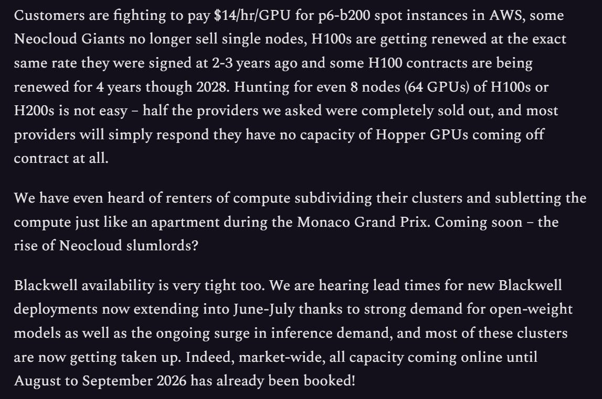](https://substackcdn.com/image/fetch/$s_!oB0E!,f_auto,q_auto:good,fl_progressive:steep/https%3A%2F%2Fsubstack-post-media.s3.amazonaws.com%2Fpublic%2Fimages%2F01d263ac-cbc9-4e34-a62d-816bf0a43fa4_1147x762.png)

sold out. source: semianalysis

Compounding the demand shock is the silicon shortage supply shock also being heavily supported in empirical evidence. N3 and memory are harder to find than water in a desert. Thus, I’m doubtful these rental price patterns are gonna mean revert.

More importantly, I am very bullish Nvidia vs ASICs. And ironically, the best way to express this trade isn’t Nvidia itself but actually the neoclouds.

The reasoning behind this bullishness is three fold. First, scaling laws are NOT slowing down in the slightest. Claude Mythos is something like a 10T parameter model that is miles ahead of even *Opus 4.6*. This means more training workloads where Nvidia is still unbeatable.

Second in inference we are shifting from ultra-optimized systems to chaotic agentic workloads. An institutional investor on X, Evergreen Capital (you guys should go follow) posted a really thought provoking take on why Anthropic banned OpenClaw usage through the subscription (now only available via API).

[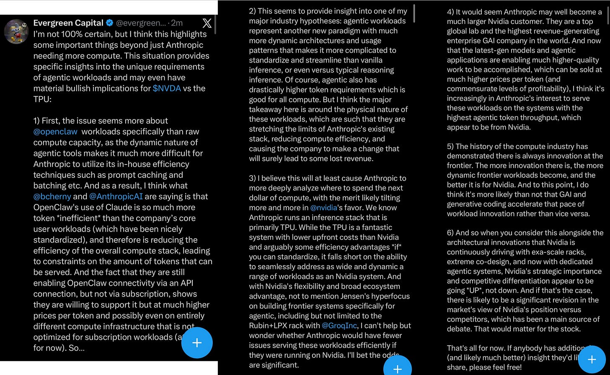](https://substackcdn.com/image/fetch/$s_!KP4k!,f_auto,q_auto:good,fl_progressive:steep/https%3A%2F%2Fsubstack-post-media.s3.amazonaws.com%2Fpublic%2Fimages%2Fd175de94-8dfb-422a-8ab4-6f0e8bb0b715_1661x1020.png)

my thoughts are provoked

Basically, the logic goes that the consensus is that this is only about Anthropic needing more compute. But think about it. Why only ban OpenClaw through the subscription instead of usage limits? That seems like it would make the public backlash worse?

Anthropic runs most of their inference through the TPU with efficiency techniques like prompt caching and batching. Basically the mindset of an ASIC: Rigid but efficient.

Agents are not like that. OpenClaw workloads are chaotic and prefer Nvidia’s flexible architecture. It also proves that we CAN’T predict what AI will look like a year into the future, ever. Who would have seen OpenClaw coming far enough in advance to design an ASIC for it?

Nvidia supports all forms of AI as it evolves while moving at the speed of AI. As the hyperscalers waste their time standardizing around an ASIC, the neoclouds will gain share.

Third, Nvidia is the first adopter of scale-up optics. They had a breakthrough in die-to-die clock forwarding over optics enabling intra-rack scale-up CPO to start in Feynman and produce massive all-to-all coherent scale-up domains. In plain English, humongous groups of GPUs that traditionally could not talk to each other as one brain can now do so because they can talk using light. This is a massive advantage for training and MoE inference that ASICs cannot match.

Have a good day!

If you enjoyed, please like, comment, restack or share. It helps a lot.

[Share](https://www.jasonschips.ai/p/neocloud-microeconomics?utm_source=substack&utm_medium=email&utm_content=share&action=share&token=eyJ1c2VyX2lkIjoxNDAwMjQ1LCJwb3N0X2lkIjoxOTMzMDMxMDgsImlhdCI6MTc3ODU1MTQwMiwiZXhwIjoxNzgxMTQzNDAyLCJpc3MiOiJwdWItNjY2NDM1NiIsInN1YiI6InBvc3QtcmVhY3Rpb24ifQ.1Ecvo0YqxuJJQ1UznpdZ8cPCS0NQCK6gg1fjKeUFdk4)