Investing is like Among Us.

Our job is to look for imposters. In our universe of equities, which don’t belong? Which are mispriced? By looking for the outliers, we generate alpha.

Today, the imposter is Suss. (pun intended)

[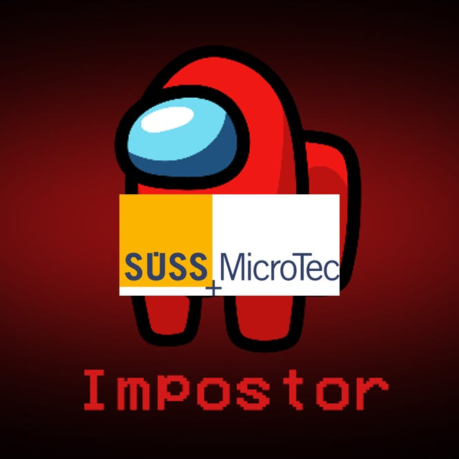](https://substackcdn.com/image/fetch/$s_!cfmM!,f_auto,q_auto:good,fl_progressive:steep/https%3A%2F%2Fsubstack-post-media.s3.amazonaws.com%2Fpublic%2Fimages%2F6930e96e-8460-4b8a-a88d-97a83a7ff785_665x666.png)

#### Contents

1. Introduction
2. Advanced Packaging

   1. Temporary Bonding
   2. Hybrid Bonding
   3. Coaters & Developers
   4. Mask Aligners & UV Scanners
3. Front-End Photomask Solutions
4. Cyclical Trough
5. Revenue Build, EPS Estimates, DCF Model

---

Please Suss-cribe

Subscribed

*By accessing this content, you acknowledge and agree to our [terms and conditions.](https://jasonschips.substack.com/p/terms-and-conditions) This research is **not financial advice**.*

***I can build you custom models for any semis/AI company**. If interested, please reach out at jasonschips@gmail.com.*

---

## Introduction

The thesis is both really simple and really complicated. Really simple because you can describe it in one sentence:

**Suss MicroTec has near 100% revenue exposure to leading edge semiconductor equipment (advanced packaging & front-end logic) trading at EV/Revenue multiples 1/3 to 1/5 of US semicap majors.**

[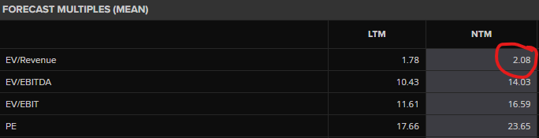](https://substackcdn.com/image/fetch/$s_!iRq9!,f_auto,q_auto:good,fl_progressive:steep/https%3A%2F%2Fsubstack-post-media.s3.amazonaws.com%2Fpublic%2Fimages%2F56defab6-54e1-4df3-8649-fb5d45c18ada_684x175.png)

I care about EV/Revenue multiples because of operating leverage. If we really get a massive semicap cycle like some say, going from 5% to 25% margins is a lot more meaningful than going from 20% to 40%.

Really complicated because they have 6 distinct product segments that each have their own market dynamics.

So where should we start?

Suss MicroTec gets 70% of their revenue from advanced packaging and 30% from the front-end.

[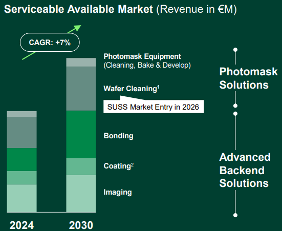](https://substackcdn.com/image/fetch/$s_!5p9t!,f_auto,q_auto:good,fl_progressive:steep/https%3A%2F%2Fsubstack-post-media.s3.amazonaws.com%2Fpublic%2Fimages%2F19405a5d-a2d1-4a31-b9c3-2ba461918615_551x451.png)

In advanced packaging, they sell five types of tools: Temporary Bonders, Hybrid Bonders, Coaters & Developers, UV Scanners, and Mask Aligners.

They participate in the front-end through Photomask Solutions, which include cleaning tools and bake & develop tools.

[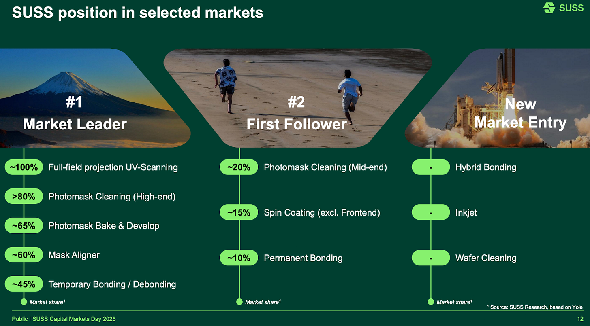](https://substackcdn.com/image/fetch/$s_!Aobp!,f_auto,q_auto:good,fl_progressive:steep/https%3A%2F%2Fsubstack-post-media.s3.amazonaws.com%2Fpublic%2Fimages%2F409e16a9-8137-4b2d-9d5f-ecdcb7806960_1600x886.png)

A couple of their tools are monopolies, a couple have majority market share, and a bunch of them are new entrant call options.

**And this is all inside a little company worth less than €1b**.

Since there are so many damn tools and markets and cool stuff that they do this writeup unfortunately has to remain quite surface level.

## Advanced Packaging

[

#### Short n' Casual Intro to Packaging

[Jason's Chips](https://substack.com/profile/112809522-jasons-chips)

·

Feb 15

[Read full story](https://www.jasonschips.ai/p/short-n-casual-advanced-packaging)](https://www.jasonschips.ai/p/short-n-casual-advanced-packaging)

Advanced packaging semicap names are a fan favorite. See Camtek multiples:

[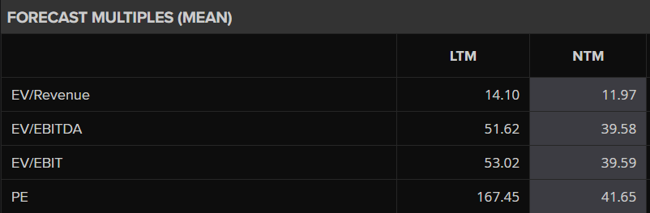](https://substackcdn.com/image/fetch/$s_!Hw6t!,f_auto,q_auto:good,fl_progressive:steep/https%3A%2F%2Fsubstack-post-media.s3.amazonaws.com%2Fpublic%2Fimages%2F969d8ed0-7cc3-49d9-ad9a-96ef40d351b3_802x263.png)

This is because advanced packaging gives you **pure exposure to AI-related fab capex**. Which is actually a lot harder than you think if you really try to dig around for semicaps. AMAT and friends very diversified. Front-end names are great but you really have two choices there: ASML and KLA. Both of which I like a lot but are very expensive.

There is a caveat that leading edge logic is probably a more attractive market than advanced packaging nowadays since “CoWoS bottleneck” is very 2024 coded and we’ve moved on to N3 capacity bottleneck. But that doesn’t mean you can’t get great returns in advanced packaging.

You do not have to be a wizard to figure out that this is a good market. There are basically two end markets: CoWoS and HBM. Both scale-ish with Nvidia shipments and should outgrow overall WFE.

[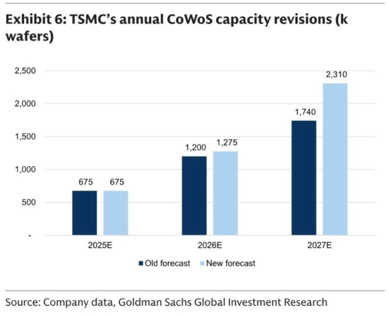](https://substackcdn.com/image/fetch/$s_!jcOs!,f_auto,q_auto:good,fl_progressive:steep/https%3A%2F%2Fsubstack-post-media.s3.amazonaws.com%2Fpublic%2Fimages%2Ff296033e-887a-428c-bf3f-b8131a0a3b4f_757x614.png)

[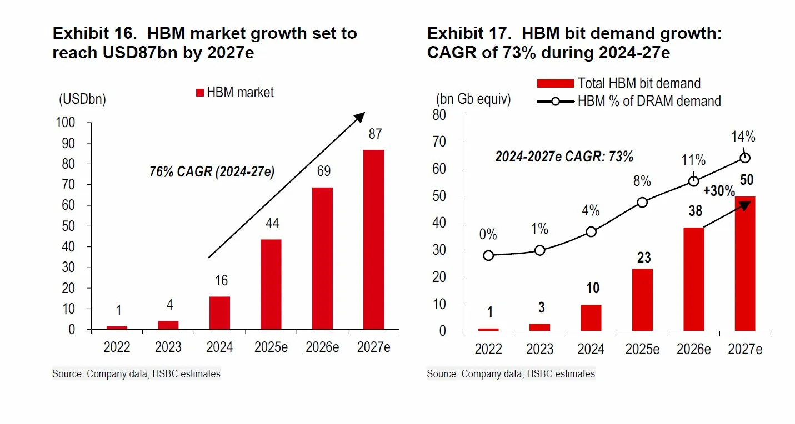](https://substackcdn.com/image/fetch/$s_!kune!,f_auto,q_auto:good,fl_progressive:steep/https%3A%2F%2Fsubstack-post-media.s3.amazonaws.com%2Fpublic%2Fimages%2Ff80d4fb6-9dcd-459e-a444-2a90ecbdd501_1431x764.png)

#### Temporary Bonding

HBM is a stack of pancakes.

Where each of the DRAM die “pancakes” within the HBM stack is actually a lot thinner than a regular DRAM die.

So thin that you literally can’t transport them around the fab because it would be like trying to pick up wet tissue paper.

[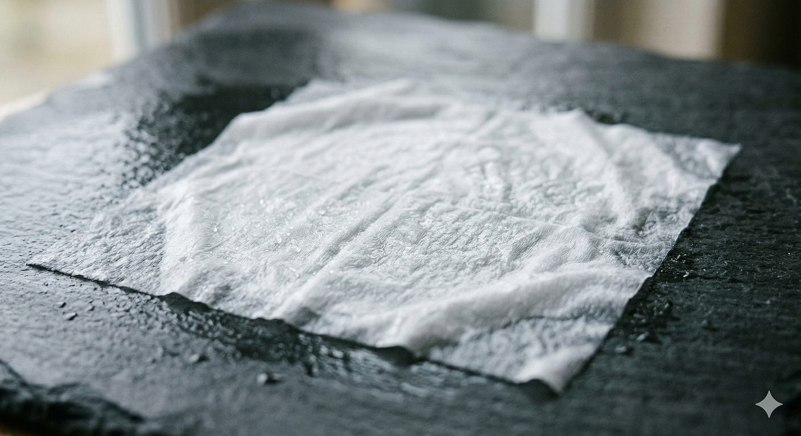](https://substackcdn.com/image/fetch/$s_!q2c-!,f_auto,q_auto:good,fl_progressive:steep/https%3A%2F%2Fsubstack-post-media.s3.amazonaws.com%2Fpublic%2Fimages%2F8972f018-95d8-4c7e-b72e-449f1a2dead7_2816x1536.png)

But as with all things in semiconductors, the *impossible is always possible*. Suss has a solution.

Temporarily bond the wet-tissue active wafer to a hard rigid glass carrier. This carrier provides mechanical support throughout all various fab processes like grinding, TSV formation, and interconnect steps. Once processing is complete, the bond is released (via UV laser) and the wafer is transferred for stacking.

[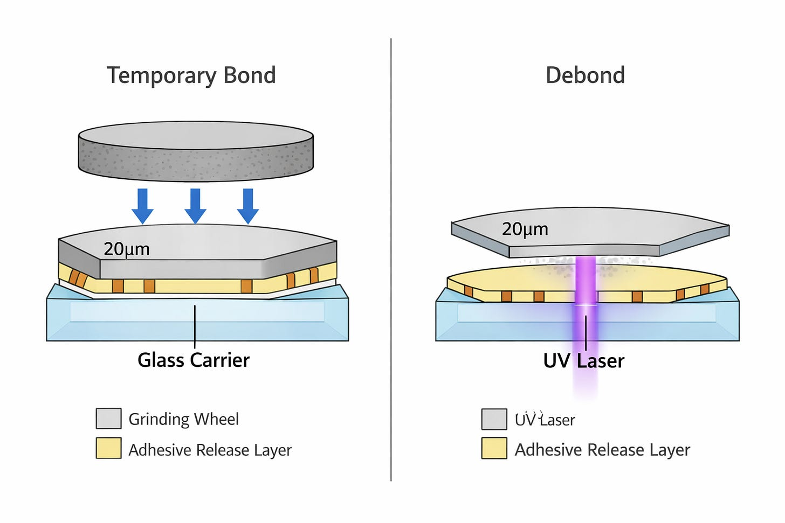](https://substackcdn.com/image/fetch/$s_!cS9k!,f_auto,q_auto:good,fl_progressive:steep/https%3A%2F%2Fsubstack-post-media.s3.amazonaws.com%2Fpublic%2Fimages%2F0c42bacb-b3ad-4580-a3ac-0e5794d3bd93_1536x1024.png)

Suss has 45% share overall but at TSMC they actually have 90%+ share.

In the rest of the market, they have 70% share at Samsung and Micron but no share at SK Hynix.

[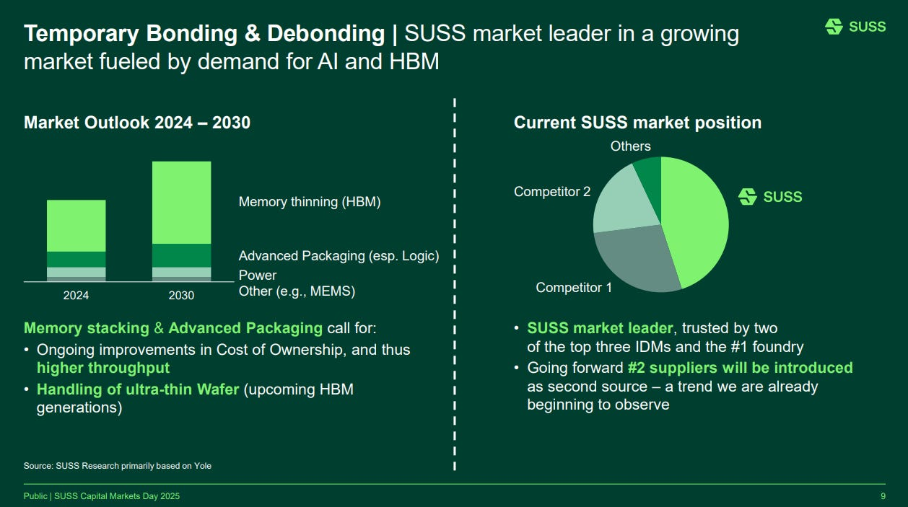](https://substackcdn.com/image/fetch/$s_!Zb-d!,f_auto,q_auto:good,fl_progressive:steep/https%3A%2F%2Fsubstack-post-media.s3.amazonaws.com%2Fpublic%2Fimages%2F663f128c-0a1d-4bd1-be52-bdb61950cca5_1258x703.png)

#### Hybrid Bonding

For the uninitiated, hybrid bonding is pressing two chips together, so the copper pads align and fuse with each other.

If you’ve never researched packaging, that sounds like common sense.

But the traditional way is actually using solder balls. Big spherical **things** that prevent you from packing connections tightly (or else you get short circuit). See why everyone is so excited about hybrid bonding?

[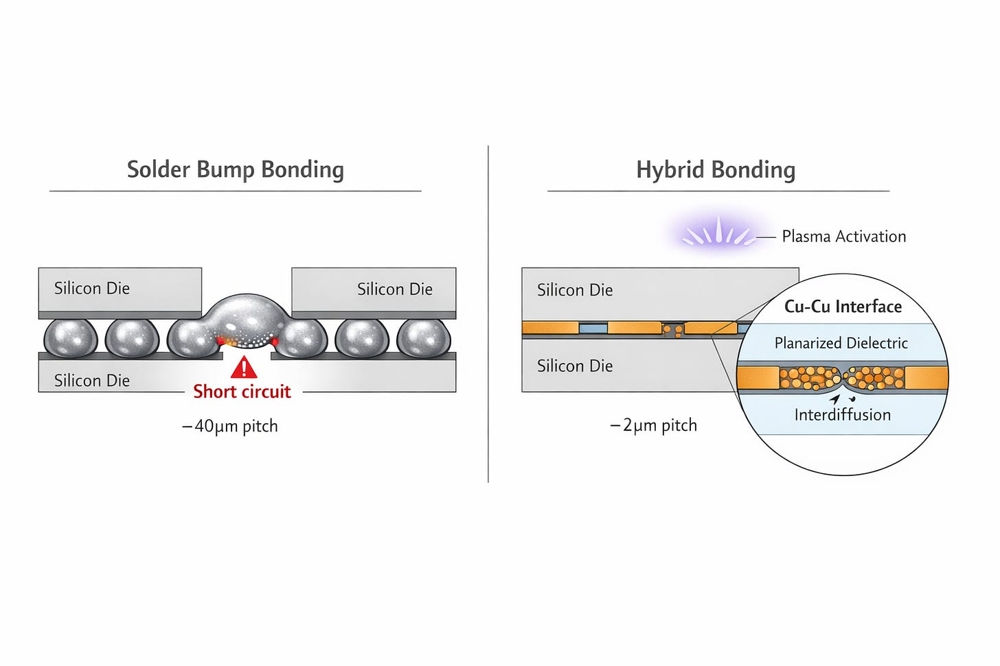](https://substackcdn.com/image/fetch/$s_!mCYZ!,f_auto,q_auto:good,fl_progressive:steep/https%3A%2F%2Fsubstack-post-media.s3.amazonaws.com%2Fpublic%2Fimages%2Fd2ec97f8-6231-4729-abe5-bc004784ca64_1536x1024.png)

There are two main types of hybrid bonding.

Wafer-to-wafer and die-to-wafer. Hopefully I don’t need to explain to you what these mean.

Wafer-to-wafer has bad yield and good throughput. You don’t know if the dies you’re bonding are good, but you can bond lots of them. Die-to-wafer has good yields but is sloooow.

But good yields are very important so D2W is much more commonly used.

[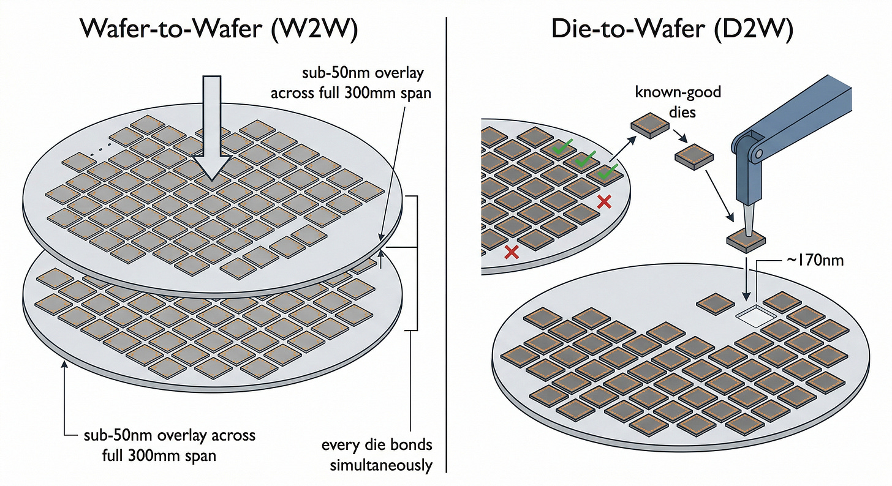](https://substackcdn.com/image/fetch/$s_!mDPI!,f_auto,q_auto:good,fl_progressive:steep/https%3A%2F%2Fsubstack-post-media.s3.amazonaws.com%2Fpublic%2Fimages%2F9e8ff994-3a15-4c9a-85e3-062f4088f4e5_2816x1536.png)

Suss is not the leader here. But if you think you can pick up a hybrid bonding leader at €1b… lol.

(Besi is 14x the size of Suss.)

[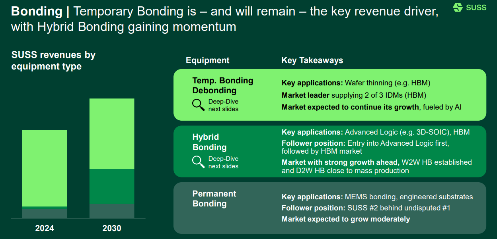](https://substackcdn.com/image/fetch/$s_!5Owv!,f_auto,q_auto:good,fl_progressive:steep/https%3A%2F%2Fsubstack-post-media.s3.amazonaws.com%2Fpublic%2Fimages%2Ffa12f442-4e35-4901-9dba-fd2bb241b70c_1249x602.png)

But if they can break into the market it would be huge. Management thinks they can get a slice, enough for it to be 1/2 as big as their temporary bonding franchise by 2030. The cool thing about being a smol company is that even a small slice makes a big difference.

[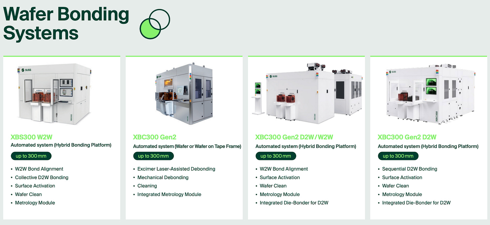](https://substackcdn.com/image/fetch/$s_!bEMl!,f_auto,q_auto:good,fl_progressive:steep/https%3A%2F%2Fsubstack-post-media.s3.amazonaws.com%2Fpublic%2Fimages%2Fcdedb276-bbd3-4ae4-8420-174fc0b723f9_1600x739.png)

Their focus is mostly W2W. As you can see only one of those tools above is for D2W specifically.

What’s their wedge?

First, they are really good at surface prep because that skill carries over from temporary bonding. If the surface prep isn’t perfect, the bond fails regardless of alignment accuracy, so in fact customers may want the prep and bond steps from a single qualified vendor.

Second, any dual sourcing is a tailwind. Foundries like dual sourcing to reduce vendor risk. Pretty simple.

Third and most importantly, they have a proprietary hybrid boning technology called the **hybrid bonding pin**.

The core technical challenge in W2W hybrid bonding is air entrapment. Bring two wafers together flat and air gets trapped between them, preventing the van der Waals bond from forming and delaminating under thermal anneal. This pin imperceptibly bows the top wafer into a controlled convex shape, initiating contact at the geometric center and letting the bond wave propagate outward radially, pushing air ahead of it rather than trapping it. By precisely controlling the pin’s retraction speed, SUSS manages the mechanical wave propagation to minimize shear stress as the two crystal lattices lock together.

The result is sub-50nm post-bond overlay accuracy. Which is an important performance metric. Which positions SUSS as the credible second source.

#### Coaters & Developers

If you watched one of the dozens of YouTube videos about ASML you know what spin coating is.

Before lithography you need to coat the wafer with photoresist. To do that you dispense it over the center and then spinnnnnn.

[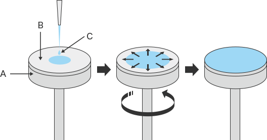](https://substackcdn.com/image/fetch/$s_!TzAm!,f_auto,q_auto:good,fl_progressive:steep/https%3A%2F%2Fsubstack-post-media.s3.amazonaws.com%2Fpublic%2Fimages%2F944f6c74-d954-4d89-a266-eaaf051c0e31_528x277.png)

This process is needed in the backend too. Why? Because lithography is also needed in the backend to pattern the **redistribution layers** that are basically the roads that connect the chips on the CoWoS wafer or whatever your favorite packaging platform is.

Suss has a fairly small 15% share here and are #3. #1 is TEL.

As such, margins are pretty bad for spin coaters. Simple product and fragmented market.

But spin coaters have problem.

If you spin the wafer your stuff unfortunately gets flung off the surface. In fact, roughly 95% of the photoresist you dispensed ends up as waste. Backend photoresist is very expensive.

So there is a new type of tool in the market called Inkjet.

Instead of flooding the surface and letting centrifugal force do the work, you precisely jet droplets exactly where you need them. Utilization goes from ~5% to close to 100%.

[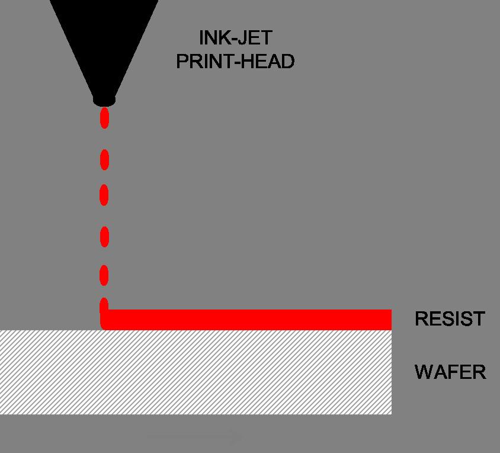](https://substackcdn.com/image/fetch/$s_!mH6S!,f_auto,q_auto:good,fl_progressive:steep/https%3A%2F%2Fsubstack-post-media.s3.amazonaws.com%2Fpublic%2Fimages%2F55fe3e95-cc75-4140-ab18-bfd44caf18ef_844x764.jpeg)

Why did SUSS enter inkjet?

Mostly innovator’s dilemma. Spin coating gets progressively less viable over time. In addition, there are a bunch of incentives for Suss to be early.

Inkjet has meaningfully higher margins than spin coating because the process complexity creates a pricing umbrella that TEL can’t as easily erode. And the chemical savings give customers a compelling ROI story that makes the tool easier to sell even at a premium.

#### Mask Aligners & UV Scanners

These two tools do two different versions of the same thing.

In the coaters section I said

> *…lithography is also needed in the backend to pattern the **redistribution layers** that are basically the roads that connect the chips on the CoWoS wafer or whatever your favorite packaging platform is.*

These tools are responsible for that actual lithography.

There are three different classes of tools that co-exist in the fab. Each prints a different feature size (kind of like DUV vs EUV).

**Mask aligners (Suss)** — the simplest tool. The mask sits in direct contact with or very close proximity to the wafer surface (contact/proximity exposure). No reduction optics — it’s a 1:1 projection. Light floods the whole wafer in one shot. Resolution is limited to roughly 1-10µm. Used for thick resist applications, MEMS structures, through-wafer vias, coarse metal layers, anything where you need deep focus into tall topography but don’t need fine resolution. Cheap to run, high throughput, works well on non-planar surfaces.

**UV scanners (Suss)** — one step up in resolution. Also 1X (no reduction), but uses projection optics and a continuous scanning motion to expose the full wafer in a single unstitched pass. Resolution roughly 1-3µm. The key use case is large-area backend structures — CoWoS interposers, RDL routing layers, fan-out packaging — where the die or package exceeds the reticle field of a stepper and stitching would kill yield. This is the specific niche SUSS owns.

**Steppers (Canon dominates)** — highest resolution backend tool. Uses reduction optics (2X or 4X) to project a smaller, highly detailed reticle onto a portion of the wafer, then steps and repeats across the surface. Gets down to sub-1µm resolution. Used for the finest RDL layers, fine bump patterning, anything requiring tight CD control. The tradeoff is stitching error at field boundaries and throughput penalty on large packages.

[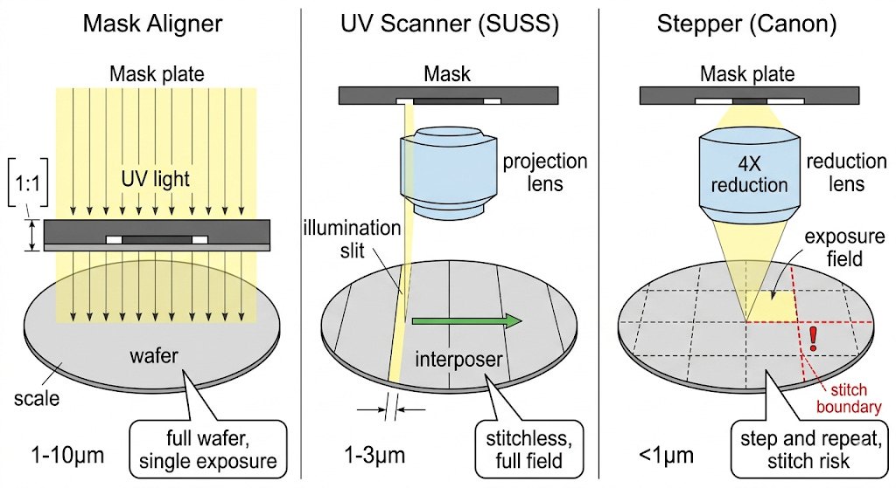](https://substackcdn.com/image/fetch/$s_!foXe!,f_auto,q_auto:good,fl_progressive:steep/https%3A%2F%2Fsubstack-post-media.s3.amazonaws.com%2Fpublic%2Fimages%2F41a4442c-a7c4-4f51-b900-de31c4aba318_1024x559.png)

Suss has 60% share in mask aligners and a monopoly in UV scanners.

Mask aligners is a stagnant/mature market as processes become more advanced.

UV scanners is very important for CoWoS and they are sole source at TSMC. Once a tool is qualified into a process layer at TSMC, it doesn’t get swapped out. The integration is very deep. Process recipes, defect signatures, yield learning, PDK parameters all assume that specific tool’s optical characteristics.

In conclusion, UV scanners essentially scale with CoWoS expansion.

## Front-End Photomask Solutions

Photomasks are those stencils in the ASML lithography machine that the light shines through. A single particle on the mask will ruin every chip printed until someone realizes something is wrong. That’s why cleaning and processing the thing (what Suss does) is so important.

[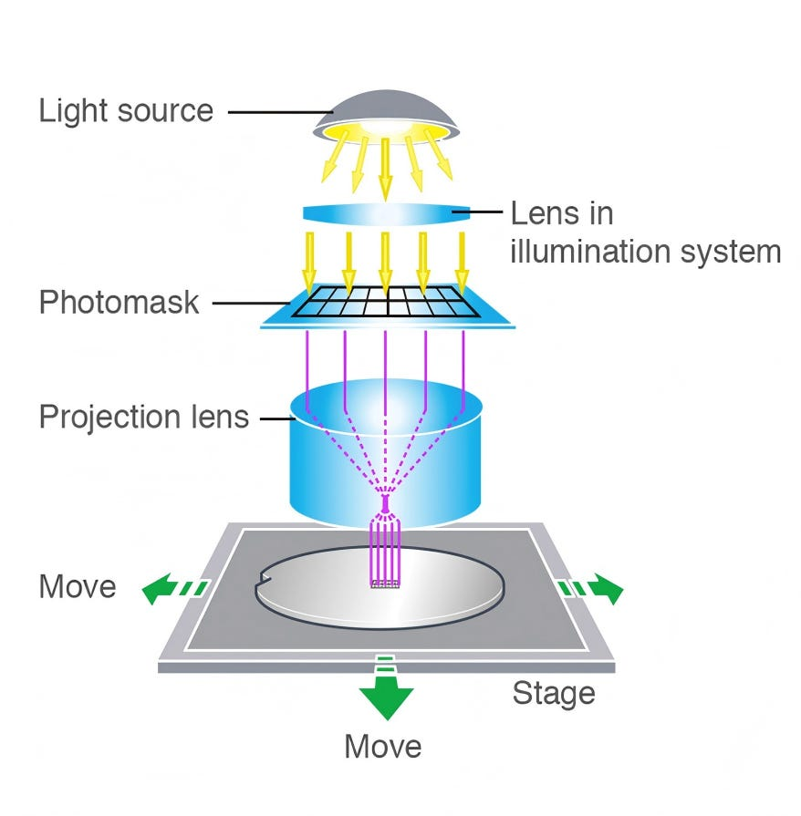](https://substackcdn.com/image/fetch/$s_!jWdV!,f_auto,q_auto:good,fl_progressive:steep/https%3A%2F%2Fsubstack-post-media.s3.amazonaws.com%2Fpublic%2Fimages%2Fb14e1f18-95cb-4909-88e8-8f9ecdd195ac_878x895.png)

There are two separate processes Suss is involved in. First is cleaning, which is self-explanatory. Second is bake & develop. After a mask is exposed during its fabrication process, the bake step thermally hardens the exposed photoresist and the develop step washes away the unexposed portions, revealing the final absorber pattern that defines the circuit features on the mask.

[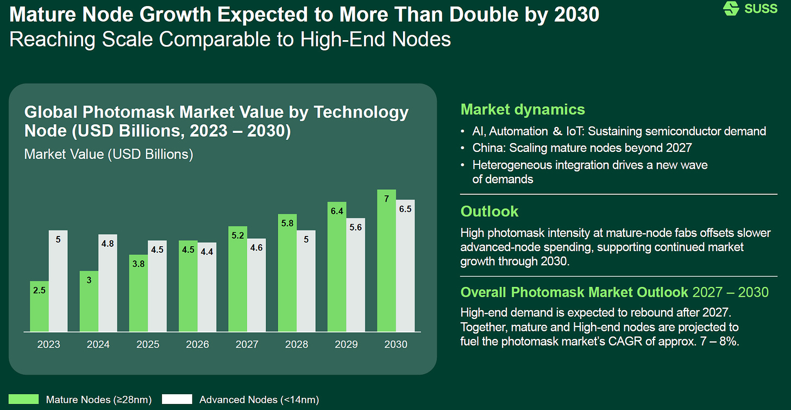](https://substackcdn.com/image/fetch/$s_!ZWRA!,f_auto,q_auto:good,fl_progressive:steep/https%3A%2F%2Fsubstack-post-media.s3.amazonaws.com%2Fpublic%2Fimages%2F5647b2f3-4a53-4d42-b31f-1f8428d28f7d_1943x1009.png)

Seasoned semis investors probably notice something strange.

> *Mature nodes is growing faster than advanced nodes? That is really strange. That probably means they structurally undergrow EUV shipments or mature nodes are becoming more photomask intensive for whatever reason.*

No. That’s probably not the case. This slide was from their capital markets day a year ago. Back then, N3 capacity was **fine**. ASML was in a deep drawdown. Memory makers were not begging ASML for EUV to do node transitions to resolve the DRAM crisis. In fact, DRAM wasn’t even in an upcycle yet! These numbers are so outdated they might as well be useless.

Photomask solutions should track EUV system shipments closely.

Mature nodes are 45% of the market while advanced nodes are 55%. Within advanced nodes they have a **near monopoly** on photomask cleaning. Within mature nodes they have only 15% share. Which means the VAST MAJORITY (80%+) of that 30% chunk of their revenue is **directly correlated to ASML EUV shipments**.

If you are bullish ASML, you have to be be bullish Suss.

## Cyclical Trough

They will have a down year in 2026 that was widely anticipated by the sell-side and confirmed in earnings yesterday.

[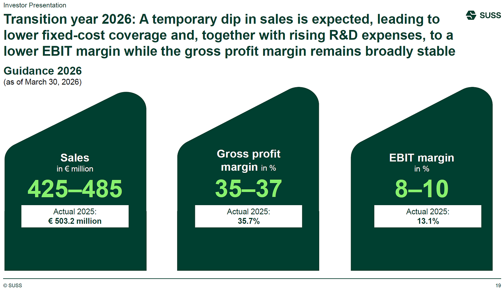](https://substackcdn.com/image/fetch/$s_!VeVs!,f_auto,q_auto:good,fl_progressive:steep/https%3A%2F%2Fsubstack-post-media.s3.amazonaws.com%2Fpublic%2Fimages%2Ffe7e1a5a-1cac-47f4-bc63-f3856b5b1a38_1912x1108.png)

The reason is quite simple: As the HBM cartel transitions to HBM4, there is a pause in temporary bonder orders to re-tool in 2026.

This manifests as a low starting backlog / weak 2025 order trend problem, especially salient after a huge AI-driven 2024-25 surge results in bad comps. Mix is also worse in the trough as their bonders are relatively higher margin.

We should see this resolve no problem in 2027. This is in consensus and known by most market participants. It just looks scary at first glance so maybe keeps some marginal buyers out. There is nothing structurally wrong with the company.

## Revenue Build, EPS Estimates, DCF Model

Below I share my projections for the 7 product lines in a detailed revenue build with segment-level shipment, ASP, and GM assumptions. Then, along with capex and aftermarket revenue projections, turn it into income statement EPS forecasts. And finally building a DCF.

I’ve also lowered my monthly subscription price by 30% so if you haven’t subscribed yet now is a great time to do so.

[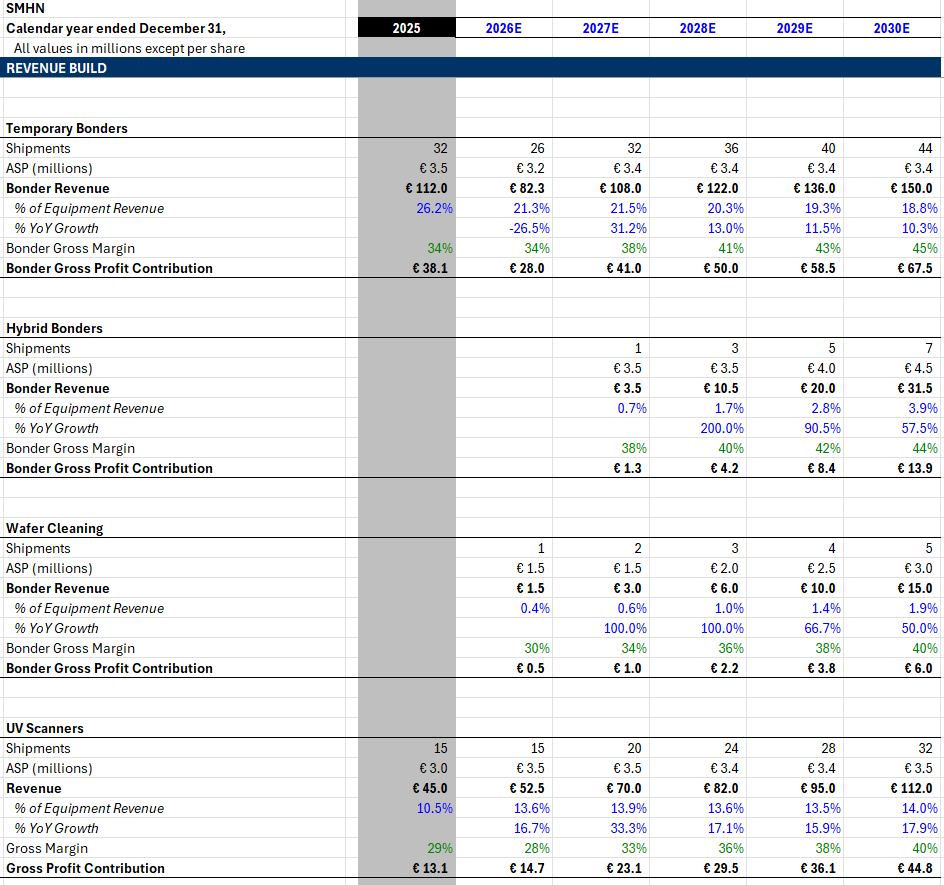](https://substackcdn.com/image/fetch/$s_!WVQc!,f_auto,q_auto:good,fl_progressive:steep/https%3A%2F%2Fsubstack-post-media.s3.amazonaws.com%2Fpublic%2Fimages%2F7982f706-1465-48cc-a987-d0373a15c5fa_944x885.png)

[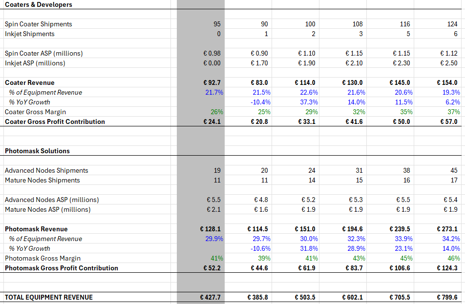](https://substackcdn.com/image/fetch/$s_!SPKz!,f_auto,q_auto:good,fl_progressive:steep/https%3A%2F%2Fsubstack-post-media.s3.amazonaws.com%2Fpublic%2Fimages%2F4b8d45de-3bf9-45bb-a9e0-3e0f6e017304_952x623.png)

[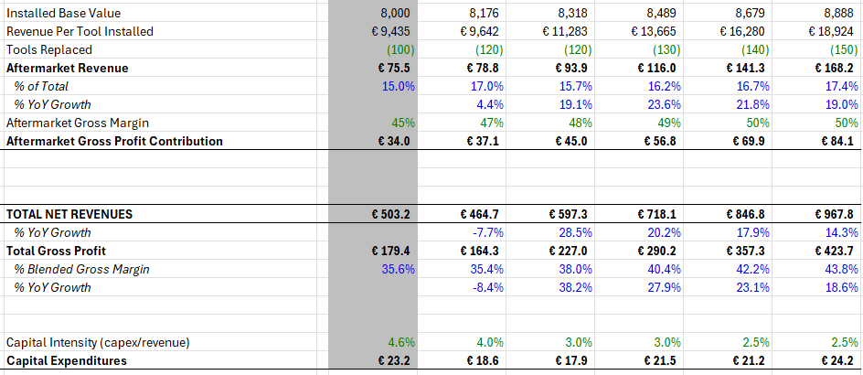](https://substackcdn.com/image/fetch/$s_!oRQe!,f_auto,q_auto:good,fl_progressive:steep/https%3A%2F%2Fsubstack-post-media.s3.amazonaws.com%2Fpublic%2Fimages%2Ffc3df9f8-b3de-45f9-953a-3699cac5fedd_944x410.png)

Mask aligners are a mostly stagnant and bad market so it has the slowest growth.

Hybrid bonding and cleaning are new markets.

The rest of advanced backend generally grow with the advanced packaging market and management has specified that bonders contribute the most to advanced backend revenue.

I think advanced nodes photomask solutions has the fastest growth out of all their products because of the huge frontend leading edge logic shortage.

I used pretty conservative assumptions here and we could very likely see upside.

[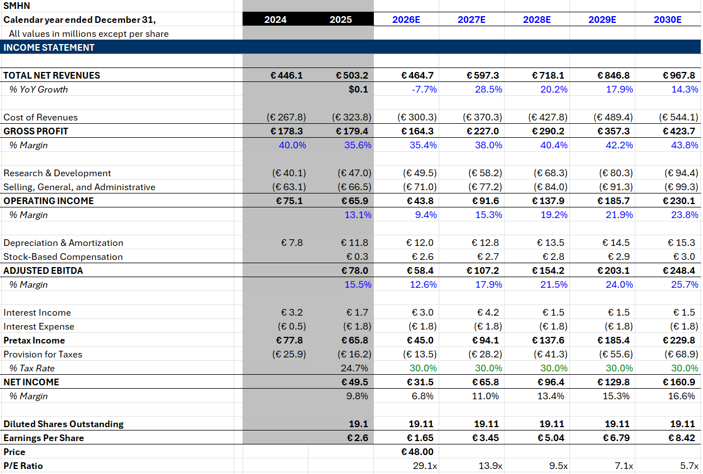](https://substackcdn.com/image/fetch/$s_!RiLc!,f_auto,q_auto:good,fl_progressive:steep/https%3A%2F%2Fsubstack-post-media.s3.amazonaws.com%2Fpublic%2Fimages%2F7386e7a4-f3c1-4b8e-8537-3256f0660a0a_1258x850.png)

As you can see, in a case that sits between management’s (outdated) guidance of a teens CAGR and the expected growth of the advanced packaging/leading edge markets, Suss is hilariously cheap.

[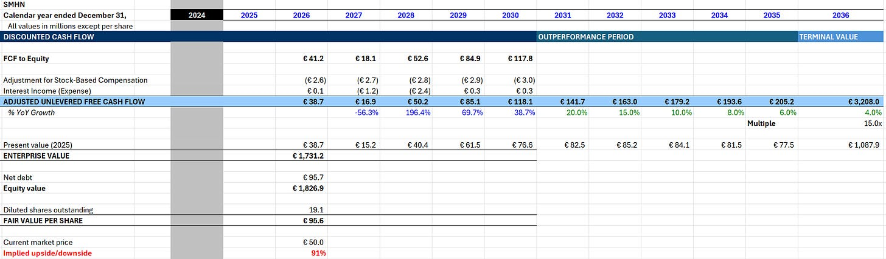](https://substackcdn.com/image/fetch/$s_!t7Ls!,f_auto,q_auto:good,fl_progressive:steep/https%3A%2F%2Fsubstack-post-media.s3.amazonaws.com%2Fpublic%2Fimages%2F6a700f4b-908b-45bd-8afe-d84425b42710_2119x623.png)

Used a beta of 1.5 here. I am starting to like DCFs less and less but it exists as a sanity check for valuation based on a “state of the world”.

## Thanks for Reading!

If you enjoyed, please like, comment, restack or share. It helps a lot.

[Share](https://www.jasonschips.ai/p/the-imposter-is-suss-microtec?utm_source=substack&utm_medium=email&utm_content=share&action=share&token=eyJ1c2VyX2lkIjoxNDAwMjQ1LCJwb3N0X2lkIjoxOTIwNTE0ODgsImlhdCI6MTc3ODU1MTQyOCwiZXhwIjoxNzgxMTQzNDI4LCJpc3MiOiJwdWItNjY2NDM1NiIsInN1YiI6InBvc3QtcmVhY3Rpb24ifQ.JrhJ-jfCnX1h9r44eK42KsU1Kf5sATFXnn5b0hqFGGo)