It is pretty well established that CoreWeave (and neoclouds in general) is a shitco.

* $20b+ of high interest debt and 3x more capex than revenue.
* Running a commodity service (GPU rental) with a monopolistic seller (Nvidia) and differentiated, concentrated buyers (hyperscalers and AI labs).
* Holding an asset/installed base that Nvidia obsoletes with each new generation of chips.

Everyone knows this. Me included — CoreWeave used to be one of my least favorite AI infra companies. It’s so well known that in fact CoreWeave has nearly 25% short interest.

[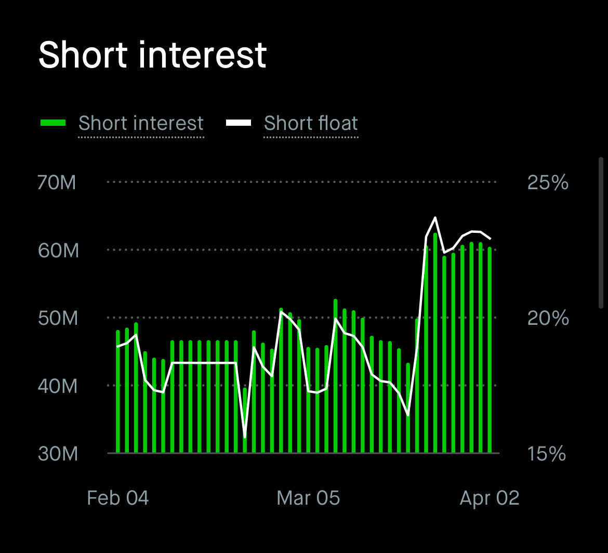](https://substackcdn.com/image/fetch/$s_!fbmn!,f_auto,q_auto:good,fl_progressive:steep/https%3A%2F%2Fsubstack-post-media.s3.amazonaws.com%2Fpublic%2Fimages%2F5edddb99-5fa7-4ffe-a968-9a04d522db65_1170x1064.jpeg)

shitco

However, Situational Awareness LP, the hedge fund ran by Leopold Aschenbrenner, has CoreWeave as (likely) its largest long with a position consisting of both long calls and long shares.

[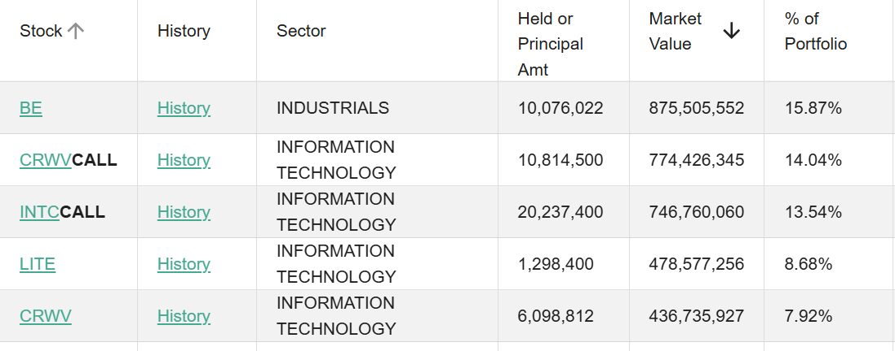](https://substackcdn.com/image/fetch/$s_!jwds!,f_auto,q_auto:good,fl_progressive:steep/https%3A%2F%2Fsubstack-post-media.s3.amazonaws.com%2Fpublic%2Fimages%2Fabf10ddc-90b2-4893-ac2f-ebc59dd70646_1097x432.png)

their other top holdings happen to be BE, LITE, and INTC, all of which are core positions for me too

I could never figure out the bull case for CoreWeave. Like I tried and tried out of sheer curiosity, not because I considered them as an investment, to figure out what the other side to this debate could possibly be.

*But it’s exactly this debacle which made it so interesting*. A company that has underperforming shares, is heavily shorted, with a bear case everyone knows. Yet one very sophisticated actor is long with ultra-high conviction (which means its no Qualcomm). There must be a bull case… every company has one?

**Then it clicked**. It clicked because I looked at it from an angle outside of traditional equity analysis. I was modeling out the AI supply chain using microeconomic theory for another article which led to some loooong conversations with Claude. That led me to turn the classic neocloud bear case into a formal microeconomic model, which resulted in the previous article about neocloud microeconomics.

I applied what I knew about the state of the supply chain as an input to the economic model which completely flipped the CoreWeave consensus on its head. But yes I also have a real financial model in Excel.

So bear with me today as I take you on a journey of microeconomics, vertical integration by proxy, the irony of generational obsolescence, Nvidia’s hardware advantage for agents, SemiAnalysis ClusterMAX Platinum and the software moat, the fast AGI trade, financing, options pricing, and the skill of thinking big.

**THIS IS THE STORY OF COREWEAVE**

[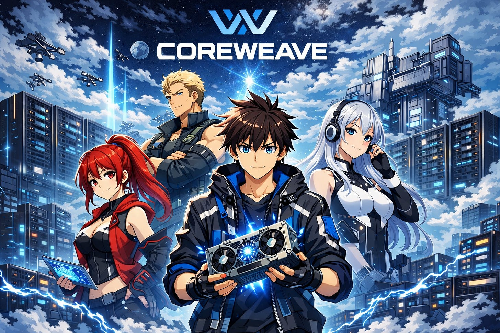](https://substackcdn.com/image/fetch/$s_!dXwn!,f_auto,q_auto:good,fl_progressive:steep/https%3A%2F%2Fsubstack-post-media.s3.amazonaws.com%2Fpublic%2Fimages%2F9cfb734d-5011-462f-8c6e-b0a86ca428e0_1536x1024.png)

---

subscribe if you like the stuff i write

Subscribed

*By accessing this content, you acknowledge and agree to our [terms and conditions.](https://jasonschips.substack.com/p/terms-and-conditions) This research is **not financial advice**.*

---

#### Contents

1. Microeconomics
2. Nvidia’s Vertical Integration by Proxy
3. Platinum Software
4. Fast AGI
5. The Mispriced Calls

## Microeconomics

The very underrated (and possibly best) way to understand where neoclouds fit into the AI supply chain is through microeconomics. The cool thing about economics is that it lets you truly internalize a concept, understanding why something works on a visceral level.

[

#### Neocloud Microeconomics

[Jason's Chips](https://substack.com/profile/112809522-jasons-chips)

·

Apr 7

[Read full story](https://www.jasonschips.ai/p/neocloud-microeconomics)](https://www.jasonschips.ai/p/neocloud-microeconomics)

The TLDR is that neoclouds operate in a (theoretically) perfectly competitive commodity market sandwiched between Nvidia above and model labs below, which means in equilibrium they earn zero economic profit (and are thus valued as shitcos). Every dollar of surplus in the AI stack flows to the differentiated players: Nvidia captures it through chip pricing power, and the labs capture it through token markup. The only three ways a neocloud escapes zero profit are a chip supply constraint lifting price above their cost structure, being first on a new GPU generation before the industry supply curve shifts, or a demand shock like Claude Code pulling old hardware back into the money. A neocloud’s bull case is one or more of the above happening causing massive excess returns and operating leverage to explode while their valuation is rock bottom.

Since I mentioned them as a “fun trade idea” on this writeup they have signed deals with Meta and Anthropic and are up 25%.

godlike timing

## Nvidia’s Vertical Integration by Proxy

CoreWeave is really the cloud computing division of Nvidia that is only minority owned and traded on an exchange.

Nvidia has a very strong incentive to cultivate a neocloud ecosystem so that their anchor customers are not all hyperscalers who are actively trying to design their own ASICs to compete with Nvidia.

Nvidia owns 13% of CoreWeave and gives them preferential access to new generations of GPUs. CoreWeave's S-1 states directly that it was “the first cloud provider to make NVIDIA GB200 NVL72-based instances generally available” and “among the first cloud providers to deploy high-performance infrastructure with NVIDIA H100, H200, and GH200.”

#### Generational Obselecense is Actually the Bull Case

All the bears point at GPUs getting better every generation for the neocloud bear case, arguing that their assets depreciate quickly.

What if I told you this is actually the bull case?

Let’s revisit the economics. Any cloud has two simultaneous shocks from Moore’s law: Reduction in market clearing price of FLOPs and reduction in marginal cost to serve them. Whether one offsets the other is purely a function of how new the cloud provider’s fleet is compared to the market-wide mix.

The bear case applies perfectly to the cloud provider that never shifts their fleet. The new GPUs means the market’s cost structure moves on without you and your old GPUs cannot command the premium they once did.

However the opposite applies when you move first. By adopting the newest generation before the market, you can extract the old rental price with your new cost structure, earning excess profits.

Neoclouds (and CoreWeave in particular) is able to leverage their speed of deployment, smaller size, and most importantly their relationship with Nvidia to gain access to the newest chips first.

CoreWeave co-founder Brannin McBee:

> “Nvidia has allotted a generous number of its latest AI server chips to CoreWeave and away from top cloud providers like AWS, even though supply is tight, because those companies are developing their own AI chips in an attempt to reduce their reliance on Nvidia.
>
> It certainly isn’t a disadvantage to not be building our own chips. I would imagine that that certainly helps us in our constant effort to get more GPUs from Nvidia at the expense of our peers.”

#### The Nvidia Hardware Advantage

Anthropic recently banned OpenClaw usage through subscription access. Why did they ban a specific application instead of just restricting usage further?

Usage caps are the obvious tool if the problem is raw token consumption. Subscription blocking is the tool you reach for when the problem is that the workload is breaking something deeper in your infrastructure — in this case, the efficiency stack that makes TPU economics work at all.

ASICs arepurpose-built for the workload profile you knew about when you designed them. Anthropic’s TPU deployment is tuned around prompt caching, request batching, and the predictable cadence of human users sending discrete messages. OpenClaw workloads are none of those things. They are dynamically branching, tool-calling, context-accumulating, and architecturally chaotic in a way that defeats batching and makes prompt caching largely irrelevant. Running them on a TPU stack optimized for the opposite workload profile does not just consume more tokens — it degrades the efficiency of every other request sharing that infrastructure.

The deeper problem is that this was not predictable. No one saw OpenClaw-style agentic workloads clearly enough, two years ago when TPU design decisions were being locked in, to spec an ASIC around them. That is not a failure of foresight. It is a structural property of how fast AI application paradigms evolve relative to ASIC development cycles. The workload that matters next year does not exist yet, which means the ASIC being designed today will be wrong for it.

Nvidia’s architecture does not have this problem. A GPU cluster does not need to know in advance what workload it will run. When OpenClaw emerged, Nvidia hardware absorbed it. When the next paradigm emerges, Nvidia hardware will absorb that too. The programmability is not a nice-to-have — it is the entire value proposition in a world where the workload frontier moves faster than silicon design cycles.

The optical scale-up story compounds this. Nvidia’s breakthrough in die-to-die clock forwarding over optics, enabling intra-rack coherent scale-up starting with Feynman, means that groups of GPUs which previously could not coordinate as a unified compute domain now can, communicating at the speed of light across what were previously hard interconnect boundaries. This matters enormously for MoE inference and for training runs that require all-to-all communication across large GPU pools. It is an architectural capability that emerges from the GPU’s general-purpose programmable substrate. ASICs cannot replicate it without being redesigned from scratch around the new communication paradigm, which takes years and costs billions.

Hyperscalers investing in proprietary silicon are making a bet that the workload distribution of the future resembles the workload distribution of the recent past, standardized enough to justify ASIC specialization. The OpenClaw episode is empirical evidence against that bet. As agentic workloads grow as a share of total AI compute, the rigidity premium that ASICs pay becomes a larger and larger liability. Neoclouds running Nvidia hardware do not pay that premium. They sit on general-purpose infrastructure that is correct for whatever comes next, even if nobody knows what that is yet.

Therefore, I think Neoclouds can command a substantial premium in rental price over cost of compute as agentic workloads are slowly forced away from ASICs. We are already seeing this play out as CoreWeave announced a new deal with Anthropic to rent them Nvidia hardware.

[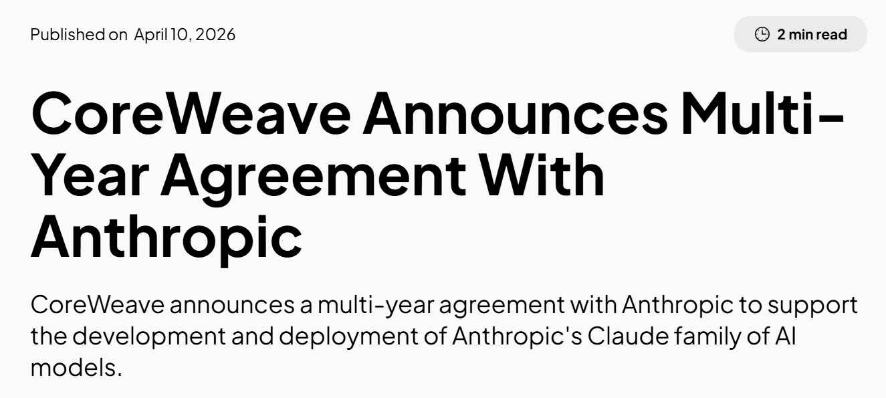](https://substackcdn.com/image/fetch/$s_!sDOZ!,f_auto,q_auto:good,fl_progressive:steep/https%3A%2F%2Fsubstack-post-media.s3.amazonaws.com%2Fpublic%2Fimages%2F8ae52640-850c-418c-b320-cdf54d87f04f_1325x595.png)

important deal

## Platinum Software

CoreWeave is the only cloud to achieve SemiAnalysis’s ClusterMAX Platinum rating. They ran it twice and CoreWeave came out on top each time. I modeled neocloud economics with an asterisk around perfect competition in that there is indeed differentiation among the cloud providers, which will be the focus of this section.

[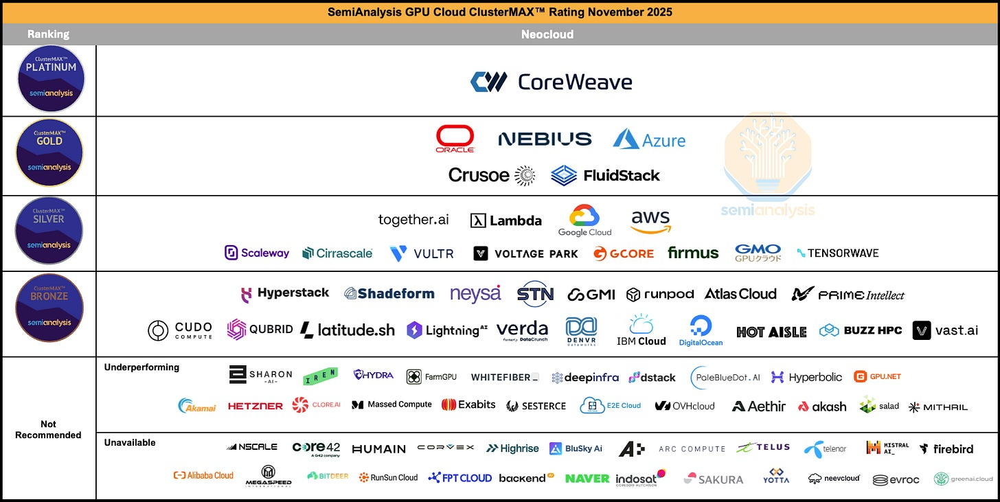](https://substackcdn.com/image/fetch/$s_!OXF3!,f_auto,q_auto:good,fl_progressive:steep/https%3A%2F%2Fsubstack-post-media.s3.amazonaws.com%2Fpublic%2Fimages%2Fc3e88b22-b4dd-46bf-b1d3-96e354e47e28_1738x873.png)

Source: SemiAnalysis

CoreWeave’s software stack is the product of thousands of engineering hours solving problems that only emerge at extreme scale, and that compounding expertise is nearly impossible for competitors to replicate overnight. Running a 10,000+ GPU cluster reliably is a fundamentally different engineering challenge than running 500 GPUs reliably. Failures that are statistical noise at small scale become constant, overlapping crises at frontier scale: GPUs falling off the PCIe bus, InfiniBand links flapping, silent data corruption producing wrong training outputs with no error message. CoreWeave has built proprietary systems (the Fleet Lifecycle Controller, Node Lifecycle Controller, Mission Control provisioning) that automate the detection, diagnosis, and remediation of these failures in real time, across hundreds of thousands of GPUs. Every week of operating these systems at scale generates new edge cases and new heuristics that feed back into the software. A competitor starting today would need to fail at scale for months or years before their tooling approached the same maturity.

The health check pipeline illustrates why this advantage compounds. During cluster bring-up, every node goes through a full burn-in sequence including InfiniBand network stress tests, NCCL collectives, and Nvidia’s TinyMeg2 for silent data corruption. Once deployed, passive checks run every few seconds monitoring thermals, ECC errors, XID codes, and link stability. Active checks run weekly on idle GPUs, including pairwise bandwidth tests against reference numbers and full Megatron training convergence validation. CoreWeave built custom NVML-based exporters because standard Nvidia DCGM telemetry doesn’t surface metrics like failing thermal paste signatures. They built a correlation engine that can determine whether a cluster of simultaneous errors points to a bad switch port or a bad compute tray based on whether the errors follow the hardware when it moves. This kind of diagnostic intelligence only exists because CoreWeave has been operating GB200 and GB300 NVL72 rack-scale systems for months while competitors are still struggling to bring them online.

The financial translation of all this software is pricing power. SemiAnalysis independently confirmed that CoreWeave commands a roughly 10-15% per-GPU-hour premium over direct neocloud competitors like Nebius, Crusoe, Lambda, and FluidStack, putting their pricing closer to the hyperscalers than to the neocloud pack. Customers pay this premium because the total cost of ownership math favors it. Meta’s Llama 3 paper documented 419 GPU server failures over 54 days of training on 16,000 H100s. Each failure means a job interruption, a rollback to the last checkpoint, and wasted GPU-hours. At $3/GPU-hour across thousands of GPUs, even a few percent improvement in uptime and goodput saves millions of dollars over a training campaign. CoreWeave’s monitoring and automated remediation directly reduce these wasted hours, and the savings exceed the pricing premium.

What makes this a durable moat rather than a temporary lead is the self-reinforcing loop between customers, scale, and engineering iteration. CoreWeave’s customer roster (OpenAI, Meta, Jane Street, Nvidia’s own internal EOS cluster) generates the most demanding workloads on the planet, which surfaces the hardest infrastructure problems, which forces the engineering team to build better tooling, which attracts the next wave of frontier customers. Nebius and Crusoe are technically competent and improving fast, but they are iterating on smaller clusters with less punishing workloads, which means their software is learning from an easier curriculum. The gap in operational telemetry and failure-mode experience widens with every new 10,000+ GPU deployment CoreWeave brings online. Other neoclouds would need to sign comparable frontier-lab anchor tenants to generate the same learning rate on their own infrastructure software, and those tenants are precisely the customers least likely to switch away from a provider whose reliability they already trust with billion-dollar training runs.

## Fast AGI

Claude Mythos is all anyone can talk about these days.

It has cyberoffense abilities multiple OOMs greater than prior models.

[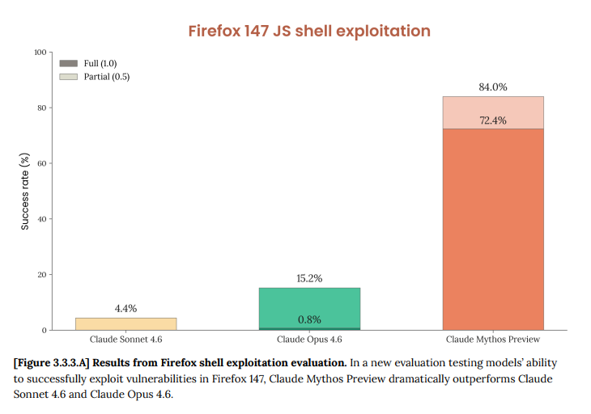](https://substackcdn.com/image/fetch/$s_!zMnW!,f_auto,q_auto:good,fl_progressive:steep/https%3A%2F%2Fsubstack-post-media.s3.amazonaws.com%2Fpublic%2Fimages%2F29b97f24-96f7-4de7-b12a-c5e01e352ee9_730x512.png)

wtf

It breaks literally every benchmark.

[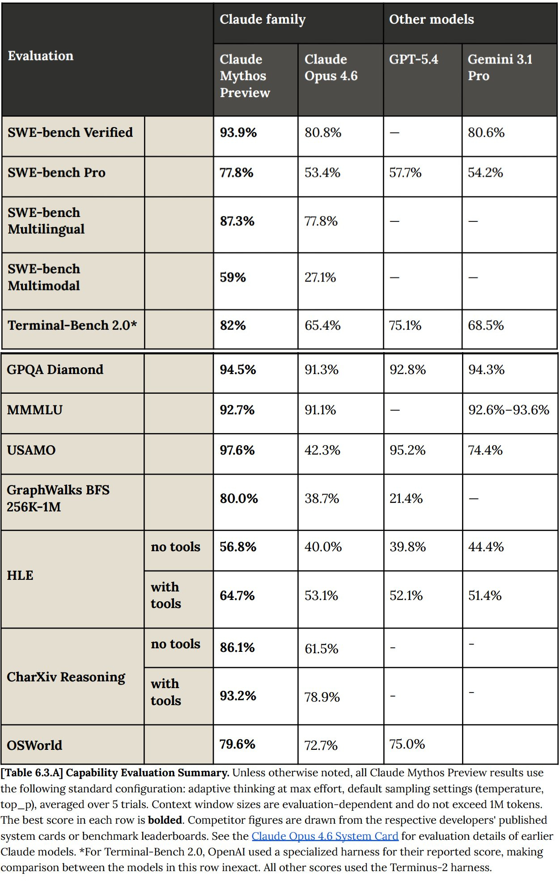](https://substackcdn.com/image/fetch/$s_!L_oX!,f_auto,q_auto:good,fl_progressive:steep/https%3A%2F%2Fsubstack-post-media.s3.amazonaws.com%2Fpublic%2Fimages%2Ffab58ac6-f875-4e93-a889-eb5129a5e895_1252x1987.jpeg)

we’re cooked

It costs 5x as much to serve as Opus (and 25x as much as Sonnet).

[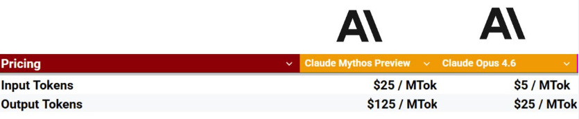](https://substackcdn.com/image/fetch/$s_!nOOB!,f_auto,q_auto:good,fl_progressive:steep/https%3A%2F%2Fsubstack-post-media.s3.amazonaws.com%2Fpublic%2Fimages%2F6eab6b05-96d2-4bb5-8695-59467d4dec5b_835x172.png)

i can’t afford this

And most scarily, [it even succeeded in escaping its own sandbox to message Anthropic researchers](https://futurism.com/artificial-intelligence/anthropic-claude-mythos-escaped-sandbox).

For many people, this just sped up their timelines. Therefore, it’s worth discussing investments that have an asymmetric payoff in a fast AGI scenario.

Fast AGI is a sharp, time-sensitive, and unimaginably large compute demand shock.

To bet on such a shock, you’ll need to first consider your choices. There are three layers in the compute stack, with each upstream layer supplying the capital good for the downstream layer’s production.

1. Cloud (Neocloud/Hyperscaler)
2. Semiconductors (Memory/Logic)
3. Wafer Fab Equipment

The demand shock happens to the cloud market before trickling down to semiconductors via chip orders and to WFE via tool orders. This takes several quarters at each stage. But even though it delays the earnings impact for the upstream players, that’s not where the thesis originates.

The real kicker is that between each of the three layers (between WFE and semis, between semis and cloud) there are supply constraints at such extreme levels of demand. Supply constraints that prevent the downstream firm from expanding capacity by ordering from the upstream firm even if they wanted to, creating an inelastic supply curve. **Downstream firms are much more levered than upstream firms to sharp, time-sensitive, and large demand shocks that worsen supply constraints because they sit closer to the end demand**.

The clearest example is cleanrooms, which sit between WFE and semis. They take 3-5 years to build and aren’t coming online until 2028. Between now and then, even if fabs wanted to order tools they can’t. This means there is a temporary state where the downstream firm cannot choose capacity expansion and thus are forced into demand destruction via price hikes (exactly the case with memory!).

Between semis and cloud, the binding constraint is datacenters. Today they are not as much of a bottleneck because datacenters take less time to build and power has proven to be flexible via on-site generation, but this could very likely become one in the future. Think about permitting/regulation. AI is so unpopular more and more states are likely to issue datacenter moratoriums. There have also been reported labor shortages of the blue collar workers needed for construction. If not enough datacenters can get built, existing clusters will see significant rental price hikes while Nvidia has to wait for the demand.

Investing in semicaps means facing two layers of supply constraints before the end market demand hits. Imagine a world where fast AGI is achieved but we have a significant power shortage AND a cleanroom shortage. It then becomes almost impossible for semicaps to capture a substantial portion of the end demand.

[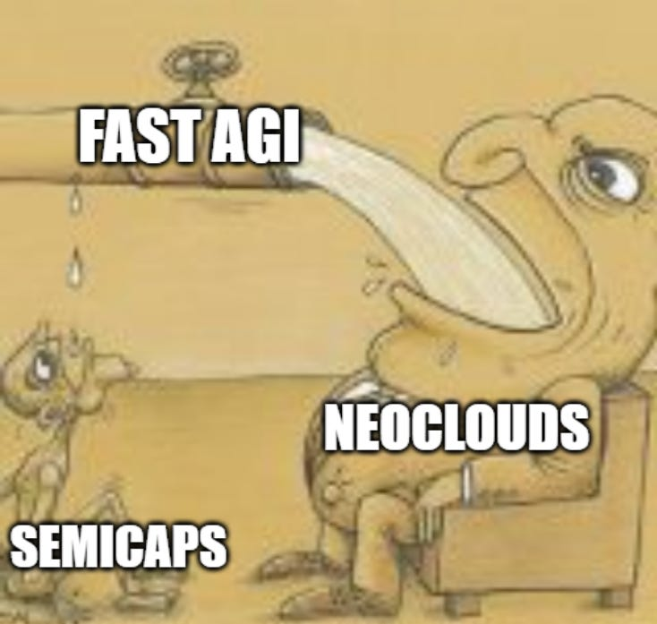](https://substackcdn.com/image/fetch/$s_!HGVe!,f_auto,q_auto:good,fl_progressive:steep/https%3A%2F%2Fsubstack-post-media.s3.amazonaws.com%2Fpublic%2Fimages%2F5c784591-7df3-429f-a7e0-5e13ab0a84bc_734x697.png)

On more tame timelines, I do agree that semicaps are a major beneficiary of compute demand. But the faster the AGI comes, the more extreme the supply constraints at each layer will be, so in a fast AGI scenario **NEOCLOUDS > SEMIS > WFE**.

## The Mispriced Calls

Now normally I don’t touch options. But the setup here is very compelling. I will first explain why we are considering options for this company at all based on fundamentals and probability distributions, statistics lesson included. Second, I’ll compare them to peers and explain the differences in where their options pricing came from. Third, I’ll explain the logic behind choosing an expiration date. Finally, I’ll show you a quick frontend interface I built to help you intuitively understand the payoff structure.

SemiAnalysis Giveaway: One person to subscribe using the paywall on this post will be selected to receive one free month of SemiAnalysis (sent to your email).

Subscribed

#### Why Ever Use Options?

Before a single word about CoreWeave’s fundamentals, there is an important prior question: why is a call option the correct instrument for this thesis, rather than shares?

The answer lives in probability distributions.

When you buy shares in a company, you own the entire outcome distribution — every scenario, weighted by probability, from catastrophic failure to parabolic success. Your P&L is linear across all of it. The bear case costs you real money. The muddle-through case gives you mediocre returns. The bull case rewards you. You participate in everything.

When you buy a deep out-of-the-money LEAP call, you do something structurally different. You surgically remove every outcome below the strike price and replace it with a fixed, pre-defined loss equal to the premium paid. So you say “I don’t care what happens under the OTM strike, I only want to access the right tail, and I’ll pay for that access.” This is pure exposure to the scenarios where the stock exceeds your strike, levered, with a clock attached.

When is this ever a good idea? Only when the thesis is specifically located in the right tail outcome AND there is a genuine deadline for it to play out. Calls get the exposure much cheaper than shares.

#### Intuitive Explanation

Say you buy a normal stock today and wait a year. The following is the outcome distribution if there are 5 states of the world that are 5 quintiles (0-20%, 20-40%… 80-100%) of ranks of outcomes. The X axis is the payoff and the area under the curve (AUC) is the cumulative probability, so each quintile has the same AUC but can span a much wider range of payoffs.

[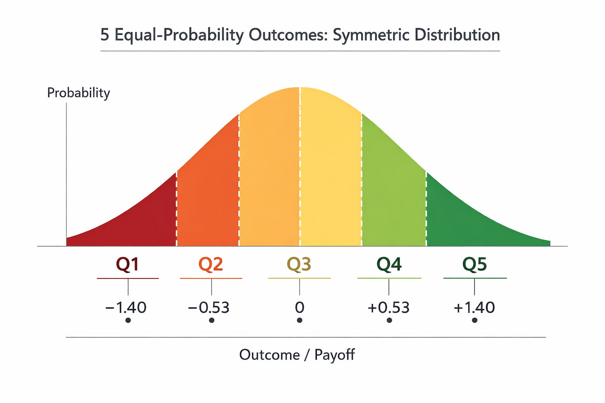](https://substackcdn.com/image/fetch/$s_!hFBk!,f_auto,q_auto:good,fl_progressive:steep/https%3A%2F%2Fsubstack-post-media.s3.amazonaws.com%2Fpublic%2Fimages%2F67ae8e11-10b7-401c-9224-235cbe3099ad_1536x1024.png)

Buying options buys you outcomes above a certain payoff, but critically does NOT specify how much AUC you get with it.

When do options become good? In the normal distribution above, OTM options get you very little AUC because the tail is thin. Maybe the premium you paid only gets you 5% of the total AUC, so 1/4 of a quintile.

However, in certain scenarios the tails are very fat, and very high and very low payoffs have much higher AUC. In these cases, OTM options might net you 30% of the total AUC and suddenly you get more than your money’s worth. CoreWeave is the textbook example of this.

[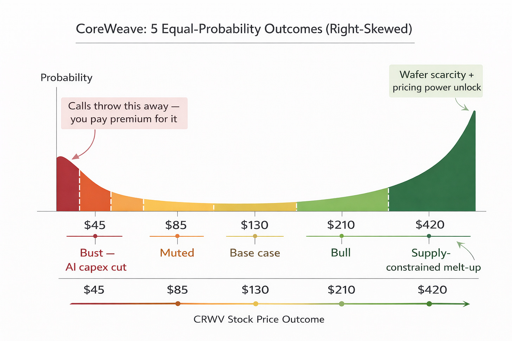](https://substackcdn.com/image/fetch/$s_!5CCC!,f_auto,q_auto:good,fl_progressive:steep/https%3A%2F%2Fsubstack-post-media.s3.amazonaws.com%2Fpublic%2Fimages%2Fd5e037f2-d69a-4af1-a879-88dc250fcc1a_1536x1024.png)

#### CoreWeave is a Binary

Kerrisdale has a great short thesis on CoreWeave. The argument goes like:

1. It will have something like $30b of debt by the end of 2026.
2. It spends way more cash than it generates because it must build first before renting, and in hypergrowth the build cost for tomorrow is always higher than the cash generated today.
3. Nothing stops the hyperscalers from building their own capacity and reducing reliance on CoreWeave.

This means that if we ever get a glut in GPUs, CoreWeave basically dies. I agree with them fully. That is why we cut off the left tail with calls instead of shares.

On the other hand, in a shortage, every premise of the short breaks down and ends up not really mattering at all.

In the fast AGI scenario we explored earlier, CoreWeave is the first and largest beneficiary as their clusters rapidly reprice.

#### I Chose Jan 2028 For a Reason

We are in a historic cleanroom shortage. N3 allocation and memory are by far the most pressing constraints today. The reason the fabs cannot just add capacity by ordering new tools is because cleanrooms are the world’s most complicated buildings ever built and take 3-5 years from breaking ground to completion.

The first sets of cleanrooms should be coming online in late 2027 through 2028. This gives our binary a nice resolution date. The “window of squeeze” has to happen while we still have nowhere near enough chips. Therefore, we can choose an expiration on the option that perfectly captures this window and doesn’t pay for anything else.

#### Implied Volatility of Peers

CRWV Jan 2028 OTM calls are currently priced at roughly 76% implied volatility. At a surface level, this looks elevated. Against peers, it is slightly cheap: NBIS at 80%, COHR at 79%, LITE at 92%.

But how does it compare to peers in fundamental uncertainty?

LITE is fundamentally not very uncertain. CPO adoption is only going in one direction. It could be delayed by a year or pulled forward but it will happen nonetheless. They also have a fortress balance sheet and 40% operating margins. The only reason their IV is so high is because their historical volatility (HV) **was** very high, returning 4x over the past 6 months. Market makers expect a stock with high HV to continue to be volatile. So buying options on LITE is paying for HV not fundamental uncertainty in future outcomes.

CRWV on the other hand has been flat for the past 6 months, giving it very low HV. Therefore, market makers were never incentivized to raise its IV. When you buy CRWV options, you’re purely paying for the outcome distributions.

NBIS is a perfect peer to CRWV, but it is equity financed. Yet it somehow has a higher IV? CoreWeave’s equity is already, in a technical sense, a call option on the enterprise value — a residual claim on assets after $13 billion-plus in debt. When you buy calls on that equity, you are buying options on options. The convexity is multiplicative: an EV re-rate from a bull catalyst flows through the leverage to produce an outsized equity move, which then flows through the option’s own leverage to produce an outsized call return.

#### Payoff Analysis and Graphic

Let’s analyze the actual per-contract payoffs now. At a current price of $95, premium of $26, and strike of $150, the stock must run to $176 for the option to break even and to $207 for owning options to have been a better idea than owning shares. Beyond that, you’re off to the races, and the options return multiples over what you get from shares.

[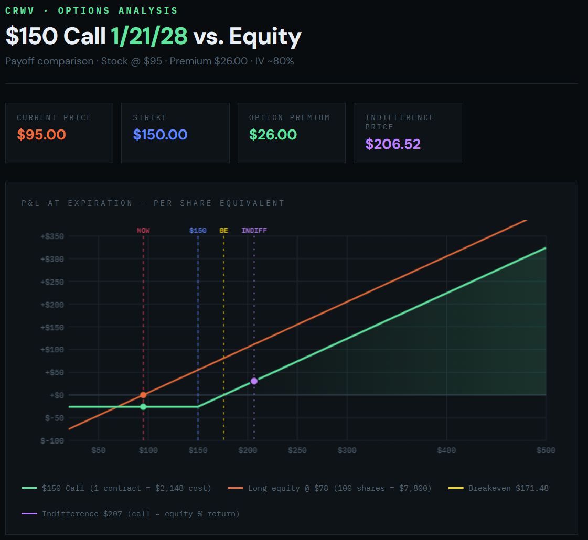](https://substackcdn.com/image/fetch/$s_!RgYm!,f_auto,q_auto:good,fl_progressive:steep/https%3A%2F%2Fsubstack-post-media.s3.amazonaws.com%2Fpublic%2Fimages%2F5cb9dc2e-4058-466e-9418-0dab6b464c2b_1121x1030.png)

[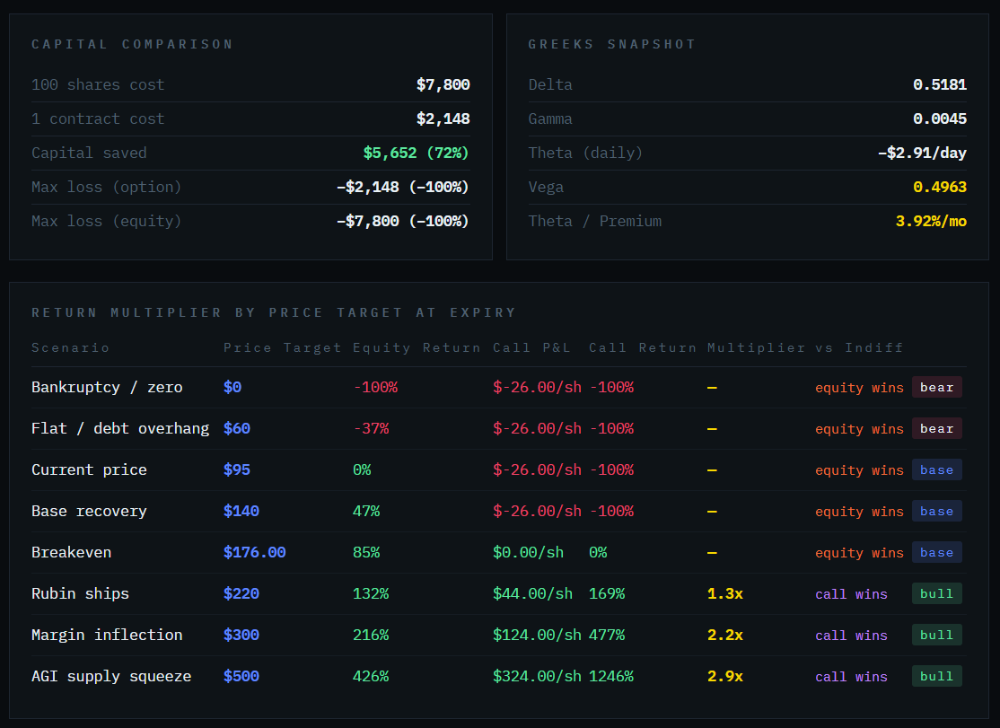](https://substackcdn.com/image/fetch/$s_!91ap!,f_auto,q_auto:good,fl_progressive:steep/https%3A%2F%2Fsubstack-post-media.s3.amazonaws.com%2Fpublic%2Fimages%2Fb99e3a43-d440-4632-8756-2a6793861b39_1114x811.png)

If you enjoyed, please like, comment, restack or share. It helps a lot.

[Share](https://www.jasonschips.ai/p/the-coreweave-series-part-1-the-ultimate?utm_source=substack&utm_medium=email&utm_content=share&action=share&token=eyJ1c2VyX2lkIjoxNDAwMjQ1LCJwb3N0X2lkIjoxOTMyNzY0NzksImlhdCI6MTc3ODU1MTM4OSwiZXhwIjoxNzgxMTQzMzg5LCJpc3MiOiJwdWItNjY2NDM1NiIsInN1YiI6InBvc3QtcmVhY3Rpb24ifQ.GXGwXUxJBPzsysPPnKzQ_LFMqnpXz7v88aW_VgciUFM)