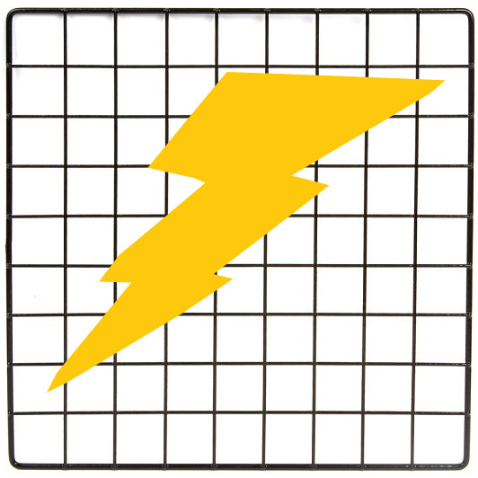
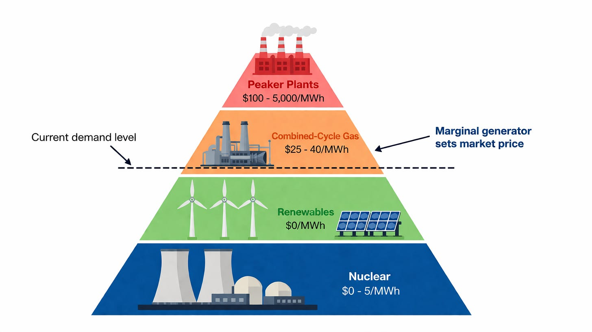
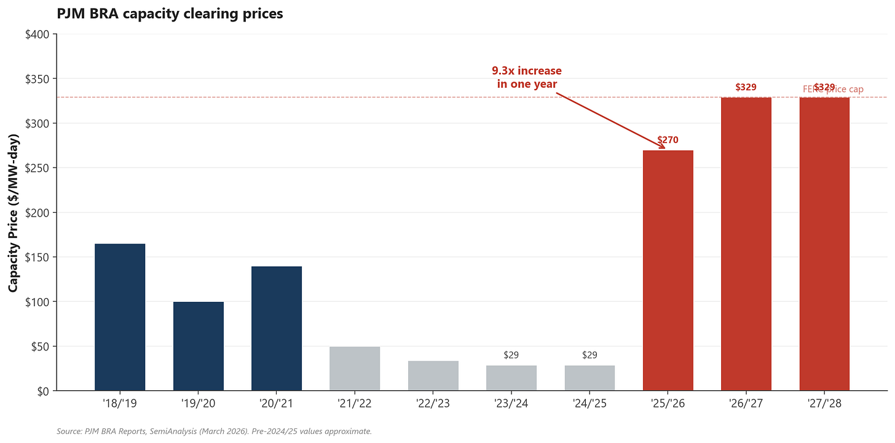
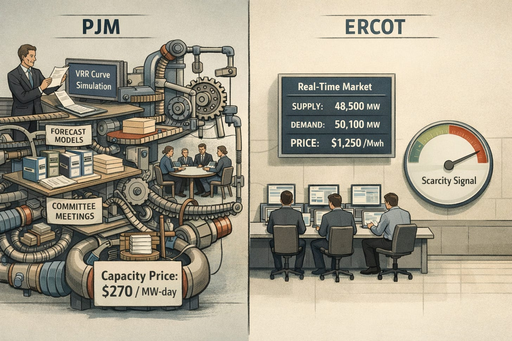
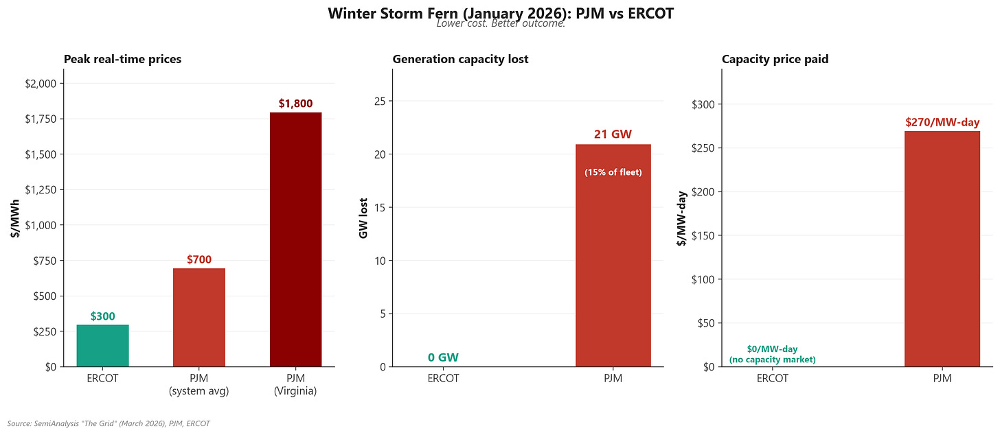
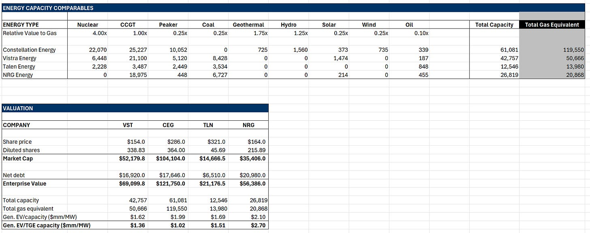
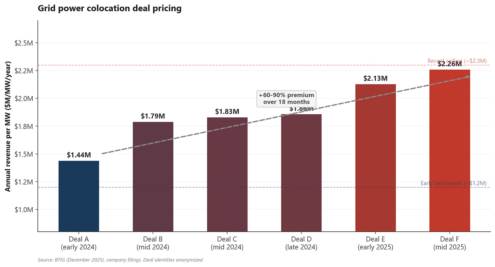

Hello again friends. I must apologize profusely as I skipped my duties of covering energy/power semi/800VDC to take a trip to neocloud land. Today we are back on track with the plan. We will start with the grid (and a grid-related idea), then move to powering the datacenter (and an 800VDC related idea), and finish with power semi (and more Aixtron content of course).

Welcome to The Grid.

---

subscribe to **power up** your inbox with **electrifying** insights

Subscribed

*By accessing this content, you acknowledge and agree to our [terms and conditions.](https://jasonschips.substack.com/p/terms-and-conditions) This research is **not financial advice**.*

---

#### Contents

1. Types of Generation
2. The Merit Order
3. Transmission
4. Interconnection
5. Capacity vs Spot
6. PJM
7. ERCOT
8. IPP Stocks
9. Problems With the Grid
10. Two Solutions to Overflow Demand (with Stock Picks)

## Types of Generation

There are a few ways to make electrons.

Nuclear splits atoms to generate heat, which creates steam, which spins a turbine. The fuel is cheap, the output is enormous, and the plants run 24/7 for 18-24 months between refueling. The catch: they cost $10-15 billion to build and take over a decade to permit and construct. Nobody is building new ones at scale in the US. Vogtle Unit 4, the last completed plant, came online in 2024 after years of delays and billions in overruns.

Coal burns carbon to make steam. Same turbine, same idea, much cheaper to build than nuclear. But coal plants are retiring across the country due to emissions regulations and unfavorable economics against natural gas. PJM lost significant coal capacity over the past decade, and those retirements are part of the supply squeeze we’ll cover later.

Natural gas is the workhorse of the modern grid and comes in three flavors. Combined-cycle gas turbines (CCGTs) burn gas to spin a turbine, then capture the waste heat to spin a second one. They run at 55-65% efficiency and serve as the default new-build for baseload. Simple-cycle turbines burn gas once, run at 30-40% efficiency, and exist for speed: they can ramp from cold to full output in 10-20 minutes. Peakers are the extreme version. They sit idle for thousands of hours per year and only fire when the grid is desperate.

Solar converts photons directly to electricity with no moving parts. Zero marginal cost when the sun shines. The problem is obvious: it doesn’t shine at night, and output varies with clouds and seasons. Wind uses air currents to spin turbines. Similar economics (zero fuel cost, variable output) but a different intermittency profile.

Hydroelectric uses falling water. Reliable, dispatchable, zero fuel cost. Also almost fully built out in the US. There are no new rivers to dam.

The key insight: each generation type has a fundamentally different cost structure. Nuclear and coal have high fixed costs and near-zero marginal costs. Gas has moderate fixed costs and fuel-dependent marginal costs. Renewables have high fixed costs, zero marginal costs, but variable availability. This cost structure determines the dispatch order.

## The Merit Order

Power demand fluctuates. Not all generation is needed all the time!

To determine who generates power when, the grid stacks generation sources in order of marginal cost; a concept called the merit order.

meritocracy

At the bottom sits nuclear. Always running, always cheapest per marginal MWh. Grid operators dispatch nuclear first because turning it off costs more than keeping it on.

Next come renewables. When the sun shines or wind blows, their marginal cost is effectively zero. They get dispatched whenever available, pushing other sources off the stack.

Then coal and combined-cycle gas. These form the bulk of daily generation. Coal’s marginal cost is its fuel, which has been consistently more expensive than gas in recent years. CCGTs are the flexible middle of the stack.

At the top: simple-cycle gas and peakers. Expensive per MWh, but they start fast. The grid only calls on them during peak demand. Brutally hot summer afternoons, freezing winter mornings, or unexpected generation failures.

The marginal generator (the last plant dispatched to meet demand) sets the price for the entire market in that hour. When demand is low, a CCGT sets the price at $25-40/MWh. When demand spikes, a peaker sets it at $100+ or even $5,000/MWh in extreme cases.

This dispatch hierarchy is the foundation of every energy market in the country. It explains why the same grid can produce $20 power on a mild Tuesday and $1,800 power during a winter storm.

## Transmission

Generation is useless without delivery. The transmission system is the high-voltage backbone that moves electricity from power plants to population centers.

Power plants generate at relatively low voltage (11-35 kV), which gets stepped up to 115-765 kV for long-distance travel. Higher voltage means lower current for the same power, which means less energy lost as heat in the wires. At the other end, substations step voltage back down for local distribution.

Transmission lines lose roughly 5-7% of the energy they carry over long distances. That number matters. A solar farm in West Texas producing cheap power is only useful if there are enough transmission lines to carry it to Dallas or Houston. When lines are full (congested), cheap power in one region can’t reach expensive demand in another.

This creates locational marginal pricing (LMP). The same MWh of electricity can cost $20 in one part of the grid and $200 a hundred miles away, simply because the wires between them are at capacity. LMPs are the real-time manifestation of transmission constraints, and they matter enormously for datacenter siting decisions.

Building new transmission takes 7-12 years in most jurisdictions. Permitting, right-of-way acquisition, environmental review, and construction all stack up. You can’t build enough transmission to serve AI demand on AI demand’s timeline.

## Interconnection

If transmission is the highway, interconnection is the on-ramp. Every new generation source or large load (like a datacenter) that wants to connect to the grid must go through an interconnection study process.

The process has three phases in most markets. First, a feasibility study determines whether the grid can physically handle the new connection. Second, a system impact study models how the new connection affects power flows across the wider grid. Third, a facilities study identifies exactly what upgrades (new transformers, switches, line extensions) are needed and what they’ll cost.

The interconnecting party pays for network upgrades. A datacenter wanting 500 MW of grid power might need $200 million in substation and transmission upgrades, with a 4-5 year construction timeline, before a single server can draw power.

PJM’s interconnection queue had over 2,500 projects totaling hundreds of GW waiting as of late 2025. The average time from application to completion exceeded four years. Many projects in the queue are speculative (developers filing applications for sites they may never build), which clogs the process for legitimate projects behind them.

This is the single biggest bottleneck for AI datacenter buildout. A hyperscaler can sign a lease, order GPUs, and break ground on a shell in months. Getting grid power delivered to that site takes years. The disconnect between the speed of AI demand and the speed of grid interconnection is the central tension in the power market today.

## Capacity vs Spot Markets

Electricity markets split into two distinct mechanisms.

Spot markets trade actual electricity in real time (or day-ahead). Generators bid to supply MWh at a price, demand is forecasted, and the market clears at the marginal bid. This is the spot market. Prices move with fuel costs, weather, outages, and demand. A generator makes money by producing and selling electrons.

Capacity markets are completely different. They trade the promise to be available. A generator that clears a capacity auction gets paid a fixed amount ($/MW-day) to maintain its ability to produce power when called upon. The generator might sit idle 95% of the year and still collect capacity payments.

The logic behind capacity markets: some power plants only run a few hours per year during extreme peaks. If those plants can’t cover their fixed costs from energy market revenue alone, they’ll shut down. Without them, the grid lacks the reserves needed during heat waves or cold snaps. Capacity payments are supposed to keep those plants in business.

PJM has both spot and capacity markets. ERCOT has only an energy market. This single structural difference drives a massive divergence in outcomes, prices, and incentives. It is the most important distinction in the entire US power landscape for understanding what comes next.

## PJM

My opinion on PJM is not very high. If PJM and ERCOT were companies, they would make the **perfect** pair trade. Well maybe you can pair trade them with the IPP names…

PJM operates the grid across 13 eastern US states, serving 67 million people. It hosts Northern Virginia (the world’s largest datacenter hub), and major hyperscaler campuses from Google, Anthropic, Amazon, and Meta.

If you ever hear about capacity auctions hitting price caps think PJM.

In the 2024/25 delivery period, capacity cost $29/MW-day. In the 2025/26 delivery period, it jumped to $270/MW-day. That is a 9.3X INCREASE in a single year. Some locations hit $450/MW-day. The subsequent 2026/27 and 2027/28 auctions both cleared at the federal price cap of $329/MW-day, because regulators imposed a ceiling after the initial shock.

ceiling

Total capacity payments: roughly $16 billion annually, or about $120,000 per MW. For the average PJM household consuming 880 kWh/month, that translates to approximately $30 per month in additional costs.

Now obviously this is unsustainable and became a reason people blamed data centers for increased power prices.

#### The simulation problem

Capacity prices in PJM aren’t set by market participants bidding against each other in the traditional sense. They’re driven by a simulated supply-demand curve called the Variable Resource Requirement (VRR) curve. PJM builds this curve from its own internal demand and supply forecasts, using non-public models and proprietary data. The VRR curve’s shape near the clearing point determines whether capacity costs $29 or $270.

So intuitively speaking, in normal markets price is set by the market clearing of supply and demand. In PJM land they decide the price for you. Any solid scholar of economic history can probably guess how this turned out…

PJM cannot forecast datacenter load. Their own data proves this. In 2024, they cut their datacenter load forecast by 800 MW versus the prior year. In 2025, they cut it again by 1.1 GW. Two consecutive years of massive downward revisions from a central planner responsible for a $16 billion annual market.

The simulation itself converts a moderate demand increase into a 9.3x price explosion. They drastically over-forecast how much load hits the market.

Forward traders also disagree with the energy benchmark increased 12-20% in the 2028-2030 window, nothing close to 9.3x.

## ERCOT

ERCOT harnesses **THE POWER OF MARKETS**!

burocracy vs market

The Electric Reliability Council of Texas (ERCOT) runs the Texas grid. Same AI buildout (OpenAI, Google DeepMind, Anthropic are all building massive facilities). Completely different market structure.

ERCOT has no capacity auction. No BRA. No VRR curve. No central planner simulating supply and demand to set capacity payments. Instead, it uses an energy-only market with real-time scarcity pricing via an Operating Reserve Demand Curve (ORDC).

When supply-demand balance gets tight, real-time prices spike from the normal $10-50/MWh to as high as $5,000/MWh, with additional transmission congestion adders. Gas peakers and batteries that run fewer than 100 hours per year can still pay for themselves because those hours are worth millions of dollars.

The incentive structure is fundamentally different. In PJM, generators get paid whether they perform or not. In ERCOT, generators **only make real money when the grid actually needs them and they deliver**.

#### Stable prices despite massive demand growth

ERCOT’s 2025 Long-Term Load Forecast projected 77.9 GW of potential datacenter load by 2030, more than double the prior year’s projection. However, ERCOT’s demand forecasts do not directly drive prices.

Forward prices in ERCOT have only increased 11-17% in the past year!

#### Winter Storm Fern

The January 2026 freeze was the real-world stress test.

ERCOT’s grid held. The Weather Watch remained precautionary. Demand ran below forecasts. No emergency procedures triggered. Real-time prices peaked around $300/MWh. Post-Uri winterization reforms proved effective under real conditions.

PJM paid $270/MW-day in capacity costs and lost 21 GW of generation. Fifteen percent of the cleared fleet went offline due to frozen equipment and fuel delivery failures. The Department of Energy issued emergency orders under Section 202(c) of the Federal Power Act, authorizing bypass of environmental limits and access to roughly 35 GW of backup generation (including datacenter and industrial backup power that would have been ineligible for the BRA). System-wide average prices hit $700/MWh. Virginia’s datacenter-heavy Dominion zone spiked to $1,800/MWh.

get mogged

Lower cost, better outcome. ERCOT’s market discipline delivered what PJM’s $16 billion in capacity payments could not.

Below the paywall we discuss a couple of popular IPP (power producer) stocks, why it was a popular trade in 2024, and why they’ve stopped working recently. I made a comps table for all the IPPs on their different types of capacity (nuclear, CCGT, peaker, solar, etc.), converted them into CCGT-equivalents to show who is the relative cheapest. Then we move on to more intriguing and granular discussion about the problems with the grid when it comes to powering AI. Finally, we end with the **real deal**. Two solutions that actually solve the grid’s constraints, essentially “overflow valves” that are a call option on AI energy demand and the stocks I actually own for each.

## IPP Stocks

SemiAnalysis Giveaway: One person to subscribe using the paywall on this post will be selected to receive one free month of SemiAnalysis (sent to your email).

Subscribed

The independent power producers were one of the favorite AI investment themes back in 2024.

Vistra (VST) operates mostly in ERCOT with a large gas fleet and 6 GW of nuclear. Total capacity around 44 GW.

Constellation Energy (CEG) has the largest overall fleet post-Calpine at roughly 60 GW. They own the country’s largest nuclear fleet at 22 GW.

Smaller players include Talen Energy (TLN) and NRG Energy (NRG).

The thesis was simple and compelling. AI demand would push wholesale electricity prices higher. Hyperscalers would sign long-term Power Purchase Agreements (PPAs) at prices well above what these generators earn selling to the spot market. Nuclear assets in particular would get repriced as hyperscalers competed for 24/7 carbon-free baseload. The stocks ripped.

What has actually happened is more sobering.

Grid connection constraints have made the PPA pipeline incredibly slow. The same interconnection queue backlogs that delay datacenter energization also delay the delivery of PPA power. Signing a PPA is the easy part. Actually moving electrons from generator to datacenter through a congested grid with 4+ year interconnection timelines is the hard part.

Behind-the-meter power is providing faster time-to-power. Onsite turbines, fuel cells, and other distributed generation can be deployed in months rather than years. When a hyperscaler needs power in Q3 and the grid says “try 2029,” the hyperscaler finds an alternative. This reduces the urgency of grid-based PPAs.

Regulatory pressure is making PPAs less attractive. In March 2026, seven major hyperscalers (Amazon, Google, Meta, Microsoft, OpenAI, Oracle, and xAI) signed Trump’s Ratepayer Protection Pledge at the White House. The pledge commits them to “build, bring, or buy” their own generation, pay for all infrastructure upgrades, negotiate separate rate structures, and accept take-or-pay obligations regardless of actual usage. The message from Washington: big tech pays for its own power and cannot socialize costs onto residential ratepayers.

This push toward self-supply changes the economics. If hyperscalers are building their own generation rather than signing PPAs from existing fleets, the PPA premium thesis erodes. The stocks still have value (owning dispatchable generation in a tight market is inherently valuable), but the story that PPAs at 2-3x spot would flow steadily into the income statement has not played out at the pace investors expected.

#### Comps Table

Here is my comps table!

Combined Cycle Gas Turbines (CCGTs) are the basic metric unit. They are the most efficient kind of gas turbine.

Because nuclear is baseload and has much lower marginal cost and is clean and better in a whole bunch of ways, it mathematically gets 4x as much intrinsic value per GW on a cash flow + multiple basis as CCGTs. If you split it up its slightly more than 2x higher cash flows and slightly under 2x higher multiple.

Same logic applies to the rest. Peakers and coal less valuable than CCGT, hydro and geothermal more valuable.

As you can see, under these assumptions, CEG is the “best deal.” But this can be a bit misleading as Vistra also has its own retail arm where it sells electricity directly to residents (it’s a utility company) and that makes up something like 25-30% of its EBITDA. It is also located like half in ERCOT which is attractive for reasons discussed earlier. The other IPPs do not have much ERCOT exposure.

## Problems With the Grid

The grid was designed for a different era, and it cannot adapt fast enough.

Interconnection queues measure in years. PJM’s queue has 2,500+ projects. The average timeline from application to energization exceeds four years. Hyperscaler demand operates on an 18-month product cycle. The mismatch is structural and will not close.

Transmission takes a decade to build. New high-voltage lines require 7-12 years of permitting, land acquisition, and construction. You cannot build transmission fast enough to match AI demand timelines.

Regulatory uncertainty compounds the problem. FERC’s price caps created a new issue (reserve margins below reliability targets). PJM’s NCBL proposal was killed by stakeholders. The Ratepayer Protection Pledge adds another layer of political risk. No utility or IPP can plan 10 years out when the rules change every 12 months.

## Two Solutions to Overflow Demand

The grid is slow. The grid is stuck. Very sad.

What do we do?

I think there are two very cool and interesting solutions that serve as overflow valves. Both also are great investment ideas, in my view.

#### Bloom

bloom

bloom

The reason I am such a Bloom fan is because of two reasons: Technology and manufacturing economics.

Most analysts who cover this company focus on its technological advantages: native DC power architecture, carbon capture economics, dynamic load-following capability, elimination of traditional backup power requirements. Those features matter and we’ll cover them in a dedicated article.

But for this article, it’s the manufacturing economics that stand out. Their main innovation is in IP. The actual manufacturing of fuel cells is actually similar to capital-light manufacturing. Think of them as the semicap of power production.

Management has publicly stated they will “never be the bottleneck” for their customers.

Not only can they manufacture and deploy power at a pace that matches AI demand timelines (weeks to months), while traditional generation takes years to decades, they are an infinitely scalable overflow valve. If the demand for AI power is greater than the industry expects, they are the biggest winner.

#### Crypto Miners

minign

They went parabolic back in October. Remember that? Now they’ve been pretty much flat to down while semis went parabolic and I think this is an interesting space to go digging again.

This is an entire class of companies that went out and did the hard work of securing grid power at remote substations back in 2021 and 2022. They built electrical infrastructure, signed utility agreements, and energized sites across the US. Most of that power turned out to be stranded or unprofitable for its original purpose.

This is “lower quality” grid power than what traditional colocators like Equinix operate. The sites are remote. The infrastructure needs retrofitting. But the power is real, the substations are built, and the interconnection is done. Thus, they are another overflow valve.

Early deals for grid power colocation were signed at roughly $1.2 million per MW. Recent deals are clearing in the $2.0-2.3 million per MW range, roughly a 60-90% premium over the original benchmark.

deals

I would specifically flag CORZ as they had a sales pipeline of deals that dried up during their failed merger with CRWV and are only now seeing them come back. Given per-MW colocation rates have spiked since then, having more empty capacity to announce deals could be a very good thing.

If you enjoyed, please like, comment, restack or share. It helps a lot.

[Share](https://www.jasonschips.ai/p/the-grid?utm_source=substack&utm_medium=email&utm_content=share&action=share&token=eyJ1c2VyX2lkIjoxNDAwMjQ1LCJwb3N0X2lkIjoxOTMyMjY0MjAsImlhdCI6MTc3ODU1MTM3NSwiZXhwIjoxNzgxMTQzMzc1LCJpc3MiOiJwdWItNjY2NDM1NiIsInN1YiI6InBvc3QtcmVhY3Rpb24ifQ.j7c_iLjzPq1jCNRAN7UMVR5giS3695iqz8Ga4Hr0QDM)