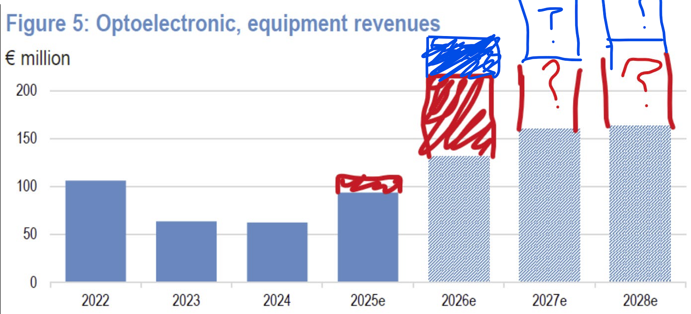
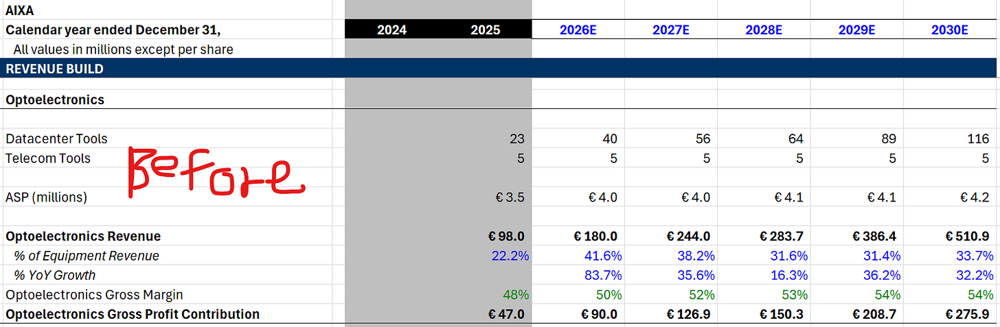
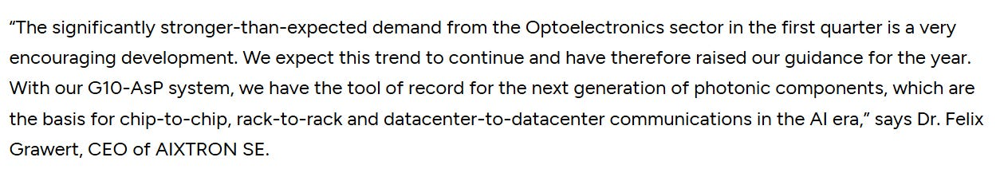
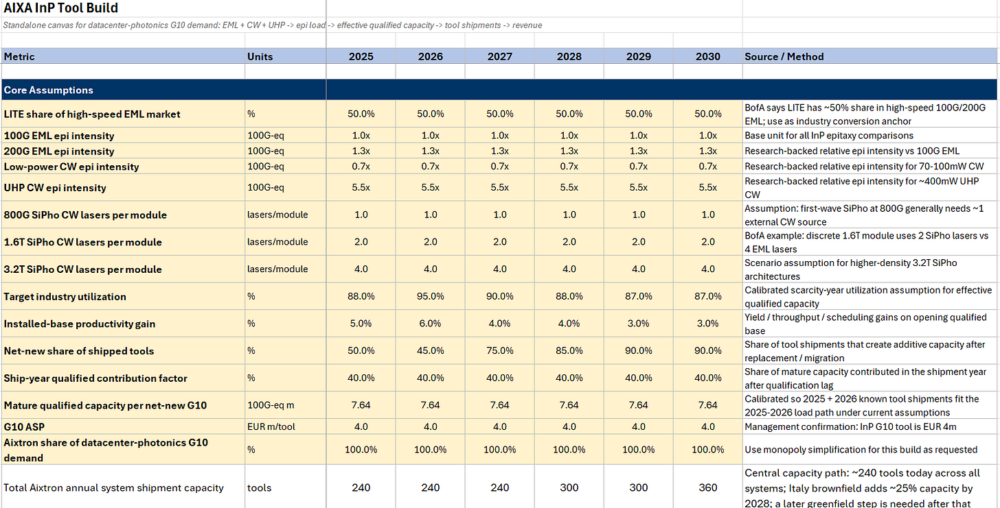
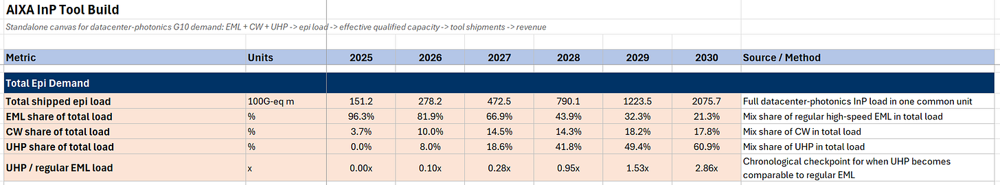
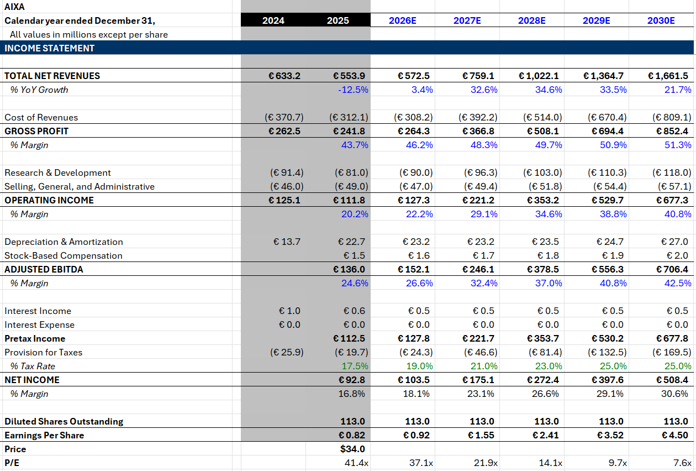

Aixtron raised 2026 full year revenue in their preliminary earnings release this afternoon (at night in Germany?) with basically all the upside attributable to Opto.

moar revisions

This is a much shorter article than usual, I will try to write these to respond to catalysts quickly. Below we discuss why this relatively modest firm-level revision is actually a bigger deal for opto than I initially thought (and why I think it’s net new info) as well as a first peek at my top-down MOCVD demand model that will underpin some of my future Aixtron articles. Plus total tool capacity numbers and demand vs supply constrained.

Enjoy!

Before the release Opto was EUR 180m for 2026.

If it was 100m in 2025 and management said it was gona double, why is it not 200m?

Because only the datacenter tools double. They specified it and it was easy to miss. A small portion (~20%) of their 2025 opto revenue was telecom-related. Therefore 80 x 2 + 20 = 180.

But here’s the interesting thing. Their upside was totally net new opto orders driven.

Unless there is a rougue SiC order in there, this revision should be attributed to opto. GaN doesn’t even contribute until 2027

Since only 160m (approx. 40 G10-AsP machines) of 2026 opto is datacenter, an increase of 40m attributed to opto is a 25% revision!!

I think expectations are high for the sector in general and it is a fair argument to say that this was expected from Aixtron as a supplier/derivative.

Even though there wasn’t a top-down catalyst that would revise up total optical demand, this is still net new information, and here’s why: Management often talks about a high degree of uncertainty in customer tool efficiency. Their yields, growth time, uptime, etc. are all unpredictable so the same market-wide demand does not tell you everything about tool demand. Therefore, tool demand intensifying by itself is much more directly useful for us as analysts and positive for the stock.

## MOCVD Demand Model Preview

On the supply side Aixtron can ship 240 tools company-wide per year today. They are actually no where near that, so they are currently demand constrained not supply constrained like Bloom (we saw how that turned out wink wink). This increases by 20-30% with a brownfield plant in Italy (to 300) and even more once they expand greenfield in southeast Asia.

On the demand side tools needed are determined by the market size of EML, CW, and UHP lasers and their relative epitaxial intensity. I’ll explain this in depth in a later article but basically different types of lasers are different in size and complexity. CW has the lowest, EML medium, and UHP highest (very large complex lasers needed for CPO).

This is not the full model but essentially with the market size and epitaxial intensity of each type of laser as assumptions you can get a reasonable estimate of total MOCVD capacity needed. And we can assume it all goes to Aixtron since they have north of 95% share and are the tool of record.

Because I’m using relatively older (and more solid) EML and CW transceiver estimates (esp BofA sellside) I think my 2027 and 2028 assumptions are very beatable. My UHP assumptions are much more top-down since they’re from my LITE model.

On EPS I think we get to at least EUR 2.4 by 2028. At least, given that opto still has upside from my numbers.

I heard someone in the chat mention EUR 2.5 EPS and like. yeah that’s right on.

Any ASML-like multiple (Aixtron is literally compound semi ASML since MOCVD is majority of tool capex for compound semi like litho is for logic and has 90%+ share) means we still have at least a 2x to go on multiple alone.

share!

[Share](https://www.jasonschips.ai/p/aixtron-raises-2026-opto-revenue?utm_source=substack&utm_medium=email&utm_content=share&action=share&token=eyJ1c2VyX2lkIjoxNDAwMjQ1LCJwb3N0X2lkIjoxOTQyMzkwODAsImlhdCI6MTc3ODU1MTM2MiwiZXhwIjoxNzgxMTQzMzYyLCJpc3MiOiJwdWItNjY2NDM1NiIsInN1YiI6InBvc3QtcmVhY3Rpb24ifQ.lt00IMXPX_z9mOHCUp0Xhfno04uy9FZiONh4pDHRO9U)