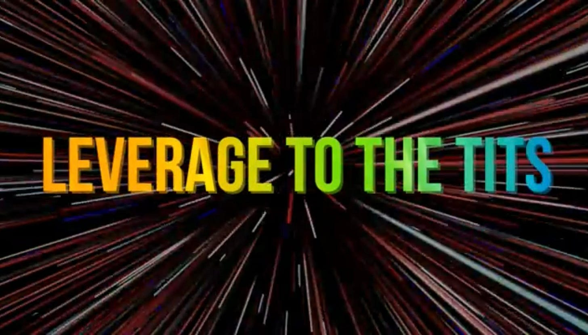

Hello!

Today I give a one minute non-consensus take on why corporate debt is actually really good. Enjoy!

pure degeneracy

*By accessing this content, you acknowledge and agree to our [terms and conditions.](https://jasonschips.substack.com/p/terms-and-conditions) This research is **not financial advice**.*

---

Consensus says debt is always bad. “Net cash” and “fortress balance sheet” are the biggest green flags to most public markets investors.

Or one can cite Modigliani-Miller and argue “well actually it doesn’t matter because WACC never changes!”

The academic argument behind this is pretty simple. Debt and equity are both ways of financing a business. As stock market investors we own the equity. If the company is levered our equity is more risky. If the company is unlevered it is less risky. But it actually doesn’t matter because with the more levered business you can just own it in a portfolio with cash and for the unlevered business you can lever up yourself.

Essentially, because the investor controls their own leverage, the leverage chosen by the company doesn’t matter.

Moving from the theoretical world into the real world, the only variables left are the debt tax shield (positive for debt, WACC goes down) and the risk of bankruptcy (negative for debt, WACC goes up) which act as countervailing forces, meaning companies in a certain industry usually have an ideal level of leverage that minimizes WACC.

So that is the foundation. How will we challenge it?

I am a thematic investor. I believe in the future of AI and by extension the semiconductor industry. Many hedge funds do the same. Our jobs are to express our thematic view to the fullest extent without taking on excessive risk.

Why the excessive risk clause? Well, if I lever up my portfolio 5 to 1, I’ve just introduced massive **path dependency**. Those of you who read my shorting article know what I’m talking about. I could be totally right about the destination, but now because I’m levered, I’m **dependent** on the **path**, specifically that of the share price.

As all value investors tend to scream at us growth guys for, price does not always equal value. You can be right on the value, but if price takes a drawdown and you get margin called, you are fucked. This is why we must manage risk.

But see, we just talked about the investors’ ability to lever up as a reason why corporate leverage is irrelevant right?

> *“If the company is levered our equity is more risky. If the company is unlevered it is less risky. But it actually doesn’t matter because with the more levered business you can just own it in a portfolio with cash and for the unlevered business you can lever up yourself.”*

My argument breaks this exact premise. Investor leverage is NOT the same as corporate leverage. Investor leverage introduces path dependency to the **price** while corporate leverage does not. For a corporation to go bankrupt, they must be unable to service their interest with cash, i.e. the **value** must go to zero. One is price, the other is value.

For thematic investors, this is profound. With leveraged corporations, **you can get more exposure to your theme (and the direction of fundamental value) without taking on the path dependency that comes with individual leverage!** Higher expected returns (provided you are correct on your thematic) with no path dependency (hold through drawdowns without fear of margin calls).

Below, I’ll share a name I’ll be entering next week (and writing up sometime) that applies this principle to the tee.

## SoftBank Group (9984.JP / SFTBY)

Let’s simplify. Strip away the Japanese telecom, the messy Vision Fund portfolio, the robotics acquisitions, the Stargate JV. All of that is noise. At its core, SoftBank is two positions:

**~50% ARM. ~50% OpenAI.**

(Yes, I’m simplifying. There’s a whole grab bag of VC stuff in there too. But the NAV is dominated by these two names and for the purpose of this argument, that’s all that matters.)

Both are excellent AGI thematic plays.

### OpenAI

OpenAI is the most direct AI exposure you can possibly have. SoftBank owns ~11% (going to ~13%), making it the second-largest shareholder behind Microsoft.

There is no public equity that gives you this exposure. Microsoft has it but at 27% of an $3T+ market cap, OpenAI is a rounding error on their consolidated P&L.

### ARM

ARM is a decades-long structural share gainer in CPUs versus x86. The thesis is elegant: x86 is a 1978 architecture burdened by decades of backward-compatibility overhead that burns power without contributing useful computation. ARM was designed from scratch for efficiency, delivering the same work at a fraction of the energy cost.

In an AI world where datacenters are power-constrained and every watt matters, ARM wins structurally. Every hyperscaler — Amazon (Graviton), Google (Axion), Microsoft (Cobalt), Nvidia (Grace) — is migrating to ARM-based server CPUs.

On top of that, **CPUs are a share gainer within AI compute infrastructure** because of agentic workloads. So a double share-gainer.

## The Leverage Argument

Here’s where it gets interesting.

SoftBank’s capital structure is roughly 60% equity, 40% debt. Net debt is ~$113B against a NAV that’s north of $250B.

Say you want concentrated exposure to the AGI theme through ARM and OpenAI to the same degree as SoftBank. You need to construct a portfolio that is 60% equity 40% debt then buy those two stocks individually.

For most retail brokers, that means running your portfolio at roughly 1.67x gross leverage.

**At 1.67x leverage on a retail margin account, you are one 20% drawdown away from a margin call.** In the volatile AI space, a 20% drawdown is a literal mood swing for Mr. Market. ARM went from $183 to $80 in the past year. If you were levered through that, you’re done. Wiped out. Right thesis, wrong path.

But for SoftBank? For SoftBank to face an existential crisis, they don’t need Mr. Market to have a bad week. They need to be unable to *service their debt* — they need the *value* of their holdings to deteriorate so far that cash flows can’t cover interest payments and asset sales can’t cover principal. That’s a fundamentally different (and much smaller) risk than getting margin called because the stock price dipped 20%.

Masa (and his AI thematic investors) would need to have been fundamentally wrong on their AGI thesis to get wiped out. No path dependency! More exposure with less risk.

---

*By accessing this content, you acknowledge and agree to our [terms and conditions.](https://jasonschips.substack.com/p/terms-and-conditions) This research is **not financial advice**.*

share with levered AI investors

[Share](https://www.jasonschips.ai/p/non-consensus-sundays-why-debt-is?utm_source=substack&utm_medium=email&utm_content=share&action=share&token=eyJ1c2VyX2lkIjoxNDAwMjQ1LCJwb3N0X2lkIjoxOTQ3MTMwNzYsImlhdCI6MTc3ODU1MTMzOSwiZXhwIjoxNzgxMTQzMzM5LCJpc3MiOiJwdWItNjY2NDM1NiIsInN1YiI6InBvc3QtcmVhY3Rpb24ifQ.jg0c6y7ZwKkyDRII94Xdf8MFM5QakoHovQVVvV4YciI)