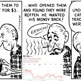
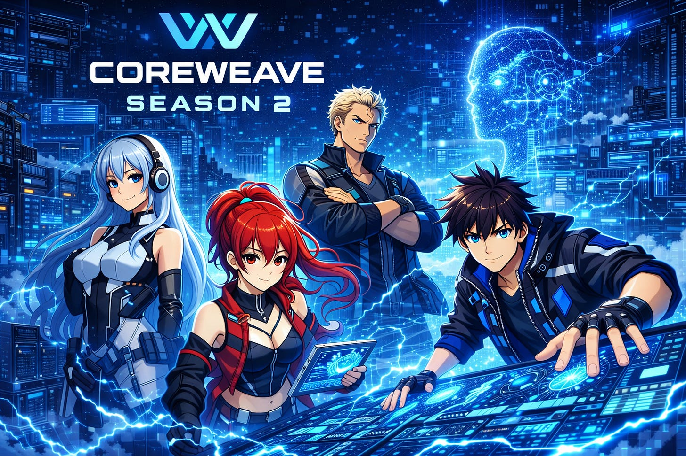
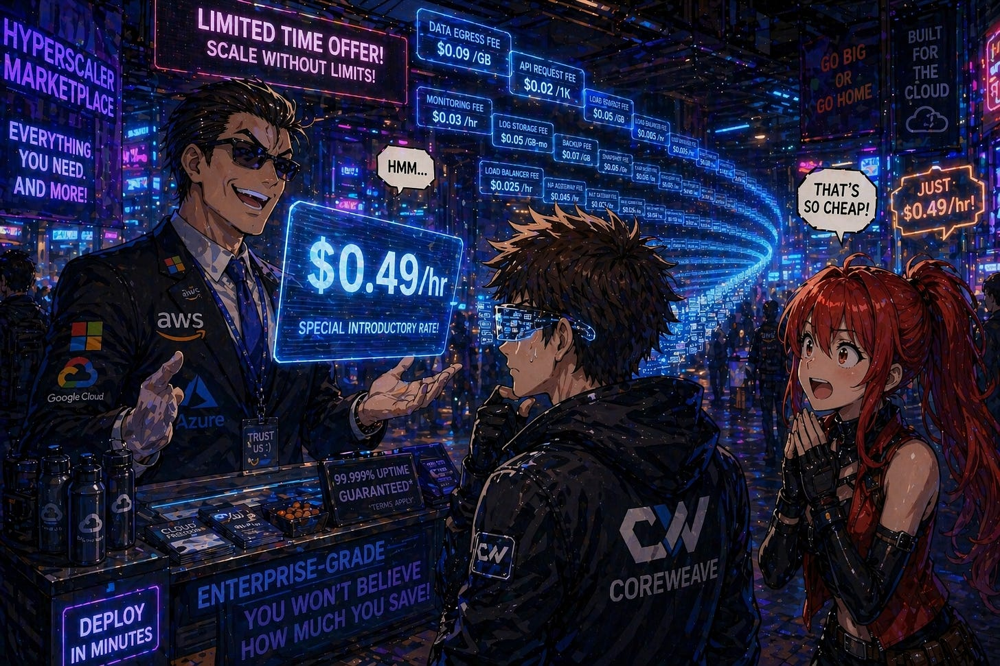
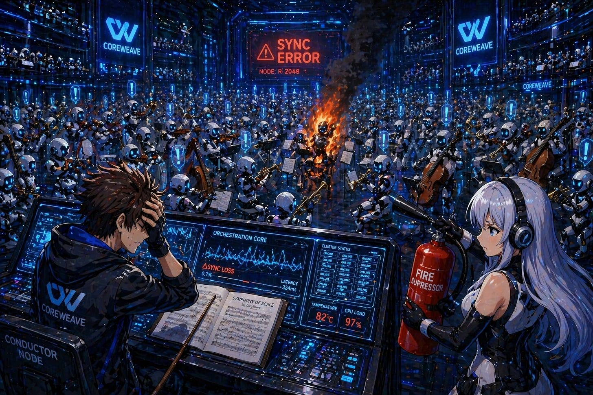
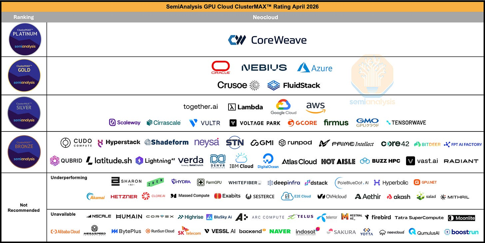
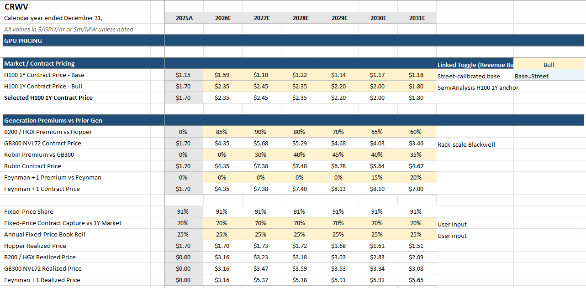
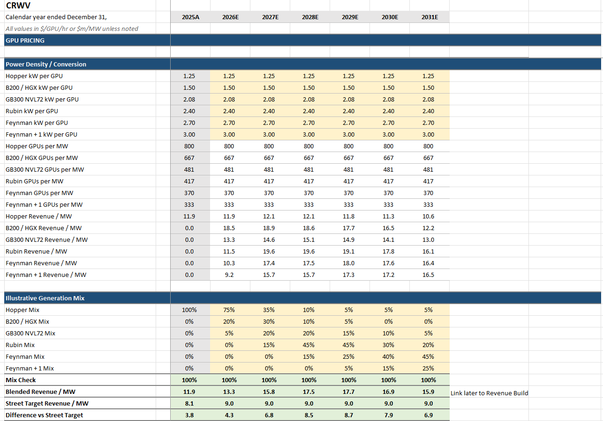
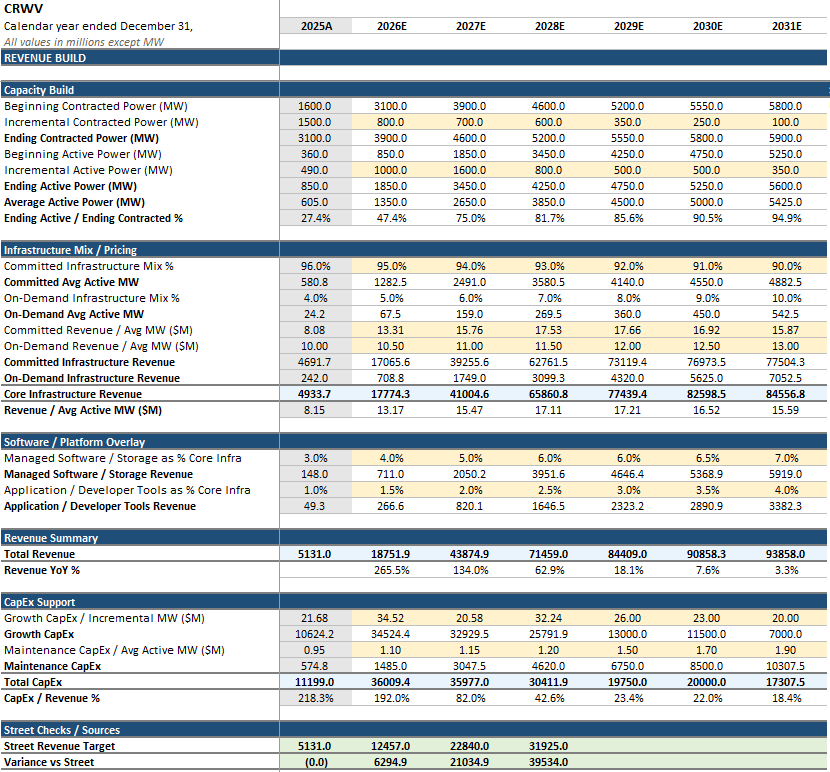
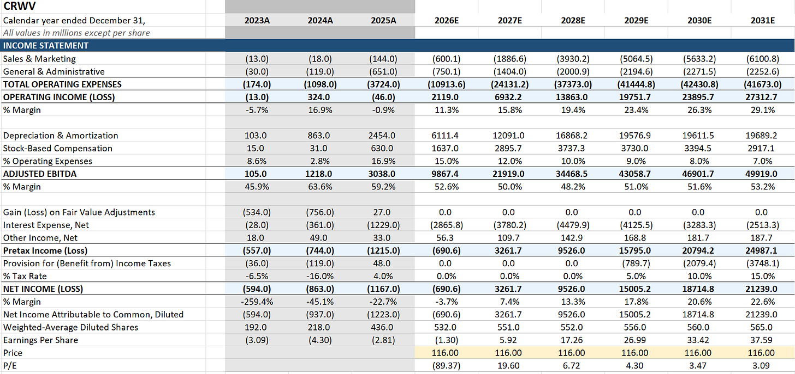
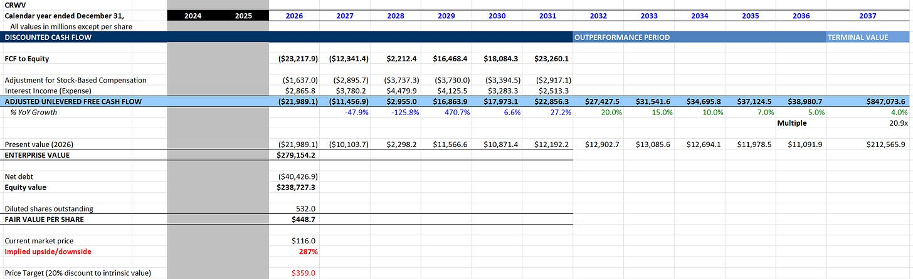

**Welcome to one of my highest conviction theses in a while.**

The purpose of this article is to make one very simple point: **Neoclouds are like foundries**.

If you were Nvidia, do you choose your foundry based on who offers the absolute lowest price per raw wafer?

The foundries are a commodity right? They all buy their tools from the same vendors for the same price. They all share the same list of concentrated customers. The all sell the same product, no?

***Hell no.***

The price per wafer tells you nothing. Wafers don’t turn into Blackwells. Known-good-dies do. Every foundry conversation is dominated by **yield**. That’s all that matters! How hard you’re cranking the factory doesn’t pay the bills; only the factory’s actual output does.

Yet in cluster land people only care about the GPU rental price. The bull case for hyperscalers (and bear case for neos) rests on their economies of scale. They can bend the supply chain to their whim, amortize fixed cost on custom networking, and even build their own ASICs. With the lowest gross cost of compute, how can smaller, debt-fueled clouds ever compete?

My thesis is that this consensus is wrong. Neoclouds are fundamentally comparable to foundries. The gross number of GPU hours you paid for does not matter. It’s equivalent to the gross wafers processed by TSMC — a vanity input metric completely subservient to the actual output achieved. The real measure of success is **goodput**, the actual useful work done for training/inference and the neocloud equivalent of known-good-dies. Cloud providers that achieve the highest goodput with a certain quantity of compute, the equivalent of yield, have a sustainable competitive advantage.

In addition, achieving goodput is not easy. Just like foundry yield, it takes years of process learning and optimization. The best companies start ahead and stay ahead, leveraging a competitive advantage known as **process power** (from Hamilton Helmer’s *7 Powers*). And the hyperscalers, with decades of running traditional web workloads, were fundamentally unprepared for the east-west dominated AI compute paradigm, giving top neoclouds a process learning head start.

One of the most important reasons I wrote the microeconomic model based on the consensus that neoclouds were a commodity is to break that foundational premise. That’s what we shall do today.

[

#### Neocloud Microeconomics

[Jason's Chips](https://substack.com/profile/112809522-jasons-chips)

·

Apr 7

[Read full story](https://www.jasonschips.ai/p/neocloud-microeconomics)](https://www.jasonschips.ai/p/neocloud-microeconomics)

CoreWeave is a true out-of-consensus call for me. Optics/CPO was already a consensus long, I was just saying that it is bigger than people thought. Nobody is short optics companies with conviction. But because of how hated neoclouds are, *if* I’m right the repricing would be much more violent. The recent ~40% move means nothing to me as it is peanuts compared to what could happen. They can easily turn into the next momo trade. **It’s the only long in which I hold calls and not shares**. Again — debt laden, low-margin, cash flow negative is bad for safety but **excellent for asymmetry**.

Featuring CoreWeave anime

---

Subscribe to increase the **goodput** of your inbox.

Subscribed

*By accessing this content, you acknowledge and agree to our [terms and conditions.](https://jasonschips.substack.com/p/terms-and-conditions) This research is **not financial advice**.*

---

#### Contents

1. Consensus = Anti-Neocloud
2. Hyperscalers = Overrated
3. GOODPUT = YIELD

   1. Pretraining
   2. Reinforcement Learning
   3. Inference
   4. Software Can’t Fix This
   5. Capital Can’t Buy It Either
4. The Model (GPU Pricing Build, Revenue Build, Income Statement, DCF)
5. CoreWeave = TSMC

   1. CoreWeave is Underearning
   2. Hyperscalers are Overearning
   3. Becoming Their True Self

## Consensus = Anti-Neocloud

CoreWeave is one of the most hated stocks in the market. Not hated in the way a melting ice cube is hated, where bears quietly accumulate shorts and move on. Hated with conviction. The short thesis writes itself so cleanly that it has become consensus among generalist investors, sell-side analysts, and activist short sellers alike.

A prominent activist short seller published a report last year calling CoreWeave “an undifferentiated, heavily levered GPU rental scheme stitched together by timing and financial engineering, not lasting innovation.” No proprietary technology. No defensible IP. No edge. Microsoft’s Satya Nadella himself called the original deal “a one-time thing.” The price target: $10, implying 90% downside. The thesis in one sentence: CoreWeave is a stopgap bare metal assembler that will be displaced the moment hyperscalers finish building out their own capacity.

A major sell-side research shop arrived at the same conclusion through a more rigorous financial lens. According to their model, CoreWeave’s ROIC of roughly 10% barely covers its cost of capital, meaning every incremental dollar of investment destroys value. They estimate long-term non-GAAP operating margins of 15-17%, far below management’s 25% guidance, because depreciation alone eats roughly 50% of revenue at current asset turnover levels. Their framing is devastating in its simplicity: GPU-focused clouds are getting commoditized, CoreWeave’s tech-savvy customers can easily backward integrate, and growth at sub-WACC returns destroys shareholder value with every incremental dollar of capex.

The common thread across every bearish argument is a single foundational premise: GPU cloud is a commodity activity with no operational differentiation. The hardware is fungible. Any well-capitalized competitor can buy the same NVIDIA GPUs, rack them in a data center, and offer the same product. Customers can switch between neoclouds frictionlessly. Hyperscalers will inevitably internalize. Therefore the margins are structurally thin, the returns are structurally poor, and the debt load will crush equity holders when the music stops.

I want to be clear about what the bears get right. The debt load is real. The customer concentration is real. The capex intensity is real. The cash flow profile is genuinely ugly on a near-term basis. These are not fabricated concerns and I am not dismissing them.

But every bearish conclusion, sub-WACC returns, no pricing power, hyperscaler displacement, zero residual value, flows downstream from that single premise: that this is a commodity business. **If the premise is wrong, the entire bear case collapses**.

My argument is that the premise is wrong. And the reason generalist analysts and finance-focused investors cannot see it is that the evidence is not financial. It is technical. You cannot find the moat in an asset turnover ratio. You cannot find it in a depreciation schedule. You find it inside the data center, in the operational machinery that separates a cluster that works from a cluster that burns venture capital. **The financial statements are a lagging indicator of something the bears have never measured**.

## Hyperscalers = Overrated

The bull case for hyperscalers rests on scale. They buy hardware by the container ship. They negotiate power agreements with entire municipalities. They have the lowest gross cost of compute on the planet. How can a smaller, debt-fueled neocloud possibly compete?

This framing sounds intuitive, but it gets the physics of GPU clusters completely wrong. Hyperscaler scale advantages were built over two decades of optimizing for stateless web microservices: millions of tiny, independent requests where any individual server failure is irrelevant. A GPU training cluster is the exact opposite. It is a single, tightly coupled supercomputer where thousands of GPUs must synchronize simultaneously. If one node fails, the entire job stops. Hyperscalers are retrofitting a data center paradigm built for web traffic to run massively parallel supercomputing jobs. The neoclouds built for this paradigm from day one.

This architectural mismatch shows up as hidden costs everywhere. SemiAnalysis published an exhaustive TCO framework recently:

[SemiAnalysis

How Much Do GPU Clusters Really Cost?

Introduction: Rethinking the Total Cost of a GPU Cluster…

Read more

17 days ago · 98 likes · 2 comments · Jordan Nanos, Bryan Shan, Cheang Kang Wen, Daniel Nishball, and Dylan Patel](https://newsletter.semianalysis.com/p/how-much-do-gpu-clusters-really-cost?utm_source=substack&utm_campaign=post_embed&utm_medium=web)

They decompose the total cluster cost far beyond the headline GPU rental rate. The hidden cost stack includes: hot NVMe storage priced as a premium add-on rather than bundled as essential plumbing, orchestration premiums for using Kubernetes or Slurm through proprietary managed services, enterprise support billed as a percentage of total cloud spend (up to $450K/month at scale just for a tiered ticketing system, versus CoreWeave’s direct Slack channel with an engineer included in the base price), mandatory paid proof-of-concept periods where customers rent entire clusters for a month ($15M+) just to tune proprietary networking protocols before training even begins, and nickel-and-dime egress and data transfer fees layered on top.

To quantify this, SemiAnalysis modeled a pretraining run on over 5,000 next-generation GPUs and assumed all providers charge the exact same headline rate per GPU-hour. The starting line was perfectly level. Over a 36-month deployment, **the hyperscaler's total cost swelled to 1.10x the gold-tier neocloud's**. A 10% hidden tax that never appears on the procurement spreadsheet. And this is before we account for goodput.

And this is before we account for goodput.

## GOODPUT = YIELD

Throughput measures activity. Goodput measures progress. The distinction is everything.

A 4,000-GPU pretraining cluster is a single synchronized organism. Every GPU holds a piece of the neural network, and they must all communicate their calculations simultaneously. If one GPU fails, a transceiver overheats, or a memory error spikes at the wrong moment, the entire job halts. **All 3,999 healthy GPUs are stranded**. All compute since the last checkpoint is vaporized. Then the system spends 10-15 minutes identifying the fault, swapping the node, and reloading state, during which you are still paying for the full cluster.

How often does this happen? Individual GPUs are remarkably reliable (roughly 25,000 hours between failures on premium infrastructure). But when you combine 4,000 of them into one tightly coupled system, the cluster as a whole fails every 6.25 hours. On a lower-tier provider with worse component reliability, it fails every 3.75 hours. SemiAnalysis calculates total goodput loss of 6.14% for gold-tier providers, 10.53% for hyperscalers, and 20.91% for silver-tier *(Guys is this not the same thing as yield?)*. One-fifth of the silver-tier’s multi-million dollar budget evaporates into recovery cycles.

CoreWeave is the sole occupant of SemiAnalysis’s ClusterMAX Platinum tier.

source: semianalysis

Every other provider, Azure, AWS, GCP, Oracle, Nebius, Crusoe, sits below them. What earns the Platinum rating is not hardware (everyone buys the same NVIDIA GPUs) but the operational machinery built through years of running the world’s most demanding clusters: automated burn-in testing against reference performance numbers, passive health checks every few seconds, weekly active diagnostics including silent data corruption detection, proprietary monitoring exporters built because standard tools were not granular enough, and a correlation engine that can automatically distinguish switch-level failures from tray-level failures by tracking error patterns across the fabric. The result is pricing power: **CoreWeave commands a 10-15% premium per GPU-hour over neocloud peers**, and customers pay willingly because the goodput justifies it.

This advantage manifests differently across workloads, but CoreWeave wins all three.

#### Pretraining

This is the classic goodput case. The blast radius of failure encompasses the entire cluster. Maximum GPU-hours between failures is the only thing that matters. This is where CoreWeave’s health check infrastructure and hot spare pools pay for themselves most directly.

#### Reinforcement Learning

RL neutralizes the blast radius problem (jobs are fragmented into small 64-GPU chunks, so a single failure only affects 3% of the cluster) but the hyperscaler still loses because multimodal RL requires massive hot storage (tens of petabytes in the modeled scenario) and hyperscalers nickel and dime on storage pricing and orchestration overhead. SemiAnalysis models a 1.61x TCO premium for hyperscalers on RL workloads.

#### Inference

This is where the leverage becomes existential. You are selling tokens at a fixed market price. Your input cost is GPU-hours. Your gross margin is the sliver in between, and it is brutally sensitive to infrastructure cost. According to SemiAnalysis benchmarks, a roughly 10% increase in the underlying cost per GPU-hour can compress gross margins by a third. On a hyperscaler, where the all-in goodput expense runs roughly 1.6x higher than a top-tier neocloud, inference startups can find themselves with negative gross margins: literally losing money on every token they sell. The more successful the product becomes, the faster the startup bleeds. Choosing the right infrastructure provider is the difference between a viable business and insolvency.

#### Software Can’t Fix This

The immediate counterargument: just use fault-tolerant software on cheap infrastructure. The industry is trying. Every solution trades one cost for another. Meta’s open-source TorchFT keeps training running through failures but forces GPU communication through the CPU instead of direct GPU-to-GPU RDMA, imposing a permanent performance tax on every calculation. AWS’s Checkpointless Training consumes 5% of GPU memory on every chip for redundancy. Clockwork.io’s TorchPass requires 32 idle GPUs as dedicated hot spares, doing nothing but waiting.

The best fault tolerance is simply running clean data centers with talented ops teams. Software band-aids are like fixing a burst pipe by buying more buckets. A Platinum neocloud builds a pipe that does not burst.

#### Capital Can’t Buy It Either

Just like how no amount of money can replicate TSMC’s node learning (see Japan’s Rapidus), the operational knowledge to turn hardware into productive clusters cannot be purchased. It is built through years of operating at scale, accumulating failure mode taxonomies, and iterating on monitoring and recovery systems cluster after cluster. This is process power. It is opaque, it compounds, and it is exactly what separates CoreWeave from everything below the Platinum tier.

Two anecdotes from SemiAnalysis’s ClusterMAX testing illustrate this. Core42, backed by effectively unlimited UAE sovereign wealth, attempted massive AMD MI300X clusters but used network cards incompatible with AMD’s standard software stack. PhD researchers spent weeks manually downloading driver archives and recompiling containers from scratch just to get the hardware to recognize itself. BitDeer secured the GB200 NVL72, the most coveted AI hardware on earth, but failed to configure the internal memory mapping protocol correctly, bottlenecking a multi-million dollar unified supercomputer to the communication speeds of a gaming PC, with health monitoring completely disabled.

## The Model

Below I share my model for CoreWeave. GPU pricing build with assumptions per generation, revenue build using contracted power, mix, and software overlay, income statement and EPS figures, DCF and price targets. It’s one of my biggest and most complex models I’ve built to date.

This is a bull case scenario drawn from extrapolating current GPU shortage pricing trends (H100 rental rates mooning). The results, put plainly, **will shock you**.

And finally, a fifth section on how I expect this thesis to play out. Why CoreWeave is underearning, hyperscalers are overearning, when and why it will flip, and most importantly, after this current hypergrowth phase, **what I expect to be CoreWeave’s final form**. Let’s go.

SemiAnalysis Giveaway: The first person to subscribe using the paywall on this post will be selected to receive one free month of SemiAnalysis (sent to your email, must not already be a SA subscriber).

Subscribed

I use H100s as the base SKU for my pricing model and every other generation is a premium to the previous. Current contract rental rates for H100s are up 33% from their lows at $2.35. I assume this trend continues into 2027 before the newer generations finally damp down the price into the out-years.

CoreWeave is unprofitable today but turns around faster than you think. In the bull case, we hit profitability in 2027 and **trade under 7x P/E by 2028**.

I used a beta of 2.4 for the forecast period and 1.5 for the terminal value for a WACC of 13.4% and 9.2% respectively. The debt helps to drag it down.

## CoreWeave = TSMC

#### CoreWeave is Underearning

The financial bears have done real analysis. The numbers they cite are accurate: asset turnover is 30-35%, depreciation is roughly 50% of revenue, ROIC is around 10%, and the cost of capital is not far from that. If you stop there, the conclusion is obvious. This is a value-destructive business.

But those are first-order observations. They describe the current state, not why it exists or whether it will persist.

The “low ROIC” conclusion rests entirely on the commodity premise we have spent this entire article dismantling. Low ROIC is a function of low margins. Low margins are a function of low pricing power. Low pricing power is a function of no differentiation. If the business is actually differentiated, then the low margins are not an equilibrium but a temporary condition. The ROIC is a snapshot of a company that has not yet been paid for the value it creates.

CoreWeave already commands a 10-15% pricing premium over neocloud peers, but is still priced well below what the TCO math would rationally support relative to hyperscalers. The gap between the value CoreWeave creates and the price it currently captures is the underearning. As buyers internalize the goodput math, that gap closes: margins expand, and ROIC inflects.

#### Hyperscalers Are Overearning

The mirror image of CoreWeave’s underearning is the hyperscalers’ overearning. They carry 20-30% operating margins inherited from legacy cloud, built in an era where customers hosting websites were fundamentally price-insensitive to compute costs. AI is categorically different: GPU compute is 80%+ of total startup spending. These buyers are making existential procurement decisions and getting increasingly sophisticated about true cost.

The hyperscalers are trying to maintain legacy margin structures while delivering a worse product on GPU workloads. As AI grows from a minority to a majority of cloud compute, they face a choice: cut prices to compete on TCO (margins collapse) or maintain prices and lose workload share to top-tier neoclouds. Either way, the current margin structure does not survive.

#### Becoming Their True Self

The most commonly cited bear argument after “no moat” is the balance sheet. CoreWeave borrows at 9-11%, carries net leverage north of 5x EBITDA, and burns billions of dollars a year in free cash flow. For a commodity business, this would be fatal.

But notice the circularity. CoreWeave borrows at 9-11% because the market prices it as a commodity. The cost of capital reflects the consensus, not the underlying business quality. The expensive debt is a consequence of the mispricing, not a cause of it.

We are in a historically supply-constrained environment for AI compute. Every incremental GPU-hour CoreWeave brings online is immediately spoken for by creditworthy counterparties under multi-year contracts. The expansion looks reckless through a generalist lens, but every new cluster deployed is backed by contracted revenue, and every cluster operated is another iteration of the operational learning loop that deepens the moat.

What happens when the hypergrowth phase is complete? A successfully scaled CoreWeave looks nothing like the CoreWeave of today. Margins have expanded as pricing catches up to goodput value delivered. Free cash flow has inflected positive as the capex cycle transitions from greenfield buildout to maintenance and refresh. The balance sheet deleverages naturally as EBITDA scales against a stabilizing debt load. And critically, the cost of capital collapses: a CoreWeave generating positive free cash flow with moderate leverage and recognized pricing power will borrow at investment-grade rates, not junk bond rates. The 9-11% cost of debt is a transient feature of the build phase, not a permanent characteristic of the business.

This requires one premise: that AI demand remains high enough that CoreWeave does not go bankrupt during the build phase. I have argued this to be true in Part 1 of this series, and the evidence has only strengthened since. The contracted backlog, the customer roster, the multi-year take-or-pay commitments from some of the most creditworthy counterparties on earth (Microsoft, Meta, OpenAI backed by SoftBank) all point to a demand environment that sustains CoreWeave through the expansion.

If that premise holds, and I believe it does, the CoreWeave that emerges on the other side would be seen as a distant cousin of TSMC. It is a funny comparison because of how differently finance people see these two companies, but they really do share the same DNA. Both buy the same equipment as their competitors (ASML lithography / NVIDIA GPUs). Both have process power moats built through learning-by-doing that compounds, and neither can be replicated by a well-funded competitor simply spending more money. Both command pricing premiums for the same underlying hardware, and customers pay willingly because the yield (or goodput) justifies it.

With time, CoreWeave will become its true self. For now, I sit back with my call options in hand and wait for that day to come.

share and comment and like and restack!!1!

[Share](https://www.jasonschips.ai/p/the-coreweave-series-part-2-the-tsmc?utm_source=substack&utm_medium=email&utm_content=share&action=share&token=eyJ1c2VyX2lkIjoxNDAwMjQ1LCJwb3N0X2lkIjoxOTM4MTI3NzcsImlhdCI6MTc3ODU1MTMxMywiZXhwIjoxNzgxMTQzMzEzLCJpc3MiOiJwdWItNjY2NDM1NiIsInN1YiI6InBvc3QtcmVhY3Rpb24ifQ.hKF74R92KEctSuzww4zLi7wbefuJtop7wRSMbFJnSy0)