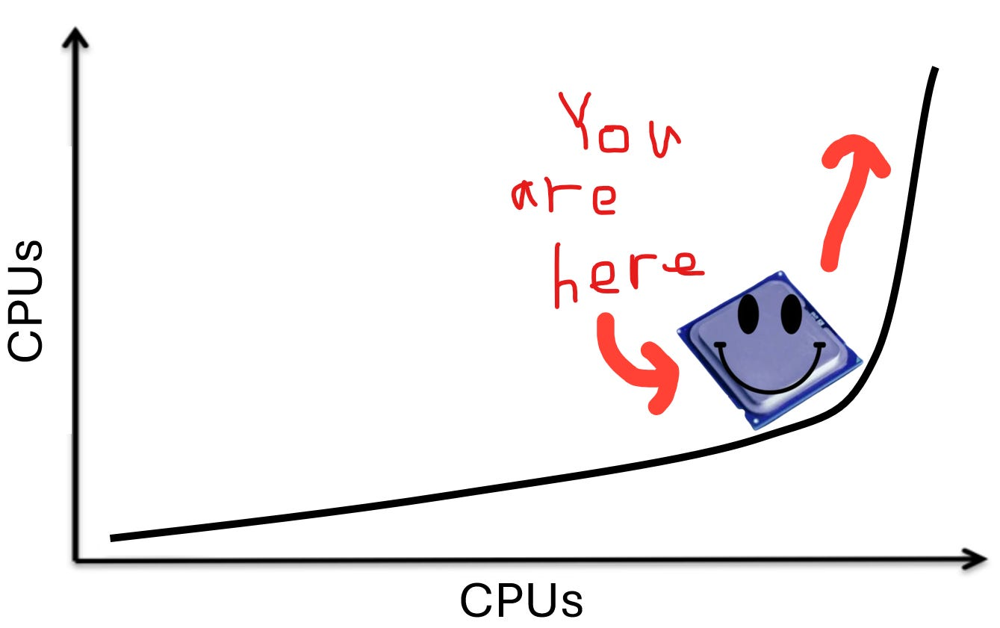
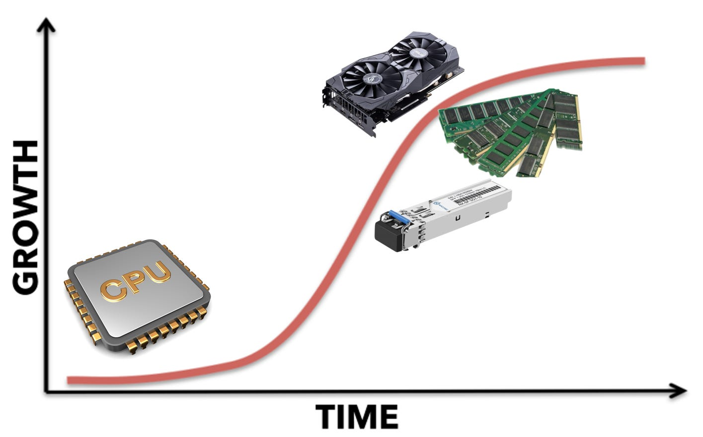
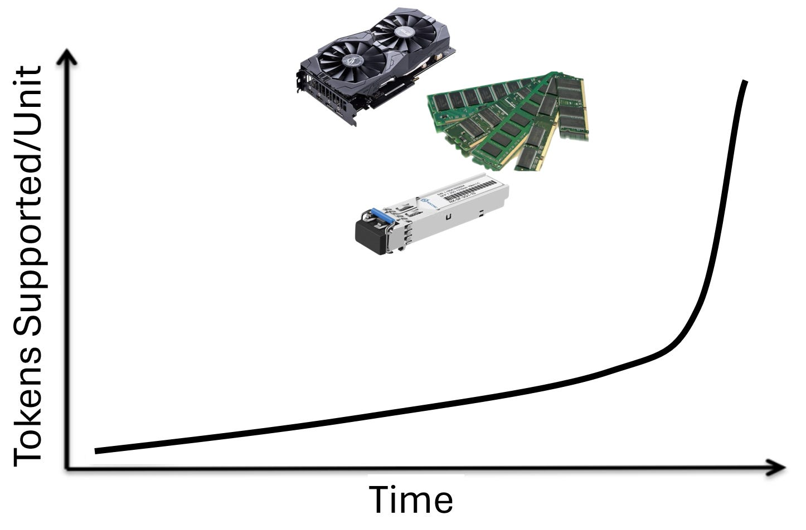
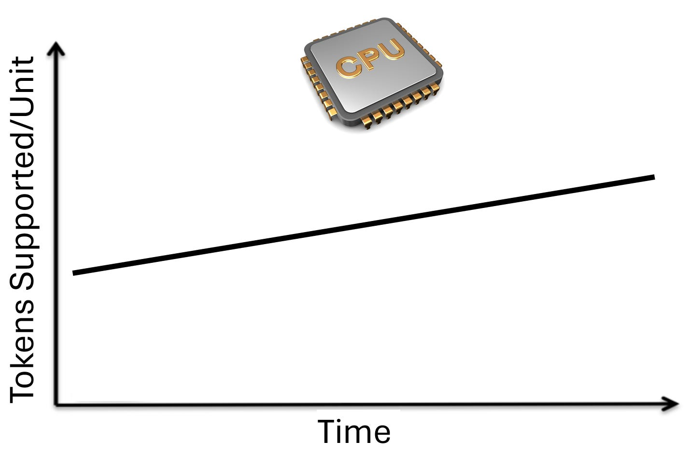
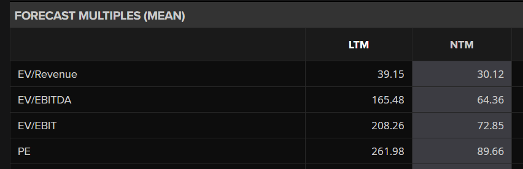

I used to think about the agentic AI CPU adoption wave as a simple increase in the CPU-to-GPU ratio in a cluster.

Like there is a certain ratio of CPU workloads to GPU workloads. But once the inference workload slowly shifts from simple feed forward to agentic loops, the mix of CPU workloads increases, eventually reaching a new equilibrium as agents mature.

This (currently consensus) story is no where near bullish enough.

It is like saying “optics will take share from copper” and just stopping there. You miss so much nuance, the kind that *wakes you up* to how insanely bullish a certain market is that a **traditional bull case does it no justice**. In the optics case, you leave out the structural growth of networking bandwidth relative to compute plus each layer of CPO (scale-out CPO, inter-rack scale-up CPO, and intra-rack CPO) being half an OOM larger than the last.

Optics has literally became a meme sector recently which is funny since it is the market I started this publication on and I could have never imagined it could have got to this point (in the best way possible).

Yes, I get it, everything is bullish these days. Every component is a bottleneck. I’m not just saying CPUs will do well on their own. It is that they will outperform GPUs (and basically all other components) relatively and by such a wide margin it may even be bearish Nvidia. (Ok I am def not bearish Nvidia but you get the point)

Because everything is a **bottleneck** I will actually do a **bottleneck** tier list at some point just to compare the relative **bottleneck**-ness of all the **bottlenecks**. I am so surprised no one has done it but I will happily be the first.

CPUs are up there in the S tier with optics.

---

Subscribe for articles about chips and stuff

Subscribed

*By accessing this content, you acknowledge and agree to our [terms and conditions.](https://jasonschips.substack.com/p/terms-and-conditions) This research is **not financial advice**.*

---

#### Contents

1. Fingers and Brains
2. The Demand Side: Earliest in the S-Curve
3. The Supply Side: Immunity to Efficiency Gains
4. TLDR
5. Intel and Price Hikes
6. The Biggest Hidden Beneficiary

## Fingers and Brains

Please direct your attention to this following analogy.

Humanity more or less has a fingers-to-brains ratio of 10:1. The brain does the thinking and then the fingers do the doing. This ratio has not really shifted in all of humanity’s history as you might imagine.

But imagine this. Human brains are getting exponentially smarter. They are also getting exponentially faster. This allows humans to do tasks more quickly and do more complex tasks than before. At the same time, they have the capability to buy more arms and fingers if they want to do more tasks. What do you think happens to the fingers-to-brains ratio?

***It increases insanely fast.***

On top of that, the brain is also getting way more efficient energy (food and sleep) wise. But the fingers stay the way they are. Maybe there are linear improvements as slightly better fingers are released, but according to the laws of fingers, you can never pick up an object with one finger. You can never bowl a bowling ball with two fingers. Brain investors may fear that brain count needs per task are decreased due to efficiency gains, but the fingers needed are nearly unaffected.

That is it for the silliness. The rest of the article is for alpha purposes only.

## The Demand Side: Earliest in the S-Curve

Now let us turn our attention to supply and demand. Starting with demand.

Every piece of AI infrastructure sits somewhere on the S-curve. GPUs, memory, and networking were the first to inflect. Training drove the initial wave. Inference scaled it further. Test-time compute added another layer. By now, these components are well into the steep middle portion of their adoption curves, with massive installed bases, deep supply chain investment, and incremental demand from each new workload.

CPUs are still at the bottom of the curve.

GPUs serve training, inference, test-time compute, and agentic workloads. Memory stores model weights, KV caches, reasoning chains, and agent context. Networking connects all of it. For each of these components, agentic AI is the fourth or fifth demand driver layered on top of an already enormous base. It matters at the margin, but the base case was built without it.

CPUs are different. CPUs do not train models. CPUs do not run inference at competitive datacenter scale. CPUs do not power test-time compute. For the entire AI boom, the datacenter CPU has been a utility player: handling orchestration, managing I/O, running the OS. The GPU-to-CPU spend ratio has been lopsided for years because CPUs simply did not matter for the core AI workload.

Agentic AI is the first workload that changes this. When an agent calls a tool, that tool runs on a CPU. Python execution, document retrieval, URL fetching, HTML parsing, JSON serialization, bash execution: all CPU. Raj et al. (2025) in their paper “A CPU-Centric Perspective on Agentic AI” profiled five representative agentic workloads and found that CPU-bound tool processing consumed up to 90.6% of total end-to-end latency. In a RAG pipeline over a large document corpus, retrieval alone consumed 84-91% of runtime while LLM inference contributed less than half a second.

For GPUs, agentic AI is incremental demand on a mature curve. For CPUs, agentic AI is the *only* new demand driver that matters, hitting a market that has been underinvested for years. That is the difference between adding 10% more demand to an already-strained supply chain and igniting a category of demand that barely existed two years ago.

## The Supply Side: Immunity to Efficiency Gains

Now let’s explore the supply side of the equation.

The history of AI hardware is a history of doing more with less. Mixed precision training moved the industry from FP32 to FP8, delivering 2-4x throughput gains per generation. Quantization compresses model weights from 16-bit to 4-bit. Distillation takes 70B-parameter models and produces 7B-parameter students. Sparse attention skips irrelevant tokens. These gains compound multiplicatively, and they apply to GPUs, memory, and networking alike. DeepSeek demonstrated this at scale, achieving frontier-competitive performance with dramatically less GPU compute than Western labs assumed necessary. TurboQuant compresses KV caches, fitting more concurrent users into the same HBM.

As more time passes, we need fewer units of hardware to serve the same tokens.

CPUs do not have these release valves. Consider what a CPU does in an agentic workflow: fetch a URL, parse HTML, execute Python, run nearest-neighbor search, serialize JSON. These are operational tasks, not mathematical ones. You cannot quantize an HTTP request. You cannot distill a database query. You cannot apply sparse attention to a bash script. The optimizations that do exist (better scheduling, GIL removal, NUMA-aware placement) are real but linear: 2x here, 4x there. Compare that to GPU-side compounding where quantization (4x) times distillation (10x) times sparsity (2-4x) stacks to 80-160x effective compute reduction.

Thus, CPU efficiency is slow and linear. The “DeekSeek/TurboQuant moment” threat is removed.

This asymmetry points to a conclusion about what the AI datacenter looks like in equilibrium. Every component is a bottleneck today: GPUs, HBM, networking, power. But the right question is not what is scarce now. The right question is what is the *terminal* bottleneck, the resource that remains scarce after five years of optimization and capital thrown at the problem. GPUs have a rich optimization roadmap and so does memory. DeepSeek proved you can do more with less GPU compute. TurboQuant proved you can do more with less KV cache memory. CPUs do not have these threats. A CPU cycle is a CPU cycle, and agentic AI needs more of them every year.

## TLDR

I literally think CPUs could be a market worth trillions of dollars. If you believe agentic AI changes the world in an exponential way (which I do) it’s impossible not to see CPUs growing exponentially beyond anyone’s wildest imaginations with no DeepSeek moment to put out the fire. The agents are here. They need hands and they need fingers. If the disruption is to happen, it shall be through the margins of our great CPU companies.

That is what we shall look at next.

## Intel and Price Hikes

**Intel is a long-term share loser in datacenter CPUs**. ARM-based custom silicon from AWS, Microsoft, Google, and now Meta is steadily eating x86 market share in cloud workloads. And even in x86 AMD continues to take share with EPYC. That much is consensus and something I agree with despite my massive long position. Too bad, agentic AI is so early in its S-curve that the out-year upside is enormous.

What is new are two near-term dynamics that could meaningfully boost Intel’s earnings right as the agentic CPU demand cycle inflects.

The first is that Intel is the only major CPU supplier that owns its own fabs. Leading-edge logic capacity at TSMC is the single most contested resource in the semiconductor industry right now. AMD, every hyperscaler, and NVIDIA are all fighting for TSMC allocation against each other. When agentic AI demand spikes CPU requirements across the industry simultaneously, everyone fighting for TSMC wafers faces a zero-sum allocation battle. Intel does not. Intel can get moderate (though not memory level) price hikes from the shortage while not suffering from the shortage themselves in terms of shipments.

The second dynamic is operating leverage on a near-zero margin base. The stock has historically traded at low single-digit revenue multiples as a result.

This is where CPU price hikes create asymmetric EPS upside. When you sell a CPU for a higher price because of a shortage, COGS does not change. The silicon was already fabbed, tested, and packaged at the same cost. Every incremental dollar of pricing flows directly to gross profit. For a company operating near breakeven, even modest pricing gains create enormous percentage moves in earnings.

How much can they hike prices? Well it turns out quite substantially. We’ll see how much of this shows up tomorrow during earnings.

Consumer CPUs have climbed roughly 5-10% since March. Server CPUs are getting hit harder, with the weight of industry commentary pointing to 10-15% increases on constrained SKUs, and some estimates suggesting cumulative 2026 hikes could reach ~30%. Intel’s channel chief Dave Guzzi confirmed constraints are hitting partners “across the board.” HSBC upgraded Intel to Buy last week with a price target of $95 (from $50), citing server CPU growth and pricing power as the primary catalyst over foundry.

Though we must note this ain’t memory.

DRAM is a commodity. When DRAM is in shortage, prices clear the market directly: we are living through a historic memory cycle with prices up multiples from trough. The shortage converts cleanly into pricing because any DRAM module is substitutable for any other. CPUs are different. They are SKU-specific, and enterprise customers are locked into specific architectures by software stacks, driver certifications, and supplier contracts. Intel's channel chief Guzzi said explicitly that CPU price increases "should not come close to" memory. Some of the CPU shortage leaks into extended lead times and outright unavailability rather than converting into pure pricing. One gaming PC executive told Nikkei that "even if we pay more, we still cannot get more." That is revenue Intel cannot capture regardless of price. So the operating leverage story is real but bounded: 10-15% price hikes on constrained SKUs, not 400% commodity repricing.

## The Biggest Hidden Beneficiary

There is one company that is hilariously well positioned set to capture the majority of the upside of the steepest part of the S-curve in the out-years once agentic AI conquers the entire world.

SemiAnalysis Giveaway: The first person to subscribe using the paywall on this post will be selected to receive one free month of SemiAnalysis (sent to your email, must not already be a SA subscriber).

Subscribed

#### ARM

Yeah, I know, ARM’s valuation is completely comical.

At the same time, they are such a perfectly well-positioned business. I am still confident there is more upside than downside.

Basic summary of their business is that they collect royalties on every chip that uses ARM IP and they recently announced their aptly-named AGI CPU which enters them into the merchant CPU market.

They rallied significantly this week. I entered a long in SoftBank (which holds 85% of ARM) on Monday which was a very good decision.

Anyways, here’s why ARM is gonna do so well.

#### ARM vs. x86

ARM benefits from the agentic CPU cycle through two distinct channels. The first is the ongoing ARM vs. x86 market share migration, which agentic demand accelerates. The second is the architectural advantage ARM holds for agentic workloads specifically through the design of its datacenter cores. Both matter independently, but together they create a compounding thesis.

The ARM migration in datacenter CPUs was underway well before agentic AI became a demand driver. ARM-based chips went from ~15% server CPU share in 2024 to roughly 25% by year-end 2025 according to Dell’Oro, driven by superior price-performance and energy efficiency versus x86. AWS reported that over half of its new CPU capacity additions in the past two years used ARM-based Graviton chips. ARM itself projects 50% share, which is aggressive, but even conservative third-party estimates from Omdia (20-23%) represent a dramatic trajectory from near-zero a few years ago. Every major hyperscaler either has custom ARM silicon deployed at scale or will within the next 12 months.

Agentic AI accelerates this migration for a simple reason: energy efficiency matters more when CPUs consume more power. The energy consumed by CPUs rises to 44% of total system power at large batch sizes. As agentic workloads scale, the CPU becomes the dominant marginal power cost. ARM cores deliver materially better performance-per-watt than x86. This advantage has always existed, but it was less consequential when CPUs were a small fraction of total system power. At 44% of dynamic energy, the architecture with superior power efficiency captures disproportionate TCO savings.

#### The AGI CPU

The second channel is more speculative but potentially more powerful. ARM’s datacenter core design has a structural architectural advantage for agentic workloads specifically.

The dominant x86 datacenter CPUs (AMD EPYC, Intel Xeon) use simultaneous multi-threading (SMT), where two logical threads share a single physical core’s execution units, caches, and branch predictors. For traditional parallelizable datacenter workloads like web serving, databases, and virtualization, this improves utilization by filling pipeline bubbles with work from a second thread.

Agentic workloads break this model. They are highly dynamic, involve frequent branching and tool dispatch, and are often less parallelizable than GPU tasks. Raj et al. in their paper “A CPU-Centric Perspective on Agentic AI” demonstrates that CPU parallel efficiency degrades at batch sizes of 64-128, with the throughput saturation driven by coherence overhead, synchronization bottlenecks, and core oversubscription. When two threads share a physical core and both are running unpredictable, branchy agentic tool execution (parsing HTML, running Python scripts, serializing JSON, executing bash commands), they contend for the same resources. Performance degrades rather than improves.

ARM’s datacenter cores are predominantly single-threaded. Each core maintains fully independent resources: its own execution units, its own caches, its own branch predictor. There is no contention, no resource sharing, no performance degradation from noisy neighbors on the same core. For workloads that are inherently unpredictable and branchy, a single-threaded core with dedicated resources is more predictable, more scalable, and more performant than a multi-threaded core splitting resources between two competing threads.

This is also where Python’s GIL removal becomes relevant. New Python versions that remove the Global Interpreter Lock can improve runtime and energy efficiency of parallel agentic workloads like JSON parsing by ~4x (Salazar, 2026). As software-level parallelism for agentic CPUs increases, the demands placed on hardware increase in lockstep. More parallel threads doing real work means more contention on shared-core SMT architectures, and zero additional contention on single-threaded architectures with independent resources. The software trend compounds the architectural advantage.

NVIDIA’s Vera is the interesting wildcard. Its custom Olympus ARM cores introduce “spatial multithreading,” which physically partitions core resources between two threads rather than dynamically sharing them like traditional SMT. This is architecturally cleaner than x86 SMT, but it effectively halves the resources available to each thread. Whether that tradeoff performs well under the dynamic, unpredictable conditions of agentic workloads remains to be seen.

The combination of proven energy efficiency advantages driving the broader ARM vs. x86 migration and a plausible architectural edge on the fastest-growing CPU workload is why ARM is the structural winner of the agentic CPU cycle.

share and comment and like and restack!!1!

[Share](https://www.jasonschips.ai/p/cpus-a-better-story-than-photonics?utm_source=substack&utm_medium=email&utm_content=share&action=share&token=eyJ1c2VyX2lkIjoxNDAwMjQ1LCJwb3N0X2lkIjoxOTQ4NDUzNjYsImlhdCI6MTc3ODU1MTMwMSwiZXhwIjoxNzgxMTQzMzAxLCJpc3MiOiJwdWItNjY2NDM1NiIsInN1YiI6InBvc3QtcmVhY3Rpb24ifQ.TfAsRWfWN3dQGgmG1U8bU8DNGkrmq4I8LfcGfeVIRRA)