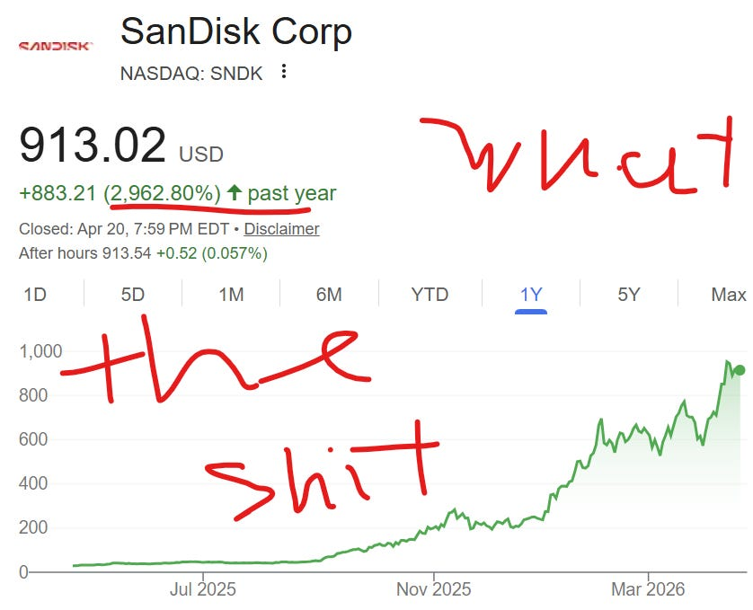
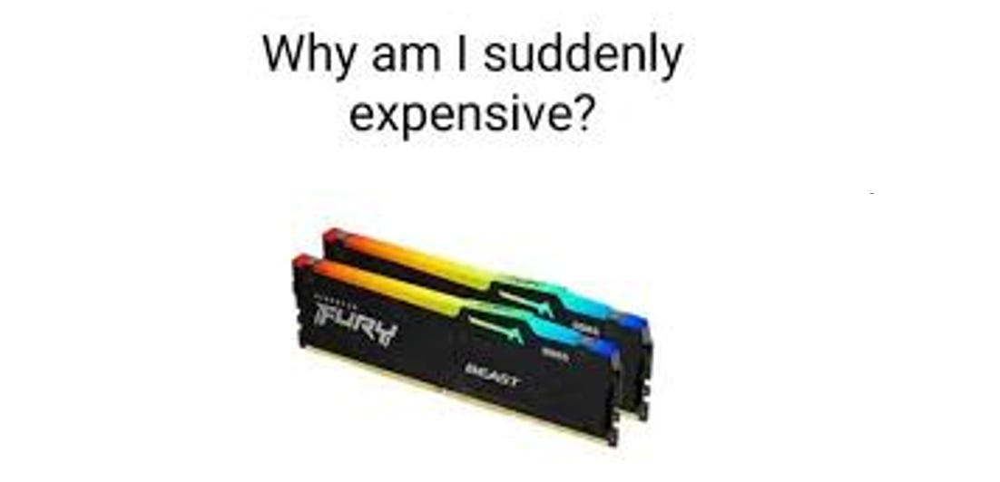
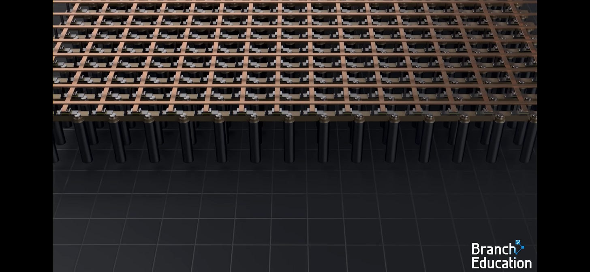
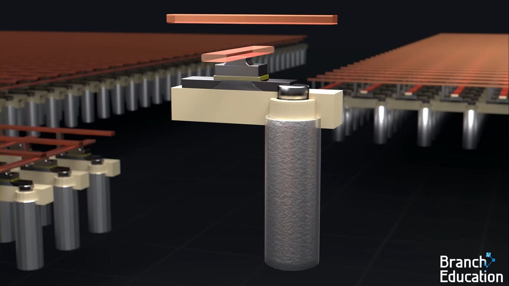
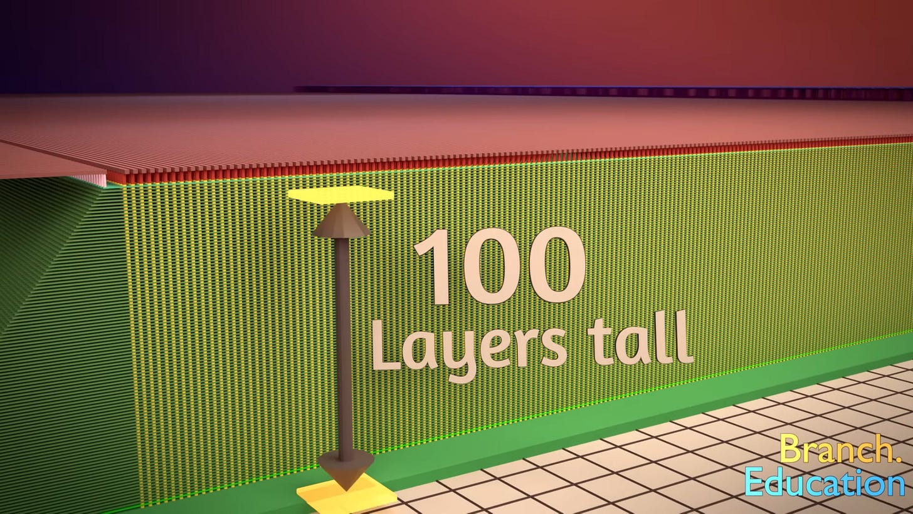
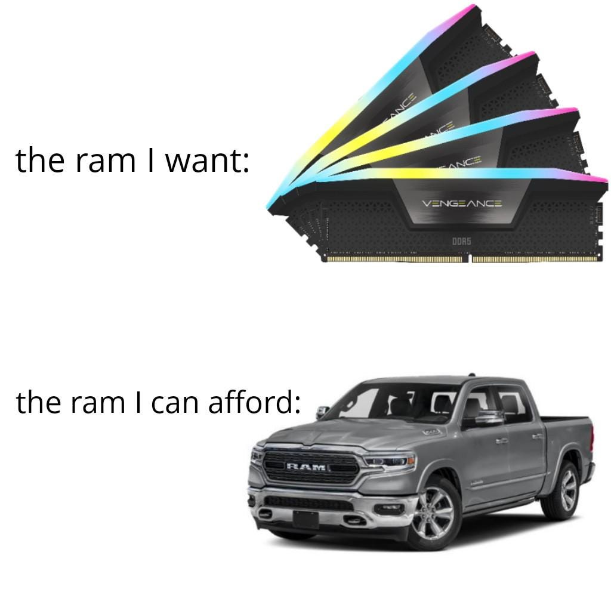
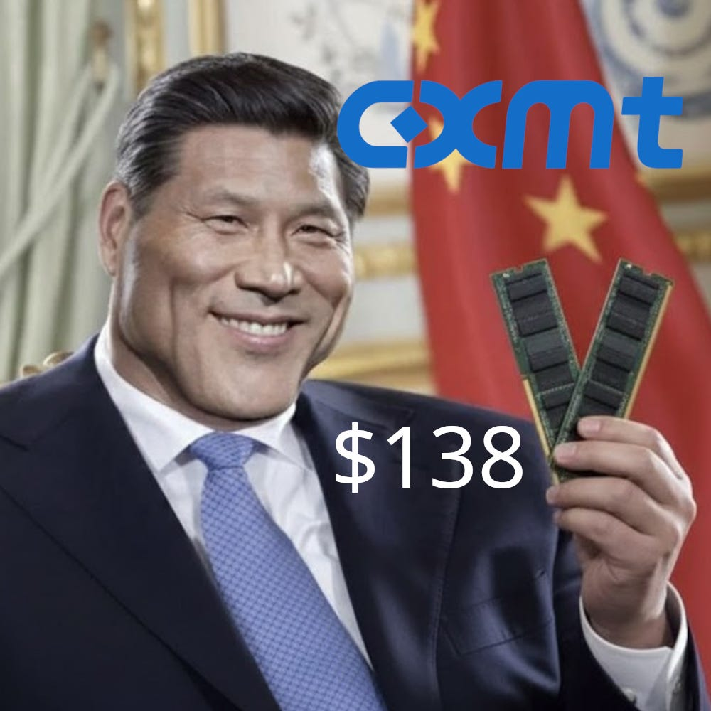
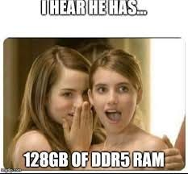

Memory is the next great theme I have yet to cover.

The reason I jump around with my writeups so much is that they are usually the result of me going down epic rabbit holes. This time, I felt the urge to explore a curious puzzle…

wut the

I find it funny people don’t talk about memory MORE. So basically one could have invested $30k in Sandisk last year and be a millionaire today lmaooooo.

**How did this even happen?**

DRAM is a commodity too. It is tight too. In fact, DRAM is talked about way more, as HBM (and even server DRAM) is a much more obvious complement to GPUs, but *Micron has performed nowhere near as well as Sandisk*.

And some people still have (very credible) arguments for it still being significantly undervalued, how is that possible?

The biggest curiosity I had was the differences between the DRAM and NAND markets. I wanted to understand what caused the NAND outperformance. The fundamental differences in their market structures. And most importantly, **which is the best way to play AI**.

Naturally, I spent a full day on Saturday just sitting in a room voice-chatting with Claude about memory .

What I discovered is that the performance of memory is at its core based on the balance of supply/demand.

***no shit.***

I know it sounds obvious. But I promise this is a more important insight than at first glance. I’m saying almost everything in memory reduces this. If we understand the direction of supply and the direction of demand, we can generally predict what happens to memory.

This is especially useful in comparing the relative trajectories of DRAM and NAND because they have separation in both their supply and their demand.

That is why the first two articles about memory will be discussing the supply side and the demand side separately. And honestly the article after that (ASP likely direction and uncertainty) will just be building on our baseline understanding of supply and demand.

These memory articles won’t really cover Sandisk or any memory name in particular just because there isn’t too much differentiation in a commodity industry (duh) but I will be opining on what stock(s) I like in memory today.

fyi this writeup shall feature out-of-context memory shortage memes for absolutely no purpose besides my own entertainment

---

Subscribe to have good memories

Subscribed

*By accessing this content, you acknowledge and agree to our [terms and conditions.](https://jasonschips.substack.com/p/terms-and-conditions) This research is **not financial advice**.*

---

#### Contents

1. Geometry and Bit Scaling
2. Tool Requirements

   1. NAND: Mostly Etch
   2. DRAM: Mostly EUV
3. Tale of Two Oligopolies
4. China
5. HBM
6. The Clear Winner of Round 1
7. TLDR

## Geometry and Bit Scaling

Both DRAM and NAND are hitting fundamental capacity constraints. But the nature of those constraints, and how they got here, is different.

**DRAM** is a planar (flat) technology. A blanket of bits.

source: branch education

Made up of these little 1t1c (one transistor one capacitor) cells that store charges.

source: branch education

Each generation, manufacturers shrink transistors laterally, from 1-alpha to 1-beta to 1-gamma node designations. You’re packing more bits into the same wafer area by making features smaller.

**NAND** is a vertical 3d technology. A whole bunch of round pillar-like cells stacked on top of each other with hundreds of layers. This is why it is so much cheaper and denser per GB than DRAM but obviously comes with the bandwidth tradeoff.

To scale, rather than shrinking features laterally, manufacturers increase the number of layers: 96 layers, then 128, then 176, then 218, and now pushing toward 300+. For years, this vertical scaling was NAND’s escape hatch from the capacity wall. **It allowed NAND bit capacity to grow more easily than DRAM (and therefore had a weaker supply market structure)**. You didn’t need to shrink features or buy expensive lithography tools. You just added more layers using existing deposition and etch equipment, and each generation delivered more bits per wafer without proportional capex increases.

That escape hatch is closing.

As layer counts push past 200, the engineering challenges compound. You’re etching memory holes through stacks of material with aspect ratios exceeding 100:1. Imagine drilling a hole 100 meters deep but only 1 meter wide, through alternating layers of different materials, and requiring nanometer-level precision at every depth. The mechanical stress on the wafer increases. Yield falls. Each incremental layer delivers less marginal cost reduction than the last. SanDisk’s own investor day data shows the cost reduction per generation from vertical scaling has fallen to approximately 0.24x, down from substantially higher levels in earlier generations.

This means NAND is converging toward DRAM’s capacity constraint model: adding bits now requires real capex, real fab buildouts, and real time. The era of cheap supply growth through “just add more layers” is ending. Both markets are now cleanroom-constrained, and both face multi-year lead times for greenfield expansion.

So TLDR, in terms of bit scaling, NAND was historically easier to scale than DRAM which meant constant gluts of new supply, but that era is ending as vertical scaling hits a wall, so **NAND and DRAM capacity additions via scaling are converging**.

But here is where the similarities end, and where the structural differences in supply become critical.

## Tool Requirements

The manufacturing processes for DRAM and NAND are fundamentally different, and those differences create distinct bottlenecks in the equipment supply chain.

#### NAND: Mostly Etch and Deposition

Making a 3D NAND chip is, at its core, a vertical construction project. You start with a silicon wafer and build upward, depositing alternating layers of oxide and nitride (or polysilicon), then punching vertical holes through the entire stack to create the memory cells.

The process, simplified, works like this: First, you deposit hundreds of alternating thin films, one on top of another, using chemical vapor deposition (CVD) tools. These tools must coat each layer uniformly across the entire wafer surface while maintaining precise thickness control. Each layer is only nanometers thick, and the total stack can be several micrometers tall.

Then comes the critical step: etching. Deep reactive ion etch (DRIE) tools bore vertical channels through the entire stack. These channels will become the memory strings, the vertical columns of cells that store data. The etch must maintain near-perfect verticality through 200+ layers without the channel widening at the top or narrowing at the bottom. This is among the most demanding etch processes in semiconductor manufacturing.

After the channels are formed, additional deposition steps fill them with charge-trapping layers and electrode materials, creating the actual memory cells at each layer intersection. Then the “staircase” structure is etched at the edge of the array to allow individual electrical contact to each layer.

The result: **NAND manufacturing is dominated by etch and deposition tools**! These two categories together account for roughly 50-60% of total NAND equipment spending. Lithography, while still important for patterning the top-level features, is **less critical** than in DRAM because NAND’s lateral features can be larger! The density comes from stacking, not shrinking.

**Lam Research** is the dominant supplier of advanced etch tools for NAND. Their Kiyo and Syndion platforms are purpose-built for the deep, high-aspect-ratio etches that 3D NAND requires. When NAND vendors spend capex, a disproportionate share flows to Lam. **Applied Materials** captures the deposition side, with their Endura and Centura platforms handling the hundreds of thin-film deposition steps in each NAND stack.

This tool mix matters for the supply story: NAND capex translates primarily into orders for etch and deposition equipment, which are **available from multiple suppliers and can be delivered on relatively normal timelines. There is no single tool bottleneck that gates NAND expansion the way there is for DRAM.**

#### DRAM: Mostly EUV

DRAM’s manufacturing challenge is lateral, not vertical. You’re shrinking transistors and capacitors on a 2D plane, pushing feature sizes below 15nm. At these dimensions, conventional DUV lithography cannot resolve the features. You need EUV.

EUV lithography is, without exaggeration, the most complex manufacturing technology humans have ever built. Each EUV scanner costs approximately $200-400 million. It uses a 13.5nm wavelength light source generated by vaporizing tin droplets with a high-power laser, bouncing the resulting plasma emission off multilayer mirrors in a near-vacuum chamber. The mirrors must be polished to sub-angstrom precision. The entire optical path operates in vacuum because EUV light is absorbed by air. The supply chain for these machines spans dozens of countries and hundreds of specialized suppliers.

ASML is the sole manufacturer of EUV lithography systems. There is no second source. And ASML’s production capacity is not easily scalable. They are adding perhaps a dozen machines per year to their output, and demand from logic foundries (TSMC, Samsung Foundry, Intel) competes directly with demand from DRAM fabs for those same machines.

This creates a hard bottleneck for DRAM capacity expansion that has no equivalent in NAND.

Consider the numbers: Samsung recently ordered approximately 20 EUV systems for a single new fab (P5), along with roughly 70 DUV tools. ASML’s EUV delivery slots are fully sold out through 2027, with negotiations for 2028 allocations already underway. Every EUV machine allocated to a DRAM fab is one that cannot go to a logic foundry, and vice versa.

The implication is stark: **even if DRAM vendors want to add capacity aggressively, they are physically gated by EUV tool availability**. This is a supply constraint that operates on a multi-year timescale and cannot be resolved by throwing money at the problem. ASML’s production ramp is measured in single-digit percentage improvements per year, not the kind of step-function increase that would relieve the bottleneck.

NAND faces no equivalent constraint. NAND fabs use DUV lithography (which is widely available from multiple suppliers) and advanced etch/deposition tools (which Lam, Applied, and others can produce at scale). The tools are expensive, but they are not scarce in the way EUV is scarce.

This asymmetry in tool availability is one of the most underappreciated structural differences between the two markets! It means **DRAM supply growth is slower, more capital-intensive, and harder to accelerate than NAND supply growth**, even when both markets face strong demand.

## The Tale of Two Oligopolies

Supply discipline is a function of market structure. The fewer the players, the easier it is to maintain pricing power, whether through explicit coordination or simply through the rational self-interest of a small group.

**DRAM has three major producers:** Samsung, SK Hynix, and Micron. Together, they control approximately 94% of global DRAM bit shipments. This is a textbook oligopoly. Each player understands that aggressive capacity expansion destroys pricing for everyone, and each has learned from prior cycles where overcapacity led to catastrophic margin compression. The memory of those downturns acts as a natural governor on investment behavior.

The DRAM oligopoly is further reinforced by the HBM dynamic (which we’ll discuss in Section 5). When the highest-margin product in your portfolio (HBM) requires you to divert standard DRAM wafers, you have a built-in mechanism for constraining commodity DRAM supply without explicitly coordinating with competitors. The market structure does the discipline for you.

**NAND has six significant producers:** Samsung (~32% of bits shipped), Kioxia (~18%), SanDisk (~13%), SK Hynix/Solidigm (~12%), Micron (~12%), and YMTC (~7% and growing rapidly). This is a meaningfully more fragmented market.

With twice as many significant players, supply discipline becomes harder to maintain. Each vendor faces the prisoner’s dilemma: if everyone restrains capacity, prices stay high and everyone profits. But if one vendor defects and expands aggressively, they capture share while competitors suffer. The incentive to defect is stronger when there are more players, because the cost of being the one who doesn’t expand is higher.

This dynamic has played out repeatedly in NAND’s history. Prior cycles saw aggressive capacity additions from multiple vendors simultaneously, leading to oversupply, price crashes, and margin compression far more severe than anything DRAM experienced. The current cycle’s discipline is notable precisely because it’s unusual for NAND.

The question investors must answer is: is this discipline structural or temporary? If it’s structural, driven by layer scaling limits, LTAs with floor prices, and rational vendor behavior, then NAND pricing can remain elevated. If it’s temporary, a function of the current tightness that will unwind as capacity comes online, then the **six-player structure makes normalization faster and more violent than in DRAM**.

DRAM’s three-player structure provides a higher floor on discipline regardless of cycle conditions. Even in downturns, three players can more easily reach an implicit equilibrium on capacity and pricing than six can.

## China

China’s semiconductor ambitions create different risks for DRAM and NAND, and the asymmetry is larger than most investors appreciate.

#### YMTC: A Real Threat to NAND

Yangtze Memory Technologies Corporation (YMTC) is not a theoretical competitor. It is a rapidly scaling NAND manufacturer that is approaching the technological frontier.

YMTC’s Wuhan Fab 3 is expected to begin full-scale operations in the second half of 2026. Once operational, YMTC is projected to surpass both SK Hynix and Micron in NAND shipment volume, becoming the world’s third-largest NAND producer. They have been steadily increasing their mix of high-complexity 200+ layer NAND across server and mobile segments, and are expected to stabilize yields on 300-layer products this year.

Perhaps most significantly, YMTC has reportedly sourced more than 50% of the equipment for one of its new fabs from domestic Chinese companies, including key tools for vertically stacking chip layers. This suggests that export controls and entity list restrictions are not preventing YMTC from building and equipping advanced NAND fabs. This is a development that has profound implications for the durability of NAND supply constraints.

The market signal that matters most: Apple is reportedly evaluating the use of YMTC products due to NAND supply constraints. If Apple, the most demanding and powerful buyer in the consumer NAND supply chain, begins qualifying YMTC, the credibility barrier falls for every other OEM. YMTC would transition from a “China-domestic supplier” to a globally qualified NAND vendor, and the effective supply base for the NAND industry would expand meaningfully.

#### CXMT: A Meh Threat to DRAM

ChangXin Memory Technologies (CXMT) is China’s primary DRAM entrant, but its competitive position is far weaker than YMTC’s in NAND.

CXMT only entered mass production of HBM3 in Q1 2026, and yields remain very low. Advanced DRAM requires EUV lithography, which CXMT cannot access due to export controls. Without EUV, CXMT is limited to older process nodes that cannot compete on cost or performance with Samsung, SK Hynix, or Micron’s latest products.

Moreover, whatever DRAM capacity CXMT adds is being absorbed by domestic Chinese demand, primarily Huawei. Samsung has been discontinuing legacy HBM sales to China, and Huawei cannot procure enough HBM from overseas sources. CXMT is essentially Huawei’s captive memory supplier, which means incremental CXMT capacity does not translate into incremental global DRAM supply.

The result: CXMT’s impact on the global DRAM market is contained. Its capacity is spoken for, its technology is behind, and its access to critical tools is restricted. The DRAM oligopoly’s 94% market share is not under serious threat.

YMTC’s impact on the global NAND market is growing. Its technology is competitive, its domestic equipment sourcing reduces its vulnerability to sanctions, and its potential qualification with Apple could open global markets. The NAND market’s fragmentation could increase further if YMTC achieves the scale its expansion plans imply.

## HBM

The most important structural difference between DRAM and NAND supply is something that has no parallel in NAND’s history: two distinct products, serving different layers of the memory hierarchy, suddenly competing for the same manufacturing resources.

To understand why this matters, consider the memory hierarchy itself. In an AI server, HBM sits on the GPU package, providing extreme bandwidth (~5 TB/s) at extreme cost. DDR5 sits on the motherboard, providing large capacity at moderate cost. These are two separate layers with different latency, different bandwidth, and different price points. The gaps between them are not percentages or small multiples, but orders of magnitude.

Historically, these two layers were supplied by different manufacturing processes and, in some cases, different fabs. HBM was a niche product. DDR was the mainstream. They coexisted without competing for the same wafer starts.

That is no longer true.

HBM and standard DRAM are now manufactured in the same fabs, on the same process nodes, using the same EUV lithography tools, by the same three vendors. Every HBM stack requires approximately 3x more silicon per bit than standard DDR5, because of the TSV (through-silicon via) process, the yield loss from stacking, and the logic die at the base. And HBM commands dramatically higher margins, estimated at 5-10x the margin per wafer versus commodity DDR5.

The economic logic is inescapable: every DRAM vendor will preferentially allocate wafers to HBM over standard DRAM, because HBM generates far more profit per unit of scarce fab capacity. This is not a choice that requires coordination or discipline. It is the rational profit-maximizing behavior of each individual vendor, operating independently.

The consequence is a structural suppression of standard DRAM supply that operates automatically, without any vendor needing to exercise “discipline” in the traditional sense. The more HBM demand grows (driven by GPU shipments from Nvidia, AMD, and custom ASICs), the more standard DRAM supply is constrained. HBM becomes a permanent tax on DDR5 supply.

NAND has no equivalent mechanism. There is no premium NAND product that consumes 3x the silicon and commands 10x the margin, pulling wafers away from standard enterprise SSDs. High-Bandwidth Flash (HBF) is an early concept, but it is not in volume production and its economics are unproven. The “Super High IOPS SSD” that Kioxia has demonstrated is a differentiated product, but it does not cannibalize standard NAND capacity the way HBM cannibalizes standard DRAM capacity.

This is arguably the single most important structural advantage DRAM has over NAND on the supply side. DRAM supply is being constrained by an internal, self-reinforcing mechanism, the diversion of wafers to HBM, that operates independent of vendor discipline, market conditions, or competitive dynamics. NAND supply is constrained by the traditional factors of capex discipline, layer scaling limits, and demand growth. Those factors are real, but they are more fragile. They can reverse if vendors lose discipline, if layer scaling finds a second wind, or if Chinese capacity comes online faster than expected.

## The Clear Winner of Round 1

The supply side of the DRAM vs. NAND question is not a draw. DRAM has structural advantages at every level:

The capacity wall affects both markets, but DRAM expansion is gated by EUV tool scarcity while NAND expansion faces no equivalent single-point bottleneck. DRAM’s three-player oligopoly enforces discipline more naturally than NAND’s six-player market. China’s DRAM entrant (CXMT) is contained by technology gaps and domestic demand absorption, while China’s NAND entrant (YMTC) is scaling rapidly and potentially entering global supply chains. And HBM creates a self-reinforcing mechanism that constrains standard DRAM supply without requiring explicit discipline, while NAND has no equivalent internal constraint.

None of this means NAND supply is loose. It is demonstrably tight today, and the layer scaling slowdown, equipment delivery bottlenecks, and LTA structures provide meaningful near-term support. But the medium-term supply outlook carries more risk in NAND than in DRAM, because NAND has more paths to supply relief and fewer structural barriers to capacity expansion.

In Part 2, we will examine the demand side, where the picture inverts: NAND’s demand story may be structurally stronger than DRAM’s, driven by the shift from ephemeral compute to persistent state in the age of agentic AI. The question investors must answer is whether demand strength can compensate for supply vulnerability, and for how long.

## TLDR

**DRAM wins the supply round!** DRAM supply is structurally tighter than NAND. Both markets face capacity constraints, but DRAM expansion is bottlenecked by EUV lithography tools that only ASML can make, while NAND can scale with widely available etch and deposition equipment. DRAM has three major producers controlling 94% of the market. NAND has six. China's DRAM entrant (CXMT) is years behind on technology and its output gets absorbed by Huawei. China's NAND entrant (YMTC) is approaching the frontier and Apple is reportedly evaluating their products. Most importantly, HBM and standard DRAM compete for the same fabs, the same wafers, and the same EUV machines. Every wafer allocated to HBM is one that cannot make DDR5. NAND has no equivalent internal constraint on supply. The result: DRAM supply is harder to expand, better disciplined, and structurally self-constraining in ways that NAND is not.