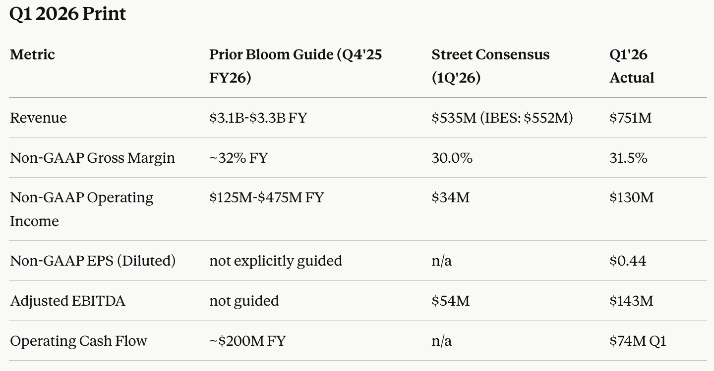
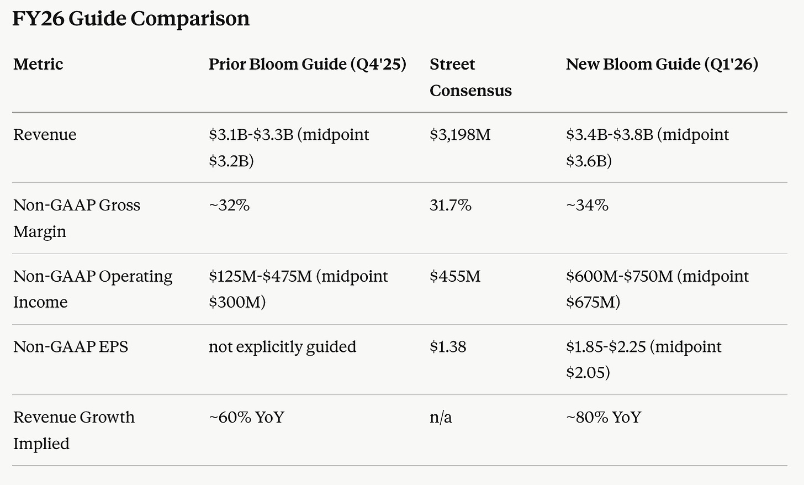
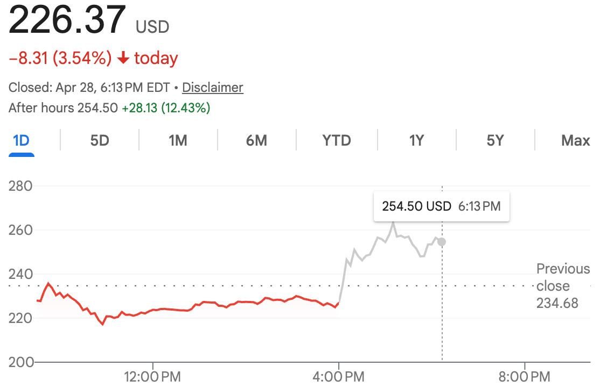
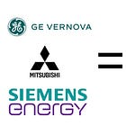
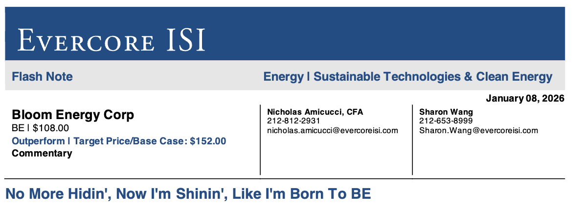
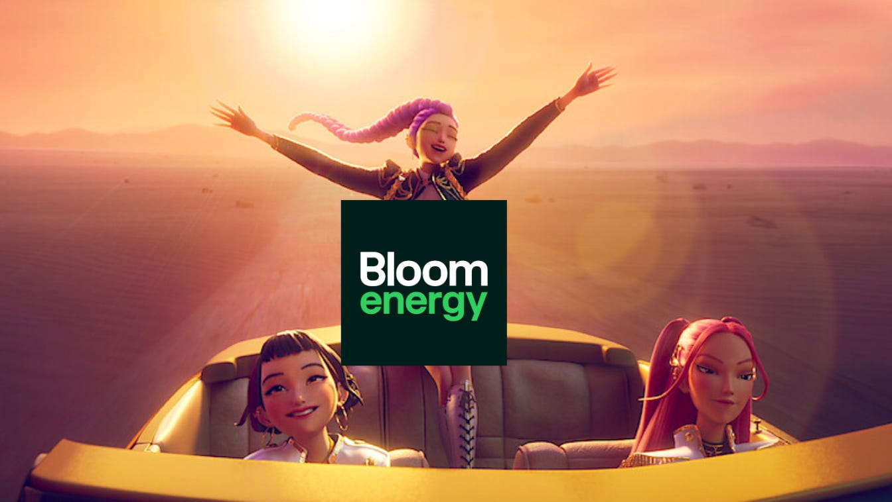

Have you ever seen a company beat consensus REVENUE estimates by 36%? They absolutely mogged these analysts lmao.

And this probably meant that they shipped between 50 and 100% more Bloom boxes than people thought, because their revenue is made up of product, service, and several other line items. A lot of the other stuff is based off of installed base. The growth measure is really product revenue, and this beat was completely driven by product revenue. So in that sense, it’s actually even bigger than the headline number suggests.

For the guide, they increased their revenue midpoint by 12.5% and their operating income midpoint by… 125%. Their operating income guide is now 50% above street consensus.

The way they’re growing quarter over quarter, I honestly severely doubt that they won’t beat their midpoint by a crazy amount. I mean, we’re already at 750 million this quarter, and the guide implies 900 million per quarter run rate. Given that they just TRIPLED product revenue year over year and are easily growing double digits sequentially. I think they’re easily above $1 billion per quarter in the second half and smash right through that guide.

Unsurprisingly, we are up 12%.

This is really incredible stuff from Bloom. Now let’s see what they drop on the call.

## Earnings Call

The overall TLDR conclusion, main takeaway summary that I have of this earnings call is that it is a perfect checklist execution of our bull case.

[

#### The Best AI Energy Solution on the Planet

[Jason's Chips](https://substack.com/profile/112809522-jasons-chips)

·

Apr 28

[Read full story](https://www.jasonschips.ai/p/the-best-ai-energy-solution-on-the)](https://www.jasonschips.ai/p/the-best-ai-energy-solution-on-the)

I think I made 20+ arguments here on why Bloom is the best AI energy solution, and on the call, KR basically addressed all of them. Nothing that they said really surprised me at all, which, in this case, is actually an excellent thing. Because my base case is that this company grossed into a hundreds-of-billions-of-dollars market cap beast.

#### Capacity

KR’s really been trying to make it clear to us that Bloom is not and will never be constrained by capacity.

> “think of Bloom's capacity increase as an analog dial that constantly keep increasing as opposed to some digital step function that happens once in a while.”

This is one of the most important new disclosures from the call. They are increasing capacity every single quarter now just because and they specifically said hundreds of megawatts per quarter. The reason they’re able to do this is because they’re so capital-light that preemptively increasing capacity isn’t at all a risk to shareholders, unlike for GE Vernova and the big turbine oligopoly. It’s a huge, huge advantage.

KR makes a very key point that the turbine guys are bragging about 4 year backlogs while Bloom prides on actually delivering power. Other solutions not ready until 2029. Bloom is ready “this year or the next.”

There’s also another interesting point to make here. Because it’s so easy to expand capacity and they will never be capacity-constrained, their revenue is the only revenue out of all energy plays that grows at the speed of the demand. So, in that sense, their guidance isn’t as important as other companies, while their actual results should be emphasized much more, as they will never be behind demand

#### Environment and Permitting

If I had a nickel for every time KR said “community” or “neighbor,” I think I can buy a share of Bloom Energy.

But anyways, this is actually really important and KR knows this. He actually brought up something new today, which is the water use. It takes way, way, way more water to run a big CCGT or an aeroderivative turbine than it does for fuel cells, even though data centers do not use much power on their own, despite popular belief, energy generation does. He specifically said this:

> “If you use ccgt, you will use all the water that all residents use to shower a day in Rhode island just to power that power plant. Close to a million showers a day and you will create knots from it air pollution that is the equivalent of all the cars in Rhode island almost in that one location. So even in a, you know, remote town, you can understand why there’s a pushback and why clean is going to be important. If that’s how important it is for a large data center. Imagine now for inference where it’s going to go. So we see that as a huge opportunity coming our way as we go forward.”

Another excellent point they made was that as inference demands energy closer and closer to population centers, there is no way on earth there won’t be pushback to big polluting turbines placed near cities. If there is substantial pushback on training data centers in very remote towns, imagine what it would be like to put inference data centers near big cities.

Overall, this whole community and neighbor-friendly thing that the execs are pitching is really underrated and is a huge part of the TCO considerations. Permissioning is a cost. Regulation is a cost. Legal action is a cost. If Bloom eliminates those costs, Bloom is cheaper. That’s why they emphasize it so much.

#### The Transition to a One Stop Bloom Shop

I think this becomes a key theme throughout 2026 and 2027.

As KR mentioned on the call, hyperscalers took a long time to validate their new energy solution because it’s not something that they’ve ever worked with before. Because of that, past arrangements often had them as a bridge power solution. Maybe there was a grid backup or backup diesel generators.

What about that bridge power thing now?

> “You know, earlier in this conversation they used to bring up the concept of bridge power with us and I would smile and always say we’re happy to sell you a bridge to a bridge because Superman ain’t coming. Okay, so today that conversation is non existent.”

We are becoming a one-stop Bloom shop. It’s happening already. In the prepared remarks, the Oracle 2.45 gigawatts site is a fully Bloom generation solution. No grid, no backups, just Bloom. This is the true market. This is what’s going to drive the company’s growth going forward.

As soon as they are validated with one big customer (Oracle), the hyperscalers will have the confidence to also adopt the one-stop Bloom shop.

#### Other Key Comments

1. Bloom is now cost-competitive with the grid in most markets and turbines in all markets. This is crazy. The grid is usually thought of as the single cheapest electricity generation and the ideal way for data centers to get their power if it was available. If fuel cell costs keep dropping, longer term, data centers might never need the grid.
2. The duration of their service contracts has expanded to 10-15 years, up from 6-7. Service has a 100% attach rate, meaning that each Bloom box sold comes with annual recurring revenues that are now much longer durations.
3. They are so scalable that 10X-ing their capacity doesn’t involve increasing the number of employees. They can just use automation. Capital-light manufacturing in action.

Not recent but I love it when cell-siders come up with funny titles. This is by far my favorite. Oh, by the way, I’m a huge fan of Golden. One of my fav songs. I’ve never watched K-pop demon hunters, though.

no more hidin now i’m shinin like i’m born to BE