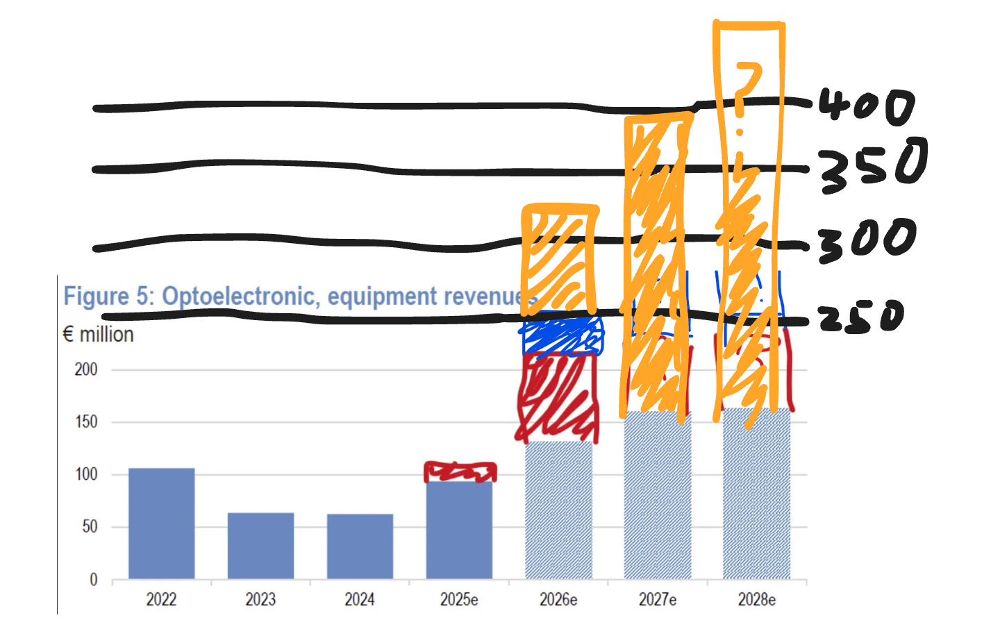
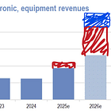
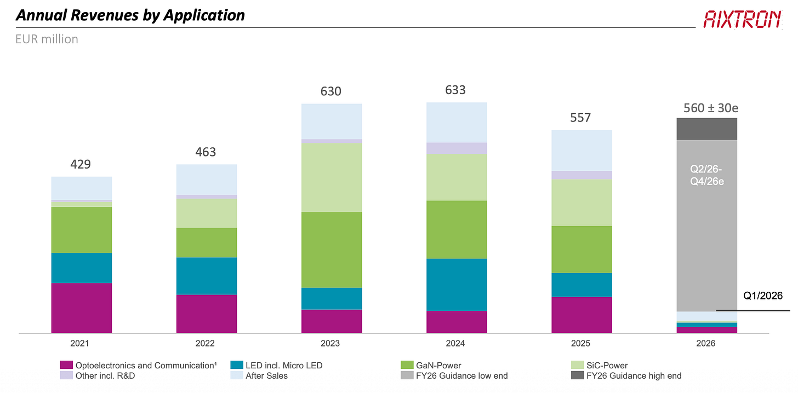
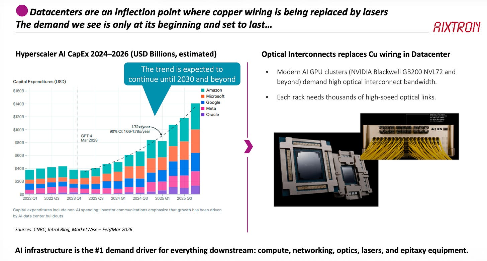
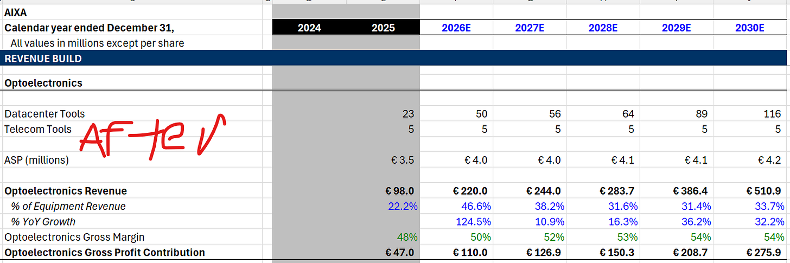

This is why you never sell a well-positioned company based on multiples alone.

Aixtron is a revisions machine. I really love their management team. They give us so much color on these calls and makes things really easy for us analysts.

---

‘scribe

Subscribed

*By accessing this content, you acknowledge and agree to our [terms and conditions.](https://jasonschips.substack.com/p/terms-and-conditions) This research is **not financial advice**.*

---

#### Contents

1. Earnings Presentation and Prepared Remarks
2. Interesting Call Comments
3. Opto Visibility and Revisions (!!!)

   1. The Catalyst
   2. Insane Tool Shipment Forecasts
   3. Installed Base is No Problem
   4. Epitaxial Tool Intensity
4. Capacity Math
5. Margins, Competition, Operating Leverage

## Earnings Presentation and Prepared Remarks

This was basically the preliminary revenue release with a few extra tidbits attached. I won’t go into detail on the specific financials because most of it is covered in the preliminary earnings release, which I also did a review of.

[

#### Aixtron Raises 2026 Opto Revenue (Again)

[Jason's Chips](https://substack.com/profile/112809522-jasons-chips)

·

Apr 14

[Read full story](https://www.jasonschips.ai/p/aixtron-raises-2026-opto-revenue)](https://www.jasonschips.ai/p/aixtron-raises-2026-opto-revenue)

The first piece of new information with specific revenue breakdown by tool and market. Opto is 51%, which is pretty expected, but what really surprised me was that the share of LED and GaN SiC power was only 17% of revenues. GaN was only 10% of order intake. This just shows you how crazy weak the power market is right now. We’re seeing a massive rally across all the power electronics names like ON Semi and Navitas because of 800 VDC, and eventually that’s going to flow to Aixtron, but they’re not talking about it and no one else is talking about it. This is definitely something to keep in mind.

The reason they’re not talking about power is because they only get orders when one of their customers needs serious levels of production. Their customers only need serious production when they have a major design win with a system integrator like Nvidia. Since the design wins haven’t happened yet, the demand isn’t there and the orders haven’t come through. All the 800 VDC talk is still theoretical.

## Interesting Call Comments

First is the Malaysia site. They’re building a new greenfield fab in Malaysia, and there has been lots of speculation on why they’re doing this. Very interestingly, they said this has nothing to do with opto demand. In fact, they are not capacity constrained at all. I’ll get their actual capacity numbers later, but the only reason that they’re building a Malaysia fab is to serve their Asian customers for cheaper. That’s it.

The other thing that had a lot of speculation was on their convertible bonds. They issued 450 million euros of converts, and the way they described it on the call was low-key a little concerning. They just said it was too good of an opportunity we couldn’t pass it up, which sort of implies that they think their stock is overvalued. At the same time, when an analyst asked if it was going to be used for buybacks, they said maybe in the future but not at this share price level. Like, straight up. Kind of sad that they don’t believe in their own company as much as some of us do, but as you’ll see later on, they contradict their own bearishness with the most insanely bullish Opto forecasts. It makes for a very funny contrast.

I think it’s just the conservative Germans in them. Should be noise (but I am heavily biased due to my massive position). LOOOL

## Opto Visibility and Revisions

This was the first call they really spelled out the Opto bull case, kind of the equivalent of Lumentum’s call in November 2025. Before that, it was all “demand is strong, our customers need capacity, but never ‘this is an inflection point and a regime shift.’ Today, that changed. For the first time, they said that growth continues into 2027 and beyond. The first time they mentioned and separated scale up, scale out, and scale across. They’re finally repeating what Lumentum has been telling us for half a year.

They turned into believers! This was because of a very specific and obvious catalyst that caused them to be unable to ignore the signals of explosive growth any longer. As a result, they materially increased their tool shipment forecasts. WAY higher than any of us modeled. Although they didn’t change their full-year guidance because it was already dropped in the preliminary release, I fully expect them to do so on their next earnings call.

#### The Catalyst

The catalyst was Nvidia’s $2 billion investment into Lumentum and Coherent. I mean, man, isn’t this obvious? Four billion dollars of cash is injected into the laser makers for the sole purpose of expanding their capacity. MOCVD is by far the most capital-intensive part of building out a laser fab. It’s 30% of the capex, so in that sense that’s over one billion dollars of capital that flows straight to Aixtron. Sometimes investing is easy.

Specifically, management said that they basically started to gain huge amounts of confidence and visibility in the last eight weeks, as right after the investment, their major customers (Lumentum, Coherent) started to heavily engage with them. Because of that, they have multiple tool orders extending beyond this year and already have a solid base for 2027 and are pretty close to committing to growth in that year. I mean, of course I think that there’s going to be growth in 2027, but this is clearly a step in that direction of belief for management.

#### Insane Tool Shipment Forecasts

Now, on to the specific tool forecast that they gave. This is crazy because Aixtron is usually very limited in the visibility they give (and can give since they are the most upstream component, have to play long game of demand-forecast-telephone).

***“80-100 tools is a good approximation” of Opto tools needed every year.***

On the call, this triggered a huge wave of analysts asking follow-up, after follow-up, after follow-up.

First and, of course, most important is this G10 or G4? Because G10 has a price of €4 million and it’s their most advanced product, so one G10 is equivalent to multiple G4s. They very clearly stated that it was G10 or G10 equivalent.

Therefore, on the lower end of that range, that’s €320 million in Opto data center tools add-on, €20 million for telecom, and you’re at €350 million. For comparison, here was my forecast AFTER prelim release a week or two ago.

Of course, we have growth in 2027, so that’s probably the lower end of that range for 2026 and then the higher end of that range for 2027. An analyst asked on the call if he could model €480 million in Opto for 2027, and the management team kind of gave him no strong pushback.

Then they pushed and asked how they have that much clarity in the range, and management sort of conceded and said that it could be more like 90 plus or minus 30%, which is wider, but again they kept that midpoint. I think the fact that they even said 80 to 100 is a pretty obvious signal.

Also, another piece of really useful color was that when they were asked what the mix between G4 and G10, they straight up just told us 70% G10, 30% G4. I think this refers to revenue not tool count but not too sure.

#### Installed Base is No Problem

There is another very interesting question by an analyst on if the installed base for lasers machines can meet the demand. The answer was really useful.

Basically, there is a ton of Aixtron tools out there. Some are very old, over decades old. Lots are underutilized. But the thing is, these tools cannot and will not meet the demand for data center lasers.

Older tools are designed for a different era of layer counts and technical complexity. These old tools that sit underutilized basically run only once a week, just to produce devices to keep an old design alive. All of this new demand requires the fresh tools that can match this new level of epitaxial intensity.

#### Epitaxial Tool Intensity

This goes into another factor that should be a tailwind for Aixtron’s demand, which is that over time, the layer count and complexity of lasers should increase. Higher power lasers (for increasing CPO data rates), coherent-lite lasers (for 400G medium-long reach scale-out), indium phosphide PICs (adding complex modulation to the indium phosphide as silicon photonics stops being able to handle higher frequencies) all require much more indium phosphide content and much more complex epitaxy.

Aixtron frames this as an X factor that could go either way because customers are also getting better at using the tools, achieving higher yields, and using larger wafers. But as 6-inch wafers have a uniformity problem and don’t have as great of yields, I think that the overall tool demand per unit of end demand should be an overall tailwind.

## Capacity Math

So in the past, I had their capacity numbers at 240 total tools per year. Today they basically confirmed that by saying that in their current one-shift model they can do around 250 million a quarter, so 1 billion euros total revenue per year. Since each tool is approximately €4 million, that is 240 tools times €4 million equals €1 billion.

But here’s where it gets interesting. They said one shift model but mentioned that they could work harder and work two shifts or the weekend, and that would increase their capacity even further. In reality, there is absolutely zero constraint on their capacity. They’re clearly not capacity constrained today, and even when they are capacity constrained, they could just work their existing capacity harder or build new fabs. As a semi-cap company, they are not that capital intensive, so just like with Bloom Energy, we should forget about capacity and supply for Aixtron.

## Margins, Competition, Operating Leverage

Now a few final comments. On operating leverage for all this opto tool revenue, opto tools run at the upper end of the margin and have no impact on the SG&A or R&D, so expect lots of operating leverage here. They also confirmed that R&D is going to be 90 million for 2026, which is exactly what I have modeled and doesn’t change.

And for competition, here’s the quote. **“We have not seen the competition yet.”**

I want to remind you guys that they are the tool of record and have well north of 90% market share. They said that they have seen two tool orders for the competition and have not seen more. The fact that they are doing 80 to 100 tools per year while Veeco got two orders means that they are an effective monopoly.