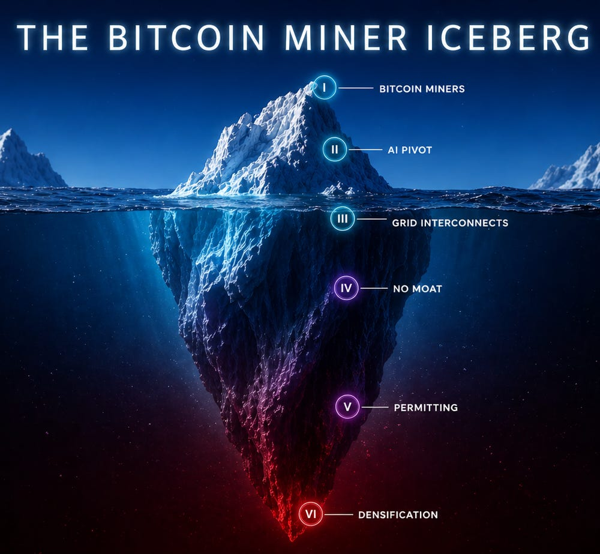
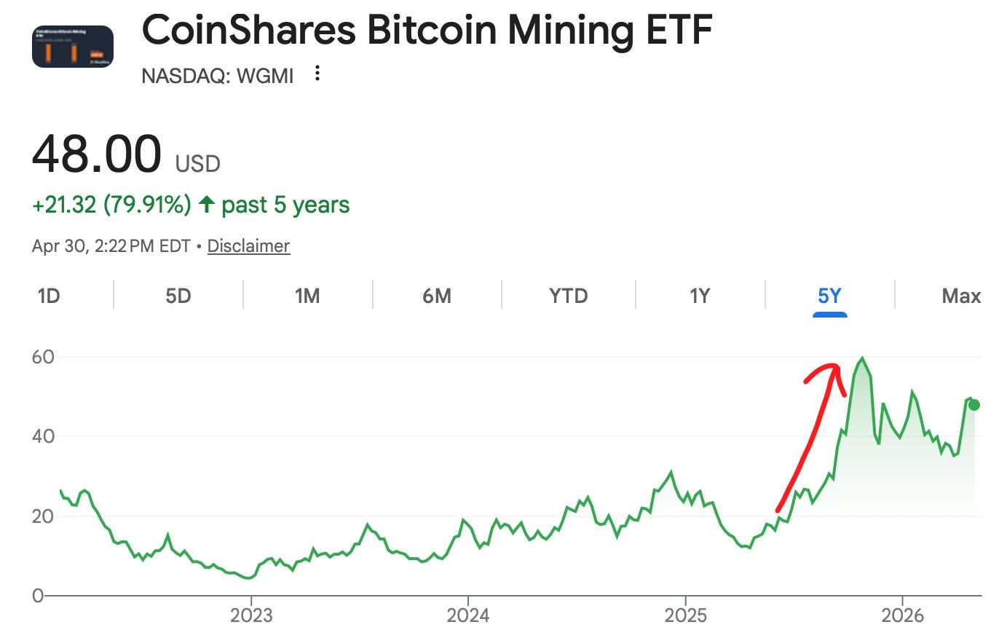
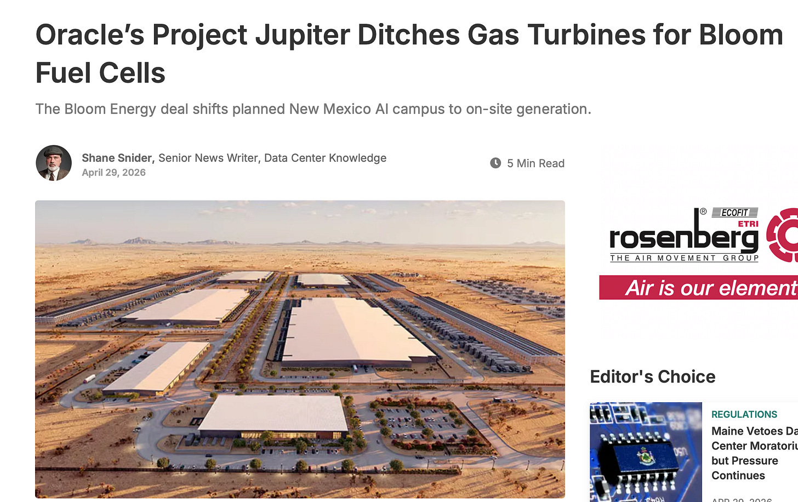
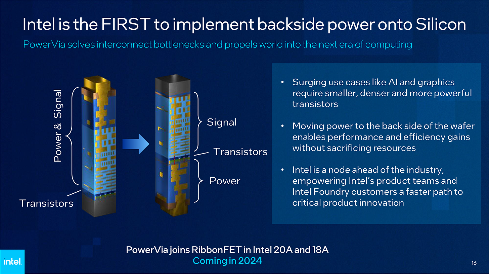
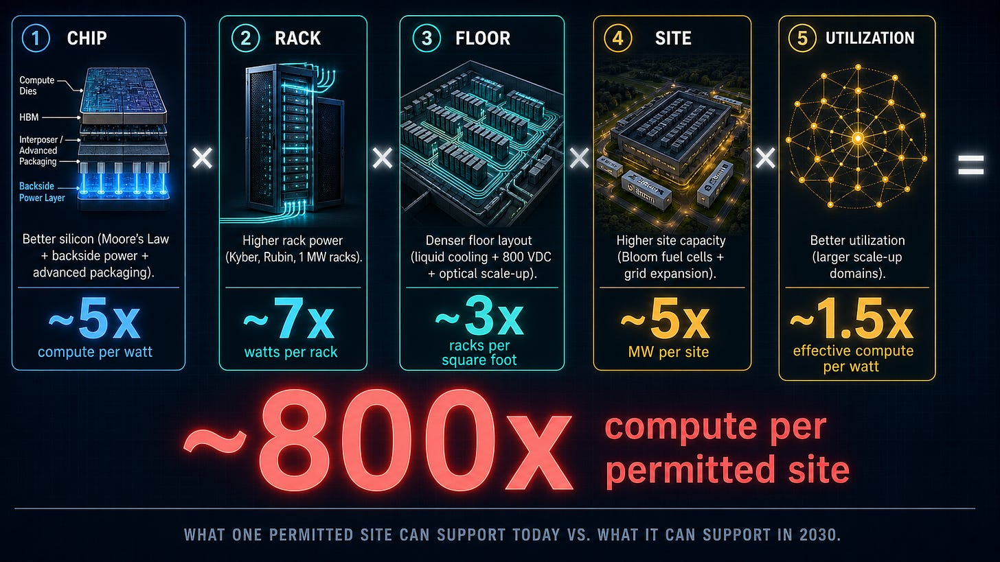
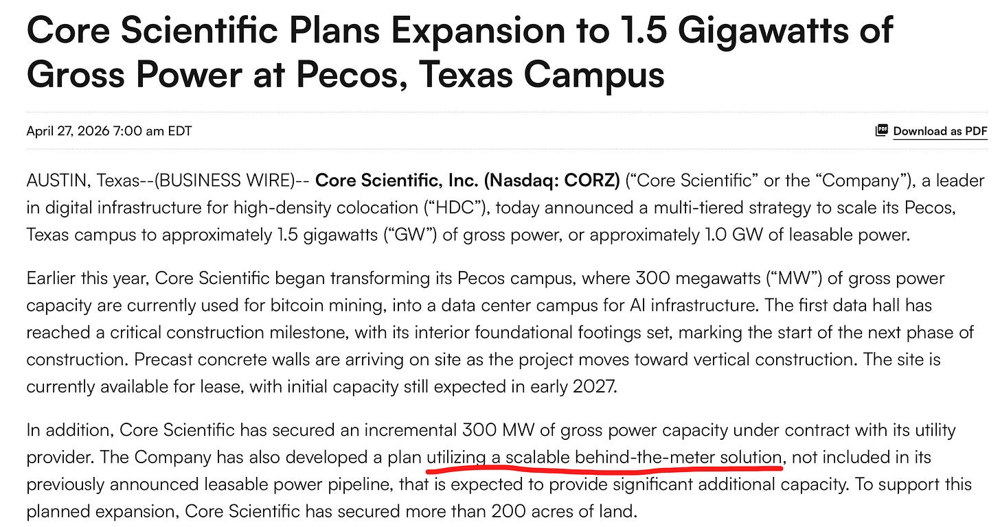

Some of you have wondered why I didn’t cover the Bitcoin miners/co-locators (Core Scientific, Iren, Applied Digital, Cipher, etc.). Well, I just never really found them interesting.

Until now! These companies are in fact one of the most fascinating plays in AI infra.

There are layers to the understanding of the Bitcoin miner thesis. At the surface level, they are Bitcoin miners that have pivoted to AI infrastructure. Each time we go one level deeper, we find out something that changes the entire framing of these businesses. We flip from bull to bear and back to bull. It is truly an iceberg. Most analysis in this space only glances at the surface level, measures them by the wrong yardstick, and misses the moats and the threats that truly matter.

Today, we descend down the iceberg. We take you on a journey through each layer of the thesis, peeling back your understanding until we get to the core of what makes these Bitcoin miners important to AI.

Everyone is obsessed with physical AI bottlenecks. Meanwhile, these bitcoin miners may just hold the final choke point on the AI build out, and **it has nothing to do with the physical world.**

---

subscribe for icebergs

Subscribed

*By accessing this content, you acknowledge and agree to our [terms and conditions.](https://jasonschips.substack.com/p/terms-and-conditions) This research is **not financial advice**.*

---

#### Contents

1. They Mine Bitcoin
2. They Are Pivoting to AI Co-Location
3. Grid Power is a Scarce Asset
4. Bloom Enters the Chat: Power is a Commodity
5. The Scarce Asset is Actually Permitting
6. D E N S I F I C A T I O N

   1. The Chip
   2. The Package
   3. The Rack
   4. The Floor
   5. The Site
   6. The Result
7. My Current Favorite Miner

## They Mine Bitcoin

Bitcoin is the world’s first ~~scam~~ cryptocurrency (jk I am actually a crypto fan). A digital token where ownership is recorded on a decentralized ledger, spread out and validated across millions of different computers called nodes. Essentially, what it produces is a scarce asset that can be transmitted via the internet. Think of it like gold with teleportation abilities.

[ and How Does it Work? - Crypto.com US")](https://substackcdn.com/image/fetch/$s_!n-dj!,f_auto,q_auto:good,fl_progressive:steep/https%3A%2F%2Fsubstack-post-media.s3.amazonaws.com%2Fpublic%2Fimages%2F437395a8-3a08-4d05-965f-3748eef80446_2801x2001.webp)

In order to record these transactions, miners run big datacenters full of ASICs that have literally one job: to take the transaction information in the block and hash it using the SHA-256 algorithm until the hash has a pre-determined number of trailing zeros. It is basically a lottery ticket, and whoever gets that hash first records the block and posts the transactions to earn the Bitcoin block reward.

Every four years, the Bitcoin block reward is cut in half. This is to ensure that the network only ever emits 21 million coins to preserve the scarcity of Bitcoin as an asset.

So from a miner’s perspective, this is a TERRIBLE business. Your service is fully a commodity and your pay gets cut in an exponential decay curve. The miners that survived to the present day have become experts at finding the absolute lowest cost of stranded power anywhere in the US and building data centers as cheaply as possible.

## They Are Pivoting to AI Co-Location

This is the level of understanding held by most retail investors in the general public. The Bitcoin miners pivoting to AI co-location narrative took hold in mid-2025.

The intuition is intuitive. If Bitcoin miners became an expert at securing low-cost grid power and building data centers for cheap, it makes perfect sense that their skills and assets are a fit for AI.

The business model here is co-location. Hyperscalers or neoclouds bring the clusters themselves (GPUs, networking) and miners provide the grid interconnects, permitting, and data center shell. The cloud signs a lease with the miner for these services over the long term. The miner serves as the landlord, and the cloud is the tenant.

This business has a few major characteristics that are worth noting.

First is the high capex relative to revenues. Each megawatt of CITL (Critical IT Load) takes around $8 to $13 million to fully build out. Then they can earn anywhere from $1.5 to $2.5 million a year in high-margin recurring rental revenue. But because the AI co-location business is just getting started, all miners are cash flow negative as sites are all still being built out.

The second is that this business is weirdly safe compared to the other AI plays out there. Again, the intuition is intuitive. The end state of these co-locators is basically a REIT. Recurring high margin rental revenue. Semiconductors are cyclical and can be affected if overall cloud CapEx declines. Neoclouds face a fast depreciation curve and are criticized for their relatively lower margins. But miners hold long-lasting assets and face zero cyclicality.

## Grid Power is a Scarce Asset

Now we have reached the level of understanding of the AI infrastructure investing space broadly.

It is quite well known that grid interconnects are incredibly hard to get these days.

[SemiAnalysis

How AI Labs Are Solving the Power Crisis: The Onsite Gas Deep Dive

The Grid is Old and Tired…

Read more

4 months ago · 233 likes · 31 comments · Ajey Pandey, Jeremie Eliahou Ontiveros, and Dylan Patel](https://newsletter.semianalysis.com/p/how-ai-labs-are-solving-the-power?utm_source=substack&utm_campaign=post_embed&utm_medium=web)

New load approvals can take five years. PJM and ERCOT get tens of gigawatts of new load requests per month and approve nearly none of them. The grid infrastructure simply isn’t built to grow quickly. It was built a century ago.

Miners, on the other hand, secured grid power during the crypto boom in 2021 and 2022, completely front-running this AI power land grab. As a result, they are some of the fastest ways to get grid power if you are a hyperscaler or Neocloud.

At this level, we understand that the grid interconnections and power, more generally, is a critical bottleneck for AI. These miners hold that asset and therefore should get re-rated as they realize that value.

## Bloom Enters the Chat: Power is a Commodity

Bloom Energy is the side character cameo today.

We have previously just established that grid interconnects are scarce and power is a critical bottleneck. Well, it turns out there’s another company solving this exact problem: Bloom Energy.

[

#### The Best AI Energy Solution on the Planet

[Jason's Chips](https://substack.com/profile/112809522-jasons-chips)

·

Apr 28

[Read full story](https://www.jasonschips.ai/p/the-best-ai-energy-solution-on-the)](https://www.jasonschips.ai/p/the-best-ai-energy-solution-on-the)

I have written a very comprehensive long thesis on Bloom that covers all of these points, but here I will summarize the important attributes that make them relevant to our discussion about miners.

Bloom Energy makes fuel cells that can be manufactured in an incredibly scalable way (they have explicitly said they will never be supply-constrained on their earnings calls), can go from purchase to power in under 90 days (unlike turbines which take multiple years or the grid which takes 5+), and are now cost-competitive with the grid in “most areas” and turbines “everywhere.”

They have transition from being an alternative solution to THE solution.

Recently, Oracle replaced over 2 GW of planned turbines in their New Mexico campus for Bloom’s fuel cells.

Their rise in relevance and the resulting share price rally has been stunning. This is great for Bloom, but what does it mean for the miners?

Well, if Bloom provides fast, scalable, clean behind-the-meter power that is cost competitive with the grid, then is power really an asset? One can argue it is not. Holding X gigawatt of grid interconnect does not make a difference anymore if those same gigawatts can be accessed via fuel cell.

Today, we measure Bitcoin miners through the yardstick of megawatts secured. If those megawatts are easily commoditized, they are no longer the source of pricing power, and we have to measure miners on something else. What else? Do they hold land, construction, access to fiber? All these things are not as scarce as grid connections. Hyperscalers can simply do it themselves, right?

That right there is the bear case.

## The Scarce Asset is Actually Permitting

Backlash towards AI is growing. This is a technology that’s going to take your jobs AND destroy your local environment. What’s not to hate?

A growing political consensus against AI is now the base case of most analysts. We understand it well, so let’s play it forward. How does the AI build out become more difficult when backlash becomes more widespread?

It would likely be through permitting.

Permitting is the process of getting regulatory approval to build data centers. To begin a project, a data center developer needs multiple overlapping approvals across multiple jurisdictions. These include (according to Claude):

* **Local land use permits and zoning approvals**, where county commissions decide whether a 500 MW industrial facility belongs on a given parcel
* **Building permits** across structural, electrical, mechanical, and plumbing categories, each independently reviewable, each with its own timeline
* **Stormwater management plans and traffic impact studies** negotiated with local public works departments
* **State-level air quality permits** if the site has any onsite combustion or generation
* **Water use permits**, increasingly contested as data center cooling demands collide with agricultural and residential users
* **Environmental impact assessments** under state law, brutal in California and Virginia, lighter in Texas and Oklahoma
* **Federal NEPA review** where any federal land, funding, or permitting nexus exists
* **Army Corps of Engineers wetlands permits** where applicable
* **FAA review** for structures exceeding certain heights or near airports
* **Endangered species reviews** under federal and state law

Each one of these has its own timeline, own constituency, and own way of being mobilized against a project. There are calls for data center moratoria, but in most places it is likely to simply evolve into these permitting regulations becoming much stricter to serve as an effective moratorium by making it so hard to develop data centers it dissuades construction.

Getting these permits takes serious time. It could take anywhere from 18 to 60 months depending on how friendly your jurisdiction is. And this is PRE-construction. I sincerely believe this is going to become a real, substantial choke point. The funny thing is that no one is talking about it today, but I think people will start caring not too far from now.

Just like with the grid, these miners got permitted during the crypto boom long before it was a major problem. Between 2018 and 2022 was the prime time for this, where crypto mining was important and profitable enough that it made permitting these sites economical, but AI wasn’t a thing yet, so there wasn’t much competing demand nor any political scrutiny on datacenters. In fact, many localities welcomed these loads!

Now, to be clear, a permitted crypto site can’t just be converted into a permitted AI site with the push of a button, but it definitely makes it much easier. The project has gotten to the point where the marginal regulatory cost of changing or expanding the workload is much lower than it would be to build a greenfield AI site.

Miners, therefore, are one of the only available bets on regulatory backlash against AI as the asset they hold is not grid-connected megawatts, but permitted sites. It is precisely these permitted sites that become more scarce and more valuable the worse the regulatory environment gets.

## D E N S I F I C A T I O N

We have arrived at the final stage. Welcome to Densification.

We have established that miners hold a critical choke point asset in permitted sites, but what happens when we play the AI build out forward? Do permitted sites become more or less valuable over time? Do they become more or less scarce compared to the other bottlenecks?

The Densification thesis argues that a permitted site becomes far more valuable over time as the amount of compute and power that can be served with one site exponentially increases through densification. This means that scaling AI won’t require building out new sites (which becomes much harder as regulatory scrutiny grows) and can instead be done through making existing sites denser. We must cram more compute into each square inch at four levels: the chip, the package, the rack, the floor, and the site.

#### The Chip

To cram more compute into each square inch, we first start with the chip. This is pretty easy because it is just the continuation of Moore’s law. Specifically, the most important feature here is backside power.

In the past, all the copper wiring for the chip was on the front side of the chip. This means that both the electrical signal and the power delivery had to go through the same front side. Since the power delivery has to share wiring with the signal delivery whose wiring has to be very thin, the power that reaches the chip is very degraded and the efficiency is low.

Backside power changes that. By routing straight through the backside in a dedicated power network, power delivery to the chip improves drastically and the energy efficiency goes to moon. This means we can get more compute from the same amount of power delivered to the rack.

#### The Package

Advanced Packaging is pretty well known and well covered at this point. If you need a primer on it, here is my short n’ casual intro.

[

#### Short n' Casual Intro to Packaging

[Jason's Chips](https://substack.com/profile/112809522-jasons-chips)

·

Feb 15

[Read full story](https://www.jasonschips.ai/p/short-n-casual-advanced-packaging)](https://www.jasonschips.ai/p/short-n-casual-advanced-packaging)

What’s important to the Densification thesis is the roadmap beyond CoWoS. Intel’s EMIB, TSMC’s CoPoS, and glass substrates all allow the package to be expanded even further and pack more compute together. Furthermore, hybrid bonding and 3D packaging are coming. Hybrid bonding gives you orders of magnitude more connections per square millimeter and therefore massively increases the compute and memory bandwidth per package.

#### The Rack

Two major trends allow the rack to be densified.

The first is the increasing power draw of the rack, exemplified by NVIDIA’s Kyber Rack for Rubin. We were at the low hundreds of megawatts per rack, but now are quickly moving towards one megawatt racks. When you have each rack drawing much more compute than before while occupying the same refrigerator-sized footprint, your flops get much more concentrated.

The second is the scale-up domain. Blackwell Ultra introduced the NVL72, 72 chips NVLinked together to function as essentially one. Rubin moves this to NVL144 and NVL576, and Feynman will increase it even further.

#### The Floor

The floor densification is similar.

First, the Scale-up domain can go beyond one rack by using optical connections. NVL576 is actually eight Oberon racks linked together with optics. And it’s only going to get even crazier from there. As you expand the scale-up domain beyond a rack with optical, your effective compute per square foot increases even further.

Then we have the all-important 800 VDC. The fundamental power equation says that power is equal to voltage times current. To deliver more power, you need to increase 1 of the 2. Instead of increasing the current like we used to, with 800 VDC, we massively increase the voltage instead. This is great because increasing the current (which can be thought of as the total number of electrons flowing) increases the amount of copper needed, so, by going the voltage path instead, we can get more power delivered with less copper. This means we can pack the racks closer together.

#### The Site

Finally, we move up to the site level. How can this be densified?

Remember Bloom, right? One of Bloom’s most attractive attributes is its onsite scalability. You can stack fuel cells like Lego bricks. If you want 100 MW, 200 MW, 500 MW, a GW, simply stack more fuel cells.

While the power delivery on a given site used to be capped by the interconnect agreements, today, with Bloom, you can simply scale up the power on that site. Fuel cells are clean and easy to get permitted. This means that the power budget of a site is essentially uncapped. As the density of the floor and the rack increases and requires more power draw, more fuel cells can be added to match the requirements.

#### The Result

How much can we densify by 2030?

Let’s say advanced packaging and backside power can deliver five times compute per watt, high-density racks can multiply the watts per rack by another three to seven times, the optical scale up and 800 VDC can increase density of the floor by 2 to 3.5 times, and megawatts per site can go up another three to five times through leveraging Bloom Energy.

**Overall compute density can increase by 100-1000x.**

That’s two to three orders of magnitude more economically valuable tokens delivered to the end customer. Think about what that does to the pricing power of the holder of the permitted sites that run this compute.

## My Current Favorite Miner

There is one miner that has recently made an announcement showing they are probably the first to realize this strategy, particularly on scaling up site power with Bloom (literally by 5x!). Multiplying site power capacity directly multiplies revenue for miners because they bill via dollars per megawatt. And somehow the market seems to have missed this completely. They also had a unique history which makes them quite favorable for playing out this thesis.

Core Scientific had a very important announcement regarding their site in Pecos, Texas. Somehow, the market completely ignored it. Let’s analyze this announcement.

Pecos used to be a standard 300 MW Bitcoin mining site. Now they are densifying it to 1.5 GW, five times what the site was initially marketed at. To put this into perspective, this increases their billable megawatts by 800, which is a **nearly 50% increase on their current available capacity for just one site**.

How did they do this? They have secured 300 MW of additional gross power capacity with the utility, bringing the utility power to 600 MW. The other 900 MW they are securing by “utilizing a scalable behind-the-meter solution.”

Let’s use deductive logic here.

1. First, initial capacity is expected in early 2027. Turbines are currently sold out until early 2029. Bloom’s fuel cells have a time to power of 90 days.
2. Second, there is a keyword “scalable” here. Turbines are definitely not scalable. Fuel cells definitely are.

I think Core Scientific is using Bloom to quintuple capacity at their existing sites. Bitcoin miners build the clouds via dollars per megawatt. Increase the number of megawatts by five, and you increase the dollars by five as well.

Core Scientific has also underperformed the other miners in the recent months, simply because they underwent a failed merger with CoreWeave. They signed a deal in July, and the merger didn’t fail until a shareholder vote in November. During those four months, while all other miners were rapidly signing deals, Core Scientific’s sales pipeline completely dried up as they were prevented from talking to any cloud customers. Even after the merger was rejected, it still would have taken them a while to ramp their sales pipeline back up because many clouds were already farther in the process with other miners.

Unintuitively, this is actually a good thing. As more time passes, we’ve seen that deals are getting signed at higher and higher prices purely due to scarcity and market clearing dynamics. So waiting longer is favorable to the miners as you basically have spot exposure for longer.

In addition, waiting longer gives us time for the densification thesis to play out. The longer you wait, the more advanced the NVIDIA hardware that your cloud customers brings gets. This more advanced hardware densifies through all of the methods that we just discussed and provides more end token value per square foot. As a result, the cloud provider is able to charge more to the end model lab per square foot. And upstream, the miner has more negotiating power to charge more rent as well.

like! comment! restack! share!

[Share](https://www.jasonschips.ai/p/the-bitcoin-miner-iceberg-the-owners?utm_source=substack&utm_medium=email&utm_content=share&action=share&token=eyJ1c2VyX2lkIjoxNDAwMjQ1LCJwb3N0X2lkIjoxOTQwMzIwMjcsImlhdCI6MTc3ODU1MTIzNywiZXhwIjoxNzgxMTQzMjM3LCJpc3MiOiJwdWItNjY2NDM1NiIsInN1YiI6InBvc3QtcmVhY3Rpb24ifQ.CyZ2UP-FrkiyuLxhvhkT0M58capc6o-_k23qB6DQ0TE)