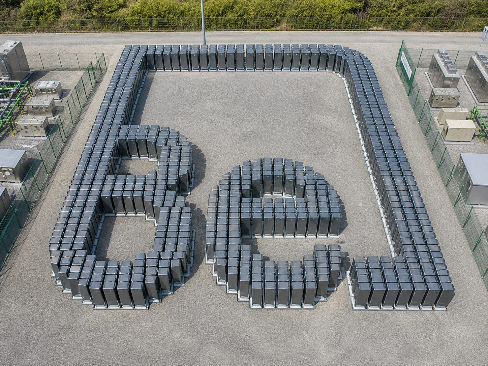
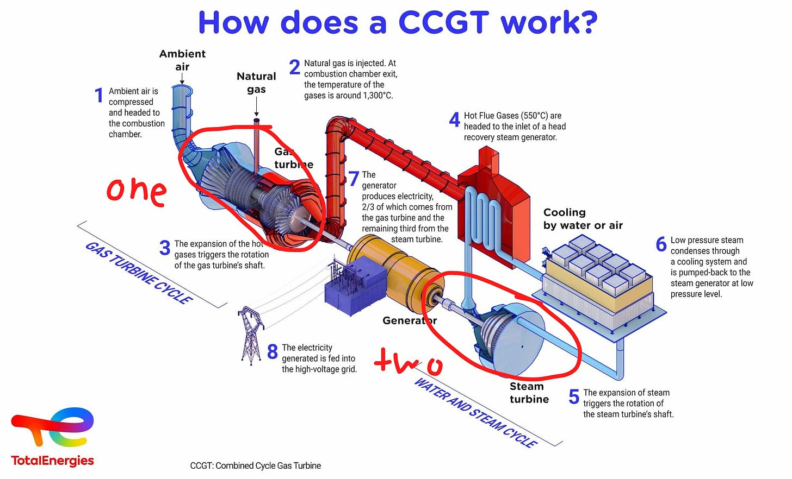
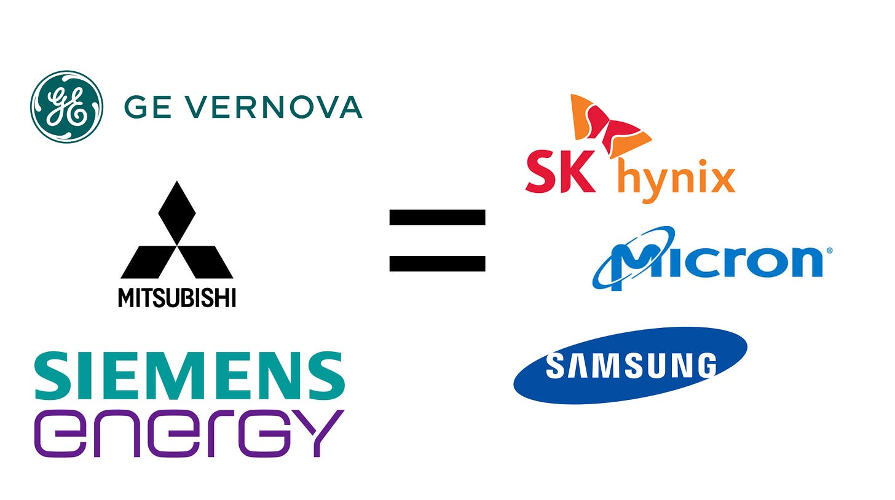
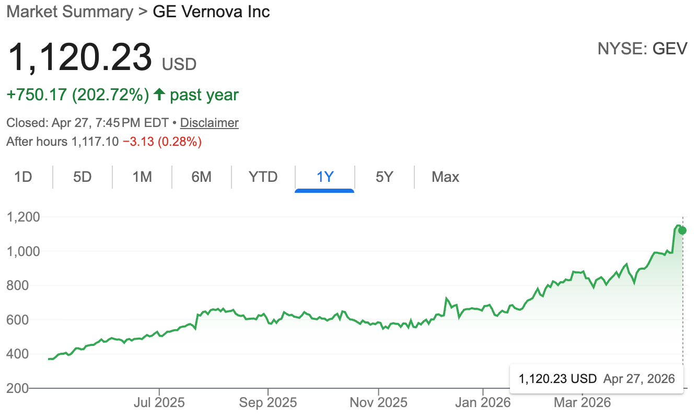
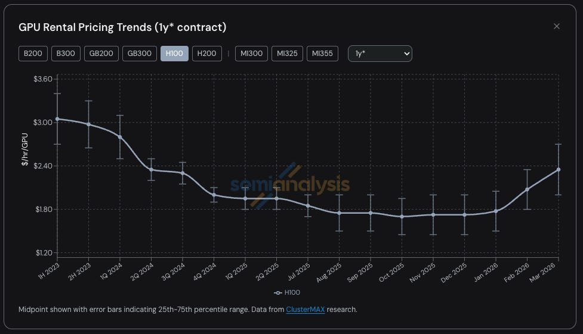
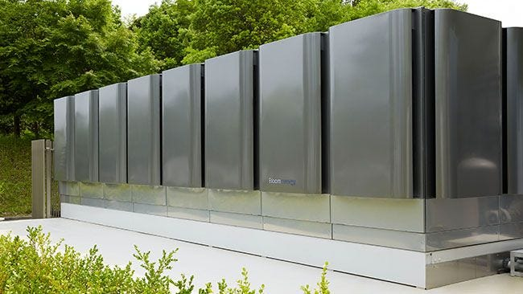
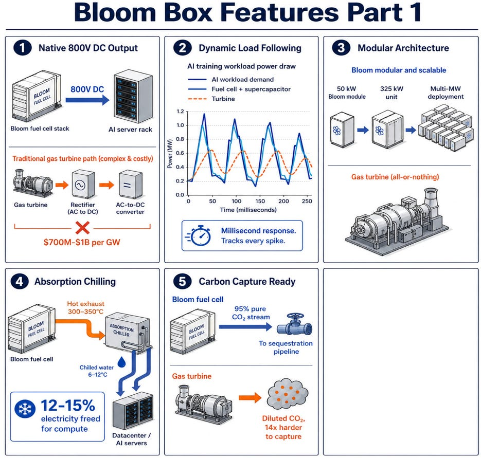
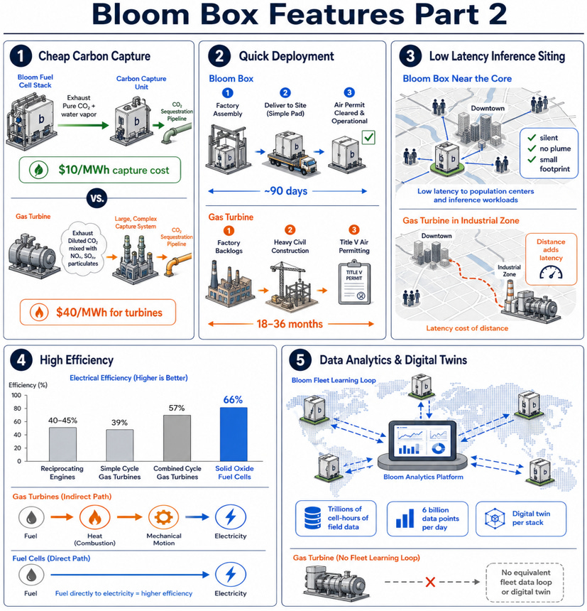

As a Substacker, I am obligated to say that I am releasing this for free to provide an example of what kind of research you would receive with a paid subscription.

However, I also just really really love Bloom Energy as a company and think what they do is super cool, and to think that the world deserves to know why they are so cool. Enjoy!!

#### Contents

1. Why We Need Bloom Energy

   1. The Failure of the Grid
   2. The Failure of the Turbine
   3. The Requirements of the New Solution
2. Ten Features of Bloom Boxes

   1. Native 800V Direct Current
   2. Dynamic Load Following
   3. Modularity
   4. Absorption Chilling
   5. Carbon Capture
   6. Quick Deployment
   7. Low Latency Inference
   8. High Efficiency
   9. Data Analytics
3. The Unconstrained TAM

   1. Infinite Scalability
   2. Fuel Cells are a Technology
   3. Bloom is a Monopoly on Fuel Cells
4. Other Energy Solutions

   1. Solar & Storage
   2. Non-Scalable Renewables
   3. Small Modular Reactors & Datacenters in Space
5. Conclusion

---

Subscribe to **BE** blessed with many semiconductor articles every week

Subscribed

*By accessing this content, you acknowledge and agree to our [terms and conditions.](https://jasonschips.substack.com/p/terms-and-conditions) This research is **not financial advice**.*

---

## Why We Need Bloom Energy

### The Failure of the Grid

I won’t belabor the point here because this is already quite well known. The grid was built a century ago. It expects predictable slow-growing power demand of 1-2% a year. AI wants to double this capacity, and clearly the old infrastructure is not built for it. But the intuition here is important.

Power cannot be stored. This means that at any point in time, the total supply and the total demand of power must be perfectly equivalent. Thus, before a load (demand) is added, the grid operator must figure out how to add the equivalent supply so that the grid doesn’t break. Enter System Studies!

Imagine trying to model voltage stability, frequency response, contingency scenarios, and load flow under fault conditions for each new data center. When you do these models, you’re basically operating under the assumption of a fixed grid. But the grid is constantly changing! When grid topology is changing faster than studies can be completed, studies go stale.

This is why new interconnections take five years. The logistics of adding data centers to the grid is terrible. The system was never built for it. We need a new solution. We must bypass the grid and go behind the meter.

### The Failure of the Turbine

The classical behind-the-meter solution is the gas turbine. It’s the obvious solution because it provides the base load, always on type power which data centers need. There are three main types of turbines.

#### Combined Cycle

Combined cycle is called combined cycle because it combines two cycles.

…

Cycle 1 converts natural gas into energy via normal turbining. Cycle two is converting the heat from cycle one into energy via steam.

The benefits of this are that it extracts the maximum amount of energy from the natural gas by not wasting the heat by-product.

The drawback is that it is very complicated and takes forever to build because you have to route more stuff around.

Therefore, this is usually the preferred gas turbine for supplying energy to the grid, but not for behind the meter. Again, big, complicated, but efficient.

#### Aeroderivative

An aeroderivative turbine is literally a jet engine strapped to the ground. They cost around $2,000 per kW.

This is the majority of the market. The most “normal” kind of behind-the-meter gas turbine. G.E. Vernova, Siemens, and friends make them.

However, there is also a very obvious problem. During the 1990s and early 2000s, the gas turbine oligopoly suffered a massive boom-bust cycle, almost like memory.

Therefore, the aero guys got PTSD (Post Traumatic Supply Disorder), and today, despite overwhelming demand, they refuse to build new factories and expand their capacity. This has been great for GEV stock.

But although investors love supply discipline, customers hate it because it means that they’re paying higher prices for a smaller source of supply.

It’s gotten so bad, in fact, that GEV is fully sold out through 2030. This tweet from SemiAnalysis sums it up well.

[

SemiAnalysis@SemiAnalysis\_

100 gigawatts under contract. 10 gigawatts of capacity left through 2030. Pricing up double digits. Competitor literally stopped taking orders. And they generated more free cash flow in 90 days than the prior 365. This market is the tightest it's been in decades and nobody's

2:00 PM · Apr 22, 2026 · 120K Views

---

25 Replies · 33 Reposts · 689 Likes](https://x.com/SemiAnalysis_/status/2047057897490731386?s=20)

Now, customers are searching elsewhere, desperate to get their hands on anything that spins and produces electrons.

#### Reciprocating Engine

The “searching elsewhere” first lands at reciprocating engines, the cheaper, dirtier, and less technologically marvelous sibling of aeroderivatives.

These are literal car engines.

Although they cost less per kilowatt than aeroderivatives do, you pay for it with the insane amount of maintenance needed. They are smaller and generate less power per unit, so you need a boatload of them to power any reasonably sized data center (a 1 GW deployment requires 100-400). You basically need to set up a massive 24/7 auto repair shop on your data center campus.

#### Pollution

Climate change is bad!!!!

All forms of gas turbines are heavily polluting and terrible for the environment. They release NOx and SOx, which are harmful particulates that cause public health problems in the surrounding living areas. Therefore, every single deployment of gas turbines is subject to stringent permitting regulations that take an excruciatingly long time and potentially expose the developer to environmental lawsuits.

### The Requirements of the New Solution

So, we need a new solution. We know that. But what characteristics should this new solution have?

#### Regulatory Landscape: Capital vs. Permission

Building a data center requires two things: capital and permission.

In 2024 and 2025, when AI was less developed and capable, it was capital that was scarce. Companies did not know if their CapEx would yield sufficient investment returns because all we had were chatbots. At the same time, permission was abundant because chatbots didn’t require that many data centers, and people were not afraid of losing their jobs.

Today, the situation has completely changed. AI agents are extremely capable and able to do most white-collar work. Anthropic hitting 30 billion ARR by the end of Q1 has signaled that the ROI question is effectively answered. AI compute demand is going parabolic, and now data centers are both a political and environmental issue. Today, capital is abundant. Permission is scarce.

What does this mean? **We are transitioning from a regime where solutions required low capital and high permission are attractive to a regime where solutions requiring high capital and low permission are attractive.** This forever changes the class of energy companies that benefit from AI capital expenditures. In order to be successful as a power equipment vendor in the future, you must help your customers get permission (FAST) and avoid regulatory stupidity.

#### Compute Shortage Necessitates Time to Power

Let’s think about the second-order effects of H100 prices (which were expected to decline into oblivion as technology obsoletes) rising 33% in 2026 in an unprecedented massive compute shortage.

Time to power was already important. AI cloud revenue is around $10 to $12 million per megawatt per year, meaning that having a 100MW deployment delayed by a month costs you $100 million.

Now it’s even worse. Failing to consider time to power means your (luckily secured) supply of compute can’t be used to address this shortage and collect the scarcity pricing.

## Ten Features of Bloom Boxes

Bloom Energy makes fuel cells, a.k.a. Magic Energy Boxes. Natural gas goes in, **magic happens**, electricity comes out.

bloom boxes

They are so cool.

Bloom’s Chief Commercial Officer tells us to think of them like a platform, like a phone where you can download many apps. With Bloom, you can utilize one of their many features any time you want, for any use case that suits you.

Yes, they cost $5k per kW in capex, which goes down to $3k after the investment tax credit, which is much more than aero derivatives or reciprocating engines. I will argue that the ten features we will discuss way, way, way more than offset this increased upfront cost.

#### Native 800V Direct Current

Electricity is transported long distances through the grid in AC because it is easy to step AC up or down between higher and lower voltages.

But the chips in the data center only ever use DC. Therefore, when electricity from the grid is used in data centers, it must be converted.

Today, electricity enters the data center as AC and gets converted near the rack to DC. This is usually not a problem because we use medium voltage (480V) AC and low voltage (54V) DC. The conversion process here is easier, requiring less expensive transformers and losing less energy as heat.

However, as the racks become more and more power hungry we must deliver more power to them. The fundamental power equation posits that P = I x V or power equals current times voltage. So we have two choices to increase power: increasing current or increasing voltage. The problem is current is basically the sheer volume of electrons flowing, so, to increase the current, you need to increase the width and mass of the copper cables. Now, as you can imagine, this is not scalable. To increase the power these days, we mostly rely on increasing the voltage, which is why we’ve arrived at 800V DC, the solution for the Rubin Kyber racks and all racks from then onwards.

Now, if you want to go from 480 V AC to 800 V DC, you have a problem. This conversion process is not easy; it is hard. It requires expensive transformers and loses tons of energy as heat. The ideal solution is not to intake AC into the data center; it’s to intake native DC. Well, guess what? Bloom Energy Fuel Cells produce 800 V DC natively. No gas turbine does this. Every gas turbine produces AC due to the loss of physics. Bloom will save you millions of dollars in transformer capex and energy conversion heat loss.

But you don’t need 800V DC today? No problem. Bloom boxes come with an adapter, just like your phone charger. You can take it off and switch to DC whenever you need.

#### Dynamic Load Following

There’s a common misconception with Bloom’s fuel cells, and it goes something like this: Gas turbines can start up in 15 minutes. Bloom’s fuel cells have to heat up for 12 hours to their 850°C internal temperature in order to create energy. Therefore, Bloom is fundamentally inflexible. It produces base-load power, but it cannot be turned off.

This is partially correct. Bloom’s fuel cells take a long time to turn on and off. However, when they are on, they can ramp from 20% to 100% output power, or anywhere in between, in seconds. This gives them a very useful feature known as dynamic load following.

Why is this useful? Training workloads have variable loads. Normally, you’re forced to build massive energy storage systems to smooth out these variable energy loads. With Bloom, all you have to do is ramp up and down.

#### Supercapacitors

AI workloads feature an annoying nuisance known as sub-second transients. Thousands of GPUs can simultaneously finish a compute step and wait for gradient exchange. When that happens, power draw can drop by tens of megawatts in milliseconds, then spike back up just as fast when the next compute step starts.

This causes a major problem. Electrical systems require generation and load to match in real time, or they crash. AI training workloads break this constraint violently: a 1GW cluster can swing 500MW in milliseconds, thousands of times per training run, faster than any combustion-based generator can respond. Without something to absorb these shocks, gas turbines serving AI workloads would trip offline continuously and the datacenter would never run. The standard fix is a $500M battery bank bolted onto every gigawatt of turbine deployment, sized solely to compensate for what the turbines cannot do natively.

Bloom, on the other hand, uses built in supercapacitors.

What are supercapacitors? Lithium ion batteries stores energy chemically. Supercapacitors store energy like static electricity.

This means you erase the entire battery bank. As you might imagine this comes with all sorts of capital efficiency and reliability benefits!

#### Modularity

Bloom boxes are modular. You can stack these things on each other like Lego bricks. Need 100 MW? Need 5 GW? No problem! Just scale up or down as needed.

This is very important because of a concept called over-provisioning. For any data center workload, you need to provide more generation capacity than is needed for reliability. And the goal is what’s known as five nines reliability, meaning the system is up 99.999% of the time.

For traditional gas turbines, because of the lack of modularity, you need to over-provision by 20 to 40% in order to achieve 5 nines reliability. For Bloom, you only need to over-provision from 0 to 8%.

#### Absorption Chilling

Bloom’s Fuel Cells produce a very interesting byproduct: very hot, high-quality steam. Emphasis on high quality. This is something that the management team loves to say.

What can you do with said high-quality steam? Well, data centers require cooling. Cooling actually requires energy. Normally, this comes out of your energy budget, but with said high-quality steam and a little bit of magic from PV=nRT (remember from college chemistry), you can actually use pressure to turn that steam into a liquid, then boil it again with energy and have that become a coolant.

#### Carbon Capture

Climate change is bad!!!

As always, Bloom is here to save the day.

Traditional gas turbines produce very unclean waste: CO2, NOx, SOx, and other shitty particulates. Bloom, on the other hand, produces almost purely CO2 and water vapor, which is crazy pure! What this means is that the economics of carbon capture becomes so much more favorable. In the future, there will most certainly be a climate-focused regulatory regime, and hyperscale data centers will be required to achieve net zero. With cheap carbon capture added on Bloom boxes, Bloom’s fuel cells suddenly become far more economical than any traditional gas turbine solution

In addition, there is something far more underrated here: the clean energy market. Remember, there is a market for purely clean energy: solar, wind, hydro. Data centers aren’t the only things using energy out there. Not everyone needs 5-9’s reliability. If Bloom’s Fuel Cells can become zero-carbon with just a bit more capex, it becomes a direct competitor to all forms of clean energy. As Bloom’s Chief Commercial Officer put it: “You go do your calculations of how big that market is.”

Finally, some people are big hydrogen fans and think hydrogen is the zero carbon future. Well, it turns out that with Bloom, their fuel cells deployed today can literally support hydrogen if you wanted it to; it’s fuel agnostic. The electrochemical reaction works the same for hydrogen as it does for CH4, because essentially it uses the hydrogens in CH4 anyways, so it’s kind of the same thing.

#### Quick Deployment

Getting behind-the-meter power takes a long time for three main reasons:

1. Manufacturing the power-producing widget at the factory. Manufacturing things takes a long time. This is pretty intuitive and simple.
2. Putting the power-producing widget onto the actual site itself. These things can be really heavy, therefore there’s probably a lot of construction required. Also, you probably have to order a bunch of electrical switchgear and transformers and stuff that go alongside it.
3. Permitting and regulatory clearance. If the regulators are up breathing down your neck, you can’t really do stuff. This slows things down.

Bloom solves all three problems:

1. Bloom is relatively capital light, and manufacturing Bloom boxes is more akin to assembly than literally bending metal.
2. Bloom’s fuel box fuel cells are quite a lot lighter than gas turbines, and therefore can just be plopped down on the ground without as much of a solid foundation.
3. As we have discussed, they are very clean; it is easy for them to get permitted.

Normally, stuff takes 18 months to go from being purchased to being deployed. Bloom claims they take 90 days, but in a recent deployment with Oracle, they did it in 55. Hooray!

#### Low Latency Inference

Now I’m not that big of a believer in low latency inference, but I still have to include it here because it’s important. Low latency inference must be placed close to population centers. Population centers generally aren’t a fan of the knocks and socks produced by big polluting gas turbines. In addition, they’re clunky and not modular like Bloom. Bloom is clean and modular; you can stack them on top of each other to save space, and they don’t pollute very well for putting it near people. You won’t get a lot of NIMBYism for this one.

#### High Efficiency

A gas turbine turns natural gas into electricity by first converting the gas into heat, the heat into mechanical energy, which then finally turns into electricity. Fuel cells, on the other hand, don’t really care about going the scenic route. They convert natural gas directly to electricity via chemical magic.

Therefore, Bloom boxes have an efficiency of around 60 to 66%, which is as good as the combined cycle gas turbines we talked about earlier that are big and complex. They are way better than reciprocating or aero derivatives, which are stuck between 35 and 45%.

#### Data Analytics

K.R., the CEO, says:

> “We have a few trillion cell hours of field operation. Is what Bloom has. Few trillion cell hours. More than 6 billion data points come from our field. To us every single day. We are using AI. We are not only benefiting from AI on our revenue side. We are using AI to our benefit. For all this. To improve our performance every single day. Because we have a digital twin associated to every single fuel cell stack and data from the real field is coming and feeding the digital twin and making our models better and better.”

A professor once told me a story about Tesla. They were trading in the teens. This was in 2019 or 2018, before the huge run-up. He never invested in Tesla because he thought they were speculative, but his son told him that Tesla wasn’t really a car company. They were a data company, and that’s when he realized and invested. Turns out his son was right. Every single hour an electric vehicle was driving in the streets, Tesla was building the world’s most powerful and hidden data moat.

This is not different. Bloom Energy is the only player that has a fuel cell installed base. A digital twin means that there is a computer simulation of every single fuel cell that Bloom has deployed. They are able to track when any fuel cell fails in any customer deployment and fix it before it causes problems, drastically reducing the expense associated with service and increasing the revenue from that service. With operational optimization of fuel cells, based on simulations run on data collected, they can improve the stack life of their current generation. Through fleet learning and manufacturing feedback from their field telemetry, they are able to speed up manufacturing process optimization and make future fuel cell generations even better.

## The Unconstrained TAM

Ok, ok, Bloom boxes are better. We get that, but how does that translate into revenues? Well, here I want to argue that Bloom’s TAM is essentially unconstrained.

The most basic premise goes like this: most high-growth AI infrastructure companies are high growth because their market is growing fast.

…

But for Bloom, it’s different. Bloom is growing fast because their technology is actively displacing an already massive market: the energy generation market. Each time the capabilities of the technology improve, new use cases are unlocked, new marginal customers switch over, and shipments grow.

Therefore, the growth is irrelevant. It doesn’t need to grow to be big. It’s already massive. This means that, theoretically, the TAM is nearly unconstrained. The stock price doesn’t really have a ceiling!

Now, on to the actual ability to capture this TAM. This requires high scalability, constantly improving technology, and dominant market share, all of which Bloom has.

#### Infinite Scalability

The most unintuitive thing about Bloom is just how gosh darn scalable these darn boxes are.

It really isn’t a manufacturing business. It’s an assembly business. Think of it like semi-caps. Semi-caps have fabs, yes, but those fabs don’t work with raw materials like semiconductor fabs do. They have a chain of suppliers that they get parts from, and then they just put it together. They’re an assembly house. Their moat is their IP, which means that they are just as scalable as fabless companies with capex in the range of 3% of revenue. Bloom is the exact same, building out gigawatts upon gigawatts of capacity, measured in the tens to hundreds of millions, and generating billions of revenue

#### Fuel Cells are a Technology

Gas turbines are an industrial product. Centuries old, already lived out the S-Curve, and very slow to change. Fuel cells are a technology. Their costs are reduced by roughly 10% to 20% each year. They literally have their own Moore’s Law-like chips, and it isn’t ending anytime soon. They’re at the bottom of their S-Curve and have yet to be adopted. When you think of fuel cells as a technology, you stop framing it as a static thing and start seeing it as a constantly improving one. You realize that for adoption it’s not a matter of if, it’s a matter of when.

If this continues, you’ll have to ask: why is Bloom limited to data centers? If they become cheaper and more elegant of a solution for producing power than even combined cycle power plants, which are used by utilities, why won’t they be used for powering the world? Why won’t utilities buy from them?

#### Bloom is a Monopoly on Fuel Cells

Nobody calls Bloom a monopoly today, but one day they will. Today, Bloom is seen as one entrant offering a niche solution in a crowded market. If that niche solution becomes the most popular one, fuel cells themselves become a market. When fuel cells become a market, people will ask what the market share is. Surprise, surprise, Bloom Energy has 100% market share in fuel cells, 100%! Not a single other vendor is deployed at volume.

Bloom has been making fuel cells since 2008. They have a 20-year technology head start on everyone else. 20 years of accumulated IP and manufacturing know-how. Legacy turbine manufacturers may try to pivot, but Bloom themselves aren’t scared. Here is a quote from management telling you exactly how they feel about competition. From Aman Joshi, Bloom’s Chief Commercial Officer, on the EnergySense podcast in February 2026:

> “I think it’s natural as Bloom succeeds that there will be other companies who’ll try to get into the fuel cell business. Both myself and our chairman love competition because it only inspires us to become even better is how I would characterize it. Now, fuel cells have been around. The technology has been around for fifty years, but a lot of companies, you mentioned General Electric, in early two thousands had a fuel cell division. Siemens had a similar division, and so did other OEMs. They’ve all tried, invested hundreds of millions of dollars, but weren’t able to make it work and go beyond lab scale experiments to commercial grade. And that’s where Bloom’s got roughly a twenty year technology lead. So we wish everyone all the best.”

## Other Energy Solutions

Let’s address some other non-gas energy solutions. The way I will frame this section is that there is a reason these aren’t discussed very often. There is a reason hyperscalers default to natural gas when going behind the meter, but we must still address the hype.

#### Solar & Storage

Solar and storage seems like a pretty solid alternative. The reason it feels very realistic is because it’s very scalable. Unlike wind or hydro, the amount of power generated isn’t constrained by the earth’s resources. The more solar panels you build, the more power you generate.

The main problem we run into is probably something you already know: data centers need power 24 hours a day, but storage solves the issue, right? Well, only partially. Utility-scale solar runs at 20-25% capacity factor, so 1GW of continuous baseload requires 4-5GW of nameplate capacity plus 12-16 hours of storage to bridge nighttime and 24-48 hours to bridge weather events. Remember, gas only needed around 25% overprovisioning, and Bloom’s fuel cells barely needed any?

The biggest problem actually is that solar still needs the grid for backup. We already addressed the whole reason we’re going to behind-the-meter gas in the first place is to get rid of the grid. Solar forces us to go backwards. This is why it is rarely discussed.

#### Non-Scalable Renewables

This part is simple. Hydro and geothermal are limited by the Earth’s resources. There’s only so much hydro in the world because there are only so many waterways in the world, and a lot of it is already being used up because hydro is a huge portion of energy generation already. Geothermal only exists in certain narrow bands of the Earth’s crust, so unless you’re going to limit your data center build out to Northern California, you’ll need to look for something else.

Wind is almost funny in how unviable it is. You have the same intermittency problem that you have for solar, except for wind it’s even worse because you need more land. Plus, wind’s intermittency is unpredictable, unlike the sun, which rises and sets at the same time every day.

#### SMRs & Datacenters in Space

Maybe one day we’ll get a breakthrough on these technologies that make them viable at mass scale. Today, the timelines, especially for SMRs, are completely misaligned with the window in which AI needs to be built out. 2026 to 2035 is the most key period for AI, not 2035 and beyond.

## Conclusion

Despite a slightly higher upfront capex cost, Bloom’s Fuel Cells have ten advantages that make their net cost much, much lower than turbines. Bloom is set to take share in a massive, already established market by displacing legacy generation solutions, making its TAM effectively unconstrained. Bloom has an incredible ability to capture this TAM via high scalability, consistently improving technology, and a monopoly on fuel cells themselves. With no other viable alternatives appearing until the mid-2030s, I conclude that Bloom Energy is the best AI energy solution on the planet, and our transition to it will be a good one for the world at large.

like, comment, restack, share

[Share](https://www.jasonschips.ai/p/bloom-energy-thesis-free?utm_source=substack&utm_medium=email&utm_content=share&action=share&token=eyJ1c2VyX2lkIjoxNDAwMjQ1LCJwb3N0X2lkIjoxOTYzNDIwNTksImlhdCI6MTc3ODU1MTIyNSwiZXhwIjoxNzgxMTQzMjI1LCJpc3MiOiJwdWItNjY2NDM1NiIsInN1YiI6InBvc3QtcmVhY3Rpb24ifQ.EPMAi_WxKEmm6lPW5ABiWzZl_MGnT-cyRG3oFoAoGO4)

Subscribe for articles like this one!

Subscribed