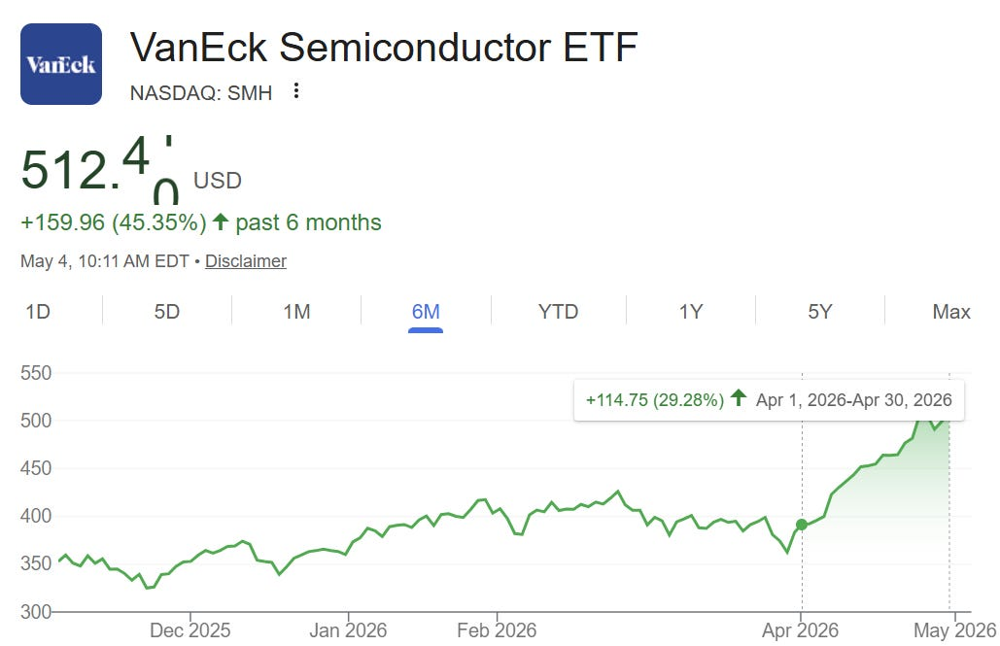
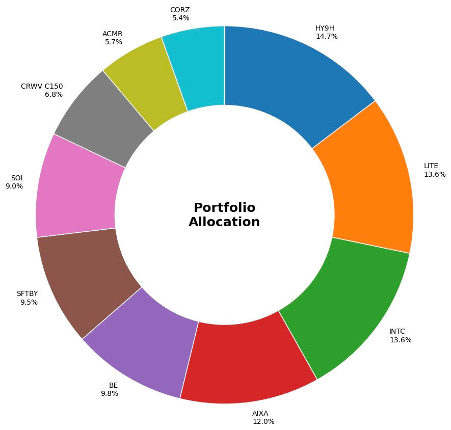
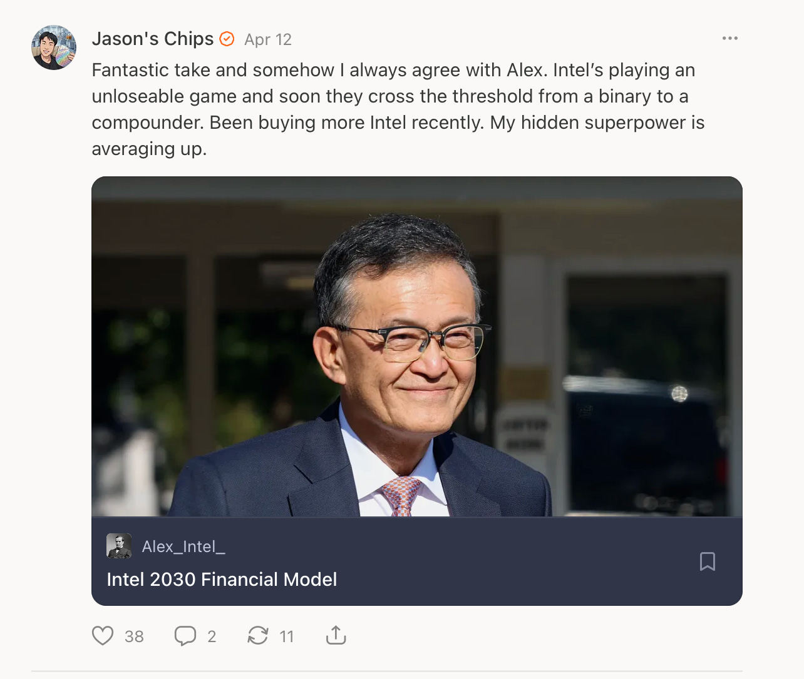
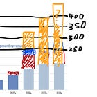
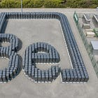

Part of this performance was absolutely due to the fact that I was degen all-in semis during the greatest semis bull run in history.

Still, I outperformed the index by over 2x this month with no(ish) leverage and over 3x YTD. A whole bunch of theses that I’ve heavily written about all started playing out at once. I am on massive hot streak of being right. Though I am bound to be disastrously wrong at some point due to probability.

My portfolio is going to get more and more unhinged as time passes, as I’m willing to risk losing a shit ton of money in exchange for an asymmetric pay-off in the event of the singularity.

[ | BlackRain79 - Elite  Poker Strategy")](https://substackcdn.com/image/fetch/$s_!3AbW!,f_auto,q_auto:good,fl_progressive:steep/https%3A%2F%2Fsubstack-post-media.s3.amazonaws.com%2Fpublic%2Fimages%2F397be773-6b85-4066-aa12-cc1a47e89efb_650x400.jpeg)

Today we go into:

* The ten positions remaining in my portfolio and updates to my theses for them
* Which ones have gotten stronger and weaker?
* Which ones I’ve added to or reduced
* The two that I’m pondering an exit on and the one whose thesis died
* The four that I’ve exited since March
* Some hidden alpha on my positions not discussed in my other write-ups

---

SemiAnalysis Giveaway: The first person to subscribe using the paywall on this post will be selected to receive one free month of SemiAnalysis (sent to your email) (last one for a while so get it while its hot).

Subscribed

*By accessing this content, you acknowledge and agree to our [terms and conditions.](https://jasonschips.substack.com/p/terms-and-conditions) This publication, ESPECIALLY my portfolio, is **not financial advice**.*

---

#### SK hynix (HY9H.F)

Portfolio Allocation: 14.7%

April Performance: +49.02%

Change: Massively added

Thesis:

What I said from March still applies. Memory is trading at an absurdly low P/E, and the E we are pretty certain of because of how tight supply is. SK hynix can earn back its market cap in a couple of years.

Beyond that, we’ve seen stellar performance from NAND this quarter. And here I want to highlight that SK hynix is the number two NAND player globally.

With its own storage division and its stake in Solidigm, SK hynix controls 20% of the NAND market. This is compared to SanDisk and Kioxia at around 12-15% each. If you use Sandisk as the comp and do the math, valuing each percentage of market share, SK hynix has over 250 billion equivalent of NAND valuation, meaning 40-45% of its valuation comes from NAND.

Normally, I would advocate for pure plays because of capital efficiency, but this is simply too good to pass up. We can play NAND with the safety of the supply constraints and discipline of HBM/DRAM.

SK hynix is my largest position because there is no world where agents take over the world and bit demand doesn’t explode. Unlike other analysts with a more traditional lens, I see safety in memory.

DRAM vs NAND part 2 on the demand side (which will spotlight NAND) is coming soon.

#### Lumentum (LITE)

Portfolio Allocation: 13.6%

April Performance: +28.40%

Change: Added

Thesis:

Zero change to the thesis here. Sell-side coverage is getting scarily accurate on CPO and OCS, which might be problematic, but I think we still have much more room to run with the absolute scale of the CPO and OCS penetration via scale up optical networking.

This is a no-touch for me. Lumentum is THE optical play.

#### Intel (INTC)

Portfolio Allocation: 13.6%

April Performance: +114.09%

Change: Added

Thesis:

I told you my super power was averaging up.

Nothing changed here in terms of thesis and everything got better in terms of evidence. CPU is going to the moon. Foundry will work. On top of that, I will never sell a single share of Intel no matter what the valuation is because it is unpatriotic to do so (half joking). I am proud to be invested in American semiconductor manufacturing.

A bit sad, though, that I have never written a proper long thesis for Intel yet. This is the oldest semiconductor position in my portfolio and one of the first companies I found when I entered this space. I will give them the proper coverage soon because there is so much to talk about with Intel: CPUs, foundry, packaging, and ASICs.

#### Aixtron (AIXA.DE)

Portfolio Allocation: 12.0%

April Performance: +43.67%

Change: None

Thesis:

I low key want to add to this one. If I had the cash. My opto tool forecasts just got bumped nearly 50% in the most recent earnings call.

[

#### Aixtron Q1 2026 Earnings Review | Opto Revised Up Yet Again

[Jason's Chips](https://substack.com/profile/112809522-jasons-chips)

·

Apr 30

[Read full story](https://www.jasonschips.ai/p/aixtron-q1-2026-earnings-review-opto)](https://www.jasonschips.ai/p/aixtron-q1-2026-earnings-review-opto)

These conservative Germans, man. They just keep being conservative and revising things higher. It’s very funny, and I love it.

And now everyone is feining over power semi and guess who supplies the MOCVD and is a monopoly? No one is talking about power for Aixtron yet, but very soon that’s all they will be talking about.

Also, we are nearly at a four bagger here. LFG.

#### Bloom Energy (BE)

Portfolio Allocation: 9.8%

April Performance: +109.14%

Change: Added

Thesis:

I have squeezed all of the juice out of the lemon with my thesis and earnings review. There is truly not a single extra point that I can make which is not already covered.

[

#### Bloom Energy Thesis (Free)

[Jason's Chips](https://substack.com/profile/112809522-jasons-chips)

·

May 3

[Read full story](https://www.jasonschips.ai/p/bloom-energy-thesis-free)](https://www.jasonschips.ai/p/bloom-energy-thesis-free)

Please Bloom dip please I need to buy more this position is not nearly big enough.

#### SoftBank Group (SFTBY)

Portfolio Allocation: 9.5%

April Performance: +40.61%

Change: New position

Thesis:

Softbank is basically a subway sandwich of ARM and OpenAI as the meat and a grab bag of random VC investments as the bread.

ARM is my way of playing CPU in addition to Intel. Unlike AMD, both of them are CPU pure plays. For AMD, you have to take a view on their warrant-driven GPU business, which I simply don’t have.

[

#### CPUs: A Better Story Than Photonics?

[Jason's Chips](https://substack.com/profile/112809522-jasons-chips)

·

Apr 22

[Read full story](https://www.jasonschips.ai/p/cpus-a-better-story-than-photonics)](https://www.jasonschips.ai/p/cpus-a-better-story-than-photonics)

OpenAI is my model lab exposure. Model labs have been getting more and more love recently, as it seems like their unit economics are far better than what people have thought.

[SemiAnalysis

AI Value Capture - The Shift To Model Labs

A day in AI now feels like a year in any other industry. Model releases, software breakthroughs, and hardware improvements are compressing multi-year cycles for any other industry into weeks. Over just the past few months, agentic AI has crossed a real inflection point, driving a step-change in the value of tokens while software and hardware improvements have sharply reduced the cost of generating them…

Read more

10 days ago · 197 likes · Daniel Nishball, Dylan Patel, Cheang Kang Wen, Crystal Huang, Max Kan, Ray Wang, Myron Xie, Zane Fong, and Clara Ee](https://newsletter.semianalysis.com/p/ai-value-capture-the-shift-to-model?utm_source=substack&utm_campaign=post_embed&utm_medium=web)

Inference margins can go beyond 70%, and honestly, they could probably price even higher just because of how much consumer surplus tokens produce. You can automate $150 worth of human labor for $8 of tokens. They truly have so much leverage.

OpenAI also has a big compute advantage over Anthropic. Anthropic does have Mythos, though. Tbh, I’m not sure which one I’m more bullish on, but for OpenAI, if compute is really king, they will have no problem catching up with their pre-trained models.

#### Soitec (SOI.PA)

Portfolio Allocation: 9.0%

April Performance: +145.84%

Change: Massively reduced

Thesis:

Soitec went CRAZY. This is probably all due to American retail.

Now, unfortunately, the valuation is starting to make a lot less sense. I am exiting. Soitec trades at over 30 times my fiscal year 2029 (ending March) earnings estimates.

I’m happy to get back in if they show me that my unit economic math is wrong during earnings. Given my best estimates on the number of wafers that CPO optical engines could consume and the ASPs that I’ve gotten from talking to some people who have direct access to management, there is a real chance that their ramp doesn’t live up to the hype.

#### CoreWeave (CRWV)

Portfolio Allocation: 6.8% ($150 Call, so actually much higher delta exposure)

April Performance: +44.06%

Change: New position

Thesis:

There are two theses for CoreWeave:

1. The massive GPU shortage, which will drive up the price of existing compute, making CoreWeave’s preferential allocation from NVIDIA even more valuable. This would moon it in a fast AGI scenario. (Yes, I know CoreWeave signs five-year rental agreements, but they are bringing so much compute online per year that they still have substantial spot exposure.)

[

#### The CoreWeave Series | Part 1: The Ultimate Levered AGI Degen Play

[Jason's Chips](https://substack.com/profile/112809522-jasons-chips)

·

Apr 10

[Read full story](https://www.jasonschips.ai/p/the-coreweave-series-part-1-the-ultimate)](https://www.jasonschips.ai/p/the-coreweave-series-part-1-the-ultimate)

2. CoreWeave, being the only Clustermax Platinum provider, has accumulated substantial process knowledge which drive its TCO down and margins up. That compounds with more deployments and makes it the TSMC of the Neocloud space.

[

#### The CoreWeave Series | Part 2: The TSMC of the Cluster

[Jason's Chips](https://substack.com/profile/112809522-jasons-chips)

·

Apr 21

[Read full story](https://www.jasonschips.ai/p/the-coreweave-series-part-2-the-tsmc)](https://www.jasonschips.ai/p/the-coreweave-series-part-2-the-tsmc)

#### ACM Research (ACMR)

Portfolio Allocation: 5.7%

April Performance: +31.36%

Change: Reduced

Thesis:

I am exiting this position as well. This was a name where my initial thesis was actually wrong, and I had to kill it. I had a write-up planned too.

My initial thesis was simple: ACMR makes cleaning equipment for China and benefits from the Chinese WFE localization trend. As AI becomes both more important technology and a strategic national priority for China, the overall AI supply chain there grows. However, because China lacks access to EUV, they must use more non-leading-edge chips with optical networking spam to match the performance of a single NVIDIA chip. This means that each flop demanded creates more downstream WFE demand, and thus China WFE ramps.

However, this excellent and somehow not widely read SemiAnalysis article changed my view.

[SemiAnalysis

Huawei Ascend Production Ramp: Die Banks, TSMC Continued Production, HBM is The Bottleneck

Compute is the lifeblood of AI. He who controls the spice controls the universe the compute will control the production of tokens and reap the benefits of AI. Without compute you do not have a seat at the table. The United States technology community is all in on compute and AI as the next platform and is now adding compute at a staggering pace…

Read more

8 months ago · 12 likes · Dylan Patel, AJ Kourabi, and Myron Xie](https://newsletter.semianalysis.com/p/huawei-ascend-production-ramp?utm_source=substack&utm_campaign=post_embed&utm_medium=web)

CXMT’s HBM yield is the single critical bottleneck for China’s AI accelerator production. SMIC’s capacity is more than enough. Same with YMTC. Even CXMT has enough regular DRAM capacity, the only thing it lacks is the ability to turn them into HBM lines. So this basically means that China WFE demand is held back until CXMT ramps up HBM.

Then the question becomes: Does ACMR have enough HBM exposure, specifically at CXMT? The answer is unfortunately no. CXMT is not a 10% customer at ACMR. Most of its cleaning tools are for logic (52%), and only 27% is for memory. Out of that 27%, part of it is for NAND and part of it is for DRAM. Only a subset of that DRAM is HBM.

To make things worse, CXMT will probably push aside localization in favor of expanding HBM as quickly as possible because of how bad of a bottleneck it is, meaning that they will order from Western suppliers whenever possible, somewhat killing the localization thesis.

**According to my estimations, only a single-digit portion of their revenue is HBM-exposed.**

Unfortunately, I was wrong, and this one was an underperformer YTD, but we need to move on.

#### Core Scientific (CORZ)

Portfolio Allocation: 5.4%

April Performance: +33.69%

Change: New position

Thesis:

D E N S I F I C A T I O N

[

#### The Bitcoin Miner Iceberg | The Owners of the Final Bottleneck

[Jason's Chips](https://substack.com/profile/112809522-jasons-chips)

·

May 1

[Read full story](https://www.jasonschips.ai/p/the-bitcoin-miner-iceberg-the-owners)](https://www.jasonschips.ai/p/the-bitcoin-miner-iceberg-the-owners)

## Exits

#### Applied Optoelectronics (AAOI)

I sold when the valuation started to creep up to 20x 2027E earnings (at ~$135). Perhaps it was a bit too early because now all of the casino gamblers are pouncing on optical stocks, but as risk agnostic as I am, I am still an investor and must consider valuation. AAOI has gone from bad to neutral, not neutral to good. There’s no reason that I should be willing to pay a premium for this name. Booked a pretty good return here and happy with it. I’m fine with missing out on anything after that.

#### Stride (LRN)

I have decided that I no longer want safety and only want semis. Very timely exit too as this thing was basically flat all month.

#### Suss Microtec (SMHN)

This one was unfortunate. I am still bullish, but a sacrifice needed to be made to feed SK Hynix position. I also think it is a bit more of a diversified generic semi-cap. Although the valuation is good, I’m starting to like other semi-cap names a bit more, as they are more pure plays and better positioned. We’ll have a write-up on a semi-cap that I’m wanting to enter soon.

#### Macronix International (2337.tw)

Again, another sacrifice to feed SK hynix. I am limiting myself to only 10 positions at a time to limit my number of positions slowly creeping up over time and not being able to have conviction on everything.

I also don’t like the fact that the thesis ISN’T related to data centers. It’s only a second derivative of the big memory players pivoting to data centers and away from eMMC production for consumer and industrial end markets.