It’s LITE day (again)! Let’s go.

[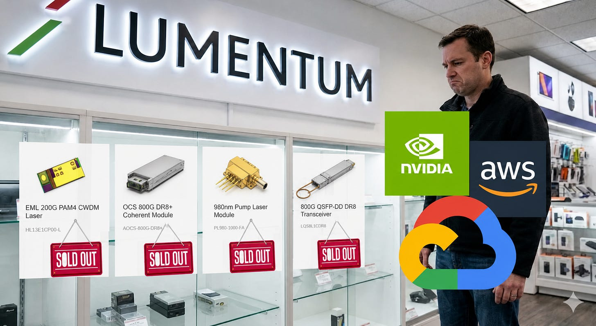](https://substackcdn.com/image/fetch/$s_!kGMO!,f_auto,q_auto:good,fl_progressive:steep/https%3A%2F%2Fsubstack-post-media.s3.amazonaws.com%2Fpublic%2Fimages%2F98d7706c-8e22-4b3a-a6a1-b25cc42a1eda_1694x929.png)

The headline is that AI Bottleneck Co. beats and guides up, but it’s not enough to satisfy the market after their 2,000% run.

## Pre-Call

[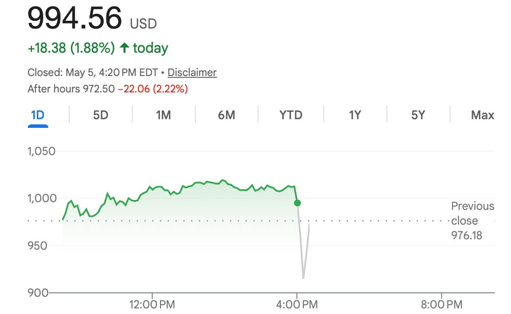](https://substackcdn.com/image/fetch/$s_!sC3l!,f_auto,q_auto:good,fl_progressive:steep/https%3A%2F%2Fsubstack-post-media.s3.amazonaws.com%2Fpublic%2Fimages%2F8c610508-7a94-4189-baa4-86ca2a707a14_1182x727.png)

Let’s look at what the print actually was.

[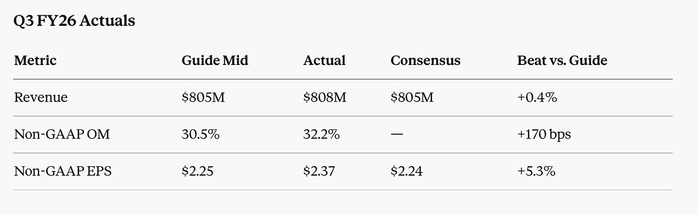](https://substackcdn.com/image/fetch/$s_!FxX1!,f_auto,q_auto:good,fl_progressive:steep/https%3A%2F%2Fsubstack-post-media.s3.amazonaws.com%2Fpublic%2Fimages%2Ffa2dfc7d-ab30-4e67-a44d-f4925e9e0036_1490x458.png)

A little disappointing. Seems like they didn’t beat buyside bogeys. This also means no random hidden pricing power anywhere despite the fact that they’re ultra supply-constrained. Operating margin is quite good.

Comparison is the thief of joy, but Bloom did beat in their actuals by 36%. Lumentum is supply-constrained. Bloom is not. This shows us that supply constraints can be as much of a problem as they are a tailwind for these companies.

[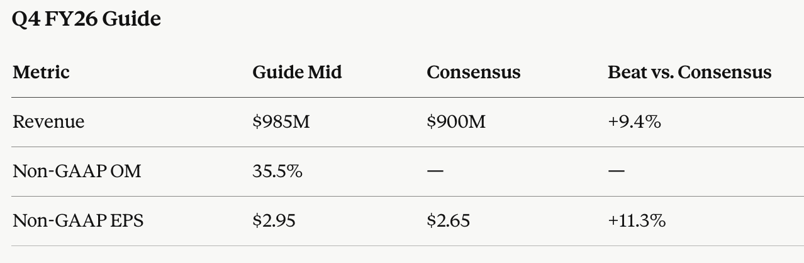](https://substackcdn.com/image/fetch/$s_!Ll8p!,f_auto,q_auto:good,fl_progressive:steep/https%3A%2F%2Fsubstack-post-media.s3.amazonaws.com%2Fpublic%2Fimages%2F4e5687d8-4c21-4734-8f86-ed76dee36064_1278x420.png)

This guide, though, is REALLY GOOD. If you think back to when they gave us longer-term guidance during OFC, they said that they would get to $1.25b of quarterly revenue run rate in 9-12 months (so March 2027 quarter).

[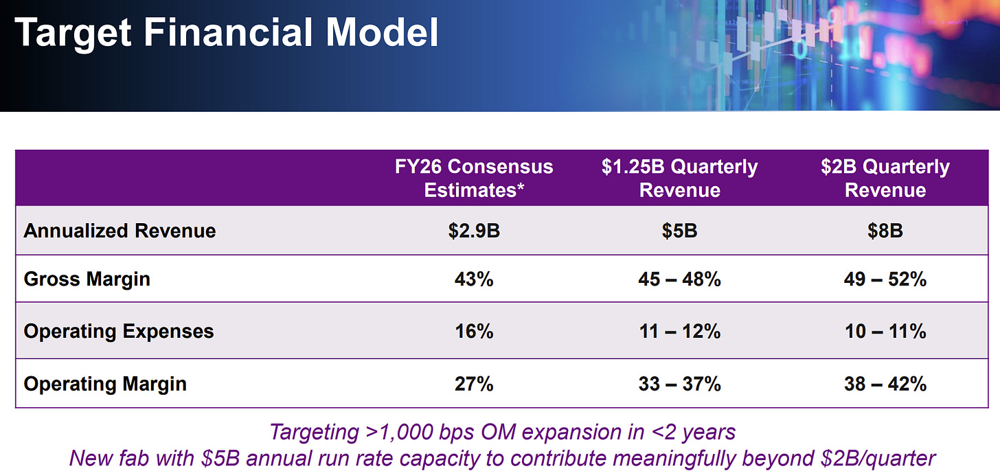](https://substackcdn.com/image/fetch/$s_!kdKq!,f_auto,q_auto:good,fl_progressive:steep/https%3A%2F%2Fsubstack-post-media.s3.amazonaws.com%2Fpublic%2Fimages%2F35de3ea9-b02b-449d-a18f-d1c1963953f3_1822x859.png)

They just guided to nearly a billion in quarterly revenue this quarter.

Let’s do the math. In the March quarter, they added $135m in revenue. This quarter they’re adding $185m in revenue. Their sequential absolute growth is accelerating. Now they’re only around $270m off. This means they might be on track to hit their target up to two quarters early, possibly in the September quarter.

However, for Lumentum, the vast, vast majority of their valuation is based on OCS and CPO, which are heavily concentrated in the out years. Nothing on the near-term financials of the print is actually that material for the valuation. This means that the call is far more important. It is the commentary on the call on OCS and CPO that will actually move CY27 and CY28 EPS estimates, which in turn moves the stock.

Below we talk about each of their business lines:

* EML
* Transceivers
* Scale-Across
* OCS
* Scale-Up CPO

They all oddly seem to be moving quite differently, which was interesting.

And then, of course, I give my take on whether this quarter was bullish or bearish and paste in my 200-line monster of a revenue build and income statement in Excel for people who are new subscribers and show what I updated.

## Call

#### EML

Surprise, surprise, they are still in a massive supply-demand imbalance, and surprise again, it has actually gotten worse. Now it’s above 30%, whereas before it was between 20-30%.

As you can expect, they were asked this question by an analyst. Obviously demand is not a concern, so how will you ramp supply? They say that they are doing everything in their control, literally everything, but supply is still outstripping demand. When asked if it was in their control or not (which is just a corporate way of saying “Are you getting bottlenecked by AXTI?” for indium phosphide substrates), they said that no, it’s largely within their control. Substrate shortages are actually not a problem for them because they have long-term arrangements with suppliers, and presumably this is Sumitomo in Japan.

Their growth is still very good. 200G EMLs more than doubled sequentially, which is expected.

In terms of price increases, they floated this multiple times but never really gave a definitive answer. They said that it’s something we can consider and that we apply in the areas with the most constraints. In turn, when asked about margins, they also said that price dynamics are working in their favor. So I guess that means that they’re hiking prices?

#### Transceivers

Transceivers are up 40% sequentially!

They are ramping these fast. They had fast growth this quarter, and they said it would also be one of the brightest points of growth next quarter as well.

With transceivers, I learned something new: that they are actually behind competitors on their margins, even though their design is better. This is likely why late last year Lumentum wanted to actually cap their transceiver revenue. It was both because of this and because Michael Hurlston’s generally very margin-focused (which we’ve already seen in the results).

Currently, they have around 20% of their CW lasers fabricated in-house. One way they are trying to improve margins is to in-source more of these.

They buy lasers from other vendors for the rest of their transceivers, which seems really weird because they make their own lasers. But this is different from Coherent buying EMLs from Lumentum. With EMLs, they are a premium, hard-to-make product, and an inability to make them in-house is a sign of poor yields. With CW lasers for transceivers, they are a commodity, low-ASP product. Lumentum doesn’t want to waste their pristine fab space on these widgets.

#### Surprise Scale-Across Demand

I never really cared that much about scale across. I only knew that they had very high market share in this area (due to laser linewidth needs) and didn’t really think it would become a big market. But apparently now it is very important, as they said that they got very surprised by the “unanticipated demand.”

Their margins here are apparently very, very high and pull up the corporate average.

There are two main products for scale-across:

1. Pump lasers. These are used in optical amplifiers that amplify an optical signal as it is traveling down a very long distance.
2. Narrow line width laser assemblies. While traditional intra data center communication uses a simple modulation scheme called IMDD, which basically turns the light on and off like a flashlight, to communicate longer distances you will need a more complex language called coherent (no, has nothing to do with the company). Coherent transceivers need a narrow line width laser source, which is what Lumentum provides.

Turns out that pump lasers grew 80% YoY and narrow line width assemblies grew 120% and the supply-demand imbalance is significantly higher than that of EMLs, so much greater than 30%. Their overall scale across revenue is quite low compared to transceivers and regular EMLs (I projected only $400m for CY26) but is now probably gonna inflect up a lot. This is also a great read-through for Ciena and Nokia and the other scale across players.

I will be increasing my estimates for this, probably by around 20 to 50% for all years.

#### OCS Tightness

I did not like management’s tone around OCS.

Competition is not the problem. When one analyst asked about some Chinese competitors’ OCS solutions presented at OFC, Michael Hurlston gave the correct answer of something like “we feel very good about our position, and it is really, really strong.” Michael specifically noted that he didn’t think there was any threat across the next year for a competitor to ship a product that is of Lumentum’s quality in MEMS.

But they continuously flagged that there were supply chain tightness issues in OCS. They said that they “had to make choices” to service all of the plethora of use cases and port counts and architectures and stuff that their customers demanded — which is good — I like that OCS use cases are broadening, but we kind of already knew that from their past earnings calls. This kind of showed that they couldn’t really service everything.

On OCS customers, they still have the three (but are making progress with multiple others). Two of them make up the majority of the volume. The biggest one is still Google. When asked specifically about TPU v8 and how that supposedly had a much higher port count to XPU ratio, Michael dismissed it a bit, saying that it was only an incremental step up from v7.

#### Scale-Up CPO and Other Long-Term Stuff

It is not a Lumentum earnings call Q&A response if it does not include mention of supply constraints. Therefore, when asked about scale-up CPO over the long term, the first thing they said is that they will have a massive supply/demand imbalance on CPO.

The Greensborough fab will contribute greater than $5 billion of revenue starting in 2028, and they framed this as their largest opportunity. Nothing new, since they said the same thing during OFC.

An analyst asked a very astute question about ELS (modules that contain CPO lasers), which is an important topic, especially if you understand how there are CPO revenue scales. Selling the entire module gets you 2 to 2.5 times as much total revenue as selling the CPO lasers themselves, with much margin degradation.

The color they gave was pretty nice. Their sales engagements are usually led with ELS in cases where the engineering team is not too familiar with optics. So, more often than not, these are the non-hyperscaler customers (and will probably be only a minority of their CPO laser sales). They are progressing towards but have not been ready to announce any significant wins in this area.

#### Conclusion

Sadly, this quarter was a bit of a nothing burger. I think we’ll have to wait for quite a long time before more upside catalysts come in. Much of the upside has to do with the longer run compounding of OCS and CPO, so this is no longer a surprise beat on the quarter kind of story. Lumentum is a very long-term investment for me.

[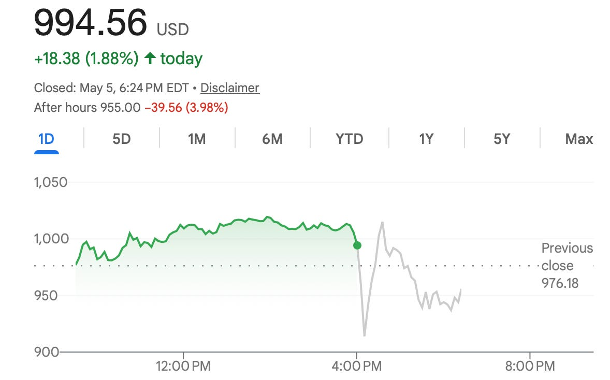](https://substackcdn.com/image/fetch/$s_!Qxh1!,f_auto,q_auto:good,fl_progressive:steep/https%3A%2F%2Fsubstack-post-media.s3.amazonaws.com%2Fpublic%2Fimages%2F0a2c5403-1c60-4e1a-80a5-eb49aceb0bd8_1178x734.png)

Price Action is kind of a nothing burger too. See you next quarter!

## Model

[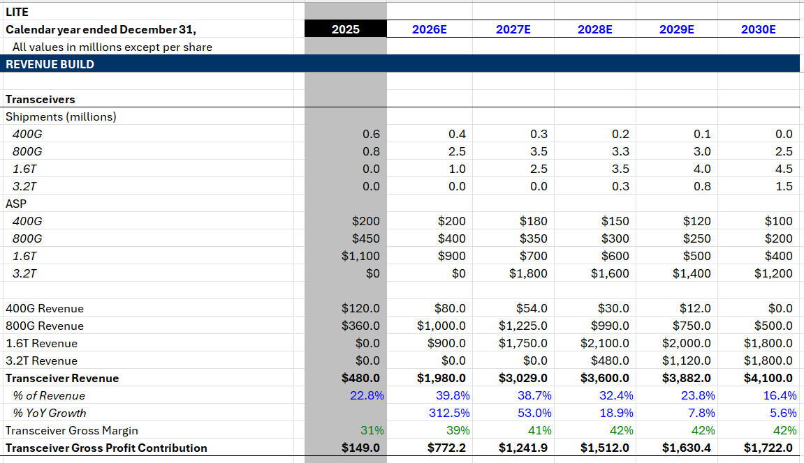](https://substackcdn.com/image/fetch/$s_!7Hod!,f_auto,q_auto:good,fl_progressive:steep/https%3A%2F%2Fsubstack-post-media.s3.amazonaws.com%2Fpublic%2Fimages%2F4f0ba8cd-350c-440a-97ed-cf103916156d_1151x664.png)

[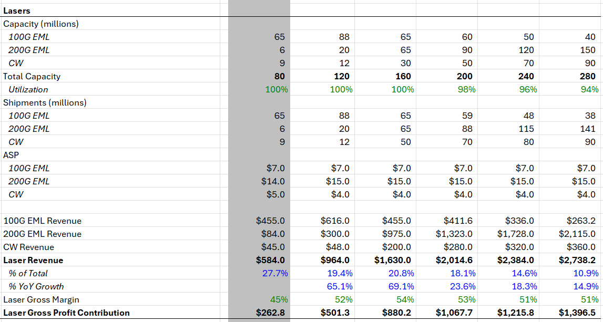](https://substackcdn.com/image/fetch/$s_!JTMB!,f_auto,q_auto:good,fl_progressive:steep/https%3A%2F%2Fsubstack-post-media.s3.amazonaws.com%2Fpublic%2Fimages%2F033f7b10-9590-4161-b47d-5ab6ebb6d864_1147x613.png)

[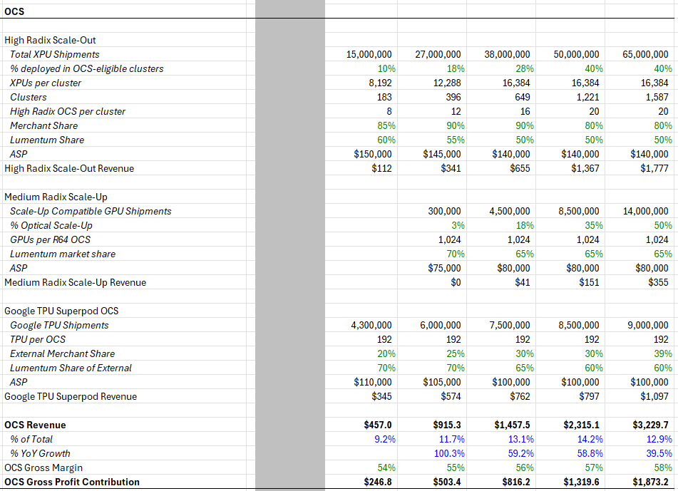](https://substackcdn.com/image/fetch/$s_!jKrI!,f_auto,q_auto:good,fl_progressive:steep/https%3A%2F%2Fsubstack-post-media.s3.amazonaws.com%2Fpublic%2Fimages%2Fd8ae365e-914d-41bb-804a-a234848190b4_951x689.png)

[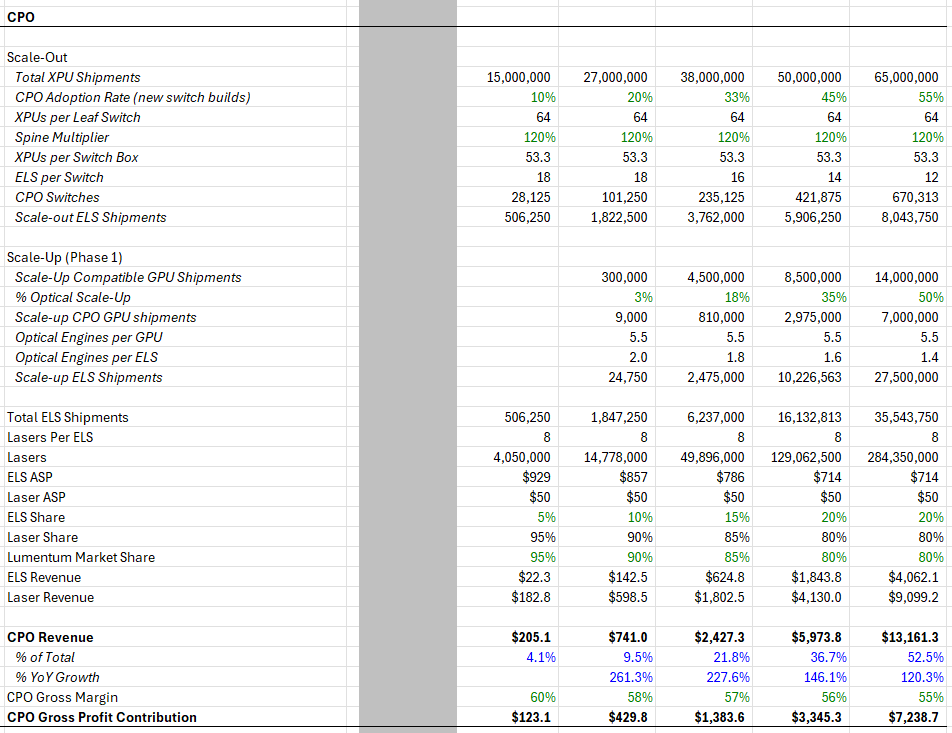](https://substackcdn.com/image/fetch/$s_!lHBX!,f_auto,q_auto:good,fl_progressive:steep/https%3A%2F%2Fsubstack-post-media.s3.amazonaws.com%2Fpublic%2Fimages%2F9f1746f6-9743-47c3-aa00-786fc8fc3770_952x733.png)

[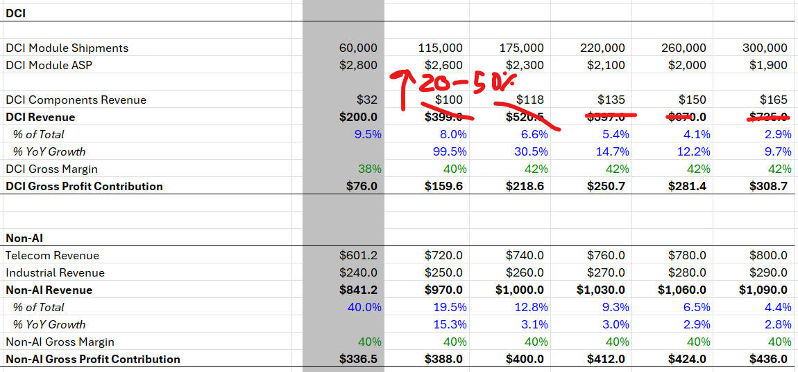](https://substackcdn.com/image/fetch/$s_!aY6b!,f_auto,q_auto:good,fl_progressive:steep/https%3A%2F%2Fsubstack-post-media.s3.amazonaws.com%2Fpublic%2Fimages%2Faf2e8174-7288-460c-8f90-34e18d9892ef_1150x538.png)

[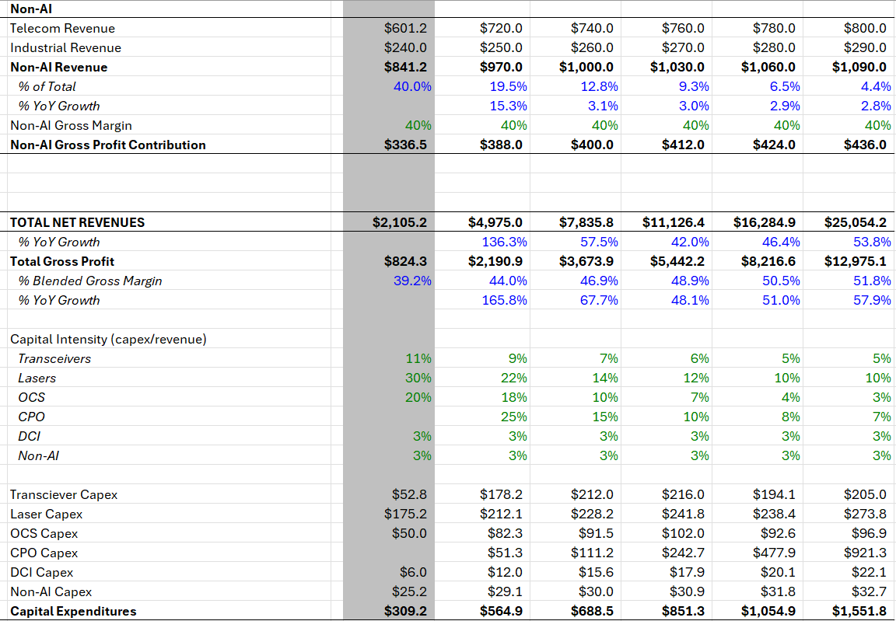](https://substackcdn.com/image/fetch/$s_!zzPQ!,f_auto,q_auto:good,fl_progressive:steep/https%3A%2F%2Fsubstack-post-media.s3.amazonaws.com%2Fpublic%2Fimages%2F4ce06f88-191f-40d9-8ef1-7abe32d99427_1152x799.png)

[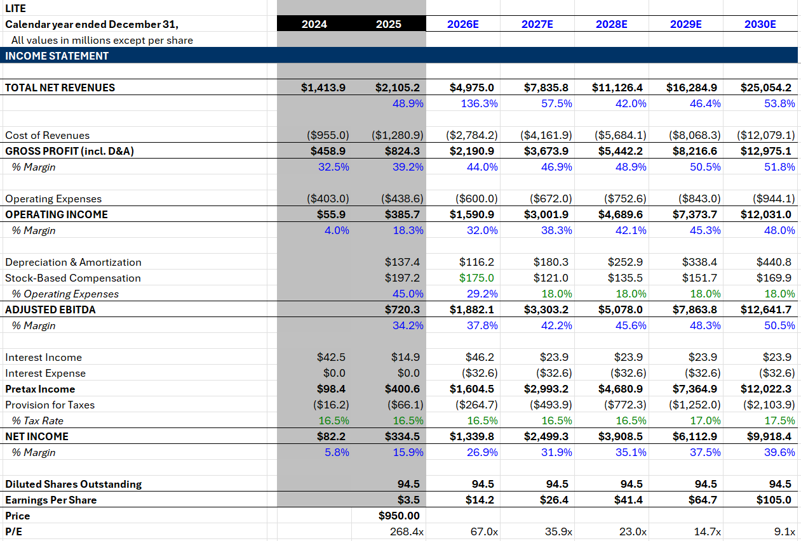](https://substackcdn.com/image/fetch/$s_!gfAU!,f_auto,q_auto:good,fl_progressive:steep/https%3A%2F%2Fsubstack-post-media.s3.amazonaws.com%2Fpublic%2Fimages%2Ffdcdfea0-0762-46ad-a363-d0c3fef757d4_1261x853.png)