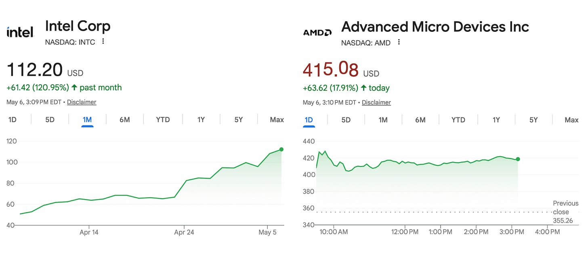
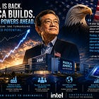
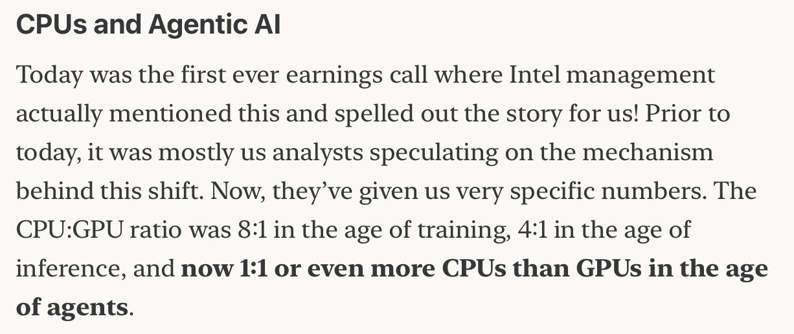
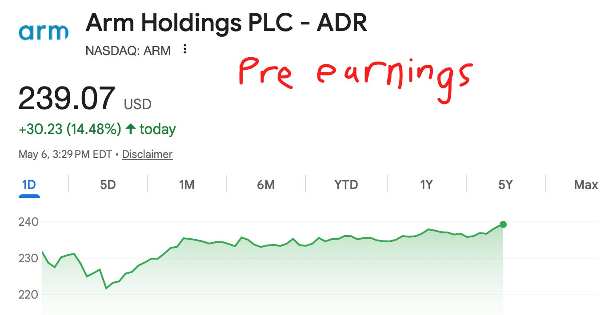
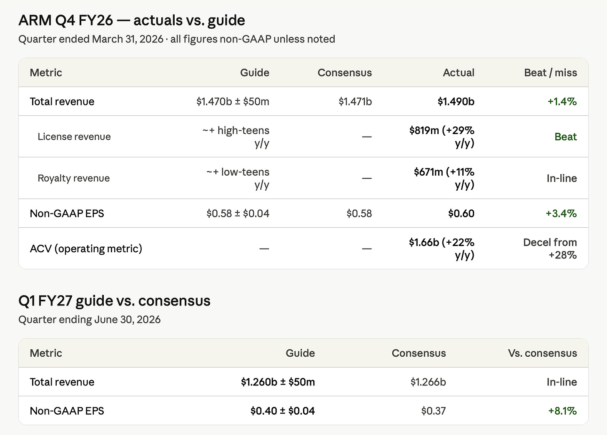
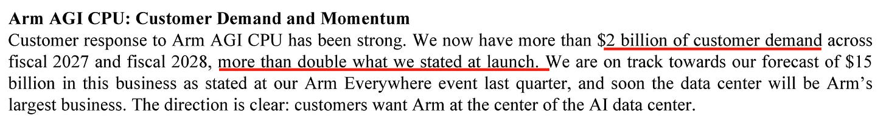
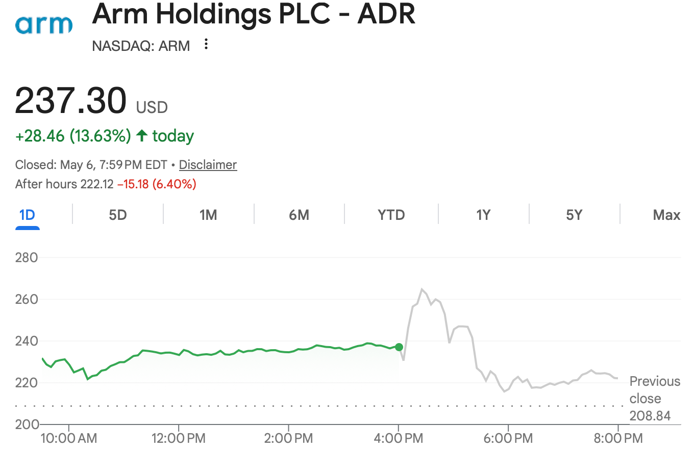
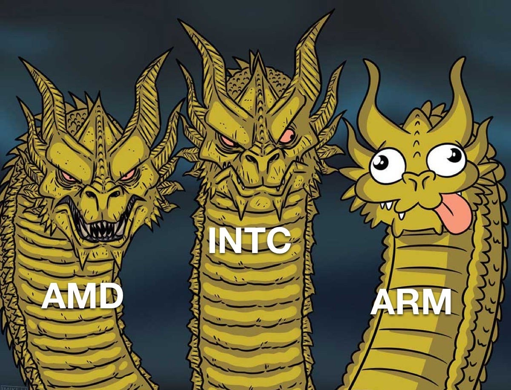

## Preamble

*\*written before earnings*

ARM is in a very interesting position today.

I used to play baseball as a kid. I was never really that good, but I do kind of understand the sport.

Imagine your team is down by a point and it’s the ninth inning, and there are two outs. Both batters before you just hit a home run. Everyone is going crazy.

If you hit a home run, you tie the game. If you strike out, your entire team loses, and because two of your teammates just slammed it out of the park, you may or may not be feeling a little pressure.

You are ARM. Your teammates are Intel and AMD.

Well they’re not really teammates since they… you know. But I think the analogy still holds. Team CPU!

For Intel you could say their earnings sparked CPU mania. I covered them in depth here.

[

#### Intel Earnings Review Q1 2026

[Jason's Chips](https://substack.com/profile/112809522-jasons-chips)

·

Apr 23

[Read full story](https://www.jasonschips.ai/p/intel-breaks-all-time-highs-earnings)](https://www.jasonschips.ai/p/intel-breaks-all-time-highs-earnings)

Basically the two big things were:

1. Intel crushed their top-line and revenue guidance by 10% via massive CPU shortage and price hikes.
2. They were the very first to spell out the agentic AI CPU to GPU ratio flip going from 1:8 in training to 1:4 in inference to parity or beyond in the agentic era.

AMD absolutely crushed it too. The headline is that they guided data center CPU to grow 70% year-over-year next quarter which was the engine of their top-line guidance beat. They also fully reiterated the CPU-to-GPU ratio. Literally the same exact 1:8 to 1:4 to parity thing that Intel mentioned.

But Lisa also made a comment that made ARM fly today.

> “At our Financial Analyst Day in November, we outlined the server CPU market growing at approximately 18% annually over the next 3 to 5 years. Based on the demand signals we are seeing today and the structural increase in CPU compute requirements driven by Agentic AI, we now expect the server CPU TAM to grow at greater than 35% annually, reaching over $120 billion by 2030.”

As you can probably infer by now the point I’m trying to make is that ARM is under a ton of pressure.

---

subscribe to ARM yourself with semiconductor knowledge

Subscribed

*By accessing this content, you acknowledge and agree to our [terms and conditions.](https://jasonschips.substack.com/p/terms-and-conditions) This research is **not financial advice**.*

---

## Earnings Time!

Everything was sort of inline, which, if you compare to AI Infra peers, is kind of disappointing, but ARM has a history of doing this. Also, no one really cares about ARM’s near-term revenues or EPS anyways, given that they trade at like a gazillion times earnings.

In terms of moving the share price, what actually matters is what happens in 2075. Jk, more like what happens in the later part of this decade. The entire thesis is that CPU demand goes exponential as agentic activity goes exponential, and ARM would eventually have the majority share of this market. You could easily argue that it goes far beyond the $120 billion TAM forecasted by AMD. The more you multiply this, depending on how singularity-pilled you are, the more multiples you would get on ARM’s $9 EPS projection.

And there’s where we have some very good news. This is the one relevant signal in the earnings release.

ARM Everywhere event was only six weeks ago. Since then, their customer demand has literally doubled. That’s pretty incredible. I know the AI space moves fast, but doubling in six weeks is something else.

If you have imagination, you can probably imagine where this number goes with just a little bit of extrapolation as six weeks turns into years.

## The Call

I’m NGL. This call was quite a disappointment compared to the press release.

#### Licensing

Licensing revenue is just a fixed payment that ARM receives so that other chip designers can use their IP. Unlike royalties, which are per unit.

They make it pretty simple for us. Both royalty and licensing revenue are expected to be up 20% year over year next quarter.

Softbank also makes up a huge chunk of their licensing revenue. For those who don’t know, Softbank owns 85% of ARM equity and also a bunch of other smaller chip makers, so they’re able to do a bunch of related party stuff at Masa’s pleasure. This quarter, it was $200 million out of the $800 million of licensing revenue.

#### Weird AI Bubble Comment

On the topic of licensing, when asked about where their licensing revenue growth rate is going over the next few years, Jason (the CFO not me) said:

> “Well, for this year, I think we said you should expect license revenue to be more in the 20% range. Over time, I would expect, I think the long-term target’s probably in the high single-digit, low double-digit range. You know, it’s hard to say for say. You know, we’ve seen this kind of AI investment super cycle or whatever folks are calling it, has now gone on for 3 years. I, you know, who knows how much longer it goes, but it’s at least gonna happen for the next year. You know, beyond that, hard to say.”

“Super cycle or whatever folks are calling it” “who knows how much longer it goes”WHAT

You are an AI chip company. You literally named your product the AGI CPU. Your entire valuation rests on a growth narrative based on the exponential proliferation of agents. And you’re on an earnings call sounding like Gary Marcus. LMAO

This has nothing to do with the company, but I have a vibes-based feeling that AI companies that are more AI-pilled will do better in the age of AI. You have already seen this with OpenAI vs. Anthropic in securing enough compute to not rate limit throttle your users. Or NVIDIA knowing to buy up all the memory and TSMC allocation, or Qualcomm missing the accelerated computing boat.

#### Royalty

I like this song.

[![Egzod & Maestro Chives - Royalty (ft. Neoni) [Official Lyric Video]](../assets/1e55fc74208e724c46241abb0dc311d2.jpeg "Egzod & Maestro Chives - Royalty (ft. Neoni) [Official Lyric Video]")](https://substackcdn.com/image/fetch/$s_!vs8r!,f_auto,q_auto:good,fl_progressive:steep/https%3A%2F%2Fsubstack-post-media.s3.amazonaws.com%2Fpublic%2Fimages%2F6627a91a-a551-4324-a9d3-8daec1f85301_1280x720.jpeg)

The thing that people kind of hate right now is mobile. And in case anyone forgot, a lot of ARM’s royalty revenue comes from mobile because phones use ARM SoCs to stay low power.

But luckily for ARM, they have much more exposure to the high-end smartphone market, aka Apple, which isn’t as affected by memory as the low-end. The low-end is kind of screwed, but the low-end uses V8 ARM, which has a lower dollar per unit than the newer V9 that goes in the higher-end smartphones. Therefore, their overall royalty growth was still positive.

For Datacenter, their royalty is essentially a slice of the entire Amazon Graviton, Google Axion, et cetera, custom CPU market, which is obviously very rapidly growing as both CPUs take share from GPUs and these custom solutions take share from Intel. As expected, their data center royalty revenue more than doubled year over year. They expect that over time, the vast majority of the data center CPU market should be ARM vs mostly x86 today.

They also have close to 100% market share in DPUs and NICs, which is pretty cool.

#### AGI CPU Ramp

Demand for the AGI CPU is very elastic and flexible. On the call, they said that most of their customers basically use ARM already and have the software and rack design work done so they can revise up their forecasts whenever needed.

> “A lot of the software work has been completed. The work required in terms of bringing on new compute capacity that’s Arm-based, there isn’t a lot of friction to that. You have a situation where, A, software is done, and B, you’ve got availability of a rack design that you can put in the data hub pretty quickly. To your question, it’s a combination of both. It’s a combination of some of the customers that we talked about during the day, increasing their forecast, and there are also customers that we didn’t talk about on the day, who have said, "Hey, we are very, very interested and we’re ready to deploy.”

This is how we got from 1 billion to 2 billion so fast. However, there is a slight drawback in that, as a fabless company, you have to do the thing where you secure allocation from TSMC while N3 wafers are at 150% utilization. It’s not very easy. Which is why their next quote was basically that, although they have the demand for $2 billion, they’ve only secured the supply for $1 billion and are still working on the rest. They’re keeping their forecasts at that $1 billion for now. This is split between 2027 and 2028, with $90 million in 2027 and $910 million in 2028.

One of the more important questions they were asked was where these AGI CPU revenues would come from, i.e., who their customers are and who they will be taking share from. Their answer is pretty consistent and makes a lot of sense, which is that there are many non-hyperscaler entities like OpenAI that do not want to design their own CPU but do want an ARM-based solution for the power efficiency, which is important, as agents want high core count, and in a high core count design, power efficiency becomes much more important. Basically, there’s this hole in the market.

#### AGI CPU IP Customer Problem

Now, on to the tension with IP customers that people have been discussing. This is another one of the guaranteed questions that they probably prepared a response for. Their take was that the primary reason they’re doing it is because their customers were asking them for it. There was an unmet need, and it was demand pull rather than a push from ARM themselves.

But other than that, the rest of the response made less sense. They said that they made sure that they had the approval of the ecosystem and asked all of their major royalty customers, who all emphatically said yes because they are strengthening the Arm ecosystem by launching this product (?)

#### TAM Projections and CPU Ratio Comment

They made two main TAM projection comments:

1. The overall data center CPU TAM will be 100 billion by 2030, which is compared with AMD’s 120 billion, so pretty much the same.
2. They also said that CPU capacity in the Data Center could increase by 4x by 2030, but they could “get their heads around a bigger number than that.”

Then there is the CPU to GPU ratio question. As Intel and AMD both made the same exact comment on the CPU to GPU ratio, of course this was a question that ARM was going to get.

And their response got a lot of controversy.

> “The way I think the think about it is that while the ratios may not go to more CPUs than GPUs from a chip standpoint, they probably will from a core count standpoint.”

And he basically went on to argue that the number of cores was more relevant than the number of chips itself. You could have the number of chips stagnate, but the core count and therefore the ASP of the chip increase.

Some people said that this was an own goal, given what Intel and AMD said were much more bullish, but I honestly think it’s fine. Intel said something similar on their earnings call as well about how their ASPs would rise over time as more cores fit in one chip. Honestly, the number of chips is pretty irrelevant to how much revenue ARM or Intel actually makes.

## Conclusion

My takeaways from this are that literally the only single relevant thing is the 2 billion of customer demand for the AGI CPU. Nothing else on this call really mattered that much. It was either their responses were consistent from the Arm Everywhere event, or it was something that the market already knew. I don’t think that this materially changes the thesis in any way.

Unfortunately, ARM was that one teammate that didn’t hit a home run and got pricemogged in the AH.

