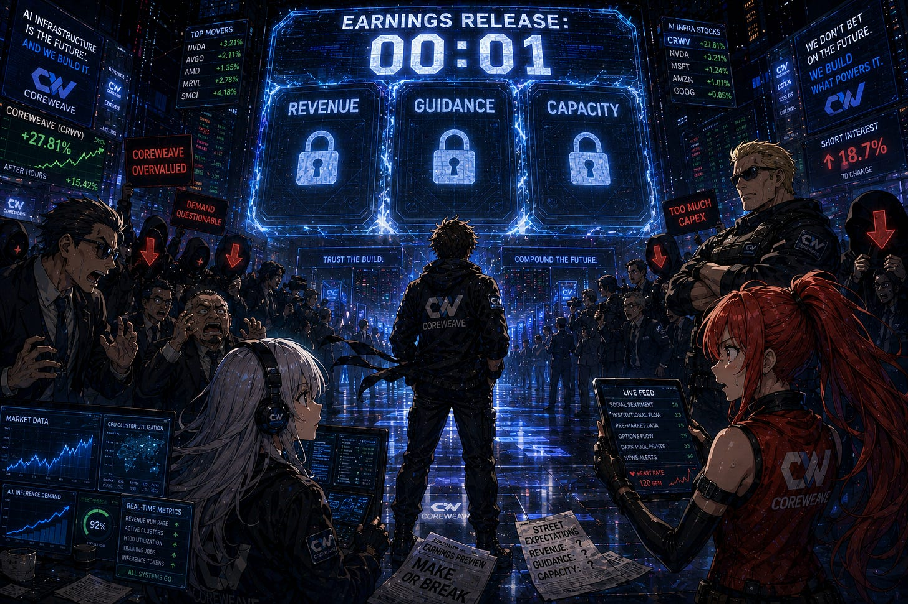
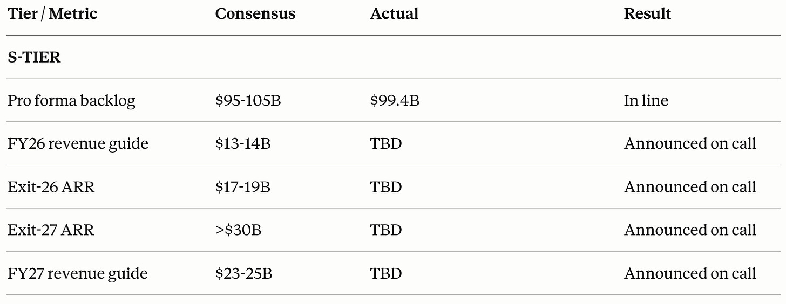
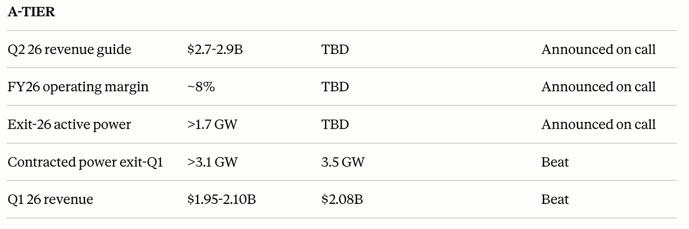
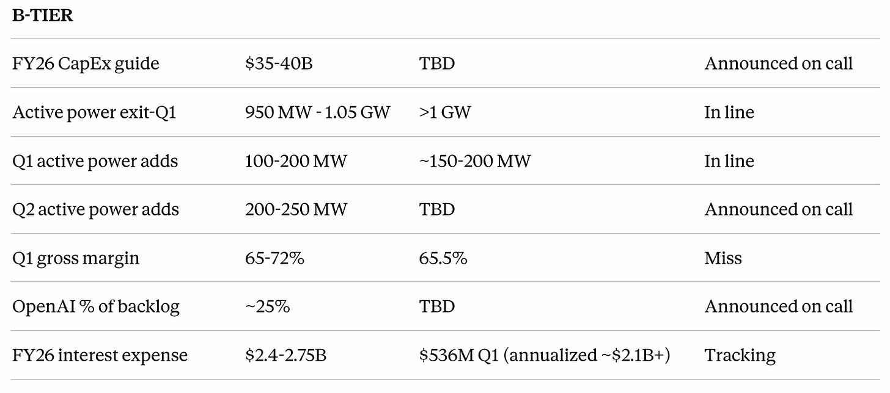
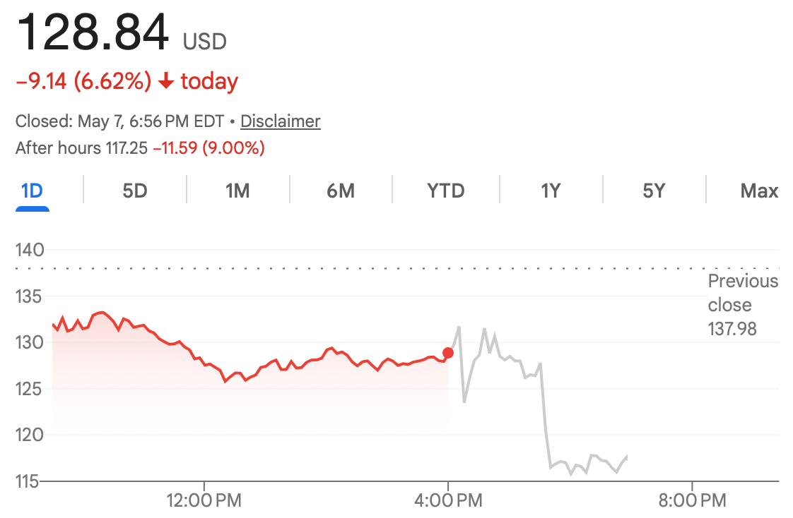
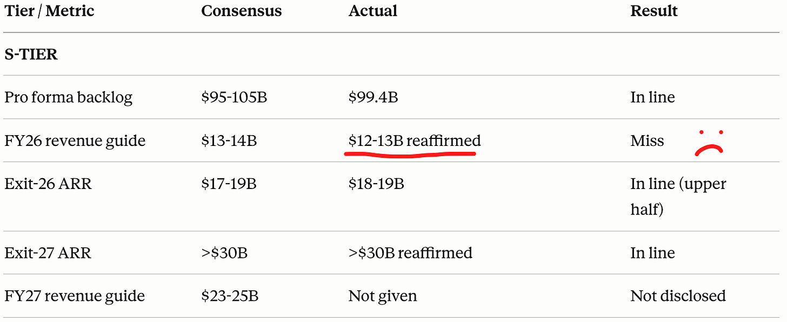
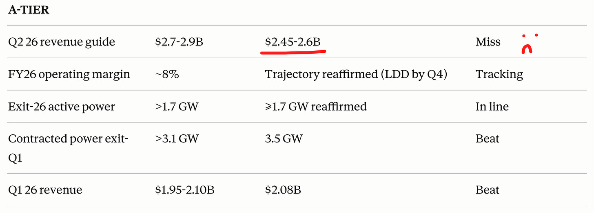
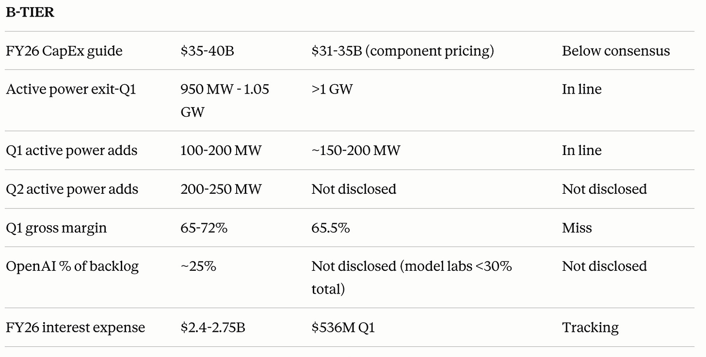
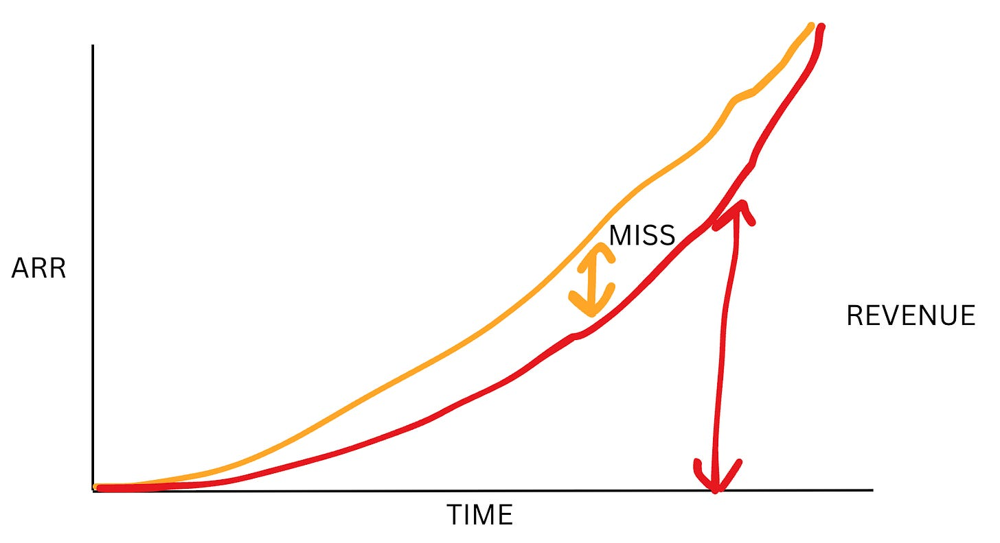

Welcome to CoreWeave earnings

The cool thing about CoreWeave is that their earnings are super high signal, unlike a lot of other AI infra plays.

This is because of two main reasons:

1. CoreWeave just gives you a ton of visibility. On the Q4 call, they guide it for 2026 full-year revenue, 2027 revenue, exit ARR for 2026 and 2027, and the active power exiting each year. You could literally draw a line on the graph with management statements.
2. CoreWeave’s demand itself is a leading indicator for AI economics. Other companies that are upstream usually have much more predictability and certainty and therefore are lagging indicators instead of leading ones. While Memory, Optics, and Semi-Caps generally have revenue dynamics stemming from supply chain shenanigans, CoreWeave’s topline and backlog are completely dependent on end user demand for AI, which makes them much more unpredictable and high signal.

I made a nice tier list for all of CoreWeave’s key KPIs that are announced during earnings every quarter.

First is the S-tier. This includes the backlog, FY26 and FY27 revenue guide, and ARR Exiting FY26 and FY27.

The reason these are S-tier is simple: it’s literally revenue. Top-line growth is a majority of what CoreWeave is valued on, and it is the very first leading indicator for downstream end-user AI demand.

After announcing the Meta, Anthropic, and Jane Street deals, sellside pencilled in around $100 billion of backlog, which is exactly in line with what they announced. No surprise there. But the all-important revenue guide and exit ARR are still yet to be announced as they are on the call, not the print.

Second is the A tier. This includes near-term revenue from this quarter and next quarter, active and contracted power, which are derivatives of future revenue, and finally operating margins, as those are the most important margin number for CoreWeave. Here, they had a pretty solid top line beat, probably in line with by side whisper, though, while having it real beat on contracted power, which is a good forward-looking signal. The more important metrics are announced on the call.

Finally, we have the B tier, which are just nice to haves or second derivatives of A and S tier KPIs. You might notice gross margin is here. Why is that? Well, gross margin is very dependent on depreciation and revenue timing. As a result, the more often cited margin metric for CoreWeave is the operating margin, and gross margin usually takes a back seat to that.

And as expected, the stock does precisely nothing before the call. The call is where the real KPIs slide in.

## The Call

---

Subscribed

*By accessing this content, you acknowledge and agree to our [terms and conditions.](https://jasonschips.substack.com/p/terms-and-conditions) This research is **not financial advice**.*

---

RIP

The two big headline misses were:

1. The Full-Year Revenue Guide, which was $12.5 billion (reiterated from last quarter’s earnings call) instead of $13.5 billion expected by consensus.
2. Q2 revenue guide, which was $2.5 billion versus $2.8 billion expected.

This is definitely a negative result, no doubt. I am disappointed. Below we get into:

1. The reasons behind the miss. Including capacity bring up speed, memory pricing, and margins/timing.
2. Three mitigants to the negative result.
3. My new confidence level in CoreWeave, whether or not my long-term thesis changed at all, and if I’m doing anything with my positioning.

#### Capacity Bring-Up Speed

2026 numbers are not commercial momentum or demand-driven at all. It doesn’t matter if they sign a trillion dollars in new contracts, none of that is going to affect 2026 revenue. The contracts were locked in well in advance, which is what CoreWeave guided off of. They knew that they had 1.7 GW of capacity allocated to their customers by the end of this year. The only question was how fast they can execute in bringing it online. The driver of the miss today was the capacity bring-up speed.

At the start of the call, Mike Intrator framed it as basically a grab bag of supply chain management difficulties, from labor shortages to power to memory.

In the earnings call, there was a juxtaposition: while they missed significantly on the Q2 revenue guide and by a moderate amount for the full-year revenue guide, they reaffirmed their active power target of 1.7 GW and lifted the low end of their 2026 exit ARR from $17-19 billion to $18-19 billion.

If you think about it, what they’re telling you is kind of simple: the ramp is going to be a lot more convex and back-half weighted than they previously thought.

I am a big fan of hand-drawn charts, so here’s a hand-drawn chart. As you can see, even though the ARR (and ending active power) ends up in the same place or even slightly higher than before, the revenue can be lower because the revenue is basically the area under the ARR. That miss is essentially concentrated in the middle of this year.

Here’s the exchange with Mark Murphy from J.P. Morgan and Nitin, which illustrates this dynamic exactly.

> "Nitin, just given the success you've had with the bookings in Q1, the data center build-out execution is great. You have the diversification across enterprises, the successful capital raise, and then you do have, you know, noticeable revenue upside in Q1. What holds you back from just passing through that revenue upside into the full year revenue guidance? Because I mean, in some sense, technically we'll reduce our rest of year revenue forecast a little. Is there some other effect? You know, sometimes there's weather or just the infrastructure shortages or maybe labor shortages in there that maybe is creating a mild headwind?"

> “From our perspective, you know, we mentioned this in our last earnings call as well. We pretty much remain sold out for our 2026 capacity. That is continuing to be true for us at this point of time. Where you would see this kind of inflection for us is around two vectors. We’ve raised the guidance for the floor of exit ARR, so we are gonna exit the year in a much stronger position than what we expected... At the same point of time, where it’s also inflecting, it’s showing up in 75% of our 2027 ARR... From a 2026 perspective, we pretty much remain sold out of our capacity.”

#### Memory Pricing

The next red flag that was raised is that they raised the lower end of their CapEx from $30 billion to $35 billion, to $31 billion to $35 billion for the full year, citing component pricing issues (memory). The response that they gave, honestly, I wasn’t satisfied with. They said that they built the company on supply chain struggles, so they’re good at it, and kind of deflected it a little.

But they did provide one useful piece of logic, which is that they negotiate and price deals with signed purchase orders of the inputs already in hand. Essentially, they are not signing deals and then buying from NVIDIA just to find out that there were significant price hikes from memory. I think that was the concern of several analysts during the Q&A, but no, that is not what is happening. CoreWeave is safe from that.

In addition, when asked about whether there was more upside risk for CapEx in 2026, they assured that the majority of their components are already locked in for this year.

Of course, there is a second-order worry that this would obviously affect their business in 2027 and beyond. I personally am not worried about this, and the reason is simple. CoreWeave’s customers are not at all price-sensitive. We’ve seen that agentic AI is able to provide far more economically useful value than the cost of the use of an API. You can automate hundreds of dollars of tasks for less than $10 in tokens. At the same time, the model labs take a 75% gross margin. There are two layers of immense price insensitivity where higher prices do not result in demand destruction, meaning that at the layer below, CoreWeave should be well positioned to negotiate a higher rental price to offset the memory price. In a sense, it might even give them more leverage and make gross revenue numbers look even better LOL.

#### Margins and Timing

Near-term margins are poor, especially gross margins. This was the main problem with the Q4 2025 earnings, and it sort of stayed in the same place that it was back then.

But there’s a very easy way to explain it, and out of the three problems. This is the one that I’m least worried about. Put very simply, adding any capacity would incur losses for the first two months before revenues offset the costs. This is due to lease and power expenses being incurred immediately while revenue is not.

As a result, when you are in hyperscaling mode, you are adding a lot of capacity relative to your current installed base. Therefore, the losses incurred from the new capacity ads look very large compared to revenues (aka low margins). I’m not worried about this because it’s something that easily resolves once you have a much larger installed base, which is coming fast due to the aforementioned hyperscaling.

#### Power is No Problem

Now, onto the three mitigants.

The first I want to discuss is power. While 3.1 GW of contracted power was expected, they were able to deliver 3.4 GW, adding 400 MW of power in one quarter and beating estimates.

Since there are plenty of miners that still have unsigned lease capacity and Bloom Energy is scaling their BTM solution, I don’t think power constraints will be much of a defining factor for CoreWeave’s supply.

They also have commenced self-building, with their first self-built site coming online later this year.

#### Financing is a Clear Positive

Second, financing is actually surprisingly a clear positive today.

The way CoreWeave financing works is simple: there’s a box that buys data centers and holds them. The box takes on debt and incurs interest expense, and no cash flows back to the parent (CoreWeave) until the debt interest is paid off inside of the box.

As capital markets for AI mature and the loan people understand GPU unit economics, these boxes will become more and more trusted. We’re seeing that happen today as they signed an $8.5 billion delayed draw term loan, which is actually investment grade, has a lower than 6% interest rate, and was oversubscribed. S&P also upgraded from stable to positive.

#### 2027+

The last mitigant point that I want to make is that 2027 and beyond looks very solid. CoreWeave mentioned that the substantial majority of their 3.5 GW of contracted capacity is going to come online in 2027. 36% of their backlog is going to be turned to revenue in the next 24 months, and 75% will be in the next four years. They reaffirmed greater than $30b ARR exiting 2027.

And yes, I know that this means they have to execute. But there are already significant doubts that they can embedded in the market, and honestly, it’s the only plausible bear case left, as the GPU depreciation and financing critiques have disappeared under the weight of new empirical evidence. If they do, this becomes an absolutely massive company.

## Conclusion

I would like to reiterate that I have OTM calls and not shares for this name, and that is for a reason.

Am I disappointed by the supply chain management and execution this quarter? Yes.

Am I losing my long-term conviction? No.

The whole point of this company for me is 2027 and 2028 torque to immense GPU demand under chip scarcity in a fast AGI scenario. IF we are in such a world, all that has to happen for the stock to work is deals to get signed at pricing that are multiples of today’s level, multiplying the backlog and making any capacity that they can bring online that much more valuable. Their costs will stay the same while their revenues increase significantly, lifting margins from the very low point of today, which is why it is still an insanely asymmetric bet and one that is probably more asymmetric than my anchor semis positions.

I chose them for their good put, their scale, and their ability to finance with debt instead of equity to preserve insane degen upside. None of that changed today. See you next quarter!