Let’s talk headline first! I am writing this pre-call so raw dogging it.

[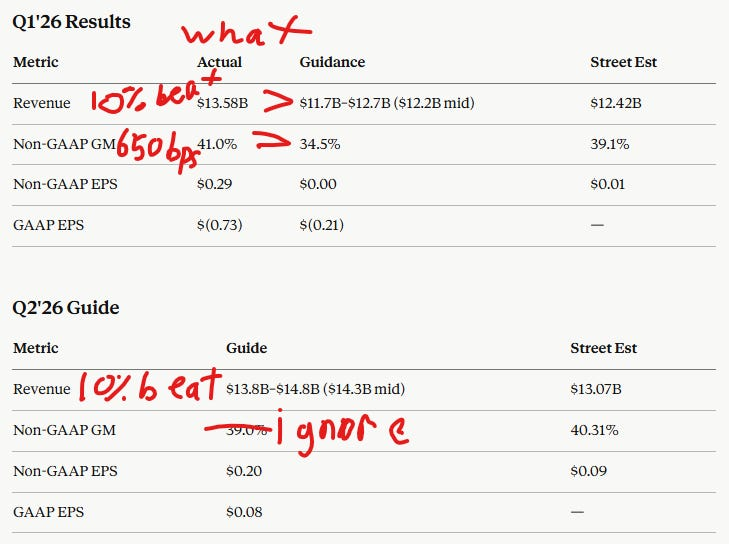](https://substackcdn.com/image/fetch/$s_!VOAi!,f_auto,q_auto:good,fl_progressive:steep/https%3A%2F%2Fsubstack-post-media.s3.amazonaws.com%2Fpublic%2Fimages%2F80d91880-d1a8-4e32-b24c-9f81d6a5ec80_729x544.png)

Revenue and guide are INCREDIBLE. Beating by 10%. Clearly tons of CPU price hikes happening already. As I discussed in my timely CPU article (which I will now be heavily victory lapping) we are in the very very early stages of the CPU S-curve as they were never needed before agentic AI. A few months of Claude Code and OpenClaw did this!

[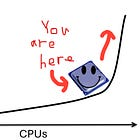

#### CPUs: A Better Story Than Photonics?

[Jason's Chips](https://substack.com/profile/112809522-jasons-chips)

·

Apr 22

[Read full story](https://www.jasonschips.ai/p/cpus-a-better-story-than-photonics)](https://www.jasonschips.ai/p/cpus-a-better-story-than-photonics)

GM beat their prior guide by **650bps**. This is pretty unholy.

I genuinely do not know why their GMs guided down without the call.

*(Note from Jason after the call: Now I know. Its actually good news)*

[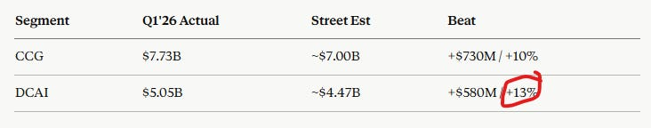](https://substackcdn.com/image/fetch/$s_!dXNZ!,f_auto,q_auto:good,fl_progressive:steep/https%3A%2F%2Fsubstack-post-media.s3.amazonaws.com%2Fpublic%2Fimages%2F8d11ba07-a210-48eb-b862-96d20faa450c_732x144.png)

CPU price hikes are everywhere, both consumer AND AI. They are enough to offset whatever unit loss is happening due to this and memory murdering the BOM, apparently.

[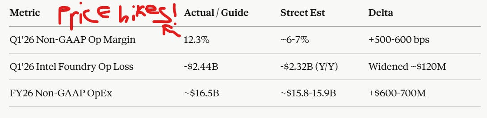](https://substackcdn.com/image/fetch/$s_!pb2T!,f_auto,q_auto:good,fl_progressive:steep/https%3A%2F%2Fsubstack-post-media.s3.amazonaws.com%2Fpublic%2Fimages%2F5fab66ff-ff99-4892-af8a-1847c30fdbf8_1090x267.png)

Here is sort of the recurring theme of Intel: Operating leverage. A big but not unheard-of beat on revenue (10%) turns into operating income that is **double what was projected**. Intel’s chart looks scary but remember, they used to be unprofitable and trading at 1-2x revenue!

A graph from the early days of my Substack:

[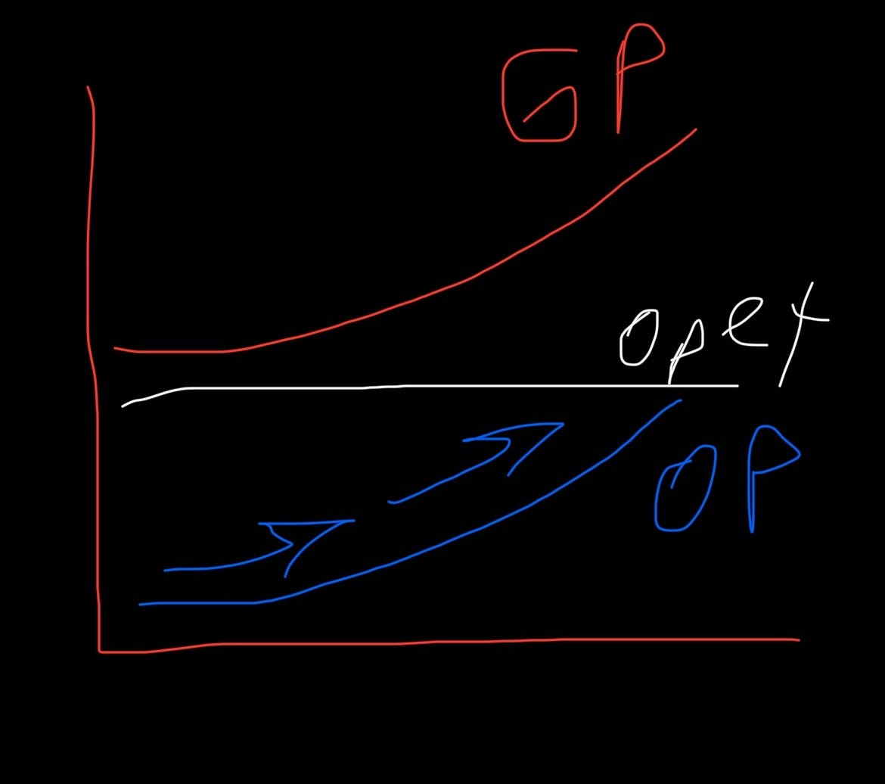](https://substackcdn.com/image/fetch/$s_!I4nX!,f_auto,q_auto:good,fl_progressive:steep/https%3A%2F%2Fsubstack-post-media.s3.amazonaws.com%2Fpublic%2Fimages%2Fd4bef952-ccb9-4e7c-85b3-1db6dd09bc46_1170x1036.jpeg)

This is why I like low revenue multiples and low profitability for asymmetric longs. One day they are unprofitable and the next earnings appear from thin air and start compounding at triple digits and everyone acts surprised.

#### Price Action

[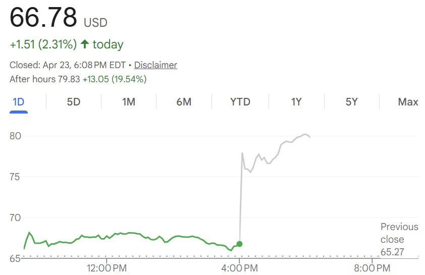](https://substackcdn.com/image/fetch/$s_!S_WD!,f_auto,q_auto:good,fl_progressive:steep/https%3A%2F%2Fsubstack-post-media.s3.amazonaws.com%2Fpublic%2Fimages%2Fe4ba7f84-a33b-4abf-8e67-4be3d057e428_842x545.png)

Intel surges 20% after hours and breaks its all time high, a record last set in 2000 during the dot-com bubble.

[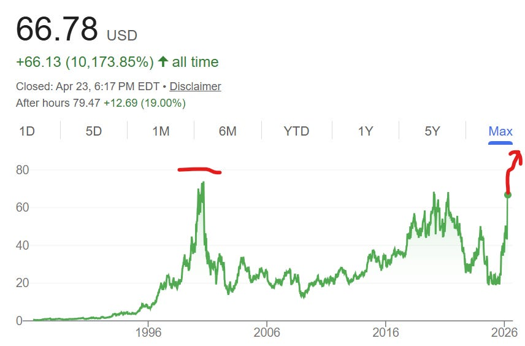](https://substackcdn.com/image/fetch/$s_!cV8c!,f_auto,q_auto:good,fl_progressive:steep/https%3A%2F%2Fsubstack-post-media.s3.amazonaws.com%2Fpublic%2Fimages%2F01aa0a10-5cb2-4eb3-9a37-4005331b1eab_856x564.png)

**This is the semiconductor industry’s greatest comeback story.**

Lip-Bu dropped the coldest quote in Intel history:

> “A year ago, the conversation about Intel Corporation was about whether we could survive. Today, it is about how quickly we can add manufacturing capacity and scale our supply to meet enormous demand for our products.”
>
> - Lip-Bu Tan, CEO, Intel Corporation

[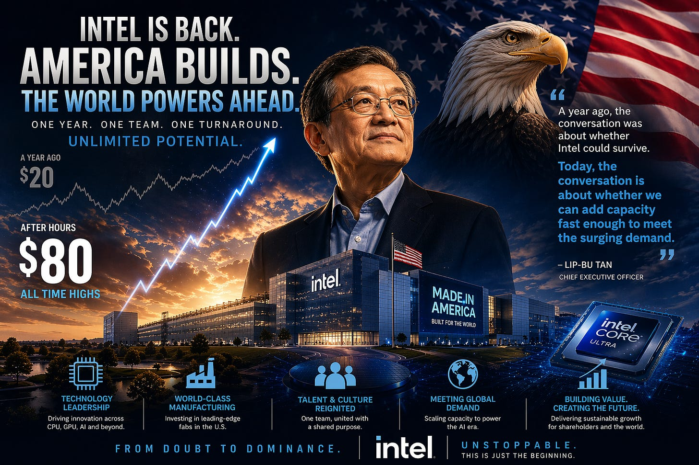](https://substackcdn.com/image/fetch/$s_!SH1l!,f_auto,q_auto:good,fl_progressive:steep/https%3A%2F%2Fsubstack-post-media.s3.amazonaws.com%2Fpublic%2Fimages%2F07a24c02-292f-4b07-bdf5-24afeb9e9dd7_1536x1024.png)

## The Call

Going forward, my earnings call analysis will be reserved for the paid tier only.

Intel’s earnings call today was the most confident I have ever heard the management team in a long time. We will explore the development of 8 different themes ranging from the surprising positive developments in 18A yields to management’s newfound bullishness on CPUs for agentic AI. Finally, I will share my Intel model for the first time, including a comprehensive revenue build (splitting CCG, DCAI, external 18A-P revenue, 14A revenue, advanced packaging, and ASIC), income statement/EPS, and DCF. We will explore the path to a one trillion market cap.

#### Contents

1. CPUs and Agentic AI
2. Culture
3. 18A Yields
4. 14A Progress and Capex
5. Advanced Packaging
6. DCAI Product Roadmap
7. CCG Product Roadmap
8. ASIC Business
9. The Model (and Path to >$1 Trillion)

---

SemiAnalysis Giveaway: The first person to subscribe using the paywall on this post will be selected to receive one free month of SemiAnalysis (sent to your email, must not already be a SA subscriber).

Subscribed

*By accessing this content, you acknowledge and agree to our [terms and conditions.](https://jasonschips.substack.com/p/terms-and-conditions) This research is **not financial advice**.*

---

#### CPUs and Agentic AI

Today was the first ever earnings call where Intel management actually mentioned this and spelled out the story for us! Prior to today, it was mostly us analysts speculating on the mechanism behind this shift. Now, they’ve given us very specific numbers. The CPU:GPU ratio was 8:1 in the age of training, 4:1 in the age of inference, and **now 1:1 or even more CPUs than GPUs in the age of agents**.

Incredibly, it is not datacenter they are most bullish on. It is the edge. When asked whether ARM's $100B agentic CPU TAM estimate was realistic, Lip-Bu didn't just validate the number, he pointed past it, flagging robotics and physical AI as categories where edge compute demand could see 'even more explosive growth than datacenter.' Think about what that implies. The datacenter CPU inflection alone is enough to justify Intel's current trajectory, and management is telling us that is the smaller of the two waves coming. Every robot, every autonomous vehicle, every piece of physical AI infrastructure needs a CPU doing real-time orchestration at the edge.

#### Culture

Lip-Bu opened the call by saying Intel is a “very different company than what it was a year ago,” and for once, the language actually matches the evidence. When he took over, Intel was a case study in corporate decay: a bloated org chart where every decision required six approvals, a product roadmap held hostage by internal politics, and a manufacturing organization that had lost the plot on what customers actually wanted. Ten months later, that company is gone.

Here are some quote from Lip-Bu:

> “Intel is now a very different company than when I first joined over a year ago. We have taken, and continue to take, deliberate steps to rebuild Intel into a more competitive and more profitable company. Our cultural transformation is well underway, and we are embracing our roots as a data-driven, paranoid, and engineering-centric company.”
>
> “Over the last year we have driven a lot of efficiency, flattening layers of management. Now we are really focused on customers and engineering. I spend a lot of time meeting with customers and customers' customers, understanding the workloads and how we can drive improvements in the architecture, execution, tape-outs, and design to drive efficiency.”

#### 18A Yields

The language on 18A yields changed materially. Last quarter, Lip-Bu described “7-8% yield improvement per month” with the focus on variation reduction and defect density, ending with the qualifier “still not quite to the industry-leading standard yet.” Panther Lake was explicitly dilutive to corporate average and Zinsner said 34.5% Q1 GM was “by no means an acceptable level,” with the path being “first to get it to 40%.” This quarter, management said they will hit Lip-Bu’s end-of-year yield target by the middle of the year! That is a six-month pull-forward on the yield curve, which changes the entire margin trajectory of Panther Lake and the broader 18A ramp. Zinsner also noted that this carries over into next year’s yield expectations, meaning the benefit compounds.

The reason Q2 GMs aren’t already inflecting despite the massive revenue beat is that 18A is still below corporate average on the ramp, which is a math problem that resolves itself as yields close the gap.

#### 14A Progress and Capex

14A continues to outpace 18A at similar points in development, which is the same language Intel used last quarter. That consistency matters because it means the signal isn’t drifting. The PDK progression is the cleaner datapoint: last quarter they had just delivered PDK 0.5, this quarter they’re at PDK 0.9, and they’re now driving cycle time as the next unlock. Customer commitment decisions are still targeted for H2 2026 through H1 2027, unchanged from last call. Management declined to preannounce customers unless the customer wants to be announced, which is appropriate.

Capex composition continues to shift in a way that is quietly bullish. Last quarter Zinsner laid out the framework: capex guide went from “down meaningfully” to “flat to slightly down,” with spending moving from space to tools because cleanrooms are no longer the bottleneck. This quarter that framework firmed up with specifics. Full year capex is now flat year over year, up from initial down guidance. Maybe capex up next quarter?

Space spend is coming down ~25% while tool spend is going up by roughly the same amount. (Thank god they bought a shit ton of cleanrooms before the cleanroom crisis.)

#### Advanced Packaging

The upgrade in advanced packaging expectations between quarters was substantial. Last quarter Zinsner said that 12-18 months ago he was thinking advanced packaging opportunities would be “measured in hundreds of millions” with wafer opportunities in billions, but that early customer engagements were suggesting “well north of $1 billion on many of these opportunities.” This quarter he tightened that further: demand is “in the billions” and Intel “thought in hundreds of millions” originally. The multiplier keeps going up as more customers engage. The driver is EMIB’s differentiated feature set, particularly larger reticles (EMIB-T specifically), which lets Intel charge prices and margins “above the rest of the foundry offerings” because customers genuinely need what only Intel can provide.

The Malaysia capacity expansion announced in the press release is the physical manifestation of this demand. Last quarter Zinsner flagged that some customers were willing to prepay to secure advanced packaging capacity because of the severe supply shortage. This quarter the Malaysia announcement validates that the prepayments converted into capex commitments Intel was willing to make. Unlike foundry wins, advanced packaging doesn’t require customers to requalify their designs on Intel’s PDK. A customer can continue fabbing at TSMC and still route their chiplets through Intel’s EMIB flow. That’s why this ramps faster than foundry and why the revenue opportunity is compounding immediately rather than waiting on 14A customer commitments.

#### DCAI Product Roadmap

Last quarter Lip-Bu centralized DCAI under Kevork, simplified the server roadmap to focus resources on 16-channel Diamond Rapids, and said Coral Rapids would reintroduce multi-threading into the roadmap. He also committed to the Nvidia custom Xeon integrated with NVLink. This quarter those commitments started turning into wins. The Xeon 6 selection as host CPU for Nvidia’s DGX Rubin NVL8 systems is the single most important competitive datapoint in the release. Nvidia’s reference AI platform uses Intel Xeon 6, not AMD EPYC. Pair that with the Google partnership expansion covering C4 and N4 instances plus co-developed custom IPUs, and the server CPU share narrative looks very different than it did three months ago.

On Coral Rapids, Lip-Bu said multi-threading will let them “compete effectively with AMD,” and there’s active effort to pull the launch forward at customer request. That said, when an analyst pushed on AMD and ARM competition, management deflected partially into foundry flexibility and advanced packaging, which is still the tell that product-only they don’t feel fully competitive yet. Intel is winning share right now because of supply tightness at TSMC and because of the CPU intensity of agentic workloads, not because of raw architectural superiority. The recruitment of “top talent to build new CPU/GPU architecture” is an acknowledgment that they need to close the architectural gap. The question is whether supply-driven share gains hold long enough for the architecture roadmap to catch up.

#### CCG Product Roadmap

Last quarter Intel launched 3 Series 3 SKUs ahead of a commitment to deliver one, with CES showcasing 200+ notebook designs. Panther Lake performance reviews came in strong: up to 27 hours of battery life, 70% gen-on-gen graphics improvement, 50-100% better than peers on industry standard benchmarks. This quarter management called it the strongest CCG product launch in three years, now expanded to include Xeon 600 workstation, Core Ultra 200S Plus and 200HX Plus for desktop and mobile, Series 2 for edge health and life sciences, and mainstream Series 3 extending 18A into the volume segment. The +1% Y/Y CCG print against Street expectations of -8-11% tells you real demand is there when Intel can ship.

The setup from here is more nuanced and worth tracking. Last quarter the concern was memory and substrate pricing pressure limiting CCG revenue opportunity. This quarter management flagged PC TAM down low double digits for 2026, which is a new and notable headwind that will show up in 2H. They’re also explicitly reallocating CCG wafers to DCAI given where the pricing power is, which means reported CCG revenue could compress even while underlying client demand stays healthy. The offsetting dynamic is that supply is going up every quarter as 18A ramps, which if true means 2H CCG could surprise to the upside even against a weakening PC TAM. Last quarter the messaging was that Q2 would be the supply inflection. This quarter that got reaffirmed, and the math already played out with Q1 blowing through both the guide and Street.

#### ASIC Business

Last quarter was the formal coming-out party for the ASIC business. Zinsner disclosed that custom ASIC grew over 50% in 2025, 26% sequentially, and reached an annualized run rate of greater than $1 billion exiting Q4, pursuing a $100B TAM. Lip-Bu framed it as “not a new area” but one where he was committing significantly more focused resources, leveraging his Cadence Design experience. This quarter the narrative advanced with concrete customer specifics. The Google IPU program is “north of a billion dollars already and only getting started,” with customer feedback described as “very excited to work with us.” UBS had previously modeled $1-3B per program in annual revenue, and Intel is now confirming at least the lower end of that range is already booked on a single customer.

This is a distinct leg to the story and it’s accelerating. For years Intel has been a monolithic CPU vendor plus a foundry aspiration. Now there’s a third vector where Intel’s CPU IP, advanced packaging, and hyperscaler relationships combine into a recurring custom silicon revenue stream, effectively competing with Broadcom and Marvell for design wins. Management hinted more contracts are coming with the “stay tuned” line this quarter, and confirmed that existing agreements are multi-year with volume and pricing commitments, 3-5 years in length. Last quarter Lip-Bu specifically called out that advanced packaging makes the ASIC offering “more compelling” for customers, and this quarter’s Malaysia packaging expansion reinforces that the ASIC, packaging, and foundry stories are converging into a single capability pitch.

#### The Model

[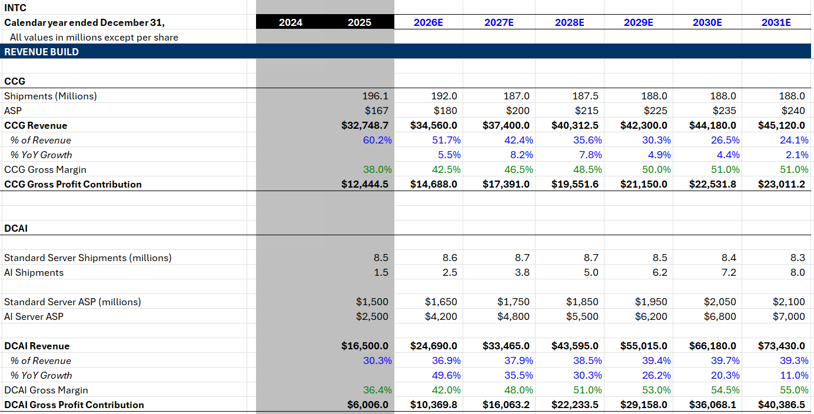](https://substackcdn.com/image/fetch/$s_!liv1!,f_auto,q_auto:good,fl_progressive:steep/https%3A%2F%2Fsubstack-post-media.s3.amazonaws.com%2Fpublic%2Fimages%2F3928772d-f7cd-4b83-b05d-f20a58dfcdff_1383x704.png)

[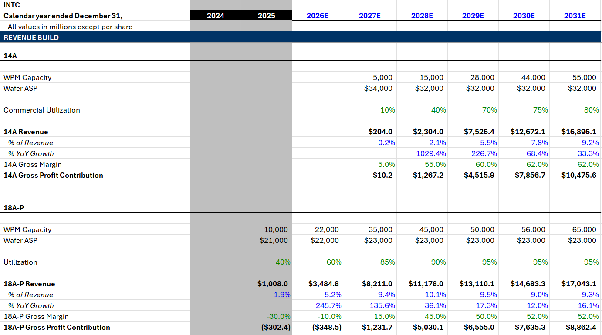](https://substackcdn.com/image/fetch/$s_!dQjY!,f_auto,q_auto:good,fl_progressive:steep/https%3A%2F%2Fsubstack-post-media.s3.amazonaws.com%2Fpublic%2Fimages%2F2989adb9-31fc-43fa-a349-3a5dea1031e7_1382x771.png)

[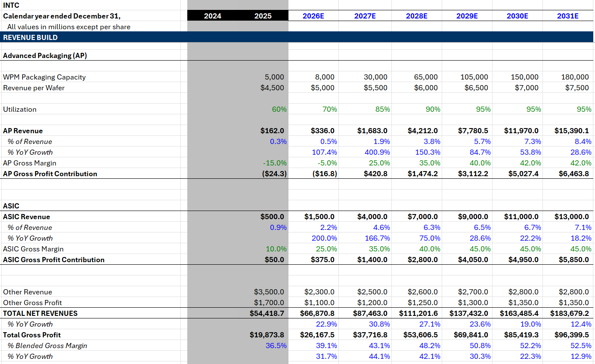](https://substackcdn.com/image/fetch/$s_!W0WF!,f_auto,q_auto:good,fl_progressive:steep/https%3A%2F%2Fsubstack-post-media.s3.amazonaws.com%2Fpublic%2Fimages%2F2e918f68-154d-4025-81ba-169232f9cc13_1382x847.png)

[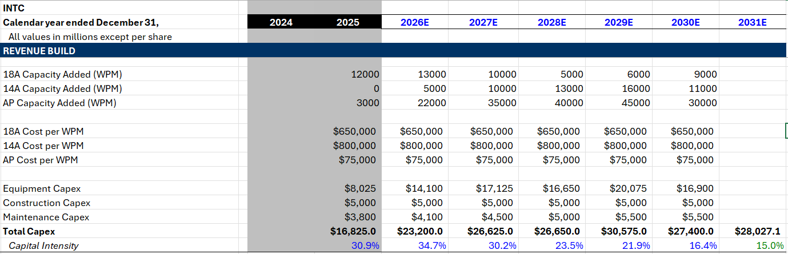](https://substackcdn.com/image/fetch/$s_!KB5d!,f_auto,q_auto:good,fl_progressive:steep/https%3A%2F%2Fsubstack-post-media.s3.amazonaws.com%2Fpublic%2Fimages%2F36ed9659-12be-4b7c-920c-bb9dc975bec7_1379x445.png)

1. Expect CCG unit volumes to decline YoY for the next 2 years and then kept flat. ASP rises to offset the volume decline.
2. DCAI is where the agentic CPU thesis plays out. I project increases in both volume and ASP, with the ASP component made up of pure price increases and core count growth.
3. I am positive as always on Intel’s external foundry ambitions. They have 110k WSPM of external capacity across leading edge offerings (18A-P and 14A) and I expect it to be steadily filled up towards the end of the decade.
4. Advanced packaging will be operating at industry-leading scale as CoPoS gets pushed out to 2030 and chip designers desperately need larger package sizes which require EMIB.
5. ASIC revenue was already at a billion-dollar run rate last quarter and should be meaningfully higher this quarter. This is the most conservative line in my model because I just do not know where it will go and have no meaningful unit economics to base it off of.

What I don’t include are any royalty revenues from Terafab. We have no idea the structure of that deal yet so it is unpriced upside.

[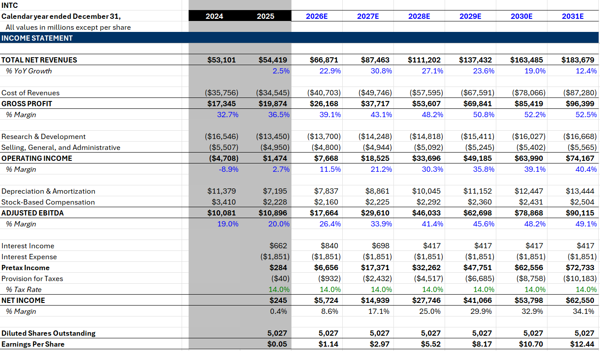](https://substackcdn.com/image/fetch/$s_!zRwg!,f_auto,q_auto:good,fl_progressive:steep/https%3A%2F%2Fsubstack-post-media.s3.amazonaws.com%2Fpublic%2Fimages%2Fedac8d74-a3f1-45ef-a328-d16d44ba10e3_1371x803.png)

After today’s earnings move, Intel trades at 15x 2028 earnings and 10x 2029 earnings according to my projections.

[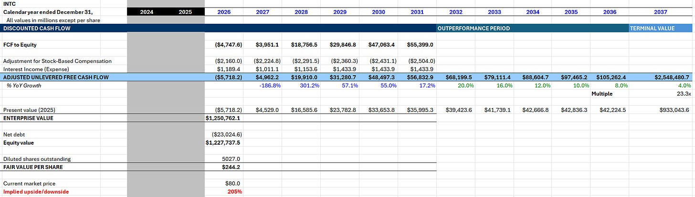](https://substackcdn.com/image/fetch/$s_!CpfP!,f_auto,q_auto:good,fl_progressive:steep/https%3A%2F%2Fsubstack-post-media.s3.amazonaws.com%2Fpublic%2Fimages%2Fba58a521-8488-4a92-8c84-1ab1dd54beb5_2122x604.png)

All this implies a fair value of $1.23T market cap today based on a WACC of 9.56% in the forecast period and 8.67% in the terminal value.

That’s why it isn’t hard for me to imagine Intel eventually reaching one trillion dollars. It will take time, but it is certainly possible.

After that, they will continue to compound as America’s TSMC by investing in fabs at ROIC far above WACC.

If you enjoyed, please like, comment, restack or share. It helps a lot.

[Share](https://www.jasonschips.ai/p/intel-breaks-all-time-highs-earnings?utm_source=substack&utm_medium=email&utm_content=share&action=share&token=eyJ1c2VyX2lkIjoxNDAwMjQ1LCJwb3N0X2lkIjoxOTUyNzM4NzMsImlhdCI6MTc3ODU1MTI4OCwiZXhwIjoxNzgxMTQzMjg4LCJpc3MiOiJwdWItNjY2NDM1NiIsInN1YiI6InBvc3QtcmVhY3Rpb24ifQ.-ZLxdtNAZR_YPoXJYKTFEzWG4dHIn7-j0FtZCkCrrt4)