Welcome to Cerebranalysis!

Over the next two days we shall do an analytical analysis of Cerebras in advance of the IPO. Today’s article focuses on their technology and tomorrow’s will be on stock-related stuff (business, market relevance, and financials).

## Introduction to Dinner Plate Computing

Cerebras is the well-known pioneer of dinner plate computing.

Their foundational premise is that, BIGGER IS BETTER.

Normally, when you order a wafer from TSMC, you slice up your wafer into dies. Cerebras decided to keep all of the dies intact and instead network them together into one really big chip.

These spaces between the dies are called keep-out zones because normally you keep everything out of them because they will be cut up by the diamond saws. In this case, these keep-out zones are the home for complex wiring and networking. This means that Cerebras needed to collaborate intimately with TSMC to develop proprietary IP in order to fill up these keep-out zones with networking.

[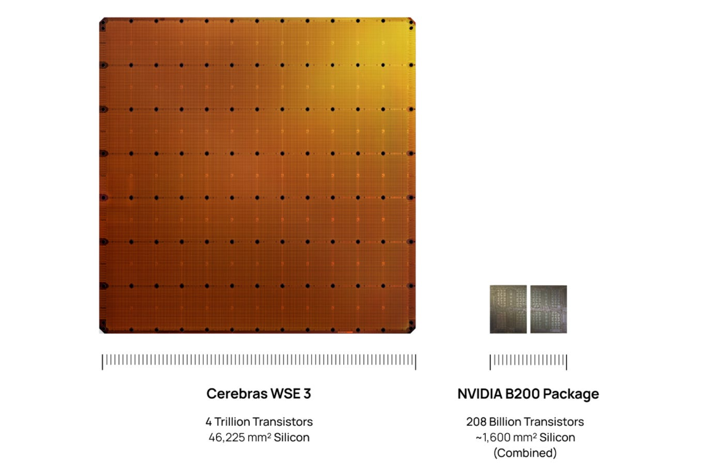](https://substackcdn.com/image/fetch/$s_!A1tM!,f_auto,q_auto:good,fl_progressive:steep/https%3A%2F%2Fsubstack-post-media.s3.amazonaws.com%2Fpublic%2Fimages%2Facb30d63-b128-4d17-ae8c-5ca9905ce37a_1366x902.png)

Throughout their investor materials, they make a plethora of comparisons to traditional computing with a bunch of metrics of stuff that chips do (compute cores, transistors, memory bandwidth, FLOPs), and because their chip is bigger, they can do more chip things.

[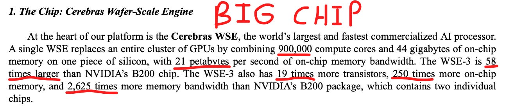](https://substackcdn.com/image/fetch/$s_!nU3b!,f_auto,q_auto:good,fl_progressive:steep/https%3A%2F%2Fsubstack-post-media.s3.amazonaws.com%2Fpublic%2Fimages%2F575d5166-8b3c-4ad6-bace-03b79c29735d_1292x288.png)

This can mislead retail investors, as in real life there is always a trade off. Cerebras is simply a computing architecture optimized very differently than traditional GPUs.

#### Abstract

Today’s article focuses on the science and technology behind the Cerebras Wafer-Scale Engine.

First, I discuss the Cerebras distributed SRAM problem, and how this leads to extreme compiler complexity and inefficiency. I make the comparison to NVIDIA’s GB200 clear through an analogy: the tale of two cities.

Next, we find out how Cerebras claims a 100% yield rate on their wafer-scale engines, despite wafers being nearly guaranteed to have a defect.

Then we dissect PVT (process, voltage, temperature) calibration, one of Cerebras’s most important innovations, one that solves a problem which prevented the entire wafer-scale industry from taking off for decades.

After that, we talk about the science behind the one mechanism which enables their 15x inference speedup: pipeline parallelism. We explore how a normal GPU runs inference on a transformer (tensor parallelism), walking you through what happens inside a rack per-token and per-model-layer, before contrasting it with the Cerebras WSE approach (pipeline parallelism) and how data literally flows down the wafers like water through a river.

Following which we detail the two key constraints their architecture has, first being severe memory constraints and second being the limited I/O bandwidth due to very large area relative to perimeter.

And finally, we go one step beyond most other technical research out there. We underline why all this technological analysis is economically relevant for their product. I will walk you through the **single conclusion that follows from our research, which forms the foundational premise for all of our economic and business-related analysis coming tomorrow.**

Importantly, I make it all fun and understandable.

These two Cerebranalysis articles are a must-read. Get strapped in. This stuff is crazy technical but technical is fun. Let’s go!

#### Contents

1. The Tale of Two Cities & The Nightmare Compiler
2. Wafer-Scale Yield
3. PVT Calibration
4. Fast Inference (Tensor vs Pipeline Parallelism)
5. Memory Constraints
6. The I/O Bandwidth Problem
7. The Economically Relevant Conclusion

---

SemiAnalysis Giveaway: The first person to subscribe using the paywall on this post will be selected to receive one free month of SemiAnalysis (sent to your email).

Subscribed

*By accessing this content, you acknowledge and agree to our [terms and conditions.](https://jasonschips.substack.com/p/terms-and-conditions) This research is **not financial advice**.*

---

## The Tale of Two Cities & The Nightmare Compiler

SRAM is the super-fast expensive memory at the very top of the memory hierarchy. Faster than DRAM and even HBM.

[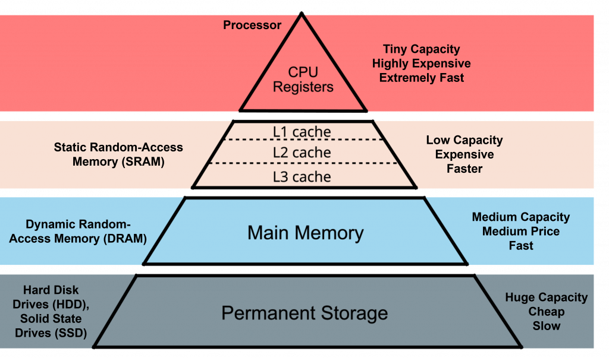](https://substackcdn.com/image/fetch/$s_!RhYz!,f_auto,q_auto:good,fl_progressive:steep/https%3A%2F%2Fsubstack-post-media.s3.amazonaws.com%2Fpublic%2Fimages%2F72b10be5-3a5e-4b06-8f37-6012920b3a91_1024x603.png)

This memory is usually made with a logic process and sits very close to the compute.

In a traditional GPU, all of its cores share the same unified pool of SRAM.

However, at a wafer scale, a unified memory pool is physically impossible. Therefore, Cerebras designed each compute core to have its own distributed 48 KB of SRAM. This is very little memory (the entire WSE would only have 44 GB of memory total compared to 13.5 TB of HBM3E for the GB200 NVL72 rack).

I like to think of this as a tale of two cities.

One is a small village with a few hundred residents. In this village, there is a shared library in the middle where residents go to fetch the information that they need. It is very easy for this village to coordinate as any two residents can read the same books.

Another is a nightmarish-looking homogeneous suburbia with 900,000 identical tiny homes. Each house has its own small bookshelf. You can only read the books that are in your own house. As you might imagine, it becomes a nightmare for this civilization to coordinate and communicate any information.

A compiler is the machine that translates human (or agent ha) intent (code) into silicon action. It needs to tell the transistors what to do.

In the village with the shared library the compiler’s job is easy. In the homogeneous suburbia, it’s a nightmare as you would have to write a master schedule that guarantees person number 452,000 has the exact right piece of data placed on their tiny bookshelf at the exact right millisecond and then passes it on to person number 452,001 right as they finish using that piece of data.

Because this hardware fundamentally guarantees the compiler complexity, Cerebras can never achieve the software optimization of NVIDIA. However this does serve as a pretty intense barrier to entry for new wafer-scale competitors.

## Wafer-Scale Yield

Manufacturing chips is very hard. Sometimes a speck of dust can ruin your chips. Wafer yield is simply the percentage of good dies divided by the total number of dies on the wafer.

[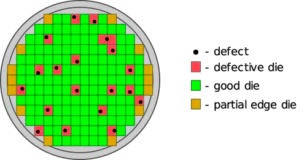](https://substackcdn.com/image/fetch/$s_!fda-!,f_auto,q_auto:good,fl_progressive:steep/https%3A%2F%2Fsubstack-post-media.s3.amazonaws.com%2Fpublic%2Fimages%2Fed62b01b-00e0-44ae-b52d-81f840a8a372_500x261.png)

No one can ever get close to 100% yield; it’s always somewhere between 50% to a hundred percent.

But wait a minute! Wait a minute. Cerebras is making its chip an entire wafer. If you can never get a hundred percent yield, doesn’t that mean that Cerebras can never get a functional wafer-scale engine? Every single wafer is guaranteed to have at least one defect!

Not at all. Cerebras did a very clever thing where they built in an extra redundant communication pathways between the cores. If they find that a portion of the wafer, a certain die, has a defect, the compiler simply routes around it. This is how Cerebras claims a 100% yield rate on their Wafer-Scale Engines.

[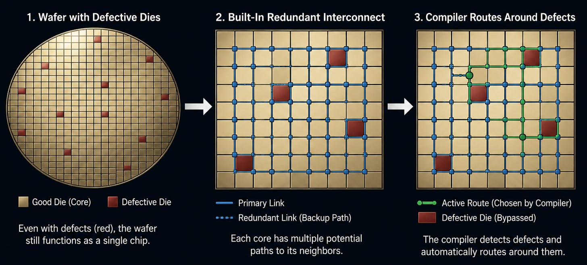](https://substackcdn.com/image/fetch/$s_!oE39!,f_auto,q_auto:good,fl_progressive:steep/https%3A%2F%2Fsubstack-post-media.s3.amazonaws.com%2Fpublic%2Fimages%2F842223e7-84e0-4428-b923-5d7032579618_2272x1028.png)

## PVT Calibration

PVT stands for process, voltage, and temperature variation.

Semiconductor fabrication is a highly chemical process. All the etching and depositing and stuff are all done through chemical reactions, even though in diagrams it may FEEL physical.

Because these processes are all chemical, they are never fully uniform across the entire dinner plate. Transistors near the edge may end up switching faster or running slightly hotter than the same transistors located closer to the middle.

Normally, this wouldn’t matter for a traditional GPU because the dies are cut up anyways. But for Cerebras, it becomes a problem because the entire Wafer-Scale Engine needs to be fully synchronized.

This is the exact problem that caused the industry to abandon wafer-scale computing decades ago. If you’re required to clock the speed of the entire Wafer-Scale Engine chip to the speed of the slowest transistors, the performance would be atrocious.

Cerebras, however, developed a system to dynamically recalibrate the entire wafer on the fly. They detect the temperature and voltage and frequency characteristics of every part of the wafer and then actively manage the power delivery accordingly. Basically, every single core gets exactly what they need.

[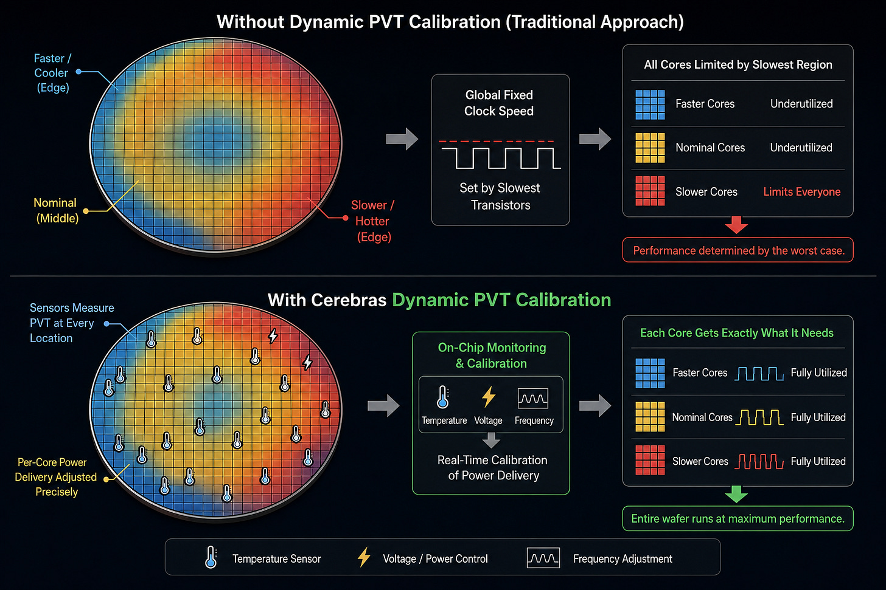](https://substackcdn.com/image/fetch/$s_!ibUb!,f_auto,q_auto:good,fl_progressive:steep/https%3A%2F%2Fsubstack-post-media.s3.amazonaws.com%2Fpublic%2Fimages%2F4cf8ea51-1ab5-4d9f-a330-539b2bce5f53_1536x1024.png)

This is by far one of their most important innovations. PVT calibration is a real moat for Cerebras and represents an enormous barrier to entry for Wafer-Scale competitors.

## Fast Inference (Tensor vs Pipeline Parallelism)

This is our main course today. Tensor vs Pipeline Parallelism is the single trick up their sleeve which allows them to perform their main value proposition to the market: fast inference.

#### Tensor Parallelism

Let’s think about how a standard GPU runs inference, called tensor parallelism. Usually, the model weights are too much to fit inside of the GPU’s SRAM. It has to be chopped up and processed by multiple GPUs in parallel.

[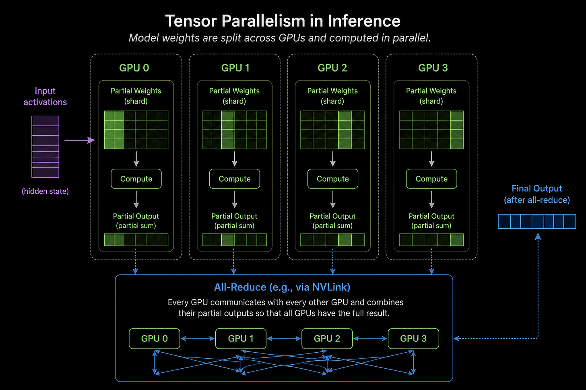](https://substackcdn.com/image/fetch/$s_!cSAr!,f_auto,q_auto:good,fl_progressive:steep/https%3A%2F%2Fsubstack-post-media.s3.amazonaws.com%2Fpublic%2Fimages%2F2a440f0d-afb1-474a-a981-dba7a8ab6a14_1536x1024.png)

Once the separate GPUs are done, they have to share their answers via an all-reduce, where every GPU has to talk to all others. This generally happens within the same NVLink scale-up domain so we’re talking about microseconds of latency, which doesn’t sound that bad, but there are two things that actually make it pretty problematic for fast inference.

First is that this all reduce must happen for every single token the model generates as decode is sequential.

Secondly, not only does it have to happen for every token, it has to happen for every layer of the model. Transformers are made up of many attention and multi-layer perceptron layers.

[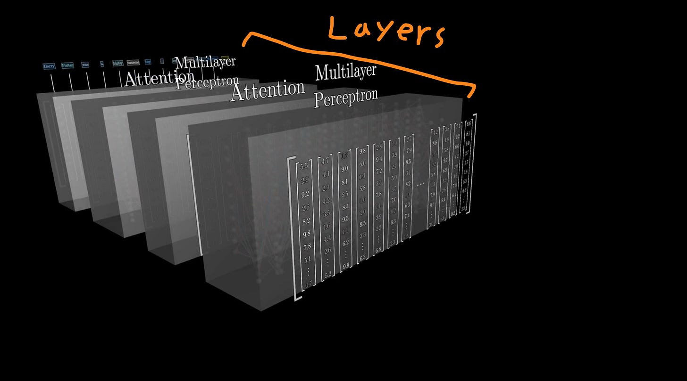](https://substackcdn.com/image/fetch/$s_!iy_c!,f_auto,q_auto:good,fl_progressive:steep/https%3A%2F%2Fsubstack-post-media.s3.amazonaws.com%2Fpublic%2Fimages%2F7a7c57b5-3d4e-4a7f-9639-b29786feb75c_2672x1484.png)

source: 3blue1brown

So for a 100-layer model, every token generated requires 100 all-reduce operations across the tensor parallelism group. If you have a lot of tokens, that’s a lot of latency!

There is also a separate latency bottleneck caused by HBM. Each time you generate a token, you have to load the model weights from the HBM to the compute. This is completely separate from the all-reduce and the tensor parallelism approach we just discussed, but is another reason why Cerebras is able to absolutely speedmog Blackwell.

[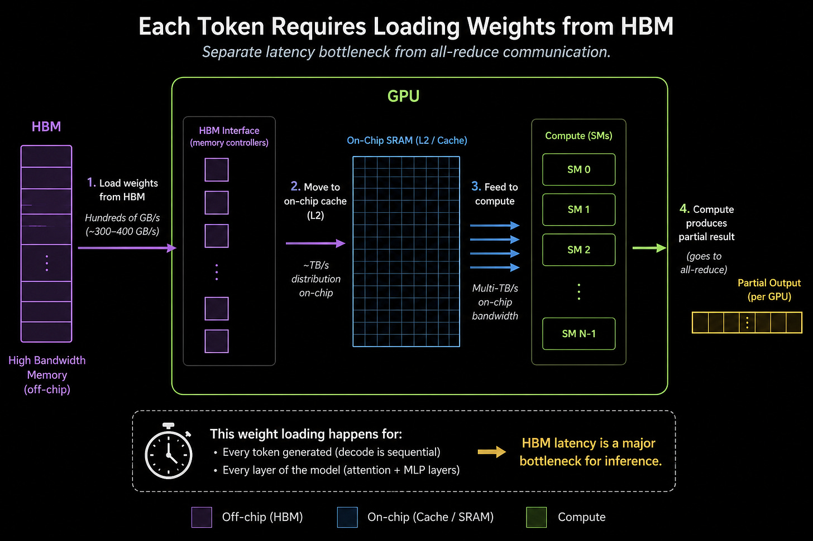](https://substackcdn.com/image/fetch/$s_!K2bU!,f_auto,q_auto:good,fl_progressive:steep/https%3A%2F%2Fsubstack-post-media.s3.amazonaws.com%2Fpublic%2Fimages%2F031274ad-a4f9-4dc3-a25a-eb6a1b7aa8cc_1536x1024.png)

All in all, several microseconds of latency per token results in the general hundreds of tokens per second achieved by regular normal GPUs.

#### Pipeline Parallelism

Pipeline parallelism is like a pipeline.

Like I said the model is made up of a bunch of layers. Each time you do the math of one layer, you get an activation output, which you pass downstream of the pipeline to the next layer.

Now here’s where Cerebras comes in. Cerebras has a big ahh chip. Whereas GPUs cannot fit entire layers of a model on their SRAM, Cerebras can. Therefore, when Cerebras does matrix math, it does not need to run an all-reduce operation to combine the answers for different slices of the model layers. It also doesn’t need the HBM. All the communication happens on-chip, and on-chip communication is very speedy.

[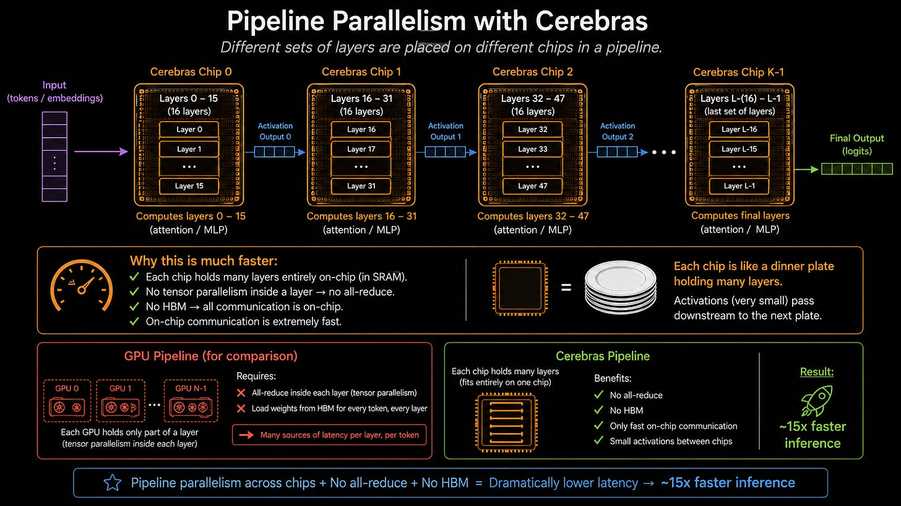](https://substackcdn.com/image/fetch/$s_!fFp9!,f_auto,q_auto:good,fl_progressive:steep/https%3A%2F%2Fsubstack-post-media.s3.amazonaws.com%2Fpublic%2Fimages%2F8a4511b3-b943-4110-9ea0-15397d44cd23_1672x941.png)

Notice I say model layers and not model. This is important. Cerebras doesn’t put the entire model on one chip. It’s still not big enough to do that. It simply strings a whole bunch of dinner plates together, with each one processing many layers, getting the activation outputs and passing that downstream to the next set of layers. Cerebras has major IO bandwidth bottlenecks (which we’ll talk about later), but that is not an issue here because the activation outputs are very small.

The result? Data literally flows down the wafers like water through a river. Smooth, buttery, and unbothered. **15 times faster inference by cutting out the all-reduce and HBM communication latency.**

## Memory Constraints

Remember when I told you they have 48 KB of SRAM per compute core, which is 44 GB per dinner plate? Well, turns out this is not nearly enough to do anything useful in the world of frontier models.

To serve a model, you must fit both the weights and the KV cache (context) into the SRAM. 44 GB isn’t even enough for most models’ weights; and the KV cache is way larger too. To fit a classic open source model, like one of the smaller, dumber Llama ones or the more important DeepSeek V4, you will need a single-digit number of dinner plates to hold the weights and a double-digit number of dinner plates to hold the KV cache.

Because each dinner plate has so little memory but yet is so expensive, this makes serving models using Cerebras very, very capital inefficient.

## The I/O Bandwidth Problem

Now you might be asking, why don’t we just offload the KV cache to HBM outside of the wafer?

Funny enough, the picture of the chip itself should hand you an obvious clue.

[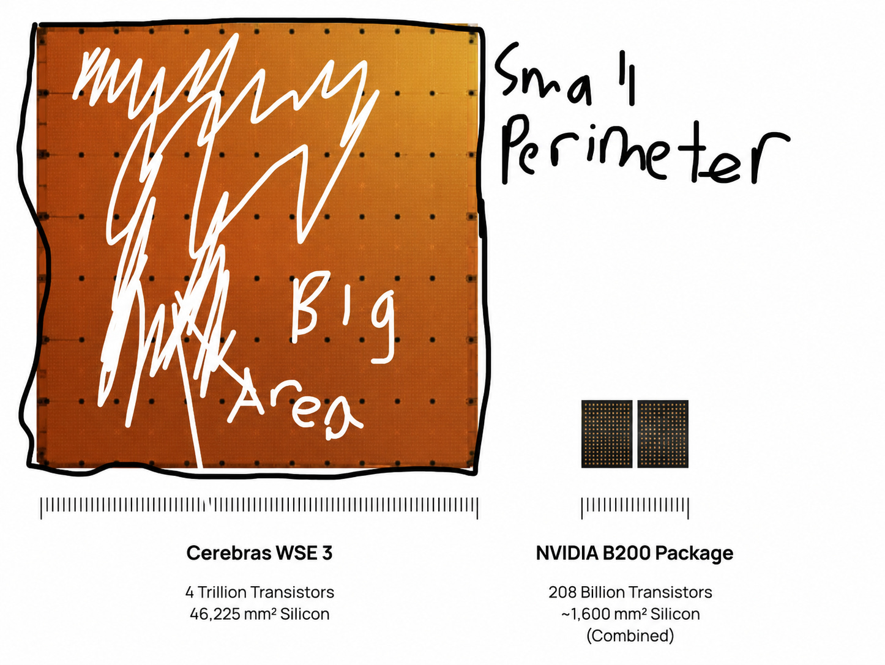](https://substackcdn.com/image/fetch/$s_!IhLy!,f_auto,q_auto:good,fl_progressive:steep/https%3A%2F%2Fsubstack-post-media.s3.amazonaws.com%2Fpublic%2Fimages%2F861364d4-d580-4fdf-ab38-5a6767a8321f_1446x1087.png)

BIG AREA SMALL PERIMETER

The off-chip bandwidth is 1.2 terabits per second, compared to 21 petabits per second for internal bandwidth. That means that data within the chip travels more than ten thousand times faster than data going off the chip.

Beyond that, it also does not compare favorably to GPUs. For the B200 as an example, it has 14.4 terabits per second, which is over 10 times that of the WSE-3. This is like having a massive Olympic-sized swimming pool, but the only physical way to fill it or drain it is by sucking the water through a single, thin plastic drinking straw.

[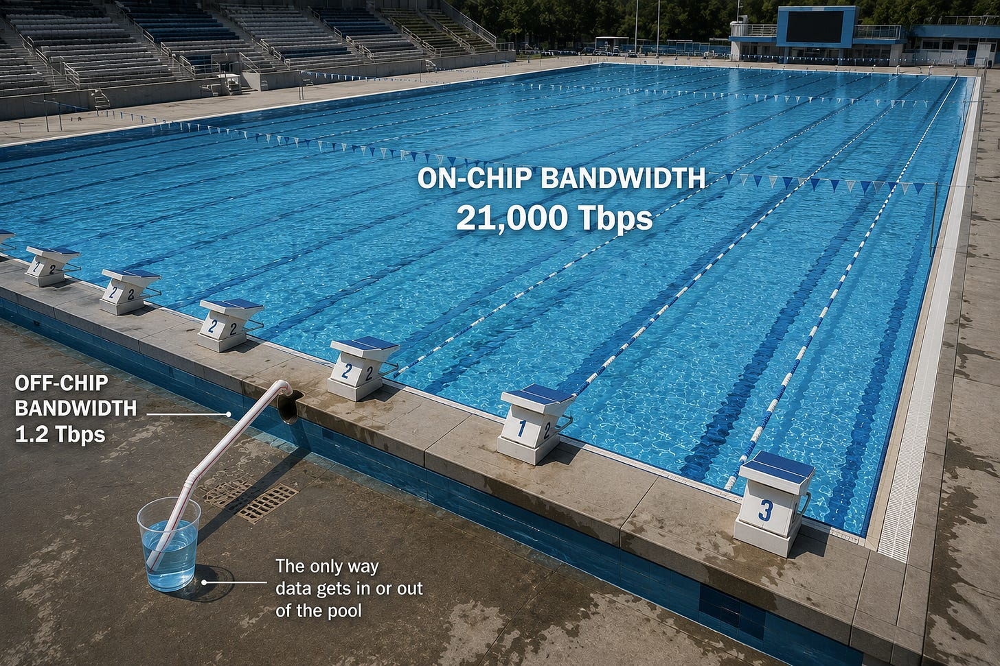](https://substackcdn.com/image/fetch/$s_!P_Wj!,f_auto,q_auto:good,fl_progressive:steep/https%3A%2F%2Fsubstack-post-media.s3.amazonaws.com%2Fpublic%2Fimages%2Fe42dcdef-1756-4901-ae6e-6dd865098f20_1536x1024.png)

This is also a major reason why their hardware failed in training. Training requires data to be constantly passed from on-WSE to external memory which it absolutely does not have the I/O bandwidth for. This is intuitive, as you can imagine the WSE’s job in training would be to mimic a massive, optically linked GPU cluster while in inference, it only needs to imitate a few servers or a rack.

But the important conclusion here is that there is no escape: both the weights and the KV cache must be held by the on-chip SRAM at all times.

## The Economically Relevant Conclusion

We have reached the end. What does this all mean?

Well, think about what we’ve covered.

1. We’ve established that the WSE is a fundamentally different architecture than the GPU. It requires an incredibly complex compiler, redundant communication pathways, and PVT calibration. It is very, very different.
2. We explored what makes this very different chip better via pipeline parallelism, a feature that allows Cerebras to run inference over 15 times faster than traditional GPUs by avoiding the all-reduce and HBM latency.
3. We looked at what makes this very different chip worse, namely the suffocating memory constraints and tiny I/O bandwidth.

Notice something here: the advantages are about speed and quality of the experience of the user being served by the chip, while the drawbacks are all measured in number of bits and are about the sheer cost and economic unattractiveness of such quality service.

This leads us to our conclusion. What makes this chip better is that it generates tokens faster, but what makes it worse is that it is far more expensive to generate each token. **Cerebras and wafer-scale computing in general is a provider of fast, premium-priced tokens.**

The business side of this company is all about exploring whether such speed is worth the extra cost. Are people actually willing to pay for such expensive but fast tokens? Will this type of token take share from the traditional NVIDIA-generated kind? Are there new use cases that require this type of token that we haven’t been able to unlock yet because the hardware didn’t exist, or is the current regime already good enough for all of our uses of AI?

Let’s find out together tomorrow.