*This is the most important piece TSCS has published. If you find it valuable, share it with someone who needs to read it. If you’re not yet a subscriber, you can join [here](https://tscsw.substack.com/subscribe).*

---

**A Letter to the Gold Bug Who’s Panicking**

You bought gold because you thought the world might break. The world is breaking. Gold is down $1,000. I know what you’re feeling right now because I’m feeling it too. I’ve spent the better part of a year building a thesis around precious metals, publishing research, putting numbers on it, arguing the case to institutional readers who manage real money.

I have skin in this game. Watching a thousand dollars an ounce evaporate in three weeks while the world validates every single reason I owned it in the first place is not academic. I'm not writing this from a detached analytical perch.

I’m writing it because I owe you an honest explanation, and because the explanation, once you see it, changes everything about how you should think about the next six months. Gold is not failing. Gold is being used. There’s a difference, and it is the entire difference.

[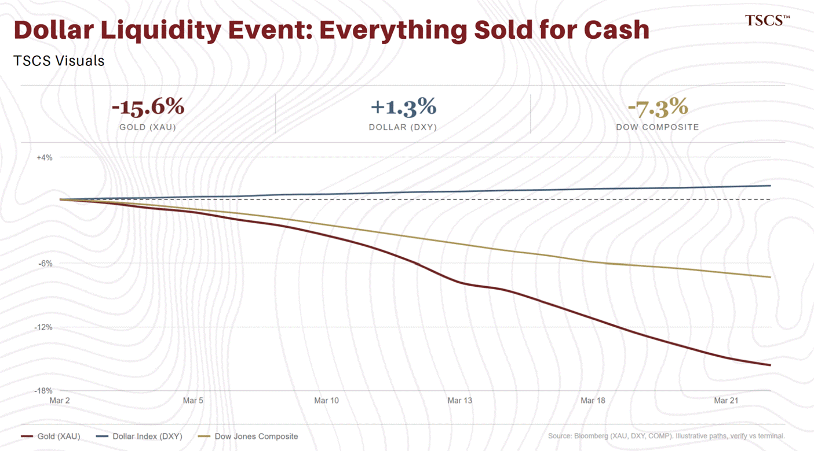](https://substackcdn.com/image/fetch/$s_!_HZ2!,f_auto,q_auto:good,fl_progressive:steep/https%3A%2F%2Fsubstack-post-media.s3.amazonaws.com%2Fpublic%2Fimages%2F74baa8cf-fb68-4909-8fa4-14240773f101_1405x780.png)

[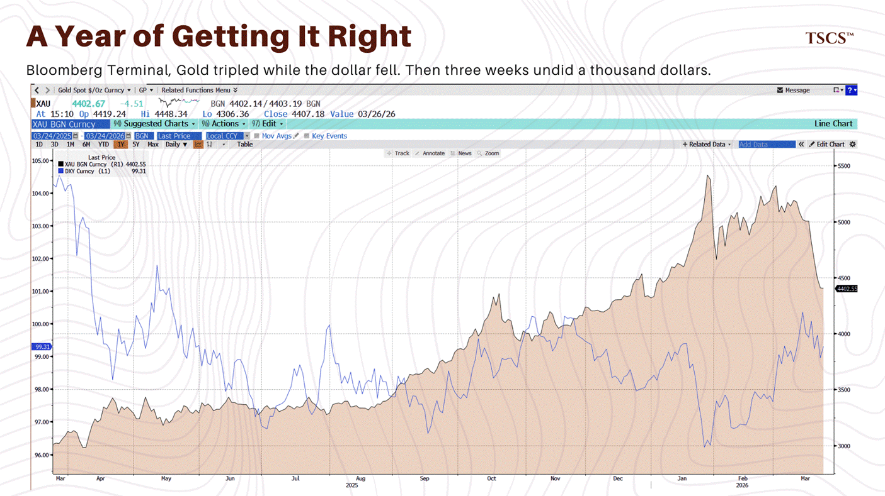](https://substackcdn.com/image/fetch/$s_!N61q!,f_auto,q_auto:good,fl_progressive:steep/https%3A%2F%2Fsubstack-post-media.s3.amazonaws.com%2Fpublic%2Fimages%2F68164d31-a5be-4dea-a49b-1ef378efbe1c_1405x789.png)

You think you’re watching a thesis collapse. You’re not. You’re watching a thesis activate. Let me show you something. Here’s gold, the dollar index, and the Dow Jones Composite, all normalised to zero from March 2nd.

[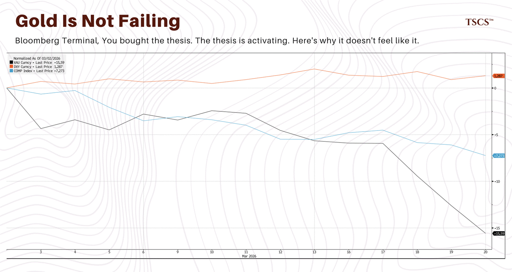](https://substackcdn.com/image/fetch/$s_!az5j!,f_auto,q_auto:good,fl_progressive:steep/https%3A%2F%2Fsubstack-post-media.s3.amazonaws.com%2Fpublic%2Fimages%2Fa3a41dbc-d02a-43cd-b98f-cf06934a23cc_1406x748.png)

[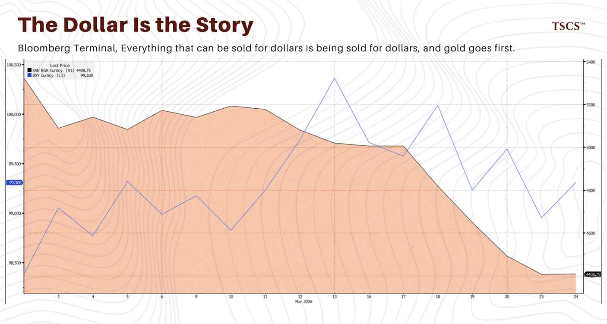](https://substackcdn.com/image/fetch/$s_!LAfJ!,f_auto,q_auto:good,fl_progressive:steep/https%3A%2F%2Fsubstack-post-media.s3.amazonaws.com%2Fpublic%2Fimages%2F429b8737-446f-4f87-8348-17bde123244d_1406x751.png)

Gold down 15.6%. The dollar up 1.3%. Equities down 7%. Everything is falling except the dollar. Gold and stocks are selling off together while the dollar catches a bid. If you’ve traded macro for any length of time, you recognise this pattern instantly.

The market has not decided the geopolitical risk premium was overdone. Nothing about gold's fundamental value has changed.

This is a dollar liquidity event. Everything that can be sold for dollars is being sold for dollars, and gold, because it is the most liquid unencumbered reserve asset on earth, carrying no counterparty risk and no sovereign issuer risk, is being sold alongside everything else.

As James Aitken of Aitken Advisors noted on The Grant Williams Podcast this week, gold is the near-term “getaway car” for entities raising cash. Not a macro trade. A liquidity trade. The entities that accumulated gold over the past three years are now using it for exactly the purpose they bought it for.

The question is: who needs dollars this badly, and why?

Here’s your answer.

[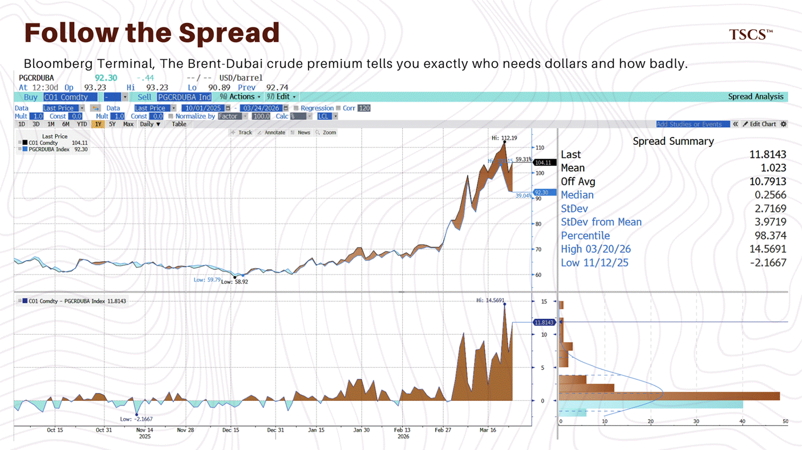](https://substackcdn.com/image/fetch/$s_!7JmC!,f_auto,q_auto:good,fl_progressive:steep/https%3A%2F%2Fsubstack-post-media.s3.amazonaws.com%2Fpublic%2Fimages%2Fcc42674e-8688-44b3-b6cf-e921ef96714c_1406x789.png)

This is the spread between Brent crude and Dubai crude. In normal times, the difference is about a dollar. As of last week, it hit $14.57.

[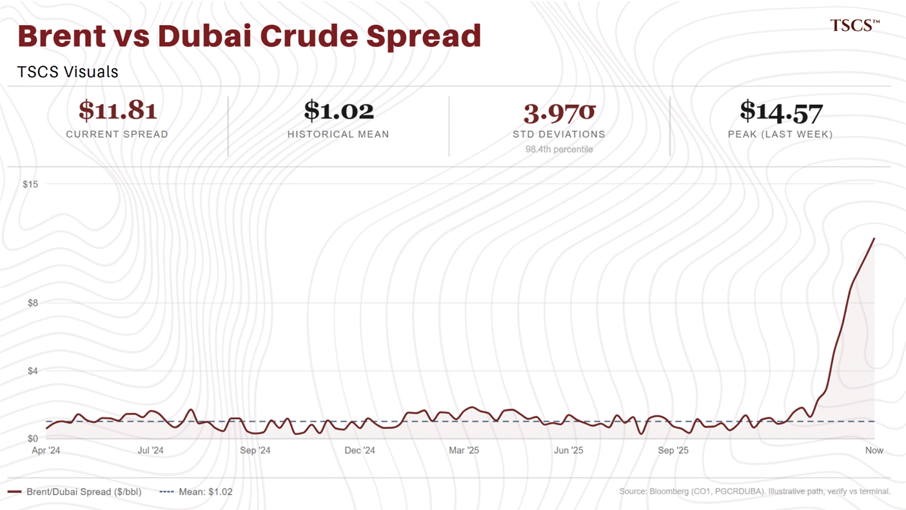](https://substackcdn.com/image/fetch/$s_!mJtr!,f_auto,q_auto:good,fl_progressive:steep/https%3A%2F%2Fsubstack-post-media.s3.amazonaws.com%2Fpublic%2Fimages%2F6be93b4a-7a74-45bd-b68e-76f167f0824e_1405x792.png)

It’s sitting at nearly $12 today. That’s the 98th percentile of its entire historical range, almost four standard deviations from the mean.

What does this chart actually measure?

It measures the premium the world is willing to pay for a barrel of oil that can actually move versus a barrel that is trapped behind a closed strait. Brent is sourced from the North Sea. It doesn’t transit Hormuz. Dubai crude does. So when Hormuz is functionally closed, buyers who need physical oil right now will pay almost anything for barrels that can reach them. The premium for accessibility over geography has exploded from $1 to $12 in a matter of weeks. Now think about what this means for every country east of Suez that depends on Gulf crude and refined product.

Saudi Arabia itself retains partial export capacity through the East-West Pipeline to Yanbu on the Red Sea, bypassing Hormuz entirely, with roughly 5 million barrels per day of capacity. A Hormuz closure does not zero Saudi revenues, but it cuts effective export capacity by an estimated 25-50%, a severe fiscal shock for an economy running deficits and funding Vision 2030. For everyone else east of Suez, the picture is worse.

Japan, South Korea, India, Thailand, the Philippines. Their energy import bill hasn’t just risen. It has become an emergency.

They need to source alternative supply from the US Gulf Coast, from West Africa, from whoever has available cargoes, ships, and insurance. All of that is priced in dollars. All of it demands immediate settlement.

If you are the central bank of one of these countries, and you spent the last three years diligently accumulating gold as part of a reserve diversification strategy, and you now face a tripled energy import bill that threatens your economy’s ability to function, the motive to sell gold is obvious.

Here is what we can actually see.

The visible selling is speculative. The Commitment of Traders report for gold futures shows non-commercial (speculative) net longs declining by 3,263 contracts on the week, with shorts building by 3,779.

[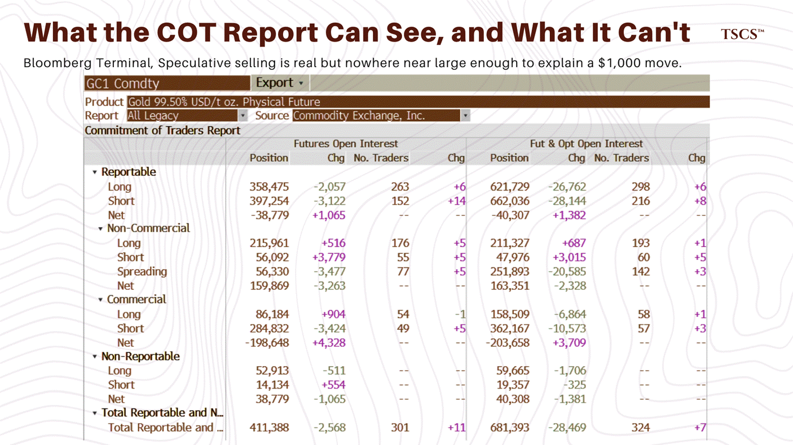](https://substackcdn.com/image/fetch/$s_!qd5O!,f_auto,q_auto:good,fl_progressive:steep/https%3A%2F%2Fsubstack-post-media.s3.amazonaws.com%2Fpublic%2Fimages%2Fd589fb3e-b384-4eaa-b97c-32bf1c052e38_1406x789.png)

The options market at $5,400 gold is a different animal from the options market at $2,000 gold. When price breaks through a concentrated put strike, dealers who are short those puts sell futures to delta-hedge. That selling pushes price into the next strike, which triggers more hedging, which pushes price further. A mechanical cascade that does not care about your thesis or mine. The COT report captures net positioning. It does not tell you how much of the gross flow underneath is gamma hedging versus directional conviction. At this price level, the gamma component is not a footnote. It is a primary mover.

Layer on the CTAs. Every systematic trend-follower that built a long on the way from $1,800 to $5,400 has a stop-loss somewhere below. When those levels break, the models do not deliberate. They sell. Some flip short. This flow is large, mechanical, and mostly invisible in the weekly net figures.

There is also a plausible sovereign component. Central banks do not transact on COMEX. They operate OTC, primarily through the LBMA. The entities with the motive, acute dollar needs from tripled energy import bills, and the means, large gold reserves accumulated since 2022, are sovereign reserve managers.

The data constrains this more than I initially suggested, though, and precision matters here.

If sovereigns were dumping at massive scale through LBMA market-makers, those dealers would hedge by shorting COMEX futures. Commercial short positioning would spike. It has not.

Hedgers have actually covered slightly, reducing net shorts by 4,328 contracts. That is not what a tidal wave of sovereign metal looks like on the other side of the trade. Bilateral sovereign-to-sovereign transfers would bypass LBMA dealers entirely and leave no COMEX fingerprint, so the thesis is not dead. But the scale is probably smaller and more concentrated than the worst-case reading implies.

The honest decomposition: CTA and momentum unwind is the largest flow. Options gamma amplifies it. Retail capitulation adds a secondary wave. Sovereign OTC selling, if occurring, is a contributing factor at the margin. The combined effect is sufficient to explain a thousand dollars from a structurally bid market. Whether the split is 80/20 mechanical-to-sovereign or 95/5, the conclusion is the same: gold is being liquidated, not repriced. That distinction matters for how fast it recovers, not whether.

Where you draw the line between evidence and inference here matters for how you position around it.

---

*If this analysis is useful to you, consider subscribing to TSCS. Much of our work, including the research that built the thesis now being stress-tested, is available to paid subscribers.*

Upgrade to paid

---

If I am right, the forced selling is finite. Every ounce sold by a sovereign in crisis is an ounce that will need to be repurchased once the acute phase passes. The structural accumulation thesis does not end because gold gets used for the purpose it was accumulated for. It gets reinforced.

But there’s a dimension to this crisis that makes the dollar scramble potentially longer and more painful than you might assume from crude spreads alone: refined products. Crude can be rerouted. It takes longer, it costs more, but barrels eventually find buyers. Refined product is a different problem entirely.

Diesel, gasoline, LPG, jet fuel: these require refining infrastructure, which is concentrated in the Gulf, and logistics chains, which are now shattered. Ships are out of position around the world. Insurance markets have seized. Even after a ceasefire, even after the first tanker transits Hormuz again, the refined product market will take months to re-equilibrate. Infrastructure that has been taken offline does not come back at the flick of a switch.

This matters because the dollar demand driving gold lower is not primarily about crude oil. It is about refined products. Countries east of Suez are not just scrambling for barrels. They are scrambling for usable fuel, the kind that goes into trucks, planes, generators, and agricultural machinery.

That scramble is priced in dollars, settled immediately, and it will persist well after crude markets begin to normalise. If you are watching the Brent-Dubai spread as your signal for when forced selling ends, and you should be, understand that it is an imperfect proxy. The crude spread may compress before the refined product crisis eases. The better signal for the refined product tail is the Singapore gasoil crack spread: the premium that Asian refiners and importers pay for a barrel of refined diesel over crude. In normal markets, it trades in a relatively stable band. When the logistics of refined product delivery break, it spikes. Watch it alongside the Brent-Dubai spread. When both compress together, the acute phase is genuinely over. When only the crude spread compresses, you are seeing the easy part of the normalisation, not the hard part.

The stress on energy-importing nations is visible across Gulf credit markets too.

[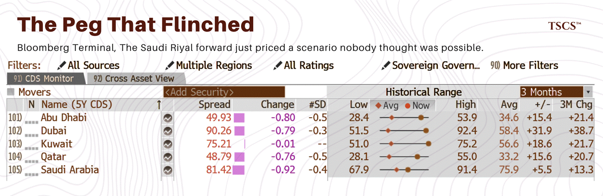](https://substackcdn.com/image/fetch/$s_!wV4i!,f_auto,q_auto:good,fl_progressive:steep/https%3A%2F%2Fsubstack-post-media.s3.amazonaws.com%2Fpublic%2Fimages%2Fd8e01732-cfab-4d39-abd0-c1a67999fc1e_1405x459.png)

Dubai’s five-year credit default swap is up 39% in three months. Qatar up 21%. Saudi Arabia, Kuwait, all at or near their recent highs. Even Bahrain, already deep in high-yield territory, has seen further widening. Gulf sovereign credit, repriced across the ratings spectrum.

Here is the chart that tells you this is not a normal selloff.

[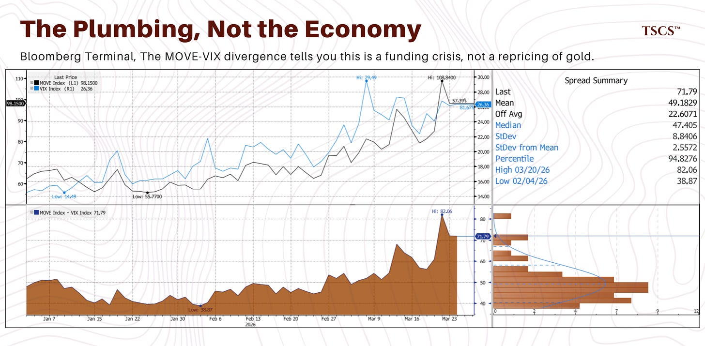](https://substackcdn.com/image/fetch/$s_!S_kK!,f_auto,q_auto:good,fl_progressive:steep/https%3A%2F%2Fsubstack-post-media.s3.amazonaws.com%2Fpublic%2Fimages%2F274773c0-6152-48e1-b76e-f4ed1c40ef3d_2024x994.png)

The MOVE Index measures implied volatility in the US Treasury market. The VIX measures implied volatility in equities. They are not denominated in the same units, so the raw difference between them is not a traditional spread.

But the time series of that differential has a stable distribution, and the current reading sits at the 94.8th percentile of its historical range, 2.56 standard deviations from the mean. In a normal risk-off event, they move together. When the world panics, everything panics.

That is not what is happening. The MOVE is at 98, near its recent high. The VIX is at 26, elevated but nowhere close to crisis levels.

What does this divergence tell you? It tells you the stress is in the plumbing, not in the economy. The rates market, the funding market, the market for dollars, is under severe pressure. The equity market is not. This is a liquidity crisis that has not yet become a solvency crisis. And liquidity crises, by their nature, resolve faster than solvency crises, because they respond to policy intervention in a way that structural damage does not.

This matters for gold because it reframes the entire drawdown. If gold were falling because the market had decided the geopolitical risk premium was overpriced, you would see the VIX falling too. Risk-off unwind, premium compression, everything normalising together.

Instead, gold is falling while rates volatility runs well above its historical norm, which means gold is being converted into the thing the rates market is pricing stress around: dollars.

The MOVE-VIX divergence is, in my view, the single cleanest piece of evidence that the gold selloff is a dollar liquidity event, not a repricing of gold’s fundamental value. When it compresses, either because the MOVE falls or the VIX rises, the forced selling pressure on gold abates.

Here’s the part you forgot, or maybe chose to forget.

[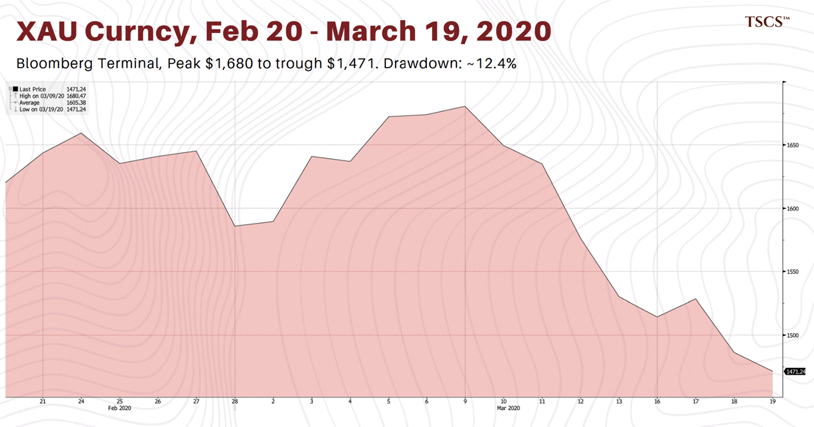](https://substackcdn.com/image/fetch/$s_!Bvkt!,f_auto,q_auto:good,fl_progressive:steep/https%3A%2F%2Fsubstack-post-media.s3.amazonaws.com%2Fpublic%2Fimages%2Fdc291eaf-de58-472e-9337-e4a1f5b1476d_1405x738.png)

COVID. The world literally stopped. Every government locked its citizens indoors. Supply chains collapsed. Mortality was rising exponentially. And gold, your safe haven, the thing that was supposed to save you when everything else fell apart, dropped 12% in four weeks. Same mechanism. Everyone needed cash. Margin calls, redemptions, dollar funding stress, the plumbing seizing up. Gold was the getaway car then too. It recovered. Of course it recovered.

Once the Fed launched its emergency response and dollar liquidity normalised, gold ripped to new all-time highs. The people who panicked and sold the bottom in March 2020 missed one of the great moves in the history of the metal. The current drawdown, roughly 18-19% from $5,400 to $4,400, is materially larger than COVID’s. That tells you the forced sellers this time are more desperate. Nations facing energy emergencies are more motivated sellers than hedge funds facing margin calls. But the mechanism is identical, and there is no reason to believe the outcome will be different once the acute liquidity crisis passes.

The analogy breaks in places, though, and the breaks matter most for how you position from here.

The COVID drawdown resolved because of a specific, identifiable mechanism: the Federal Reserve opened emergency dollar swap lines with fourteen central banks, expanded repo operations to functionally unlimited capacity, and restarted quantitative easing at a pace that dwarfed anything prior. The plumbing seized. The Fed flooded it. The seizure ended. Gold ripped.

What is the equivalent mechanism now?

A ceasefire does not inject dollar liquidity into the system. It removes the source of demand for dollars, which is a different thing. In March 2020, the Fed actively pushed dollars into the global financial system. In a Hormuz resolution, you are passively removing the pull. The distinction matters because passive removal is slower. Contracts already signed at crisis premiums still need to settle. Ships already rerouted still need to complete their voyages. Insurance claims still need to process. The dollar demand does not snap off the way a swap line snaps on.

There is a second problem. In 2020, the Fed was saving its own plumbing. The stress was in American repo markets, American commercial paper, American money market funds. The Fed had direct authority and direct incentive to act. In this crisis, the entities most desperate for dollars are Asian and Gulf central banks.

The Fed has a standing swap arrangement with the Bank of Japan through the C6 network, and has extended temporary bilateral facilities to South Korea in prior crises. But extending emergency dollar liquidity to India, Thailand, the Philippines, or the Gulf states requires political will that is not guaranteed in the current administration.

The Fed’s willingness to act as the world’s dollar lender of last resort is a policy variable, not a constant. Do not assume it.

[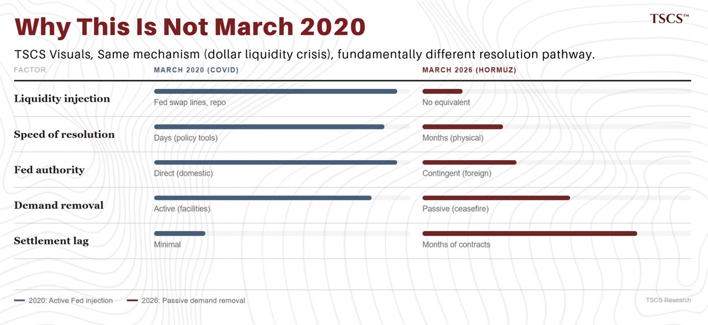](https://substackcdn.com/image/fetch/$s_!CImm!,f_auto,q_auto:good,fl_progressive:steep/https%3A%2F%2Fsubstack-post-media.s3.amazonaws.com%2Fpublic%2Fimages%2F214f0ca5-9562-4372-b999-76824d58c8bb_1405x645.png)

There is an important piece of plumbing that partially mitigates this: the Fed’s FIMA Repo Facility, established in 2020 and made permanent in 2021, allows foreign central banks to pledge US Treasuries overnight in exchange for immediate dollar liquidity without requiring bilateral negotiation or special political authorization. This is the first line of defense, and it is substantial. Asian and Gulf central banks collectively hold trillions in US sovereign debt that is FIMA-eligible.

But FIMA capacity is bounded by a country’s Treasury holdings, and the central banks most acutely exposed, those that rotated reserves most aggressively from Treasuries into gold over the past three years, have by definition a thinner FIMA-eligible collateral buffer.

FIMA is overnight repo. It provides short-term liquidity, not structural funding. Rolling it is mechanically simple. But it does not eliminate the underlying dollar shortfall, it defers it. If the energy import bill remains elevated for weeks or months, the central bank is not solving the problem, it is borrowing against its Treasury holdings to postpone it.

At the margin, selling reserve assets outright may be preferable to progressive encumbrance of the sovereign’s best collateral.

So the honest version of the COVID comparison is this: the mechanism is the same, but the resolution pathway is slower and less certain. The demand-side fix (ceasefire) does not directly address the liquidity shortage the way Fed facilities did.

The Fed’s role as global lender of last resort is politically contingent. And the refined product tail I described earlier means dollar demand persists even after headline crude normalises. If you are using March 2020 as your mental model for how fast gold recovers, adjust your expectations. The snap will not be as clean.

There is one more thing the COVID analog obscures, and it matters: gold at $5,400 is not structurally the same market as gold at $1,680.

The ETF complex has grown enormously in dollar terms, though not proportionally in physical tonnage. At $5,400/oz, total ETF holdings represent fewer physical ounces than the same dollar AUM would have at $1,680. A 5% redemption today moves fewer bars than it would have six years ago.

But the dollar value of that redemption is substantially larger, and what matters for price impact is not raw tonnage but the ratio of dollar-flow to available bid-side liquidity. If the sovereign accumulators who provided the marginal bid for three years have switched to the sell side, the market’s capacity to absorb even a modest tonnage outflow is diminished. Smaller physical selling can produce larger price impact in a thinner market.

The options market has scaled with the price. Put skew, dealer gamma exposure, the hedging flows that kick in when strikes get breached, all of these create non-linear selling pressure on the way down that simply did not exist at the same magnitude six years ago. When dealers are short puts at $5,000 and the price breaks through, they sell futures to hedge. That mechanical selling amplifies the drawdown in a way that is proportional to the size of the options market, which is materially larger than it was in 2020.

And the run from $1,800 to $5,400 attracted a cohort of retail buyers who have never sat through a 20% drawdown in gold. They bought the narrative, they rode the momentum, and they have no institutional framework for distinguishing a liquidity-driven forced sale from a thesis failure. If they capitulate, and watch GLD outflows for evidence of this, it adds a secondary selling wave that did not exist in the 2020 analog.

All of which sounds bearish. The structural change cuts the other direction too, though, and this is important.

The central bank accumulation since 2022 has fundamentally changed who owns gold. In 2020, the marginal seller in a liquidation was a hedge fund facing margin calls or an ETF processing redemptions. In 2026, the marginal seller is a sovereign. Sovereigns sell differently: larger blocks, OTC, less price-sensitive on timing, but concentrated in impact. The selling is lumpy, not continuous.

And when the last distressed sovereign finishes liquidating, the bid does not fade gradually back in. It snaps. The continuous drip of forced selling disappears all at once, and the market reprices the absence of supply faster than it repriced its arrival. But a sharp bottom is not the same thing as a sharp recovery. The dollar demand I described earlier, refined products, no Fed backstop, settlement lags, persists after the selling stops. The shape you should expect is a hard floor followed by a slow grind, not a V.

[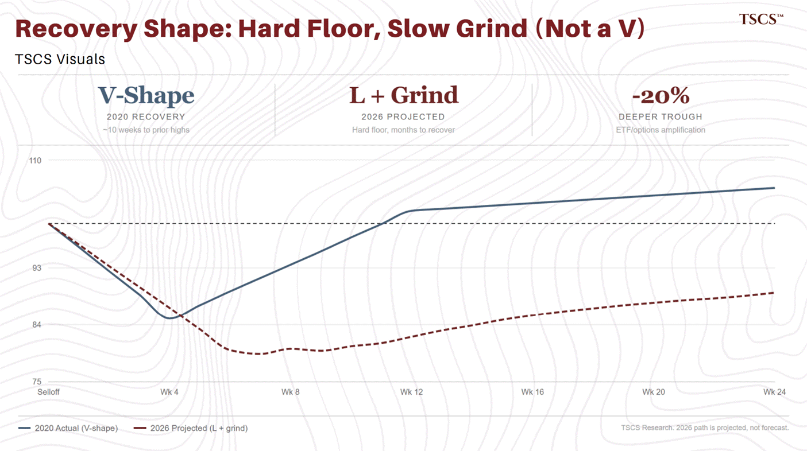](https://substackcdn.com/image/fetch/$s_!b68d!,f_auto,q_auto:good,fl_progressive:steep/https%3A%2F%2Fsubstack-post-media.s3.amazonaws.com%2Fpublic%2Fimages%2F4a2fe506-7dc1-467e-93b8-97781a8acd81_1405x786.png)

The net of this is that gold at $5,400 is a more volatile instrument in both directions than gold at $1,680 was. The mechanical selling pressure, ETF flows, options hedging, retail capitulation, is larger, which means the overshoot to the downside could be deeper than the COVID analog suggests. But the recovery, once sovereign forced selling exhausts itself, could be sharper, precisely because the selling is concentrated rather than distributed.

Do not use March 2020 as a template. Use it as a reference point, then adjust for the fact that the market you own today is bigger, more leveraged to momentum, and dominated by a different class of holder than the market that bottomed six years ago. The mechanism is the same. The math is not.

[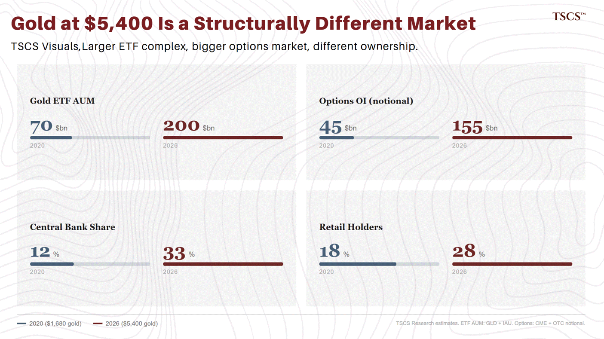](https://substackcdn.com/image/fetch/$s_!kjul!,f_auto,q_auto:good,fl_progressive:steep/https%3A%2F%2Fsubstack-post-media.s3.amazonaws.com%2Fpublic%2Fimages%2Fe2411bd4-3f4a-4b01-98b6-4a782dbe0075_1405x789.png)

So here is what I think is most likely happening, stated plainly, with the caveat that I could be wrong and will explain the scenario where I am. The gold bull market that began in 2022 has probably not ended. But it has changed character in the last three weeks.

What started as a broad accumulation trade, central banks diversifying, institutions chasing momentum, retail following the narrative, is now being stress-tested by something the accumulation thesis always implied but never priced: what happens when the insurance gets used.

The National Bank of Poland, one of the world’s most persistent gold buyers for years, floated publicly last week that it might sell gold to fund defence spending. The Polish Prime Minister walked it back within hours.

The retraction was not purely about political optics. Under Article 123 of the Treaty on the Functioning of the European Union, EU central banks are prohibited from monetary financing of government deficits, which means the NBP cannot legally sell reserves to directly fund military expenditure. The idea was not just politically costly. It was, in its stated form, illegal.

But that makes the signal more interesting, not less. A senior official at a major EU central bank publicly floated an idea that violates treaty law. Either they did not know the legal constraint, which is alarming, or they knew and floated it anyway to test the political reaction, which tells you the pressure to monetise gold reserves is intense enough that sovereign policymakers are probing the boundaries of what is permissible. The retraction tells you the legal guardrails held. The fact that they needed to hold tells you something about the forces pushing against them.

This is actually a bull signal hiding inside a bearish anecdote. If sovereign gold selling is politically costly and operationally constrained, the volume of forced selling is likely smaller and more concentrated than the worst-case scenario implies. The pain is real, but it has limits imposed by political economy, not just by the size of the reserves.

There is something important to observe here beyond energy markets. Equities, broadly, have not panicked. Credit markets are hedging tails but not blowing out. The VIX is at 26, elevated but nowhere close to crisis territory. That is either because equity investors are rationally discounting a probable resolution, or because they have not yet caught up to the reality the bond market is already pricing.

I do not know which it is. Neither do the people managing significantly more money than I ever will.

What matters is that gold is selling off hard while rates volatility is elevated and equity volatility is not tells you something specific: none of this resembles a general risk-off event.

This is targeted, forced liquidation concentrated in the most liquid reserve asset. The mechanical selling, CTA unwind, gamma hedging, retail capitulation, is the dominant flow. But the environment driving it, acute dollar needs among energy-importing nations, is what distinguishes this from a normal positioning washout, and it is what determines whether the recovery is swift or slow.

That is a different animal from a broad de-risking, and historically, targeted forced selling resolves faster than systemic panic.

Every ounce sold today by a central bank in crisis is an ounce that will need to be repurchased once the crisis passes. That is the bull case for the next leg. But I need to be honest about the bear case too, because the bear case is not negligible. The scenario where I am wrong: If the Strait of Hormuz is not reopened in a meaningful way within two to three weeks, not months, weeks, the consequences for the global economy are not a slowdown. They are a sudden stop. You cannot move agriculture. You cannot move ships. You cannot run trucks. Consumption falls not gradually but to something approaching zero in the most affected economies. That is not stagflation. That is a disinflationary bust, and it would make the current gold drawdown look like a prelude.

In that scenario, gold does not recover quickly. It continues to fall because the forced sellers become more desperate, because central banks that held off selling are dragged into the liquidation by the sheer scale of the energy import bill, and because the dollar bid intensifies as the last functioning reserve currency absorbs global demand. The reflexive feedback loop, falling gold prices triggering more selling triggering further declines, is a real possibility, and I will not pretend otherwise.

I assign meaningful probability to this outcome. Not the base case, but not a tail risk either. Maybe one in four odds, possibly worse.

If I am wrong, the exit from this drawdown will be slower, deeper, and more painful than the COVID analog suggests, precisely because the forced sellers this time are sovereigns, not leveraged funds. Sovereigns do not face margin calls that can be met with a single repo operation. They face existential energy shortfalls that demand sustained dollar liquidity.

My base case, and I'd put it at slightly better than a coin flip, is that some form of de-escalation or ceasefire emerges within the next few weeks, whether driven by genuine diplomacy, by the pain trade forcing political hands, or by the mutual recognition that a closed Strait of Hormuz serves nobody’s interests for long, including Iran’s.

[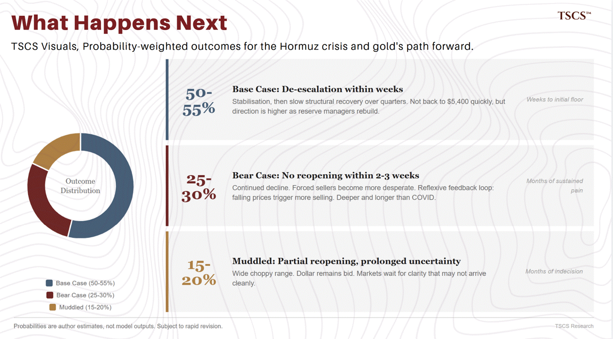](https://substackcdn.com/image/fetch/$s_!4zhH!,f_auto,q_auto:good,fl_progressive:steep/https%3A%2F%2Fsubstack-post-media.s3.amazonaws.com%2Fpublic%2Fimages%2F4e1a123e-ac77-48b8-8ae7-e246a8cdf027_1405x779.png)

In that scenario, the acute phase of forced selling ends, gold stabilises, and the structural bid from reserve managers who have depleted their holdings reasserts itself over the following quarters. Not immediately. Not at $5,400. But the direction is higher, because the reserve managers who sold will need to rebuild.

The rest of the distribution covers muddled outcomes: partial reopening, prolonged uncertainty, intermittent escalation and de-escalation that keeps markets guessing for months. In that world, gold chops sideways in a wide range while the dollar remains bid and everyone waits for clarity that may not arrive cleanly.

None of which helps you today. If you sized your position correctly, if you own gold as a component of a broader portfolio rather than a leveraged bet on Armageddon, you can sit through this. If you did not, be honest with yourself about that now, before the next leg down forces the conversation on you. Reducing an oversized position is risk management, not panic selling.

For those watching and waiting, there are two sets of signals that matter. The first tells you when the mechanical selling is exhausting itself. The second tells you when the environment that triggered it is normalising. Both matter, but for different reasons.

[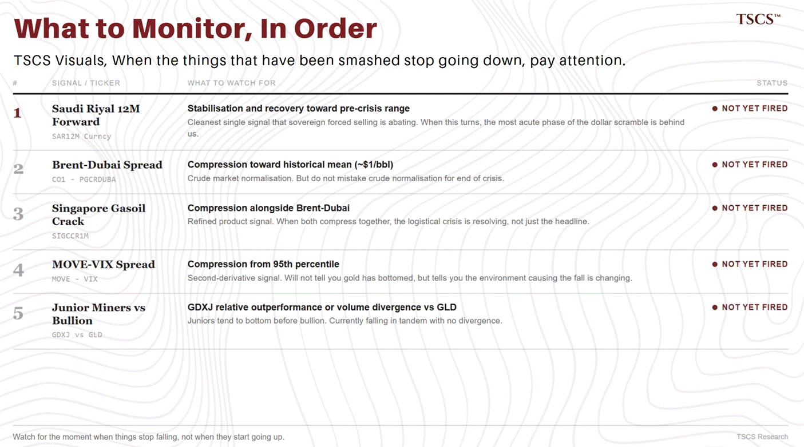](https://substackcdn.com/image/fetch/$s_!HUCs!,f_auto,q_auto:good,fl_progressive:steep/https%3A%2F%2Fsubstack-post-media.s3.amazonaws.com%2Fpublic%2Fimages%2Fe620b171-cb04-4526-a71d-28e0f17d9072_1405x782.png)

The Brent-Dubai spread. When it compresses toward its historical mean, the crude market is normalising. But do not mistake crude normalisation for the end of the crisis.

The Singapore gasoil crack spread. Your refined product signal. When this compresses alongside Brent-Dubai, the logistical crisis is resolving, not just the headline one.

The MOVE-VIX spread. When it compresses from its current 95th percentile reading, the funding stress that is forcing dollar accumulation is easing. This is a second-derivative signal: it will not tell you gold has bottomed, but it will tell you the environment causing gold to fall is changing.

[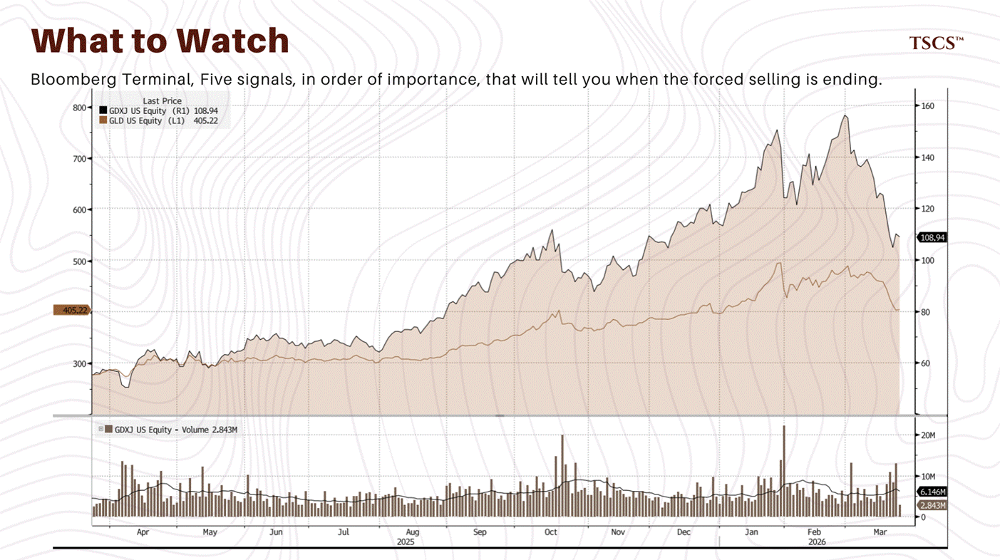](https://substackcdn.com/image/fetch/$s_!3Ed8!,f_auto,q_auto:good,fl_progressive:steep/https%3A%2F%2Fsubstack-post-media.s3.amazonaws.com%2Fpublic%2Fimages%2Fea5caa41-eeba-4a98-b019-b49924bbaa13_1403x786.png)

Junior gold mining stocks. The juniors tend to bottom before bullion. Right now, GDXJ and GLD are falling in tandem, with GDXJ showing no relative outperformance or volume divergence. The signal has not fired. When it does, you will want to be paying attention. We will have more to say about what the miners are telling us in the coming days.

And watch, more broadly, for the moment when the things that have been smashed stop going down. Not when they start going up, that comes later. Just when they stop falling. When a currency that has been crushed finds a floor, when a commodity that has been liquidated stabilises, when the bleeding halts even briefly, that is the market telling you something about the distribution of outcomes ahead.

I will be honest: I do not know when that moment arrives. I do not know if the next week brings de-escalation or further deterioration. I have skin in this game and I am sitting through it, but I am sitting through it with my eyes open, not with false confidence that I can see the other side.

What I do know is this.

You bought gold because you believed the global financial system was more fragile than it appeared. You were right. The fragility is here, now, in front of you. It just does not look the way you imagined it would. The structural reasons for owning gold, fiscal deterioration, reserve diversification, geopolitical realignment, the slow erosion of trust in fiat institutions, have not been repealed by this drawdown. If anything, they have been reinforced.

The path from here to a recovery in price runs through a period of genuine uncertainty that I cannot resolve for you with a chart or a spread or a historical analog. Stay solvent. Stay honest with yourself about your risk tolerance. And if you find yourself reaching for certainty in a moment that offers none, that is the signal to step back, not to double down.

If you found this valuable, the best thing you can do is share it. If you want more research like this, subscribe to TSCS.

[Share](https://tscsw.substack.com/p/gold-is-not-failing?utm_source=substack&utm_medium=email&utm_content=share&action=share&token=eyJ1c2VyX2lkIjoxNDAwMjQ1LCJwb3N0X2lkIjoxOTIwMjUwODAsImlhdCI6MTc3NDgwODQ3MCwiZXhwIjoxNzc3NDAwNDcwLCJpc3MiOiJwdWItMjM1NDI0NCIsInN1YiI6InBvc3QtcmVhY3Rpb24ifQ.Tga3dTWobRpM31A-GMad3UeqZAxu1KlpcTFAcYvmd8c)

Upgrade to paid

---

*This is not investment advice. TSCS does not provide personalised financial recommendations. The author holds positions in assets discussed in this piece. Do your own research.*

*Data sourced from Bloomberg Terminal. Charts: XAU BGN Curncy, DXY Curncy, CO1 Comdty, PGCRDUBA Index, GCC 5Y CDS Monitor, GDXJ US Equity, GLD US Equity, MOVE Index, VIX Index. Brent-Dubai spread at 98.4th percentile, 3.97 standard deviations from the mean. MOVE-VIX spread at 94.8th percentile, 2.56 standard deviations from the mean. COT data: GC1 Comdty, CFTC Commitment of Traders Report. This is not investment advice. Do your own research.*