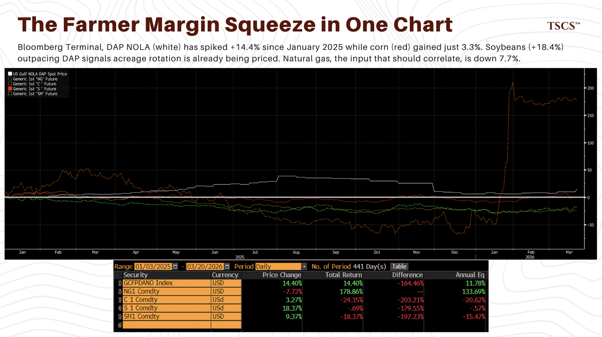
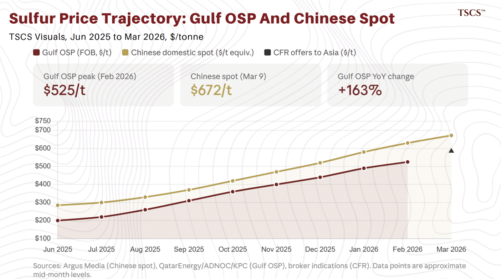

Sulfur is what happens when you clean oil.

Roughly 80% of global sulfur production comes from mandatory desulfurization of sour crude and natural gas. Environmental regulations force refineries to strip hydrogen sulfide during processing. Out comes elemental sulfur, whether anyone wants it or not. For decades, sulfur was so cheap and so unwanted that Canadian oil sands operators stacked 10 million tonnes of it in solid blocks across Alberta because nobody would pay to ship it.

It is now the most underappreciated commodity chokepoint in the global economy. And the Strait of Hormuz shut it off.

Operation Epic Fury, the coordinated US-Israeli strikes on Iranian military and nuclear facilities that began on February 28, closed the Strait of Hormuz. Over 400 vessels now idle in the Gulf of Oman. Oil spiked above $119 Brent before settling into the current $106-110 range.

That is what every cable news anchor and every macro strategist wants to talk about.

In our oil analysis , we covered the crude repricing. In our tanker and LNG work “[Operation Epic Fury](https://open.substack.com/pub/tscsw/p/operation-epic-fury?r=203zi2&utm_campaign=post&utm_medium=web)” and “[8 Days to Kuwait](https://open.substack.com/pub/tscsw/p/the-oil-market-is-lying-to-you?r=203zi2&utm_campaign=post&utm_medium=web)”. **“**[Oil Isn’t The Trade](https://open.substack.com/pub/tscsw/p/oil-isnt-the-trade?r=203zi2&utm_campaign=post&utm_medium=web)”, we covered the shipping dislocation. In “[Party’s Over](https://open.substack.com/pub/tscsw/p/partys-over?r=203zi2&utm_campaign=post&utm_medium=web)” and “[The Reversion Trade](https://open.substack.com/pub/tscsw/p/the-reversion-trade?r=203zi2&utm_campaign=post&utm_medium=web)”, we flagged fertilizer as “the second-order effect with the longest tail and the least market attention” and promised a dedicated piece.

This is that piece. The tail is longer than we expected.

Here is the short version for anyone scanning this at 6am: half the world’s seaborne sulfur trade passes through a strait that is currently closed, and there are no strategic sulfur reserves anywhere on earth. The USGS explicitly states “Government Stockpile: None” for the United States. No other country maintains one either. US producer yearend stocks in 2024 totaled 110,000 tonnes against 8.2 million tonnes of production, about five days of output. The industry runs on just-in-time logistics because sulfur was always too cheap to justify building storage infrastructure. Molten sulfur requires steam-jacketed pipelines and heated tanks maintained at 120 to 155°C.

That matters because sulfuric acid is the irreplaceable input for phosphate fertilizer production, Indonesian battery-grade nickel processing, DRC cobalt mining, and the amino acid that sets global chicken prices. The downstream effects of sulfur starvation run through all four simultaneously. Goldman, HSBC, and SFA Oxford have each published on separate legs. Nobody has connected them.

I think the connection is where the alpha is.

The numbers: Gulf states produce about 24% of global sulfur, but the figure that matters is trade. China produces 19,000 kt but imported 9.95 million tonnes in 2024. The United States produces 8,100 kt and consumes 9,100 kt. India, Japan, South Korea: all net importers. The Gulf states are the only major producers that actually export in volume. According to S&P Global Trade Atlas data cited by NDSU, Gulf producers account for 44% of all seaborne sulfur trade. The Fertilizer Institute and Bloomberg put it closer to 50%.

The Ras Laffan strikes also removed approximately 180,000 tonnes of annual sulfur exports, roughly 6% of Qatar's total, compounding the seaborne sulfur deficit through infrastructure damage rather than mere transit disruption. Unlike the Hormuz shipping blockade, this sulfur supply does not return with a ceasefire.

In my oil analysis, I described the “air pocket,” the lag between the last laden tankers departing the Gulf and the arrival of physical scarcity at consuming refineries. The sulfur air pocket operates on the same mechanics but with shorter runways: 2-4 weeks at phosphate complexes, roughly 30-45 days at Indonesian HPAL plants, 4-6 weeks at DRC leaching operations. The last sulfur cargoes are arriving now.

A ceasefire by June still produces the most severe fertilizer supply disruption since 2008. If the closure holds into Q3, the word “disruption” stops being adequate.

Prediction markets provide the duration framework, and readers of the Epic Fury series will recognize the scenario architecture. Our Taco scenario (ceasefire within 3-5 weeks, 20% weight as of “[The Reversion Trade](https://tscsw.substack.com/p/the-reversion-trade)”) maps to Polymarket’s 39% chance of normalization by end of April, which has declined from ~80% earlier in March as the crisis proved more intractable than initial consensus assumed. Our Grind scenario (2-4 months, 50% weight) aligns with Kalshi’s 67% cumulative probability by June 1. The Unthinkable (6+ months, 30% weight) is the tail where the word “disruption” stops being adequate. The severity of each downstream channel maps directly to these duration thresholds, and we structure the analysis accordingly.

**If you are new to TSCS, this is Part V of our Epic Fury series. The series has tracked the investment implications of the Hormuz closure in real time since March 1, covering [crude](https://open.substack.com/pub/tscsw/p/the-reversion-trade?r=203zi2&utm_campaign=post&utm_medium=web), [tankers](https://open.substack.com/pub/tscsw/p/oil-isnt-the-trade?r=203zi2&utm_campaign=post&utm_medium=web) and [LNG](https://open.substack.com/pub/tscsw/p/the-oil-market-is-lying-to-you?r=203zi2&utm_campaign=post&utm_medium=web), [second-order commodity plays](https://open.substack.com/pub/tscsw/p/oil-isnt-the-trade?r=203zi2&utm_campaign=post&utm_medium=web), and the [broader geopolitical framework.](https://open.substack.com/pub/tscsw/p/operation-epic-fury?utm_campaign=post-expanded-share&utm_medium=web) Paid subscribers receive the full series archive and our scenario updates as prediction market probabilities shift.**

**The analysis below is for TSCS subscribers only.**

Let’s get into it.

Upgrade to paid