Yesterday the IRGC published a kill list. Not of people. Of companies. Apple, Google, Microsoft, Nvidia, Tesla, Boeing, JPMorgan, fourteen others. “For every assassination, an American company will be destroyed.” Employees told to evacuate immediately. Residents within one kilometre of facilities across the Gulf told to leave. Deadline: 8pm Tehran time, April 1. Three weeks prior, Iranian drones had already hit three AWS data centres in the UAE and Bahrain. So it’s not a bluff. It’s a price list.

The market noticed. Cable news noticed. Defence Twitter noticed. Everyone is watching the *loud* part.

Last week the FT ran a piece that should have stopped people in their tracks. “It’s all hands on deck: Iran’s hackers go to war.” Buried in the reporting was a line from Alexander Leslie at Recorded Future, one of the best-sourced analysts tracking Iranian cyber operations: “The loudest activity is not always the most important.”

Read that again.

The loud groups, the ones on Telegram claiming credit for DDoS attacks and website defacements, those are the fireworks. The quiet groups, the ones linked directly to Iranian intelligence, have been doing something else entirely. Searching for vulnerabilities. Scouting entry points. *Pre-positioning inside target networks.*

Symantec confirmed it in March. MuddyWater, a group the US and UK tie to the Iranian intelligence ministry, was already inside a US bank, a US airport, and the Israeli operations of a US defence supply chain software company before the first strike on February 28. Two previously unknown backdoors. Already deployed. Already waiting.

Then on March 11, a different group, Handala, turned Stryker Corporation’s own device management software against it and wiped tens of thousands of devices across 79 countries. No malware needed. They used Microsoft Intune, a tool that was already installed on every machine they destroyed. $12.4 billion in market cap, gone in three weeks. Chris Krebs, the former CISA director, called it a “five-alarm fire.” The stock still hasn’t recovered.

[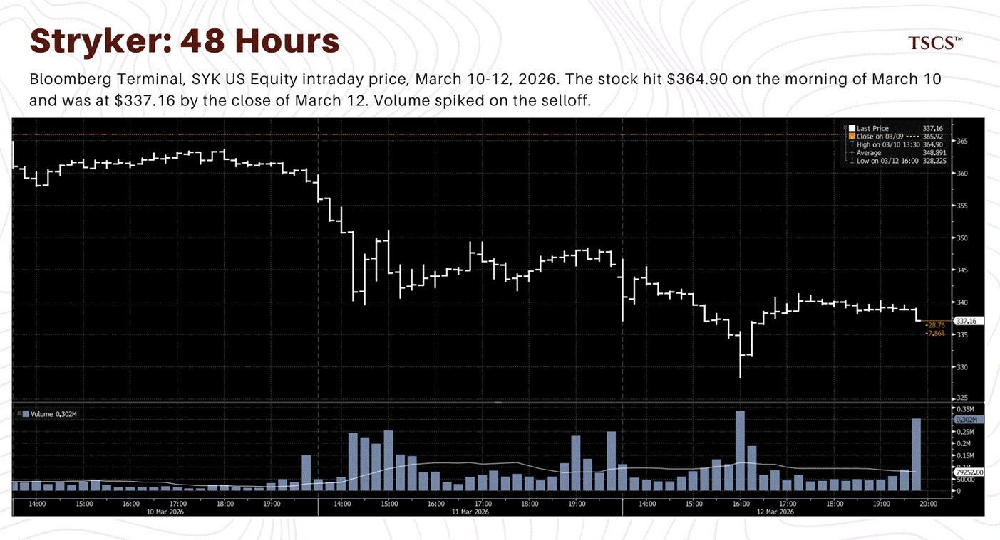](https://substackcdn.com/image/fetch/$s_!_rPw!,f_auto,q_auto:good,fl_progressive:steep/https%3A%2F%2Fsubstack-post-media.s3.amazonaws.com%2Fpublic%2Fimages%2Fc1cd3631-73b2-479b-abcb-1dc2e064962c_1403x759.png)

One company. One attack. One group.

And the federal agency whose *entire job* is to stop this from happening to every hospital, water utility, pipeline, and power grid in America? It has lost roughly half its operational capacity in fourteen months.

[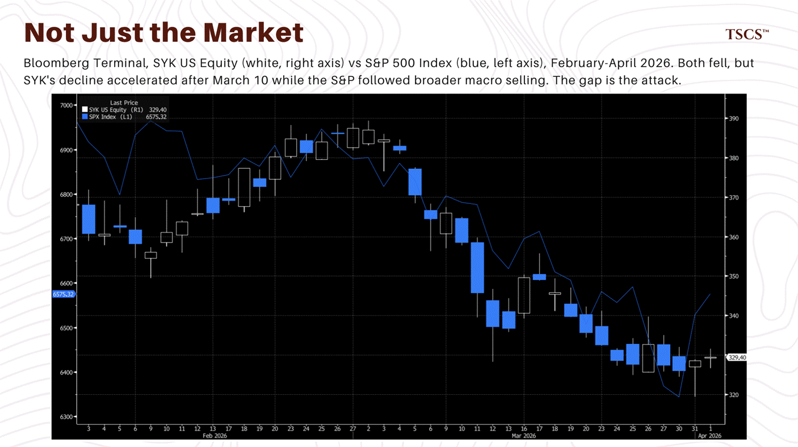](https://substackcdn.com/image/fetch/$s_!wWQ0!,f_auto,q_auto:good,fl_progressive:steep/https%3A%2F%2Fsubstack-post-media.s3.amazonaws.com%2Fpublic%2Fimages%2F2717556b-e960-4ecd-bad0-82a2ef28b6ba_1406x789.png)

This is a spin-off of *Epic Fury*. Free to read in full. The thesis across seven prior instalments hasn’t changed: the market is mispricing the physical aftermath of the Hormuz conflict. Oil recovery isn’t V-shaped. LNG trains don’t restart with a light switch. Reservoir damage is permanent. All of that still holds. But something has been building for the last six weeks that might matter more than anything I’ve written about oil. The market is staring at the missiles and the tankers. It should be looking at the insurance contracts, the credit spreads, and the 153,000 water systems still running on default passwords.

If you’re new here: the full investment framework, tanker equities, LNG restart timelines, E&P positioning, second-order commodity plays, lives in Parts One through Seven. Sixty-plus investment firms subscribe. **The rest of the** ***Epic Fury*** **series is available to paid subscribers.**

Subscribed

You’re watching the wrong screen.

# The Agency That’s Supposed to Stop This Has Lost a Third of Its People

CISA entered January 2025 with approximately 3,400 full-time employees against 3,732 funded positions. In January 2026, Acting Director Madhu Gottumukkala testified to the House Homeland Security Committee that 2,389 positions remained filled as of December 2025. Approximately 1,000 people walked out the door through a combination of mechanisms that, taken together, look less like a budget exercise and more like institutional demolition.

The mechanisms were varied, probationary firings, two rounds of voluntary buyouts, early retirements, reassignments to border security roles (because apparently the person analyzing Iranian malware samples is fungible with someone processing asylum claims). But the contractor losses are what make the FTE headline misleading. The Joint Cyber Defense Collaborative went from over 100 ICF contractors to 10. Red team contracts were terminated on February 28, 2025, eliminating more than 100 penetration-testing specialists. Threat-hunting contracts with Nightwing and Peraton were cut in the following months. The field advisory force shrank from 164 to 97 nationwide. The Stakeholder Engagement and Requirements Division dropped from 200 to 53 positions.

The “one-third reduction” in headlines understates it. The “two-thirds” some reporters use overstates it for FTEs alone. The correct characterization: CISA’s operational capacity, combining permanent staff, contractors, and field personnel, has been reduced by roughly 40-50%, with certain critical functions degraded far more severely than that. Red teaming is gone. Threat hunting is gutted. The JCDC is a skeleton. The Cyber Safety Review Board, which was mid-investigation into China’s Salt Typhoon compromise of nine US telecom firms, was disbanded in January 2025 and has not been reconstituted.

[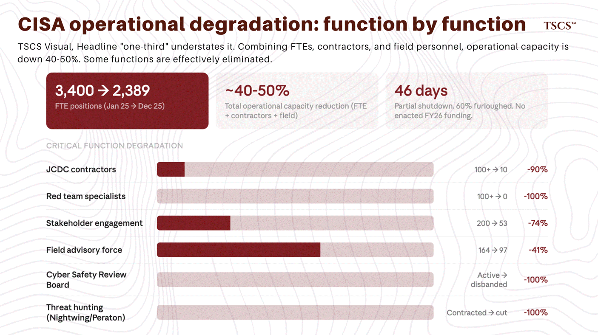](https://substackcdn.com/image/fetch/$s_!noBP!,f_auto,q_auto:good,fl_progressive:steep/https%3A%2F%2Fsubstack-post-media.s3.amazonaws.com%2Fpublic%2Fimages%2F1d8353e0-e0bf-4855-9696-3d152e614d71_1406x789.png)

The budget trajectory confirms this is deliberate. CISA’s enacted budget fell from $2.93 billion in FY2023 to a proposed $2.38 billion for FY2026, a $550 million cut. The Trump administration’s request eliminated 1,083 positions and cut $495 million, including $39.6 million for election security, $14 million from the JCDC, and $70 million from the National Risk Management Center. Congress has partially resisted. The House Appropriations Committee approved $2.7 billion. The Senate drafted a bill at $2.8 billion with language specifically prohibiting CISA from reducing staff “in such a way that it lacks sufficient staff to effectively carry out its statutory missions.” But as of April 1, 2026, DHS is the sole cabinet department without enacted FY2026 funding. Its appropriation lapsed entirely on February 14, 2026, triggering a partial government shutdown that has now lasted 46 days, with CISA employees working without pay.

Why this happened matters, because the causation determines whether it reverses.

In November 2020, CISA’s “Rumor Control” page debunked election disinformation. Director Chris Krebs called the 2020 election “the most secure in American history.” Trump fired Krebs by tweet. Project 2025 subsequently identified CISA as part of a “censorship industrial complex” and recommended dismantling it. DHS Secretary Kristi Noem stated at her confirmation hearing that CISA had “gotten far off mission.” On April 9, 2025, Trump signed an executive order specifically targeting Krebs personally, revoking his security clearances, suspending clearances for all employees of SentinelOne (the cybersecurity firm where Krebs then worked), and ordering a DOJ investigation.

This isn’t a budget cycle. It’s not “efficiency.” It’s a vendetta with a clear origin and a structural consequence: the one federal agency whose job it is to defend civilian infrastructure from state-sponsored cyber attack is running at roughly half capacity during an active shooting war with a state that has battle-hardened cyber operators already inside American networks.

[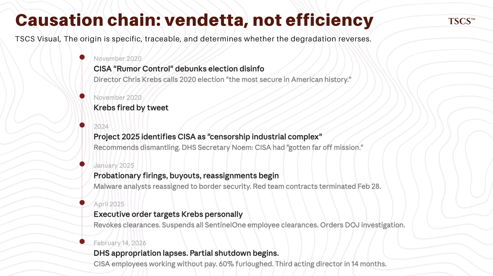](https://substackcdn.com/image/fetch/$s_!Uf_k!,f_auto,q_auto:good,fl_progressive:steep/https%3A%2F%2Fsubstack-post-media.s3.amazonaws.com%2Fpublic%2Fimages%2Fa215d44d-3bc3-418e-a7a9-a03980b8cb9a_1403x787.png)

[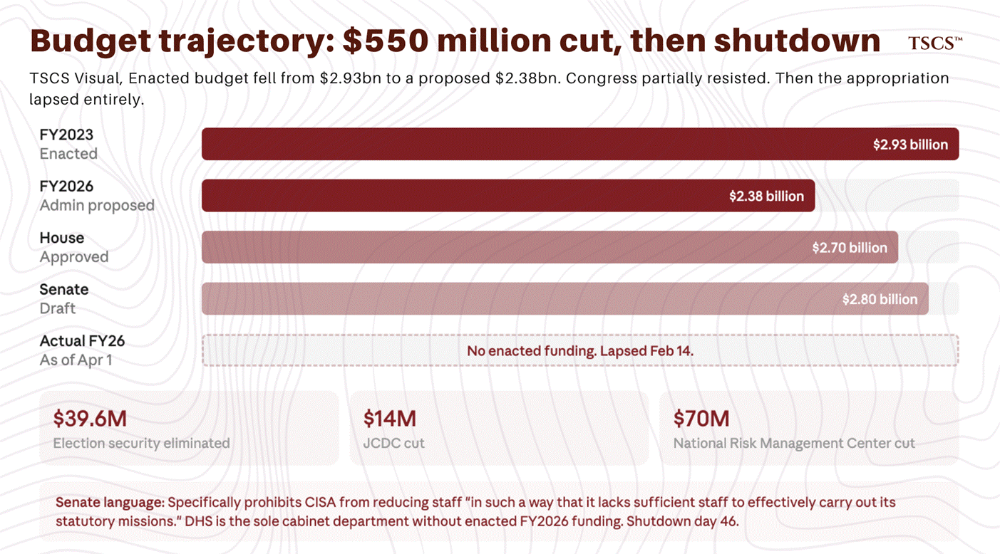](https://substackcdn.com/image/fetch/$s_!em4k!,f_auto,q_auto:good,fl_progressive:steep/https%3A%2F%2Fsubstack-post-media.s3.amazonaws.com%2Fpublic%2Fimages%2F04227f90-1ab7-4a47-9889-eaf50d507c00_1403x778.png)

By March 2026, Nick Andersen, the third acting director in fourteen months, testified to Congress that 60% of CISA’s workforce had been furloughed during the partial DHS shutdown and that activities “that reduce systemic risk over time” had been “scaled back or paused.”

Activities that reduce systemic risk have been scaled back. During a war.

# The People Already Inside

Three groups. Pay attention to the third one.

[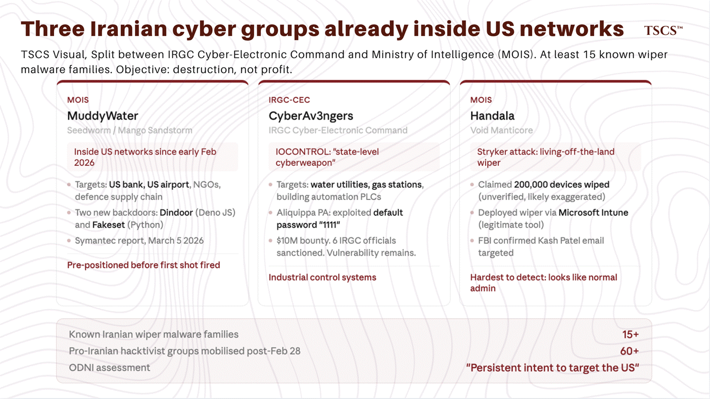](https://substackcdn.com/image/fetch/$s_!sGjy!,f_auto,q_auto:good,fl_progressive:steep/https%3A%2F%2Fsubstack-post-media.s3.amazonaws.com%2Fpublic%2Fimages%2Fa0e1325f-d05d-4bfd-a2f7-ef032ae6fc90_1405x790.png)

Iran runs at least seven major state-linked cyber groups, split between the IRGC Cyber-Electronic Command and the Ministry of Intelligence and Security (MOIS). Three should concern you right now.

**MuddyWater.** MOIS-linked. On March 5, 2026, Symantec documented MuddyWater activity inside US networks beginning in early February, weeks before the February 28 kinetic strikes. The named targets: a US bank, a US airport, NGOs in the US and Canada, and the Israeli operations of a US defense supply chain software company. They deployed two previously unknown backdoors. They were inside before the first shot was fired.

**CyberAv3ngers.** IRGC. This is the group that developed IOCONTROL, which Claroty classified as a “state-level cyberweapon” targeting the programmable logic controllers that run water treatment plants, gas stations, and building automation systems. In November 2023, they compromised Unitronics PLCs across multiple US water utilities, including the Municipal Water Authority of Aliquippa, Pennsylvania. The exploit: they got in using the default password “1111” on internet-facing devices. The Treasury Department sanctioned six IRGC officials. The fundamental vulnerability, thousands of exposed industrial control systems with default credentials, remains substantially unpatched.

**Handala.** MOIS-linked. This is the group that hit Stryker. They deployed the wiper through Microsoft Intune, a legitimate endpoint management tool already installed on the target devices. Living-off-the-land attacks are the hardest class of intrusion to detect because the tools involved are the same ones defenders rely on daily.

The telemetry looks normal until it’s too late.

Iran’s wiper arsenal now includes at least 15 known malware families. Unlike ransomware, these don’t encrypt your data and demand payment. They delete it. Permanently. The objective is destruction, not profit.

The ODNI’s March 2026 Annual Threat Assessment confirmed: “Iran maintains persistent intent to target the U.S.” The intelligence community assesses that Iranian cyber operators “have previously used cyber attacks to effect against poorly defended targets and weaker opponents.”

*Poorly defended targets and weaker opponents. Fourteen months ago, that didn’t describe American critical infrastructure. I’m not sure that’s still true.*

[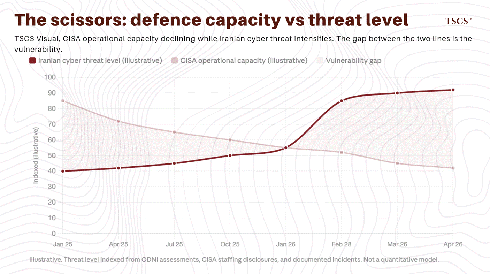](https://substackcdn.com/image/fetch/$s_!yilp!,f_auto,q_auto:good,fl_progressive:steep/https%3A%2F%2Fsubstack-post-media.s3.amazonaws.com%2Fpublic%2Fimages%2Fbda75f08-f591-4a67-b995-7bfe2a07c8be_1406x786.png)

# 153,000 Water Systems and a Default Password

Now look at what they’re pointing at.

The United States has 16 designated critical infrastructure sectors. Only four or five of them have mandatory cybersecurity standards: the bulk electric system (under NERC-CIP), nuclear facilities (NRC regulations), pipelines and rail (TSA Security Directives issued since 2021), and financial services (SEC and GLBA rules). The remaining 11 to 12 sectors, including water, healthcare, food and agriculture, commercial facilities, and critical manufacturing, rely on voluntary frameworks. Voluntary, in practice, means optional. Optional, in practice, means most of them do nothing.

[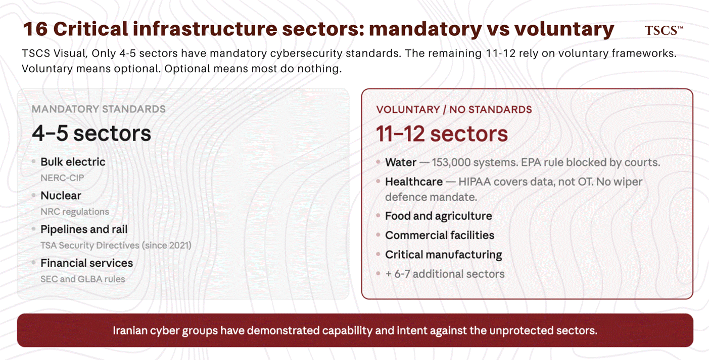](https://substackcdn.com/image/fetch/$s_!AOnq!,f_auto,q_auto:good,fl_progressive:steep/https%3A%2F%2Fsubstack-post-media.s3.amazonaws.com%2Fpublic%2Fimages%2F29376bda-a159-42bb-8920-7d07eea90761_1403x714.png)

Water is where all three lines cross: Iranian capability, demonstrated intent, and American vulnerability. This isn’t hypothetical. CyberAv3ngers already hit US water systems in November 2023. The default password was 1111.

The United States has approximately 153,000 public drinking water systems and more than 16,000 wastewater treatment systems. The vast majority are small municipal operations, decades behind on cybersecurity, staffed by people whose expertise is water chemistry, not network defense. When the EPA attempted to require cybersecurity evaluations through sanitary surveys in March 2023, Missouri, Arkansas, and Iowa sued. The 8th Circuit stayed the rule. The EPA withdrew it by October 2023.

The result: cybersecurity for the vast majority of US water systems is entirely voluntary.

[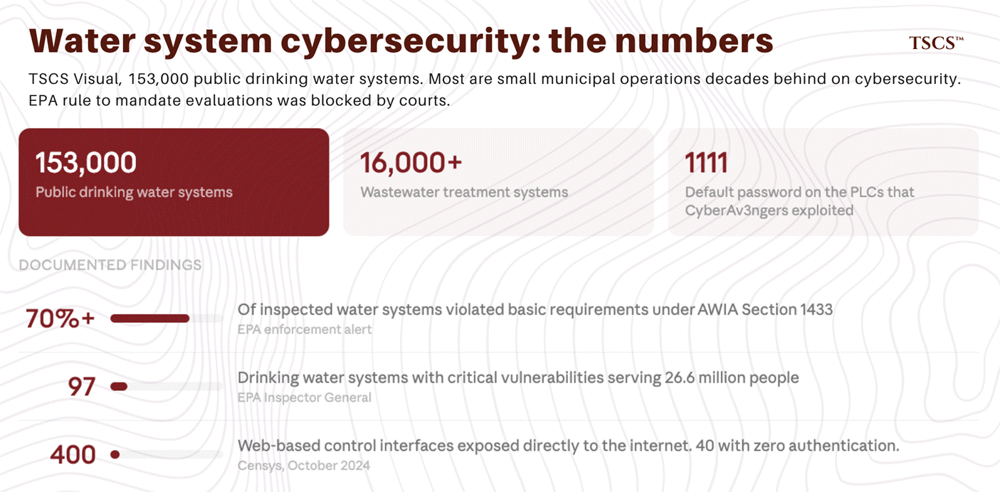](https://substackcdn.com/image/fetch/$s_!GnWe!,f_auto,q_auto:good,fl_progressive:steep/https%3A%2F%2Fsubstack-post-media.s3.amazonaws.com%2Fpublic%2Fimages%2F5f997cb8-cece-4094-8d72-3606989eee33_1405x692.png)

The numbers are almost comical if you don’t think about what they mean for public health. An EPA enforcement alert found more than 70% of inspected water systems violated basic requirements under AWIA Section 1433, which only requires risk assessments, not actual security controls. The EPA Inspector General identified critical vulnerabilities in 97 drinking water systems serving 26.6 million people. Censys researchers found approximately 400 web-based control interfaces for US water facilities exposed directly to the internet in October 2024, 40 of them with zero authentication. Anyone, from anywhere, could adjust chemical dosing or pressure levels.

Healthcare is similarly exposed. The average hospital has 10 to 15 connected medical devices per bed. The FBI Cyber Division reports that 53% of connected medical devices and other IoT devices in hospitals have at least one known critical vulnerability. The Change Healthcare ransomware attack of February 2024 cost $872 million in the first quarter alone and ultimately compromised approximately 190 million patient records. There is no hospital OT security regime comparable to NERC-CIP for the grid; HIPAA’s Security Rule covers electronic health information, and the FDA now requires cybersecurity evidence for new device submissions, but neither mandates the kind of operational technology controls that would stop a wiper moving through a hospital network.

Across all sectors, Censys documented over 145,000 exposed industrial control system services globally, with 38% located in North America, over 48,000 of them in the United States. More than half of the exposed US systems operate on wireless and commercial internet service providers including Comcast and Verizon, rather than dedicated industrial networks. Dragos’s 2026 OT Cybersecurity Report found the number of ransomware groups targeting OT environments up 49% year-over-year (from 80 to 119), with an average dwell time of 42 days. Six weeks of undetected access before anything detonates.

[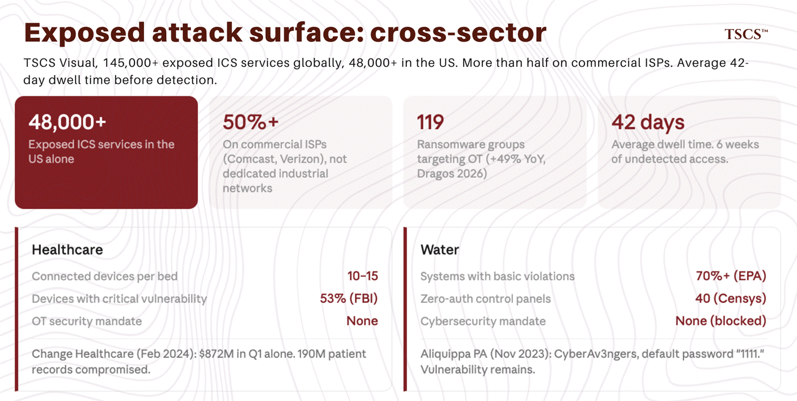](https://substackcdn.com/image/fetch/$s_!iUD6!,f_auto,q_auto:good,fl_progressive:steep/https%3A%2F%2Fsubstack-post-media.s3.amazonaws.com%2Fpublic%2Fimages%2F28ce752e-a8d4-43c7-97e7-6f9a4690e1ef_1406x708.png)

Whether this infrastructure is vulnerable isn’t the question anymore. That’s settled. What happens to specific assets when it gets exploited, that’s the question.

# “But What About Cyber Command?”

This is the rebuttal I hear most, and fair enough.

US Cyber Command is extremely capable. During Operation Epic Fury, CYBERCOM, in coordination with Israeli cyber units, drove Iran’s internet to somewhere between 1% and 4% connectivity during the opening phase of the campaign, compounded by Iran’s own defensive shutdowns of domestic networks. General Dan Caine, the Chairman of the Joint Chiefs of Staff, confirmed that “coordinated space and cyber operations effectively disrupted communications and sensor networks” before kinetic strikes. CYBERCOM was the first mover. This is impressive, and the offensive capability is real.

But CYBERCOM’s mandate is not defending your local water utility. Its mandate is defending DoD networks and projecting power in cyberspace. It operates under Title 10 military authorities. Its Cyber National Mission Force conducts “hunt forward” operations on foreign networks to disrupt threats at their source.

It has no authority and no mechanism to patch a Unitronics PLC in Aliquippa, Pennsylvania. That mission, the granular, unglamorous work of helping thousands of water systems implement basic hygiene, belongs to CISA

And there’s a resource problem. The Council on Foreign Relations addressed this directly in its March 16, 2026 analysis: offensive combat support missions “should be the top priority for U.S. Cyber Command, but they may limit its capacity to perform counter-cyber missions in defense of domestic critical infrastructure.” The Foundation for Defense of Democracies went further on March 27, warning that Iranian cyber operations are “taking advantage of weakened U.S. defenses” while CISA is in “freefall”, with roughly 60% of the agency’s workforce furloughed.

CYBERCOM has its own problems. The FDD’s March 2024 study, based on 75 interviews, found that CYBERCOM’s 2018 certification of all 133 Cyber Mission Force teams at full operational capacity was “hollow.” The command “merely shifted a limited number of effective personnel from team to team to make them appear complete at the time of certification.” The new CYBERCOM commander, General Joshua Rudd, was confirmed on March 10, 2026, with no direct cyber experience. He is a career special operations officer from Indo-Pacific Command. Senator Ron Wyden voted against confirmation, stating “there is simply no time for on-the-job learning.”

The architecture of US cyber defense has a designed-in gap: CYBERCOM handles hardened military networks and offensive operations abroad. CISA handles the sprawling mess of civilian critical infrastructure. Degrading one and surging the other does not close the gap. It widens it.

[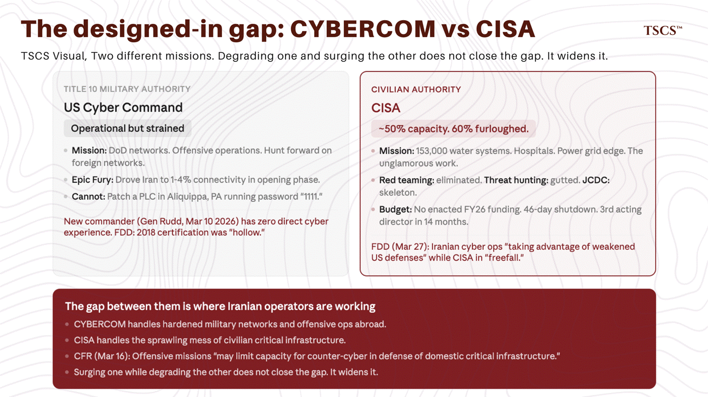](https://substackcdn.com/image/fetch/$s_!JyB3!,f_auto,q_auto:good,fl_progressive:steep/https%3A%2F%2Fsubstack-post-media.s3.amazonaws.com%2Fpublic%2Fimages%2F84af5aae-abcf-46fd-803e-879013c2bf95_1406x789.png)

# Israel Intercepted 97% of Iranian Wipers. The US Has No Equivalent.

Israel’s National Cyber Directorate (INCD) reports directly to the Prime Minister’s Office and can issue binding security instructions to designated critical infrastructure operators. CISA can issue Binding Operational Directives only to federal agencies. It has no equivalent authority over the private sector. None.

During the current conflict, INCD Director-General Yossi Karadi reported that Iran attempted to wipe data from “thousands of Israeli businesses.” They succeeded 50 times. That is a greater than 97% interception rate. Zero significant damage to designated critical infrastructure. Average incident response time reduced from over six hours to approximately 30 minutes.

Not a simulation. Real Iranian APT groups throwing real wiper malware at real infrastructure during a real war.

[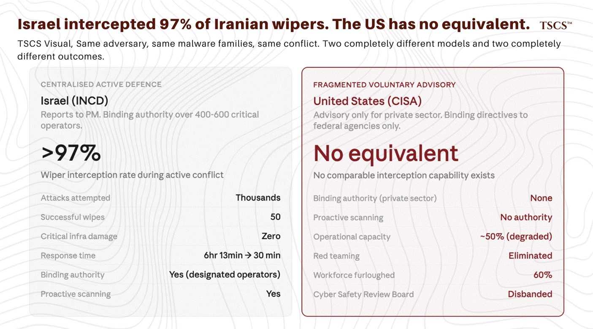](https://substackcdn.com/image/fetch/$s_!RirR!,f_auto,q_auto:good,fl_progressive:steep/https%3A%2F%2Fsubstack-post-media.s3.amazonaws.com%2Fpublic%2Fimages%2F70334abd-e6ed-485a-980b-45dae0efdc77_1405x782.png)

The comparison has obvious limitations. Israel is compact, has universal conscription, and its cultural cohesion enables coordination that may not scale to American dimensions. But the directional conclusion holds: centralized active defense with operational authority produces measurably better outcomes against a sophisticated state adversary than a fragmented, voluntary, advisory-only model. The US is now operating an even more degraded version of the already weaker model.

[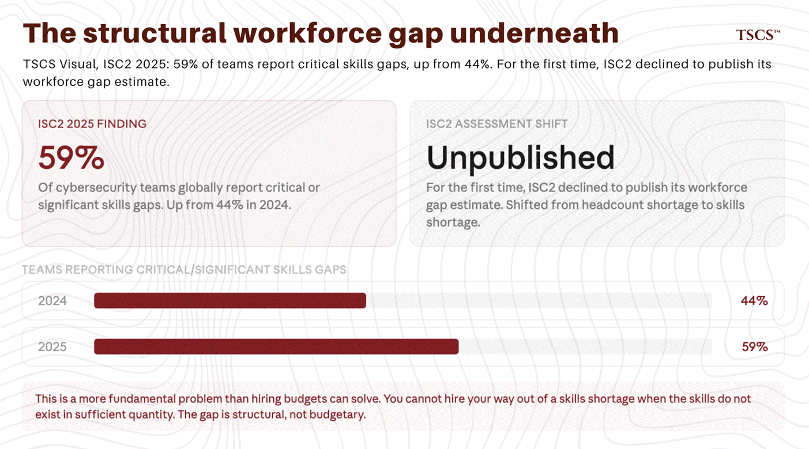](https://substackcdn.com/image/fetch/$s_!uEWt!,f_auto,q_auto:good,fl_progressive:steep/https%3A%2F%2Fsubstack-post-media.s3.amazonaws.com%2Fpublic%2Fimages%2Fd42829d2-8316-4131-bbbe-3aa3ad5590fd_1403x779.png)

---

*For those just finding this letter: TSCS publishes institutional-grade research across equities, credit, commodities, and macro. Primary data, not consensus. This is one of over 70 deep dives in the library. The full* Epic Fury *series, plus everything else we publish, is available to paid subscribers. 15,000+ readers. 60+ investment firms. If the work resonates, you know what to do.*

Subscribed

---

# The Lloyd’s Binary: The Chokepoint Nobody Is Watching

Now here’s where it gets interesting. I haven’t seen anyone else frame this.

In August 2022, Lloyd’s of London mandated (Market Bulletin Y5381) that all standalone cyber insurance policies in the Lloyd’s market include state-backed cyber attack exclusion clauses, effective at policy inception or renewal from March 31, 2023. The most widely adopted clause, LMA5567A, does not blanket-exclude state-sponsored cyber attacks. It excludes them only when specific thresholds are met: the attack must be attributable to a state, the affected systems must be located in a country that qualifies as an “impacted state,” and the attack must cause “major detrimental impact” on that state’s ability to function or on its security capabilities.

The logic was straightforward: after NotPetya caused $10 billion in damage and triggered years of legal disputes over whether it was an “act of war,” Lloyd’s decided to draw a bright line.

**The Stryker attack is the first real-world test of these exclusions during an actual armed conflict between the United States and a foreign state.**

Walk through what has to happen for the exclusion to trigger. Handala is assessed by the US government and multiple cybersecurity firms to be linked to Iranian intelligence. The US and Iran are in an active military conflict. The attack was destructive, not criminal. It had no financial motive. Stryker itself confirmed there was no indication of ransomware or malware, the attackers appear to have compromised Azure Active Directory credentials and used Microsoft Intune’s legitimate remote-wipe functionality to erase devices across 79 countries. By any reasonable reading, this is exactly the scenario the exclusion clauses were written for. But the attack vector triggering a vendor’s own device management tool rather than deploying traditional wiper malware, could complicate the legal categorization, and any insurer looking for ambiguity will find it there.

But none of these thresholds have been adjudicated for the Stryker attack. The forensic attribution hasn’t been formalized through the clause’s own mechanism. The connection to the conflict hasn’t been legally established. The exclusion clauses are, as of right now, untested in a real-world wartime scenario.

There is one critical precedent. In January 2022, a New Jersey Superior Court ruled that Ace American Insurance could not invoke the traditional war/hostile acts exclusion to deny Merck’s claim from the NotPetya attack. Merck estimated its damages at approximately $870 million; its insurance claim under a $1.75 billion all-risk policy totaled $1.4 billion. The court held that the standard policy language about “hostile or warlike action” had always been understood by insureds to apply to conventional armed conflict, and that insurers had never updated the language to put policyholders on notice that it would extend to state-sponsored cyber operations. Lloyd’s directed the market to adopt new exclusion language, and the LMA published revised model clauses in January 2023, of which LMA5567A became the most widely used. (The B variants omit attribution mechanisms and are not Lloyd’s-compliant without prior approval, an important distinction if this goes to litigation, since which version a specific policy uses will determine the procedural pathway.) The new language was designed to capture exactly the gap the Merck court identified. But the new clauses have never been tested in court. The Stryker case is therefore not just the first test of war exclusions during a cyber conflict. It’s the first test of clauses that were specifically rewritten because the old ones failed.

[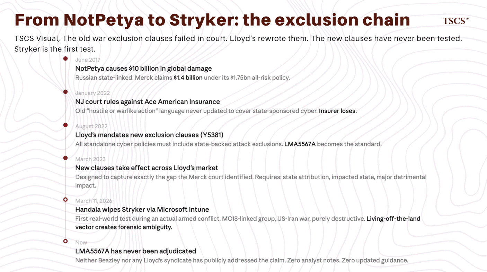](https://substackcdn.com/image/fetch/$s_!q5Qw!,f_auto,q_auto:good,fl_progressive:steep/https%3A%2F%2Fsubstack-post-media.s3.amazonaws.com%2Fpublic%2Fimages%2F7cc5f742-5467-44a6-a3d1-3e19f21e8a71_1406x786.png)

Three scenarios. All three are investable.

[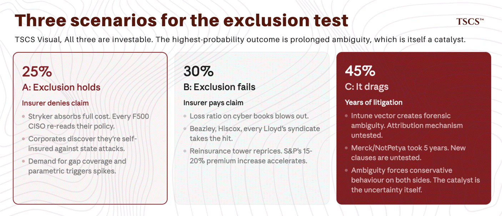](https://substackcdn.com/image/fetch/$s_!I6Hd!,f_auto,q_auto:good,fl_progressive:steep/https%3A%2F%2Fsubstack-post-media.s3.amazonaws.com%2Fpublic%2Fimages%2Fe35a32dd-a8c7-486d-9864-da14eaf6183a_1406x606.png)

Scenario A (25% probability): The exclusion holds cleanly. Lloyd’s syndicates invoke LMA5567A/B and decline to cover the Stryker losses. Stryker absorbs the full cost of the attack. Every Fortune 500 CISO and CFO in America immediately re-reads their cyber policy and discovers that their coverage may be worthless in the current threat environment. Demand for gap coverage, parametric triggers, and alternative risk transfer spikes. Companies that thought they had transferred their cyber risk to insurers realize they’re self-insured against state-sponsored attacks during the single moment when state-sponsored attacks are most likely.

Scenario B (30% probability): The exclusion doesn’t hold. Stryker’s insurers pay the claim, either because the forensic attribution isn’t clean enough, or because the political and reputational cost of denying a wartime claim to an American company is too high, or because the legal test of “major detrimental impact on state functioning” isn’t met by a corporate IT wipe. In this case, the loss ratio on cyber books blows out. Beazley, Hiscox, and every Lloyd’s syndicate with cyber exposure takes the hit. The reinsurance tower reprices. Premium increases that S&P projected at 15-20% for 2026 accelerate sharply.

Scenario C (45% probability): It drags. Handala deployed the wiper through Microsoft Intune, a legitimate endpoint management tool already installed on Stryker’s devices. From a forensic standpoint, an Intune remote-wipe looks functionally identical to an authorized IT administrator making a catastrophic error. Proving, to the standard required by LMA5567A’s attribution mechanism, that this was a state-directed act meeting the “major detrimental impact” threshold will be a protracted legal fight. The Merck/NotPetya litigation took five years to reach a Superior Court ruling, and that was on the old exclusion language, which the court found had never been updated to put policyholders on notice. The new LMA5567 clauses were specifically rewritten to close that gap, but they have never been tested. The first test will not be fast. And prolonged ambiguity is not neutral.

While the litigation runs, every insurer with a cyber book faces the same question from every policyholder: “Am I covered or not?” Every CFO running a risk budget faces the same question from the board: “Should we assume our cyber policy pays out in a state-linked attack, or should we reserve as though it won’t?” Uncertainty forces conservative behavior on both sides of the market. Insurers tighten underwriting standards and raise premiums to build reserves against an undefined liability. Corporates increase self-insurance allocations, accelerate cybersecurity spending, and demand new products (parametric triggers, affirmative coverage endorsements) that didn’t exist at scale six months ago. The ambiguity itself is a catalyst. It doesn’t need a verdict.

The legal fact pattern favors the insurer more than NotPetya did, but the “major detrimental impact” threshold in LMA5567A is high. The clause requires disruption to essential services at a state level, not corporate-level damage, however severe. Wiping a medical device company’s laptops is devastating for Stryker; whether it meets the bar of impairing the functioning of the United States is a different question. That’s what keeps Scenario A at 25% rather than higher

There’s a tension in these weights worth flagging. The fact pattern here is cleaner than NotPetya: unlike the Russia-Ukraine connection, which was indirect and where the damage was collateral, the Stryker attack occurred during a declared military conflict between the US and Iran, was executed by a group the US government formally ties to Iranian intelligence, and was purely destructive. The LMA5567 language was designed for exactly this fact pattern, which is what pulls Scenario A above 20%. But “designed for” is not the same as “survives litigation.” The attack vector, a living-off-the-land technique using the victim’s own device management infrastructure, gives any insurer looking for forensic ambiguity exactly enough to fight. And insurers always fight. The Merck precedent, where courts sided against the insurer on the old language, creates a judicial baseline that makes clean denial risky. The result is that neither side has an overwhelming legal advantage, which is precisely why this drags.

The chart tells you something I didn’t expect.

[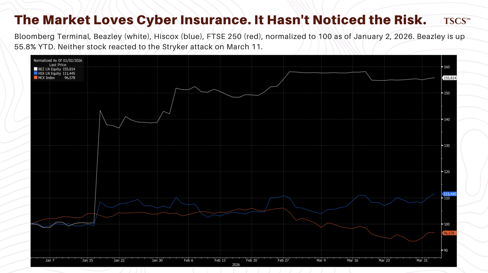](https://substackcdn.com/image/fetch/$s_!n-zv!,f_auto,q_auto:good,fl_progressive:steep/https%3A%2F%2Fsubstack-post-media.s3.amazonaws.com%2Fpublic%2Fimages%2Fe8b31f8e-5734-462b-b6af-b9d47556f903_1406x786.png)

Beazley is up 55.8% year-to-date. Hiscox is up 11.4%. The FTSE 250 is down 3.4%. The market loves these stocks. Beazley’s spike came in mid-February, likely on earnings, before the strikes even began. The cyber insurance growth story is very much priced.

But look at March 11. The day Handala wiped Stryker. Neither stock moved. At all.

The market is pricing Beazley as a growth story: more cyber attacks mean more demand for cyber insurance mean higher premiums mean bigger book. That’s true. But it’s pricing the upside of the threat environment without pricing the downside of the exclusion test. If the LMA5567 clauses fail and Beazley has to pay the Stryker claim, the loss ratio impact hits a stock trading at 56% above where it started the year. If the clauses hold and corporates realize their cyber coverage is worthless during wartime, the long-term premium volume thesis takes a hit. Either way, the binary isn’t in the price. The stock didn’t even notice the triggering event.

[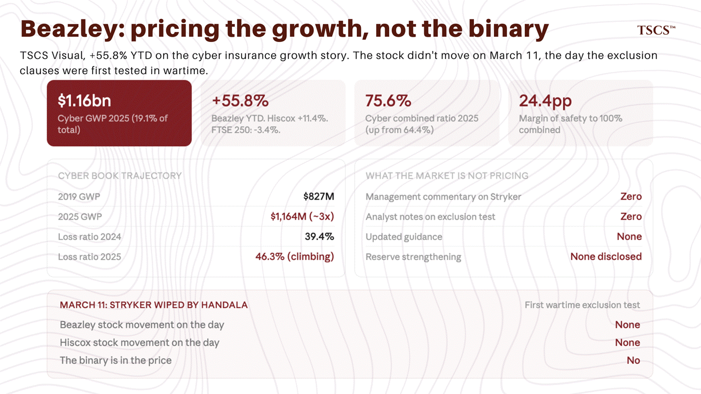](https://substackcdn.com/image/fetch/$s_!gP8k!,f_auto,q_auto:good,fl_progressive:steep/https%3A%2F%2Fsubstack-post-media.s3.amazonaws.com%2Fpublic%2Fimages%2Ffaf0ccc2-94e7-4b80-9e76-f682397f745c_1405x791.png)

This isn’t a “buy Beazley” call. If anything, it’s a caution for anyone already long. And it’s a potential opportunity for anyone with access to London-listed options who wants to express a view on the exclusion outcome at what appears to be normal implied volatility levels.

For more sophisticated portfolios, the deeper trade may sit further up the chain: the reinsurance and retrocession market where the actual systemic tail risk accumulates. Catastrophe bond spreads and ILS fund performance are the canary. If the retrocession market starts pricing cyber war risk before the primary equity market does, that’s your confirmation signal. As of April 1, it hasn’t.

Beazley’s cyber book wrote $1.164 billion in gross premiums in 2025, representing 19.1% of total GWP of $6.1 billion. This is not a niche line. It is a fifth of the company’s business and has been its fastest-growing segment, roughly tripling from $827 million in 2019. The combined ratio on the cyber book was 75.6% in 2025, up from 64.4% in 2024, with the loss ratio climbing from 39.4% to 46.3%. The margin of safety is 24.4 percentage points. That sounds comfortable until you consider what a single state-sponsored claim, or a cluster of them, could do to it.

The rebuttal writes itself: Beazley doesn’t eat a systemic loss raw. Primary cyber insurers cede tail risk through reinsurance and retrocession towers. Beazley’s net retention on any single cyber event is a fraction of gross exposure. The market knows this, which is part of why the stock didn’t move on March 11. Fair enough. But the reinsurance tower doesn’t eliminate the risk; it redistributes and potentially amplifies it.

If the LMA5567 exclusion holds (Scenario A), the reinsurance tower is never tested, because the primary insurer denies the claim before it reaches the cession. The repricing happens at the policyholder level: corporates discover their coverage is worthless in wartime, and the demand side of the cyber insurance market restructures.

If the exclusion fails (Scenario B), the claim flows through the tower, and every layer reprices: primary, reinsurance, retrocession, and the ILS market that backstops the tail.

This matters even more given where the market was heading before the conflict: Swiss Re’s September 2025 update documented a third consecutive year of cyber rate deterioration, and the January 2026 renewal season reflected continued softening across the broader reinsurance book. The market was loosening precisely when the threat environment was tightening. A failed exclusion test, or even prolonged ambiguity around one, reverses that trajectory violently.

A failed exclusion test accelerates that repricing across the entire chain.

And if it drags (Scenario C), the reinsurers face the same ambiguity as the primaries, and ambiguity in reinsurance pricing flows downhill. Beazley’s 2026 renewal negotiations for its own reinsurance protection will be conducted in the shadow of an unresolved coverage question on the single largest state-attributed cyber event in its book’s history. The reinsurance tower is not a shield against the adjustment I’m describing. It is a transmission mechanism.

I searched Bloomberg for any Beazley management commentary addressing Stryker. One result. A single Industry Dive article from March 25 mentioning the attack in connection with Beazley. Zero analyst notes. Zero updated guidance. Zero indication of reserve strengthening. I searched “War Exclusion” across all Beazley filings. 25 documents came back, but the most recent management discussion of the exclusion mechanics predates the Iran conflict entirely. Beazley’s leadership is running a $1.16 billion cyber book, the Stryker attack has handed them the first real-world test of the clauses their entire product line depends on, and they have not publicly addressed it.

Lloyd’s own systemic risk modeling, published with the Cambridge Centre for Risk Studies in October 2023, estimates a $3.5 trillion weighted-average GDP loss over five years from a hypothetical attack on financial services payment systems, with the US absorbing $1.1 trillion. That’s modeled as a 1-in-30-year event. The global cyber insurance market writes roughly $16 billion in annual premiums.

These aren’t apples-to-apples, premiums fund a reserve structure, not a one-to-one loss pool. But the orders of magnitude tell you everything.

The modeled tail risk dwarfs the market’s capacity to absorb it by a factor that makes the protection gap less a gap and more a canyon. And the first rock just fell in.

[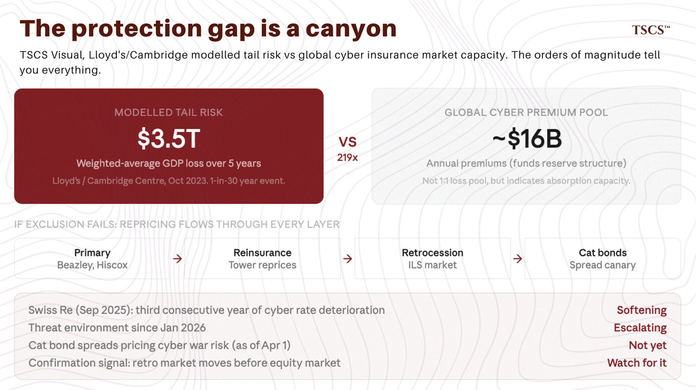](https://substackcdn.com/image/fetch/$s_!_puK!,f_auto,q_auto:good,fl_progressive:steep/https%3A%2F%2Fsubstack-post-media.s3.amazonaws.com%2Fpublic%2Fimages%2F5b8a9c7f-a6a4-458b-a85b-da069a3a2612_1406x789.png)

# The Stryker Template: What Repricing Actually Looks Like

The historical playbook calibrates what to actually expect, and how fast. Because the pattern of state-linked destructive cyber attacks is remarkably consistent, and it tells you both how bad it gets and how fast.

[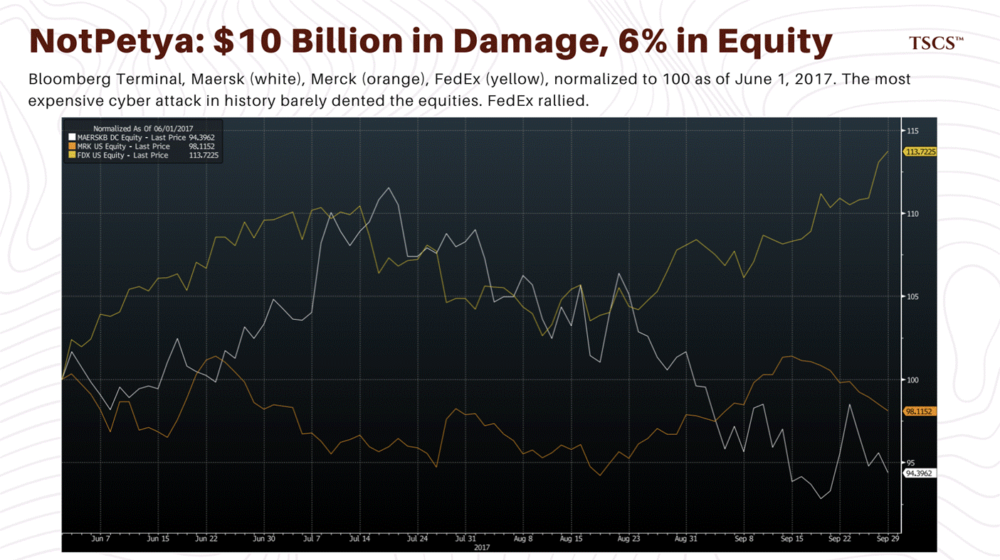](https://substackcdn.com/image/fetch/$s_!MT30!,f_auto,q_auto:good,fl_progressive:steep/https%3A%2F%2Fsubstack-post-media.s3.amazonaws.com%2Fpublic%2Fimages%2Fa9770591-3b9c-4086-9fdf-fc57e68cda7b_1405x788.png)

The chart tells an uncomfortable story for my thesis.

Maersk dropped 6% and never recovered in the quarter. Merck dipped roughly 2% and was back to flat within weeks. FedEx, whose TNT Express division absorbed $400 million in losses, actually rallied 14% over the same period. The equity market treated the most expensive cyber attack in history as a one-time event. This is real evidence for the steelman. If NotPetya couldn’t durably reprice equity, why would the next Iranian wiper?

Honest answer: maybe not, at the single-name equity level. The Stryker drawdown is running longer than any NotPetya name, but the real story is in credit, not equity.

[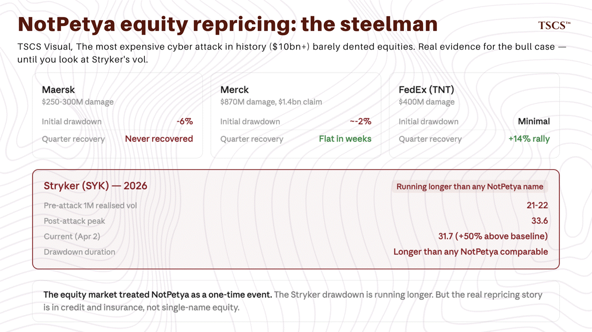](https://substackcdn.com/image/fetch/$s_!0JSg!,f_auto,q_auto:good,fl_progressive:steep/https%3A%2F%2Fsubstack-post-media.s3.amazonaws.com%2Fpublic%2Fimages%2F535bab00-ea3c-46ca-bbc5-4a331abd1adb_1406x789.png)

NotPetya, June 27, 2017. Attributed to Russian military intelligence. A supply chain attack through Ukrainian accounting software that spread globally and wiped systems indiscriminately. Merck suffered approximately $870 million in direct damages and filed an insurance claim for $1.4 billion. Maersk lost $250-300 million. FedEx’s TNT Express division lost $400 million. Total estimated damage exceeded $10 billion. It remains the most expensive cyber attack in history.

The dwell time data is what matters for the current threat. NotPetya’s attackers had a backdoor inside M.E.Doc’s update infrastructure for at least 6 weeks before detonation, with Cisco Talos finding evidence as early as April 2017, roughly 2 to 3 months before the June 27 attack. The Ukraine 2015 grid attack involved 6 to 8 months of pre-positioning before a 10-minute execution that cut power to 225,000 customers. SolarWinds operated undetected for more than 14 months. Shamoon sat inside Saudi Aramco’s network for 3 to 4 months before destroying 30,000 workstations.

The pattern: lengthy preparation that is detectable in theory but frequently missed in practice, followed by near-instantaneous destruction that is too fast to stop once triggered.

[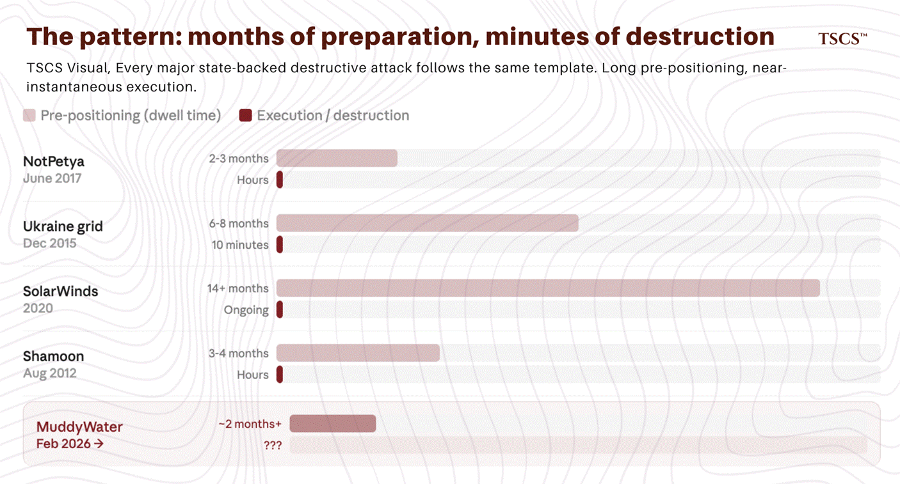](https://substackcdn.com/image/fetch/$s_!LP3f!,f_auto,q_auto:good,fl_progressive:steep/https%3A%2F%2Fsubstack-post-media.s3.amazonaws.com%2Fpublic%2Fimages%2F1c1f9730-7061-40b6-9ace-2507b4c7a93d_1406x757.png)

MuddyWater’s confirmed pre-positioning inside US networks, including a bank, an airport, and a defense-aerospace software supplier, began in early February 2026, according to Symantec and Carbon Black’s Threat Hunter Team. That is approximately two months ago. We are inside the historical window for every major state-backed destructive attack in the modern record.

[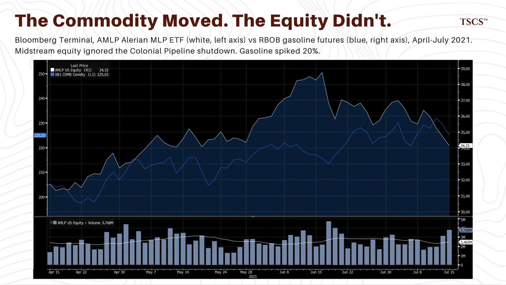](https://substackcdn.com/image/fetch/$s_!i41a!,f_auto,q_auto:good,fl_progressive:steep/https%3A%2F%2Fsubstack-post-media.s3.amazonaws.com%2Fpublic%2Fimages%2F64c76848-7d6c-4499-bb55-1dc83cc06c9f_1406x792.png)

Look at where the repricing actually happened. AMLP, the midstream equity ETF, didn’t flinch. It continued a steady uptrend as though nothing happened. RBOB gasoline futures spiked roughly 20% in the two weeks following May 7. The transmission mechanism ran through the commodity, not the equity. This matters for how you think about your pipeline positions.

Colonial Pipeline, May 2021. A criminal ransomware gang shut down 45% of East Coast fuel supply for six days without ever touching the pipeline’s operational technology. I’ll come back to why that distinction matters when we get to your midstream positions.

So what happens when the attacker isn’t a criminal gang looking for a payday, but a state-backed group with destructive intent, pre-positioned access, and zero interest in negotiation, hitting infrastructure that was never hardened for this threat level, and they don’t even need to touch the OT layer to shut it down?

SYK’s 1-month realized volatility tells the story in one chart. Through February, the stock was trading at 21-22 vol, one of the calmest readings of the year. By mid-March, it had spiked to 33.6. It hasn’t come down. As of April 2, it sits at 31.7, more than 50% above its pre-attack baseline. The market was sleepwalking, and it’s still not fully awake.

[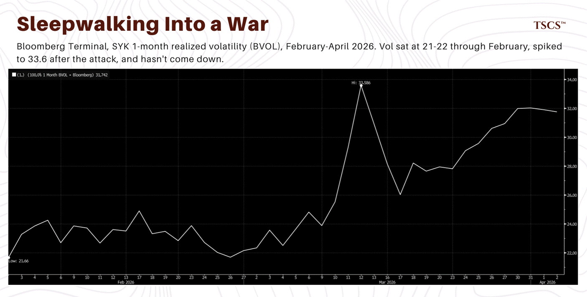](https://substackcdn.com/image/fetch/$s_!NXdk!,f_auto,q_auto:good,fl_progressive:steep/https%3A%2F%2Fsubstack-post-media.s3.amazonaws.com%2Fpublic%2Fimages%2F264ebc4a-d76b-4248-b808-be2b800f45a4_1405x712.png)

# The Trade

If your first instinct is to buy cybersecurity stocks, note that CIBR, the largest cyber ETF, is down 13% year-to-date.

[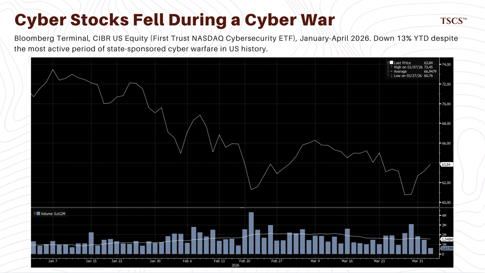](https://substackcdn.com/image/fetch/$s_!jF-h!,f_auto,q_auto:good,fl_progressive:steep/https%3A%2F%2Fsubstack-post-media.s3.amazonaws.com%2Fpublic%2Fimages%2Ff533f85d-1799-4b2a-9343-3c11d6a6f8b4_1403x790.png)

The market sold off cybersecurity names during the most active period of state-sponsored cyber warfare in US history. Growth-to-value rotation, apparently. The asymmetry isn’t in cyber equity.

[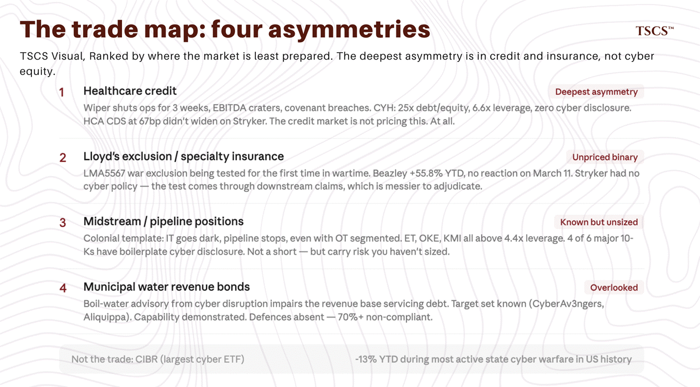](https://substackcdn.com/image/fetch/$s_!Ln1k!,f_auto,q_auto:good,fl_progressive:steep/https%3A%2F%2Fsubstack-post-media.s3.amazonaws.com%2Fpublic%2Fimages%2Faf8bf4a0-7aef-4c54-8319-2238918330ef_1406x778.png)

## The Insurance Trade

If the Beazley and Hiscox chart showed no meaningful reaction to Stryker, that’s the trade. The market hasn’t priced the Lloyd’s exclusion binary.

For sophisticated investors, the options market on London-listed specialty insurers may offer a way to express this view cheaply if implied vol is still at normal levels. The catalyst has a defined timeline: the industry’s coverage determination framework on Stryker-type attacks will be tested within months, not years.

The irony is critical for the trade structure: Stryker did not carry cyber insurance. This is confirmed by both Coalition and Gallagher Re, based on Stryker’s own governance disclosures and regulatory filings.

Stryker chose not to buy cyber coverage. Ate the full cost.

That means the test of Lloyd’s war exclusions on a state-attributed wiper will not come from Stryker directly. It will come from downstream: third-party business interruption claims, contingent loss triggers, and the hospitals and distributors whose operations seized when Stryker’s supply chain went dark.

The exclusion question is now live. It was made live by the fact pattern, not by Stryker’s policy status. And the downstream claims pathway is, if anything, messier for insurers to adjudicate than a direct first-party claim would have been, because each claimant’s policy wording, attribution mechanism, and “major detrimental impact” threshold may differ across a fragmented tower of coverage.

## The Credit Trade

*This is not a completed trade idea. It’s a screening framework that illustrates where the most exposed corner of the market sits, so you can size the tail risk that isn’t being priced. I’m publishing it now because Q1 earnings are weeks away and you need to be looking at this before the catalysts arrive, not after.*

Community Health Systems is the name I keep coming back to.

CYH has a market capitalization of $408 million. It carries $10.3 billion in total debt. The debt is 25 times the equity. Net Debt/EBITDA is 6.6x. Debt as a percentage of total capitalization is 113%, meaning the company has negative book equity. The maturity wall starts in 2029 with $1.9 billion coming due, followed by $2.8 billion in 2030. The 2nd lien bonds, $1.24 billion at 6 7/8% due April 2029 and $1.23 billion at 6 3/8% due April 2030, trade at spreads of 491 and 671 basis points respectively. The ABL facility includes a springing fixed charge coverage ratio that triggers if availability drops below $95 million. As of year-end 2025, CYH had $786 million of ABL availability. That’s the cushion.

The 10-K has extensive disclosure about liquidity risk, debt covenants, refinancing risk, and potential defaults. It acknowledges that “a breach of any of these covenants could result in a default” and that “all amounts outstanding may become immediately due and payable.” What it does not contain, anywhere in the risk factor or liquidity discussion, is a substantive assessment of cybersecurity risk to operations, OT security posture, incident response capability, or business continuity planning for a destructive cyber event.

This is a company operating 70 hospitals that handles protected health information for millions of patients, carrying 25-to-1 debt-to-equity, with a maturity wall approaching, while state-sponsored groups are actively targeting healthcare infrastructure.

A Stryker-scale attack that shuts down operations for three weeks doesn’t just stress the P&L. It triggers a liquidity crisis. Yes, the government would likely step in with accelerated Medicare payments, as CMS did during the Change Healthcare attack in 2024. But those are advances against future revenue, not grants.

They keep the lights on. They don’t replace lost surgical volume, and elective procedures are where all the margin lives. When trailing-twelve-month EBITDA craters, the maintenance covenants on the term loans don’t care whether CMS floated you bridge cash. The springing covenant trips. The ABL draws down. The conversation with lenders begins from a position of negative equity.

This isn’t a recommendation to short CYH debt. In practice, lenders would likely grant forbearance and waive the covenant rather than accelerate into Chapter 11 over a wartime cyber event.

But forbearance comes with amendment fees, tighter terms, and accelerated refinancing timelines that compress whatever equity remains. It’s a map of what the most exposed corner of the market looks like, so you can size the tail risk that isn’t being priced.

The Stryker template tells you exactly how this works.

[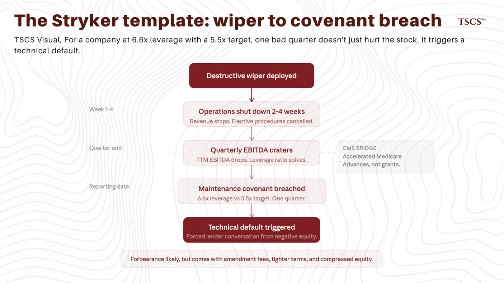](https://substackcdn.com/image/fetch/$s_!TYvF!,f_auto,q_auto:good,fl_progressive:steep/https%3A%2F%2Fsubstack-post-media.s3.amazonaws.com%2Fpublic%2Fimages%2F539e0d27-02b5-4e37-957f-c26ffda094a4_1405x791.png)

A destructive wiper shuts down operations for two to four weeks. Revenue stops. EBITDA for the quarter craters. For a company running at 6.6x leverage with a target of getting below 5.5x, one bad quarter from a cyber attack doesn’t just hurt the stock. It breaches the covenant. It triggers a technical default. It forces a conversation with lenders that nobody is prepared for.

[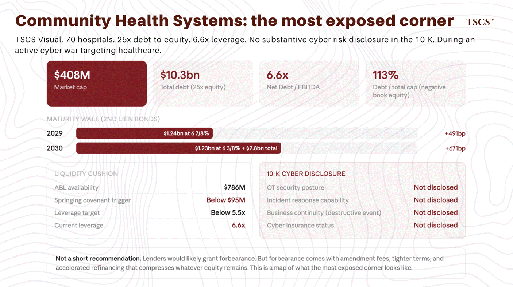](https://substackcdn.com/image/fetch/$s_!4gTJ!,f_auto,q_auto:good,fl_progressive:steep/https%3A%2F%2Fsubstack-post-media.s3.amazonaws.com%2Fpublic%2Fimages%2Fc98e42f6-a611-4ad8-9267-5b8ea32ecba8_1406x789.png)

The healthcare sector is the obvious target. Not because Iran specifically wants to attack hospitals (although Stryker suggests they’re not ruling it out), but because healthcare has the combination of high leverage, weak cyber defenses, operational concentration risk, and direct relevance to public fear that makes it the highest-impact target available. How exposed are hospitals? The honest answer depends on what you count. A 2022 Cynerio study, which the FBI subsequently cited, found 53% of connected medical and IoT devices in hospitals had known critical vulnerabilities. But that number includes printers, VoIP phones, and every other networked device. Newer Armis data scoping only clinical equipment puts the figure closer to 19%. Use whichever number you want. Neither is acceptable for systems connected to patients. There are no mandatory OT security standards for healthcare, though HHS has proposed making HIPAA security requirements mandatory rather than “addressable”, finalization isn’t expected before mid-2026. And the Change Healthcare attack already demonstrated the cascading consequences when a single node in the healthcare IT chain fails.

[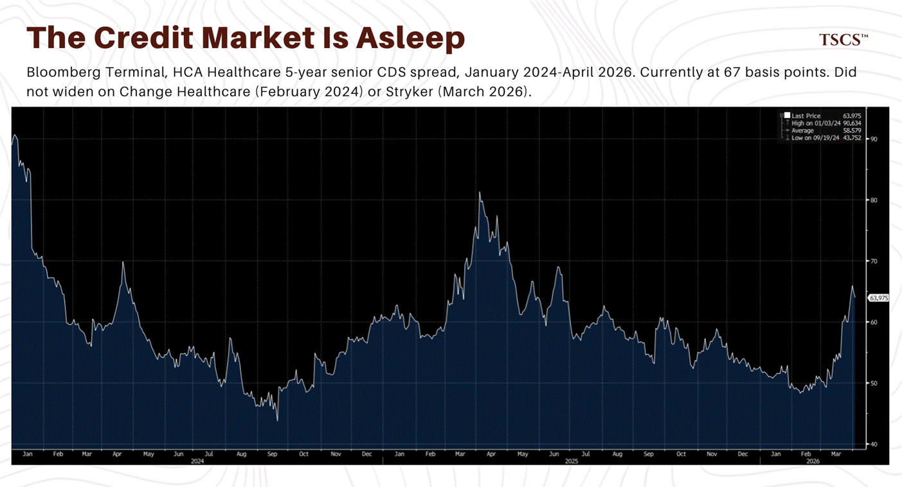](https://substackcdn.com/image/fetch/$s_!Stv3!,f_auto,q_auto:good,fl_progressive:steep/https%3A%2F%2Fsubstack-post-media.s3.amazonaws.com%2Fpublic%2Fimages%2F29b8d24f-eb6a-45ed-accb-f47eee180ef0_1403x759.png)

CYH doesn’t have liquid CDS, which is itself a data point: there’s no market mechanism for pricing this risk at the most levered healthcare issuer. HCA, the largest US hospital chain, does. Its 5-year CDS trades at 67 basis points. The chart shows it ranging between 44 and 90 over the past two years. Change Healthcare was attacked in February 2024. HCA CDS didn’t widen. Stryker was wiped in March 2026. HCA CDS didn’t widen. The most consequential wartime cyber attack in US history, targeting healthcare infrastructure, and the credit default swap market for the largest hospital company in America registered nothing. The credit market is not pricing cyber risk in healthcare.

The munis angle is even more overlooked. Municipal water utilities with revenue bonds face a specific risk. A prolonged boil-water advisory from a cyber disruption, whether it lasts days or weeks, impairs the revenue base that services the debt.

If the vulnerability that CyberAv3ngers exploited at Aliquippa remains substantially unremediated across the installed base, the target set is known, the capability is demonstrated, and the defenses are absent.

## Your Pipeline Positions

I know who reads this letter. A lot of you own midstream energy names. Enterprise Products. Williams. Kinder Morgan. Energy Transfer.

Colonial Pipeline was a midstream operator. DarkSide, a criminal gang, hit the billing system. Never touched the physical pipeline controls. Colonial shut itself down because it couldn’t meter or invoice deliveries and couldn’t verify OT integrity. 45% of East Coast fuel supply went dark for six days.

Actual severe shortages concentrated in five to seven southeastern states, but panic buying amplified the disruption: Charlotte hit 71% of stations dry, Washington D.C. reached 87%. The TSA issued Security Directives in the aftermath, so pipelines are better defended than water systems. But “better defended than water” is not the same as “defended.” And the Colonial precedent tells you something the TSA Directives don’t address: you can air-gap the OT network perfectly and still lose operations for weeks if the IT layer goes dark.

Here’s the leverage table for the midstream names you probably own:

[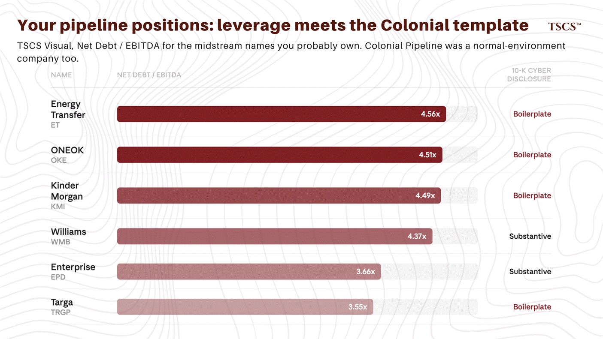](https://substackcdn.com/image/fetch/$s_!R_M0!,f_auto,q_auto:good,fl_progressive:steep/https%3A%2F%2Fsubstack-post-media.s3.amazonaws.com%2Fpublic%2Fimages%2F6ad23196-7753-4a63-b293-4526d8e9b613_1405x791.png)

ET, ONEOK, and Kinder Morgan are all running above 4.4x. These are investment-grade credits and the leverage isn’t alarming in a normal environment. But Colonial Pipeline was a normal-environment company too.

The question for each of these names: not whether the OT network is air-gapped from IT, but whether the company can keep operating, billing, and delivering if the IT side goes dark for two weeks.

Colonial’s OT was reportedly segmented. It didn’t matter. The billing system went down and the pipeline stopped.

I read all six 10-Ks. Two disclose what I’d call substantive cyber programs. Williams discloses a dedicated CISO, a six-member Cybersecurity Executive Advisory Board (CIO, CFO, CHRO, General Counsel, COO), board-level cybersecurity dashboards reviewed at every regularly scheduled board meeting, and explicit TSA compliance tracking. Kinder Morgan discloses a dedicated cybersecurity group whose leaders hold top-secret US government clearances, have attended classified briefings in Washington, carry over 100 years of combined cybersecurity experience, and report quarterly to a named senior management team that includes the CEO, President, CFO, COO, and General Counsel.

The other four disclose materially less. Energy Transfer and ONEOK describe NIST-aligned programs with periodic reporting, but neither names a dedicated CISO and ONEOK discloses board-level cyber briefings only annually. Targa discloses tabletop exercises and third-party assessments but no named cybersecurity leadership. Enterprise Products discloses no cybersecurity framework, no named cybersecurity leadership, no governance detail beyond a standard risk factor, and explicitly states it does not carry cybersecurity-specific insurance.

Not a short call on pipelines. Fundamentals are fine. But if you own midstream names and don’t know which category yours falls into, you’re carrying risk you haven’t sized.

# The Steelman: Why I Might Be Wrong

Pressure test.

[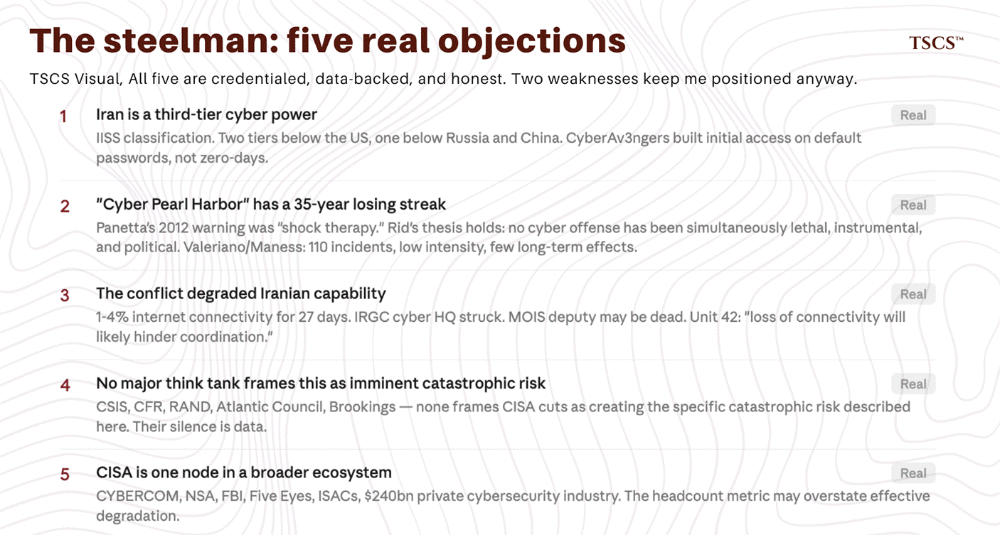](https://substackcdn.com/image/fetch/$s_!v1SC!,f_auto,q_auto:good,fl_progressive:steep/https%3A%2F%2Fsubstack-post-media.s3.amazonaws.com%2Fpublic%2Fimages%2F43a0bc2f-4463-4bb5-b206-e5a0a31ac28f_1406x753.png)

**Iran has never achieved strategic-scale disruption of hardened US infrastructure.** The Stryker attack was a corporate IT wipe. It was not an attack on a power grid, a water system, or a military network. Iran’s most prominent ICS threat group, CyberAv3ngers, built its initial access on default passwords, not zero-day exploits, though by late 2024, Claroty documented IOCONTROL, a custom-built malware platform the group deployed against IoT and OT devices across multiple vendor platforms, only the tenth known ICS-specific malware family ever identified. The IISS classifies Iran as a “third-tier” cyber power, two full tiers below the US, and one below Russia, China, the UK, and Israel, defined as having “potential strengths in some categories but significant weaknesses in others.” CSIS senior fellow Nikita Shah stated in March 2026: “Iranian cyber operations are unlikely to impact or change the course of this war.” That’s a credentialed analyst at a serious institution making a confident call against my thesis.

**The “cyber Pearl Harbor” prediction has a 35-year track record of not happening.** Leon Panetta later described his 2012 warning as a form of “shock therapy” aimed at the American people and at Cyber Command, not, as is commonly misattributed, at Congress specifically. Thomas Rid’s core argument, that no cyber offense has ever been simultaneously lethal, instrumental, and political, remains essentially valid as of April 2026. Valeriano and Maness’s empirical analysis of 110 cyber incidents found them to be “a little-used tactic, with low-level intensity and few to no long-term effects”. Their dataset has been challenged for ending before NotPetya, SolarWinds, and Colonial Pipeline, but the directional finding still holds: catastrophic cyber events remain rare, and betting on them has historically been a losing trade.

**The conflict itself has degraded Iranian cyber capability.** Iran’s internet has been at 1-4% connectivity for 27 consecutive days. Israeli strikes hit the IRGC cyber warfare headquarters in eastern Tehran and may have killed the MOIS deputy intelligence minister overseeing Handala operations. Palo Alto’s Unit 42 assessed that “the loss of connectivity and significant degradation of Iranian leadership and command structures will likely hinder the ability of state-aligned threat actors to coordinate and execute sophisticated cyberattacks in the near-term.” You can’t hack if you can’t get online.

**No major think tank is framing CISA degradation as creating imminent catastrophic risk.** CSIS, CFR, RAND, Atlantic Council, and Brookings have all published on Iranian cyber operations and Trump administration cyber strategy. None has framed the CISA cuts as creating the specific catastrophic asymmetric risk I’m describing here. These institutions employ professional analysts specifically tasked with identifying such risks. Their relative silence is data.

**CISA is one node in a broader ecosystem.** CYBERCOM, NSA, FBI Cyber Division, Five Eyes intelligence sharing, sector-specific ISACs, and a $240 billion private cybersecurity industry all contribute to the defense. The CISA headcount metric, while real, may overstate the effective degradation.

All five are real. But the steelman has two weaknesses that keep me positioned.

**First, it conflates “strategic-scale” with “investment-relevant.”**

The thesis doesn’t need Iran to bring down the power grid. Doesn’t need a cyber Pearl Harbor. It needs one more repricing event.

The Stryker attack erased roughly $9.5 billion in market capitalization from a single company within the first week, with the drawdown deepening to over $12 billion at its trough. Colonial Pipeline triggered FMCSA emergency declarations across 17 states and D.C., with actual fuel station outages concentrated in roughly 11 southeastern states. NotPetya cost $10 billion across more than 2,300 organizations in over 100 countries, with the heaviest financial losses concentrated in roughly ten multinationals. None of these were strategic-scale. All of them repriced assets dramatically.

[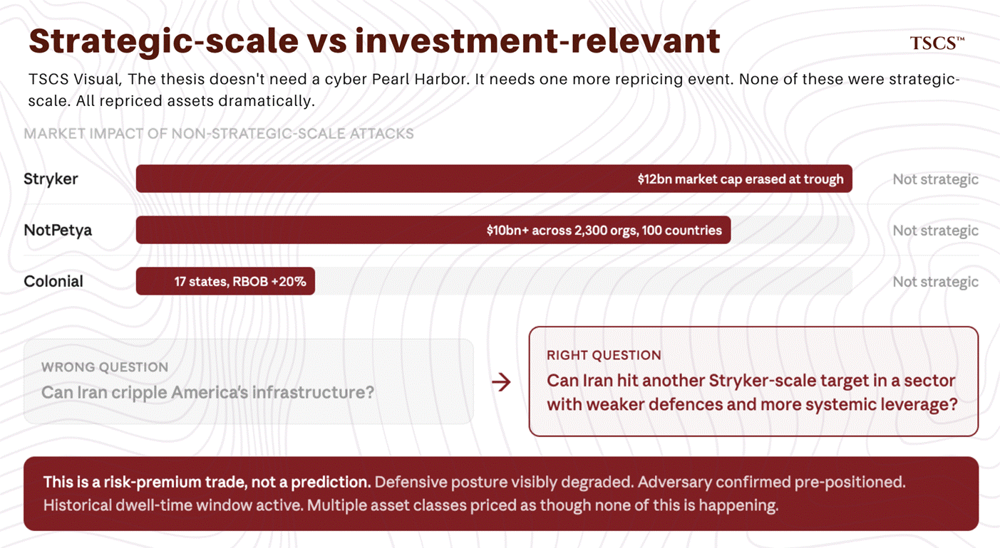](https://substackcdn.com/image/fetch/$s_!kMtO!,f_auto,q_auto:good,fl_progressive:steep/https%3A%2F%2Fsubstack-post-media.s3.amazonaws.com%2Fpublic%2Fimages%2F73c0c45c-f97e-432d-90ae-e863f14b79fa_1403x770.png)

Wrong question: “can Iran cripple America’s infrastructure?” Right question: “can Iran hit another Stryker-scale target in a sector with weaker defenses and more systemic leverage?”

**Second, the think tanks have actually raised alarm.** CFR published “Trump’s Cyber Strategy Falls Short on China, Iran, and the Threats That Matter Most” in March 2026. FDD explicitly warned that Iranian operations are “taking advantage of weakened U.S. defenses.” The absence of a specific “imminent catastrophic risk” framing may reflect institutional caution about predictions, not analytical disagreement about the underlying vulnerability.

Think tanks don’t make investment calls. I do.

*This is a risk-premium trade, not a prediction. The defensive posture is visibly degraded, the adversary is confirmed pre-positioned, the historical dwell-time window is active, and multiple asset classes are priced as though none of this is happening.*

**Probability weights:** I assign these weights for portfolio sizing purposes, not because I believe the underlying probability is knowable with this precision. The sample of state-vs-state destructive cyber operations during active conflict is too small to derive base rates. What follows is scenario weighting based on the five factors laid out above, all active simultaneously, calibrated against the historical precedents discussed in this piece. If your framework requires point estimates to size a position, use these. If it doesn’t, the directional logic matters more than the specific numbers.

[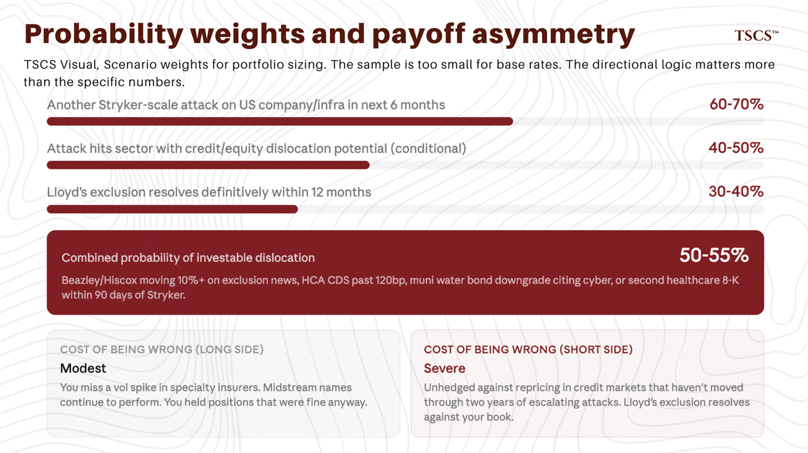](https://substackcdn.com/image/fetch/$s_!zegx!,f_auto,q_auto:good,fl_progressive:steep/https%3A%2F%2Fsubstack-post-media.s3.amazonaws.com%2Fpublic%2Fimages%2F369f23e4-4d7d-487d-a4f5-52f0ad84ceae_1406x789.png)

Probability that at least one additional Stryker-scale destructive cyber attack hits a US company or critical infrastructure operator in the next six months: 60-70%.

Any one of the five factors alone (degraded defenses, confirmed pre-positioning, demonstrated adversary capability, historical dwell-time window, voluntary-only security standards across most target sectors) wouldn’t justify this weight. The conjunction is what moves it.

Probability that such an attack hits a sector with meaningful credit or equity dislocation potential, healthcare, water/munis, energy infrastructure: 40-50% conditional on the attack occurring.

Probability that the Lloyd’s exclusion binary resolves definitively within 12 months: 30-40%. This is lower than I initially estimated, and the revision matters. The living-off-the-land attack vector and the absence of traditional malware signatures make forensic attribution legally contestable in a way that favours protracted proceedings. But a definitive resolution is not required for the trade to work. The uncertainty itself reprices risk budgets across the corporate and insurance sectors within quarters, not years.

The combined probability of at least one of these catalysts triggering a dislocation I’d define as investable, meaning: Beazley or Hiscox moving more than 10% on a single session on exclusion-related news, HCA 5-year CDS widening past 120 basis points, a municipal water utility revenue bond downgrade citing a cyber incident, or a second 8-K filing from a healthcare operator disclosing a destructive cyber event within 90 days of Stryker: I put it around 50-55%.

That’s high enough to position around. Not high enough to bet the book. And if the number is wrong by ten points in either direction, the asymmetry in the payoff structure still favours the position: the cost of being wrong on the long side (you miss a vol spike in specialty insurers, you hold midstream names that continue to perform) is modest. The cost of being wrong on the short side (you’re unhedged against a repricing event in credit markets that haven’t moved through two years of escalating attacks, and the Lloyd’s exclusion binary resolves against your book) is severe.

# Kill Switches: I’m Wrong If…

[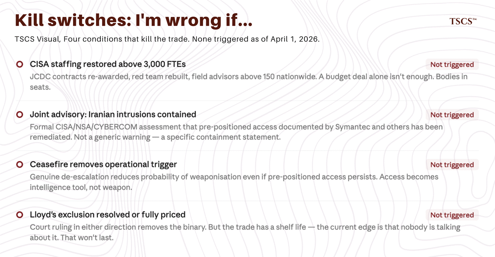](https://substackcdn.com/image/fetch/$s_!MkcW!,f_auto,q_auto:good,fl_progressive:steep/https%3A%2F%2Fsubstack-post-media.s3.amazonaws.com%2Fpublic%2Fimages%2F53bc34d2-cc3b-4f7f-b16b-bf6ae2c46082_1403x729.png)

What kills the trade:

**1. CISA staffing is restored above 3,000 FTEs with contractor support reconstituted.** That would mean the political headwinds have reversed and the defensive gap is closing. I’d need to see the JCDC contracts re-awarded, red team capability rebuilt, and field advisors back above 150 nationwide. A budget deal alone isn’t enough. I need to see bodies in seats.

**2. A formal joint CISA/NSA/CYBERCOM advisory states that Iranian cyber intrusions in US critical infrastructure networks have been identified and contained.** Not a generic threat warning. A specific assessment that the pre-positioned access documented by Symantec and others has been remediated.

**3. A ceasefire that removes the operational trigger for escalatory cyber operations.** Iranian cyber attacks have historically tracked the intensity of the broader geopolitical confrontation. A genuine de-escalation reduces the probability of weaponization even if pre-positioned access persists. The access becomes an intelligence tool rather than a weapon.

**4. The Lloyd’s exclusion question is resolved definitively, or the market prices the ambiguity fully**. A court ruling in either direction removes the binary. But the trade has a shelf life. The current edge is that nobody is talking about it. That won’t last.

**None of these kill switches is triggered as of April 1, 2026.**

# What I’m Watching

[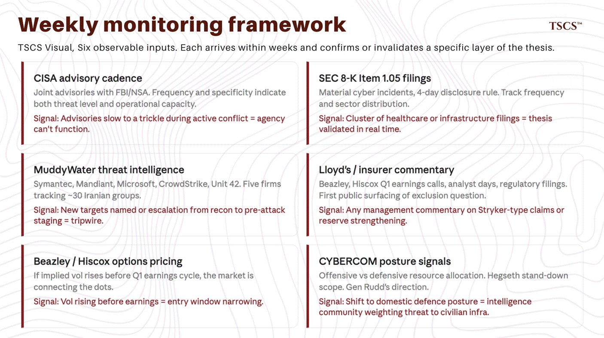](https://substackcdn.com/image/fetch/$s_!vzZV!,f_auto,q_auto:good,fl_progressive:steep/https%3A%2F%2Fsubstack-post-media.s3.amazonaws.com%2Fpublic%2Fimages%2Fce2626ef-329b-440d-9459-45625154db32_1406x789.png)

Weekly monitoring framework:

**CISA advisory cadence.** CISA publishes joint advisories with the FBI and NSA when specific threats are identified. The frequency and specificity of these advisories is a real-time indicator of both the threat level and CISA’s operational capacity. If advisories slow to a trickle during an active conflict, that itself is information about the agency’s ability to function.

**SEC 8-K Item 1.05 filings.** Since December 2023, publicly traded companies must disclose material cybersecurity incidents within four business days of determining materiality, not four days from the incident itself. I’m tracking the frequency and sector distribution of these filings. A cluster of healthcare or infrastructure 8-K filings would validate the thesis in real time.

**Threat intelligence reporting on MuddyWater/Seedworm activity.** Symantec broke the March 2026 Dindoor/Fakeset discovery, and Mandiant maintains the definitive APT taxonomy, but Microsoft Threat Intelligence now tracks roughly 30 Iranian “Sandstorm” groups with unmatched visibility through Azure/M365/Windows telemetry, and CrowdStrike and Palo Alto Unit 42 both publish extensive Iranian operational reporting. New reports from any of these five firms naming additional targets or describing escalation from reconnaissance to pre-attack staging are the tripwire.

**Lloyd’s and specialty insurer commentary on the Stryker claim.** Earnings calls, analyst days, and regulatory filings from Beazley, Hiscox, and major Lloyd’s syndicates will be the first place the exclusion clause question surfaces publicly. Q1 earnings season starts in weeks.

**Beazley and Hiscox equity and options pricing.** If the market starts connecting the Lloyd’s exclusion binary to these stocks before the Q1 earnings cycle, the entry window narrows.

**CYBERCOM posture and leadership signals.** The February 2025 Hegseth stand-down order paused offensive cyber operations against Russia specifically, not Iran, and Gen. Haugh’s April 2025 firing left the dual-hatted CYBERCOM/NSA command vacant for months. Any public indication that CYBERCOM is reconstituting offensive capacity against Iran, or conversely shifting resources to domestic defense, would signal how the intelligence community is weighting the threat to civilian infrastructure versus the offensive campaign.

# Conclusion

None of the kill switches above has triggered. The defensive gap is open, the adversary is inside, the insurance framework is untested, and none of it is in the price.

You’re watching the wrong screen.

[Share](https://tscsw.substack.com/p/already-inside-not-yet-priced?utm_source=substack&utm_medium=email&utm_content=share&action=share&token=eyJ1c2VyX2lkIjoxNDAwMjQ1LCJwb3N0X2lkIjoxOTMwMDU0NzYsImlhdCI6MTc3NTQzMTkzMiwiZXhwIjoxNzc4MDIzOTMyLCJpc3MiOiJwdWItMjM1NDI0NCIsInN1YiI6InBvc3QtcmVhY3Rpb24ifQ.53WGHAUyoKvWoyebvMuMzd3P2FronBQbe9UCBwVEOPE)

[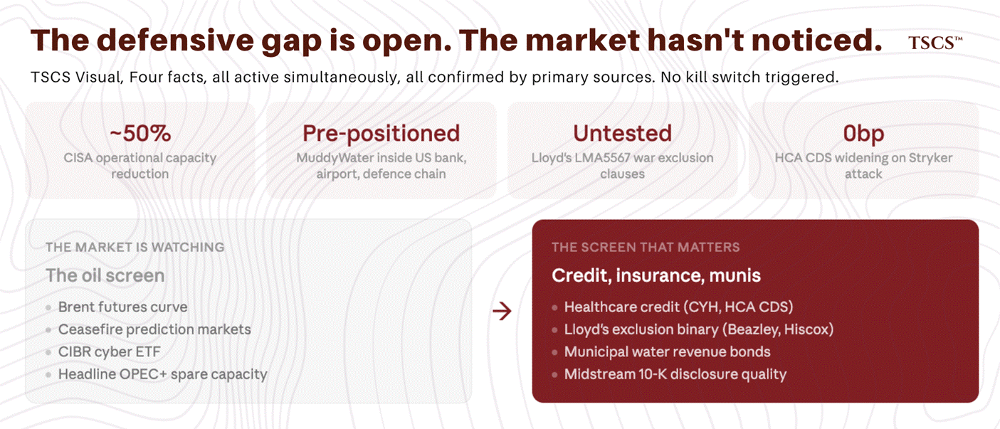](https://substackcdn.com/image/fetch/$s_!FUNm!,f_auto,q_auto:good,fl_progressive:steep/https%3A%2F%2Fsubstack-post-media.s3.amazonaws.com%2Fpublic%2Fimages%2F3b92a270-2134-427c-9d1a-d16e700f7c44_1405x603.png)

---

*Disclaimer: This is not investment advice. TSCS holds no positions in any securities mentioned in this piece as of publication. All views are the author’s own. Do your own work.*