Gold miners are printing $3,000 margins per ounce for the first time in history. The market prices them like it’s 2015 and gold is at $1,100. Five companies. Three producers, two developers. Every one of them reports or hits a major catalyst within ninety days.

Two weeks ago I published “Gold Is Not Failing.” Gold was at $4,100 and falling. The thesis was specific: the selloff was a dollar liquidity event, not a repricing.

The MOVE-VIX spread had hit the 95th percentile. That told you the stress was in the plumbing, not the economy. The Brent-Dubai crude spread had blown out to $14.57, 98th percentile of its historical range, measuring the premium the world was willing to pay for oil that could actually move versus oil trapped behind a closed strait. Sovereigns with tripled energy import bills were selling their most liquid unencumbered reserve asset to raise dollars. Gold was the getaway car. It was being used, not abandoned.

[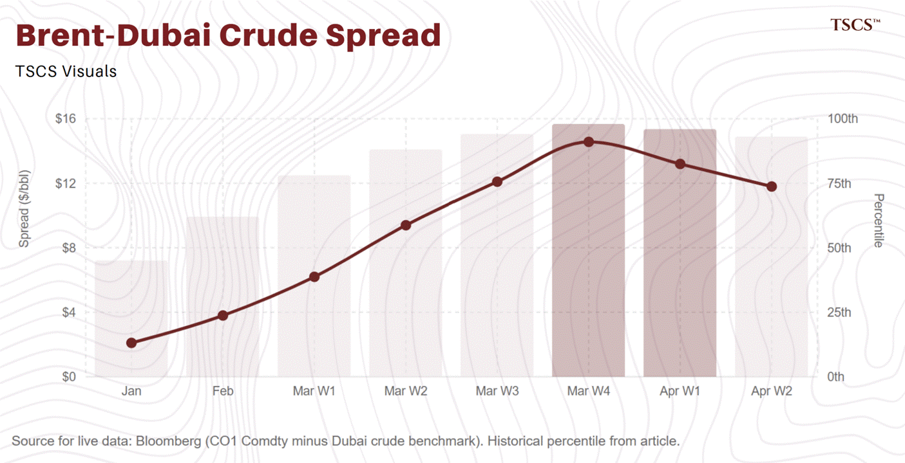](https://substackcdn.com/image/fetch/$s_!3wbO!,f_auto,q_auto:good,fl_progressive:steep/https%3A%2F%2Fsubstack-post-media.s3.amazonaws.com%2Fpublic%2Fimages%2Fef40e91a-7694-4e2a-9ca6-64bf9b6cfd2f_1405x720.png)

Gold is $4,672 today. The tourists who sold fifty tons of GLD in March are gone. The DSI went from 15 back to neutral. The BPGDM recovered from 2%.

One note on numbers throughout this piece. Q1’s average realized gold price was roughly $4,975, above where spot sits today. The margin math and valuation work that follows uses current spot, not Q1’s peak. If gold drifts back toward $4,500, margins compress but the thesis holds at every name below. If it revisits $4,975, the Q1 earnings prints become the new baseline and everything I’m about to say gets more aggressive.

One note on currencies. Alamos, Agnico Eagle, and Perpetua are quoted at their U.S.-listed prices in USD. Wesdome and Skeena are quoted at their TSX prices in CAD. Consensus estimates match the listing currency. Where I reference company-reported figures, I use the company’s reporting currency.

[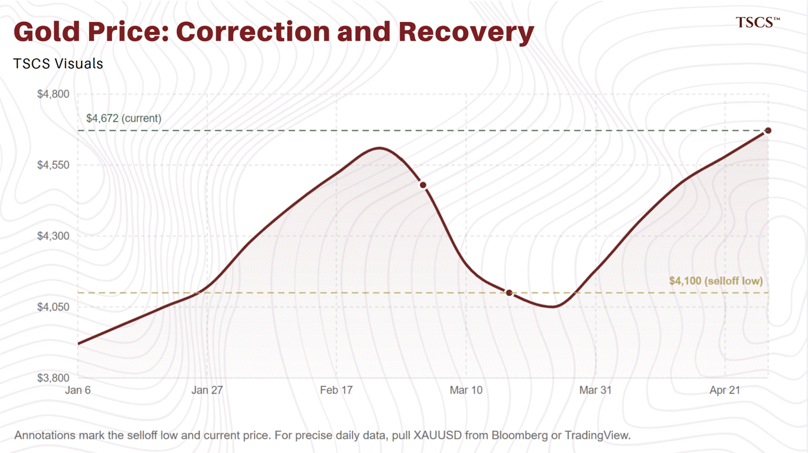](https://substackcdn.com/image/fetch/$s_!8HSp!,f_auto,q_auto:good,fl_progressive:steep/https%3A%2F%2Fsubstack-post-media.s3.amazonaws.com%2Fpublic%2Fimages%2F391492da-c234-4590-98c8-0e4349d6387c_1405x789.png)

I got the mechanism right. Here’s what comes next.

The macro case for gold over the next twelve to twenty-four months fits in one sentence. Oil has doubled, inflation is accelerating, and the Fed is politically incapable of responding. High oil prices, higher inflation, negative real rates, higher gold prices. We have seen this movie before. It was called the 1970s.

The numbers are already ugly. Gas at $4.09, up 37% in five weeks. ISM Prices Index at 78.3%, highest since June 2022. Fatih Birol at the IEA calling it the worst energy crisis in decades, 11 million barrels per day offline. In absolute barrel terms that exceeds the 1973 and 1979 shocks combined, though the global market has roughly doubled since then, so the percentage comparison flatters the headline. And as I laid out in “There Is No V-Shape,” the supply recovery that everyone is pricing as a matter of weeks is physically impossible. You can’t restart stagnant pipelines, clear thousands of mines, cold-start refineries, and reprice paralyzed insurance markets on a ceasefire timeline. Kuwait had every advantage imaginable and it still took two and a half years.

[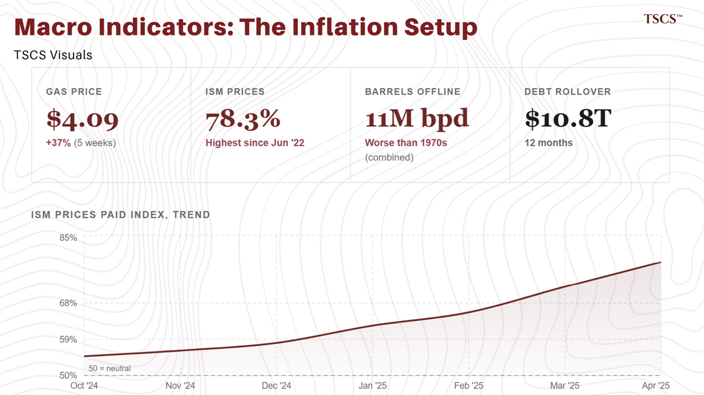](https://substackcdn.com/image/fetch/$s_!nnNz!,f_auto,q_auto:good,fl_progressive:steep/https%3A%2F%2Fsubstack-post-media.s3.amazonaws.com%2Fpublic%2Fimages%2Faafc05d2-917a-4740-99c3-94815887031d_1405x789.png)

The inflation problem existed before the war. CPI was already running closer to 3% than the Fed’s 2% target. Tariffs were adding pressure. Now you have an energy shock layered on top.

Warsh is the interesting variable. When Trump announced the nomination in late January, Hickey, who has been writing the High-Tech Strategist since 1987, flagged him as a genuine hawk. A longtime critic of Fed money printing. A reformer who wanted to shrink the balance sheet. The kind of appointment that popped the precious metals bubble overnight. Gold fell 9% and silver crashed 30% the day of the announcement. Two months and a war later, the political math overwhelms the policy instincts. Volcker tightened into the Iranian oil shock. I am not dismissing the possibility. But 1980 debt-to-GDP was 31%. Today it is north of 120%. There is $10.8 trillion rolling over in the next twelve months. The fiscal math that let Volcker inflict pain does not exist anymore. The political math is worse. Midterms are approaching. The administration needs lower rates. Warsh is nominated but not yet confirmed. His Senate hearing is scheduled for mid-April, and Senator Tillis is blocking the process pending a DOJ investigation of Powell. Powell’s term expires May 15. If confirmation drags, there could be a leadership vacuum at the Fed. That said, Warsh is on record wanting lower rates. The constraints are real, even if the instincts point the other way.

Here is the bear case nobody is talking about. It is not “everything liquidates in a panic.” That is the obvious one. The one that keeps me up is simpler. Inflation runs so hot the bond market does the Fed’s job. Long-end rates sell off on inflation expectations. Real rates go positive not because the Fed hikes but because the market forces it through the curve. Gold does not need a rate hike to struggle. It just needs real rates to flip. The bond market can do that on its own. I do not think this is the base case. $10.8 trillion in U.S. debt is rolling over in the next twelve months. The Treasury cannot afford positive real rates any more than gold bulls can. But the possibility exists. Anybody telling you they have certainty about the rate path right now is selling you something.

Central banks bought over 1,000 tons of gold in each of the last three years. The Poland central bank floated selling gold to fund defense spending and the idea got killed within hours because it literally violates EU treaty law. I wrote about that in “Gold Is Not Failing.” The fact that they even tried tells you how intense the pressure is. The fact that it got shut down tells you the selling has limits. Turkey did their swap thing again, 58-60 tons in March, but they’ve done this before and bought it all back within two years. Russia sells and buys regularly without changing overall holdings much. The “central banks are selling” narrative is overdone.

[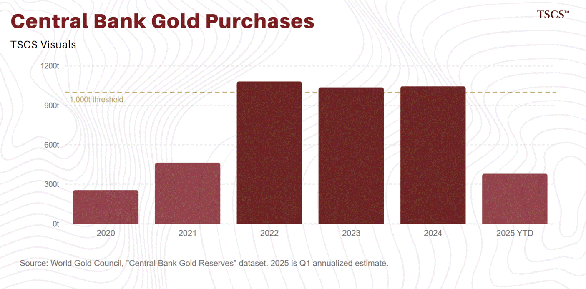](https://substackcdn.com/image/fetch/$s_!GUpR!,f_auto,q_auto:good,fl_progressive:steep/https%3A%2F%2Fsubstack-post-media.s3.amazonaws.com%2Fpublic%2Fimages%2Fe1c621ff-d722-49a5-9a9c-5ef1801b308b_1405x693.png)

The structural bid is intact. De-dollarization is accelerating. BRICS nations are diversifying out of Treasuries and into gold and Trump’s tariff wars and military posture have only given them more reason to do it. North American retail, which has been basically absent from this market for years, is starting to show up. When they pile in alongside the Eastern buyers who have been driving this move since 2022, that’s when it gets parabolic.

I do not want to oversell this. I laid out the bear case in “Gold Is Not Failing” and I stand by every word. If Hormuz stays closed for months, not weeks, the global economy does not slow down. It stops. That is not stagflation. That is a deflationary bust, and gold keeps falling because the forced sellers get more desperate. I put that at roughly one in four odds. It is not my base case but it is not a tail risk either. Anybody telling you they know how this resolves is lying to you.

The liquidation trigger might not even be energy. It might be private credit. Blue Owl received $5.4 billion in redemption requests in Q1, with investors asking for 40.7% of one fund's capital back. Blue Owl slammed the gates and capped actual payouts at 5%. The gating is the point: the private credit market is functionally illiquid, and when the gates close, trapped LPs are forced to liquidate their most liquid assets to cover their needs. Gold is the most liquid thing a lot of these portfolios own.

What we described is not hypothetical anymore. The PE/PC/VC complex is sitting on 32,000 unsold companies worth $3.8 trillion. If that unwinds, liquid assets get sold to cover illiquid losses, and gold is the most liquid thing a lot of these portfolios own.

Hickey warns about the same thing from the gold side. Gold is liquid. In a panic, liquid things get sold. If private credit blows up, if the AI capex cycle cracks (Bloomberg reported this week that almost half of domestic data centers scheduled for completion this year face delays or cancellation), if more Gulf energy infrastructure gets destroyed, everything sells. Including gold. I described this mechanism in “Gold Is Not Failing” using the MOVE-VIX spread and the sovereign forced-selling framework. The Q1 correction proved this market can move 27% against you in seven weeks. I sat through it. It was not fun.

The path to being right on a 12-month thesis can include a 20% drawdown in month two. Size your gold allocation for that possibility, not for the scenario where it goes up in a straight line from here.

[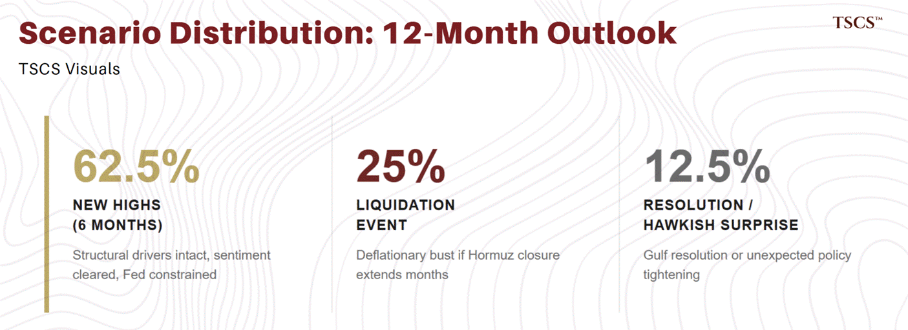](https://substackcdn.com/image/fetch/$s_!E2nM!,f_auto,q_auto:good,fl_progressive:steep/https%3A%2F%2Fsubstack-post-media.s3.amazonaws.com%2Fpublic%2Fimages%2Fd092e90a-fb12-4007-8341-71a481f06f29_1405x512.png)

My base case is that gold makes new highs within six months. I would put it at better than even odds. The precision of a number like 60-65% is false given the number of moving pieces, but the directionality is what matters: the structural drivers are intact, the speculative excess has been cleared, and the political constraints on the Fed are real. Against that, the one-in-four liquidation scenario I described above and the residual chance that a Gulf resolution or hawkish surprise undercuts the thesis. The speculation has been cleared. The structural drivers haven’t changed. They’ve gotten stronger.

That's the macro. What follows is how I'm expressing it. Five companies. The math. Where I was wrong. What I hold.

Subscribed

# The miner setup

The average realized gold price in Q1 was roughly $4,975 an ounce, per Hickey’s calculations, which align with my own back-of-envelope work from spot price averaging. That’s 74% higher than Q1 last year. Costs are up maybe 10-15%, mostly from higher royalties, which is just a mechanical function of the gold price being higher. You pay more royalties because you’re making dramatically more money. That’s the definition of a good problem.

[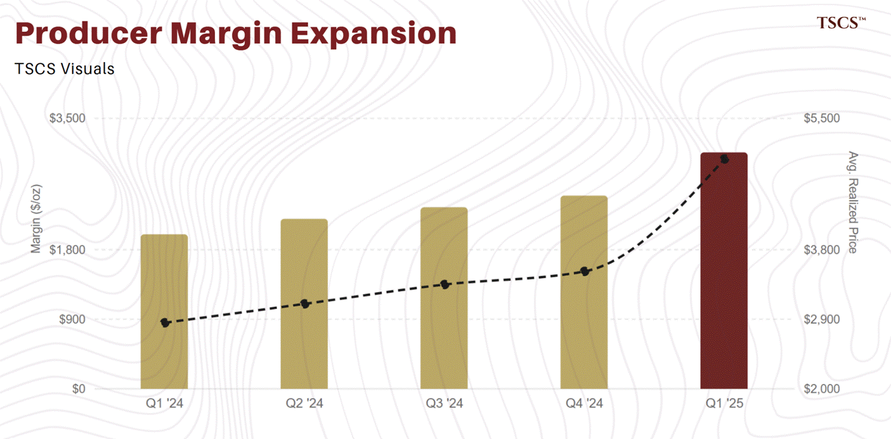](https://substackcdn.com/image/fetch/$s_!xMXx!,f_auto,q_auto:good,fl_progressive:steep/https%3A%2F%2Fsubstack-post-media.s3.amazonaws.com%2Fpublic%2Fimages%2F9a803bf1-9d02-418c-99e7-8c73673971f3_1405x693.png)

The margin math is straightforward. A year ago producers were making $2,000 an ounce. Now they’re making $3,000+. That flows straight to earnings and free cash flow. And Q1 reports start this month. Newmont April 23. Alamos April 29. Agnico April 30. These numbers are going to be the best the industry has ever printed at this scale. $3,000+ margins on millions of ounces.

The stocks trade at 3.9x to 15.3x forward earnings. These companies are running 65-73% EBITDA margins with zero debt and fortress cash balances and the market still prices them like it’s 2015 and gold is at $1,100. The discount to other commodity producers running comparable margins is historically wide.

Fifteen years of broken promises from the mining industry earned that discount. The names in this piece were selected because they break the pattern. I’ll get into the specifics. But the sector-level point is simple: the market has not caught up to what $4,672 gold means for these businesses, and Q1 earnings are about to force the conversation.

[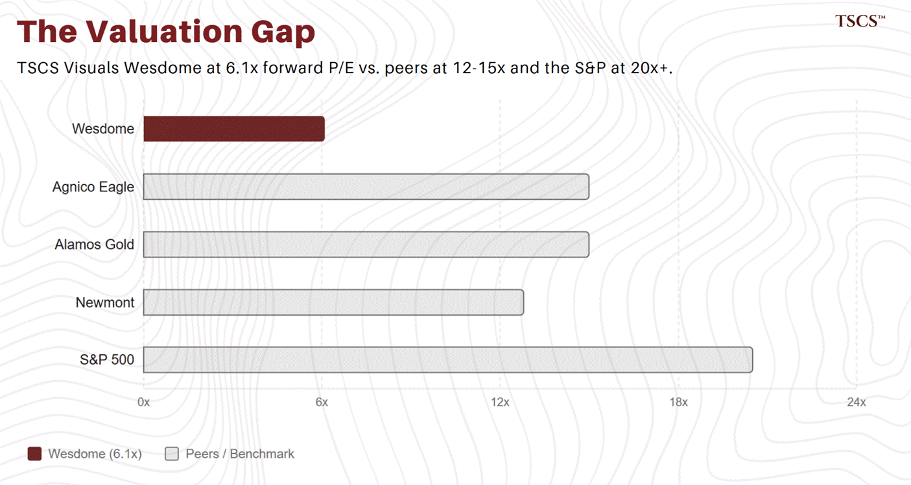](https://substackcdn.com/image/fetch/$s_!S9Tu!,f_auto,q_auto:good,fl_progressive:steep/https%3A%2F%2Fsubstack-post-media.s3.amazonaws.com%2Fpublic%2Fimages%2F771aaa42-b07f-4a12-8fc3-85eb0425edc6_1405x750.png)

A note on methodology. I use P/E and EV/EBITDA throughout this piece because they’re the metrics most readers can pull up on a screen and compare across sectors. But mining is a depleting asset business. Every ounce we sell is an ounce we can never sell again. P/E doesn’t capture reserve life, sustaining capital requirements, or the difference between accounting earnings and actual free cash flow after the money you have to spend just to keep the mine running. The transparent standard for mining valuation is Price to Net Asset Value (P/NAV) derived from a discounted cash flow model over the life of mine, alongside free cash flow yield.

[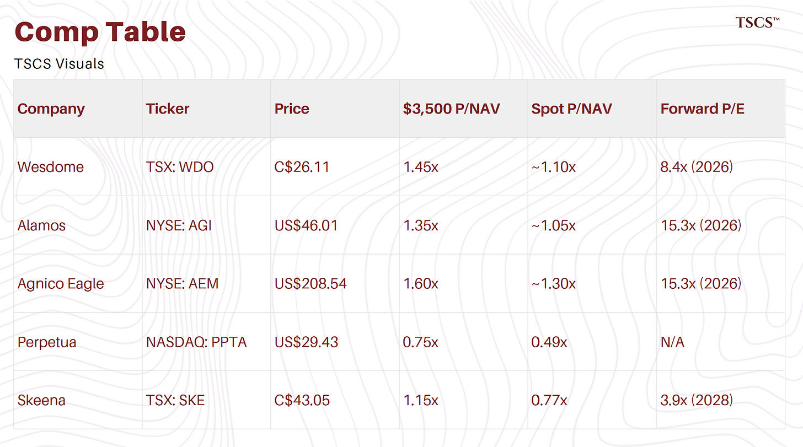](https://substackcdn.com/image/fetch/$s_!iOHs!,f_auto,q_auto:good,fl_progressive:steep/https%3A%2F%2Fsubstack-post-media.s3.amazonaws.com%2Fpublic%2Fimages%2Fa53ebfd3-adfc-4bf7-96c0-e5fbdff359a5_2112x1176.png)

I’ve included P/NAV at both spot and a $3,500/oz base case in the table above. The base case strips out the current gold price euphoria and shows you the downside floor: what these businesses are worth if gold mean-reverts 25% from here. The spot P/NAV shows what the market is currently leaving on the table. Both numbers matter. The base case tells you whether you survive a correction. The spot number tells you how much you’re being paid to take the risk.

One disclosure on comparability: the developer NAVs (Perpetua and Skeena) are modeled at $4,500 gold. I’ve standardized to $3,500 in the table to make the discounts comparable. At $3,500, Skeena’s discount widens, which tells you something important about where the real asymmetry sits at more conservative assumptions.

What follows is five companies across the spectrum. Producers and construction-stage developers, each selected because they break the pattern of broken promises that earned the mining sector its discount. I hold positions in several of them. Gold miners are roughly 20-25% of my portfolio. For the names I’ve published on before, I’ll tell you what’s changed and where my prior analysis needs correcting. For the new initiation, I’ll explain why now.

If you have read the Epic Fury series, you have the macro. If you have read “Gold Is Not Failing,” you know why the March correction was a buying opportunity, not a thesis failure. If you have read “Private Credit Is Lying To You,” you know the systemic risk I am watching on the other side of the trade. What follows is how I am expressing all three.

**WESDOME GOLD MINES (TSX: WDO / OTCQX: WDOFF)**

I published a deep dive on Wesdome in December at C$20. The thesis was that the market was pricing it like a disaster while the financials said it was a gold mine. Eagle River was the golden goose printing 65% EBITDA margins. Kiena was the problem child with hoist failures and contractor execution issues. Philip Yee’s appointment as CFO was the signal that a “Kirkland Lake discipline” turnaround was coming. The stock is C$26.11 today. Every measurable fundamental has improved since December. More cash, higher margins, stronger production, management openly discussing dividends for the first time. And the stock went down.

This is the kind of thing that makes you question whether markets work. Then you remember that markets work over quarters and years, not weeks, and that the inefficiency is the opportunity.

For those who weren’t around in December: Wesdome runs two underground gold mines in Canada. Eagle River in Wawa, Ontario, and Kiena in Val-d’Or, Quebec. Eagle River is mining at 13-14 grams per tonne, which is roughly triple the grade of a typical Canadian underground gold mine. At that grade, the economics are obscene. Every tonne through the mill generates outsized revenue relative to extraction cost. That’s where the margins come from.

Kiena is the problem child. I wrote extensively about this in December. Built in 1981, shut down in 2013, restarted in 2024 after Wesdome discovered a high-grade deposit hiding underneath the old workings. The history matters because it explains the market’s skepticism. This mine has broken hearts before. Passed between owners, mothballed, false-started, and the hoist failure in mid-2025 triggered the same pattern recognition investors have been conditioned to feel since the 2013 shutdown. The ramp-up has been rough. A two-week hoist shutdown in mid-2025 killed a quarter’s worth of production. Contractor execution has been poor because Agnico Eagle, which operates three mines within driving distance, hoovers up every skilled underground miner in the region. Wesdome gets the B-teams. The B-teams underdelivered.

The market looked at the Kiena problems and decided the whole company was broken. The market was wrong.

**The numbers**

Q4 EPS came in at C$0.79, beating estimates of C$0.74 by 6.8%. Full-year net income came in at C$349.5 million, or approximately C$2.32 per share, up roughly 160% over 2024. Revenue rose 64% to C$914 million. EBITDA margins expanded from 55% in 2024 to nearly 66% in 2025. Free cash flow in Q4 was C$97 million, or C$0.65 per share. For the full year, free cash flow more than doubled to C$278 million.

[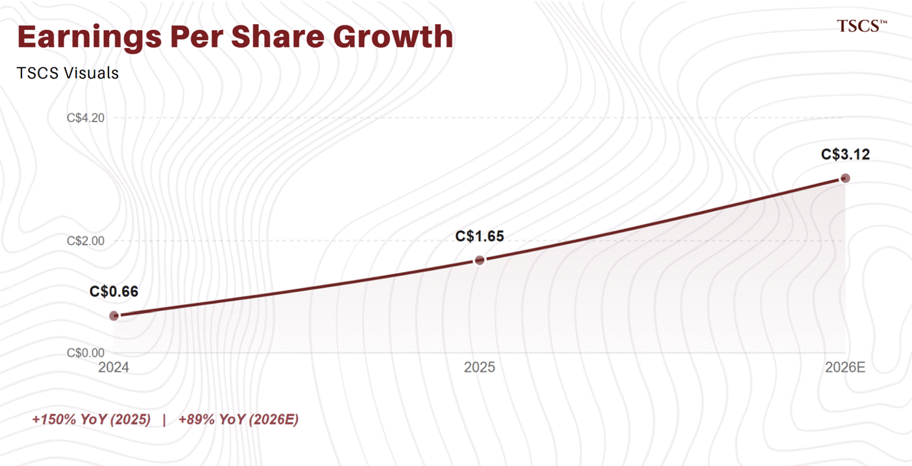](https://substackcdn.com/image/fetch/$s_!5y4u!,f_auto,q_auto:good,fl_progressive:steep/https%3A%2F%2Fsubstack-post-media.s3.amazonaws.com%2Fpublic%2Fimages%2F35c73c33-d852-412c-b3b0-bb0920233661_1405x718.png)

Cash on the balance sheet: C$354 million. Total debt: C$2.5 million. Not billion. Million. This company has 140 times more cash than debt. In an industry where overleveraged balance sheets have destroyed shareholder value in every single cycle, that ratio is absurd.

[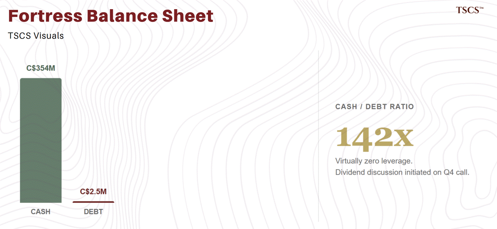](https://substackcdn.com/image/fetch/$s_!_v5P!,f_auto,q_auto:good,fl_progressive:steep/https%3A%2F%2Fsubstack-post-media.s3.amazonaws.com%2Fpublic%2Fimages%2F1a4bbe32-4f43-4396-83fd-99ff89a24b9c_1405x648.png)

Forward estimates. Consensus 2026 EPS is C$3.12. At C$26.11, that is an 8.4x forward P/E. On the Q4 call, CFO Yee provided two FCF scenarios for 2026. The base-case budget, modeled on gold below US$4,000/oz, projects CAD$350 million in free cash flow. At US$5,000/oz gold, he said free cash flow “should exceed CAD$500 million.” At C$26.11, the stock trades at roughly 11x the base-case FCF and 7.8x the upside scenario. Even the conservative number implies a free cash flow yield near 9%.

[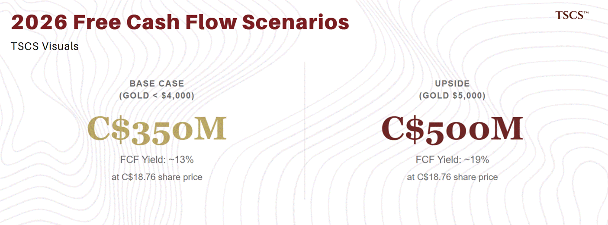](https://substackcdn.com/image/fetch/$s_!euBA!,f_auto,q_auto:good,fl_progressive:steep/https%3A%2F%2Fsubstack-post-media.s3.amazonaws.com%2Fpublic%2Fimages%2F04f4fb8b-4b24-464f-84e1-e72a51fe6e79_1405x522.png)

Agnico trades at 15x. Alamos trades at 15x. Wesdome trades at 8.4x. The discount to its direct peers is the number that matters. Gold miners should trade below the broad market because they sell a depleting asset. But they should not trade at 45% discounts to peers running similar margins in similar jurisdictions.

The 2026 EBITDA margin projection is 73%. I called the 65% margin “elite territory, typically reserved for royalty companies” in December. It got better. At US$4,672 gold and midpoint AISC guidance of US$1,612, Wesdome is generating roughly US$3,060 in margin on every ounce it sells.

[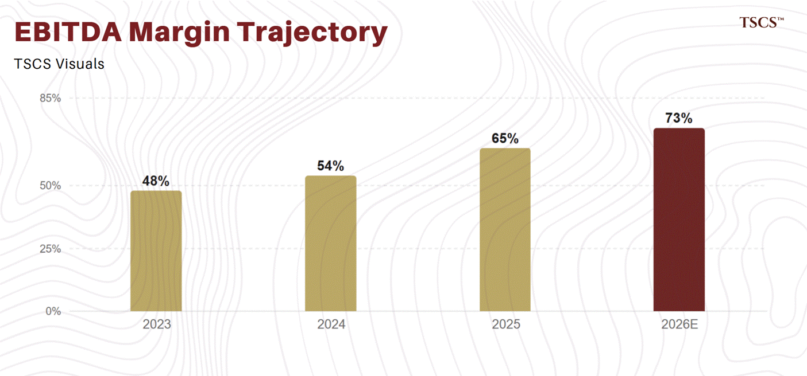](https://substackcdn.com/image/fetch/$s_!pPyF!,f_auto,q_auto:good,fl_progressive:steep/https%3A%2F%2Fsubstack-post-media.s3.amazonaws.com%2Fpublic%2Fimages%2F42f7483a-79bf-42b3-bd27-6d33be899799_1405x656.png)

**So why is it this cheap?**

Three reasons and they’re all fixable.

Mine life perception. Wesdome’s disclosed reserves, divided by annual production, suggest limited remaining years at both mines. That’s the number screens use. That’s what the algorithms see. That’s what keeps it in the penalty box. But disclosed reserves are a function of how much money you spend on exploration drilling, and until recently Wesdome didn’t have the cash to drill aggressively. They were hand-to-mouth. That’s changed completely. The C$55 million, 270,000-metre exploration program this year is the largest in company history. The June technical reports are the first real test of whether the resource base supports a longer-life story.

Size. At C$3.9 billion, Wesdome is stuck in no man’s land. Too small for the big generalist funds that buy AEM by default. Too established for the junior mining crowd chasing the next ten-bagger. Structural liquidity discount. C$18 million in daily volume is fine for individuals but constraining for anyone trying to build a meaningful institutional position.

Kiena trauma. Investors remember the 2013 shutdown. They remember the false starts. Every operational hiccup triggers the same pattern recognition: *this mine has always broken hearts.* That’s real, but it’s a psychological artifact, not a financial one. The Kiena of 2026, with three active mining horizons and a management team that built Kirkland Lake into the best gold stock on the planet, is a fundamentally different asset than the Kiena that got mothballed thirteen years ago.

The June technical reports can break all three narratives simultaneously. Reserve additions change the screen. A longer mine life changes the institutional case. Demonstrated resource growth changes the trauma story. Two months away.

**Operations**

Eagle River. 2026 guidance of 105,000 to 115,000 ounces at 13-14 g/t. This is a 30-year-old mine delivering some of the best grades in its history. The 300 Zone and 6 Central Zone keep yielding coherent, high-grade stopes with minimal dilution. At some point you have to stop calling it surprising and start calling it the asset.

Kiena. 75,000 to 90,000 ounce guidance, 13% increase over 2025. The three-horizon plan I described in December (Kiena Deep, Presqu’île, 136-Level) is building the redundancy that was missing when the hoist went down. If Presqu’île contractors screw up again, the 136-Level picks up slack. If something breaks in the deep, the ramp at Presqu’île keeps ore moving. Is Kiena fixed? I wouldn’t go that far. The Val-d’Or labor market is what it is and Agnico isn’t going to stop hiring. But the trajectory is right, and Eagle River’s cash generation is so powerful it can carry Kiena’s imperfections while the turnaround plays out.

[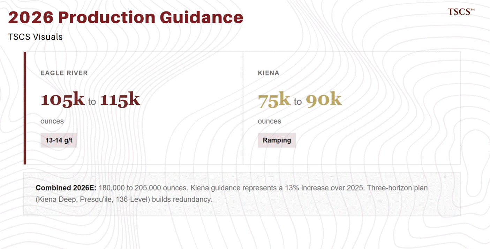](https://substackcdn.com/image/fetch/$s_!7Qky!,f_auto,q_auto:good,fl_progressive:steep/https%3A%2F%2Fsubstack-post-media.s3.amazonaws.com%2Fpublic%2Fimages%2F59c2c234-3370-4327-b860-bff24f1d43dd_1405x716.png)

Wesdome hosted an exploration teach-in last week. First one in company history. Jono Lawrence, the head of exploration, walked analysts through an extraordinary number of drill targets, many in areas that have never been explored, near existing infrastructure, on prolific trends adjacent to Agnico and Alamos and Eldorado operations. CEO Bath described 2026 as “a pivotal year for exploration.” The June technical reports, she said, “will give the market greater visibility into the longevity of our assets.”

Hickey, writing in the April High-Tech Strategist, said he found the teach-in “quite compelling.” That it gave him “more confidence” Wesdome could shake off the mine life perception problem. This is the kind of event that does not move the stock on the day but changes the story over the following quarters.

If you’re a Wesdome shareholder, listen to the replay. I found it compelling.

**The people**

Philip Yee became CFO in September 2025. I called this the single most important qualitative signal in the December deep dive and nothing since has changed that assessment. Yee was EVP and CFO at Kirkland Lake Gold from 2016 to 2018. During his tenure and the years after where his systems were still running, Kirkland Lake was the best-performing gold stock on the planet. High-grade underground assets in Ontario and Australia turned into cash flow machines through ruthless cost discipline. He knows what underground mining should cost. He knows how to deal with contractors. He knows how to structure a balance sheet.

The detail that matters: Yee was already on Wesdome’s board. He saw the financials. He saw Eagle River printing cash. He saw Kiena’s problems. He saw the exploration upside. And he voluntarily stepped down from a governance role into the operational C-suite. Board members don’t do that unless they see an opportunity to make a lot of money. This isn’t a caretaker appointment. This is a signal.

Bath, the CEO, came from Ero Copper where she helped scale the company from a junior to a C$2 billion producer. Chemical engineer by training. Her background is exactly the kind of complex underground logistics and shaft optimization that Kiena needs. The three-horizon plan is her engineering playbook.

Together, this is a “fix it or sell it” team. And at C$3.9 billion, Wesdome is the perfect meal size for a senior producer looking to consolidate. Agnico could write this check tomorrow and eliminate the labor competition in Val-d’Or in the process. At 8.4x earnings, the takeout math is easy for any buyer.

On the Q4 call, Yee said dividends “are a consideration.” Coming from the guy who ran Kirkland Lake’s treasury, that’s not idle commentary. With CAD$354 million in cash and base-case projected free cash flow of CAD$350 million (or CAD$500 million+ at US$5,000 gold), a dividend initiation would open the stock to income-focused funds that currently can’t touch it.

**What I’m watching for**

June technical reports. This is the catalyst. If they show meaningful reserve and resource additions, especially at Eagle River where the 300 Zone keeps expanding, the mine life narrative breaks and the re-rating starts. Getting from 8.4x to 12x on C$3.12 consensus EPS implies C$37. That is 42% from here. A full re-rating to peer multiples at 15x implies C$47, or 80% upside.

[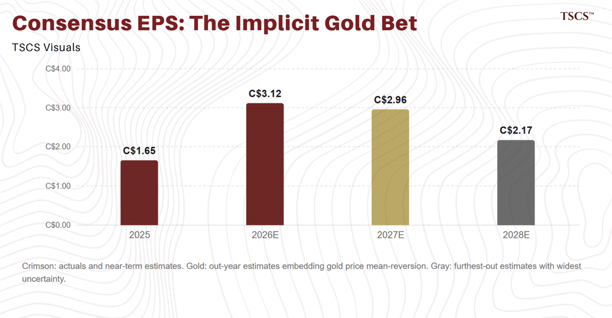](https://substackcdn.com/image/fetch/$s_!j9hD!,f_auto,q_auto:good,fl_progressive:steep/https%3A%2F%2Fsubstack-post-media.s3.amazonaws.com%2Fpublic%2Fimages%2F961f47ab-d568-42f3-8d6c-872a8e5ba9a5_1405x731.png)

Q1 earnings. With gold averaging ~$4,975 in Q1, the numbers should be spectacular. The Q4 results at $4,169 realized gold were already records. Q1 at $4,975 should blow them away.

Dividend announcement timing. Could come with Q1 or Q2 results. The buyback is already in place but it’s small (2% of float over 12 months). A dividend would be the bigger deal.

**Where I could be wrong**

Kiena relapses. The hoist is 1981 infrastructure. Old underground mines have mechanical problems that aren’t one-time events. Another multi-week shutdown kills a quarter and reinforces every bear narrative.

The June reports disappoint. If the drill results don’t translate into meaningful reserve additions, the mine life concern persists and the stock stays cheap. This is the binary risk. I think it’s unlikely given what Lawrence showed at the teach-in, but “I think it’s unlikely” and “it can’t happen” are different statements.

Consensus estimates for 2027 and 2028 are declining: C$2.96 and C$2.17 respectively. That tells you analysts are assuming gold prices come down from current levels. If gold mean-reverts to $3,500-4,000, the valuation discount to peers narrows. At those prices, Wesdome still generates substantial free cash flow and still trades below peers, but the margin advantage narrows. The thesis works best in the current gold environment. I’m not going to pretend otherwise.

[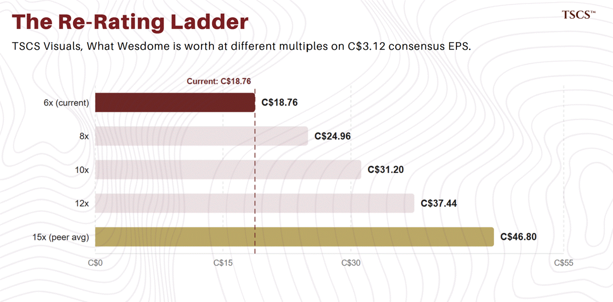](https://substackcdn.com/image/fetch/$s_!Ssiw!,f_auto,q_auto:good,fl_progressive:steep/https%3A%2F%2Fsubstack-post-media.s3.amazonaws.com%2Fpublic%2Fimages%2F3799f31d-157d-4c89-9c5c-6a6726d2c78a_1405x694.png)

And the macro risk I wrote about in “Gold Is Not Failing” applies here. In a broad liquidation, a C$3.9 billion mid-cap gold miner with C$18 million in daily volume gets sold alongside everything else. The cash balance provides a floor but it doesn’t prevent the stock from overshooting to the downside in a panic. I sat through that in March. It’s not theoretical.

At 8.4x forward earnings, zero debt, C$354 million in cash, a management team with multi-bagger track records, and a catalyst two months away that could break the narrative keeping the stock cheap, I think the risk-reward is the best in my entire coverage universe. I'm adding on weakness.

[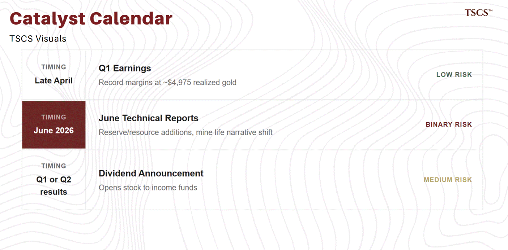](https://substackcdn.com/image/fetch/$s_!vHEz!,f_auto,q_auto:good,fl_progressive:steep/https%3A%2F%2Fsubstack-post-media.s3.amazonaws.com%2Fpublic%2Fimages%2F4b2f37b6-2eee-44d2-a4bd-b051791207dc_1405x693.png)

**ALAMOS GOLD (TSX: AGI / NYSE: AGI)**

I published “Print Money On This Market Overreaction” on Alamos in June 2025 at around C$30. The thesis was that the market had overreacted to a Q1 earnings miss caused by cold weather at Magino and a non-cash accounting charge, a share-based compensation revaluation triggered by the 45% surge in AGI’s own stock price, that made AISC look terrible. The stock is US$46.01 today on the NYSE. The operational call was right. Magino’s issues were transitory. Exactly as management said. Exactly as we argued when the market was panicking. The stock re-rated as the market figured that out.

But I got something wrong on costs and I need to address it directly because some of you made decisions based on what I wrote.

[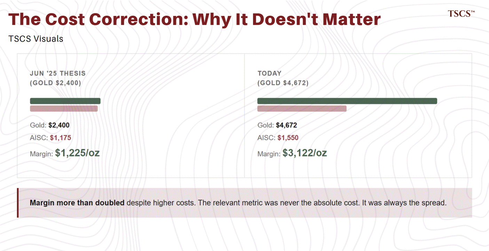](https://substackcdn.com/image/fetch/$s_!uWWa!,f_auto,q_auto:good,fl_progressive:steep/https%3A%2F%2Fsubstack-post-media.s3.amazonaws.com%2Fpublic%2Fimages%2F88ac0822-2435-4470-9cd5-e1e100543258_1405x723.png)

In the June piece, I cited the company’s guided path for AISC to decline to roughly $1,175 per ounce by 2027 and framed the entire thesis around the “triple-lever effect.” Rising price. Rising volume. Falling costs. All compounding simultaneously. In February, Alamos issued updated three-year guidance. The new numbers: 2026 AISC of $1,500-$1,600, with the decline to $1,200-$1,300 pushed out to 2028. That’s a meaningful revision. If you bought the stock partly on the declining cost trajectory I described, you should know the timeline has shifted.

Here’s why I don’t think it matters, and I want to walk through the math because the math is what actually matters.

When I wrote the original piece, gold was around $2,400. At $1,175 AISC, that was a margin of $1,225 per ounce. Today gold is $4,672. At $1,550 AISC (the midpoint of 2026 guidance), the margin is $3,122 per ounce. The margin has more than doubled even though costs came in higher than I told you they would. The gold price move overwhelmed the cost revision by a factor of five to one.

The AISC increase from the guided $1,175 to $1,500-$1,600 reflects the integration of the higher-cost Magino open pit into the consolidated numbers, heavy spending on the Island Gold expansion, and general cost inflation across labor and consumables. Higher royalty payments from higher gold prices are a component, but the driver is the portfolio mix shift as Alamos absorbs Magino's cost profile while building out Island Gold's capacity. On a $3,100+ margin, the cost revision changes the trajectory I described in June. It does not change the conclusion.

[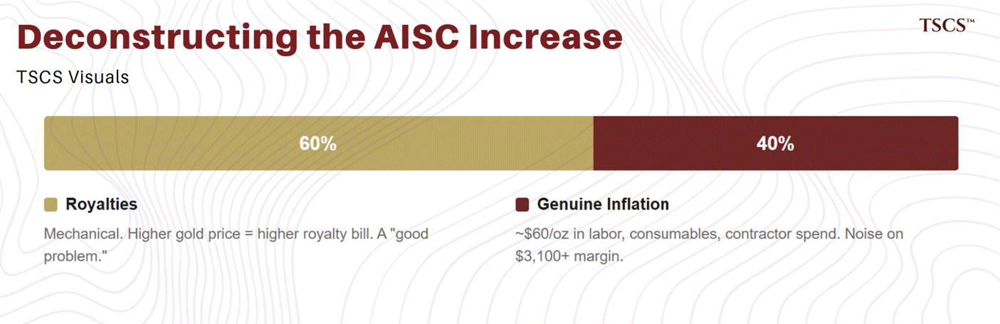](https://substackcdn.com/image/fetch/$s_!uJ09!,f_auto,q_auto:good,fl_progressive:steep/https%3A%2F%2Fsubstack-post-media.s3.amazonaws.com%2Fpublic%2Fimages%2Fcf92bb38-d558-494f-884c-e6daf1fe0786_1405x456.png)

The relevant metric was never the absolute cost. It was always the spread. The spread has never been wider. I should have framed it that way in June. I’m framing it that way now.

**The growth story**

This is what separates Alamos from Agnico Eagle and from most of its peer group. Alamos is not a steady-state producer optimizing a mature portfolio. It’s in the middle of a production ramp that will transform the company’s scale.

2026 guidance: 570,000 to 650,000 ounces. Second-half weighted as Island Gold underground rates increase. By 2028, the midpoint target is roughly 795,000 ounces, approximately 30% above the 2025 midpoint of 610,000 ounces. By 2030, the company targets roughly one million ounces per year as Lynn Lake comes online and the Island Gold District Expansion hits full capacity.

[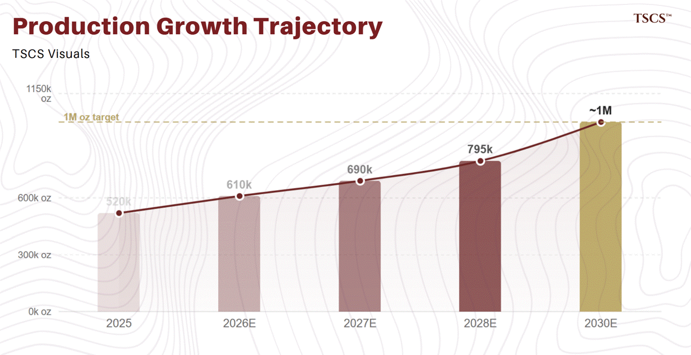](https://substackcdn.com/image/fetch/$s_!oA9w!,f_auto,q_auto:good,fl_progressive:steep/https%3A%2F%2Fsubstack-post-media.s3.amazonaws.com%2Fpublic%2Fimages%2F4a93096a-fa97-4bc4-9674-606b901636d0_1405x724.png)

The engine is Island Gold in northern Ontario. Proven and Probable reserves of 2.3 million ounces at 11.4 grams per tonne. That grade makes it one of the highest-grade gold mines in the world. The Phase 3+ Expansion, which deepens the shaft and pushes mining rates to 2,400 tonnes per day, is on track to complete this year. Once it’s running at expanded capacity, Island Gold produces over 400,000 ounces annually at first-quartile costs.

One point of clarification for generalist readers: the longer-term Island Gold District Expansion targets 20,000 tonnes per day of combined throughput. That’s not 20,000 tpd from an underground mine, which would be physically absurd. It’s 3,000 tpd of high-grade underground ore from Island Gold feeding into 17,000 tpd from the Magino open pit, all processed through the Magino mill. The underground ore provides the grade. The open pit provides the tonnage. The integrated mill captures the synergy. That’s the $515 million in pre-tax synergies I referenced.

That single mine, in one of the safest mining jurisdictions on earth, would be a compelling standalone investment. It’s one of four producing assets in the portfolio.

The Magino acquisition that initially spooked investors turned out to be exactly what management said it was: a consolidation play. The large-scale Magino mill gives centralized processing capacity for the entire Island Gold District, unlocking roughly $515 million in pre-tax synergies over life of mine. The cold-weather feed issues that caused the Q1 2025 miss were fixed by expanding the chutes. Milling rates hit 9,500 tonnes per day by late April 2025. Problem identified, problem solved, exactly the kind of engineering fix that looks obvious in hindsight and catastrophic in the earnings print.

Young-Davidson in Ontario is the workhorse. Steady cash flow generator, 14-year reserve life, not exciting but reliable. Mulatos in Mexico is the founding asset, over $735 million in cumulative mine-site free cash flow, transitioning to the higher-grade underground Puerto Del Aire project for another decade of production. Lynn Lake in Manitoba is the next wave: 186,000 ounces per year over its first ten years at first-quartile AISC. Construction decision already made, early works underway.

[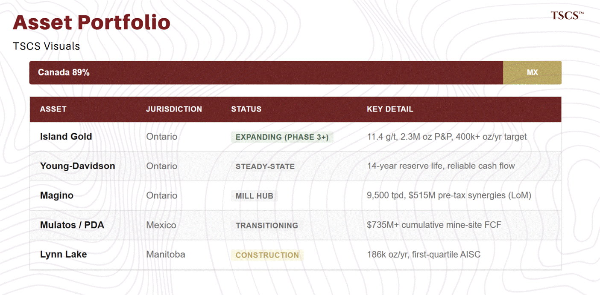](https://substackcdn.com/image/fetch/$s_!naAe!,f_auto,q_auto:good,fl_progressive:steep/https%3A%2F%2Fsubstack-post-media.s3.amazonaws.com%2Fpublic%2Fimages%2F5a1e09ca-bfec-47ee-8bf8-313a12f467ed_1405x693.png)

89% of the company’s NAV is in Canada. Ontario and Manitoba. This matters more than people think. In an industry where resource nationalism and tax surprises regularly destroy shareholder value, Alamos has almost no geopolitical exposure. When generalist investors decide they want gold exposure without accepting the risk that some government will change the rules on them, Alamos is on the very short list of options.

**The inflection point**

This is the part I think the market hasn’t fully priced and it’s the core of the updated thesis.

2026 is the peak capital spending year. Roughly $900 million going into Island Gold expansion, Lynn Lake early works, and sustaining capital across the portfolio. This is the year you pay for the growth. Starting in 2027, capex declines as the major projects complete.

At $4,500 gold, management expects free cash flow to exceed $500 million in 2026 even while spending $900 million on growth. By 2028, FCF exceeds $1 billion. Gold is currently $4,672, above that assumption.

[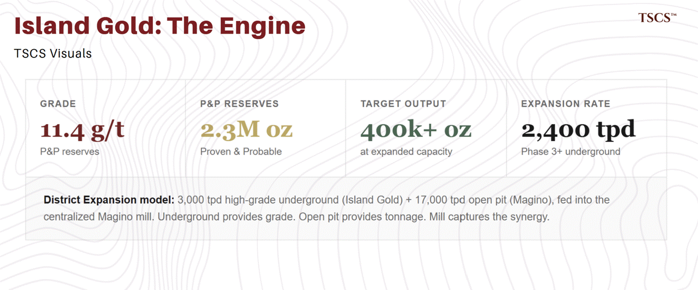](https://substackcdn.com/image/fetch/$s_!0iHP!,f_auto,q_auto:good,fl_progressive:steep/https%3A%2F%2Fsubstack-post-media.s3.amazonaws.com%2Fpublic%2Fimages%2Ff55801c3-4365-4504-8bad-03334a511a9e_1405x585.png)

This is the triple lever that makes growth-stage miners so powerful in a rising gold environment. Price going up. Volume going up. Unit costs going down. All three compounding simultaneously. The earnings trajectory from here, assuming gold stays anywhere near current levels, is steep.

**Valuation**

Consensus 2026 EPS is US$3.00. At US$46.01, that is a 15.3x forward P/E. EV/EBITDA is 8.7x. Balance sheet is clean: $351 million cash, $287 million debt, $790 million total available liquidity. The entire growth pipeline is self-funded. No dilutive equity raises. Shareholders participate fully in the production ramp without getting their ownership eroded.

Here’s the comparison that matters. AEM trades at 15.3x and 8.3x on the same metrics. Nearly identical multiples. But Alamos has ~30% production growth at midpoints through 2028 and AEM's production is flat at 3.3-3.5 million ounces over the same period. The PEG ratio captures this: Alamos at 0.52 versus AEM at 0.77. On a growth-adjusted basis, Alamos is cheaper than its senior peer despite trading at the same headline multiple.

All ten covering analysts rate it Buy. Mean target US$58.60, which is 27.4% upside. Those targets almost certainly embed gold assumptions below current spot, which means there’s further upside to the consensus if gold stays above $4,500.

2027 estimates: US$3.34 EPS, P/E compresses to 13.8x. 2028: US$4.05, P/E at 11.3x. That’s the production ramp flowing through to earnings. You can see the inflection in the numbers. The market hasn’t priced it because the market looks at trailing results and current-year estimates, not two years out. By the time the 2028 numbers show up in the headline metrics, the stock will have already re-rated.

**Where I could be wrong**

The Island Gold shaft deepening is complex underground construction. It’s 75%+ spent and committed, which limits the remaining risk, but “limits” isn’t “eliminates.” Delays are always possible and underground projects have a long history of surprising people.

Lynn Lake is a multi-year build in a new jurisdiction where Alamos doesn’t have existing operational infrastructure. Manitoba is mining-friendly, but building a mine from scratch is fundamentally different from expanding one you already operate. This is a 2028-2029 story and a lot can change between now and then.

The cost guidance revision I already discussed. If gold prices decline while costs continue rising, the margin story compresses. The 2026 AISC of $1,500-$1,600 is not the $1,175 I told you about in June. Continued inflation could push the 2028 target above the guided $1,200-$1,300 range. The thesis is margin-dependent and margins are gold-price-dependent. That’s the nature of the trade.

Mulatos in Mexico is a small portion of NAV but it’s the one piece of the portfolio that doesn’t fit the “89% Canada” jurisdictional story. Modest risk, but it exists.

The broad liquidation risk I described in “Gold Is Not Failing” applies here. Beta of 0.42 provides some insulation in normal volatility; in a genuine panic, correlations go to one.

I think Alamos is the best growth-adjusted value in the producing gold miner space. You’re paying 15x for ~30% production growth, a self-funded pipeline, first-quartile assets in Canada, and an FCF inflection from $500 million to $1 billion+ over the next two years. The discount exists because the market sees “gold miner” and applies the sector penalty. That penalty is wrong for this company.

[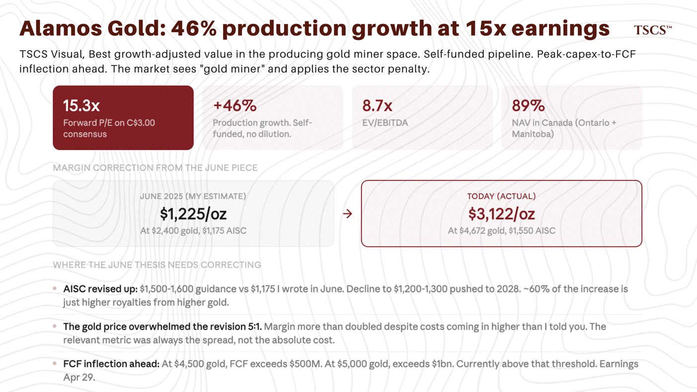](https://substackcdn.com/image/fetch/$s_!J28J!,f_auto,q_auto:good,fl_progressive:steep/https%3A%2F%2Fsubstack-post-media.s3.amazonaws.com%2Fpublic%2Fimages%2F0dc89f71-d521-445c-be1d-70158c959b72_1403x789.png)

**AGNICO EAGLE MINES (NYSE: AEM / TSX: AEM)**

I’m going to write something that sounds boring and I don’t care. Agnico Eagle is the best gold mining company in the world and it trades at 15x forward earnings. That’s the thesis. There’s no hidden catalyst. There’s no contrarian angle. There’s no narrative about the market being wrong. The market knows AEM is great. It just hasn’t caught up to what $4,975 average realized gold in Q1 means for a company producing 3.4 million ounces a year.

If you’re building gold miner exposure for the first time and you want one name, this is the name. Everything else in this piece offers some combination of higher potential upside and higher risk. AEM offers the highest probability of doing exactly what it says it will do.

**The company**

AEM produces 3.3 to 3.5 million ounces a year from Canadian Malartic, Detour Lake, Fosterville, Kittila, Meadowbank, and Meliadine. Reaffirmed through 2028. The vast majority of production and NAV sits in Canada, Australia, and Finland. The 2022 Kirkland Lake merger is the textbook for how to consolidate without destroying value. If you follow this sector you already know this. If you don’t, AEM is the company the rest of the industry wishes it were.

**The financials**

EPS: $2.23 in 2023, $4.23 in 2024, $8.31 in 2025, consensus $13.62 in 2026. Sixfold in three years on a flat production base. The entire move is margin expansion from gold. At $208.54, that’s 15.3x forward. PEG of 0.77. Net debt down to $348 million. $934 million in cash. $1.4 billion returned to shareholders in 2025. All 14 analysts rate it Buy with a mean target of $254. Those targets embed gold assumptions below current spot.

**The energy cost thing**

There’s a narrative floating around that surging diesel prices from the Iran conflict will crush gold miner margins. For AEM specifically, I want to put numbers on why this is wrong.

Energy is roughly 15% of AEM’s total cost structure. Labor is 45%. The math is clean. A doubling of diesel to around $1.45 per liter could theoretically add roughly $150 per ounce unhedged. They virtually always hedge. AEM’s Q4 earnings report disclosed that approximately 56% of their estimated 2026 diesel exposure is hedged at $0.69 per liter. Well below the current price. Net of the hedge book, the incremental cost is about $70 per ounce going forward. Less than that in Q1 because the diesel spike came later in the quarter. AEM slightly increased their diesel hedge in Q1 last year. Would not be surprising if they have done the same given what is happening in the Gulf.

$70 per ounce on a margin of $3,200+. That’s a 2% headwind. The gold price went up 74% year-over-year and the energy cost impact is 2%. If you’re selling AEM on the diesel thesis, you’re selling a $3,200 margin story because of a $70 cost increase. I’d want to be on the other side of that trade.

[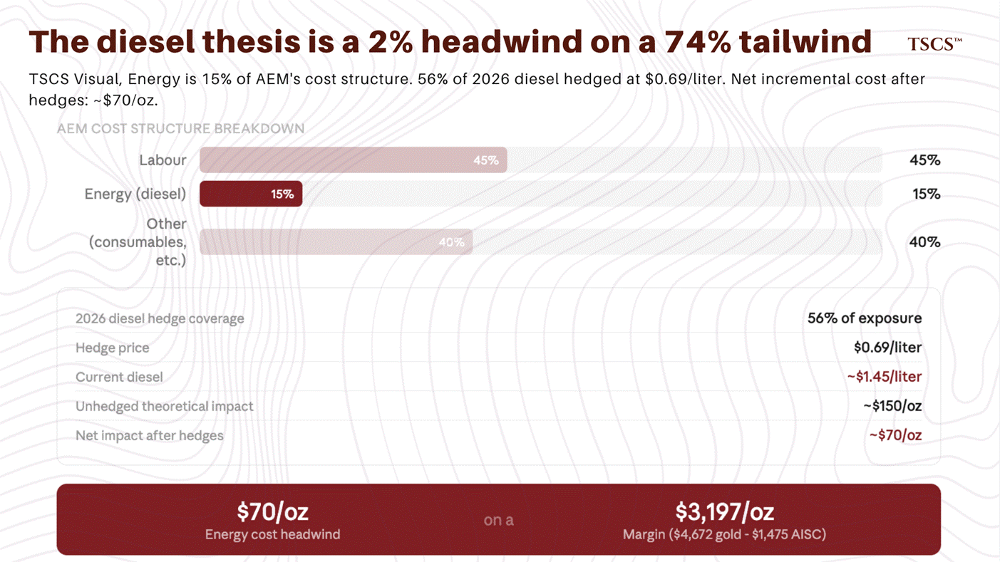](https://substackcdn.com/image/fetch/$s_!Wb-c!,f_auto,q_auto:good,fl_progressive:steep/https%3A%2F%2Fsubstack-post-media.s3.amazonaws.com%2Fpublic%2Fimages%2F31b24d7e-cbc8-4de9-a6d9-dfc6a3e28d68_1403x789.png)

One caveat: hedges roll off. The 56% coverage at $0.69/liter is a 2026 position, not a permanent shield. If diesel stays at $1.45+ and AEM re-hedges at higher prices, the energy cost headwind grows in 2027 and beyond. That’s worth monitoring but it doesn’t change the near-term math, and AEM has a long track record of rolling hedges at reasonable levels. The risk is a grind, not a cliff.

**2026 guidance and the Q1 preview**

AISC guidance: $1,400 to $1,550, midpoint $1,475. That’s a 12% increase over 2025, and roughly 60% of it is higher royalty payments from higher gold prices. The remaining 40% is genuine cost inflation plus mining sequence factors at some of the operations.

At $1,475 AISC and $4,672 spot gold, the margin is $3,197 per ounce. On 3.3 to 3.5 million ounces. These are margins the gold mining industry has literally never generated at this scale. The Q1 report on April 30, with an average realized price around $4,975, should produce margins closer to $3,500 per ounce. I expect it to be one of the strongest quarters in the company’s history.

[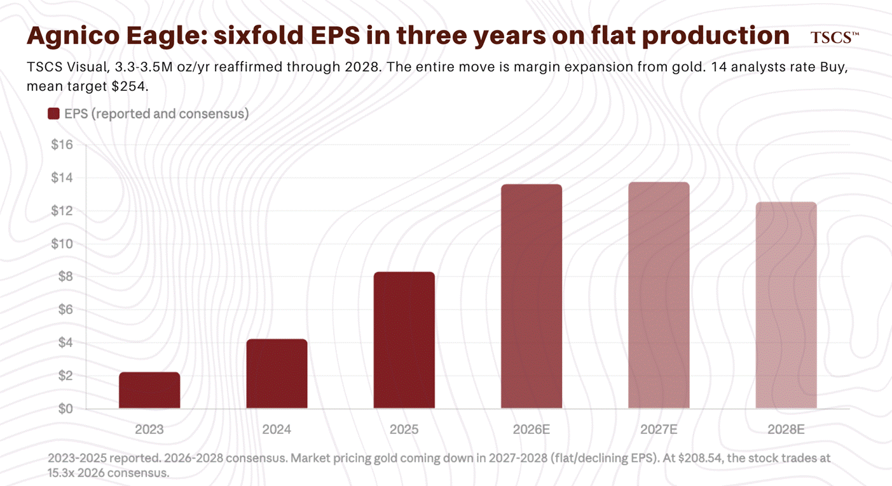](https://substackcdn.com/image/fetch/$s_!oFUB!,f_auto,q_auto:good,fl_progressive:steep/https%3A%2F%2Fsubstack-post-media.s3.amazonaws.com%2Fpublic%2Fimages%2F6dab6b20-9a68-4ea1-8067-c783cb8df568_1403x766.png)

**What you’re not getting**

I could write 1,500 words on why AEM is great and leave it there. But that wouldn’t be honest, and it wouldn’t be useful for portfolio construction. So here’s what AEM does not give you relative to the other names in this piece.

It doesn’t give you the valuation dislocation of Wesdome at 8.4x. AEM’s P/NAV is 132%. You’re paying above the assessed value of the underlying assets. The premium is justified by quality and consistency, but it’s a premium. You’re not buying a dollar for fifty cents here. You’re buying the best dollar available at a fair price.

It doesn’t give you production growth. AEM is guided flat at 3.3 to 3.5 million ounces through 2028. There’s growth coming from East Gouldie at Canadian Malartic, from Fosterville, from Kittila. But those additions mostly offset natural declines elsewhere in the portfolio. Revenue growth from here is a gold price bet, not a volume story.

And maintaining 3.4 million ounces of annual production means AEM must find or acquire 3.4 million ounces of new reserves every single year just to stand still. That’s the geological gravity of being a mega-producer. They’ve done it consistently, but the treadmill never stops, and the replacement ounces get harder to find as the easiest deposits are depleted. This is the long-term structural risk embedded in the premium.

Compare that to Alamos, which has ~30% production growth at the same headline multiple.

And it doesn’t give you the NAV gap of the developers. PPTA and Skeena trade at 50-88% of assessed NAV. AEM trades above NAV. The asymmetric upside from a re-rating isn’t there.

What AEM gives you is the lowest probability of a negative surprise in my entire coverage universe. In a sector where execution risk destroys portfolios routinely, that has real value. It’s the position you don’t have to worry about while you take calculated risks on the names around it. It’s the thing that lets you own Wesdome at 8.4x and Skeena at 3.9x. 2028 earnings without your gold allocation keeping you up at night.

That’s not nothing. In a portfolio context, it might be the most valuable function any single position can serve.

[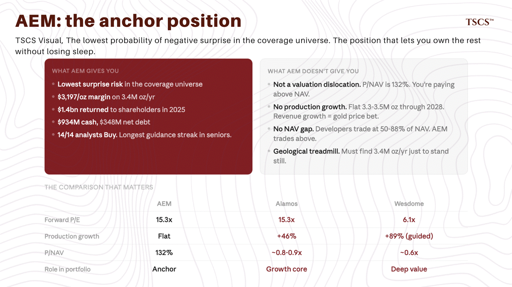](https://substackcdn.com/image/fetch/$s_!AMgw!,f_auto,q_auto:good,fl_progressive:steep/https%3A%2F%2Fsubstack-post-media.s3.amazonaws.com%2Fpublic%2Fimages%2F3765c755-ba18-4762-96a0-15b3e131ea91_1406x789.png)

**Where I could be wrong**

The out-year estimates are interesting. Consensus has 2027 EPS at $13.76 and 2028 at $12.55. That’s essentially flat in 2027 and down in 2028. The market is pricing in gold coming down from current levels. If it does, AEM’s earnings flatten and you’re left holding a stock at 15x with no growth. At that point the Alamos comparison becomes even more unfavorable because Alamos has production growth to offset a declining gold price. AEM doesn’t.

The jurisdictional story is excellent but not perfect. Mexico is a small piece but it’s there. The Nunavut operations are geographically remote and logistically complex. Fosterville in Australia has faced grade variability that periodically concerns the market. None of these are thesis-killers but they’re not zero risk either.

And the standard caveat applies. 15x is a fair multiple, not a cheap one. In a sharp gold correction, AEM holds up better than most miners because of its quality premium, but it still goes down. The March selloff hit everything. AEM wasn’t spared. If you’re buying AEM as a safe haven within gold miners, understand that “safe haven within gold miners” is a relative statement, not an absolute one.

I think AEM belongs in a gold miner portfolio as the anchor. Not the biggest position, not the highest conviction, but the one that provides the quality floor. When Q1 earnings hit on April 30 showing $3,000+ margins on 3.4 million ounces, the stock will remind people why it commands its premium. But the better risk-reward, if you’re willing to accept more volatility, sits elsewhere in this piece.

[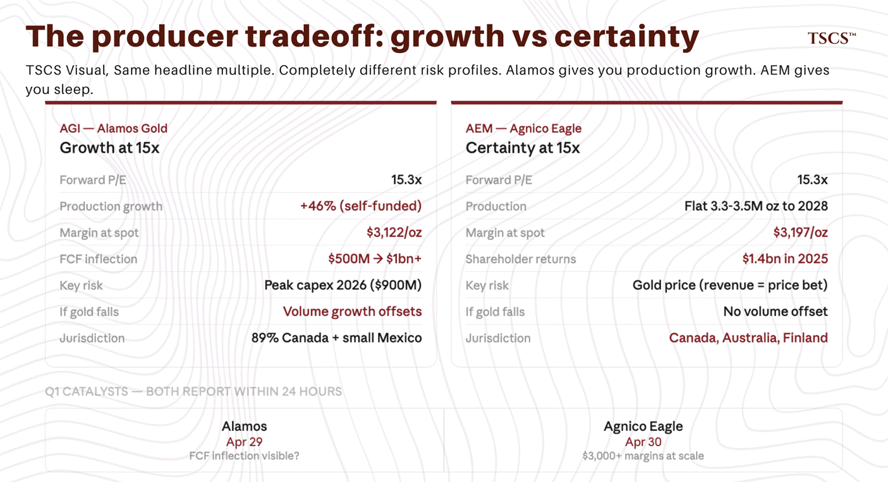](https://substackcdn.com/image/fetch/$s_!ETQY!,f_auto,q_auto:good,fl_progressive:steep/https%3A%2F%2Fsubstack-post-media.s3.amazonaws.com%2Fpublic%2Fimages%2Fd28e0c1e-283c-46bf-a958-a13fc30e1247_1405x764.png)

**PERPETUA RESOURCES (TSX: PPTA / NASDAQ: PPTA)**

In June I published “They Secured the Permits. We Secure the 110% Return” on Perpetua at $13.50 with a $28.50 target. The stock is $29.34 today. The thesis played out almost exactly as I laid it out: permits secured, equity financing closed, EXIM application filed, stock re-rates toward intrinsic value. Every catalyst I identified has either occurred or is about to. If you followed the call, you’ve roughly doubled your money in ten months.

[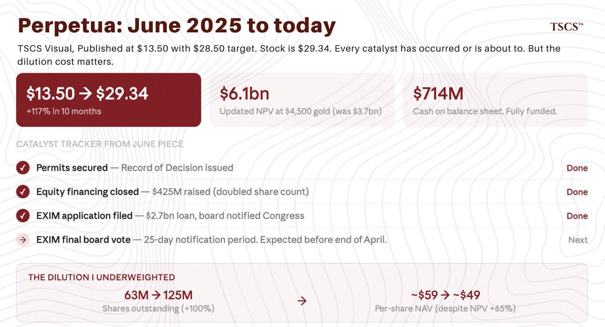](https://substackcdn.com/image/fetch/$s_!V_f3!,f_auto,q_auto:good,fl_progressive:steep/https%3A%2F%2Fsubstack-post-media.s3.amazonaws.com%2Fpublic%2Fimages%2Fa6e49f5b-1dbc-4d20-929c-3dd7aff4e7a1_1405x760.png)

I’m not writing this section to take a victory lap. I’m writing it because the question my subscribers keep asking is “do I hold or trim?” and answering that honestly requires updating the math with numbers that have changed substantially since June.

**The EXIM loan**

This happened on Tuesday. The Board of the U.S. Export-Import Bank unanimously agreed to notify Congress of a proposed $2.7 billion senior secured long-term loan for Stibnite. Twenty-five-day notification period. Last formal step before the board votes on final approval. Expected before end of April.

CEO Cherry: “Today’s decision marks the final phase of EXIM approval.”

Here is the part where I level with you about something I underweighted. When I published the June piece, Perpetua had roughly 63 million shares outstanding. The $425 million equity raise and subsequent financings have roughly doubled that to 125 million. I was right that the financing would get done. I was wrong about what it would cost you in dilution. The project NPV went from $3.7 billion to $6.1 billion, up 65%. Shares outstanding went up 100%. On a per-share basis, NPV declined from roughly $59 to roughly $49. The project got better. The per-share economics got diluted. Both are true and you need to hold them in your head simultaneously as you read what follows.

When this closes, and at this point “when” is the right word, not “if,” Perpetua is fully funded.

$714 million in cash on the balance sheet at year-end. EXIM’s proposed $2.7 billion facility includes a $2.2 billion direct loan, with the remainder covering capitalized interest during construction and fees. Combined with the $714 million in cash on hand, the $2.58 billion initial capex is fully funded. No additional equity raises needed.

The project transitions from “developer seeking funding” to “funded construction-stage company in Idaho.” That’s a different animal from a valuation standpoint and it should attract a different class of investor.

**Updated economics**

The company released updated project numbers alongside the EXIM announcement.

Their base case, using long-term consensus pricing of $3,250 gold, $10/lb antimony, and $40/oz silver, yields a $3.5 billion after-tax NPV with a 23.5% IRR. At $4,500 gold, NPV rises to $6.1 billion with a 32.3% IRR. At $5,000 gold, it reaches $7.1 billion. My June piece used $3.7 billion at $2,900 gold. Gold is currently $4,672, sitting between the $4,500 and $5,000 scenarios.

The production profile hasn’t changed and it’s still exceptional. High-grade starter pit producing roughly 463,000 ounces a year for the first four years at an AISC of $498 per ounce, net of by-product credits. That figure reflects updated cost estimates as of December 2025 incorporating industry-wide inflation, higher input costs, and potential tariff impacts. Even at $498, Stibnite sits in the top decile of the global cost curve.

A transparency note: $498 is the by-product costing, which credits all antimony revenue at $10/lb against gold production costs. On a co-product basis, allocating costs proportionally between gold and antimony, the gold AISC would be significantly higher, probably in the $1,200-1,400 range. The by-product method is standard industry practice when one metal dominates production, but readers should understand that the $498 figure is contingent on antimony prices staying at or above $10/lb. If antimony collapses below that level, the AISC climbs toward the co-product number. Given where antimony trades today (multiples of $10/lb), the by-product AISC is more likely to improve from here than deteriorate.

Payback at $4,500 gold is 1.9 years after tax. At current spot it compresses further. At the base case of $3,250 gold, payback extends to 2.4 years. For a $2.576 billion project, both numbers are fast.

If gold hits $6,000, Stibnite’s NPV would climb well above the $7.1 billion shown at $5,000.

Against a $3.7 billion market cap. I’m not building a thesis on $6,000 gold, but in the current environment it’s not a fantasy number either.

**Antimony**

For readers who didn’t see the June piece, this is the part of the Perpetua thesis that has no equivalent anywhere else in the gold sector.

Stibnite contains an estimated 148 million pounds of antimony. It is the only identified domestic reserve of antimony in the United States. There is no second option. Antimony is a critical mineral for national defense. Non-substitutable in the primer compound for munitions. Also essential for grid-scale liquid metal batteries, which is the clean energy angle.

Over 90% of global mined antimony comes from China, Russia, and Tajikistan. In late 2024, China imposed a complete ban on antimony exports to the U.S. That ban was reportedly lifted in early 2025 following negotiations, but the lifting has been partial at best and the risk of reimposition remains elevated given the tariff war and the Iran conflict. Supply chains remain disrupted regardless. Prices have more than doubled from 2023 levels. European spot has climbed even higher. The Department of Defense has put over $75 million directly into Perpetua to advance military-spec antimony trisulfide studies. The project was selected as a White House “Transparency Project.” I covered the strategic antimony moat extensively in the June piece. Nothing that has happened since has weakened that thesis. The Iran conflict and the surge in munitions consumption have strengthened it.

That level of government backing for a private mining company is not normal. It tells you how badly the defense establishment needs this deposit online.

The updated TRS uses consensus antimony pricing of $10/lb for all NPV calculations, alongside $40/oz silver. That $10/lb assumption is well below where the market trades today. U.S. antimony prices have been reported as high as $15.65/lb in early 2025 (roughly $34,500/MT), with European spot above $23/lb. With China's export ban still in force and the Iran conflict adding further supply chain stress, those numbers have likely moved higher since.

This means the project economics as presented use a conservative antimony credit. Every dollar per pound above $10 flows directly to reduce the effective cost of producing gold. The upside optionality from antimony alone could be worth hundreds of millions in additional NPV if spot prices persist anywhere near current levels.

[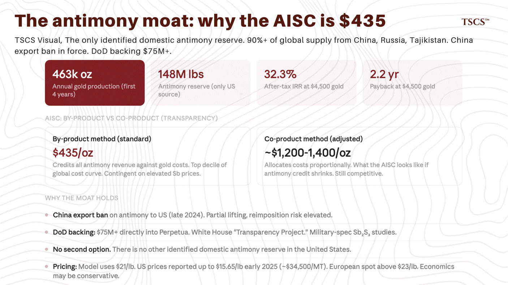](https://substackcdn.com/image/fetch/$s_!N8a6!,f_auto,q_auto:good,fl_progressive:steep/https%3A%2F%2Fsubstack-post-media.s3.amazonaws.com%2Fpublic%2Fimages%2F37c1af4e-8694-45d6-8795-e7e808c9e1f0_1406x789.png)

**The honest math on valuation**

This is where I need to level with you because the risk-reward profile has shifted.

At $13.50 in June, you were buying at 0.33x TEV/NPV using the $3.7 billion spot NPV. That was a massive discount for a permitted project with a clear de-risking pathway. The easy money was in front of you.

At $29.34 today, with the enterprise value around $2.97 billion (market cap of $3.67 billion minus $714 million cash), you’re buying at roughly 0.49x against the $6.1 billion NPV at $4,500 gold. Still a meaningful discount. But not 0.33x. The gap has narrowed.

Fully funded, fully permitted construction-stage projects in Tier-1 jurisdictions typically trade somewhere in the 0.7x to 1.0x range. A re-rating to 0.75x on the $6.1 billion NPV implies roughly $37 per share. At 0.9x, it’s closer to $45. Those targets use $4,500 gold, and spot is above that.

Consensus target is US$35.14, all three analysts rate it Buy. Analyst NAVPS of US$33.57 is built on gold assumptions below current spot.

As I flagged above, the per-share NAV of roughly $49, down from $59 in June despite the project getting materially better, means the upside from here is real but narrower than it was. You’re not buying the same setup I bought. You’re buying a fundamentally stronger project at a less extreme discount.

Looking further out, consensus has 2028 EPS at $2.34, the first year of real production-stage earnings. That puts the stock at 12.6x on 2028 numbers. As Perpetua transitions from developer to producer, the investor base changes. Funds that can’t hold pre-revenue names start buying. That structural shift in demand for the stock provides a re-rating catalyst that’s independent of the gold price.

[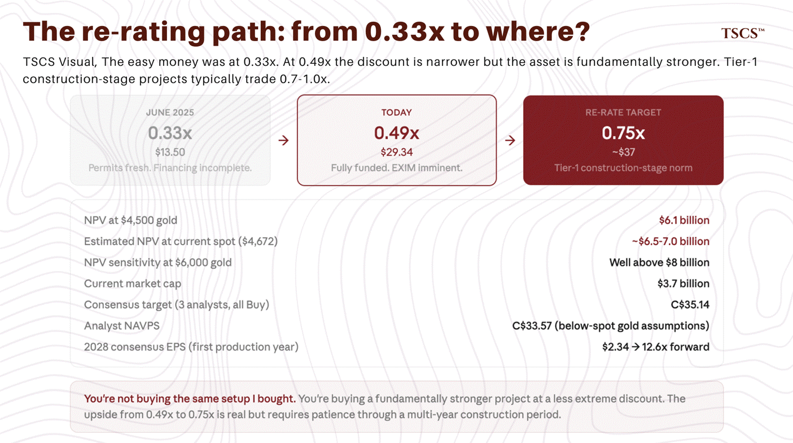](https://substackcdn.com/image/fetch/$s_!BXyg!,f_auto,q_auto:good,fl_progressive:steep/https%3A%2F%2Fsubstack-post-media.s3.amazonaws.com%2Fpublic%2Fimages%2F49ac14e4-1775-4ade-b1dc-2feaa91c43dd_1405x786.png)

**Where I could be wrong**

The capex estimate is $2.576 billion based on Q4 2024 pricing. Mining projects of this scale have a documented tendency to come in over budget. In the current inflationary environment, with energy costs surging and the Iran conflict disrupting supply chains for equipment and materials, the risk of cost escalation is real.

There’s an additional friction specific to EXIM-funded projects: federal financing typically comes with Buy America procurement requirements and Davis-Bacon prevailing wage mandates. Sourcing specialized milling equipment domestically rather than from the global supply chain, and paying union-scale wages in rural Idaho, adds cost that wouldn’t apply to a privately financed build. I haven’t been able to quantify the magnitude precisely, but it’s a source of capex inflation that sits on top of the general inflationary pressures and is worth monitoring as construction progresses.

If overruns are severe, they could require additional financing and further dilute shareholders. I wrote about this risk in June and it hasn’t diminished.

The timeline is long. “Construction-ready” in H2 2026, with first production several years beyond that. A lot can change in the gold market, the antimony market, and the political landscape between now and first ore. The administration that backed this project may not be the administration in power when it reaches production.

A reversal of China’s antimony export ban would weaken the by-product credit that makes the economics exceptional. I think this is unlikely in the current geopolitical climate, but “I think it’s unlikely” is a probability statement, not a guarantee. If U.S.-China relations somehow thaw and the ban gets lifted, the AISC climbs from $498 toward something less extraordinary.

Legal risk has diminished with the permits in hand and the federal backing, but large-scale mining projects in the western U.S. remain targets for environmental litigation. The project’s genuine environmental restoration story (reopening fish passage blocked for 80 years, remediating legacy tailings from WWII-era mining) provides real insulation. But a successful injunction could delay construction by months or years.

And the path dependency risk that I wrote about in “Gold Is Not Failing” applies here acutely. PPTA is a pre-revenue company with a $3.7 billion market cap. In a broad liquidation, this is the kind of name that gaps down 20-30% on no company-specific news. The $714 million cash balance provides fundamental support, but it doesn’t prevent the stock from overshooting in a panic. If you can’t hold through that kind of volatility, this isn’t the right position for you, and better to be honest about that now than surprised later.

[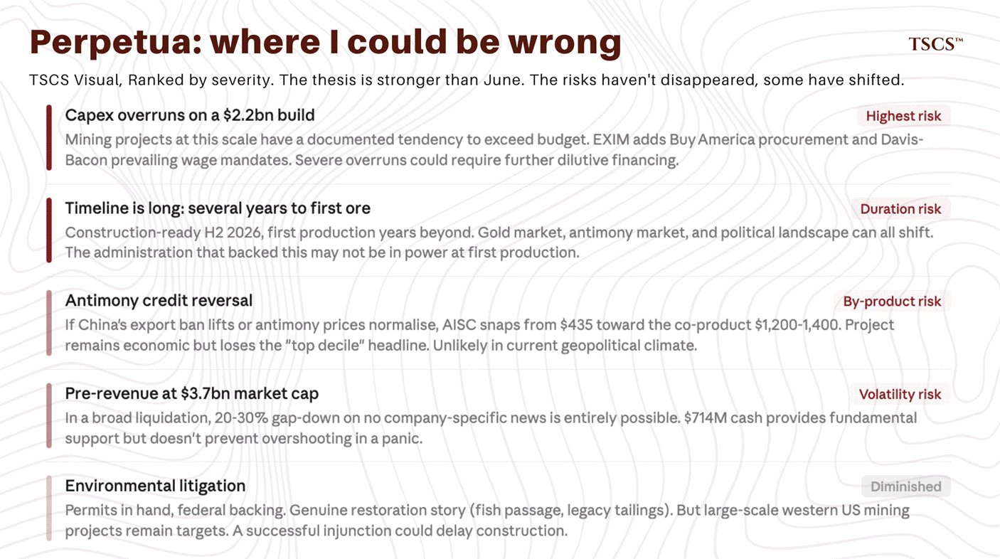](https://substackcdn.com/image/fetch/$s_!PCsG!,f_auto,q_auto:good,fl_progressive:steep/https%3A%2F%2Fsubstack-post-media.s3.amazonaws.com%2Fpublic%2Fimages%2F9cc9c8fa-0055-4d6f-b3b1-92e845dc3d35_1406x786.png)

**What I’m doing**

I’m not trimming before the EXIM final approval. That’s the last catalyst that transforms the company’s classification from “developer” to “funded construction.” Selling in front of that makes no sense to me.

After EXIM closes, I’ll reassess sizing. The upside from 0.49x to 0.75x is real but it requires patience through a multi-year construction period. Some of the capital that’s been in PPTA since June might work harder in names with nearer-term catalysts, specifically Wesdome with the June technical reports or Skeena with production a year away.

For readers entering now: you’re paying more than I did but you’re buying a fundamentally different asset than what I bought. In June, the permits were fresh, the financing was incomplete, and the EXIM application hadn’t been filed. Today the project is fully permitted, the EXIM loan is effectively approved, $714 million sits in the bank, and the question is no longer “will this get built?” It’s “how much will it earn?” At $4,672 gold with antimony at multi-year highs, the answer to that question is very large numbers.

**SKEENA RESOURCES (TSX: SKE)**

This is a new name for TSCS. I am initiating coverage here because Skeena is, in my assessment, the single most compelling risk-reward in the gold developer space right now. Closer to production than Perpetua. Better near-term economics. Trading at 77% of NAV on metal price assumptions already below spot. The project ranks number one out of 612 global mining projects in Mining Journal’s Pipeline Project Index. Number one. Ahead of every other development-stage gold project on earth.

[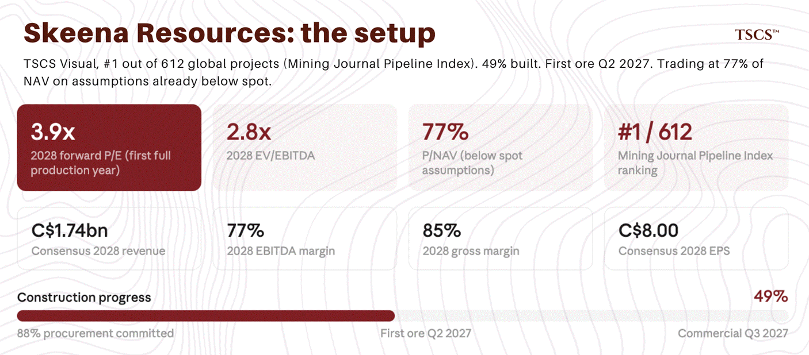](https://substackcdn.com/image/fetch/$s_!ALfp!,f_auto,q_auto:good,fl_progressive:steep/https%3A%2F%2Fsubstack-post-media.s3.amazonaws.com%2Fpublic%2Fimages%2Fac39224c-15d8-4bd1-bf47-99d9de620c3b_1406x618.png)

The forward earnings multiples, once production begins, imply a valuation gap the market will have to close or explain. Consensus 2028 estimates, the first full production year, put the P/E at 3.9x. I need to flag something about that number before you anchor to it. 3.9x is a 2028 estimate. Skeena has never operated a mine. The deposit is being mined with a completely different method than Barrick used. The company is 49% built. Comparing 3.9x to Wesdome at 8.4x or AEM at 15.3x is not the same comparison. Those companies are generating cash today. Skeena is generating concrete pours. The 3.9x tells you what the market thinks about construction risk. I think the market is wrong at this stage of completion. Here is why.

**Eskay Creek**

Some context for readers who don’t follow the development-stage gold names. Eskay Creek isn’t a grassroots discovery that some junior geologist stumbled onto. The original Eskay Creek mine, operated by Barrick, was the highest-grade gold mine in the world during its production life from 1994 to 2008. 3.3 million ounces of gold and 160 million ounces of silver from an underground operation mining grades that were almost embarrassingly good. Barrick shut it down when the underground reserves ran out.

The deposit didn’t disappear. It extended beyond what underground methods could economically access. Skeena acquired the property and did something genuinely clever: they designed an entirely different mine plan. Instead of chasing narrow high-grade veins underground the way Barrick did, they engineered an open-pit operation that captures the broader mineralized envelope at lower grades but with far higher throughput. Different mining method, same world-class geology.

The project is fully permitted in British Columbia. Anyone who has tried to permit a mine in BC knows what that means. The regulatory process in that province can stretch a decade or longer. The permit itself is an asset, a barrier to entry that took years of expenditure and First Nations engagement to build and that no competitor can replicate on any timeline that matters for investment decisions.

**Construction update**

Skeena released a progress update on Tuesday. 49% complete. Production on schedule for Q2 2027. Commercial production Q3 2027. That’s roughly a year from today.

CEO Reichert framed it in terms of risk reduction, and the framing is accurate. Skeena started development activities ahead of final permit receipt, which let them lock in procurement contracts before further cost inflation hit and compress the overall timeline. 88% of procurement costs are now committed. That limits the remaining exposure to supply chain disruptions and materials price increases in a way that a project at 20% procurement commitment cannot claim.

Updated capex: US$659 million, roughly 17% above the 2023 Definitive Feasibility Study. That number deserves scrutiny. 17% over a three-year-old estimate in an inflationary environment is within the range I’d expect, but mining construction cost overruns have a way of being “manageable” right up until they aren’t. The detail that gives me comfort is that the $35 million cost contingency from the original DFS is still intact despite the project being half built. Management has been absorbing variances within the revised budget rather than eating into reserves. That’s discipline.

**The refinancing**

This happened last week and it’s a bigger deal than the market seems to appreciate.

Skeena announced a $750 million refinancing package. Two components, both significant.

First, they slashed the gold stream obligation by 66.7%. Streams are the most expensive form of mining finance because they dilute the economics of the asset permanently. A stream means you’re selling a portion of every ounce you produce, forever, at a predetermined price that was set when you were desperate for capital. Cutting the stream by two-thirds means Skeena retains a dramatically larger share of Eskay Creek’s cash flows once production begins. That value accrues directly to equity holders.

Second, they cancelled the undrawn $350 million senior secured loan that was carrying an interest rate of 3-month SOFR plus 7.75%, roughly 11.4% all-in. The replacement is at 8.5%. On a facility this size, 290 basis points of rate reduction compounds into real money over the life of the loan.

Why were the lenders willing to offer better terms? Because the project is less risky than it was when the original debt was structured. When you go from 20% complete to 49% complete, the probability of reaching production increases materially. Lenders price that improvement. Skeena is capturing the value of their own execution and passing it through to shareholders. That’s how this is supposed to work.

[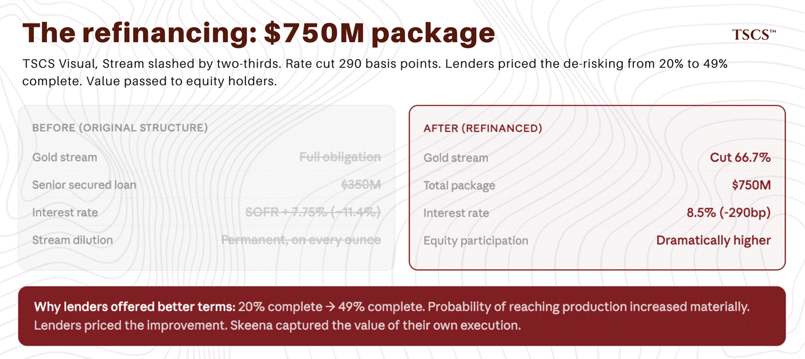](https://substackcdn.com/image/fetch/$s_!3bZA!,f_auto,q_auto:good,fl_progressive:steep/https%3A%2F%2Fsubstack-post-media.s3.amazonaws.com%2Fpublic%2Fimages%2F0c8ec7da-3f13-4fd2-902d-2846ac6a6e4b_1403x627.png)

One cost the market will focus on: 8.5% on $750 million is $63.75 million in annual interest expense hitting the income statement once the notes are outstanding. That debt service is real and it compresses the bottom-line earnings relative to the headline EBITDA. The consensus 2028 EPS of US$8.00 should reflect this, but given the refinancing closed days ago, verify whether analyst models have been updated.

**The economics**

Skeena’s April corporate presentation shows project economics at $4,500 gold and $70 silver. Both metals are trading above those assumptions right now.

A 102% IRR should make you suspicious. It makes me suspicious. That number assumes nameplate throughput from day one, current metal prices holding through ramp-up, and grade reconciliation matching the geological model. None of those are guaranteed. The 8-month payback comes from the same model with the same assumptions, so treat it with the same skepticism. In practice, commissioning a new mill to nameplate capacity is a 6 to 12 month process. Ramp-up delays are more common than on-schedule startups in the mining industry. If you haircut the model to 80% of nameplate throughput in Year 1 and assume 15% grade dilution from the void issues I’ll describe below, the payback stretches to roughly 14-16 months and the IRR drops to something in the 50-60% range. That is still exceptional by any standard in the sector. But it is a different number than 102%, and the difference matters for how you size the position. At current metal prices, Skeena recovers its entire $659 million capital investment within the first year to eighteen months of commercial production.

By the first half of 2028, the project is generating pure free cash flow with capex fully repaid. I’ve looked at a lot of mining project economics. This payback period at this scale is extraordinary.

[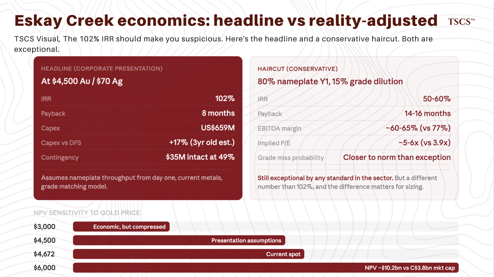](https://substackcdn.com/image/fetch/$s_!7zhx!,f_auto,q_auto:good,fl_progressive:steep/https%3A%2F%2Fsubstack-post-media.s3.amazonaws.com%2Fpublic%2Fimages%2F31e14ea6-39df-4863-89e5-7190746cf665_1405x790.png)

The driver is a combination of grade, silver credit, and the open-pit method keeping operating costs low relative to the value of ore processed. Barrick’s underground operation at Eskay Creek was mining narrower, higher-grade material at higher cost. Skeena’s open pit captures a wider envelope at somewhat lower grade but dramatically lower cost per tonne. The all-in economics end up being exceptional because the tonnage more than compensates for the grade step-down.

If gold reaches $6,000, Skeena estimates Eskay Creek's NPV climbs to approximately $10.2 billion. Current market cap is approximately C$5.2 billion. The discount is narrower than the developer names trading at 20-30% of NAV, but Skeena is also twelve months from production, not five years.

Here’s where the consensus estimates get interesting. For 2028, the first full production year, analysts project US$1.74 billion in revenue, US$1.34 billion in EBITDA at a 77% margin, and US$884 million in net income.

Consensus 2028 EPS is US$8.00 (two analysts, approximately C$11.12). At the current price, that is a 3.9x P/E. I need to flag the thinness of that consensus: two analysts covering a pre-revenue developer is not the same as a twelve-analyst consensus on a producing miner. Treat the precision of “3.9x” with appropriate caution.

The EV/EBITDA on 2028 numbers is approximately 3.3x, reflecting the additional $750 million in debt from the refinancing. Gross margins of 85%.

For comparison, Wesdome is generating record cash flows from two producing mines and trades at 8.4x forward earnings. AEM trades at 15.3x. Skeena, which is one year from production with half the project built and 88% of procurement locked in, trades at less than 4x its first full-year earnings. The discount for “it isn’t producing yet” exists and it’s rational to some degree, construction risk is real, but the magnitude of the discount looks excessive relative to the remaining execution risk.

**Silver**

Eskay Creek is technically a gold-silver deposit, and the silver component matters for the economics in a way that distinguishes Skeena from the pure gold names in this piece. The 85-87% gross margins in 2027-2028 reflect the combined value of both metals. With silver above $70 on strong industrial demand from solar and electronics, the silver credit is a meaningful margin enhancer.

For Epic Fury readers: silver has significant industrial applications and supply disruptions from the Hormuz closure affect the broader metals complex. Skeena gives you gold miner exposure with a built-in silver kicker. That’s not the primary reason to own it, but it’s not nothing.

**How it fits alongside Perpetua**

My readers are going to ask this because I own both, so let me address it directly.

Both are construction-stage developers with roughly $6 billion NPVs and similar market caps. Both are fully funded and fully permitted in Tier-1 jurisdictions. The differences are where the portfolio construction logic lives.

Skeena is closer to production by two to three years. 49% built, first ore Q2 2027. Perpetua is targeting “construction-ready” in H2 2026 with first production probably 2029 or 2030. Every additional year of construction is additional exposure to cost inflation, commodity price moves, regulatory shifts, and execution risk. Time is not a neutral variable. It’s a source of risk, and Skeena has less of it.

Perpetua has something Skeena doesn’t: the antimony moat. No government agency is funding Skeena’s construction for national security reasons. PPTA’s DoD backing and EXIM loan provide institutional support that Skeena has to earn purely through project execution and market economics.

Skeena’s payback is faster. A reality-adjusted 14-16 months versus 1.9 years. That compresses the period where your capital is at risk and accelerates the transition from cash consumer to cash generator.

The pairing makes sense to me. PPTA gives longer-dated optionality with a unique strategic asset. Skeena gives nearer-term production economics with a payback that’s hard to find anywhere in the sector. Different points on the de-risking curve. Complementary, not redundant.

[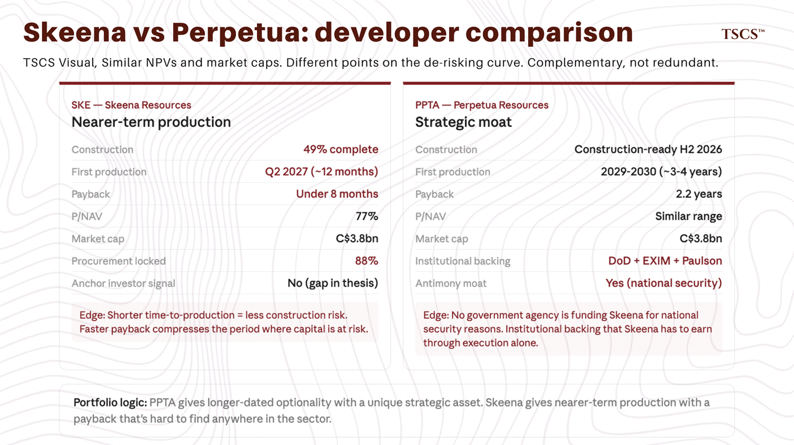](https://substackcdn.com/image/fetch/$s_!rmed!,f_auto,q_auto:good,fl_progressive:steep/https%3A%2F%2Fsubstack-post-media.s3.amazonaws.com%2Fpublic%2Fimages%2F5b59c229-7954-4334-ae6d-a5640d073013_1406x789.png)

**Where I could be wrong**

Skeena has never operated a mine. Full stop. Eskay Creek was operated by Barrick using completely different methods on different parts of the deposit. Skeena’s open-pit plan is based on the DFS and subsequent engineering work, but translating a mine plan into actual production is where the gap between spreadsheet and reality gets tested.

Grade reconciliation deserves more than a passing mention because it is, without exaggeration, the single most important variable in the first quarters of any new mine. The geological model says the ore body contains a certain grade. The actual ore you mine and process will differ. In open-pit operations transitioning from a deposit previously mined underground, the spatial relationship between the model and reality can surprise in ways that don’t show up in core samples.

Eskay Creek has a specific variant of this risk that generic grade reconciliation language doesn’t capture. Barrick honeycombed the deposit with underground workings over fourteen years of production. When you blast an open pit into historical stopes, you hit voids. Blast energy dissipates into empty space, rock fragmentation deteriorates, oversized boulders jam the primary crusher, and you risk processing barren backfill instead of ore. This isn’t speculative. It’s a geotechnical reality of mining into old workings, and Skeena’s mine plan has to manage it from day one.

There’s a second friction I haven’t mentioned. Eskay Creek produces a complex polymetallic concentrate, not clean doré. That means Skeena doesn’t pour bars and sell them at spot. They ship concentrate to smelters who dictate the commercial terms, impose treatment and refining charges (TC/RCs), and take months to finalize payments. The effective realized margin is lower than the headline AISC suggests, and cash flow timing is lumpier. Smelter negotiations are an ongoing commercial risk that pure gold producers like Wesdome and AEM don’t face.

If realized grades come in 15-20% below plan in the first two quarters, the 77% EBITDA margin compresses to something closer to 60-65%, the 8-month payback stretches past a year, and the 3.9x P/E headline becomes 5-6x. That’s still cheap. But it’s a different kind of cheap, the kind where the market says “told you so” and the stock sells off 20-30% before the data normalizes. This is not a low-probability scenario. Grade misses in the first year of production are closer to the norm than the exception in the gold mining industry.

The 17% capex increase from the 2023 DFS is absorbed so far, but the project is 49% complete with 12% of procurement uncommitted. Mining construction has a persistent tendency toward late-stage cost surprises. The inflationary environment, particularly with energy costs surging, adds pressure on the remaining uncommitted scope.

British Columbia is Tier-1 but it comes with complexity. The regulatory environment is intricate. Environmental activism has a long history in the province. First Nations engagement is ongoing and must be maintained through the life of the mine. None of this prevented Eskay Creek from getting permitted, but operational friction during construction and production is a different kind of risk than permitting risk.

The share count has grown through the development phase. 121.7 million shares. If additional financing is required for any reason, further dilution is possible, though the refinancing suggests the current capital structure should be sufficient to reach production.

And the gold price dependency is acute. At $4,500 gold, the IRR is 102% and the payback is 8 months. At $3,000, the project is still economic, but those numbers come way down and the “3.9x P/E” headline stops being a headline. Skeena’s leverage to gold price cuts both ways. In a rising gold environment, it’s one of the best expressions of that view. In a declining one, the re-rating I’m counting on gets delayed or doesn’t happen.

There is a counterargument I owe you. Hickey has owned Skeena since the low single digits. He has made roughly 750% on it. He is selling. Not all of it, but reducing, and rotating into Rupert Resources, which trades at roughly 20% of NPV versus Skeena at 77%. His logic is clean: the easy money has been made, and the wider discount on Rupert offers more asymmetry even though Rupert is years further from production. I disagree. I weight the de-risking at 49% completion more heavily than a wider NAV gap on a project that does not produce until 2031 at the earliest. But Hickey has been doing this since before I was born. When he disagrees with me, I put it in the piece. You decide.

[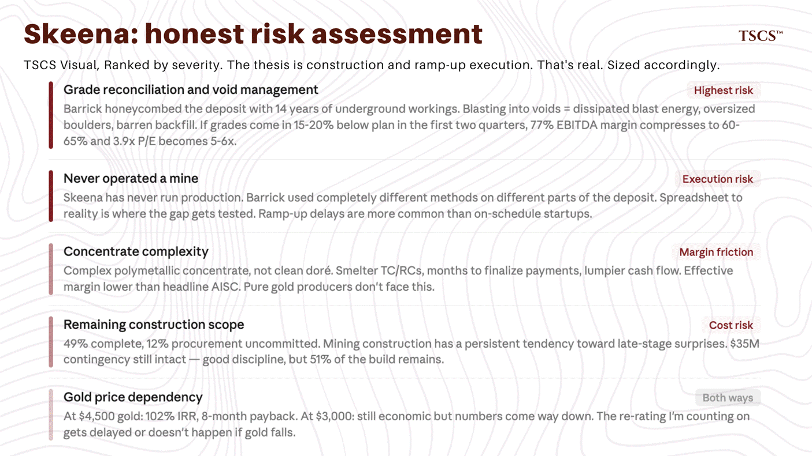](https://substackcdn.com/image/fetch/$s_!gqf6!,f_auto,q_auto:good,fl_progressive:steep/https%3A%2F%2Fsubstack-post-media.s3.amazonaws.com%2Fpublic%2Fimages%2F30979422-3379-45b4-ab04-947dc325b1c6_1405x791.png)

Institutional ownership is at about 50%, which is reasonable for a developer at this stage. I haven’t identified an anchor investor providing the kind of conviction signal that Paulson provides for PPTA. That’s a gap in the thesis. It means there’s no committed holder whose presence signals deep due diligence and willingness to support the stock through construction-phase volatility. It doesn’t change my assessment of the project economics, but it’s a qualitative negative relative to Perpetua on the developer comparison.

I’m adding Skeena as a core position. The project is half built, a year from production, fully funded, and trading at under 4x first-year earnings on metal price assumptions that are already conservative relative to spot. The refinancing just improved the financial structure materially. And the payback period, a realistically modeled 14-16 months at current prices, means that if Skeena executes on schedule, the entire capital investment is recovered before most of the market has finished updating its models.

The risk is construction and ramp-up execution. That’s real. I’m sizing for it. But at 77% of NAV with the project half done, I think the market is overweighting the risk relative to the reward.

# What happens if I’m wrong

I put the deflationary bust scenario at roughly one in four. If it plays out, these five names do not behave the same way, and you need to know the hierarchy before you size positions.

AEM survives any environment. In a broad liquidation, its quality premium becomes a flight-to-quality bid within the gold sector. It still goes down. Everything goes down. But it goes down less and recovers first.

Alamos has the balance sheet to weather it, but 2026 is peak capex year. $900 million going out the door while gold is falling is a painful combination. The growth story delays, not dies, but the stock could take a serious hit in the interim.

Wesdome’s C$354 million cash pile provides a genuine floor, but at C$3.9 billion market cap with C$18 million in daily volume, it overshoots to the downside in a panic. The cash protects the company. It doesn’t protect the stock price in the short term.

Perpetua and Skeena, as pre-revenue names with multi-billion dollar market caps built on forward economics, take the worst of it. 30-50% drawdowns on no company-specific news are entirely possible. The projects survive because they’re fully funded, but the equity trades on sentiment, not cash flow, until production begins. Time-to-production becomes a liability rather than a countdown.

The order I listed them in is roughly the order of defensive resilience. Size accordingly.

[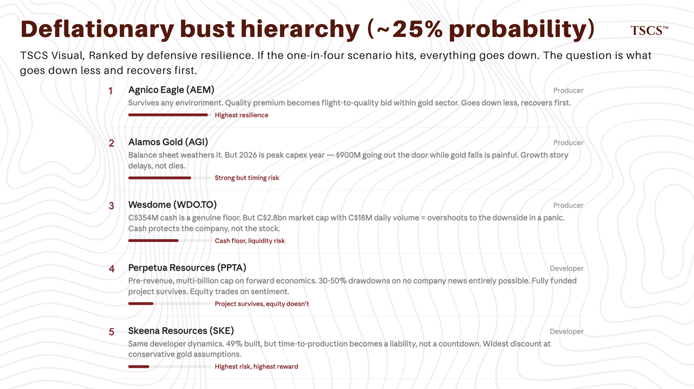](https://substackcdn.com/image/fetch/$s_!ZdTL!,f_auto,q_auto:good,fl_progressive:steep/https%3A%2F%2Fsubstack-post-media.s3.amazonaws.com%2Fpublic%2Fimages%2Ffbde9783-ee27-4575-adbb-224e0960a8b7_1406x789.png)

The goal is that if the one-in-four scenario hits, your gold allocation takes a hit but doesn’t blow up your portfolio. If you can’t say that with confidence right now, you’re probably oversized in the developers and undersized in the producers.

# Putting it together

Five companies. Three producers and two construction-stage developers. They have one thing in common: at $4,672 gold, every single one of them is mispriced relative to the cash flows and asset values the metal price supports.

The market hasn’t caught up. Consensus estimates across the board embed gold assumptions below current spot. Analyst targets lag the prevailing price. The sector discount that suppresses these multiples was earned by other companies in other cycles. The names in this piece were selected because they break the pattern.

[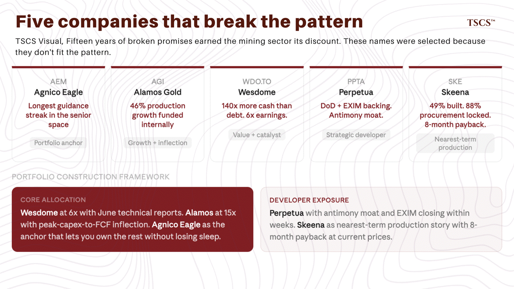](https://substackcdn.com/image/fetch/$s_!Q0W0!,f_auto,q_auto:good,fl_progressive:steep/https%3A%2F%2Fsubstack-post-media.s3.amazonaws.com%2Fpublic%2Fimages%2Fff8129d7-e33b-482f-8e20-068455f1a5ad_1403x789.png)

AEM has the longest streak of meeting guidance in the senior space. Alamos is funding ~30% production growth internally. Wesdome has 140 times more cash than debt. Perpetua has the U.S. Department of Defense and EXIM Bank behind it. Skeena is 49% built with 88% of procurement locked.

The framework is tiered by risk and reward. I have published deep dives on three of these five names over the past ten months. Perpetua in June. Alamos in June. Wesdome in December. For each the thesis has evolved. Where I was wrong, I have told you. Where the setup has improved, I have shown you why. Treat this as the updated portfolio construction playbook, not five independent stock pitches.

[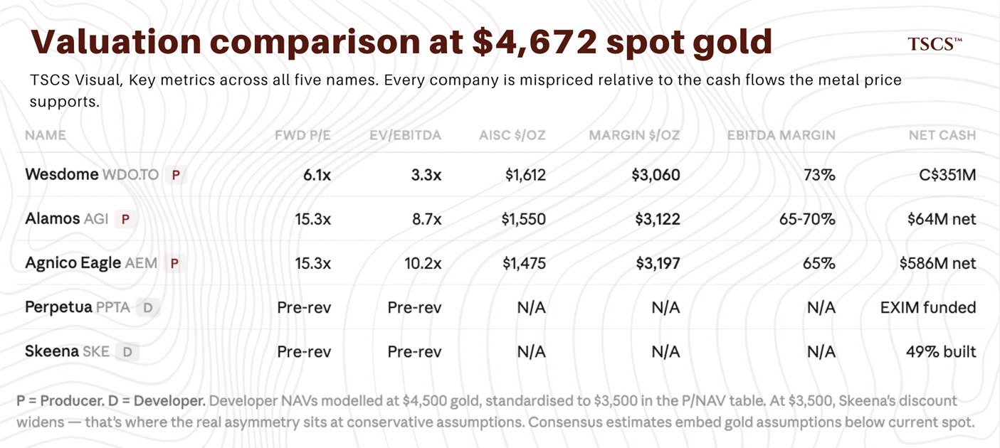](https://substackcdn.com/image/fetch/$s_!dcDF!,f_auto,q_auto:good,fl_progressive:steep/https%3A%2F%2Fsubstack-post-media.s3.amazonaws.com%2Fpublic%2Fimages%2F5e2138f5-698e-4590-afe3-232a994528e9_1405x630.png)

For the core of a gold miner allocation: Wesdome at 8.4x with the June technical reports two months away, Alamos at 15x with ~30% production growth and a peak-capex-to-FCF inflection, and Agnico Eagle as the portfolio anchor that lets you own the rest without losing sleep.

For developer exposure: Perpetua with the antimony moat and EXIM closing within weeks, and Skeena as the nearest-term production story with a realistically modeled 14-to-16 month payback at current prices.

I’m evaluating earlier-stage names with wider NAV discounts for future coverage. There are compelling setups in the speculative tier, but the execution risk and analytical uncertainty involved deserve their own dedicated treatment rather than a compressed section at the end of a long piece. When I have conviction, I’ll publish.

Q1 earnings start this month. $3,000+ margins per ounce on millions of ounces of production. When those numbers hit, the market will be forced to reconcile the earnings power of these businesses with the multiples it’s assigning them. I think that reconciliation drives a re-rating. I’m positioned for it.

A note I haven’t addressed elsewhere: the tax treatment of these names varies meaningfully depending on your jurisdiction, whether you hold the TSX or NYSE listing, and whether you’re in a taxable or sheltered account. Canadian-listed gold miners involve foreign withholding tax on dividends and currency exposure that affects after-tax returns. Consult your tax adviser before sizing positions.

What I am watching. Newmont reports April 23. Alamos April 29. Agnico Eagle April 30. Those Q1 numbers at $4,975 realized gold will force a conversation about miner valuations the market has been avoiding. Perpetua’s EXIM final board vote before end of April. Wesdome’s June technical reports are the binary. Skeena targets first ore Q2 2027, twelve months out. Every name in this piece has a catalyst within ninety days. For Skeena, that catalyst is the formal closing of its $750 million refinancing, permanently removing the financing overhang ahead of first ore.

[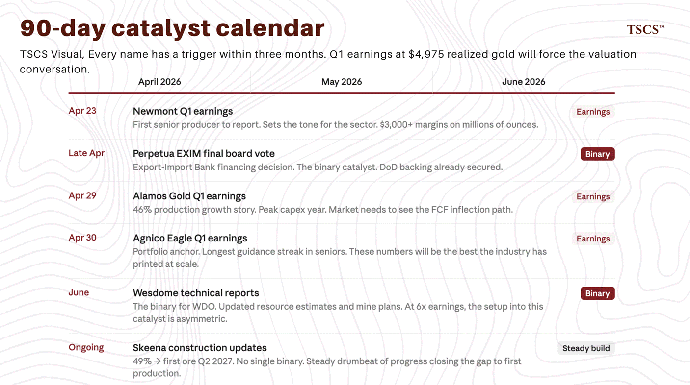](https://substackcdn.com/image/fetch/$s_!CSyc!,f_auto,q_auto:good,fl_progressive:steep/https%3A%2F%2Fsubstack-post-media.s3.amazonaws.com%2Fpublic%2Fimages%2Faa38e597-aef9-41ad-bfcc-c0daf79dc0a6_1406x786.png)

I hold positions in several of the names discussed. Gold miners represent roughly 20-25% of my total portfolio.

I don’t hold short positions in any of these companies. Nothing in this publication constitutes investment advice. Do your own work. Size according to your own risk tolerance.

If you haven’t read the Epic Fury series, start there. If you haven’t read “Gold Is Not Failing,” read it before you read this a second time. The macro is the foundation. These companies are how I’m expressing it.

[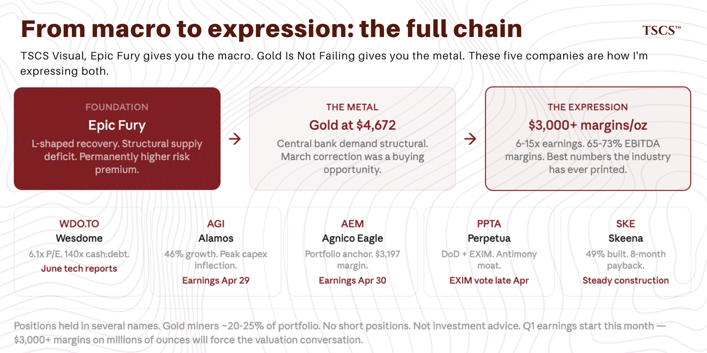](https://substackcdn.com/image/fetch/$s_!c8us!,f_auto,q_auto:good,fl_progressive:steep/https%3A%2F%2Fsubstack-post-media.s3.amazonaws.com%2Fpublic%2Fimages%2Ffa1be0ee-f238-495a-beaf-a74c35127498_1406x703.png)

---

***Disclaimer:** This is not investment advice. All content is for informational purposes only. The author may hold positions in securities discussed. Do your own research and consult a licensed financial advisor before making any investment decisions.*