The President of the United States has posted this morning that America is in “serious discussions” with what he calls “a new, and more reasonable, regime” to end military operations in Iran. He added that if a deal is not reached shortly, the US will destroy Iran’s electric generating plants, oil wells, Kharg Island, and “possibly all desalination plants.”

Brent will move on this. It always does. The curve will flatten, the algos will reprice, and by the time you read this sentence the cable anchors will be calling it a breakthrough.

This is exactly the pattern this piece was written to trade against.

Every week since the Strait closed, the same cycle has played out: a headline suggesting resolution, a crude selloff, and then the physical reality reasserting itself within days. Energy Secretary Chris Wright posted that a tanker had been escorted through Hormuz. It was a lie. Crude dropped 17% before the White House retracted it. The market has been trading tweets, not molecules.

[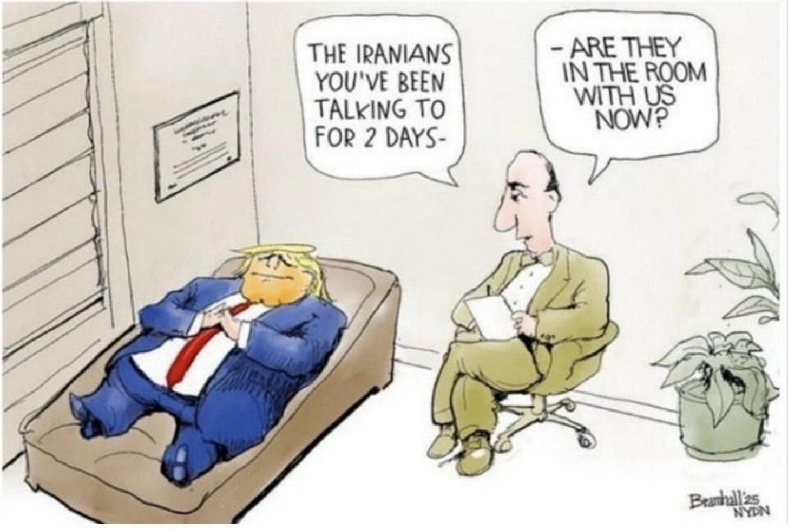](https://substackcdn.com/image/fetch/$s_!bBrF!,f_auto,q_auto:good,fl_progressive:steep/https%3A%2F%2Fsubstack-post-media.s3.amazonaws.com%2Fpublic%2Fimages%2F502d6587-0ef4-4ccf-b495-1ffcb1b1e0f4_2578x1730.png)

This piece is not about whether a ceasefire happens. A ceasefire will happen. Maybe this week. Maybe in three months. This piece is about what happens the day after, and the day after that, and the six to thirty-six months after that, when the market discovers that signing a document does not clear mines, restart refineries, fabricate cryogenic heat exchangers, or reprice the insurance markets that have repriced permanently.

The war ends. Here is what does not.

On March 28, a petroleum engineer at Texas A&M named Siddharth Misra published something that should have been front-page news and wasn’t. Three physical constraints. Three reasons the oil market’s post-ceasefire recovery model is physically impossible. First: midstream hysteresis. Shut down a pipeline and asphaltene and wax settle inside it. You cannot restart it until you run a 14-21 day integrity-pig inspection to confirm the line is not clogged.

Second: SPR limits. Misra’s argument was that prolonged drawdown eventually hits degraded sour crude at the bottom of the salt caverns, poisoning refinery catalysts.

I think the stronger version of this constraint is hydraulic, not chemical. The reserve’s maximum sustained rate of 4.4 million barrels per day is an engineering ceiling, not a policy choice. It depends on pipeline capacity, marine terminal throughput, and cavern pressure that degrades as volumes fall. The caverns use brine displacement; as inventory drops, you lose cavern pressure, and the maximum flow rate degrades materially after roughly 90 days of sustained drawdown. And the reserve doesn’t drain cleanly to zero.

Effective capacity falls well before the caverns empty. The SPR is not a battery. It is a leaky bucket with a sour bottom. Third: the cold-start problem. You are not just reopening a valve. You are restarting stagnant pipeline networks, remobilizing a tanker fleet into a former conflict zone, and doing it all with paralyzed insurance markets.

His conclusion: “L-shaped plateau, not V-shaped recovery.”

[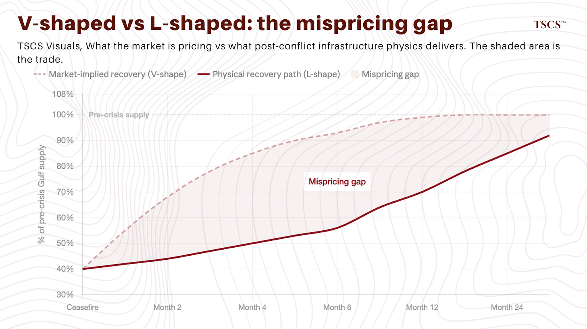](https://substackcdn.com/image/fetch/$s_!O5On!,f_auto,q_auto:good,fl_progressive:steep/https%3A%2F%2Fsubstack-post-media.s3.amazonaws.com%2Fpublic%2Fimages%2Ff6115406-25c5-4cde-911b-cf95b098f3b7_1600x898.png)

I think he is right. And I think the gap between his assessment and what the market is pricing is the single largest mispricing in global commodity markets right now.

The entire market is organized around one question: when does the Strait of Hormuz reopen?

Kalshi has normalization by June 1 at roughly 49%, down from 67% a week ago. The Brent forward curve has December 2026 at roughly $85 against spot around $112. Backwardation during a supply crisis is standard. But $27 of it over nine months is not standard. That’s the curve telling you it expects the majority of the supply disruption to resolve by year-end. The vol surface agrees. The put-call skew agrees. The options-implied probability distributions agree.

Everyone’s on the same side of the boat.

That is a directional bet on recovery speed, and the post-conflict analogs with comparable fragmentation say the bet is wrong. Energy Secretary Chris Wright went on TV and said the disruption would last “weeks, certainly not months.” Then he posted a claim that the Navy had already escorted a tanker through the Strait. Then he deleted it. Crude futures dropped 17% on that tweet before someone at the White House admitted it wasn’t true. Foreign Policy reported the incident on March 24. The man responsible for US energy policy caused a flash crash with a lie he had to retract within thirty minutes.

That is the thesis the market is trading. Weeks, not months. V-shaped recovery. War on, war off. Binary.

Everyone is watching the ceasefire calendar. The actual story is what happens the day *after* the ceasefire.

Here is the answer, supported by the majority of post-conflict energy recoveries in the modern era, and all of the ones with comparable political fragmentation: not what the curve is pricing. Not even close.

**The market is modeling a V-shaped supply recovery. The actual shape is an L with a slow ramp.** The gap between those two shapes is where the highest-conviction trades sit for the next twelve to thirty-six months.

Six pieces on what happens during the war. This one answers what happens after. The war ends. What is permanently broken?

*This is Part VII of the Epic Fury series. Parts I through VI covered what happens during the war. This piece covers what happens after. If you are not already a subscriber, the full series, including the tanker thesis ([8 Days to Kuwait](https://tscsw.substack.com/p/the-oil-market-is-lying-to-you)), the fertilizer chain ([Watch The Wrong Price](https://tscsw.substack.com/p/watch-the-wrong-price)), and the original [Hormuz framework](https://tscsw.substack.com/p/operation-epic-fury), is available to paid subscribers of The Sator Cipher Sator.*

*The trades in this series are long-duration, high-conviction, and built on physical constraints that do not negotiate with headlines. If that is how you think about markets, this is where the work gets done.*

Subscribed

## Every post-conflict oil recovery took longer than the market expected

[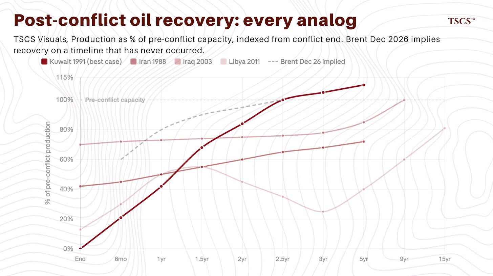](https://substackcdn.com/image/fetch/$s_!5KQO!,f_auto,q_auto:good,fl_progressive:steep/https%3A%2F%2Fsubstack-post-media.s3.amazonaws.com%2Fpublic%2Fimages%2Fbdbe398b-6b3e-4197-be13-b9b438201957_1600x899.png)

I want to start with the base rates, because the historical record is so bad for the V-shaped thesis that it borders on embarrassing.

Kuwait 1991 is the best case the V-shaped camp has. It is their single strongest analog. And it should terrify them.

A single country. An intact government-in-exile that started planning reconstruction during the occupation, pre-securing contracts and equipment before liberation. A sovereign wealth fund exceeding $100 billion. Full US military presence. Zero insurgency. No ongoing security threat. No reservoir damage from forced shut-ins because the wells were high-pressure and self-flowing.

Pre-invasion production stood at about 1.9 mb/d. Iraqi forces destroyed over 700 oil facilities. The firefighting campaign alone ran nine months. Bechtel’s advance team arrived within days of liberation, with Red Adair’s crew on scene by late March. Eventually 27 firefighting teams deployed by September. And then there was Bechtel.

Bechtel mobilized 16,000 workers from 36 countries. They imported 200,000 tons of equipment from 12 countries on a fleet of wide-body jets making 200 trips. They built dining halls serving 35,000 meals a day. They called it “the largest peacetime airlift since Berlin.”

[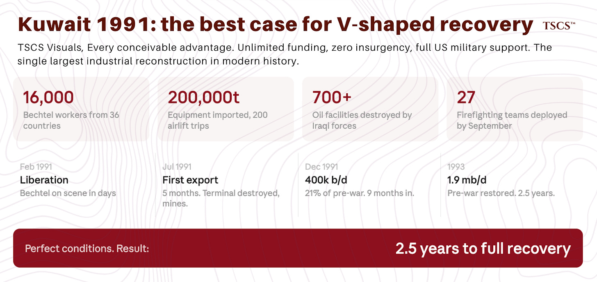](https://substackcdn.com/image/fetch/$s_!PPoL!,f_auto,q_auto:good,fl_progressive:steep/https%3A%2F%2Fsubstack-post-media.s3.amazonaws.com%2Fpublic%2Fimages%2F65b862d6-6a10-4a65-8aa0-8aaf0b08ad4c_1600x758.png)

By December 1991, nine months after liberation, Kuwait was producing just 400,000 b/d. Pre-invasion output was not restored until 1993. Two and a half years. Under perfect conditions.

And it gets worse. The first postwar export did not happen until July 1991, five months after liberation, because the Sea Island terminal was destroyed and surface logistics had to be secured before firefighting could begin.

Oil & Gas Journal documented water coning damage to reservoirs during the uncontrolled blowouts. The real bottleneck was logistics, port infrastructure, mine clearance, and workforce mobilization.

Iraq post-2003 is what happens when institutions collapse. And this one has a twist.

About ten wells were set on fire. Ten. The invasion itself barely touched the oil sector. Everything that went wrong was post-combat.

Looting was often more destructive than the invasion. Smugglers stole up to 2,500 tons of fuel daily. Insurgents attacked pipelines 130+ times in the first year. And then came the two orders that broke everything: CPA Order 1, issued May 16, fired the top four ranks of the Ba’ath Party (about 20,000 people, many of whom were petroleum engineers who held party membership as a career requirement). CPA Order 2, issued May 23, dissolved the entire Iraqi army. The state was decapitated in seven days.

The contracting failures are worth a brief detour because they illustrate a universal pattern. KBR got a $7 billion no-bid contract. The DCAA identified $1.4 billion in questioned and unsupported costs. One example: the Al-Fatah Pipeline repair was estimated at $5 million. KBR spent $75 million attempting to drill through a geological fault zone, completed 28% of the work, and ran out of money. An Army geologist named Robert Sanders said “no driller in his right mind would have gone ahead.” Deputy Defense Secretary Wolfowitz had predicted Iraqi oil revenues of “$50 to $100 billion over the course of the next two or three years.” Oil & Gas Journal predicted restoration to 2.5 mb/d “may not take more than 2 years.”

Iraq did not sustainably exceed pre-war production capacity until 2012. Nine years. After minimal combat damage to oil infrastructure. Because the binding constraint was institutional, not physical.

Libya is the permanent damage scenario. Pre-war production of 1.7 mb/d collapsed to roughly 22,000 b/d at its July 2011 nadir. Fifteen years later, output has recovered to about 1.374 mb/d. That is 81% of pre-war capacity, and it only hit that level in 2025. The Ras Lanuf refinery has been offline since 2013. Eight of thirteen crude storage tanks at Ras Lanuf were destroyed between 2015 and 2018. Libya never recovered because the institutional framework required for sustained production never reconstituted.

Iran after the 1980-88 war isolates what happens when sanctions layer on top of conflict damage.

Production collapsed from 6.0 mb/d pre-revolution to 1.3 mb/d by 1981, partially recovered to 2.0-2.5 mb/d for most of the war, and passed 3 mb/d by 1990, about two years post-ceasefire. Iran has never returned to its pre-revolution peak. Ever. The EIA’s assessment: war, sanctions, limited investment, and natural field decline combined to prevent it. Permanently.

[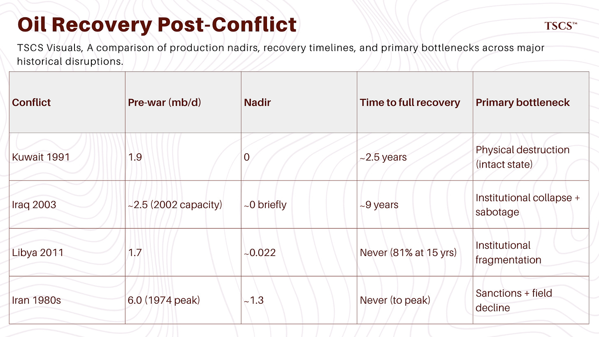](https://substackcdn.com/image/fetch/$s_!Y9wm!,f_auto,q_auto:good,fl_progressive:steep/https%3A%2F%2Fsubstack-post-media.s3.amazonaws.com%2Fpublic%2Fimages%2Fcd271da1-9952-4326-a384-063a0ad4cb1a_1600x901.png)

The pattern is consistent across every one of these cases: production recovery takes far longer than the market prices, the binding constraint is never “turning the tap back on,” and institutional collapse matters more than physical damage.

Now here’s where someone raises their hand and says Abqaiq. Fine. Let’s talk about Abqaiq. In September 2019, drone and cruise missile strikes knocked out 5.7 mb/d of Saudi capacity in a single morning. Aramco restored full production within two weeks. Oil prices fell below pre-attack levels within a month. That is a textbook V-shaped recovery, and anyone using base rates without accounting for it is being intellectually dishonest.

[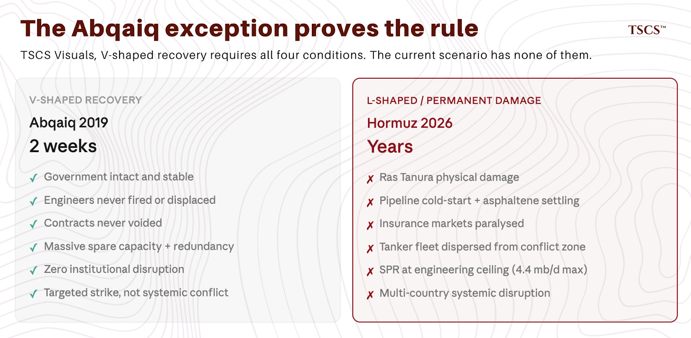](https://substackcdn.com/image/fetch/$s_!In_q!,f_auto,q_auto:good,fl_progressive:steep/https%3A%2F%2Fsubstack-post-media.s3.amazonaws.com%2Fpublic%2Fimages%2F1927e594-af1e-4940-8750-d2f7bbd3003b_1600x783.png)

But Abqaiq proves the rule by isolating the variable that matters. Saudi Arabia suffered a targeted infrastructure strike on a stable, wealthy petrostate with massive spare capacity and redundant systems. The government never fell. The engineers were never fired. The contracts were never voided.

Every case above involved the opposite: institutional collapse, state fragmentation, or regime change layered on top of physical damage. In the current scenario, Iranian institutions did not. Gulf producers’ institutions are intact, which is why the crude recovery is a slow ramp, not a permanent L. But institutional survival does not clear mines, reprice insurance, or restart refineries.

The Brent December 2026 contract, recently trading near $85, implies a normalization of supply conditions that has never occurred on this timeline in the history of post-conflict oil markets. Not once. Under any conditions. With any level of resources.

[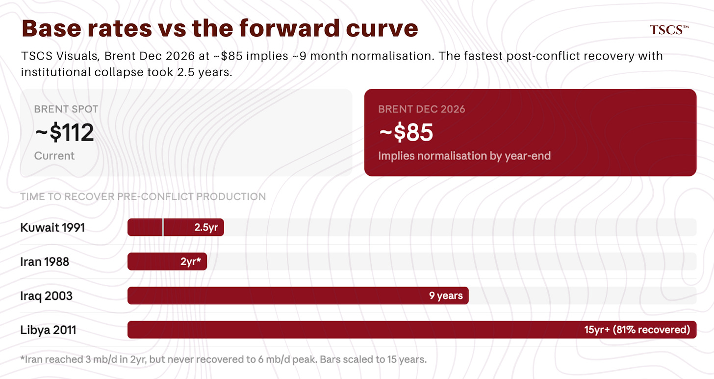](https://substackcdn.com/image/fetch/$s_!kuPT!,f_auto,q_auto:good,fl_progressive:steep/https%3A%2F%2Fsubstack-post-media.s3.amazonaws.com%2Fpublic%2Fimages%2F5da3bd95-2829-4e47-b5a3-d56ca99e7208_1600x853.png)

Jeff Currie at Carlyle titled his March 17 note “You Can’t Print Molecules.” That’s as good a three-word summary of this entire piece as you’ll find. Even if the strait reopened tomorrow, physical supply normalization would take months, not days. Molecules are not financial instruments. You cannot will them back into the market.

Chevron CEO Mike Wirth, at CERAWeek: “There are very real, physical manifestations of the closure that I don’t think are fully priced into the futures curves.”

I believe them. And I’ll take the base rates over a forward curve built on vibes.

## The spare capacity that does not exist

The single most important number the V-shaped camp relies on, because it is functionally a lie.

The consensus headline: approximately 4.6 mb/d of OPEC+ spare capacity (per the EIA’s February 2025 Short-Term Energy Outlook; the IEA’s own pre-crisis estimate was closer to 4.0 mb/d). That sounds reassuring. It sounds like a buffer. It is neither.

Roughly 4 mb/d of that spare capacity sits inside Hormuz.

[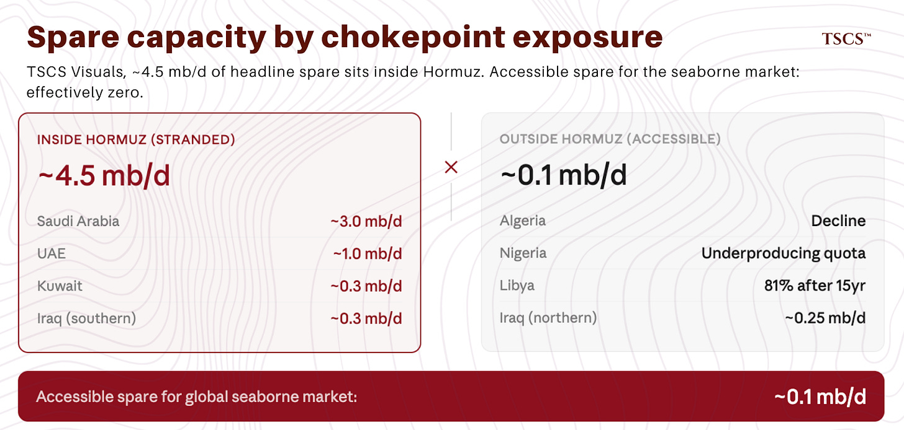](https://substackcdn.com/image/fetch/$s_!dx4-!,f_auto,q_auto:good,fl_progressive:steep/https%3A%2F%2Fsubstack-post-media.s3.amazonaws.com%2Fpublic%2Fimages%2F30808c37-125f-46a6-8cab-13ed79a302a8_1600x763.png)

It is in Saudi Arabia, the UAE, Iraq, and Kuwait. If the Strait is closed, or even operationally degraded (which is the more likely near-term outcome), the spare capacity is stranded behind the chokepoint it is supposed to offset. This is like saying you have a fire extinguisher in the burning room.

The Petroline, Saudi’s East-West bypass, has a nameplate of 5 mb/d. The 7 mb/d number everyone cites includes jury-rigging the parallel NGL pipeline to carry crude, which Aramco did by mid-March. By late March, CEO Amin Nasser confirmed the system was running at full 7 mb/d throughput. Great. Pipeline capacity is not the problem. Sustainable seaborne exports are physically bottlenecked by Yanbu terminal’s loading limits: the King Fahd Industrial Port complex, comprising the legacy Yanbu North Terminal (~1.5 mb/d, four VLCC berths) and the newer Yanbu South Terminal (3.0 mb/d, commissioned October 2018, three VLCC berths), carries a combined theoretical marine nameplate of roughly 4.5 mb/d.

Adjusted for pilotage, vessel sequencing, and turnaround friction, sustained loading capacity compresses to approximately 3.4 to 3.6 mb/d in normal operations, though crisis-mode surge loading pushed throughput toward 5 mb/d by late March at rates that industry analysts at Vortexa and Argus have questioned as unsustainable. Actual March exports through Yanbu: approximately 2.47 mb/d per Windward data, a 330% surge but still well below even the tested physical ceiling.

Total Saudi exports in March: approximately 4.355 mb/d, down from 7.1 mb/d in February. That is a 38% drop from the world’s most important oil exporter, with the bypass running at full capacity. By late March, the picture had shifted. Total Saudi exports have partially recovered. But the terminal sustainability question is unresolved. Yanbu South Terminal has never operated at these rates for more than two weeks. Berth scheduling, VLCC availability in the Red Sea basin, and Houthi-adjacent shipping insurance costs are all compressing effective throughput below the headline loading figures. The March data is a sprint, not a pace.

There’s a backup pipeline called IPSA-2. It can theoretically carry 1.65 mb/d. Aramco confiscated it from Iraq after the Gulf War and converted it to gas service. They’ve quietly tested reversing it back to crude. But here’s the problem: reversibility is a Q3 engineering solution to a Q1 geopolitical shock.

The recommissioning sequence, venting, pigging, reconfiguring pump stations for liquid hydrodynamics, packing the line with millions of barrels of crude, is a multi-month project before a single export barrel flows. And the domestic cost is severe: IPSA-2 feeds the Master Gas System in the Western Province. Cutting gas flow to pump crude starves Jeddah’s power grid and desalination plants, forcing Aramco to burn roughly 400,000 to 500,000 b/d of crude equivalent domestically just to keep the lights on. The net incremental export gain after replacing the lost gas shrinks to roughly 1.0 to 1.2 mb/d, delivered months after the acute phase of the crisis has already repriced every barrel on the water.

The crude consumed by Yanbu’s refining complex is not a static deduction from bypass capacity. It is a hard floor that rises under crisis conditions. If Hormuz is closed, Saudi Arabia’s Gulf-side refineries, Ras Tanura (550k b/d), SATORP (460k b/d, reflecting its post-debottlenecking operational capacity, up from the legacy 400k nameplate), and SASREF (305k b/d) in Jubail, are physically trapped. They cannot export refined product to the global market. Yanbu becomes the Kingdom’s sole operational export refining hub. Aramco will be economically and politically compelled to run SAMREF (400k b/d, ExxonMobil JV) and YASREF (400k b/d, Sinopec JV) at maximum utilization: the margin on exporting Red Sea diesel to a fuel-starved European market would be historic, the domestic military and civilian fuel requirement is non-negotiable, and cutting feed crude to your most powerful JV partners during a geopolitical crisis triggers a diplomatic incident.

[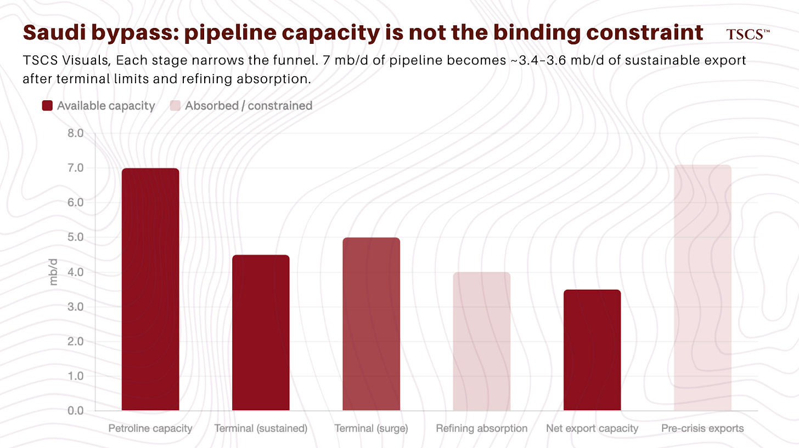](https://substackcdn.com/image/fetch/$s_!Gpn6!,f_auto,q_auto:good,fl_progressive:steep/https%3A%2F%2Fsubstack-post-media.s3.amazonaws.com%2Fpublic%2Fimages%2F633e0b8e-1965-4341-a117-efb74a8d4964_1600x899.png)

The UAE’s Habshan-Fujairah bypass (ADCOP) adds 1.5 to 1.8 mb/d, but is fully consumed rerouting roughly half of the UAE’s baseline exports.

What about non-OPEC supply response? Rystad estimates US shale can add a maximum of 380,000 b/d. Under an extremely optimistic scenario. With a two-quarter lag. Goldman estimates the US response offsets only 20-25% of initial volume loss, again with a multi-quarter delay.

The SPR is a stopgap, not a solution. The IEA coordinated the largest release in history: 400 million barrels. There are roughly 1.2 billion barrels of public strategic reserves and 600 million of industry-obligated stocks remaining. At the IEA’s own estimate of an 8 mb/d supply plunge in March, the SPR buys you months, not years. And as established earlier, the hydraulic constraints documented in Sandia National Laboratories’ annual assessments and the unrecoverable sediment layers detailed in the DOE’s Assay Manual mean effective capacity zeroes out well before the headline inventory does.

[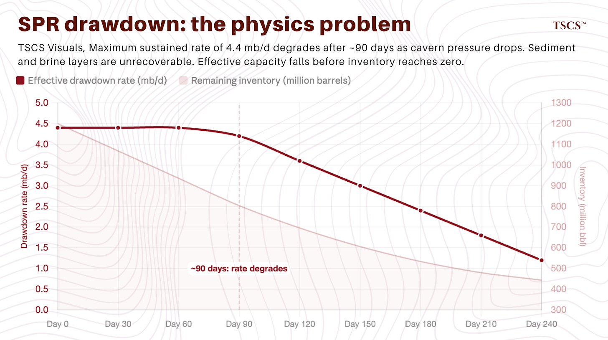](https://substackcdn.com/image/fetch/$s_!uNDj!,f_auto,q_auto:good,fl_progressive:steep/https%3A%2F%2Fsubstack-post-media.s3.amazonaws.com%2Fpublic%2Fimages%2F51a3b7d9-2695-4594-95f9-1b4190c97559_1600x895.png)

Now map each country’s spare capacity to its chokepoint exposure. The IEA’s Monthly Oil Market Report (Table 3, World Oil Production) breaks down sustainable capacity versus recent production for every OPEC+ member. The delta varies by source, roughly 4.0 mb/d per the IEA, 4.6 mb/d per the EIA. It does not matter which number you use.

What the market should actually be trading:

[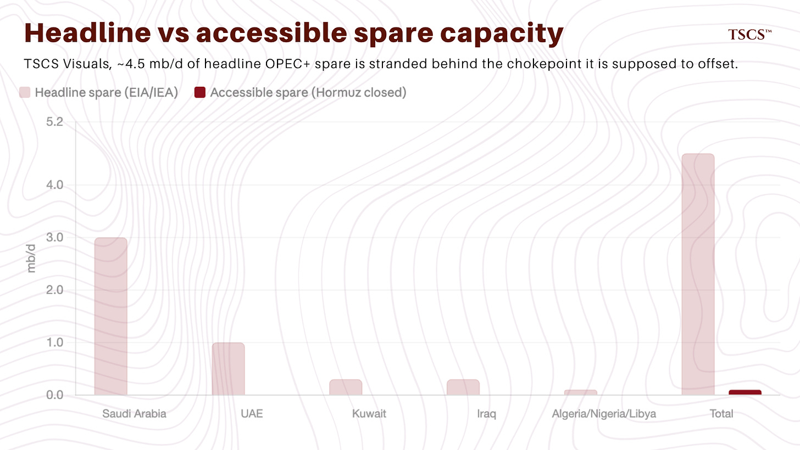](https://substackcdn.com/image/fetch/$s_!2-EV!,f_auto,q_auto:good,fl_progressive:steep/https%3A%2F%2Fsubstack-post-media.s3.amazonaws.com%2Fpublic%2Fimages%2F2846d351-2665-4b5d-a44f-6a60cb952207_1600x901.png)

Saudi Arabia. Headline spare: ~3 mb/d. As established above, Yanbu’s terminal capacity is already physically saturated just rerouting baseline production. Even at unsustainable crisis-surge levels, no residual port capacity exists for incremental barrels. Accessible spare: 0 mb/d.

UAE. Headline spare: ~1 mb/d. ADCOP is consumed rerouting baseline exports. Accessible spare: 0 mb/d.

Kuwait. Headline spare: included in the ~0.6 mb/d combined with Iraq. No bypass infrastructure. Accessible spare: 0 mb/d.

Iraq. The northern corridor is operational but running at a fraction of capacity. Following a US-brokered interim agreement in September 2025, the Kurdistan Export Pipeline restarted at roughly 180,000 to 200,000 b/d (consistent with SOMO export data showing approximately 198,000 b/d averaged through Ceyhan in February 2026). On 18 March 2026, Baghdad and Erbil struck an emergency agreement to maximise Kirkuk exports via the KRG pipeline system; officials described the operation as targeting up to 250,000 b/d, with initial pumping reported at around 170,000 b/d (Reuters, citing deputy oil minister Basim Mohammed Khudair). By late March, specialist reporting suggested northern exports were approaching the 250,000 b/d target, though this has not been corroborated by public metered flow data.

With the Strait closed, Iraq’s entire southern seaborne export baseline of approximately 3.4 mb/d (sourced via pre-crisis SOMO loading programs and vessel tracking) is trapped. While domestic refining and onshore storage buffers at the Fao peninsula have temporarily absorbed a portion of this volume, physical tank tops have already forced roughly 2.9 mb/d of hard wellhead shut-ins, collapsing output to approximately 1.4 mb/d, a figure that will deteriorate further as remaining storage capacity exhausts. The northern route is Iraq’s sole remaining export artery.

Upside optionality exists but faces deep uncertainty. Baghdad says it is in final hydrostatic testing of a remaining approximately 100 km section of the federal Kirkuk-Ceyhan pipeline (offline since ISIS attacks in 2014), intended to enable direct exports to Ceyhan without transiting KRG-controlled infrastructure. The oil minister has described initial throughput of 200,000 to 250,000 b/d (Argus, Reuters, 16 March 2026). Independent analysts are considerably more cautious: the Middle East Institute assesses that full rehabilitation of the federal line could take months to years, citing security, pumping station, and governance challenges beyond pipe integrity alone. Even if both northern lines achieve maximum flow, the combined 400,000 to 500,000 b/d offsets less than 15% of Iraq’s trapped southern exports.

And all of this is built on a legal cliff that nobody’s talking about. In July 2025, Erdogan published a Presidential Decree terminating the 1973 Iraq-Turkey Pipeline Agreement. The expiry date: July 27, 2026. Four months from now.

Ankara is actively leveraging the threat of a permanent legal shutdown to pressure Baghdad into forgiving the $1.5 billion ICC arbitration ruling and renegotiating a broader energy pact on Turkish terms. The entire northern bypass is operating on a treaty with four months of legal life remaining, and no successor agreement is in place. Accessible spare from Iraq: 0 mb/d.

Outside Hormuz (Algeria, Nigeria, Libya). Immediate surge capacity is effectively zero. Libya is operating at 81% of pre-war capacity fifteen years after its civil war. Nigeria has consistently underproduced its OPEC quota by 100,000 to 250,000 b/d due to pipeline theft, terminal degradation, and disinvestment in the Niger Delta (the gap widens to 400,000 b/d or more against Nigeria’s own budget production assumptions, but that is a political target, not a capacity measure). Algeria’s legacy giant Hassi Messaoud is in natural decline. Accessible spare: negligible.

So the V-shaped thesis stands on: spare capacity that is mostly inaccessible, an SPR that buys months and degrades as it drains, US shale response that is a rounding error on the deficit, and a political timeline that has nothing to do with physics.

The market is pricing the headline number. The market should be pricing the accessible number. Those are very different numbers.

[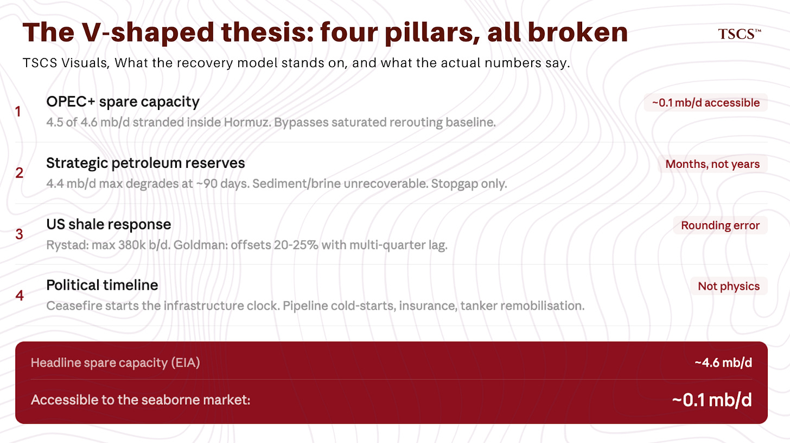](https://substackcdn.com/image/fetch/$s_!GnFK!,f_auto,q_auto:good,fl_progressive:steep/https%3A%2F%2Fsubstack-post-media.s3.amazonaws.com%2Fpublic%2Fimages%2Fb73ff925-3627-49ee-b9b7-4dc87637fd1a_1600x899.png)

## Qatar’s LNG damage is a three-to-five-year structural deficit and there is nothing anyone can do about it

This is the part where I tell you about a piece of equipment that most people have never heard of, and then explain why it is going to reshape the global energy market for the rest of the decade.

QatarEnergy CEO Saad Sherida al-Kaabi said in a Reuters interview on March 19 that Iranian missiles destroyed Trains 4 and 6 at Ras Laffan: 12.8 million tonnes per annum of LNG capacity, about 17% of Qatar’s nameplate. He estimated three to five years for repair and $20 billion in annual lost revenue. QatarEnergy declared force majeure on contracts to Italy, Belgium, South Korea, and China for up to five years.

[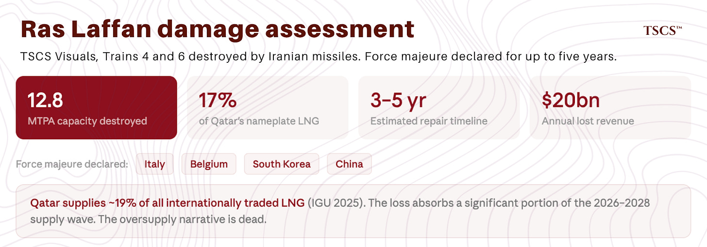](https://substackcdn.com/image/fetch/$s_!fBnA!,f_auto,q_auto:good,fl_progressive:steep/https%3A%2F%2Fsubstack-post-media.s3.amazonaws.com%2Fpublic%2Fimages%2Fb3a40d25-66a9-480f-9d7d-586f6eba34c7_1600x561.png)

The reason this is years and not months comes down to a single component: the main cryogenic heat exchanger. The MCHE. These are bespoke, custom-designed units, each one over 5 meters in diameter, 55 meters long, 500 tons. They are manufactured primarily by Honeywell (which acquired Air Products’ LNG process technology and equipment business for $1.81 billion in September 2024) at one facility in Port Manatee, Florida. Linde manufactures a competing coil-wound heat exchanger in Germany, but the Honeywell/former Air Products line supplies all 14 of Qatar’s existing trains and the overwhelming majority of global mega-train capacity. That facility has shipped roughly 20 units since opening in 2014. It has expanded capacity twice and still cannot be meaningfully surged.

[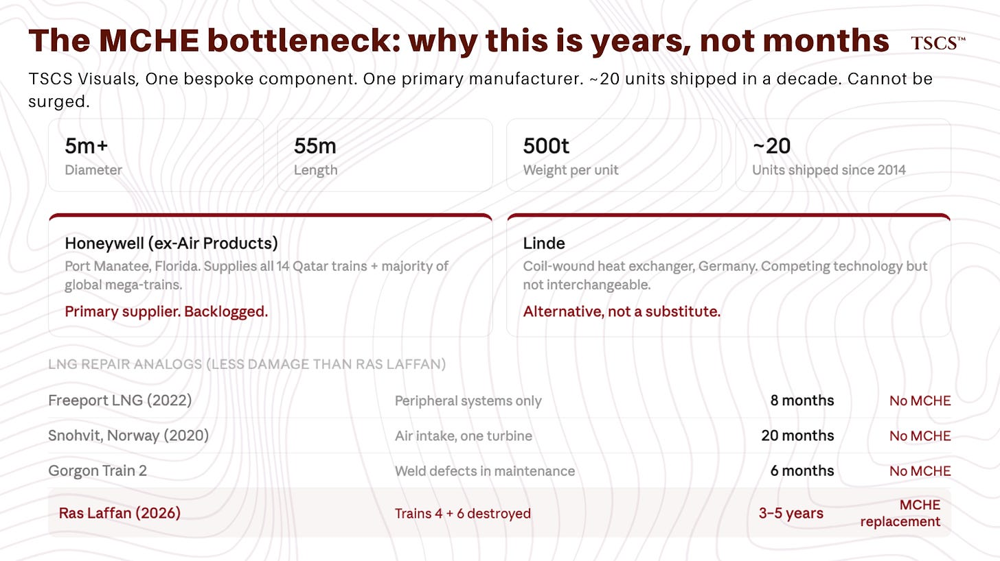](https://substackcdn.com/image/fetch/$s_!Xk3E!,f_auto,q_auto:good,fl_progressive:steep/https%3A%2F%2Fsubstack-post-media.s3.amazonaws.com%2Fpublic%2Fimages%2F3714ec4b-6165-437d-8c58-575fdeaeb17a_1600x899.png)

The IEA’s Global LNG Capacity Tracker puts average LNG project timelines at four to five years from FID to completion, with MCHE procurement on the critical path.

You cannot throw money at this problem.

And just so we’re calibrated on what “LNG repair” actually means: every one of the following incidents involved *less* damage than what happened at Ras Laffan.

Freeport LNG in June 2022. Explosion that did not touch the MCHEs, only peripheral systems. Eight months to restart. Equinor’s Snøhvit in Norway, September 2020. A fire “limited to the air intake system of one gas turbine.” Twenty months of repair. Chevron’s Gorgon Train 2. Weld defects found during *routine maintenance*. Six months for the weld repairs alone. None of these involved MCHE replacement.

Qatar supplies roughly 19% of all internationally traded LNG, per the IGU’s 2025 World LNG Report. The 12.8 MTPA loss, combined with delays to the North Field Expansion (the IEA’s Global LNG Capacity Tracker notes “start-up would most likely be delayed from its earlier end-2026 target”), absorbs a significant portion of the global LNG supply wave that was supposed to create oversupply in 2026-2028. That oversupply narrative, which was consensus as recently as January, is dead.

Robin Mills at Qamar Energy: “Countries and companies don’t really carry LNG spare capacity. They run the plants as close to full out as they can almost all the time.”

Asian LNG spot prices spiked to $25.40/MMBtu, roughly two and a half times pre-crisis levels. South Korea has effectively 33 days of direct import cover before strategic reserves. Taiwan has roughly 11 days. The FDD documented that Taipei can store about 39 days of coal at normal usage rates, but only about 10 days of LNG. Morgan Stanley’s March 2026 analysis confirms Taiwan typically maintains about 11 days of LNG storage. Bangladesh and Pakistan have already activated gas rationing.

[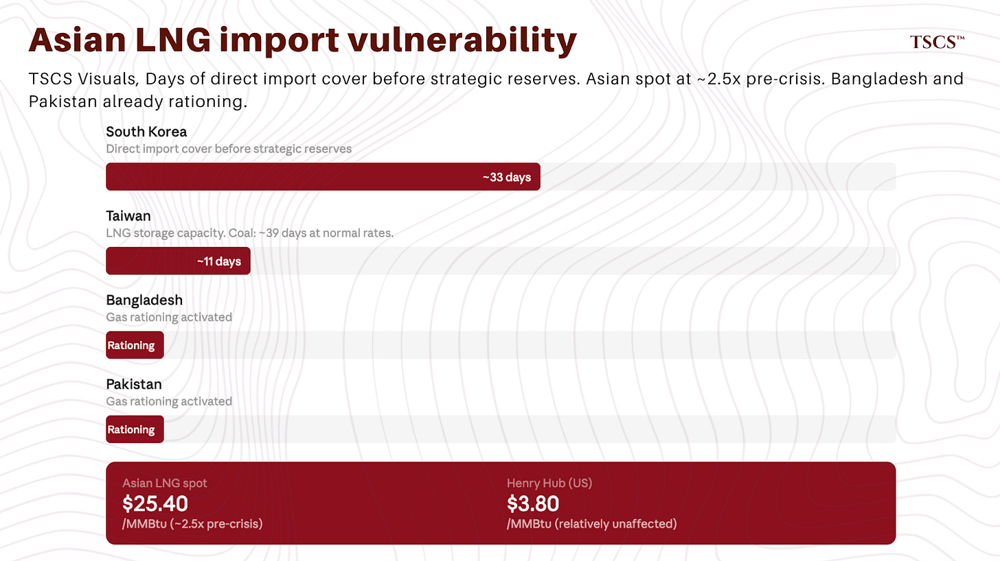](https://substackcdn.com/image/fetch/$s_!v2Mh!,f_auto,q_auto:good,fl_progressive:steep/https%3A%2F%2Fsubstack-post-media.s3.amazonaws.com%2Fpublic%2Fimages%2F297dd78e-d48b-4a0f-9af3-5852b33ee107_1600x899.png)

The structural beneficiary of Qatari impairment is US LNG. This is not subtle. The EIA’s March STEO projects US LNG exports at 16.7 Bcf/d in 2026 and 18.1 Bcf/d in 2027, growth of roughly 11% and 8% respectively as Plaquemines, Corpus Christi Stage 3, and Golden Pass ramp. Those facilities were coming online regardless. Now they are coming online into a market where 12.8 MTPA of Qatari supply has been removed for three to five years and Asian spot prices have more than doubled. The order books at Cheniere, Venture Global, and Sempra just got dramatically more valuable.

There is a peculiar Henry Hub paradox buried in this. US natural gas prices are, in the EIA’s words, “relatively unaffected” by the crisis. The EIA forecasts Henry Hub averaging about $3.80/MMBtu in 2026, with marketed production of 118 Bcf/d in 2026, up about 2% from 2025. European and Asian gas prices at $25/MMBtu, but LNG export capacity constraints insulate the domestic market. The structural beneficiaries are the exporters who can arbitrage the spread, not domestic producers. This distinction matters for trade expression: you want the LNG infrastructure and export terminal operators, not the E&Ps producing the gas.

[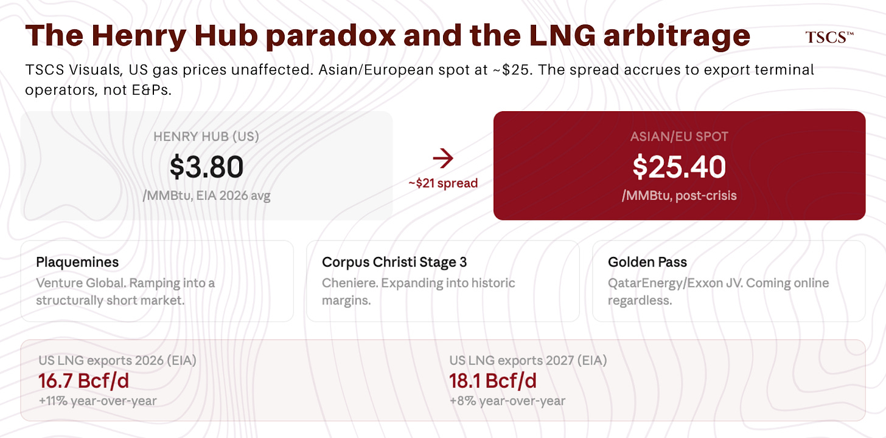](https://substackcdn.com/image/fetch/$s_!NX6t!,f_auto,q_auto:good,fl_progressive:steep/https%3A%2F%2Fsubstack-post-media.s3.amazonaws.com%2Fpublic%2Fimages%2F75b2873a-7668-4c1d-b061-c63c2372ef53_1600x792.png)

What about “China will rebuild it faster” narrative? Chinese EPC firms are genuinely capable. CPECC has won multi-billion dollar Aramco EPC contracts including the $1.7 billion MGS-3 compression station, and China added 60 MTPA of LNG receiving capacity in 2024 alone, more than any country in history. But China’s domestic buildout is overwhelmingly *receiving* terminals, not liquefaction trains. The binding constraint at Ras Laffan is large-frame gas turbines (only GE, Siemens, and MHI make them, all with backlogs stretching two to four years on existing orders and lead times of five years or more for new ones, per S&P Global) and Honeywell’s proprietary APCI liquefaction process technology (acquired from Air Products in 2024). There is no proven Chinese alternative at mega-train scale. China can pour concrete faster than anyone. China cannot fabricate MCHEs that do not exist yet.

## Reservoir damage: the market’s biggest blind spot

This is my highest-conviction, least-consensus call in the entire series. Not just this piece. The market is pricing exactly zero permanent capacity impairment from forced shut-ins across the Gulf. Zero. Petroleum engineering says that number should not be zero.

Nobody has ever emergency-shut 4.7 million barrels a day of conventional Gulf production before. There is no empirical dataset for what happens next. But the mechanisms are not in dispute, the fields are specifically vulnerable, and the shut-ins are uncontrolled. The trade does not require a precise magnitude estimate. It requires establishing that the market’s implicit estimate of zero is wrong.

Start with the mechanisms, and be precise about when they bite, because the timing matters.

When a well is shut in under controlled conditions, the operator injects chemical inhibitors, manages pressure decline gradually, and maintains water injection to keep the reservoir’s pressure support stable. Cost: about $2,000-5,000 per well. It protects the reservoir. When a well is shut in under emergency conditions, because storage is full and there is nowhere to send the crude, none of that happens.

The immediate risk during shut-in is not what most people assume. Shutting in a well raises wellbore pressure toward static reservoir pressure, which typically sits above the asphaltene onset envelope. The well, in isolation, is temporarily stable. The danger is everything around it.

At Ghawar, Saudi Arabia normally injects roughly 7 mb/d of seawater to maintain reservoir pressure and keep the water-oil contact stable. When production stops, injection stops. Without active pressure management, the aquifer advances through the documented high-permeability “Super-K” zones over weeks to months of unmanaged conditions. These are the most productive intervals in the most important oil field on earth, and they are the most exposed to uncontrolled aquifer advance precisely because they are so permeable. This is not classical rate-dependent water coning (which actually relaxes during shut-in as gravity segregation takes over). It is the loss of the entire pressure management architecture that has kept Ghawar’s water-oil contact in check for decades.

Burgan, Kuwait’s flagship and the world’s second-largest field, produces from multi-Darcy porous sandstone with a powerful natural aquifer. The same principle applies: without active management, the aquifer does not wait.

Rumaila in Iraq already has declining reservoir pressure in its northern section before any of this happened.

The second mechanism hits on restart. When wells are brought back online and pressure draws down rapidly through the asphaltene onset envelope, precipitation occurs in the near-wellbore region where it does the most damage, clogging pore throats at exactly the point where flow convergence is highest. SPE Paper 187053-MS documents this: pressure depletion below asphaltene onset pressure causes “clogging of pore throats.” The SPE Reservoir Advisory Committee documented “extended periods of 100% water production after long shut-ins in some wells due to crossflow.” That means you restart the well and get water instead of oil. Sometimes for months.

The third mechanism is sand production on restart. Wells that have sat stagnant without flow or pressure cycling for weeks to months are vulnerable to formation sand mobilization when rates are reintroduced, particularly in the poorly consolidated sandstones of Burgan and southern Iraq. The SPE RAC has documented this extensively in post-shut-in analysis.

The fourth is simply equipment and surface facility degradation. Wells in a combat zone without maintenance crews, without corrosion inhibitor circulation, without routine integrity monitoring, accumulate scale buildup, tubing damage, and wellhead degradation that compounds with every week of abandonment.

JPMorgan’s commodity team under Natasha Kaneva published the storage countdown analysis: Iraq hits storage limits at 6 days, Kuwait at 14 days, UAE at 16-19 days, Saudi Arabia at 36-65 days depending on pipeline re-routing. Combined Gulf onshore crude storage is approximately 343 million barrels, roughly 22 days of stranded output. By day 18 of a complete blockade, JPMorgan projects shut-in production exceeding 4.7 mb/d.

[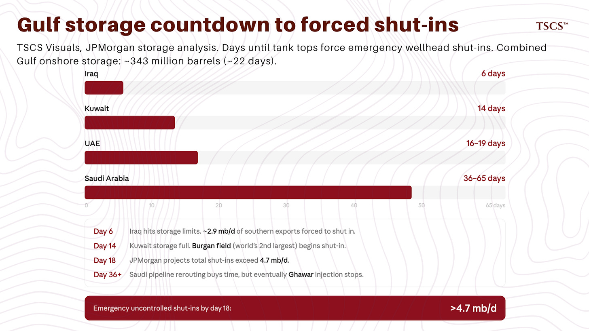](https://substackcdn.com/image/fetch/$s_!vUrh!,f_auto,q_auto:good,fl_progressive:steep/https%3A%2F%2Fsubstack-post-media.s3.amazonaws.com%2Fpublic%2Fimages%2F9719128b-3cec-4643-b5a3-44c55517c146_1600x900.png)

Those are emergency, uncontrolled shut-ins across Ghawar, Burgan, and Rumaila simultaneously.

Not planned maintenance. Not seasonal curtailment. Forced abandonment with no inhibitor injection, no active pressure management, no water injection to stabilize aquifer contacts, no corrosion control, and no timeline for restart.

The only empirical dataset on shut-in damage at scale comes from unconventional US wells, and it is important to be explicit about what it does and does not tell us. TGS ran a study on US wells shut in for six to twenty-four months. The numbers: 25% average decrease in oil rate, 22% increase in water rate, 31% decrease in gas rate. Degradation increased with duration.

Those magnitudes do not transfer to the Gulf. Unconventional wells produce through artificial, proppant-filled micro-fractures that lose conductivity permanently when pressure equalizes during shut-in. Gulf super-giants like Ghawar and Burgan produce through multi-Darcy natural porosity. The SPE Reservoir Advisory Committee notes that high-permeability Middle Eastern conventional reservoirs face lower shut-in risk than tight or unconventional formations. The TGS data establishes that shut-in damage is real and measurable in the formations where it has been studied. It does not give us a number for the Gulf. Nobody has that number, because nobody has ever done this before.

What the TGS data does tell us, combined with the SPE’s documented mechanisms and the specific vulnerability profiles of Ghawar, Burgan, and Rumaila, is that the probability of zero permanent impairment is very low. Some wells will restart and produce water for months. Some pore throats will be permanently blocked. Some fraction of shut-in capacity will require extended workovers, redrilling, or will simply never return to pre-crisis rates. Whether that fraction is 1% or 5% of the 4.7 mb/d being shut in is a judgment call that depends on duration, field-specific geology, and the quality of whatever restart protocols the operators can execute under post-conflict conditions. I do not have enough Gulf-specific empirical data to give you a central estimate, and I am skeptical of anyone who claims they do.

What I do have is this: every documented mechanism points in the same direction, every field-specific vulnerability analysis says the conditions for damage are present, and the market is pricing the outcome at zero. The trade is not about whether the impairment is 50,000 b/d or 200,000 b/d. It is about whether the number is zero or not zero. I am highly confident it is not zero. And any non-zero number permanently reduces the post-crisis spare capacity cushion that the market relies on to suppress long-dated crude pricing.

Rystad’s Audun Martinsen: “Every day of damaged or shut-in infrastructure pushes pre-war production capacity further out of reach.”

Vikrant Lakhanpal, writing for the SPE’s Journal of Petroleum Technology in 2020 during the COVID shut-in wave, put the core problem in language anyone can understand: “You are not just turning the well off, you are killing the well. You may be shutting off the economic life.” He was writing about a smaller, shorter disruption. The mechanisms he described are identical. The scale of what is happening in the Gulf right now is orders of magnitude larger.

[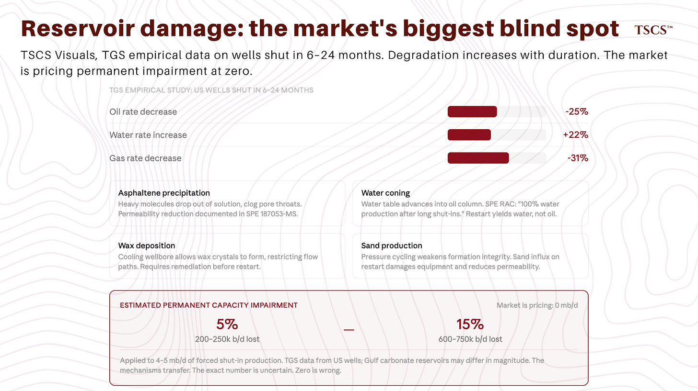](https://substackcdn.com/image/fetch/$s_!xkvt!,f_auto,q_auto:good,fl_progressive:steep/https%3A%2F%2Fsubstack-post-media.s3.amazonaws.com%2Fpublic%2Fimages%2F4b0e8542-03b2-431e-8367-b0560ea52980_1600x898.png)

## Insurance, mines, and 200 tankers trying to leave at the same time

Suppose the ceasefire happens tomorrow. The President tweets it at 6 AM. Brent drops $15. The cable news anchors say “crisis over.”

Here are three problems that say otherwise.

[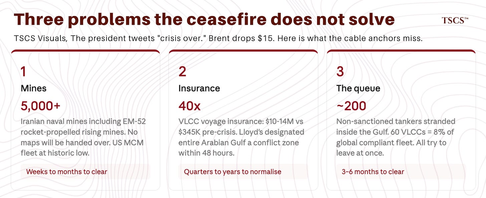](https://substackcdn.com/image/fetch/$s_!Jukm!,f_auto,q_auto:good,fl_progressive:steep/https%3A%2F%2Fsubstack-post-media.s3.amazonaws.com%2Fpublic%2Fimages%2Ff4c78be1-753f-4e93-ae98-950050680615_1600x652.png)

**Mines**. Iran possesses an estimated 5,000+ naval mines, including contact mines, influence mines, and Chinese-origin EM-52 rocket-propelled rising mines that sit on the seabed and fire upward at passing ships.

A brief detour into the economics of asymmetric warfare. The USS Samuel B. Roberts struck an Iranian M-08 contact mine in April 1988. The mine cost approximately $1,500. Repairs cost $89.5 million and took 13 months. The 1991 Gulf War reinforced the point: Iraq laid approximately 1,290 mines in just seven months. Clearing them took several months across ten danger areas, and that was with Iraqi minefield maps provided after defeat. Before they were cleared, two US warships, the USS Tripoli and USS Princeton, struck mines on the same day. A single Manta influence mine broke the Princeton’s superstructure. Mines are the IED of the sea. They are cheap, persistent, and terrifying. Iran isn’t going to hand over maps, and they’ve had decades to stockpile.

[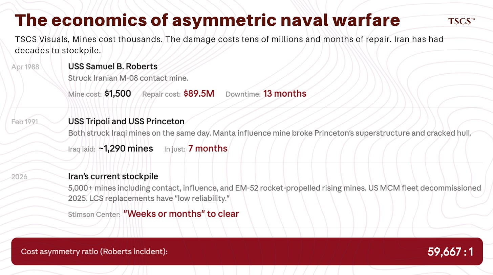](https://substackcdn.com/image/fetch/$s_!QB_3!,f_auto,q_auto:good,fl_progressive:steep/https%3A%2F%2Fsubstack-post-media.s3.amazonaws.com%2Fpublic%2Fimages%2Fe9090a58-8064-44c1-bbd0-e51acba73984_1600x894.png)

The Stimson Center’s March 2026 assessment: clearing mines “with an intact IRGCN still capable of targeting minesweepers with missiles, drones, and fast attack boats, is a slow and dangerous undertaking that would take weeks or months.”

The US mine countermeasures fleet is at a historic low. The four Avenger-class MCM ships that were forward-deployed to Bahrain were decommissioned in 2025 and shipped out in January 2026. Their LCS replacements have documented reliability problems. The Pentagon’s Director of Operational Test & Evaluation: the systems “demonstrated low reliability prior to fleet release.” I wrote about this gap in America Cannot Fight a War. It is now manifesting in real time.

**Insurance.** War risk premiums do not normalize on ceasefire day. After the 1980s Tanker War, premiums began declining after the August 1988 ceasefire, but the process took months. Operation Earnest Will required fourteen months of convoy operations just to make Gulf shipping viable during the war. After the 2003 Iraq War, Gulf war risk premiums took approximately twelve months to return to baseline. The Suez Canal was closed entirely from 1967 to 1975 after the Six-Day War, and elevated risk perceptions persisted until the Camp David Accords normalized Egyptian-Israeli relations in 1978.

Current premiums: 1-3% of hull value at the low end, with Lloyd’s List reporting 7.5-10% for higher-risk propositions. US/UK/Israeli-flagged vessels pay roughly three times the standard rate. A VLCC voyage through Hormuz now costs $10-14 million in insurance alone, up from about $345,000 pre-crisis. P&I clubs issued cancellation notices within a week. Lloyd’s redesignated the entire Arabian Gulf as a conflict zone within 48 hours.

Ellis Morley at Howden Insurance: normalization “will be measured in quarters, not weeks” and some elevated risk pricing “may become permanent.”

The 9/11 analog tells you everything. O’Hare went from $750 million in terrorism coverage at $125,000/year to $150 million at $6.9 million/year. The raw premium went up 55x. Coverage fell 80%. Per dollar of actual coverage, the rate went up 276x. That is not a market adjusting. That is a market breaking and being rebuilt from scratch. That structural step-change created TRIA, the government backstop. Something similar is likely coming for marine war risk. But “likely coming” is not the same as “exists today,” and the insurance markets that actually underwrite tanker voyages through Hormuz will price the risk they see, not the backstop they hope for.

[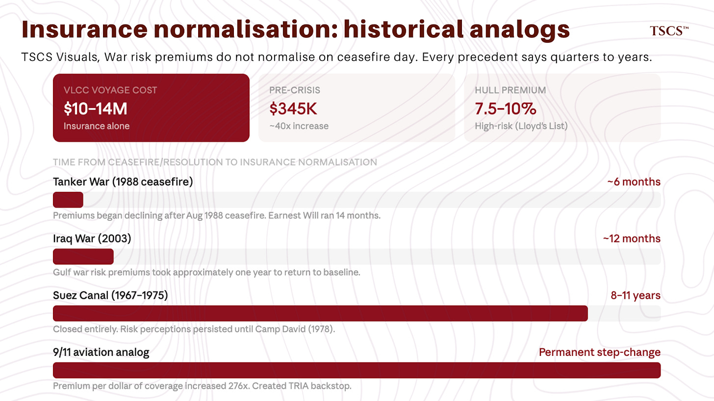](https://substackcdn.com/image/fetch/$s_!gTNt!,f_auto,q_auto:good,fl_progressive:steep/https%3A%2F%2Fsubstack-post-media.s3.amazonaws.com%2Fpublic%2Fimages%2F88fedfcb-fec0-4486-abc5-08947bc9f38c_1600x898.png)

**The queue.** Lloyd’s List Intelligence reports approximately 200 non-sanctioned tankers stranded inside the Gulf: 60 VLCCs representing 8% of the global compliant VLCC fleet, plus 23 Suezmax, 30 Aframax/LR2, and 86 smaller tankers. When the Strait reopens, they all try to leave at once through a recently demined, narrowly navigable channel.

The bottleneck is Hormuz-specific and has no clean civilian analog. Pre-crisis, the Strait handled over 100 transits per day. Since February 28, that number has been 7-21. Even after mine clearance, transit capacity during the reopening phase will be constrained by convoy protocols, minesweeper escort availability, and the degraded state of the US mine countermeasures fleet documented above.

Two hundred non-sanctioned tankers attempting sequential transit through a channel that is being cleared and escorted simultaneously is not a logistics problem that resolves on announcement day. It resolves at whatever rate the Navy and the insurers allow, and both have demonstrated they will move slowly.

War risk premiums after the 2003 Iraq War took approximately twelve months to return to baseline under far less dangerous conditions.

238 laden tankers through a recently demined strait, in a former combat zone, with paralyzed insurance markets.

Ships that have been at anchor in a conflict zone will need additional classification society surveys before returning to commercial service. DNV, Lloyd’s Register, and Bureau Veritas all have requirements. Another queue. Another delay.

[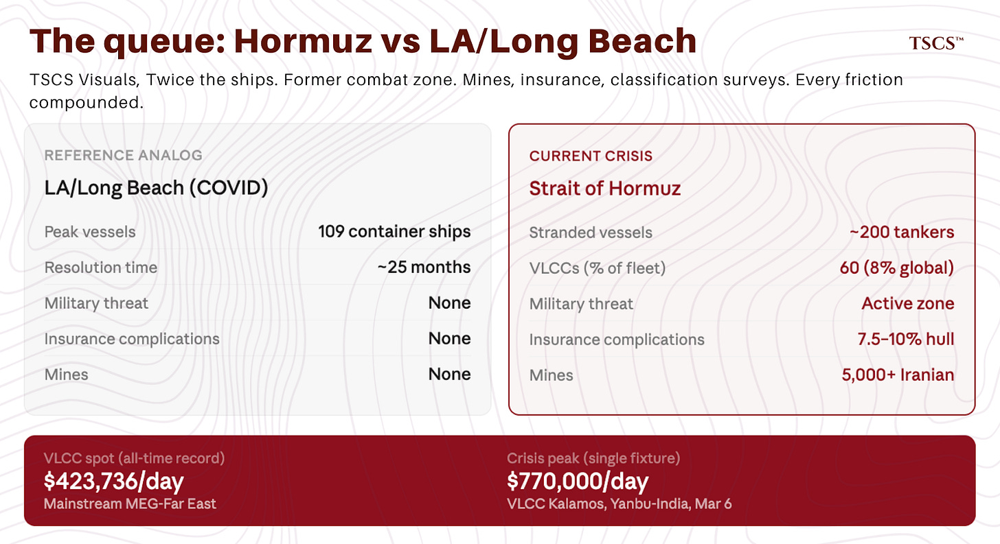](https://substackcdn.com/image/fetch/$s_!_KGS!,f_auto,q_auto:good,fl_progressive:steep/https%3A%2F%2Fsubstack-post-media.s3.amazonaws.com%2Fpublic%2Fimages%2F4cfb54af-b670-4443-8b47-c2f4755ac22b_1600x871.png)

VLCC spot rates hit an all-time record of $423,736/day. Crisis spot rates reached $770,000/day on a single Yanbu-India fixture (VLCC Kalamos, March 6), with mainstream MEG-Far East routes peaking at $400,000-445,000/day. Those rates do not normalize on ceasefire day. They normalize when the last tanker clears the last survey and the last insurer reinstates coverage.

## Refinery cold-starts: another six to twelve weeks on the stack

Asian refiners cut throughput from about 90% to 65% capacity. Some face full shutdown if crude supply remains physically unavailable for another few weeks. Shutting down is fast. Restarting is not.

EIA data from Hurricane Harvey is the cleanest analog. Gulf Coast utilization dropped from 96% to 63% and required approximately six to eight weeks to return to pre-Harvey levels. No structural damage. Just a throughput cut and restart. Winter Storm Uri produced a similar pattern but with a critical lesson: because the shutdown was not orderly, the unexpected cold caused more damage. The Dallas Fed documented that petrochemical recovery took until year-end 2021. Abnormal shutdowns cause abnormal damage.

Full cold-start from complete shutdown is categorically worse: six to twelve weeks per industry consensus. The risk is not just delay but permanent loss. Lyondell’s Houston refinery filed for bankruptcy during a 2009 shutdown when restart economics could not justify the capital required to recommission degraded catalyst beds and corroded instrumentation.

Hess’s Port Reading refinery in New Jersey was permanently closed in 2013 after a maintenance shutdown made the economics of restarting a small, aging facility untenable against regulatory compliance costs. The pattern is consistent: when a shutdown coincides with adverse economics or deferred maintenance, some facilities never come back. Asian refiners operating at 65% throughput with uncertain feedstock timelines face exactly that combination.

The constraint is never the distillation tower. It is catalyst reactivation, instrumentation testing, environmental permit compliance, and product quality stabilization. Kuwait’s Al-Zour refinery struggled at 75-80% utilization for months because heavier crudes deactivated catalysts quickly.

What matters for the trade is this: **product tightness outlasts crude tightness.** Refineries need crude to restart and then need weeks to ramp to full throughput. So even after crude starts flowing through Hormuz again, the refined product deficit persists. After Harvey, crack spreads rallied from $20 to $37 per barrel in one week, and retail gasoline remained elevated for two months. In the current crisis, NW Europe gasoil cracks exceeded $50-70/bbl, jet fuel cracks topped $90-100/bbl. GS Caltex cut daily refining from 800,000 to 675,000 barrels. Formosa Petrochemical Corp declared force majeure on March 10.

Crude first. Then refining. Then products. Each with its own timeline. Each adding weeks to months. This is the cascading waterfall the futures curve does not capture.

[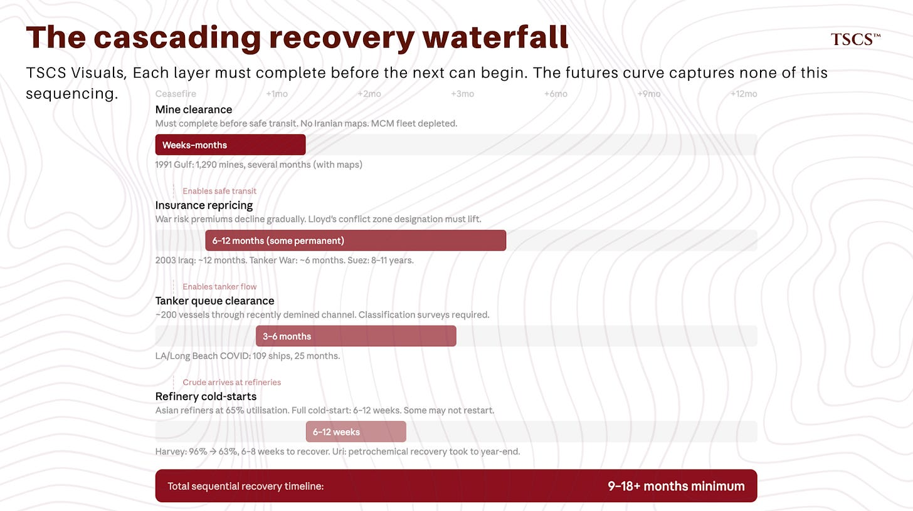](https://substackcdn.com/image/fetch/$s_!VkGH!,f_auto,q_auto:good,fl_progressive:steep/https%3A%2F%2Fsubstack-post-media.s3.amazonaws.com%2Fpublic%2Fimages%2F94d31116-3332-4403-80c5-c664acee179e_1600x897.png)

## Permanent versus extended: what the L-shape actually looks like

Not everything in this piece is about permanent damage. Some of it is about duration. And not all L-shapes are created equal. There are two structurally different recovery profiles in this crisis, and conflating them is the fastest way to misprice the trades. The first is Qatar’s LNG capacity. That is a thermodynamic L-shape, bound by the laws of cryogenic fabrication and a single-supplier equipment bottleneck. No ceasefire, no diplomacy, and no amount of capital changes the timeline. The MCHEs do not exist, cannot be surged, and take years to manufacture. This is the highest-conviction, longest-duration call in the piece, and it is effectively immune to geopolitical headline risk.

The second is the crude oil supply recovery. That is not a permanent L-shape. It is a slow ramp, bound by the serial resolution of logistics bottlenecks: mine clearance, insurance repricing, tanker queue resolution, refinery cold-starts, and a non-zero but uncertain reservoir impairment from forced shut-ins. The institutions that control Gulf crude production (Aramco, ADNOC, KPC) are intact. They will restore output. The question is not whether crude recovers, but how long the serial bottleneck resolution takes, and the answer is quarters to years, not the weeks the forward curve implies. The distinction matters for trade expression and sizing.

Permanent impairment: a non-zero fraction of shut-in Gulf production capacity from reservoir complications including asphaltene precipitation, water coning, wax deposition, and equipment degradation. The magnitude is uncertain (no empirical precedent for emergency shut-ins at this scale in Gulf conventional reservoirs), but the mechanisms are documented, the field-specific vulnerabilities are real, and the market is pricing zero.

While Middle Eastern conventional reservoirs face relatively lower shut-in risks than tight shale, prolonged shutdowns in a combat zone with damaged surface infrastructure are without modern precedent. Qatar’s damaged 12.8 MTPA of LNG capacity at Ras Laffan (roughly 17% of Qatar’s total 77 MTPA) requires 3-5 years minimum to restore.

And the structural elevation of marine war risk insurance for Hormuz transit persists for years to decades, based on every historical precedent. Extended but recoverable: mine clearance (weeks to months), tanker queue resolution (4-8 weeks of physical transit once the channel is cleared and insured, but gated by the serial prerequisites of demining, insurance reinstatement, and classification surveys that together extend the effective timeline to 3-4 months), refinery cold-starts (6-12 weeks), and insurance repricing for non-Hormuz Gulf routes (6-12 months).

The permanent impairments set the floor on the L-shape.

The extended recoveries determine how long the acute phase lasts before you settle onto that floor. The market is pricing neither correctly.

[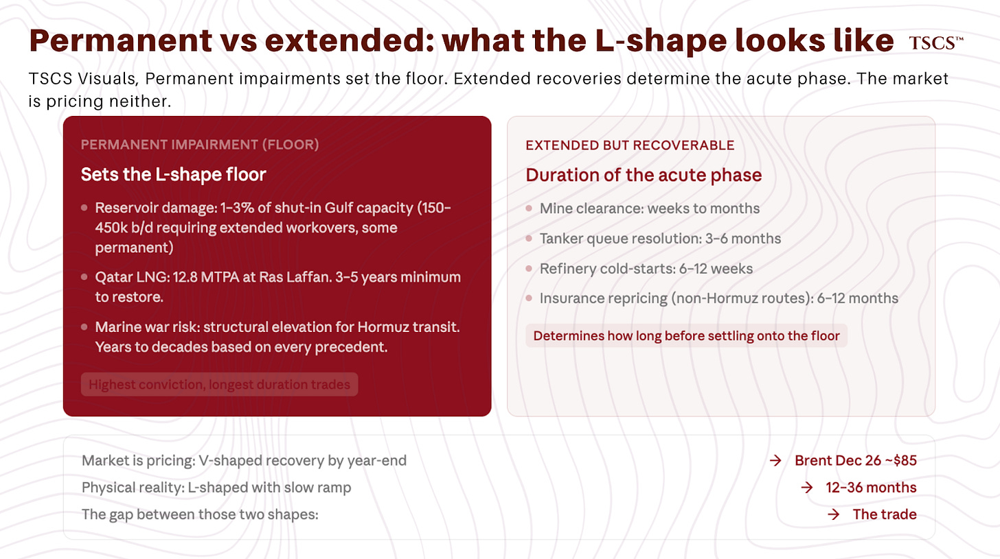](https://substackcdn.com/image/fetch/$s_!bQun!,f_auto,q_auto:good,fl_progressive:steep/https%3A%2F%2Fsubstack-post-media.s3.amazonaws.com%2Fpublic%2Fimages%2F2320a23a-9ac3-47bc-bd89-9a90e821748b_1600x896.png)

## Ceasefire does not mean peace, and peace does not mean normal

There is an assumption embedded in every V-shaped recovery model that I have not addressed yet: the assumption that the ceasefire is clean. Every historical analog above operated under that assumption, and the current crisis may not give us that luxury.

Kamran Bokhari at the New Lines Institute has been tracking what he calls the “iron triangle” of Russia, China, and Iran. His thesis is that this alignment is structural, not opportunistic, and that it guarantees Iran will not collapse the way Western policymakers hope. But he flagged a critical caveat in the current conflict: “None of them came to Iran’s aid. Both Russia and China need to do their own deal with the United States.” The triangle provides strategic cover but not operational military support.

Three weeks of sustained bombardment has left an “intact but largely degraded” Iranian regime. The IRGC has been degraded; the regular armed forces (Artesh) may assert themselves. Bokhari’s assessment: “Bombing a complex state into uncertainty without clearly defining the political end state is not grand strategy. It is escalation driven by the assumption that collapse will self-organize into compliance.”

Self-organizing compliance. If you are pricing a clean resolution, that phrase should keep you up at night.

[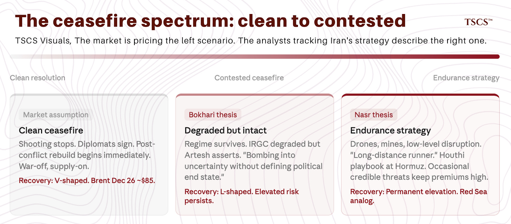](https://substackcdn.com/image/fetch/$s_!6VJj!,f_auto,q_auto:good,fl_progressive:steep/https%3A%2F%2Fsubstack-post-media.s3.amazonaws.com%2Fpublic%2Fimages%2F55eff132-022f-48a1-a39d-0c657c5ddf36_1600x703.png)

Vali Nasr at Johns Hopkins goes further. He argues Iran is executing a deliberate endurance strategy conceived after the June 2025 “12-Day War” with Israel: drones, mines, and low-level ammunition to wage “a longer war on global energy and the global markets.” His framing: “US-Israel can dash fast, but they are not long-distance runners, whereas Iran is in it for the long haul.”

If Nasr is right, then even a formal ceasefire does not end the insurance problem or the mine problem. A degraded but intact Iran can sustain low-level disruption: the occasional mine, the occasional fast-attack boat sortie, the occasional credible threat that keeps war risk premiums elevated. This is exactly what the Houthis did in the Red Sea, and Currie made the parallel explicit: “The Houthis never fully closed the shipping lane. They made it selectively dangerous, and two years of American strikes never fully reopened it. Iran is running the same playbook at Hormuz.”

Two years of strikes never fully reopened the Red Sea. And Iran is more capable than the Houthis by an order of magnitude.

Michael Every at Rabobank frames the entire crisis through what he calls “Reverse Perestroika”: where Gorbachev tried to liberalize the Soviet economy, the Trump administration is trying to re-industrialize the US away from consumption and financialization. Hormuz is not an accident in this framework. It is the logical consequence of treating economic security as national security. The crisis exposes, in Every’s formulation, “the fatal flaw in mainstream economic models: they assume everything returns to normal.”

**The swing producer cannot swing**

Saudi Arabia was the swing producer. Pre-war, it exported roughly 7.1 mb/d from all terminals (crude and refined products combined). With Hormuz closed and only Yanbu available via the East-West Pipeline, actual March exports came in at approximately 4.355 mb/d, a drop of about 2.7 mb/d, or 38%. Saudi Arabia cannot swing if its export capacity is impaired by nearly 40%.

[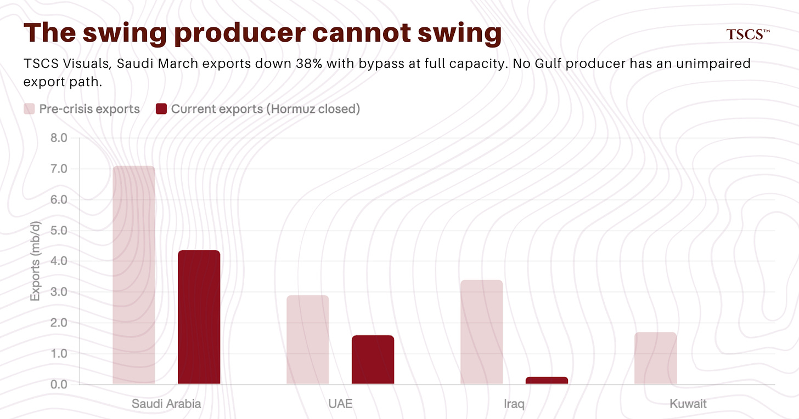](https://substackcdn.com/image/fetch/$s_!sMij!,f_auto,q_auto:good,fl_progressive:steep/https%3A%2F%2Fsubstack-post-media.s3.amazonaws.com%2Fpublic%2Fimages%2F1f9d5d9b-b6a3-4178-89d4-8bd58a780a72_1600x841.png)

If Saudi cannot swing, who does? The UAE has some capacity via the Habshan-Fujairah bypass, but it is also Hormuz-dependent for the majority of exports. Iraq has the Ceyhan pipeline through Turkey for its northern fields, but southern production (Rumaila, the flagship) exports through Basra and the Gulf. Kuwait has no bypass pipeline at all.

If even a modest fraction of that spare capacity is permanently impaired by reservoir damage from forced shut-ins, the post-crisis spare capacity cushion shrinks to historically thin levels.

The OPEC+ fracturing dynamics, which were already underway before the crisis, accelerate in the rebuild phase. Kazakhstan has a cumulative compensation “debt” of roughly 3.5 million barrels of overproduction. Iraq was at 54% compliance rate. UAE has been pushing for a higher baseline quota. The crisis made compliance debates temporarily moot because forced Gulf production cuts far exceeded voluntary commitments. But the post-crisis dynamics are different: damaged producers will seek quota accommodation, Fujairah’s bypass elevates UAE’s strategic position, Iraq’s Ceyhan pipeline gains importance, and fiscal pressures on high-breakeven producers (Iraq at $89, Algeria at $119, Bahrain at $127 per barrel) intensify.

[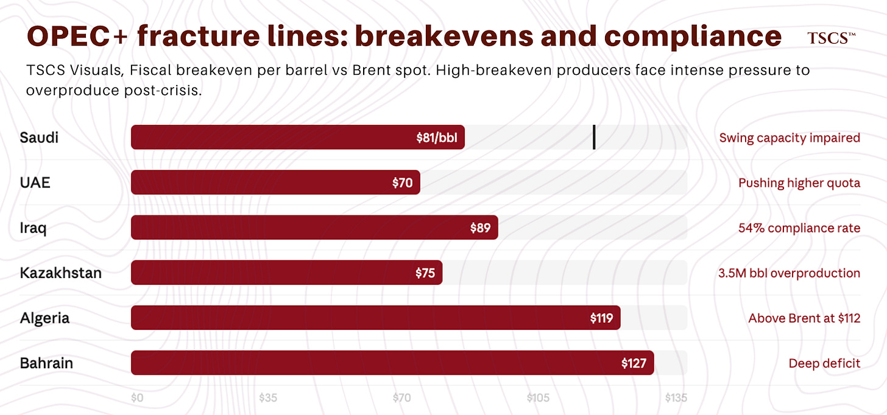](https://substackcdn.com/image/fetch/$s_!Pvon!,f_auto,q_auto:good,fl_progressive:steep/https%3A%2F%2Fsubstack-post-media.s3.amazonaws.com%2Fpublic%2Fimages%2F0cbc091e-e61c-43ed-b9bf-d4bf949aa7e3_1600x750.png)

The market prices OPEC+ spare capacity as a buffer. If the buffer is smaller than advertised, the L-shaped thesis gets an additional structural floor. Less spare capacity means less ability to offset the next disruption, which means a permanently higher risk premium, which means the forward curve should be higher than where it trades today even after full normalization.

## Who rebuilds the Gulf and what do they demand in return?

Nobody is asking this question yet, and it will dominate the next five years.

There is a popular version of this story where China demands payment in yuan the way America demanded payment in dollars during World War II. It makes for a great tweet. It is also historically wrong. The US didn’t demand “dollars or gold, no sterling.” Lend-Lease was structured to avoid immediate payment: $50.1 billion in goods and services with mostly symbolic repayment terms. What the US actually did was attach conditions to every lifeline. Article VII of the Lend-Lease Master Agreement committed recipients to “the elimination of all forms of discriminatory treatment in international commerce,” which meant dismantling Britain’s Imperial Preference tariff system. The 1945 Anglo-American Loan of $3.75 billion at 2% came with a convertibility requirement that nearly killed the British economy. Sterling became convertible on July 15, 1947. Within 37 days, almost $1 billion drained from British reserves. The mechanism was not coercion. It was conditional dependency, and it worked because Britain had no alternative lender.

China in 2026 occupies an analogous but weaker position. It is the factory, but it is not the military power, and Gulf states are not bankrupt. Saudi PIF, Mubadala, and QIA sit on trillions in sovereign assets. They will pay cash, not accept predatory financing terms. They will pit Chinese EPCs against Samsung Heavy, MHI, and Bechtel to maintain competitive tension. China’s $400 billion, 25-year cooperation agreement with Iran is a template for how it operates with desperate counterparties. The Gulf is not desperate.

[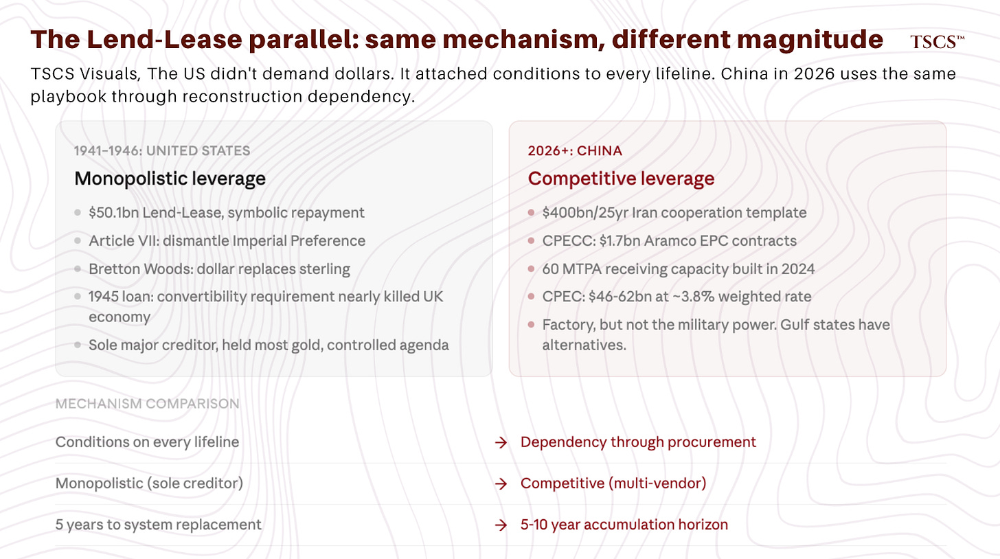](https://substackcdn.com/image/fetch/$s_!06Sb!,f_auto,q_auto:good,fl_progressive:steep/https%3A%2F%2Fsubstack-post-media.s3.amazonaws.com%2Fpublic%2Fimages%2Fd53e1cbb-5f19-47ea-8a0e-c0fdb90797ff_1600x895.png)

But here is the falsifiable version of the claim: within 24 months of a ceasefire, Chinese EPC firms will hold more than 40% of Gulf energy reconstruction contracts by value. CPECC has already won multi-billion dollar Aramco EPC contracts including the $1.7 billion MGS-3 compression station. China added 60 MTPA of LNG receiving capacity in 2024 alone. When the equipment lists come out, Chinese firms will be on every shortlist, not because of geopolitical leverage, but because of speed, cost, and the simple fact that the alternative vendors are capacity-constrained. The leverage is not coercive. It is structural, the same way America’s was in 1941-1945: if you are the only one who can deliver at scale, the terms start to bend in your direction whether anyone signs a treaty or not.

Zoltan Pozsar, in his March 22 client note, frames this differently: “The axes are not the US and Iran, but the US and China.” He argues the administration is “methodically building a portfolio of assets,” from Panama Canal to Kharg Island to Hormuz, “stacking them up against China.” If Pozsar is right, then rapid resolution is not even in the administration’s interest. The crisis is the leverage.

What I am watching: the first three major reconstruction contract awards from Aramco, QatarEnergy, and ADNOC. If Chinese firms take two of three, the structural dependency thesis is on track. If Western and Korean firms split the awards evenly, the competitive tension thesis holds and China’s leverage accumulates more slowly than I expect.

[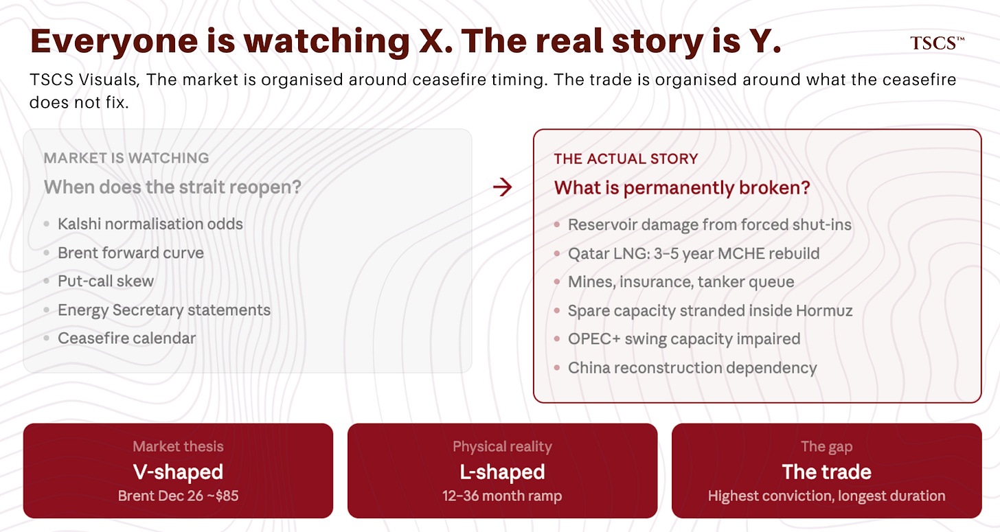](https://substackcdn.com/image/fetch/$s_!rdom!,f_auto,q_auto:good,fl_progressive:steep/https%3A%2F%2Fsubstack-post-media.s3.amazonaws.com%2Fpublic%2Fimages%2Fbf59cf5f-f86e-4151-b078-3a247612539f_1600x852.png)

## The rebuild waterfall and where the money is

Everything above maps to a specific sequence, and that sequence maps to specific trades. Each layer adds time, and the market is dead wrong to price them all resolving at once.

[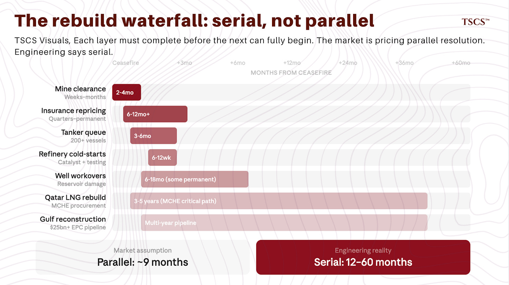](https://substackcdn.com/image/fetch/$s_!JJL6!,f_auto,q_auto:good,fl_progressive:steep/https%3A%2F%2Fsubstack-post-media.s3.amazonaws.com%2Fpublic%2Fimages%2Fcfdb38c6-052e-466a-b878-e5d5a5e47538_1600x897.png)

### LNG infrastructure: the longest-duration, highest-conviction trade.

Chart Industries (being acquired by Baker Hughes for approximately $13.6 billion, expected Q2 2026 close) posted FY2025 orders of $5.68 billion, up 13.4% year-over-year. Year-end backlog of $5.89 billion, up 21.5%. Book-to-bill of 1.33. The heat exchanger and cold box segment (HTS) grew 19.5% with 30.1% adjusted operating margin. Baker Hughes itself posted record remaining performance obligations of $35.9 billion, with IET RPO of $32.4 billion. Honeywell, which acquired Air Products’ LNG process technology and equipment business for $1.81 billion in September 2024, manufactures the MCHEs that are the binding constraint on Qatar’s recovery.

What I am watching: GTLNG order announcements from Baker Hughes/Chart, Honeywell LNG equipment quarterly backlog disclosures, and any QatarEnergy statement revising the 3-5 year repair timeline. The thesis breaks if QatarEnergy announces an accelerated rebuild using non-Honeywell/legacy-APCI technology, which I assess as very low probability. The thesis also breaks if the Baker Hughes/Chart deal falls through, which would fragment the LNG equipment supply chain further and paradoxically make the trade thesis stronger (longer repair timelines) but invalidate the specific equity expression.

### Engineering and construction: the multi-year order pipeline.

Fluor Corporation has a backlog of $25.5 billion with a book-to-burn ratio expected to exceed 1.0 in 2026. Bechtel has a backlog of roughly $58.2 billion and literally wrote the book on Gulf War reconstruction (they ran Al-Awda, the Kuwait rebuild). Rystad estimates the total Gulf energy infrastructure repair bill at $25 billion. That is a multi-year revenue pipeline that does not depend on oil prices staying elevated; it depends on things being broken, which they are.

What I am watching: EPC contract awards from Saudi Aramco, QatarEnergy, and ADNOC. When the first major reconstruction contract is announced, the market will wake up to the duration. I want to be positioned before then.

### Tankers: the normalization rate play.

Frontline fixed seven VLCCs on one-year time charters at $76,900/day in early 2026. Crisis spot rates reached $770,000/day on a single Yanbu-India fixture (VLCC Kalamos, March 6), with mainstream MEG-Far East routes peaking at $400,000-445,000/day. The normalization phase rewards tanker equities because the structural constraints (200+ stranded tankers, classification surveys, insurance reinstatement, fleet displacement to Atlantic Basin routes) keep rates elevated well beyond ceasefire.

The fleet of roughly 895 VLCCs, of which 23% are in the shadow fleet, cannot reposition overnight. Frontline CEO described “unprecedented times” and “charter levels not seen for decades.” I covered the tanker thesis in detail in [8 Days to Kuwait](https://tscsw.substack.com/p/the-oil-market-is-lying-to-you). The rebuild framing extends the duration argument: where the crisis trade was “rates spike on disruption,” the rebuild trade is “rates stay elevated for 12-18 months because the logistical unwind takes that long.”

What I am watching: TD3C daily rate below $200,000 signals fleet repositioning underway. Below $100,000 signals normalization approaching. Above $300,000 for more than four weeks post-ceasefire confirms the L-shaped thesis.

### Fertilizer: the locked-in trade.

This connects directly to Watch The Wrong Price. Three simultaneous supply constraints: Hormuz blocking fertilizer vessels, Russia halting ammonium nitrate exports until after April 21, and China banning nitrogen-potassium and phosphate fertilizer exports through August 2026. The 2027 growing season’s input costs may already be locked in regardless of conflict resolution timing. Urea prices are up $60-80/ton. The FAO Food Price Index hit 125.3 in February 2026. USDA Prospective Plantings on March 31 (tomorrow, as I write this) will be the first hard data on acreage response. USDA Outlook Forum projects corn at $4.21-4.31/bushel for the 2026 crop with planted area down 4.8 million acres.

What I am watching: USDA Crop Progress reports (weekly, starting April 6) will track condition ratings versus the fertilizer application deficit. This is the agricultural tail risk that is already locked in. The question is whether it is worse than expected.

[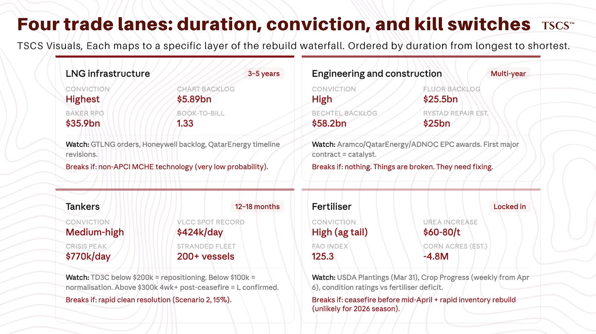](https://substackcdn.com/image/fetch/$s_!FD0P!,f_auto,q_auto:good,fl_progressive:steep/https%3A%2F%2Fsubstack-post-media.s3.amazonaws.com%2Fpublic%2Fimages%2F43ab1358-76b5-43fc-9130-c5169ef57dec_1600x899.png)

The demand destruction offset. Now here is the part that should make you uncomfortable if you are long anything in this piece.

Every major oil price shock accelerates structural demand substitution that never fully reverses. After 1979, OECD oil demand fell roughly 7.4 mb/d by 1983. It took until 1994 to recover to 1979 levels, and eventually peaked at over 50 mb/d in 2005. The demand came back, but it took fifteen years, and the efficiency gains and fuel-switching that occurred during the decline were permanent structural shifts even as absolute volumes recovered. China NEV sales hit 16.49 million units in 2025, up 28.2% year-over-year. NEV penetration exceeded 50% of monthly retail passenger vehicle sales as early as July 2024, per CPCA data. Under CAAM’s broader all-vehicle wholesale measure (which includes lower-penetration commercial vehicles), the 50% threshold was crossed in October 2025. The oil price shock provides exactly the economic incentive to lock in EV substitution permanently.

The IEA’s pre-crisis forecast had global oil demand growing through 2030. The crisis accelerates the substitution curve, but oil demand is not declining yet; it is growing more slowly. The supply gap from the L-shaped recovery (call it 2-5 mb/d of impaired capacity over 12-36 months) dominates over the demand reduction from accelerated EV adoption (call it 0.5-1.0 mb/d over the same period, generously). The math works for the 12-36 month trades. It gets progressively worse beyond that horizon. The LNG infrastructure trade, which has a 3-5 year duration, is partially insulated because LNG demand is growing independently of the oil substitution cycle (coal-to-gas switching, industrial feedstock, power generation). But the crude and tanker trades are time-limited by the demand substitution curve, and I would not want to be holding them into 2029.

[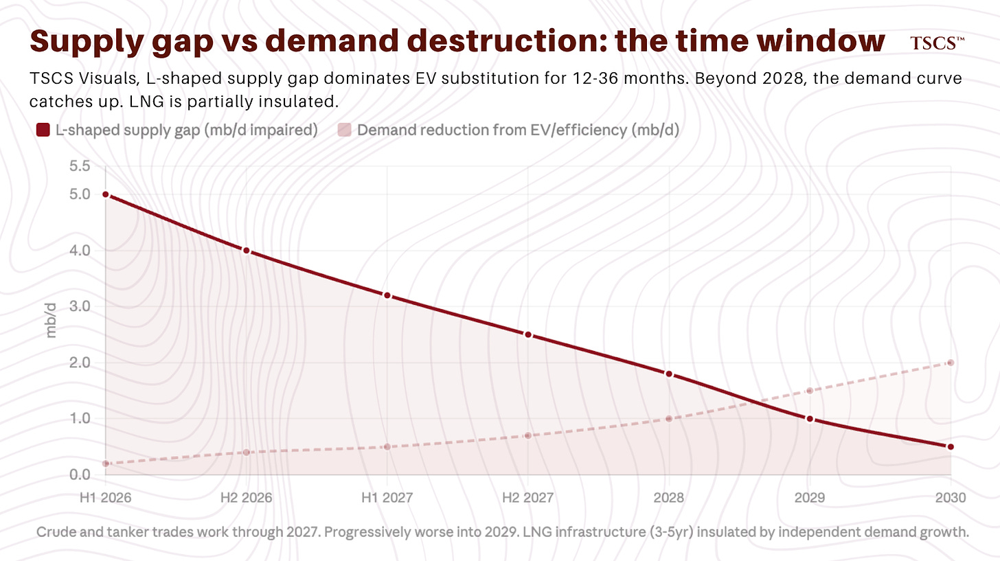](https://substackcdn.com/image/fetch/$s_!2wXf!,f_auto,q_auto:good,fl_progressive:steep/https%3A%2F%2Fsubstack-post-media.s3.amazonaws.com%2Fpublic%2Fimages%2F9b88ecac-d565-4396-b684-2f8d95e33914_1600x898.png)

## Three recovery scenarios and what they price

[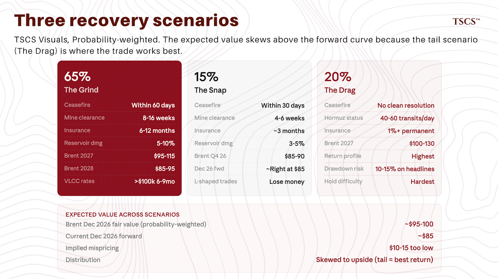](https://substackcdn.com/image/fetch/$s_!StrT!,f_auto,q_auto:good,fl_progressive:steep/https%3A%2F%2Fsubstack-post-media.s3.amazonaws.com%2Fpublic%2Fimages%2Ff09328d4-5e59-44f5-8865-fab26f82e784_1600x898.png)

Scenario 1: The Grind (65% probability). Ceasefire within 60 days. Mine clearance takes 8-16 weeks. Insurance normalizes over 6-12 months. Reservoir damage impairs a non-trivial fraction of shut-in capacity permanently. The magnitude is uncertain, but the mechanisms documented above make zero impairment implausible. Qatar LNG repair takes 3-5 years. Brent trades $95-115 through 2027, settles $85-95 by 2028. Product cracks stay elevated through Q1 2027. VLCC rates stay above $100,000/day for 6-9 months post-ceasefire.

Scenario 2: The Snap (15% probability). Ceasefire within 30 days. Clean resolution. Iran cooperates on mine clearance in exchange for sanctions relief. Reservoir damage at the low end of plausible outcomes. Insurance reprices within 3 months. Brent back to $85-90 by Q4 2026. The Dec 2026 forward is roughly right. I lose money on the L-shaped trades. I still make money on Qatar LNG because physics doesn’t negotiate.

Scenario 3: The Drag (20% probability). No clean ceasefire. Low-level disruption continues. Nasr’s endurance strategy plays out. Hormuz is technically open but functionally degraded: 40-60 transits per day versus 100+ pre-crisis, war risk premiums stay at 1%+, some tanker operators refuse the route entirely. Brent trades $100-130 through 2027. This is the highest-return scenario for the rebuild trades but the hardest to hold through because every false headline creates a 10-15% drawdown.

Expected value across scenarios: Brent Dec 2026 fair value of approximately $95-100, versus the current Dec 2026 forward near $85. Spot Brent trades around $111-115, reflecting the crisis premium. The forward curve’s steep backwardation implies the market assigns significant probability to resolution by year-end. The trade is not that the market is ignoring the crisis. It is that the market is pricing a V-shaped supply recovery that the engineering does not support. If the L-shaped thesis holds, the Dec 2026 forward is $10-15 too low, and the distribution is skewed to the upside because the tail risk (Scenario 3) is the scenario where the trade works best.

[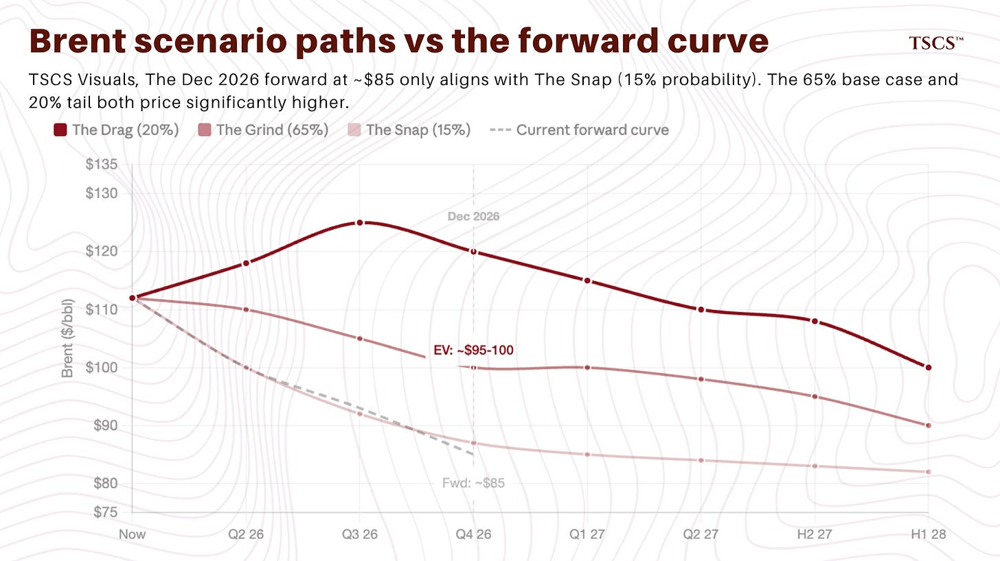](https://substackcdn.com/image/fetch/$s_!WIsP!,f_auto,q_auto:good,fl_progressive:steep/https%3A%2F%2Fsubstack-post-media.s3.amazonaws.com%2Fpublic%2Fimages%2F2116382b-5f45-4664-aa14-d027ba9622dd_1600x899.png)

**When I am wrong**

The thesis is wrong if: Hormuz reopens *and* crude production resumes at pre-crisis rates within 30 days *and* refined product spreads normalize within 60 days. That combination would mean reservoir damage was less severe than the SPE data suggests, refinery restarts were faster than any historical precedent, and insurance markets repriced instantaneously. I assess this at roughly 5% probability. Possible. Not the way to bet.

[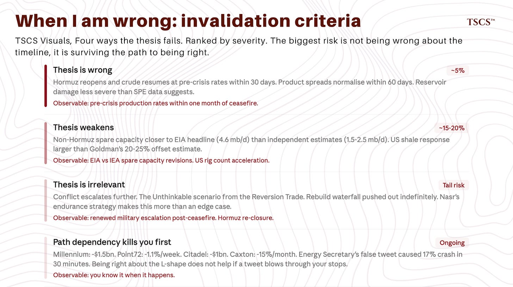](https://substackcdn.com/image/fetch/$s_!iBFP!,f_auto,q_auto:good,fl_progressive:steep/https%3A%2F%2Fsubstack-post-media.s3.amazonaws.com%2Fpublic%2Fimages%2Fe8c552be-fdb8-4657-8aa4-6b4a343fcd97_1600x899.png)

The thesis weakens if: OPEC+ spare capacity outside Hormuz proves closer to the EIA’s headline 4.6 mb/d than to the independent estimates of 1.5-2.5 mb/d. The critical detail here is that roughly 4 mb/d of the EIA’s headline spare sits inside Hormuz. The IEA’s own crisis-period estimate, which accounts for the disruption, is closer to 3.05 mb/d. If I am wrong about that distribution, the non-Gulf supply response could absorb more of the shortfall than I model. Goldman estimates US shale offsets only 20-25% of initial volume loss with a two-quarter delay. Rystad says maximum +380,000 b/d under what they classify as their maximum case, described as extremely unlikely. I think the independent estimates are closer to right. But the EIA has more data than I do.

The thesis is irrelevant if: the conflict escalates further. If we are in the unthinkable scenario from [the Reversion Trade](https://tscsw.substack.com/p/the-reversion-trade), the rebuild waterfall gets pushed out indefinitely and you need a different framework. Vali Nasr’s argument that Iran is deliberately prolonging the broader war and using Hormuz as leverage makes this more than an edge case.

The biggest risk to the specific trades is not that I am wrong about the timeline. It is that the path to being right is unsurvivable. Ozan Tarman on OddLots described this as “bad volatility” where the “best thing is a blank piece of paper.” These are not retail traders who sized wrong. The most sophisticated multi-strat platforms on the planet (Millennium, Citadel, Caxton) just took billion-dollar drawdowns because of path dependency. The Wright tweet that caused a 17% flash crash and was retracted within thirty minutes is the template.

Size accordingly. Duration conviction requires duration capital. If you do not have the balance sheet to hold the position through a 20% drawdown caused by a presidential tweet, you do not have a position. You have a prayer.

**What I’m watching**

[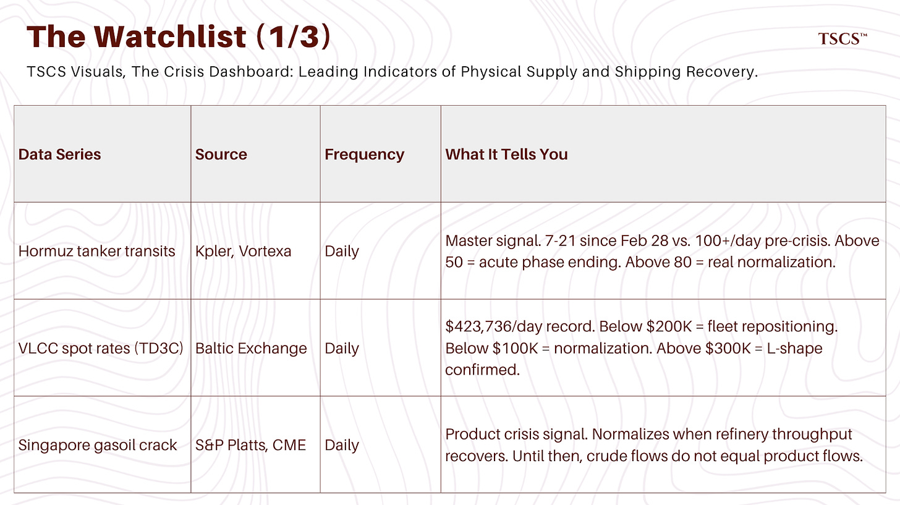](https://substackcdn.com/image/fetch/$s_!0cg7!,f_auto,q_auto:good,fl_progressive:steep/https%3A%2F%2Fsubstack-post-media.s3.amazonaws.com%2Fpublic%2Fimages%2F7a821d2a-b98d-4b38-bd68-df9cc5cbd79b_1600x898.png)

[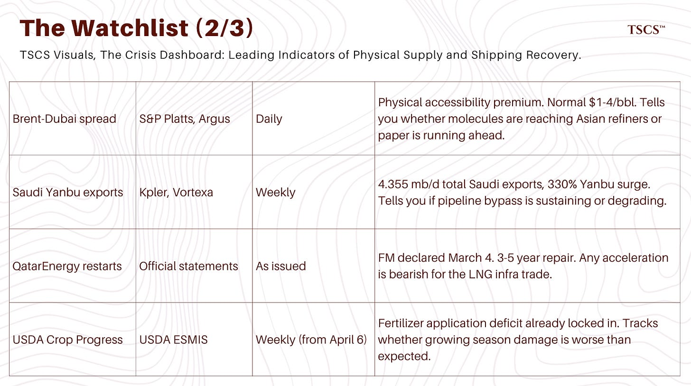](https://substackcdn.com/image/fetch/$s_!ZQMG!,f_auto,q_auto:good,fl_progressive:steep/https%3A%2F%2Fsubstack-post-media.s3.amazonaws.com%2Fpublic%2Fimages%2F3c117e83-90e5-4e89-9c25-f174395bbe9e_1600x895.png)

[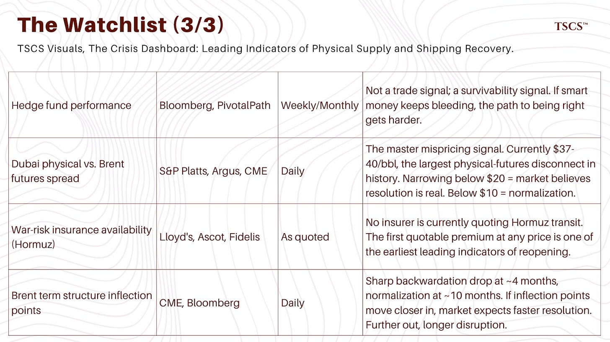](https://substackcdn.com/image/fetch/$s_!mgu5!,f_auto,q_auto:good,fl_progressive:steep/https%3A%2F%2Fsubstack-post-media.s3.amazonaws.com%2Fpublic%2Fimages%2F8716edb2-4e0b-40eb-beff-ed44240f8cbb_1600x898.png)

The ceasefire will come. Maybe next month. Maybe in three. When it does, the market will rally, the curve will flatten, and the cable news anchors will say “crisis over.”

Then the wells will not restart at pre-crisis rates. The tankers will not all fit through the Strait at once. The insurance will not reprice overnight. The LNG trains will still be broken. The refineries will need six to twelve weeks to cold-start. The fertilizer will still be locked out for the 2027 growing season.

There are two different recoveries embedded in this crisis, and the market is mispricing both. Qatar’s LNG damage is a thermodynamic constraint that no ceasefire can accelerate, permanently bound by that single-facility fabrication bottleneck in Florida.

That is a structural L-shape, and the highest-conviction call in this series. The crude recovery is different in kind. Aramco, ADNOC, and KPC are intact. They will restore production, but they will do it through a serial bottleneck: mines first, then insurance, then tanker transit, then refinery cold-starts. Each resolves in sequence, not in parallel. Kuwait had every advantage imaginable and still took two and a half years to normalize from a logistics rebuild alone.

[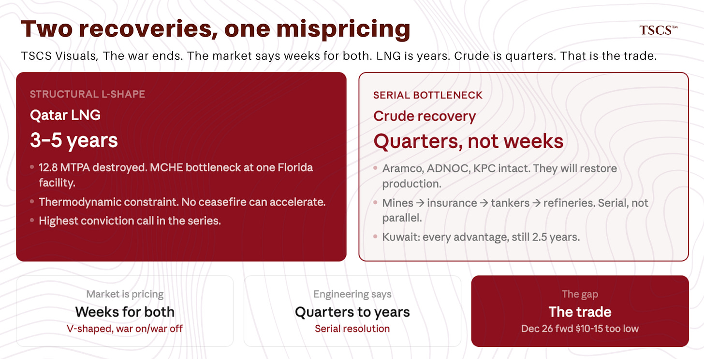](https://substackcdn.com/image/fetch/$s_!5s-2!,f_auto,q_auto:good,fl_progressive:steep/https%3A%2F%2Fsubstack-post-media.s3.amazonaws.com%2Fpublic%2Fimages%2Fc432fa39-4e4a-4082-8501-15ac3e0448c4_1600x818.png)

The war ends. The recovery takes years for LNG and quarters for crude. The market is pricing weeks for both.

That is the trade.

[Share TSCS](https://tscsw.substack.com/?utm_source=substack&utm_medium=email&utm_content=share&action=share)

[Share](https://tscsw.substack.com/p/there-is-no-v-shape?utm_source=substack&utm_medium=email&utm_content=share&action=share&token=eyJ1c2VyX2lkIjoxNDAwMjQ1LCJwb3N0X2lkIjoxOTI2NTk5MDYsImlhdCI6MTc3ODU0NTQwMywiZXhwIjoxNzgxMTM3NDAzLCJpc3MiOiJwdWItMjM1NDI0NCIsInN1YiI6InBvc3QtcmVhY3Rpb24ifQ.aUIVtePhVXg7JEpd0RajVyOtW3X0b7Li2OE7m1-lHdQ)

---

Disclaimer: TSCS is an independent research publication provided for informational and educational purposes only. Nothing herein constitutes investment advice, a solicitation, or a recommendation to buy, sell, or hold any security or commodity. The author holds no positions in any securities mentioned at time of publication. All analysis reflects the author's opinions and may contain errors. Past performance of any thesis or scenario does not indicate future results. Readers should consult a qualified financial advisor before making investment decisions.