Three monitoring signals broke simultaneously. The framework says stop buying. The fundamentals say back up the truck. The composition of the redemption wave tells you which instruction to follow, and when.

Blue Owl Technology Income Corp received redemption requests from 40.7% of its shareholders in a single quarter.

Four out of every ten investors in a fund that is 80% software and technology debt tried to leave at the same time. Blue Owl enforced the 5% cap and fulfilled $179 million. The other $1.3 billion was denied. Eighty-eight percent of the investors who wanted out were told no.

Blue Owl OTIC is not an outlier. It is the extreme of a pattern across the entire semi-liquid private credit complex in Q1 2026: $13.9 billion in total redemption requests, 217% quarter over quarter. Blackstone injected $400 million of its own money to avoid gating BCRED. HPS gated HLEND for the first time in its history. Apollo, Ares, KKR, and Cliffwater all enforced caps. The industry average redemption request: 15% of shares outstanding.

[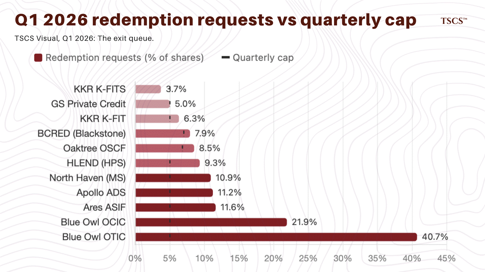](https://substackcdn.com/image/fetch/$s_!mrEm!,f_auto,q_auto:good,fl_progressive:steep/https%3A%2F%2Fsubstack-post-media.s3.amazonaws.com%2Fpublic%2Fimages%2Fbedefa18-670b-4bda-b9bf-48e33ce9f920_1403x787.png)

Jeffrey Gundlach called private credit “a total unmitigated disaster” on March 27 and put DoubleLine at its lowest risk position in the firm’s 17-year history. Mohamed El-Erian escalated his August 2007 comparison on March 19, mirroring the path from Bear Stearns’ hedge fund failures to full systemic crisis. Boaz Weinstein compared private credit liquidity to “fire insurance that doesn’t work if there’s actually a fire.”

Meanwhile, ServiceNow just printed 21% subscription growth and authorised a $5 billion buyback. CrowdStrike posted record GAAP margins and crossed $5 billion in ARR. Veeva beat estimates by 20% and added 10 Vault CRM customers. Every Fortress Zone name beat Q4 estimates. Every single one.

Everyone is watching the signals. The real story is who is selling, and whether the adversary has a shelf life.

[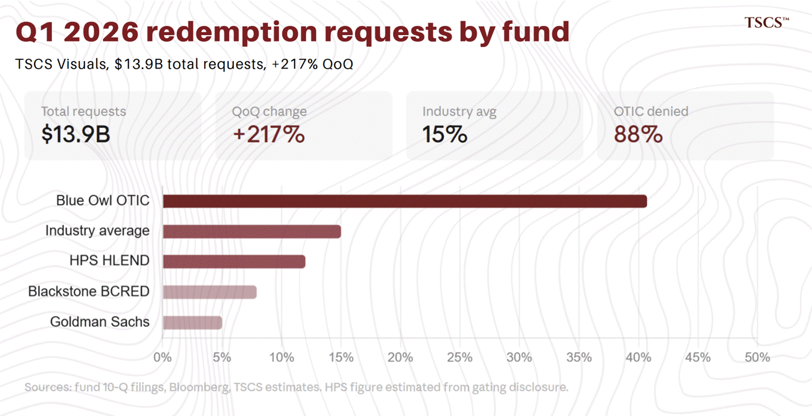](https://substackcdn.com/image/fetch/$s_!ioMm!,f_auto,q_auto:good,fl_progressive:steep/https%3A%2F%2Fsubstack-post-media.s3.amazonaws.com%2Fpublic%2Fimages%2Fcdd6047c-6c38-4b70-9ffc-35d36dd5dccd_1405x722.png)

Goldman Sachs’ private credit fund saw redemption requests of 4.999%. Not 15%. Not 11%. Five percent. Goldman explicitly attributed the difference to its “reliance on stickier, more patient institutional investors, rather than wealthy individuals.” The mechanism is structural, not psychological. Institutional capital (pensions, sovereigns, endowments) deploys into closed-end drawdown funds with 7-to-10 year lockups. They cannot submit a redemption request. The wealth channel deploys into semi-liquid perpetual BDCs with 5% quarterly exit doors. Retail investors are jamming the gates because they are the only ones standing in a room with a door.

CalPERS is not redeeming from private credit. It is increasing its allocation from 5% to 8%.

That split is the single most important variable in this cycle.

It determines whether the next 12 months look like an orderly unwind or a structural fracture. It determines whether ServiceNow at 6.3x forward revenue, cheaper than March 2020 and cheaper than the 2022 rate shock, is the entry point of the cycle or a stop on the way to something worse.

This piece is the fifth in a series that built the analytical framework for this moment. “Don’t Short SaaS” (February 7) established the Fortress Zone taxonomy. “Private Credit Is Lying To You” (February 22) mapped the exposure. “Private Credit Is Eating Itself” (March 15) traced the reflexive loop. “Software Is Breaking CLOs” (March 18) proved the mechanism with CUSIP-level data.

Each piece added a layer. Each one hit.

This piece adds the final layer: what happens when the adverse scenario arrives and the fundamentals do not confirm it. The answer depends on a variable nobody can observe. That is the problem.

## Section 1: The Scorecard

I defined five monitoring signals across Parts 2 through 4 and committed to updating readers when they fired. Three broke adversely. One is ambiguous. One is pending. Zero resolved favourably.

[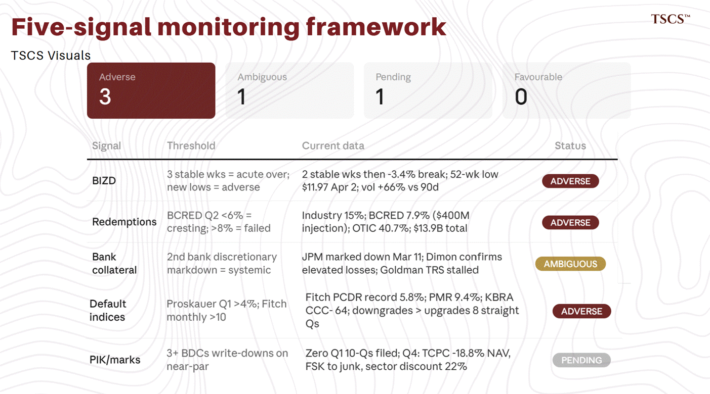](https://substackcdn.com/image/fetch/$s_!hcDe!,f_auto,q_auto:good,fl_progressive:steep/https%3A%2F%2Fsubstack-post-media.s3.amazonaws.com%2Fpublic%2Fimages%2F246db3c2-18f9-41b9-be8a-d7be793716f8_1403x780.png)

The framework from Part 3 required two simultaneous adverse breaks to trigger the adverse scenario. I have three. The instruction was unambiguous: no new equity, full BIZD puts, reduce ARCC to half, reassess the framework.

I am following it. But the signal count is not the full picture. What the signals cannot tell you is why they broke. A redemption wave driven by panicking financial advisers has a very different shelf life than one driven by institutional capital concluding the asset class is broken. That distinction is the entire piece.

### Why you should be reading TSCS

TSCS called the AI inference repricing before the market moved. We named Kitwave as an acquisition target, then OEP showed up with £251 million. We built the Fortress Zone taxonomy before the selloff confirmed it, mapped the reflexive loop before industry-wide gating proved it, and published the only comprehensive analysis of the software leveraged loan market (227 CUSIPs, Bloomberg Terminal) before a single sell-side desk touched it.

17,000 subscribers. 637 confirmed institutional readers across 561 firms.

We do not tell you what happened. We tell you what is about to.

The confirmation window opens April 22. Subscribe now.

The companion pieces, including the maturity wall visualisation, the ARCC deep dive, and the BDC NAV-versus-software-concentration scatter plot, are paid-only.

Subscribed

## Section 2: The Composition Thesis

The severity and duration of the private credit stress cycle depends on a single variable: the composition of the redemption wave.

If it is predominantly wealth-channel (financial advisers pulling clients out of products making headlines for the wrong reasons), the wave is self-limiting. There are a finite number of wealth-channel investors in semi-liquid funds. The gate mechanisms enforce 5% quarterly caps. At those caps, even a 20% peak request rate clears in three to five quarters. That is the iCapital estimate, published April 2, and it is consistent with the only available precedent.

If institutional LPs are joining the queue, the timeline extends dramatically and the entire structure fractures, because institutional capital is the permanent base that makes the model work.

A note on OTIC’s headline 40.7% request rate: when wealth advisors know a fund is capping at 5% and prorating requests, they inflate their figures to receive the actual cash they want after proration. Request $10 million when you need $2 million, receive your $2 million at 20% fulfilment. The demand to exit is real. The 40.7% figure includes phantom queue inflation. The fulfilled amount is the cleaner signal.

No fund has disclosed the exact split. Not Blackstone. Not Apollo. Not Ares. Not Blue Owl. This is the most important variable in a $1.8 trillion market and it is completely unobservable from public data.

What we have instead is five convergent data points.

**The Goldman signal.** Goldman Sachs’ private credit fund saw 4.999% redemption requests versus the industry average of 15%. Goldman attributed it to institutional capital. Alex Blostein’s March 19 research note projected $50 to $70 billion in net outflows from the retail channel over the next two years. Retail credit fund assets grew from $34 billion at end of 2021 to $222 billion at end of 2025. That $188 billion delta is the pool that is draining.

[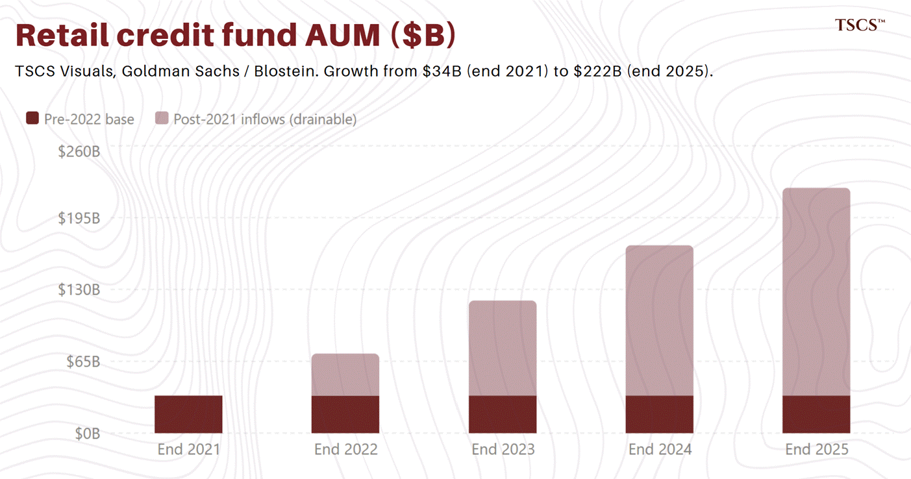](https://substackcdn.com/image/fetch/$s_!QFWh!,f_auto,q_auto:good,fl_progressive:steep/https%3A%2F%2Fsubstack-post-media.s3.amazonaws.com%2Fpublic%2Fimages%2Ff485fd90-a86b-46f2-9d0a-4e34d929ecec_1403x738.png)

Blostein also pushed back on the catastrophist framing: “Credit is credit. It’s not equity.” A 30% drawdown in public software stocks does not translate to equivalent lender losses given 60 to 70% equity cushions underneath first-lien loans. Goldman’s own non-accrual rate: 12 basis points. Not 12%. Twelve basis points.

**The manager commentary.** Jon Gray at Blackstone described Q1 redemptions as driven by “retail and wealth-management clients,” noting “financial advisors can say, hey, I want to redeem.” Blue Owl stated OTIC’s pressure was “amplified by fund’s more concentrated shareholder base, particularly within certain wealth channels and regions,” citing the Asian wealth channel specifically.

[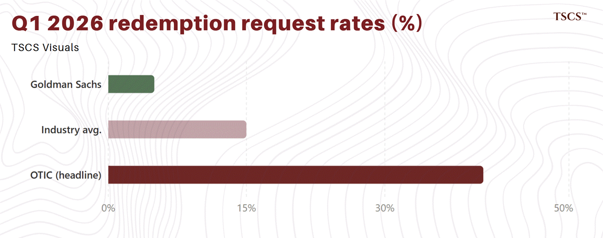](https://substackcdn.com/image/fetch/$s_!fDxk!,f_auto,q_auto:good,fl_progressive:steep/https%3A%2F%2Fsubstack-post-media.s3.amazonaws.com%2Fpublic%2Fimages%2Fb6398b03-152b-4aff-ad93-3907dc4e311c_1405x555.png)

**The institutional behaviour.** CalPERS deployed roughly $6 billion in new private credit commitments in Q3 2025 and is increasing its target allocation from 5% to 8%. No pension fund, endowment, or sovereign wealth fund has publicly disclosed redeeming. European bank CEOs at Morgan Stanley’s financials conference expressed comfort with private credit exposure and see no systemic risk.

**The inflow data.** iCapital noted approximately $7 billion in gross inflows into larger private credit funds during Q1, which “could indicate consistent institutional funding.” Seven billion dollars of institutional money walking in while $13.9 billion of wealth-channel money tries to walk out is a compositional picture, not a systemic one.

[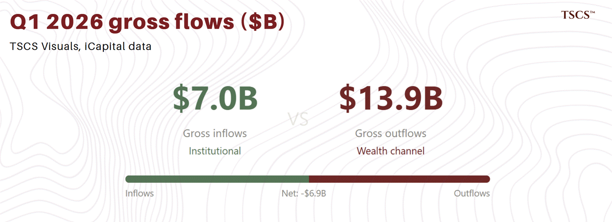](https://substackcdn.com/image/fetch/$s_!sdQn!,f_auto,q_auto:good,fl_progressive:steep/https%3A%2F%2Fsubstack-post-media.s3.amazonaws.com%2Fpublic%2Fimages%2F99217bad-dd3a-43a4-a594-e9a54c6c55cd_1403x510.png)

**The BREIT precedent.** Blackstone’s non-traded real estate fund faced a nearly identical redemption crisis starting November 2022. Peak requests hit $5.3 billion in January 2023. Blackstone continuously hit caps. Total withdrawals: $14.3 billion over 15 months. By February 2024, requests had dropped 82% from peak, and Blackstone fulfilled 100% for the first time.

[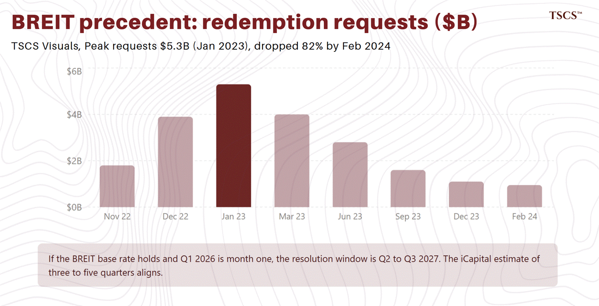](https://substackcdn.com/image/fetch/$s_!1NE2!,f_auto,q_auto:good,fl_progressive:steep/https%3A%2F%2Fsubstack-post-media.s3.amazonaws.com%2Fpublic%2Fimages%2Fe0074468-8dc8-4db8-b37b-faf6a39a1c9e_1404x720.png)

Fifteen months from first gate to full resolution. Entirely wealth-channel driven. The precedent is imperfect. BREIT was backed by real estate with observable liquidation value and transaction comps. Software credit has no comparable floor, as the distressed practitioner data in Section 3 confirms. If the tail scenario materialises, the resolution timeline could run longer than 15 months.

If the BREIT base rate holds and Q1 2026 is month one, the resolution window is Q2 to Q3 2027. The iCapital estimate of three to five quarters aligns.

I hold this compositional view at roughly 65% confidence. It moves to 80% if BCRED Q2 shows channel-level disclosure with institutional requests below 2%. It drops to 40% if Blackstone stops distinguishing between channels in its Q2 communications, because that silence is itself the answer. The 35% where I am wrong is the scenario where institutional LPs begin queuing in Q2 or Q3, the permanent capital base fractures, and the 15-month timeline doubles.

[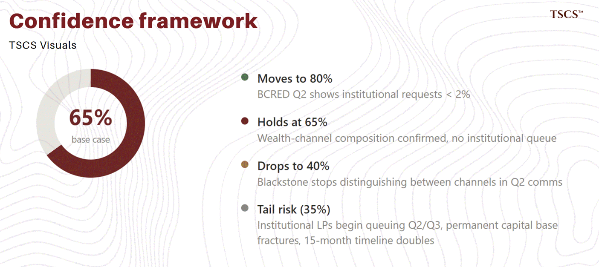](https://substackcdn.com/image/fetch/$s_!1Law!,f_auto,q_auto:good,fl_progressive:steep/https%3A%2F%2Fsubstack-post-media.s3.amazonaws.com%2Fpublic%2Fimages%2F8be28da5-d85c-4be9-ae74-25e8f5d24ece_1405x627.png)

This is the bet. Not whether the signals are adverse (they are), but whether the adversity has a shelf life.

## Section 3: The Evidence Against Me

That is the bull case. Here is why it might be wrong.

**The opacity is worse than I told you.** Barclays published research showing actual software exposure across four large managers (Apollo, Ares, Blackstone, Blue Owl) is approximately 25%, versus the 19% they report. The gap is structural: “software” is sliced into subcategories that individually stay below concentration limits but aggregate higher. Blue Owl’s OCIC prospectus limits any single industry to 20%. Actual software-plus-technology exposure: “just over 30%.” The limit is observed in letter but violated in spirit. The BIS quantified the scale on March 16. Outstanding loans to SaaS firms: $8 billion in 2015. Over $500 billion by end of 2025. That is 19% of total direct loans.

A third of private credit funds have extended loans to software companies. BDCs with higher SaaS exposure underperformed peers by 5 percentage points. No US regulator has produced anything comparable. No US regulator has taken any enforcement action on valuation practices. The DOJ warned about “creative marks” in November. Since then: zero subpoenas, zero indictments, zero investigations. Warren has issued statements. Nobody has issued consequences.

Jamie Dimon, in his April 7 shareholder letter: “At some point insurance regulators will insist on more rigorous ratings or markdowns, which will likely lead to demands for more capital.” The CEO of the largest bank in America is telling you the marks are coming down.

The question is when, not whether. And Boaz Weinstein, on the Matt Levine podcast on March 19, warned that falling NAVs force asset sales that trigger more redemptions: “I really think this could be a systemic nightmare.” The regulatory cavalry is not coming. The loop has to exhaust itself.

**The FSK downgrade is a new category of stress.** Moody’s cut FS KKR from Baa3 to Ba1 on March 23: the first BDC downgraded to junk in this cycle. PIK income at 14.7% of investment income versus a 6.3% peer median. Non-accruals at 5.5%. Q4 net loss of $114 million. NAV eroded 11.7% over the full year. Software: 16.4% of the portfolio.

iCapital identifies the 10% PIK threshold as the critical marker: “if PIK income exceeds 10% of total income, the portfolio could face liquidity stress.” FSK blew through it. PSEC, at approximately 12.5%, is next in line. The mechanism is lethal: BDCs are Regulated Investment Companies required to distribute 90% of taxable income as cash dividends. When 14.7% of investment income is PIK (non-cash interest capitalised into the loan principal), the fund books taxable income it never received in cash, but must still pay the dividend. The gap gets funded by drawing on revolvers or selling assets at distressed prices. PIK at this level is not an accounting nuance. It is a cash-flow death spiral.

The BDC sector discount to NAV tells the story in a single table:

[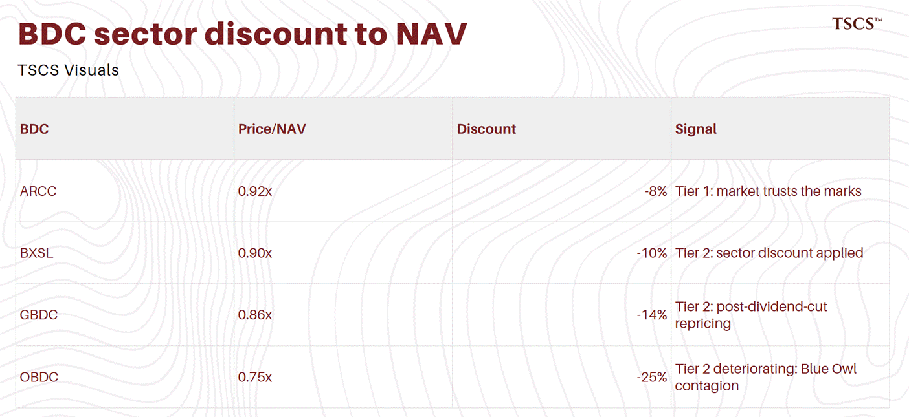](https://substackcdn.com/image/fetch/$s_!xYH-!,f_auto,q_auto:good,fl_progressive:steep/https%3A%2F%2Fsubstack-post-media.s3.amazonaws.com%2Fpublic%2Fimages%2Fc22f29dd-1ec2-4b0a-9538-44f33e06fe4e_1404x645.png)

[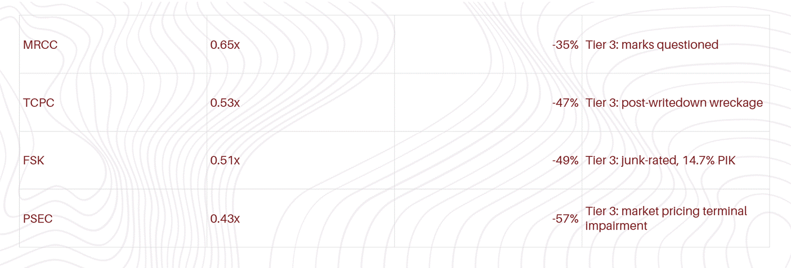](https://substackcdn.com/image/fetch/$s_!MEWi!,f_auto,q_auto:good,fl_progressive:steep/https%3A%2F%2Fsubstack-post-media.s3.amazonaws.com%2Fpublic%2Fimages%2Fc9bff05e-43b8-46f1-86c2-865e4b5ee52a_1405x477.png)

[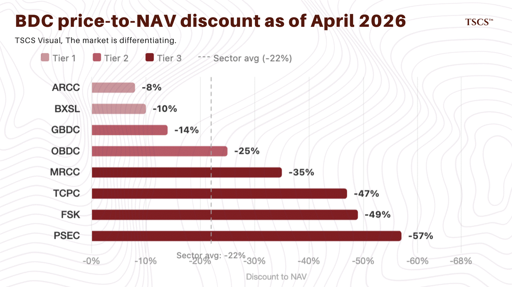](https://substackcdn.com/image/fetch/$s_!Whhs!,f_auto,q_auto:good,fl_progressive:steep/https%3A%2F%2Fsubstack-post-media.s3.amazonaws.com%2Fpublic%2Fimages%2Fa25b13c7-4abe-45a4-baf7-97d4dfc30b14_1406x789.png)

Sector average: 0.78x book, a 22% discount, up from 15% in Part 3. That is a 126-percentage-point spread between the best and worst managers. The market is differentiating. But it is also widening the discount across the board, and that widening compresses the fee base that funds the entire alternative asset management industry.

**The software loan market froze.** Reuters reported in late February that “there are currently no leveraged loan deals for software companies.” Zero. Deutsche Bank was stuck holding $1.2 billion in loans backing Conga Corp. March 2026 was the first month without a single loan repricing since June 2023. When the primary market shuts entirely, every borrower approaching maturity faces a binary: restructure or default. And 48 software instruments in the Part 4 dataset mature by 2028.

[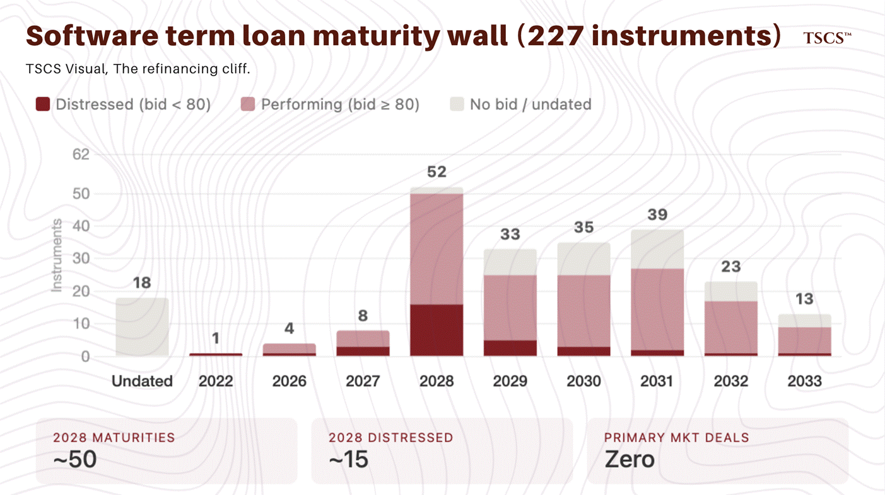](https://substackcdn.com/image/fetch/$s_!kEXq!,f_auto,q_auto:good,fl_progressive:steep/https%3A%2F%2Fsubstack-post-media.s3.amazonaws.com%2Fpublic%2Fimages%2Fe7dab18a-0f59-4de0-8be5-c85f8ed13ad4_1403x787.png)

[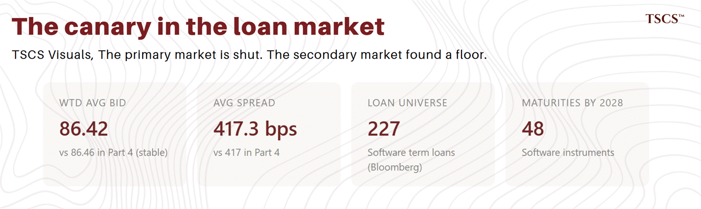](https://substackcdn.com/image/fetch/$s_!xsbs!,f_auto,q_auto:good,fl_progressive:steep/https%3A%2F%2Fsubstack-post-media.s3.amazonaws.com%2Fpublic%2Fimages%2F05a27f1e-3198-48a1-971c-5fc2da0c38fb_1405x420.png)

**But the secondary market found a floor.** I pulled the full 227-loan software term loan dataset from the Bloomberg Terminal on April 8. A clarification on taxonomy: these are Broadly Syndicated Loans, not direct lending. They carry CUSIPs, trade on screens, and have observable secondary bids. True private credit is bilaterally negotiated, untraded, and marked-to-model. We use the liquid BSL software market as the real-time canary for what the opaque private marks are hiding. The weighted average bid: 86.42. In Part 4, using the same universe three weeks earlier, it was 86.46. The average spread: 417.3 basis points, versus 417 in Part 4. The credit market has stabilised while the equity market kept falling.

The updated bids on the five distressed credits tracked since Part 4 tell a more nuanced story than the bears or the bulls want:

[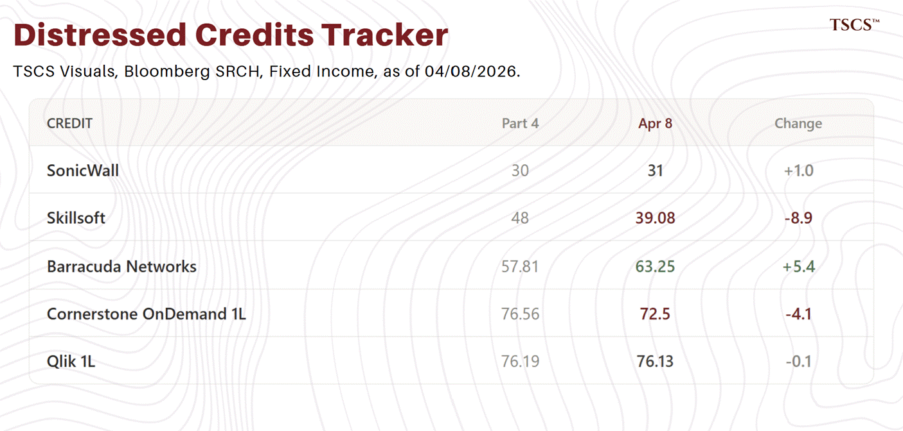](https://substackcdn.com/image/fetch/$s_!ecLb!,f_auto,q_auto:good,fl_progressive:steep/https%3A%2F%2Fsubstack-post-media.s3.amazonaws.com%2Fpublic%2Fimages%2Fe9fd7eab-2d86-4bcd-a1cf-16250b9d12d5_1405x672.png)

[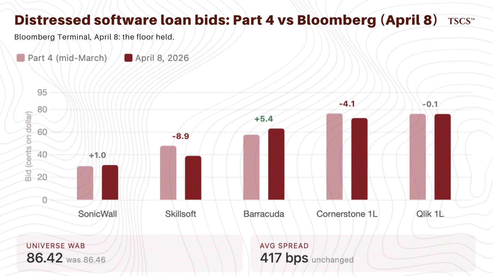](https://substackcdn.com/image/fetch/$s_!unOO!,f_auto,q_auto:good,fl_progressive:steep/https%3A%2F%2Fsubstack-post-media.s3.amazonaws.com%2Fpublic%2Fimages%2F9b547814-d9ce-43ba-b2a7-1c67d74df72e_1406x789.png)

Two recovered, two deteriorated, one flat. That is not a uniform collapse. It is the same bimodal distribution I identified in Part 4, with the distressed tail getting slightly worse (Skillsoft down 9 points to 39, now firmly in restructuring territory) while the performing core holds. Barracuda’s 5-point recovery from 57.81 to 63.25 is the strongest single-name improvement in the distressed cohort. The deeper distress remains concentrated: West Technology at 20, Magenta Security’s junior tranche at 21.45, GoTo Group’s second lien at 29.25. These are zeros with a pulse.

[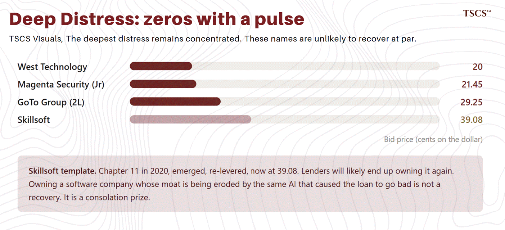](https://substackcdn.com/image/fetch/$s_!bddo!,f_auto,q_auto:good,fl_progressive:steep/https%3A%2F%2Fsubstack-post-media.s3.amazonaws.com%2Fpublic%2Fimages%2F3e040e49-2270-431b-919c-fc262286002c_1403x639.png)

One data point that the bears should find uncomfortable: BCRED’s Class I NAV was $24.38 as of February 27, per Bloomberg. That is an all-time low. It is also the last available data point, recorded the day before Operation Epic Fury began. Whatever happened to the portfolio in March, when BIZD hit new lows, when industry-wide gating erupted, when FSK was downgraded to junk, is not yet in this number. The March NAV, when it is eventually disclosed around Blackstone’s April 16 to 17 earnings, will almost certainly be lower. The $400 million capital injection went to fund redemptions, not to support NAV.

And Golub’s $600 million in unsecured notes at 2.5%, due August 2026, shows no refinancing on Bloomberg’s debt distribution as of April 8. Eight issues outstanding, $3.6 billion total debt, weighted average coupon of 4.86%. That $600 million maturity is four months away with no replacement announced. Based on recent BDC refinancings (ARCC at 5.25%, GSBD at 5.10%, FSK at 6.13%), Golub is looking at roughly doubling its coupon cost. That is $15 to $20 million in additional annual interest expense on a single maturity.

[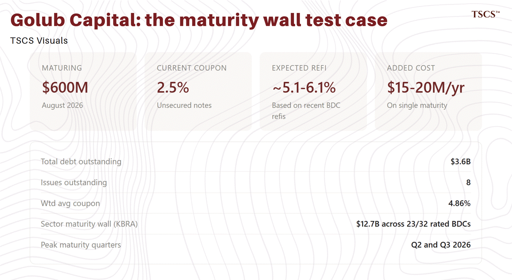](https://substackcdn.com/image/fetch/$s_!PVFR!,f_auto,q_auto:good,fl_progressive:steep/https%3A%2F%2Fsubstack-post-media.s3.amazonaws.com%2Fpublic%2Fimages%2Fb9b75a3c-ee4c-406e-a6b0-52b9f3d04eda_1403x768.png)

**The CLO cushion is thinning.** PGIM’s March 26 report: average BB CLO MVOC fell 1.2 points to 104%, a 4% cushion. Twenty-three percent of BB tranches now have thin cushions below 3%, doubled in 2026. Roughly 13% of BB tranches show MVOC below zero. Clopremium found 22.6% of US BSL CLO BB tranches show MVOC below 100%. No manager has publicly reported a software-specific OC test breach, the smoking gun I flagged in Part 4. The Q1 CLO trustee reports, due May and June, will tell us whether it has fired.

[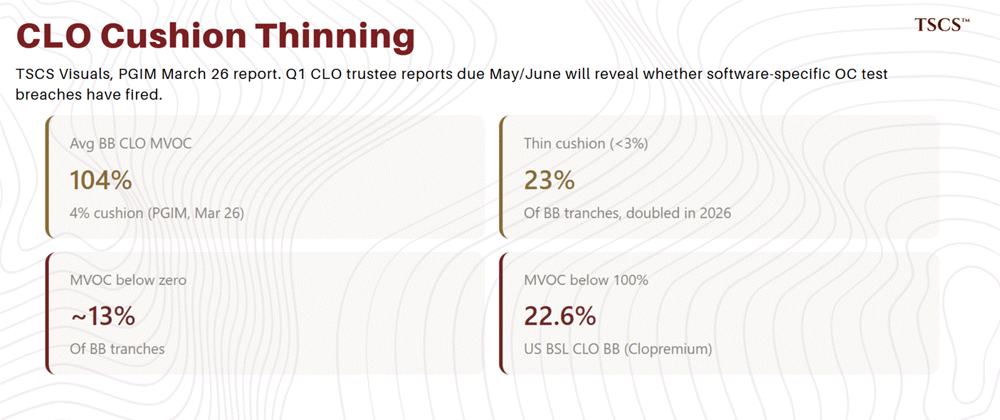](https://substackcdn.com/image/fetch/$s_!nH15!,f_auto,q_auto:good,fl_progressive:steep/https%3A%2F%2Fsubstack-post-media.s3.amazonaws.com%2Fpublic%2Fimages%2F4f209bbf-12e2-4c31-8037-5f979fb6e7b6_1405x591.png)

**The carry breakeven is thinner than I told you.** All-in yields have compressed from 10 to 12% (Part 3) to 8.5 to 9.7%. Meanwhile BDCs are refinancing 2 to 3% coupons into 5.1 to 6.1%, with the weakest (ICMB) requiring an affiliate backstop at roughly 9.5% because public markets would not lend to them.

The 10-year has risen 15 basis points in a bear flattening that compresses the carry from both sides. And Fitch’s default composition tells you the headline numbers are understating the stress: 60% PIK conversions, 27% maturity extensions, 6% actual payment defaults. Morningstar DBRS confirms the pattern independently: 94% of all downgrades to D or SD in the 12 months through February were distressed exchanges. The marks say performing. The cash register says empty.

[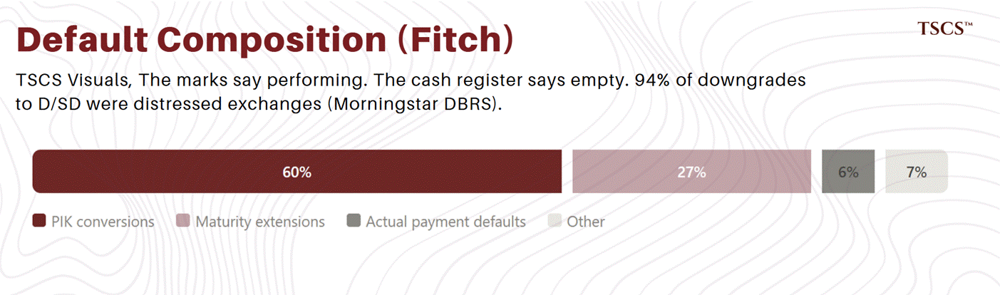](https://substackcdn.com/image/fetch/$s_!dWYf!,f_auto,q_auto:good,fl_progressive:steep/https%3A%2F%2Fsubstack-post-media.s3.amazonaws.com%2Fpublic%2Fimages%2F31c80d63-a8ce-4b27-82fe-88c012fd05f8_1403x414.png)

[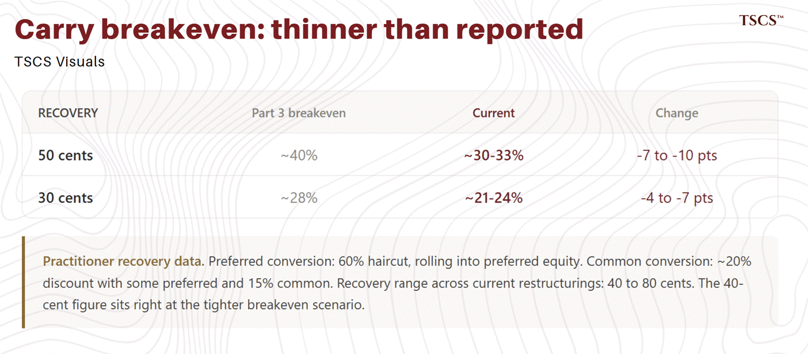](https://substackcdn.com/image/fetch/$s_!YNnH!,f_auto,q_auto:good,fl_progressive:steep/https%3A%2F%2Fsubstack-post-media.s3.amazonaws.com%2Fpublic%2Fimages%2F9a847678-2bfb-41a9-b49b-b49fdc7ab1bb_1404x615.png)

The buffer exists. It is meaningfully narrower. And the rate-cut scenario that would have eased it is priced out: CME FedWatch shows 83% hold at May, 89% at June.

**A distressed practitioner told me the breakeven may be worse than the table shows.** A board member of the Turnaround Management Association with direct operational experience in mid-market software restructurings, who asked to remain anonymous, provided recovery data from two recent restructurings sourced through an investment banker. In the preferred conversion structure, the lender took a 60% haircut with that portion rolling into preferred equity. In the common conversion, roughly a 20% discount with some preferred and 15% common at the expense of the sponsor. The recovery range he is seeing across current restructurings: 40 cents to 80 cents, depending on the structure. The 40-cent figure sits right at my tighter breakeven scenario.

This is the insight that rewrites the recovery math for software credit.

In traditional restructuring, you weigh the restructuring path against liquidation value. In manufacturing or real assets, that floor is tangible: plant, equipment, inventory. In software 20 years ago, the IP itself stored value because it took months or years to build. Today, with AI, you can develop a comparable software application almost overnight. The IP stores almost no residual value. The only real value left is the going concern: the ARR, the customer base, the switching costs. And that is the exact asset under pressure from AI-driven budget reallocation.

His words: “This is something the restructuring industry has never really encountered before.”

He estimates 20 to 30% of the distressed software loan pool are genuine zombies: negative loan-to-value, no realistic path to exit at par. Roughly 50% of 2026 year-to-date software defaults are repeat offenders, companies where the first restructuring did not cut deep enough. Skillsoft, bidding at 39.08 on the Bloomberg Terminal as of April 8, is the template: this is a company that already went through Chapter 11 in 2020, emerged, got re-levered, and is now trading at levels that suggest the lenders will end up owning it again. Owning a software company whose competitive moat is being eroded by the same AI that caused the loan to go bad is not a recovery. It is a consolation prize.

This directly challenges the 30-cent recovery assumption I used for the bottom tier of the breakeven table. If liquidation value in software is approaching zero for the Dead Zone credits, the tail risk in CLO and BDC portfolios is worse than my table shows. It also widens the Fortress Zone versus Dead Zone gap even further, because the Fortress names are the ones whose customer lock-in, regulatory moats, and institutional switching costs constitute genuine going-concern value. That value is real. The question is whether it is enough to carry the entire portfolio when the Dead Zone floor has collapsed underneath it.

Gundlach on March 23: “Everything is overvalued, cracks are starting to form. But everyone’s like, it’s all contained, it’s no problem, it’s just software. But it’s not just software.”

He might be right. The compositional evidence says he is probably wrong, for now, for the wealth-channel portion of the stress. But “probably” is doing a lot of work in that sentence, and 65% confidence means I am wrong one time in three.

[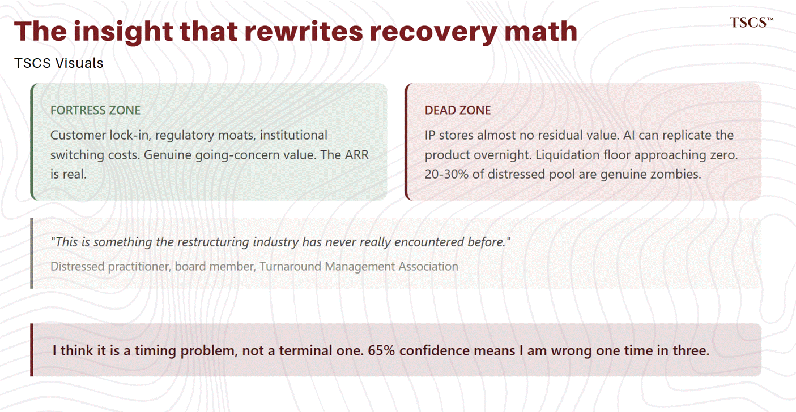](https://substackcdn.com/image/fetch/$s_!UbMt!,f_auto,q_auto:good,fl_progressive:steep/https%3A%2F%2Fsubstack-post-media.s3.amazonaws.com%2Fpublic%2Fimages%2F7a6d3bba-4382-4411-aa01-b097e0ace66d_1405x729.png)

That is the bear case. I think it is a timing problem, not a terminal one. Here is why.

## Section 4: The Fortress Zone Delivered Into the Teeth of the Storm

Before the equity data, one clarification on the macro overlay. The software selloff is structurally independent of the Iran conflict. IGV peaked September 2025, was 20% below its 200-day moving average by February 5, three weeks before the first strikes. The war is real (oil up 80%, VIX still 50% above pre-war levels), but the 19 to 27 percentage point gap between IGV (down 24%) and QQQ (down 5 to 8%) is entirely AI-driven. The catalysts are internal: earnings, composition, and the exhaustion of the forced-selling mechanism.

A second structural clarification. This series runs two theses under one framework. The equity thesis: Fortress Zone software is mechanically oversold and the fundamentals confirm it. The credit thesis: BDC portfolios face a cash flow crisis on levered mid-market software with no headroom. Same origin. Different companies. Different balance sheets. Potentially different timelines.

ServiceNow is not in a BDC portfolio. Skillsoft is. The April 22 trigger governs equity deployment. The credit view resolves on BCRED Q2 redemptions in July and the Q1 10-Q cycle in May and June. There is a 30 to 40% scenario where Fortress equities recover while BDC stress deepens simultaneously. The BIZD puts are sized for exactly that divergence. Do not cross the streams.

With that established: five of five Fortress Zone names beat Q4 estimates.

[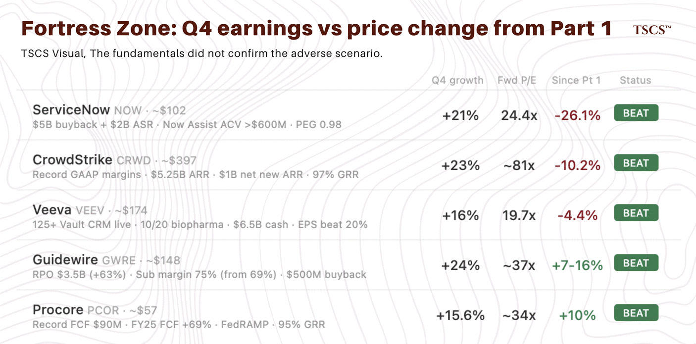](https://substackcdn.com/image/fetch/$s_!r6Y_!,f_auto,q_auto:good,fl_progressive:steep/https%3A%2F%2Fsubstack-post-media.s3.amazonaws.com%2Fpublic%2Fimages%2F8ac59e15-acad-4c99-8c9e-a610cd167ff0_1406x695.png)

[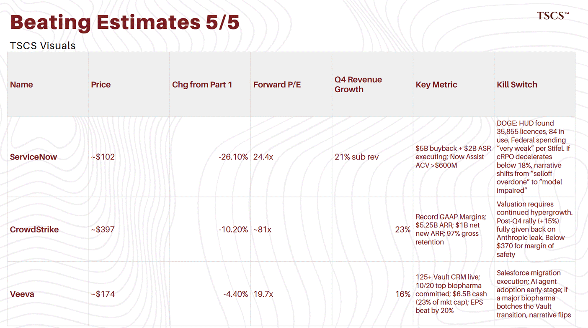](https://substackcdn.com/image/fetch/$s_!qNNh!,f_auto,q_auto:good,fl_progressive:steep/https%3A%2F%2Fsubstack-post-media.s3.amazonaws.com%2Fpublic%2Fimages%2F173f7a18-ffa9-47c4-a382-fac329bfde9b_1404x786.png)

[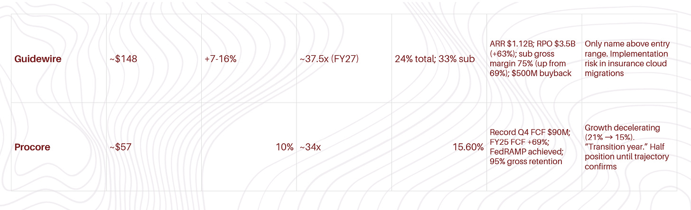](https://substackcdn.com/image/fetch/$s_!E9Ke!,f_auto,q_auto:good,fl_progressive:steep/https%3A%2F%2Fsubstack-post-media.s3.amazonaws.com%2Fpublic%2Fimages%2F3b44f9f4-8b81-4a4d-8267-748c045b184d_1984x605.png)

The standout data point is ServiceNow’s valuation at current prices:

[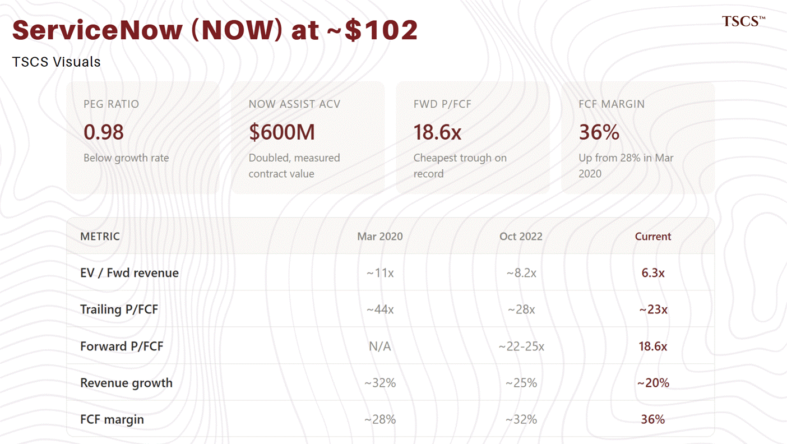](https://substackcdn.com/image/fetch/$s_!dLEe!,f_auto,q_auto:good,fl_progressive:steep/https%3A%2F%2Fsubstack-post-media.s3.amazonaws.com%2Fpublic%2Fimages%2F5bb76ecd-4bee-4fb5-9644-c582ed7a1d09_1404x792.png)

ServiceNow is cheaper on every forward metric than at either prior crisis trough, and more profitable. The PEG ratio sits at 0.98. For the first time in its history as a public company, ServiceNow is priced below its growth rate.

[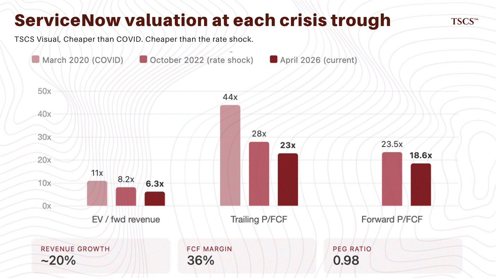](https://substackcdn.com/image/fetch/$s_!jKwf!,f_auto,q_auto:good,fl_progressive:steep/https%3A%2F%2Fsubstack-post-media.s3.amazonaws.com%2Fpublic%2Fimages%2F160318bc-3743-4ab1-85a6-77c406ca4563_1405x788.png)

One caveat I cannot wave away. The same distressed practitioner who provided the recovery data made a point about the Fortress Zone growth narrative that I cannot dismiss. CFOs are diverting budget from seat expansion to AI initiatives, but mostly trying to do it internally. His direct observation: if you are not already using a ServiceNow or CrowdStrike, you are not suddenly in the market for one. And if you are already using one, the vendor may try to upsell the AI add-on, but at lower margins. He cited consulting data showing only around 10% of companies have concretely realised value from AI initiatives. The Fortress Zone thesis holds on retention and switching costs, but the growth re-acceleration story is harder than the Q4 earnings suggest. The implication for the Dead Zone is worse: the ARR deceleration at Five9 and Freshworks is a real demand problem, not just a valuation problem. Budgets are being redirected, not expanded.

I think this is right on the margin and wrong at the core. ServiceNow’s Now Assist ACV doubling to $600 million is not a hypothetical upsell; it is measured contract value. CrowdStrike’s Falcon Flex at $1.69 billion ARR growing 120% is not a pitch deck; it is consumption data. But the practitioner’s point constrains how aggressively you can underwrite the re-acceleration thesis. The Q4 numbers are real. Whether they accelerate further, or merely hold, determines the difference between a 50% return and a 100% return over 24 months. That gap matters even if both numbers are attractive.

Veeva at 19.7x forward earnings is roughly half its historical trough of 34 to 40x. EV/FCF of 15.8x implies a 4.9% free cash flow yield on a company growing 13 to 16% with a 44% FCF margin in a regulated vertical with decades of switching costs. This is a consumer-staple multiple on a company growing six times faster than Procter and Gamble.

[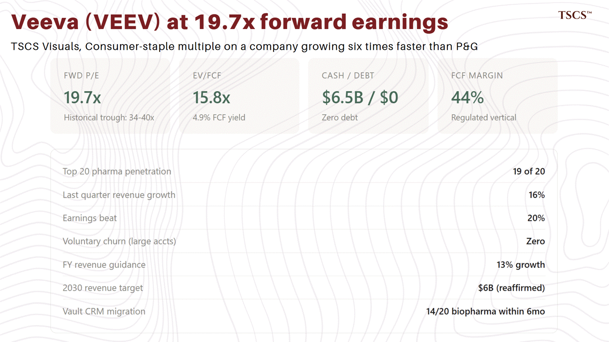](https://substackcdn.com/image/fetch/$s_!LzLe!,f_auto,q_auto:good,fl_progressive:steep/https%3A%2F%2Fsubstack-post-media.s3.amazonaws.com%2Fpublic%2Fimages%2F78d53dbe-0b6d-4b60-bc67-2390b45e9dea_1405x789.png)

A company that serves 19 of the top 20 pharmaceutical companies, that just posted 16% revenue growth and a 20% earnings beat, that holds $6.5 billion in cash with zero debt, that is migrating its entire customer base onto a proprietary platform with zero voluntary churn among large accounts, is trading at a multiple that implies the market expects it to stop growing. The market is not pricing a slowdown. It is pricing extinction. And the company just guided 13% revenue growth for the year ahead, reaffirmed its $6 billion 2030 target, and told you 14 of the top 20 biopharmas will be on Vault CRM within six months.

Something does not add up.

The Dead Zone confirms the K-shape from the other direction. Five9 at $15 (from $209), guiding to 6 to 8% growth with net-new bookings approaching zero. Freshworks lost 400 customers in a quarter. HubSpot down 50 to 55% year to date. Bill Holdings in a sale process with Hellman and Friedman. A PE firm bidding to take a public SaaS company private in this environment tells you where smart money sees value relative to the public market.

[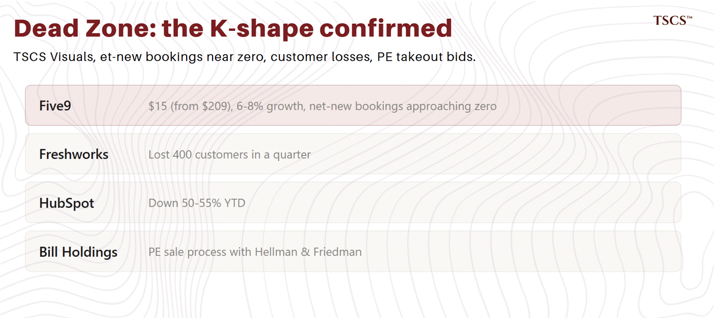](https://substackcdn.com/image/fetch/$s_!9BrN!,f_auto,q_auto:good,fl_progressive:steep/https%3A%2F%2Fsubstack-post-media.s3.amazonaws.com%2Fpublic%2Fimages%2F8985fd0d-6f12-4fdd-9013-43a672a194bb_1404x627.png)

Dan Ives at Wedbush described ServiceNow, Microsoft, and Salesforce on April 6 as “highest quality software names” at 40% discounts, calling cybersecurity “the most disconnected tech trade I’ve seen in my career.”

The Bessemer Cloud Index at approximately 5.5x forward revenue sits at a 55 to 65% discount to its five-year average. The historical base rate from comparable compression: the late-2022 trough preceded roughly 85% returns over 24 months. The March 2020 trough preceded 130 to 140%.

[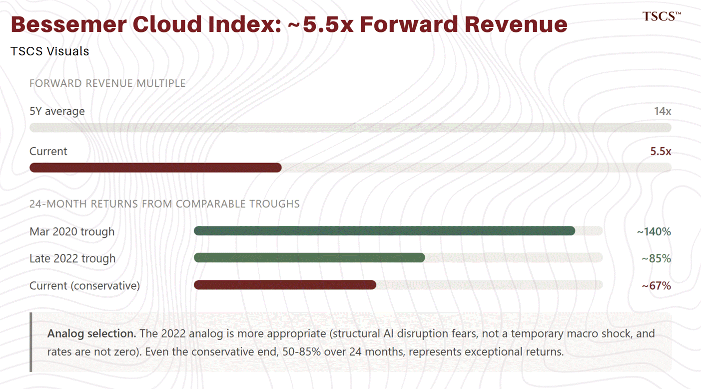](https://substackcdn.com/image/fetch/$s_!vyqq!,f_auto,q_auto:good,fl_progressive:steep/https%3A%2F%2Fsubstack-post-media.s3.amazonaws.com%2Fpublic%2Fimages%2Ff01777ac-9f24-4b67-a086-b484890ae899_1403x780.png)

The 2022 analog is more appropriate (structural AI disruption fears, not a temporary macro shock, and rates are not zero), but even the conservative end, 50 to 85% over 24 months, represents exceptional returns. The problem is timing. The timing is controlled by the plumbing, not the fundamentals.

## Section 5: What I Am Doing

Part 3 defined the positioning for each scenario. The adverse scenario has materialised. Here is the framework applied.

**No new equity in any Fortress Zone name.** The structural selling has overwhelmed the timeframe. Being right about fundamentals and early about timing are indistinguishable when the plumbing is broken.

**I am not selling existing positions.** ServiceNow at $102 with a $2 billion ASR executing is not a stock you sell. Veeva at 19.7x earnings with $6.5 billion in cash is not a stock you sell. The fundamentals do not support selling. The plumbing does not support buying. Hold what you have. Deploy nothing new. Wait for the mechanism to exhaust itself.

**Full BIZD put position.** The BDC maturity wall peaks in Q2 and Q3. KBRA documented $12.7 billion maturing across 23 of 32 rated BDCs. Golub’s $600 million at 2.5% due August, confirmed on Bloomberg with no refinancing announced as of April 8, is the most exposed single maturity in the sector. Each refinancing at 200 to 460 basis points higher crushes NII. If the stress is contained, the puts expire at modest cost. If the maturity wall bites, the payoff is substantial.

**ARCC reduced to half.** The best BDC still faces headwinds when the sector average discount is 22%. ARCC at 0.92x book with 1.8% non-accruals remains the cleanest expression of credit quality. If the stress stays contained, this re-rates first.

**Adobe remains on the watchlist.** CEO Narayen announced his departure March 12. No successor. Forward P/E of 10.4x has not crossed the 10x re-entry threshold. The 52-week low of $233 briefly touched it intraday. I am not lowering the bar.

### The Re-Entry Triggers

[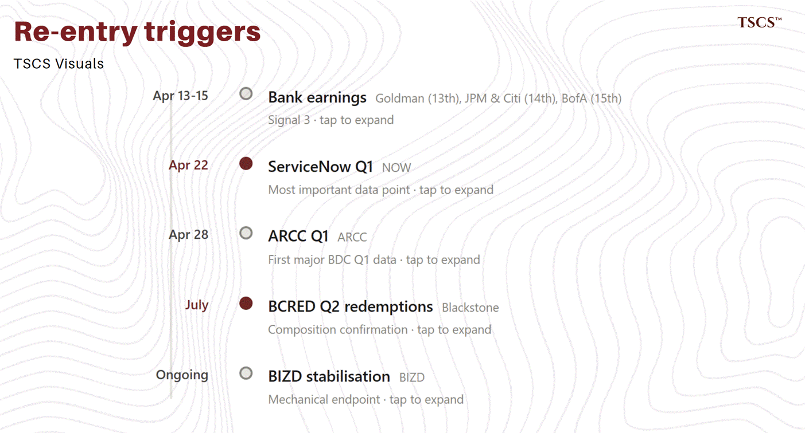](https://substackcdn.com/image/fetch/$s_!3Ehf!,f_auto,q_auto:good,fl_progressive:steep/https%3A%2F%2Fsubstack-post-media.s3.amazonaws.com%2Fpublic%2Fimages%2Fc0cd44e8-0097-4988-ae5f-96fcc7f69a11_1403x756.png)

**April 13 to 15: Bank earnings.** Goldman (13th), JPMorgan and Citi (14th), Bank of America (15th). These resolve Signal 3. I am listening for language on private credit collateral revaluation, software loan exposure, or back-leverage changes. A second major bank confirming discretionary markdowns flips Signal 3 to adverse.

**April 22: ServiceNow Q1.** The most important data point in the next month. Consensus: subscription revenue $3.650 to $3.655 billion (18.5 to 19% CC growth), cRPO growth approximately 20%. If NOW beats and cRPO holds above 20%, the Fortress Zone thesis is confirmed through the adverse scenario. I resume accumulating at half-size. If cRPO decelerates below 18%, the framework needs fundamental revision, not just updated positioning.

**April 28: ARCC Q1.** First major BDC to report Q1 data. Non-accruals below 2.5% and PIK below 10% means managed stress for Tier 1 managers.

**July: BCRED Q2 redemptions.** Below 6% means the wealth-channel wave is cresting. Above 8% means the backstop failed. If Blackstone stops distinguishing between channels, that silence is the answer.

**BIZD: Three consecutive stable weeks.** Mechanical endpoint of the acute phase. We got two in late March before it broke. The next stabilisation attempt is the one to watch.

The logic is sequential. Trigger 2 (April 22) moves me from zero new capital to half-size if positive. Trigger 4 (July) moves me to full-size if composition confirms wealth-channel dominance. If Trigger 2 hits but BIZD makes new lows between April and July, half-size holds but no further deployment until credit confirms. If Trigger 2 misses and Trigger 4 breaks adversely, I reduce existing positions by half and publish a revised framework within two weeks.

[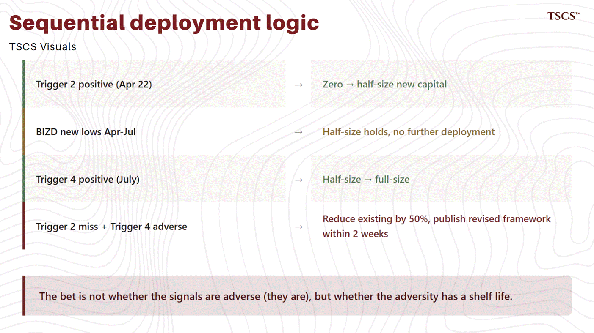](https://substackcdn.com/image/fetch/$s_!OflQ!,f_auto,q_auto:good,fl_progressive:steep/https%3A%2F%2Fsubstack-post-media.s3.amazonaws.com%2Fpublic%2Fimages%2Fc70ea71d-b2e2-4668-926e-8a6cea5e2b02_1403x788.png)

## Section 6: What Hit, What Missed, What Is Next

**Right:** The taxonomy. Five of five Fortress Zone names delivered. The Dead Zone decomposed. CrowdStrike broke through the narrative on Q4 earnings exactly as the framework predicted.

**Right:** The mechanism. The reflexive loop is running. Industry-wide gating confirmed the transmission channel. The CUSIP-level overlap from Part 4 explains why the stress propagates.

**Wrong:** The severity. My base case assumed stress contained to Blue Owl and the weakest managers. Q1 showed industry-wide gating at 15% average. I underestimated the breadth and speed of the wealth-channel redemption wave. The specific analytical failure: Part 2 identified the $34 billion to $222 billion wealth-channel AUM growth but the Part 3 stress scenario did not model a coordinated exit from that pool. The gate arithmetic was right. The assumption that advisers would stagger rather than stampede was wrong.

**Wrong:** The timing on equity ideas. ServiceNow is down 26% from the Part 1 entry. Every Fortress Zone name except Guidewire and Procore is lower than when I told you to buy it. The BIZD puts, initiated in Part 3, have partially offset the drawdown at the portfolio level, but they do not erase the equity timing miss. I owe you a framework that accounts for the mechanism I underestimated, and I owe you the honesty to tell you that the mechanism was in my own prior analysis. I mapped the reflexive loop. I just did not respect its speed.

**Wrong:** The carry breakeven. All-in yields compressed from 10 to 12% to 8.5 to 9.7%. Funding costs rose 200 to 460 basis points. The buffer is thinner than I told you.

I am not going to dress it up. The data contradicted my probability weights, my timing, and my breakeven calculation. It did not contradict the taxonomy, the mechanism, or the direction. The next five weeks hinge on that distinction.

### What comes next

Bank earnings April 13 to 15 resolve Signal 3. ServiceNow Q1 on April 22 confirms or breaks the Fortress Zone. ARCC Q1 on April 28 tests the Tier 1 BDC thesis. Golub on May 4 and Blue Owl’s OBDC on May 7 open the Q1 10-Q window that resolves Signal 5. Proskauer Q1, expected mid-April, tests Signal 4’s specific threshold.

By mid-May, we will know.

I owe you the BDC NAV-versus-software-concentration scatter plot (blocked by Q1 10-Qs, deliverable June), the maturity wall visualisation and NRR trajectory charts (deliverable within one week as a paid subscriber companion), and the Tier 2 private credit deep dive promised in Part 2 (ARCC-focused, deliverable within two weeks of April 28 earnings). I have not forgotten.

The adverse scenario is here. The compositional evidence says it is temporary. The fundamentals say the exit price is generational. The framework says wait. Five weeks.

I would rather miss the first 10% of the recovery by waiting for confirmation than eat another 20% drawdown because I overrode the signals. It is arithmetic. And the arithmetic has been right about the mechanism even when I was wrong about the timing.

Three signals adverse. Five Fortress names delivered. In five weeks this resolves into the buying opportunity of the cycle, or I tear up the playbook.

Either way, I will publish within 48 hours of the data.

[Share](https://tscsw.substack.com/p/trapped-in-private-credit?utm_source=substack&utm_medium=email&utm_content=share&action=share&token=eyJ1c2VyX2lkIjoxNDAwMjQ1LCJwb3N0X2lkIjoxOTM2MDE0MzYsImlhdCI6MTc3ODU0NTM3NCwiZXhwIjoxNzgxMTM3Mzc0LCJpc3MiOiJwdWItMjM1NDI0NCIsInN1YiI6InBvc3QtcmVhY3Rpb24ifQ.Srt3-3LfJAo3EN8SR4bB2VtZziZpRDa9WEqLvHCk_IE)

---

*Disclosure: The author holds long positions in names discussed in this series, a short position in the BDC sector via puts, and a reduced position in one Tier 1 BDC. No Dead Zone exposure. Weight accordingly. This publication is for informational and educational purposes only and does not constitute investment advice, a recommendation, or a solicitation to buy or sell any security. The author is not a registered investment adviser. All investment decisions carry risk, including loss of principal. Readers should conduct their own due diligence and consult a qualified financial professional before making any investment decisions.*