Two assets are supposed to move together when the world falls apart. The dollar and Treasuries. Flight to quality. The most reliable trade in macro.

It broke.

[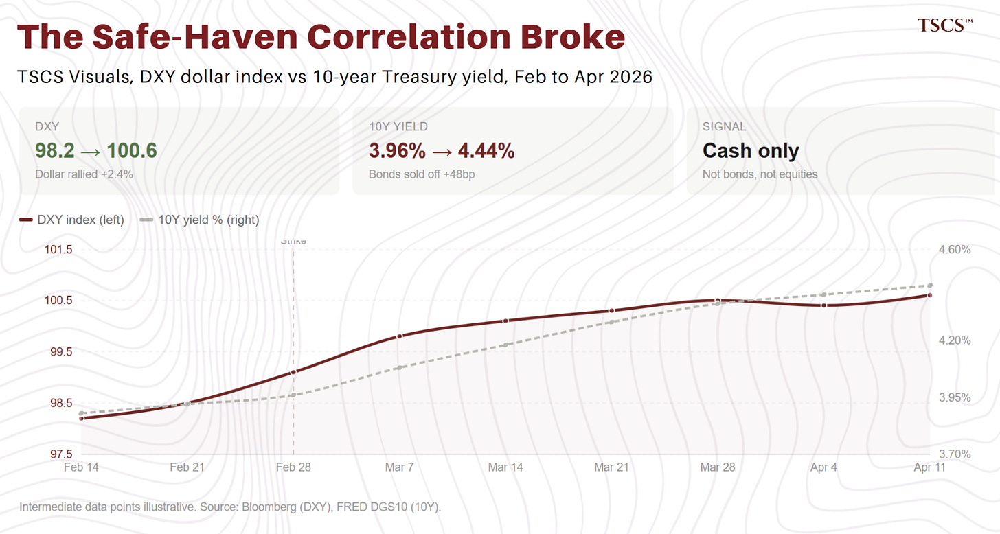](https://substackcdn.com/image/fetch/$s_!CeGI!,f_auto,q_auto:good,fl_progressive:steep/https%3A%2F%2Fsubstack-post-media.s3.amazonaws.com%2Fpublic%2Fimages%2F545a24b5-fe8a-4728-b8d5-b2df69959deb_2048x1094.png)

Since February 28, the day US and Israeli forces struck Iran and the Strait of Hormuz effectively closed, the dollar rallied to 100.64. Standard crisis behavior. Capital fleeing to the reserve currency. Meanwhile the 10-year Treasury yield rose from 3.96% to 4.44%. That is not standard. That is the opposite of standard.

Capital went to dollar cash. Not dollar bonds. Not dollar equities. Cash. The bond market will hold your currency. It no longer trusts your duration.

In five weeks, foreign central banks sold $82 billion in Treasuries. Custody holdings at the New York Fed dropped to $2.712 trillion, the lowest since 2012. The 3-year auction held up fine: 2.68x bid-to-cover, above average. The 30-year earned a D+. Investors will lend America money for three years. Thirty? Increasingly not.

[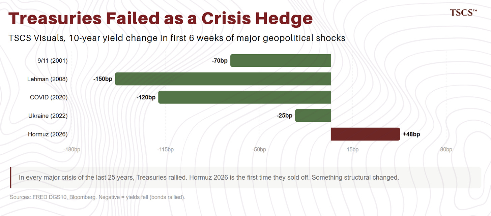](https://substackcdn.com/image/fetch/$s_!pV86!,f_auto,q_auto:good,fl_progressive:steep/https%3A%2F%2Fsubstack-post-media.s3.amazonaws.com%2Fpublic%2Fimages%2F064d25ad-8a09-442a-87b6-7aedb66af669_2048x901.png)

[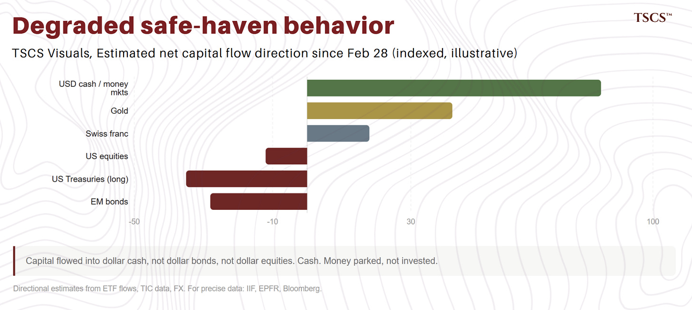](https://substackcdn.com/image/fetch/$s_!JLEf!,f_auto,q_auto:good,fl_progressive:steep/https%3A%2F%2Fsubstack-post-media.s3.amazonaws.com%2Fpublic%2Fimages%2Fa6ef1085-63ce-4df2-baa7-dbe640a3ef90_2048x919.png)

The basis trade, leveraged hedge fund arbitrage that now absorbs $1.5 trillion in Treasury exposure, roughly double its pre-COVID size, bent but didn’t break. Citadel’s Global Fixed Income Fund drew down 8.2% in March. The MOVE index spiked 28% in a single session. Repo held. No mass liquidation. The system survived because the selling was orderly, not panicked.

But here is what the system survived with: dealer balance sheets a quarter of their 2007 relative size, a Fed that cannot intervene without fueling the inflation causing the selloff, and a buyer base where China’s holdings are down 47% from peak, quietly replaced by Cayman-domiciled leverage running 10 to 20x.

The dollar is fine. The debt is not.

In December, we published “How America Goes Bankrupt” and called the basis trade a time bomb. We assigned these risks to a hypothetical future. Hormuz didn’t detonate the bomb. But it armed the detonator, and the building inspector is locked outside.

What follows is the financial transmission mechanism connecting $100+ oil to the structural integrity of the Treasury market itself: the data the bulls and bears are both misreading, the Fed’s impossible bind, the Japan wildcard nobody can size, and the three trades we’re positioning around, with kill switches for when we’re wrong.

Subscribed

## The Twitter Debate That Framed the Question

On April 9, Luke Gromen and Lance Roberts went at it on X. The exchange crystallized two competing frameworks for what the Hormuz crisis means for US assets.

Roberts argued the 1973 oil embargo analogy is wrong. Different economy. The US is the world’s largest crude oil producer at 13.6 million barrels per day. Direct Persian Gulf imports amount to 490,000 barrels per day, roughly 2.5% of consumption. He cited a “stellar” 3-year auction with record foreign demand. Foreign Treasury holdings at record levels. Markets look ahead, not behind.

[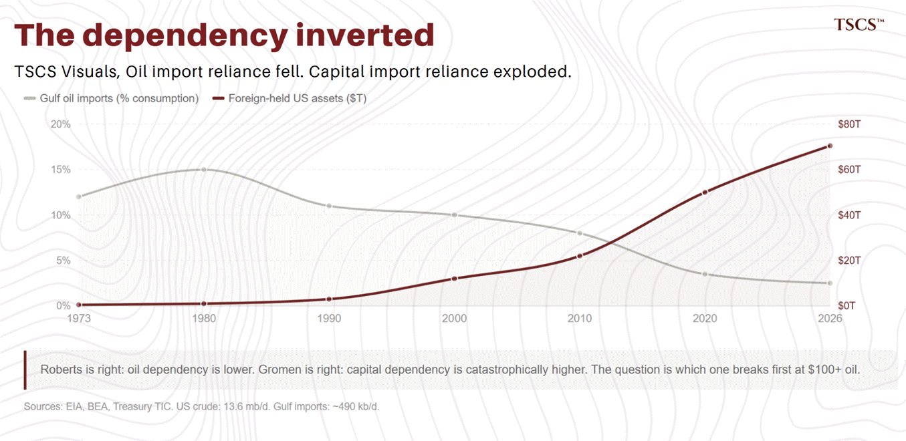](https://substackcdn.com/image/fetch/$s_!Rdco!,f_auto,q_auto:good,fl_progressive:steep/https%3A%2F%2Fsubstack-post-media.s3.amazonaws.com%2Fpublic%2Fimages%2F86e0c479-5d2a-4f76-8301-8768eaf2bacd_1355x660.png)

Gromen fired back with a chart of the US Net International Investment Position. In 1973, the US was a net creditor at roughly +5-10% of GDP. Today the NIIP stands at negative $27.54 trillion, roughly negative 95-98% of GDP, approaching one-to-one parity. Foreign dependence on oil? Lower than 1973, sure. Foreign dependence on capital? The exact opposite. Foreigners hold $70.5 trillion in US assets. If oil stays high enough long enough, Gromen argued, it is a “mathematical certainty” that foreigners sell Treasuries and US equities to fund energy bills.

[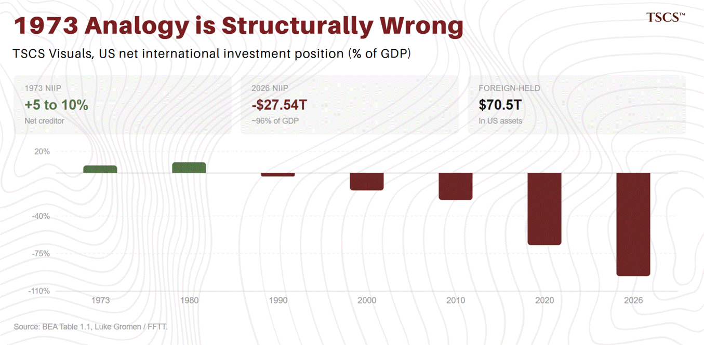](https://substackcdn.com/image/fetch/$s_!WHun!,f_auto,q_auto:good,fl_progressive:steep/https%3A%2F%2Fsubstack-post-media.s3.amazonaws.com%2Fpublic%2Fimages%2F031c1b93-0cc2-4685-ae27-9ec99dc121ab_1355x665.png)

Roberts countered by citing Treasury auction demand and the 4.3% 10-year yield as evidence that markets had already priced the crisis. Gromen fired back: “Markets look ahead, not behind. Also you: just had a stellar 3-year auction with record foreign demand. Why are you quoting two rearview mirror statistics to support your point?”

Clean hit. But “mathematical certainty” is too strong. And both of them missed what the data actually shows.

## What the Data Actually Shows

Gromen is right about the direction. Roberts is right the system hasn’t broken. The data tells a more interesting story than either of them.

Start with custody. The Federal Reserve Bank of New York publishes weekly data on marketable US Treasury securities held in custody for foreign official accounts. Since February 25, those holdings have fallen by $82 billion in five weeks. Total custody holdings dropped to $2.712 trillion, the lowest level since 2012. The FT confirmed it with a headline that should have stopped people cold: “Foreign central banks sell US Treasuries in wake of Iran war.”

[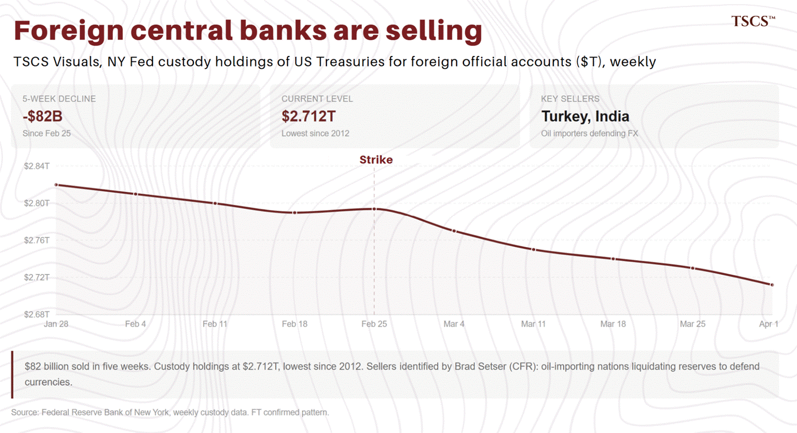](https://substackcdn.com/image/fetch/$s_!BQ1R!,f_auto,q_auto:good,fl_progressive:steep/https%3A%2F%2Fsubstack-post-media.s3.amazonaws.com%2Fpublic%2Fimages%2F09bcf766-1f6c-43e6-b167-72ce8e740770_1355x736.png)

Gromen’s thesis, playing out in real time. Brad Setser at the Council on Foreign Relations identified the sellers: oil-importing nations. Turkey sold $22 billion in foreign government bonds from reserves since February 27, plus 58 tonnes of gold. India, Thailand, and other energy-dependent economies are selling Treasuries to defend their currencies against oil-driven depreciation.

Two things need separating here. The acute selling is textbook FX reserve management: EM central banks liquidating dollar assets to defend currencies during an oil shock. They’ve done this in every energy crisis since the 1970s. That alone is not structural. What is structural is the secular trend underneath: China’s holdings down 47% from peak, India down 15.6% year over year, replaced by Cayman-domiciled leverage. The crisis selling is cyclical. The buyer-base deterioration is not.

But it’s more complicated than that. Roberts cited the 3-year auction. He wasn’t wrong. The April 7 three-year note auction ($58 billion) achieved a bid-to-cover ratio of 2.68x, above the 10-auction average of 2.63x. Bloomberg reported strong demand. That is a real data point.

[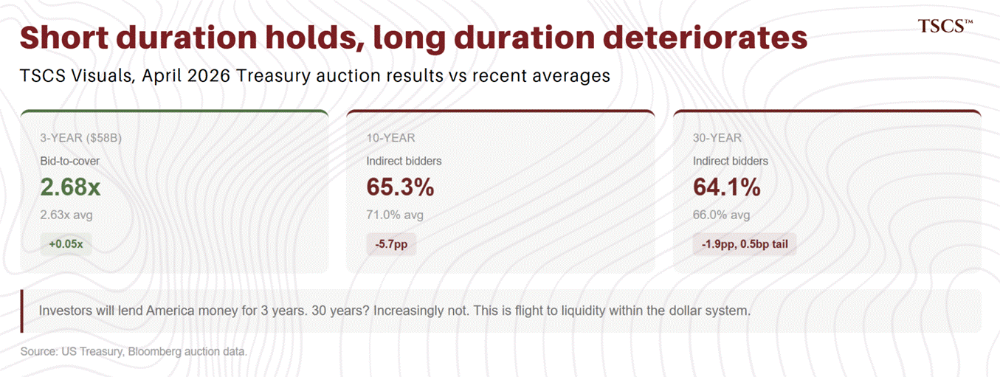](https://substackcdn.com/image/fetch/$s_!RQeb!,f_auto,q_auto:good,fl_progressive:steep/https%3A%2F%2Fsubstack-post-media.s3.amazonaws.com%2Fpublic%2Fimages%2Fdabb4df4-9198-47dc-8954-de0e44a589b3_1355x511.png)

The 10-year auction told a different story. Indirect bidders, the standard proxy for foreign demand, came in at 65.3%, well below the six-auction average of 71.0%. The 30-year auction earned a D+ grade, with indirect bidders at 64.14% versus a 66.0% average and a 0.5 basis point tail.

**The pattern is clean: short-duration auctions are holding up, long-duration auctions are deteriorating**.

That is not confidence. That is a flight to liquidity within the dollar system, and it maps exactly onto the decoupling: trust the dollar, distrust the duration.

The compositional shift underneath is worse. TIC data through January 2026 shows China’s Treasury holdings at $694 billion, down from a 2013 peak of $1.32 trillion. A 47% decline over thirteen years. India dropped to $190 billion, down 15.6% year over year. Brazil fell to $168 billion, down 15.7%.

[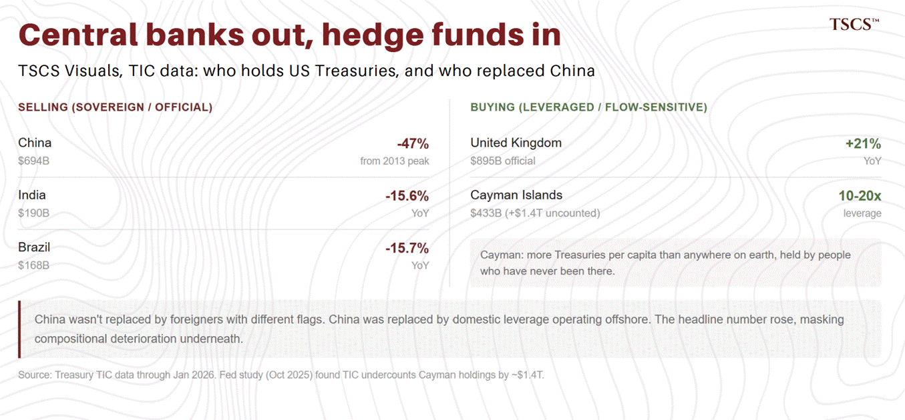](https://substackcdn.com/image/fetch/$s_!MT-y!,f_auto,q_auto:good,fl_progressive:steep/https%3A%2F%2Fsubstack-post-media.s3.amazonaws.com%2Fpublic%2Fimages%2Ff7ae237c-3c41-4f66-ade5-08e44b034349_1355x630.png)

Who replaced them? The United Kingdom rose to $895 billion, up 21% year over year. The Cayman Islands rose to $433 billion. A Fed study from October 2025 found TIC data undercount Cayman-domiciled hedge fund Treasury holdings by roughly $1.4 trillion. The Cayman Islands, population 68,000, is effectively the largest foreign holder of US Treasuries. More Treasuries per capita than anywhere on earth, held by people who have never been there.

Central banks out. Hedge funds in. Patient, price-insensitive holders replaced by leveraged, flow-sensitive intermediaries running 10-20x. And these aren’t even foreign in any meaningful sense. Cayman-domiciled funds are overwhelmingly US domestic capital, pension funds, family offices, endowments, routed offshore by New York and Connecticut GPs for tax and regulatory arbitrage.

China wasn’t replaced by foreigners with different flags. China was replaced by domestic leverage operating offshore. The headline number rose, masking a compositional deterioration underneath. The risk isn’t external dependence. It’s internal financialization.

The foreign-held share of outstanding Treasuries has fallen to 32.4%. The lowest since 1997.

[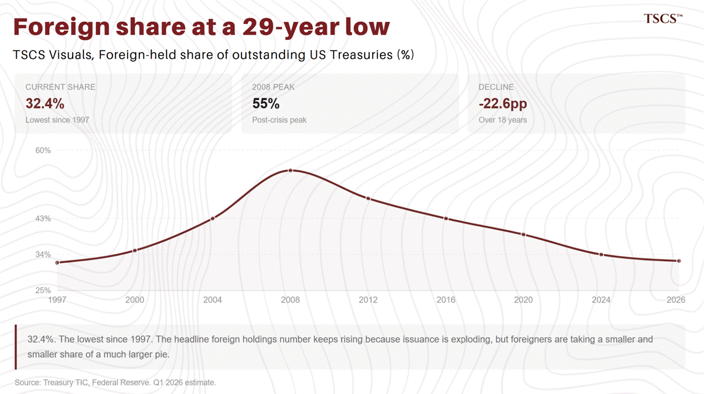](https://substackcdn.com/image/fetch/$s_!fXil!,f_auto,q_auto:good,fl_progressive:steep/https%3A%2F%2Fsubstack-post-media.s3.amazonaws.com%2Fpublic%2Fimages%2F52ea27e6-d21e-4fa3-aa65-edf17e8caaf6_1355x759.png)

El-Erian put it simply: “I’m more worried about inflation than growth, than flight to quality.” That is what a 48bp selloff in the 10-year during a shooting war tells you.

Long-duration Treasuries sold off during a supply-side inflation shock. They did the same in 1973, 1979, and 2022. That part is duration math, not a crisis of confidence. Bills worked fine. The market trusts US sovereign credit, and it correctly repriced duration into an energy shock. What’s different this time is not the direction of the move. It’s the plumbing underneath: a $1.5 trillion basis trade and a Fed that can’t intervene without compounding the problem. The repricing is normal. The fragility absorbing it is not.

Gold didn’t fail. Gold hit $5,595 in January and trades around $4,749 after a 15% pullback, a normal consolidation within a volatile regime shift, consistent with both prior bull markets of this magnitude, each of which saw five corrections of 10% or more. Central bank gold holdings surpassed total foreign official Treasury holdings for the first time in September 2025, reaching $5.1 trillion. The gold/TLT ratio sits at 54.9x. A record.

[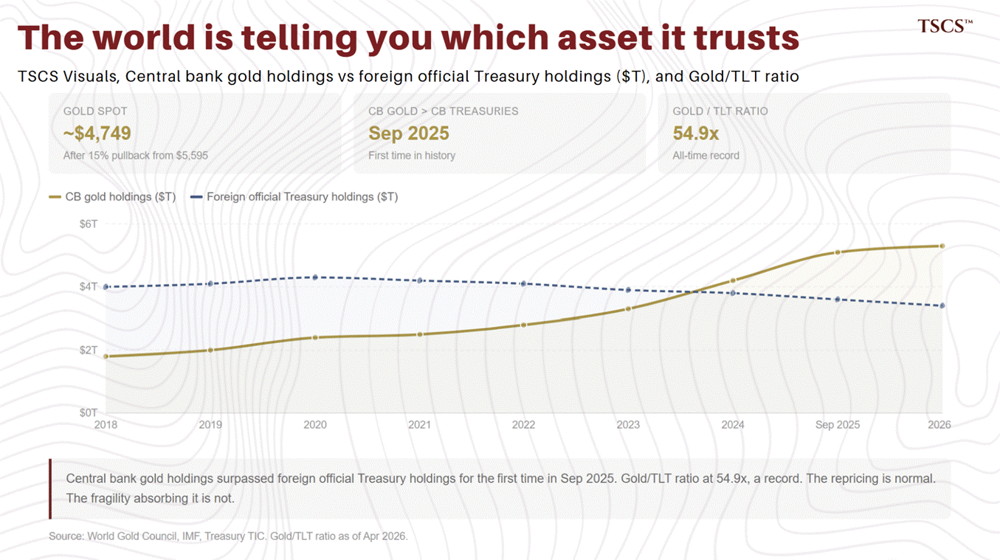](https://substackcdn.com/image/fetch/$s_!gqDr!,f_auto,q_auto:good,fl_progressive:steep/https%3A%2F%2Fsubstack-post-media.s3.amazonaws.com%2Fpublic%2Fimages%2F6404cbdf-4b66-4e7e-9280-6a48aebe6f68_1355x759.png)

The world is telling you which asset it trusts.

[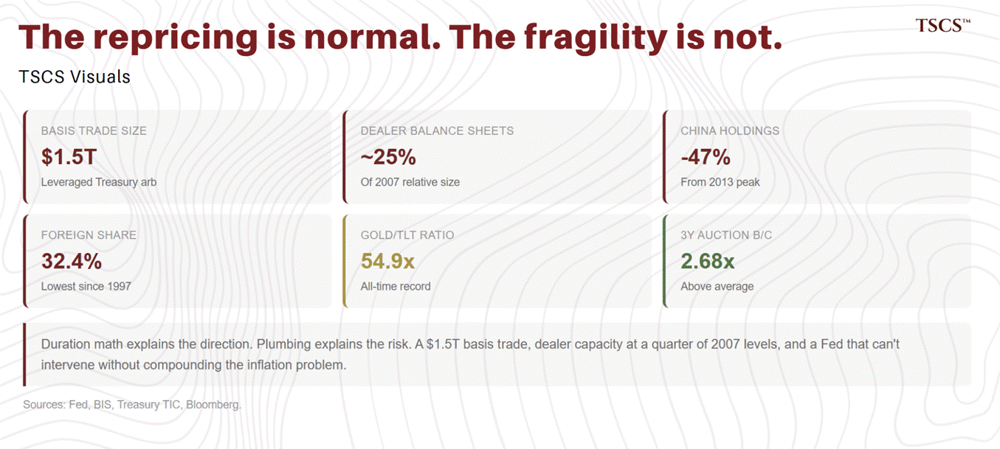](https://substackcdn.com/image/fetch/$s_!O_na!,f_auto,q_auto:good,fl_progressive:steep/https%3A%2F%2Fsubstack-post-media.s3.amazonaws.com%2Fpublic%2Fimages%2F9db3862b-ee8a-4ead-88cc-afffcc8433a5_1355x609.png)

## The December Thesis, Stress-Tested

In December we called the basis trade a time bomb. We cited Gromen’s statistic that 37% of long-term Treasury issuance since January 2022 had been absorbed by leveraged hedge fund arbitrage. The reflexive loop: vol spikes, margins increase, hedge funds dump cash Treasuries, yields spike, vol rises further, more margin calls, more selling. March 2020 was the preview.

The basis trade has roughly doubled since 2020. Morgan Stanley estimated the notional at $1.5 trillion in January 2026, up 75% from its 2019 peak. The BIS, using more granular data, calculated $1.06 trillion in the futures basis trade plus $631 billion in the related cash-swap basis trade, totaling roughly $1.7 trillion in combined relative-value exposure. Pre-COVID, the basis trade peaked at roughly $800 billion. Today’s positions are about twice as large as the ones that nearly broke the Treasury market in March 2020.

[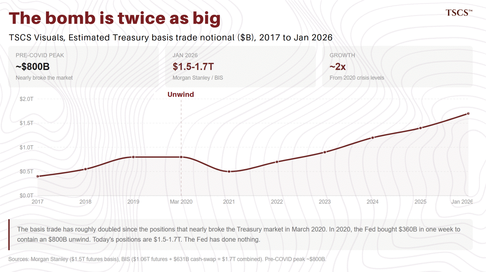](https://substackcdn.com/image/fetch/$s_!DDft!,f_auto,q_auto:good,fl_progressive:steep/https%3A%2F%2Fsubstack-post-media.s3.amazonaws.com%2Fpublic%2Fimages%2Fe2c1a942-ad7b-4896-a8b1-b9a08f2c123b_1355x760.png)

Bloomberg reported that eight or fewer traders account for almost half of all bets against 2-year Treasury futures. A core group of roughly 10 firms, including Citadel, Millennium Management, and ExodusPoint, controls an estimated 70% of hedge fund basis-trade activity. Leverage ranges from 10x to 20x, with some positions reaching higher.

[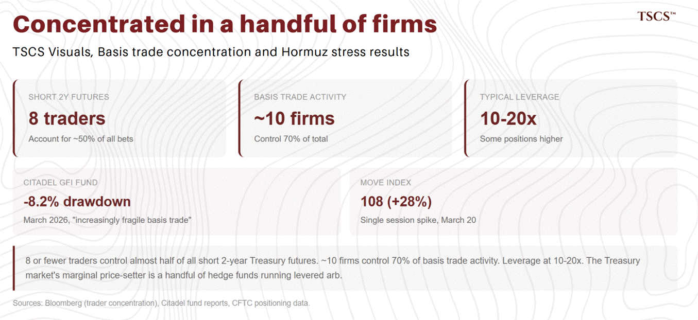](https://substackcdn.com/image/fetch/$s_!y4c2!,f_auto,q_auto:good,fl_progressive:steep/https%3A%2F%2Fsubstack-post-media.s3.amazonaws.com%2Fpublic%2Fimages%2Fde6917b9-ea7c-43f4-82be-b4997aca17a0_1355x622.png)

Hormuz produced real stress. Citadel’s Global Fixed Income Fund suffered an 8.2% drawdown in March, attributed to the “increasingly fragile basis trade” combined with stagflation fears and massive Treasury supply. The MOVE index, measuring Treasury market volatility, rose 28% in a single session on March 20, reaching 108.

[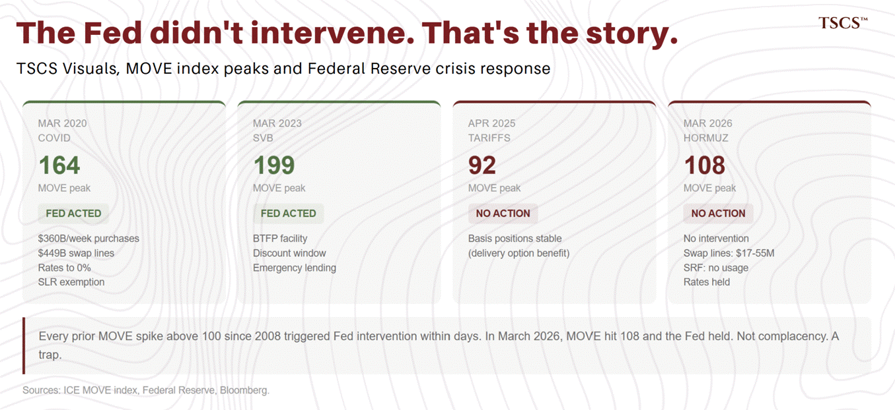](https://substackcdn.com/image/fetch/$s_!1QmR!,f_auto,q_auto:good,fl_progressive:steep/https%3A%2F%2Fsubstack-post-media.s3.amazonaws.com%2Fpublic%2Fimages%2F53b3d1b7-4615-48c8-a40b-f5f2771ae750_1355x622.png)

But the full unwind didn’t happen. Repo stayed functional. No mass forced liquidation. The basis trade bent, didn’t break.

Why?

The Dallas Fed’s July 2025 analysis of the April 2025 tariff shock found basis positions stayed “notably stable” because higher vol actually benefited the delivery option embedded in futures. March 2026 sits between the extremes: worse than April 2025, nowhere near March 2020. The selling was inflation-driven, not liquidity-driven. That distinction is why the market survived.

Now for the uncomfortable part. In March 2020, the basis trade was $800 billion and the unwind required the Fed to purchase $360 billion in Treasuries in a single week, building to nearly $2 trillion across 2020. The Fed also expanded swap lines to $449 billion, cut rates to zero, and temporarily exempted Treasuries from the supplementary leverage ratio.

In March 2026, the basis trade is roughly double that size. The Fed did none of those things.

## The Fed’s Impossible Bind

The MOVE index hit 108 on March 20. Every prior comparable spike since 2008; SVB (190-200), March 2020 (160-170), the Fed intervened within days.

In March 2026, the Fed did not intervene.

Dollar swap line usage stayed trivially small: $17-55 million per week in routine test operations versus $449 billion deployed in 2020. The Standing Repo Facility showed no crisis-related usage. No emergency SLR exemption was issued. The March 17-18 FOMC meeting held rates at 3.50-3.75% with an 11-1 vote and added only that “the implications of developments in the Middle East for the U.S. economy are uncertain.”

[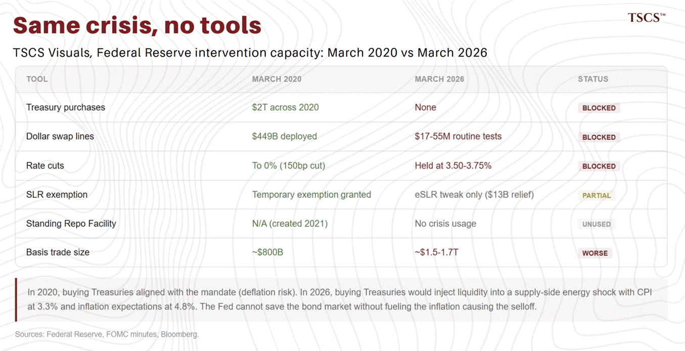](https://substackcdn.com/image/fetch/$s_!oTRp!,f_auto,q_auto:good,fl_progressive:steep/https%3A%2F%2Fsubstack-post-media.s3.amazonaws.com%2Fpublic%2Fimages%2F0e046f10-1d30-4b00-b346-16643d90659a_1355x694.png)

Seven participants, up from six in January, signaled no rate cuts in 2026. The minutes revealed a growing hawkish faction contemplating rate increases if inflation persisted.

Not complacency. A trap.

In 2020, buying Treasuries to restore market functioning aligned perfectly with the policy objective. Economy collapsing, inflation at zero, stimulus the right call. The Fed could save the Treasury market and fulfill its mandate at the same time.

In 2026, buying Treasuries would inject liquidity into an economy facing a supply-side energy shock. Headline CPI at 3.3%, up from 2.4% in February, the sharpest one-month acceleration since the post-COVID reopening. US petrol prices rose 21.2% in March alone, the largest monthly increase since at least 1967. The University of Michigan’s one-year inflation expectations hit 4.8%, up a full percentage point in a single month, Core CPI, stripping out food and energy, edged up only to 2.6% from 2.5%. Meaning the full pass-through from energy into the broader economy has not yet arrived. It will. Intervention would directly conflict with the inflation mandate. The Fed cannot save the bond market without fueling the inflation that is causing the bond market to sell off.

[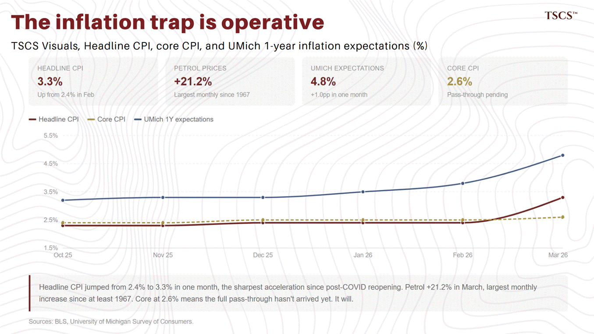](https://substackcdn.com/image/fetch/$s_!77Vo!,f_auto,q_auto:good,fl_progressive:steep/https%3A%2F%2Fsubstack-post-media.s3.amazonaws.com%2Fpublic%2Fimages%2F506ceb05-808d-4953-9314-03417f7b972a_1355x763.png)

We described this trap in December as a hypothetical. It is now operative.

The eSLR recalibration effective April 1 provides a thin cushion: roughly $13 billion in reduced Tier 1 requirements at the GSIB holding company level and $219 billion at the subsidiary level. Powell backed a full Treasury SLR exemption in February congressional testimony. Governor Bowman stated that Treasury illiquidity “could be partially attributed to the increase in leverage-based capital requirements.” After their comments, the 10-year swap spread moved from negative 46bp to negative 37bp.

[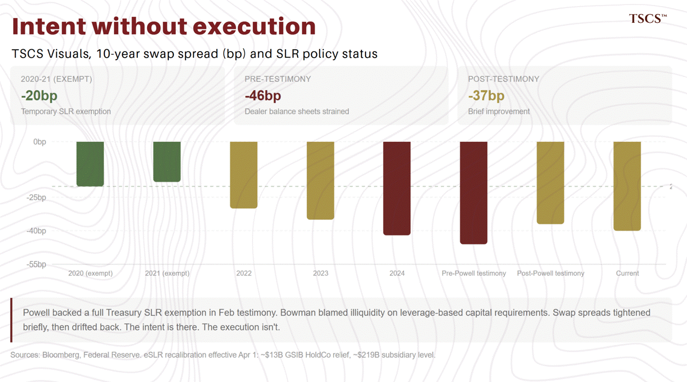](https://substackcdn.com/image/fetch/$s_!G0zl!,f_auto,q_auto:good,fl_progressive:steep/https%3A%2F%2Fsubstack-post-media.s3.amazonaws.com%2Fpublic%2Fimages%2F49ed9448-bf26-409d-8e57-b2e534b87073_1355x754.png)

But no exemption has materialized. Swap spreads remain far from the negative 20bp seen during the 2020-21 temporary exemption. The intent is there. The execution isn’t.

Steven Blitz at TS Lombard: “Whatever happens with the ceasefire, there will be a risk premium in energy prices that did not exist before the war.” The ceasefire does not free the Fed. A permanent energy risk premium keeps inflation expectations elevated regardless of the headline oil price. As we wrote in the oil piece in March: the Fed is the last actor with a functional lever, and deploying it risks permanently impairing the institution’s future effectiveness. That applies here with even more force.

## Japan: The Wildcard Nobody Can Size

JGB 10-year yields hit 2.43% on April 7. Highest since 1999.

Japan is the largest foreign holder of US Treasuries at $1.225 trillion. Rising domestic yields are only half the gravitational pull. The other half is FX-hedged returns. With US short-term rates at 3.50-3.75% and the yen crushed by the oil shock, the cost of hedging dollar exposure via cross-currency basis swaps eats the entire Treasury yield.

[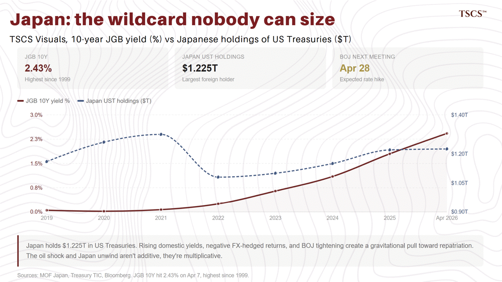](https://substackcdn.com/image/fetch/$s_!nSGu!,f_auto,q_auto:good,fl_progressive:steep/https%3A%2F%2Fsubstack-post-media.s3.amazonaws.com%2Fpublic%2Fimages%2Fd8bf13ba-921b-4918-bf97-2f4ae2652650_1355x763.png)

Japanese life insurers don’t look at nominal JGB yields in isolation. They look at the hedged return on their foreign bond book, and that number is deeply negative. The repatriation incentive is independent of Hormuz and stronger than nominal yields alone suggest.

Citigroup warned that JGB turmoil could trigger up to $130 billion in US Treasury selling from risk parity funds alone. Japanese life insurers facing an estimated $60 billion in unrealized losses on legacy bond portfolios are under pressure to retreat from foreign markets. The BOJ’s expected rate hike on April 28 could accelerate these dynamics.

To be fair: actual large-scale repatriation hasn’t materialized yet. As of late 2025, Japanese institutions were still net buyers of Treasuries, just at a decelerating pace. TMS Capital Research assessed that “meaningful outflows may not materialize until late 2026 or 2027.”

“Not yet” is doing a lot of work there. The BOJ meets in eighteen days.

Japan is not a Hormuz variable. It’s a structural variable that Hormuz compounds. Higher oil prices weaken the yen. A weaker yen increases the pressure on the BOJ to tighten. Tighter Japanese monetary policy increases the incentive to repatriate. The oil shock and the Japan unwind aren’t additive. They’re multiplicative.

[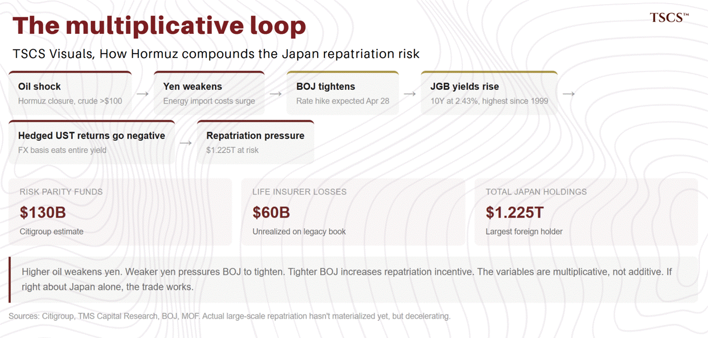](https://substackcdn.com/image/fetch/$s_!dUbY!,f_auto,q_auto:good,fl_progressive:steep/https%3A%2F%2Fsubstack-post-media.s3.amazonaws.com%2Fpublic%2Fimages%2F8609d5c1-d521-4e97-90b6-8f25c0abd197_1355x648.png)

If I’m wrong about everything else but right about Japan, the trade works. If I’m right about everything else but wrong about Japan, it works less well but still works. Japan is the amplifier, not the thesis. But it’s an amplifier that could make the thesis look conservative.

## Dealer Capacity: The Structural Ceiling Nobody Discusses

Since 2007, primary dealer balance sheets relative to Treasuries outstanding have shrunk by a factor of nearly four. Outstanding Treasuries reached $30.6 trillion in February 2026. Dealer gross Treasury positions sit around $820-900 billion. Bianco on the plumbing: “The funding markets, the repo market and everything else, what is their purpose? To finance the 38, 39 trillion dollar Treasury market. They’re not big enough to do that.”

[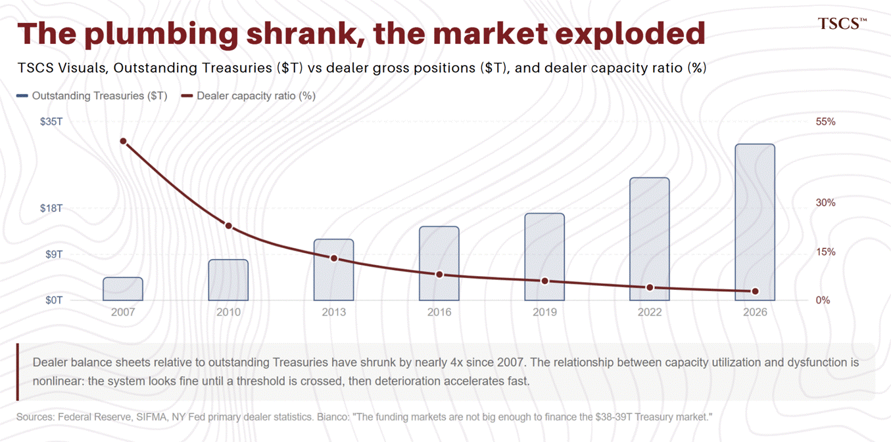](https://substackcdn.com/image/fetch/$s_!-6WD!,f_auto,q_auto:good,fl_progressive:steep/https%3A%2F%2Fsubstack-post-media.s3.amazonaws.com%2Fpublic%2Fimages%2F222cac15-cf03-4372-83a8-03fcff4accad_1355x674.png)

The key risk is nonlinear. The relationship between dealer capacity utilization and market dysfunction is not smooth. Duffie documented this at Jackson Hole in 2023: the system looks fine until a threshold is crossed, then deterioration accelerates fast. In 2020, Treasury liquidity was far worse than yield vol alone would predict. The signature of overwhelmed dealer capacity.

In March 2026, illiquidity tracked vol proportionally. Stressed but not overwhelmed. The system held.

In March 2020, an estimated 20-30% of basis positions were liquidated (the Fed’s $360 billion in purchases absorbed selling from all sources, not just basis traders). A comparable partial unwind of today’s $1.5 trillion would generate $300-450 billion in selling pressure. Combined with investment fund liquidations, total flow in a severe scenario could reach $500-700 billion. Private-sector dealer capacity can absorb an estimated $150-250 billion during stress. The gap between potential flow ($500-700 billion) and absorption capacity ($150-250 billion) is where the Fed becomes the only buyer.

That unambiguously requires Fed intervention. The same Fed that cannot intervene without fueling inflation.

[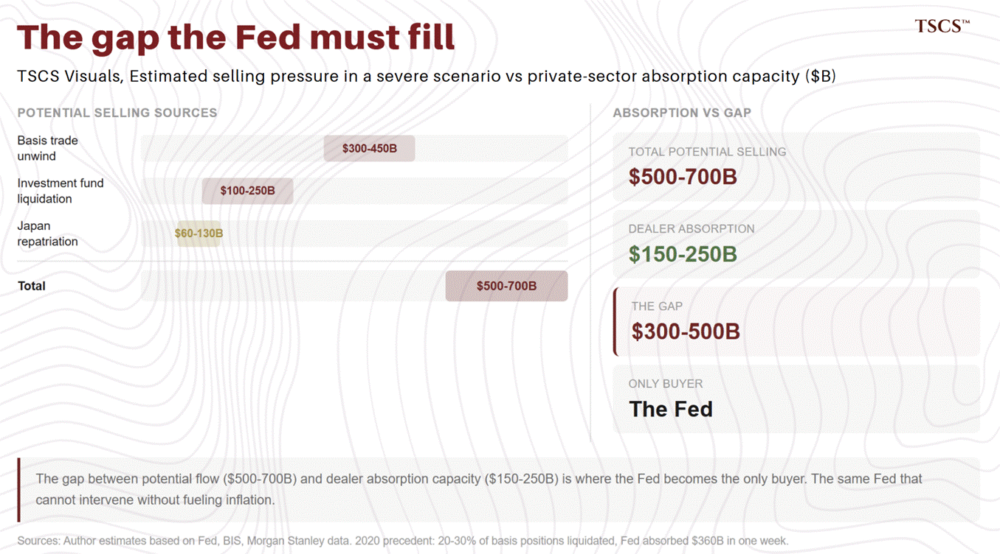](https://substackcdn.com/image/fetch/$s_!cbG_!,f_auto,q_auto:good,fl_progressive:steep/https%3A%2F%2Fsubstack-post-media.s3.amazonaws.com%2Fpublic%2Fimages%2F78e27f83-de62-4a02-9c6b-73f3df681fb4_1355x752.png)

Stein and Kashyap, in their March 2026 IMF piece: “Episodes of Treasury market dysfunction are not a random bolt from the blue. Rather, they are a consequence of a market structure that relies on leveraged balance sheet intermediation to absorb a rapidly growing supply of government debt.”

The market structure is the vulnerability, and it has roughly doubled since the last time it was tested.

[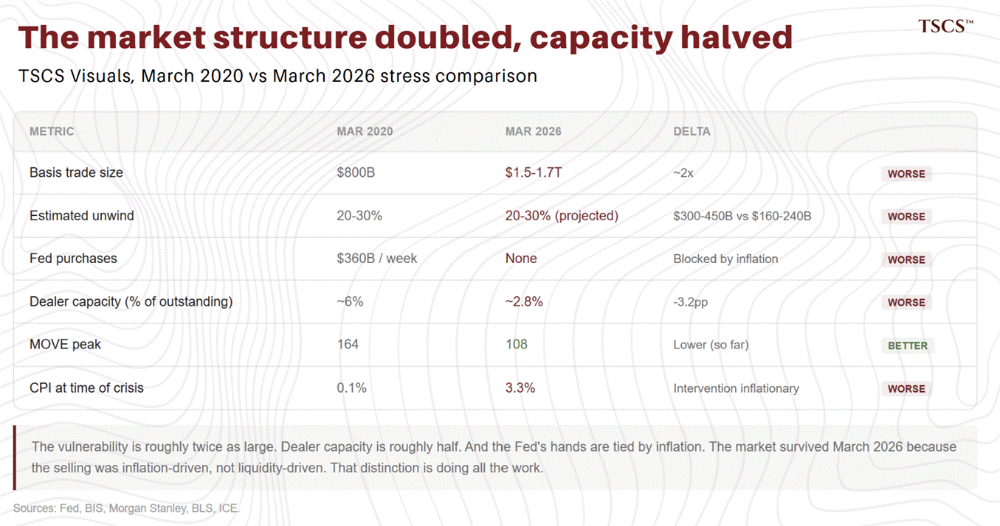](https://substackcdn.com/image/fetch/$s_!arTx!,f_auto,q_auto:good,fl_progressive:steep/https%3A%2F%2Fsubstack-post-media.s3.amazonaws.com%2Fpublic%2Fimages%2F5d84016b-51b8-4125-8e21-9f9eacaf6c6f_1355x714.png)

[Share](https://tscsw.substack.com/p/cash-not-bonds?utm_source=substack&utm_medium=email&utm_content=share&action=share&token=eyJ1c2VyX2lkIjoxNDAwMjQ1LCJwb3N0X2lkIjoxOTM5MDMxMTYsImlhdCI6MTc3ODU0NTM1NSwiZXhwIjoxNzgxMTM3MzU1LCJpc3MiOiJwdWItMjM1NDI0NCIsInN1YiI6InBvc3QtcmVhY3Rpb24ifQ.yIaxoxit16v9Fw-9-Oa9XkB_Z6B1miOjAs0jLplmQqo)

## Three Paths to Resolution

Same framework from Part IV: The Grind, The Snap, The Drag. Those scenarios were built around physical oil supply. They map onto the Treasury stress, with an added dimension.

[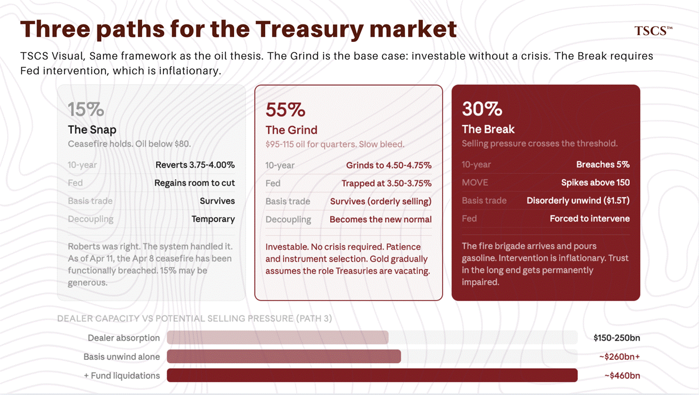](https://substackcdn.com/image/fetch/$s_!rFew!,f_auto,q_auto:good,fl_progressive:steep/https%3A%2F%2Fsubstack-post-media.s3.amazonaws.com%2Fpublic%2Fimages%2F7366d05b-eabc-4838-8744-a8184fe08436_1352x764.png)

### Path 1: Geopolitical normalization. The Snap resolves the Treasury stress.

Probability: 15%, unchanged from Part VII.

If the April 8 ceasefire holds, Hormuz reopens durably, and oil retreats below $80, the inflation premium that drove the Treasury selloff evaporates. The Fed regains the ability to cut. Foreign central banks stop selling Treasuries to defend currencies because their currencies stop depreciating. The 10-year reverts toward 3.75-4.00%. The basis trade survives. The structural vulnerabilities remain but are not tested further this cycle.

In this scenario the decoupling was temporary, crisis-specific, and resolves when the crisis does. Roberts was right. The system handled it.

As of April 11, the April 8 ceasefire has been functionally breached. Shipping intelligence confirms the Strait remains a hot zone. This probability may be generous. 15% because the Strait remains effectively closed, oil stays above $100, and the physical recovery thesis from Part VII (mine clearance, insurance repricing, tanker queues, refinery cold-starts) means even a ceasefire doesn’t normalize prices quickly.

[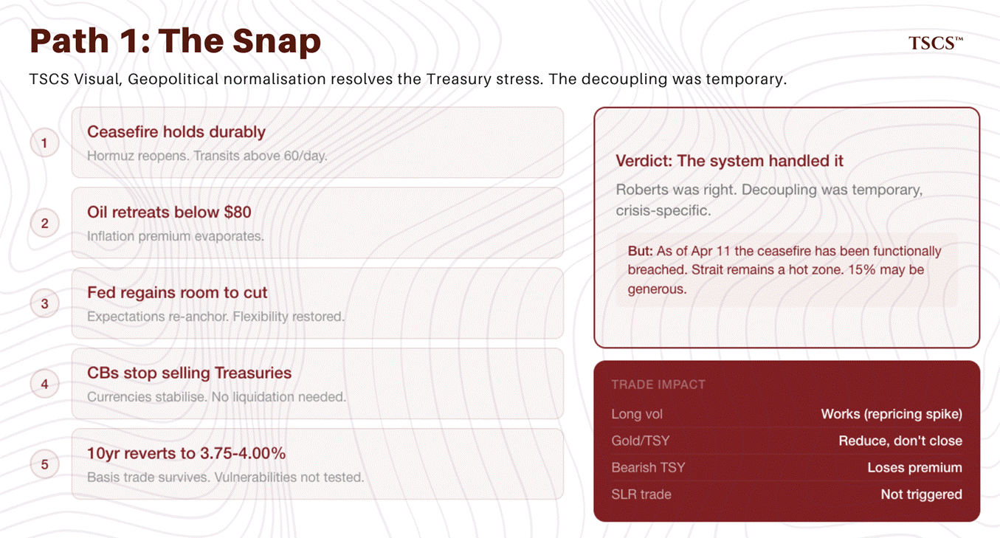](https://substackcdn.com/image/fetch/$s_!11yM!,f_auto,q_auto:good,fl_progressive:steep/https%3A%2F%2Fsubstack-post-media.s3.amazonaws.com%2Fpublic%2Fimages%2Faa4193ca-4872-456c-9b42-49c59eec0855_1355x729.png)

### Path 2: The Grind continues. Slow bleed, no break.

Probability: 55%.

Oil stays in the $95-115 range for quarters. The permanent risk premium Blitz describes keeps one-year inflation expectations anchored near 4.8% even if Brent drifts to $95. The Fed holds rates at 3.50-3.75%, unable to cut (inflation expectations unanchored) and unwilling to hike (consumer sentiment at record lows, growth at stall speed). Foreign central bank selling continues at a lower pace as currency pressures persist but do not intensify. The basis trade survives because the selling pressure remains orderly, not panicked.

The 10-year yield grinds toward 4.50-4.75%. Long-duration Treasuries continue to underperform. The gold/Treasury ratio continues to widen. The compositional shift in the buyer base accelerates: more hedge funds, fewer central banks, more leverage, less stability. The SLR exemption eventually passes and provides modest relief.

Structural deterioration continues but never reaches the breaking point. The decoupling becomes the new normal: the dollar retains reserve status, Treasuries lose safe-haven status, gold gradually assumes the role Treasuries are vacating.

This is investable. No crisis required. Patience and instrument selection.

[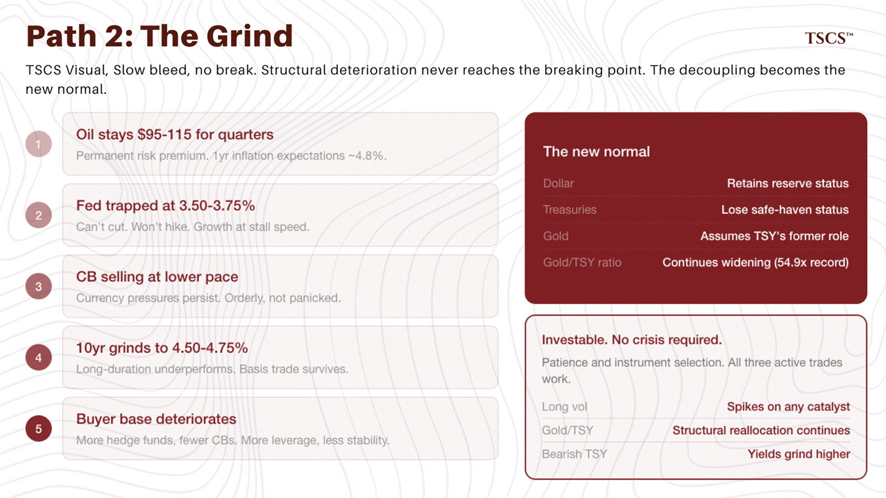](https://substackcdn.com/image/fetch/$s_!INHQ!,f_auto,q_auto:good,fl_progressive:steep/https%3A%2F%2Fsubstack-post-media.s3.amazonaws.com%2Fpublic%2Fimages%2F13cee52c-09a3-4908-89ba-7ee69b31c6f8_1355x762.png)

### Path 3: The stress crosses the threshold. The basis trade breaks.

Probability: 30%.

Foreign selling continues at $16-18 billion per week for another 4-8 weeks. A further deterioration in repo funding conditions or margin requirement increases pushes cumulative pressure into the $250-460 billion zone where private dealer capacity exhausts. The reflexive loop fires: selling drives yields higher, higher yields increase volatility, higher volatility triggers margin calls, margin calls force more selling.

The 10-year breaches 5%. MOVE spikes above 150. The basis trade, now at $1.5 trillion, begins a disorderly unwind that dwarfs the 2020 episode. The Fed faces the nightmare: intervene to prevent a Treasury meltdown while a supply-side energy shock drives inflation above target.

[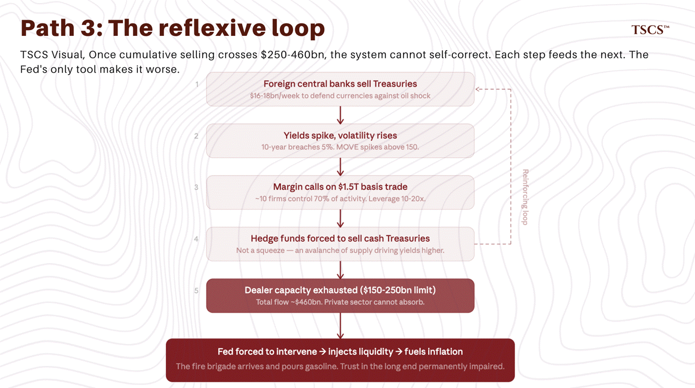](https://substackcdn.com/image/fetch/$s_!oSJM!,f_auto,q_auto:good,fl_progressive:steep/https%3A%2F%2Fsubstack-post-media.s3.amazonaws.com%2Fpublic%2Fimages%2Fe9395a95-d5b6-413e-b120-67d1e4a45234_1355x758.png)

The Fed intervenes. No choice. The fire brigade arrives and pours gasoline on the building because that’s all they brought. The intervention is inflationary, which is exactly how trust in the long end gets permanently impaired.

Gromen’s comparison to July 2007 applies here. “We’re gonna look back in June or twelve months and say February 2026 was like July 2007.” His analogy may be early. But the fragilities he and the institutional researchers identify aren’t hypothetical. They’re measured, documented, and larger than they’ve ever been.

## The Trades

Three trades. Ranked by conviction.

### Highest conviction: long rates volatility.

MOVE sits at 74. The long-term average is 103. It peaked at 108 on March 20 before retracing sharply. Swaption implied volatility on the 10-year is at 66 basis points annualized, characterized by the Treasury Borrowing Advisory Committee as “a historically low reading.” MSCI Research flagged in April that implied volatility, realized volatility, and yield dispersion have diverged, a pattern that “has rarely persisted for long” and “may foreshadow a sudden dislocation.”

The market is pricing calm. The 10-year traded an 84 basis point range year to date. The basis trade is $1.5 trillion. Foreign central banks sold $82 billion in five weeks. The BOJ meets in eighteen days. The April 15 TIC release drops in five days.

Vol is cheap. The catalysts are imminent and identified.

[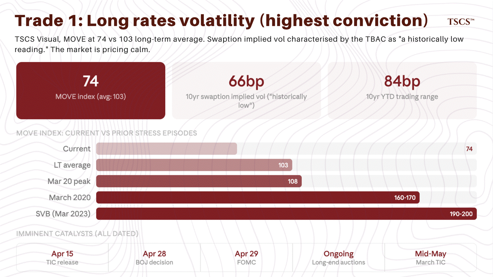](https://substackcdn.com/image/fetch/$s_!Mn_n!,f_auto,q_auto:good,fl_progressive:steep/https%3A%2F%2Fsubstack-post-media.s3.amazonaws.com%2Fpublic%2Fimages%2F430ac2de-4ea5-41e4-8105-7c716cc2a765_1354x761.png)

Instrument: Treasury straddles on TLT or Treasury futures options for symmetric vol exposure. Strangles work if you want exposure to both directions at cheaper premium, though you pick OTM strikes on each side.

For a directional bet on the yield blowout specifically, ratio put backspreads on TN (sell one near-the-money put, buy two further OTM puts) offer convex payout if the move overshoots, roughly 4:1 at the tail, but these are asymmetric, they pay on a selloff, not a rally.

Constraint: COT data shows net positioning at the 8th percentile of the 5-year range, with gross shorts near the 92nd percentile, a crowding score of 84/100. But leveraged money is short futures against long cash Treasuries in the basis trade. They are not naked short. If the trade breaks, there is no squeeze. They are forced to sell their cash bonds, creating an avalanche of supply that drives yields higher, not lower. The asymmetric expression is long vol, not short bonds. Straddles and strangles pay whether the move is up or down. Backspreads pay only on the blowout.

Works in all three paths. In the Snap, MOVE spikes on the repricing lower. In the Grind, it spikes on any of the identified catalysts (TIC, BOJ, auction failures). In Path 3, it spikes to 150+ and the options are worth multiples of the premium.

Cost of being wrong: the premium. At current vol, historically cheap.

### High conviction: gold/Treasury ratio as a structural position.

The gold/TLT ratio at 54.9x is a record. The 30-day gold/real-yield correlation has flipped to +0.18 versus a historical baseline of negative 0.45. Gold is rising despite positive real yields of 1.78% on 10-year TIPS. That violates a relationship that held for decades.

The driver isn’t cyclical. Central bank gold reserves surpassed foreign official Treasury holdings for the first time in September 2025. Central banks purchased 150 tonnes in January 2026 alone. The dollar’s share of global FX reserves has fallen to 56.92%, a two-decade low. Gold’s share has risen to 12.5%.

Instrument: long GLD or gold futures, short TLT. The 15% gold pullback from January highs reduces the nominal cost of the long leg. But the ratio itself sits at 54.9x, a record, because TLT sold off harder than gold. You are not buying a discount. You are buying momentum in a ratio that has broken out above every prior high. The entry is better in gold terms, not in ratio terms. Size accordingly.

This trade works in the Grind (the structural reallocation continues) and in Path 3 (gold spikes on crisis while Treasuries sell off). It underperforms in the Snap if oil collapses, the Fed cuts, and duration rallies while gold gives back its crisis premium.

I’d reduce but not close in the Snap, because the structural driver, central bank reserve reallocation, is independent of the oil price.

J.P. Morgan forecasts gold averaging $5,055 per ounce by Q4 2026 with upside to $6,000 on accelerated de-dollarization. VanEck notes that both prior bull markets of comparable magnitude (1976-1980 and 2001-2011) experienced five corrections of 10% or more. The current cycle is on its second.

[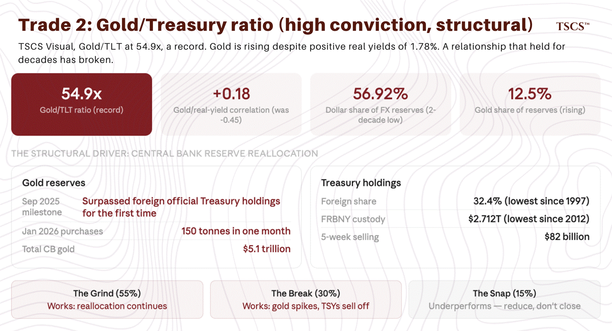](https://substackcdn.com/image/fetch/$s_!ExeR!,f_auto,q_auto:good,fl_progressive:steep/https%3A%2F%2Fsubstack-post-media.s3.amazonaws.com%2Fpublic%2Fimages%2F27f3f20f-f022-485e-9aa8-76889a45faf7_1352x732.png)

### Moderate conviction: defined-risk bearish Treasury structures.

Not naked shorts. Put spreads on TLT or payer swaption spreads.

The 30-year yield at 4.893% is approaching the 5% psychological level. The March FOMC minutes revealed that some officials favored “additional increases” if inflation persists. Rate hikes are explicitly on the table. Fed funds futures show a 2.1% probability of a hike at the April 29 meeting. Small but nonzero. That was zero six weeks ago.

Instrument: TLT put spreads at strikes around $83-78 (the 52-week low is $83.29). Or payer swaptions struck at 4.75% and 5.00% on the 10-year. With the spot swap rate at roughly 3.98% (the 4.44% Treasury yield minus the 46bp negative swap spread), these strikes are 77bp and 102bp out of the money respectively. At current swaption vol (66bp annualized), the 4.75% strike is roughly 1.2 standard deviations out, the 5.00% strike roughly 1.5. Further out than Treasuries at the same headline yield, because negative swap spreads push the reference rate lower. The 10-year hit 4.44% two weeks ago and 5.00% in October 2023.

Constraint, and the reason this is moderate rather than high conviction: in an orderly market without a basis trade unwind, the massive net short futures positioning can squeeze violently on any bullish catalyst, a surprise cut, an oil collapse, a geopolitical resolution. The squeeze risk applies in the Snap scenario specifically, where the basis trade survives intact and shorts get run over. In Path 3, the squeeze doesn’t fire because the cash bond selling overwhelms.

But if you’re wrong about which path you’re in, defined risk structures cap the damage. Max loss is the premium, upside is substantial if the 10-year grinds toward 5%.

This trade works in the Grind and in Path 3. It loses premium in the Snap.

[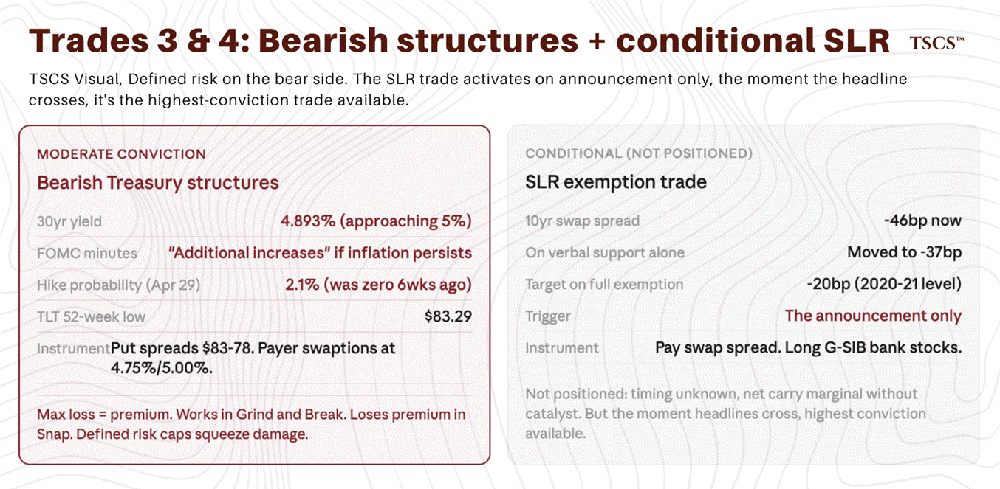](https://substackcdn.com/image/fetch/$s_!eI4n!,f_auto,q_auto:good,fl_progressive:steep/https%3A%2F%2Fsubstack-post-media.s3.amazonaws.com%2Fpublic%2Fimages%2F192be425-4fdc-444c-9867-c617f77e59b8_1354x663.png)

### The SLR exemption trade (conditional).

If the Fed announces a Treasury SLR exemption, the trade is: pay the swap spread (long off-the-run Treasuries, pay fixed on the swap), betting on the spread narrowing from negative 46bp toward negative 20bp as dealer balance sheet relief narrows the cash-swap basis. Long bank stocks, especially G-SIBs. The 10-year swap spread already moved from negative 46bp to negative 37bp on Powell and Bowman’s verbal support alone. An actual exemption drives it further toward negative 20bp and stabilizes the basis trade.

Conditional position. The trigger is the announcement. The gross carry is positive: you receive the Treasury yield and pay the lower swap rate, netting roughly 46 basis points on the fixed legs.

The floating legs (receive SOFR on the swap, pay SOFR in repo) largely cancel in normal conditions. One caveat worth stating plainly: if dealer capacity exhausts and Treasury repo detaches from SOFR, that assumption breaks and the funding mismatch can eat the fixed carry overnight. This trade requires functioning repo. If you believe Path 3 is imminent, the carry logic doesn’t hold. For accounts with clean repo access in the Grind scenario, the trade pays you to wait. In Path 3, lock financing via term repo or don’t put it on.

The reason I’m not in it is simpler than funding mechanics: the timing is unknown, the SLR exemption has no scheduled catalyst, and I’d rather deploy the capital into vol where the catalysts are dated and imminent. But the moment the headlines cross, this becomes the highest-conviction trade available.

## Kill Switches: When I Am Wrong

[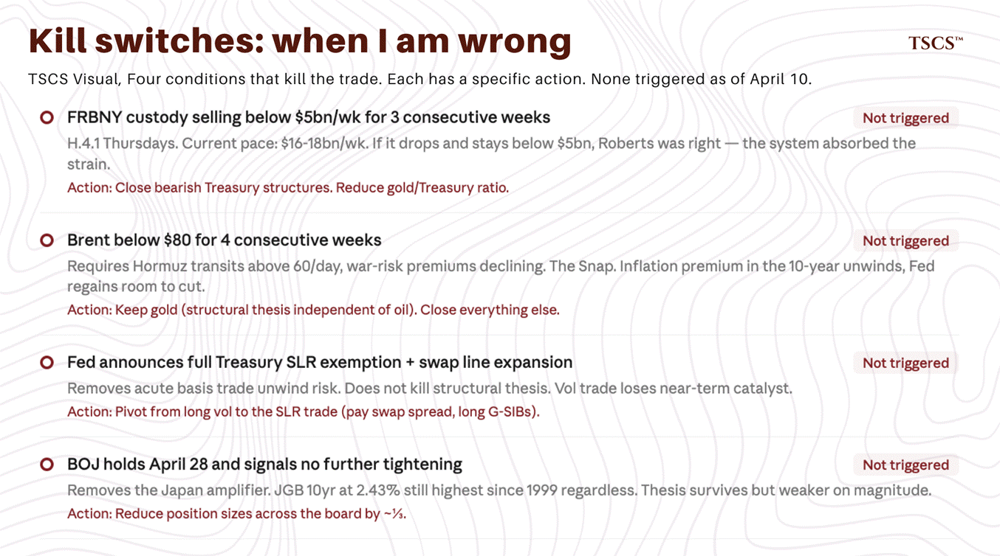](https://substackcdn.com/image/fetch/$s_!ELpY!,f_auto,q_auto:good,fl_progressive:steep/https%3A%2F%2Fsubstack-post-media.s3.amazonaws.com%2Fpublic%2Fimages%2Ffee5252f-3eb4-454c-9458-fb8f3c73150a_1354x754.png)

**1. Weekly FRBNY custody data decelerates below $5 billion per week for three consecutive weeks**. The Thursday H.4.1 release is the real-time heartbeat of this thesis. If the pace drops from $16-18 billion to below $5 billion and stays there, the acute pressure is fading and Roberts was right that the system absorbed the strain. I’d close the bearish Treasury structures and reduce the gold/Treasury ratio. A note on the April 15 TIC release: February 28 was a Saturday. The US bond market was closed. End-of-month portfolio balances locked on Friday February 27, before the first strike. The February TIC data captures zero days of crisis selling because the crisis hadn’t started during market hours. The March data, released in mid-May, is the first genuine country-level read on wartime flows. Do not trade off the April 15 number. It will produce a false negative.

**2. Oil falls below $80 sustainably.** If the ceasefire produces a genuine normalization, with Hormuz transits above 60 per day, war-risk premiums declining, and Brent below $80 for four consecutive weeks, the inflation premium in the 10-year unwinds and the Fed regains room to cut. The Snap. I keep the gold position (the structural thesis is independent of oil) but close everything else.

**3. The Fed announces a full Treasury SLR exemption and expands swap lines.** This does not kill the structural thesis, but it removes the acute risk of a basis trade unwind by expanding dealer capacity and providing a pressure valve. The vol trade loses its near-term catalyst. I would pivot from long vol to the SLR trade described above.

**4. The BOJ holds on April 28 and signals no further tightening.** This removes the Japan amplifier. The thesis survives but becomes less compelling on magnitude. I would reduce position sizes across the board by roughly a third.

None of these kill switches has triggered as of April 10.

## What I’m Watching

*Weekly monitoring framework:*

[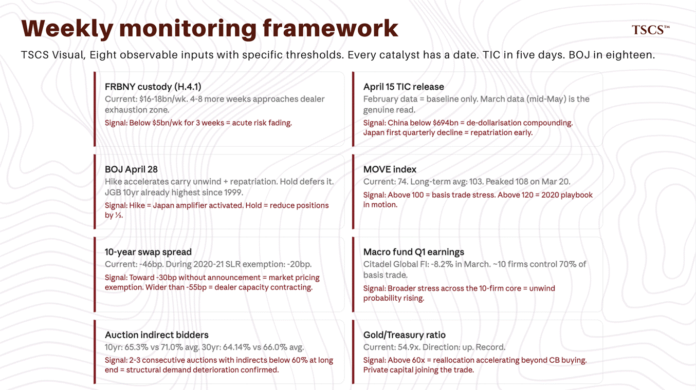](https://substackcdn.com/image/fetch/$s_!xKcv!,f_auto,q_auto:good,fl_progressive:steep/https%3A%2F%2Fsubstack-post-media.s3.amazonaws.com%2Fpublic%2Fimages%2Fe9b516fd-a10a-449f-833a-ea0cade0e752_1354x760.png)

**FRBNY custody data (H.4.1, Thursdays)**. Selling pace of $16-18 billion per week. Continuation for another 4-8 weeks approaches the dealer exhaustion zone. Deceleration below $5 billion per week for three consecutive weeks means the acute risk is fading.

**April 15 TIC release**. February data captures portfolio balances through Friday February 27, the last trading day before the strike. Zero crisis selling, because the crisis hadn’t started during market hours. Not the kill switch. March data (mid-May) is the first genuine country-level read. Watch February for baseline, not thesis confirmation. China below $694 billion compounds de-dollarization. Japan showing its first quarterly decline means repatriation is early. Both stable means I’m wrong about the mechanism.

**BOJ April 28.** Hike accelerates the carry unwind and repatriation thesis. Hold defers it. JGB 10-year at 2.43% is already the highest since 1999 regardless. The gravitational pull is operative. The decision determines speed.

**MOVE**. 74 vs 103 long-term average. Above 100 means renewed basis trade stress. Above 120, the 2020 playbook is in motion.

**10-year swap spread.** Negative 46bp now vs negative 20bp during 2020-21 SLR exemption. Movement toward negative 30bp without an announcement means the market is pricing the exemption. Wider than negative 55bp means dealer capacity is contracting.

**Q1 earnings commentary from Citadel, Millennium, and major macro funds.** The 8.2% Citadel drawdown in March is a data point. If Q1 reporting reveals broader basis trade stress across the 10-firm core, the unwind probability rises.

**Treasury auction indirect bidder participation.** The 10-year at 65.3% versus a 71.0% average, and the 30-year at 64.14% versus 66.0%, are the directional signal. Two or three consecutive auctions with indirect bidders below 60% at the long end would confirm structural demand deterioration.

**Gold/Treasury ratio.** Current: 54.9x. Direction: up. This is the regime change indicator. If the ratio breaks above 60x, the structural reallocation of reserve assets from Treasuries to gold is accelerating beyond what the current pace of central bank buying would imply, meaning private capital is joining the trade.

## Conclusion

In December we asked what happens when the basis trade time bomb goes off.

Hormuz gave us a partial answer. The bomb didn’t go off. But the detonator was armed, and the building inspector was locked outside.

The Treasury market survived because the selling was orderly, not panicked. Inflation-driven repricing is slow. Liquidity-driven panic is fast. The system handles the first. It is not built to handle the second at current leverage, with dealer balance sheets that have shrunk fourfold relative to the market they support.

The structural vulnerabilities are not in question. They’re measured by the BIS, documented by the Fed’s own researchers, and larger than they’ve ever been. The question is whether the crisis resolves before the slow bleed becomes a fast one.

The ceasefire was supposed to buy time. It lasted three days. The Strait remains effectively closed. Oil above $100. The Fed trapped between inflation that just posted its sharpest monthly acceleration in years and a financial stability mandate it can’t fulfill without making the inflation worse. Foreign central banks selling at $16-18 billion per week. BOJ in eighteen days. TIC in five.

And the gold/Treasury ratio, the clearest signal the market produces about which asset the world trusts, is at a record.

The dollar is fine. The debt is not.

[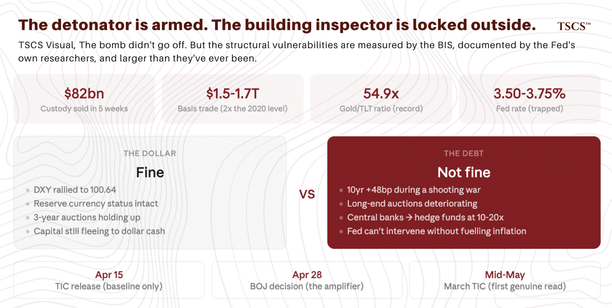](https://substackcdn.com/image/fetch/$s_!rIFP!,f_auto,q_auto:good,fl_progressive:steep/https%3A%2F%2Fsubstack-post-media.s3.amazonaws.com%2Fpublic%2Fimages%2Fb759a009-691d-4b51-8e75-149524b5f1f0_1354x683.png)

[Share](https://tscsw.substack.com/p/cash-not-bonds?utm_source=substack&utm_medium=email&utm_content=share&action=share&token=eyJ1c2VyX2lkIjoxNDAwMjQ1LCJwb3N0X2lkIjoxOTM5MDMxMTYsImlhdCI6MTc3ODU0NTM1NSwiZXhwIjoxNzgxMTM3MzU1LCJpc3MiOiJwdWItMjM1NDI0NCIsInN1YiI6InBvc3QtcmVhY3Rpb24ifQ.yIaxoxit16v9Fw-9-Oa9XkB_Z6B1miOjAs0jLplmQqo)

---

*This publication is for informational and educational purposes only. Nothing herein constitutes investment advice, a solicitation, or a recommendation to buy or sell any security or financial instrument. The authors may hold positions in securities discussed. Do your own research. Past performance is not indicative of future results.*