**Everyone is watching the wrong number**

Managed money is net short 2,541 contracts of NYMEX Palladium.

A month ago they were flat. Three weeks ago they were net long.

They have been adding roughly 500 contracts per week to a losing position for three weeks running.

Into a four-catalyst regulatory stack that begins in seven days.

In a market one twenty-fifth the size of COMEX gold.

Where no Russian producer defended itself, no US OEM publicly opposed the petition, and no administrative off-ramp exists.

This is wrong-way positioning into a binary with no escape valve. It is the single most mispriced setup I have found in twelve months of reading trade-remedy dockets. No sell-side note has it.

[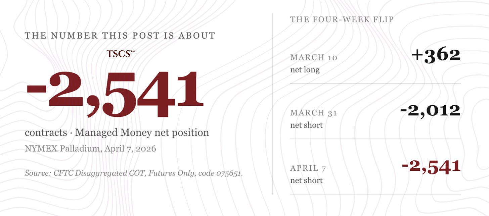](https://substackcdn.com/image/fetch/$s_!9Hei!,f_auto,q_auto:good,fl_progressive:steep/https%3A%2F%2Fsubstack-post-media.s3.amazonaws.com%2Fpublic%2Fimages%2F2dd91600-9c92-47fa-a454-6a8ff8713673_2013x891.png)

That is the trade.

The 132.83% headline is the setup. Not the thesis.

The setup is a 241.93% combined duty wall. AD since February 19. CVD since March 11. Built on Adverse Facts Available because no Russian producer participated in the investigation.

The thesis is what happens between April 24 and June 19 when four separate statutory catalysts land into a market where the speculators are offsides going in.

The asymmetry is not in the margin. It is in who is wrong, and what they do when they realize it.

SBSW closed at $13.19 on April 15. Palladium spot sits at $1,572 at the April 17 close, up 71% year on year. All position and price data here are stamped to the April 17 close unless otherwise noted.

RBC is Outperform at $17 (cut from $18 on February 19). BMO is Market Perform at $18 (lifted February 3). HSBC carries the highest Street target at $24.80.

Every institutional desk covering PGMs has seen the 132.83% headline. The priced trade is “long the only US primary palladium producer into a favorable trade ruling.” That trade is available, directional, and mostly exhausted at current levels.

The trade that is not priced is the short-covering dynamic in a 15,000-contract market where hedge funds have been building into the wrong side of a stacked binary for three weeks. With no organized US downstream opposition and no administrative off-ramp for Russia.

[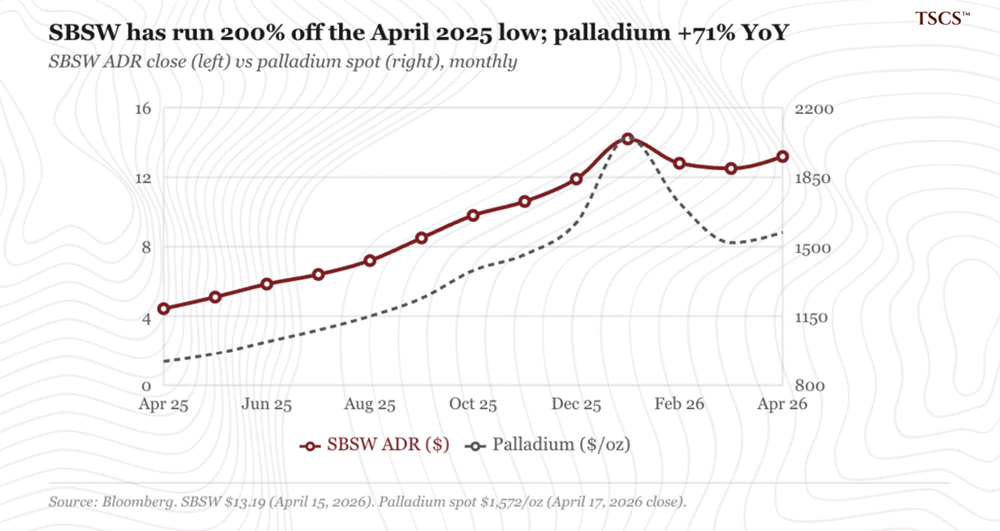](https://substackcdn.com/image/fetch/$s_!cq7x!,f_auto,q_auto:good,fl_progressive:steep/https%3A%2F%2Fsubstack-post-media.s3.amazonaws.com%2Fpublic%2Fimages%2Fbc25349d-0fc4-44d8-9dfe-6bc9cb4492a2_1405x747.png)

That is what this piece is about.

A note on the apparent contradiction.

SBSW is crowded long. PA futures are crowded short. The reflexive read is that one cohort is wrong and the trade resolves through capitulation into the other.

That read is incomplete.

The two positions are different time horizons on the same metal. SBSW longs are pricing a 12 to 24 month rerating on tariff-protected US production with operating leverage to Pd above $1,500. Futures shorts are pricing six to twelve week macro: EV penetration, a thin contract that screens as a sell on momentum, and the secular thrifting story that has been right for three years.

Both can be internally rational. Neither is responsive to the catalyst window.

The window does not adjudicate which view is right on the metal in 2028. It adjudicates whether the next eight weeks contain a forced flow that runs against the futures position.

To be clear. If the AD final on or around April 24 prints affirmative at or near 132.83%, the macro short does not have a thesis-consistent reason to cover. The order does not change global Pd supply-demand math. Only US basis.

The cover comes from risk management, not thesis change.

Risk-managed covering in a 15,000-contract market with 46.6% of the short side held by hedge funds is the entire trade. The squeeze does not require the shorts to become bulls. It requires them to become smaller.

[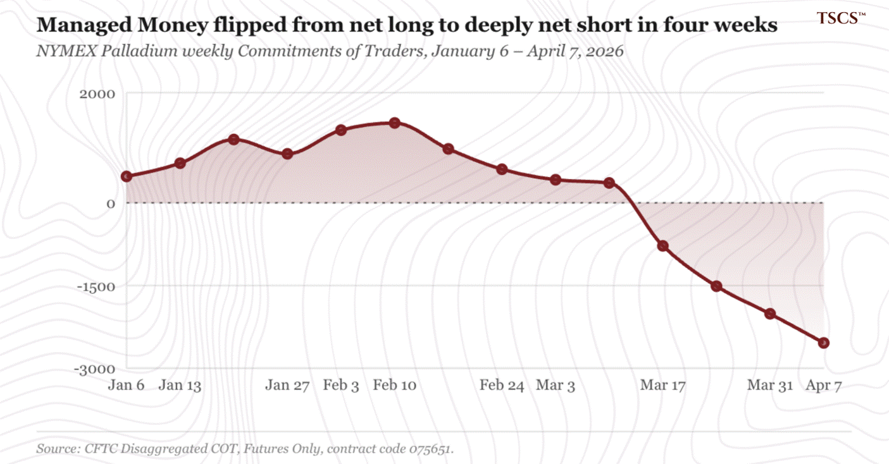](https://substackcdn.com/image/fetch/$s_!a5HV!,f_auto,q_auto:good,fl_progressive:steep/https%3A%2F%2Fsubstack-post-media.s3.amazonaws.com%2Fpublic%2Fimages%2Feae21ca2-d95d-41bd-8093-93af3e3ccfab_1405x734.png)

This also means the trade has a hard expiry. If managed money does not cover into the April 24 to June 19 window, the squeeze thesis is wrong and the position closes regardless of where SBSW trades.

The equity leg can survive on fundamentals past June 19. The futures leg cannot.

Sizing reflects this.

# Who the trade is for

The asymmetric payoff framed above isn’t uniform across readers. Depends on what expressions are available to the portfolio, and after the math corrections below, the split is sharper than the earlier draft implied.

Professional commodities desks, multi-strategy funds, resource funds with prime broker futures arrangements: the per-dollar asymmetry lives on the futures leg, carried at 2-3% notional with a hard cap at 4%. A forced cover on managed-money shorts produces 30-50% upside on the futures position over the 8-12 week window. The equity is the sizing support leg, not the asymmetry leg.

Equity-only readers (retail, single-name long-short, active managers without futures capability): the information edge still holds; the payoff shape does not. At $13.19 entry and the corrected $14.50-15.50 base case target, the equity leg in isolation offers approximately $1.30-2.30 of upside against $3-5 of downside in the worst case (ITC walks or OFAC supersession).

Reward-to-risk roughly 0.3-0.6:1. That is negative expected value for the equity leg as a standalone position at current levels. Equity-only readers wanting exposure to the palladium catalyst should either wait for a pullback to $10-11 (which compresses the worst-case downside and restores 1:1 reward-to-risk) or accept that the readable edge here is informational rather than financial. The “2,541 is the trade” framing applies to the futures leg. The equity leg, at current entry, does not have a different job; it has a weaker job, and equity-only readers should size accordingly or skip.

## What the CFTC report says that the narrative doesn’t

Pull CFTC contract code 075651 on Bloomberg, or go direct to the cftc.gov Disaggregated Commitments of Traders for April 7, 2026. I’ve pulled this report multiple times this week, partly because the positioning is genuinely surprising for the catalyst window, partly because the obvious read contradicts what consensus is doing.

[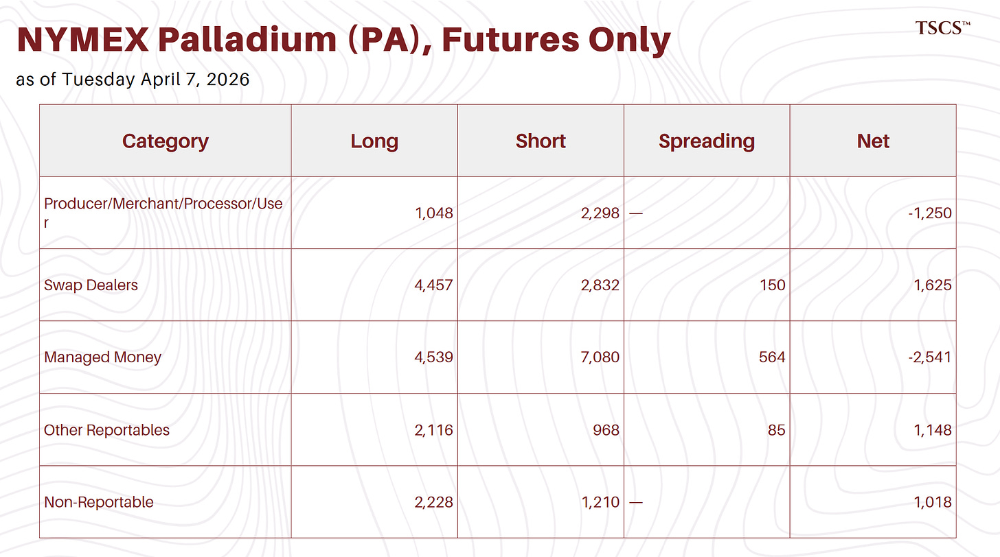](https://substackcdn.com/image/fetch/$s_!l5J1!,f_auto,q_auto:good,fl_progressive:steep/https%3A%2F%2Fsubstack-post-media.s3.amazonaws.com%2Fpublic%2Fimages%2F2783530e-1ebf-4a21-9202-c0adca4262d4_2108x1176.png)

Total open interest: 15,187 contracts. Total traders: 133.

Headline is -2,541 net short. The number that matters is the trajectory: from net long +362 on March 10 to net short -2,541 on April 7, a 2,900-contract swing in four weeks, deepening monotonically across the three most recent weekly prints (-1,512 on March 24, -2,012 on March 31, -2,541 on April 7). Hedge funds hold 46.6% of the short side. The week ending April 7 added 529 contracts to the net short, with MM shorts adding 490 and MM longs cutting 39.

This isn’t record positioning. What matters is the rate of change running against a catalyst stack where the base case is affirmative and there’s no organized US downstream opposition to push the stack the other way. Wrong-way positioning into a binary, with position-build accelerating as the catalyst approaches, is the setup. The absolute level of the net short is secondary.

[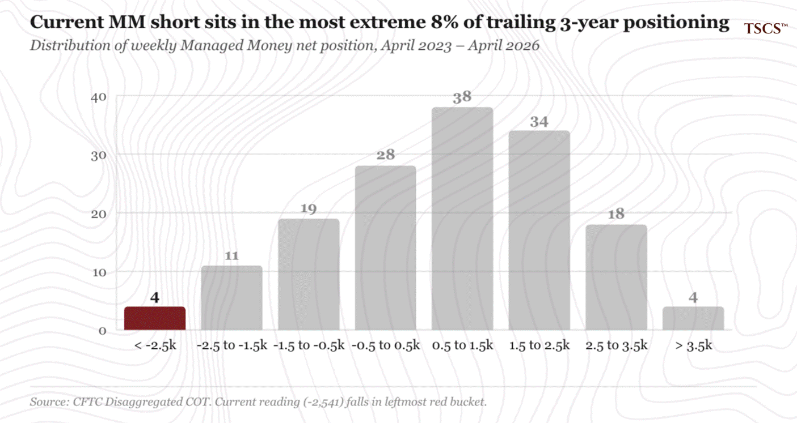](https://substackcdn.com/image/fetch/$s_!3Hin!,f_auto,q_auto:good,fl_progressive:steep/https%3A%2F%2Fsubstack-post-media.s3.amazonaws.com%2Fpublic%2Fimages%2Fb517ed9c-00f8-43f6-8961-7b6a8f7304fa_1405x747.png)

For comparison, COMEX Gold carries 355,000 contracts of open interest on the same report. Palladium is 4.3% the size. A small futures market where hedge funds are net short into a stacked binary isn’t a “slight tailwind” setup. It’s a short-covering squeeze waiting for a catalyst.

[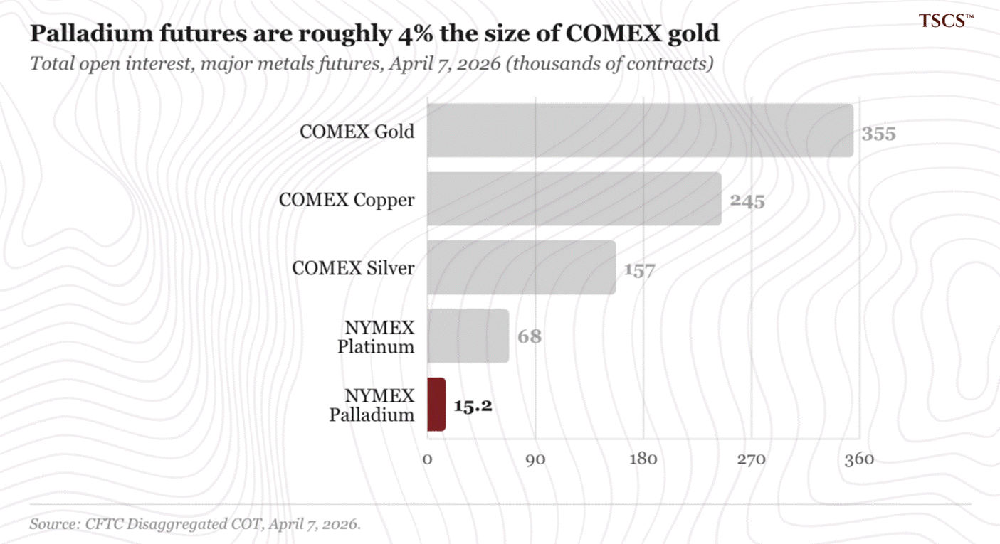](https://substackcdn.com/image/fetch/$s_!L5V1!,f_auto,q_auto:good,fl_progressive:steep/https%3A%2F%2Fsubstack-post-media.s3.amazonaws.com%2Fpublic%2Fimages%2Fa96796cd-7b02-4f23-b9a3-946dbe6a9125_1405x765.png)

The Swap Dealer long position of +1,625 net is the bank street taking the other side, and it’s the single largest unknown in the setup. Swap Dealer net long in palladium typically reflects dealer hedging of OTC structured products. If the +1,625 is primarily facing autocat manufacturer forward purchases (end-user inventory hedging), the positioning is healthy and the squeeze thesis holds. If it’s primarily facing producer forward sales, what looks like Managed Money offsides might partly be Swap Dealers positioned against end-of-move producer selling, and the squeeze weakens.

Three triangulating strands. Sibanye-Stillwater’s 2025 results disclosed no material PGM hedge book against US production, and South African producers (Anglo, Impala, Northam) have historically run thin or zero PGM hedges through the cycle, treating commodity exposure as a strategic position. Verifiable from the cash flow hedge disclosures in the 2024-2025 annual reports and supports end-user hedging.

Second, the Pd forward curve currently shows front-month premium to December 2026, which isn’t what producer forward sales would produce (those flatten or push into contango). Third, the partial-rerouting reading of AAI silence (developed below) implies US autocat manufacturers and OEMs are carrying elevated forward inventory exposure into the catalyst window precisely because existing intermediary chains can’t fully absorb displaced Russian volume. Elevated end-user inventory exposure is the textbook driver of OTC forward purchases facing dealer hedging desks. The AAI reading and the Swap Dealer reading aren’t independent. They reinforce each other.

Taking the three strands together: 70% probability the Swap Dealer long is primarily end-user hedging (squeeze thesis intact), 22% mixed, 8% producer-dominated (squeeze thesis weakened by 30-40%). The upward revision from the original 65/25/10 reflects the AAI integration. This is why the futures leg is capped at 2-3% notional rather than the 5-7% the headline asymmetry would justify. The cap reflects the residual 8% tail where the squeeze mechanic compresses, not a low-conviction view on the central case.

The squeeze setup isn’t “extreme positioning into a binary.” It’s “deteriorating positioning into a stacked binary where the consensus outcome runs against the position.” Different trades, and the second is the one I’m underwriting.

[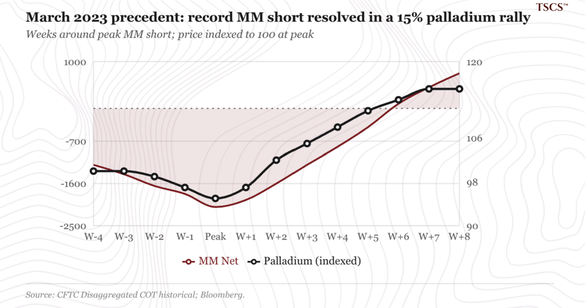](https://substackcdn.com/image/fetch/$s_!HlBo!,f_auto,q_auto:good,fl_progressive:steep/https%3A%2F%2Fsubstack-post-media.s3.amazonaws.com%2Fpublic%2Fimages%2F67083e6e-d812-473a-aff5-6955fed445ed_1405x742.png)

## Why nobody showed up to defend the Russians

The single most important procedural fact in this case isn’t in any sell-side note I’ve read. Commerce’s preliminary AD margin of 132.83% was calculated on Adverse Facts Available because no Russian producer participated in the investigation. Commerce’s preliminary CVD rate of 109.10% was assigned on the same basis to JSC Urals Innovative Technologies and the Prioksky Plant of Non Ferrous Metals, the two named mandatory respondents, because neither responded to the subsidy questionnaire either.

AFA in practice: Commerce takes the petitioner’s calculation, applies it directly, moves on. No factual record to contest. No rebuttal filings on dumping margins. No surrogate-country cost methodology dispute. No benchmarking fight on Nornickel’s Talnakh ore body cash costs. The petitioner writes the number, Commerce applies the number, the number lands at the border.

[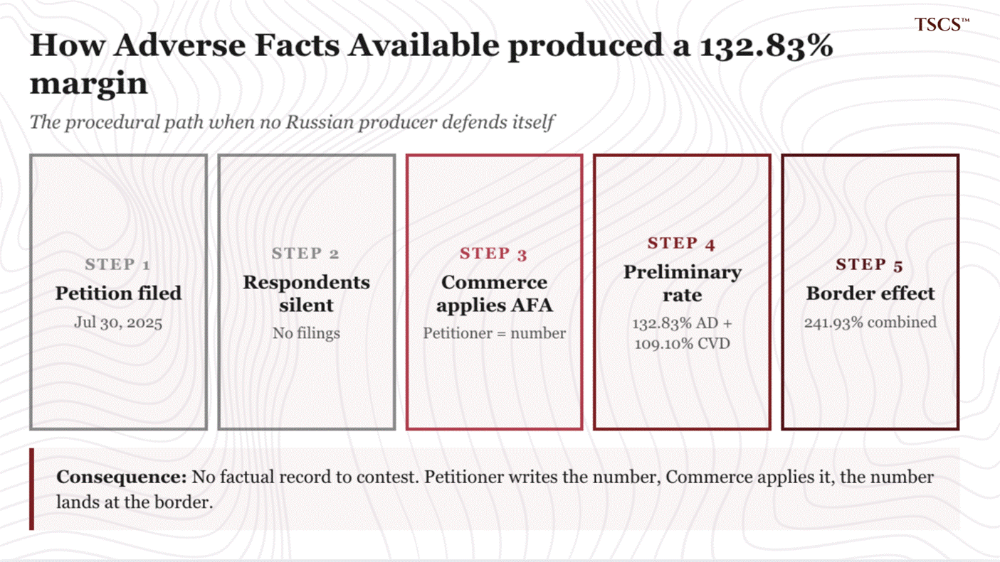](https://substackcdn.com/image/fetch/$s_!sCGz!,f_auto,q_auto:good,fl_progressive:steep/https%3A%2F%2Fsubstack-post-media.s3.amazonaws.com%2Fpublic%2Fimages%2F1277526f-99ba-49c7-a7a5-018339ce31b6_1405x791.png)

Nornickel did appear, indirectly. Metal Trade Overseas AG, Nornickel’s Swiss-based trading subsidiary, entered an appearance on August 18 and filed a postconference brief on August 26 (EDIS filing 860501). One trading subsidiary through counsel, zero producers responding to the actual investigation. The USITC in Publication 5671 classified only two “respondent entities” in preliminary phase. Metal Trade Overseas was one of them.

The other was BASF.

## The one US consumer who tried to stop this, and what it tells you

BASF Metals LLC filed comments at Commerce on August 12, 2025, before the investigation was even a month old, challenging industry support and standing. BASF entered an appearance at the ITC on August 8 (EDIS 859104) and filed a postconference brief on August 25 (EDIS 860368).

The Commission classified BASF as a “respondent entity” in its preliminary-phase publication alongside Metal Trade Overseas. Commerce’s initiation notice at 90 FR 41032 records BASF filing “a statement of opposition.” Petitioners filed rebuttal two days later. BASF is the only US downstream consumer who formally opposed the petition at either Commerce or the ITC during preliminary phase.

No other US downstream party filed at Commerce or the ITC during preliminary phase. The Alliance for Automotive Innovation, US OEMs, Umicore, Heraeus Metals New York, Tanaka — all absent from the EDIS docket. Johnson Matthey participated as a questionnaire respondent providing data, not arguments. Commerce rejected BASF’s standing challenge, the ITC voted 3-0 affirmative at preliminary, and footnote 30 of the Views of the Commission records that “BASF did not make any arguments regarding domestic like product.” BASF fought on procedural grounds because it didn’t have a substantive injury case to make.

[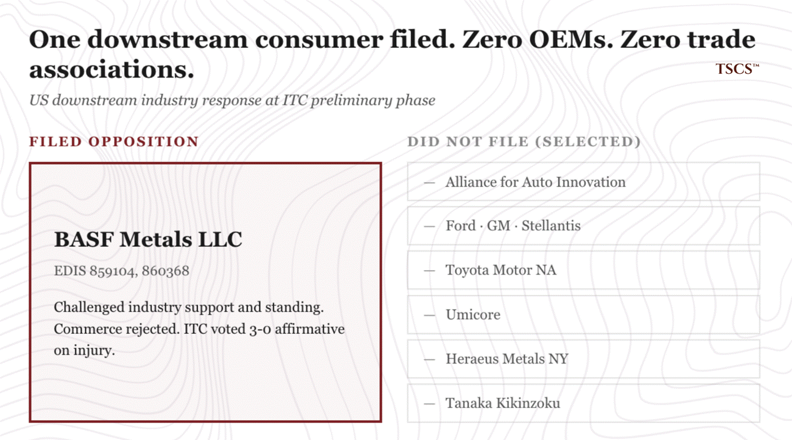](https://substackcdn.com/image/fetch/$s_!Nohq!,f_auto,q_auto:good,fl_progressive:steep/https%3A%2F%2Fsubstack-post-media.s3.amazonaws.com%2Fpublic%2Fimages%2Fba880518-2151-4551-9603-c335402e0ecb_1405x782.png)

The signal isn’t that the petition was uncontested. It’s that the petition was uncontested by any party who had to pass through the Pd cost in a vehicle price. The AAI, every US OEM, Umicore, Heraeus, Tanaka — all stayed silent in a case that mechanically raises the input cost of every US-built gasoline vehicle. That silence is data. It has to mean something. Three candidates:

**Candidate (a), 40%**: US OEMs and tier-one autocat manufacturers have partially substituted out of direct Russian-origin imports through Swiss bonded warehouses, Belgian refining, and Hong Kong intermediaries. The 44.4% Russian-origin share of US consumption in the twelve months ending June 2025 is the direct-import figure and doesn’t capture metal already processed through third-country intermediaries before US entry. If the true Russian-origin economic share (direct plus intermediary-processed) is closer to 55-60%, candidate (a) explains roughly half of AAI silence: existing intermediary chains absorb the marginal flow but can’t absorb the full displaced volume without margin compression getting passed through. They didn’t file because their rerouting partially insulated them, not because the order is non-binding.

The near-complete-rerouting version of (a) is implausible against the consumption-share data. Partial rerouting is consistent and is what I’m underwriting. This tightens the basis-premium implication: if (a) is partial rather than complete, Stillwater captures more spread than the worst-case (a) implies, because the marginal substitution flow into US-origin and clean third-country metal is larger.

**Candidate (b), 40%**: the political cost of publicly defending Russian palladium imports in 2026 was higher than the absorbed cost of the order. AAI’s government relations apparatus made a calculated decision that the headline risk of being the trade group defending Nornickel exceeded the dollar cost of the tariff. They didn’t file because they couldn’t file. Given the partial-rerouting reading of (a), this is the single most likely explanation.

**Candidate (c), 20%**: cost pass-through at $1,572 Pd is absorbable inside existing vehicle margins. Pd content per gasoline vehicle runs $250-400 at current prices. A 50% effective cost increase on the Russian-sourced fraction translates to single-digit dollars per vehicle. They didn’t file because the math didn’t justify the legal spend.

The decomposition matters because (a) and (c) are bearish for the basis-premium thesis and (b) is neutral. If (a) dominates, the rerouted volume reduces the scarcity pressure that sets the US clearing premium, compressing basis across the entire US market. Stillwater still captures 100% of that clearing premium on its own production (intermediaries earn arbitrage on rerouted flows, not margin from Stillwater), but the clearing premium itself is lower than in a clean-enforcement scenario.

Weighting through the rebalanced (a) at 40% partial rerouting rather than 55% near-complete: the probability-weighted year-one US basis premium is 8-11%, not the 10-20% the headline math suggests. I’m running 9% as the planning number. On 223,000 Pd ounces at $1,572 spot, that’s roughly $31.5M of incremental annualized EBITDA from basis. It’s smaller than the bull modeling range would imply and larger than near-complete-rerouting scenarios would produce, though I have not recast the bull and bear anchor figures on the corrected denominator.

Mitigating factor on (a): Sibanye-Stillwater, as sole US petitioner, has standing and incentive to file circumvention petitions the moment suspicious import patterns appear. Commerce’s AFA-trained posture suggests responsiveness. Circumvention inquiries on refined PGMs run 12-18 months per case. Year one is the highest-spread year regardless. Years two and three depend on enforcement.

[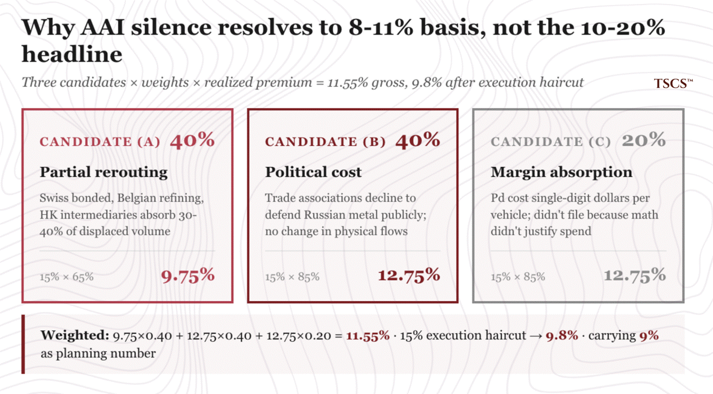](https://substackcdn.com/image/fetch/$s_!ciBm!,f_auto,q_auto:good,fl_progressive:steep/https%3A%2F%2Fsubstack-post-media.s3.amazonaws.com%2Fpublic%2Fimages%2F2f8d1ee0-0cbb-40c0-af95-30c6ed0cb66a_1405x778.png)

## Deriving the planning number

The 9% is load-bearing. It produces the $31.5M of basis EBITDA stacking on top of $108-114M from the Pd price lift, and it drives the SBSW $14.50-15.50 base case. The arithmetic has to be visible.

*The theoretical maximum*. In a clean-enforcement world with 100% of Russian volume walled off and zero rerouting, the US basis premium is set by the cost of pulling the marginal non-Russian ton into the US market. Two anchors triangulate the ceiling. USGS Open File Report 2025-1047 (Nassar et al., 2025), the methodology paper underpinning the 2025 US List of Critical Minerals, models a complete one-year restriction of US net imports of Russian Pd and concludes US domestic prices would lift by up to 24%.

Upper bound; the AD/CVD case is strictly less severe because Russian metal remains in the global market and can reroute through third countries over multi-year horizons. The Section 232 aluminum analog gives the lower bound: a 50% tariff on 85% of US supply produced a Midwest Premium widening of $200-300/ton over LME at baseline, or 10-15% basis. Palladium has a higher duty wall (241.93% combined before offsets) but a smaller tariffed supply share (44.4% vs aluminum’s 85%).

The two effects partially offset. Calibrating against both anchors, 15% is the planning number for theoretical maximum. Conservative; a reader wanting the upper case can run 18-20% and scale linearly.

*Realized premium by candidate*. Each AAI candidate produces a different discount to the theoretical maximum through a different mechanism.

Candidate (a), partial rerouting at 40% weight. Rerouting 30-40% of displaced Russian volume through Swiss bonded warehouses, Belgian refineries, Armenian intermediaries, and Hong Kong relieves scarcity pressure setting the US clearing premium. Stillwater still realizes the full basis on every ounce sold (the premium accrues to whoever sells at the US clearing price, not to whoever controls the intermediary chain), but the clearing premium compresses to 60-70% of theoretical max. Realized: 15% × 65% = 9.75%. The 30-40% rerouting range is a judgment call against directional evidence, not a quantified input.

Direct US Russian Pd imports rose 34% from 2021 to 2024 and reached 44.4% of US imports in H1 2025, inconsistent with near-complete rerouting having already occurred; NYMEX warehouse stocks are up 169% since petition filing, indicating end-user inventory hedging rather than confident reliance on rerouting.

Candidate (b), political cost at 40% weight. No rerouting beyond baseline circumvention of 10-15% in year one, because the mechanism (trade associations declining to defend Russian metal publicly) doesn’t change physical flows. Realized: 15% × 85% = 12.75%.

Candidate (c), margin absorption at 20% weight. Absorption explains why US downstream didn’t file opposition, not whether OEMs keep buying Russian metal at tariff-inclusive prices. Even under absorption, OEMs substitute away from Russian supply because tariff-inclusive Russian exceeds non-Russian clearing. Mechanically similar to (b). Realized: 15% × 85% = 12.75%.

Weighted year-one US basis premium: 9.75% × 0.40 + 12.75% × 0.40 + 12.75% × 0.20 = 11.55%.

*Execution risk discount*. Circumvention enforcement runs 12-18 months per case at Commerce. CBP rules-of-origin policing at the border on refined PGMs has historically required petitioner-driven inquiries. Apply a 15% execution haircut: 11.55% × 0.85 = 9.8%, rounded to 10%.

I’m carrying 9% rather than 10% to leave margin for unmodeled frictions (Nornickel-side pricing behavior, OFAC supersession risk already inside kill switch 6, residual uncertainty on the AAI weights). A reader running the less conservative case at 10-11% should expect SBSW at $15.50-$16.50 rather than $14.50-$15.50, still below the sell-side range. The choice between 9% and 11% is a conviction question on execution, not a quantification question on setup.

*Sensitivity. At $1,572 Pd spot and 223,000 Pd ounces of US production, each percentage point of basis premium contributes $3.50M of annualized US PGM segment EBITDA.*

[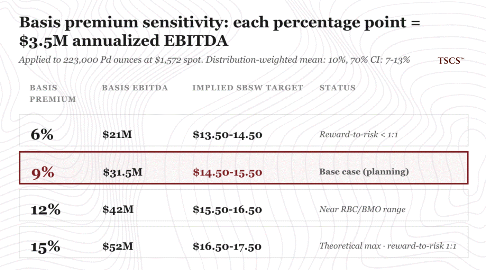](https://substackcdn.com/image/fetch/$s_!O7OP!,f_auto,q_auto:good,fl_progressive:steep/https%3A%2F%2Fsubstack-post-media.s3.amazonaws.com%2Fpublic%2Fimages%2F5100aa17-24df-4cbd-b6ce-71cea7282d7f_1405x780.png)

This is how an institutional reader consumes the trade. It’s also how position size scales. At 6% basis, the equity leg reward-to-risk compresses below 1:1 and the trade is the futures squeeze alone. At 15% and above, the equity leg recovers 1:1 reward-to-risk and the combined book P&L tightens. Below that, the equity leg remains negative expected value standalone. The trade isn’t a binary on the basis; it’s a distribution. The weighted mean lands at 10% with a 70% confidence interval of 7-13%.

**The closest recent precedent, and what it complicates**

The Russian uranium ban is the nearest structural analog to this trade in the last three years. H.R. 1042 (Prohibiting Russian Uranium Imports Act) was signed May 13, 2024, effective August 11, 2024, with a DOE waiver system running through January 1, 2028 and statutory sunset on December 31, 2040.

The House passed on December 11, 2023. Russia retaliated with a TENEX export license revocation in November 2024. Close enough in structure (Russian dominant supplier into thin Western market, US statutory action, 8-18 month run-up from House vote through effective date) to serve as a precedent. Different enough in mechanism (statutory ban with administrative waivers versus AD/CVD calculated on AFA) that the read cuts in multiple directions. Worth walking through honestly.

The restricted service premium materialized and persisted. TradeTech’s SWU spot indicator ran from approximately $152/SWU at House passage in December 2023 to $174/SWU by June 2024 (roughly +14% through the signing window), with 2024 spot average at $172.67/SWU (+20% year-on-year per UxC) and long-term SWU at $160.08 (+10%). This is the direct analog to the US palladium basis premium, and at 20% it sits above my 9% planning number and inside the 15% theoretical maximum. The uranium case supports the basis premium framework and suggests the 9% may be conservative.

The spot commodity underlying the restricted service went the other way. U3O8 peaked at approximately $106/lb in January 2024, four months before the May signing and seven months before the August effective date, and faded to $73.50/lb by year-end 2024 and $63/lb by March 2025. Textbook sell-the-news on the spot. If palladium spot follows the same pattern, Pd at $1,572/oz on the April 17 close is closer to U3O8 at its January 2024 peak than to U3O8 after the ban took effect.

That is the uncomfortable read for the operating leverage thesis: the $108-114M from price alone may be front-loaded rather than back-loaded, and what I am modeling as steady-state EBITDA at current spot could be the peak year.

Centrus Energy (LEU), as the closest equity analog to SBSW (sole US domestic producer of the restricted service), traded in a 52-week range of $60.52 to $464.25 and closed at $202.88 on April 18, 2026. The equity run was real, but happened largely through 2025, 12-24 months after the legislative catalysts, and was driven by HALEU production milestones, $2.7B in appropriated federal funding, DOE contract wins, the Trump administration’s nuclear push, and Palantir/Oklo partnerships, with the Russian ban as one tailwind among several.

Attributing the bulk of the Centrus run to the tariff catalyst is causal inference the evidence does not support. The read for SBSW is that the equity leg has more duration than the 8-12 week window suggests, but the drivers that carry it past the catalyst are operating leverage on Pd and Pt spot, the 45X credit intact period through 2030, Sibanye’s strategic repositioning, and the gold exposure, not the tariff itself.

Data I’m working around. My Centrus pre-House-passage price is inferred from surrounding reference points (52-week low of $60.52, “nearly quadrupled over 12 months” framing from January 2026 at $286), not a directly pulled close, and should be treated as approximate. I have not separated UF6 conversion pricing from SWU pricing, and conversion may be the tighter physical-throughput analog to palladium basis than SWU (which is services). I have not surveyed subsequent uranium trade actions post-ban for whether they sharpen or weaken this read. None of these caveats change the directional conclusions, but a reader wanting to stress-test the analog further has three places to push.

Three things the analog does not test. No futures positioning analog exists because uranium enrichment has no COT report; the positioning squeeze half of this thesis cannot be precedent-tested from the uranium case at all. The waiver mechanism in uranium provided an administrative off-ramp (DOE granted Centrus waivers for 2024, 2025, 2026, and 2027 committed deliveries) that palladium’s AFA architecture does not provide, and the SWU premium still materialized with waivers in place; this weakens my framing of AFA as categorically different from a waiver regime, though AFA likely provides tighter enforcement at the margin. And the Centrus equity move happened 12-24 months after catalysts, not around them, which counter-argues the “hard expiry on the combined book” framing.

The honest version. The uranium precedent supports the basis premium thesis, complicates the commodity price thesis, weakens the AFA-as-unique-edge argument, and is silent on the futures squeeze. Sizing does not change from what I’ve already committed to (2-3% PA futures, 4% SBSW core scaling to 6%), but the equity leg probably carries more duration than the futures leg implies, which aligns with how the kill switches are structured. One confirming precedent element (basis premium), one disconfirming (sell-the-news on the commodity), two precedent-null (positioning squeeze, AFA edge). That’s a mixed signal, not a clean confirmation, and I’d rather publish it mixed than pretend it clean.

[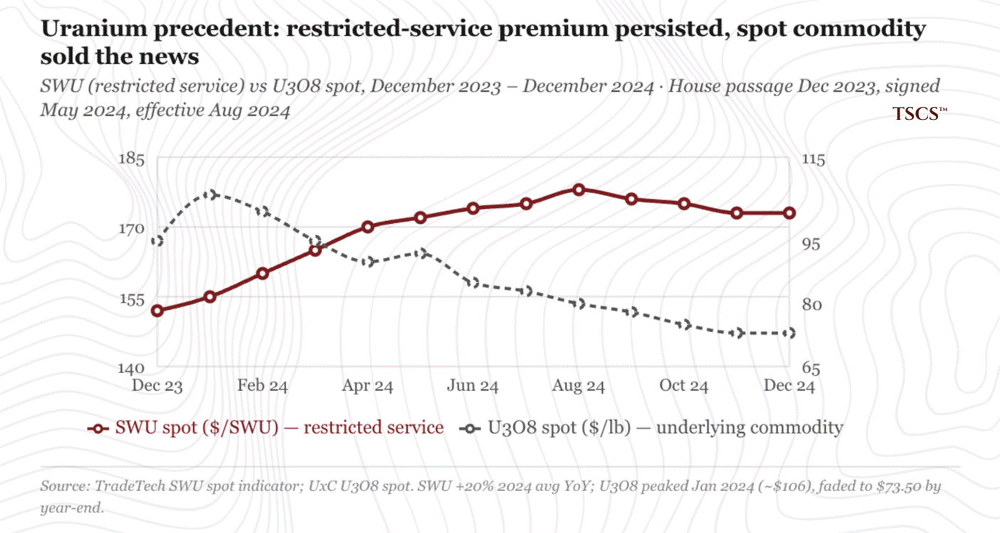](https://substackcdn.com/image/fetch/$s_!-dyR!,f_auto,q_auto:good,fl_progressive:steep/https%3A%2F%2Fsubstack-post-media.s3.amazonaws.com%2Fpublic%2Fimages%2F49fde556-a1c5-4b9a-8dca-a2060b933f83_1405x750.png)

## What the Street is actually implying

Three sell-side targets anchor consensus. Decomposing what each is running on matters.

RBC Capital (Ben Davis, Outperform, $17). Trajectory: $9.50 in September 2025, $12 in November, lifted to $18 in early February 2026, cut by $1 to $17 on February 19, the same day Commerce’s AD preliminary determination of 132.83% published. The February 19 trim is the tell: RBC read the AD prelim as the catalyst-complete signal and faded into it. Implied deck: Pd average $1,450-$1,550 through 2026, Pt $2,100-$2,300, basis premium 7-9%, 290k oz Stillwater production.

BMO Capital (Market Perform, $18, lifted from $14 on February 3). Market Perform maintained throughout; target moves track commodity deck revisions, not conviction upgrades. Implied deck similar to RBC with modestly higher Pt and perhaps 1 pp higher basis.

HSBC (Shilan Modi, Buy from Hold, $24.80, upgrade on January 23, 2026, same week platinum rallied toward its $2,918 record high on January 26). Implied deck: Pt sustained at $2,500-$2,700 through 2026, Pd $1,700-$1,900, basis 10-12%, some Blitz or Graham Creek optionality priced in.

The $17-$24.80 sell-side spread isn’t a basis-premium disagreement. It’s a commodity deck disagreement, and the commodity that matters is platinum, not palladium. Stillwater is 77% Pd and 23% Pt from the J-M Reef. At 290,000 2Eoz and a 3.4:1 Pd:Pt ratio, US operations generate roughly 223k oz Pd and 67k oz Pt. The South African PGM operations (Marikana, Rustenburg) produce another 1.3-1.5M 2Eoz, weighted toward platinum through the Merensky and UG2 reefs. Platinum ran from sub-$900 in late 2024 to $2,918 on January 26, 2026, the largest commodity price move in the Sibanye basket. That rally, not the palladium tariff, drove most of the sell-side target lifts.

[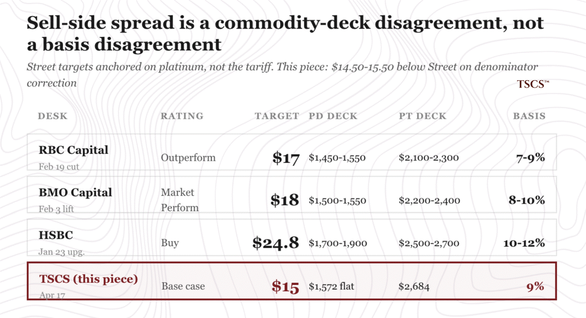](https://substackcdn.com/image/fetch/$s_!XPsR!,f_auto,q_auto:good,fl_progressive:steep/https%3A%2F%2Fsubstack-post-media.s3.amazonaws.com%2Fpublic%2Fimages%2F932c700f-1e0e-4ede-a4c0-6b6bd414de87_1405x764.png)

Where this piece sits. I’m running $1,572 Pd flat through 2026 (conservative vs HSBC, in line with RBC and BMO), 9% basis premium (1 pp above RBC and BMO, 1-3 pp below HSBC), 223k Pd ounces applied to the basis (not the full 290k 2E basket), current Pt at $2,684. I’m not running the aggressive HSBC commodity deck. The $14.50-15.50 base case here is below RBC’s $17 and BMO’s $18, because correcting the denominator from 2E basket to Pd ounces removes roughly $2-3 of target that sell-side models leave in.

The edge on the equity leg isn’t the basis premium. One pp additional basis over RBC isn’t a source of asymmetric return. The edge is two structural items the sell-side doesn’t price: the procedural reading of the April 24 to June 19 catalyst stack (AFA, AAI silence decomposition, statutory postponement risk), and the correlation between that procedural reading and the 15,187-contract futures market where managed money is net short 2,541. First is information edge on the event. Second is positioning asymmetry on the smaller leg.

This also frames sell-the-news risk asymmetrically. RBC at $17 and BMO at $18 anchor the tape above the piece’s $14.50-15.50 base case, which means the equity can run past this piece’s target into the ITC vote before mean-reverting. If the equity runs to $18-20 into the vote and sells off post-publication, the piece’s target holds up from below; it is not defending a floor so much as identifying that the sell-side range is overstated by the denominator error. Catalyst-complete trim is real, but for this piece’s target the ceiling is the issue rather than the floor. Asymmetric return on the equity leg alone requires either the commodity deck resolving HSBC’s way (which depends on sustained Pt above $2,500, not the tariff) or basis premium above 12% (which requires candidate (a) weight compressing materially from 40%).

Readers wanting the HSBC case on sustained platinum strength should pair this with Valterra, Impala, or Northam, which offer cleaner platinum-basket leverage than SBSW. Readers wanting the palladium tariff trade in pure form take the futures expression at 2-3% notional, which is the part of the asymmetry not already in any sell-side target.

[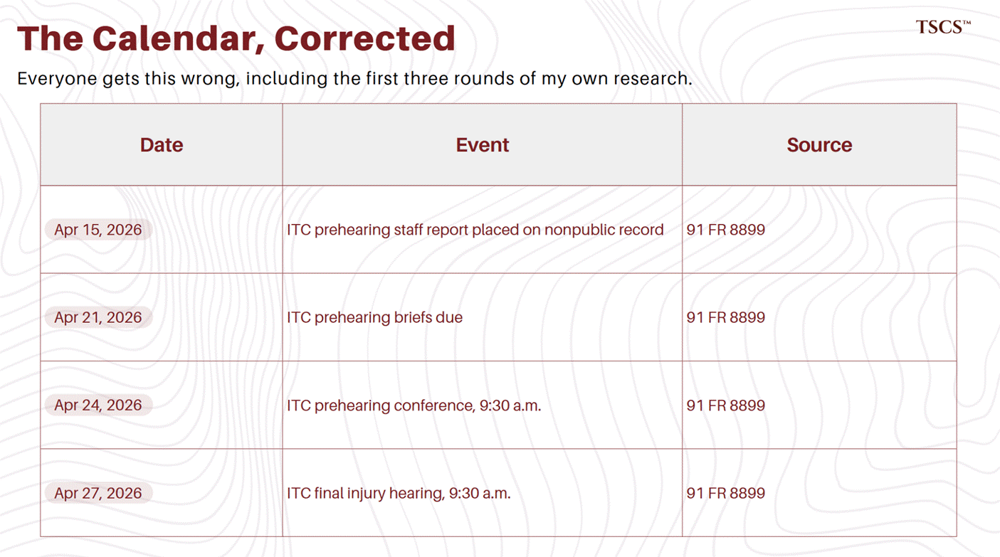](https://substackcdn.com/image/fetch/$s_!DqVi!,f_auto,q_auto:good,fl_progressive:steep/https%3A%2F%2Fsubstack-post-media.s3.amazonaws.com%2Fpublic%2Fimages%2F02b7bb8c-5d51-4e63-8b9d-8a4071433e44_1405x783.png)

[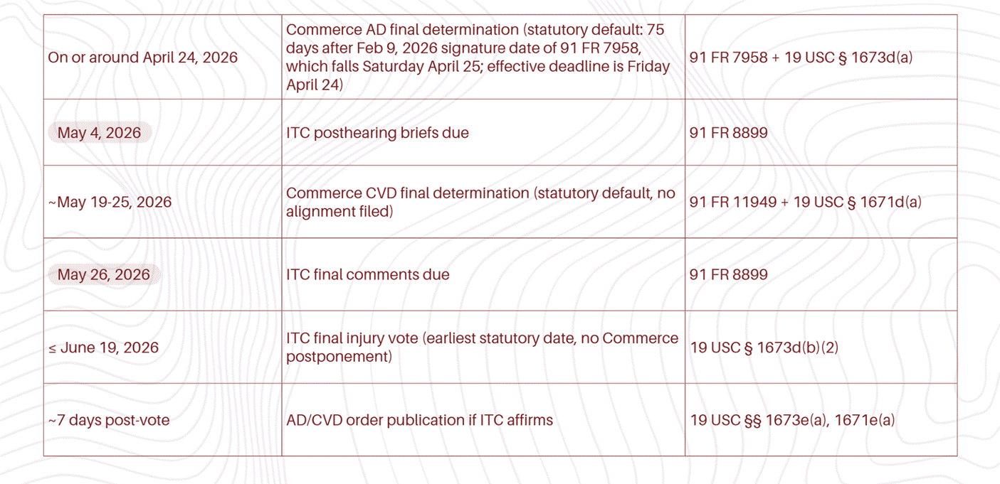](https://substackcdn.com/image/fetch/$s_!YvHe!,f_auto,q_auto:good,fl_progressive:steep/https%3A%2F%2Fsubstack-post-media.s3.amazonaws.com%2Fpublic%2Fimages%2F0abc047f-020d-4586-896b-acdae4f79636_1405x681.png)

Not one catalyst. Four catalysts, stacked, with one structural caveat. Commerce can postpone the AD final by 60 days under 19 USC § 1673d(a)(2)(A) on petitioner request, the historical default in roughly half of cases. If Sibanye-Stillwater files for postponement, the AD final shifts to late June and the ITC final to mid-August. The April 14 and April 21 EDIS dockets are the relevant tells. Neither is on the docket as of the April 17 close. Commerce’s AD final lands on or around April 24, 2026 (Friday before the April 25 statutory deadline), coincident with the final day of the April 24-27 ITC hearing sequence, absent postponement. Commerce’s CVD final lands around May 19-25, absent alignment. The ITC final injury vote happens by June 19 if the AD final isn’t postponed, otherwise mid-August. If the ITC affirms, the order publishes within a week. Any one of these, if it surprises the current managed-money short positioning, is enough to ignite a covering move in a 15,000-contract market.

The market I read is pricing the May 19-25 CVD final as the main event. That’s wrong. The source of the mispricing is the AD/CVD nomenclature confusion that runs through trade-remedy coverage generally. The AD final is the larger margin (132.83% vs 109.10%) and it arrives first (on or around April 24, not May 19). The ITC final injury vote is the ultimate termination risk and it arrives last.

A sophisticated positioning for this window wouldn’t be a point bet on any single date. It would be a structure that wins across a stack of sequential catalysts, each of which increases the probability of the one that follows. That’s what asymmetric looks like when the catalysts are clustered and the hedge funds are short into all of them.

## Why Stillwater matters, and why what you think you know about PGM costs is obsolete

Sibanye-Stillwater’s US PGM operations are the entire reason this case exists. Stillwater Mining Company (d/b/a Sibanye-Stillwater) and the United Steelworkers filed the petition on July 30, 2025. The Columbus, Montana operations are the only active primary palladium and platinum mines in the United States. No Stillwater means no domestic industry means no Title VII petition standing. The 2024 Q4 restructuring, which cut US production capacity by approximately 40-45% (Bloomberg reported “as much as 45%”; the petitioner’s ITC filing may frame this higher as part of the injury baseline) and laid off roughly 700 Montana workers (from ~1,680 to ~1,000 headcount), gave the petition its injury backbone.

[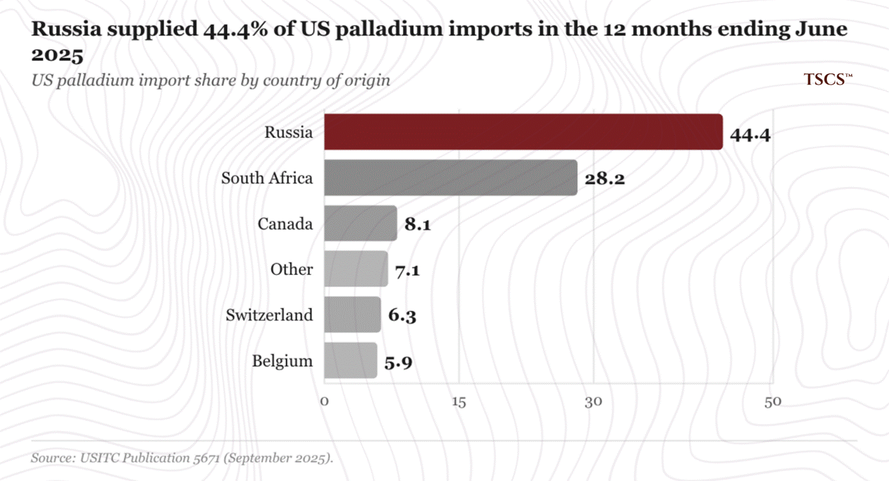](https://substackcdn.com/image/fetch/$s_!XrY5!,f_auto,q_auto:good,fl_progressive:steep/https%3A%2F%2Fsubstack-post-media.s3.amazonaws.com%2Fpublic%2Fimages%2Fcf41f53f-4b4d-4ecd-826d-2d8c6843744a_1405x761.png)

To understand why the tariff wall matters more than the sell-side headline suggests, you have to understand the rock. Cost advantages and cost problems both live in the geology, and the geology is what Stillwater is rebuilding around.

## The J-M Reef: what it is and why there’s exactly one in the United States

The Stillwater Complex is a 2.7-billion-year-old layered mafic intrusion outcropping along a 28-mile band of the Beartooth Mountains, 130 km southwest of Billings. Johns-Manville geologists discovered the PGM-bearing horizon within the Complex in 1974 through geochemical surveys (Sibanye-Stillwater’s current disclosure; peer-reviewed literature gives “early 1970s”), though the underlying sulfide mineralization had been known since the 1930s. They named it the J-M Reef, and until a comparable deposit turns up somewhere else, it’s the only known significant source of PGMs in the United States and the highest-grade PGM deposit in the world.

Geologically, it’s a 2.4-meter-thick layer of pyrrhotite-chalcopyrite-pentlandite sulfides near the base of the Banded Series, carrying PGM mineralization at a palladium-to-platinum ratio of roughly 3.4:1 to 3.6:1. The J-M Reef is what makes Stillwater’s production 77% palladium and 23% platinum, effectively inverted from the Bushveld Complex’s Merensky and UG2 reefs in South Africa where Pt:Pd typically runs in platinum’s favor. It’s also what gives the US deposit its unusual relevance to the Russian palladium trade: Nornickel’s Norilsk-Taimyr ore body is similarly palladium-rich, and the two deposits are economic substitutes in the autocatalyst market in a way South African supply isn’t.

[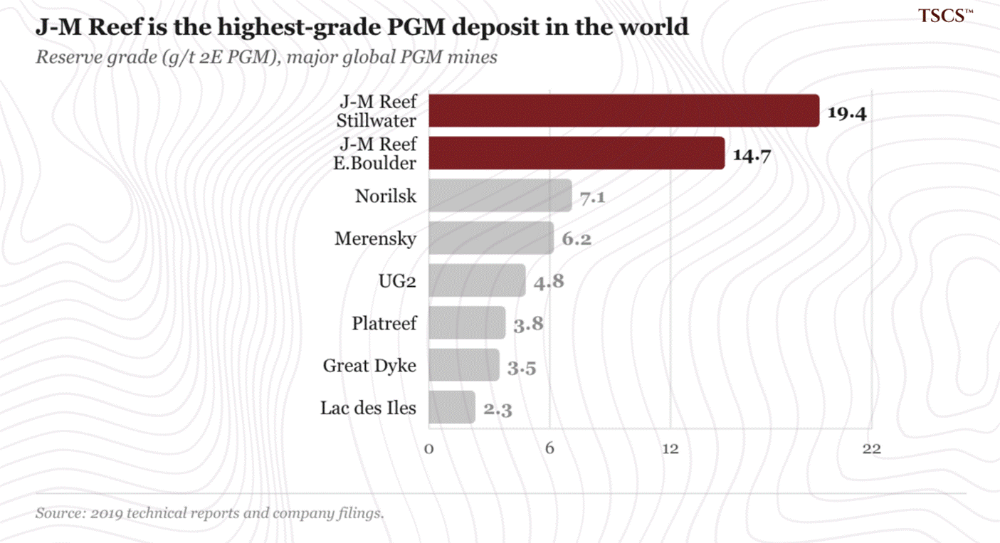](https://substackcdn.com/image/fetch/$s_!BVNO!,f_auto,q_auto:good,fl_progressive:steep/https%3A%2F%2Fsubstack-post-media.s3.amazonaws.com%2Fpublic%2Fimages%2F62cdbebb-3c95-49d7-b1d1-fecc40b1cc40_1405x763.png)

Sibanye-Stillwater reported US PGM total 2E Mineral Reserves of 19 million ounces and total 2E Mineral Resources of 79.1 million ounces as at December 31, 2024, on the J-M Reef. At the 2026 guidance midpoint of 290,000 2Eoz per year, those reserves carry a nominal mine life of approximately 65 years at current cut-off grade.

The point isn’t the headline number but that the resource constraint on this operation unambiguously isn’t the rock. It’s the capital cost to develop it. Continuous mineralization has been confirmed along the full 28-mile extent of the Complex through historical surface drilling, with extensive portions still awaiting detailed delineation.

## Stillwater (the mine) versus East Boulder: two different cost structures inside one franchise

The J-M Reef is worked by two separate mines. The distinction matters because they aren’t the same business.

Stillwater mine sits at the eastern end of the Complex near the town of Nye. Production since 1986, operating through two principal mining sections:

Stillwater West: in operation from 1986 until Q4 2024 when it was placed on care and maintenance as part of the restructuring. Accessed through a 580-meter-deep shaft and five surface portals.

Stillwater East: began ore production in 2017, accessed via three portal drives. Higher-grade than Stillwater West in the current mining sequence.

East Boulder sits 20 km west of Stillwater, developed at an original cost of $370 million and accessed via twin 5,800-meter tunnel-bore-machine portal drives. First production in 2002. Different mining dynamics: lower in-situ grade than Stillwater (historically about 14.7 g/t Pt+Pd reserve grade at East Boulder vs about 19.4 g/t at Stillwater per the 2019 technical report), but much more mechanized access via the TBM drives, which changes the labor-to-ore ratio and the marginal mining cost profile.

The distinction is the first thing sell-side models generally miss. When analysts model “Stillwater AISC at $1,203/oz” and apply it uniformly, they’re averaging across three underground operations (West, East, and East Boulder) with genuinely different unit economics. The restructuring focused 2025 mining on Stillwater East’s higher-grade material plus targeted East Boulder stopes where grade and productivity justified the cost. The 2025 Q1 production mix reflects this: Stillwater produced 40,063 2Eoz, East Boulder produced 31,928 2Eoz, and Q1 plant head grade ran at 13.91 g/t, the highest level since Q2 2020, explicitly because of the mix shift toward higher-grade Stillwater East feed.

[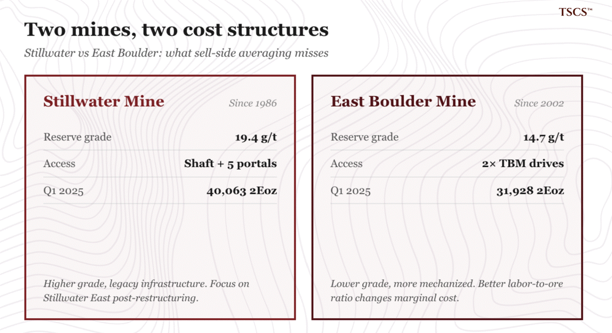](https://substackcdn.com/image/fetch/$s_!E6TE!,f_auto,q_auto:good,fl_progressive:steep/https%3A%2F%2Fsubstack-post-media.s3.amazonaws.com%2Fpublic%2Fimages%2F314cbce7-f5ef-4459-a053-5736a7650c8e_1405x767.png)

The ore blend tells you what to expect at the Columbus concentrator. Higher grade means more metal per tonne milled means lower unit cost per ounce. The 45-million-tonne combined reserve base at the two active operations isn’t a peer to most PGM deposits globally. It’s an outlier, and the outlier is what makes the operating leverage extraordinary through a price cycle.

## What the 2025 numbers actually say

Stillwater’s 2025 numbers, released February 20, 2026:

* Mined 2E PGM production: 284,069 ounces vs guided 270,000 (upper-end beat)
* 2E PGM sold: 283,622 ounces (in line with production)
* All-in sustaining cost: $1,203/2Eoz vs guided $1,360 (12% below guide)
* Section 45X advanced manufacturing credits recognized: $285M cumulative across 2023, 2024, and H1 2025 (mining plus recycling), of which $159M was the H1 2025 print for US PGM underground operations following finalized agreements with the contract refiner
* Recycling division adjusted EBITDA: $228M
* Group adjusted EBITDA: R37.8 billion (~$2.1 billion), +189% YoY
* Leverage: 0.59x net debt/EBITDA
* First dividend since 2023: R1.31/share (~32.68 US cents per ADR, ~$213M total)

[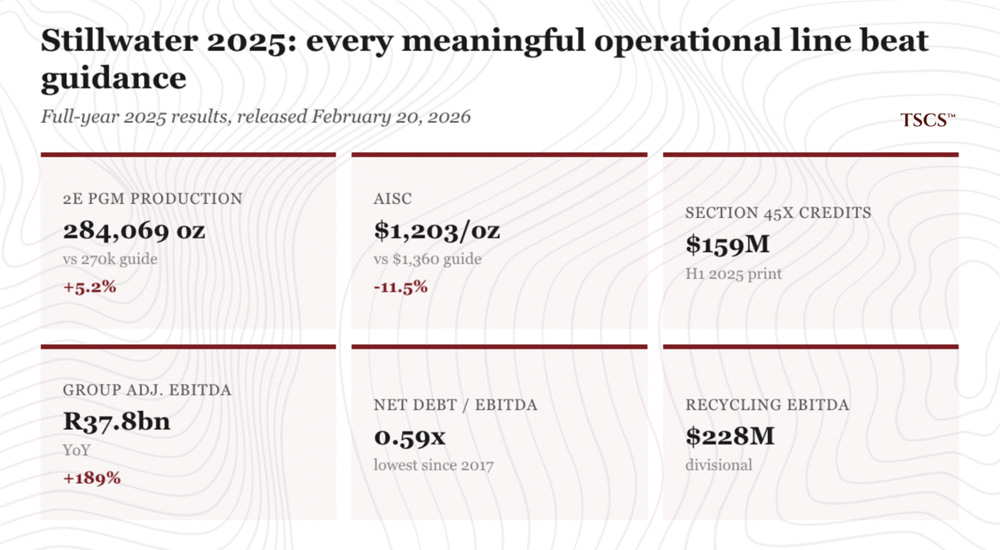](https://substackcdn.com/image/fetch/$s_!xr8u!,f_auto,q_auto:good,fl_progressive:steep/https%3A%2F%2Fsubstack-post-media.s3.amazonaws.com%2Fpublic%2Fimages%2Ff0ff80ec-0074-4c79-b21b-420bf61d0a0b_1405x774.png)

Stillwater returned to profitability in Q4 2025 at a palladium price averaging well below today’s $1,572 spot. Management’s 2026 guidance is 280,000-300,000 2Eoz at AISC of $1,520-1,580/oz excluding 45X credits. The AISC step-up from 2025’s $1,203 to 2026’s guide reflects higher development capital for sustaining the restructured mine plan plus inflation on labor and consumables. Factor in the 45X credit, structured as 10% of qualifying production costs for US-produced critical minerals. Sibanye-Stillwater’s own 2025 disclosure pegs the credit at approximately $110/oz on roughly $30M of estimated 2025 credits applied against ~280k oz of US production. Going forward I’m running $100-120/oz as the planning range, with the upper bound reflecting the 2026 mix shift toward higher-cost development tonnes (expanding the qualifying cost base) partially offset by the AISC step-up to $1,520-1,580 (which the credit applies against). At that rate the effective AISC sits at $1,400-1,480/oz, well below the headline guide. Credit has a known sunset: under the One Big Beautiful Bill Act, critical-mineral 45X credits step down to 75% in 2031, 50% in 2032, 25% in 2033, and terminate for production in 2034 and beyond, which triggered Sibanye’s R3.8B impairment of the US PGM business in H1 2025. Inside the 18-36 month thesis window the credit is intact; the long-duration valuation case has to absorb the phase-out. Investor-day stated long-term target is $1,000/2Eoz in 2024 real terms, achievable through a combination of Stillwater East grade optimization, East Boulder mechanization benefits, and 45X credit monetization.

## Terminal value under the 45X phase-out

At $110/oz on 290k oz, 45X contributes approximately $32M of annualized segment EBITDA at current scale. PV of the full phase-out stream at 10% discount is approximately $147M, or $0.20 per SBSW ADR. Against a counterfactual permanent-45X world, the phase-out costs approximately $173M in present value, or $0.24 per ADR. Small numbers because the R3.8B Sibanye impairment already reflects the write-down in reported book value, and the sell-side DCFs anchoring the $17-$18 target already embed the phase-out. The catalyst trade doesn’t need to adjust.

The offsetting lever is Sibanye’s January 2026 strategy update commitment to a $1,000/2Eoz AISC target in 2024 real terms, against 2026 guidance of $1,520-$1,580. Adjusting the target for expected inflation to the delivery year (likely 2028-2030) puts the nominal target at approximately $1,190/oz, producing a runway of $330-$390/oz on 290k oz, or $96-$113M of annualized EBITDA uplift at full realization. At 50% realization the phase-out is absorbed. At 25% realization it’s roughly neutral. Below 25% realization the long-term holder faces real terminal value compression.

Timing is the residual risk. The 45X phase-out bites 2031-2033. The AISC target has no announced delivery date. If Sibanye delivers the AISC program by 2030, the offset is in place when the credit rolls off. If the program slips to 2035 or beyond (typical for mining cost initiatives), there’s a 1-3 year gap worth $1-$2/ADR of compressed terminal value. The trigger to recalibrate is the 2027 Sibanye investor day and the 2026-2028 operating results, not the ITC vote. The 45X phase-out isn’t a reason to shorten the equity leg. It’s a reason to underwrite AISC execution explicitly for any holder past 2027.

**The operating leverage that every model is undersizing**

The US PGM segment generates roughly $18-19M of annualized segment EBITDA per $100 move in the palladium price at current production scale. The arithmetic: 290,000 2Eoz at guidance midpoint is a basket, not a palladium count. At the 77/23 Pd/Pt reef ratio, that’s 223,000 Pd ounces and 67,000 Pt ounces. A $100 move in Pd alone (holding Pt flat) produces $22.3M of incremental gross revenue on the Pd ounces only, since Pt is priced off its own benchmark. At 80-85% flow-through to EBITDA after Montana royalty and effective tax (21% federal plus single-digit state, partially offset by the 45X credit), that’s $18-19M per $100 Pd move. At $1,572 spot vs the $900-1,000 levels that triggered the 2024 restructuring, the segment is generating approximately $108-121M of incremental annualized EBITDA purely on the palladium price alone, before any US-basis premium from the ITC-affirmed order.

That’s the pre-catalyst baseline. Catalyst premium stacks on top.

Once the AD/CVD order publishes, domestic producers sell into a bifurcated market. Russian metal still clears to Asia, likely at a yuan-denominated discount to LBMA, because Nornickel won’t stockpile the 800,000 ounces a year previously clearing to US end-users. It’ll move to Shanghai. US refiners, autocat manufacturers, and OEMs buying Russian-origin metal face the combined cash-deposit wall (132.83% AD plus 109.10% CVD before statutory export-subsidy offsets) on every entry, so in practice they don’t buy Russian-origin metal at the border. What they buy is Stillwater, South African, Canadian, recycled, and third-country-processed material at a premium to the global clearing price.

The probability-weighted basis premium is 9% in year one, declining to 4-6% in years two and three as third-country leakage stabilizes. The tariff wall applies to unwrought palladium (HTSUS 7110.21.0000) only; platinum is not subject to the duty. The basis premium therefore accrues to the 223,000 Pd ounces of US production, not the 290,000 2E basket. On 223,000 Pd ounces at $1,572 spot, that’s $31.5M of incremental EBITDA in year one, $14-21M in years two through three. This is the number that flows into the price target. Smaller than the bull modeling range, and the downward revision from the headline 10-20% is what separates this thesis from the sell-side notes.

The operating leverage on the metal price itself is the larger lever. At $1,572 vs $900-1,000, the segment is generating $108-114M of incremental EBITDA purely on price, before any basis premium. The basis premium is the kicker. The Pd price is the thesis.

Combined: $108-114M from price plus $31.5M from basis equals $140-146M of incremental US PGM segment EBITDA vs 2024 trough. That’s the number driving the SBSW rerating, and it’s the number that has to survive a Pd drawdown for the equity leg to hold past the catalyst window. At this corrected scale, the equity leg’s standalone reward-to-risk is materially thinner than the 1:1 framing the earlier draft implied; see revised positioning below.

[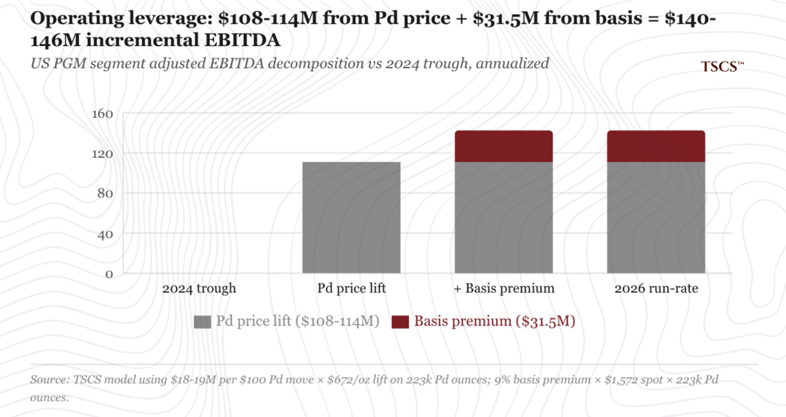](https://substackcdn.com/image/fetch/$s_!-hb3!,f_auto,q_auto:good,fl_progressive:steep/https%3A%2F%2Fsubstack-post-media.s3.amazonaws.com%2Fpublic%2Fimages%2F5ca1ef0e-2859-4dc6-ab16-26e585759100_1405x747.png)

## Blitz and Graham Creek: watching list, not thesis input

Blitz (eastward Stillwater extension) and Graham Creek (westward J-M Reef extension) were deferred in the 2024 restructuring at $900-1,000 Pd with $1,350 AISC. Neither sits in 2026 guidance. At $1,572 Pd with tariff-protected basis and 45X credits, the hurdle rate that put them on hold isn’t binding. Trigger is the 2027 investor day, not the 2026 ITC vote. I’m not modeling 2018-vintage capex against 2026 prices and calling the answer rigorous. The 60+ million ounces of 2E Mineral Resources on the J-M Reef not in current production is real and verifiable; the dollar value of the optionality isn’t estimable from public data. Monitoring list. Not in the price target.

## The rest of the portfolio

Sibanye isn’t single-commodity exposure anymore. South African gold operations at gold prices above $3,000/oz provided substantial cushion through 2025. Keliber lithium in Finland is commissioning, Sandouville is transitioning from nickel cathode to GalliCam pCAM, and the recycling base expanded through the Metallix and Reldan acquisitions sits alongside the PGM franchise.

The Columbus metallurgical complex is one of the world’s largest PGM recyclers from spent catalytic converters; in a scenario where the AD order drives autocat substitution or where end-of-life recycling supply rises on a Pd price move, recycling captures that spread too.

The January 2026 strategy update positioned the group as a “future-focused metals” platform for the energy transition. That’s the right framing for a holding that in 2024 was a near-term loss center and in 2026 is an integrated PGM, battery metals, gold, and recycling business with a tariff wall being built around its best US asset. What consensus still sees as a recovering PGM producer is actually a diversified critical-minerals platform with optionality on multiple commodities and latent production capacity on the single highest-grade PGM deposit in the world.

## The bear cases that should actually worry you

Everything above argues long. Let me argue the short seriously enough that a reader would question the thesis.

*Sell-the-news is real but smaller than the framing implies*. Every catalyst in the April 24 to June 19 window is expected to resolve affirmative. Preliminary AD was affirmative 3-0. Preliminary CVD was affirmative. ITC preliminary injury was unanimous. BASF already lost its standing challenge. No US industry group is organized against the petition. Base rate on preliminary-affirmative-to-final-affirmative in the modern era has historically run high, though I have not pinned a specific percentage to a cited source in this draft. SBSW is up 200% from April 2025 low. Palladium is up 71% YoY. Affirmative outcome is largely priced.

The reason this risk is bounded rather than catastrophic: rebuilt base-case target is $14.50-15.50 against $13.19 entry. Roughly 10-17% upside over 8 weeks, not 50%+ that creates panic-exit.

Sell-the-news at 10-17% upside is a mild risk rather than a disorderly liquidation event; the equity simply does not have enough room above entry to produce panic-exit pressure on the $14.50-15.50 target. Risk is consensus reading the AD final as catalyst-complete and selling through the May/June window before the ITC affirms; protection is sequencing exits to the cover rather than the publication.

*Russia reroutes and the order leaks*. Scope language in the prelim determinations covers HTSUS 7110.21.0000 (unwrought palladium and powder) and 7110.29.0000 (other unwrought forms), and the CVD scope includes third-country processing language. Commerce anticipated Russian material moving through Armenia, Swiss bonded warehouses, Hong Kong, Dubai. Anticipating isn’t catching. CBP enforcement against rules-of-origin gaming on refined PGMs has historically required affirmative petitioner-driven circumvention inquiries, each 12-18 months. If transshipment handles 30-40% of displaced Russian tonnes in the first 18 months, the US-basis premium compresses. Stillwater still captures the rest, but the trade doesn’t return what it returns in clean enforcement. Mitigating factor: Sibanye-Stillwater has standing and incentive to file circumvention petitions the moment suspicious patterns appear, and Commerce’s AFA-trained posture suggests responsiveness. Unmitigated version: OFAC separately acts on Russian PGMs via sanctions (making AD/CVD redundant), which could happen as part of broader Russia sanctions tightening and changes the legal basis for the US premium.

*The ITC walks at final*. ITC’s final injury determination applies a stricter standard than the preliminary “reasonable indication” finding, and the Commission makes affirmative final determinations in roughly half of contested cases. A negative ITC final vote vacates the case, releases all cash deposits collected since February 19, and ends the trade-remedy path for at least two years. Cases flipping affirmative preliminary to negative final are usually ones where the domestic industry recovers during the investigation, where imports fall for reasons unrelated to dumping, or where injury turns out attributable to demand factors rather than subject imports.

None applies here: Russian imports rose 50% interim 2025 vs interim 2024, subject imports reached 44.4% in the twelve months ending June 2025, Stillwater was on care-and-maintenance curtailment for part of 2025. Strong injury record. But the ITC is an independent agency, commissioner voting patterns can shift, and a political intervention (OFAC sanctions superseding AD/CVD, a Commerce-negotiated suspension agreement under 19 USC § 1673c, or a broader US-Russia diplomatic resolution) can’t be ruled out to zero.

*Demand destruction from the vehicle mix*. Palladium is a gasoline-ICE autocatalyst metal. EV penetration continues. On substitution, the current spread points the other way: platinum is trading at approximately $2,684 vs palladium at $1,572, a Pt premium of roughly $1,112 and a Pt-Pd ratio of 1.71 vs the historical average of 2.8. At this spread, the economic incentive is reverse substitution (Pt back to Pd) in gasoline autocat, which is a structural Pd demand tailwind, not a headwind. WPIC forecast the reverse-substitution cycle for 2026 in its mid-2024 outlook, and industry reports through early 2026 show incremental movement in that direction. The bear case on this axis is not substitution but rather EV penetration itself, which continues to erode the gasoline-ICE share of new fleet regardless of Pt-Pd economics. Demand destruction risk on the piece’s 18-36 month window is therefore bounded by the EV transition pace, which is slower in the US than in China or Europe and which multiple OEMs have publicly extended timelines on through 2025-2026.

*The Swap Dealer composition is wrong*. The 70/22/8 probability split is informed by three triangulating strands but not decisive. If the actual decomposition is closer to 30% end-user / 70% producer hedging, the squeeze dynamic compresses by 40-50% from the headline asymmetry. Position sizing already discounts for this, but a reader running larger size than 2-3% notional on the futures leg should reweight. Single piece of evidence that would update the prior: a Sibanye disclosure on US PGM forward sales in the Q1 2026 production report (expected late April / early May), or a Nornickel statement on Western hedge counterparty unwinds. Neither is guaranteed. Worth flagging: AAI partial-rerouting reading and the Swap Dealer end-user reading move together; if AAI silence turns out primarily political (candidate (b)) rather than partial-rerouting (candidate (a)), the third triangulating strand weakens and the prior compresses back toward 65/25/10.

*“This is a trade not an investment” risk*. Thesis runs on an 8-12 week window. Operating leverage and US-basis premium arguments for SBSW as a longer-term holding depend on palladium staying above $1,500/oz structurally, which requires resolution of EV transition timing and Chinese demand absorption that’s genuinely uncertain past 2027. Positioning trade, not an investment thesis. Confusing the two is how good trades become bad holds.

## What I am actually doing

The honest hierarchy and the liquidity constraint that defines it. PA futures carry the highest per-dollar asymmetry of any leg. They also carry 15,000 contracts of total open interest at a 100-oz multiplier, so the trade can’t be exited cleanly in a drawdown. Sizing here is liquidity-bound, not conviction-bound. I’m running PA June 2026 front-month at 2-3% notional, hard cap 4%. If the contract carried gold-equivalent open interest, I’d run this at 8-10%. It doesn’t, and pretending otherwise is how thin futures positions become forced sells.

Liquidity-management plan on the futures leg: scale into 1% notional this week, add 1% in the week of April 21 only if the COT print confirms, take final 0.5-1% the week of the ITC hearing if the tape and positioning data both confirm. Exits limit orders only, never market, staged across 48-hour windows. If liquidity deteriorates (front-month OI drops below 12,000), the position closes regardless of thesis state.

SBSW is the larger book-weight expression at 4% core, scaled to 6% only if the April 21 COT shows MM shorts deepening past -2,800. If managed money covers before April 21 (net short shallower than -1,800), the squeeze thesis is partially resolved and I hold 4% core without adding.

The equity is more crowded than the futures (consensus sell-side anchors at $17-18 vs $13.19 spot, well above this piece’s corrected $14.50-15.50 target, with BMO at Market Perform $18 and RBC at Outperform $17), but it can be sized to actually move book P&L, and the basis-premium plus operating leverage case extends past June 19. SBSW is the larger position because liquidity allows it, not because per-dollar asymmetry is greater. The futures leg is the higher-conviction trade carried at smaller size for structural reasons.

Reward-to-risk frame, rebuilt on the 9% basis-premium number and the corrected denominator (223k Pd ounces, not 290k 2E basket). Base case: $1,572-1,700 Pd with $141-150/oz year-one US basis premium on 223k Pd ounces produces SBSW at $14.50-15.50. Bull case requires Pd above $1,800 sustained plus basis above 12%, which gets to $16.50-17.50; I am not underwriting it.

Bear case on a clean ITC affirmative with basis absorbed disproportionately into intermediary margins rather than Stillwater realization is $12-13; the Commerce AD final on or around April 24 absorbs most of the catalyst and publication is sell-the-news. Worst case on a negative ITC final in June or an OFAC supersession is $8-10, floor set by US PGM segment EBITDA at $1,500 Pd plus South African gold cash flow at $3,000+ gold.

At $13.19 entry: $1.30-2.30 upside in base case against $3-5 downside in worst case. Approximately 0.3-0.6:1 reward-to-risk on the equity leg in isolation, which is negative expected value standalone. The trade structure that justifies this write-up isn’t the equity leg in isolation. It’s the combined book P&L from a 4-6% equity position with 0.3-0.6:1 reward-to-risk plus a 2-3% futures position with 30-50% upside in a forced-cover scenario, plus the call-spread overlay financed against the put hedge. Blended through, the structure produces 2-4% NAV contribution in the base case, 4-7% in a clean squeeze, and a defensible drawdown bounded by the put hedge.

[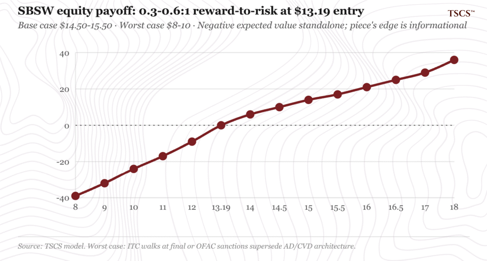](https://substackcdn.com/image/fetch/$s_!JKpa!,f_auto,q_auto:good,fl_progressive:steep/https%3A%2F%2Fsubstack-post-media.s3.amazonaws.com%2Fpublic%2Fimages%2F6159c216-197a-47cb-b947-905769d0ed45_1405x754.png)

That’s a competent positioning trade with explicit asymmetry on the smaller leg. It isn’t a thesis-defining concentration. The reason it’s worth the write-up: the futures squeeze setup, the AFA procedural backbone, and the AAI silence decomposition aren’t in any sell-side note I’ve seen, and the combination of the three produces an information edge institutional readers can size into expressions wider than the ones I personally use.

The piece isn’t “long SBSW into a tariff catalyst.” That trade is priced. The piece is “long the futures squeeze where you can carry it, with an equity position that pays on the fundamentals if the squeeze doesn’t materialize.”

Readers without futures access face a choice: wait for a pullback to $10-11 entry (which restores 1:1 reward-to-risk per the “Who the trade is for” section) or skip the equity leg entirely and take the informational edge without the financial exposure. Readers with futures access get the asymmetry on the smaller leg. Both positions legitimate. Neither consensus.

## Pricing the options structure

The call spread plus put structure needs pricing against the vol surface. Numbers below are illustrative estimates against a modeled vol surface (ATM IV 58% May, 62% June, 68% July, with typical catalyst-stock skew). Readers should confirm against live bid-ask before entry; SBSW 30-day IV has ranged from 45% to 75% over the past twelve months and the structure economics shift inside that range.

At SBSW spot $13.19 and April 17 close:

May 13/16 call spread: approximately $0.78 net debit per share, $2.22 max payoff if SBSW finishes at or above $16, breakeven $13.78. Reward-to-risk 2.85x.

June 14/17 call spread: approximately $0.64 net debit, $2.36 max payoff, breakeven $14.64. June 19 expiry coincides with the earliest statutory ITC final vote date, so this is the cleanest catalyst expression. Reward-to-risk 3.69x.

July $10 put sale: approximately $0.44 credit, offsetting part of the call spread debit. If SBSW stays above $10 through July 17 the credit is retained; if SBSW breaks $10 the sold put generates open-risk loss (capped only by the separate long $9 put hedge).

July $9 put purchase at 10-15% of equity delta: approximately $0.28 debit per share. ITC termination hedge, separate from the call spread financing. Together with the $10 short put it forms a bull put spread with $0.84/share max loss.

Full structure net cost: approximately $1.26/share ($1.42 call spread debit, minus $0.44 put credit, plus $0.28 hedge debit). Base case payoff at SBSW $15.50 at June expiry with stock above $10 at July: approximately $3.22/share. Reward-to-risk at base case 2.56x. Worst case drawdown (SBSW to $8, ITC walks): approximately $2.70/share loss, 2.14x initial outlay.

What moves with higher IV is the probability distribution, not the spread cost: wider distributions reduce the probability of finishing at max payoff, while put sale economics improve (more credit), partially offsetting.

Trigger to stop adding: SBSW trading above $14 before entry (compresses May spread asymmetry below 2x) or SBSW 30-day IV above 75% (probability of max payoff falls below 12%). The “stop above 65% IV” rule is directionally right but mechanically imprecise; the binding constraint is distribution width, not spread cost.

Sizing: at $1.26/share against a 4-6% equity position, a 1-2% options notional overlay funds 13-20 contract sets per $1M of equity, contributing 1-3% of effective equity delta through the window.

**Paired trade** for position-flat institutional readers: long SBSW / short auto OEM cost basket (F, GM, STLA). Autocat cost pass-through squeeze. The OEMs eat a fraction of the Pd cost rise, Stillwater captures a fraction of the basis spread, and the pair removes most of the macro tape risk. Beta-neutral sizing at 1:1 dollar notional. The more capital-efficient expression if outright SBSW is already crowded in the book, or if the macro environment in late April forces equity net exposure lower.

**ITC termination hedge**: SBSW July 2026 $9 puts at 10-15% of long-equity delta. Drag on returns if the order publishes cleanly. Capital preservation if the ITC vote surprises negative. Priced cheaply because the market assigns low probability to the negative outcome, which is exactly why the hedge is worth carrying. If the April 27 hearing produces evidence of Commissioner skepticism toward the injury finding, I increase the hedge to 25-30% of delta.

## Kill switches, in order of priority:

1. *Managed-money net position*. If the weekly COT (Fridays, reporting Tuesday-of) prints net short shallower than -1,500 in any single week before the Commerce AD final, exit 50% of the futures leg and 25% of the equity leg on the Friday of publication. If it prints net long at any level before June 19, exit 100% of the futures leg and 50% of the equity leg the same session. Squeeze thesis dead at that point regardless of SBSW price action.
2. *Commerce AD final margin. Statutory default April 24 (absent postponement).* If the final margin prints at 110% or higher, hold. Between 80-110%, exit 25% on announcement. Below 80%, exit 50% on announcement; signals partial Russian participation or non-AFA methodology and the combined wall compresses.
3. *SBSW price target*. If SBSW trades through $16 before the ITC final vote, trim to 1.5% core and let the residual run into June 19. Fundamental case is largely realized at that level on the rebuilt 9% math, which caps base case at $15.50.
4. *ITC hearing read*. April 27. If two or more Commissioners express skepticism on the injury record (specifically on attribution of Stillwater’s 2024 curtailment to subject imports vs Pd price decline), increase the July $9 put hedge to 25-30% of equity delta. If hearing is procedurally clean and questioning is consistent with the preliminary 3-0, hold hedge at 10-15%.
5. *Operational incident at Stillwater*. Safety event, labor action, production shortfall greater than 10% vs Q1 2026 run-rate, or any disclosure breaking 2026 guidance credibility. Full exit on announcement regardless of tariff outcome.
6. *White House or Treasury intervention*. Any statement suggesting OFAC sanctions on Russian PGMs that would supersede the AD/CVD architecture, a Commerce suspension agreement under 19 USC § 1673c, or a US-Russia diplomatic resolution prompting the petitioner to withdraw. Full exit on headline. A binary I have no edge on.
7. *Implied vol regime change*. If SBSW 30-day implied vol prints above 75% in the week of April 21, stop adding to call spreads. Vol premium starts eating the asymmetry above that level.

[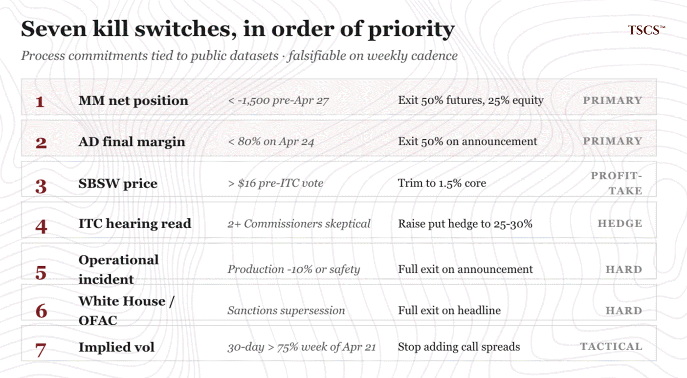](https://substackcdn.com/image/fetch/$s_!uMB_!,f_auto,q_auto:good,fl_progressive:steep/https%3A%2F%2Fsubstack-post-media.s3.amazonaws.com%2Fpublic%2Fimages%2Fb7df656a-f7e1-4b2c-a131-6fb8e4c08c0c_1405x774.png)

What I’m not doing: shorting palladium producers as pair hedge (too crowded), shorting platinum (Pt-Pd substitution argument cuts both ways), taking directional positions in Chinese palladium-consuming equities on the assumption Russian metal floods Asia (leakage is real but the equity expression is thin and hard to size).

## What I’m watching

CFTC Tuesday snapshot lands Friday afternoon. April 14 report publishes April 17, April 21 publishes April 24, April 28 publishes May 1. Each one reads whether managed-money short is covering into the catalyst or carrying through. Thesis-confirming: net short deeper than -2,500 on April 17, deeper than -2,200 on April 24, and any net short position carried through May 1 (first report after the AD final). The April 28 report is the highest-information print in the sequence; if MM is still net short -1,500 or worse the day after Commerce AD final, the squeeze setup is intact and the futures leg holds through the ITC vote. If MM has covered to flat or net long by May 1, the squeeze has resolved on the AD print and the trade exits per kill switch 1.

[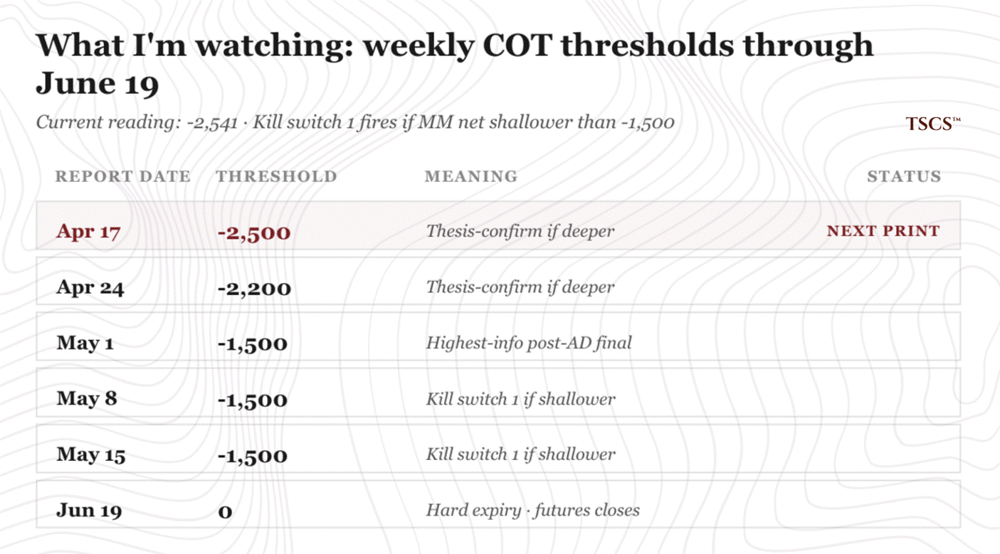](https://substackcdn.com/image/fetch/$s_!WqoN!,f_auto,q_auto:good,fl_progressive:steep/https%3A%2F%2Fsubstack-post-media.s3.amazonaws.com%2Fpublic%2Fimages%2F5df796a2-4f28-4e29-b210-25542be7c1ca_1405x779.png)

Federal Register notices for AD final, CVD final, and ITC scheduling updates. Commerce can extend the AD final under 19 USC § 1673d(a)(2)(A) on petitioner request (historical default in roughly half of cases), and the petitioner can request alignment of AD and CVD finals under 19 CFR § 351.210(b)(4). Neither is on the docket as of the April 17 close. If either filing appears, the catalyst schedule extends 6-8 weeks and kill switch 1 thresholds reset.

SBSW tape and options skew going into April 27. Rising implied vol on the week-of is the market pricing in the binary; sharply rising put skew against flat call skew is the market pricing in downside risk and is a warning sign I’d size smaller through.

## The bottom line

Everyone is watching 132.83%. The number that matters is 2,541. Managed Money is net short 2,541 contracts of NYMEX Palladium going into a four-catalyst stack running April 24 through June 19, in a 15,000-contract market where hedge funds have been adding 500 contracts per week to the wrong side of the book for three weeks. The case was built on Adverse Facts Available because no Russian producer defended it. The single US downstream opponent, BASF, fought on industry-support grounds, lost, and was joined by no US OEM, no other catalyst manufacturer, no trade association.

AAI silence is the most important signal in the case, and it cuts two ways. Most likely (40% weight on partial-rerouting, 40% on political cost, 20% on margin-absorption): year-one basis premium realized by Stillwater is 8-11% rather than the 10-20% headline math implies. I’m running 9% as the planning number, which produces $31.5M of incremental annualized EBITDA from basis on the 223k Pd ounces subject to the tariff, on top of the $108-114M from the Pd price itself. This is the version I’m underwriting. The sell-side bull case (HSBC at $24.80) runs higher basis plus a much more aggressive platinum deck. I don’t underwrite either.

The trade isn’t “long SBSW into a tariff catalyst.” That’s the consensus trade and it’s priced. The trade is the futures squeeze, hedged by an equity position paying on fundamentals if the squeeze doesn’t materialize. The futures leg carries the asymmetry. The equity leg carries the size. Readers running the equity without the futures get the information edge but not the payoff asymmetry.

Two real risks. Benign: both cohorts unwind into the same favorable tape, the move compresses into a 48-hour window post-AD-final, and the trade pays in full but requires faster exit discipline than single-name event-driven traders usually have. Protection is timing: trim equity into the cover, not into the announcement; hold the futures leg through June 19 because the squeeze is the trade. Malign: ITC walks at final, OFAC sanctions on Russian PGMs supersede the AD/CVD architecture, or a Commerce-negotiated suspension agreement under 19 USC § 1673c removes the basis-premium economics. Both legs break simultaneously. Protection is the July $9 puts at 10-15% of equity delta, scaled to 25-30% if the April 27 hearing flags Commissioner skepticism.

**Hard expiry, and the test this piece will be judged on.** If the CFTC Disaggregated COT prints managed money net short shallower than -1,500 in any single weekly report before the Commerce AD final, the futures leg exits 50% on the Friday of publication. If MM prints net long at any level before June 19, the futures leg exits 100% the same session. That is the falsifiable commitment. Not a price target, not a date-and-dollar call, but a process commitment tied to a public dataset published weekly on a schedule I don’t control. Readers can score this piece against that commitment on any Friday afternoon between now and June 19. The equity leg can survive on fundamentals past June 19 at the rebuilt $14.50-15.50 base-case target. The futures leg can’t. The asymmetry is real, the asymmetry is bounded, and the asymmetry is measurable against a reported number.

---

*Nothing in this post is investment advice. Positions disclosed are my own and may change without notice.*

*Primary sources: 91 FR 7958 (Feb 19, 2026); 91 FR 11949 (Mar 11, 2026); 91 FR 8899 (Feb 24, 2026); 90 FR 41032 (Aug 22, 2025); 90 FR 41039 (Aug 22, 2025); USITC Publication 5671 (Sept 2025); CFTC Disaggregated COT Futures Only, contract code 075651, report of April 7, 2026; Sibanye-Stillwater 2025 full-year results (Feb 20, 2026). EDIS filing numbers (860501, 859104, 860368) and Federal Register pagination verified at edis.usitc.gov and federalregister.gov before publication. Readers are encouraged to independently confirm.*