Twenty-two days ago Brent peaked at $119.50 intraday. Today the Dec 2026 contract is at $82, pricing as if mine clearance, insurance repricing, refinery cold-starts, and permanent reservoir impairment all resolve by year-end. They won’t. That’s the structural call this series has made for three weeks.

Before I update it, one piece of live business. I published a palladium kill switch on April 18. It’s one COT print from firing. Friday 3:30pm ET, the CFTC publishes April 21 data. The April 14 print was -1,808 managed money net short, down from -2,541 the week before. Twenty-nine percent of the short book covered in a week. One more print like that and I cut the futures leg in half, regardless of what Commerce does three days later on the AD final.

[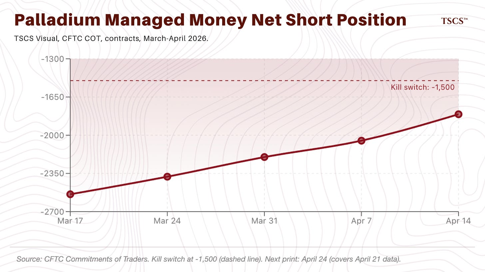](https://substackcdn.com/image/fetch/$s_!DTDm!,f_auto,q_auto:good,fl_progressive:steep/https%3A%2F%2Fsubstack-post-media.s3.amazonaws.com%2Fpublic%2Fimages%2F09ee39d2-b191-4a07-8b4e-d7452fb20cf2_1886x1058.png)

Why the switch fires before the catalyst: the trade was sized for a forced cover. If shorts are already running, the squeeze weakens. The AD print still moves spot. You just don’t get paid for it. Base case on Commerce: final at or near 132.83%, no postponement.

[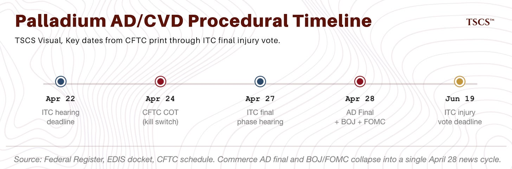](https://substackcdn.com/image/fetch/$s_!yxoo!,f_auto,q_auto:good,fl_progressive:steep/https%3A%2F%2Fsubstack-post-media.s3.amazonaws.com%2Fpublic%2Fimages%2F5bdde9d3-bf6a-43dd-8903-6f68061097e8_1884x624.png)

The actual price path of the last three weeks was violent.

Front-month crashed 9.1% on April 17 when Iran said the Strait was reopened, rallied 5%+ on April 20 when Iran closed it again, and has been bouncing around $95-99 since.

Back end drifted about $3 lower. Curve compressed from $27 backwardation to $16.

[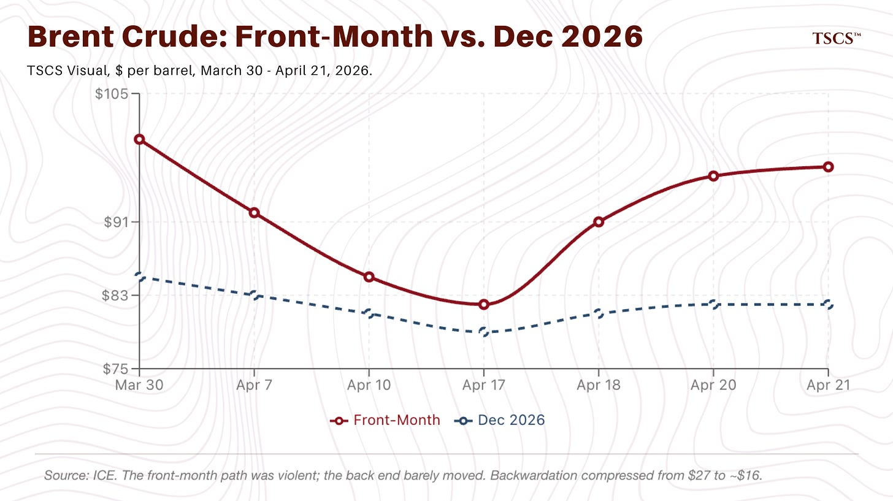](https://substackcdn.com/image/fetch/$s_!vWlN!,f_auto,q_auto:good,fl_progressive:steep/https%3A%2F%2Fsubstack-post-media.s3.amazonaws.com%2Fpublic%2Fimages%2F257a351c-37d0-422f-908e-daf402a94b98_1888x1060.png)

The curve hasn’t caught up to the physical evidence. It hasn’t run away from me either. Narrower claim than three weeks ago. Good enough reason to rebuild this piece around the scoreboard.

*The next two weeks resolve more than the last twenty-two did. April 28 collapses BOJ, FOMC day one, and the Commerce AD final. Alamos and Agnico Eagle print. Mosaic on May 11. The palladium COT on Friday. Behind the wall: what I’m watching, what kills each thesis, and the full scoreboard of every call in the series.*

Subscribed

## **The Scoreboard**

A reader asked for this and the ask was sharp enough that I’m making it permanent. A scoreboard that only shows the wins is marketing. The allocators reading this have the tools to mark me to market either way. Better to do it myself than make them do it.

A ledger of every substantive call, mostly from the last 90 days, plus older ones whose status has moved recently. Publication date, thesis, horizon, current status. Four buckets: Active (still in horizon, not falsifiable yet). Resolved correct (validated). Resolved wrong (falsified or tracking against me). Superseded (a later piece replaced the framing).

First version, incomplete. Eight active, four partial misses, one superseded. I’ll add more as I audit the back catalogue.

If you’ve kept a record of calls I’ve missed, send it. I’d rather be corrected publicly than have the scoreboard turn into its own credibility problem.

[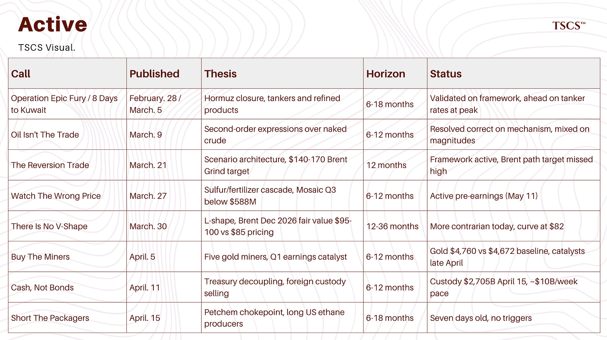](https://substackcdn.com/image/fetch/$s_!IwYb!,f_auto,q_auto:good,fl_progressive:steep/https%3A%2F%2Fsubstack-post-media.s3.amazonaws.com%2Fpublic%2Fimages%2Fd4950ce9-bd5b-4505-87d3-9e43db745ace_1792x1006.png)

### **Active**

**Operation Epic Fury / 8 Days to Kuwait (February 28 / March 5, 2026).** Built the geopolitical framework and the physical market mechanics for Hormuz closure. Tankers and refined products framed as the highest-quality second-order expressions. **Status: Active, directionally right.** Kalamos fixed at $770k/day Yanbu-India in early March. Physical Oman ran to $170+. Jet and diesel cracks blew out everywhere that matters. The framework held. The specific magnitudes I published for tanker rates and crack spreads were conservative versus the peak.

**Oil Isn’t The Trade (March 9).** Argued tankers, LNG, and refined products as better risk-adjusted expressions than naked crude. **Status: Right on mechanism, mixed on magnitudes.** Tanker and LNG equities moved during the window. Naked crude gave you the $35 intraday swings I warned about. Readers in the second-order trades didn’t get stopped. Tanker rates pulled off the peak faster than I thought, so the second wave of entrants got a smaller piece than the first. Framework worked, timing wasn’t clean.

**The Reversion Trade (March 22).** Introduced the scenario architecture with Taco 20%, Grind 50% base case, Unthinkable 30% after the Ras Tanura and Yanbu strikes. Projected Brent $140-170 over 4-8 weeks in the Grind scenario, sustained above $120 for a full quarter. **Status: Wrong on specific Brent path, framework still operative.** Brent peaked at $119.50 intraday on March 9, almost two weeks before the piece ran. The peak was already behind us when I called for $140-170. The Grind floor ($120 sustained for a full quarter) never hit. The ceiling ($170) wasn’t even close. Front-month has mostly traded $85-112 since April 1. If you sized on the Grind path I published, you sized for a bigger move than you got. Scenario architecture worked. The specific levels inside it didn’t. Magnitude miss, and worse than a standard magnitude miss because the top was in before the piece printed.

**Watch The Wrong Price (March 27).** Sulfur/fertilizer cascade with Mosaic Q3 EBITDA below $588M consensus as the specific testable target. Scenarios ranged from ceasefire-by-mid-April (39%) to closure-through-Q3 (24-33%). **Status: Active pre-earnings.** USDA Prospective Plantings on March 31 confirmed the corn-to-soy acreage shift. Nickel sulphate vs LME nickel divergence widened. Urea-to-corn affordability still at the 4.6 sigma extreme. Mosaic reports May 11. The mid-April resolution I put at 39% got falsified because it didn’t happen. That mass has to move, and most of it goes to the closure-through-Q3 tail.

**There Is No V-Shape (March 30).** Structural L-shape thesis on post-Hormuz infrastructure rebuild. Scenarios: Grind 65%, Snap 15%, Drag 20%. Specific argument that Brent Dec 2026 at $85 was $10-15 below the $95-100 fair value implied by the physical engineering constraints. **Status: Active, more contrarian than at publication.** Dec 2026 is at $82, a couple dollars below March 30 and further below my $95-100 fair value. Backwardation went from $27 to $16. The long end drifted down, the front end held near $97. Both moves worked against me but the back end is where the mispricing is. The curve still isn’t pricing the physical engineering. Scenario weights below.

**Buy The Miners (April 5).** Five gold mining names as the equity expression of inflation-plus-constrained-Fed. Gold at $4,672 baseline. **Status: Active.** Gold $4,760, up modestly from the baseline. Alamos reports April 29, Agnico Eagle April 30. Perpetua’s EXIM final board approval is expected before end of month. Gold’s held. Fed’s constrained. Both legs of the thesis intact.

[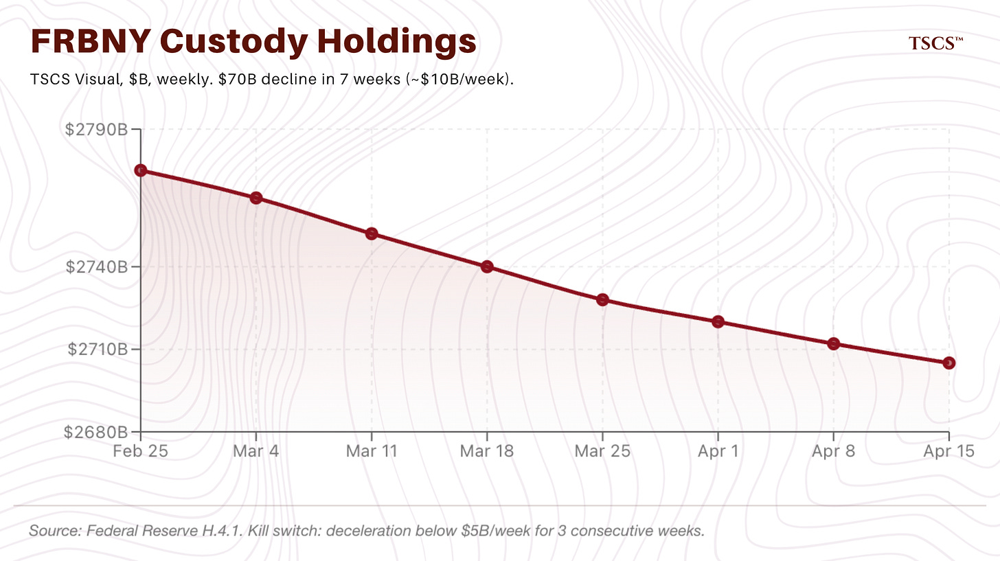](https://substackcdn.com/image/fetch/$s_!oWZ6!,f_auto,q_auto:good,fl_progressive:steep/https%3A%2F%2Fsubstack-post-media.s3.amazonaws.com%2Fpublic%2Fimages%2F859aaf45-8cc9-444d-892f-0ecdd8cfca13_1890x1060.png)

**Cash, Not Bonds (April 11).** Treasury market stress thesis. Paths: Snap 15%, Grind 55%, Kill Zone 30%. Specific kill switches on FRBNY custody data (below $5B/week for three consecutive weeks), oil sustainably below $80, Fed SLR exemption, BOJ holding on April 28. **Status: Active, no kill switches hit.** FRBNY custody went from $2,775B on Feb 25 to $2,705B on April 15. That’s $70B over seven weeks, about $10B a week. Well above the $5B threshold. Oil above $80. No SLR exemption. BOJ April 28.

**Short The Packagers (April 15).** Petchem feedstock chokepoint thesis. Scenarios: Snap 15%, Grind 60%, Kill Zone 25%. Seven specific kill switches. **Status: Active, nothing triggered.** Seven days old. US-Asia HDPE spread still above $1,000/mt. Dow Q1 tomorrow is the first real mark-to-market.

### **Tracking Mixed or Partially Wrong**

**How America Goes Bankrupt / basis trade call (December 2025).** Warned that $1.5 trillion of basis trade at 20x leverage was a reflexive time bomb that could break under Treasury market stress. Implied the Hormuz-type shock was exactly the catalyst that would test it. **Status: Framework right, specific outcome wrong.** The Hormuz shock produced real stress. MOVE hit 108 on March 20. Citadel GFI drew down 8.2% in March. But the basis trade didn’t break. Repo held. No forced liquidation. I framed the unwind as plausible under stress. The stress showed up. The unwind didn’t. If you positioned for the unwind, you bled premium. The fragility is still real. The tail didn’t fire.

**The Reversion Trade Brent price targets.** Projected Brent $140-170 in the Grind scenario. Actual peak was $119.50 intraday on March 9, almost two weeks before the piece was published. **Status: Wrong on magnitude.** Direction was right. The Grind floor ($120 sustained for a full quarter) didn’t hit. The ceiling ($170) wasn’t close. Readers sizing on the Grind-scenario Brent path sized for a bigger move than they got. Framework worked. The price targets inside it didn’t.

**Alamos Gold AISC trajectory (June 2025 initiation).** Anchored the thesis on the company’s guided path to roughly $1,175/oz AISC by 2027. In February 2026 guidance, the $1,200-1,300 target slipped to 2028 and 2026 AISC guided to $1,500-1,600. **Status: Revised.** I reframed around the margin (gold minus AISC) in Buy The Miners on April 5. Margin expansion beat cost creep roughly 5:1, so the thesis played out, but readers who sized on the declining-cost leg specifically saw a different picture than the one that actually emerged. The original cost trajectory call was wrong. I should have flagged the revision louder when it happened.

[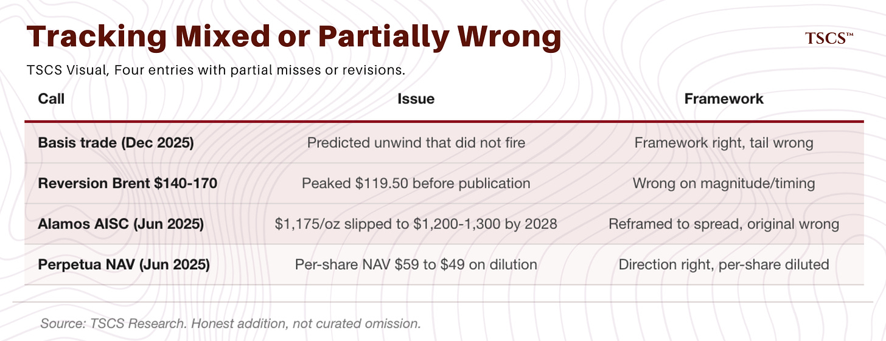](https://substackcdn.com/image/fetch/$s_!FvZP!,f_auto,q_auto:good,fl_progressive:steep/https%3A%2F%2Fsubstack-post-media.s3.amazonaws.com%2Fpublic%2Fimages%2F4f38653a-38c6-48e7-a75e-91e441242b6b_1890x728.png)

**Perpetua Resources per-share NAV (June 2025 initiation).** Modeled per-share economics at a share count roughly half the current figure. Project NAV went from $3.7B to $6.1B, shares outstanding roughly doubled, per-share NAV declined from approximately $59 to approximately $49. **Status: Revised.** Project trajectory right, per-share economics diluted. Acknowledged in Buy The Miners. If you bought at $13.50, you’re up. The remaining upside from $29 is tighter than the original setup implied.

### **Superseded**

**CF Industries Henry Hub input cost framing (early March).** Originally described near-term risk of LNG export arbitrage pulling Henry Hub higher as a threat to CF margins. Corrected March 28 in Watch The Wrong Price footnote after a reader pointed out US LNG terminals were running at nameplate and the export-arb transmission was gated by Golden Pass and Corpus Christi Stage 3 coming online. The CF long thesis holds. The specific transmission-timing framing was off by 12-18 months and has been replaced.

### **What the Scoreboard Actually Says**

Zero fully falsified. Doesn’t mean I’m right. Means the framework isn’t dead yet, and the curve is pricing it harder than it was three weeks ago.

Eight active, four partial misses or revisions, one superseded. Most active calls are inside their horizon (6-18 months) and can’t be marked yet. Of the calls old enough to judge: two are direction-right, magnitude-miss (Reversion Trade Brent, Oil Isn’t The Trade tanker magnitudes). One is framework-right, specific-call-wrong (basis trade). Two are company revisions I’ve already acknowledged.

Scoreboard updates every issue. Send me calls I’ve missed. Credibility only works if I add what’s missing rather than curate what’s here.

[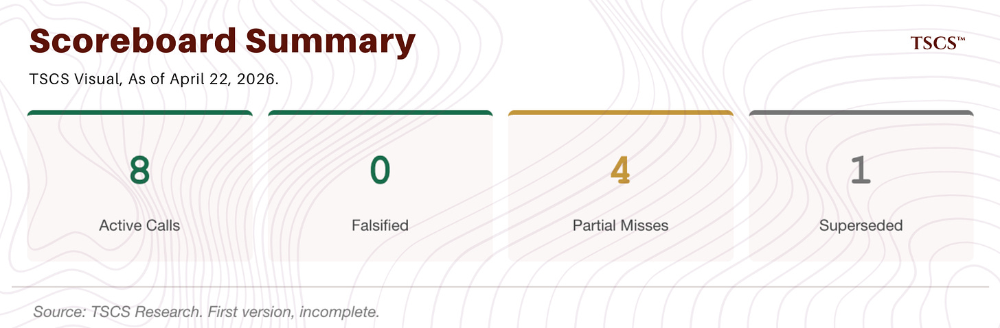](https://substackcdn.com/image/fetch/$s_!14XJ!,f_auto,q_auto:good,fl_progressive:steep/https%3A%2F%2Fsubstack-post-media.s3.amazonaws.com%2Fpublic%2Fimages%2Ff7b834cb-bc40-480a-92f0-d352906b63c2_1884x620.png)

## **What Moved In Twenty-Two Days**

March 30 piece: three scenarios. Grind 65%, Snap 15%, Drag 20%. Said if Iranian strikes paused, some mass moves to Snap. If strikes escalate, it moves to Drag. The pause didn’t hold. The escalation is happening.

April 7/8: US and Iran announce a two-week ceasefire, brokered by Pakistan. Gold drops 2%, oil gives back 8%, the Taco camp gets 72 hours of vindication. The ceasefire as a cessation of strikes held. The talks didn’t. Islamabad, April 11, a 21-hour session ended without agreement. April 12, Trump declared a naval blockade. Enforcement April 13. April 18, Iran fired on commercial vessels and closed the Strait again in response to the blockade. April 19, the USS Spruance intercepted the M/V Touska in the North Arabian Sea, fired into its engine room, seized it. April 21, Trump extended the ceasefire indefinitely, conditional on Iran submitting a unified proposal. Vance’s Pakistan trip cancelled the same day. The ceasefire still exists on paper. It’s bought no Hormuz reopening, no blockade lifting, no framework.

[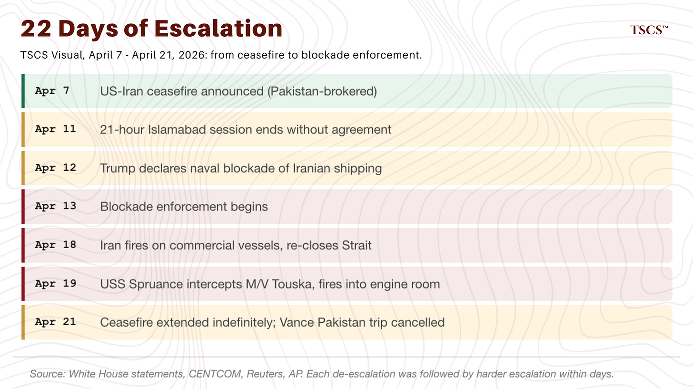](https://substackcdn.com/image/fetch/$s_!DL_4!,f_auto,q_auto:good,fl_progressive:steep/https%3A%2F%2Fsubstack-post-media.s3.amazonaws.com%2Fpublic%2Fimages%2F9092cef0-9ea8-46db-95c3-042a3a57825c_1886x1058.png)

This sequence does one thing to the March 30 architecture: it validates Vali Nasr’s endurance thesis at scale. Nasr’s argument, which I cited in There Is No V-Shape, was that Iran built a deliberate low-level harassment strategy after the June 2025 twelve-day war. Drones, mines, selective engagement, willingness to take US strikes in exchange for keeping the Strait degraded. The April 18 re-closure and April 19 Spruance engagement are exactly what that playbook predicts.

HFI Research’s April 20 piece puts numbers on the mechanics: floating storage takes 30-40 days to offload once the Strait reopens, 3 months for meaningful re-entry through the chokepoint, cumulative inventory loss already around 1 billion barrels and growing at roughly 400 million per month. Even a clean diplomatic resolution doesn’t stop the onshore draws. Iran is running the same playbook at Hormuz, at scale, with an order of magnitude more capability.

Mapping back to March 30: Taco needed a clean resolution, Iran clearing mines for sanctions relief, Brent back to $85-90 by Q4 2026. Materially less likely today than three weeks ago. Grind needed low-level disruption continuing, offsets covering 40-60% of the supply gap, product spreads staying elevated into Q3 2026. That’s the movie we’re in. Drag needed escalation continuing, Nasr’s thesis playing out in public, a degraded-but-not-closed Strait persisting for quarters. That’s now the operating condition.

Updated weights. Ranges, not point estimates. False precision is the enemy when you’re pricing political outcomes driven by individual leadership calls where I have no edge.

Taco: **3-12%, mid 8%. Down from 15%**. What closes it further: the extended ceasefire lapsing without a framework, continued Iranian strikes on shipping, blockade enforcement with no off-ramp. What opens it: a durable ceasefire with observable transit compliance and commercial volumes back above 60 a day.

Grind: **50-60%, mid 55%. Down from 65%**. Still base case, but narrower. Mass moved to Drag more than Snap, because the last three weeks have been harder-edged than the Grind I originally defined (intermittent ceasefires, escorted convoys at 30-45 ships a day). Current reality has more persistent disruption and harder-to-price direct US-Iran military engagement.

Drag: **30-45%, mid 37%. Up from 20%**. Endurance thesis has gone from hypothesis to operating reality. Nothing in the last three weeks has broken Nasr’s framing. Only thing that reduces Drag is durable de-escalation, and the current negotiation track is too fragile to price.

The ranges matter. “Grind 55” is more precision than I have. “Grind 50-60” is my actual uncertainty. If you walk away with the point estimate in your head, you’re reading more confidence into my numbers than I meant to put there. Grind is still modal. Drag is meaningful tail risk. Snap is still possible but has become the least likely of the three.

[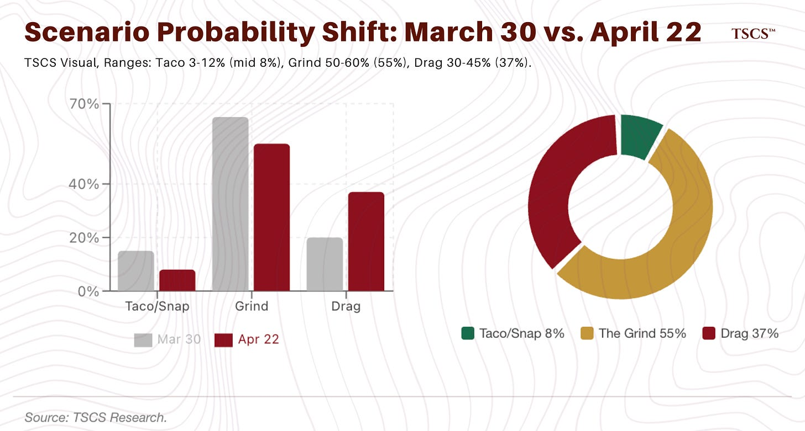](https://substackcdn.com/image/fetch/$s_!qiYJ!,f_auto,q_auto:good,fl_progressive:steep/https%3A%2F%2Fsubstack-post-media.s3.amazonaws.com%2Fpublic%2Fimages%2Ff0de78f0-3dde-4d30-bd23-3d321739a99d_1890x1014.png)

## **The Gap**

Front-month Brent at $94-99. Dec 2026 at roughly $82. VIX at 18.87 at Monday’s close, having traded a range of 17 to 32 over the last 30 days. S&P 500 at 7,109. MOVE Index off the March 20 peak of 108 but I do not have today’s reading to the decimal. Credit spreads tightened off March wides. Fed funds futures at 99.5% hold in April.

None of this fits what I see in the physical markets. Not a single data point.

[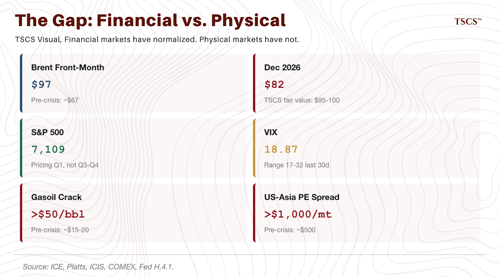](https://substackcdn.com/image/fetch/$s_!9rvF!,f_auto,q_auto:good,fl_progressive:steep/https%3A%2F%2Fsubstack-post-media.s3.amazonaws.com%2Fpublic%2Fimages%2F3146e93a-d73a-4895-915b-e2d19a36647c_1890x1048.png)

Singapore gasoil cracks remain above $50/bbl. Jet fuel cracks are still elevated though off the peak. The US-Asia polyethylene spread is above $1,000/mt. Fertilizer cascades are playing out against the timelines in Watch The Wrong Price. FRBNY custody holdings continue declining at roughly $10B per week. VLCC spot rates remain at multiples of peacetime levels. Physical Oman crude trades at a material premium to financial Brent. Gold at $4,760 holds despite positive real rates near 1.91% on 10-year TIPS.

So what does equity see that I don’t, or what do I see that equity ignores?

Three cases. Two are operative at once.

**Case one, earnings insulation.** US corporates are more insulated from a Gulf shock than they’ve ever been. Direct US Persian Gulf crude imports are 2.5% of consumption. US crude production runs at 13.6 million barrels per day. US petchem crackers run on Permian ethane and are printing cash (Dow reports Q1 tomorrow). US LNG exporters are collecting arbitrage on the Qatar impairment. The consumer has absorbed gasoline back to $4.09 without visible demand destruction yet. Corporate balance sheets are clean in aggregate.

Insulation isn’t immunity. The channels that matter are specific and datable:

* Consumer staples and discretionary exposure to food inflation, which the sulfur cascade transmits into retail prices in 6-12 months. Q4 2026 and Q1 2027 S&P earnings.
* Airlines and logistics exposure to jet fuel cracks at $90-100, which should appear in Q2 2026 guidance. Delta, United, American, UPS, FedEx have April-May earnings windows.
* Insurance industry exposure to marine war-risk premiums at 1-3% of hull value, which flows through reinsurance renewal cycles in Q3-Q4 2026. Berkshire, AIG, Allstate, Travelers.
* Industrial capex exposure through input cost inflation, which transmits into the Q3-Q4 2026 capex guidance cycle. Caterpillar, Deere, Honeywell, the chemical names we are long and short on either side.
* Consumer credit exposure through the combination of gasoline prices, employment softness (DiMartino Booth’s framework on gig economy masking), and private credit fund gating. Q3-Q4 2026 is the window.

None of these transmit in Q2. Most land in Q3 or Q4. Equity is pricing Q1 results and early-April Q2 guidance correctly. It’s not yet pricing what Q3 and Q4 should look like if Grind holds.

[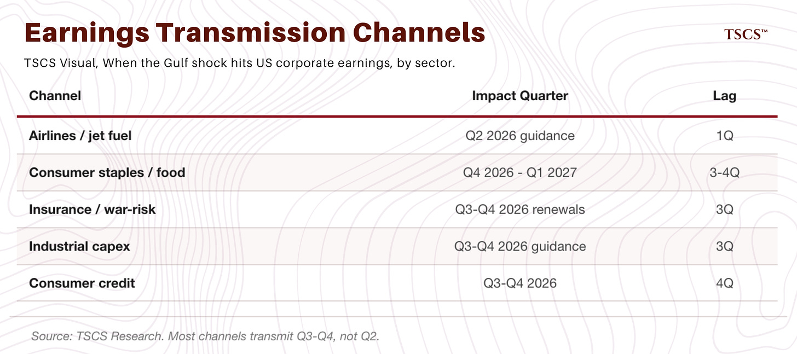](https://substackcdn.com/image/fetch/$s_!emwI!,f_auto,q_auto:good,fl_progressive:steep/https%3A%2F%2Fsubstack-post-media.s3.amazonaws.com%2Fpublic%2Fimages%2F80ae728b-44b4-4c00-9a23-48e89865f5e6_1890x840.png)

**Case two: flows.** The S&P is as much flows as fundamentals, and the flows are passive. Target-date and passive vehicles keep buying regardless of Iran. Systematics rebuilt long exposure as realized vol came off the March peak. Buybacks resumed in Q2 at pace. The 12% March drawdown cleared discretionary longs. What’s rallied since is mechanical rebuild, not a reassessment. Equity isn’t pricing anything specific about Iran. It’s pricing the absence of a financial accident big enough to force passive into net selling.

This case doesn’t kill the thesis. It explains why the thesis isn’t showing up in equity prints yet. Flows beat fundamentals on quarters. Fundamentals beat flows on years. The series is positioned for the annual outcome. Short-horizon equity prices won’t validate.

**Case three: equity eventually reprices.** Every oil shock in 50 years has transmitted to earnings through consumer, credit, input costs, Fed response. Lags are typically 6-18 months. 1979 took four years to compress OECD demand. 2008 took a financial crisis to lever the commodity signal into equity. Right now we’re in the lag window. The bad news is mechanically in the mail but hasn’t arrived in the prints. That doesn’t falsify the thesis. It makes it longer-duration than most equity traders will sit through.

[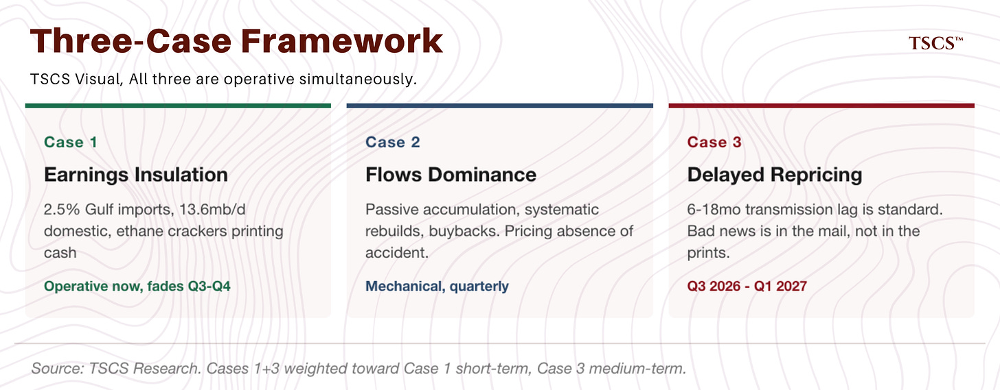](https://substackcdn.com/image/fetch/$s_!npNm!,f_auto,q_auto:good,fl_progressive:steep/https%3A%2F%2Fsubstack-post-media.s3.amazonaws.com%2Fpublic%2Fimages%2F53cd3ed1-6c1e-451a-8c94-4b602a37e027_1890x738.png)

One and three are both running. One dominates the next two quarters, three kicks in Q3 2026 through Q1 2027. Two is why three won’t show up in the S&P until the prints force it.

**Positioning: don’t short the S&P on this.** The S&P is probably right for the next one to two quarters. It’ll be wrong later. Carry on a naked index short against passive flows compounds against you, while the thesis trades (gold miners, rates vol, chemical tankers, petchem pairs, selective credit shorts) have positive or neutral carry and dated catalysts.

If you’re running gross-long and want to hedge, go sector, not index. Long gold, short TLT for the reserve-asset reallocation. Long rates vol for the Treasury fragility. Long chemical tankers and long DOW / short AMCR for the petchem story. Short packager credit if you have access. Short airlines into Q2 guidance for the cleanest channel, but size small, because the passive-flow backdrop is a headwind.

[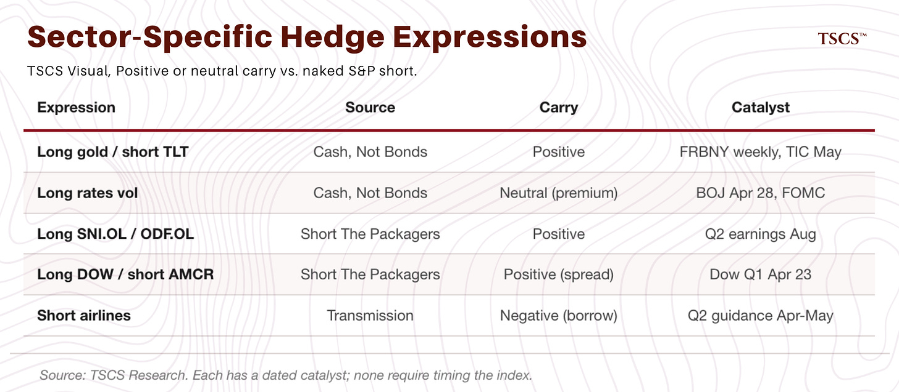](https://substackcdn.com/image/fetch/$s_!koNa!,f_auto,q_auto:good,fl_progressive:steep/https%3A%2F%2Fsubstack-post-media.s3.amazonaws.com%2Fpublic%2Fimages%2F7eb752d0-dcf8-49e2-9497-d7366701200d_1888x826.png)

## **The Gap, Analytically**

The three-case framework concedes a lot, deliberately. Here’s what I’m not conceding.

The Brent back end at $82 doesn’t fit the engineering. Mine clearance takes weeks to months. Insurance repricing took 12 months after the 2003 Iraq War, under far less dangerous conditions. Refinery cold-starts take 6-12 weeks. MCHE fab for Qatar’s LNG trains takes years. Some non-trivial piece of the 4.7 mb/d of Gulf shut-ins will have permanent reservoir impairment, magnitude uncertain. None of this has gone away in 22 days. The Dec 2026 contract at $82 is pricing as if a meaningful chunk of these constraints resolves by year-end. They won’t.

[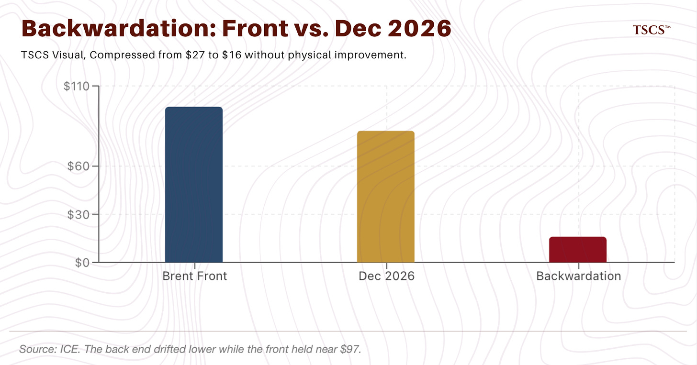](https://substackcdn.com/image/fetch/$s_!N_h1!,f_auto,q_auto:good,fl_progressive:steep/https%3A%2F%2Fsubstack-post-media.s3.amazonaws.com%2Fpublic%2Fimages%2F2b70eca2-ad52-46d8-a754-b31a6a17290a_1892x992.png)

HFI Research’s April 20 analysis makes this sharper. Even if the Strait reopens Tuesday, tankers currently in the pipeline take 30-40 days to offload, and re-entry through the chokepoint is a 3-month process. OECD crude inventories hit operational minimum by early May on their math. US commercial crude is projected below 400 million barrels by end of July, approaching the 370-380 million operational floor. The 11-13 mb/d supply outage has to clear through crude draws, product draws, or demand destruction. The Dec 2026 contract at $82 is pricing as if none of this mechanism exists.

How do you express this without having to time the S&P? Long calendar spreads on Brent (short Dec 2026, long further out). Long gold miners into the Q1 earnings catalysts. Long rates vol with kill switches tied to FRBNY custody deceleration. Physical chemical tanker exposure for the rerouting story. All of these pay if Dec 2026 grinds toward the $90-95 fair value I think is there. None of them need the equity market to agree with me on any particular timeline.

## **Kill Switches, Marked To Market**

Twenty falsifiable conditions across the series. Zero fully triggered. One approaching.

[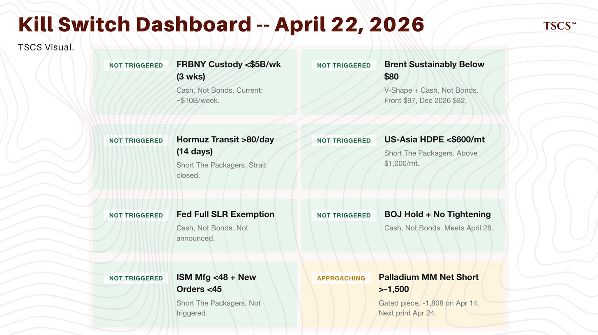](https://substackcdn.com/image/fetch/$s_!1kI1!,f_auto,q_auto:good,fl_progressive:steep/https%3A%2F%2Fsubstack-post-media.s3.amazonaws.com%2Fpublic%2Fimages%2F76eef2a9-b2a9-45c4-a22c-408d458f901c_1890x1060.png)

**“Watch The Wrong Price” (March 27).** Thesis dies if Mosaic Q3 EBITDA prints at or above $588M consensus without margin compression. Thesis dies if Indonesian HPAL operating rates hold above 85% on pre-stocked inventory. Status: too early on Mosaic (reports May 11). HPAL rates not publicly disclosed but concentrate pricing is still dislocated from LME nickel.

**“There Is No V-Shape” (March 30).** Thesis dies if Hormuz reopens and crude resumes pre-crisis rates inside 30 days and product spreads normalize inside 60. Thesis weakens if OPEC+ spare outside Hormuz is closer to the EIA headline 4.6 mb/d than the independent 1.5-2.5 mb/d, or if Brent Dec 2026 trades sustainably below $80. Status: neither.

**“Buy The Miners” (April 5).** Thesis weakens if 10Y TIPS turn positive through the curve, if a Gulf resolution undercuts gold, if private credit stress forces gold liquidation. Status: TIPS at 1.91% pressuring but not enough to break the structural bid. No Gulf resolution. Private credit stress visible (Blue Owl gates, BDC levels) but not at forced-liquidation scale.

**“Cash, Not Bonds” (April 11).** Four kill switches. None triggered. Custody running $10B/week. Oil front $94-99, Dec 2026 $82, not sustainably below $80. No SLR. BOJ April 28.

**“Short The Packagers” (April 15).** Seven kill switches. None triggered. Seven days old.

**Approaching trigger: Palladium COT from the gated piece (April 18).** Switch at managed money net short shallower than -1,500. April 14 print was -1,808, down from -2,541. 29% of the short book covered in a week. One more print and the switch fires. April 21 COT publishes April 24. Commerce AD lands Monday April 28. Exit discipline is in the opening.

**Total: twenty switches, zero triggered, one a print away.**

A note on two Hormuz thresholds. The 80/day kill switch from Short The Packagers is the thesis-death line. The 60/day threshold in What Would Change My Mind below is the harvest line. Different tests, different consequences.

## **What I Am Watching**

Dated catalysts in the next two to six weeks. Verified where I could cross-reference. Flagged where uncertain. If I’ve listed something that’s already happened, tell me.

[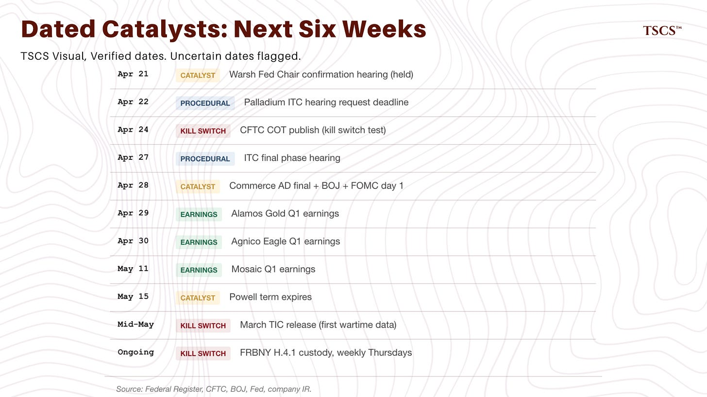](https://substackcdn.com/image/fetch/$s_!J5Nj!,f_auto,q_auto:good,fl_progressive:steep/https%3A%2F%2Fsubstack-post-media.s3.amazonaws.com%2Fpublic%2Fimages%2F8d77c723-77ea-4538-8273-8cb3ddb845a8_1886x1058.png)

**Before May 15. Warsh Senate confirmation vote vs Powell term expiry.** Banking Committee hearing was April 21. If Warsh confirms before May 15, clean transition. If the vote slips, Powell’s term expires without a confirmed successor and the Fed has a leadership question during an active inflation shock.

**April 22. Palladium ITC hearing request deadline.** Verified via Federal Register scheduling notice from February 24. Last procedural gate before the April 27 hearing.

**April 28. Commerce AD final determination on palladium.** Verified. A full AD final at or near 132.83% with no postponement remains the base case per our researcher’s check of the Federal Register and EDIS docket. A Russian respondent filing for postponement under the relevant AD postponement statute is the only credible path to delay, historically rare when the respondent has sat out the proceeding, and the Russians have sat out. The specific statute citation is being corrected and re-issued to paid subscribers ahead of Friday.

**April 27. ITC final phase hearing.** Verified via Federal Register 91 FR 8899. Procedural but confirms the path to the final injury vote, which must occur by June 19 per statute.

**April 28. BOJ policy meeting.** Verified. The Cash, Not Bonds kill switch: hold plus no further tightening signal removes the Japan amplifier and reduces positions by roughly a third. A hike, even small, accelerates the carry unwind and JGB repricing. Ueda’s language on the wage-price virtuous circle is the tell.

**April 29. Alamos Gold Q1 earnings. April 30. Agnico Eagle Q1 earnings. May 11. Mosaic Q1 earnings.** Q1 realized gold around $4,975, production roughly 3.4M oz for AEM and 155K oz for Alamos. Should be the strongest prints in either company’s history. Question is whether the margin beat forces the re-rate Buy The Miners laid out. For Mosaic, Q1 is the input-cost setup for the $588M Q3 consensus the thesis tests.

**April 28-29. FOMC meeting.** No change priced at 99.5%. Interest is in the dot plot and Powell’s characterization of Gulf-driven inflation as transitory or persistent. April 28 collapses BOJ, FOMC day one, and the palladium AD final into one news cycle.

**May 15. Powell’s term as Fed Chair expires.** If Warsh is confirmed by then, the transition happens cleanly. If confirmation is delayed, the Fed has a leadership question during an active inflation shock.

**Mid-May. March TIC release.** This is the first genuine wartime data on foreign flows. The April 15 release covered February data (pre-war) and produced the false negative I predicted in Cash, Not Bonds. The May release is the real test. If China continues to draw down, Japan begins repatriation, or the Cayman compositional shift accelerates, the thesis compounds.

**Ongoing. FRBNY H.4.1, weekly Thursdays.** The heartbeat. Running $10B a week. Deceleration below $5B for three straight weeks triggers exit of the bearish Treasury structures.

**Ongoing. Singapore gasoil and jet fuel cracks.** Any sustained compression toward pre-crisis levels invalidates a key leg of the Grind thesis. Current readings validate.

**Ongoing. US-Iran talks in Pakistan.** Trump extended the ceasefire indefinitely on April 21 after the original two-week term expired without a framework. Vance’s second Pakistan trip cancelled the same day, pending Iran’s response to US deal points. If Iran responds and talks resume with real progress on transit protocols and the blockade, mass shifts to Snap. If talks stall while the blockade and Hormuz closure persist, the current state (extended ceasefire, no framework, Drag-consistent) holds. I have no edge on the diplomacy. I have edge on the physical and commodity consequences either way.

## **What Would Change My Mind**

Specific list of things that, if they happen, force me to reduce or reverse positions.

One. Durable ceasefire with a framework on transit protocols, insured commercial Hormuz transits above 60 a day sustained for two weeks, war-risk premiums below 1% of hull value. That’s Snap materializing on the diplomatic side. The mechanical question remains: per HFI’s April 20 analysis, even a clean reopening triggers 30-40 day offload latency and 3-month re-entry through the chokepoint, so onshore inventory draws continue for weeks. I cut Grind positioning by half and close long calendar spreads on Brent, but I don’t touch the inventory-draw-driven trades until OECD crude stops declining.

Two. Brent Dec 2026 trading above $90 for more than two weeks without a commensurate move in the front month. This would mean the long end is rerating toward fair value without me. The thesis would be working. I would not reduce positions but I would begin harvesting gains.

Three. FRBNY custody decelerating below $5B per week for three consecutive weeks. This kills the Cash, Not Bonds thesis. I exit the bearish Treasury structures and reduce the gold-Treasury ratio trade.

Four. Mosaic Q3 EBITDA prints at or above $588M consensus without margin compression. This kills the sulfur cascade thesis. I exit the short packagers credit trade.

Five. ISM Manufacturing below 48 and ISM New Orders below 45 simultaneously before August. This signals demand destruction is overriding the supply thesis. I exit most long-cyclical-commodity positions and keep only gold.

None of these has triggered. One (palladium COT) is close.

[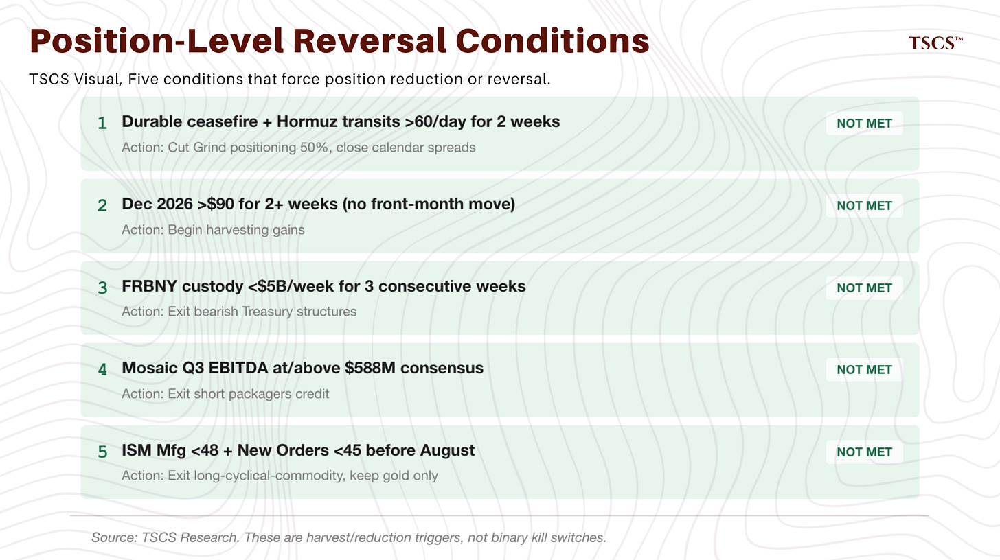](https://substackcdn.com/image/fetch/$s_!kuRW!,f_auto,q_auto:good,fl_progressive:steep/https%3A%2F%2Fsubstack-post-media.s3.amazonaws.com%2Fpublic%2Fimages%2Fd88e8fb6-5211-4475-a425-00f72bb0ab84_1888x1058.png)

## **Closing**

Three weeks ago I said the market was pricing weeks while the engineering needed quarters to years. Market has held that framing, not run further against me. The Brent curve compression is real but smaller than I first framed. The equity rally is real but fits cases one and two of the framework above. It doesn’t kill the thesis.

Five major pieces in this window, seven counting the gated palladium and Buy The Miners. None of the kill switches have triggered. Physical markets still corroborate the structural thesis. The long end hasn’t moved decisively either way. The near-term has compressed as the acute-stress pricing faded.

One of these breaks in the next two to six quarters, the structural read or the market pricing. The catalyst calendar doesn’t let both hold. If ceasefire talks produce a durable framework by month-end, Brent normalizes faster than I think and equity was right. If the blockade runs through May and the March TIC shows accelerated foreign selling, thesis validated and the curve corrects.

I’m positioned for the second outcome. I’m watching for the first. Kill switches are published. Scoreboard is open. When one triggers, the exit is committed: the discipline is baked in before the print, not renegotiated after. Real-time public position tracking is coming to TSCS after May 14.

Grind wins. Not because I’m right. Because nothing in the last 22 days has been inconsistent with it, the one kill switch that’s close hasn’t fired, and the market’s near-term repricing hasn’t come with a single physical or structural datapoint to back it. That’s a weak claim. It’s the honest one. The stronger claim, that the market is wrong and about to crack, would need equity to already be transmitting the commodity signal into earnings guidance. It isn’t. Neither is the bond market at the long end, though the foreign-custody data is telling a quieter story, which is what this series tracks.

Next installment after the April 28 trifecta (BOJ, FOMC day one, palladium AD) or after the Alamos, Agnico Eagle, Mosaic earnings, whichever moves the ball further. Scoreboard updated in that installment. If the framework breaks, the next installment says so.

Stay disciplined. Do not chase.

---

*This publication is for informational and educational purposes only. Nothing herein constitutes investment advice, a solicitation, or a recommendation to buy or sell any security or financial instrument. The author may hold positions in securities discussed. Do your own research. Past performance is not indicative of future results.*

---

## **TSCS Scoreboard (as of April 22, 2026)**

[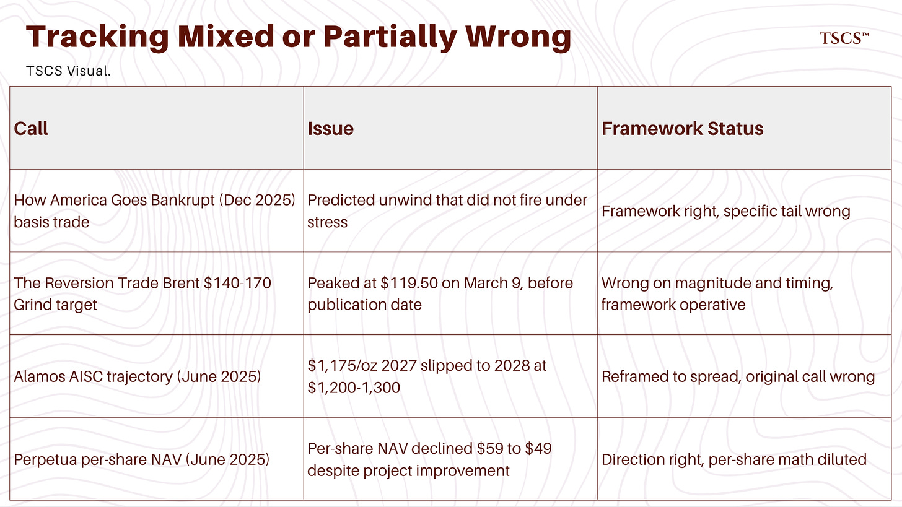](https://substackcdn.com/image/fetch/$s_!7Yre!,f_auto,q_auto:good,fl_progressive:steep/https%3A%2F%2Fsubstack-post-media.s3.amazonaws.com%2Fpublic%2Fimages%2Fcc1f9bed-2402-4f03-b649-1d2db073a608_1792x1008.png)

[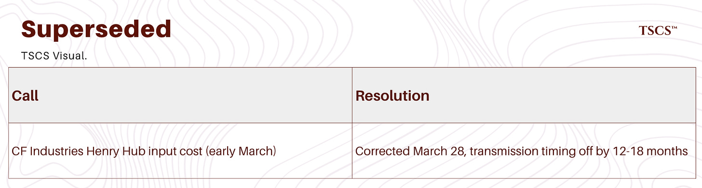](https://substackcdn.com/image/fetch/$s_!0XpA!,f_auto,q_auto:good,fl_progressive:steep/https%3A%2F%2Fsubstack-post-media.s3.amazonaws.com%2Fpublic%2Fimages%2F70de8dc8-92f7-44c5-bd01-9ab0e1ba3556_1792x482.png)

[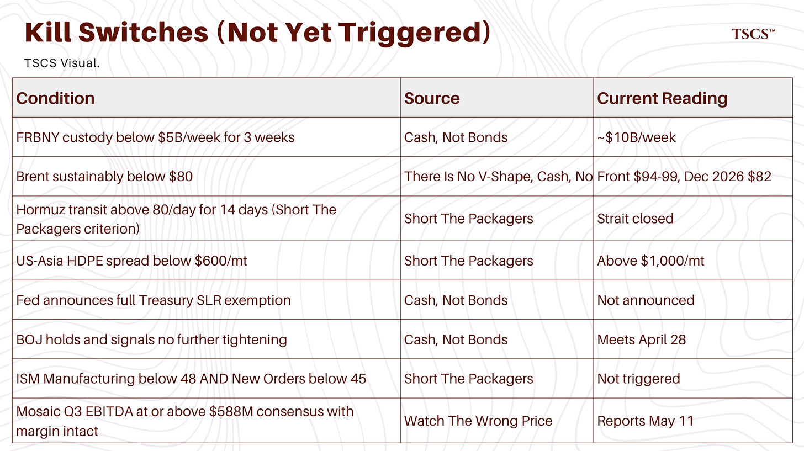](https://substackcdn.com/image/fetch/$s_!syuH!,f_auto,q_auto:good,fl_progressive:steep/https%3A%2F%2Fsubstack-post-media.s3.amazonaws.com%2Fpublic%2Fimages%2Fd2079b47-73fc-4fa1-81ed-e1af562bce3c_1792x1006.png)

[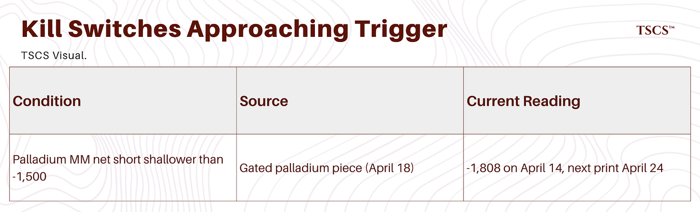](https://substackcdn.com/image/fetch/$s_!2pVs!,f_auto,q_auto:good,fl_progressive:steep/https%3A%2F%2Fsubstack-post-media.s3.amazonaws.com%2Fpublic%2Fimages%2F9aae1492-222e-45d7-881c-cdb326f5aa85_1794x546.png)

---

The scoreboard will be updated in every future Epic Fury installment. If you spot a call not listed here that should be tracked, flag it in the comments or by email. Calls are added when they contain a specific testable thesis with a datable time horizon, regardless of outcome.