The Pentagon asked Congress this week for its largest defense budget in American history, $1.5 trillion.

Two days later, the Wall Street Journal ran a story arguing the money was necessary because the American magazine was too empty to defend Taiwan.

On the same day the story ran, the Pentagon closed a $1 billion strategic investment in L3Harris, the solid rocket motor supplier that bottlenecks every munition the story was about.

Nobody structures, negotiates and closes that kind of deal in response to a news story that broke hours earlier.

The sequence matters.

On Tuesday, Admiral Samuel Paparo, commander of US Indo-Pacific Command, submitted written testimony to Congress stating that “current production timelines are misaligned with operational expenditures and the threats we face in today’s global security environment.” The munitions he named in the statement were JASSM-ER, LRASM, Maritime Strike Tomahawk, Precision Strike Missile, SM-3 and SM-6. These are exactly the weapons a Pacific fight turns on.

Thursday, the Wall Street Journal reported anonymous administration officials putting the replacement window at six years.

Within hours of the WSJ story, White House Press Secretary Karoline Leavitt called it “false,” saying the military is “fully equipped with enough weapons to handle any operation ordered by the president.”

All of this inside a single news cycle. Two days after the Pentagon unveiled a $1.5 trillion defense budget, the largest in American history. Three weeks before Trump meets Xi in Beijing.

Someone is being walked through this.

It is worth understanding who, and how.

What follows is the answer to two questions the WSJ piece does not ask. Why did the story run this week and not six months ago. And what does the American munitions gap look like if you compare it to the Chinese readiness gap the Pentagon is simultaneously describing.

Subscribed

## **I. The Timeline**

Before the leak, the plan. Before the plan, the war. The order is the argument.

**January 6, 2026.** The Department of War and Lockheed Martin announce a framework agreement for the Patriot PAC-3 MSE, targeting production expansion from approximately 600 per year to 2,000 per year under a seven-year agreement. Lockheed delivered 620 PAC-3 MSEs in 2025, more than 20 percent above the prior year.

**January 29, 2026.** Lockheed Martin and the Department of War (the Trump administration’s “Department of War” secondary title for the Department of Defense, authorized under the September 2025 executive order) announce a framework agreement to quadruple annual THAAD interceptor production from 96 per year to 400. Lockheed simultaneously breaks ground on a new Munitions Acceleration Center in Camden, Arkansas.

**February 4, 2026.** RTX (the old Raytheon) announces five multi-year framework agreements with the Department of War. Tomahawk annual production is to exceed 1,000 units, up from roughly 60 per year, which RTX itself describes as more than a tenfold increase. SM-6 is to exceed 500 per year. AMRAAM is to reach 1,900. “Many of these munitions will grow 2 to 4 times their existing production rates,” the company said. Tomahawk, specifically, is the tenfold outlier.

[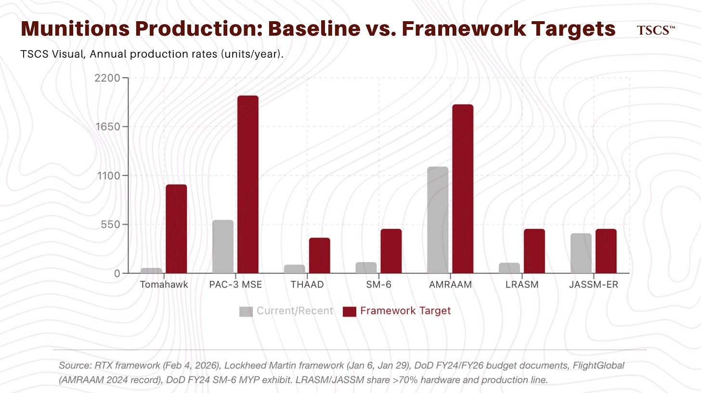](https://substackcdn.com/image/fetch/$s_!ps7P!,f_auto,q_auto:good,fl_progressive:steep/https%3A%2F%2Fsubstack-post-media.s3.amazonaws.com%2Fpublic%2Fimages%2Fbf82901b-369b-48b1-a2a2-8e40bf7cc583_1888x1058.png)

**February 28, 2026.** Operation Epic Fury begins. The USS Frank E. Petersen Jr. fires a Tomahawk Land Attack Missile that day, a fact confirmed by a Navy DVIDS photo caption and subsequent Naval News reporting; Reuters separately confirms that “the first shots fired were Tomahawk missiles.” By late March, the U.S. has fired more than 850 Tomahawks in a single campaign, a figure that exceeds multiple prior years of Tomahawk procurement combined.

[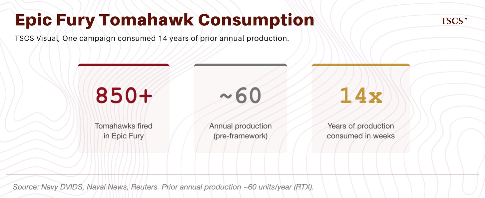](https://substackcdn.com/image/fetch/$s_!BAaq!,f_auto,q_auto:good,fl_progressive:steep/https%3A%2F%2Fsubstack-post-media.s3.amazonaws.com%2Fpublic%2Fimages%2Fe5651498-9fcf-4e5a-8ac4-a5d518957c75_1890x772.png)

**April 1, 2026.** Boeing and Lockheed sign a seven-year framework to triple PAC-3 MSE seeker production. The seeker is the single most-cited industrial bottleneck in the Patriot supply chain.

**April 9, 2026.** The Department of War awards Lockheed a $4.761 billion PAC-3 MSE contract, with work at Camden, Arkansas, and estimated completion by June 30, 2030.

**April 21, 2026.** Secretary of War Pete Hegseth unveils the FY27 defense budget at $1.5 trillion, a 42 percent year-over-year increase and the largest single jump in American defense spending since World War II. Pentagon officials acknowledge, on the record, that the budget “was drawn up prior to” Epic Fury. Defense press reporting puts the missile procurement line at a 188 percent year-over-year increase. A separate roughly $200 billion supplemental is signaled for the Iran operation and stockpile replenishment.

**April 23, 2026.** The WSJ piece runs. “The U.S. has burned through so many munitions in Iran that some administration officials increasingly assess that America couldn’t fully execute contingency plans to defend Taiwan from a Chinese invasion if it occurred in the near term.”

**April 23, 2026 (same day).** L3Harris closes a $1 billion Department of War strategic investment in its Missile Solutions business, structured as convertible preferred security and warrants. This isn’t a standard procurement contract. The Pentagon’s taking an equity-adjacent position in the solid rocket motor bottleneck. Nobody structures, negotiates and closes that kind of transaction in response to a news story that broke hours earlier.

**May 14-15, 2026.** Trump is scheduled to meet Xi in Beijing.

[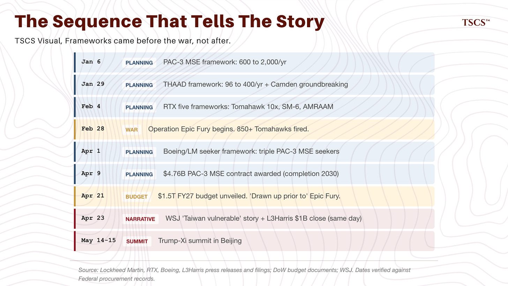](https://substackcdn.com/image/fetch/$s_!TW9u!,f_auto,q_auto:good,fl_progressive:steep/https%3A%2F%2Fsubstack-post-media.s3.amazonaws.com%2Fpublic%2Fimages%2F2f01c66b-2a91-4559-b182-7cb360548174_1886x1062.png)

The timeline breaks the official narrative. The WSJ piece asks readers to accept this causal chain: U.S. fought Iran, ran out of munitions, therefore must surge production and budgets. The actual chain runs the other way. The U.S. planned to surge production and budgets, then fought Iran, then leaked a story calibrated to make the surge politically unopposable and to shape the negotiating posture of a summit it had been planning for weeks.

[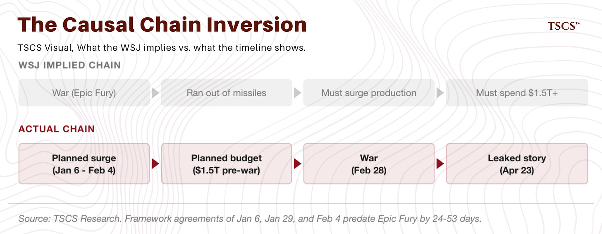](https://substackcdn.com/image/fetch/$s_!2rGj!,f_auto,q_auto:good,fl_progressive:steep/https%3A%2F%2Fsubstack-post-media.s3.amazonaws.com%2Fpublic%2Fimages%2F73530b73-3b74-447b-81d4-9c0a5b61f426_1886x734.png)

The frameworks of January 6th, January 29th and February 4th, together, committed the American industrial base to a scale-up that makes the six-year WSJ figure close to meaningless for the munitions that drove the headline. The officials aren’t lying. The ramp-up schedule matters. Signing a framework agreement in January does not mean the missiles exist in July. Lockheed’s own filings describe the PAC-3 agreement as seven-year, not one-year, and the binding industrial constraint (solid rocket motors at L3Harris) takes years to expand regardless of how much paper flows from the Pentagon. There’s a transition window, two to three years, running on accelerated legacy production, depleted stockpiles, and whatever the new facilities deliver. Inside that window, Taiwan is harder than outside it. Fair point.

But “transition window” isn’t the story being sold. The story being sold is “Taiwan is vulnerable because Iran drained us,” which invites “spend more, faster.” If the story were “Taiwan is vulnerable during the industrial ramp we committed to in January,” the response would be “don’t start more wars during the ramp.” Different stories. WSJ tells the first. We’re telling the second.

[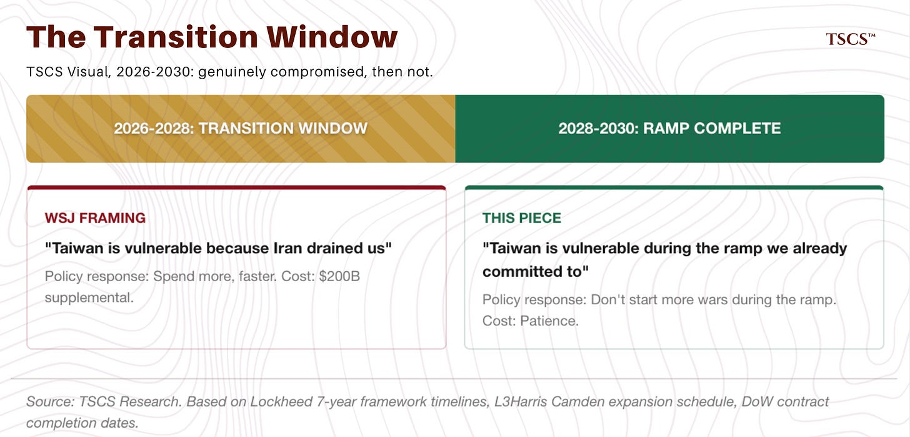](https://substackcdn.com/image/fetch/$s_!04Gt!,f_auto,q_auto:good,fl_progressive:steep/https%3A%2F%2Fsubstack-post-media.s3.amazonaws.com%2Fpublic%2Fimages%2F0a117c75-a925-4e01-830e-0dab2261cdc8_1890x910.png)

[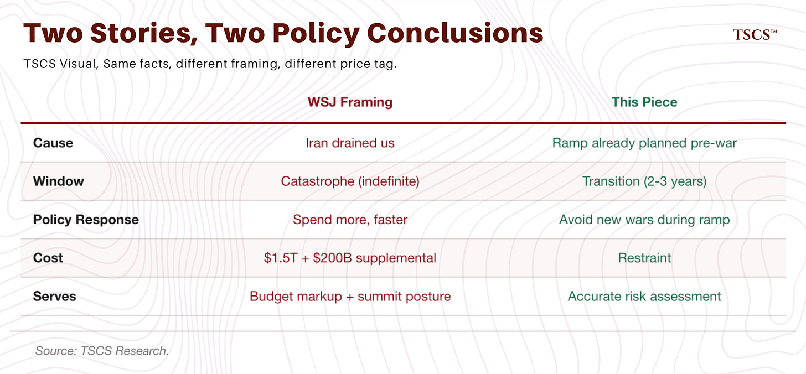](https://substackcdn.com/image/fetch/$s_!53oJ!,f_auto,q_auto:good,fl_progressive:steep/https%3A%2F%2Fsubstack-post-media.s3.amazonaws.com%2Fpublic%2Fimages%2Fe16396d4-4cb1-4276-b8e2-e3837c132442_1886x876.png)

## **II. The 2027 Category Error**

Every urgency claim in American defense writing about Taiwan flows through 2027. The FY27 budget is sold against it. The WSJ piece’s tempo of alarm depends on it. Davidson Window citations are default in Congressional testimony, think-tank reports, cable-news defense segments. Western strategic planning treats it as settled.

It isn’t settled. It’s an analytical artifact, the product of an inferential leap from a Chinese readiness milestone to a Western operational deadline.

The phrase “Davidson Window” entered the strategic lexicon in March 2021, when Admiral Philip Davidson, then commander of U.S. Indo-Pacific Command, testified before the Senate Armed Services Committee that the threat of a Chinese invasion of Taiwan was “manifest during this decade, in fact, in the next six years.” That sentence put 2027 at the center of Western defense planning. His successor, Admiral John Aquilino, maintained the urgency. CENTCOM used the timeline to justify Middle East posture drawdowns. The Director of National Intelligence cited it in public threat assessments. The FY27 budget is, in several places, sold as a response to it.

[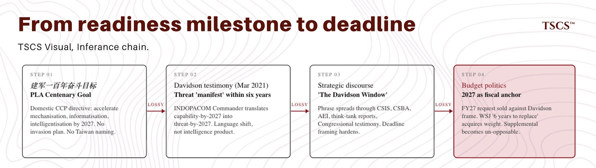](https://substackcdn.com/image/fetch/$s_!gw9_!,f_auto,q_auto:good,fl_progressive:steep/https%3A%2F%2Fsubstack-post-media.s3.amazonaws.com%2Fpublic%2Fimages%2Fa2934b44-825e-429f-8e50-028c992f6d5a_1888x534.png)

Follow Davidson’s testimony back to the Chinese source material and you don’t find an operational deadline. You find the “Centenary Goal of the PLA,” 建军一百年奋斗目标, a domestic directive from Xi Jinping calling for the People’s Liberation Army to accelerate the “integrated development of mechanization, informatization, and intelligentization” by the hundredth anniversary of the PLA’s founding. Every PLA document that mentions 2027, including the translated corpus held at the China Aerospace Studies Institute, frames the date as a readiness milestone, a point by which the force is supposed to possess a particular set of modernized capabilities. No invasion window. Taiwan isn’t named. The target is what the military should be, not what it should do. The U.S. intelligence community’s own March 2026 assessment makes the same point, concluding that Beijing has not committed to a 2027 invasion timetable.

Western intelligence heuristically translated “possess the capability by 2027” into “willing to use the capability by 2027.” That translation, in the loose sense of “inferential leap” rather than a linguistic mistranslation, was not malicious. It was lossy. And the loss has compounded across four years of defense commentary until a domestic Chinese readiness goal has become, in the American discourse, an intercepted war plan. Critics of the framing, notably Oriana Skylar Mastro at Stanford, Michael Beckley at Tufts, and Jude Blanchette at CSIS, have argued the same point in less blunt language for years: 2027 is a bureaucratic milestone that has morphed into an analytic Rorschach test, and most of the American discourse around the “window” is testing the analyst, not the adversary.

The WSJ article’s urgency depends on accepting the 2027 framing. Strip the frame, the “six years to replace” figure loses its weight. The six years were never anchored to anything specific. The transition window, the industrial ramp, the supplemental, the summit, all of it gets re-pegged to a date that was always softer than the reporting suggested.

Intent exists. Xi’s personal ownership of PLA modernization, his invocations of Taiwan reunification as “great rejuvenation,” accelerating PLA exercises, all real. None of it produces an operational deadline. Intent without a deadline requires sustained preparation. Intent with a deadline requires emergency supplementals. American defense politics is funded on the second framing. It should be funded on the first, which is harder to sell and cheaper to execute.

[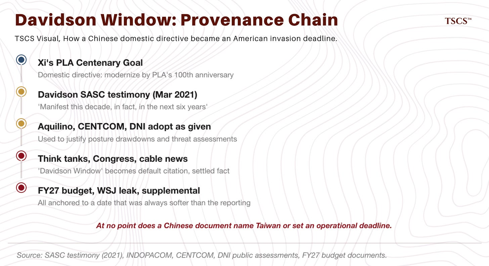](https://substackcdn.com/image/fetch/$s_!U1go!,f_auto,q_auto:good,fl_progressive:steep/https%3A%2F%2Fsubstack-post-media.s3.amazonaws.com%2Fpublic%2Fimages%2F1480f1eb-c9ef-4aed-8021-4283f3a62ca1_1888x1030.png)

The 2027 category error is the single most consequential analytical move in the American Taiwan discourse, and it is baked into almost every piece of defense journalism that uses the “window” framing. Correcting it doesn’t make Taiwan safe. It flattens the urgency gradient, which changes the rational policy response, which changes the defensible supplemental. That’s why the correction doesn’t appear in the WSJ piece.

[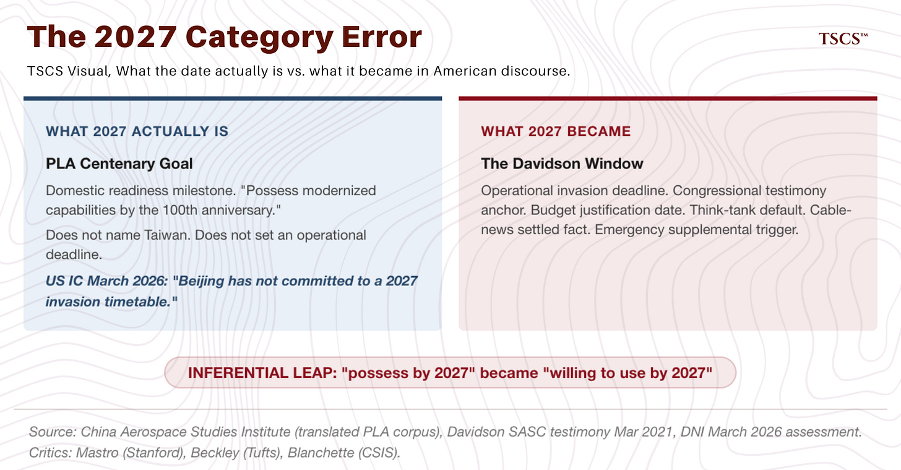](https://substackcdn.com/image/fetch/$s_!yQLg!,f_auto,q_auto:good,fl_progressive:steep/https%3A%2F%2Fsubstack-post-media.s3.amazonaws.com%2Fpublic%2Fimages%2F122837d0-4e90-4956-8b8c-bfc41084f4bc_1890x988.png)

## **III. The Wargame Symmetry**

Second analytical move. This one’s load-bearing.

Any serious argument about American munitions inadequacy for a Taiwan fight runs through CSIS’s wargaming work. The Center for Strategic and International Studies ran nearly two dozen iterations of a Taiwan invasion scenario between 2022 and 2023, and has updated the outputs since. Those wargames produced the consumption rates that populate every piece of defense writing on the subject, including this one. LRASM global inventory exhausted within three to seven days. JASSM stocks depleted around day nine. Long-range munitions consumption rates of more than 5,000 missiles in three weeks of a Taiwan Strait invasion fight. These numbers are the analytical currency of the discourse. They appear in CSBA briefings, AEI commentary, Congressional testimony and, implicitly, in the WSJ piece’s “could not fully execute contingency plans” formulation.

[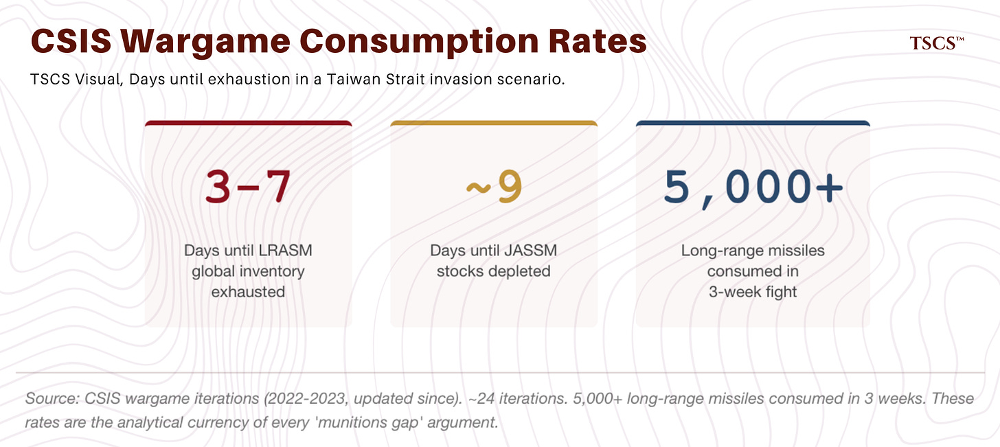](https://substackcdn.com/image/fetch/$s_!0Nnv!,f_auto,q_auto:good,fl_progressive:steep/https%3A%2F%2Fsubstack-post-media.s3.amazonaws.com%2Fpublic%2Fimages%2F0764862a-0ad2-4890-991e-7b150a01e507_1888x844.png)

Here is the part almost nobody flags. Those consumption rates are calibrated to a PLA that runs the scenario correctly. Synchronized launches across multiple brigades. Accurate targeting. Sustainable logistics. Functional command and control under stress. If the actual PLA is worse than the wargame PLA, American magazines last longer. The missiles don’t change. Chinese fires are less accurate, less synchronized, less sustainable than the simulation assumes.

Is the actual PLA worse than the wargame PLA?

The evidence, accumulated between 2023 and early 2026, is unusually rich and unusually bad for Beijing. Xi Jinping removed much of the senior leadership of the PLA Rocket Force across 2023 and 2024. Li Yuchao, the commander, and his deputies Liu Guangbin and Zhang Zhenzhong, were detained and investigated for corruption. Two consecutive defense ministers (Wei Fenghe and Li Shangfu) were removed over related investigations. In November 2024, Admiral Miao Hua, a member of the Central Military Commission, was suspended. In December 2023, the National People’s Congress Standing Committee had dismissed nine senior military officers from the legislature, with further removals following in February 2026. In June 2024, the Central Politburo formally expelled Wei and Li from the Party with language stating that they had “severely contaminated the political environment of the equipment sector,” a phrase which only appears when the Party is communicating industrial-scale rot.

[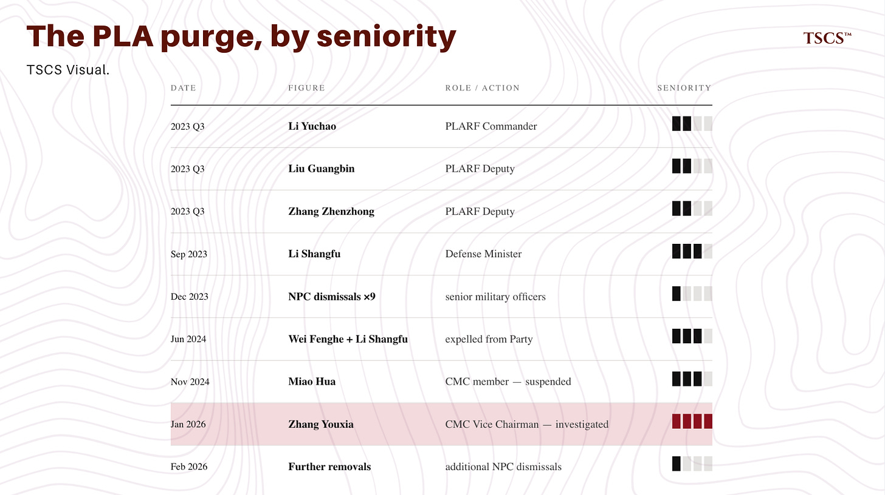](https://substackcdn.com/image/fetch/$s_!VqOK!,f_auto,q_auto:good,fl_progressive:steep/https%3A%2F%2Fsubstack-post-media.s3.amazonaws.com%2Fpublic%2Fimages%2Fcd9059c2-9d83-4577-89d4-5a2d83eb137a_1892x1060.png)

What the corruption looked like, per U.S. intelligence assessments cited by Bloomberg in January 2024, was extraordinary. Missiles filled with water instead of fuel. Silo fields in western China built with lids that did not open. Funds allocated to modernization systematically diverted. Ranks and promotions sold. These specific claims come from anonymous U.S. intelligence through a single outlet. Credibly reported, not independently verified. Bloomberg reported that U.S. officials had concluded Xi was “less likely to contemplate major military action in the coming years” precisely because of what the intelligence community had found.

Then it got worse. In late January 2026, forty days before Operation Epic Fury began, Chinese authorities publicly announced that General Zhang Youxia, vice chairman of the Central Military Commission and China’s most senior uniformed officer, was under investigation. The accusations, according to Guardian and SCMP reporting that both outlets explicitly flagged as unable to independently verify, were twofold: accepting bribes in exchange for promotions, and leaking China’s nuclear weapons data to the United States. The second accusation, if true, is the more significant. It would imply, at the highest level of the CMC, that U.S. intelligence had either a direct source or a stream of product on Chinese strategic forces. Whether Zhang was the source or was framed as one to protect another is unknowable outside Langley. Reuters’s more conservative framing describes the investigation as “serious violations of discipline and law,” standard CCP language that doesn’t confirm the nuclear-leak allegation. We hold both versions. The direction of damage is visible either way.

Put these facts together. What fraction of the PLA Rocket Force is operationally degraded? Three scenarios. The percentages below are our estimates, weighted against the confirmed public record. Not figures from any published intelligence assessment.

In the low scenario, roughly 20 percent probability, corruption is largely ring-fenced to financial graft and older liquid-fueled systems (legacy DF-4 and DF-5s). The modern solid-fuel deterrents, DF-41 and DF-26, remain operationally insulated. The detentions reflect Xi consolidating political control, not terminal rot. Roughly 10 to 15 percent of the force degraded.

In the central scenario, roughly 60 percent probability, hardware defects (targeting gyros, failing seals) extend into the conventional IRBM and SRBM inventory due to a decade of procurement skimming. More critically, the purges have paralyzed operational readiness at the institutional level: the trust required for synchronized launch protocols and complex joint operations is functionally shattered by political terror. Roughly 30 to 45 percent of the force degraded.

In the high scenario, roughly 20 percent probability, corruption extending to physical tampering of strategic deterrents implies total quality-assurance breakdown, and the fall of Zhang Youxia implies the nuclear command-and-control apparatus is compromised by factional infighting. 60 percent or more of the force degraded.

We weight the central scenario at 60 percent because it is the only one of the three consistent with both available evidence streams simultaneously. The low scenario requires dismissing the Bloomberg intelligence reporting about hardware defects; the reporting is not independently auditable, but it is specific and sourced, and a 10 to 15 percent degradation assumes the defects are not real. The high scenario requires believing Chinese strategic weapons capability is compromised at the top end; China has publicly demonstrated functioning strategic systems through ICBM tests, hypersonic glide vehicle deployment, and recent Rocket Force exercises, which cuts against the high case. The central scenario reconciles both: quality issues exist, and strategic weapons still work. That is why it carries the most weight.

[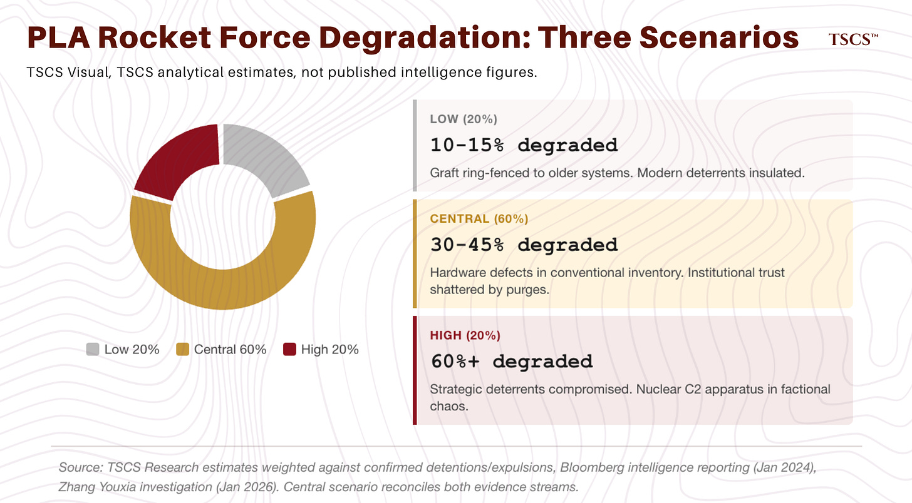](https://substackcdn.com/image/fetch/$s_!0ke5!,f_auto,q_auto:good,fl_progressive:steep/https%3A%2F%2Fsubstack-post-media.s3.amazonaws.com%2Fpublic%2Fimages%2Fa603d93d-0379-4827-a0ba-aa256890eca0_1888x1042.png)

The central scenario is the one to hold. Not the maximalist case. It doesn’t require believing every silo is empty or every launcher is broken. It requires believing a force with a decade of senior leadership purges, equipment ministers formally expelled for contaminating “the political environment of the equipment sector,” and a vice chairman under investigation, is less operationally capable than its order of battle suggests. Low bar.

Re-integrate with the wargames. If the central-scenario PLA is the actual PLA, CSIS consumption rates overstate the threat. American magazines last longer in the fight because Chinese fires are less accurate, less synchronized and less sustainable than the wargames assume. The airframes and launcher counts are real, so LRASM and JASSM-ER still exhaust. But the pace is slower, the window of American inadequacy is narrower, and the strategic picture inside the transition window is meaningfully less dire than the raw wargame outputs suggest. Put crudely: the munitions gap is calibrated to a scenario that is becoming less likely precisely because of the Chinese weakness the symmetry argument describes. The wargames are simultaneously the evidence for the gap and the reason the gap may be narrower than the wargames imply.

Almost nobody makes this move. Hundreds of pieces cite CSIS consumption rates as evidence of American inadequacy. Dozens cite the PLARF purges as evidence of Chinese degradation. Nobody adjusts the first set for the second. The two half-truths sit in separate documents. Integrate them, you get where the Pacific actually is.

[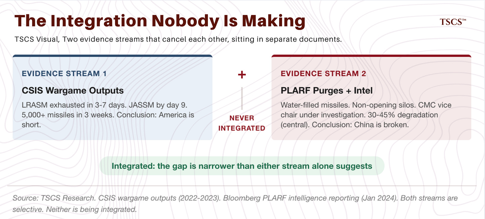](https://substackcdn.com/image/fetch/$s_!hjAD!,f_auto,q_auto:good,fl_progressive:steep/https%3A%2F%2Fsubstack-post-media.s3.amazonaws.com%2Fpublic%2Fimages%2F440e9fdd-cb73-4228-80d1-501b84f79f34_1894x856.png)

Chinese mass does compensate for Chinese incapacity. Beijing has built hundreds of silos, thousands of ballistic missiles, the world’s largest navy by hull count, and more air-launched missiles than it knows what to do with. A 30 percent operational degradation rate on a large force is still a large effective force. The PLA isn’t a paper tiger in absolute terms. But Pentagon officials describe American capacity as compromised “in the short term” during a specific scenario. The same qualification applies to the PLA, more so.

Epistemic asymmetry matters here. American production data in Section V comes from SEC filings, DoD budget documents, GAO assessments, named-analyst CSIS work. Chinese capability data comes largely from Bloomberg’s reporting on anonymous U.S. intelligence, plus confirmed Chinese state announcements of the detentions. First set: auditable. Second: not. U.S. intelligence could have the Rocket Force degradation scope wrong. The leaks could be selective, optimized to justify Pentagon posture. The critique we level at the WSJ story applies to the Bloomberg one too.

That said, the scale of the confirmed detentions is evidence independent of any intelligence leak. A defense minister. A Central Military Commission vice chairman under investigation. Much of the top of the Rocket Force.

The scale reads as systemic. An alternative reading frames the purges as factional consolidation, not operational failure. Under that reading the symmetry argument still survives, weaker: American weakness is well-documented, Chinese weakness is inferred, the symmetry case attenuates. We hold the stronger version.

## **IV. A Brief Interlude on What The Story Leaves Out**

Before the arithmetic: what Sections II and III together do to the WSJ framing. The piece the Journal published, and every downstream piece that quotes it, treats the American side of the ledger as the variable and the Chinese side as the constant. China is coming. The question is whether America can hold them. The answer depends on American missile counts, American production schedules, American industrial capacity.

That framing only works if the Chinese side is a constant. It is not. It is a variable, and the direction of variance over the past three years is downward. The same intelligence community that provides the order of battle used to calibrate the wargames provides the corruption and purge assessments used to describe Chinese degradation. Both streams are selective. Both streams are auditable against confirmed public events. Neither stream is being integrated by the outlets that use the wargame outputs to sell supplementals.

A rigorous WSJ piece would ask: American magazines are tight, Chinese readiness is also tight, what does the balance look like during the transition window? That version doesn’t get written, because it doesn’t support a $200 billion supplemental.

It supports a more careful posture, a narrower set of authorities, and a prudence framing that is harder to translate into line items. The version that does get written is the one where the Chinese side is held constant at wargame-readiness levels, the American side is described as depleted, and the resulting asymmetry is presented as urgent.

The urgency is the product. The arithmetic below is what the product is defending against.

[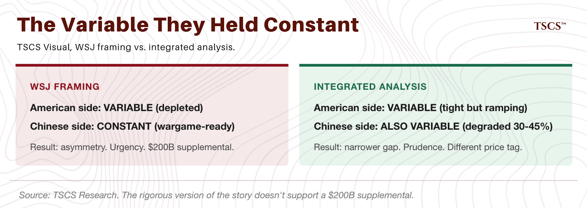](https://substackcdn.com/image/fetch/$s_!V9HN!,f_auto,q_auto:good,fl_progressive:steep/https%3A%2F%2Fsubstack-post-media.s3.amazonaws.com%2Fpublic%2Fimages%2F4b986394-0238-47bb-b02c-f98a8c39cf9d_1886x668.png)

## **V. The Numbers**

The six-year figure and “munitions gap” framing don’t survive arithmetic. Baseline numbers below, sourced from DoW budget documents, CSIS, Lockheed and RTX SEC filings, and Congressional testimony. Variance cited explicitly. Where math rests on CSIS wargame outputs, the PLA-degradation argument above matters.

**Tomahawk.** Current Tomahawk production is not disclosed in RTX’s 10-K. The framework target is more than 1,000 per year, a figure RTX itself describes as a more than tenfold growth from existing rates of roughly 60 per year. The FY26 combined request, before the war, was for 79 missiles (57 Navy, 22 Marine Corps). The FY27 request, which the Pentagon confirms was drawn up before Epic Fury, asks for 785 Tomahawks split 58 in the base budget and 727 in reconciliation, an 894 percent year-over-year increase. Section 20004 of the One Big Beautiful Bill Act of 2025 separately appropriated $250 million specifically for Tomahawk production capacity expansion, targeting a rate of 800 per year. Roughly 55 percent of the Pentagon’s $40 billion munitions request is structured as reconciliation rather than discretionary funding, because reconciliation dollars remain available over a longer horizon than year-by-year appropriations. The design of the ask is pre-commitment against a seven-year industrial horizon, not one-year procurement.

[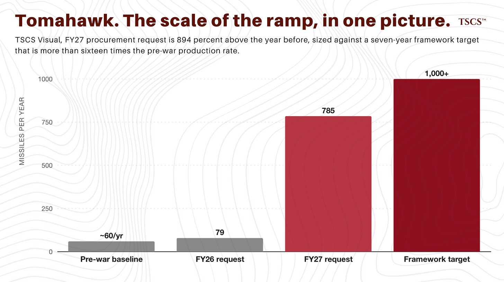](https://substackcdn.com/image/fetch/$s_!uikH!,f_auto,q_auto:good,fl_progressive:steep/https%3A%2F%2Fsubstack-post-media.s3.amazonaws.com%2Fpublic%2Fimages%2F03b8eede-97da-49eb-bec0-ec0088c6bbd5_1888x1058.png)

Big caveat. Tomahawk, PAC-3, LRASM, JASSM-ER and THAAD all compete for solid rocket motor supply out of L3Harris (the old Aerojet Rocketdyne), which is the genuine industrial bottleneck. Todd Harrison at AEI, the same institution that has called the overall defense proposal unbuildable, described the mechanism on the record: “They can’t buy that many in a single year, and Raytheon can’t produce that many at once. But the intent is they will have the money there so that they can go to Raytheon and say, ‘Hey, we want to place a big order.’ It’s even better than a multiyear procurement, because in multiyear procurement, you still have to wait for future appropriations.” Framework agreements aren’t missiles. The 785-unit FY27 request isn’t a one-year delivery schedule. It’s a funded pre-commitment against bottleneck-constrained capacity. Honest Tomahawk replacement range is two to four years, depending on how fast the SRM constraint unwinds.

**THAAD.** Baseline production entering 2026 was 96 per year. FY26 base budget requested only 25 interceptors, plus 12 under reconciliation, for 37 total. The January framework targets 400 per year. Estimated stockpile as of December 2025 was 534 interceptors. CSIS estimated between 100 and 150 were used in the 2025 Twelve-Day War, plus more in Epic Fury. At 400 per year, a 150-interceptor drawdown is a five-month replacement. At 96 per year, it was eighteen months. Six years only works if you freeze production at the FY26 request level, which is not the plan. The downstream math rests on a CSIS usage estimate with a wide range. Higher actual usage, the replacement window extends. Lower, it compresses. Arithmetic directionally correct. Precision softer than the confident phrasing suggests.

[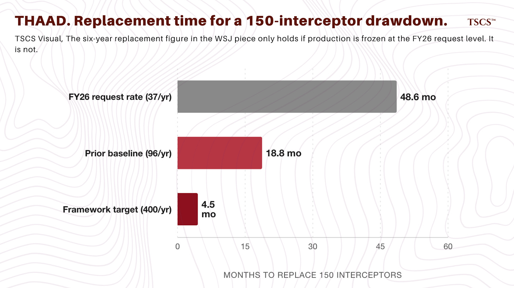](https://substackcdn.com/image/fetch/$s_!cKHG!,f_auto,q_auto:good,fl_progressive:steep/https%3A%2F%2Fsubstack-post-media.s3.amazonaws.com%2Fpublic%2Fimages%2F51cd74f5-1825-4bb5-a4d2-eef4078f9c40_1886x1060.png)

**PAC-3 MSE.** This is the single most-used interceptor in the arsenal and the most important in any ground-based terminal defense of forward airbases, which is what a Taiwan scenario mostly requires. Lockheed delivered 620 PAC-3 MSEs in 2025, more than 20 percent above the prior year. The January framework, stated in Lockheed’s annual-report chair letter as a “seven-year agreement,” targets expansion from approximately 600 per year to 2,000 per year. The April 9th contract obligated $264.96 million in FY26 Army procurement plus $4.496 billion in FY26 Foreign Military Sales funds. Boeing’s seeker capacity is being tripled in parallel. The scale is large. The ramp is slow. The binding constraint is again solid rocket motors.

[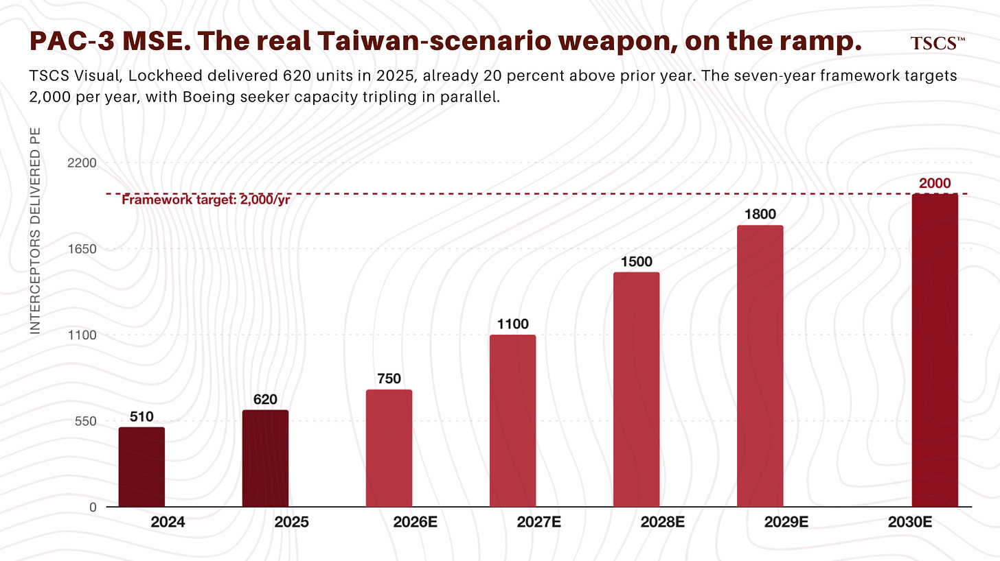](https://substackcdn.com/image/fetch/$s_!y76B!,f_auto,q_auto:good,fl_progressive:steep/https%3A%2F%2Fsubstack-post-media.s3.amazonaws.com%2Fpublic%2Fimages%2F0b30a4a1-7807-4605-8a9a-b4285a062f76_1884x1058.png)

**SM-3.** The most constrained interceptor. Stockpile December 2025 was 414 per CSIS. The U.S. used roughly 80 in the Twelve-Day War. SM-3 Block IB unit cost has risen from approximately $9 million in FY21 to roughly $12.5 million in FY24, reflecting the expiry of the FY2019-FY2023 Multi-Year Procurement contract. The larger Block IIA variant runs closer to $24 million per round. The FY26 request proposed ending IB production in favor of IIA, trading quantity for capability. This one is tight. If there’s a real ballistic-missile-defense gap, it’s here, and frameworks alone won’t solve it.

[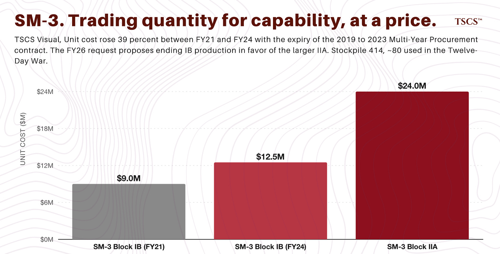](https://substackcdn.com/image/fetch/$s_!tscd!,f_auto,q_auto:good,fl_progressive:steep/https%3A%2F%2Fsubstack-post-media.s3.amazonaws.com%2Fpublic%2Fimages%2F3f8a3237-e8a3-40d0-81c0-eed92822f298_1886x960.png)

**SM-6 and AMRAAM.** Both tracking the same pattern. SM-6 baseline 100 to 125 per year against a 500-plus framework target. AMRAAM baseline 800 to 1,000 against 1,900-plus. Neither is binding in a Taiwan scenario, but both are on the ramp.

**LRASM and JASSM-ER.** These are the munitions that matter in a Taiwan scenario, and the WSJ piece does not mention them. CSIS’s wargames, run roughly two dozen times between 2022 and 2023 and updated since, found that the U.S. global LRASM inventory of roughly 450 missiles was expended within three to seven days in every direct-invasion scenario. JASSM stocks were depleted around day nine. Budget reality puts these wargame rates in context. Air Force JASSM base-budget procurement was 550 units in FY24, 450 in FY25, and 389 in FY26 (discretionary plus reconciliation combined); Ukraine-era supplementals added units in FY24 that are not repeated in the outyear baseline. Combined Navy-plus-Air Force LRASM procurement was 118 in FY24, 115 in FY25, and 238 in FY26 (with Navy driving most of the FY26 increase). One technical point that matters: LRASM shares more than 70 percent of its hardware with JASSM-ER and uses the same production assembly line, so the two should not be read as independent capacity pools. Lockheed’s announced combined ramp target of 1,000 per year is still well short of the 5,000-long-range-missile consumption rate CSIS forecast for a three-to-four-week invasion fight. That consumption rate is itself calibrated to an optimistic PLA assumption, so the real gap is narrower than the raw comparison suggests. It remains the tightest binding constraint in any honest accounting.

[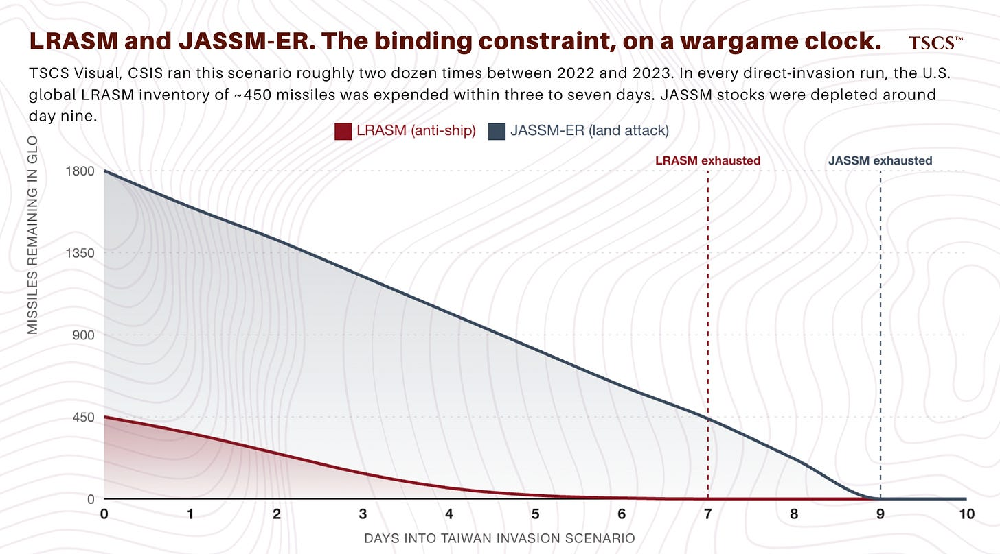](https://substackcdn.com/image/fetch/$s_!hgPp!,f_auto,q_auto:good,fl_progressive:steep/https%3A%2F%2Fsubstack-post-media.s3.amazonaws.com%2Fpublic%2Fimages%2Fc6d5d544-c53c-4a81-8ba0-bd3db253da5d_1888x1048.png)

**L3Harris (the old Aerojet Rocketdyne).** Worth naming specifically because the bottleneck sits here rather than at prime final assembly. Camden currently produces more than 115,000 solid rocket motors per year across a 2,000-acre site with over 100 buildings. In November 2025, L3Harris broke ground on an Advanced Aerojet Production Facility at Camden designed to increase large-SRM manufacturing capacity six-fold, with lease commencement in January 2028 and a 20-year term. A 2023 DPA Title III agreement initially funded $215.6 million of expansion. Subsequent DoD SRM awards through September 2025 totaled more than $120 million across nozzle production, insulation materials, metallic cases, rayon precursor and carbon phenolic ablatives, attacking the input layer of the bottleneck rather than final assembly. The April 23rd $1 billion strategic investment then added an equity-adjacent layer on top. The Bloomfield, Indiana munitions campus anchored by Prometheus Energetics is designed to support Tomahawk, Javelin, Stinger and GMLRS, with phased operations beginning in 2027. The bottleneck is real. The response to the bottleneck is already substantial, pre-committed, and structured to run for a decade.

[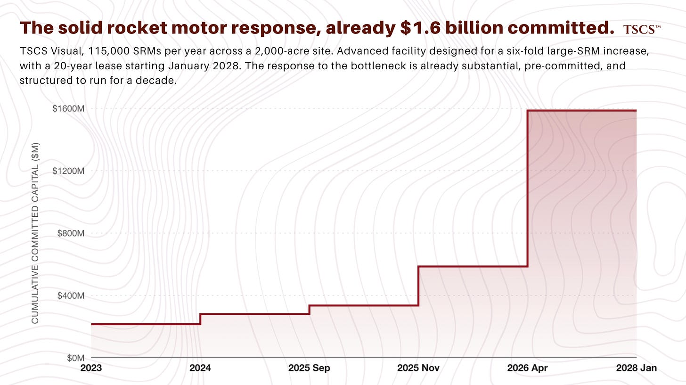](https://substackcdn.com/image/fetch/$s_!sBES!,f_auto,q_auto:good,fl_progressive:steep/https%3A%2F%2Fsubstack-post-media.s3.amazonaws.com%2Fpublic%2Fimages%2F5263fdc3-4888-49e3-8f67-37b473203c7c_1888x1060.png)

If you wanted to write a serious piece about American munitions inadequacy for a Taiwan contingency, you would write about LRASM, JASSM-ER, SM-3 Block IIA, solid rocket motor capacity at L3Harris, and the seeker chip supply chain. The WSJ piece writes about Tomahawks and Patriots, which are the wrong weapons for the scenario being invoked but the right weapons for the political argument being made. Tomahawks and Patriots have enormous Congressional-district footprints across Tucson, Huntsville, Andover, Camden and Troy. LRASMs and solid rocket motors do not have the same district-level political purchase, at least not yet, even though Camden itself straddles both categories.

[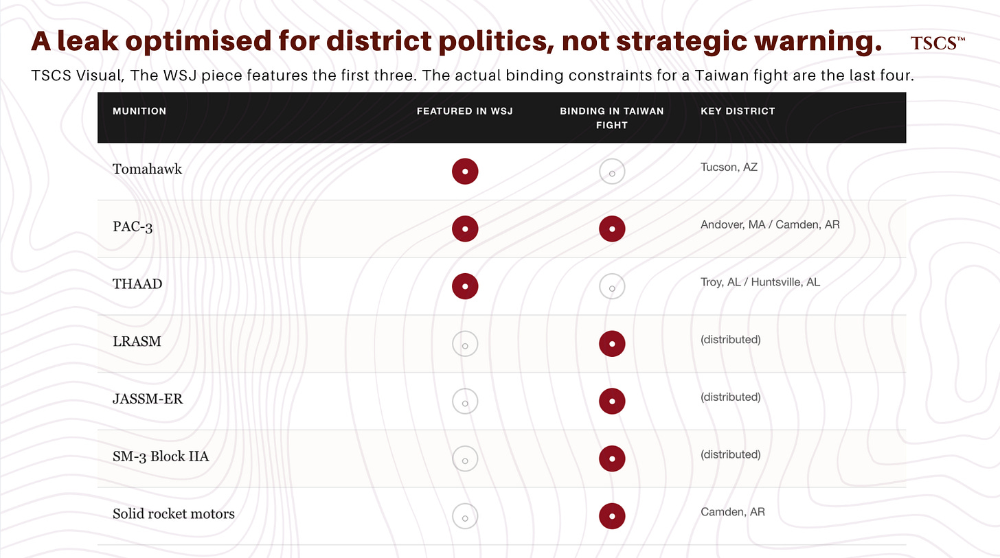](https://substackcdn.com/image/fetch/$s_!vhFb!,f_auto,q_auto:good,fl_progressive:steep/https%3A%2F%2Fsubstack-post-media.s3.amazonaws.com%2Fpublic%2Fimages%2Fb18ade62-5105-41c5-9f74-167a1d9459c8_1888x1054.png)

The six-year replacement figure is not defensible against the post-February industrial plan. It is defensible only if you freeze production at the FY26 request level, which would be to ignore the largest missile production expansion since the 1980s, announced during the same administration, roughly eighty days before the article ran.

One honest qualification about what the arithmetic in this section actually measures. The munitions analysis above is calibrated primarily to an invasion scenario, where LRASM, JASSM-ER and SM-3 Block IIA do the binding work. Our own probability estimates place blockade as the more likely Chinese action by a factor of roughly one-and-a-half to five, depending on where inside the ranges the true values sit. A blockade scenario is not fundamentally a munitions problem. It is a surface fleet sustainment problem, a logistics resilience problem and a signaling problem, with Chinese Coast Guard and maritime militia (rather than the PLA Rocket Force) as the primary instruments. The industrial arithmetic above still matters for deterrence credibility in a blockade, because what restrains Beijing from escalating a blockade into a strike is the American magazine visible behind it. But the reader should hold in mind that the piece is arguing rigorously about the less likely of two plausible Chinese actions. A full treatment of the blockade case, with a different industrial ledger behind it, is work for a follow-up.

## **VI. The Pattern, The Actor, The Prediction**

Every leak has a beneficiary. When the Wall Street Journal prints an anonymous-officials story about a munitions gap two days after the largest defense budget in American history and three weeks before a summit with China, ask: who wins?

Every Pentagon leak benefits the Pentagon. Every defense industry story benefits the primes. If “someone gains” is the test for manufactured narrative, almost nothing in Washington reporting survives it. The distinction needs drawing sharply.

Three features separate the April 23rd story from routine pre-markup messaging.

First, its timing relative to the Beijing summit, not merely the budget markup. Pentagon leaks ahead of House and Senate Armed Services markups are a recurring pattern, roughly annual, and expected by anyone who watches the cycle. Pentagon leaks three weeks before a presidential summit with a strategic rival, calibrated to shape that summit’s negotiating posture, are structurally different.

Second, the specific numerical claim (six years to replace) is mathematically inconsistent with publicly-announced framework agreements signed by the same administration roughly eighty days earlier, which makes the story an assertion of capability gaps that the administration’s own industrial policy is built to close.

Third, and most telling, the munitions featured in the story (Tomahawk, PAC-3) are not the munitions most binding in the scenario invoked (LRASM, JASSM-ER, SM-3 Block IIA). A leak optimised for Congressional district politics foregrounds Tucson, Huntsville, Andover and Troy. A leak optimised for genuine strategic warning would foreground the solid rocket motor supply chain at Camden and the seeker chip supply chain. The WSJ piece foregrounds the first set. None of these features is a tell alone. Combined, they distinguish this leak from baseline pre-markup Pentagon messaging with enough clarity to warrant the reading.

There’s a useful historical template, recent enough the mechanism should be visible. Through 2022 and 2023, a visible pattern of anonymous-officials reporting emerged around HIMARS rocket depletion, Stinger stockpile gaps, and solid rocket motor bottlenecks in the Aerojet supply chain during the Ukraine drawdown. The scarcity was real. Ukraine had exposed single points of failure that the Pentagon had allowed to atrophy for two decades. What the stories accomplished was not to create the gap. The gap already existed. What the stories accomplished was political. They secured unprecedented multi-year procurement authorities, Defense Production Act investments, and long-term recapitalization contracts that had been impossible in peacetime. The real shortage was leveraged into structural capital recapitalization that serves the primes for a decade.

The 2026 leak is the same mechanism with a different adversary. Real shortage. Authentic capacity gap. Legitimate concern about a Taiwan contingency inside a finite window. All of it true. All of it also being used to sell a more than $3.2 trillion (per CRFB analysis) decade-long expansion that was approved in outline before the first Tomahawk flew, in a political environment where any serious “no” vote can be framed as a vote for Chinese invasion. The HIMARS pattern is the pattern. The WSJ piece is its 2026 repetition.

If there is a single institutional actor worth understanding in this pattern, it is the Pentagon’s Office of Legislative Affairs, whose documented function is to coordinate messaging between the building and Congress in service of the building’s resource asks. That is OLA’s job, it does it well, and it does it by a set of methods refined over decades of practice. The HIMARS cycle of 2022 and 2023 is the clearest recent case study in how the function operates: real shortage, authentic gap, selective leaks to credible reporters, multi-year procurement authorities secured as the downstream result. The April 23rd story matches that template closely enough that a reader shown the two cycles side by side, without dates attached, would struggle to tell them apart. Whether any specific individual at OLA had any specific conversation with any specific WSJ reporter isn’t a question we can answer. It’s also the wrong question. The mechanism is institutional, not personal.

It may also be emergent rather than coordinated. Pentagon officials leak on individual incentives, reporters print on individual incentives, the primes benefit downstream. No central coordination required for the pattern to exist. The observable features of this leak (pre-summit timing, numerical inconsistency with announced frameworks, wrong-munition selection) hold either way.

What we can say: the template exists, has been used before, has worked before. What it produces looks observationally identical to what we read on April 23rd. A reader who wants to call the resemblance coincidental is free to. Explaining why it’s coincidental, given the timing (three weeks pre-summit, forty-eight hours post-budget-release, coincident with the L3Harris $1 billion close), is work we haven’t had to do.

[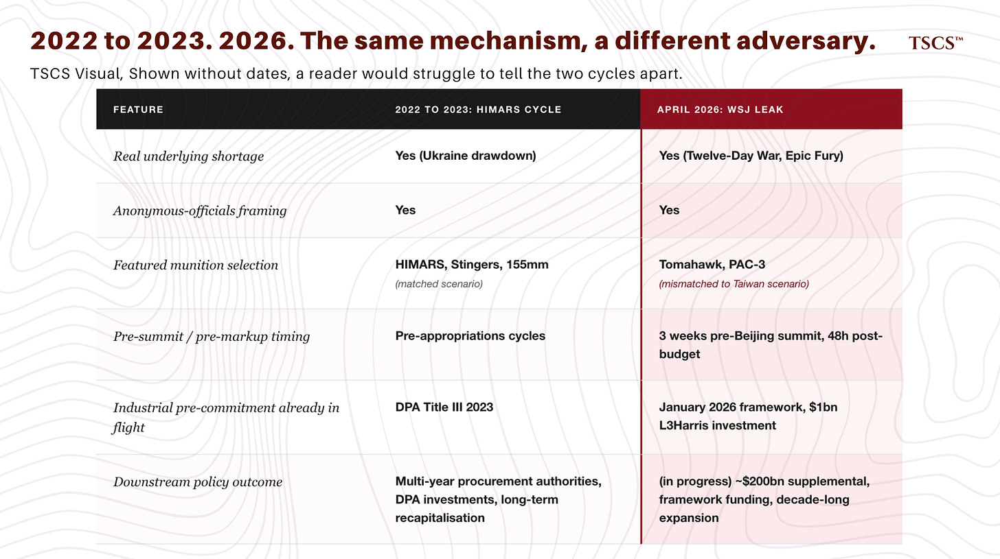](https://substackcdn.com/image/fetch/$s_!gBqF!,f_auto,q_auto:good,fl_progressive:steep/https%3A%2F%2Fsubstack-post-media.s3.amazonaws.com%2Fpublic%2Fimages%2F57181f75-af4f-4eeb-8520-48c251c3032f_1890x1058.png)

The Pentagon wins. The story frames the $1.5 trillion FY27 request and the forthcoming roughly $200 billion supplemental as not merely reasonable but urgent. The American Enterprise Institute, a conservative think tank, has already called the proposal unbuildable, arguing “we lack the manufacturing ability and supply chain to produce weapons” at the envisioned scale. The Committee for a Responsible Federal Budget has called it “a major driver of a dangerous fiscal trajectory.” The story neutralizes both critiques. It makes a “no” vote on the supplemental a vote for Chinese invasion of Taiwan.

The defense primes win. Lockheed Martin, RTX, Boeing and L3Harris all have framework agreements or equivalent industrial-base commitments that pay out over seven years. The larger the framework, the larger the pull-through for components, sustainment, upgrades and foreign military sales. The WSJ story materially increases the probability that the frameworks are fully funded and that additional supplementals follow. Same dynamic the HIMARS stories produced in 2023, at larger scale.

The hawkish wing of the administration wins. The story gives Trump leverage in Beijing. “We have a munitions gap” is dual-use rhetorically: it signals to Xi “do not provoke us while we are rearming,” and it signals to Congress “do not block the supplemental.” The former is a risky signal to send. Advertising weakness to a strategic rival, even with a planned ramp behind the weakness, carries tail risk. That the administration is willing to send it anyway is consistent with the domestic budget calendar weighing heavily in the calculation, relative to the strategic one. The story ran two days after the budget and three weeks before the summit. Readers can draw their own conclusions about whether that timing is coincidence.

The media wins. Taiwan-fear stories are among the most reliable traffic drivers in American defense journalism. The WSJ writers earn internal credit for a scoop, Bloomberg earns terminal reads for the summary, X earns engagement, and Substacks earn subscribers. Including this one. We are not pretending otherwise.

[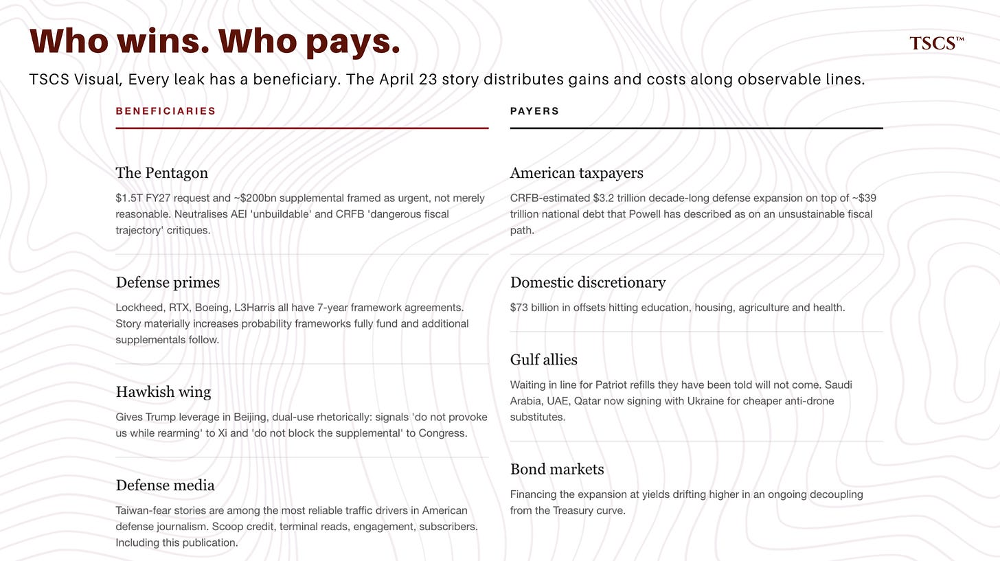](https://substackcdn.com/image/fetch/$s_!sE75!,f_auto,q_auto:good,fl_progressive:steep/https%3A%2F%2Fsubstack-post-media.s3.amazonaws.com%2Fpublic%2Fimages%2F66ba9eb7-ac0a-4276-b3b3-5accaed842eb_1886x1058.png)

The following people pay. American taxpayers, for a CRFB-estimated $3.2 trillion decade-long defense expansion on top of a roughly $39 trillion national debt that Jerome Powell has described as being on an unsustainable fiscal path. Beneficiaries of the $73 billion in domestic discretionary cuts used to partially offset the defense increase, which hits education, housing, agriculture and health. Gulf allies waiting in line for Patriot refills they have been told will not come. Ukraine, which has now been forced to substitute for the U.S. in Gulf air-defense markets, signing deals with Saudi Arabia, the UAE and Qatar for cheaper anti-drone systems. And, downstream, American bond markets, which have to finance all of this at yields that continue to drift higher in a decoupling from the Treasury curve we have written about before.

We’re not arguing the spending is unnecessary. We’re arguing it’s being sold through a narrative that hides half the ledger and leverages an industrial shortfall, real but bounded, into a structural recapitalization that outlasts the shortfall by a factor of ten. The honest version would say: “China is also weak. Our industrial base can be rebuilt. A $3.2 trillion ten-year expansion has large opportunity costs. Here is the trade-off.” The version being sold says: “China is strong, we are weak, please approve the budget.” The first version is harder to write. The second version writes itself. The WSJ piece is the second version, executed with precision, in line with a template the Pentagon has been refining for four years.

## **VII. Probabilities and Falsification**

Probabilities over certainties. Here’s where we stand as of April 24th, 2026.

Subjective estimates, pattern recognition and historical analogues weighted against available evidence. Not a formal model. Calibrated priors for what to watch, not point forecasts. Each anchored to a small set of driving facts.

Probability that China militarily invades Taiwan between now and end of 2027: low, perhaps 5 to 10 percent. The combination of Rocket Force purges, the Zhang Youxia investigation, the ongoing summit diplomacy, the Wang Yi-Pyongyang trip, the Busan truce framework and Xi’s own stated 2026 preference for “mutual respect, peaceful coexistence” all cut in the same direction. China’s timeline, to the extent one exists, is longer than the invasion-is-imminent framing suggests.

Probability that China imposes a Taiwan blockade or grey-zone escalation between now and end of 2027: medium, perhaps 15 to 25 percent. Blockade is cheaper, less risky, and does not require the Rocket Force to work as advertised. CSIS’s 2025 blockade wargames concluded that the American response is harder to calibrate than in the invasion case, which paradoxically makes blockade more, not less, attractive to Beijing. If we are wrong on the invasion probability being low, we are more likely wrong about blockade than about assault.

Probability that the “munitions gap” narrative dominates FY27 budget debate: very high, perhaps 80 percent or more. This is already happening. The narrative is sticky, bipartisan and industry-supported. Even if Congress trims the supplemental, the framing survives.

Probability that the roughly $200 billion supplemental passes substantially intact: medium-high, perhaps 60 to 70 percent. Slender Republican majorities, midterm-year politics and CRFB opposition cut against, but the WSJ-style messaging campaign and summit urgency cut for. The base case is a modestly trimmed but directionally intact supplemental by late summer.

[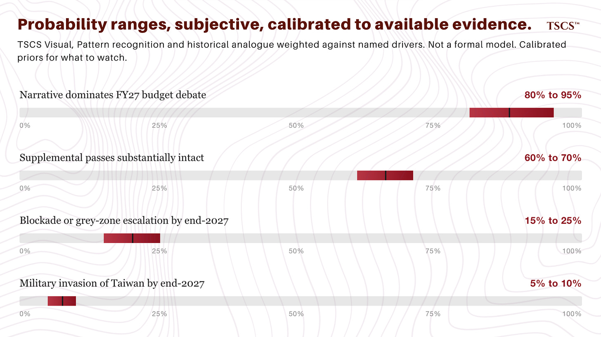](https://substackcdn.com/image/fetch/$s_!ZZXr!,f_auto,q_auto:good,fl_progressive:steep/https%3A%2F%2Fsubstack-post-media.s3.amazonaws.com%2Fpublic%2Fimages%2Fe1b61b90-978c-46d6-bd94-9b947b3eca80_1886x1060.png)

**The named prediction.** We expect the next iteration of this leak cycle to land between mid-September and late October 2026, timed to the FY27 continuing resolution negotiations and ahead of the winter NDAA conference. The featured munition will shift from Tomahawk and PAC-3 to LRASM, JASSM-ER, or SM-3 Block IIA, because those are the weapons whose actual constraints most align with the scenario being invoked, and the Pentagon’s messaging operation will eventually run out of rhetorical mileage on Tomahawks. The headline will cite “officials familiar with the assessment” or equivalent. The framing will contain the phrase “cannot sustain” or “cannot support” in relation to a Pacific contingency. If that story does not run, on roughly that timeline, against one of those munitions, this piece’s pattern-recognition framing is weaker than we believe, and we will say so.

**What would falsify the “manufactured scarcity” thesis beyond the named prediction.** Three things would force us to reconsider. First, if the supplemental is defeated or deeply cut (sub-$100 billion final), it would suggest the messaging campaign is less effective than we estimate, and therefore less deliberate than we argue. Second, if the Trump-Xi summit produces a genuine Taiwan de-escalation, it would suggest the summit was the point, the budget was secondary and the WSJ story was pre-summit theater rather than post-summit budget armor. Third, and most importantly, if China launches a visible military action against Taiwan (blockade, quarantine, missile strike) before the end of 2026, it would mean the threat was real, the warning was accurate, and we were wrong to read the timing as manipulative.

What would falsify the PLA-degradation correction, specifically the claim that CSIS consumption rates overstate the threat: the first serious PLA rocket-force exercise in the Western Pacific that demonstrates synchronized launches from multiple brigades without detected command failures. That would reset the readiness estimate upward, narrow the transition window’s protection, and put more weight back on the alarmist reading of the WSJ piece. We are watching for this specifically.

Any of these should update readers, including us, toward the straightforward reading of the story. In the absence of these, the manufactured-scarcity reading and the degraded-PLA reading together remain the more parsimonious pair.

One caveat to our own probabilistic claims. When we describe the leak as “consistent with coordinated messaging,” we do not claim to read the minds of anonymous officials. We cannot. We can only note that the pattern of timing, numerical choice, and munition selection matches what coordinated messaging would look like better than it matches what independent reporting would look like, and that the historical template from 2022 to 2023 provides a prior. A coincidence interpretation is less parsimonious.

## **Conclusion**

The Wall Street Journal didn’t write a fake story. It wrote a true story on a timeline set by the people who leaked it. The munitions are depleted. The industrial base is strained. The Taiwan scenario is harder in 2026 than it was in 2023. All correct.

What the story leaves out is that the industrial scale-up was committed to before the war, that the Chinese side of the ledger is in worse condition than the American side, that the six-year figure is mathematically incoherent against the production frameworks already signed, and that the 2027 date which anchors the whole discourse rests on an inferential leap from a Chinese domestic readiness directive to a Western operational deadline. The story as written asks readers to accept a framing in which Iran caused the crisis, China will exploit the crisis, and only money can solve the crisis. The more defensible framing is that the crisis was priced in before Iran, that China has its own crisis larger than the one being described, that the 2027 window is softer than the reporting suggests, and that money is one of several tools, used in a budget fight that is the point of the leak.

The transition window matters. For the next two to three years, while L3Harris solid rocket motor capacity is the binding constraint, the American munitions position is compromised for a peer fight in the Pacific. That compromise is real. It’s not fabricated. Any reader treating the underlying analysis as false instead of opportunistically timed is making the opposite mistake from the one the WSJ framing invites. The gap closes, but not by next Tuesday. The policy question inside the window (don’t start another war we can’t sustain) is a different question from the one the leak is engineered to ask (approve the supplemental).

The two countries facing each other across the Pacific are both less formidable than their budgets suggest, and both more formidable than their readiness reports imply. The wargames used to prove American inadequacy are calibrated to a Chinese force other analyses, from the same intelligence product, describe as degraded. Reconcile the two sets of numbers, you get where the Pacific actually is. The WSJ isn’t writing that piece. The Pentagon isn’t writing that piece. The defense primes aren’t writing that piece. No incentive to. The frameworks pay out regardless.

One thing to take from this. The next six months will see more leaks, more “officials said” stories, more urgent assessments, more Taiwan imagery in American defense reporting. Watch the timing. Watch who gains. Watch what is not being said about the other side of the ocean. And watch the ramp schedule on Tomahawks, PAC-3s and THAADs, because by mid-2028 the gap will close, the budget case will need a new crisis, and the story that replaces this one is already being drafted by people whose jobs depend on drafting it.

We will be here when it runs.

Subscribed

[Share](https://tscsw.substack.com/p/scripted?utm_source=substack&utm_medium=email&utm_content=share&action=share&token=eyJ1c2VyX2lkIjoxNDAwMjQ1LCJwb3N0X2lkIjoxOTUzODA3ODcsImlhdCI6MTc3ODU0NTI5MiwiZXhwIjoxNzgxMTM3MjkyLCJpc3MiOiJwdWItMjM1NDI0NCIsInN1YiI6InBvc3QtcmVhY3Rpb24ifQ.A2vZFS7k5rJuTQvd10Kq9OZXzt44LqMTem8OhuzmwpU)

---

*TSCS covers commodities, macro and capital flows for institutional readers. Our paid research includes bespoke commodity reports, reflexive analyses of industrial and financial cycles, and deeper work on the names behind the frameworks discussed above. Subscribe below.*

*This post is for informational and educational purposes only. Nothing in it constitutes investment advice, a recommendation to buy or sell any security, or a solicitation of any financial transaction. Readers should conduct their own research and consult a qualified financial adviser before making any investment decision. TSCS and its authors may hold positions in the securities or sectors discussed.*