The Global X Uranium ETF (URA) lost approximately 88 percent of its value compounded across calendar years 2011 through 2015 (annual returns of -60, -19, -21, -22, and -37 percent on a total return basis).

URA launched in November 2010 to give investors diversified basket exposure across the uranium value chain. That thesis was the entire product. It lost essentially everything in the 2011-2015 stress window despite holding positions chosen to express different theses across different parts of the universe.

Caveat. URA’s trigger was Fukushima, an exogenous accident, not the endogenous narrative-policy break I’m arguing the current cycle is exposed to. Fukushima isn’t the same mechanism.

But once the demand narrative collapsed (for whatever reason), the value-chain diversification investors thought they had provided essentially zero protection.

Conversion didn’t decorrelate from miners. Developers didn’t decorrelate from producers. Industrials didn’t decorrelate from spot.

The cover story for diversification was the value chain. The reality was a single demand-narrative bet expressed five different ways. Two cleaner cases produced the same outcome through endogenous mechanisms closer to the current cycle.

[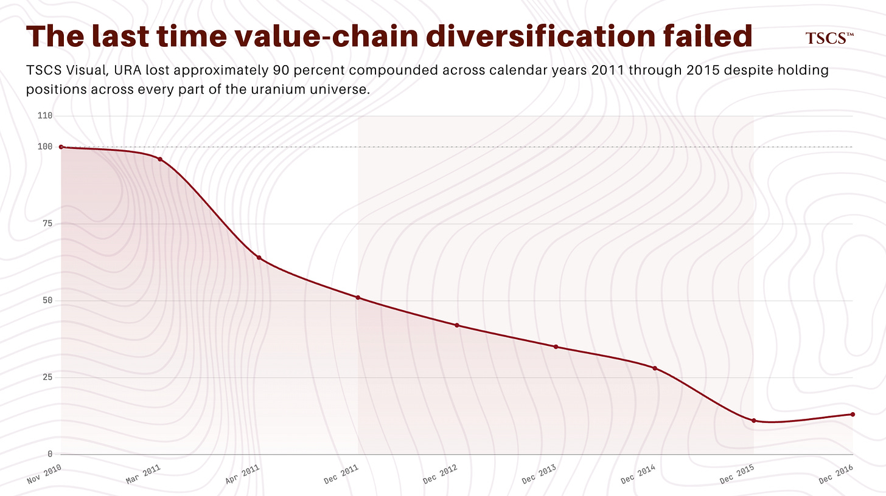](https://substackcdn.com/image/fetch/$s_!F94b!,f_auto,q_auto:good,fl_progressive:steep/https%3A%2F%2Fsubstack-post-media.s3.amazonaws.com%2Fpublic%2Fimages%2F35694277-626b-4d3b-b61c-c795115e223e_1888x1058.png)

The 2008-2015 Chinese steel buildout produced correlated multi-factor breaks across mining, processing, equipment, and downstream construction equity that “diversified” portfolios couldn’t absorb. The trigger was demand-narrative compression as the post-stimulus credit cycle turned. Not an accident. The 2020-2024 offshore wind cycle is mid-stress, with Ørsted, Siemens Gamesa, and Vestas all impaired together.

The trigger was cost-curve assumptions colliding with rate normalization. Policy aggressiveness compressed in response rather than supporting. Both cycles had the architecture the nuclear renaissance now has: a demand thesis driving policy aggressiveness, supply chain capex sized to that thesis, and an investor base holding “diversified” positions across the value chain.

Both produced correlated breaks that the value-chain diversification could not absorb. The five names everyone owns (Cameco for fuel cycle, Constellation for fleet, Centrus for enrichment, BWXT for construction, NexGen for developer optionality) aren’t five bets. They’re one bet, made three times, dressed as diversification. The market hasn’t noticed yet because the cover story is convincing.

Here’s the framework for why the consensus is sized as if buildout cycles don’t produce correlated breaks, when the historical record is meaningfully populated with cases that did. I’m not claiming the current cycle will break the same way.

I’m claiming the consensus is sized for an outcome more confident than the case-study evidence supports. Call the mechanism narrative-policy beta.

Bearish in framing, net long in recommendations. The Nuclear Primer and the February uranium piece are assumed as foundation. Cameco, Constellation, Centrus, and BWXT are USD on NYSE. NexGen is CAD on TSX with NYSE dual listing. Spot uranium and SWU references are UxC weekly. All references are late April 2026 unless otherwise noted.

***Paid subscribers read the rotation. Everyone else reads the framework.***

*Behind the paywall: a forensic read of Cameco’s contract book that resolves the equity-versus-fundamental correlation question. Four scenarios with specific portfolio weights for each. Rotation principles for when one factor fires versus when two correlate. Pre-committed falsification triggers across all three factors. A binding exit condition.*

*The triggers are dated. NRC commissioner composition through June 30, 2026. CNSC Port Hope renewal the week of November 3, 2026. PJM September 2026 emergency auction. Paid subscribers see the position rotate as signals fire.*

Subscribed

*New to TSCS? [The Nuclear Primer](https://tscsw.substack.com/p/there-is-no-alternative) is the 45,000-word free foundation this piece builds on.*

## What you actually own

The five-name framework treats each holding as a distinct value-chain position. Cameco mines uranium and runs Port Hope conversion.

Constellation operates approximately 21 gigawatts of nuclear capacity nationwide, of which roughly 15.5 gigawatts sits in PJM, with the remainder in NYISO, MISO, and shared positions. Centrus is the only NRC-licensed enricher with deployment-ready domestic technology. BWXT runs the naval reactor monopoly plus a growing commercial component business.

NexGen holds the largest development-stage uranium project in the world. Five revenue exposures, five customer bases, five operational cycles. By every conventional test, the basket is genuinely diversified at the operational level. The diversification is illusory at the factor level. What each name does is downstream of three things being true at once, and those three things aren’t independent. They’re causally linked through narrative-policy beta.

Diversification across business lines is real. Across underlying risk factors, it isn’t.

[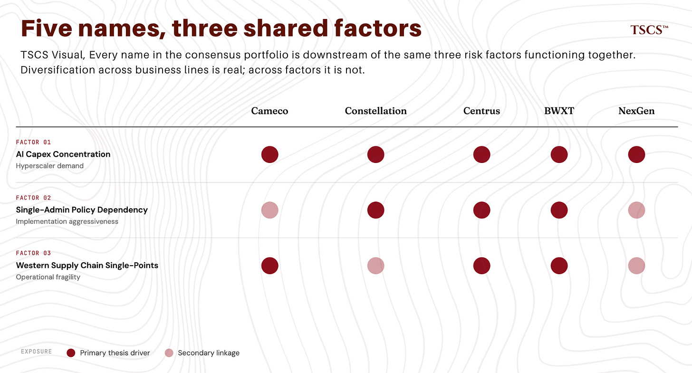](https://substackcdn.com/image/fetch/$s_!sVNQ!,f_auto,q_auto:good,fl_progressive:steep/https%3A%2F%2Fsubstack-post-media.s3.amazonaws.com%2Fpublic%2Fimages%2F7eb46f63-6faa-466f-b307-a8a05811ad60_1884x1016.png)

### Factor One: AI Capex Concentration

The single most important number in the nuclear bull case is projected US AI data center electricity demand growth over the next seven years. PJM is forecasting peak load growth from approximately 150 gigawatts today to over 184 gigawatts by 2032 in its official long-term forecast, with third-party projections running higher.

ERCOT shows similar acceleration. The MISO and SPP regions are seeing comparable patterns. This load growth is the mechanism by which existing nuclear capacity becomes scarce, which is the mechanism by which Constellation’s PPAs price at premium to wholesale, which is the mechanism by which utilities are forced to recontract uranium more aggressively, which is the mechanism by which Cameco’s contract book rolls at higher prices, which is the mechanism by which Centrus’s HALEU demand pipeline materializes, which is the mechanism by which BWXT’s commercial nuclear capex justifies itself.

Load growth isn’t coming from a thousand small commercial buyers. It’s coming from four hyperscalers (Microsoft, Google, Meta, Amazon) plus a handful of next-tier buyers (Oracle, Apple, Tesla in compute-heavy R&D, a few telecom-adjacent buyers). Microsoft and Constellation announced the 20-year PPA covering Crane Clean Energy Center in September 2024. Meta announced 6.6 gigawatts of nuclear commitments in January 2026 alone. Amazon’s nuclear-relevant portfolio exceeds 7 gigawatts. Google contracted approximately 500 megawatts via Kairos Power under the October 2024 Master Plant Development Agreement. The aggregate of announced Big Tech nuclear capacity is roughly 16 to 18 gigawatts depending on which scopes count.

[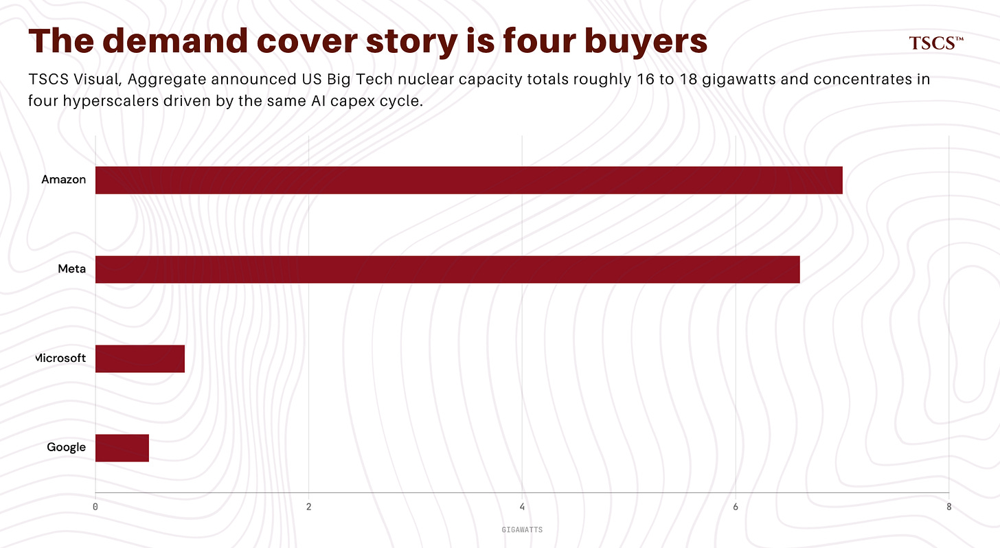](https://substackcdn.com/image/fetch/$s_!nMkr!,f_auto,q_auto:good,fl_progressive:steep/https%3A%2F%2Fsubstack-post-media.s3.amazonaws.com%2Fpublic%2Fimages%2F5d9e97e5-79fe-4361-a0d1-f28ae281c6c8_1886x1034.png)

This isn’t “diversified buyer demand.” It’s four buyers driving the structural load growth that justifies higher electricity prices, premium PPA economics, reactor restart investments, federal program scale, fuel cycle capex, SMR developer financing, and the political case for the entire nuclear renaissance. The four buyers are not coordinating in any anticompetitive sense, but they are subject to the same fundamental driver (the AI capex cycle), the same earnings pressures (quarterly capex discipline expectations from public market shareholders), and the same competitive dynamics (if one slows, the others have less competitive pressure to keep accelerating).

What happens if those four buyers collectively slow data center capex by 25 to 35 percent over the next three to five years. There are real scenarios in which this happens. AI deployment cycles disappointing relative to current capex pace. Recession compressing enterprise IT spending. Regulatory environments in Europe or specific US states constraining AI rollout. A breakthrough in inference efficiency that reduces compute per query and therefore data center footprint. None of these scenarios is the modal case. Several are not even particularly likely on a 2026-2028 timeline. But the probability of some form of AI capex moderation over a three-to-five-year horizon is meaningfully higher than zero, and the consequence flows directly through every name in the consensus portfolio. It also flows, through narrative-policy beta, into Factor Two.

If hyperscaler capex moderates by 30 percent: PJM peak load growth slows from the projected 184 gigawatts by 2032 to perhaps 168 gigawatts. Constellation’s pricing power on subsequent PPAs compresses. The premium pricing in deals like Microsoft-Crane gets re-examined in the next round of negotiations as hyperscaler procurement teams gain leverage. Centrus’s HALEU demand pipeline thins because SMR developer financing slows when the underlying demand case weakens.

[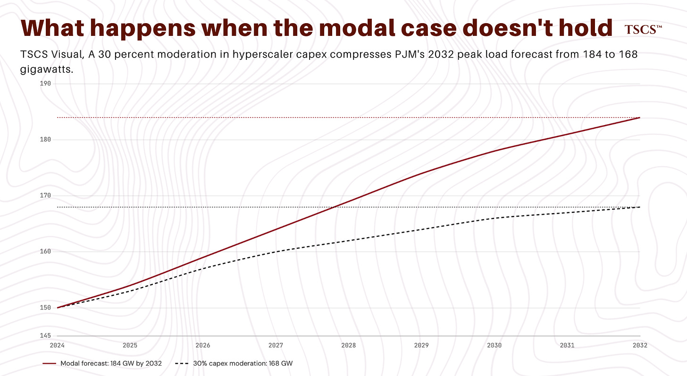](https://substackcdn.com/image/fetch/$s_!xbul!,f_auto,q_auto:good,fl_progressive:steep/https%3A%2F%2Fsubstack-post-media.s3.amazonaws.com%2Fpublic%2Fimages%2F1ded732c-d19d-44fe-bf55-1d7cb733899e_1888x1034.png)

BWXT’s heavy manufacturing capex (the Precision Components Group acquisition, the AP1000 supply chain positioning) becomes capacity built into a thinner demand environment. Cameco’s contract book continues to roll at higher prices because the contracting gap from 13 years of below-replacement contracting is real regardless of incremental demand growth, but the upside scenarios that justify the current 90-plus-times forward earnings multiple compress.

NexGen’s long-term uranium price assumption gets revisited downward, and the Arrow project NPV at the relevant discount rate compresses by 15 to 25 percent.

The consensus portfolio loses 25 to 35 percent in this scenario, with all five names participating in the drawdown roughly proportionally. The diversification across the value chain provides essentially zero protection because every name’s thesis is downstream of the same demand driver.

Modal scenario is continued AI capex acceleration. I’m not arguing otherwise. I’m arguing the consensus is sized as if moderation is impossible rather than a meaningful tail probability. Even one-in-four moderation probability puts the consensus position size at a multiple of where it should sit.

### Factor Two: Single-Administration Policy Dependency

The tailwinds nuclear has accumulated since 2024 trace to a small number of policy decisions, almost all made or implemented under the current administration. The Russian enrichment ban (enacted bipartisan but implementation through DOE waivers and Commerce Department anti-circumvention rules is administration-dependent). The $80 billion Westinghouse partnership (legal scaffolding in place but vesting on definitive deals that require continuing DOE, EXIM, and Commerce coordination).

NRC reform (commissioner appointments enabling 17-month BWRX-300 reviews and 8-months-ahead TerraPower permits, not statutory and reversible). Project Vault and the $12 billion strategic minerals reserve (allocation discretion concentrated in DOE). The DOE Manhattan-style SMR commitment with the July 4, 2026 deadline. FERC commissioners aligned on co-location structures rather than prohibition. The January 2026 White House Statement of Principles on hyperscaler PPAs and the September 2026 PJM emergency auction structure. Not one policy decision. Dozens, made by one administration over an eighteen-month window, with implementation extending three to five years forward.

What allocators are missing is durability. The standard framing is that nuclear support is bipartisan because energy security and AI competition framings create political consensus. Both statements are true at headline support.

Neither is true at implementation specifics, which is where current valuations actually depend. The aggressiveness of execution (waiver scope, capital deployment pace, commissioner alignment, allocation prioritization) is administration-dependent in ways that the bipartisan-headline framing obscures.

If the administration changes posture mid-term through Cabinet reshuffling, through the November 2026 midterm shifting Congressional dynamics, or through specific issue-area pivots, or if the 2028 election produces a different administration, the implementation aggressiveness compresses even where baseline support remains.

SWU spot prices that have grinded from $193 in March to $214 in April (per UxC weekly indicators) could give back the move on Russian sanctions relaxation alone. Westinghouse program execution slows. NRC reviewer alignment shifts. Strategic minerals capital reallocates. Each is a Centrus-or-Cameco-specific consequence. Together, sector-wide repricing.

The asymmetry matters. If policy continuity holds, the consensus portfolio works as intended. If policy posture shifts even modestly, the universe takes 15 to 25 percent damage with names most exposed to specific policy supports (Centrus, Cameco’s Westinghouse stake, NexGen’s federal-program-adjacent demand assumptions) taking disproportionate damage.

### Factor Three: Western Supply Chain Single-Point Failures

Allocators discuss the third factor least. It’s the most underappreciated. The entire Western nuclear renaissance assumes a small number of operational facilities and capabilities scale up faster than they have ever scaled before. The supply chain is being built out, but during the buildout window, current operating capacity is concentrated in a small number of single points whose failure cascades through the entire universe.

Cameco’s Port Hope is one of three commercial conversion facilities in the West. The other two are Honeywell’s Metropolis Works in Illinois (now operated by Solstice, the entity Honeywell spun the conversion business into in October 2025) and Orano’s Philippe Coste plant at Tricastin in France. That is the Western conversion universe. There is no fourth facility, no fifth facility, no redundancy beyond these three sites.

[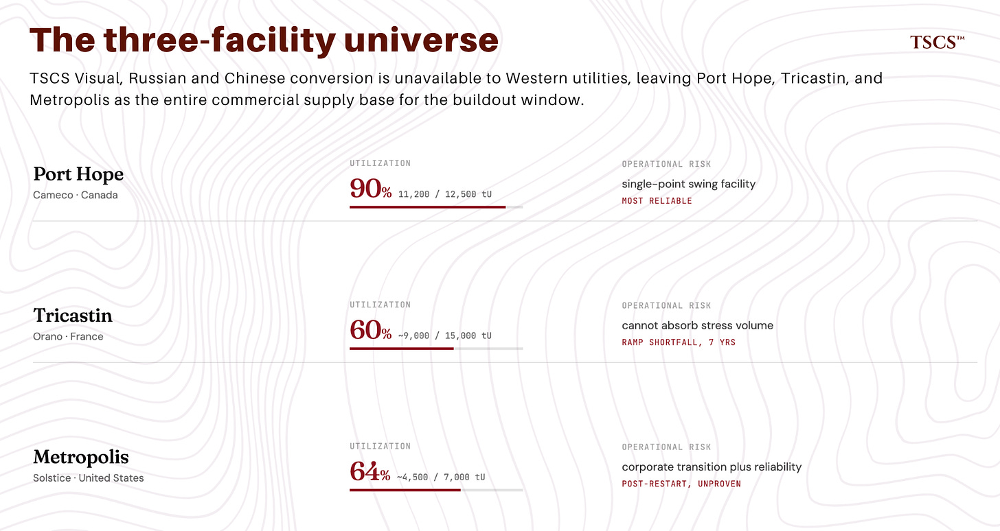](https://substackcdn.com/image/fetch/$s_!aCs-!,f_auto,q_auto:good,fl_progressive:steep/https%3A%2F%2Fsubstack-post-media.s3.amazonaws.com%2Fpublic%2Fimages%2F4b88acb5-6607-45ae-aae8-bdda43f90d33_1886x1002.png)

Russian conversion at Rosatom is sanctioned and unavailable to Western utilities. Chinese conversion at CNNC is unavailable for security and regulatory reasons. The operational track record of those three sites is the most underappreciated risk factor in the entire fuel cycle thesis, and the regulators that oversee them have left a documentary trail that almost nobody reads systematically. The picture that trail produces is structurally worse than the consensus assumes, and the three sites are at three different points on a degradation-and-rebuild curve. Metropolis first. Honeywell idled the facility in November 2017 and didn’t restart UF6 production until July 2023.

The reasons were demand-side, post-Fukushima oversupply, not operational. That demand-driven idling is not evidence for buildout-window operational fragility. It is the opposite mechanism, and using it as a base rate for forward-looking outage risk would be category-confused.

What it establishes: 25 to 30 percent of Western nameplate conversion capacity can be unavailable for almost six years for non-operational reasons. The forward-looking risk for Metropolis is different: post-restart reliability remains unproven in normal operations. The June 2023 safety-valve failure during cylinder-filling operations is documented in NRC Special Inspection Report 04003392/2023006, where the cylinder closure arm failed due to an improperly installed set screw.

Public NRC inspection reports across 2024 and 2025 indicate the facility remains within the core routine inspection program with only minor severity findings, but post-restart reliability has not been demonstrated at sustained high-utilization production.

The October 2025 Honeywell-to-Solstice spinoff adds corporate transition complexity to the operational picture during the buildout window. None of these is a confirmed signal of impending failure. Together they indicate a facility whose restart is recent, whose corporate parent has just changed, and whose operational track record has not been demonstrated at sustained high-utilization production. Tricastin next. Commissioned at the end of 2018, the plant was originally guided to reach its 15,000 metric tonne nameplate by 2021. The 2024 Orano annual activity report describes nominal capacity as “around 14,000 metric tons” and explicitly states that “the ramp-up of the Philippe Coste plant continues, with a view to ultimately achieving a nominal production capacity of nearly 14,000 metric tons.”

Translation: seven years after commissioning, the plant has neither reached its original 15,000 tonne target nor the downgraded 14,000 tonne target.

France’s ASN imposes its own inspection cadence. Public output hasn’t flagged catastrophic incidents. The ramp shortfall is the operational reality regardless. A facility that takes seven years and counting to reach a downgraded nameplate is not a facility that absorbs Port Hope or Solstice volume in a stress scenario.

[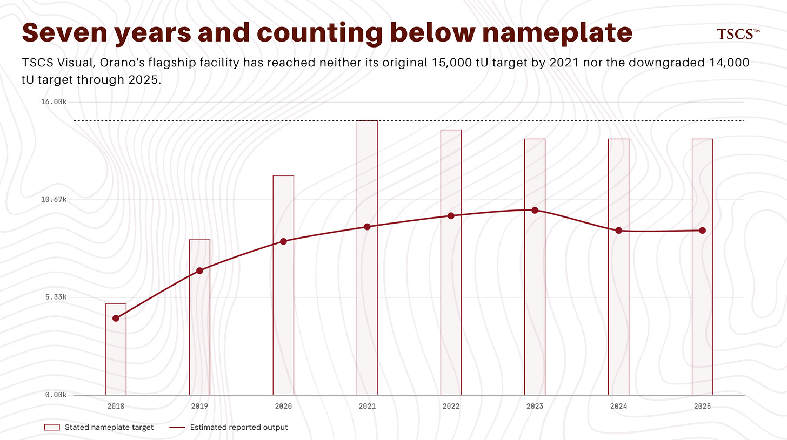](https://substackcdn.com/image/fetch/$s_!E4hS!,f_auto,q_auto:good,fl_progressive:steep/https%3A%2F%2Fsubstack-post-media.s3.amazonaws.com%2Fpublic%2Fimages%2F00a9c883-1834-4666-af5d-48a1b6fef7f4_1880x1052.png)

Port Hope last, and currently most reliable. The facility ran at approximately 88 percent of nameplate in 2025, set a UF6 production record at 11.2 million kgU, and Cameco has guided to higher utilization in 2026 with no incremental capital. The CNSC inspection record over 2023-2025 is comparatively clean.

The current CNSC licence (FFOL-3631.00/2027) expires February 28, 2027. Cameco applied on September 29, 2025 for a 20-year renewal, with CNSC public hearings scheduled for the week of November 3, 2026. If granted, the renewed licence would extend through approximately 2046, but the renewal is not yet decided, adding a discrete near-term regulatory milestone to the Port Hope risk profile during the 2026-2030 buildout window.

The most reliable of the three Western conversion facilities is the one Cameco operates, which means that any Cameco-specific operational incident takes out the swing facility for the entire Western universe.

Tricastin cannot fully absorb the volume because it is still ramping. Solstice cannot fully absorb the volume because its post-restart reliability remains unproven and its corporate structure is in transition. If Port Hope or Solstice experiences an extended outage at any point during the 2026-2030 buildout window, Western utilities cannot replace the volume from any other commercial source.

Centrus is the only domestically-owned, NRC-licensed enricher in the United States with deployment-ready technology to produce both LEU and HALEU. The other commercial enricher operating on US soil is Urenco USA at Eunice, New Mexico, which is foreign-controlled (an Anglo-German-Dutch consortium owned by the UK government, the Dutch government, and German utilities E.ON and RWE).

Urenco USA’s current capacity is approximately 4.9 million SWU per year, with a 700,000 SWU expansion targeted for 2027. US annual requirements are roughly 15 million SWU, meaning Urenco USA covers about one-third of domestic demand, with the remainder historically sourced from Russia (about 24% of US enrichment in 2022, now sanctioned with narrowing waivers), Urenco Europe, and Orano Tricastin.

[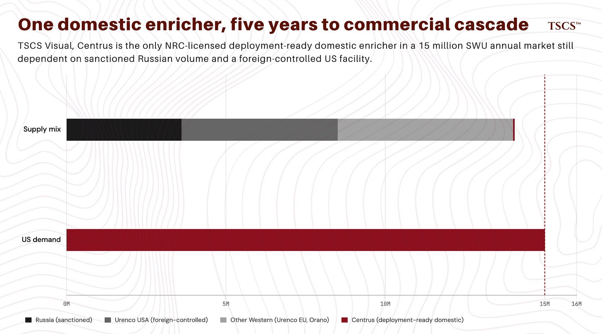](https://substackcdn.com/image/fetch/$s_!rBNf!,f_auto,q_auto:good,fl_progressive:steep/https%3A%2F%2Fsubstack-post-media.s3.amazonaws.com%2Fpublic%2Fimages%2F757a72af-6ddf-4a62-bee6-004027c8000f_1886x1048.png)

The structural concentration is sharp. The US commercial enrichment universe consists of one foreign-controlled facility ramping incrementally and one domestic-owned facility (Centrus Piketon) that is producing HALEU at demonstration scale and is not commercially deployed until the 2029 cascade.

Centrus’s predecessor company, USEC, operated the gaseous diffusion plants at Paducah and Portsmouth that were the backbone of US enrichment for fifty years. Both are closed. Paducah ceased enrichment in 2013. The American Centrifuge demonstration ran 2014 to 2016 and was suspended for cost reasons. Centrus restarted HALEU production at Piketon in late 2023 under DOE contract. The first commercial-scale cascade is targeted for 2029.

There is a five-year window during which deployment-ready domestic enrichment depends on a single facility ramping on schedule, and the prior version of that facility was not commercially viable in the post-Fukushima market.

NRC reviewer capacity is finite. The 2026 docket includes the Dow X-Energy Texas project (review targeted for late 2026), the BWRX-300 at Clinch River (review targeted for late 2026 or early 2027), TerraPower’s operating license application (separate from the construction permit already issued), the Centrus cascade authorizations, and multiple SMR developers in pre-application engagement. The agency has been streamlining processes, but the underlying reviewer headcount remains limited. A single high-profile incident at any operating facility would absorb reviewer capacity into investigation work, slowing every pending application.

Heavy forging capacity for AP1000 components is concentrated globally. North American Forgemasters, Scot Forge, BWXT’s Precision Components Group acquisition (which doesn’t fully integrate operationally for 18-24 months), Aecon, and a small number of international suppliers. Vogtle 3 and 4 absorbed enormous fractions of available capacity. The fleet-scale AP1000 buildout the Westinghouse program contemplates requires multiples more capacity than is currently online.

Sulfuric acid for ISR mining at Inkai (Cameco’s 40 percent share, contributing roughly 20 percent of attributable production) has been structurally constrained. Kazatomprom’s national output has been similarly affected. The new acid plant under construction has a late-2026 commissioning target, but transit and supply chain risks through Russia or the Trans-Caspian Middle Corridor remain unresolved.

The HALEU fuel pipeline depends on Centrus reaching commercial cascade by 2029. TerraPower needs HALEU to fuel Natrium, with first commercial operation targeted for 2030 or 2031. X-Energy’s Xe-100 needs HALEU. Multiple microreactor designs need HALEU. If Centrus’s Piketon ramp slips by 18 months, every HALEU-dependent SMR developer has a fuel availability crisis simultaneously.

What current sector valuations imply about supply chain robustness. The valuations are pricing the buildout as if it is robust. Cameco trades at premium multiples. BWXT trades at approximately 45 times consensus forward earnings.

Constellation’s PPA pricing assumes the fuel cycle delivers fuel reliably to its reactors. NexGen’s permitted resource is valuable conditional on conversion and enrichment capacity existing to process its eventual production. Every name in the consensus portfolio depends on the assumption that single-point failures don’t cascade through the system during the buildout window.

That assumption has been correct for fifty years of nuclear operation. It is being tested for the first time at this scale during the current expansion. Port Hope has not had an extended outage. NRC has not faced a workload surge of this magnitude. The HALEU pipeline has not been tested at commercial scale. Heavy forging capacity has not been demonstrated at fleet-scale AP1000 deployment levels.

I’m not predicting a single-point failure. The probability of significant supply chain disruption during the 2026-2030 buildout window is non-trivial, and the consequence flows through every name in the consensus portfolio because they all depend on the same supply chain functioning.

If Port Hope has an 18-month outage: Cameco’s conversion premium temporarily collapses, but the underlying scarcity is created which utilities have to navigate. Constellation’s reactor uptime is at risk because fuel availability matters. SMR commissioning at TerraPower is delayed because the alternative fuel pathways are even more constrained. Centrus is largely insulated because its enrichment business is downstream of conversion. NexGen is insulated for the same reason. The asymmetric impact is that the names most exposed to operational supply chain dependency take the largest damage.

If NRC reviewer congestion delays the X-Energy Dow project by a year: BWXT’s commercial nuclear ramp slows. The AP1000 program timing slips. Centrus’s HALEU customer pipeline thins. The cascading effect is meaningfully larger than the headline news of one delayed permit.

If Inkai output drops another 30 percent on top of the 2025 miss: Cameco’s attributable production compresses, and the contract book pricing power is partially undermined by the company’s own production unreliability. The Western utility customers who are paying premium prices for security of supply re-examine that premium when their preferred supplier has Kazakh exposure they were paying to avoid.

Not catastrophic scenarios. Realistic operational incidents during a buildout window, cascading in ways the diversified consensus portfolio doesn’t protect against.

[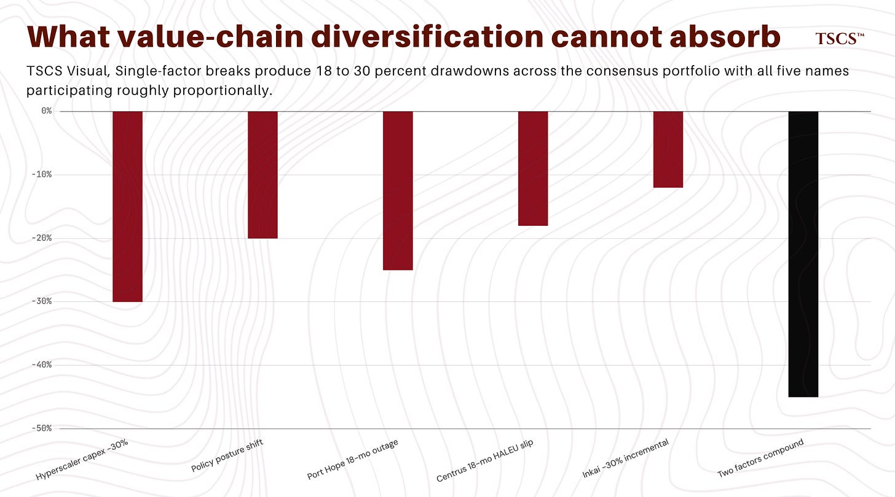](https://substackcdn.com/image/fetch/$s_!reDO!,f_auto,q_auto:good,fl_progressive:steep/https%3A%2F%2Fsubstack-post-media.s3.amazonaws.com%2Fpublic%2Fimages%2Fee467392-5cad-47e0-845c-02c50b05b3b1_1884x1048.png)

## What Cameco’s contract book actually says

The diversification critique depends on the equity-versus-fundamental correlation question. If the equity universe correlates more tightly than the underlying business fundamentals, the correlated-equity-break scenario is more probable than the operational diversification suggests. Cameco’s contract book is the cleanest publicly disclosed window into where fundamental and equity exposures actually sit.

Almost nobody reads the disclosures forensically. Three findings come out of doing so. The first finding is duration. As of December 31, 2024, Cameco discloses commitments to deliver an average of approximately 28 million pounds of uranium per year from 2025 through 2029, with the total long-term contract portfolio reaching approximately 220 million pounds. The fuel services segment carries approximately 85 million kgU of UF6 commitments, with the most recent disclosed contracts (Energoatom through 2035, Slovenské elektrárne through 2036) extending more than a decade.

The World Nuclear Association’s 2025 Nuclear Fuel Report puts typical industry contract duration at 3 to 5 years. Cameco’s portfolio explicitly “spans more than a decade” in both uranium and fuel services. Structurally longer-duration than the broader market. Single largest reason Cameco’s revenue exposure isn’t what a uranium-equity correlation analysis would suggest. The second finding is pricing structure. Cameco targets a portfolio mix of 40 percent base-escalated (fixed at contract acceptance, escalated to delivery) and 60 percent market-related (referenced to spot or long-term indicators near delivery, typically with floor and ceiling prices).

[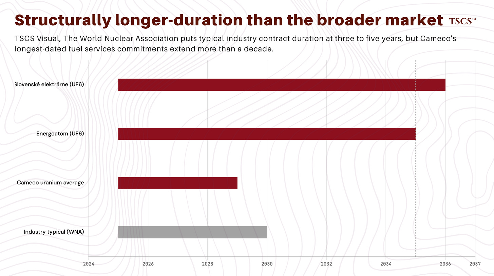](https://substackcdn.com/image/fetch/$s_!vC7W!,f_auto,q_auto:good,fl_progressive:steep/https%3A%2F%2Fsubstack-post-media.s3.amazonaws.com%2Fpublic%2Fimages%2F25c84fcd-2fb7-4131-88c4-910f84b7bbb2_1888x1058.png)

Public commentary in 2024 and 2025 suggests Cameco is actively negotiating new market-related contracts with floors near $70/lb (escalated) and ceilings near $130/lb. The 2011-2015 stress window forced Cameco’s realized prices below market because the contract book at the time was heavy on base-escalated contracts locked in at lower prices. The contract book in 2026 is structurally different. The market-related component with floors creates a fundamental price floor that the 2011-2015 contract book did not have. The base-escalated component is at higher escalator levels. The asymmetric pricing protection is meaningfully better than it was during the prior stress cycle. The third finding is the uncontracted balance. Cameco repeatedly discloses that the long-term contract book represents only approximately 20 percent of its current reserve and resource base.

[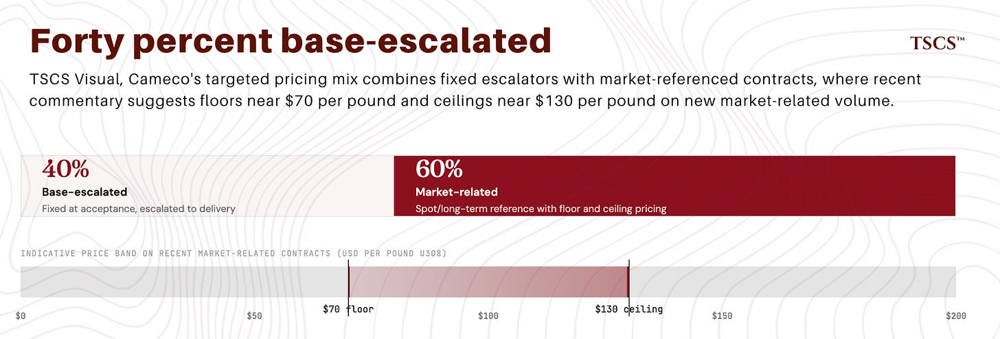](https://substackcdn.com/image/fetch/$s_!dBRV!,f_auto,q_auto:good,fl_progressive:steep/https%3A%2F%2Fsubstack-post-media.s3.amazonaws.com%2Fpublic%2Fimages%2F9cc9b0ea-363e-499c-ab45-d23b9442be40_1886x640.png)

Roughly 800 million pounds of attributable uranium remain uncontracted. In a Factor One stress (AI capex moderates, term price softens, utility contracting pace slows), the uncontracted balance is what creates downside exposure on subsequent contract rolls. In a Factor One success (term prices keep rising), the uncontracted balance is what creates upside. The uncontracted balance is the single largest determinant of whether Cameco behaves like a contract-book defensive name or a commodity-leveraged miner across the next five years. The implication is concrete.

[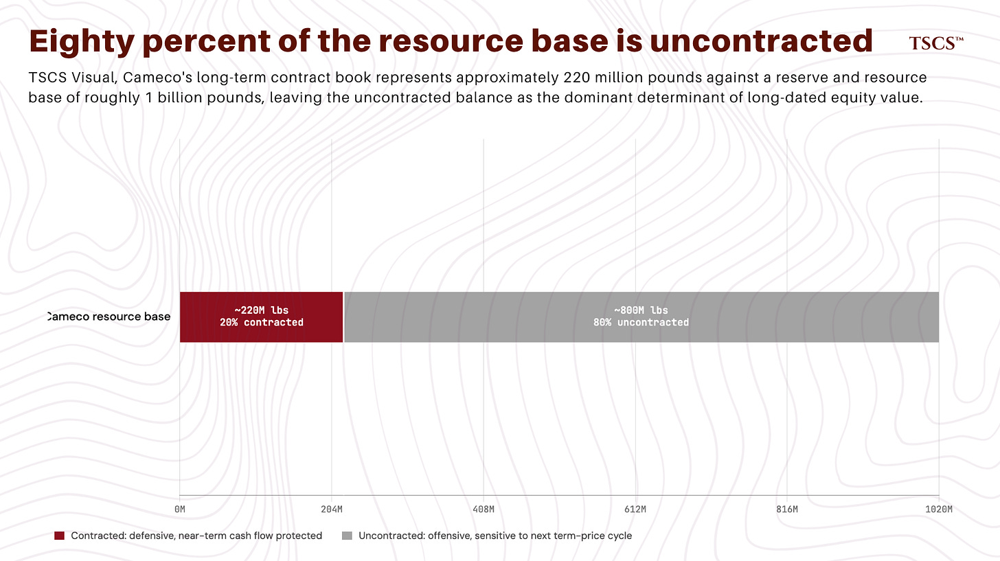](https://substackcdn.com/image/fetch/$s_!9gzA!,f_auto,q_auto:good,fl_progressive:steep/https%3A%2F%2Fsubstack-post-media.s3.amazonaws.com%2Fpublic%2Fimages%2F6822cde8-b3ee-464b-8094-42c9dfabc6a9_1886x1058.png)

The contract book makes Cameco’s near-term cash flow (2025-2029) materially more defensive than the uranium-equity correlation suggests, because 220 million pounds of contracted volume at structurally protected pricing is not the same exposure as 800 million pounds of uncontracted resource sensitive to the next term-price cycle. In the Scenario C two-factor break, Cameco’s near-term cash flow is structurally insulated, but the long-dated equity value embedded in the uncontracted reserve base is not.

A reader who concludes from “Cameco has a contract book through 2040” that the stock is defensively positioned for the 2030s is reading 20 percent of the disclosure and ignoring 80 percent. The defensive component is the contracted 20 percent. The offensive (and vulnerable) component is the uncontracted 80 percent.

The single most consequential investment decision an allocator can make about Cameco is which of those two numbers they think dominates equity value over the next five years, and the consensus framing has not even posed the question.

The consensus framing doesn’t do this analysis. It also resolves the equity-versus-fundamental correlation question: in the equity stress scenarios I describe, Cameco’s near-term cash flow is structurally protected. Long-dated equity value isn’t.

## Why these three factors are correlated

Load-bearing claim. If the three factors are independent, the consensus portfolio is fine because the joint probability of multiple factors breaking is roughly the product of individual probabilities, which sits at single digits.

If the three factors are correlated, the joint probability of two breaking together is structurally higher, and the consensus portfolio is exposed to a stress scenario that is meaningfully more probable than the conventional analysis acknowledges.

The factors are correlated. Three causal mechanisms link them, and the most important one is also the most contrarian.

The most important mechanism is political, and it is the linkage the consensus framing fails to price. The Manhattan-style SMR commercialization push, the $80 billion Westinghouse partnership, the strategic minerals reserve scope at $12 billion, the NRC reform aggressiveness, the FERC commissioner alignment on co-location: these reflect AI-era urgency, not baseline energy security framing. The baseline energy security case for nuclear has existed for two decades and produced essentially zero new construction.

What changed in 2024 and 2025 was the AI demand narrative, which moved nuclear from “good idea, never enough urgency to fund” to “national security imperative, fund aggressively.” That shift in policy posture is what justifies current valuations across the universe. Does AI capex weakening trigger policy retreat or policy doubling-down? Historical precedent runs both directions. Solar 2011-2013 saw policy intensification: the 2011-2013 break did not weaken policy support. It produced the IRA in 2022 and ongoing ITC extensions.

The political coalition that built around solar had jobs, sunk capital, and constituency pressure to defend, and that coalition got stronger after the break, not weaker. Chinese steel 2014-2016 saw policy intensification through different mechanisms (capacity-rationalization mandates) that protected the domestic industry while allowing equity stress to clear. Offshore wind 2023-2024 has seen policy stress cause partial retreat (specific project cancellations) alongside continued baseline support. Why might nuclear track closer to the retreat case than the doubling-down case.

[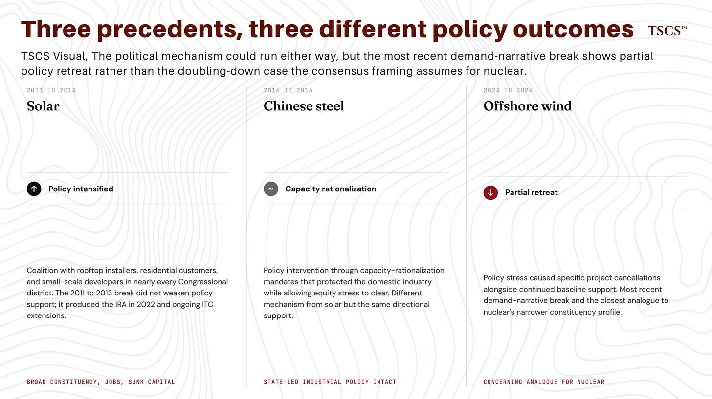](https://substackcdn.com/image/fetch/$s_!nc3M!,f_auto,q_auto:good,fl_progressive:steep/https%3A%2F%2Fsubstack-post-media.s3.amazonaws.com%2Fpublic%2Fimages%2Fe0b51ed7-b251-43eb-a793-c6cfde425a1e_1886x1058.png)

Three reasons.

First, the political constituency for nuclear is structurally narrower than solar. Solar has rooftop installers, residential customers, and small-scale developers in nearly every Congressional district.

Nuclear has a small number of utilities and a concentrated industrial supply chain in a small number of states.

Second, the AI urgency layer is what justifies the current scale of policy aggressiveness; the underlying bipartisan baseline support justifies a much smaller program. Solar’s IRA expansion was incremental on top of an already-large industry. Nuclear’s aggressive implementation is incremental on top of a much smaller pre-existing industrial base, so the proportional retrenchment risk is larger.

Third, the 2026 midterm and the 2028 election create specific dates at which Cabinet posture and Congressional dynamics can shift in ways that solar’s continuous policy environment did not face during its 2011-2013 break. None of this proves the political mechanism runs the way the framework requires. It establishes that the mechanism could run either direction, that there are specific structural reasons to think nuclear is more vulnerable to retreat than solar was, and that an allocator who believes nuclear policy support is unconditionally durable through demand-narrative stress is making an assumption that one of three closest comparable cases does not support. The framework demands engagement with the asymmetry, not certainty about it.

The second mechanism is capital allocation. AI capex weakening and policy weakening together compress supply chain investment incentives. The Cameco conversion expansion plans, the Centrus Piketon buildout, the BWXT Precision Components Group acquisition, the AP1000 federal program scale: all of these are sized to a demand picture that assumes both AI capex sustains and policy support continues.

If demand thins and policy slows, the supply chain investments that were supposed to address fragility become stranded capacity. New capacity isn’t added at the rate that would have absorbed future demand growth. The supply chain remains fragile precisely because the conditions that justified expanding it are no longer present.

This creates a paradox. A weakening demand environment makes supply chain fragility worse, not better, because the investments that were supposed to address fragility don’t get made. The consensus portfolio has implicitly assumed that demand and policy support together would deliver supply chain robustness on a timeline that addressed the buildout window risk. If demand and policy weaken, the buildout window extends, and the period during which single-point failures can cascade extends with it.

The third mechanism is direct funding. Policy weakening reduces the capital that was supposed to fund supply chain investment. The DOE grants to Centrus, the federal financing facilitating Westinghouse deployment, the strategic minerals reserve initiatives that would have created floor pricing for domestic uranium production, the HALEU production credits, the Manhattan-style SMR commercialization push. These were the capital sources that were supposed to bridge the buildout window. If policy posture shifts, the capital evaporates, and the supply chain has to fund itself entirely through commercial markets at exactly the moment when its credibility is being tested.

[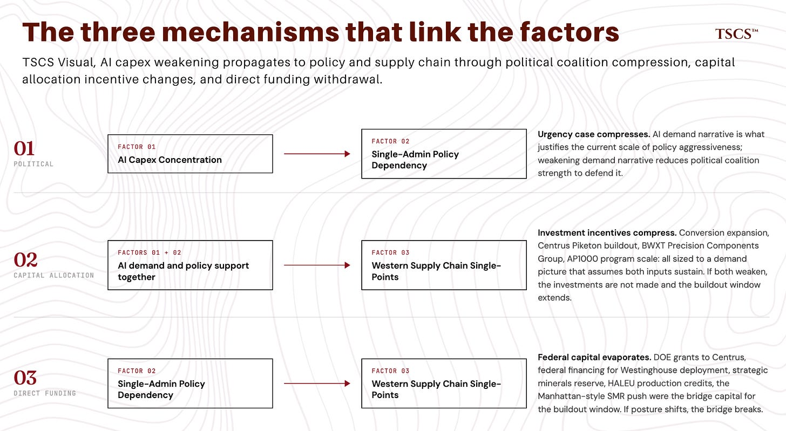](https://substackcdn.com/image/fetch/$s_!gG-Q!,f_auto,q_auto:good,fl_progressive:steep/https%3A%2F%2Fsubstack-post-media.s3.amazonaws.com%2Fpublic%2Fimages%2Fa153c0b5-a070-498d-95df-f5b51efd207a_1884x1034.png)

This isn’t a hypothetical. The Centrus Piketon expansion required the $900 million Geiger Brothers contract and is supported by both commercial backlog and government contracts. If government contracting capacity weakens (because policy support softens or capital reallocates), Centrus’s buildout slows, which extends the HALEU pipeline timing risk, which compresses SMR developer credibility, which feeds back into BWXT’s commercial nuclear ramp assumptions.

Direction is robust without committing to specific probability inputs. The conventional analysis treats joint two-factor probability as the product of unconditional individual probabilities, which assumes independence. The factors are not independent. The political mechanism (AI capex weakening reduces the urgency case that drove implementation aggressiveness) means conditional probability of policy shift given AI capex weakness is structurally higher than unconditional probability.

The capital allocation mechanism means conditional probability of supply chain investment slowing is structurally higher given joint AI-and-policy weakness. The funding mechanism means conditional probability of supply chain capacity reaching the buildout window on schedule is lower if the capital sources weaken.

A reader who picks individual factor probabilities consistent with the historical record and applies the conditional links the framework establishes will arrive at a joint two-factor probability that is structurally higher than the independence assumption gives. The exact margin depends on how tight the reader thinks the conditional links actually are. The directional claim is robust regardless: the consensus portfolio is sized as if the factors are independent, they are not, and the right portfolio size is smaller than the consensus by some factor that depends on the reader’s view on correlation strength.

I won’t give you a number for that factor because doing so would imply more precision than the data supports. The recommendations later (own SPUT alongside equity, size the equity book smaller than consensus, weight by factor exposure rather than thematic exposure) are robust across a reasonable range of probability inputs. Direction, not false precision.

The consensus portfolio is structured for one-factor breaks (which it can absorb because the diversification across names provides modest protection) but is not structured for two-factor breaks. The probability of a two-factor break is the central risk the conventional analysis is missing.

## What China changes

The framework above is Western-only. Pushback I expect: omitting China is an analytical hole. China isn’t a fourth parallel factor (which would muddy the framework). It’s a structural asymmetry inside it that changes how the correlated stress case plays out. The asymmetry runs in two directions and the question of which dominates is not currently resolvable from public data. The buyer-of-last-resort case.

China operates 62 reactors with over 34 more under construction (approximately 32.3 GW) as of April 2026 per IAEA PRIS, with the upper bound rising further if you include reactors approved but not yet physically started.

Citi Research projects Chinese uranium requirements rising from 35 million pounds in 2025 (22 percent of global demand) to 58 million pounds by 2030 (27 percent of demand). Chinese imports were equivalent to approximately 28 percent of global demand and 30 percent of global production in 2024.

[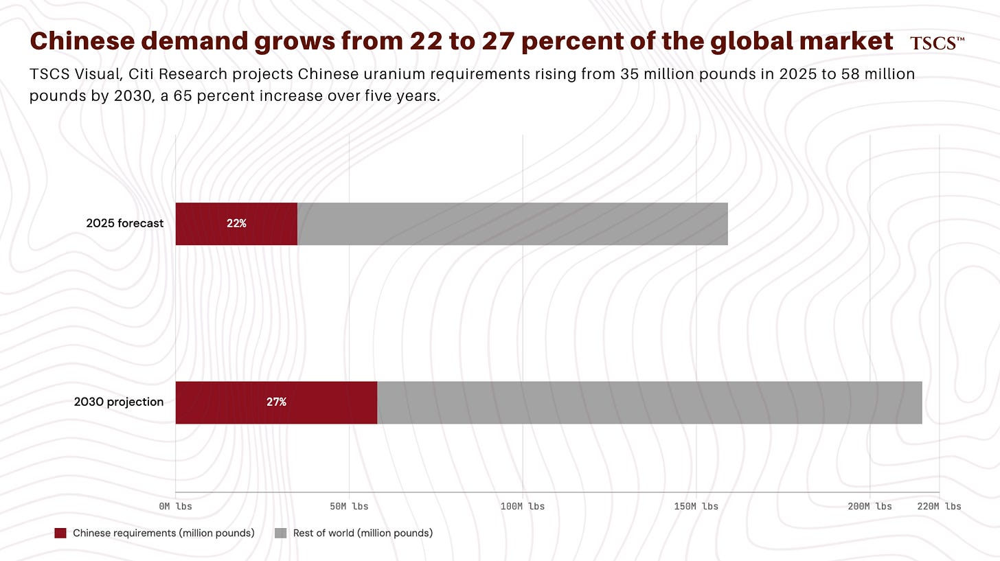](https://substackcdn.com/image/fetch/$s_!gji_!,f_auto,q_auto:good,fl_progressive:steep/https%3A%2F%2Fsubstack-post-media.s3.amazonaws.com%2Fpublic%2Fimages%2F9de1a07f-3449-47cd-8939-79c8fee55e28_1886x1058.png)

The World Nuclear Association’s 2025 fuel report estimates East Asian inventories at 65,000 tonnes uranium end-2024, the bulk held by Chinese utilities. Industry estimates put China’s strategic stockpile at 132,000 tonnes in 2022, with Citi modelling continued accumulation through a 2027 peak of approximately 183,000 tonnes (476 million pounds). In a Western three-factor break that produces dollar-denominated price weakness, Chinese state-directed buying has the capacity to absorb meaningful spot supply, partially offsetting the Western correction in physical uranium prices. SPUT and Yellow Cake (the physical-uranium expressions in the framework’s stress portfolio) benefit from this offset because their NAV references spot prices. The Western equity universe does not benefit because the equity beta to the Western three-factor break dominates.

The seller-of-opportunity case.

The same Chinese stockpile that could absorb supply in a Western correction could equally release supply if Beijing’s strategic priorities shift. The 2022 stockpile of 132,000 tonnes is approximately three times the United States’ 42,000-tonne inventory and approaches the entire European Union’s 40,000-tonne inventory. China has historically pursued a “one-third domestic, one-third foreign equity, one-third open market” strategy. If Chinese reactor commissioning slows (which has not been the recent trend but is structurally possible), or if Beijing chooses to monetize stockpile to fund other strategic priorities, the same stockpile becomes a supply overhang that amplifies Western price weakness rather than offsetting it. The 2025 data point that complicates this scenario is China’s record purchases of Russian enriched uranium, which suggest strategic accumulation is still the dominant posture rather than monetization. The HALEU question is the third asymmetry, and it runs against Centrus specifically.

[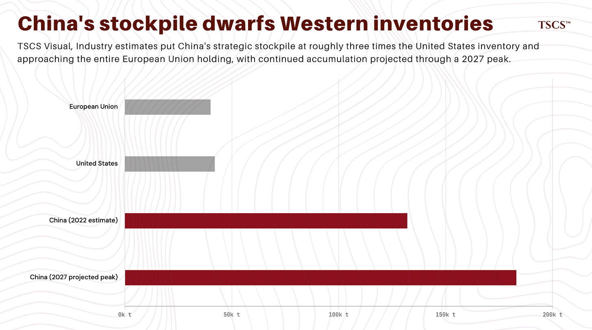](https://substackcdn.com/image/fetch/$s_!MGuZ!,f_auto,q_auto:good,fl_progressive:steep/https%3A%2F%2Fsubstack-post-media.s3.amazonaws.com%2Fpublic%2Fimages%2F9f84528b-780d-4a3b-b0f9-d8977146be8b_1888x1054.png)

CNNC is developing indigenous enrichment capacity that includes higher-assay capability. If China deploys advanced reactors that need HALEU on a 2030-2032 timeline using indigenous enrichment, the Centrus thesis loses one of its strategic legs (the argument that Centrus is the only deployment-ready Western HALEU source).

This is a multi-year risk, not a near-term one, but it is the asymmetry most directly relevant to a name in the consensus portfolio. Treatment is asymmetric. The buyer-of-last-resort case argues for higher SPUT weight in the stress portfolio because physical uranium has a partial offset that Western equity does not. The seller-of-opportunity case argues for lower SPUT weight because the offset can flip into amplification. The HALEU case argues for lower Centrus weight specifically. On balance, the buyer-of-last-resort case is more probable than the seller-of-opportunity case over a 2026-2028 horizon given current Chinese accumulation behaviour, which is one additional reason to hold SPUT inside the equity allocation as insurance against the correlated Western stress case.

The seller-of-opportunity case becomes more probable if Chinese reactor commissioning visibly slows, which is something the framework’s monitoring section now tracks explicitly.

## What history actually says about correlated breaks

The empirical case can’t rest on a precise base rate calculation. Here’s why I’m not claiming one. Defining “structurally similar buildout cycle” requires criteria, and any criteria specific enough to be useful are also specific enough that they end up shaped by knowing which cycles broke.

That is selection on the dependent variable, and a friend who pushed me hard on the original draft was right to flag it.

To be clear: case-study evidence with the mechanism for each case made explicit. Not a four-out-of-seven precision claim that can’t survive scrutiny. The two cleanest comparable cases are Chinese steel 2008-2015 and offshore wind 2020-2024. Chinese steel had a stimulus-driven demand narrative, policy aggressiveness sized to the narrative (capacity expansion mandates, provincial financing), supply chain capex committed in expectation of the narrative being durable, and equity holders across mining, processing, equipment, and construction-adjacent industrials who held “diversified” positions across the value chain.

When the demand narrative compressed in 2014-2015, the equity universe broke together. Offshore wind 2020-2024 has the same architecture: cost-curve assumptions about turbine pricing and rate environment created the demand-policy aggressiveness loop, supply chain capex was sized to it, and the equity holders who thought owning Ørsted plus Siemens Gamesa plus Vestas constituted diversification have learned otherwise. Ørsted has impaired multiple US offshore projects. Siemens Gamesa absorbed an enormous quality-related charge in 2023. Vestas margins compressed.

The stress is mid-cycle, not resolved. Two cases produced correlated stress without producing the full break the framework would predict. The 2014-2016 US shale break hit the equity universe together, but the diversification investors thought they had was modest because shale equity correlations were already high in calm conditions; the framework’s “operational diversification masking factor concentration” claim is partially redundant with what shale equity investors already understood. The 2015-2020 LNG buildout produced a 2020 correlated stress event that hit the value chain together but recovered faster than a strict reading of the framework would predict, primarily because the demand narrative remained intact through the trough. The 2007-2016 nuclear cycle and the 2011-2013 solar cycle both broke, but with mechanism caveats.

URA’s trigger was exogenous (Fukushima), so it tests “what happens to value-chain diversification once the demand narrative collapses for any reason,” not “what happens when narrative-policy beta breaks endogenously.” Solar’s trigger was Chinese state-subsidized overcapacity flooding global module markets, which is a different mechanism than the policy-implementation-aggressiveness compression the framework describes. Both are useful as evidence for the diversification critique.

Neither is clean evidence for narrative-policy beta specifically. Taken together, the case studies show buildout cycles with the four-attribute architecture have produced correlated value-chain breaks at a non-trivial rate, regardless of trigger. Precise base rate calibration isn’t needed for the directional point. The consensus portfolio is sized as if buildout cycles do not produce correlated breaks. They do, frequently, through multiple mechanisms. The question of which mechanism is most likely to apply to the current cycle is a separate question, addressed in the correlation analysis below. The base rate question is whether the consensus is correctly assuming zero. It is not.

[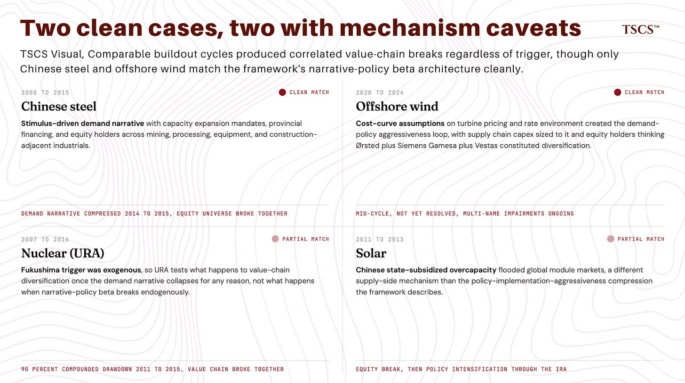](https://substackcdn.com/image/fetch/$s_!AEaA!,f_auto,q_auto:good,fl_progressive:steep/https%3A%2F%2Fsubstack-post-media.s3.amazonaws.com%2Fpublic%2Fimages%2Fe665c10f-647f-4bf6-9092-8aee7936057f_1890x1058.png)

## What the consensus portfolio actually owns

The portfolio I will critique is the one TSCS itself sketched in “[Uranium’s Loudest Signal in a Decade](https://tscsw.substack.com/p/uraniums-loudest-signal-in-a-decade)” and that I observe being implemented by readers and other sector commentators.

Approximately 25 to 30 percent Constellation, 18 to 22 percent Cameco, 12 to 15 percent Centrus, 12 to 15 percent BWXT, 12 to 15 percent NexGen, with 5 to 10 percent cash.

[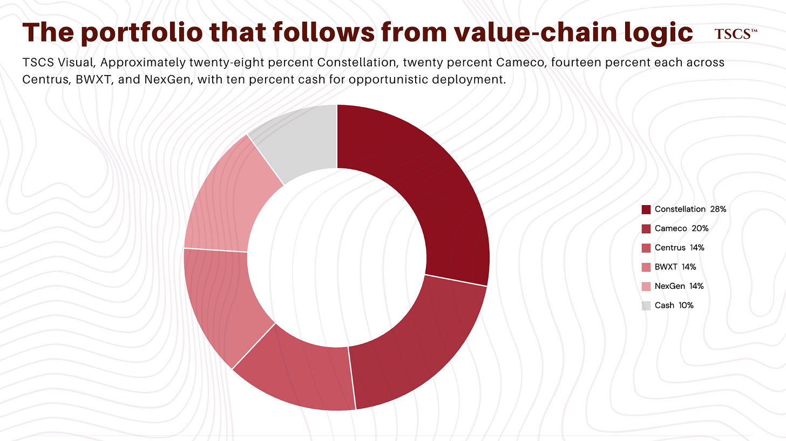](https://substackcdn.com/image/fetch/$s_!AEOh!,f_auto,q_auto:good,fl_progressive:steep/https%3A%2F%2Fsubstack-post-media.s3.amazonaws.com%2Fpublic%2Fimages%2F26ad8b85-d7bc-44ce-ab49-3235c56815af_1886x1058.png)

This isn’t “the consensus” in any rigorously sourced sense. It’s the portfolio that follows from value-chain logic applied to the five names that dominate sector commentary. The critique applies regardless of how widely held it is.

Behavior across scenarios is asymmetric. In the all-clear case it works and probably delivers 30 to 50 percent over 18 months.

In a Factor One break (the demand-narrative compression all five names sit downstream of) the portfolio takes 25 to 35 percent damage with all names participating roughly proportionally because the operational diversification doesn’t separate them at the factor level. In a Factor Two or Factor Three break alone, where exposure is more name-specific, the portfolio takes 10 to 20 percent damage with the most-exposed name taking disproportionate hits, and diversification provides modest protection.

In two-factor breaks the portfolio takes 30 to 45 percent damage and the diversification loses most of its protective value because the factors correlate through the mechanisms above. The most dangerous combination is AI capex pullback plus policy shift, where every name is hit on at least two vectors simultaneously and the five-name portfolio has all five in drawdown together, which is the opposite of what diversification was supposed to provide. In a three-factor break scenario, drawdown reaches 50 to 65 percent.

[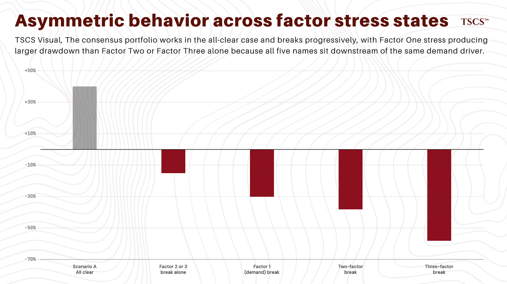](https://substackcdn.com/image/fetch/$s_!5j25!,f_auto,q_auto:good,fl_progressive:steep/https%3A%2F%2Fsubstack-post-media.s3.amazonaws.com%2Fpublic%2Fimages%2F03e4576c-dc24-4d7a-954d-c94d20f320c5_1888x1060.png)

The implicit claim of the consensus position size is that two-factor break probability is below 10 percent, which is roughly the joint probability that the independence assumption gives if each factor sits at 15 to 25 percent unconditional probability. The framework’s claim is that the factors are causally linked through narrative-policy beta, that joint two-factor probability conditional on those links is structurally higher than the independence assumption gives, and that the case-study evidence from comparable buildout cycles supports the directional claim. If that’s right, the consensus portfolio is sized for an outcome more confident than the data supports.

The right position size sits smaller than consensus by a factor that depends on conviction on the conditional links, with the arithmetic developed later in the piece pointing toward a 25 to 40 percent reduction at central inputs, and larger reductions if the political mechanism conditional probability sits above the 35 percent baseline used.

## Four scenarios, four portfolios

Now the practical part. Four scenarios and the portfolio that survives each one. Scenario A: All three factors hold. This is the consensus base case.

The portfolio is approximately what “[Uranium’s Loudest Signal in a Decade](https://tscsw.substack.com/p/uraniums-loudest-signal-in-a-decade)” sketched. Constellation as the largest single position because the structural fleet thesis works. Cameco and Centrus as core fuel cycle exposures. BWXT and NexGen as satellites. The cash position sits at 5 to 10 percent for opportunistic adds.

Specific weights for this scenario: Constellation 25 to 30 percent, Cameco 18 to 22 percent, Centrus 12 to 15 percent, BWXT 12 to 15 percent, NexGen 12 to 15 percent, cash 5 to 10 percent. Consensus portfolio. Works here. Only scenario it works in without modification.

Scenario B: One factor breaks. Here are directional principles for how to rotate within the equity portfolio when each factor shows stress. If AI capex pullback is the factor showing stress: rotate from Constellation toward Cameco’s Port Hope franchise and toward SPUT. Specific weights: Constellation 12 to 18 percent (down from 25-30), Cameco 22 to 28 percent (up from 18-22, weighted toward the conversion-franchise component of the thesis), Centrus 8 to 12 percent (modestly lower; HALEU pipeline thinning), BWXT 10 to 14 percent (largely unchanged; naval franchise is independent of AI demand), NexGen 8 to 12 percent (modestly lower; long-dated NPV compresses on revised price deck), SPUT 12 to 18 percent (substantial new addition), cash 5 to 10 percent.

Eastern sovereign demand and Western utility recontracting both proceed independently of marginal AI demand, which is what protects Cameco; the fleet thesis is most directly hit because PJM premium pricing depends on incremental load growth. If policy posture is the factor showing stress: rotate from Centrus and Westinghouse-attributed Cameco value toward Constellation and BWXT.

Specific weights: Constellation 30 to 35 percent (up from 25-30, the cleanest policy-insulated equity), Cameco 12 to 16 percent (down from 18-22 because Westinghouse partnership equity stake reprices), Centrus 5 to 8 percent (down from 12-15, government-contract dependency repricing), BWXT 18 to 22 percent (up from 12-15, naval franchise insulation), NexGen 6 to 10 percent (down from 12-15, federal-program-adjacent demand assumptions repricing), SPUT 8 to 12 percent (modest addition), cash 5 to 10 percent.

If supply chain failure is the factor showing stress, the weights depend on which specific failure occurs, but the rotation principle is consistent: overweight names that own operating capacity at the time of the incident and underweight names dependent on capacity coming online. If the incident is at Port Hope, Cameco gets repriced regardless of franchise quality and the rotation is to BWXT and Constellation; if the incident is at Centrus’s Piketon ramp, Centrus is the loser and Cameco is the relative winner because Western utilities have more time on existing fuel inventory than they do on enrichment ramp. SPUT becomes meaningfully more valuable in any sub-case because physical uranium does not require fuel cycle services to deliver returns.

Specific weights for the Port Hope sub-case: Cameco 8 to 12 percent (down sharply, repricing on operational franchise risk), Constellation 25 to 30 percent (largely unchanged, slight upward bias as the most insulated name), Centrus 12 to 16 percent (modest upward, downstream insulation), BWXT 14 to 18 percent (modest upward), NexGen 8 to 12 percent, SPUT 18 to 22 percent (large position, scarcity is the trade), cash 5 to 10 percent. The weights above are calibrated to factor exposure, not thematic exposure.

Scenario C: Two factors showing stress concurrently but neither yet at formal-fire threshold. The realistic transition state during which the portfolio rotates aggressively toward physical uranium and cash, ahead of the binding exit condition specified in the falsification section. Three sub-cases by combination.

The most dangerous and most probable combination is AI capex pullback plus policy posture shift, which correlate through the political mechanism I described. In this scenario, the equity universe is uniformly damaged, and the portfolio that survives is heavy on physical uranium exposure (which preserves value because reactors still need to be fueled regardless of equity beta), small positions in the most insulated names, and substantial cash to deploy at the eventual bottom.

Specific weights for AI-plus-policy break: Constellation 8 to 12 percent (small position only, the cleanest insulated equity), Cameco 8 to 12 percent (Port Hope franchise is the most defensible asset), BWXT 5 to 8 percent (naval franchise survives), Centrus 0 to 5 percent (most exposed, may not own at all), NexGen 5 to 8 percent (developer optionality is cheaper but dilution risk is higher), SPUT 25 to 35 percent (largest single position by far), Yellow Cake 5 to 10 percent (additional physical uranium exposure with different counterparty), cash 15 to 20 percent.

The combination of AI capex break plus supply chain break (less probable but still meaningful): the equity universe is hit on demand and on operational reliability simultaneously. Position similarly to AI-plus-policy but with additional weight on names that own operating capacity (Cameco, BWXT) and underweight on names that depend on capacity coming online (Centrus, NexGen). SPUT is even more valuable because both equity beta and physical scarcity matter.

The combination of policy break plus supply chain break: this is the scenario where the political response to a supply chain incident is to retreat from nuclear support rather than to invest in solving the supply chain. Smaller probability than the others but the worst outcome if it happens. Position primarily in physical uranium with minimal equity exposure. Scenario D: All three factors break. Tail scenario but worth specifying because constructing portfolios for tail scenarios is what discipline looks like. The thesis isn’t that the nuclear renaissance was wrong. It’s that the equity expressions of it were too tightly correlated to survive a triple-break, and the underlying physical commodity is the right exposure because reactors still need to be fueled regardless of equity beta or policy environment.

The portfolio I would actually hold in Scenario D: roughly 35 to 45 percent in SPUT or equivalent physical uranium expression, 10 to 15 percent in Yellow Cake as a different counterparty exposure to physical, 25 to 35 percent short-duration Treasuries to preserve optionality for when equity dislocations create entry points, 5 to 10 percent gold as the broader monetary disorder hedge that tends to perform when policy support unwinds, and 5 to 10 percent cash for opportunistic deployment.

The rationale. SPUT works because Sprott’s structure is forced-buyer with daily NAV that captures spot uranium tightness mechanically. Yellow Cake works because it’s a different jurisdiction (London-listed) with similar exposure but different counterparty and regulatory risk, which matters in a scenario where US-specific factors are part of what’s breaking. Short-duration Treasuries rather than long because the scenario contemplates monetary policy uncertainty and duration risk in long bonds. Gold at small weight because it tends to perform in policy-disorder environments but has its own basis risk against the specific uranium thesis. Cash because the scenario implies entry points develop that aren’t yet visible.

I don’t own this portfolio currently because I don’t think Scenario D is the modal case. I’ve specified it so that if factor signals develop toward it, the rotation is mechanical rather than improvised.

[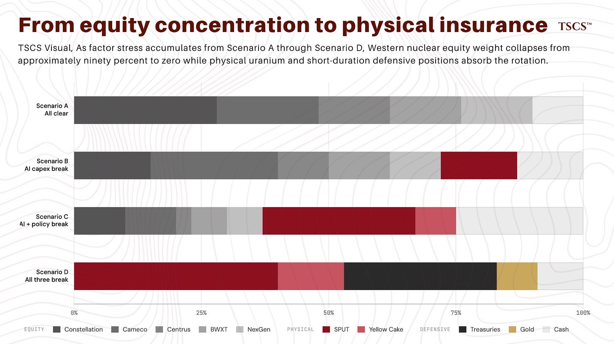](https://substackcdn.com/image/fetch/$s_!lt80!,f_auto,q_auto:good,fl_progressive:steep/https%3A%2F%2Fsubstack-post-media.s3.amazonaws.com%2Fpublic%2Fimages%2F04a7665f-72d7-40be-b60b-03ea3ff31b15_1888x1060.png)

## What the framework actually changes

Three changes for how an allocator should position.

First, the consensus position size is too large. The arithmetic matters because the recommendation depends on it. I’ll commit to specific inputs so a reader who disagrees can disagree with the inputs rather than the structure.

Three-year unconditional probability for each factor, calibrated to the case-study evidence and the operational disclosures: Factor One (AI capex moderation of 25 percent or more) at 18 percent, Factor Two (policy implementation aggressiveness compresses meaningfully) at 22 percent, Factor Three (single-point supply chain failure of consequence during the buildout window) at 12 percent.

The independence assumption gives joint two-factor probability of approximately 7 percent. Conditional links.

P(Factor Two given Factor One) sits at roughly 35 percent on the political mechanism, against 22 percent unconditional.

[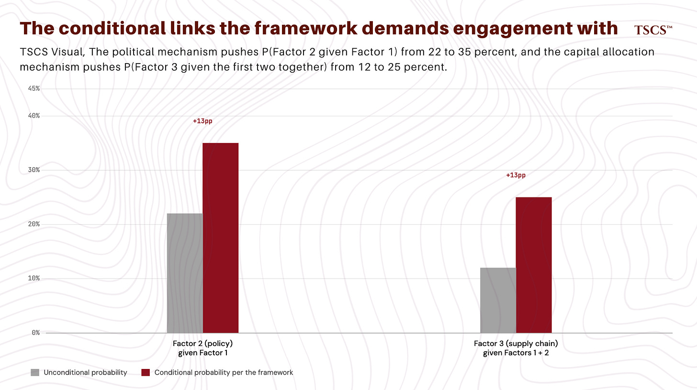](https://substackcdn.com/image/fetch/$s_!UIu0!,f_auto,q_auto:good,fl_progressive:steep/https%3A%2F%2Fsubstack-post-media.s3.amazonaws.com%2Fpublic%2Fimages%2F8db299cc-3f17-4047-9753-0c0a63017285_1884x1056.png)

P(Factor Three given Factor One and Factor Two together) sits at roughly 25 percent on the capital allocation mechanism, against 12 percent unconditional. Joint two-factor probability at these conditional inputs sits between 9 and 11 percent, against 7 percent under independence. The position sizing implication: if the consensus is sized for 7 percent joint probability and the right number is 10 percent, the position size adjustment is 30 percent reduction, not half. A reader who thinks my conditional inputs are too aggressive can run their own numbers and arrive at a smaller adjustment. A reader who thinks the political mechanism is tighter than 35 percent conditional arrives at a larger adjustment. The framework demands engagement with the conditional links, not commitment to my specific inputs.

[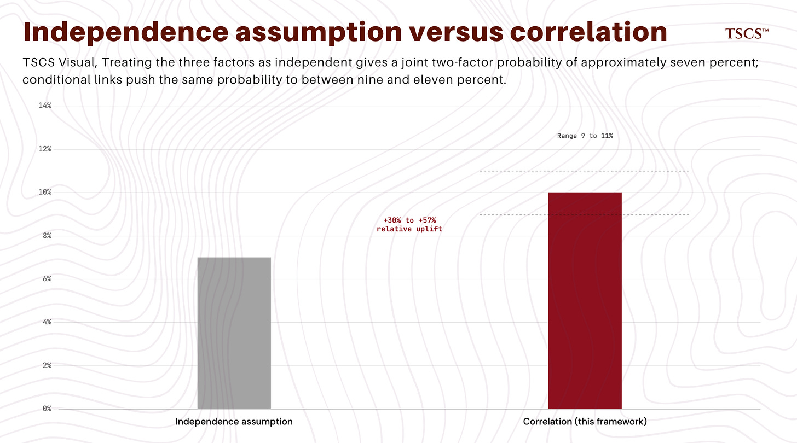](https://substackcdn.com/image/fetch/$s_!WuTv!,f_auto,q_auto:good,fl_progressive:steep/https%3A%2F%2Fsubstack-post-media.s3.amazonaws.com%2Fpublic%2Fimages%2Fae5fef8a-1e46-4386-a426-0bf126042847_1884x1048.png)

Second, SPUT and physical uranium should be a meaningful percentage of any nuclear allocation, held alongside the equity portfolio specifically because it doesn’t correlate with the equity stress scenarios. The February uranium piece named SPUT as the cleanest commodity expression; this piece makes a different claim about its function. A 10 to 15 percent SPUT position inside a five-name equity construction is what protects against the two-factor break without giving up upside in the all-clear case.

Third, Constellation is most insulated from policy and supply chain factors and deserves the largest weight. Centrus is most exposed to policy and deserves a smaller weight than its growth thesis suggests. BWXT’s naval franchise insulates from AI capex specifically but not from AP1000-policy linkage, so its weight should sit between consensus and underweight. Cameco’s Port Hope franchise is more defensive than its commodity-producer framing acknowledges.

I’m not arguing against owning the sector. Just not at consensus weights with consensus diversification logic.

## What happens if I’m wrong about correlation

What could break the structural argument.

The piece’s central claim is that the three factors are correlated through specific causal mechanisms, and that joint probability of two-factor breaks is meaningfully higher than the independence assumption would suggest. If I’m wrong about the correlations, the framework collapses and the consensus portfolio is fine.

Three ways I could be wrong.

One. The political mechanism linking AI capex to policy support might be weaker than I’m claiming. Bipartisan support for nuclear could prove sticky enough that even a meaningful AI capex pullback doesn’t translate to policy retreat. The energy security framing is genuinely durable across administrations, and the AI competition framing is a layer on top rather than the foundation. If the foundation holds, AI capex weakness doesn’t propagate to policy through the mechanism I described, and the correlation breaks.

I find this argument partially persuasive. The energy security framing is durable, and Trump administration nuclear support has been consistent with longer-running bipartisan momentum that predates the current AI cycle. But I think the aggressiveness of the implementation is AI-driven, even if the baseline support isn’t. The $80 billion Westinghouse program, the Manhattan-style SMR push, the strategic minerals reserve scope: these reflect AI-era urgency, not just baseline energy security framing. A weaker urgency case translates to weaker implementation aggressiveness even if baseline support remains.

Two. The supply chain investment incentive mechanism might be weaker than I’m claiming. Capital that’s already been committed (Centrus’s Geiger contract, BWXT’s PCG acquisition, the federal financing structures already in place for Westinghouse) is sunk and won’t unwind even if demand and policy weaken. The buildout proceeds on commercial inertia rather than on fresh capital deployment.

This argument has some force. Capital commitments have momentum. The Centrus expansion is contracted. The PCG acquisition is closed. But the next round of supply chain investment depends on continued capital deployment, and that’s where the mechanism bites. Cameco’s next conversion expansion. Centrus’s third commercial cascade. BWXT’s potential subsequent acquisitions. The next round of NRC headcount investment. These are commitments that haven’t been made yet and depend on the demand and policy environments staying favorable. If those environments weaken, the next round doesn’t happen, and the buildout window extends.

Three. The supply chain single-point failure probabilities might be lower than I’m claiming, simply because operational reliability has been good. Port Hope hasn’t had an outage. NRC has accelerated reviews rather than slowed them. The HALEU pipeline is on track. The track record argues against the probability of meaningful supply chain disruption being as elevated as I’ve suggested.

This is the strongest argument against my framework. I have no specific reason to forecast a Port Hope outage. NRC capacity is being expanded rather than constrained. The supply chain is being tested by the buildout, but it’s also being supported by the capital deployment the framework otherwise treats as a positive. If supply chain reliability is durable through the buildout window, Factor Three is meaningfully less probable than I’ve argued, and the joint probability of two-factor breaks compresses accordingly.

All three counterarguments have force. Here’s which I think is most likely to be right.

The counterargument I find weakest is the sticky-political-support one. Bipartisan support for nuclear is real, but the aggressiveness of the implementation reflects AI urgency, and that aggressiveness is what justifies current valuations. A reader who thinks I’m wrong on the political mechanism has to defend the position that policy implementation aggressiveness is independent of perceived demand urgency, which contradicts how policy support has actually moved across other sectors and across other historical episodes. I don’t find that defensible.

The counterargument I find strongest is the supply chain reliability one. I have no specific reason to forecast a Port Hope outage or an NRC capacity failure. Operational track records have been good. If supply chain reliability holds through the buildout window, Factor Three is meaningfully less probable than I’ve argued, and the joint probability of two-factor breaks compresses accordingly. I’m least confident about this part of the argument. The one I’d revise downward first.

[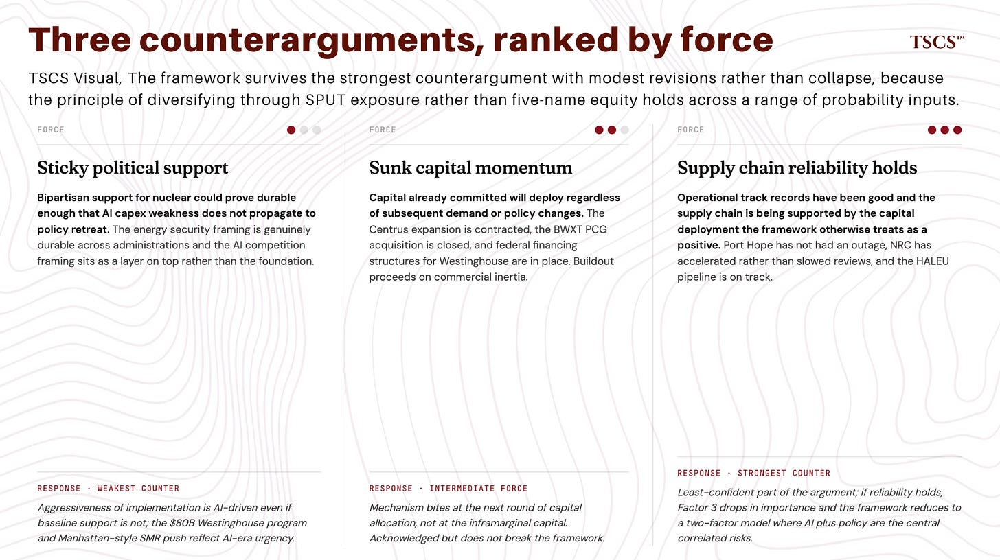](https://substackcdn.com/image/fetch/$s_!m9mu!,f_auto,q_auto:good,fl_progressive:steep/https%3A%2F%2Fsubstack-post-media.s3.amazonaws.com%2Fpublic%2Fimages%2F9dfd1aa2-61a0-44c0-9422-7a17c43b7e3d_1884x1056.png)

The counterargument with intermediate force is the sunk-capital momentum one. Capital already committed will deploy regardless of subsequent policy or demand changes. True at the level of capital in the ground. Not true at the level of next-round capital allocation, which depends on demand and policy environments staying favorable. The mechanism bites at the margin, not at the inframarginal capital. Acknowledged but does not break the framework.

If the strongest counterargument is correct (supply chain reliability holds), Factor Three drops in importance and the framework reduces to a two-factor model where AI capex and policy posture are the central correlated risks. The recommendation for SPUT as insurance against the correlated stress case still holds because the two-factor break of AI plus policy is the most damaging scenario regardless of supply chain factor weight. The position sizing implications are similar. The framework survives the strongest counterargument with modest revisions, not collapse.

The principle of diversifying within the nuclear allocation through SPUT exposure rather than through five-name equity diversification is robust to most error in the underlying probability estimates. The framework’s qualitative recommendations (own SPUT alongside equity, size the equity portfolio smaller than consensus, weight by factor exposure rather than thematic exposure) hold across a range of plausible probability inputs. The specific weights would shift under different probability assumptions; the structural construction stays.

## Falsification triggers and the exit condition

The framework is only useful if its predictions are falsifiable. Triggers below are pre-committed. Follow-up pieces reference them by number when they fire. A factor fires when any single trigger fires. Threshold for action: two factors firing within a rolling 90-day window, not two triggers within a single factor.

Factor One (AI capex).

Trigger 1.1: combined fiscal-2027 capex guidance from Microsoft, Alphabet, Meta, and Amazon revised down by an aggregate 10 percent or more across two consecutive quarterly earnings cycles. Single-quarter cuts can be noise; consecutive cuts are a posture shift.

Trigger 1.2: the September 2026 PJM emergency capacity auction clears below 2025 base residual auction levels, indicating capacity scarcity is being absorbed faster than the framework’s demand thesis assumes.

Trigger 1.3: Chinese reactor commissioning announcements over a rolling six-month window fall to two or fewer reactors against a 6-to-8-per-year run rate, weakening the global demand offset. Rotation if Factor One fires alone: from Constellation toward Cameco and SPUT, with Centrus modestly reduced (HALEU pipeline thins) and BWXT largely unchanged (naval franchise insulates from AI demand specifically).

Factor Two (policy).

Trigger 2.1: any change to the NRC’s 3-2 Republican majority during the 2026-2028 window, whether through Commissioner Weaver’s June 30, 2026 term expiration being filled by a non-Republican, through removal of any sitting Republican commissioner, or through resignation followed by a Democratic replacement. The composition matters more than the headcount because implementation aggressiveness depends on majority alignment.

Trigger 2.2: DOE issues new or expanded waivers permitting Russian enriched uranium imports beyond the current narrowing schedule, or Commerce Department anti-circumvention enforcement is publicly weakened, or DOE Secretary Wright is replaced and the successor publicly modifies posture on the Westinghouse program or strategic minerals reserve scope. Rotation if Factor Two fires alone: from Centrus and Cameco’s Westinghouse-attributed value toward Constellation and BWXT (naval franchise insulation), with modest SPUT addition.

Factor Three (supply chain).

Trigger 3.1: Port Hope, Solstice Metropolis, or Tricastin reports an unplanned outage exceeding 60 days for any reason. The 60-day threshold rather than 90 reflects how tight the buildout window is. A 60-day unplanned outage at any of the three Western conversion facilities depletes utility flexibility meaningfully.

Trigger 3.1a: CNSC issues anything other than a clean 20-year renewal of FFOL-3631.00/2027 at the November 2026 hearings (i.e., shorter renewal term, conditions on operational scope, or deferral). This is a discrete, dated, monitorable supply chain risk during the buildout window.

Trigger 3.2: Centrus Piketon commercial cascade timeline is officially guided to slip beyond 2030 (current target is 2029, so this represents at least twelve months of slip and triggers the HALEU-dependent SMR pipeline crisis I described in Factor Three).

Trigger 3.3: NRC review timeline for the X-Energy Dow Texas project, the BWRX-300 at Clinch River, or TerraPower’s operating license application slips by nine months or more from current public guidance. Rotation if Factor Three fires alone: depends on which trigger fires. The general principle is to overweight names that own operating capacity and underweight names dependent on capacity coming online, with SPUT serving as the position that wins regardless of which point fails.

[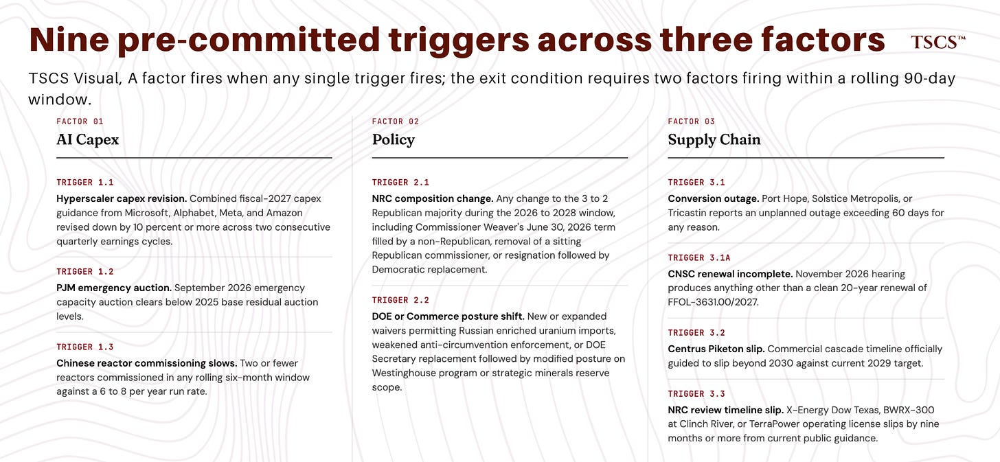](https://substackcdn.com/image/fetch/$s_!C0WM!,f_auto,q_auto:good,fl_progressive:steep/https%3A%2F%2Fsubstack-post-media.s3.amazonaws.com%2Fpublic%2Fimages%2F70e41744-a0ba-4ff6-a91f-3f0725456984_1882x870.png)

The exit condition. If two of the three factors fire within a rolling 90-day window, exit the equity universe entirely and hold only physical uranium exposure (SPUT, Yellow Cake) and cash. I’ll publish that piece if those signals fire. Frameworks that don’t pre-commit to exit conditions are decoration. Note the asymmetry: a factor fires on a single trigger because the underlying mechanism is correlated. The exit condition requires two factors because correlated factor stress is what produces the historical correlated-break outcome.

[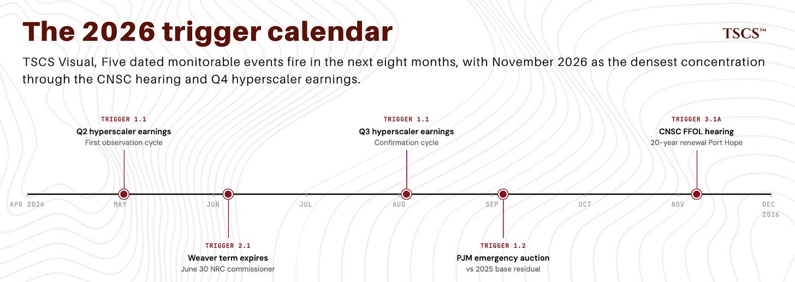](https://substackcdn.com/image/fetch/$s_!-c3g!,f_auto,q_auto:good,fl_progressive:steep/https%3A%2F%2Fsubstack-post-media.s3.amazonaws.com%2Fpublic%2Fimages%2F653423ab-87a0-45d3-a862-4f89fef33090_1886x670.png)

## Closing

The structural argument from the primer has not changed. The world ran out of options to power the next decade of electricity demand. The fuel cycle has structural deficits the West cannot fix before the early 2030s. Existing fleet is enough. New build is upside. All of that is still right. What’s different is this.

The equity expressions of those structural truths aren’t as diversified as the consensus framing assumes. Five names that look distinct across the value chain are five expressions of three correlated bets linked by narrative-policy beta. Multiple structurally comparable buildout cycles over the last twenty-five years have produced correlated value-chain breaks. The 2008-2015 Chinese steel cycle and the ongoing 2020-2024 offshore wind cycle are the cleanest mechanism comparables. The 2011-2015 uranium drawdown that took URA down approximately 90 percent is a noisier comparable because Fukushima was exogenous, but the value-chain diversification still failed to absorb the break. The current cycle has the same architecture as those cases.

I’m not claiming this will happen again. I’m claiming the historical record for buildout cycles producing correlated breaks is meaningfully populated, while the consensus portfolio is sized as if it’s empty. Bearish in framing, net long in recommendations. Not a turn in the TSCS view on nuclear.

The discipline of constructing portfolios that survive plausible stress scenarios. The portfolio you think you own is one bet, made three times. The historical base rate for that bet breaking in buildout cycles is meaningfully above zero. Build the portfolio that survives, or accept that you are sized for an outcome more confident than the data supports. This is not investment advice. Do your own work.

[Share TSCS](https://tscsw.substack.com/?utm_source=substack&utm_medium=email&utm_content=share&action=share)

[Share](https://tscsw.substack.com/p/size-nuclear-smaller?utm_source=substack&utm_medium=email&utm_content=share&action=share&token=eyJ1c2VyX2lkIjoxNDAwMjQ1LCJwb3N0X2lkIjoxOTU4MDI5OTcsImlhdCI6MTc3ODU0NTI3NiwiZXhwIjoxNzgxMTM3Mjc2LCJpc3MiOiJwdWItMjM1NDI0NCIsInN1YiI6InBvc3QtcmVhY3Rpb24ifQ.wX4TPemtttO22u3ypZ4nkFRiT9bu6zbc6NeUlCukPOo)