The US Navy fired 850 Tomahawk cruise missiles in eight weeks during Operation Epic Fury. Twelve years of normal-rate procurement, gone in two months. Half the THAAD inventory, half the Patriot stockpile.

RTX has agreed to rebuild the magazine. Five framework agreements with the Department of War in February: Tomahawk to 1,000 per year, AMRAAM to 1,900, SM-6 to 500. Sell-side desks size the deals at $7 to $8 billion of incremental annual revenue at full ramp. Morgan Stanley called the upside “underappreciated” on April 22. Wolfe Research said the same in February.

None of it is in the numbers.

I pulled the Bloomberg consensus build for RTX. The Raytheon segment is modelled at 7.34% organic growth in FY27 with operating margin expanding modestly to 12.28%. FY28 consensus EPS sits at $8.28 across nineteen estimates with a standard deviation of $0.37, clustering tight against a base business compounding path. FY29 mean steps to $8.91, FY28 plus 7.6% growth, what base business produces. Consensus isn’t wrong on the framework calendar. It doesn’t have one.

The reconciliation vote that funds the rebuild lands in December. Seven months from now. The supplier base has already committed more than $5 billion of capex to deliver against framework volumes, on the assumption that vote clears. Williams International is building a billion-dollar engine plant in Florida. L3Harris is breaking ground on a $1.27 billion expansion in Virginia. The Pentagon committed $1 billion to anchor an L3Harris Missile Solutions IPO planned for the second half of this year.

If the December vote clears, the 2028 print is mechanical. If it scales the production lines down materially, RTX trades back to peer multiples and the asymmetry collapses. That’s the trade.

Base case on RTX direct: 25 to 35% total return through mid-2029, 8 to 10% annualised with dividends. Dead-money floor 6 to 8% annualised. Bull case closer to 12% annualised if framework revenue prints earlier than the supplier base implies. Patient capital with embedded optionality, not a coiled spring.

*TSCS is read at 400+ investment firms. Subscribe for the full trade architecture, kill switches, and pre-committed thresholds. Free posts cover the thesis. Paid posts cover the execution.*

Subscribed

## **What consensus actually models**

Walk the Bloomberg FA Segments build forward.

Raytheon segment FY25 actual revenue was $28,043 million at 11.5% adjusted operating margin. Bloomberg consensus FA Segments shows Raytheon growing to $29,895 million in FY26 and $31,981 million in FY27. Organic growth of 7.92% in FY26 and 7.34% in FY27. Operating margin modeled at 11.89% in FY26 expanding to 12.28% in FY27. That is the model.

[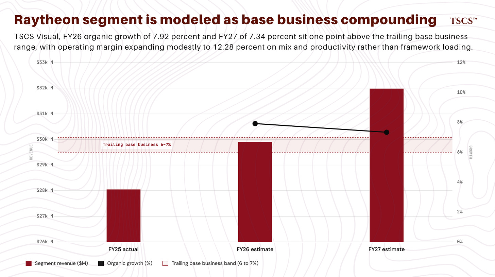](https://substackcdn.com/image/fetch/$s_!tT7g!,f_auto,q_auto:good,fl_progressive:steep/https%3A%2F%2Fsubstack-post-media.s3.amazonaws.com%2Fpublic%2Fimages%2F612996a2-4d20-4a7d-9995-731944c681ae_1886x1056.png)

Run the framework math against it. The five framework agreements size at $5 to $7 billion of incremental annual revenue at full ramp on my build, $7 to $8 billion on sell-side builds. Even $500 million of framework contribution into FY27 would push Raytheon segment growth above 8%. Consensus sits at 7.34%.

The base business growth rate this assumes is consistent with what RTX is actually printing on current programs. Raytheon segment sales grew 10% in Q1 2026 with the segment operating margin up 150 basis points to 12.2% on favorable mix and productivity. The trailing twelve-month organic on Raytheon’s existing program book sits at 6 to 7%. The 7.34% consensus sits one point above base. That’s normal program escalation, not framework conversion. The math doesn’t need framework revenue to balance.

BI’s RTX Equity Outlook on April 22 is the cleanest in-terminal check. Ferguson and Lee, the BI primary and secondary analysts on RTX, frame the thesis as: “Defense gains could extend on robust demand for air defense and missiles, efficiencies and higher-margin foreign sales.” That’s the entirety of it. No conversion year. No UCA timeline. No framework revenue contribution to FY27 or FY28.

BI’s Pentagon FY27 budget piece, dated April 15, addresses the framework procurement directly: “Procurement for RTX’s four critical weapons programs (Tomahawk, SM-3, SM-6 and AMRAAM) should widen 3.6x to $16.3 billion, underscoring the Pentagon’s efforts to rebuild inventory for a potential China conflict.” That’s the procurement request, not the revenue forecast. No analog to $16.3 billion in any consensus model for FY27 or FY28. Procurement requested, revenue not modelled.

[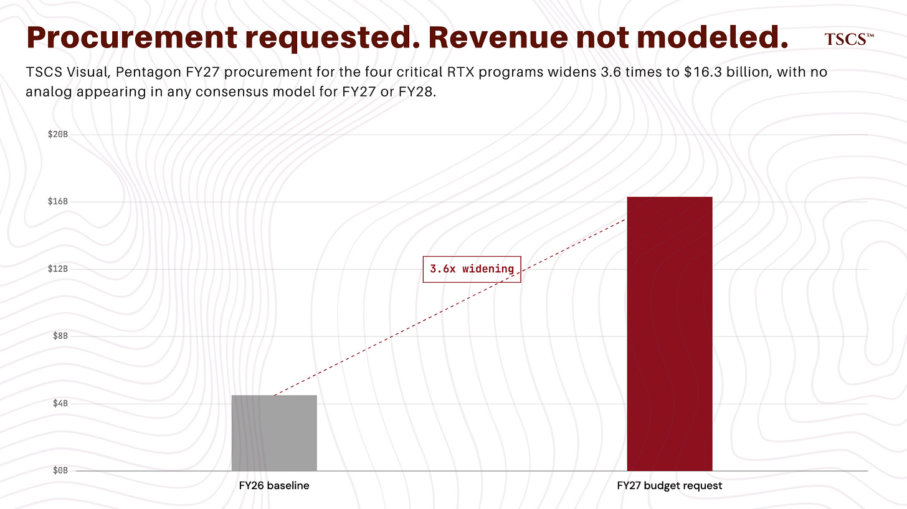](https://substackcdn.com/image/fetch/$s_!A4O4!,f_auto,q_auto:good,fl_progressive:steep/https%3A%2F%2Fsubstack-post-media.s3.amazonaws.com%2Fpublic%2Fimages%2Fef7a4585-b88d-4fcf-a246-8b77a2956ff1_1886x1058.png)

## **The dispersion picture**

Dispersion confirms the segment build. FY27 EPS consensus across 23 of 25 expected analyst estimates sits at $7.57 with a standard deviation of $0.178. The high estimate is $7.90, the low is $7.03. Tight clustering, no meaningful upside outlier. FY28 consensus across 19 of 21 expected estimates sits at $8.28 with a standard deviation of $0.37. The clustering is tight against a base business compounding path.

FY29 is the most informative pull. It’s where framework loading would first show in the mean if anyone had modelled it. The mean sits at $8.91 across 9 of 10 expected estimates with a standard deviation of $0.596. FY28 plus 7.6% growth. Not framework. Base business compounding into the year framework revenue should land.

[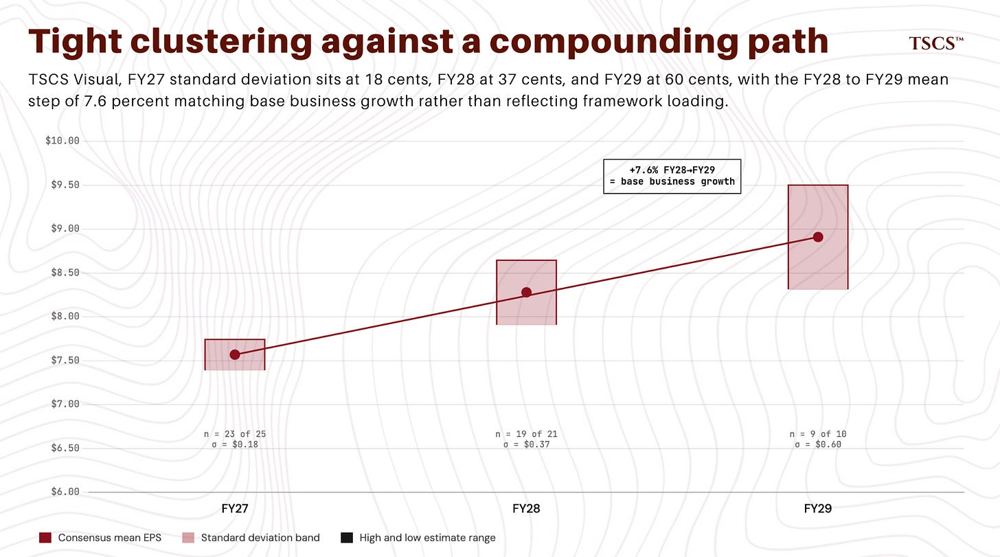](https://substackcdn.com/image/fetch/$s_!TvcQ!,f_auto,q_auto:good,fl_progressive:steep/https%3A%2F%2Fsubstack-post-media.s3.amazonaws.com%2Fpublic%2Fimages%2F98a8d3a3-9f59-430d-a553-aa4bee4fa2f2_1886x1050.png)

Here’s the counter to take seriously. Sell-side doesn’t extend full models three and four years out, as a process matter. FY29 estimates are thin (9 of 10) because the buy-side does not pay for FY29 modelling depth at this distance from print, and analysts respond to that demand structure. Read that way, the absence of framework loading isn’t an information asymmetry. It’s how the revision cycle works. Models extend forward when management guides them forward or when contemporaneous data forces the issue.

I think it’s right and it strengthens the trade. The thesis isn’t that consensus is wrong about framework economics. It’s that the revision cycle hasn’t engaged with framework revenue yet, because the conversion mechanics aren’t contemporaneous (UCA awards, definitization, percentage-of-completion recognition). When framework revenue physically prints in late 2028 in Raytheon segment reporting, consensus will revise. The trade is being positioned ahead of that mechanical revision, not ahead of an analytical disagreement. Structurally easier to defend. Doesn’t require analysts to be missing anything. Just requires the calendar to do what calendars do.

LMT PAC-3 backs this. Consensus FY26 and FY27 EPS revised up across the two quarters after framework conversion in early to mid-2026. Analysts weren’t wrong before the revision, they were waiting for the print. Same mechanism here. The asymmetry is timing, not insight.

Bloomberg doesn’t aggregate FY28 or FY29 segment-level revenue for RTX in FA Segments. The model doesn’t extend that far. That’s the finding. The conversion year isn’t modelled because the model doesn’t reach the year conversion lands.

Caveat. Dispersion tells me what the consensus aggregate is doing. It doesn’t tell me what individual broker models contain privately. Some sell-side desks may be carrying framework revenue in unpublished internal models without it showing in their consensus submissions. I do not think the dispersion supports that interpretation. If even two or three of nineteen FY28 contributors had loaded $1 to $2 billion of framework, std dev would widen past $0.37 and at least one outlier would appear above $8.80. Neither is there. But I cannot verify this absent access to individual broker models, so the claim is “consensus has not loaded framework” rather than “nobody anywhere has modeled it.”

The mechanics of consensus model extension are well-documented in defense. When LMT printed PAC-3 framework conversion ahead of consensus expectations in early to mid-2026, consensus FY26 and FY27 EPS revised meaningfully upward across the following two quarters. That is the directional pattern. The trade is the gap between when supplier capacity comes online, when consensus extends models forward to engage with it, and when the political calendar locks the production targets in.

[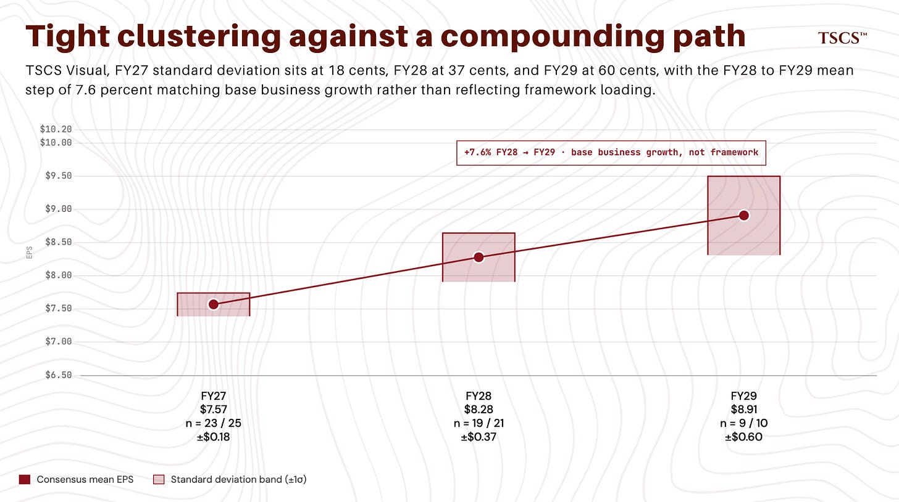](https://substackcdn.com/image/fetch/$s_!S-QV!,f_auto,q_auto:good,fl_progressive:steep/https%3A%2F%2Fsubstack-post-media.s3.amazonaws.com%2Fpublic%2Fimages%2F5ae6b79b-3d3d-4289-a7b0-7093d990cb3b_1884x1054.png)

The empirical picture is clean. Consensus is positioned as if framework doesn’t deliver in FY27, FY28, or FY29. Suppliers say it delivers in 2028 and ramps through 2029 to 2030. That last condition has a date.

## **The December 2026 reconciliation binary**

The framework targets are RTX press release figures from February 4, 2026. Tomahawk 1,000+ per year, AMRAAM 1,900+ per year, SM-6 500+ per year. Not contractually committed. Not in the $271 billion backlog. Not in any DoD primary document I can find. They depend on FY27 reconciliation to fund.

The FY27 budget request asks for 727 of 785 Tomahawks and 434 of 540 SM-6s through reconciliation. Those numbers are the framework production targets translated into FY27 procurement asks. The first reconciliation bill passed earlier this year. The second is pending. Speaker Johnson called the second reconciliation bill a “tough sell” in mid-April.

The conference report markup runs September through December 2026. Pass-fail on framework production lines is a specific test against the appropriations bill text. If the conference report includes 727 Tomahawks and 434 SM-6s in framework-funded form, the calendar locks and the 2028 print is mechanical. Definitization runs on the historical 9 to 18 month base rate. UCAs land Q1 2027 to Q2 2027, sequentially after the December 2026 reconciliation print clears. Definitization runs into Q1 to Q2 2028. Material revenue recognition under percentage-of-completion accounting begins two to three quarters after definitization, into late 2028 or early 2029. The trade architecture below is sized for that path.

[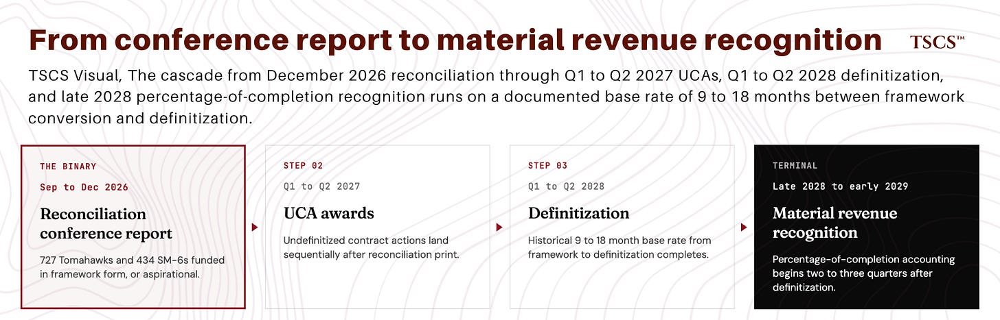](https://substackcdn.com/image/fetch/$s_!UePj!,f_auto,q_auto:good,fl_progressive:steep/https%3A%2F%2Fsubstack-post-media.s3.amazonaws.com%2Fpublic%2Fimages%2F2ebbc99a-d5dc-44dc-8ef2-87cb2432a2d8_1884x604.png)

If the conference report scales the production lines down materially, the targets become aspirational. RTX retains the existing program book (Tomahawk Block V most recently definitized in January 2026 on a 13-month framework-to-definitization timeline, SM-3 IB at $1.366 billion for 78 rounds, AMRAAM Lots 39-40 still working through definitization), which is a real business at a real margin. The upside surprise that makes the multiple work disappears. RTX trades back to peer multiples of 17 to 21x on a consensus path with no framework. Asymmetry gone.

This is where the genuine information asymmetry lives. Defense appropriations watchers (DefenseScoop, Breaking Defense, BGOV) cover markup at granularity institutional investors don’t read. Committee assignments matter. HASC and SASC rosters have shifted. Senator Wicker as SASC chair has been explicit on munitions stockpile rebuild as a priority. The Speaker’s whip count on the second reconciliation matters more than any sell-side note. The previous markup on PAC-3 came through largely intact with marginal trims. Useful base rate, not dispositive for a different program in a different fiscal cycle.

Pre-committed read: if the conference report preserves more than 80% of the framework production asks (more than 580 Tomahawks, more than 350 SM-6s), the trade is on. If between 50% and 80%, the trade is alive but compressed and position size cuts to half. If below 50%, the trade is off and the position closes against the print.

That binary lands in about seven months.

[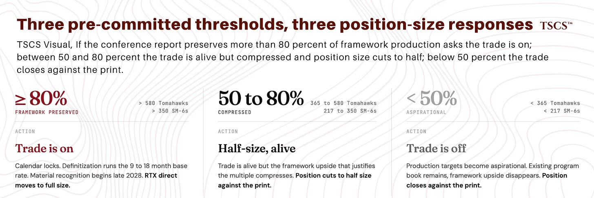](https://substackcdn.com/image/fetch/$s_!jpE3!,f_auto,q_auto:good,fl_progressive:steep/https%3A%2F%2Fsubstack-post-media.s3.amazonaws.com%2Fpublic%2Fimages%2Ffd11b943-4007-48b2-a9fa-0a96a4afde9c_1886x628.png)

## **The chokepoint timeline**

Five programs. Framework-implied volumes. The supplier constraint that gates each. Earliest physical delivery year. Capacity is real, publicly funded, under construction. Revenue isn’t modelled.

### **Tomahawk: 1,000+ per year, gated by Williams International**

Framework target more than 1,000 per year. Current baseline approximately 169 deliveries in CY25 against an FY25 maximum facilitization of 530. The 1,000+ target is an 11x step from the FY25 minimum sustaining rate, a 6x step from current deliveries, and a 2x step from documented maximum capacity.

[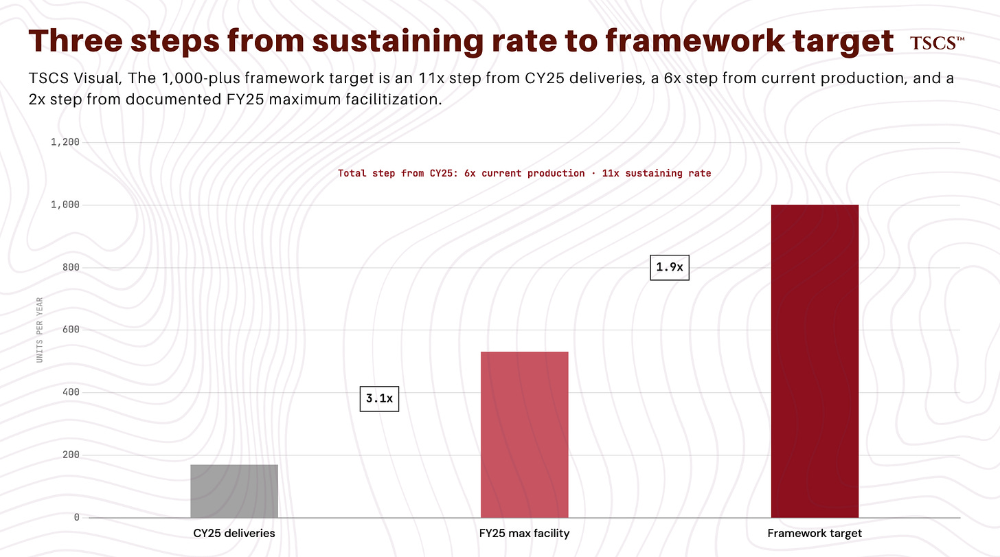](https://substackcdn.com/image/fetch/$s_!TmGf!,f_auto,q_auto:good,fl_progressive:steep/https%3A%2F%2Fsubstack-post-media.s3.amazonaws.com%2Fpublic%2Fimages%2F37d16837-e8f2-404d-9205-cfe06ace318d_1884x1050.png)

The binding constraint is Williams International, the private Michigan company that sole-sources the F107 turbojet. The expansion is funded and underway. December 2024 Defense Production Act award of $253.7 million for F107-WR-105 capacity. May 2025 announcement of a $1 billion investment in a new one-million-square-foot manufacturing complex at Shoal River Industrial Park in Okaloosa County, Florida. Groundbreaking on the 250,000-square-foot Phase 1 (Module 8) in November 2025, completion targeted late 2026. Phase 2 begins 2028. Final 500,000 square feet planned for 2035 to 2036. Combined investment exceeds $1.25 billion.

[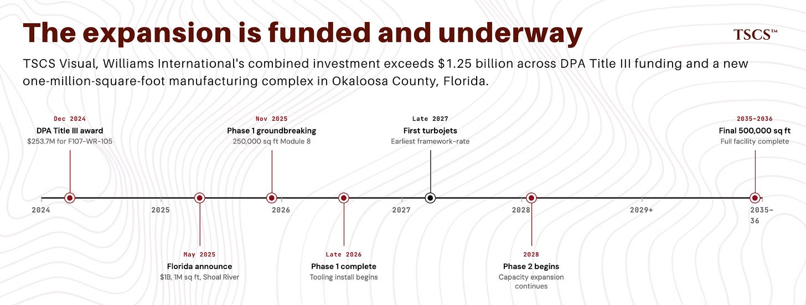](https://substackcdn.com/image/fetch/$s_!-sP1!,f_auto,q_auto:good,fl_progressive:steep/https%3A%2F%2Fsubstack-post-media.s3.amazonaws.com%2Fpublic%2Fimages%2F70a4dda7-4bef-4f6b-a912-4518a635fb31_1884x716.png)

The targets are physically planned for. Williams doesn’t commit $1 billion to a new facility without demand visibility. The timeline is what constrains the ramp. Phase 1 delivers turbojets in late 2027 at earliest, factoring tooling installation and qualification after construction completes. The 1,000+ Tomahawk per year target depends on Phase 1 plus the existing Walled Lake campus. Earliest physical delivery year for framework-rate Tomahawk volumes: 2028.

The diligence gap is real. Bloomberg’s entity database, SPLC, and financial data functions return zero results for Williams International. A company committing $1.25 billion to the largest private defense expansion in the US has no terminal footprint. Public records that would tighten this timeline meaningfully (Okaloosa County permits, USA Spending obligations, DPA Title III congressional reporting) are available but not pulled at time of writing.

The warhead chain is equally concentrated. Tomahawk warhead fill is RDX/HMX from the Holston Army Ammunition Plant in Kingsport, Tennessee, government-owned and operated by BAE Systems Ordnance Systems on a contract through 2033. Holston is mid-build on a multi-year nitration and melt-cast capacity expansion, timeline 2027 to 2028.

AMPAC in Cedar City, Utah is the sole North American producer of rocket-grade ammonium perchlorate, the oxidizer in every solid propellant in the US defense inventory. Acquired by NewMarket Corporation (NYSE: NEU) in January 2024 for approximately $700 million. NEU announced a $100 million capacity expansion in April 2025 targeting a 50%+ AP capacity increase scheduled for completion during 2026. NEU is treated separately in a follow-on piece on the supplier-side trade architecture.

### **AMRAAM: 1,900+ per year, the most defensible ramp**

Framework target at least 1,900 per year. Current production approximately 1,200 globally per Raytheon CEO Phil Jasper at FEINDEF in April 2025, who said Raytheon doubled AMRAAM production in 2024 to 1,200 and was doubling again in 2025. The Tucson plant has headroom to 2,400. The framework target sits inside the band Jasper defined publicly. This is a 1.6x current-production step, the smallest multiplier in the framework.

Supplier landscape is the cleanest. Nammo Perry, Florida facility for AMRAAM solid rocket motors targets 2027 operational date. Northrop Grumman has invested over $1 billion in SRM capacity since 2018 and is doubling tactical SRM capacity by 2027. The gating risk is Nammo’s 2027 timeline slipping, which compresses the ramp by 6 to 12 months but does not break it. Earliest physical delivery year for framework-rate AMRAAM volumes: 2027 at the soonest, 2028 base case.

AMRAAM is the program where FY27-FY28 consensus could plausibly carry framework revenue without breaking the math. If consensus were loading framework anywhere first, it would be here. It hasn’t.

[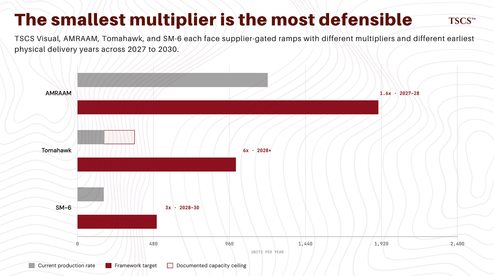](https://substackcdn.com/image/fetch/$s_!UBWJ!,f_auto,q_auto:good,fl_progressive:steep/https%3A%2F%2Fsubstack-post-media.s3.amazonaws.com%2Fpublic%2Fimages%2F9fe1b592-ff3a-406e-805f-c6f774453d82_1890x1056.png)

### **SM-6: 500+ per year, gated by the Mk 72 transition**

Framework target more than 500 per year. Current capacity approximately 165 per year on one shift, 200 per year fully funded for FY26. SM-6 Selected Acquisition Report (December 2023) shows ramp to 200 by FY26 and 300 by FY28. Framework target is 1.7x the FY28 plan-of-record and 2.5x the funded FY26 rate.

The binding constraint is the Mk 72 first-stage booster, sole-sourced to L3Harris (legacy Aerojet Rocketdyne, now L3Harris Propulsion). Aerojet president Ross Niebergall acknowledged in late 2024 that the company was thousands of motors behind contract across 15 to 20 programs. RTX management described Aerojet output as a “mixed bag” in July 2024. Calio Q1 2026: “Rocket motors, given the concentrated supply base, it’s going to require a step change in the supply chain.”

The framework volume implies roughly 2 to 3x what L3Harris is currently shipping. RTX awarded second-source Mk 72 development contracts to Northrop and Nammo in April 2025. Northrop static-fired its prototype Mk 72 in December 2025. That is a development milestone. Production qualification is on a 24 to 30 month timeline at minimum. Production-rate second-source Mk 72 supply is a 2028 event in best case, 2029 to 2030 base case.

L3Harris has responded with the largest non-Pentagon defense industrial capital program in the United States. Camden, Arkansas: more than $400 million committed, six-fold large-SRM capacity increase, broke ground November 2025. Orange County, Virginia: $1.27 billion committed, announced April 15, 2026. Huntsville AMF-South: 379,000 sq ft, opened August 2025. Pentagon committed $1 billion as a convertible-preferred anchor investor in the L3Harris Missile Solutions IPO planned for 2H 2026. Earliest physical delivery year for framework-rate SM-6 volumes: late 2028, with full ramp 2029 to 2030.

This is where the gap between supplier capacity and consensus is widest. SM-6 can’t ramp to 500 per year without second-source Mk 72 capacity, which doesn’t exist. Consensus hasn’t engaged with that.

The Mk 72 bottleneck generates one of the watches this piece builds: the L3Harris Missile Solutions IPO.

### **SM-3: $400 million to $1.2 billion run-rate plus the sustainment lift**

RTX did not numerically disclose framework production targets for SM-3 Block IIA or Block IB. Defense Archives puts SM-3 IIA current production at 24 per year ramping toward 36, and SM-3 IB at 3 to 4 per month with maximum facilitization of 5 per month. Block IIA is gated by Mitsubishi Heavy Industries supplying the third-stage rocket motor and nose cone under the US-Japan workshare. Block IB was definitized in March 2026 at $1.366 billion for 78 rounds.

The Missile Defense Agency awarded an $8.41 billion contract modification on March 18, 2026 (HQ0851-21-D-0001) lifting the SM-3 sustainment IDIQ ceiling from $3.33 billion to $11.74 billion through October 29, 2029. That is the near-term print trade and it deserves its own section below.

### **Definitization base rates**

Historical base rate for framework authorization to definitized production contract is 9 to 18 months for missile programs. Lockheed PAC-3 MSE framework signed January 6, 2026 converted to a $4.7 billion undefinitized contract action on April 10 (94 days framework to UCA). RTX’s own patterns show 13 months on December 2024 Tomahawk Block V (definitized January 2026), approximately 10 months on May 2025 SM-3 Block IB UCA (definitized March 2026), and a $3.5 billion AMRAAM Lots 39-40 UCA from July 2025 still open at 9 months.

[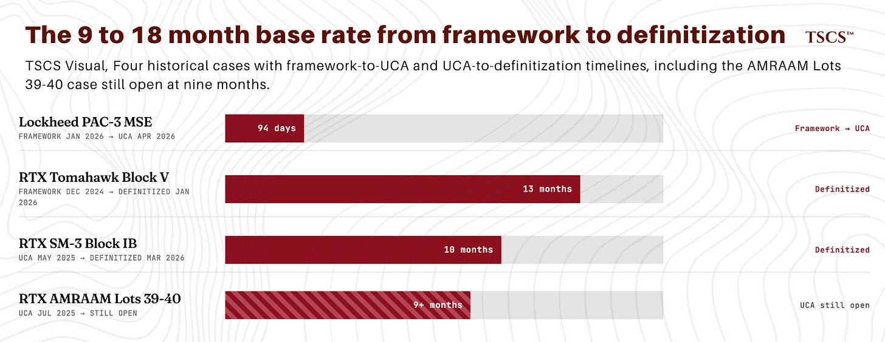](https://substackcdn.com/image/fetch/$s_!N2iI!,f_auto,q_auto:good,fl_progressive:steep/https%3A%2F%2Fsubstack-post-media.s3.amazonaws.com%2Fpublic%2Fimages%2Fa1802aea-10a1-44c9-831d-b7adb6f1dcc2_1884x730.png)

Apply that base rate to the February 2026 frameworks. First UCA award between Q1 2027 and Q2 2027, sequentially after the December 2026 reconciliation print clears. First definitization 12 to 15 months after that, into Q1 to Q2 2028. Material revenue recognition under percentage-of-completion accounting begins two to three quarters after definitization, into late 2028 or early 2029. That is the supplier-deliverable timeline against a consensus model that does not extend that far.

### **The aggregate**

Full-ramp incremental Raytheon segment revenue brackets $5.0 to $7.0 billion annually on my build. Seven-year cumulative ramp-weighted contribution is approximately $38 to $52 billion.

The capacity investment is sized for those numbers. Williams’s $1.25 billion. L3Harris’s $2.3 billion across Camden and Orange County. Northrop’s $1 billion of cumulative SRM investment since 2018. NEU’s $100 million AP expansion. Holston’s multi-year nitration and melt-cast modernization. Combined private and government industrial capital deployed across the framework supply chain exceeds $5 billion. That is a real industrial mobilization.

[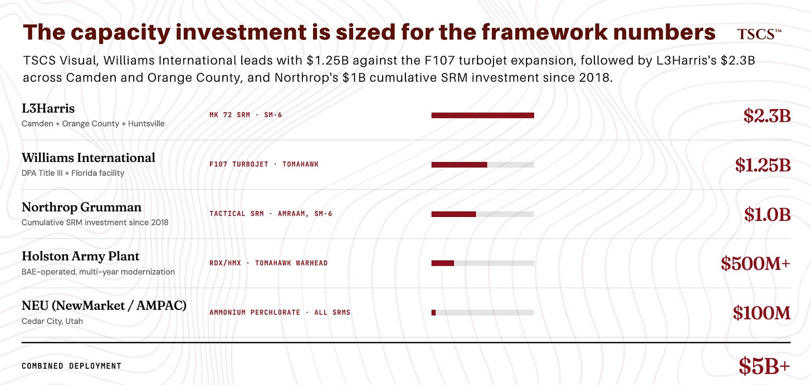](https://substackcdn.com/image/fetch/$s_!0CIV!,f_auto,q_auto:good,fl_progressive:steep/https%3A%2F%2Fsubstack-post-media.s3.amazonaws.com%2Fpublic%2Fimages%2Fb47aa171-c96a-4761-8c87-c1849fb8b4f1_1886x896.png)

It does not show up in consensus revenue models for FY27, FY28, or FY29.

## **The SM-3 sustainment trade**

The MDA contract modification on March 18, 2026 lifts the SM-3 sustainment IDIQ ceiling from $3.33 billion to $11.74 billion through October 29, 2029. The ceiling went from $722 million in 2020 to $11.74 billion now, a sixteen-fold expansion in five years on a single IDIQ.

[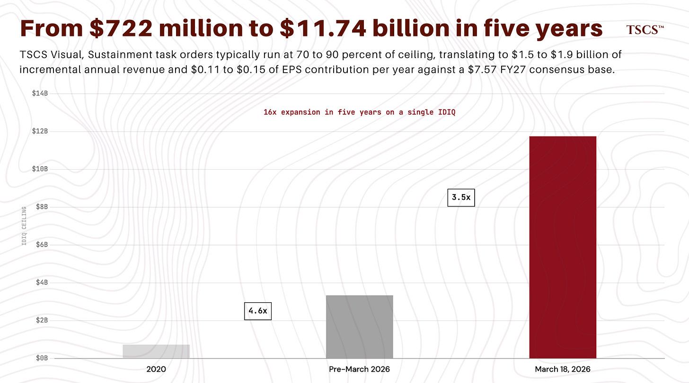](https://substackcdn.com/image/fetch/$s_!0piJ!,f_auto,q_auto:good,fl_progressive:steep/https%3A%2F%2Fsubstack-post-media.s3.amazonaws.com%2Fpublic%2Fimages%2F070e8f1e-8391-4713-943b-d325f6fcbe63_1886x1050.png)

Structurally different from framework production. The work runs against the existing program of record, not new capacity. No Williams International, no Mk 72, no second-source qualification gating recognition. Sustainment task orders definitize on 60 to 180 day timelines versus the 9 to 18 month base rate for new production UCAs. Sustainment runs higher-margin than new-build. Recurring engineering, software updates, kit upgrades, and field service run 200 to 400 bps above new-build margin, per comparable LMT and NOC structures.

The math on EPS contribution. Sustainment IDIQs typically run at 70 to 90% of ceiling over their performance period, so the $8.41 billion lift translates to roughly $5.9 to $7.6 billion of incremental sustainment revenue across the four-year window, or $1.5 to $1.9 billion per year. Apply Raytheon segment operating margin in the 12 to 13% range for sustainment-weighted work, RTX’s effective tax rate of approximately 18%, and a share count of roughly 1.33 billion. Annualised SM-3 sustainment: $0.11 to $0.15 of EPS per year. Cumulative FY26 to FY29: $0.45 to $0.60 of EPS not visible as a discrete line in consensus.

Directional, not precise. But $0.11 to $0.15 against a $7.57 FY27 consensus base is large enough to matter. Task orders against the lifted ceiling will show in 10-Q backlog disclosures within two quarters of March 18, so the Q3 2026 print in October. The first quarter where SM-3 sustainment is visible above noise is Q1 or Q2 2027 reporting. That is the near-term print catalyst, well ahead of the 2028 framework recognition, and it tightens the floor on the dead-money case.

## **What the multiple is paying for**

RTX trades at 25.13x forward earnings on the May 1 close, against $6.91 FY26 consensus EPS at $173.67. Lockheed at 17.3x forward, Northrop at 20.5x, General Dynamics at 20.9x. The premium to the defense peer set is structural and persistent. Opened in October 2023, held through 18 plus months and multiple guide revisions.

[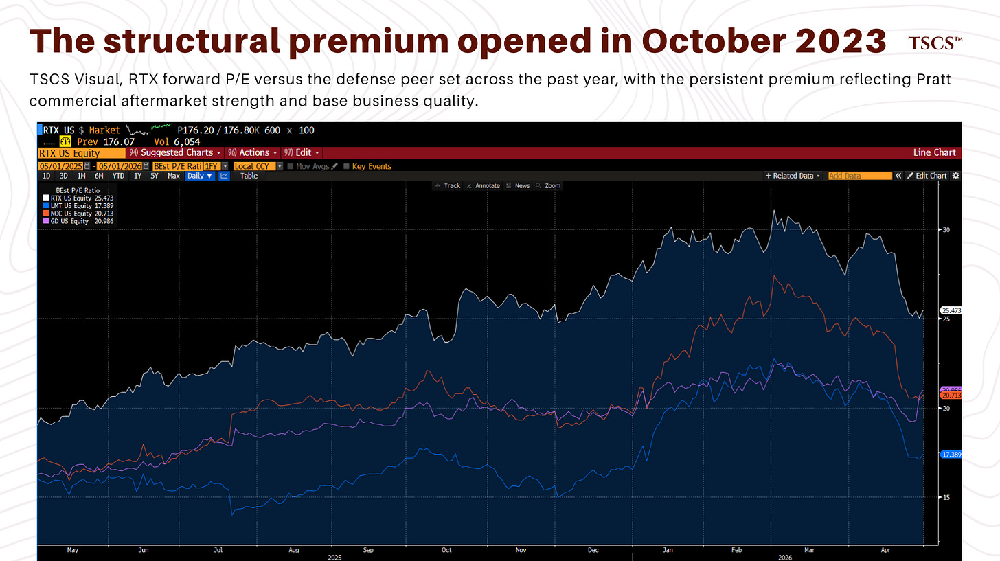](https://substackcdn.com/image/fetch/$s_!x2hh!,f_auto,q_auto:good,fl_progressive:steep/https%3A%2F%2Fsubstack-post-media.s3.amazonaws.com%2Fpublic%2Fimages%2F6bb5ed60-0b48-4e87-8f2f-16fd66c634fe_1890x1060.png)

The implied long-term EPS growth rate from Bloomberg EE is 10.12%, which sits on a base business path: Pratt commercial aftermarket growing 19% in Q1 with MRO output up 23%, Collins growing low-single-digits on rising Boeing and Airbus build rates, Raytheon growing 7 to 9% organically on strong global defense demand. That is the model the multiple is paying for. It does not require framework revenue to be embedded in any line item.

The previous version of this piece said 2 to 3 turns of multiple were paying for framework optionality. That would have set up multiple compression hitting before framework revenue. The data doesn’t support that read. The premium versus peers is paying for Pratt aftermarket quality, which is real and is in the numbers, plus a generic defense premium, which the entire sector has earned through 2024 to 2026.

Cuts both ways. If framework isn’t in the multiple and isn’t in the EPS, framework optionality is unpriced. That’s the opportunity. It also means there’s no multiple expansion catalyst on entry. Upside comes from EPS revisions when framework revenue prints, not from a re-rating. This is a compounding position with embedded optionality, not a coiled spring. The analytical work in this piece is proportioned to the size of the information asymmetry, not to the velocity of the payoff.

The defense sector is down 8% since mid-April. Lockheed’s structural problems ($4B+ classified program losses, heroic 2H ramp required) and Northrop’s $157 million B-21 EAC charge. RTX has neither. Short interest 13.3 million shares (0.99% of float), declining, days to cover 3.78. Nobody’s betting against RTX.

[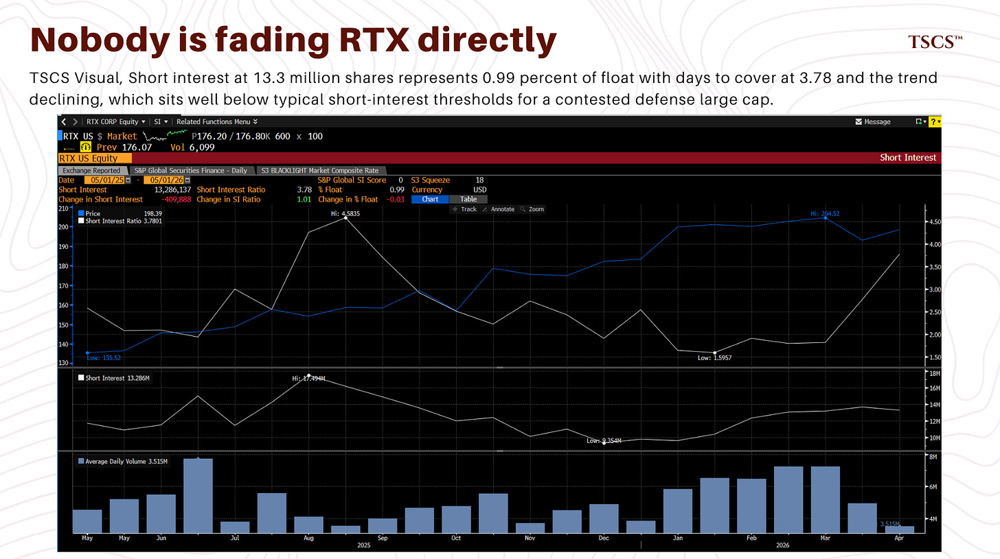](https://substackcdn.com/image/fetch/$s_!eW4Y!,f_auto,q_auto:good,fl_progressive:steep/https%3A%2F%2Fsubstack-post-media.s3.amazonaws.com%2Fpublic%2Fimages%2Faf14de54-f283-4c26-9085-039938f2f1cb_1890x1058.png)

One popular retail argument is that buying Wolfspeed (NYSE: WOLF) or Qorvo (NASDAQ: QRVO) plays the framework upside through GaN substrate exposure. It is factually wrong. RTX manufactures military-grade GaN MMICs in-house at its Andover compound semiconductor foundry at Manufacturing Readiness Level 9, with throughput sufficient for AMRAAM AESA seekers, LTAMDS T/R modules, Patriot upgrades, and SPY-6. Wolfspeed filed Chapter 11 on June 30, 2025; its RF GaN business had already been acquired by MACOM (NASDAQ: MTSI) in late 2023, well before the bankruptcy. The retail market bought the wrong supplier derivatives.

## **The trade architecture**

One position sized today, two binary watches.

### **Trade 1: RTX direct, gated on the December 2026 reconciliation print**

RTX at $173.67. Half size at entry. Add to full size on confirmation that the FY27 reconciliation conference report preserves the framework production lines.

The structure recognises that the framework thesis depends on reconciliation clearing. Half size today buys SM-3 sustainment recognition and the dividend, with optionality on reconciliation converting it to a full framework trade. Full size on confirmation, ahead of supplier capacity coming online.

Base case walks like this. RTX prints FY26 in line with the $6.91 guide. The Q3 2026 print in October shows SM-3 sustainment task orders building backlog, which provides the first visible evidence above consensus. The reconciliation conference report in December 2026 preserves the framework production lines at 80%+ of request. Consensus FY27 grinds higher through 2027 on Pratt aftermarket strength, Raytheon base programs, and SM-3 sustainment recognition. Ends $7.65 to $7.80 versus current $7.57. First framework revenue shows in Raytheon segment reporting in late 2028 at a $200 to $400 million quarterly run-rate, AMRAAM and Tomahawk components ramping first. Consensus FY29 EPS revises up from current $8.91 to $9.40 to $9.80 over the following two quarters as analysts extend models forward and load framework. The stock trades at 22 to 24 times the revised forward number, which puts it in the $210 to $235 range by mid-2029. Total return through 2029: 25 to 35% on entry, plus dividends.

Bull case: framework revenue starts earlier (Q3 2028 or Q2 2028 if definitization runs faster than base rate) and FY29 EPS revision running closer to $10. At 24x, $240. Total return 40%+ plus dividends.

Dead-money case: framework revenue delayed to 2029 by supplier slippage or definitization friction. RTX prints in line through 2027 and 2028, framework doesn’t appear until Q2 2029. Stock drifts $170 to $190 for two years. Annualised return 6 to 8% with dividend. Thesis isn’t broken, asymmetry compressed.

[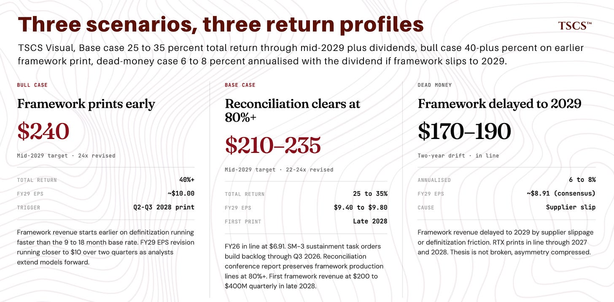](https://substackcdn.com/image/fetch/$s_!HRMI!,f_auto,q_auto:good,fl_progressive:steep/https%3A%2F%2Fsubstack-post-media.s3.amazonaws.com%2Fpublic%2Fimages%2Fdd7c0388-3dcf-4466-baf0-4448123ea7f4_1888x930.png)

The position is sized for entry around $170 to $175 with an add window into weakness toward $160. Weakness toward $160 represents either a sector rotation accelerating (which is the current pressure from LMT and NOC issues) or a Q2 or Q3 2026 print that disappoints on Pratt durability or Collins build rates. Neither of those is the framework thesis. Neither breaks the trade.

[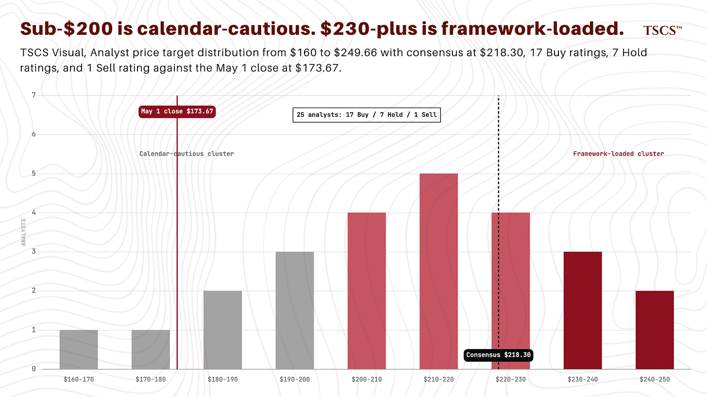](https://substackcdn.com/image/fetch/$s_!iwO1!,f_auto,q_auto:good,fl_progressive:steep/https%3A%2F%2Fsubstack-post-media.s3.amazonaws.com%2Fpublic%2Fimages%2Fc455a207-987f-47ad-a5e6-4ca86dbfccc4_1884x1060.png)

The kill switch on RTX direct isn’t framework arriving late. It’s framework not arriving at all. That requires the December 2026 reconciliation conference report to scale framework production lines below 50% of request, which is the falsifiable trigger detailed below, or the supplier capacity expansion to fail (Williams Module 8 not completing, Mk 72 second-source not qualifying, Holston not completing nitration expansion).

### **Watch 1: L3Harris Missile Solutions IPO (2H 2026)**

Most actionable binary on the framework supply chain. Only watch in this piece with a compressed timeline. L3Harris has disclosed Missile Solutions generates approximately $4 billion of revenue at roughly $620 million EBITDA, with the Pentagon committed as a $1 billion convertible-preferred anchor investor. Reuters reported on April 30, 2026 that L3Harris had confidentially submitted a draft registration statement for the Missile Solutions IPO, which is the procedural precursor to the public S-1 filing. Zero publicly-traded SRM pure-plays. The IPO creates one, into a market where every defense prime and framework depends on SRM supply that’s structurally constrained.

This is not actionable today. It becomes actionable on public S-1 filing.

What the S-1 must confirm: revenue $3.5 billion or above (materially below $4 billion suggests segment cherry-picking), EBITDA margin 14%+ ($620 million implies 15.5%, which would be the highest-margin SRM business in public markets), backlog 3x+ revenue, Pentagon $1 billion convertible-preferred preserved.

Walk away on: revenue below $3 billion, EBITDA margin below 12%, backlog concentrated in a small number of programs with near-term completion risk, Pentagon anchor restructured, reduced, or conditioned on milestones not yet met.

[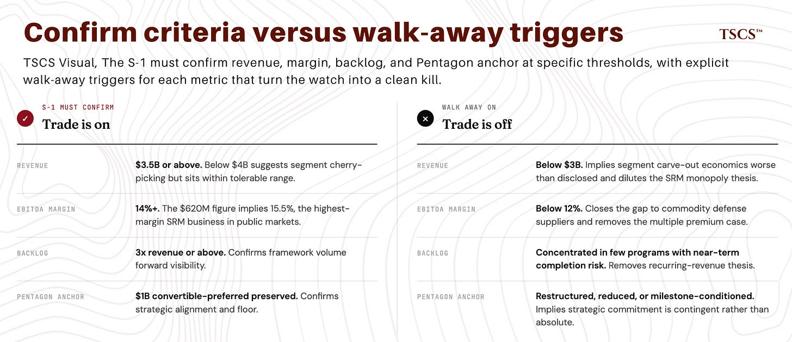](https://substackcdn.com/image/fetch/$s_!cWQc!,f_auto,q_auto:good,fl_progressive:steep/https%3A%2F%2Fsubstack-post-media.s3.amazonaws.com%2Fpublic%2Fimages%2F5bb660f9-0e9f-4dc3-88cf-a1ad06b5d217_1890x816.png)

Comp set is essentially empty for SRM pure-plays. Closest analogues: Mercury Systems (MRCY) at 14 to 18x EV/EBITDA (turnaround floor), Curtiss-Wright (CW) at 16 to 20x (defense-industrial mid), HEICO (HEI) at 25.3x current with a 5-year average 24.6x (aerospace parts ceiling). L3Harris Missile Solutions is structurally closer to Curtiss-Wright than HEICO: a sole-source defense supplier with pricing power and concentrated customer exposure, not an aerospace aftermarket monopolist with hundreds of SKUs.

At $620 million EBITDA: 14x implies $8.7 billion enterprise value (Curtiss-Wright floor pricing). 16x implies $9.9 billion (mid-range, sole-source position with discount for IPO illiquidity and customer concentration). 18x implies $11.2 billion (full Curtiss-Wright pricing, justified if the S-1 confirms the Pentagon anchor and 15%+ EBITDA margin). 22x implies $13.6 billion (HEICO-adjacent, only achievable if the market prices SRM monopoly and framework optionality together).

Pre-S-1 range 14 to 17x, $8.7 to $10.5 billion EV. Below 14x on the IPO is a gift. Above 20x on day one means the market’s already priced scarcity, and the trade moves from “buy the IPO” to “wait for the first miss and buy the dip.”

[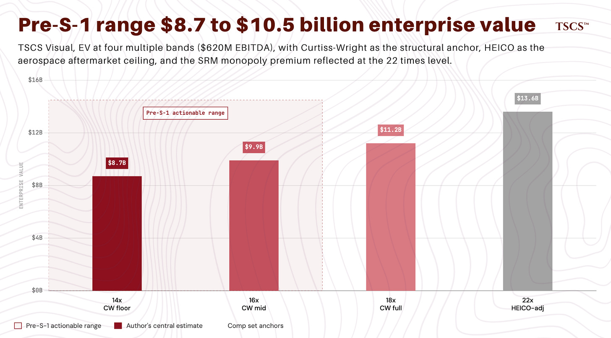](https://substackcdn.com/image/fetch/$s_!lXR-!,f_auto,q_auto:good,fl_progressive:steep/https%3A%2F%2Fsubstack-post-media.s3.amazonaws.com%2Fpublic%2Fimages%2F0db51826-e266-4d90-8765-ed90c3ee8c77_1888x1046.png)

Size: starter on IPO allocation, add to full size on first earnings print that confirms S-1 numbers. High-conviction trade gated by one binary (S-1 filing and pricing). Risk: IPO pulled or delayed, Mk 72 monopoly locked inside L3Harris at a conglomerate discount.

L3Harris is a watch, not a trade, because entry is gated on a document that hasn’t publicly filed. Calling it a trade today is the loose framing this piece avoids. The public S-1 turns it into a trade. Until then it’s a binary worth tracking.

### **Watch 2: NewMarket Corporation (NEU)**

NewMarket Corporation (NYSE: NEU) is the publicly-traded wrapper around AMPAC, the sole North American producer of rocket-grade ammonium perchlorate. The capital allocation signal is real. Specialty Materials capex from $4.1 million in FY24 to $50.7 million in FY25, 12x year-over-year, against a segment generating 6.7% of revenue. The mispricing isn’t a valuation disagreement, it’s an absence of sell-side coverage on a $6.2 billion market cap company that sole-sources oxidiser for the entire US solid propellant base.

I am not building the NEU trade in this piece because the structure depends on options market verification I have not completed. The OMON pull on NEU LEAPS, the implied volatility check at 18 to 24 month expiries, and the open interest assessment at relevant strikes are prerequisites for sizing this position as anything more than half-size in common stock with 5.6% probability-weighted upside, which is below the equity risk premium. NEU is a follow-on piece when that work is done.

## **Pre-committed thresholds**

The kill switch architecture states the trade in falsifiable form. Each line has a value, a date, and a position adjustment. If the trigger fires, the action is the action, not a re-evaluation.

[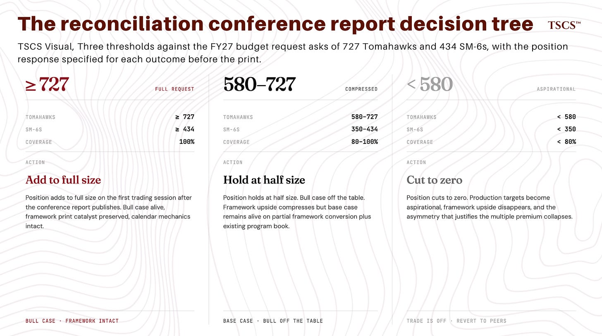](https://substackcdn.com/image/fetch/$s_!4o7N!,f_auto,q_auto:good,fl_progressive:steep/https%3A%2F%2Fsubstack-post-media.s3.amazonaws.com%2Fpublic%2Fimages%2F12d4930b-41fa-4eb6-8184-5804dde72c3a_1886x1056.png)

The reconciliation binary. If the FY27 reconciliation conference report does not include at least 580 Tomahawks and 350 SM-6s in framework-funded form by December 20, 2026, RTX position cuts to zero. If between 580 and 727 Tomahawks (or 350 to 434 SM-6s) clear, the position holds at half size and the bull case is off the table. If at least 727 Tomahawks and 434 SM-6s clear at full request, the position adds to full size on the first trading session after the conference report publishes.

The consensus revision check. If Bloomberg EEB FY28 mean reaches $8.65 by November 30, 2026 absent a Q3 2026 EPS beat above $1.85, the consensus gap has closed prematurely and the RTX direct position cuts to quarter size. If the FY28 mean reaches $8.85 absent any earnings catalyst, the position closes against the print.

The supplier execution check. If RTX Q3 2026 (October) Raytheon segment organic prints below 6.0% with no SM-3 sustainment commentary and no framework definitization update, the capacity ramp is running into demand problems consensus is correctly modelling. Thesis weakens. Position cuts to quarter size pending Q4 2026.

The SM-3 sustainment check. If the 10-Q for Q3 2026 (October 2026) does not show meaningful SM-3 sustainment task order backlog accumulation against the $8.41 billion ceiling lift, the IDIQ is being filled slower than the contract structure implies and the near-term print catalyst is delayed. The RTX direct base case timeline extends by approximately 6 months, but no position adjustment is required.

The Williams Module 8 check. If Williams International Phase 1 (Module 8) does not announce or confirm completion by Q2 2027, the Tomahawk framework ramp slips by 6 to 12 months. No position adjustment on RTX direct (the framework print catalyst extends but the trade is preserved).

The L3Harris IPO check. Reuters reported on April 30, 2026 that L3Harris had confidentially submitted a draft registration statement. The actionable trigger remains the public S-1 filing. If the public S-1 has not filed by January 31, 2027, the IPO is pulled or delayed materially and the Watch 1 position closes. If the public S-1 reveals revenue below $3 billion or EBITDA margin below 12%, do not participate. If the public S-1 reveals Pentagon convertible-preferred restructured or withdrawn, do not participate.

These are the triggers. They are dated. They have specific values.

[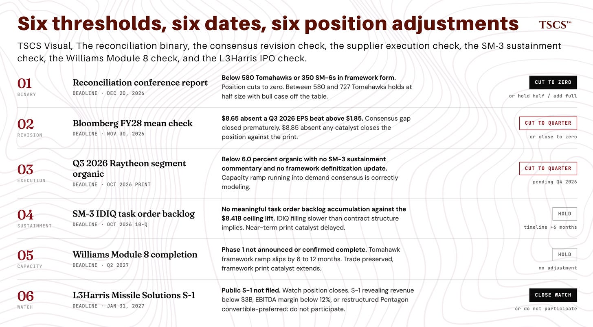](https://substackcdn.com/image/fetch/$s_!m0vH!,f_auto,q_auto:good,fl_progressive:steep/https%3A%2F%2Fsubstack-post-media.s3.amazonaws.com%2Fpublic%2Fimages%2Fed60ac17-bbb1-4d53-ae89-1750508c70e8_1888x1044.png)

## **Kill switches at the framework level**

Framework-level kill switches ordered by assessed likelihood.

Framework definitization slips materially or scales down. Highest-likelihood negative outcome, and the binary detailed in the thresholds above. The December 2026 reconciliation conference report is the trigger. Speaker Johnson has called the second reconciliation bill a “tough sell.” Monitor: Pentagon contract announcements for multi-year awards at framework-implied scale, FY27 appropriations markup September to December 2026, RTX Q2 earnings July 22 definitization commentary, Lockheed PAC-3 framework follow-through.

The industrial base hits a hard ceiling. Williams International, Holston AAP, and Mk 72 risk. Any one of the four major supplier expansions (Williams F107 Module 8, Holston RDX/HMX modernization, AMPAC 50% AP expansion, Mk 72 second-source qualification) slipping by a year compresses the framework ramp to 60 to 70% of stated targets, moving full-ramp incremental revenue from $5.0 to 7.0 billion to $3.5 to 4.5 billion. The thesis still works at those numbers. Monitor: L3Harris Propulsion earnings for on-time delivery, Northrop tactical SRM capacity announcements, GAO SRM industrial base updates, Williams International Module 8 construction progress.

Consensus loads framework before capacity comes online. If sell-side analysts revise FY28 EPS estimates above the pre-committed thresholds before framework revenue physically prints in 2H 2028, the upside surprise narrows or disappears. Monitor: Bloomberg EE FY28 mean and dispersion trajectory through 2026 and 2027.

FMS political risk. Japan (400 Tomahawks), Australia (200), Netherlands (175) face domestic friction. Slippage compresses the international component, doesn’t break the thesis.

Tariff escalation. RTX has $850 million gross tariff exposure for 2026. Net P&L after mitigations is a $75 million tailwind YoY. Trade survives unless tariffs go up an order of magnitude.

Capital allocation during build-out. RTX’s $3.1 billion 2026 capex is up nearly 20% from 2025. If frameworks finalize faster than expected and trigger additional capacity investment, FCF could disappoint relative to the $8.25 to 8.75 billion guide even as the underlying business strengthens. Raytheon margin compression below 11% would signal the build-out is harder than communicated.

Geopolitical resolution softens demand. Low likelihood. Operation Epic Fury reportedly expended approximately 850 Tomahawks in February to April 2026 (per CSIS), which alone exceeds twelve years of FY26-rate procurement.

[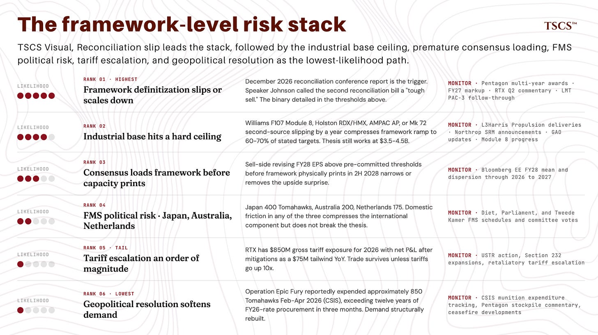](https://substackcdn.com/image/fetch/$s_!nw0E!,f_auto,q_auto:good,fl_progressive:steep/https%3A%2F%2Fsubstack-post-media.s3.amazonaws.com%2Fpublic%2Fimages%2F5d34faa8-5adb-4e5a-be0c-58df6989c6a4_1886x1058.png)

## **What I’m watching**

Reconciliation calendar is the sequence.

July 22, 2026 (expected): RTX Q2 print. Watch for follow-on order commentary on SM-3 IB beyond the March 2026 definitization, AMRAAM Lots 39-40 progress, and any framework-related management language. Raytheon segment organic margin above 12% confirms base business strength.

September to October 2026: HASC and SASC markup of FY27 NDAA. Watch the Tomahawk and SM-6 line items in subcommittee bills. Reconciliation language on framework production funding starts here.

October 2026 (expected): RTX Q3 print. The first quarter where SM-3 sustainment task order backlog should be visible against the $8.41B IDIQ ceiling lift. Watch 10-Q backlog disclosures.

November to December 2026: Conference report on the second reconciliation bill. The framework binary lands here. The pre-committed thresholds above govern position adjustment.

January 2027 (expected): RTX Q4 print and FY27 guide. Watch for any explicit framework revenue commentary or Raytheon segment FY27 organic guide above 8%.

2H 2026: L3Harris Missile Solutions IPO S-1 filing.

Through 2026 to 2027: Bloomberg EE FY28 EPS dispersion trajectory. Bloomberg FA Segments extension to FY28 estimates (when consensus first publishes FY28 segment-level revenue, the framework conversion year becomes visible in the model).

[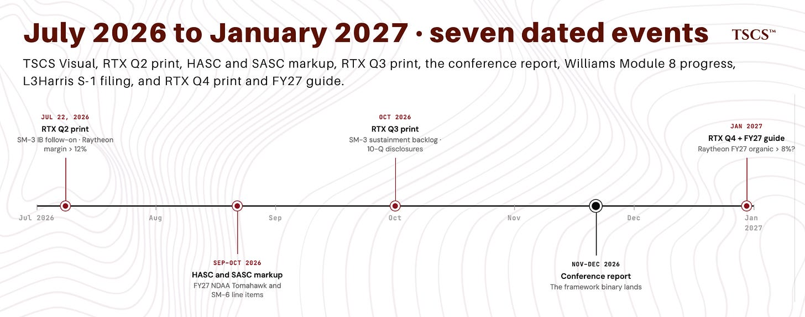](https://substackcdn.com/image/fetch/$s_!hL1N!,f_auto,q_auto:good,fl_progressive:steep/https%3A%2F%2Fsubstack-post-media.s3.amazonaws.com%2Fpublic%2Fimages%2Fecd4f094-02d8-4d3a-9441-c00ddf94d4b7_1886x744.png)

Williams International Module 8 construction progress at Shoal River Industrial Park (Phase 1 completion targeted late 2026). Northrop Defense Systems segment commentary on Mk 72 qualification milestones.

LMT Q2 late July as the parallel framework-to-backlog test on PAC-3, the cleanest read on whether the LMT framework conversion mechanics that this trade extrapolates to RTX are firming or slipping.

## **What this piece doesn’t cover**

Three topics sit adjacent to this thesis and deserve separate treatment.

The first is NewMarket Corporation as a standalone supplier-side trade. The capital allocation signal is real and the AMPAC monopoly position is structural. The trade requires options market verification and a more developed comp set than the Olin Winchester analogy supports. Follow-on piece.

The second is the broader DOGE and defense budget politics. Reconciliation risk on framework funding is the central trade frame in this piece, but the wider political landscape, including the tension between budget efficiency rhetoric and the largest munitions procurement request in a generation, is a structural question this piece touches but does not develop.

The third is Northrop Mk 72 second-source qualification as a standalone optionality trade. The qualification is a real binary on a 2027 to 2028 timeline that could re-rate Northrop’s SRM franchise. I am not building the trade because quarter-size on a binary that pays $15 to 30 per share if it qualifies is rounding error against a $573 stock. It belongs in any portfolio that already owns Northrop on broader merits, but it does not justify a standalone position.

## **Caveats**

Framework production targets that anchor the headline math (Tomahawk 1,000+ per year, AMRAAM 1,900+ per year, SM-6 500+ per year) are RTX press release figures from February 4, 2026. They are not contractually committed, not in the $271 billion backlog, and not in any DoD primary document I could locate. RTX’s spokesperson declined to comment to Breaking Defense on current annual production levels or contract definitization timing. Sell-side modeling that implies the dollar figures are independently DoD-attested overstates source quality.

The sell-side framing referenced in the introduction is anchored on secondary reporting. The $7 to $8 billion headline figure and the “underappreciated” framing from Morgan Stanley’s April 22 note are consistent across multiple financial news summaries and confirmed via Bloomberg News quotation. The underlying Wolfe Research February 8 note was sourced from descriptions on Investing.com, Yahoo Finance, and Insider Monkey rather than the primary note; the methodology is not verified. The magnitude is what matters for the thesis and the magnitude is not in dispute across sources, but I am not representing direct access to the sell-side research.

The PAC-3 revision pattern referenced as the analog for consensus model extension is directional. The exact magnitude and timing of the LMT FY26 and FY27 EPS revisions following framework conversion in early to mid-2026 should be charted from Bloomberg before publication; the directional pattern is what the trade depends on.

The supplier timeline analysis is grounded in publicly disclosed data: DPA awards, capacity expansion announcements, groundbreaking dates, qualification milestones. Williams International is private and its production capacity, current output rates, and Module 8 completion timing are not independently verifiable beyond the trade press and DoD press release record. Public records that would tighten the timeline meaningfully (Okaloosa County permits, USA Spending obligations, DPA Title III congressional reporting) are available but not pulled at time of writing. Holston AAP is government-owned and its expansion timeline is similarly tied to DoD disclosure rather than independent audit.

The SM-3 sustainment EPS contribution is built from publicly disclosed IDIQ ceiling figures and assumptions about utilization rate, margin, and recognition timing. The $0.11 to $0.15 per year EPS contribution is a directional estimate. RTX does not break out sustainment versus new-build margin in segment reporting, so the margin assumption is anchored on comparable structures across LMT and NOC sustainment work. Actual contribution may run higher or lower depending on task order timing and mix.

The L3Harris Missile Solutions IPO valuation framework uses EBITDA figures L3Harris has disclosed publicly but that have not been audited in a public S-1. The $620 million EBITDA figure may change when the public S-1 drops. Reuters reported on April 30, 2026 that L3Harris had confidentially submitted a draft registration statement, which is the standard procedural precursor to the public filing. Pentagon convertible-preferred terms have not been publicly detailed beyond the $1 billion headline. The trade is not actionable until the public S-1.

Operation Epic Fury munition expenditure figures (~850 Tomahawks of approximately 3,100, 50% of THAAD inventory, 50% of Patriot interceptor stockpile) are from CSIS’s April 21, 2026 reporting. State Department and White House releases confirm timing but do not publish exact stockpile figures.

Position sizing reflects the kill switch stack, supplier-specific risks, and the patience requirement on the RTX base. One position today (RTX direct, half size). Two binary watches (L3Harris IPO on public S-1, NEU as follow-on). Three catalysts at three horizons: SM-3 sustainment recognition in 2026 to 2027 prints, the December 2026 reconciliation binary, the 2028 to 2029 framework print.

The framework is not in the numbers. The trade is the print.

[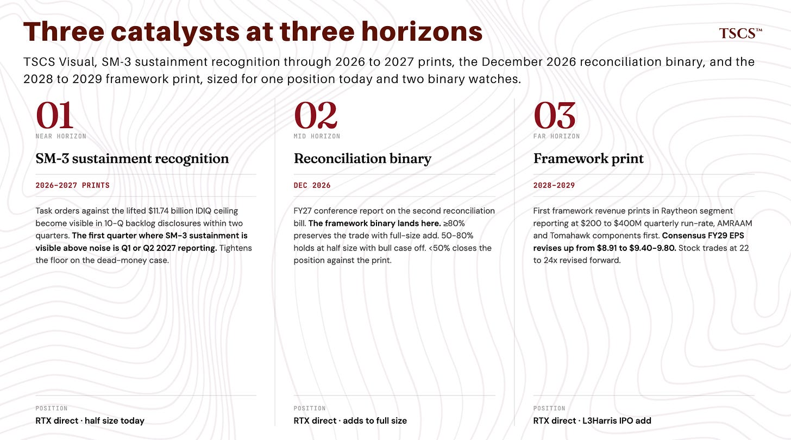](https://substackcdn.com/image/fetch/$s_!vD-V!,f_auto,q_auto:good,fl_progressive:steep/https%3A%2F%2Fsubstack-post-media.s3.amazonaws.com%2Fpublic%2Fimages%2F6aac9eab-9a09-432d-85fc-a3328365c19a_1888x1050.png)

[Share](https://tscsw.substack.com/p/empty-magazine-full-pipeline?utm_source=substack&utm_medium=email&utm_content=share&action=share&token=eyJ1c2VyX2lkIjoxNDAwMjQ1LCJwb3N0X2lkIjoxOTYxNjYxNTEsImlhdCI6MTc3ODU0NTI2MCwiZXhwIjoxNzgxMTM3MjYwLCJpc3MiOiJwdWItMjM1NDI0NCIsInN1YiI6InBvc3QtcmVhY3Rpb24ifQ.sTrdDnagTg5uwWyxNkE4qazowb0irqEigJue0ZSqsYs)

---

*This post is for informational and educational purposes only. It does not constitute investment advice, a recommendation, or an offer or solicitation to buy or sell any security. The author may hold positions in the securities discussed. Readers should conduct their own research and consult a licensed financial advisor before making investment decisions. Past performance does not guarantee future results.*