Gold miners are still printing $3,000-plus margins per ounce. The market priced that as a bubble four weeks ago and four weeks of operating prints have not changed its mind. Two of the names I called a buy in “Buy The Miners” reported Q1 this week. Both beat or matched on the headline. Both are down double-digits since publication. AEM is off 12%, AGI is off 15%, gold itself is down only 1%.

Most of that move is the leverage senior gold producers carry to the gold tape, which fell 5% from its mid-April peak. That part is loud, mechanical, and not the question worth asking.

The question worth asking is why one fell four points harder than the other on the same gold move. The Q1 prints answer it. So does what I am doing about it.

[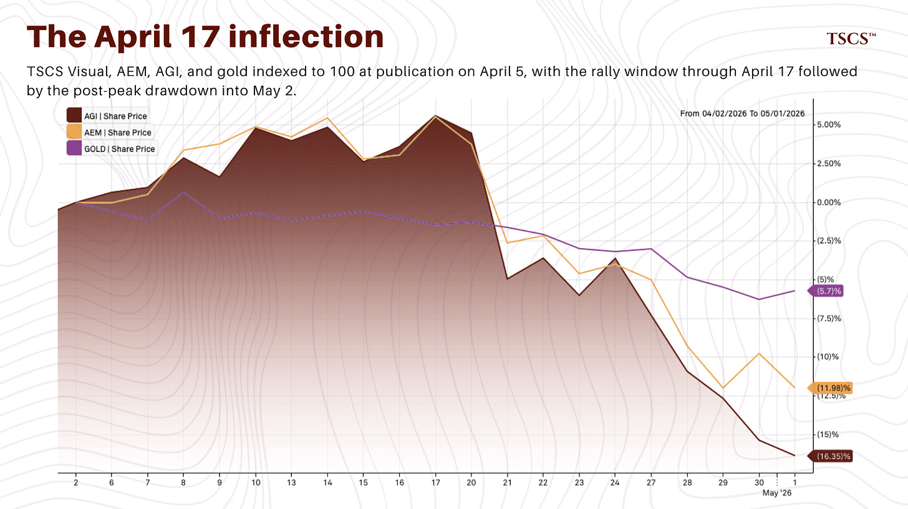](https://substackcdn.com/image/fetch/$s_!2hnU!,f_auto,q_auto:good,fl_progressive:steep/https%3A%2F%2Fsubstack-post-media.s3.amazonaws.com%2Fpublic%2Fimages%2Fdc010659-362d-486c-88fe-1355e5a8d7a4_1846x1036.png)

If you read my post “Gold Is Not Failing” three weeks ago, the macro framework still holds. The structural bid is intact. The wash-out has cleared. Today’s post is the operational follow-up: how the framework survives contact with two earnings prints, two corrections from the original call, one explicit kill switch I owe subscribers, and one number that decides whether the better of the two names gets fresh capital next week.

Subscribed

From subscriber chat this week, the question that prompted the post.

> Jack: AGI reported today and down 3%, AEM out tomorrow. Will be interested to get your take on the calls. Both down pretty significantly since your mid April piece.
>
> Anuj: Alamos also is down? Anyone has any idea on what went wrong with that stock. It seems like the AISC came in higher than expected driven by the Young Davidson Issue and the significant increase in AISC for that mine.
>
> Eddy: Gold in general under pressure. It’s what it is.
>
> Jack: Pretty sure TSCS took that into account in their write up, Eddy.
>
> Anuj has the AGI execution piece: Young-Davidson dilution and the AISC step-up. Eddy is right that gold is under pressure, and that explains most of what subscribers are seeing. It does not explain why AGI dropped harder than AEM in the post-peak window.

The numbers in USD from publication on April 5. Gold down 1.2%. AEM down 12.0%. AGI down 14.9%. The CAD-denominated AGI decline of 16.9% includes 231 basis points of CAD strength versus the USD over the window, which flatters the USD-investor experience by about two points.

The window splits in two. April 6 to April 17, both stocks rallied with gold and you were nicely up if you bought on day one. AEM up 5.5%. AGI up 4.9%. Gold up 3.7%. April 17 to May 2, the air came out. Gold fell 4.5%. AEM fell 16.6%. AGI fell 20.8%.

The 4.2 point spread between AEM and AGI in the post-peak window is what subscribers are reacting to. Both stocks fell harder than gold. Senior producers carry that leverage to the gold tape and it dominates both moves. The part the prints have to explain is why AGI fell harder than AEM. Q1 results this week answer that.

[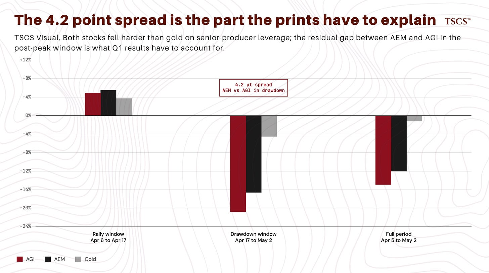](https://substackcdn.com/image/fetch/$s_!OxFH!,f_auto,q_auto:good,fl_progressive:steep/https%3A%2F%2Fsubstack-post-media.s3.amazonaws.com%2Fpublic%2Fimages%2F9c7f9df7-5bc3-4e01-8414-206f1fa56d68_1848x1034.png)

If you have not read “Buy The Miners” or “Gold Is Not Failing,” read those first. This is not the place to relitigate the framework. It is the place to mark it to market.

## **What I got wrong on Rupert**

In “Buy The Miners” I addressed Hickey’s rotation from Skeena into Rupert Resources. The exact quote: “I disagree. I weight the de-risking at 49% completion more heavily than a wider NAV gap on a project that does not produce until 2031 at the earliest.” Two weeks later AEM announced offers for Rupert Resources, Aurion Resources, and the 70% B2Gold stake in the Fingold joint venture.

Hickey was right that Rupert was undervalued. AEM agreed and paid the premium. The disagreement resolved against me publicly when AEM bid. Not a framing miss or a sizing miss. A directional disagreement on a name, made publicly. The Skeena thesis I defended is intact.

What I got wrong was the directional read: I weighted Skeena’s de-risking more heavily than Rupert’s NAV gap, and the gap got closed by acquisition rather than by re-rating.

Whether the relative trade outperformed staying in Skeena depends on where Skeena trades from here, and I am leaving that arithmetic to a later post once Skeena reaches its next milestone.

A directional miss that resolved against me publicly. That is the version I can defend now. I am writing this down rather than burying it. The alternative is softening it later, which is worse.

## **AEM. The deal-driven name**

Q1 print, in brief. EPS of $3.40 against consensus of $3.21, a 5.9% beat. Revenue of $4.10 billion against $4.02 billion. Adjusted net income $1.7 billion. Free cash flow of $730 million after paying $1.8 billion in cash taxes during the quarter, of which $1.3 billion was the previously disclosed 2025 catch-up. Net cash $2.9 billion. Fitch upgraded the long-term issuer rating to A- with a stable outlook. AISC of $1,483 per ounce sits inside full-year guidance of $1,400 to $1,550. Production of 825,000 ounces ran slightly above plan against the 48% / 52% half-year weighting management is guiding.

[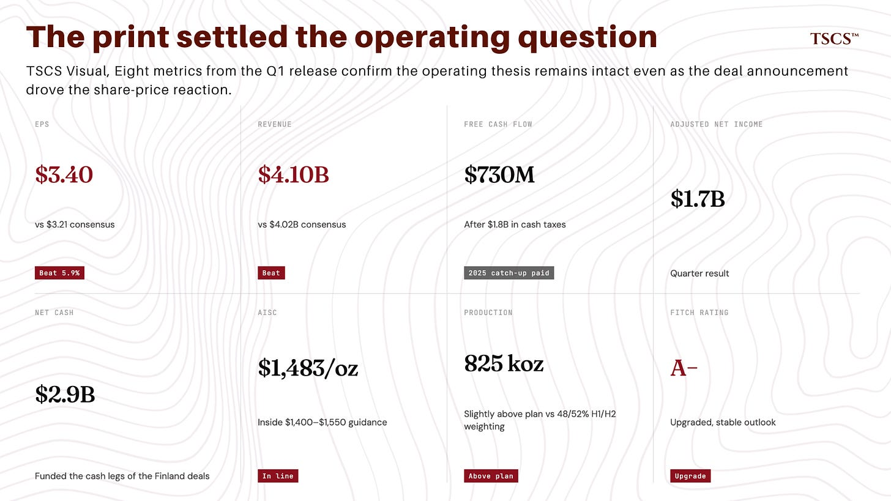](https://substackcdn.com/image/fetch/$s_!t6Zg!,f_auto,q_auto:good,fl_progressive:steep/https%3A%2F%2Fsubstack-post-media.s3.amazonaws.com%2Fpublic%2Fimages%2F0b726ae2-374f-41b8-8116-02337540305f_1848x1040.png)

Clean operating quarter. One correction owed: the diesel sensitivity.

In the original piece I framed AEM’s energy exposure as roughly 15% of cost structure with diesel sensitivity at about $70 per ounce net of hedges on a doubling. CFO Jamie Porter’s prepared remarks on the call: direct diesel consumption is approximately 7% of total operating cost base. A 10% change in diesel translates to roughly $6 per ounce on annual total cash costs after the hedge book. The cost-structure share I gave was roughly double the CFO’s number. The dollar figure was actually close: my original $70 per ounce on a doubling scales to the corrected $6 per ounce on a 10% change. Directionally right on the takeaway, wrong on the parameters. The conclusion holds: diesel is a manageable headwind.

[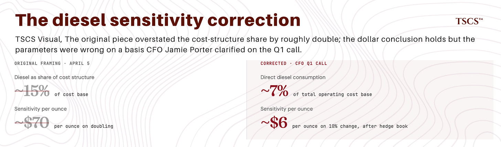](https://substackcdn.com/image/fetch/$s_!bG-v!,f_auto,q_auto:good,fl_progressive:steep/https%3A%2F%2Fsubstack-post-media.s3.amazonaws.com%2Fpublic%2Fimages%2F5bf9118c-d118-4723-aeba-a6d032412141_1850x546.png)

The actual story in this section is the Finland consolidation, not the share issuance.

Transaction structure. Three deals announced together. Rupert Resources, full takeout, primarily share-funded with a contingent cash value right of up to $3.00 per share. Aurion Resources, full takeout, cash-funded. 70% of the Fingold JV from B2Gold, cash-funded. Only Rupert dilutes. The other two are pure asset additions paid for from the $2.9 billion cash pile. The “share-funded M&A” reaction applies to the Rupert leg only.

[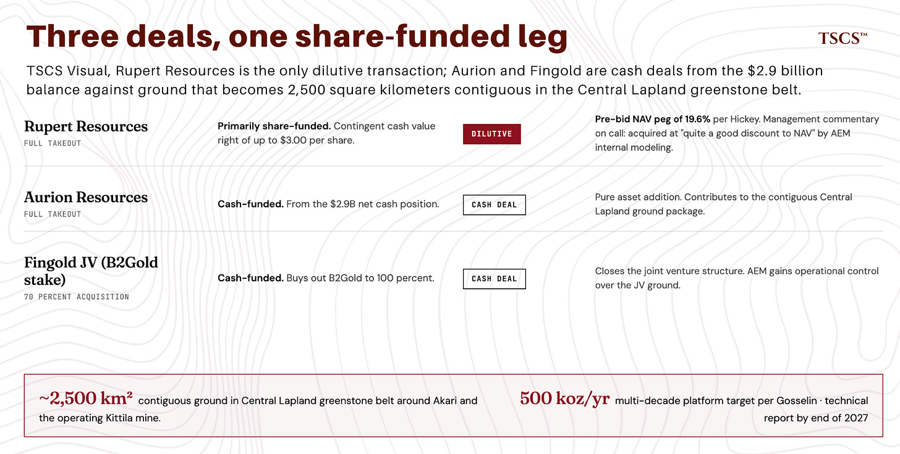](https://substackcdn.com/image/fetch/$s_!Grw2!,f_auto,q_auto:good,fl_progressive:steep/https%3A%2F%2Fsubstack-post-media.s3.amazonaws.com%2Fpublic%2Fimages%2F84719d46-b9dc-48f3-b9c6-d39cfa042b2b_1848x934.png)

Strategic logic. Akari, AEM’s existing Finnish development asset, was constrained by property boundaries on multiple sides. Drilling near the boundaries was limited. Mill location, tailings layout, infrastructure all designed around lines drawn between separate companies that did not own the same dirt. Remove the boundaries and AEM redesigns the project from scratch. Combined ground after closing: approximately 2,500 square kilometers contiguous in the Central Lapland greenstone belt around Akari and the operating Kittila mine. Guy Gosselin on the call: a 500,000 ounce per year multi-decade platform from Kittila plus Akari combined, with an updated mine concept by end of 2027.

Gosselin’s Kittila reference is the right anchor. AEM acquired Kittila in 2005 with approximately 2 million ounces of identified resource. Today Kittila’s combined production-plus-resource endowment runs to approximately 10 million ounces, still open below 2 kilometers depth. He explicitly compared the structural geology at Akari and the broader Central Lapland belt to AEM’s Canadian greenstone assets, which “have demonstrated extended vertical geological fertility.” That is AEM’s playbook. Acquire prospective ground in proven fertile geology, then drill it for two decades.

[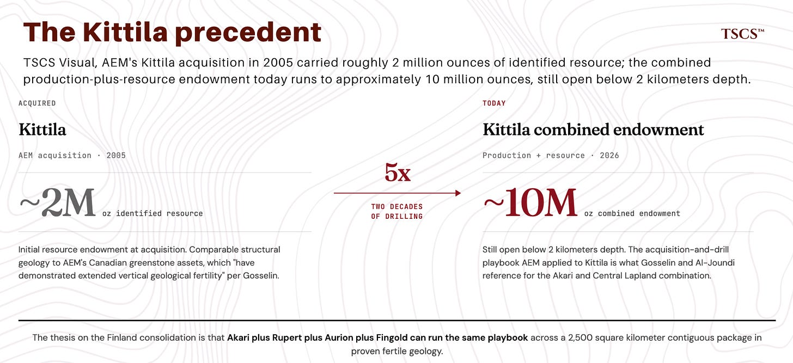](https://substackcdn.com/image/fetch/$s_!9Gjc!,f_auto,q_auto:good,fl_progressive:steep/https%3A%2F%2Fsubstack-post-media.s3.amazonaws.com%2Fpublic%2Fimages%2F8b4935cf-6ee7-42b8-b0e3-d7baca693f92_1848x846.png)

Value framework. The market reaction is not a value judgment, it is a sentiment effect on share issuance. CEO Ammar Al-Joundi stated explicitly on the call that AEM acquired Rupert at “quite a good discount to NAV” by their internal modeling, with the rest of the land package effectively for free. Hickey, who has owned Rupert since well before AEM bid, pegged it at 19.6% of net asset value in his March issue. Management’s commentary is consistent with the number but not independent of it. Management has every incentive to claim discount-to-NAV on any deal, and we do not see their underlying NAV inputs. The directional read holds. The magnitude is constrained because we have one published NAV, not two. The market took roughly 2% off AEM in the trading session after the announcement. The remaining drag in the post-peak window is gold beta at AEM’s leverage, plus dilution mechanics and noise. None of the drag is operating-result-driven, because the operating result was a beat.

Two things from the Q1 call worth flagging without being thesis-changing. Finland passed a mining tax change during the quarter that AEM has now incorporated into the Kittila life-of-mine model. The industry is lobbying for offsetting deductibility provisions but the impact is in the numbers as of Q1. And AEM has had two fatalities in the past five months, which Al-Joundi addressed directly on the call. Investigations are ongoing, the company has mandated a stand-down across all sites, and the safety program is being reinforced. Neither item changes the operating thesis. Both deserve mention in a note pitching fresh capital.

Where this leaves AEM at $183.56. Same operating asset you had at $208.54, plus a strategic land position with multi-decade growth optionality, at a price below NAV by management’s own admission. Q1 was a clean beat with reaffirmed guidance. Diesel exposure is smaller than the original piece described. Balance sheet upgraded to A-.

On the information available now, the case at $183 is at least as strong as at $208, with per-share accretion from the Finland consolidation pending the integrated technical report by end of 2027. “At least as strong” is the honest version. “Stronger” overclaims on accretion math AEM has not yet published. The dilution from Rupert is real, but the per-share math is constrained: AEM is issuing shares at a discount to the externally-pegged NAV referenced above.

The transaction is accretive per share if Hickey’s pre-bid NAV is right, and the magnitude lands with the integrated technical report. For now, “the dilution is offset” is directionally correct but not yet quantified. Treat it that way.

The operating result settled the print question. The drawdown is mostly gold beta. The part that is not gold beta is the deal, and the deal is accretive on available math.

Not adding today because sizing was at target before publication. The fresh-capital decision on AEM is the open question. I will disclose action in the next post.

## **AGI. The execution-driven name**

AGI is the harder name in this update.

Q1 was in line on the headline. EPS of $0.55 against consensus of $0.55, no surprise. Revenue of $596.7 million against $595.0 million. Production of 124,000 ounces in line with quarterly guidance. Realised gold price $4,829 per ounce. AISC margin of approximately $3,000 per ounce, nearly tripled year over year. Free cash flow of $102 million.

[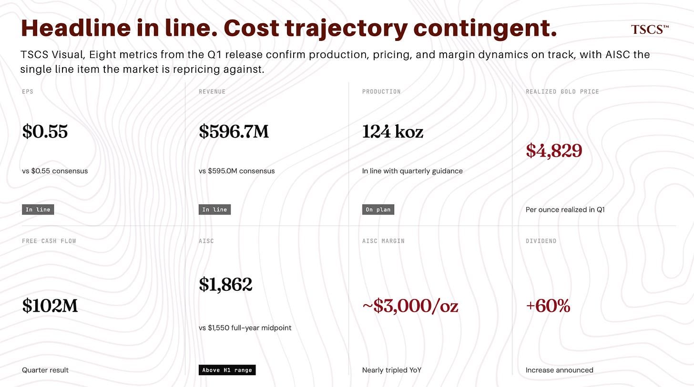](https://substackcdn.com/image/fetch/$s_!7kDp!,f_auto,q_auto:good,fl_progressive:steep/https%3A%2F%2Fsubstack-post-media.s3.amazonaws.com%2Fpublic%2Fimages%2Faacc62d5-bd4f-4431-bf37-5f8bf4fa58d0_1848x1032.png)

The headline misses the full story. AISC came in at $1,862 per ounce.

Full-year guidance midpoint is $1,550. The H1 range was already telegraphed as elevated at the February guidance update. Q1 came in above the elevated H1 range. Hitting the full-year midpoint requires AISC to step down approximately 22% across Q2 to Q4. That is the bridge the market is repricing, and it explains the 4.2 point spread between AGI and AEM in the post-peak window.

Both stocks took the gold pullback. Only AGI carried the AISC concern on top of it.

[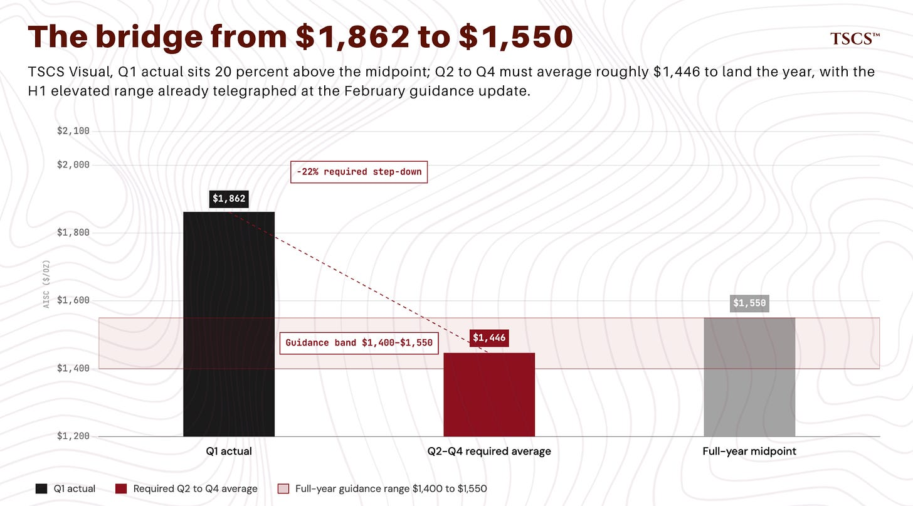](https://substackcdn.com/image/fetch/$s_!fEdK!,f_auto,q_auto:good,fl_progressive:steep/https%3A%2F%2Fsubstack-post-media.s3.amazonaws.com%2Fpublic%2Fimages%2F46fc0d08-d723-4d1d-a71e-e0b3ecd44d54_1850x1026.png)

The bridge is concrete. Underground mining rates at Island Gold need to ramp from the Q1 record of 1,423 tonnes per day to 2,000 tpd by year-end and then to 2,400 tpd in 2027 once the Phase 3+ shaft is commissioned. The Magino mill needs to ramp from 7,500 tpd in Q1 to roughly 10,000 tpd by Q3, helped by the temporary crusher addition that has lifted the trailing six-week average to 9,200 tpd. Young-Davidson needs to recover to 8,000 tpd milling rates with both the rehabilitated and newly constructed ore passes now operational, bringing total active ore passes to four. Connection to grid power at Magino in early 2027 is worth approximately $5 per tonne in operating cost, which translates to roughly $40 to $50 per ounce on the consolidated number.

None of those steps are guaranteed. All credible. The Phase 3+ shaft sinking was completed in Q1 to the planned depth of 1,381 metres on schedule, the largest piece of execution risk on the project, and it landed cleanly. Commissioning is on track for early 2027. The Magino mill improvements are running ahead of where I would have expected at this stage of the temporary crusher commissioning. Underground mining rates at Island Gold are tracking the ramp schedule.

[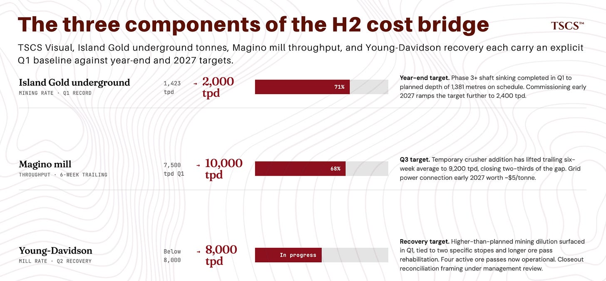](https://substackcdn.com/image/fetch/$s_!d0kR!,f_auto,q_auto:good,fl_progressive:steep/https%3A%2F%2Fsubstack-post-media.s3.amazonaws.com%2Fpublic%2Fimages%2F019f3cfd-e864-48d0-a1a7-345b8e447d18_1848x860.png)

Against that, Young-Davidson dilution was not flagged at the February guidance update. It surfaced in the Q1 print as “higher than planned mining dilution” tied to two specific stopes and longer-than-expected ore pass rehabilitation work. Management framed it as a closeout reconciliation issue with drill and blast design under review. Plausible. It is also possible that closeout reconciliation is the first surface of broader grade-versus-model drift at Young-Davidson that recurs in subsequent quarters. Management has not given me a way to tell which reading is right between now and Q2. The kill switch below covers the forward exposure either way; what changes is the conditional probability of the kill switch firing. I am sizing on the assumption that management’s framing is more likely than the alternative, without dismissing the alternative. It was not in the model when “Buy The Miners” was published.

Two things in AGI’s favor that actually counterweight the cost concern. Year-end mineral reserves grew 32% to 15.9 million ounces, with Island Gold District reserves growing to 8.3 million ounces and underground Island Gold reserves more than doubling to 5.1 million ounces. The Island Gold District Expansion Study released in February showed a $12.2 billion after-tax NPV at $4,500 gold from a single asset, with $1.3 billion in annual free cash flow at steady state. The reserve growth and NPV reframe the timeline. The cost bridge is the H2 2026 question. The reserve and NPV are the multi-year question, and the multi-year answer got materially better in Q1. The 60% dividend increase, $660 million cash, and Argonaut hedge buyback progress are genuine positives. They do not directly counterweight the H2 cost concern, so I am setting them aside.

[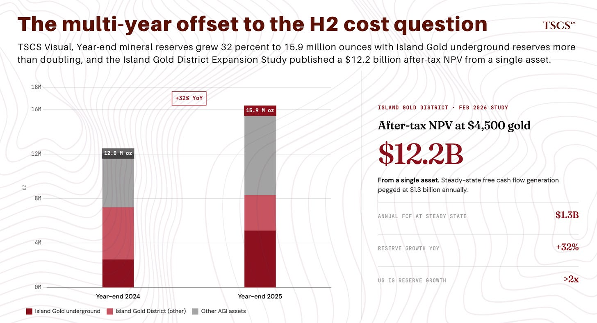](https://substackcdn.com/image/fetch/$s_!whgQ!,f_auto,q_auto:good,fl_progressive:steep/https%3A%2F%2Fsubstack-post-media.s3.amazonaws.com%2Fpublic%2Fimages%2F451454e3-e6e2-47e1-8d3e-92b802e146d7_1848x1000.png)

The thesis in “Buy The Miners” was the triple lever. Rising price, rising volume, falling unit costs. Q1 delivered the first two. The third is now contingent rather than mechanical. Hold that distinction.

Hostile auditor reading. If Q1 AISC had printed at $1,862 the day before “Buy The Miners” went out instead of four weeks after, I would not have written the AGI section the same way. The original sizing assumed the cost trajectory was mechanical because management’s February guidance ($1,500 to $1,600 full year, with H1 telegraphed as elevated) made it look mechanical. Q1 told me it is not. The Young-Davidson dilution surprise was not in the original information set, and the magnitude of the H1 cost weighting was not fully appreciated when the post went out. The kill switch below fixes the forward exposure. It does not unmake the original sizing call, which was made before Q1 revealed what Q1 revealed. I am holding the position to Q2 because the bridge management has articulated is credible and partly already in motion. Holding does not endorse the original sizing. If I were sizing AGI fresh today against the bridge as I now understand it, the position would be smaller.

## **The kill switch**

Missing from “Buy The Miners.” You are entitled to it now.

Thresholds derive from guidance arithmetic. Q1 came in at $1,862. Full-year midpoint is $1,550. To average $1,550 across the year, Q2 to Q4 must average roughly $1,446. The 22% step-down referenced earlier in this section is the average across the back three quarters. The thresholds are framed against Q2 because it is the next print and tells you whether the bridge is on schedule.

If Q2 prints at $1,750, that is a 6% step-down from Q1, leaving Q3 to Q4 to average roughly $1,294. That implies a 26% step-down across the back two quarters from a Q2 print at $1,750, achievable only if Magino mill rates clear 10,000 tpd by Q3, Young-Davidson recovers fully, and grid power timing slips no further. $1,750 is not comfortable. It is the edge of what stays consistent with reiterated guidance.

If Q2 prints at $1,650, that is an 11% step-down from Q1, leaving Q3 to Q4 to average roughly $1,344. That is a tight but achievable glide path on the bridge management has articulated.

If Q2 AISC prints above $1,750 per ounce and full-year guidance gets revised higher, the position is reduced to half of current size on the print.

If Q2 AISC prints below $1,650 per ounce with management reiterating full-year guidance and Magino milling rates above 9,500 tpd at the time of the report, the position holds and the trade thesis re-engages.

The middle range, between $1,650 and $1,750 with no guidance revision, holds with monitoring and a re-evaluation at Q3. The middle range is a soft kill switch. A Q2 print at the midpoint of this band ($1,700) implies a Q3 to Q4 average of roughly $1,319, which is a 22% further step-down from Q2 in a single move. That requires either upside-surprise execution in H2 beyond what the bridge currently articulates, or a quiet expectation of a guidance update at the Q3 print. The monitoring zone is wider than the operating bridge supports because I am giving management’s reiteration weight. If reiteration is withdrawn anywhere in the $1,650 to $1,750 band, the kill switch fires regardless of the threshold arithmetic.

Early read between now and Q2: Magino’s six-week trailing average at 9,200 tpd has closed roughly two-thirds of the gap from the Q1 7,500 tpd baseline to the Q3 10,000 tpd target. The floor scenario is more in reach than the Q1 AISC print, in isolation, would suggest. That does not pre-judge Q2. It tells you the direction.

Q2 reports in early August. The thresholds are in writing.

[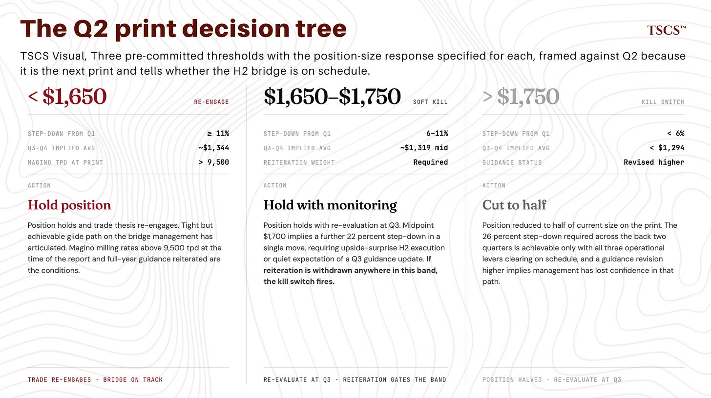](https://substackcdn.com/image/fetch/$s_!RIQc!,f_auto,q_auto:good,fl_progressive:steep/https%3A%2F%2Fsubstack-post-media.s3.amazonaws.com%2Fpublic%2Fimages%2F6c6c9f04-c9d8-45af-bc4d-e55358ae9db4_1844x1034.png)

## **The other names, briefly**

Not the post to expand the framework. The framework is in “Buy The Miners.” Three names deserve a status check.

Wesdome. The original portfolio binary is unchanged. June technical reports remain the test of whether reserves and resources support the longer-life story. Q4 produced C$0.79 EPS at $4,169 average realised gold. Q1 realised gold averaged $4,975, approximately 19% higher. The Q1 print should reflect that at the high operating leverage a senior single-asset producer carries.

Perpetua. Watch the Federal Register for the EXIM final close. Position sizing per “Buy The Miners” still applies.

Skeena. Construction progresses on the timeline laid out in “Buy The Miners,” with the $750 million refinancing close removing the financing overhang ahead of first ore.

## **What I did**

Nothing.

Sizing in gold miners was at target before “Buy The Miners” published, 20 to 25% of portfolio. No fresh capital allocated to the sector during the four-week window and no other allocations flashing trim signals worth rotating. The thesis stress-tested through the drawdown.

Sector sizing stays 20 to 25%. The macro framework from “Gold Is Not Failing” survived the wash-out and the structural bid reasserted. What has shifted is the internal mix. The fresh-capital decision on AEM, if it goes, raises the AEM share at the expense of cash. The Q2 print on AGI determines whether the AGI share holds, halves, or reweights into the rest of the portfolio.

AEM at $183.56 is mathematically attractive enough for fresh capital if rotation candidates clear, and I am working through that. AGI is held pending Q2 against the kill switch I just committed to. The other names are tracking their original framework.

The honest version of “did nothing”: I did not panic, did not chase the rally to the April 17 peak, did not flinch into the late-April slide. The kill switch I have committed to on AGI is the next decision point. The fresh-capital decision on AEM is the one I am working on now. Both land in the next gold post.

## **What changes if I am wrong**

The kill switch on AGI is in the section above. This section addresses what would force a broader thesis revision.

Scenario one is the dominant one. Gold breaks $4,200 with no clear catalyst. That implies the structural bid weakened more than the speculative wash-out described in “Gold Is Not Failing” allowed for. In that scenario, stock-specific concerns get amplified by gold beta and the trade gets uglier across the portfolio. Position weighting shifts to AEM and Wesdome, which carry the strongest balance sheets and lowest cost positions. AGI is halved regardless of the Q2 cost kill switch. Developers trim materially given their pre-revenue beta. Probability over the next six months: roughly one in five, slightly down from “Gold Is Not Failing” because the wash-out cleared and the structural bid reasserted.

Scenario two is subdominant, worth flagging. The Finland mining tax revision broadens, or the offsetting deductibility provisions the industry is lobbying for fail to materialise. AEM’s Kittila life-of-mine model takes a second cut, the Akari mine concept gets repriced before the integrated technical report lands, and the per-share accretion math on the Rupert leg compresses. The position holds. The framework holds. The Finland consolidation accretion is smaller than this post implies. Probability over the next twelve months: roughly one in six.

Scenario three is construction-side risk on the developer leg. A Skeena setback (covenant problem, permit slippage, capex revision) reopens the financing overhang the $750 million close removed. The original framework re-engages, Skeena trimmed not exited, developer weighting drops. Probability over the next twelve months: roughly one in eight.

The macro kill switch from “Gold Is Not Failing” gates scenario one.

[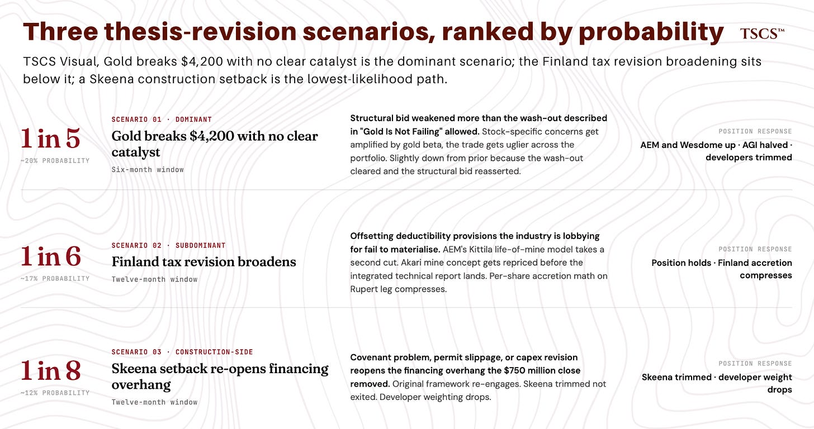](https://substackcdn.com/image/fetch/$s_!Dztm!,f_auto,q_auto:good,fl_progressive:steep/https%3A%2F%2Fsubstack-post-media.s3.amazonaws.com%2Fpublic%2Fimages%2Fe832b944-8ab2-42dd-a517-532ca21b14b8_1846x974.png)

## **Catalyst calendar**

[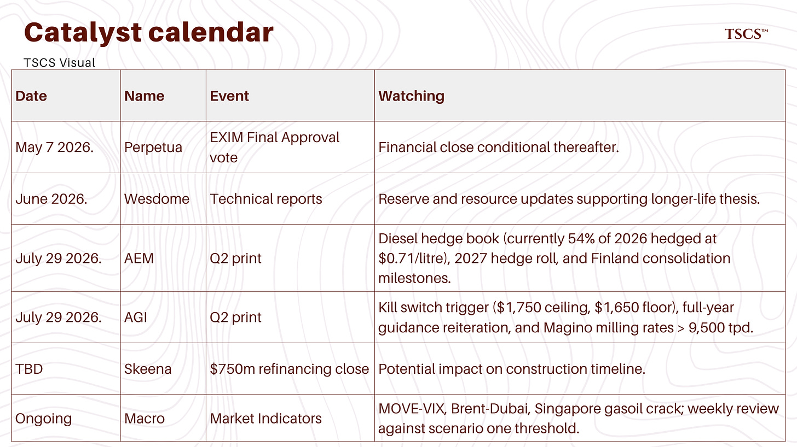](https://substackcdn.com/image/fetch/$s_!L3At!,f_auto,q_auto:good,fl_progressive:steep/https%3A%2F%2Fsubstack-post-media.s3.amazonaws.com%2Fpublic%2Fimages%2F8f08f5a9-7610-4966-996a-2a6f59275b3f_1848x1038.png)

## Wesdome June technical reports. The binary on the original portfolio. Unchanged.

AEM Q2 reports July 29. The diesel hedge book question is the next iteration. 54% of 2026 hedged at $0.71 per litre is a known position. The 2027 hedges roll at higher prices, and the cost trajectory after current hedges expire is the next thing to model. Also watch the Finland consolidation closing milestones. The B2Gold/Fingold cash leg has closed. Aurion and Rupert closing timelines depend on shareholder approval votes and exchange filings.

AGI Q2 in early August. The kill switch trigger. $1,750 ceiling, $1,650 floor, full-year guidance reiteration, Magino milling rates above 9,500 tpd as the gating filter.

Perpetua EXIM final close.

Skeena $750 million refinancing close.

Macro monitoring, ongoing. MOVE-VIX spread, Brent-Dubai spread, Singapore gasoil crack. When all three compress together, the acute liquidity phase is genuinely over. None have compressed fully. Reviewed weekly against the scenario one threshold.

## **Closing**

The framework survives the print on the modal path. The three failure scenarios above carry meaningful aggregate probability over the next 6 to 12 months. That is why the kill switches are explicit. Corrections owed, kill switches in writing.

Hold AEM. Hold AGI to Q2 against the kill switch (fresh sizing today would be smaller). Hold the rest. If you are underweight AEM with fresh capital, $183 is a more attractive entry than $208.

AGI Q2 in early August is the kill switch trigger and the next decision point.

---

*Data sourced from Bloomberg Terminal. Charts: XAU BGN Curncy, AEM US Equity, AGI CT Equity. Period returns computed from closing prices over the April 5 to May 2 window. Q1 figures from company earnings releases and conference call transcripts (S&P Global Market Intelligence).*