Sell-side raised CoreWeave price targets six times in April. Roth to $135, Wolfe to $150, Cantor to $156, Oppenheimer to $150, Citi to $155, Jefferies to $160. Tyler Radke at Citi wrote that the IG financing could trigger upward EPS revisions through fiscal 2026.

They’re reading the rating. The bears are reading the contract.

The contract leaves nothing for the equity above the ringfence.

On March 31, 2026, $8.5 billion of GPU-backed debt achieved investment-grade status for the first time. CoreWeave Compute Acquisition Co. VIII LLC, a non-recourse subsidiary of CoreWeave Inc., closed DDTL 4.0 at A3 from Moody’s and A (low) from DBRS. Five notches above the B1 Parent. Most notes cited some combination of the IG financing and the April contract wins (Meta $21 billion expansion, Anthropic, Jane Street $6 billion).

[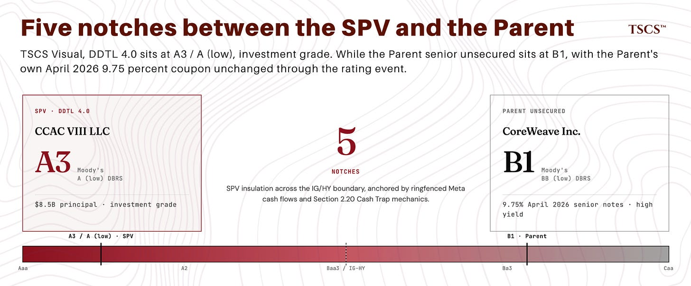](https://substackcdn.com/image/fetch/$s_!gg0c!,f_auto,q_auto:good,fl_progressive:steep/https%3A%2F%2Fsubstack-post-media.s3.amazonaws.com%2Fpublic%2Fimages%2Fa00fabac-f501-46f0-9c48-687ccf522949_1848x768.png)

Wolfe Research initiated at $150 Outperform on April 16, with public reporting characterizing the firm’s view as the financing engine being a key differentiator that sets CoreWeave apart from peers. Both readings treat SPV-level financing cost compression as if it transmits to Parent equity value through reduced corporate borrowing costs. Neither engages with whether it actually transmits there, or with the simpler observation that the Parent’s own cost of capital, as priced in the April 2026 9.75% Senior Notes, didn’t improve.

[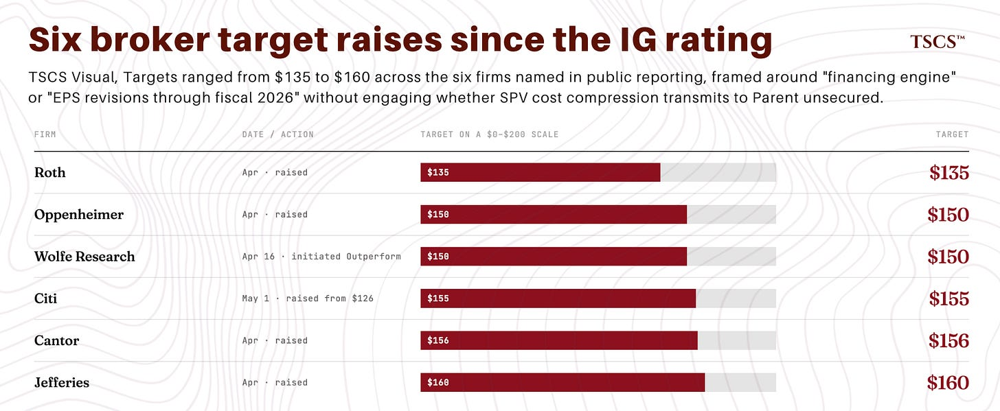](https://substackcdn.com/image/fetch/$s_!djjg!,f_auto,q_auto:good,fl_progressive:steep/https%3A%2F%2Fsubstack-post-media.s3.amazonaws.com%2Fpublic%2Fimages%2F093b7b8f-4654-4995-a7f4-10e47c92deba_1844x758.png)

Both readings missed the trade.

The rating is correct. The structural insulation is genuine. The contract evidence supports the rating agencies’ analysis. The press coverage and the equity-bullish read missed that the rating measures one thing and equity holders care about something different. The rating measures probability that SPV lenders take a loss on contracted Meta cash flows ringfenced inside CCAC VIII. Equity holders should care about probability that the Parent loses access to upstream cash distributions. Different thresholds. The contract makes the gap between them observable.

The Cash Trap mechanism in Section 2.20 of the DDTL 4.0 credit agreement activates on material breach of the Master Services Agreement giving rise to termination rights. The trigger is material breach. It is not actual termination, and it is not actual default. It captures sub-default operational stress. When Cash Trap fires, all SPV cash is held inside the waterfall and not distributed upstream to the Pledgor and through to the Parent. The waterfall priorities make SPV lenders whole before any cash leaves the SPV. That is a feature for SPV lenders. It is the mechanism by which sub-default stress is absorbed without becoming a default event. It is also the mechanism by which the Parent equity is most exposed.

[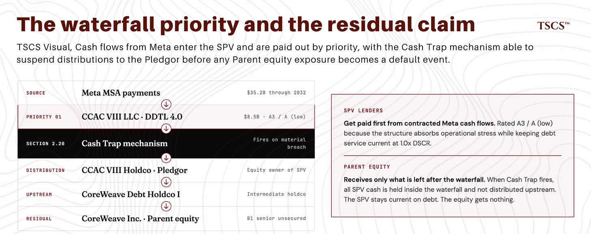](https://substackcdn.com/image/fetch/$s_!hZae!,f_auto,q_auto:good,fl_progressive:steep/https%3A%2F%2Fsubstack-post-media.s3.amazonaws.com%2Fpublic%2Fimages%2F66e9eb41-71c5-40f5-9963-b597657c708a_1846x732.png)

The DBRS rationale is explicit about the operational stress range the structure can absorb. From their public release: “deductions in payment are made for failure to meet availability thresholds that Morningstar DBRS considers to be highly achievable. Similarly, Morningstar DBRS considers the cumulative downtime or outage thresholds required to be met before payment deductions start to be relatively robust. Moreover, once deductions begin, further cumulative downtime or unavailability can be sustained while still being able to achieve a DSCR of 1.0x, providing additional resiliency.” The rated scenario contemplates significant operational stress. In the stressed scenario DBRS modeled, distributions to Parent stop. The SPV stays current on debt. The equity gets nothing.

[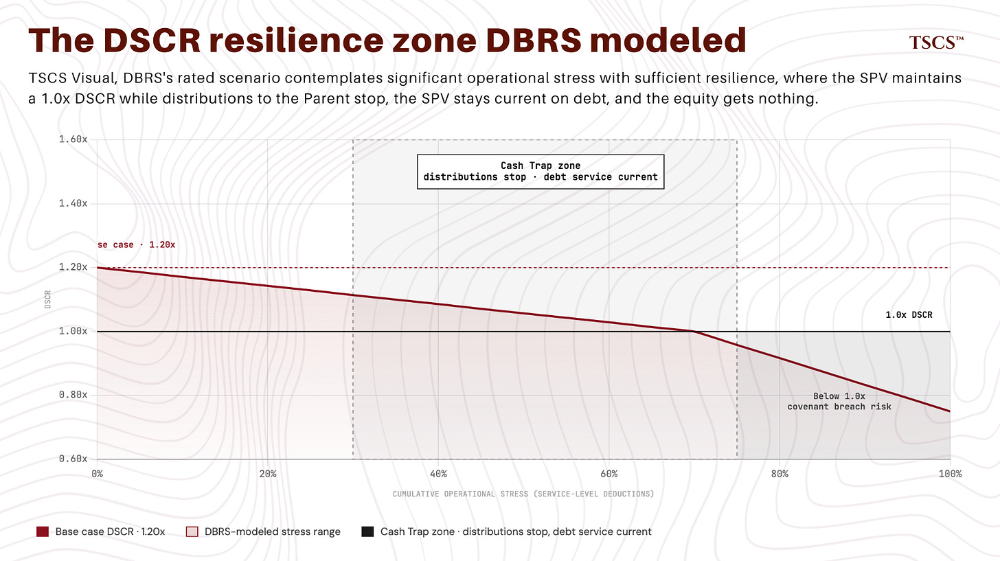](https://substackcdn.com/image/fetch/$s_!lTCV!,f_auto,q_auto:good,fl_progressive:steep/https%3A%2F%2Fsubstack-post-media.s3.amazonaws.com%2Fpublic%2Fimages%2F975cebfa-086a-4082-8edb-ecf669a22fa9_1846x1036.png)

That is the trade. Short Parent unsecured paper as the lead expression, with CRWV equity as a satellite for those who want directional exposure. Do not short DDTL 4.0 paper. The thesis does not require the SPV to deteriorate. It requires the Parent equity claim to deteriorate while the SPV keeps performing. The rating itself is the most bullish thing that has happened to SPV lenders and is structurally bearish for the residual claim above it. Both true. The contract makes them true simultaneously.

Everyone is watching whether the IG rating means GPU-backed debt is institutionally safe. The right question is whether the IG rating, by virtue of how it is constructed, leaves anything for the equity that sits above the ringfence. The answer is in the contract. The contract is publicly filed. The bear case does not require interpretive heroics.

One bull objection. Meta announced the $21 billion expansion on April 9, 2026, bringing total committed spend to $35.2 billion through 2032 (the prior $14.2 billion September 2025 agreement plus the new $21 billion). The reflexive bull read: an A1 customer doubling down on capacity is direct evidence of vendor reliability, weakening any operational stress argument by definition. The bear response is narrower. Meta expanded contracted capacity, not equity confidence in the vendor’s residual cash flow rights. Every dollar of the $21 billion flows through SPV waterfall structures (DDTL 4.0 and any successor SPV sized against the expansion), each containing the same Cash Trap, Distribution Conditions, and cross-acceleration provisions analyzed in Part IV. The expansion makes the SPV stack bigger. It doesn’t change the residual-claim arithmetic for Parent equity. The 7.05% intraday surge on May 4 was follow-on momentum from Citi’s May 1 target raise plus pre-earnings positioning. The expansion was 26 days old by then.

[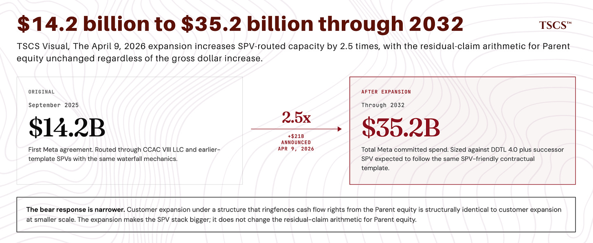](https://substackcdn.com/image/fetch/$s_!VskS!,f_auto,q_auto:good,fl_progressive:steep/https%3A%2F%2Fsubstack-post-media.s3.amazonaws.com%2Fpublic%2Fimages%2F7ea485b6-1155-415a-92f5-a15da6a4284b_1846x758.png)

The Cash Trap fires on material MSA breach. Service-level thresholds defining “material” live in Exhibit H, filed but redacted. The gap’s width isn’t provable from public sources. What is: the gap exists (Cash Trap fires below default), DBRS contemplates operational stress at 1.0x DSCR, and DDTL 3.0 required covenant relief on the same template under the same lenders. The trade is sized for a moderate-not-extreme reading of the gap, with kill switches in Part VII if the rated scenario stays clean.

The trade window is 18 to 30 months. The primary within-window catalyst is the Parent’s $6.708 billion 2026 maturity wall (per 10-K Note 10), which forces capital actions in the second half of 2026 that crystallize the residual-claim erosion: additional 9% plus unsecured issuance, additional convertibles with dilution, or another SPV that further ringfences corporate-recourse cash flow. The binding contractual tests sit toward the back of the window (DDTL 4.0 maintenance DSCR going live June 30, 2027) or at the back edge (DDTL 3.0 first DSCR test October 31, 2027). Five Part VII signals surface earlier indicators across the window. The trade can be right in substance and wrong in timing. The equity satellite specifically can stop out above $187 even if the Cash Trap fires in 2027 as the mechanism predicts; that timing risk is the dominant non-thesis risk. The unsecured lead tracks the contractual stress signature more closely than the equity will.

Five tracked signals and explicit kill switches in Part VII. Two of those signals print within 72 hours of publication: DDTL 5.0 / TLB final pricing on May 6, with commitments due 5 PM ET that day, and CRWV Q1 2026 earnings after market close on May 7. Both are tracked as forward signals in Part VII rather than backward-looking outcomes. The thesis stands on the contract evidence regardless of how those two prints land. Signals update conviction. They don’t gate publication.

Subscribed

## **II. What the Lenders Got Right, Structurally**

The rating is correct. Anyone who tells you the structural insulation is overstated has not read the contract.

The Material Adverse Effect definition lives in Section 1.01 of the credit agreement. Three prongs, conjoined by “or,” with prong (a) explicitly scoped to “Borrower and its Subsidiaries, taken as a whole.” This is the critical scope limitation. Adverse changes at CoreWeave Inc. (Parent), at CoreWeave Debt Holdco I, or at CCAC VIII Holdco (Pledgor) do not trigger MAE here. Parent-level distress at CoreWeave Inc. cascades into MAE only if it impairs the Borrower’s payment ability under prong (b) or contract enforceability under prong (c). Given the Borrower is an SPV whose sole asset is GPU infrastructure leased back to Parent under the MSA, this scope limitation is consequential. Parent could be deteriorating significantly without tripping MAE, provided MSA payments keep flowing. This is project finance drafting, not corporate TLB drafting.

Cross-acceleration sits in Section 7.01(f). The threshold is Material Indebtedness, defined as Indebtedness of any Credit Party or the Pledgor in aggregate principal exceeding $100 million. The trigger has two limbs. The first is failure to pay Material Indebtedness at final stated maturity beyond applicable grace. The second is other default under Material Indebtedness causing the debt to become due, or to be repurchased, prepaid, defeased, or redeemed prior to stated maturity. This is cross-acceleration, not cross-default. The other debt must actually have been accelerated (or an offer to repurchase triggered). A mere covenant breach at another facility, without acceleration, does not trip Section 7.01(f).

Critical scope point. The trigger captures Pledgor and Credit Parties. It does not capture Parent (CoreWeave Inc.). A default at the Parent’s $2.5 billion JPMorgan Revolving Credit Agreement would not trigger an EoD here unless and until it caused some Pledgor or Borrower-level acceleration. Combined with the MAE scoping, this confirms the structural insulation: Parent can default without immediately tripping the SPV facility.

The Limited Guarantee Schedule 1 is the bankruptcy-remote drafting that everyone calls a “bad-boy guaranty.” Five categories of Guaranteed Obligations, narrowly defined. Category (a): actually fraudulent actions by the Guarantor or any of its subsidiary Pledgors with respect to the Loan Documents. Category (b): willful misconduct directly causing material physical damage or material waste to the Project, with the explicit carveout that “in no event shall Guarantor be required to fund equity to the Borrower to prevent such physical damage or material waste.” Category (c): misappropriation of Collateral or proceeds. Category (d): voluntary bankruptcy filing. Category (e): consent to involuntary bankruptcy proceedings.

Non-recourse carveout drafting of the most narrow type. Each category requires affirmative bad acts by the Guarantor or subsidiary Pledgors. Failure to perform doesn’t count. Operational failure under the MSA, GPU install slippage, service-level breaches: none of them are in here. The investor presentation Summary Term Sheet describes Recourse as “Non-recourse to Parent; Parent will provide customary ‘bad-boy’ guarantee covering GPU installation and related performance obligations.” The contract text covers no such thing. There is a documented gap between marketing language and contractual reality.

[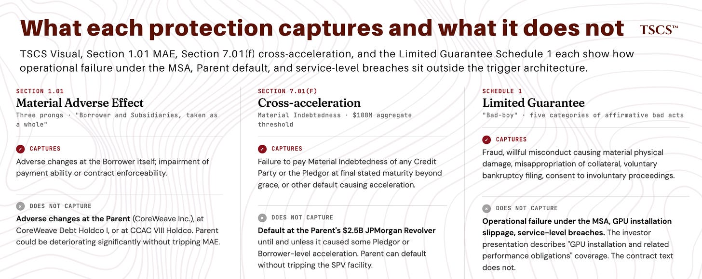](https://substackcdn.com/image/fetch/$s_!ZiGr!,f_auto,q_auto:good,fl_progressive:steep/https%3A%2F%2Fsubstack-post-media.s3.amazonaws.com%2Fpublic%2Fimages%2F6afa8557-d5ac-452d-a840-05342f2d1e49_1842x734.png)

The lenders read the contract. So did Moody’s and DBRS. The marketing-vs-contract gap is a corporate-disclosure issue, relevant to the equity narrative (and supportive of the broader pattern that includes unremediated material weaknesses across two reporting periods and a pending securities class action). It’s a credit-narrative issue, not a credit-mispricing one. The rating reflects what the contract says, not what the slide deck says.

The DBRS rationale is the part that matters most for calibrating the bear case. From the public press release on the A (low) assignment: the rating reflects “sufficient resilience in the operating phase, where availability uptime is the primary operating metric, resulting in a debt service coverage ratio (DSCR) of 1.20 times (x), as well as the assessment of sufficient mitigants to weaknesses in the installation phase and acceptable resilience to financial penalties for service-level breaches.” DBRS modeled operational risk. They did not ignore it. They concluded the structure absorbs it.

The calibration point that sets up everything in Part III. A (low) is the lowest notch within the A-tier of the DBRS scale, four notches above BB (high) and several notches above the IG/HY boundary at BBB (low). Moody’s A3 is the equivalent. If the rating agencies thought operational risk on this structure was negligible, they would have rated it AA or A. They did not. A (low) says operational risk is material. The structure absorbs it. Lenders are protected at that risk level. The bear case argues something narrower: A (low) reflects industry-benchmark calibration of vendor reliability, and CRWV’s track record sits at the stressed end of those benchmarks. Smaller claim. It doesn’t require evidence that isn’t public (the redacted SLO thresholds in Exhibit H of the MSA, comparable hyperscaler vendor reliability benchmarks, audited CRWV uptime history).

The lenders, the rating agencies, and the underlying customer all read the same contract. They priced it correctly given what is in front of them. Anyone arguing the A3 / A (low) rating is structurally unjustified is arguing against the four corners of the document. The bear case is that A (low) reflects an industry-benchmark calibration that, applied to CRWV specifically, sits at the optimistic end of where the public evidence supports.

## **III. Why A (low) Is the Floor of the Band, Not the Center**

DBRS calibrated this rating using industry benchmarks for hyperscaler vendor reliability and project finance operational standards. They had to. CRWV is a newly-public neocloud with a limited public operating history. The 10-K covers fiscal years 2023, 2024, and 2025. The IPO was March 2025. There is not enough firm-specific data to displace industry benchmarks in a rating model. So DBRS used the benchmarks they had and assessed whether the structure absorbs them. They concluded it does, at the bottom of the IG band.

Three pieces of CRWV-specific evidence bear on where CRWV sits within the rating’s calibration band. None of them require the rating to be wrong. One is direct evidence of operational stress at a same-template same-lender SPV. The other two are supporting context for whether the financial covenants are testable as drafted and where the corporate-recourse share of cash flow is heading. Together they suggest A (low) is the high-stress end of where this should sit and incremental operational stress is more probable than the calibration implies.

### **III.A. The DDTL 3.0 December 2025 Amendment**

On December 31, 2025, three months before DDTL 4.0 closed at IG, CoreWeave Compute Acquisition Co. VII (the DDTL 3.0 SPV) entered into a First Amendment to the DDTL 3.0 Credit Agreement. The 8-K filed January 2, 2026 describes the amendment in language that should make any analyst pause: “This amendment to the DDTL 3.0 Credit Agreement aligns the facility for the timing of deliveries described by the Parent on its earnings call reporting financial results for the quarter ended September 30, 2025.”

OpenAI (named in 10-K Exhibit 10.31’s MSA definition) deliveries were behind schedule. The lenders relaxed covenants to accommodate the slippage.

The amendment is not minor. Three substantive changes. First, the minimum liquidity floor for the monthly payment dates ending on and after March 1, 2026 and prior to May 1, 2026 was reduced to $100 million. Second, the initial testing date of the debt service coverage ratio financial covenant was postponed to October 31, 2027. Third, the initial testing date of the contract realization ratio financial covenant was postponed to February 28, 2026. The amendment also permits an unlimited number of equity cures for any failure to satisfy the DSCR and contract realization ratio financial covenants prior to October 28, 2026, with three-out-of-four-month equity cure rights thereafter.

The DSCR test postponement alone moves the first binding cash-flow covenant test out by approximately 22 months. The unlimited equity cure window is an unusual structural feature. Most syndicated facilities cap equity cures from inception (typical: five over the life of the facility, no more than two consecutive). The unlimited window during construction and ramp suggests the lenders anticipated cure-funded covenant breaches and chose to give the borrower runway rather than enforce.

[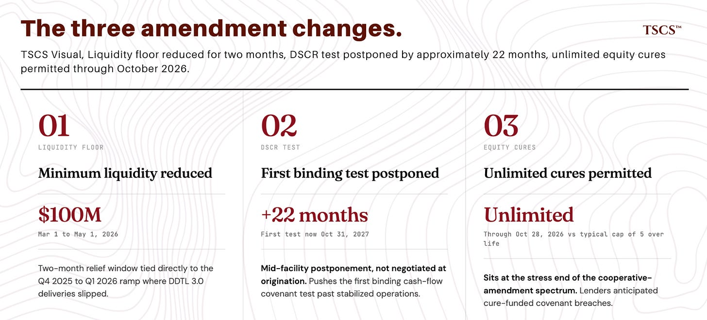](https://substackcdn.com/image/fetch/$s_!mCCO!,f_auto,q_auto:good,fl_progressive:steep/https%3A%2F%2Fsubstack-post-media.s3.amazonaws.com%2Fpublic%2Fimages%2Fde710019-f043-49ab-85fc-400eb6642ebc_1848x838.png)

The lender group is the same as DDTL 4.0. Morgan Stanley and MUFG as joint bookrunners. Goldman Sachs as joint lead arranger. Same template, same bankers, same relationship. They relaxed covenants when delivery slipped at DDTL 3.0. Three months later, they closed DDTL 4.0 at IG. Same operator, same template, same lenders. The DDTL 3.0 amendment is concrete evidence that CRWV’s actual operational track record on a ringfenced SPV requires covenant relief during delivery slippage events.

Per the FY2025 10-K, all obligations under the DDTL Facilities (1.0, 2.0, 2.1, and 3.0) are unconditionally guaranteed by the Parent. DDTL 4.0 is the only DDTL without that guarantee, carrying only the narrow bad-boy guarantee covering specific fraud, willful misconduct, and bankruptcy filings. That makes DDTL 4.0 the structural break-point in CoreWeave’s financing template, and it is the reason DDTL 4.0 could earn investment-grade ratings while every prior DDTL could not. The recourse difference cuts two ways for the calibration argument. DDTL 3.0 lender behavior under stress is an imperfect proxy for DDTL 4.0 lender behavior because DDTL 3.0 lenders had parent recourse as a backstop and DDTL 4.0 lenders do not. At the same time, DDTL 4.0 lenders without parent recourse have less reason to amend cooperatively if stress materializes, because the SPV waterfall is their only recovery path; the Cash Trap is more likely to fire. The operational signal from DDTL 3.0 (delivery slippage at the operator level) survives the recourse caveat and is the load-bearing piece for the calibration argument. The lender-behavior signal weakens. The cash-trap-activation signal strengthens.

[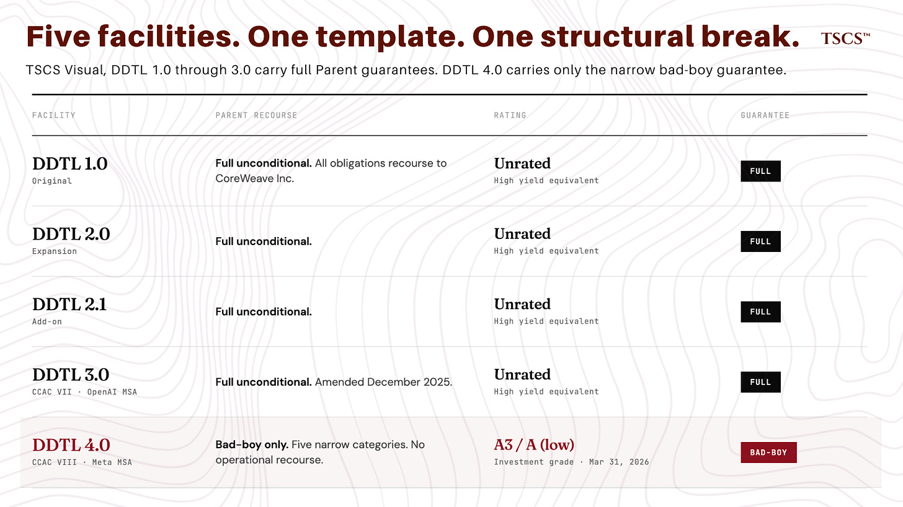](https://substackcdn.com/image/fetch/$s_!2AcA!,f_auto,q_auto:good,fl_progressive:steep/https%3A%2F%2Fsubstack-post-media.s3.amazonaws.com%2Fpublic%2Fimages%2Fa97b9d9a-fe3c-4110-b9f5-2b149dfc3a6e_1846x1038.png)

The bull read. Cooperative covenant relief during construction and ramp is what healthy bank-lending relationships look like in project finance. The DSCR test postponement aligns the first binding test with stabilized operations rather than the bottom of the ramp curve, which is exactly what a borrower and a relationship lender group would negotiate at signing if they could foresee the ramp profile precisely. The 8-K language itself (”aligns the facility for the timing of deliveries”) cuts toward this read rather than away from it. It doesn’t fully neutralize the evidence. The unlimited equity cure window during ramp is more accommodative than typical syndicated facility drafting, and the DSCR test was postponed by approximately 22 months mid-facility rather than negotiated to that horizon at origination. Both features sit toward the stress end of the cooperative-amendment spectrum, even if neither alone is dispositive. The amendment is consistent with both stress and accommodation. The equity cure structure tilts the balance toward stress without establishing it definitively.

DBRS would have known about the DDTL 3.0 amendment when assigning the A (low) rating to DDTL 4.0. The amendment was filed three months earlier and is part of CRWV’s public disclosure record. The rating agency’s response was to assign the rating at the floor of the IG band. That is the right answer for a sponsor with a documented history of needing covenant relief. A (low) doesn’t mean low risk. The bear case requires the amendment plus the rating floor placement plus the broader operational pattern to be jointly more consistent with the operationally stressed end of the calibration band than with the comfortable middle. Joint reading defensible. Single-evidence reading isn’t.

### **III.B. Customer Concentration (Data, Not Operational Stress Evidence)**

10-K Note 1 reports Customer A (Microsoft, per the MD&A’s verbatim 67% of 2025 revenue) at 35% of 2023, 62% of 2024, 67% of 2025. Customer B at 17% / 15% / sub-10%. Customer C at 21% / sub-10% / sub-10%. The 10-K doesn’t disclose whether B and C declined in absolute terms or were proportionally crowded out by Microsoft growth. The trajectory isn’t load-bearing for operational stress; the structural transition implications get picked up in IV.D.

### **III.C. Calibration Synthesis**

DBRS rated DDTL 4.0 at A (low), the floor of investment grade. The rating reflects an industry-benchmark calibration of vendor reliability and operational risk. The DDTL 3.0 First Amendment is direct evidence of operational stress requiring covenant relief on a same-template same-lender SPV; that is the load-bearing piece for the calibration argument. The customer concentration trajectory is supporting context that the 2026 transition is replacing corporate-recourse Microsoft revenue with SPV-pledged Meta and OpenAI revenue, structurally adverse for the residual claim above the SPVs, and not itself direct evidence of operational stress. Together these pieces suggest CRWV sits at the operationally stressed end of the rating’s calibration band, with the DDTL 3.0 amendment doing the dominant work.

[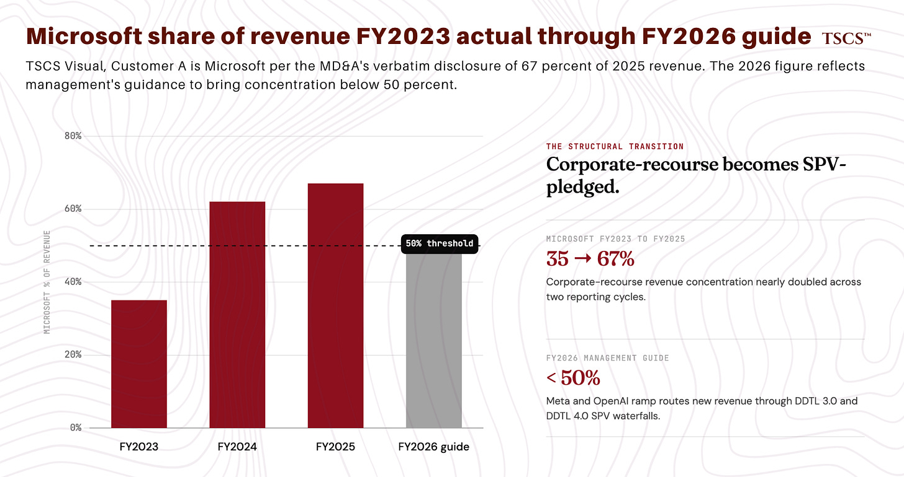](https://substackcdn.com/image/fetch/$s_!_kzQ!,f_auto,q_auto:good,fl_progressive:steep/https%3A%2F%2Fsubstack-post-media.s3.amazonaws.com%2Fpublic%2Fimages%2F0faef463-1f80-4c3c-968c-ee862a676570_1846x976.png)

One additional information event sits within the trade window but is not itself evidence of operational stress: the FY2026 audit cycle will be the first under the full ICFR opinion regime once the newly-public-company exemption falls away. CRWV disclosed three unremediated material weaknesses in internal control over financial reporting in its FY2025 10-K, and any adverse ICFR opinion in the FY2026 10-K filing would be an additional information event independent of the contract dynamics. On base rates, a two-cycle remediation pace is unremarkable. Not central evidence, just a timing flag for an information event that may print within the window.

None of this requires DBRS to be wrong. The bear case does not require “DBRS got the structural analysis wrong.” The bear case requires “A (low) reflects the high-stress end of where this should sit, and incremental operational stress is more probable than the calibration implies.” A smaller, more defensible claim. It does not require arguing with the four corners of the contract or the structural mechanics of the SPV. It requires pointing to publicly disclosed evidence that the operator sits at the worse end of the rating’s calibration range. The bear case requires operational stress to translate into Parent equity dilution. The contractual mechanism that does this is the Cash Trap. Cash Trap activates at thresholds materially below SPV default and within the operational stress zone that A (low) explicitly contemplates.

[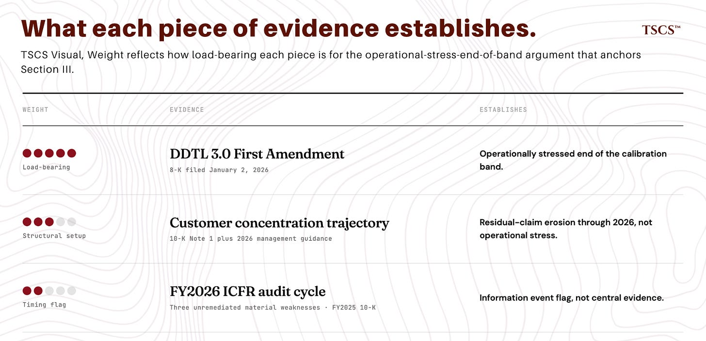](https://substackcdn.com/image/fetch/$s_!o-nE!,f_auto,q_auto:good,fl_progressive:steep/https%3A%2F%2Fsubstack-post-media.s3.amazonaws.com%2Fpublic%2Fimages%2Fed835534-3615-49bb-a053-ed80a5efee14_1848x894.png)

## **IV. The Cash Trap Is the Mechanism**

### **IV.A. How Cash Trap Works**

The DDTL 4.0 credit agreement is a project finance structure dressed in TLB pricing. The cash waterfall lives in Section 2.20 and includes a Cash Trap Event mechanism that fires on a defined list of triggers. The Section 2.20 Cash Trap Event triggers include, verbatim: “(a) a material breach of the Master Services Agreement (including for the avoidance of doubt, all Order Forms (as defined therein) entered into with respect thereto) giving rise to termination rights by [redacted customer party] or the Borrower, in either case, pursuant to Section 11b of the Master Services Agreement; or (b) Parent becomes subject to a Bankruptcy Event.” Two triggers, two distinct protections for SPV lenders. Prong (a) is the operational risk valve that captures sub-default MSA stress. Prong (b) is the Parent bankruptcy ringfence: if CoreWeave Inc. files, the SPV’s cash flow is insulated from the bankruptcy estate. The bear case rests primarily on prong (a). Prong (b) is the second layer of evidence that the structure was specifically engineered to keep the SPV current while the Parent is exposed.

The trigger is material breach. Not actual termination, and not actual default. Material breach gives rise to termination rights under Section 11.b of the MSA, which then requires written notice with a redacted cure period and uncured breach to ripen into actual termination. Cash Trap fires at material breach, before termination. So Cash Trap activates well before Meta exercises any termination right. It captures sub-default operational stress.

When Cash Trap fires, all SPV cash is held inside the waterfall and is not distributed upstream to the Pledgor (CCAC VIII Holdco) and through to the Parent (CoreWeave Inc.). The waterfall priorities are standard for a project finance facility: operating expenses, interest, scheduled principal amortization, sweep accounts, reserve accounts (Liquidity Account at the level set in Section 2.20, with specific reserve sizing not visible in publicly filed exhibits, plus the Power Reserve Account, plus the 95% interest rate hedging requirement post-Commitment Termination Date), and only then distributions to the Pledgor. While Cash Trap is active, distributions to Pledgor stop. The Parent receives nothing from CCAC VIII.

This is the structural feature that makes the rating work. Cash Trap protects SPV lenders by trapping cash inside the waterfall during periods of operational stress, allowing the SPV to absorb the stress without becoming a default event. The DBRS rationale referenced this mechanism implicitly when it noted the structure can sustain “further cumulative downtime or unavailability... while still being able to achieve a DSCR of 1.0x.” The “additional resiliency” DBRS cited is the cash retention inside the SPV waterfall during stress periods.

The Distribution Conditions test in Section 6.06(f) operates as a parallel gate. Restricted Payments (the contractual term for distributions to Pledgor) are conditioned on four cumulative requirements per the Section 1.01 definition: (a) Specified Representations true and correct in all material respects, (b) no Event of Default or Default occurring or continuing, (c) no Cash Shortfall Event occurring and all amounts due under Section 2.08 paid in full, and (d) the Liquidity Requirement and Power Reserve Requirement satisfied. The Section 6.06(f) Projected DSCR threshold of 1.20x sits on top of these four conditions. The cushion between the 1.15x maintenance DSCR (which triggers default if breached) and the 1.20x distribution-gating Projected DSCR is 0.05x of coverage, or 5 percentage points of coverage ratio. Above 1.20x with all four Distribution Conditions satisfied: distributions can flow upstream. Between 1.15x and 1.20x, or with any one of the four conditions unsatisfied: distributions are blocked, but the SPV is not in default. Below 1.15x: covenant breach, equity cure window opens, default if not cured. The 1.15x to 1.20x band combined with the four gating conditions is the operational stress zone where the SPV survives but the Parent is cut off.

[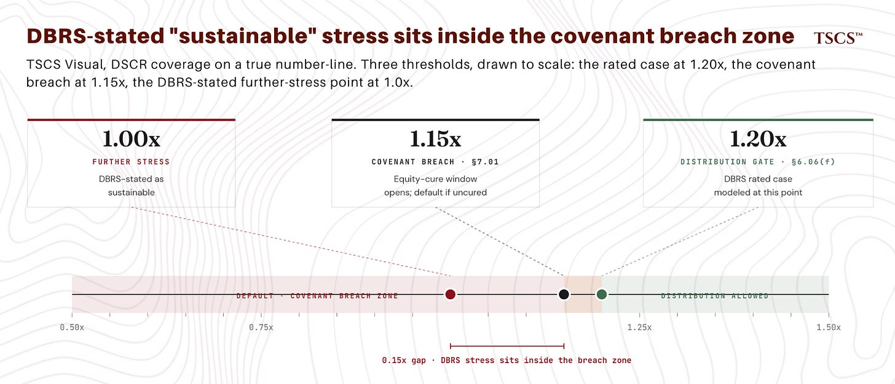](https://substackcdn.com/image/fetch/$s_!-5M9!,f_auto,q_auto:good,fl_progressive:steep/https%3A%2F%2Fsubstack-post-media.s3.amazonaws.com%2Fpublic%2Fimages%2F9e5c6ac2-37b7-4b7b-b996-518cd5cbcf3b_1848x794.png)

The combination of Cash Trap (triggered on material MSA breach or Parent Bankruptcy Event) and Distribution Conditions (triggered on Projected DSCR between 1.15x and 1.20x or any failure of the four cumulative gates) gives the SPV multiple paths to “lenders are fine, Parent gets nothing.” That is the mechanism the rating implicitly relies on for its operational stress absorption. It is also the mechanism that exposes the Parent equity claim to operational stress events that never become SPV defaults.

### **IV.B. The Threshold Gap**

The rating measures probability of SPV default and lender loss. Equity holders should care about probability of Parent cash flow disruption. Different thresholds. The contract makes the gap observable.

The rating models default. The Cash Trap models stress. Stress is much more probable than default and the contract makes both observable. DBRS modeled DSCR at 1.20x with stressed downtime and concluded the structure can sustain further cumulative downtime while achieving 1.0x DSCR. That 1.0x scenario is doubly informative for Parent equity. First, 1.0x sits below the 1.20x distribution-gating threshold under Section 6.06(f), so distributions to Parent stop entirely. Second, 1.0x also sits below the 1.15x maintenance DSCR covenant, which means the equity cure window opens. Equity cures are funded by the Parent. The rated stress scenario therefore describes a state in which the SPV stays current on contractual debt service, distributions stop flowing upstream, and the Parent is expected to inject corporate cash into the SPV to cure the covenant breach and keep the facility from defaulting. The Cash Trap drains Parent cash from one direction; the equity cure obligation drains it from the other. Both are inside the rated scenario. The rating is consistent with a future state in which lenders are made whole, the Parent receives nothing from CCAC VIII for an extended period, and the Parent is also funding the SPV to preserve the rating itself.

That is the rated scenario, stressed. An operational reality the structure was designed to absorb. And the scenario in which Parent equity is most at risk, because the Parent has its own debt service obligations and operating expenses that do not pause when SPV distributions stop.

On Exhibit H. The MSA Service Level Objectives and Support Addendum is filed but redacted. The specific availability thresholds, downtime tolerances, and what constitutes “material” breach for Section 11.b purposes are not public. Meta is a sophisticated A1 customer with a $35.2 billion total commitment, almost certainly with tight SLOs consistent with hyperscaler vendor benchmarks. The bull reading: tight SLOs collapse the gap between Cash Trap firing and DSCR breach to near-zero, leaving Cash Trap as no incremental risk above the maintenance DSCR test. Can’t rule that out from public sources. But the gap survives even if SLOs are tight, and the survival is structural.

The gap survives because Cash Trap and DSCR breach trigger on different metric types with structural lag between them. Cash Trap fires on material breach of the MSA, an operational trigger tied to service-level thresholds in redacted Exhibit H. The DSCR test in Section 6.06(f) and Section 7.01 is a financial trigger, calculated on cash flow performance over a measurement period. The conversion from operational stress to financial impact runs through the MSA’s commercial terms: SLO breaches accumulate as service credits or fee deductions, those flow into reduced revenue recognition, those reduce SPV cash flow, and only after enough accumulate does the cumulative impact reach the DSCR thresholds. That conversion path is what creates the gap. Even with tight SLOs, the operational trigger fires before financial impact propagates through the commercial terms to the DSCR measurement. Cash Trap activates and distributions stop while DSCR remains above its threshold. By the time DSCR eventually breaches, multiple distribution-stoppage periods may have already cut Parent off from upstream cash, with the Parent’s residual claim impaired without the SPV ever tripping a covenant.

[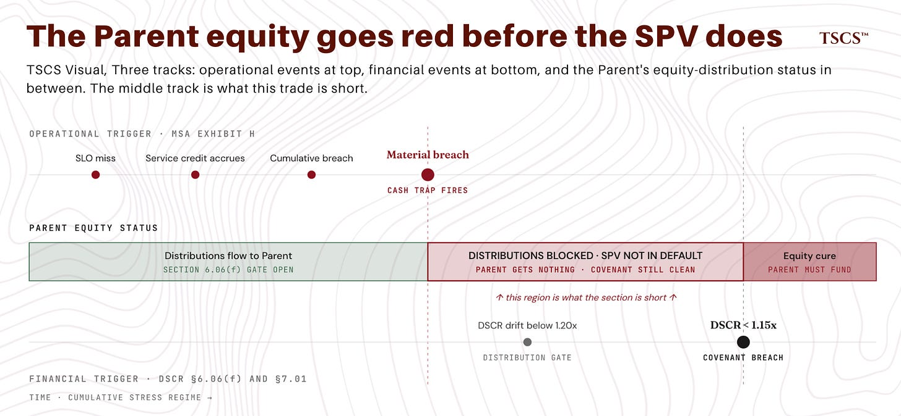](https://substackcdn.com/image/fetch/$s_!tZyz!,f_auto,q_auto:good,fl_progressive:steep/https%3A%2F%2Fsubstack-post-media.s3.amazonaws.com%2Fpublic%2Fimages%2F9738a0ce-3ca5-4013-aba0-646497c3d4dd_1848x856.png)

That structural gap is also where CRWV’s specific operational track record becomes load-bearing. The DDTL 3.0 First Amendment evidences this regime: same operator, same template, same lender group, covenant accommodation already required once. Tight SLOs from Meta don’t eliminate operational stress probability. They shift the stress signature toward more frequent material-breach events at lower per-event severity, the regime where the Cash Trap’s operational trigger fires most readily while the DSCR’s period-integrated test is slowest to register. The DBRS rationale’s reference to “further cumulative downtime or unavailability... while still being able to achieve a DSCR of 1.0x” describes precisely this regime.

The gap exists. Its width per event may be narrow if SLOs are tight; across the cumulative-stress regime DBRS rated, the structural lag between operational and financial trigger makes it wider.

The rating prices what SPV lenders care about. The Cash Trap prices what Parent equity holders should care about. The trade is short the gap.

### **IV.C. The Parent Debt Stack After April 2026 Issuance**

The 10-K Note 10 schedule shows total Parent principal as of December 31, 2025 at $21.615 billion. The composition matters. DDTL 1.0 ($1,553M, March 2028 maturity, 15% all-in). DDTL 2.0 ($5,037M, August 2030, 10%). DDTL 2.1 ($2,741M, December 2030, 9%). DDTL 3.0 ($340M drawn, August 2030, 9%). The 2030 Senior Notes ($2,000M, June 2030, 9.25% coupon). The 2031 Senior Notes ($1,750M, February 2031, 9.00% coupon). The 2031 Convertible ($2,588M, December 2031, 1.75% coupon). The Convertible Promissory ($168M, April 2026, 7%). The JPMorgan Revolving Credit ($1,000M drawn of $2.5B capacity, November 2029, 6%). The OEM and Software License Financing ($4,165M, March 2026 to July 2030, 10%). The Magnetar Loan ($273M, January 2029, 12%).

[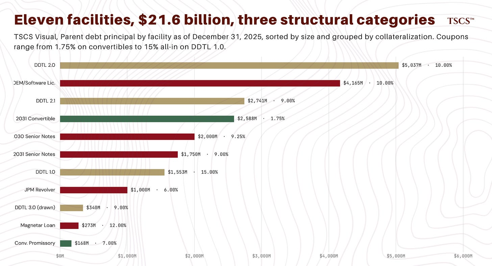](https://substackcdn.com/image/fetch/$s_!F85E!,f_auto,q_auto:good,fl_progressive:steep/https%3A%2F%2Fsubstack-post-media.s3.amazonaws.com%2Fpublic%2Fimages%2F40a253f7-19f4-4a88-b655-3fa561f14886_1846x1000.png)

Future principal payment schedule per Note 10. 2026: $6.708 billion. 2027: $4.298 billion. 2028: $2.393 billion. 2029: $1.769 billion. 2030: $2.109 billion. Thereafter: $4.338 billion.

[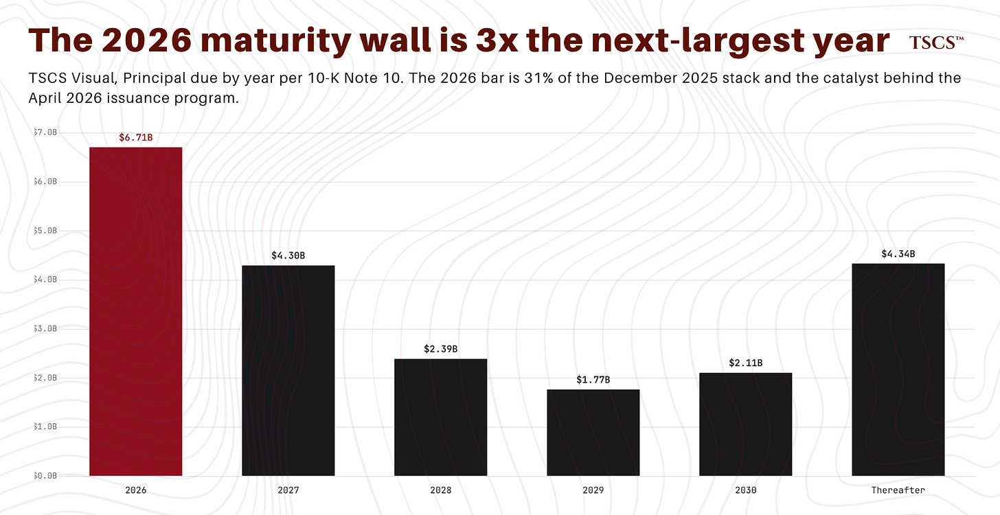](https://substackcdn.com/image/fetch/$s_!dTG1!,f_auto,q_auto:good,fl_progressive:steep/https%3A%2F%2Fsubstack-post-media.s3.amazonaws.com%2Fpublic%2Fimages%2Fa5b720b3-bd81-4b5d-b081-64ab6ac380e0_1846x952.png)

That schedule does not include events after the December 31, 2025 balance sheet date. The 10-K Subsequent Events note (Note 16) flags January 2026 NVIDIA $2 billion equity at $87.20 per share, January 2026 $1.5 billion additional OEM financing on three-year terms, and January-February 2026 $8.8 billion of additional lease commitments. The 8-K on March 31, 2026 added $8.5 billion of DDTL 4.0. April 2026 added two further unsecured Parent issuances: $2.75 billion of 9.75% Senior Notes due October 2031, and $4 billion of 1.75% convertible Senior Notes due October 2032. Per Pitchbook, the 2031 notes were earmarked for general corporate purposes including debt repayment.

Morgan Stanley reportedly forecasts growth to approximately $46 billion in 2026 and $92 billion by 2028. Even if those numbers are directionally correct rather than precisely accurate, the Parent debt stack continues to grow even as the SPV ringfence tightens.

Pro-forma the Parent debt stack post-April 2026 issuance and DDTL 4.0 closing: the December 31, 2025 starting principal of $21.615 billion plus DDTL 4.0 ($8.5 billion), the April 14 9.75% Senior Notes ($2.75 billion across both tranches), and the April 1.75% convertibles ($4 billion) brings the gross stack to approximately $36.865 billion before any partial refinancing of the 2026 maturity wall using April proceeds. Per Pitchbook, the 2031 9.75% notes were earmarked for general corporate purposes including debt repayment, so a portion of that principal likely retires earlier-vintage debt rather than adding net leverage. The exact net change is not disclosed; the gross addition is. The pro-forma above excludes the $1.5 billion of January 2026 OEM financing (debt-like, not classified) and the $8.8 billion of January-February 2026 lease commitments (classification-dependent on whether operating or financing under ASC 842). Including OEM brings the gross stack to approximately $38.4 billion; including both brings it to approximately $47.2 billion. Both the bottom-up pro-forma and the Morgan Stanley sell-side forecast aggregate roughly the same set of disclosed obligations, so the convergence at approximately $46-47 billion does not constitute independent corroboration. It is two arithmetic exercises landing in the same place because they aggregate the same line items. The number is best read as a consistency check on whether the pro-forma is missing anything material rather than as confirmation of the underlying trajectory.

[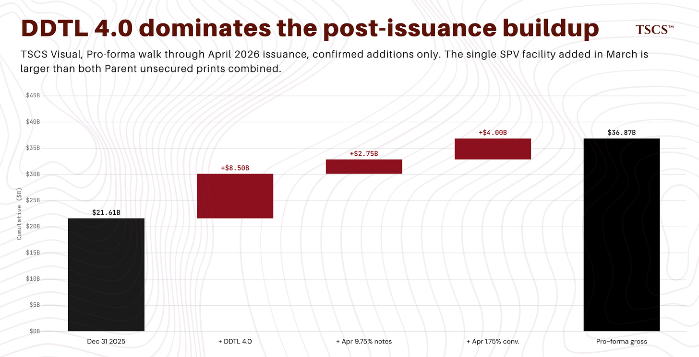](https://substackcdn.com/image/fetch/$s_!EsLX!,f_auto,q_auto:good,fl_progressive:steep/https%3A%2F%2Fsubstack-post-media.s3.amazonaws.com%2Fpublic%2Fimages%2F567ede34-60db-4401-83ae-1a2a2378b98c_1848x946.png)

The April 2026 9.75% Senior Notes pricing is the diagnostic data point. The 385 basis point gap between IG-rated structurally-insulated SPV paper and B1-rated Parent unsecured is approximately what the structural mechanics predict ex ante; the level of the gap is not by itself diagnostic. Diagnostic: the absolute Parent unsecured coupon level, set against the full mix of capital market actions priced into the same window: the IG rating on DDTL 4.0 priced in alongside the expanded Parent leverage as of the April 14 print (the $8.5 billion DDTL 4.0 itself, the $8.8 billion of additional lease commitments in January and February 2026, the $1.5 billion of additional OEM financing in January), the NVIDIA $2 billion equity injection at $87.20 per share priced in alongside the dilution that injection implied, and the December 2031 convertible at 1.75% already in the stack as evidence the convertible market had reopened to CRWV before this issuance. 9.75% is the stated coupon and the marginal cost on the initial $1.75 billion tranche on April 14, 2026, with that net mix priced in. The April 21 $1 billion tap cleared at 102.000% of par, implying yield to maturity on the tap of approximately 9.30%; the underlying coupon was unchanged. With the IG rating and every other capital market action of the prior six months in the price, the marginal Parent unsecured cost still cleared at 9.75%. Whatever the generic B1 industrial benchmark sits at on the issue date, that absolute level is consistent with a market that prices CRWV’s Parent unsecured on the customer-credit-clean read described in Part V, not on a halo effect from the IG SPV. Per the ICE BofA Single-B US High Yield Index, comparable B-rated paper traded at an effective yield of 7.31% in April 2026 with an option-adjusted spread of 334 basis points. The CRWV 9.75% Senior Notes priced approximately 244 basis points wide of that benchmark on April 14, 2026. The non-transmission claim does not depend on the magnitude of that gap, but the gap is consistent with a market that prices CRWV’s Parent unsecured idiosyncratically wide of generic B paper. The absolute level alone is sufficient for the non-transmission claim: the IG rating on DDTL 4.0 did not transmit through to Parent unsecured cost, and the residual-claim dynamics are why it didn’t.

Recent OAS per Bloomberg of approximately 528 basis points on the cash bonds is consistent with a market that has not tightened the Parent unsecured complex meaningfully post the IG SPV print.

[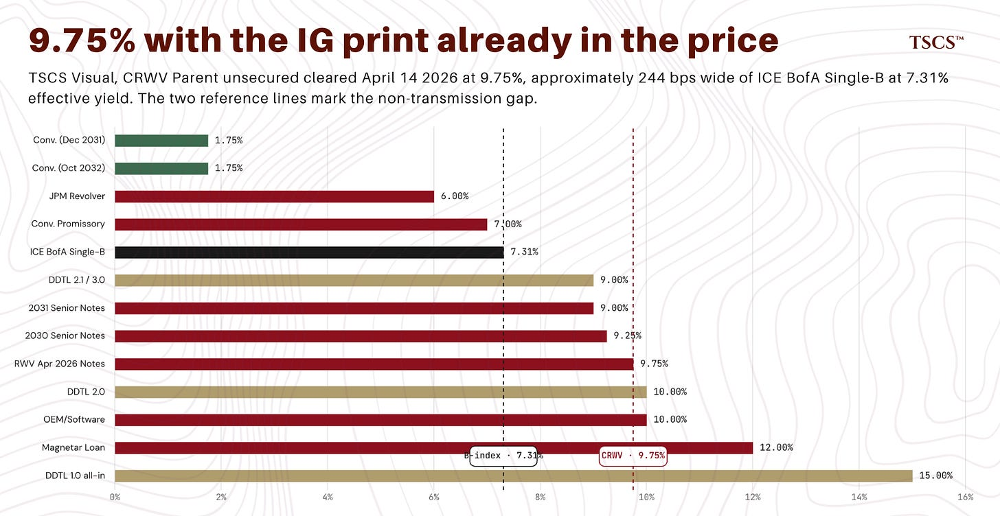](https://substackcdn.com/image/fetch/$s_!1yDm!,f_auto,q_auto:good,fl_progressive:steep/https%3A%2F%2Fsubstack-post-media.s3.amazonaws.com%2Fpublic%2Fimages%2F5bdafa61-a3aa-4c06-a5f3-260aa2998041_1846x954.png)

The 2026 maturity wall of $6.708 billion is the catalyst. Refinancing that wall at the running market rate (10% for unsecured, 5.9% for SPV-pledged, blended depending on collateralization mix) adds meaningful interest expense. Refinancing it via additional convertibles risks dilution at any share price below current. Refinancing it via additional SPVs requires more SPV-eligible contracted cash flow, which CRWV has but only by allocating it away from corporate-recourse status. Each path has a cost and the equity holder absorbs that cost.

The convertible path is the only refinancing avenue that prices below the SPV-pledged cost of capital. The December 2031 convertible at 1.75% and the April 2026 issuance at 1.75% sit in the stack at coupons unreachable by any other instrument the Parent can issue. The economics: the option premium is funded by equity holders via dilution at conversion. Assume the April 2026 $4 billion convertible at 1.75% has a conversion premium of approximately 25-30% to the at-issuance reference price (typical for high-conviction-growth tech convertibles in this market), which would put the conversion strike around $135-$145 against the early-April reference. At full conversion, the $4 billion principal converts into approximately 28-30 million shares against a current diluted share count of roughly 510 million, or approximately 5.5-6% potential dilution from this single tranche. Stack three further convertible cycles of similar size to refinance the 2026 maturity wall and forward maturities through 2028, and cumulative potential dilution from the convertible channel alone reaches the high teens to low twenties as a percentage of current diluted share count, before any conversion premium adjustment from share-price weakness during the cycle. The actual realized dilution depends on whether the convertibles end up in the money at maturity, the cadence of issuance, and the conversion premium discipline of subsequent issuances. Cheap in coupon. Not free in equity-claim-erosion. At sufficient cadence the cumulative dilution becomes meaningful relative to the residual claim. It is one of three refinancing channels by which the equity claim is compressed, and the cheapest in coupon terms.

### **IV.D. The Customer Concentration Math**

Each customer is increasingly partitioned into its own SPV. Microsoft (67% of 2025 revenue) flows through facilities whose collateralization status the 10-K does not disclose. The Meta MSA flows through DDTL 4.0 SPV exclusively. The OpenAI MSA flows through DDTL 3.0 (CCAC VII) and is expected to flow through DDTL 5.0 (CoreWeave Financing DDTL V LLC) on closing.

Management has guided Microsoft concentration to decline below 50% as the OpenAI and Meta contracts ramp through 2026. From the corporate-credit perspective, that diversification is structurally adverse. Microsoft revenue (currently corporate-recourse at the Parent level) is being replaced by Meta and OpenAI revenue (SPV-pledged through CCAC VIII and CCAC VII / DDTL V respectively).

The headline customer concentration improves; the proportion of cash flow available to the Parent without going through an SPV waterfall declines. There is one consequential uncertainty unresolved from public sources: the 10-K does not disaggregate which DDTL facility is collateralized by which customer’s cash flow stream. If Microsoft contracts are already pledged through DDTL 1.0, 2.0, or 2.1, the corporate-recourse share of revenue is materially lower today than the implicit baseline of 67%, and the 2026 transition compresses an already-narrow corporate-recourse base rather than displacing a wide one. The first reading is structurally adverse; the second is significantly more so. Public disclosure doesn’t say which. Either reading supports the broader thesis that the Parent’s residual claim is being compressed; the magnitude differs by a factor that public disclosure does not bound.

CRWV in 2025 was a corporate cloud business with one big anchor customer (Microsoft) and a growing book of secondary contracts. CRWV in 2026 is becoming a financing platform with multiple customer-specific SPV stacks (Microsoft via earlier facilities, Meta via DDTL 4.0, OpenAI and Cohere via DDTL 3.0 and DDTL 5.0) and a Parent corporate function that holds the unsecured leverage and the equity residual. Each new SPV that closes at IG terms reduces the corporate-recourse share of total revenue.

What this means for the equity holder: the Parent equity is a residual claim on a financing platform whose SPV-by-SPV cash flow streams are increasingly ringfenced through waterfall structures with Cash Trap mechanisms and Distribution Conditions tests. The Parent retains: the spread between MSA gross cash flow and DDTL debt service plus opex (the sponsor margin), the residual claim on each SPV after debt service, the terminal value of GPU collateral at maturity, and the corporate functions. The first item is gated by the Distribution Conditions test in each credit agreement. The second is contingent and back-ended. The third is depreciating. The fourth requires capital to scale, and that capital is increasingly expensive at the Parent level.

The Parent equity sits above a growing stack of SPV claims, with a debt service profile that requires upstream distributions, and a Cash Trap mechanism that demonstrably activates below SPV default thresholds. None of this requires the rating to be wrong.

## **V. The DDTL 5.0 Launch Confirms the Customer-Credit Passthrough**

DDTL 5.0/TLB launched the week of April 27, 2026, with commitments due 5 PM ET on May 6. Per Pitchbook reporting on the deal launch: $3.1 billion, 5.5-year maturity, SOFR plus 500 basis points with a 0.00% floor, OID of 99 implying a yield to maturity of 9.21%. Maintenance DSCR covenant of 1.35x. Liquidity reserve equal to one month of principal plus three months of interest. Non-callable for one year, followed by hard calls of 102 in year two and 101 in year three, fully callable at par thereafter. Borrower is “CoreWeave Financing DDTL V, LLC.” Customers: OpenAI and Cohere, both unrated. Fitch assigned an indicative BB+ in the launch materials. Lead arrangers Morgan Stanley and MUFG, the same group that closed DDTL 4.0 twenty-eight days earlier. The price talk and indicative rating are sufficient to make the customer-credit-passthrough point even before the final print clears, because the launch terms are themselves the lender group’s pricing of OpenAI and Cohere as customer credits, and the wide gap to DDTL 4.0 is observable at launch.

The comparison.

DDTL 4.0 (March 31, 2026): A3 from Moody’s, A (low) from DBRS. $8.5 billion. SOFR plus 225 basis points floating, ~5.9% fixed. Six-year tenor. 1.15x maintenance DSCR / 1.20x distribution-gating Projected DSCR. Customer: Meta Platforms (Moody’s A1).

DDTL 5.0 (launched April 27, commitments due May 6, 2026): BB+ indicative from Fitch. $3.1 billion. Price talk SOFR plus 500 basis points, OID 99, yield to maturity of 9.21%. 5.5-year tenor. 1.35x maintenance DSCR. Customers: OpenAI and Cohere (both unrated).

[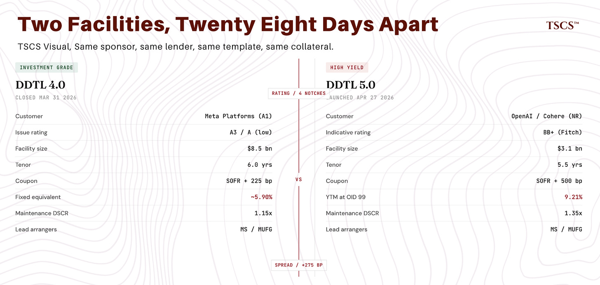](https://substackcdn.com/image/fetch/$s_!uABE!,f_auto,q_auto:good,fl_progressive:steep/https%3A%2F%2Fsubstack-post-media.s3.amazonaws.com%2Fpublic%2Fimages%2Fceca5b42-a843-4481-a1ae-212eb1df194a_1846x880.png)

Same sponsor, same structural template, same lender group. Twenty-eight days apart. Three candidate explanations for the 275 basis point spread differential and the four-notch rating differential. First, structural deltas: DDTL 5.0 has a 1.35x maintenance DSCR versus DDTL 4.0’s 1.15x, and an additional liquidity reserve. These tighter protections do not, on their own, justify a wider rating; they would normally compress it. They could, however, signal that the lender group sized DDTL 5.0’s structural cushion to absorb higher operational stress probability or higher cash flow volatility, which would imply the structural deltas are themselves a partial expression of customer-credit concerns. Second, execution risk: same operator, same template. Third, collateral: NVIDIA GPUs in both cases. The largest single varying input is customer credit (A1 Meta versus unrated OpenAI and Cohere). A reasonable bull bound on the structural-delta contribution: the move from 1.15x to 1.35x maintenance DSCR plus the additional liquidity reserve is worth at minimum one notch of rating differential and on the order of 75-100 basis points of spread. Actual rating-notch impact depends on cash flow volatility assumptions, debt sizing, refinancing risk, and reserve adequacy. None of that is public for either facility. Different rating agency methodologies could produce somewhat tighter or wider bounds. The estimate is anchored in typical project finance practice rather than a calibrated methodology source. That accounts for perhaps a third to half of the 275 basis point spread differential and one of the four notches of rating differential. The remaining majority share, including the residual three notches of rating differential, is attributable to customer credit. The non-transmission claim does not require customer credit to explain the entire gap; it requires customer credit to explain a sufficient share that the SPV rating is materially conditional on the underlying obligor rather than on CRWV’s structural position. The empirical observation supports the non-transmission claim; it does not isolate customer credit as the sole driver.

[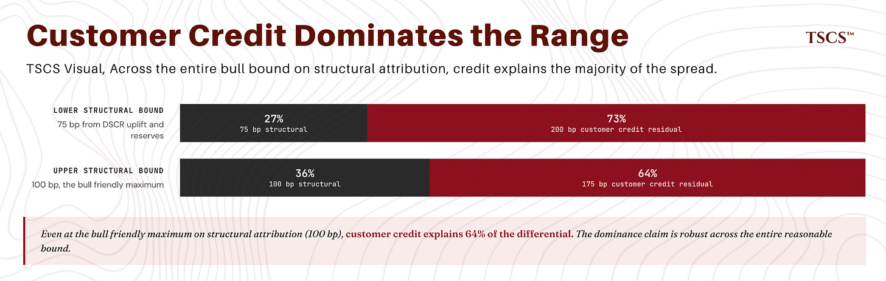](https://substackcdn.com/image/fetch/$s_!l1YU!,f_auto,q_auto:good,fl_progressive:steep/https%3A%2F%2Fsubstack-post-media.s3.amazonaws.com%2Fpublic%2Fimages%2F162184d0-5d64-4153-a9ae-ffc62fff530d_1848x588.png)

The mechanism is straightforward project finance arithmetic. SPV debt service capacity is set by the contracted MSA cash flow stream, which is a derivative of the customer’s willingness and ability to pay. An A1 customer’s take-or-pay produces a different cash flow stream from an unrated customer’s, even when the wrapping structural protections (cash trap, waterfall priorities, DSCR maintenance, reserves) are identical. The structural protections set the floor on customer-credit transmission; customer credit sets the ceiling. The customer credit channel is the dominant residual after the structural-delta bound is acknowledged.

[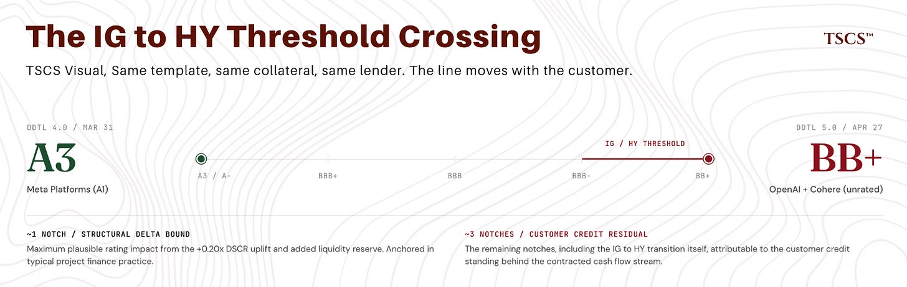](https://substackcdn.com/image/fetch/$s_!WTqL!,f_auto,q_auto:good,fl_progressive:steep/https%3A%2F%2Fsubstack-post-media.s3.amazonaws.com%2Fpublic%2Fimages%2F3e8bcd73-1303-4273-b826-0c55a85b6840_1848x586.png)

A bull objection here is that the customer-credit channel is asserted without exact notching. Correct. The precise notching from underlying obligor to SPV rating depends on rating agency methodology calibrations (DSCR cushion, debt sizing relative to contracted cash flow, refinancing risk if any, reserve adequacy) that are not public for either facility. The defensible part: the empirical observation: the same operator, the same template, the same lender group, the same collateral, the same twenty-eight day window, with materially different ratings and pricing whose only varying input is the customer credit standing behind the contracted cash flow. That observation is sufficient for the non-transmission claim. The IG rating on DDTL 4.0 reflects Meta’s credit transmitted through structural protections. It doesn’t reflect CRWV’s credit being upgraded by them.

[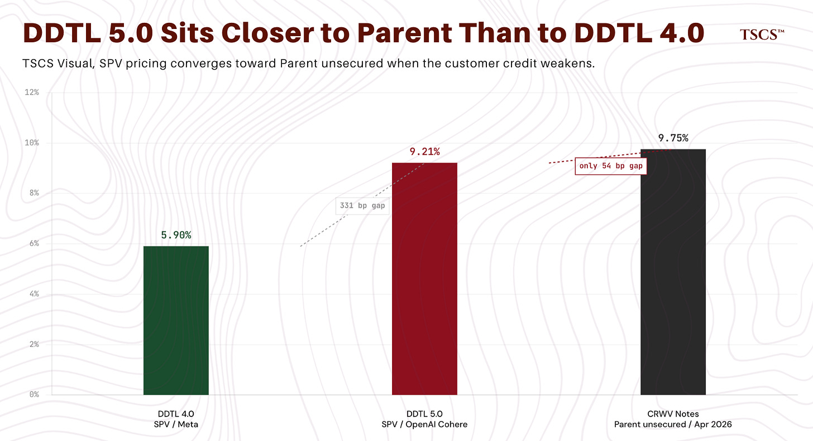](https://substackcdn.com/image/fetch/$s_!9VKZ!,f_auto,q_auto:good,fl_progressive:steep/https%3A%2F%2Fsubstack-post-media.s3.amazonaws.com%2Fpublic%2Fimages%2Fafa09c3c-f327-4d8e-be32-b992d03e4b52_1842x1002.png)

Sell-side analysts reading the DDTL 4.0 IG rating as bullish equity validation for CRWV are conflating SPV credit (which is essentially Meta credit minus structuring premium) with corporate credit (which is what the equity claims sit on). Different things. The market priced them differently twenty-eight days apart at launch. The April 2026 Parent unsecured print at 9.75% expressed the dynamic at the Parent level. The DDTL 5.0 launch terms express it at the SPV level.

[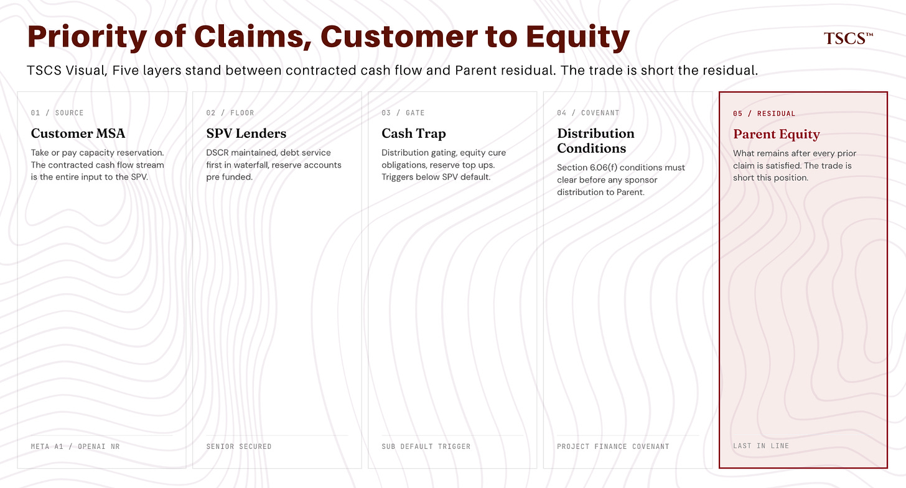](https://substackcdn.com/image/fetch/$s_!Zuxa!,f_auto,q_auto:good,fl_progressive:steep/https%3A%2F%2Fsubstack-post-media.s3.amazonaws.com%2Fpublic%2Fimages%2F27bc61ed-ccfb-4a97-9e6e-8f9685157b2c_1848x998.png)

The structural critique applied to capex-heavy sectors (IPPs, midstream, aircraft leasing) is long-standing. The contribution here is the empirical confirmation twenty-eight days later: same sponsor, same lender group, same template, same collateral, different ratings, with customer credit as the only varying input. Not in project finance literature. In the May 2026 syndicated loan market.

That is the wedge. The structural argument is well-established; the empirical confirmation, on this template, in this window, is the contribution.

Per Pitchbook, approximately $6 billion of orders were already in the books at launch against the $3.1 billion deal size. Demand for GPU-backed structured paper at the BB level remains strong at the launch terms, even at SOFR plus 500. The market isn’t rejecting CRWV’s financing template. It prices each SPV on its own customer credit. Exactly what the bear case requires.

## **VI. What the Bear Case Doesn’t Need**

Four things the bear case does not need. The rating does not need to be structurally wrong; A (low) is correct given the contract. The bad-boy guaranty marketing-vs-contract gap is a corporate-disclosure issue (relevant to the equity narrative alongside the unremediated material weaknesses and the pending Masaitis securities class action filed January 12, 2026 in DNJ with Smith and Roy derivative actions following on February 10), and it is a credit-narrative issue rather than a credit-mispricing issue. GPU collateral does not need to crash; DDTL 4.0 amortizes from MSA cash flows and per the DBRS release fully amortizes by maturity with no refinancing risk. Meta does not need to walk; Meta’s incentive to invoke Section 11.b for-cause termination is bounded by the refund-of-prepaid-fees remedy structure under Section 11.c, and the bear case requires sub-default operational stress sufficient to fire the Cash Trap, which is well short of termination.

Six things the bear case does need, all documented. The financing template works (confirmed: A3 / A (low) on DDTL 4.0). It works by ringfencing cash flows away from Parent (confirmed: Section 1.01 MAE scope, Section 7.01(f) cross-acceleration scope, Section 2.20 Cash Trap, Section 6.06(f) Distribution Conditions). The Parent’s own cost of capital does not improve (confirmed: April 2026 9.75% Senior Notes against DDTL 4.0 at 5.9% fixed, a 385 basis point gap). The Parent’s leverage continues to grow (confirmed: $8.8 billion additional lease commitments in January and February 2026; $8.5 billion DDTL 4.0 in March; $2.75 billion 9.75% notes plus $4 billion 1.75% convertibles in April). The Cash Trap is real and triggerable below SPV default (confirmed: contract structure as analyzed in Part IV). CRWV-specific operational track record sits at the worse end of industry-benchmark assumptions. The dominant evidence is the DDTL 3.0 First Amendment as analyzed in Part III.A. The unremediated material weaknesses across two reporting periods are timing-relevant rather than central, given the FY2026 audit cycle falls within the trade window. The structural transition of corporate-recourse Microsoft revenue toward SPV-pledged Meta and OpenAI revenue is structural-transition evidence per Part IV.D rather than operational stress evidence; it bears on the residual claim being compressed, and it does not establish operational stress on its own.

The bear case is CRWV-specific. The trade should not be paired with broader neocloud shorts. CRWV is the cleaner short within neocloud for three reasons, based on public disclosure as of the publication date. First, CRWV is furthest along the SPV-partition curve. The DDTL series (1.0 through 5.0) has already partitioned multiple customer cash flow streams into separate SPVs: Microsoft via earlier facilities, Meta via DDTL 4.0, OpenAI via DDTL 3.0 and DDTL 5.0. Nebius and Crusoe have not yet built out comparable SPV stacks at the same scale; their financing structures remain closer to corporate-recourse balance-sheet leverage. The customer-credit-passthrough mechanism that the DDTL 5.0 vs DDTL 4.0 wedge demonstrates relies on a multi-SPV partition; that partition is more developed at CRWV than at peers. Second, on public disclosure, CRWV is the only neocloud with documented operational stress at a same-template same-lender SPV. The DDTL 3.0 First Amendment from December 31, 2025 is direct, dated, public evidence that this lender group has already accommodated this operator on this template. Nebius and Crusoe do not have comparable public amendment records as far as can be identified. Third, CRWV has the most aggressive Parent unsecured issuance pace among the public neocloud peers, with the April 2026 9.75% Senior Notes (B1) priced into a Parent debt stack approaching $36 billion gross before lease commitments. The 2026 maturity wall of $6.708 billion forces capital actions inside the trade window in a way that does not apply to peers with smaller Parent stacks or more recent issuance with longer maturity profiles. The structural critique applies at the sector level. CRWV is where it meets the most documented operational stress signature, which makes it the cleanest single-name expression.

The bull case: SPV financing reduces blended cost of capital on contracted cash flow, expanding CRWV’s effective capacity at terms the Parent can’t access on its own balance sheet. The 385 bps gap between DDTL 4.0 at 5.9% fixed and Parent unsecured at 9.75% is real sponsor arithmetic, and a bull reads that gap as accruing to equity. The gap is real. The question is who captures it. Meta first, via contracted price embedded in the MSA. SPV lenders second, via the IG-rated debt service stream. Parent equity third, as residual after Cash Trap, Distribution Conditions, waterfall priorities, and any equity cure obligations under DDTL 4.0 and DDTL 3.0. Bull reads gross arithmetic. Bear reads residual after every contractual claim is paid in priority. Both arithmetically correct. The trade is short the residual.

The volume argument: CRWV grows into the equity by stacking more SPVs, with cumulative sponsor margin across many SPVs offsetting residual-claim compression at any single one. Three problems. Sponsor margin per SPV is compressing, DDTL 5.0 priced 275 bps wider than DDTL 4.0 twenty-eight days apart (Part V), so the SPV’s spread between contracted MSA cash flow and SPV debt service is narrower for unrated customers than for A1 Meta. The marginal customer adds less sponsor margin than the inframarginal one. Each additional SPV further reduces the corporate-recourse share of cash flow available to the Parent without traversing an SPV waterfall (Part IV.D). The volume that adds platform sponsor margin subtracts from the corporate-recourse base, which is what the Parent equity has the most direct claim on. CapEx funding the SPV stack growth comes from Parent capital, increasingly expensive (9.75% on the most recent unsecured) or dilutive (1.75% convertibles with 5-6% dilution per cycle, Part IV.C). Volume doesn’t save the residual claim. It shifts where the residual is being compressed from.

## **VII. Falsifiability Architecture**

Five tracked signals. Likelihood ranges anchored in observable starting conditions. Reasonable readers can disagree with the magnitudes; the signals themselves are testable.

[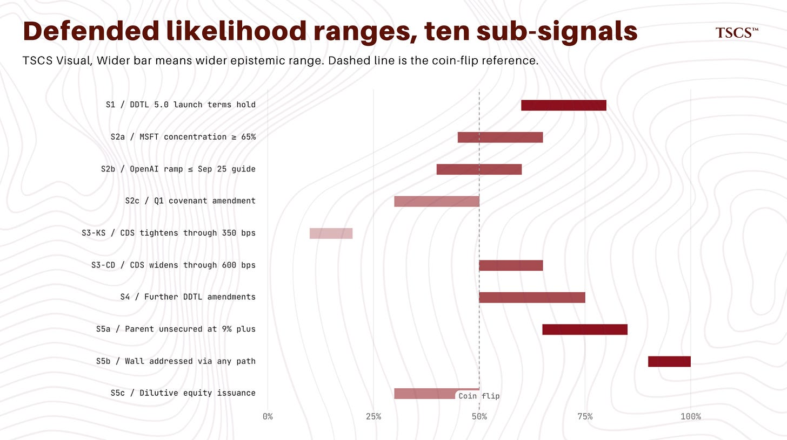](https://substackcdn.com/image/fetch/$s_!goes!,f_auto,q_auto:good,fl_progressive:steep/https%3A%2F%2Fsubstack-post-media.s3.amazonaws.com%2Fpublic%2Fimages%2Fb3c36b61-5d99-4c4b-89c9-538c75b305a1_1846x1034.png)

**Signal 1: DDTL 5.0 Final Pricing.** Commitments due 5 PM ET May 6, 2026, the day after publication. Bear strengthens on clearance at or near launch terms (SOFR plus 500, OID 99, YTM 9.21%, 1.35x DSCR maintenance, BB+ from Fitch) and the deal clears. Tightening 50+ bps from launch terms or a rating upgrade above BB+ weakens the customer-credit-passthrough thesis modestly. A pulled or repriced deal weakens the broader template-scales-on-customer-credit argument. 60-80% probability of clearance at launch terms, with $6B of orders in the book at launch against the $3.1B deal size.

**Signal 2: CRWV Q1 2026 Earnings.** Prints May 7, 2026, after market close, two days after publication. Consensus expects Q1 revenue of approximately $1.97 billion (more than 100% YoY) and a loss per share of approximately $0.91. Company Q1 guidance: revenue $1.9-2.0 billion, adjusted operating income $0-40 million, CapEx $6-7 billion, interest expense $510-590 million. Options market implies an approximately 18.71% move in either direction post-print. Bear strengthens on any of: Microsoft concentration unchanged or improving as a share of total revenue (suggesting the new SPV-pledged customer ramp is not displacing corporate-recourse Microsoft revenue); OpenAI ramp lagging the September 30, 2025 guidance referenced in the DDTL 3.0 Amendment; Parent debt materially higher than the pro-forma estimate in Part IV.C; or any 8-K or 10-Q disclosure of further covenant amendment activity at any DDTL within Q1.

45-65% Microsoft concentration sits at or above 65% in Q1, anchored in mid-year migration timelines. 40-60% OpenAI ramp at or below the September 30, 2025 guidance, anchored in the December 2025 amendment as evidence ramp was already lagging. 30-50% any 8-K or 10-Q disclosure of further covenant amendment activity within Q1.

[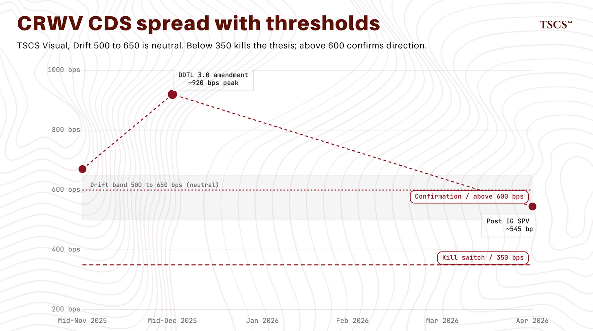](https://substackcdn.com/image/fetch/$s_!IIAv!,f_auto,q_auto:good,fl_progressive:steep/https%3A%2F%2Fsubstack-post-media.s3.amazonaws.com%2Fpublic%2Fimages%2Fcc3aae48-d005-4a20-8e6b-65270b139574_1844x1032.png)

**Signal 3: CDS Spread Movement (Asymmetric Kill Switch, Not Confirmation Signal).** CRWV CDS reference. Bloomberg ticker CMAI, identifier BL5636982, CUSIP 21881PAC8, coupon 500 bps, recovery 0.40, maturity June 20, 2031. Recent reported quotes per public sources: approximately 665-675 basis points in mid-November 2025; approximately 920 basis points peak in mid-December 2025 around the DDTL 3.0 amendment timing; approximately 535-554 basis points in April 2026 post the IG rating. Asymmetric, not confirmation: the modal outcome (drift between 500 and 650 bps for 18-30 months) doesn’t validate or invalidate the thesis on its own. Kill switch, tightens through 350 bps and holds for 60+ days. That requires Parent unsecured to converge meaningfully toward IG SPV cost of capital, which the residual-claim argument says can’t happen without resolution of the dynamics in play. 10-20% probability. Confirming pull, widens through 600 bps without offsetting positive news. 50-65% probability within 18-30 months, anchored in the December 2025 920 bps peak as the achievable stress range and the 2026 maturity wall pressure. Drift between 500 and 650 bps without a sustained breakout in either direction: roughly even probability and informationally neutral.

**Signal 4: Further DDTL Covenant Amendments.** Bear strengthens if any of DDTL 1.0, 2.0, 2.1, 3.0, or 4.0 see additional covenant amendments, waivers, or extensions in any 8-K filing within the 18 to 30 month trade window. The DDTL 3.0 First Amendment (December 31, 2025) is the precedent. 50-75% probability of additional amendment activity at any DDTL within the window, anchored in the December 2025 amendment as direct precedent that this lender group will relax when needed, the broader operational stress signals from Part III, and the pattern that amendment frequency rises when delivery slips.

**Signal 5: Parent Capital Actions.** Bear strengthens if the Parent issues additional unsecured paper at 9% or higher within the trade window. Auxiliary signals that corroborate via the same residual-claim erosion mechanism: dilutive convertible issuance with material conversion premium (compresses equity through dilution), new SPV financing that further ringfences corporate-recourse cash flow (compresses equity through reduced corporate-recourse base), or equity issuance below the current price at meaningful size (compresses equity directly). 65-85% probability of additional unsecured Parent issuance at 9% or higher within 18-30 months, anchored in the $6.708 billion 2026 maturity wall (10-K Note 10) and the April 2026 9.75% pricing as the running market rate. The wall must be addressed in H2 2026, and unsecured Parent paper is unlikely to compress below 9% without resolution of the residual-claim dynamics in play. 90%+ probability the maturity wall is addressed via any of unsecured at 9% plus, dilutive convertible, or new SPV — the wall is contractually fixed and all three paths compress the residual equity claim through different mechanisms. 30-50% probability of dilutive equity issuance, anchored in dilution sensitivity at the current market cap.

Ranges above are judgment anchored in observable starting conditions: order books, recent pricing, historical patterns, contractual triggers. Not historical base rates. Not Monte Carlo. Reasonable analysts could push them wider or shift them by similar magnitude. The exercise makes the trade testable.

The 18 to 30 month trade window contains both binding contractual tests: DDTL 4.0 maintenance DSCR going live at the June 30, 2027 Commitment Termination Date, and DDTL 3.0’s first DSCR test on October 31, 2027. Both sit toward the back of the window but inside it. The primary within-window catalyst, however, is earlier and not contractually triggered: the Parent’s $6.708 billion 2026 maturity wall (per 10-K Note 10) forces capital actions in the second half of 2026, which crystallize the residual-claim erosion through additional 9% plus unsecured issuance, additional convertibles with dilution, or another SPV that further ringfences corporate-recourse cash flow. The Cash Trap can fire any time on a material MSA breach event, independent of any calendar test. The empirical evidence that has historically forced these structures into observable stress (covenant relief amendments, equity cure activations, distribution blockages disclosed in 8-K filings) is concentrated around scheduled covenant test dates and around capital actions forced by maturity walls. The thesis predicts a sequence in which the Parent’s residual claim deteriorates against a backdrop of growing SPV insulation, with the maturity wall in Q4 2026 as the primary forcing event and the binding covenant tests in 2027 as the back-end confirmation. This thesis does not predict imminent Cash Trap activation. The maturity wall is the catalyst, the covenant tests are the back-end capstone, and the five signals above surface earlier indicators (CDS widening, additional covenant amendments at any DDTL, additional Parent unsecured at 9% or higher, Q-on-Q ramp disclosures) that would shift conviction across the window.

[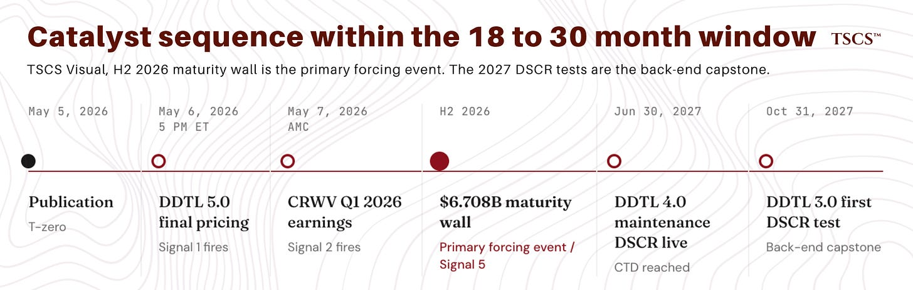](https://substackcdn.com/image/fetch/$s_!w_7M!,f_auto,q_auto:good,fl_progressive:steep/https%3A%2F%2Fsubstack-post-media.s3.amazonaws.com%2Fpublic%2Fimages%2F14933b86-827f-4c32-a171-12deb56d5c25_1846x588.png)

## **VIII. Trade Expressions**

Do not short DDTL 4.0 paper. The rating is correct. The structural protections are real. Shorting investment-grade SPV paper at A3 / A (low) because the Parent equity is overvalued is a confused expression of the thesis. The thesis does not require DDTL 4.0 to deteriorate. It requires the Parent equity claim to deteriorate while DDTL 4.0 keeps performing.

[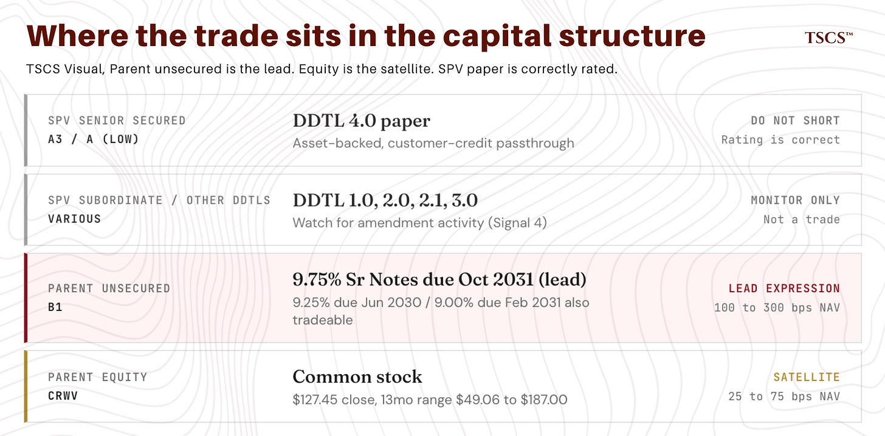](https://substackcdn.com/image/fetch/$s_!dCCq!,f_auto,q_auto:good,fl_progressive:steep/https%3A%2F%2Fsubstack-post-media.s3.amazonaws.com%2Fpublic%2Fimages%2Fde6d2044-c88c-4a97-be01-fb319875cc62_1848x912.png)

**Lead expression: short Parent unsecured.** The cleanest expression of the thesis is short the Parent’s unsecured debt complex, with the April 2026 9.75% Senior Notes due October 2031 as the centerpiece. The structure: $1.75 billion priced at par on April 14, 2026 (after a $500 million upsize), plus a $1 billion tap on April 21, 2026 at 102.000% of par (yield to maturity on the tap approximately 9.30%; the original tranche carries the stated 9.75% coupon). Both tranches are B1 by Moody’s. Recent OAS per Bloomberg sits around 528 basis points, against the ICE BofA Single-B US High Yield Index effective yield of 7.31% in April 2026, a gap of approximately 244 basis points wider than generic single-B. The CRWV 9.25% Senior Notes due June 2030 ($2 billion) and the 9.00% Senior Notes due February 2031 ($1.75 billion) are also tradeable expressions. Pricing should be confirmed against TRACE prints at execution.

Why unsecured is the cleanest expression. Instrument-thesis alignment first. The thesis is that the residual claim above the SPV stack deteriorates while the SPV stays current. Parent unsecured paper prices the residual claim most directly. Equity prices the residual claim plus AI capex sentiment, contract win narratives, growth multiples, and liquidity. Unsecured strips the trade down to what the contract argument actually says. Signal-to-noise next. CRWV equity has a 3.81x peak-to-trough range over the past 13 months ($49.06 to $187.00). B1 unsecured paper of this issuer doesn’t move 4x. If the thesis is right, unsecured spreads widen from current ~528 bps OAS toward 700-900 bps. Defined, bounded move the framework can predict and validate. First-hit in the capital structure: Parent runs into liquidity pressure before any SPV trips a covenant, which makes Parent unsecured the first instrument to take a hit. Equity takes a hit only when the market prices cumulative degradation, which can lag by quarters. Defined entry, the April 14 par pricing and April 21 tap at 102 give documented anchors against a recent capital action. Equity short at $127 sits in the middle of a 3.81x range with no comparable anchor. And the trade differentiates from sell-side: equity research can lower price targets but can’t short, credit research mostly doesn’t produce structurally argued shorts on individual issuers. Credit is the analytical pathway sell-side doesn’t occupy.

**Carry math.** Shorting the 9.75% Senior Notes means owing the lender the coupon (approximately 9.75% per year), earning short rate on proceeds (approximately 4.5% per year at current levels), and paying a stock loan fee (estimate 25 to 50 basis points for B1 paper). Net carry is approximately negative 5.5% to negative 6.0% per year. Over 18 months: approximately negative 8% to 9%. Over 30 months: approximately negative 14% to 15%. The bond needs to decline roughly 10% over 18 months or 15% over 30 months to overcome carry; below that the trade loses to time value. If the thesis fails and the bond tightens (which would imply the residual-claim argument is being closed by capital actions or operational stabilization), the trade loses meaningfully against carry plus price. The reward-to-risk on the cash bond short is workable for a moderate-conviction structural view; it is not a fat trade. Confirm carry on desk before sizing.

**CDS protection is the cleaner carry expression.** Reference: CMAI on Bloomberg, identifier BL5636982, CUSIP 21881PAC8, coupon 500 basis points, recovery 0.40, maturity June 20, 2031. Recent CDS quotes in the 535-554 basis point range in April 2026 per Bloomberg (midpoint 545 bps), against a December 2025 peak of approximately 920 basis points around the DDTL 3.0 amendment timing. The cash bond OAS of approximately 528 basis points sits inside that CDS range, with the basis between cash and CDS reflecting the usual liquidity and recovery-assumption differences. Buying protection means paying the spread as carry (approximately 5.45% per year of notional at the midpoint) without owing the bond’s 9.75% coupon. The MTM gain comes from spread widening: approximately delta-spread times duration times notional. If the spread widens from 545 to 800 basis points over 18 months and CDS modified duration is roughly 4 years: P&L approximately 255 times 4 divided by 100, or 10.2% of notional, against carry of 5.45% times 1.5, or negative 8.2%. Net approximately positive 2% over 18 months. For deeper widening to 1,000 basis points over 18 months: P&L approximately 18.2%, net approximately positive 10%. The CDS expression scales better with widening and has no coupon-payment obligation. Confirm current quote and duration assumptions at execution; modified duration depends on curve shape and recovery assumption and should be pulled from the desk model rather than estimated.

[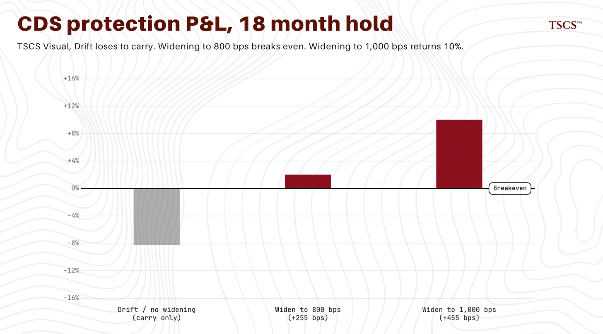](https://substackcdn.com/image/fetch/$s_!9ZAk!,f_auto,q_auto:good,fl_progressive:steep/https%3A%2F%2Fsubstack-post-media.s3.amazonaws.com%2Fpublic%2Fimages%2Ff66c0d8f-8768-48f1-8a9c-415798bfa20a_1844x1022.png)

**Sizing the lead.** For an institutional book, the unsecured cash bond short or CDS protection sized in the 100 to 300 basis points of NAV range is reasonable for a single-name structurally argued short held over 18 to 30 months. CDS protection has the cleaner economics if the size and counterparty access are available. Cash bond short is the alternative for desks without efficient CDS access. For smaller institutional or retail readers, the equity satellite below is more accessible at proportional size. Position sizing should anticipate that the trade can take 18 to 30 months to play out and that carry compounds across the holding period; The trade is built for moderate conviction over a defined window, not asymmetric tail-risk capture.

**Equity short as satellite.** CRWV equity is a documented satellite expression for those who want directional exposure with bigger absolute return potential. Stock closed at $127.45 on May 4, 2026, on follow-on momentum from Citi’s May 1 target raise to $155 (Tyler Radke note) plus pre-earnings positioning ahead of the May 7 print. Insider Form 4 selling pattern (Intrator, McBee, Magnetar funds) shows insider concern; the mid-April Form 4 selling band sat at $114 to $120 per share. Material weaknesses in internal control unremediated through December 31, 2025, with the auditor exemption falling away in the FY2026 audit cycle. Securities class action Masaitis v. CoreWeave filed January 12, 2026 in DNJ alleging Section 10(b), 20(a), and Rule 10b-5 violations; two derivative actions Smith and Roy filed February 10, 2026 in DNJ.

[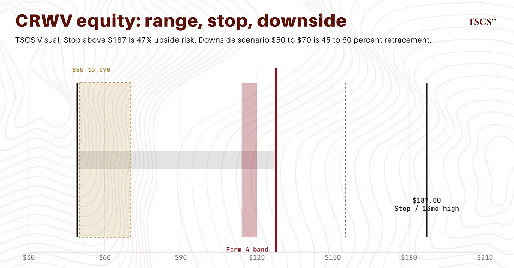](https://substackcdn.com/image/fetch/$s_!rs-J!,f_auto,q_auto:good,fl_progressive:steep/https%3A%2F%2Fsubstack-post-media.s3.amazonaws.com%2Fpublic%2Fimages%2Fa0e240c6-6297-4246-8cd3-b968f878f81e_1846x966.png)

The equity satellite has bigger magnitude if right (a retracement from $127 toward $50 to $70 implies 45% to 60% downside) and is contaminated by AI capex sentiment that the unsecured short is not exposed to. Entry between $120 and $145 with stop-loss above $187 (the recent high). The stop is asymmetric to the upside risk: roughly 47% upside risk against a thesis that may not have a binding catalyst in the early part of the window. In a continuing AI capex cycle, the equity can trade through $187 before the structural argument matters, even if the argument is correct. Size for that. A reasonable initial size for the satellite is 25 to 75 basis points of NAV, alongside the unsecured short, not replacing it. The satellite should be held at smaller size than the unsecured lead because the volatility profile and the contamination from AI capex sentiment make it the more speculative expression of the same thesis.

**Avoid pairing with broader neocloud short.** Other neocloud names (Nebius, Crusoe, and others) have different financing structures, different customer mixes, and different SPV templates. The customer-credit-passthrough mechanism may not apply identically across the sector. The thesis is CRWV-specific and structural. Part VI sets out the competitive characterization in more detail.

**Avoid pairing with NVIDIA short.** NVIDIA’s $2 billion equity stake at $87.20 per share is a small fraction of NVIDIA’s balance sheet and does not create a meaningful bailout incentive. The reason to avoid the pair is different: NVIDIA’s product cycle drives CRWV’s underlying capex demand, and shorting NVIDIA into a thesis that requires CRWV’s capex stack to remain expensive is internally inconsistent. The CRWV thesis is short the residual claim above the SPV stack. It is not short AI capex demand.

**Time horizon.** 18 to 30 months. The five tracked signals in Part VII define what confirms or kills the trade within that window. The DDTL 4.0 maintenance DSCR test going live June 30, 2027 sits in the back end of the window; the DDTL 3.0 first DSCR test on October 31, 2027 sits at the back edge. The 2026 maturity wall in Q4 2026 is the primary within-window catalyst, forcing capital actions that crystallize the residual-claim erosion through additional 9% plus unsecured issuance, additional convertibles with dilution, or another SPV that further ringfences corporate-recourse cash flow. Position sizing should anticipate volatility on the equity satellite specifically; the unsecured lead has narrower volatility but defined carry, and the holding period requires explicit budgeting for that carry against the expected widening.

## **IX. How This Piece Gets Proven or Disproven**

Specific dates. Events that matter at each.

**May 6, 2026:** DDTL 5.0 final pricing. Watch for clearance at or near launch terms (S+500, OID 99, BB+ Fitch) versus repricing or pulling.

**May 7, 2026:** CRWV Q1 2026 earnings, 5 PM Eastern. Watch for Microsoft concentration percentage; OpenAI ramp progress; Meta MSA performance language; updated Parent debt; CCAC VIII drawdown activity. Consensus expects revenue around $1.97 billion and a loss per share around $0.91 against company guidance of $1.9-2.0 billion revenue and adjusted operating income of $0-40 million.

**August 2026:** CRWV Q2 2026 earnings; Meta Q2 capex commentary.

**Q4 2026:** Parent 2026 maturity wall comes due ($6.708 billion per 10-K Note 10). The primary within-window catalyst. Capital actions to address the wall (additional 9% plus unsecured, convertibles with dilution, or new SPV) crystallize the residual-claim erosion.

[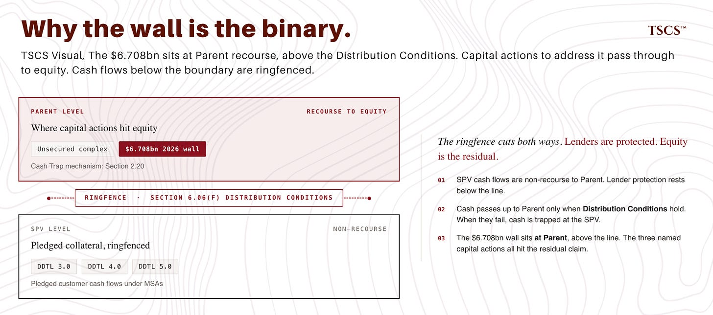](https://substackcdn.com/image/fetch/$s_!NtEK!,f_auto,q_auto:good,fl_progressive:steep/https%3A%2F%2Fsubstack-post-media.s3.amazonaws.com%2Fpublic%2Fimages%2Ff202f7b6-5d56-4cb1-90c6-450d697a948c_1850x818.png)

**Q1-Q2 2027:** Mid-window check on whether the maturity wall capital actions have produced the corroborating signals (additional unsecured at 9% plus, further covenant amendments at any DDTL, additional Parent unsecured complex widening).

**February 28, 2026 (already passed):** DDTL 3.0 contract realization ratio first test under the December 2025 amended timeline. Watch for any 8-K disclosure of breach or amendment, including any post-test amendments that may have been filed since.

**June 30, 2027:** DDTL 4.0 Commitment Termination Date triggers DSCR maintenance test going live.

**October 31, 2027:** DDTL 3.0 first DSCR test under the December 2025 amended timeline. Sits at the back edge of the 18 to 30 month window.

[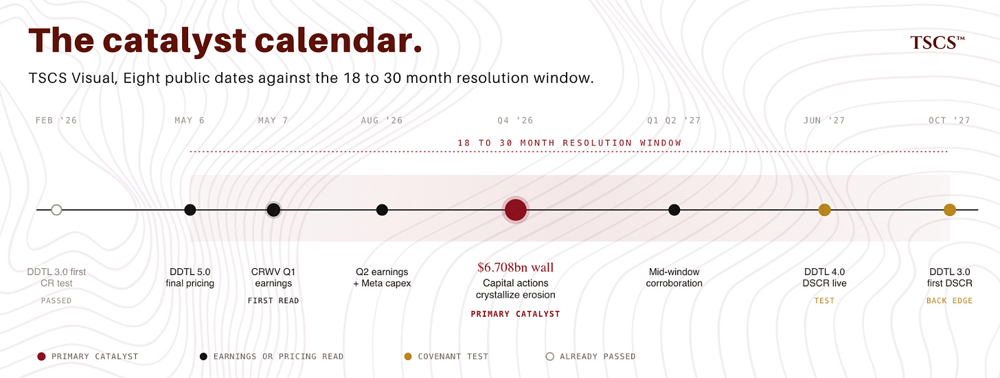](https://substackcdn.com/image/fetch/$s_!TvXr!,f_auto,q_auto:good,fl_progressive:steep/https%3A%2F%2Fsubstack-post-media.s3.amazonaws.com%2Fpublic%2Fimages%2Fdc47837a-4e78-4d0f-bf3f-abc8f190318b_1844x698.png)

**What ends the trade.** CDS tightens through 350 basis points and holds for 60 or more days. CRWV refinances the 2026 wall at sub-7% blended cost. Microsoft concentration reduces materially without offsetting SPV-pledged ramp (suggesting genuine corporate-recourse diversification rather than SPV partition). Parent capital raise at substantially higher equity multiples than current. Any combination of two or more would force a framework revisit.

[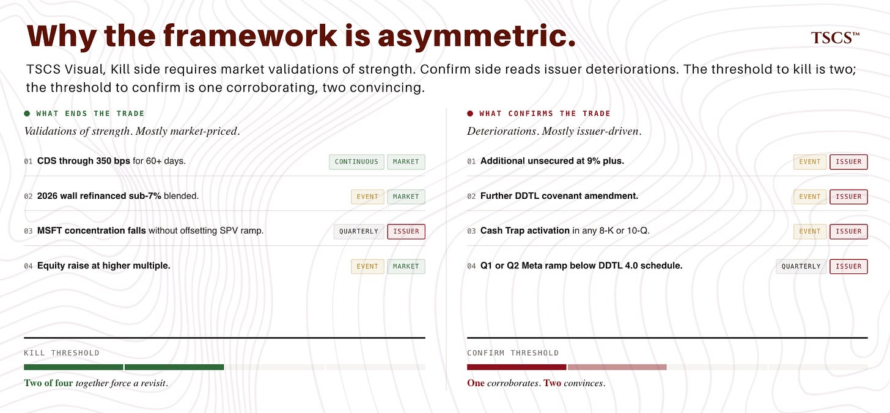](https://substackcdn.com/image/fetch/$s_!5Dtb!,f_auto,q_auto:good,fl_progressive:steep/https%3A%2F%2Fsubstack-post-media.s3.amazonaws.com%2Fpublic%2Fimages%2F84688e11-df7b-447e-9d6a-e055f1180e8a_1844x858.png)

**What confirms the trade.** Parent issues additional unsecured at 9% or higher within the trade window. Further covenant amendments at any DDTL within the trade window. Cash Trap activation event referenced in any 8-K or 10-Q. Q1 / Q2 Meta ramp below the implicit DDTL 4.0 schedule. Any one is corroborating; any two is convincing.

The argument is structural and probabilistic. Not deterministic. The Cash Trap mechanism is real and the threshold gap is real. The gap’s width depends on the redacted MSA Exhibit H thresholds that are not public. The five-signal framework above exists because nobody can say precisely when within the 18 to 30 month window the thesis confirms. The contract makes the gap observable. Public evidence puts CRWV at the operationally stressed end of the rating’s calibration. The trade expression is calibrated to that uncertainty: Parent unsecured short as the lead expression, CRWV equity short as a satellite, sized for volatility, with explicit kill switches and a defined window.

The IG rating is the cost of admission to a financing template that systematically transfers cash-flow rights away from the Parent equity. Sell-side reading the rating as bullish equity validation is reading the wrong document. The contract is the document that matters and the contract is publicly filed. The bear case doesn’t need interpretive heroics. Read the four corners of what CoreWeave and its lenders signed.

The ringfence cuts both ways. Lenders are protected. Equity is the residual. The market will figure this out within the next 18 to 30 months. Better positioned ahead of that recognition than behind it.

Open evidence requirements that would tighten future updates: (1) DDTL 3.0 Parent Guarantee Fallaway Conditions from Exhibit 10.2 of the July 31, 2025 8-K; (2) live Bloomberg CDS and TRACE pricing at execution; (3) Q1 2026 actuals from the May 7 earnings call and subsequent 10-Q, which will be the first observable data point on Microsoft concentration trajectory and OpenAI ramp progress under the amended DDTL 3.0 timeline; (4) Moody’s full credit opinion if accessible. Section 2.20 verbatim text and 6.06(f) Distribution Conditions text are integrated above from Exhibit 10.1 of the March 31, 2026 8-K.

[Share TSCS](https://tscsw.substack.com/?utm_source=substack&utm_medium=email&utm_content=share&action=share)

[Share](https://tscsw.substack.com/p/sell-side-has-crwv-wrong?utm_source=substack&utm_medium=email&utm_content=share&action=share&token=eyJ1c2VyX2lkIjoxNDAwMjQ1LCJwb3N0X2lkIjoxOTY1OTQxNjMsImlhdCI6MTc3ODU0NTIyOCwiZXhwIjoxNzgxMTM3MjI4LCJpc3MiOiJwdWItMjM1NDI0NCIsInN1YiI6InBvc3QtcmVhY3Rpb24ifQ.lBZcLcUWZSFA7rjFW2szrYHE6a-HlphgQnqMH-9I1VE)