Brent Dec 2026 settled $87.28 May 8. The structural expected value is $108. The market is implicitly weighting Eventual Resolution materially above 40% on a 6-12 month horizon, or Extended Degraded materially below, or both. None of those weights survive the May 7-8 tape.

Iranian officials called the leaked U.S. text a “wish-list” inside hours. Iran fired on three U.S. destroyers transiting the Strait on May 7. CENTCOM responded with strikes on Iranian military facilities. UAE absorbed Iranian missile and drone strikes across May 4-5 and again on May 8, including the major May 4 wave that hit the Fujairah Petroleum Industries Zone.

CENTCOM disabled three Iranian-flagged tankers across May 6 and May 8 under blockade enforcement. Project Freedom, the U.S. escort operation, was effectively halted May 5 by Saudi and Kuwaiti access restrictions, then publicly paused by Trump on May 6, with restrictions reportedly lifted by May 8 after a second Trump-MBS phone call. Framework is no longer the active diplomatic track.

[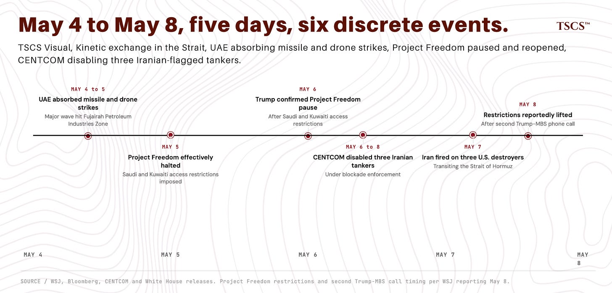](https://substackcdn.com/image/fetch/$s_!_QyS!,f_auto,q_auto:good,fl_progressive:steep/https%3A%2F%2Fsubstack-post-media.s3.amazonaws.com%2Fpublic%2Fimages%2F59f73bc8-8aab-47b4-b597-62db25fa56de_1848x886.png)

"Late to Hormuz" (May 6) merged a 6-12 month structural fair value with a 48-hour tactical scenario set and arrived at $85-93. The structural floor held. The tactical premise didn't. The two have no business sharing a number.

Architecture below replaces the broken methodology. Two layers, separately specified, with separate kill switches at each layer. Tactical layer governs position sizing on a 4-8 week horizon. Structural layer governs fair value on a 6-12 month horizon. They move independently.

[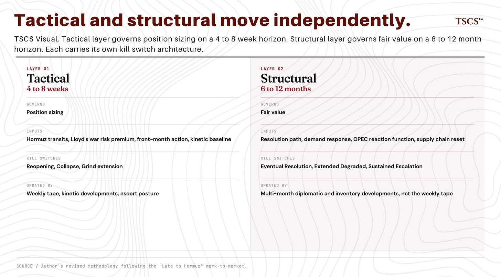](https://substackcdn.com/image/fetch/$s_!toH8!,f_auto,q_auto:good,fl_progressive:steep/https%3A%2F%2Fsubstack-post-media.s3.amazonaws.com%2Fpublic%2Fimages%2F0a552a86-c12c-4e69-89d0-67e7ed7cc802_1846x1024.png)

Marks across the back catalog. Cash Not Bonds carry leg cut in full. Palladium SBSW thesis back on track on the May 5 COT print. BOJ amplifier trimmed pending June. Buy The Miners working at $4,800+ realized gold. Short The Packagers thesis intact. Tactical entry wrong. Mosaic pending Q1.

[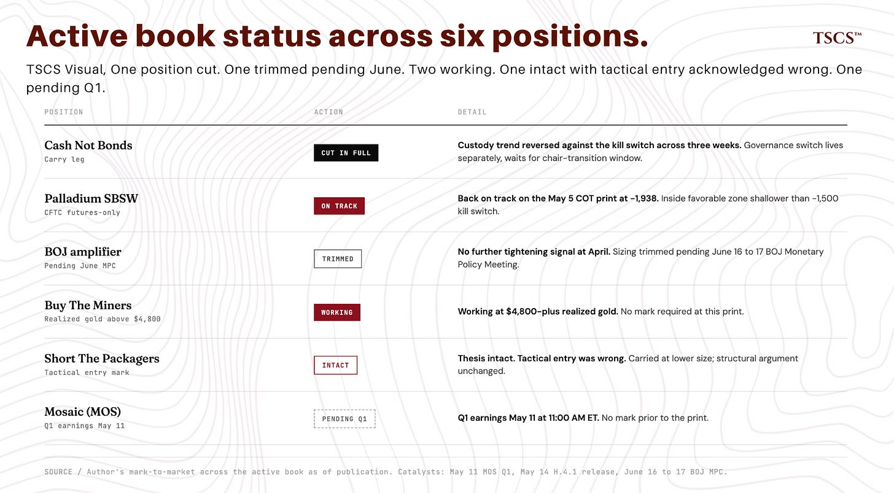](https://substackcdn.com/image/fetch/$s_!7kOA!,f_auto,q_auto:good,fl_progressive:steep/https%3A%2F%2Fsubstack-post-media.s3.amazonaws.com%2Fpublic%2Fimages%2F6ff904b0-b957-4e3e-97f7-13f6843b40e1_1848x1022.png)

Brent Dec 2026 at $87. Floor at $83. Structural EV at $108. The macro instrument is partially priced. Cleaner alpha sits in equities. Part three develops it.

[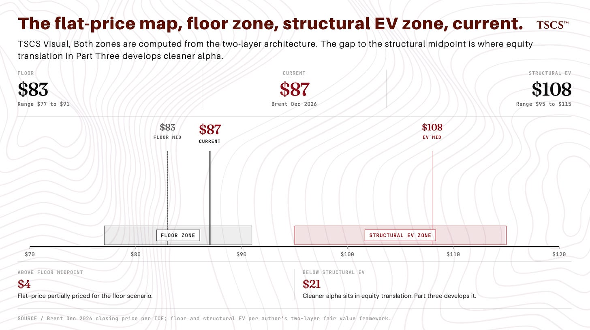](https://substackcdn.com/image/fetch/$s_!0eg7!,f_auto,q_auto:good,fl_progressive:steep/https%3A%2F%2Fsubstack-post-media.s3.amazonaws.com%2Fpublic%2Fimages%2Ffabf7420-a70a-496f-913d-75b4d6ccb9d3_1850x1036.png)

Framework on probation. Next 10 kill switches resolve status. Probation timer starts now.

Below: full architecture, marks against the active book, watchlist, fair value computation.

Subscribed

Note on sequence. Three pieces. Part one: architecture, marks, probation. Part two (“Cash Not Bonds Reconsidered”) within 5 days. Part three (the translation) within 7-10 days. Each stands alone. Framework on probation runs across the three.

## **TLDR**

1. “Late to Hormuz” had a category error and a probability error. Category error: tactical 48-hour weights got applied to a 6-12 month structural fair value. Architecture below fixes the category error. Probability error: 42% on Iranian acceptance inside hours was conviction dressed as calibration. Different discipline.
2. Two-layer architecture from here. Tactical layer: 4-8 weeks, governs sizing. Structural layer: 6-12 months, governs fair value. They move independently.
3. Brent Dec 2026 floor ~$83 (range $77-91). Structural EV ~$108 (range $95-115). Current $87 sits $4 above the floor midpoint, $20 below the EV. Flat-price is partially priced. Cleaner alpha sits in equity translation. Part three develops it.
4. Cash Not Bonds carry leg cut in full. Custody trend reversed against the kill switch across three weeks. Governance switch lives separately, waits for the chair-transition window. Full reconsideration in part two.
5. Framework on probation. Next 10 kill switches resolve status. 7+ no-fires lifts. 3 or fewer revises the architecture itself. Probation timer starts now.

[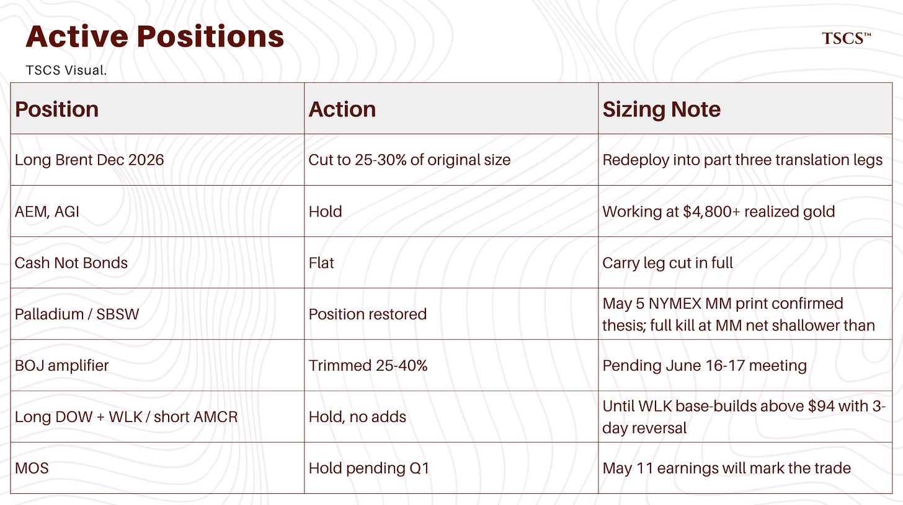](https://substackcdn.com/image/fetch/$s_!BMRc!,f_auto,q_auto:good,fl_progressive:steep/https%3A%2F%2Fsubstack-post-media.s3.amazonaws.com%2Fpublic%2Fimages%2F8834c3b2-8af8-4080-ab80-518354072764_1844x1034.png)

**Kill Switches (status)**

Tactical (4-8 week horizon):

* Reopening fires: Hormuz transits >15/week sustained 2 weeks AND Lloyd’s war risk premium <0.5%. Live, not approaching (May 2 transit count 12 vs ~138 pre-conflict baseline; WSJ reports zero commercial crossings May 6-9).
* Collapse fires: direct US-Iran kinetic exchange exceeds the May 7 baseline. Live, approaching.
* Grind extension: neither fires across 4 weeks AND front-month $95-105 AND insurance stable. Live.

Structural (6-12 month horizon):

* Eventual Resolution accelerates: Hormuz transits >70% pre-conflict AND formally announced US-Iran deal within 3 months. Live, not approaching.
* Extended Degraded confirms: no formal deal AND no comprehensive escalation across 9 months. Live.
* Sustained Escalation confirms: peer-state direct engagement OR Iranian Hormuz closure for >30 days continuous. Live, not approaching.

Position-specific:

* Cash Not Bonds carry: $5B/week sustained 3-week decline. Triggered in opposite direction; position cut.
* Palladium positioning (CFTC, NYMEX, futures-only): managed money net shallower than -1,500 sustained. Live, May 5 print at -1,938 inside the favorable zone.
* BOJ amplifier: no further tightening signal at April. Did not fire; sizing trimmed pending June.

[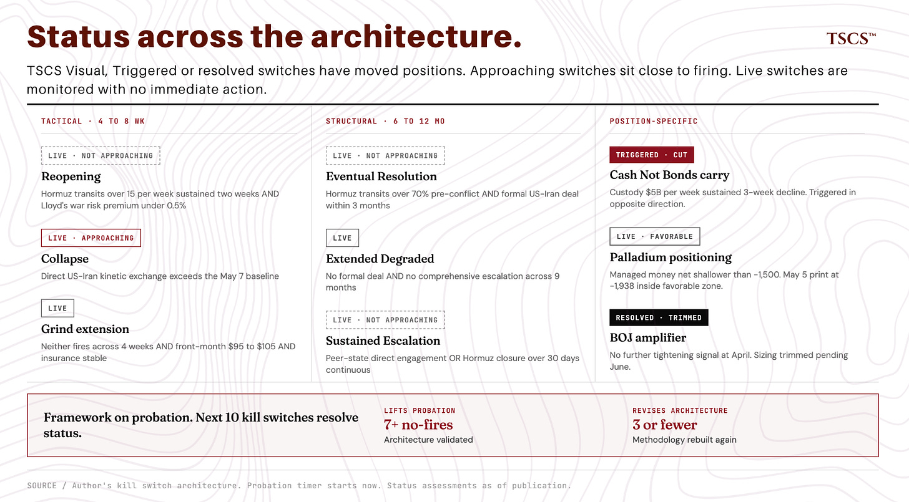](https://substackcdn.com/image/fetch/$s_!jgjy!,f_auto,q_auto:good,fl_progressive:steep/https%3A%2F%2Fsubstack-post-media.s3.amazonaws.com%2Fpublic%2Fimages%2F2d398ee3-de73-4055-8715-b0c804f797ab_1848x1022.png)

**Catalysts**

* May 11: MOS Q1 earnings, 11:00 AM ET
* May 14: H.4.1 release (custody data)
* June 16-17: BOJ Monetary Policy Meeting
* Within 5 days: Part two
* Within 7-10 days: Part three

**What’s New (since “Late to Hormuz” May 6)**

* Plan A resolved against on the 48-hour window (Iranian officials called the U.S. text an “American wish-list,” May 7 kinetic exchange in the Strait, U.S. retaliatory strikes on Iranian military facilities, UAE absorbed Iranian missile and drone strikes across May 4-5 and again on May 8, Project Freedom effectively halted May 5, Trump confirmed pause May 6, restrictions reportedly lifted May 8 per WSJ)
* Two-layer architecture replaces the merged tactical-structural framework
* Cash Not Bonds carry leg cut in full following the May 6 H.4.1 print
* Palladium SBSW thesis back on track on the May 5 COT print (-1,938)
* Framework on probation with 10-kill-switch exit criterion in both directions

## **1. The Mark**

48 hours later, I have an answer. It’s not the one I weighted toward.

“Late to Hormuz” (May 6) argued the next 48 hours would deliver one of three answers. Iran accepts the framework (Plan A, 42%). Iran takes the deal but degrades it on margin (Plan B, 33%). Framework collapses, kinetic phase resumes (Plan C, 25%). On those weights I revised Brent Dec 2026 fair value from $95-100 down to $85-93.

Plan A (Iranian acceptance within 48 hours) resolved against. Iranian officials, including parliament’s foreign policy and national security commission spokesperson Ebrahim Rezaei, derided the leaked Axios text as an “American wish-list” within hours, with key demands left unresolved.

Iran fired on three U.S. destroyers transiting the Strait of Hormuz on May 7 (per CENTCOM). CENTCOM responded with retaliatory strikes on Iranian military facilities. UAE absorbed Iranian missile and drone strikes across May 4-5 and again on May 8 (Reuters, AP), with the major May 4 wave (12 ballistic, 3 cruise, 4 UAVs, Fujairah Petroleum Industries Zone fire) and a smaller follow-on May 5. UAE air defenses engaged 2 ballistic missiles and 3 drones on May 8 with three wounded.

CENTCOM disabled one Iranian-flagged tanker on May 6 and struck two more on May 8 under blockade enforcement. Project Freedom (the U.S. escort operation through the Strait) was effectively halted May 5 by Saudi and Kuwaiti access restrictions on bases and airspace. Trump publicly confirmed the pause May 6. On May 8, the Wall Street Journal reported the restrictions had been lifted following a second Trump-MBS phone call. Framework is no longer the active diplomatic track.

[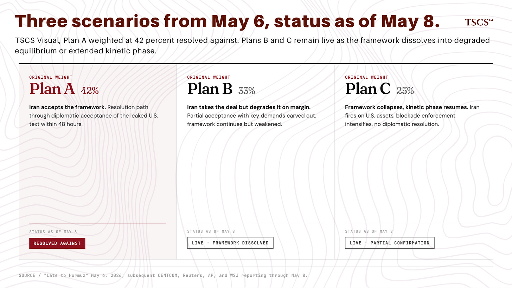](https://substackcdn.com/image/fetch/$s_!9mGx!,f_auto,q_auto:good,fl_progressive:steep/https%3A%2F%2Fsubstack-post-media.s3.amazonaws.com%2Fpublic%2Fimages%2F0dd30b40-a975-47dc-8091-ced319fa680e_1850x1042.png)

Brent Dec 2026 settled $85.12 May 6, $85.43 May 7, $87.28 May 8. Floor held, tactical weight didn’t. Methodology has to separate the two.

“Late to Hormuz” made two errors. Category error: I combined a structural floor (6-12 month object) with tactical 48-hour scenario weights, merged them into one fair value range. Probability error: 42% on Iranian acceptance inside 48 hours when Iranian officials were already mocking the proposal as a wish-list within hours of its arrival. The 42% was conviction dressed as calibration. Architecture fixes the category error. Probability error needs different discipline.

Two of three highest-conviction recent calls (”Late to Hormuz” tactical, “Priced For Peace” carry leg) had kill switches fire against them within three weeks of publication. The third (”The 241% Wall” SBSW palladium leg) was tracking wider until the May 5 COT print reversed the trend. Framework on probation regardless.

**The tape across the 48-hour window.** Market took de-escalation hard May 6, gave back partial May 7-8 as the framework’s premise collapsed, did not return to pre-leak levels.

Brent front-month (Jul26) traded above $102 May 6 ahead of the leak, settled $101.27 on the de-escalation selloff, settled $100.06 May 7 on kinetic news, settled $101.29 May 8. Round-tripped through about $5 in 36 hours. Brent Dec 2026 settled $85.12, $85.43, $87.28 across the May 6, 7, 8 sessions. Backwardation roughly $16 May 6 settle, compressed to roughly $14 by May 8 settle. Curve flattened roughly $3 in 48 hours. Market adding to back-end normalization probability.

[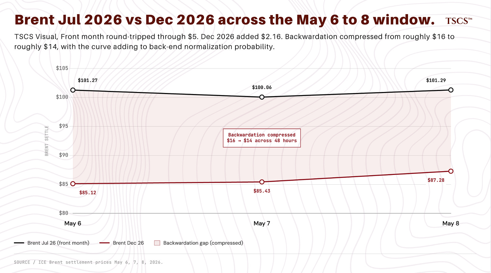](https://substackcdn.com/image/fetch/$s_!spEi!,f_auto,q_auto:good,fl_progressive:steep/https%3A%2F%2Fsubstack-post-media.s3.amazonaws.com%2Fpublic%2Fimages%2F01e8131f-6e8e-4fdc-9591-8f0f14d493f1_1852x1030.png)

10Y closed 4.36% May 6 and 4.41% May 7, did not break range. HY OAS at 2.75% May 6, 2.79% May 7 (kinetic widening of 4 basis points), near year-to-date tights. Credit watching de-escalation closely, paying very little to kinetic risk on the other side. No subsequent repricing.

Equities reacted sector-specific. DOW down 5.64% May 6 on de-escalation oil-beta short cover (the chemicals long leg of “Short The Packagers” got hit), at $36.87 May 8 close. WLK $93.85 lower on the de-escalation tape. AMCR around $40 essentially flat. Gold miners diverged: AEM $193.21 (up 2.9%), AGI $43.38 (up 2.5%). Miners are trading on gold and operating margin, not Hormuz. Both held. Q1 prints (AEM April 30 after close, AGI April 29) confirmed operating leverage at $4,800+ realized gold (AEM $4,861/oz, AGI $4,829/oz).

## **2. The Methodological Commitment**

“Late to Hormuz” combined a structural argument (Brent Dec 2026 fair value $95-100 on inventory mechanics, reservoir damage, structural war risk premium, 6-12 month horizon) with a tactical argument (Plan A/B/C scenario weights for the next 48 hours), merged them into a revised range of $85-93.

The error: a 48-hour scenario set should not move a 6-12 month fair value by $7-10 per barrel.

The reason is mechanical. Worst-case (Plan C, sustained kinetic phase), the structural inputs to a Dec 2026 fair value (inventory levels, reservoir condition, OPEC+ response) don’t move materially in 48 hours. They move over weeks to months. Best-case (Plan A, framework accepted, immediate reopening), structural inputs again don’t move in 48 hours. They move with ship transits, inventory rebuilds, reservoir damage assessments.

Tactical weights with a 48-hour horizon don’t belong on a 6-12 month structural number. The May 6 piece did that anyway.

Two-layer architecture from here.

Tactical layer: 4-8 weeks. Three scenarios, base-rate calibrated, with explicit kill switches. Governs position sizing and entry/exit timing.

Structural layer: 6-12 months. Three scenarios, longer-horizon, weaker base-rate support, higher analytical content. Governs the fair value computation that anchors back-end positioning.

The two layers move independently. Tactical Plan A failure doesn’t impair structural Eventual Resolution. Different objects, different time scales.

Cost of the conflation in the May 6 piece: floor survived ($85.12 May 6, lower edge), tactical premise didn’t. The tactical scenario weight had no business shifting a 6-12 month number.

[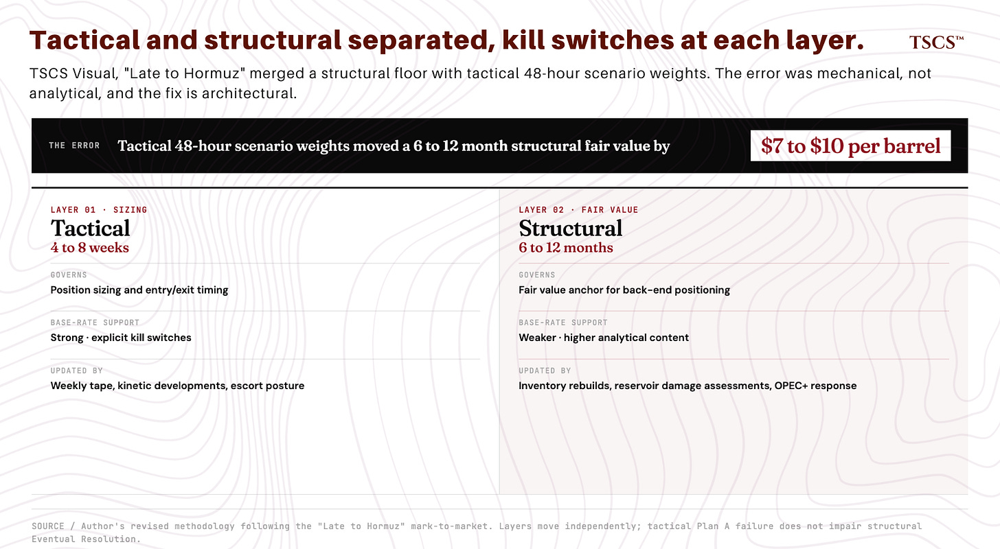](https://substackcdn.com/image/fetch/$s_!Gkh9!,f_auto,q_auto:good,fl_progressive:steep/https%3A%2F%2Fsubstack-post-media.s3.amazonaws.com%2Fpublic%2Fimages%2F5d2cda8d-daa3-4dc1-aa2f-8789df4a1e27_1848x1016.png)

## **3. The Tactical Layer**

Three scenarios across the next 4-8 weeks.

**Reopening (10%, honest interval 5-15%).** Framework or successor framework gets to acceptance within 4-8 weeks. Ships transit Hormuz, war risk premium compresses, front-month Brent retraces toward post-normalization baseline. The U.S. text was rejected as an “American wish-list” inside hours. May 7 kinetic exchange and UAE attacks raise the bar for a deal that doesn’t also include de-escalation commitments Iran hasn’t signaled.

May 5 effective halt of Project Freedom over Saudi and Kuwaiti access constraints removed the most credible immediate logistical pathway. Commercial transits running ~12 May 2 against pre-conflict baseline of ~138 (Reuters), with WSJ reporting zero commercial crossings May 6-9. Reopening kill switch (>15 transits/week sustained) is nowhere near firing. Structural pressure on Iran (sanctions, internal political dynamics) keeps the diplomatic track alive at non-zero probability.

**Grind (50%, honest interval 35-65%).** Status quo extends. Neither side decisively escalates or de-escalates. Framework sits unaccepted but not formally rejected. Ships do not transit in volume. Tankers that do transit pay elevated insurance. Inventories continue to draw. Brent front-month $95-105, Dec 2026 $80-92. Central case. Post-ceasefire weeks (April 7 onward) have run roughly 60% Grind in week-by-week coding. May 7 kinetic exchange did not produce regime-change-level escalation. US response was calibrated. Both sides have asymmetric incentive to extend ambiguity.

**Collapse (40%, honest interval 25-55%).** Framework formally rejected or rendered moot. Kinetic phase deepens. UAE or Saudi Arabia drawn in directly. Insurance market closes for tanker traffic. Brent front-month spikes through $110-120, Dec 2026 widens toward $100. The May 7-8 tape pushes Collapse above the post-ceasefire base rate: missile and drone attacks on UAE from Iran across May 4-5 and May 8, U.S. tanker disablement actions across May 6 and May 8, U.S. retaliatory strikes on Iranian military facilities, Project Freedom pause.

Base rate calibration: 10 weeks from February 28 to May 8 coded against the three scenarios across two windows. Pre-ceasefire window (Feb 28 to April 7, ~5.5 weeks): all weeks Collapse. Post-ceasefire window (April 7 to May 8, ~4.5 weeks): zero Reopening, ~60% Grind, ~40% Collapse. 70/30 weighted (post over pre): roughly 0% Reopening, 42% Grind, 58% Collapse pure base rate. Pure base rate weighs Collapse heavier than I’m running. I deviate down on Collapse because the May 7-8 kinetic phase has been calibrated and contained. I deviate up on Reopening because the pre-ceasefire window had zero weeks of any framework, and now there is one.

Five-week sample. CI on Grind share given n=5 spans roughly 25-90%. Weighting between regimes is a judgment call. The 18-point deviation from base rate is judgment, not calibration. Intervals govern, not point estimates: Reopening 5-15%, Grind 35-65%, Collapse 25-55%. Kill switches resolve where the next 4-8 weeks land.

[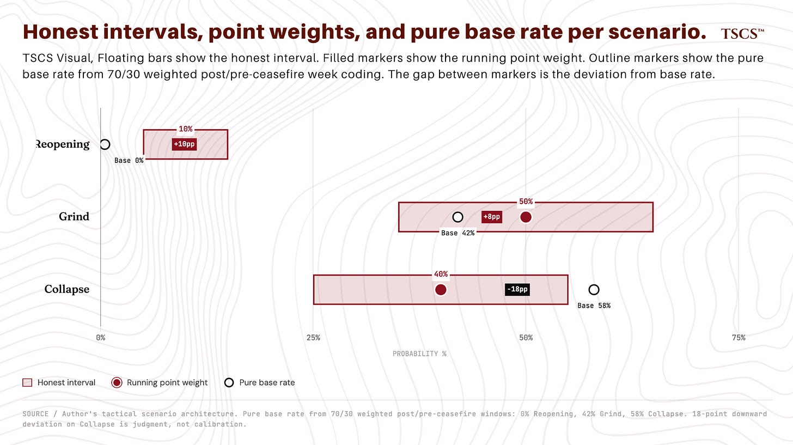](https://substackcdn.com/image/fetch/$s_!5RSr!,f_auto,q_auto:good,fl_progressive:steep/https%3A%2F%2Fsubstack-post-media.s3.amazonaws.com%2Fpublic%2Fimages%2Fae1811b1-80ee-49a1-beab-42a8d0ce4e94_1846x1036.png)

Tactical kill switches.

Reopening fires: commercial tanker traffic transits Hormuz in volume (>15 transits per week sustained two consecutive weeks) AND Lloyd’s war risk premium compresses below 0.5%. Both fire, Reopening rises to 30-40%.

Collapse fires: direct US-Iran kinetic exchange exceeds the May 7 baseline (sustained naval engagement >7 days, or any strike on Iranian onshore infrastructure beyond the May 7-8 retaliatory strikes already absorbed in the baseline, or Iranian closure of Hormuz to all traffic verified by AIS). Any fires, Collapse rises to 60-70%.

Grind extension: if neither fires across 4 weeks AND front-month stays $95-105 AND insurance rates stay elevated but stable, Grind rises to 65-70%.

## **4. The Structural Layer**

Three scenarios across the 6-12 month window.

**Eventual Resolution (40%, range 35-45%).** Within 6-12 months, framework or successor framework gets to a deal. Ships transit Hormuz at normalized volumes. War risk premium compresses to peacetime (0.1-0.3% of vessel value). Inventory rebuild begins. Reservoir damage persists. That’s where the structural floor sits. Brent Dec 2026 $90-105. Modal case from the back catalog restated. “There Is No V-Shape” (March 30) argued L-shaped recovery on reservoir damage and inventory mechanics. Holds under Eventual Resolution.

**Extended Degraded (40%, range 35-45%).** No decisive 6-12 month resolution. Framework either fails or limps along without ships transiting in volume. Tanker war becomes structural: limited transit volumes, elevated insurance, recurring kinetic incidents. Closest historical analogue: 1987-88 tanker war. Brent Dec 2026 $100-115.

**Sustained Escalation (20%, range 15-25%).** Kinetic phase extends, intensifies, or repeats with peer-state direct involvement. Hormuz functionally closed for extended periods. OPEC+ supply curtailment cascading. Brent Dec 2026 $115-140. Closest historical analogue: 2003-08 Iraq.

On the weights. Anchor to comparison set: 1979-81 hostage crisis (closest to Eventual Resolution), 1987-88 tanker war (Extended Degraded), 2003-08 Iraq (Sustained Escalation), 2019-20 Soleimani (fast-track Eventual Resolution), 2024 Israel-Iran (between Eventual Resolution and Extended Degraded). Five cases weighted equally: 2 Eventual Resolution, 2 Extended Degraded, 1 Sustained Escalation. That gives 40/40/20.

Five cases is a small sample. Hormuz chokepoint structure persists across episodes. Political dynamics, US capabilities, oil market structure don’t. 40/40/20 is informed prior, not high-conviction posterior. Structural layer operates on multi-month to multi-year scales. 10 weeks of news flow is noise. Updating structural weights for May 7-8 would be exactly the category error the two-layer architecture prevents.

[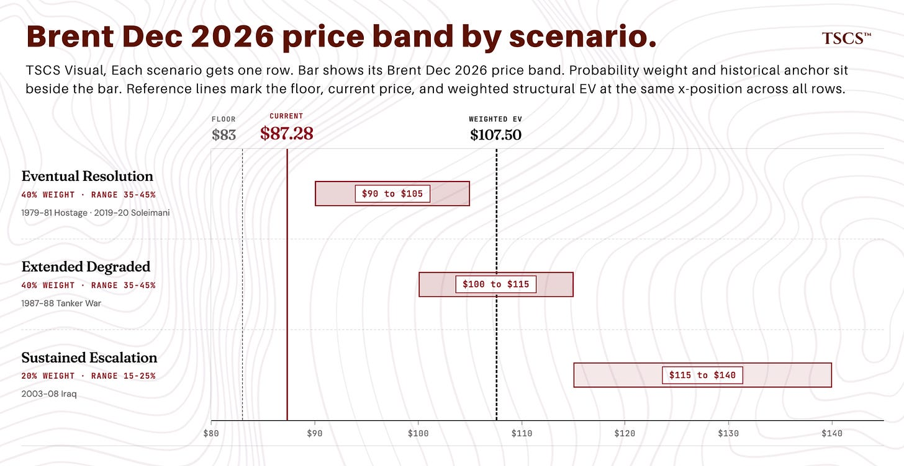](https://substackcdn.com/image/fetch/$s_!Agic!,f_auto,q_auto:good,fl_progressive:steep/https%3A%2F%2Fsubstack-post-media.s3.amazonaws.com%2Fpublic%2Fimages%2F1cba64b8-b908-4fde-8aab-1c45bee8ea87_1846x954.png)

Structural kill switches.

Eventual Resolution accelerates: Hormuz transit volumes >70% of pre-conflict baseline AND a formally announced US-Iran deal of any form within 3 months. Both fire, Eventual Resolution rises to 60-65%.

Extended Degraded confirms: no formal deal AND no comprehensive escalation across 9 months from now. Both fire, Extended Degraded rises to 55-60%.

Sustained Escalation confirms: peer-state direct engagement OR Iranian closure of Hormuz to all traffic for >30 days continuous. Either fires, Sustained Escalation rises to 35-45%.

## **5. Fair Value: Floor and Structural EV**

Two numbers, computed from two methodologies.

**The floor: ~$83 (range $77-91).** Lower bound for Brent Dec 2026 conditional on full Hormuz normalization. Defensible from inventory mechanics and reservoir impairment.

Inputs at midpoints. Post-normalization baseline $70 (Feb 9 EIA Europe Brent Spot FOB at $71.19 is the cleanest reference; using $68-73 range from early-February daily prints, midpoint ~$70, already in mild backwardation reflecting structural tightness). HFI inventory adjustment +$7.50 (range $5-10): drawdowns during the conflict phase have not been replaced. Qatar LNG demand-pull +$2.50 (range $1-4): cross-commodity linkages from LNG export disruption. Reservoir impairment +$3.50 (range $2-5): Iranian production capacity loss is structural; peak Iranian production through 2027 plausibly 200-400 kbd lower than pre-conflict baseline. Structural war risk premium +$1.25 (range $0.50-2): tankers continue to pay slightly elevated insurance, alternative routing premia partially persist. Demand destruction offset -$1.50 (range -$1 to -$2): some 2026 demand destruction is permanent.

Sum at midpoints: $70 + $7.50 + $2.50 + $3.50 + $1.25 - $1.50 = $83.25. Range $77-91. Two-decimal precision is not justified by the input ranges. Floor sits as a range, central tendency near $83.

Component overlap is possible. Inventory tightness, LNG demand-pull, and residual war-risk premium reflect aspects of the same disrupted physical system. Range $77-91 absorbs reasonable double-counting. Floor is a defensible heuristic, not a futures identity.

[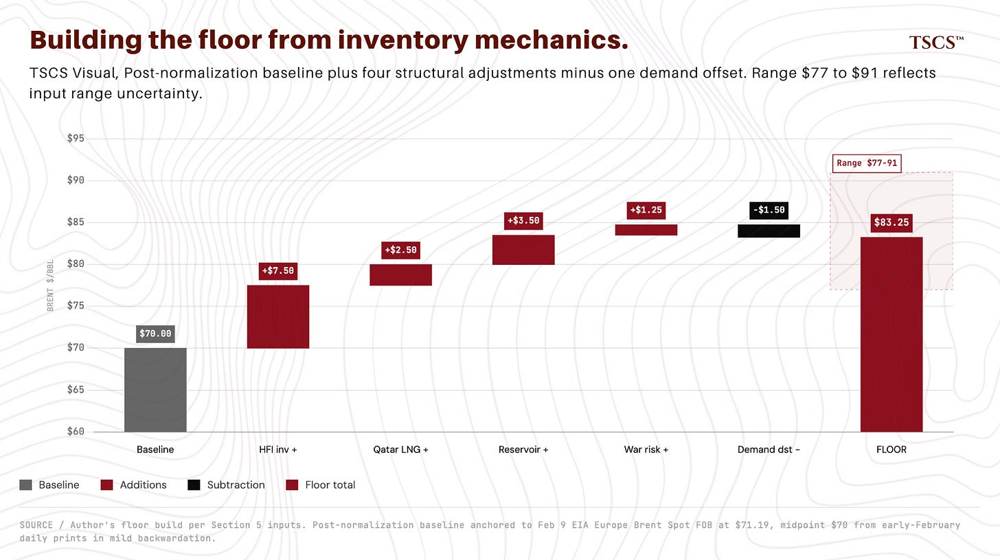](https://substackcdn.com/image/fetch/$s_!CcWu!,f_auto,q_auto:good,fl_progressive:steep/https%3A%2F%2Fsubstack-post-media.s3.amazonaws.com%2Fpublic%2Fimages%2F12fc44b6-9a22-420d-bf12-c81b7cbc50be_1848x1036.png)

The May 6 revision sat near the floor midpoint. Level wasn’t the error, label was. I called that range fair value when it was the floor. Fair value is a different object.

**The structural EV: ~$108 (range $95-115).** Weighted average of the three structural scenarios at midpoints.

Eventual Resolution (40%, midpoint $97.50): $39.00. Extended Degraded (40%, midpoint $107.50): $43.00. Sustained Escalation (20%, midpoint $127.50): $25.50. Sum: $107.50. Range allowing one standard deviation around scenario midpoints: $95-115.

Triangulation against public benchmarks. EIA April STEO sits at ~$96 average 2026 with sub-$90 by Q4 2026 (assumes conflict resolves and transit gradually resumes). Goldman at ~$83 under gradual normalization. Barclays at ~$100 base, ~$110 if disruption persists through end-May. Structural EV at $108 sits at the upper end of the public range. Aggressive but not eccentric. Public benchmarks don’t pin the answer tightly enough to justify a narrow band.

This is the number “Late to Hormuz” should have published if I had separated the structural layer from the tactical scenario set. Materially higher than the May 6 fair value range of $85-93. Also above current Dec 2026 settle of $87.28 (May 8).

[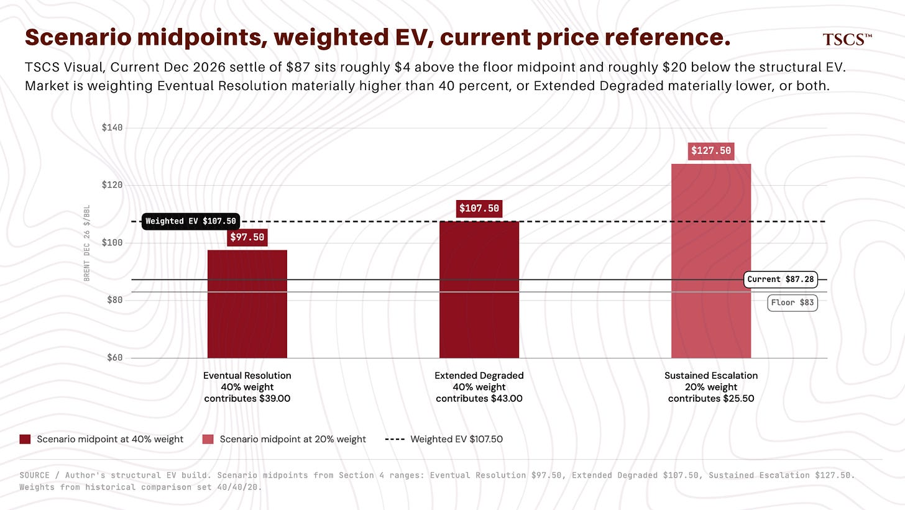](https://substackcdn.com/image/fetch/$s_!HqnX!,f_auto,q_auto:good,fl_progressive:steep/https%3A%2F%2Fsubstack-post-media.s3.amazonaws.com%2Fpublic%2Fimages%2F7ea04cec-1765-4cd4-a5fc-017b2bfe22c5_1844x1040.png)

Brent Dec 2026 at $87 sits roughly $4 above the floor midpoint and roughly $20 below the structural EV ($107.50). Current pricing implies the market is weighting Eventual Resolution materially higher than 40%, or weighting Extended Degraded materially lower, or both.

Cleanest expression isn’t flat-price Dec 2026 anymore. The macro instrument is partially priced. Cleaner alpha sits in second-derivative beneficiaries: services on the quality-damage thesis, refining secondary. Position management for existing flat-price exposure ships with part three.

## **6. The Scoreboard**

**Plan A** (”Late to Hormuz”, May 6): resolved against on the 48-hour window. Settled by the rapid Iranian rejection of the U.S. text as an "American wish-list," the May 7 kinetic exchange and U.S. retaliatory strikes, the May 4-5 and May 8 UAE attacks attributed to Iran. Plan A as a 4-8 week or 6-12 month outcome remains live at materially reduced weight (10% tactical, 40% structural Eventual Resolution). The 48-hour weight of 42% was wrong. Structural weight unchanged.

**Buy The Miners** (Nuclear Series, gold-equity threads through April): working. AEM at $193.21 May 8 (up roughly 2.9%), AGI at $43.38 (up roughly 2.5%). Q1 prints (AEM April 30 after close, AGI April 29) confirmed operating leverage at $4,800+ realized gold (AEM $4,861/oz, AGI $4,829/oz). Both names traded counter to de-escalation May 6; AEM gave back modestly May 7, printed strongly May 8 (+2.9%). AGI extended through May 7-8 on safe-haven bid. Thesis intact. Trim only if AEM breaks $200 or AGI breaks $50 on late-cycle exhaustion volume.

**Cash Not Bonds** (”Priced For Peace”, April 22): carry leg falsified, full position cut. Marketable Treasury custody subline rose from $2,705B on April 15 to $2,726B on May 6, a $21B increase over three weeks. Carry-side kill switch ($5B/week sustained decline for three weeks) fired in the opposite direction. The trade was specified at the carry layer. Switch fired against. Carry-side gold and Treasury short don’t have an independent rationale once custody reverses. Splitting into "carry fired, governance live" would preserve position size under a relabeling. Cut both. Net: book flat the Cash Not Bonds expression. Governance switch (Fed chair transition outcome and first-FOMC-under-new-chair reaction function) becomes a separate, smaller trade when the chair-transition window goes live. Trump nominated Warsh on January 30; Senate Banking advanced him in late April after the DOJ Powell investigation closed and the Tillis hold lifted. Final floor vote pending. The trade goes live on confirmation timing and the first FOMC reaction function under the new chair. Gromen 4.4% 10Y falsification criterion is observation-paused given active diplomatic news flow; wait for a 10Y print above 4.4% in a quiet news week to resolve. Full carry-versus-governance switch architecture, candidate explanations for the custody reversal, implications for the broader rates and reserve diversification thesis develop in part two.

**Palladium futures positioning / SBSW equity expression** (”The 241% Wall”, March): trend reversed on the May 5 print, thesis back on track. CFTC managed money net (NYMEX palladium, futures-only) April 14, 21, 28, May 5: -1,808, -1,786, -2,336, -1,938. Switch set at “shallower than -1,500” for full kill. May 5 print is inside the “shallower than -2,000” zone I previously flagged as confirming the original thesis. Short-cover narrative is showing up. Position: restore from the 30-50% reduction. Hold for the next print to confirm direction. Full kill switch fires (thesis confirmed) at managed money net shallower than -1,500 sustained two consecutive prints.

[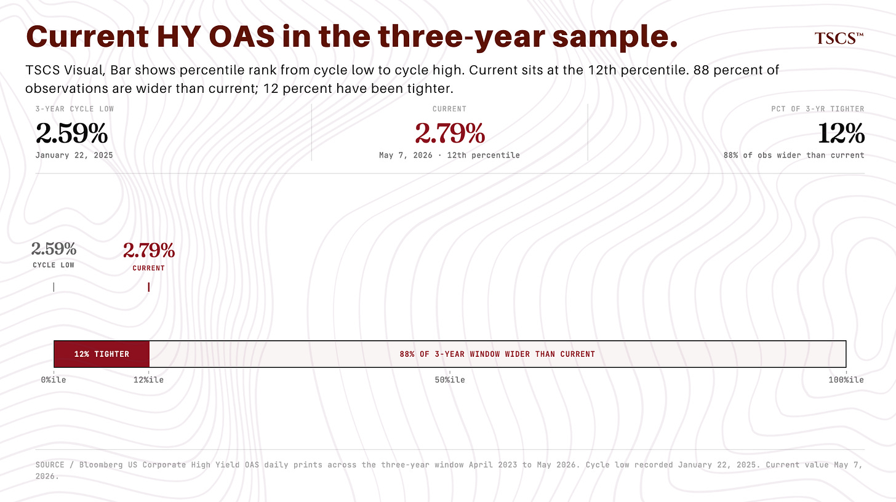](https://substackcdn.com/image/fetch/$s_!Th0p!,f_auto,q_auto:good,fl_progressive:steep/https%3A%2F%2Fsubstack-post-media.s3.amazonaws.com%2Fpublic%2Fimages%2Ffbfa4b7d-7e3c-4fbd-9ea9-e710beffef7c_1846x1034.png)

**BOJ amplifier**: kill switch did not fire on directional read, sizing trimmed pending June. April 28 BOJ Statement showed policy rate held at 0.75% on a 6-3 majority, with Junko Nakagawa, Hajime Takata, and Naoki Tamura dissenting in favor of 1.0%. Tamura’s April dissent invoked moving “as close to the neutral rate as possible.” Three dissenters with a neutral-rate citation is a tightening signal. Up from an 8-1 hold on the rate at March 18-19, where Takata alone dissented for 1.0%. Sizing is the harder question. n=1 vote-count change has no statistical force on its own. Trim the amplifier 25-40% pending June 16-17. Restored if 4+ dissenters confirm at June. Extended if back to 1-2. Caveat: Nakagawa's term ends June 29. The Takaichi government nominated reflationist Ayano Sato in late February to replace her, with both houses of the Diet confirming on March 23. Nakagawa votes at June 16-17 under current expectations. The impending personnel change is a wildcard for the post-June dissent-count read, with Sato widely expected to lean dovish.

**Short The Packagers** (May 6): long Permian ethane via DOW and WLK, short the packaging consumer of ethane (AMCR). May 6 tape hurt the long leg (DOW down 5.64%, WLK lower on the de-escalation tape). DOW $36.87 May 8 close, WLK $93.85, AMCR around $40 essentially flat. Net negative on May 6-8. Structural thesis (sustained Permian ethane premium under Eventual Resolution and Extended Degraded scenarios) intact. Hold, do not add until WLK base-builds above $94 with a 3-day reversal pattern..

**Mosaic / phosphate**: tape unhelpful, thesis pending Q1. MOS at $22.19 May 8 close, fresh 52-week low (prior low $22.74). Q1 earnings May 11 at 11:00 AM ET. Phosphate as proxy for structural commodity and geopolitical premium. If Q1 confirms phosphate pricing power and operating leverage, position holds. If Q1 disappoints on margin or guidance, position cut.

[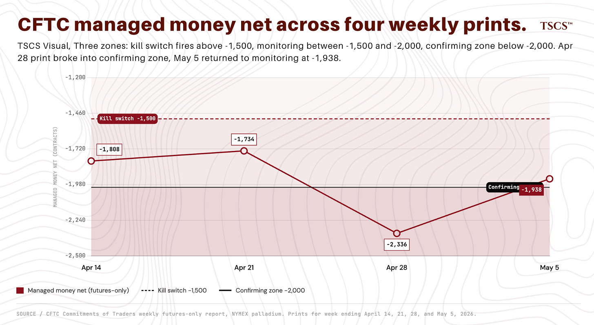](https://substackcdn.com/image/fetch/$s_!22PC!,f_auto,q_auto:good,fl_progressive:steep/https%3A%2F%2Fsubstack-post-media.s3.amazonaws.com%2Fpublic%2Fimages%2F7d173902-7bfe-4900-96a8-92433e537bbe_1848x1014.png)

On the credit channel. HY OAS at 2.79% May 7. 3-year sample low is 2.59% (January 22, 2025), with multiple readings clustered late November 2024 through February 2025 below current. Roughly 12% of observations in the 3-year window have been tighter. Spreads are compressed but not at cycle tights. Credit is still paying very little attention to the second-order risks the tactical framework prices as material.

[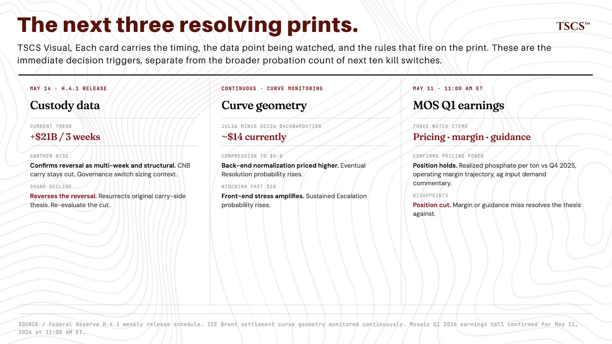](https://substackcdn.com/image/fetch/$s_!RRo4!,f_auto,q_auto:good,fl_progressive:steep/https%3A%2F%2Fsubstack-post-media.s3.amazonaws.com%2Fpublic%2Fimages%2Ffb8e3483-1c15-4f19-aae7-2f59696a59dd_1846x1038.png)

## **7. What I’m Watching**

Three data points across the next 2-4 weeks. Each fires a kill switch or drives a position decision.

Custody data (next H.4.1 release, May 14). Another rise confirms the trend reversal as multi-week and structural. A sharp decline reverses the reversal, resurrects the original carry-side thesis. Most important data print of the next 7 days.

Curve geometry (front-month minus Dec 2026 backwardation). Currently around $14. Compression toward $5-8 means the market is pricing more back-end (Dec 2026 rallying relative to front-month), higher probability of structural normalization. Widening past $20 means more front-end stress, higher Sustained Escalation probability.

MOS Q1 earnings (Monday May 11, 11:00 AM ET). Phosphate pricing power, operating leverage, Q2 guidance. Three specific items: realized phosphate pricing per ton vs Q4 2025; operating margin trajectory; commentary on global ag input demand including South Asia and Brazil.

## **8. Closing**

The 48 hours produced an answer. Not the one I weighted. Architectural fix handles the category error. The probability-judgment error needs different discipline.

Two-layer architecture. Honest weights and intervals. Position size matched to evidence strength. Scoreboard with marks against publication conviction. That’s the framework on probation.

Probation has a defined exit criterion in both directions. If across the next ten published kill switches the strike rate is 7+ no-fires, probation lifts and the framework is graded as functioning roughly as intended. If 3 or fewer no-fires, the framework is selecting for false-precision in regimes the data won’t support, and the architecture itself gets revised. Between 4 and 6, probation extends and the next ten resolve it.

Probation is the discipline. In writing. Most publications don’t offer the mechanism.

Brent Dec 2026 at $87 versus structural EV at $107.50: the macro instrument is partially priced. Part three develops where the alpha lives. Services as primary translation of the quality-damage thesis (reservoir impairment, multi-year capex normalization). Refining as secondary (USGC light-sweet quality spread, crack persistence). Readers already long Dec 2026 from the May 6 entry: cut to roughly 25-30% of original size, redeploy into the translation legs at evidence-matched sizing. Specific names, kill switches, entry framing in part three.

Part one ships the architecture. Part two, “Cash Not Bonds Reconsidered,” ships the carry-versus-governance switch architecture with full custody analysis, within 5 days. Part three ships the equity translation, within 7-10 days. Framework on probation runs across the three.

Architecture, not authorisation. Sizing, execution, book-fit: reader calls. Kill switches in Sections 3 and 4 govern when the architecture itself comes off.

Part two ships within 5 days. Part three within 7-10 days. The probation timer starts now.