Three months after the worst silver crash since 1980, the futures market thinks the story is over.

The lease desks at JPMorgan, HSBC, and ICBC Standard disagree. So does the COMEX delivery floor. So does the Shanghai Gold Exchange. Three of these four signals are run by people who actually move physical metal. The fourth runs on screens. Pick which set you’d trust to call the next squeeze.

Thursday January 29, 2026: spot silver printed an intraday peak of $121.67 and every silver bull on Twitter felt vindicated. Roughly thirty hours later, COMEX silver settled at $78.53. Worst single session since March 1980. $70 to $80 billion in above-ground silver value erased. Every leveraged long who hadn’t trimmed by Thursday afternoon got margin-called by Friday’s open. The consensus moved on inside two weeks: solar demand softening, China export rules tighter on paper than in practice, recession pricing in, structural thesis on hold.

[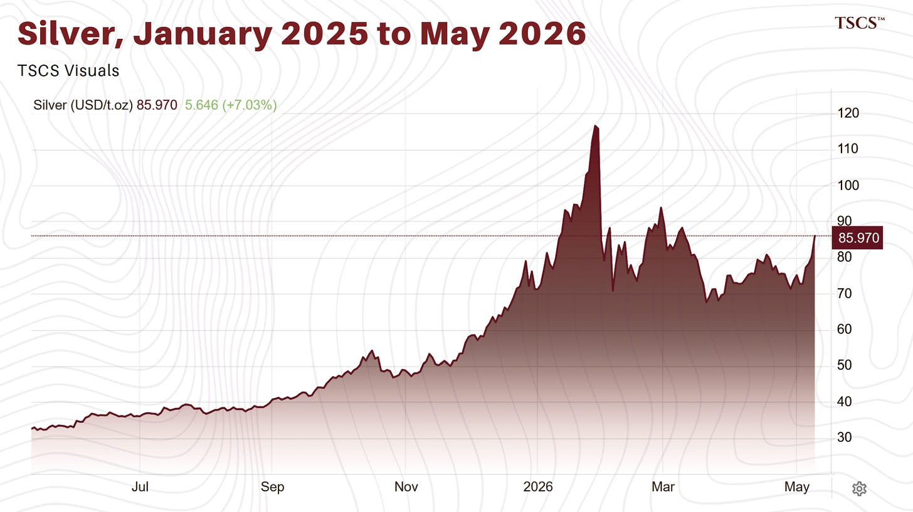](https://substackcdn.com/image/fetch/$s_!JQFq!,f_auto,q_auto:good,fl_progressive:steep/https%3A%2F%2Fsubstack-post-media.s3.amazonaws.com%2Fpublic%2Fimages%2F12dd47a1-0d3c-4b06-a276-a2f181f92ba3_2048x1149.png)

The structural thesis is intact. The trade has changed.

Two markets are looking at the same metal for the same forward window, on the same Bloomberg session, pricing two different stories. The London silver lease market says forward physical is scarce. The COMEX futures curve says it isn’t. The gap is 200 basis points and has held for six consecutive months. Two other corroborating signals (COMEX warehouse stocks down 41% from the October 2025 peak to below the 5Y average, Shanghai Gold Exchange silver at a 10 to 15% premium to London) line up with the lease market. The futures curve, alone, doesn’t.

[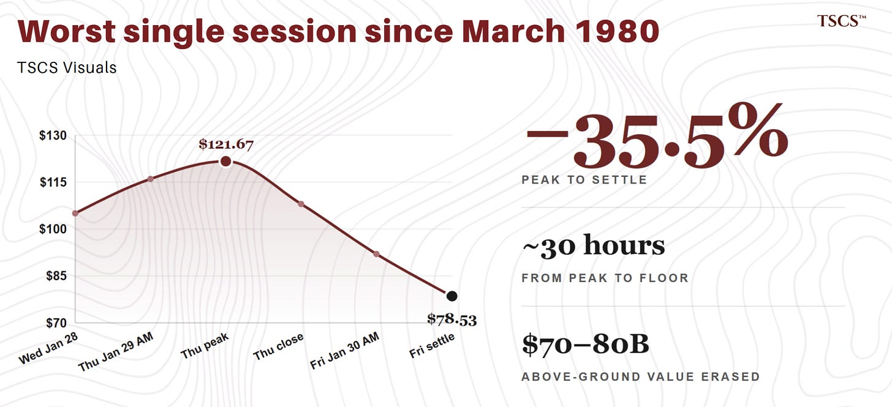](https://substackcdn.com/image/fetch/$s_!VCrR!,f_auto,q_auto:good,fl_progressive:steep/https%3A%2F%2Fsubstack-post-media.s3.amazonaws.com%2Fpublic%2Fimages%2Fb72eb764-f221-4be5-b24f-fdf2c662d387_2048x936.png)

Working out which is wrong, and what trade follows, is what this piece does. The basket trade in silver miners is structurally weak. Asymmetric exposure has shifted to specific names. The next piece is the names.

*800 Million Ounces Short* is the long-form structural case. For the mechanical anatomy of the January crash itself, see *The 31% Silver Crash: Why Markets Got It Wrong*. This stands alone.

Subscribed

**The names are paid-only.** Specific primary producers ranked by silver-revenue exposure and forward AISC, royalty and streaming names worth holding, plus a small set of developers and juniors flagged as either underpriced or structurally short. The framework above narrows "buy silver miners" to "buy these specific silver miners." The next piece is the names. Drops next week.

## **I. The Structural Case, Compressed**

Silver has run a supply deficit every year since 2021. WSS 2026 (April 15, 2026): 2025 deficit at 40.3 Moz, fifth consecutive, 2026 projected at 46.3 Moz. Cumulative drawdown from above-ground stocks since 2021: 762 Moz. London market free float at end-September 2025: roughly 136 Moz, a record low against 2025 industrial silver demand of 657.4 Moz and total global demand of 1.13 billion ounces. London free float has rebuilt to approximately 28% of vault holdings of 884 Moz by end-March 2026, up from 17% at the September trough, as metal flowed back from US warehouses. System less impaired than at the October peak. Still tight against the structural backdrop.

Industrial demand composition has shifted from cyclical to structural (solar, semiconductor packaging, AI infrastructure, EVs, grid modernization). The headline trajectory has weakened. WSS 2026: industrial fabrication declined 3% in 2025 to 657.4 Moz, the first post-pandemic decline, with PV silver demand down 6% to 186.6 Moz on thrifting acceleration. 2026 forecast: industrial demand declines further, PV silver demand projected down 19% to 151 Moz as module manufacturers accelerate copper substitution and reduce silver loadings per cell. Structural composition argument operates on 3-to-5 year horizon. The 12-month industrial demand trajectory sits softer than the headline bull case implies. Any positioning that requires industrial demand to grow in the next twelve months is taking substitution risk that WSS 2026 has put into the official base case. The consensus bull missed this. WSS 2026 made them deal with it.

[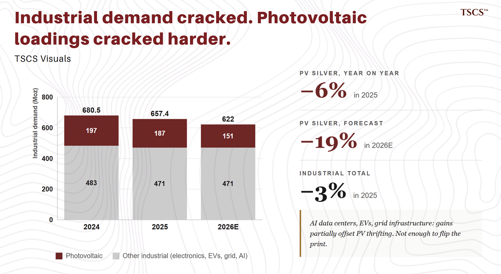](https://substackcdn.com/image/fetch/$s_!uuEi!,f_auto,q_auto:good,fl_progressive:steep/https%3A%2F%2Fsubstack-post-media.s3.amazonaws.com%2Fpublic%2Fimages%2F5fc89410-d6a4-4d05-b68b-e44cd1739b9d_2048x1124.png)

Normal commodity self-correction is broken because 70 to 75% of mined silver is byproduct of copper, lead, zinc, and gold operations whose capital allocation doesn’t respond to the silver price. Global silver mine production rose to 846.6 Moz in 2025 and is forecast broadly flat in 2026 per WSS 2026. Demand is outrunning supply. Supply itself isn’t collapsing.

The US designated silver a critical mineral in November 2025. China updated its silver export framework effective January 1, 2026, replacing the prior quota system with a licensing regime under which 44 approved firms (up from 42) require government approval per shipment, with new entrants needing 80+ tonnes annual production capacity. Licensing layer genuinely new. Exporter list expanded modestly. License reviews can run 45 days or longer, which adds friction to flows. 2025 Chinese silver exports reached a 16-year high of approximately 5,100 tonnes, indicating pre-2026 flows were elevated rather than constrained. Treating China’s licensing regime as the supply shock that prints silver to $200 is the kind of lazy bullshit that fills retail Substacks. Treating it as nothing is also wrong. The honest read: friction is real, hard quotas don’t exist, and the question is whether 45-day reviews start to bite as 2026 progresses.

Setup going into 2025. Metal opened the year at $28.92. Broke $50 in October during a London market freeze where one-month lease rates hit 34.9% on Bloomberg with intraday prints to 39.2% reported by Bruce Ikemizu of the JBMA. Printed $80 in December. Reached its all-time intraday high above $121 on January 29. Then one of the most leveraged macro trades of the cycle detonated on January 30, and silver lost a third of its value in roughly thirty hours.

[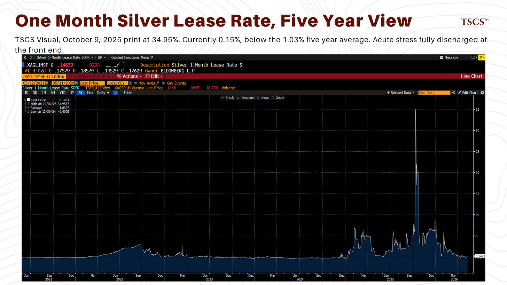](https://substackcdn.com/image/fetch/$s_!fVAF!,f_auto,q_auto:good,fl_progressive:steep/https%3A%2F%2Fsubstack-post-media.s3.amazonaws.com%2Fpublic%2Fimages%2F681782ea-81d5-4287-9916-ee10fb13d126_1888x1062.png)

The 2026 LBMA Forecast Survey collected silver forecasts from 26 to 31 analysts. Range runs from $44 at the low end (TD Securities) to $165+ at the high end (Metals Daily / LBMA bull respondent), consensus around $79.57. J.P. Morgan at $81 average, Commerzbank at $90, Metals Focus at $60. A separate Bank of America bull scenario published in late January reaches $135 to $309 if physical deficits intensify sharply and the gold-silver ratio compresses to 1980 levels. Conditional tail, not a base case, but worth noting as the ceiling of professional thinking about what’s mechanically possible. A 3.75x range across base case forecasts ($44 to $165), before considering tail scenarios. The market isn’t disagreeing about facts. It’s genuinely uncertain about how a structurally broken commodity reprices in real time. That uncertainty is the trade.

[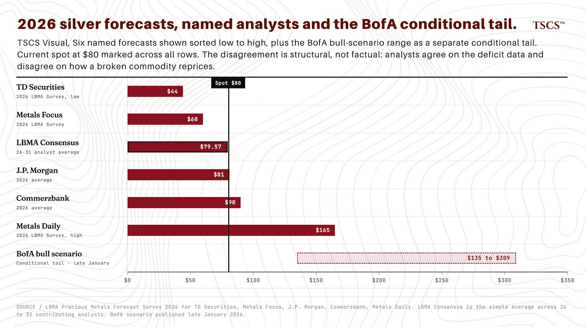](https://substackcdn.com/image/fetch/$s_!-twb!,f_auto,q_auto:good,fl_progressive:steep/https%3A%2F%2Fsubstack-post-media.s3.amazonaws.com%2Fpublic%2Fimages%2F21af778a-e668-4a02-b788-2ccb836964d6_1888x1054.png)

The structural case above is consensus bull narrative going back eighteen months. You’ve read it ten times in different wrappers. Not original. What follows is.

## **II. The 30-Hour Round Trip And Its Aftershock**

The EFP spread (front-month COMEX silver minus London spot) is the cleanest single number for measuring stress in the paper-physical relationship. Normal conditions: within a few cents either direction, reflecting small cost-of-carry differentials between New York paper and London bullion. Five-year mean: negative seventy-seven cents. Five-year standard deviation: $4.21.

I pulled the daily EFP series on Bloomberg from January 20 to February 10, 2026. The sequence:

January 23: spread closed at negative $1.86, inside the normal range.

January 26: spread blew out to positive $11.72. Front-month COMEX futures traded nearly twelve dollars above London spot. 2.96 standard deviations above the five-year mean. Panicked paper longs paying any price to maintain futures exposure as short squeeze dynamics accelerated. Physical settlement frictions prevented London spot from catching up at the same pace.

January 27 to 29: spread compressed to negative $6.13, negative $3.16, and negative $1.27 as silver itself ripped higher and the futures-physical gap closed.

January 30: Warsh nomination hit, the leveraged long book detonated under margin call pressure, EFP printed negative $6.67. Same metric, opposite direction. 1.40 standard deviations below the five-year mean.

In four trading days, the spread traveled from +$11.72 to -$6.67. An eighteen-dollar swing in a metric whose normal range is plus or minus a few dollars.

Thursday February 5, four trading days after the crash bottom, changes the diagnosis. A single extreme reading on January 26 followed by a single offsetting reading on January 30 is consistent with a one-shot squeeze and unwind. A third extreme reading four trading days after the unwind looks like a market still finding equilibrium across paper and physical pools.

The EFP printed positive $5.80 that day. A second statistically extreme reading, opposite direction from January 30. By February 10 the spread had returned to negative $0.43.

[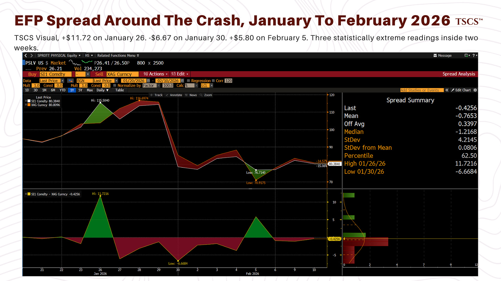](https://substackcdn.com/image/fetch/$s_!hxXp!,f_auto,q_auto:good,fl_progressive:steep/https%3A%2F%2Fsubstack-post-media.s3.amazonaws.com%2Fpublic%2Fimages%2F45953727-e5e6-481c-86ac-04cbd26a9ddc_1886x1060.png)

Translation: silver market microstructure broke down repeatedly during stress rather than in a single event that cleanly resolved. Mechanical reading: January 26 was paper longs paying a $12 per ounce premium over London spot to maintain futures exposure during the parabolic move. January 30 was physical London trading at a $6.67 per ounce premium over collapsing futures during the crash. February 5 was a second round of paper-versus-physical dislocation as remaining positioning unwound. Three readings, all statistically extreme, all in a two-week window.

During the crash, physical silver repriced less violently than paper. Spot silver fell from $115.70 on January 29 to $85.20 on January 30, a 26% decline. Front-month COMEX futures fell from $114.43 to $78.53, a 31% decline. Both violent. The five-percentage-point differential is physical demand absorbing some of the futures liquidation. A crash where both markets sold off equally would have meant genuine demand exhaustion. Differential pattern: leveraged-positioning event, not fundamental rerating. Anyone selling you “silver got it wrong” or “the rally is dead” wasn’t reading the EFP.

October 2025 was the dress rehearsal for January. On October 9, 2025, one-month silver lease rates hit 34.9% on Bloomberg with intraday prints to 39.2% per JBMA chief Bruce Ikemizu. Spot broke $50 for the first time since 1980. The London bullion market physically seized for ninety minutes. Lease rates measure the cost of borrowing physical silver in the bilateral lending market between bullion banks and short sellers, traders, and refiners covering obligations. A 34.9% Bloomberg session reading on a rate whose five-year average sits around 1.0% is the market saying lenders effectively stopped lending.

October drained the lendable pool, January drew the remaining speculative interest into the long side, the January 30 crash cleared the speculative excess. None of it cleared the structural damage to the physical lending market.

## **III. Three Independent Measurements, One Outlier**

This isn’t a one-signal argument. Three measurements of physical silver scarcity, generated by structurally independent participant sets operating in different venues with different mechanics, are aligned in direction. The fourth (the COMEX silver futures curve) sits at the calm end of plausible readings. The system is less impaired than at the October peak. London free float has rebuilt from approximately 17% of vault holdings in September 2025 to approximately 28% by end-March 2026. Front-end lease rates have normalized. The EFP spread has returned to inside its normal range. The three signals identified below persist after that partial healing. Structural, not acute.

**Signal one: the bilateral lending market in London.** Bullion banks lend physical silver to refiners, miners, traders, and short sellers covering obligations. The lease rate they charge is the price of physical silver scarcity in the OTC market. The 12-month silver lease rate currently sits at approximately 1.6% (Bloomberg session, May 2026, TSCS internal pull), against a five-year average closer to 1.0% on the same series. 1-month rate has normalized to 0.15%. 3-month sits at 0.91%, modestly below its 1.04% 5Y average. Front of the curve has healed. Back has not. Reuters and Metals Focus described silver lease rates as “largely normalised” by mid-April 2026; that description refers to front-end normalization, not full-curve healing. Term-structure shape is the specific feature that isolates physical scarcity from acute stress. Bullion banks who lend physical for 12 months are pricing in counterparty and availability risk they weren’t pricing six months ago. The participants here are JPMorgan, HSBC, ICBC Standard, and a small number of similar bilateral desks. Institutional memory of multiple precious metals cycles. Longest-tenured precious metals risk teams in the world. They’re pricing tail risk for forward physical because October and January taught them the tail can land.

[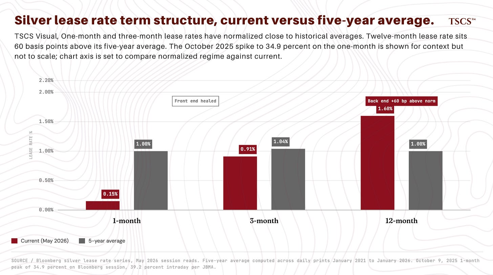](https://substackcdn.com/image/fetch/$s_!xqt2!,f_auto,q_auto:good,fl_progressive:steep/https%3A%2F%2Fsubstack-post-media.s3.amazonaws.com%2Fpublic%2Fimages%2F334df5e3-ba55-4327-a5a5-131f2642070e_1886x1050.png)

**Signal two: the COMEX exchange-cleared delivery market.** Total silver stocks in COMEX-approved depositories sit at 312 Moz as of May 8, 2026, down from a peak of 532 Moz on October 3, 2025. A 220 Moz drawdown in seven months. 41% decline. Current level sits below the 5Y average of 346 Moz, approaching the November 2023 cycle low of 266 Moz. The bleed isn’t paperwork. Physical silver is leaving the COMEX warehouse system entirely, not being reclassified within it. Approximately 76 to 80 million ounces of the 312 Moz total is registered (carrying warehouse warrants, immediately available for delivery), against roughly 575 million ounces of paper claims on open interest. Registered coverage ratio: 13.4%, below the 15% stress threshold defined by COMEX analysts and below threshold for six consecutive months. The eligible pool that gets warranted into deliverable supply under stress has bled from roughly 404 Moz at the October peak to roughly 234 Moz currently. The buffer is gone. January 2026: 33.45 million ounces (roughly 26% of the then-deliverable pool) disappeared from registered inventory in a single week. March 2026: 46.1 million ounces stood for delivery, approximately 60% of the then-current registered stock in a single month. Participants: institutional commodity traders, industrial end users, refiners standing for physical delivery. Different participants from the lease market. Different venue. Same direction.

[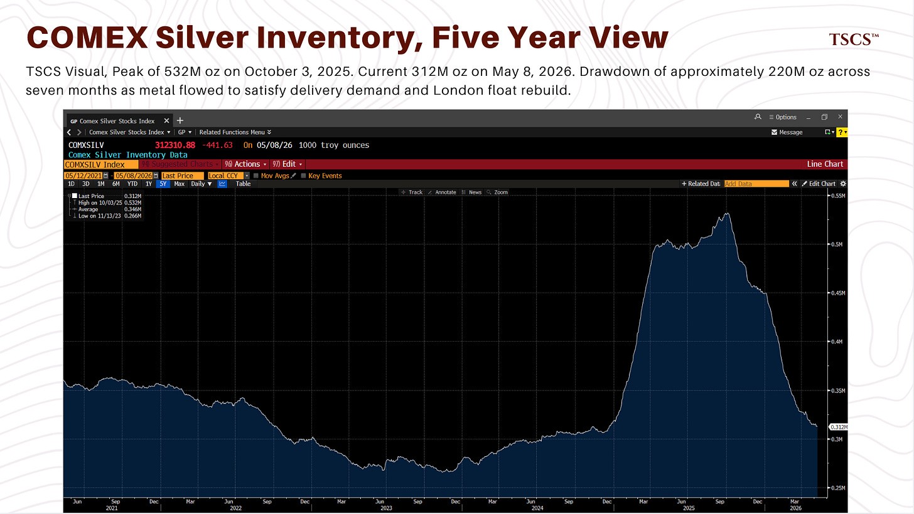](https://substackcdn.com/image/fetch/$s_!2CU-!,f_auto,q_auto:good,fl_progressive:steep/https%3A%2F%2Fsubstack-post-media.s3.amazonaws.com%2Fpublic%2Fimages%2Fcc9322ff-0b07-4f3d-ba75-3dc9111765e8_1890x1064.png)

**Signal three: the Chinese physical market.** Shanghai Gold Exchange silver benchmark traded at a premium to London spot of approximately 10 to 15% through Q1 2026 per LBMA reporting, above the post-2020 norm on any reasonable methodology basis. Methodology caveat: Chinese silver import VAT is 13%, which means VAT-inclusive landed cost premiums of 15 to 20% are routine and the signal lives in deviations from that band. SGE benchmark prices are quoted pre-VAT and a sustained ex-VAT premium above 6% sits well above post-2020 norm. Direction of the signal holds either way. The yuan has strengthened from 7.22 to 6.80 against the dollar over the past twelve months, making dollar-denominated silver roughly 6% cheaper in CNY terms. Chinese physical buyers absorbed that FX tailwind and still paid the 10 to 15% premium to London. Either alone would be a meaningful demand signal. Both together is unusual. Participants: Chinese industrial users (solar, electronics, semiconductor packaging) and Chinese physical investors. Third venue, third set of participants, same read.

**The fourth measurement: the COMEX silver futures curve.** Forward curve from front-month out to Dec 2030 sits in textbook contango at approximately the risk-free rate. Implied convenience yield essentially zero, the reading you’d expect in a market with comfortable forward physical availability and no scarcity premium. Clearing structure of the futures market mutualizes counterparty risk, so the curve doesn’t need to embed the bilateral risk premium the lease market does. But it should embed the underlying physical scarcity the exchange-cleared delivery market is pricing through coverage ratio stress, and that the Chinese physical market is pricing through premium. It doesn’t.

Three independent measurements of forward physical scarcity agree. One disagrees. Which is wrong.

[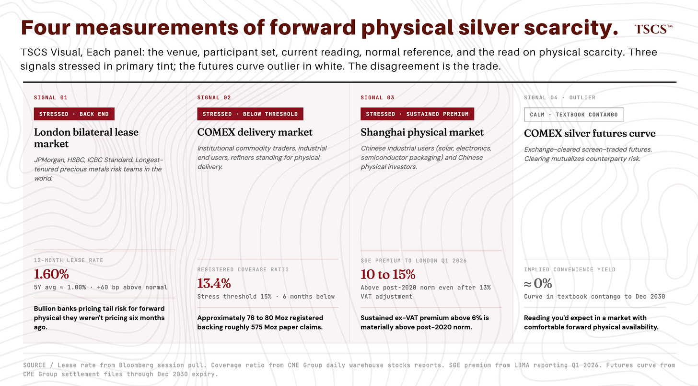](https://substackcdn.com/image/fetch/$s_!Eq86!,f_auto,q_auto:good,fl_progressive:steep/https%3A%2F%2Fsubstack-post-media.s3.amazonaws.com%2Fpublic%2Fimages%2Fec78c74f-559f-4655-ab49-9c1c6b47525a_1888x1048.png)

## **IV. Two Convenience Yields For The Same Metal**

Analytical core. Falsifiable. Arithmetic any reader with a Bloomberg terminal can replicate.

The COMEX silver forward curve and the London silver lease rate curve are pricing two different convenience yields right now. Futures market: approximately zero convenience yield. Lease market: approximately 200 basis points. Both readings from the same Bloomberg session, same day. The 200 basis point gap is the most important structural signal in silver microstructure post-squeeze. It feeds directly into the producer trade.

Arithmetic, with sensitivity acknowledged where assumptions matter, tenors deliberately matched to the lease curve so the comparison is apples to apples.

Futures curve, May 11, 2026. SI1 (May contract) at $80.40. Dec 2026 at $82.29. Dec 2027 at $85.58. Dec 2030 at $92.25. Implied annualized carry from SI1 to Dec 2026: approximately 4.0%. At the 12-month tenor specifically (the comparison point against 12M lease), implied carry is approximately 4.0% annualized, interpolating between the 7-month and 19-month points and consistent with the near-curve shape. Carry from SI1 to Dec 2030 flattens to approximately 3.0% annualized, which begins to imply meaningful positive convenience yield at the far end of the curve but isn’t the comparison that matters for this section. Near-to-medium tenor sits in textbook contango at approximately the risk-free rate.

[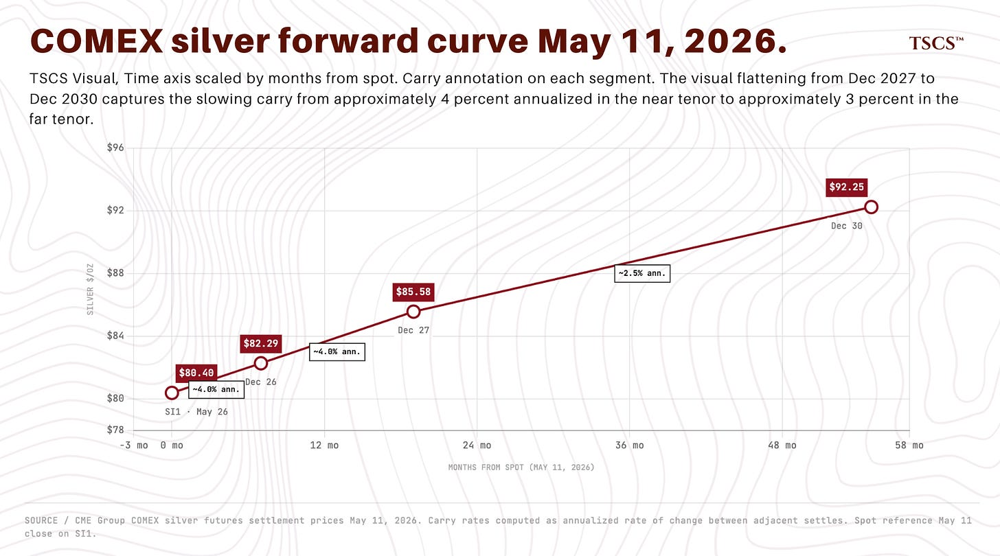](https://substackcdn.com/image/fetch/$s_!rpbh!,f_auto,q_auto:good,fl_progressive:steep/https%3A%2F%2Fsubstack-post-media.s3.amazonaws.com%2Fpublic%2Fimages%2F876dae56-35d8-4a22-87d0-9e25b59e1be6_1888x1050.png)

Decomposing the futures cost of carry. Theoretical cost of carry equals financing cost plus storage cost minus convenience yield. SOFR sits at approximately 3.6% across the relevant tenors (NY Fed reference rate, May 8, 2026). LBMA-quality silver storage at major commercial vaults runs roughly 0.2 to 0.6% per year depending on whether the metal is allocated or unallocated, vault location, and institutional terms. Using the midpoint of 0.4%:

4.0% = 3.6% + 0.4% - convenience\_yield\_futures

Solving: convenience yield implied by the futures curve is approximately 0.0%. Storage at 0.2% (low end) implies negative 0.2% convenience yield (unsustainable in equilibrium, indicating storage assumption is too low). Storage at 0.6% implies 0.2% convenience yield. Across the reasonable range, futures market is pricing convenience yield essentially at zero.

[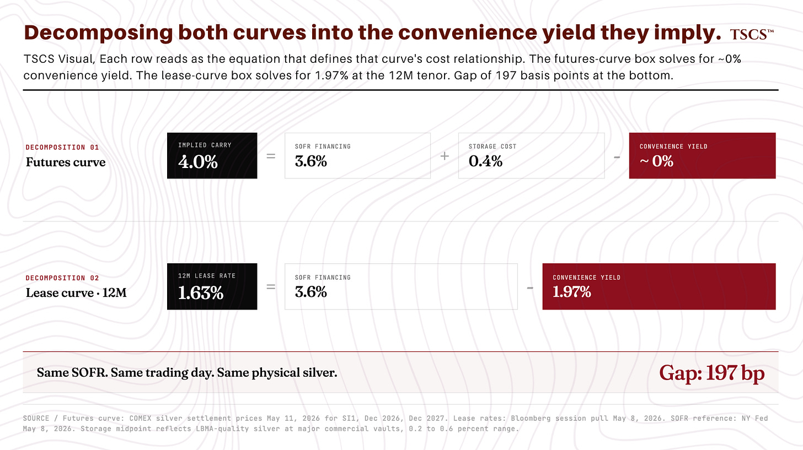](https://substackcdn.com/image/fetch/$s_!HqVS!,f_auto,q_auto:good,fl_progressive:steep/https%3A%2F%2Fsubstack-post-media.s3.amazonaws.com%2Fpublic%2Fimages%2F3096a222-cc49-42fe-809b-74b282b8bf6a_1888x1060.png)

Lease curve, same day. One-month silver lease rate (Bloomberg SOFR basis): 0.15%. Three-month: 0.91%. Twelve-month: 1.63%. Five-year averages: 1M at 1.03%, 3M at 1.04%, 12M at 1.05%.

Decomposing the lease cost. A bullion bank lending physical silver foregoes the financing cost of holding cash equivalent to the silver’s value. In equilibrium, the lease rate equals the financing cost minus the silver’s convenience yield to the lender. So:

1.63% = 3.6% - convenience\_yield\_lease

Solving: convenience yield implied by the lease curve at the 12-month tenor is approximately 1.97%.

[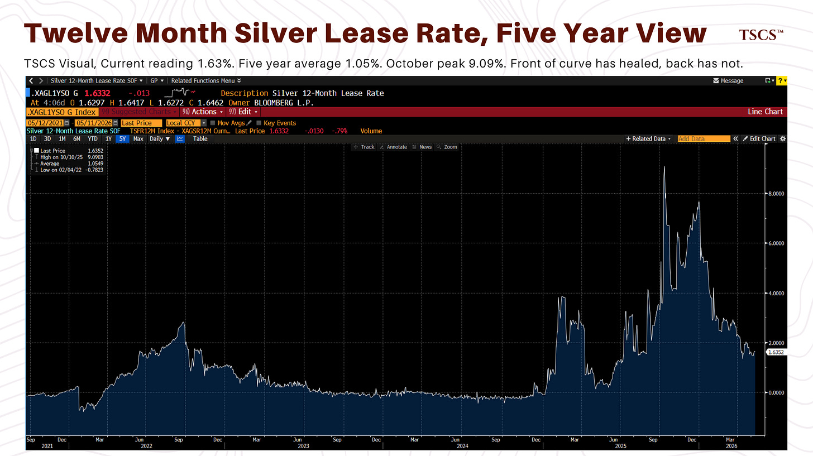](https://substackcdn.com/image/fetch/$s_!WcFq!,f_auto,q_auto:good,fl_progressive:steep/https%3A%2F%2Fsubstack-post-media.s3.amazonaws.com%2Fpublic%2Fimages%2F2e09f75f-bee7-464f-b556-0ebd7c4eedaa_1888x1060.png)

Two markets, same underlying physical asset, same trading day, pricing convenience yields that differ by roughly 200 basis points. The gap is robust to reasonable variation in storage cost assumptions: even pushing storage to 0.6% (high end) and assuming the futures curve implies 0.2% convenience yield, the gap with lease-implied 1.97% stays at approximately 180 basis points. Signal is real.

Two measurements of the same underlying construct should converge in a frictionless integrated market. The convenience yield in both decompositions represents the same thing: the value to a holder of physical silver of having metal in hand against the alternative of holding cash. The 200 basis point divergence is itself the signal that the bilateral lending venue and the exchange-cleared futures venue aren’t fully integrated, and that the frictions between them are pricing structurally rather than transiently.

Two candidate frictions explain the gap. Both favor the structural argument.

First, counterparty risk in bilateral lending. The standard lease decomposition (lease rate = financing rate minus convenience yield) doesn’t separate the counterparty risk premium from underlying scarcity. The 1.97% implied convenience yield from the lease decomposition therefore overstates pure convenience yield by whatever risk premium lenders are charging, which is exactly what October 2025 and January 2026 taught them to charge. A bullion bank lending physical silver to a borrower in a stressed market faces the possibility the borrower can’t source metal to return, leaving the lender holding paper claims against a counterparty that can’t deliver. October’s 34.9% Bloomberg lease rate peak and the broader market freeze taught the bilateral lending desks at JPMorgan, HSBC, ICBC Standard, and similar counterparties that the worst case can land. True convenience yield sits below 1.97% but above zero because lenders are pricing real risk that has materialized twice in seven months.

Second, arbitrage impairment in the futures market. The cash-and-carry arb that pins forward prices to the no-arbitrage upper bound operates normally for storable silver: buy spot, store, sell forward, repay financing. That arb constrains the futures curve from above. The reverse arb, which would pull forward prices up when they sit too low, requires borrowing physical silver to short, and the lease market is exactly the venue where that borrowing has become structurally expensive at the 12M tenor. When reverse arb is impaired, forward prices can settle below their fundamental level. Near-zero implied convenience yield from the curve in that case understates the true scarcity premium because the curve mechanism that would normally lift forwards toward equilibrium is broken.

Signal is robust to which friction dominates. If counterparty risk is the bigger wedge, true convenience yield sits somewhere between 0% and 1.97%, lease curve overstates by the counterparty risk premium, futures curve is the cleaner measure of underlying scarcity. If arb impairment is the bigger wedge, true convenience yield runs closer to 1.97%, futures curve understates because of broken price discovery, lease curve is the cleaner measure. Either way the gap is the signal. The futures curve at the risk-free rate is either right because lenders are overpricing tail risk that won’t materialize, or wrong because it can’t fully price scarcity that the lending venue captures directly. The structural bull thesis survives either reading. The only reading that defeats the signal is the case where lease curve elevation is pure interest rate volatility noise rather than scarcity pricing, which Objection 1 addresses.

The clearing structure of the futures market is part of the mechanical explanation but not the full story. CME clearing mutualizes credit risk for futures participants, so the curve doesn’t need to embed the bilateral counterparty premium the lease market does. But clearing structure doesn’t explain why the futures curve fails to embed the scarcity premium that the COMEX delivery market (same exchange, same physical pool, same clearing house) is pricing through coverage ratio stress at 13.4% for six consecutive months. The clearing argument explains one frictionless slice of the divergence. Other frictions explain the rest.

Four objections worth addressing.

**Objection one:** the elevated 12M lease rate reflects higher interest rate volatility, not physical scarcity. Most credible counterargument. Lease rates contain an interest rate component, and interest rate volatility has been elevated through 2024-2025.

Rebuttal: if the elevation were purely a function of interest rate volatility, the entire lease curve would be elevated proportionally. Instead, the one-month lease rate sits below its five-year average while the twelve-month sits 55% above. The shape of the curve, specifically its anomalous steepness, isolates physical risk pricing from interest rate risk pricing. Interest rate volatility would lift the curve broadly with relatively normal slope. Depressed front and elevated back isn’t interest rate effects.

**Objection two,** the most important methodological caveat: I haven’t run a continuous decomposition of the futures-versus-lease convenience yield gap across the 2018 to 2024 window. The lease rate series requires session-by-session pulls and the work is non-trivial. I sampled approximately fifteen trading sessions across 2019, 2021, and 2023, selected to avoid acute stress windows. Convenience yield gap distribution: 30 to 80 basis points. Sample too small and non-randomized to support a percentile claim about the current 200 basis point reading. Directional claim (200 basis points is materially wider than the post-2018 normal range) survives the absence of a continuous series. Precision of the claim does not. Continuous series is on the queue for a follow-up. Until then, the 200 basis point figure should be treated as a strong informal signal rather than a statistically established anomaly.

[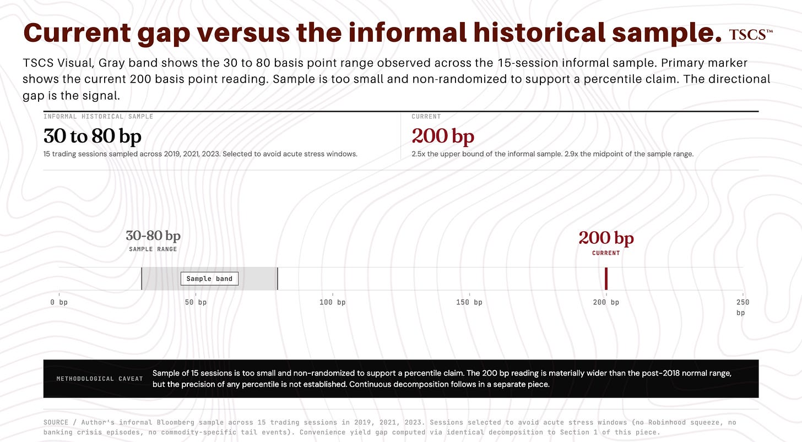](https://substackcdn.com/image/fetch/$s_!hCsT!,f_auto,q_auto:good,fl_progressive:steep/https%3A%2F%2Fsubstack-post-media.s3.amazonaws.com%2Fpublic%2Fimages%2F9ba84adf-b470-4689-ad76-e82487a9e8fa_1886x1040.png)

**Objection three:** data series too short and we shouldn’t infer regime shift from a few months of readings. Right caution. The 12M lease rate has been elevated above 1.4% since November 2025, which is six months of sustained readings. Pattern is consistent with how bilateral lending markets price counterparty risk after stress events: front-end normalizes quickly as the acute episode discharges, back-end repairs slowly or never. I don’t have verified historical lease rate data over multiple prior cycles in a clean enough form to compute a base rate for “elevated 12M lease eventually leads to additional physical stress.” What I can say is the lease curve hasn’t signaled this pattern at this magnitude in the post-2018 period for which I have informal data.

**Objection four,** the one a sceptical institutional reader reaches for first after seeing Reuters: industry commentary in April 2026, citing Metals Focus, described silver lease rates as “largely normalised” since the October squeeze. This appears to contradict the central claim of this section.

Rebuttal: “largely normalised” is correct at the front of the curve. The 1-month lease rate at 0.15% sits below its 5Y average. The 3-month at 0.91% sits modestly below average. The 12-month at 1.63% sits 55% above average. “Largely normalised” refers to front-end tenors, which is also where most operational silver lending activity is concentrated. The 12-month tenor is the specific point on the curve where post-stress counterparty risk re-pricing typically persists, and the term-structure shape is the precise feature that isolates structural physical risk from acute stress. Reading “largely normalised” to mean the full curve is back to normal is the kind of headline-skim that gets you killed in fixed income.

None of these objections kills the divergence argument. They sharpen it. Lease curve elevation reflects a specific repricing of bilateral counterparty risk for forward physical silver lending. The convenience yield divergence is genuine, not an artifact of interest rate volatility or normal lease-futures noise. The 200 basis point gap reflects structural information the futures market isn’t absorbing.

That’s the signal. Translation into price action is next.

## **V. The Inference Chain From Signal To Trade**

The convenience yield divergence is a fact about market microstructure. The trade implication requires connecting four steps. Each has uncertainty.

**Step one:** lease market is pricing forward physical stress the futures market isn’t. Conclusion of Section IV. Supported by arithmetic. Highest confidence step in the chain.

**Step two:** lease market view will prove correct over the next twelve to twenty-four months. Bilateral lending market is staffed by professional desks at large bullion banks with institutional memory of multiple precious metals cycles. Their pricing reflects considered judgment about counterparty risk and physical availability. They could still be wrong. Lenders can over-correct after stress events and price tail risk that doesn’t materialize. Medium confidence.

**Step three:** if the lease market view is correct, stress will materialize in spot silver pricing rather than being absorbed by the lending market alone. Most uncertain step. Lease rate stress can persist for extended periods without translating into spot price moves if (a) the stress is absorbed through wider bid-ask spreads in bilateral lending rather than through metal flow constraints, (b) physical demand is sufficiently elastic that spot adjusts smoothly without triggering futures market squeezes, or (c) policy interventions (US strategic reserve announcements, Chinese export adjustments, central bank coordinations) absorb the pressure. Medium confidence at best.

**Step four:** if spot silver appreciates, primary silver miners outperform the metal due to operating leverage. Well-established in mining finance theory. Demonstrated in multiple precious metals cycles. Highest-confidence step after step one. Qualification: operating leverage works most cleanly for low-cost, high-production-stability primary producers. Less cleanly for diversified producers, byproduct producers, and operationally-challenged names. Section IX breaks this down.

Four conditional probabilities on one underlying state of the world: whether the structural silver tightness thesis is correct. If it is, the probabilities cascade because each step provides evidence for the next. A real convenience yield signal means professional bilateral lending desks are correctly pricing forward physical risk. Correctly priced bilateral lending risk means the same structural scarcity the desks see will materialize through the delivery and physical-market mechanisms. Spot appreciation means operating leverage translates margin expansion into equity returns, modulated by name selection. Same event, four lenses.

The naive independent product:

P(signal real) × P(lease market correct | signal) × P(transmission to spot | lease correct) × P(miner capture | spot rises)

= 0.90 × 0.65 × 0.60 × 0.80 = 28%

That calculation treats four correlated views of one underlying event as four independent events. Loads the same source of risk (structural thesis being wrong) into every multiplicand and multiplies the result, which systematically undercounts. The independent-product method has a ceiling the structurally correct integration doesn’t.

Section VII Scenario 1 at 40% is the right integration. The four chain steps are simultaneously true if the thesis is correct, simultaneously false if it isn’t. The conditional decomposition above diagnoses where the trade can break, not where it lands. Size the bet off the scenario weight. Monitor the weakest conditional for the failure mode.

[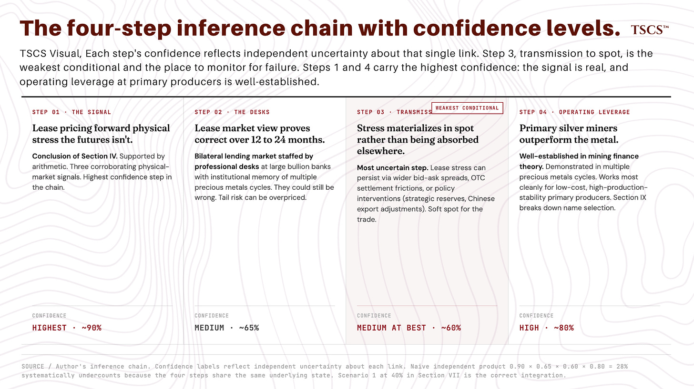](https://substackcdn.com/image/fetch/$s_!LYhu!,f_auto,q_auto:good,fl_progressive:steep/https%3A%2F%2Fsubstack-post-media.s3.amazonaws.com%2Fpublic%2Fimages%2F4cc48fff-121d-4358-b18f-2ec4bbc69a67_1886x1060.png)

Weakest conditional: transmission to spot. Signal is real (three corroborating measurements). Lease market read holds (the institutional infrastructure that produces a real signal also produces correct forward pricing). Transmission is where the trade can break. Persistent scarcity that the lending venue is pricing can in principle be absorbed through wider bilateral bid-ask spreads, OTC physical settlement frictions that prevent metal flow into exchange-traded venues, or sustained policy interventions (strategic reserve announcements, Chinese export adjustments, central bank coordinations) that buffer the spot fixing from underlying scarcity. The bull case requires transmission to operate within the trade’s twelve-month window. If transmission gets pushed out to eighteen or twenty-four months by policy buffering or absorption mechanics, the structural thesis still resolves correctly but the trade window doesn’t. That’s the genuine soft spot. The other three steps are structurally robust if the underlying scarcity thesis is correct.

Position sizing for asymmetric upside doesn’t require high probability when payoff is sufficient. At $80 silver, a position sized to survive a 30% drawdown takes the holder to $56, at the floor of Scenario 3’s $55 to $70 range. Scenario 3 carries 20% probability. Sizing to that drawdown is sizing to a one-in-five outcome, not a worst case. Lower drawdown tolerance, size smaller. Higher Scenario 3 weight than 20%, size smaller still. From that drawdown survival level, the position captures meaningful upside to $110+ at scenario weights that don’t require the bull case to be modal. The convenience yield divergence is a real signal. Not a guarantee.

## **VI. The Diagnostic: What Discharged, What Did Not**

What’s normalized post-squeeze and what hasn’t.

**Normalized.** One-month lease rate at 0.15%, below 5Y average of 1.03%. Three-month lease rate at 0.91%, modestly below 5Y average of 1.04%. EFP spread, normalized to approximately negative $0.43 by mid-February and held inside the normal range since. COMEX silver forward curve in contango at the risk-free rate. Spot silver realized volatility, compressed sharply from January peaks though still above 2024 norms. London market free float partially rebuilt from the September 2025 17% trough to approximately 28% by end-March 2026.

[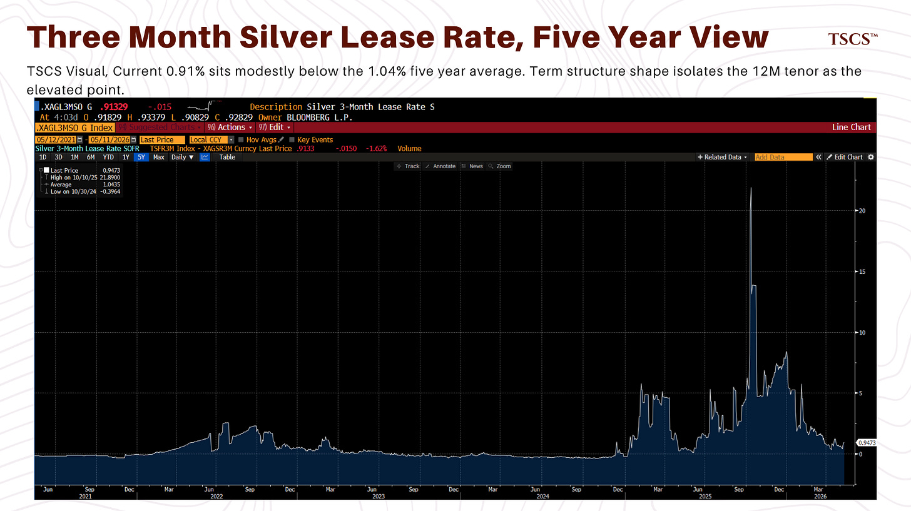](https://substackcdn.com/image/fetch/$s_!5evL!,f_auto,q_auto:good,fl_progressive:steep/https%3A%2F%2Fsubstack-post-media.s3.amazonaws.com%2Fpublic%2Fimages%2F4f6f0da6-65a3-403f-a117-7f954b378224_1888x1060.png)

**Not normalized.** Twelve-month lease rate at 1.63%, 55% above 5Y average of 1.05%. Convenience yield divergence between futures and lease at approximately 200 basis points versus the 30 to 80 basis point range observed on spot-checks of selected 2019, 2021, and 2023 sessions outside acute stress events. Total COMEX silver stocks at 312 Moz, down 220 Moz (41%) from the October 2025 peak of 532 Moz, below the 5Y average of 346 Moz, approaching the November 2023 cycle low of 266 Moz. Registered coverage ratio at 13.4%, below the 15% stress threshold for six consecutive months. Spot silver level at 2.5x five-year average, with the structural revaluation from the pre-thesis baseline intact.

**Probably noise.** PSLV premium-to-NAV currently sits at negative 4.52%, against a five-year average of negative 3.05%. PSLV has traded at a discount essentially the entire post-2020 window, with peak premium of only 0.34% in early 2021 and even the October 2025 and January 2026 squeezes failing to push the fund to a premium. PSLV isn’t a reliable physical bid signal, full stop. The widened-versus-average discount tells me nothing about Western retail demand because PSLV’s price formation reflects ETF arbitrage mechanics, authorized participant flow, and creation/redemption frictions more than underlying physical sentiment. Dropping the inference. “Western retail bid is currently absent” isn’t supported by PSLV either way. American Eagle and Maple Leaf sales data and major dealer inventory turnover are the right places to look. Not pulled for this piece.

[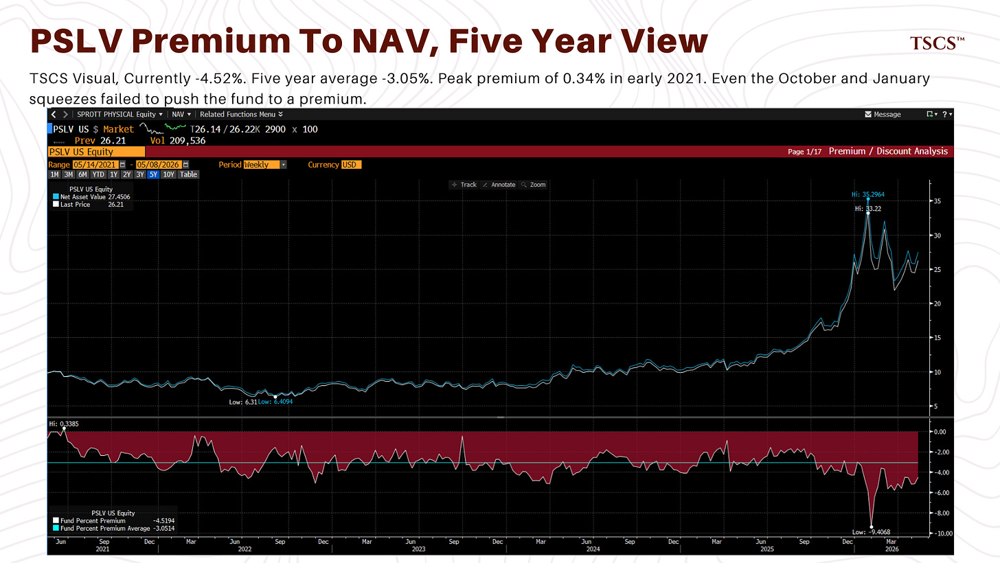](https://substackcdn.com/image/fetch/$s_!_mCU!,f_auto,q_auto:good,fl_progressive:steep/https%3A%2F%2Fsubstack-post-media.s3.amazonaws.com%2Fpublic%2Fimages%2Ffb8663f4-863a-4f19-bdbd-5f30d1d1af0f_1886x1062.png)

Synthesis. Acute physical stress has discharged. Structural repricing has not reversed. The bilateral lending market has permanently repriced forward physical availability higher at the 12-month tenor, generating a 200 basis point convenience yield gap with the futures market that has persisted for six months. Mechanically, this looks like a market that has cleared its leveraged excess but hasn’t resolved its underlying scarcity dynamics. The next squeeze, when it comes, will start from a lower base of speculative positioning but a higher base of lender caution. Combination: market harder to push around with paper, more reactive to physical-flow surprises.

Not the same regime as October 2025. Not the pre-thesis regime of 2023 either. Post-squeeze, structurally tight, lender-cautious market trading at a price that reflects partial repricing without the kind of acute retail bid that historically accompanies confirmed structural breakouts.

[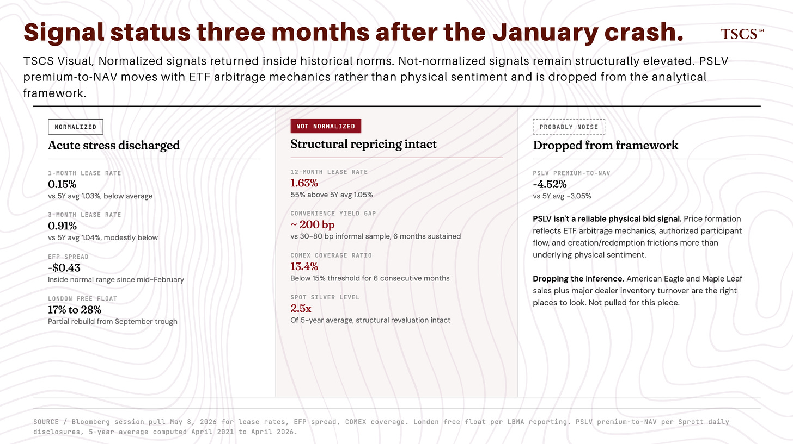](https://substackcdn.com/image/fetch/$s_!bXNu!,f_auto,q_auto:good,fl_progressive:steep/https%3A%2F%2Fsubstack-post-media.s3.amazonaws.com%2Fpublic%2Fimages%2Fdb0506b1-65c2-4f05-9ad8-4ee921ed2bc4_1888x1060.png)

## **VII. Four Scenarios For $80 Silver**

The data doesn’t support a high-conviction directional call. It supports a more honest framing of the distribution than the consensus does.

Spot at $80 sits roughly 33% below the January peak and roughly 2.5 times above the pre-thesis baseline. Structural drivers unchanged. Acute physical stress discharged. Lending market not fully repaired. Deliverable float remains thin. Marginal Western buyer absent.

My distribution of one-year forward outcomes. Weights are subjective, calibrated to the post-squeeze data, the lease curve signal, the bear cases in Section VIII, and historical analogs. Reweight if you read any input differently. The framework matters more than the specific numbers; forcing them to sum to 100 is what makes the discipline useful.

**Scenario 1: Silver rebases higher (40%).** Spot trades into $90 to $120 over the next twelve months. The 12M lease rate elevation prefigures further front-end stress that arrives later in the year, producing a smaller and more orderly repricing higher than the January spike. 40% weight reflects the lease curve signal, the structural deficit drivers that remain intact, and the absence of any visible new supply response. Single largest probability bucket, though Scenarios 1 and 2 are roughly equally weighted and together account for 75% of the distribution.

[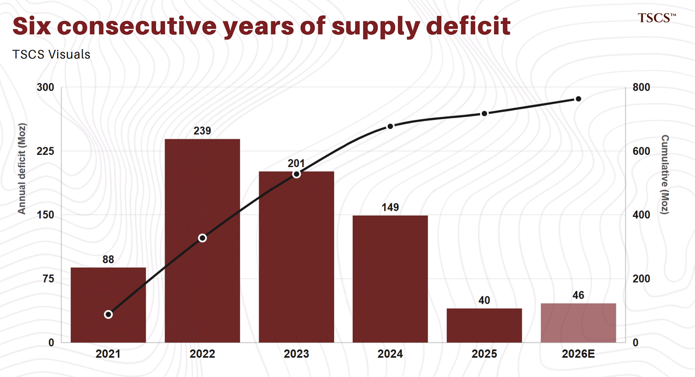](https://substackcdn.com/image/fetch/$s_!IPN7!,f_auto,q_auto:good,fl_progressive:steep/https%3A%2F%2Fsubstack-post-media.s3.amazonaws.com%2Fpublic%2Fimages%2Fea3d9ea3-2315-4146-8c2a-8b7871270369_2048x1112.png)

**Scenario 2: Silver consolidates around current levels (35%).** Spot trades in $70 to $90. Structural drivers operate slowly enough that no near-term catalyst emerges. Market spends 2026 absorbing the January overshoot. Physical buying gradually returns as the post-crash absence of retail bid normalizes. 35% is the eyeball base rate for post-squeeze commodity markets consolidating before resolving direction. Not computed off a rigorous analog set.

**Scenario 3: Silver retests lower (20%).** Spot drops into $55 to $70. The recession path. A global recession compresses industrial demand, and the demand softness already in WSS 2026 base case (industrial fabrication down 3% in 2025, projected to fall further in 2026, PV demand down 19% in 2026) accelerates further. Structural thesis remains intact but the timeline gets pushed out by two to three years. 20% weight higher than the consensus bull would assign and reflects honest engagement with the substitution risk I covered at length in *800 Million Ounces Short*.

**Scenario 4: Silver retests the high (5%).** Spot exceeds $120. Requires another physical squeeze comparable in magnitude to October or January within twelve months. The 12M lease rate elevation is a precondition, not sufficient. A specific catalyst required: delivery failure at a major COMEX expiration, a Chinese export action that significantly reduces refined silver flowing to London, a US strategic reserve announcement with specific dollar figures, or a counterparty failure in the bilateral lending market that triggers a forced unwind. 5% reflects that none of these catalysts are currently visible.

Probabilities sum to 100. Dominant probability mass sits in Scenarios 1 and 2, which together account for 75%. Both consistent with the structural thesis. Scenario 3 is real and shouldn’t be dismissed. Scenario 4 is the upside tail that justifies position sizing. Not the base case driving it.

[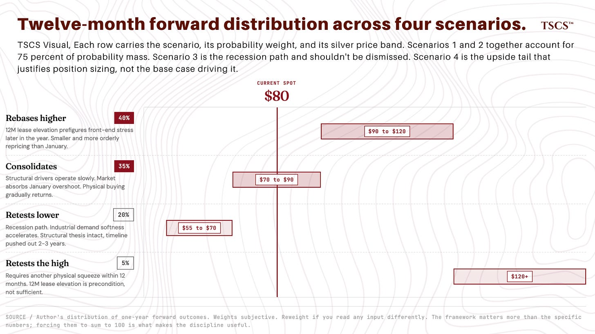](https://substackcdn.com/image/fetch/$s_!LybM!,f_auto,q_auto:good,fl_progressive:steep/https%3A%2F%2Fsubstack-post-media.s3.amazonaws.com%2Fpublic%2Fimages%2F3f33d2b9-cc9b-474b-8c99-f9a1cb72f9e7_1888x1060.png)

Conclusions are sensitive to modest reweighting. Take 10 points from Scenario 1 and add them to Scenario 2: modal outcome becomes consolidation rather than rebase, miners trade weakens to a smaller and slower asymmetry. Take 5 points from Scenario 1 and add them to Scenario 3: asymmetric upside still exists but the case for sizing aggressively softens further. These are my weights. A higher base rate for post-squeeze commodity consolidation than my 35% shifts the trade conclusion, not the framework.

What shifts these weights.

**Toward 1 or 4:** print of the 12M lease rate above 2% within ninety days, meaningful drawdown in COMEX registered silver below 60 Moz, Shanghai premium reading sustained above its current 10 to 15% range for two weeks, US strategic reserve announcement, delivery failure at the July or September COMEX contract.

**Toward 2:** gradual softening of the 12M lease rate back toward 1.2% through summer, flat COMEX registered inventory trajectory and coverage ratio rebuilding above 16%, convenience yield gap compressing back toward 80bps.

**Toward 3:** meaningful Chinese solar installation slowdown in monthly data, commercial copper-plating production announcement from a tier-one solar manufacturer with mass production within twelve months, gold-silver ratio expansion above 70, an industrial customer announcing a multi-year silver substitution program with credible engineering details.

## **VIII. How I Might Be Wrong**

The structural silver case has four substantive bear arguments worth taking seriously.

**Thrifting wins the race.** Solar manufacturers have already reduced silver loadings per cell from approximately 60 mg/W in 2010 to roughly 10 mg/W today. Copper-plating roadmaps from Longi, Jinko Solar, and Shanghai Aiko target 2026-2027 mass production. WSS 2026 already reports PV silver demand down 6% in 2025 and projected down a further 19% in 2026 to 151 Moz, the steepest decline ever recorded. If the pace continues, photovoltaic silver demand could plateau at 130 to 150 Moz rather than the 250+ Moz the prior bull case assumed. That removes 60 to 100 Moz from the demand trajectory and narrows the deficit meaningfully. In *800 Million Ounces Short* I assigned roughly 25 to 30% probability to a faster-than-expected thrifting outcome within five years. WSS 2026 has now elevated this risk into the official base case. The silver bulls who think solar demand is bulletproof haven’t read the report.

[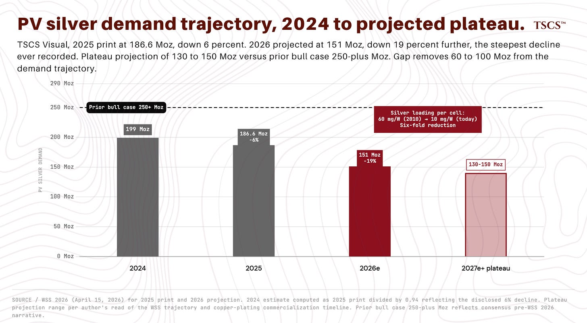](https://substackcdn.com/image/fetch/$s_!IOjx!,f_auto,q_auto:good,fl_progressive:steep/https%3A%2F%2Fsubstack-post-media.s3.amazonaws.com%2Fpublic%2Fimages%2F725067d2-840a-480c-aef4-b25b978411b8_1888x1040.png)

**Substitution beyond solar.** The palladium analog is the relevant precedent. Palladium ran thirteen consecutive years of structural deficits, prices surged from $600 to $3,429, and then automakers substituted platinum at a rate exceeding 600,000 ounces per year and palladium collapsed 76% from its peak. Substitution risk for silver is real. The demand surface is broader than palladium’s was. Breaking silver through substitution would require simultaneous displacement across solar, electronics, semiconductor packaging, EV electrical systems, and grid infrastructure. Engineering constraints and timelines differ across each application. Possible. Materially more difficult than palladium’s path.

**The crowded trade and recession risk.** Managed money net long positioning on COMEX has been elevated. The January crash was caused by leveraged positioning unwinding under margin call pressure, not by any change in fundamentals. A global recession would simultaneously reduce industrial demand, trigger liquidation of speculative positions, and temporarily overwhelm the structural deficit with demand destruction. Silver fell from $21 to $9 in 2008. A meaningful recession could produce a 30-40% drawdown from current levels even with the structural thesis fully intact. The structural floor is higher than in 2008 because the industrial demand base is much larger, the critical mineral designation provides policy backing, and ETF holders in India and Europe have proven stickier than US retail. Floor is not $90.

**Policy reversal risk.** The Chinese export licensing regime is bullish in direction, but it’s reversible. If Beijing’s strategic calculus shifts, the 1,500 to 2,500 tonnes annually of Chinese refined silver the licensing constrains could return to global supply chains within months. The US critical mineral designation is also a policy decision rather than a physical constraint, and a future administration could deprioritize it without legislative effort. Neither reversal is the base case, but treating either as permanent is analytically lazy.

None of these risks, individually, invalidates the structural thesis within three to five years. They’re positively correlated. The conditions that accelerate thrifting are the same conditions that incentivize substitution in electronics and increase scrap supply. A recession arriving alongside those price-driven responses could collectively close the deficit by 2028 or 2029. The combined scenario is more probable than any individual one.

Bear cases above: 3-to-5-year horizon. Section VII scenarios: 12 months. The 20% I assigned to Scenario 3 (”Silver retests lower, $55 to $70”) incorporates the recession path only, because copper-plating commercialization at industrial scale and meaningful demand-side substitution beyond solar are unlikely to play out inside twelve months even on aggressive timelines, though the trajectory is already established. The thrifting and broader substitution risks above are mostly tail mass beyond the Section VII horizon, not weight already inside the 20%. A reader holding a 3-to-5-year view marks down the 12-month bull case probabilities further than Section VII does. A reader trading the 12-month window treats the bear cases above as monitoring catalysts that shift the distribution rather than as priced-in risks.

[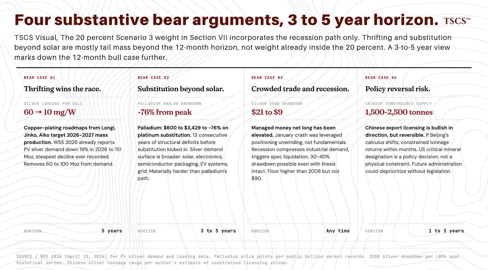](https://substackcdn.com/image/fetch/$s_!TrGk!,f_auto,q_auto:good,fl_progressive:steep/https%3A%2F%2Fsubstack-post-media.s3.amazonaws.com%2Fpublic%2Fimages%2Fe50c17eb-9bf3-4bab-b080-4ba7f381530f_1888x1048.png)

That’s the bear case. Not decisive at $80 silver. Any position sizing that doesn’t account for it is incomplete.

## **IX. The Miners Math**

The structural conditions translate into a specific opportunity at the equity level. The case is operating leverage. The argument isn’t novel. The thesis that primary silver miners outperform silver during sustained bull markets is established in mining finance literature and has been articulated repeatedly across multiple precious metals cycles. What’s novel is the specific shape of the embedded-price disconnect at this point in the cycle, and the fact that the cleanest historical analog (gold miners 2009 to 2011) argues the realized outperformance is smaller than the AISC arithmetic suggests. Half the precious metals research industry will hate the conclusion of this section. Their job depends on the opposite being true.

Definitional point first. “Primary silver miner” is industry shorthand for a company classified as silver-primary by index providers and the sell-side, not a guarantee that silver is the majority of revenue. Pan American Silver derives more revenue from gold than from silver at current prices. Hecla Mining derives substantial revenue from base metals. Their reported AISCs reflect byproduct credits that depend on non-silver commodity prices, not pure silver cost discipline. A 5x or 25x operating leverage figure computed off a byproduct-credit-subsidized AISC isn’t a pure silver leverage figure. The cleanest operating leverage exposure sits at names where silver is 70%+ of revenue and AISC isn’t heavily dependent on gold or base metal credits. That subset is much smaller than the SIL holdings list.

The basket itself is structurally diluted. As of May 2026, Global X Silver Miners ETF (SIL) top holdings include Wheaton Precious Metals at 21.53%, Pan American Silver at 12.83%, Coeur Mining at 10.38%, First Majestic Silver at 4.92%, Hecla Mining at 4.64%, OR Royalties at 4.23%. Largest holding is a streamer, not a primary miner. Streamers buy the right to a percentage of mine output at fixed prices and don’t have operating leverage to silver the way primary miners do. WSS 2026 reports only approximately 28% of 2026 mine production is expected to come from primary silver mines; the rest is byproduct of copper, lead, zinc, and gold operations. The “silver miners” category is heterogeneous on its face, and basket exposure conflates very different operating profiles. If you bought SIL last October on the silver thesis you didn’t buy silver miners. You bought a streamer, three Mexican base metal byproduct stories, and a handful of actual primary producers diluted to roughly 30% of the portfolio. That’s not the trade.

[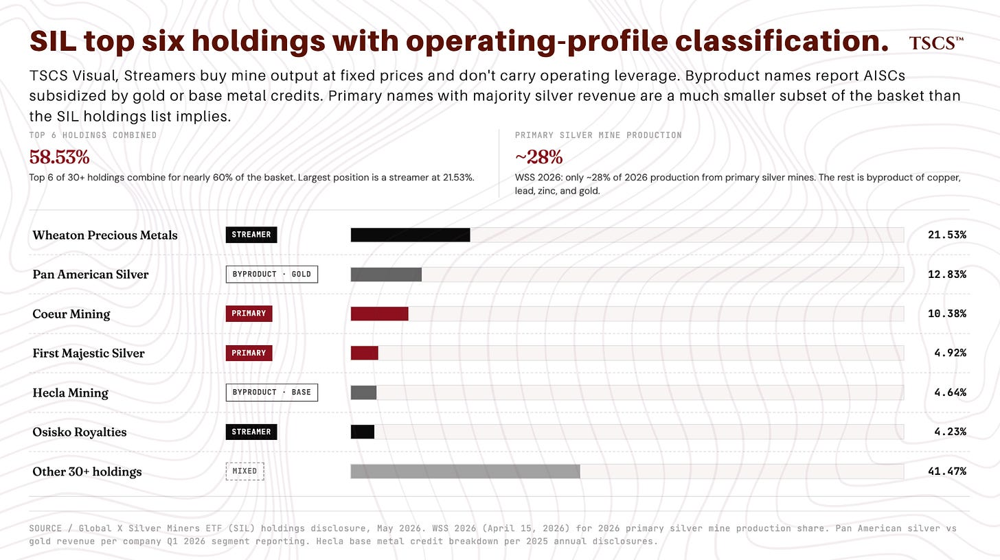](https://substackcdn.com/image/fetch/$s_!o1FU!,f_auto,q_auto:good,fl_progressive:steep/https%3A%2F%2Fsubstack-post-media.s3.amazonaws.com%2Fpublic%2Fimages%2F9e5f5bdb-daba-4c9f-9d97-808347e1474f_1888x1058.png)

Surface data first. It’s initially confusing.

Silver has returned approximately 150% over the last twelve months, from roughly $32 to $80. Over the same period, SIL has returned approximately 131 to 178% depending on the window, and SILJ has returned approximately 154 to 190%. On a headline basis, miners have outperformed silver by 0 to 36 percentage points depending on endpoints. Miners have repriced substantially in absolute terms. The basket has captured roughly 1.0 to 1.2x silver’s return, not the 3 to 8x operating leverage theory predicts at industry-current cost dispersion.

AISC dispersion across primary silver producers is the widest of the post-2020 cycle. Q1 2026 prints where available, Q3 2025 elsewhere:

**Pan American Silver:** $6.63 silver-segment AISC in Q1 2026 (down from $13.88 in Q1 2025), heavily subsidized by gold by-product credits at $4,800+ gold and increased contribution from low-cost Juanicipio ounces. Company’s own forward guidance puts Q4 2026 silver AISC back at $18.50 to $20.75. The Q1 print isn’t a sustainable run rate. Precise illustration of why pure-silver operating leverage comparisons computed off byproduct-credit-subsidized AISC mislead: a 45%+ gold rally has flattered the headline figure in ways that fully reverse if gold corrects. Use Q4 guidance for forward operating leverage modeling, not Q1 print. Anyone modeling Pan American as a $6 AISC miner is going to look stupid in three quarters.

**Hecla Mining:** $11.28 AISC in 2025 after by-product credits.

**Coeur Mining:** $20.01 adjusted silver costs applicable to sales in Q1 2026.

**First Majestic Silver:** FY2026 AISC guidance of $26.15 to $27.91 per AgEq ounce.

**Endeavour Silver:** guided $27 to $28.

**Santacruz Silver:** $35.62 in latest reported quarter.

[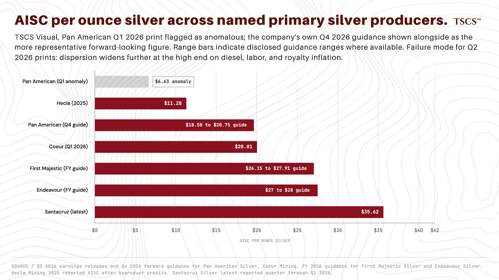](https://substackcdn.com/image/fetch/$s_!gX5d!,f_auto,q_auto:good,fl_progressive:steep/https%3A%2F%2Fsubstack-post-media.s3.amazonaws.com%2Fpublic%2Fimages%2F39e8dd29-6872-4500-b843-c052af4b6392_1888x1060.png)

Range is approximately $7 to $36 if you include Pan American’s Q1 anomaly, or approximately $11 to $36 if you exclude it and use forward guidance. Dispersion has widened, not narrowed, over the past two reporting periods. Failure mode: if Q2 2026 prints come in 15 to 20% above guidance on diesel, labor, and royalty inflation across multiple flagship names simultaneously, dispersion widens further at the high-cost end. Low-cost producers retain positive economics with compressed margins. High-cost producers at $35+ AISC see negative cash margins at any silver price below their fully-loaded cost, killing operating leverage at the top of the cost curve entirely rather than weakening it. Dispersion-widening, not dispersion-narrowing, is the actual Q2 risk.

Operating leverage arithmetic at three illustrative cost points, using the forward-looking AISC range rather than the byproduct-credit Q1 prints.

At AISC of $18 (low-cost primary producer with meaningful gold credits), silver moving from $32 to $80 expands gross margin per ounce from $14 to $62. A 4.4x increase in unit profitability.

At AISC of $25 (mid-cost primary producer), silver moving from $32 to $80 expands gross margin per ounce from $7 to $55. A 7.9x increase in unit profitability.

At AISC of $32 (higher-cost primary producer), silver moving from $32 to $80 expands gross margin per ounce from approximately $0 to $48. Leverage approaches infinity at the high-cost end because pre-expansion margin was approximately zero, but in practice these names trade as call options on silver rather than continuous operating leverage.

[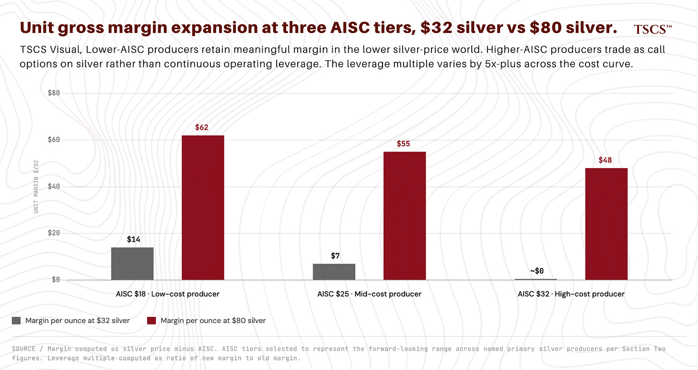](https://substackcdn.com/image/fetch/$s_!ENzu!,f_auto,q_auto:good,fl_progressive:steep/https%3A%2F%2Fsubstack-post-media.s3.amazonaws.com%2Fpublic%2Fimages%2F75848392-0df6-40c8-a93d-34d8100c14a4_1888x1002.png)

Embedded operating leverage in silver miner equity isn’t a single number. It’s a distribution that varies dramatically by AISC. The headline “miners have leverage to silver” obscures that some miners have 4x leverage and some have 25x+ to the same underlying price move.

Against this backdrop of 4 to 25x+ unit profitability expansion, SIL up 131 to 178% versus XAGUSD up 148 to 154% is a return ratio of approximately 0.95 to 1.2x. Trailing 52-week weekly regression beta of SIL to XAGUSD is approximately 0.9 raw, with R-squared in the moderate 0.6 to 0.7 range. Beta below one. Headline outperformance, where it exists, is alpha rather than amplified leverage. Opposite of what fixed-cost operating leverage theory predicts.

[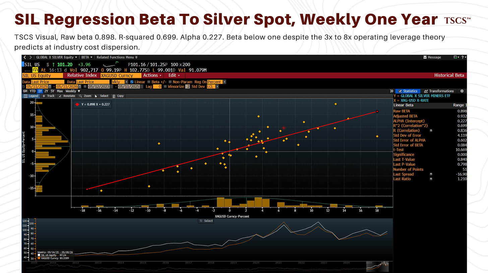](https://substackcdn.com/image/fetch/$s_!HpEF!,f_auto,q_auto:good,fl_progressive:steep/https%3A%2F%2Fsubstack-post-media.s3.amazonaws.com%2Fpublic%2Fimages%2F6f99aa3b-f343-4960-b4ce-c708f3c562ff_1886x1058.png)

Regression caveats: 52 weeks is a short window with around 50 data points, R-squared sits moderate, and the highly significant alpha could be period-specific rather than a stable feature. A longer window or different specification could move the beta and alpha. The directional conclusion (SIL hasn’t captured 3x to 8x operating leverage) is robust across reasonable specifications. The specific point estimate is window-dependent.

Two possible interpretations.

First: the market has only partially priced the underlying margin expansion and the catch-up is the trade. Second: the market has priced the basket correctly and the AISC arithmetic is the wrong model for predicting equity returns. Three reasons the first interpretation might be right, one reason the second simply is.

Three reasons the gap exists, each affecting different names differently.

**Costs aren’t fixed.** AISC has been rising across the industry, driven by diesel, labor, explosives, steel, and royalty payments that scale with revenue rather than profit. Cost inflation has eaten some of the leverage. How much varies considerably by jurisdiction (Mexican peso labor versus Peruvian sol labor versus Canadian dollar labor produces different cost trajectories) and by operational efficiency (declining grades at flagship operations forces more rock processed per ounce produced).

**Production isn’t stable.** Several major silver miners have experienced operational disappointments over the last twelve months. Fresnillo has had grade decline issues at Saucito and Fresnillo proper. Pan American’s Escobal mine in Guatemala remains suspended pending consultation with indigenous communities. First Majestic has had production guidance revisions at San Dimas and Santa Elena. The product of “ounces produced” times “margin per ounce” matters more than either in isolation, and several flagship names have seen the volume side decline while the margin side expanded.

**Equity markets price expected future cash flows, not current snapshots.** If consensus analysts modeled silver going from $32 to $50 a year ago, miners would already be partially priced for that margin expansion. The question is what silver price is currently embedded in consensus 2026 EPS estimates and consensus NAV calculations. Public sell-side coverage for primary silver producers generally lags realized spot prices in the modeling assumptions, particularly during fast moves. If consensus assumptions sit anywhere well below realized spot, the names where the gap is widest and operational reliability is strongest are the names where the most repricing remains.

Fourth possibility, the null hypothesis: the market may be pricing the basket correctly. A 0.95 to 1.2x return ratio with rising AISC, declining grades at flagship operations, Mexico-Peru-Bolivia jurisdictional risk premia, hedge book drag at several major names, and the optionality differential between metal and equity isn’t obviously wrong. “Miners are underpriced for $80 silver” and “market is correctly discounting the operational and jurisdictional drags” are observationally identical at the basket level. The only thing that distinguishes them is what consensus models are actually using for forward silver prices. Concluding the efficient pricing interpretation is right isn’t refuting the structural silver thesis. It’s concluding miners aren’t the vehicle for it.

The 2009 to 2011 gold analog is the cleanest historical precedent and it cuts against the conclusion this section is building toward. Gold rose from approximately $880 in January 2009 to a peak above $1,900 in August to September 2011, roughly a 115 to 120% return. HUI gold miner index returned roughly 110 to 120% over the same window depending on exact endpoints. During the cleanest two-and-a-half-year precious metals bull market of the modern era, gold miners didn’t meaningfully outperform the metal. Operating leverage theory predicted 3x to 8x outperformance. Reality delivered approximately 1x. Reason: gold miner AISC was rising sharply during the bull market as diesel, labor, and declining grades all worked against fixed-cost assumptions, and consensus models lagged the realized gold price throughout the move rather than at any single resolution point. The catch-up trade in gold miners operating leverage proponents point to came largely after the metal peaked in late 2011, with the strongest miner outperformance running into early 2012 before the broader bear market began.

[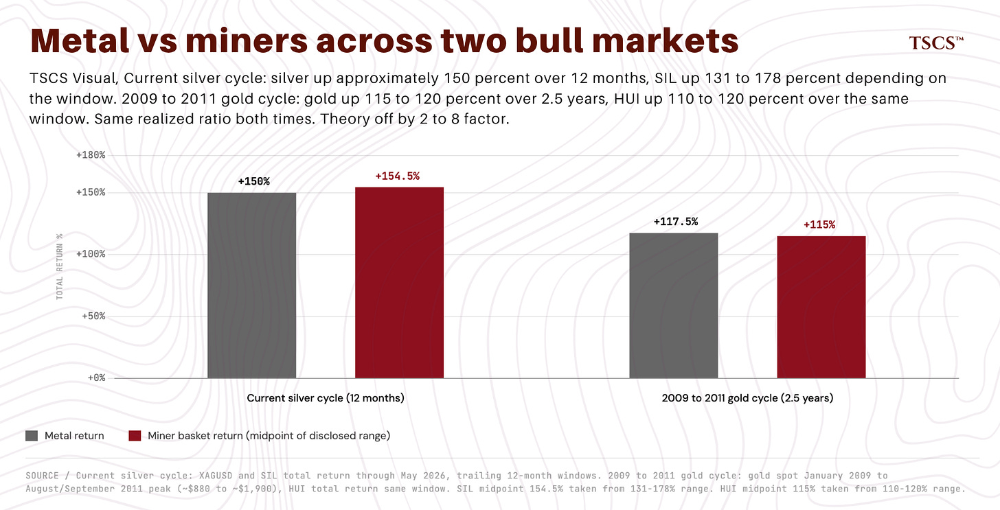](https://substackcdn.com/image/fetch/$s_!9Z10!,f_auto,q_auto:good,fl_progressive:steep/https%3A%2F%2Fsubstack-post-media.s3.amazonaws.com%2Fpublic%2Fimages%2Fafad9576-9e10-4350-bdac-762131c8ea8d_1888x964.png)

The 2009 to 2011 comparison is imperfect because the silver miner universe today differs from the gold miner universe of that period in scale, jurisdiction concentration, and capital structure. Silver miners are smaller, more Mexico-Peru-Bolivia concentrated, and operationally more variable than the major North American and South African gold majors that dominated HUI in 2009 to 2011. Two of those differences could conceivably work in favor of silver miners this cycle: smaller market cap means consensus model lag is more likely to persist longer because sell-side coverage is thinner, and the smaller universe means dispersion picking has more room to add value than basket exposure. The third difference, jurisdictional concentration in higher-risk geographies, cuts the other way and is part of why the silver miner basket today carries discounts the gold miner basket didn’t.

The analog is binding. The cleanest historical precedent for a sustained precious metals bull market shows the miner basket delivering approximately 1x beta to the metal, not the 3x to 8x operating leverage theory predicts. Reasons (rising AISC during the bull, consensus model lag persisting through the move rather than resolving) apply to silver miners today at least as much as they applied to gold miners then. Category-level miner trade isn’t the asymmetric exposure it appears to be on AISC arithmetic alone. The trade is name-specific or it isn’t a trade. SIL outperforming XAG by another 30 to 50 percentage points over twelve months requires a small number of specific names delivering returns that drag the basket against the headwind of the basket’s other holdings that don’t capture leverage. Category bet is structurally weak. Dispersion bet is what remains.

If the analog applies, the current setup is the “miners catching up” phase, not the “miners leading” phase. Silver has done its repricing; miners have done part of theirs. Remaining catch-up lives in specific names where consensus models lag realized economics, jurisdictional risk is priced in rather than ignored, and operational reliability is intact. SIL contains 30+ holdings including some pure-play primary producers, some byproduct producers, some streamers, and some developers. The mix dilutes the operating leverage that pure primary producers offer. Buying SIL gets partial credit on the trade. Buying the right three or four names gets full credit.

For a reader holding this piece in isolation: no actionable recommendation. The basket bet is structurally weak per the gold analog. The name selection bet requires the company-level work I’ve deferred. Two coherent options: wait for the next piece, or take silver exposure through the metal and accept the lower beta in exchange for not betting on dispersion capture. Both defensible. What this piece doesn’t support: buying SIL or SILJ as a category expression of the structural thesis. The analog argues the basket will likely deliver close to 1x silver beta, not the multiples AISC arithmetic implies.

## **X. What I Am Watching**

Five signals will determine which Section VII scenario plays out and whether the miners thesis continues to make sense.

[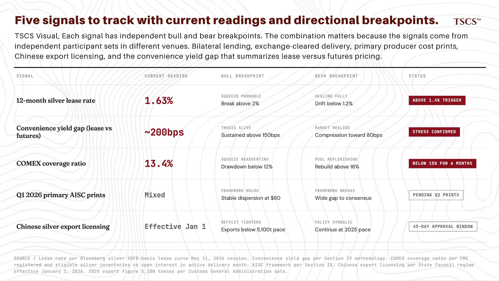](https://substackcdn.com/image/fetch/$s_!S8zr!,f_auto,q_auto:good,fl_progressive:steep/https%3A%2F%2Fsubstack-post-media.s3.amazonaws.com%2Fpublic%2Fimages%2Ff7b6f523-2603-43db-8cba-4487db63687b_1888x1064.png)

**The twelve-month silver lease rate** is the most important single signal. As long as it sits above 1.4%, the bilateral lending market is pricing forward physical risk the futures market isn’t. A break above 2% would mean the bull case is resolving and another squeeze is probable within ninety days. A drift back to 1.2% over the summer would mean the market is healing fully and the post-squeeze regime is more benign than I argue.

**The convenience yield gap between futures and lease,** currently approximately 200 basis points, is a useful summary metric. Sustained gap above 150bps argues the structural thesis is alive. Compression toward 80bps argues the market is healing fully.

**COMEX silver inventory.** Total stocks at 312 Moz as of May 8, 2026, down from the October 2025 peak of 532 Moz and below the 5Y average of 346 Moz. Registered coverage ratio at 13.4%, below the 15% stress threshold for six consecutive months. A break of total stocks below the November 2023 cycle low of 266 Moz signals the bleed is accelerating; the squeeze is reasserting itself through physical flow rather than just paperwork. A rebuild back above the 5Y average plus registered coverage above 16% signals the squeeze is healing.

**Q1 2026 primary silver producer cost prints** are the first concrete test of the Section IX operating leverage framework. Framework depends on AISC dispersion across the silver producer universe remaining stable enough that low-cost names retain meaningful margin expansion at $80 silver. Q1 prints so far mixed. Pan American’s $6.63 anomaly is gold credits, not silver cost discipline. Q2 prints will be more informative once gold normalizes its byproduct-credit contribution.

**Chinese export licensing implementation** is the wild card. Regime took effect January 1, 2026. Operational impact will only become clear over the next two to three quarters as approved exporters work through the 45-day-plus regulatory process. If Chinese silver exports to the West fall meaningfully below 2025’s 5,100-tonne 16-year high, the supply side of the deficit tightens. If exports continue at 2025 pace despite the new framework, the policy ended up more symbolic than operational.

**Explicit falsification criteria.** If within ninety days the following three conditions are simultaneously met, the structural tightness thesis is wrong and the trade should be exited: the 12-month silver lease rate falls below 1.2%, AND the COMEX coverage ratio rebuilds above 16%, AND the Shanghai premium compresses to its post-2020 normal range on a like-for-like basis. If two of three trigger, the thesis is meaningfully weakened and position sizing should be cut by half. If one of three triggers, the thesis is on watch but intact. The combination matters because the three signals come from independent participant sets in different venues. All three softening simultaneously requires either coordinated relief across the bilateral lending, exchange-cleared delivery, and Chinese physical venues, or a genuine resolution of the underlying scarcity. Either way, the bear case is clean.

[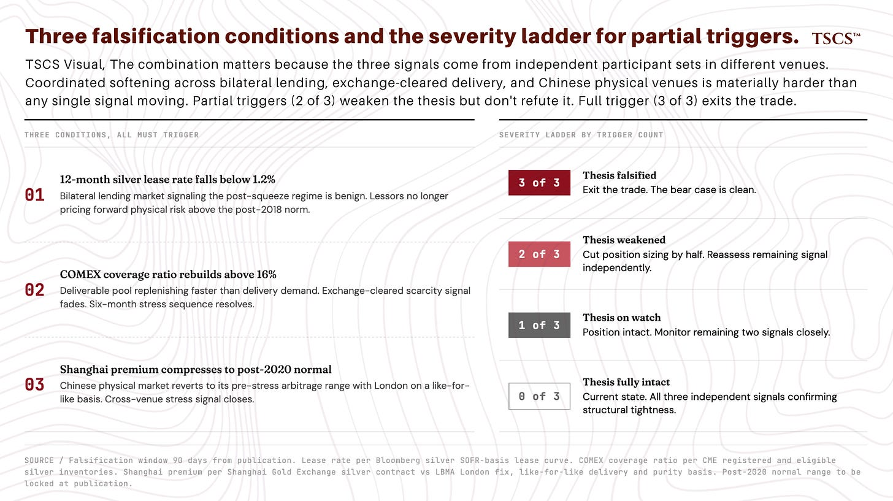](https://substackcdn.com/image/fetch/$s_!GAKQ!,f_auto,q_auto:good,fl_progressive:steep/https%3A%2F%2Fsubstack-post-media.s3.amazonaws.com%2Fpublic%2Fimages%2F46c50ff4-e032-479b-b4f1-83c21ee423e3_1886x1058.png)

Ambient context, less directly relevant: the gold-silver ratio (currently approximately 47), PSLV premium-to-NAV (currently negative 4.52%, dropped from the diagnostic per Section VI), and Shanghai Gold Exchange silver premium to London (basis to be locked before publication, directional signal aligned with the bilateral lending and exchange-cleared scarcity readings per Section III).

## **XI. What Comes Next**

Three claims.

First, the squeeze that drove silver from $80 to above $120 in two months discharged its acute phase but didn’t resolve its structural conditions. Futures market is pricing convenience yield near zero. Lease market is pricing convenience yield at approximately 1.97% at the 12-month tenor. COMEX warehouses have bled 220 Moz of total stocks from the October 2025 peak to May 2026, with registered coverage below the 15% stress threshold for six consecutive months. Shanghai Gold Exchange silver contract is trading at a premium to London well above its post-2020 norm. Three of these four signals are aligned. The futures curve at the risk-free rate is the outlier, and the outlier is the signal.

[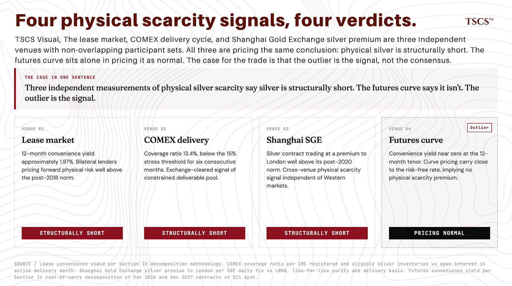](https://substackcdn.com/image/fetch/$s_!Eh2X!,f_auto,q_auto:good,fl_progressive:steep/https%3A%2F%2Fsubstack-post-media.s3.amazonaws.com%2Fpublic%2Fimages%2Ffc98d29e-5645-42e2-80df-a61a6e7826d2_1888x1056.png)

Second, the inference chain from that divergence to a trade is multi-step but not multiplicative. The four steps are conditional views of one underlying state of the world (structural silver tightness thesis being correct), not independent draws. The 40% Scenario 1 probability is the right integration. Trade is asymmetric rather than high-conviction. Soft spot: transmission from lender pricing to spot price within the twelve-month window.

Third, the operating leverage math at the category level shows miner equities have absorbed substantially less of the underlying unit profitability expansion than AISC arithmetic implies they should, with the realized SIL-to-XAG return ratio of approximately 0.95 to 1.2x and a trailing 52-week regression beta below one sitting well below the 3x to 8x that fixed-cost leverage theory predicts. The 2009 to 2011 gold analog argues most of that gap is structural rather than a mispricing waiting to be corrected. Remaining asymmetry lives in specific names, not the basket, because AISC dispersion across the silver producer universe runs from approximately $11 to $36 on forward guidance (or $7 to $36 if you include Pan American’s Q1 2026 anomaly) and basket weights don’t differentiate.

The next piece is the company-level work. Framework is three-dimensional: operating leverage at $80 silver versus consensus model embedded silver price (which names are still being modeled well below realized spot), country risk concentration (Mexico, Peru, Bolivia, and the smaller number of safer jurisdictions), and operational risk (production trajectories, grade decline, hedge book exposure, byproduct credit dependency). Names that score well on all three dimensions are the trade. Names that look cheap on operating leverage but score poorly on country risk or operational reliability are value traps.

I’ll cover primary producers, royalty and streaming companies, and a small set of developer and junior names. I’ll identify which names within the SILJ basket are vulnerable to consensus revisions rather than candidates for further upside, because category-level exposure to junior silver miners conflates very different risk profiles. Whether any of those names rises to a structural short call versus an “avoid” call depends on the specific operating and balance sheet details. Next piece.

Three independent measurements of physical silver scarcity say silver is structurally short. The futures curve says it isn’t. Pick a side. Pretending the gap isn’t there is the worst trade in the room.

---

## **Methodology Appendix**

[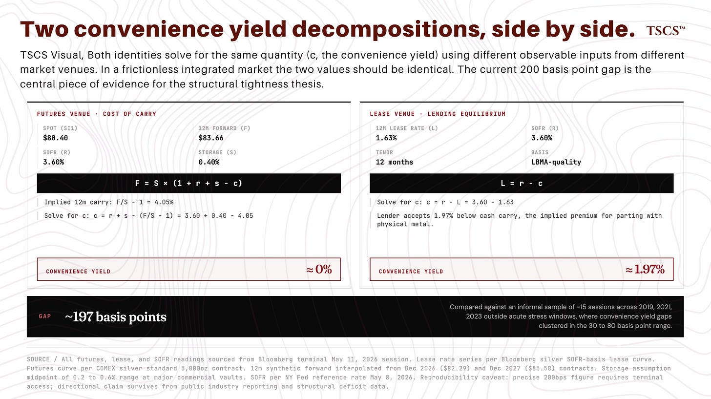](https://substackcdn.com/image/fetch/$s_!GxD4!,f_auto,q_auto:good,fl_progressive:steep/https%3A%2F%2Fsubstack-post-media.s3.amazonaws.com%2Fpublic%2Fimages%2F572ab9e0-99c8-4678-9731-3cbf8f415c48_1886x1058.png)

The convenience yield decomposition in Section IV depends on specific market data inputs that aren’t publicly reproducible. Inputs and assumptions:

**Data source.** All futures, lease, and SOFR readings sourced from Bloomberg terminal on the May 11, 2026 session. The lease rate series is the standard Bloomberg silver SOFR-basis lease curve; the futures curve is COMEX silver standard 5,000oz contract.

**Tenor matching.** The 12-month convenience yield comparison is constructed by interpolating between the Dec 2026 ($82.29) and Dec 2027 ($85.58) futures contracts to a synthetic May 2027 forward price of approximately $83.66, which produces an annualized carry from SI1 ($80.40) of approximately 4.05%. The 12-month lease rate of 1.63% is matched against this 12-month synthetic forward.

**Storage assumption.** LBMA-quality silver storage at major commercial vaults runs roughly 0.2 to 0.6% per year. Midpoint of 0.4% used in the headline decomposition, with sensitivity acknowledged across the range.

**SOFR reference.** 3.6% per NY Fed reference rate, May 8, 2026 reading.

**Convenience yield identity.** Futures decomposition uses the standard storable commodity cost-of-carry identity: F = S × (1 + r + s - c), solved for c. Lease decomposition uses the equilibrium identity for storable commodity lending: L = r - c, solved for c. In a frictionless integrated market, the two c values should converge.

**Historical context.** The 200 basis point figure is compared against an informal sample of approximately fifteen trading sessions across 2019, 2021, and 2023 outside acute stress windows. Sample produced convenience yield gaps clustering in the 30 to 80 basis point range. Sample too small to support a percentile claim about the current reading; the directional claim that 200 is much wider survives. A continuous decomposition across the post-2018 window is planned as a follow-up.

**Reproducibility caveat.** The specific 200 basis point figure is a Bloomberg-terminal result. The directional claim (gap materially wider than the post-2018 normal range, with the lease venue capturing physical scarcity that the futures venue isn’t absorbing) is independently supportable from public industry reporting and structural deficit data. The precise magnitude requires terminal access to verify.